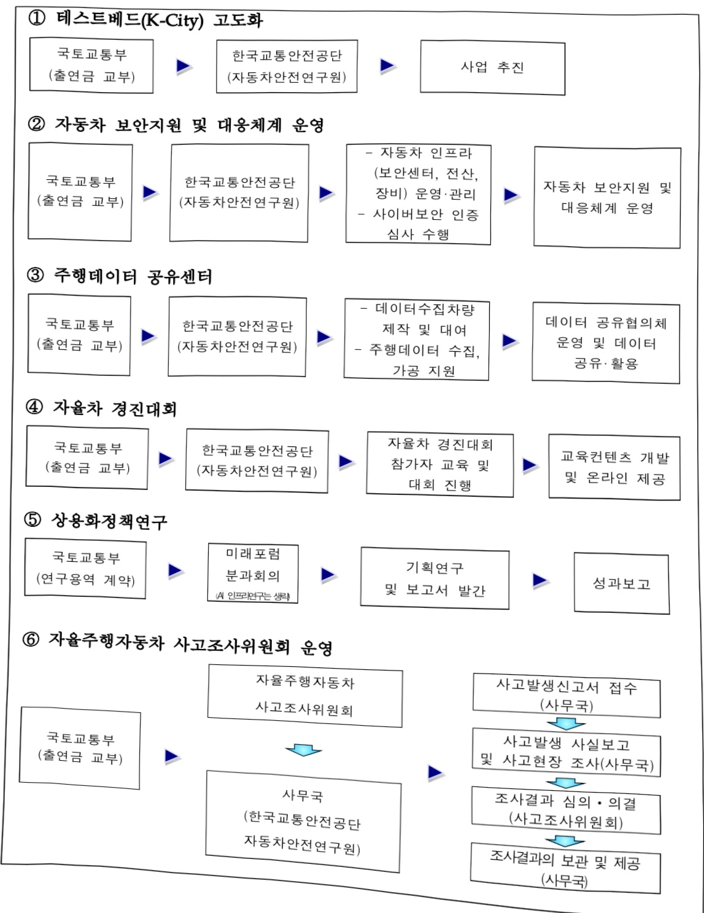
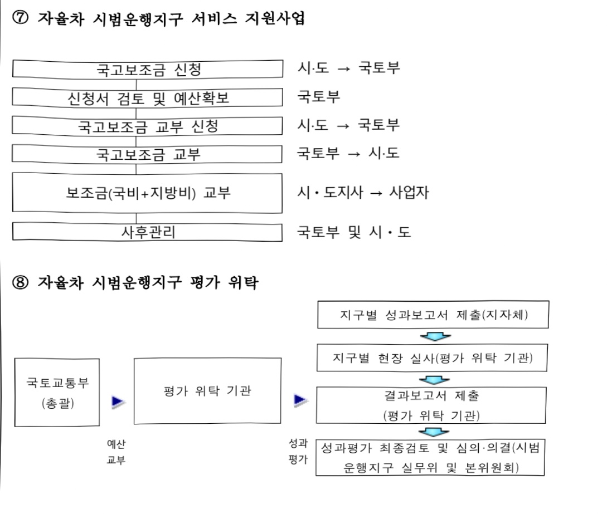
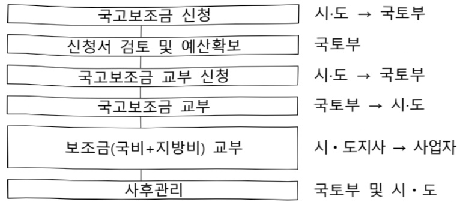

# 자율자동차 상용화

**해당 페이지**: PDF 2422 ~ 2442 쪽 해당

**부처**: 국토교통부
**분야**: 교통 및 물류
**회계유형**: 일반회계
**2026 확정예산**: 9829.0 백만원
**전년대비 증감률**: 5.1%
**AI 도메인**: 데이터, 보안/사이버, 교통/모빌리티, 교육/인재

---

<table border=1 style='margin: auto; word-wrap: break-word;'><tr><td style='text-align: center; word-wrap: break-word;'>사 업 명</td></tr><tr><td style='text-align: center; word-wrap: break-word;'>(5) 자율자동차상용화 (4633-319)</td></tr></table>

□ 사업 코드 정보

<table border=1 style='margin: auto; word-wrap: break-word;'><tr><td style='text-align: center; word-wrap: break-word;'>구분</td><td style='text-align: center; word-wrap: break-word;'>회계</td><td style='text-align: center; word-wrap: break-word;'>소관</td><td style='text-align: center; word-wrap: break-word;'>실국(기관)</td><td style='text-align: center; word-wrap: break-word;'>계정</td><td style='text-align: center; word-wrap: break-word;'>분야</td><td style='text-align: center; word-wrap: break-word;'>부문</td></tr><tr><td style='text-align: center; word-wrap: break-word;'>코드</td><td rowspan="2">일반회계</td><td rowspan="2">국토교통부</td><td rowspan="2">모빌리티자동차국</td><td rowspan="2">-</td><td style='text-align: center; word-wrap: break-word;'>120</td><td style='text-align: center; word-wrap: break-word;'>126</td></tr><tr><td style='text-align: center; word-wrap: break-word;'>명칭</td><td style='text-align: center; word-wrap: break-word;'>교통 및 물류</td><td style='text-align: center; word-wrap: break-word;'>물류등기타</td></tr></table>

<table border=1 style='margin: auto; word-wrap: break-word;'><tr><td style='text-align: center; word-wrap: break-word;'>구분</td><td style='text-align: center; word-wrap: break-word;'>프로그램</td><td style='text-align: center; word-wrap: break-word;'>단위사업</td><td style='text-align: center; word-wrap: break-word;'>세부사업</td></tr><tr><td style='text-align: center; word-wrap: break-word;'>코드</td><td style='text-align: center; word-wrap: break-word;'>4600</td><td style='text-align: center; word-wrap: break-word;'>4633</td><td style='text-align: center; word-wrap: break-word;'>319</td></tr><tr><td style='text-align: center; word-wrap: break-word;'>명칭</td><td style='text-align: center; word-wrap: break-word;'>자동차맞교통정책</td><td style='text-align: center; word-wrap: break-word;'>첨단미래형자동차활성화</td><td style='text-align: center; word-wrap: break-word;'>자율자동차상용화</td></tr></table>

□ 사업 성격 (공통요구자료 Ⅱ-1 작성유의사항 4. 참조, 해당하는 사항에 “○” 표시)

<table border=1 style='margin: auto; word-wrap: break-word;'><tr><td rowspan="2">신규</td><td rowspan="2">계속</td><td rowspan="2">완료</td><td rowspan="2">예비타당성 실시여부</td><td rowspan="2">총사업비 관리대상</td><td rowspan="2">총액계상 예산사업</td><td style='text-align: center; word-wrap: break-word;'>사업소관 변경정보</td></tr><tr><td style='text-align: center; word-wrap: break-word;'>2025예산 시 소관</td></tr><tr><td style='text-align: center; word-wrap: break-word;'></td><td style='text-align: center; word-wrap: break-word;'>○</td><td style='text-align: center; word-wrap: break-word;'></td><td style='text-align: center; word-wrap: break-word;'></td><td style='text-align: center; word-wrap: break-word;'></td><td style='text-align: center; word-wrap: break-word;'></td><td style='text-align: center; word-wrap: break-word;'>국토교통부</td></tr></table>

□ 사업 지원 형태 및 지원을 (최소한 한 개는 반드시 선택하시오. 해당사항에 ○ 표시)

<table border=1 style='margin: auto; word-wrap: break-word;'><tr><td style='text-align: center; word-wrap: break-word;'>직접</td><td style='text-align: center; word-wrap: break-word;'>출자</td><td style='text-align: center; word-wrap: break-word;'>출연</td><td style='text-align: center; word-wrap: break-word;'>보조</td><td style='text-align: center; word-wrap: break-word;'>융자</td><td style='text-align: center; word-wrap: break-word;'>국고보조율(%)</td><td style='text-align: center; word-wrap: break-word;'>융자율(%)</td></tr><tr><td style='text-align: center; word-wrap: break-word;'>○</td><td style='text-align: center; word-wrap: break-word;'></td><td style='text-align: center; word-wrap: break-word;'>○</td><td style='text-align: center; word-wrap: break-word;'>○</td><td style='text-align: center; word-wrap: break-word;'></td><td style='text-align: center; word-wrap: break-word;'>출연(100), 보조(50 등)</td><td style='text-align: center; word-wrap: break-word;'></td></tr></table>

## □ 사업 담당자

<table border=1 style='margin: auto; word-wrap: break-word;'><tr><td style='text-align: center; word-wrap: break-word;'>사업명</td><td colspan="2">구분</td></tr><tr><td rowspan="3">테스트베드고도화</td><td rowspan="2">소관부처</td><td style='text-align: center; word-wrap: break-word;'>실·국·과(팀)</td></tr><tr><td style='text-align: center; word-wrap: break-word;'>모빌리티자동차국 자율주행정책과</td></tr><tr><td style='text-align: center; word-wrap: break-word;'>사업시행주체</td><td style='text-align: center; word-wrap: break-word;'>한국교통안전공단 K-City 연구처</td></tr><tr><td rowspan="2">자동차 보안지원 및 대응체계 운영</td><td style='text-align: center; word-wrap: break-word;'>소관부처</td><td style='text-align: center; word-wrap: break-word;'>실·국·과(팀) 모빌리티자동차국 자율주행정책과</td></tr><tr><td style='text-align: center; word-wrap: break-word;'>사업시행주체</td><td style='text-align: center; word-wrap: break-word;'>한국교통안전공단 커넥터드카연구처</td></tr></table>

---

<table border=1 style='margin: auto; word-wrap: break-word;'><tr><td rowspan="4">주행데이터 공유사업</td><td rowspan="3">소관부처</td><td style='text-align: center; word-wrap: break-word;'>실·국·과(팀)</td></tr><tr><td style='text-align: center; word-wrap: break-word;'>모빌리티자동차국</td></tr><tr><td style='text-align: center; word-wrap: break-word;'>자율주행정책과</td></tr><tr><td style='text-align: center; word-wrap: break-word;'>사업시행주체</td><td style='text-align: center; word-wrap: break-word;'>한국교통안전공단 커넥터드카연구처</td></tr><tr><td rowspan="4">자율차 경진대회</td><td rowspan="3">소관부처</td><td style='text-align: center; word-wrap: break-word;'>실·국·과(팀)</td></tr><tr><td style='text-align: center; word-wrap: break-word;'>모빌리티자동차국</td></tr><tr><td style='text-align: center; word-wrap: break-word;'>자율주행정책과</td></tr><tr><td style='text-align: center; word-wrap: break-word;'>사업시행주체</td><td style='text-align: center; word-wrap: break-word;'>한국교통안전공단 연구기획처</td></tr><tr><td rowspan="4">자율차 사고조사 위원회 운영</td><td rowspan="3">소관부처</td><td style='text-align: center; word-wrap: break-word;'>실·국·과(팀)</td></tr><tr><td style='text-align: center; word-wrap: break-word;'>모빌리티자동차국</td></tr><tr><td style='text-align: center; word-wrap: break-word;'>자율주행정책과</td></tr><tr><td style='text-align: center; word-wrap: break-word;'>사업시행주체</td><td style='text-align: center; word-wrap: break-word;'>한국교통안전공단 자율주행사고조사위원회사무국</td></tr><tr><td rowspan="4">상용화 정책연구</td><td rowspan="3">소관부처</td><td style='text-align: center; word-wrap: break-word;'>실·국·과(팀)</td></tr><tr><td style='text-align: center; word-wrap: break-word;'>모빌리티자동차국</td></tr><tr><td style='text-align: center; word-wrap: break-word;'>자율주행정책과</td></tr><tr><td style='text-align: center; word-wrap: break-word;'>사업시행주체</td><td style='text-align: center; word-wrap: break-word;'>한국교통안전공단 자율주행연구처</td></tr><tr><td rowspan="4">자율차 시범운행지구 서비스 지원</td><td rowspan="3">소관부처</td><td style='text-align: center; word-wrap: break-word;'>실·국·과(팀)</td></tr><tr><td style='text-align: center; word-wrap: break-word;'>모빌리티자동차국</td></tr><tr><td style='text-align: center; word-wrap: break-word;'>자율주행정책과</td></tr><tr><td style='text-align: center; word-wrap: break-word;'>사업시행주체</td><td style='text-align: center; word-wrap: break-word;'>광역 지자체 (매년 공모 선정)</td></tr><tr><td rowspan="5">자율차 시범운행지구 평가위탁</td><td rowspan="3">소관부처</td><td style='text-align: center; word-wrap: break-word;'>실·국·과(팀)</td></tr><tr><td style='text-align: center; word-wrap: break-word;'>모빌리티자동차국</td></tr><tr><td style='text-align: center; word-wrap: break-word;'>자율주행정책과</td></tr><tr><td rowspan="2">사업시행주체</td><td style='text-align: center; word-wrap: break-word;'>한국교통안전공단 자율주행정책과</td></tr><tr><td style='text-align: center; word-wrap: break-word;'>광역교통정책연구센터</td></tr></table>

---

### 가.예산 총괄표

(단위: 백만원, %)

<table border=1 style='margin: auto; word-wrap: break-word;'><tr><td rowspan="2">사업명</td><td rowspan="2">2024년 결산</td><td colspan="2">2025년 예산</td><td colspan="2">2026년</td><td rowspan="2">중감(B-A)</td><td rowspan="2">(B-A)/A</td></tr><tr><td style='text-align: center; word-wrap: break-word;'>본예산(A)</td><td style='text-align: center; word-wrap: break-word;'>추경</td><td style='text-align: center; word-wrap: break-word;'>정부안</td><td style='text-align: center; word-wrap: break-word;'>확정(B)</td></tr><tr><td style='text-align: center; word-wrap: break-word;'>자율자동차상용화</td><td style='text-align: center; word-wrap: break-word;'>42,900</td><td style='text-align: center; word-wrap: break-word;'>9,354</td><td style='text-align: center; word-wrap: break-word;'>9,354</td><td style='text-align: center; word-wrap: break-word;'>9,429</td><td style='text-align: center; word-wrap: break-word;'>9,829</td><td style='text-align: center; word-wrap: break-word;'>475</td><td style='text-align: center; word-wrap: break-word;'>5.1</td></tr></table>

□ 기능별(내역사업별), 목별 예산 내역

(단위:백만원)

<table border=1 style='margin: auto; word-wrap: break-word;'><tr><td rowspan="3"></td><td colspan="5">2024</td><td colspan="7">2025(2025.12월말)</td><td rowspan="3">2026예산</td></tr><tr><td rowspan="2">예산액(추정)</td><td rowspan="2">예산현액</td><td rowspan="2">집행액[집행액]</td><td rowspan="2">이월액</td><td rowspan="2">불용액</td><td rowspan="2">본예산</td><td rowspan="2">예산현액</td><td rowspan="2">집행액[집행액]</td><td colspan="2">전년도이월액제외</td><td rowspan="2">이월예산액</td><td rowspan="2">불용예산액</td></tr><tr><td style='text-align: center; word-wrap: break-word;'>예산현액</td><td style='text-align: center; word-wrap: break-word;'>집행액[집행액]</td></tr><tr><td style='text-align: center; word-wrap: break-word;'>○ 기능별 분류(합계)</td><td style='text-align: center; word-wrap: break-word;'>42,900</td><td style='text-align: center; word-wrap: break-word;'>42,900</td><td style='text-align: center; word-wrap: break-word;'>42,887[39,909]</td><td style='text-align: center; word-wrap: break-word;'></td><td style='text-align: center; word-wrap: break-word;'>13</td><td style='text-align: center; word-wrap: break-word;'>9,354</td><td style='text-align: center; word-wrap: break-word;'>9,354</td><td style='text-align: center; word-wrap: break-word;'>8,437[7,901]</td><td style='text-align: center; word-wrap: break-word;'>9,354</td><td style='text-align: center; word-wrap: break-word;'>8,437[7,901]</td><td style='text-align: center; word-wrap: break-word;'></td><td style='text-align: center; word-wrap: break-word;'>917</td><td style='text-align: center; word-wrap: break-word;'>9,829</td></tr><tr><td style='text-align: center; word-wrap: break-word;'>·테스트베드 고도화</td><td style='text-align: center; word-wrap: break-word;'>37,750</td><td style='text-align: center; word-wrap: break-word;'>37,750</td><td style='text-align: center; word-wrap: break-word;'>37,750[35,449]</td><td style='text-align: center; word-wrap: break-word;'>-</td><td style='text-align: center; word-wrap: break-word;'>-</td><td style='text-align: center; word-wrap: break-word;'>1,200</td><td style='text-align: center; word-wrap: break-word;'>1,200</td><td style='text-align: center; word-wrap: break-word;'>1,200[1,200]</td><td style='text-align: center; word-wrap: break-word;'>1,200</td><td style='text-align: center; word-wrap: break-word;'>1,200[1,200]</td><td style='text-align: center; word-wrap: break-word;'></td><td style='text-align: center; word-wrap: break-word;'></td><td style='text-align: center; word-wrap: break-word;'>1,120</td></tr><tr><td style='text-align: center; word-wrap: break-word;'>·자동차 보안지원 및 대응체계 운영</td><td style='text-align: center; word-wrap: break-word;'>-</td><td style='text-align: center; word-wrap: break-word;'>-</td><td style='text-align: center; word-wrap: break-word;'>-</td><td style='text-align: center; word-wrap: break-word;'>-</td><td style='text-align: center; word-wrap: break-word;'>-</td><td style='text-align: center; word-wrap: break-word;'>1,500</td><td style='text-align: center; word-wrap: break-word;'>1,500</td><td style='text-align: center; word-wrap: break-word;'>1,500[1,425]</td><td style='text-align: center; word-wrap: break-word;'>1,500</td><td style='text-align: center; word-wrap: break-word;'>1,500[1,425]</td><td style='text-align: center; word-wrap: break-word;'>-</td><td style='text-align: center; word-wrap: break-word;'>-</td><td style='text-align: center; word-wrap: break-word;'>1,950</td></tr><tr><td style='text-align: center; word-wrap: break-word;'>·주행데이터 공유시업</td><td style='text-align: center; word-wrap: break-word;'>1,000</td><td style='text-align: center; word-wrap: break-word;'>1,000</td><td style='text-align: center; word-wrap: break-word;'>1,000[988]</td><td style='text-align: center; word-wrap: break-word;'>-</td><td style='text-align: center; word-wrap: break-word;'>-</td><td style='text-align: center; word-wrap: break-word;'>900</td><td style='text-align: center; word-wrap: break-word;'>900</td><td style='text-align: center; word-wrap: break-word;'>900[880]</td><td style='text-align: center; word-wrap: break-word;'>900</td><td style='text-align: center; word-wrap: break-word;'>900[880]</td><td style='text-align: center; word-wrap: break-word;'>-</td><td style='text-align: center; word-wrap: break-word;'>-</td><td style='text-align: center; word-wrap: break-word;'>1,820</td></tr><tr><td style='text-align: center; word-wrap: break-word;'>·자율차 경진대회</td><td style='text-align: center; word-wrap: break-word;'>500</td><td style='text-align: center; word-wrap: break-word;'>500</td><td style='text-align: center; word-wrap: break-word;'>500[500]</td><td style='text-align: center; word-wrap: break-word;'>-</td><td style='text-align: center; word-wrap: break-word;'>-</td><td style='text-align: center; word-wrap: break-word;'>500</td><td style='text-align: center; word-wrap: break-word;'>500</td><td style='text-align: center; word-wrap: break-word;'>500[494]</td><td style='text-align: center; word-wrap: break-word;'>500</td><td style='text-align: center; word-wrap: break-word;'>500[494]</td><td style='text-align: center; word-wrap: break-word;'>-</td><td style='text-align: center; word-wrap: break-word;'>-</td><td style='text-align: center; word-wrap: break-word;'>300</td></tr><tr><td style='text-align: center; word-wrap: break-word;'>·자율차 사고조사위원회 운영</td><td style='text-align: center; word-wrap: break-word;'>1,200</td><td style='text-align: center; word-wrap: break-word;'>1,200</td><td style='text-align: center; word-wrap: break-word;'>1,200[1,198]</td><td style='text-align: center; word-wrap: break-word;'>-</td><td style='text-align: center; word-wrap: break-word;'>-</td><td style='text-align: center; word-wrap: break-word;'>1,200</td><td style='text-align: center; word-wrap: break-word;'>1,200</td><td style='text-align: center; word-wrap: break-word;'>1,200[1,159]</td><td style='text-align: center; word-wrap: break-word;'>1,200</td><td style='text-align: center; word-wrap: break-word;'>1,200[1,159]</td><td style='text-align: center; word-wrap: break-word;'>-</td><td style='text-align: center; word-wrap: break-word;'>-</td><td style='text-align: center; word-wrap: break-word;'>600</td></tr><tr><td style='text-align: center; word-wrap: break-word;'>·상용화정책연구</td><td style='text-align: center; word-wrap: break-word;'>180</td><td style='text-align: center; word-wrap: break-word;'>180</td><td style='text-align: center; word-wrap: break-word;'>175.4</td><td style='text-align: center; word-wrap: break-word;'>-</td><td style='text-align: center; word-wrap: break-word;'>4.6</td><td style='text-align: center; word-wrap: break-word;'>180</td><td style='text-align: center; word-wrap: break-word;'>180</td><td style='text-align: center; word-wrap: break-word;'>175</td><td style='text-align: center; word-wrap: break-word;'>180</td><td style='text-align: center; word-wrap: break-word;'>175</td><td style='text-align: center; word-wrap: break-word;'>-</td><td style='text-align: center; word-wrap: break-word;'>5</td><td style='text-align: center; word-wrap: break-word;'>665</td></tr><tr><td style='text-align: center; word-wrap: break-word;'>·자율차 시범운행지구 서비스 지원</td><td style='text-align: center; word-wrap: break-word;'>2,000</td><td style='text-align: center; word-wrap: break-word;'>2,000</td><td style='text-align: center; word-wrap: break-word;'>2,000[1,337]</td><td style='text-align: center; word-wrap: break-word;'></td><td style='text-align: center; word-wrap: break-word;'></td><td style='text-align: center; word-wrap: break-word;'>2,600</td><td style='text-align: center; word-wrap: break-word;'>2,600</td><td style='text-align: center; word-wrap: break-word;'>2,600[2,206]</td><td style='text-align: center; word-wrap: break-word;'>2,600</td><td style='text-align: center; word-wrap: break-word;'>2,600[2,206]</td><td style='text-align: center; word-wrap: break-word;'>-</td><td style='text-align: center; word-wrap: break-word;'>-</td><td style='text-align: center; word-wrap: break-word;'>3,000</td></tr><tr><td style='text-align: center; word-wrap: break-word;'>·자율차 시범운행지구 평가위탁</td><td style='text-align: center; word-wrap: break-word;'>270</td><td style='text-align: center; word-wrap: break-word;'>270</td><td style='text-align: center; word-wrap: break-word;'>270[261.8]</td><td style='text-align: center; word-wrap: break-word;'></td><td style='text-align: center; word-wrap: break-word;'>8.2</td><td style='text-align: center; word-wrap: break-word;'>374</td><td style='text-align: center; word-wrap: break-word;'>374</td><td style='text-align: center; word-wrap: break-word;'>362[362]</td><td style='text-align: center; word-wrap: break-word;'>374</td><td style='text-align: center; word-wrap: break-word;'>374[362]</td><td style='text-align: center; word-wrap: break-word;'>-</td><td style='text-align: center; word-wrap: break-word;'>12</td><td style='text-align: center; word-wrap: break-word;'>374</td></tr><tr><td style='text-align: center; word-wrap: break-word;'>·지역테스트베드 인증지원장비 구축</td><td style='text-align: center; word-wrap: break-word;'>-</td><td style='text-align: center; word-wrap: break-word;'>-</td><td style='text-align: center; word-wrap: break-word;'>-</td><td style='text-align: center; word-wrap: break-word;'>-</td><td style='text-align: center; word-wrap: break-word;'>-</td><td style='text-align: center; word-wrap: break-word;'>900</td><td style='text-align: center; word-wrap: break-word;'>900</td><td style='text-align: center; word-wrap: break-word;'>0</td><td style='text-align: center; word-wrap: break-word;'>900</td><td style='text-align: center; word-wrap: break-word;'>-</td><td style='text-align: center; word-wrap: break-word;'>-</td><td style='text-align: center; word-wrap: break-word;'>900</td><td style='text-align: center; word-wrap: break-word;'>-</td></tr><tr><td style='text-align: center; word-wrap: break-word;'>○ 비목별 분류(합계)</td><td style='text-align: center; word-wrap: break-word;'>42,900</td><td style='text-align: center; word-wrap: break-word;'>42,900</td><td style='text-align: center; word-wrap: break-word;'>42,887[39,909]</td><td style='text-align: center; word-wrap: break-word;'></td><td style='text-align: center; word-wrap: break-word;'>13</td><td style='text-align: center; word-wrap: break-word;'>9,354</td><td style='text-align: center; word-wrap: break-word;'>9,354</td><td style='text-align: center; word-wrap: break-word;'>8,437[7,901]</td><td style='text-align: center; word-wrap: break-word;'>9,354</td><td style='text-align: center; word-wrap: break-word;'>8,437[7,901]</td><td style='text-align: center; word-wrap: break-word;'></td><td style='text-align: center; word-wrap: break-word;'>917</td><td style='text-align: center; word-wrap: break-word;'>9,829</td></tr><tr><td style='text-align: center; word-wrap: break-word;'>·일반연구비(260-01)</td><td style='text-align: center; word-wrap: break-word;'>180</td><td style='text-align: center; word-wrap: break-word;'>180</td><td style='text-align: center; word-wrap: break-word;'>175.4</td><td style='text-align: center; word-wrap: break-word;'>-</td><td style='text-align: center; word-wrap: break-word;'>4.6</td><td style='text-align: center; word-wrap: break-word;'></td><td style='text-align: center; word-wrap: break-word;'></td><td style='text-align: center; word-wrap: break-word;'></td><td style='text-align: center; word-wrap: break-word;'></td><td style='text-align: center; word-wrap: break-word;'></td><td style='text-align: center; word-wrap: break-word;'></td><td style='text-align: center; word-wrap: break-word;'></td><td style='text-align: center; word-wrap: break-word;'></td></tr><tr><td style='text-align: center; word-wrap: break-word;'>·정책연구비(260-02)</td><td style='text-align: center; word-wrap: break-word;'>-</td><td style='text-align: center; word-wrap: break-word;'>-</td><td style='text-align: center; word-wrap: break-word;'>-</td><td style='text-align: center; word-wrap: break-word;'>-</td><td style='text-align: center; word-wrap: break-word;'>-</td><td style='text-align: center; word-wrap: break-word;'>180</td><td style='text-align: center; word-wrap: break-word;'>180</td><td style='text-align: center; word-wrap: break-word;'>175</td><td style='text-align: center; word-wrap: break-word;'>180</td><td style='text-align: center; word-wrap: break-word;'>175</td><td style='text-align: center; word-wrap: break-word;'>-</td><td style='text-align: center; word-wrap: break-word;'>5</td><td style='text-align: center; word-wrap: break-word;'>665</td></tr><tr><td style='text-align: center; word-wrap: break-word;'>·민간위탁사업비(320-02)</td><td style='text-align: center; word-wrap: break-word;'>270</td><td style='text-align: center; word-wrap: break-word;'>270</td><td style='text-align: center; word-wrap: break-word;'>270[261.8]</td><td style='text-align: center; word-wrap: break-word;'></td><td style='text-align: center; word-wrap: break-word;'>8.2</td><td style='text-align: center; word-wrap: break-word;'>374</td><td style='text-align: center; word-wrap: break-word;'>374</td><td style='text-align: center; word-wrap: break-word;'>362</td><td style='text-align: center; word-wrap: break-word;'>374</td><td style='text-align: center; word-wrap: break-word;'>362</td><td style='text-align: center; word-wrap: break-word;'></td><td style='text-align: center; word-wrap: break-word;'>12</td><td style='text-align: center; word-wrap: break-word;'>374</td></tr><tr><td style='text-align: center; word-wrap: break-word;'>·자치단체자본 보조(330-03)</td><td style='text-align: center; word-wrap: break-word;'>2,000</td><td style='text-align: center; word-wrap: break-word;'>2,000</td><td style='text-align: center; word-wrap: break-word;'>2,000[1,337]</td><td style='text-align: center; word-wrap: break-word;'></td><td style='text-align: center; word-wrap: break-word;'></td><td style='text-align: center; word-wrap: break-word;'>3,500</td><td style='text-align: center; word-wrap: break-word;'>3,500</td><td style='text-align: center; word-wrap: break-word;'>2,600[2,206]</td><td style='text-align: center; word-wrap: break-word;'>3,500</td><td style='text-align: center; word-wrap: break-word;'>2,600[2,206]</td><td style='text-align: center; word-wrap: break-word;'></td><td style='text-align: center; word-wrap: break-word;'>900</td><td style='text-align: center; word-wrap: break-word;'>3,000</td></tr><tr><td style='text-align: center; word-wrap: break-word;'>·사업출연금(350-02)</td><td style='text-align: center; word-wrap: break-word;'>40,450</td><td style='text-align: center; word-wrap: break-word;'>40,450</td><td style='text-align: center; word-wrap: break-word;'>40,450[38,135]</td><td style='text-align: center; word-wrap: break-word;'>-</td><td style='text-align: center; word-wrap: break-word;'>-</td><td style='text-align: center; word-wrap: break-word;'>5,300</td><td style='text-align: center; word-wrap: break-word;'>5,300</td><td style='text-align: center; word-wrap: break-word;'>5,300[5,158]</td><td style='text-align: center; word-wrap: break-word;'>5,300</td><td style='text-align: center; word-wrap: break-word;'>5,300[5,158]</td><td style='text-align: center; word-wrap: break-word;'>-</td><td style='text-align: center; word-wrap: break-word;'>-</td><td style='text-align: center; word-wrap: break-word;'>5,790</td></tr></table>

---

<table border=1 style='margin: auto; word-wrap: break-word;'><tr><td rowspan="2"></td><td colspan="4">2024</td><td colspan="7">2025（2025.12.월 말）</td><td rowspan="2">2026예산</td><td style='text-align: center; word-wrap: break-word;'></td></tr><tr><td style='text-align: center; word-wrap: break-word;'>예산의(추경)</td><td style='text-align: center; word-wrap: break-word;'>예산현액</td><td style='text-align: center; word-wrap: break-word;'>집행액[집행액]</td><td style='text-align: center; word-wrap: break-word;'>이월액</td><td style='text-align: center; word-wrap: break-word;'>불용액</td><td style='text-align: center; word-wrap: break-word;'>본예산</td><td style='text-align: center; word-wrap: break-word;'>예산현액</td><td style='text-align: center; word-wrap: break-word;'>집행액[집행액]</td><td style='text-align: center; word-wrap: break-word;'>전년도이월액제외예산현액</td><td style='text-align: center; word-wrap: break-word;'>집행액[집행액]</td><td style='text-align: center; word-wrap: break-word;'>불용예산액</td><td style='text-align: center; word-wrap: break-word;'></td></tr><tr><td style='text-align: center; word-wrap: break-word;'>○ 기능비목별 분류(계)</td><td style='text-align: center; word-wrap: break-word;'>42,900</td><td style='text-align: center; word-wrap: break-word;'>42,900</td><td style='text-align: center; word-wrap: break-word;'>42,887[39,909]</td><td style='text-align: center; word-wrap: break-word;'></td><td style='text-align: center; word-wrap: break-word;'>13</td><td style='text-align: center; word-wrap: break-word;'>9,354</td><td style='text-align: center; word-wrap: break-word;'>9,354</td><td style='text-align: center; word-wrap: break-word;'>8,437[7,901]</td><td style='text-align: center; word-wrap: break-word;'>9,354</td><td style='text-align: center; word-wrap: break-word;'>8,437[7,901]</td><td style='text-align: center; word-wrap: break-word;'></td><td style='text-align: center; word-wrap: break-word;'>917</td><td style='text-align: center; word-wrap: break-word;'>9,829</td></tr><tr><td style='text-align: center; word-wrap: break-word;'>· 테스트베드 고도화</td><td style='text-align: center; word-wrap: break-word;'>37,750</td><td style='text-align: center; word-wrap: break-word;'>37,750</td><td style='text-align: center; word-wrap: break-word;'>37,750[35,449]</td><td style='text-align: center; word-wrap: break-word;'>-</td><td style='text-align: center; word-wrap: break-word;'>-</td><td style='text-align: center; word-wrap: break-word;'>1,200</td><td style='text-align: center; word-wrap: break-word;'>1,200</td><td style='text-align: center; word-wrap: break-word;'>1,200[1,200]</td><td style='text-align: center; word-wrap: break-word;'>1,200</td><td style='text-align: center; word-wrap: break-word;'>1,200[1,200]</td><td style='text-align: center; word-wrap: break-word;'></td><td style='text-align: center; word-wrap: break-word;'></td><td style='text-align: center; word-wrap: break-word;'>1,120</td></tr><tr><td style='text-align: center; word-wrap: break-word;'>· 사업출연금(350-02)</td><td style='text-align: center; word-wrap: break-word;'>37,750</td><td style='text-align: center; word-wrap: break-word;'>37,750</td><td style='text-align: center; word-wrap: break-word;'>37,750[35,449]</td><td style='text-align: center; word-wrap: break-word;'>-</td><td style='text-align: center; word-wrap: break-word;'>-</td><td style='text-align: center; word-wrap: break-word;'>1,200</td><td style='text-align: center; word-wrap: break-word;'>1,200</td><td style='text-align: center; word-wrap: break-word;'>1,200[1,200]</td><td style='text-align: center; word-wrap: break-word;'>1,200</td><td style='text-align: center; word-wrap: break-word;'>1,200[1,200]</td><td style='text-align: center; word-wrap: break-word;'></td><td style='text-align: center; word-wrap: break-word;'></td><td style='text-align: center; word-wrap: break-word;'>1,120</td></tr><tr><td style='text-align: center; word-wrap: break-word;'>· 자동차 보안지원 및 대응체계 운영</td><td style='text-align: center; word-wrap: break-word;'>-</td><td style='text-align: center; word-wrap: break-word;'>-</td><td style='text-align: center; word-wrap: break-word;'>-</td><td style='text-align: center; word-wrap: break-word;'>-</td><td style='text-align: center; word-wrap: break-word;'>-</td><td style='text-align: center; word-wrap: break-word;'>1,500</td><td style='text-align: center; word-wrap: break-word;'>1,500</td><td style='text-align: center; word-wrap: break-word;'>1,500[1,425]</td><td style='text-align: center; word-wrap: break-word;'>1,500</td><td style='text-align: center; word-wrap: break-word;'>1,500[1,425]</td><td style='text-align: center; word-wrap: break-word;'>-</td><td style='text-align: center; word-wrap: break-word;'>-</td><td style='text-align: center; word-wrap: break-word;'>1,950</td></tr><tr><td style='text-align: center; word-wrap: break-word;'>· 사업출연금(350-02)</td><td style='text-align: center; word-wrap: break-word;'>-</td><td style='text-align: center; word-wrap: break-word;'>-</td><td style='text-align: center; word-wrap: break-word;'>-</td><td style='text-align: center; word-wrap: break-word;'>-</td><td style='text-align: center; word-wrap: break-word;'>-</td><td style='text-align: center; word-wrap: break-word;'>1,500</td><td style='text-align: center; word-wrap: break-word;'>1,500</td><td style='text-align: center; word-wrap: break-word;'>1,500[1,425]</td><td style='text-align: center; word-wrap: break-word;'>1,500</td><td style='text-align: center; word-wrap: break-word;'>1,500[1,425]</td><td style='text-align: center; word-wrap: break-word;'>-</td><td style='text-align: center; word-wrap: break-word;'>-</td><td style='text-align: center; word-wrap: break-word;'>1,950</td></tr><tr><td style='text-align: center; word-wrap: break-word;'>· 주행테이터 공유사업</td><td style='text-align: center; word-wrap: break-word;'>1,000</td><td style='text-align: center; word-wrap: break-word;'>1,000</td><td style='text-align: center; word-wrap: break-word;'>1,000[988]</td><td style='text-align: center; word-wrap: break-word;'>-</td><td style='text-align: center; word-wrap: break-word;'>-</td><td style='text-align: center; word-wrap: break-word;'>900</td><td style='text-align: center; word-wrap: break-word;'>900</td><td style='text-align: center; word-wrap: break-word;'>900[880]</td><td style='text-align: center; word-wrap: break-word;'>900</td><td style='text-align: center; word-wrap: break-word;'>900[880]</td><td style='text-align: center; word-wrap: break-word;'>-</td><td style='text-align: center; word-wrap: break-word;'>-</td><td style='text-align: center; word-wrap: break-word;'>1,820</td></tr><tr><td style='text-align: center; word-wrap: break-word;'>· 사업출연금(350-02)</td><td style='text-align: center; word-wrap: break-word;'>1,000</td><td style='text-align: center; word-wrap: break-word;'>1,000</td><td style='text-align: center; word-wrap: break-word;'>1,000[988]</td><td style='text-align: center; word-wrap: break-word;'>-</td><td style='text-align: center; word-wrap: break-word;'>-</td><td style='text-align: center; word-wrap: break-word;'>900</td><td style='text-align: center; word-wrap: break-word;'>900</td><td style='text-align: center; word-wrap: break-word;'>900[880]</td><td style='text-align: center; word-wrap: break-word;'>900</td><td style='text-align: center; word-wrap: break-word;'>900[880]</td><td style='text-align: center; word-wrap: break-word;'>-</td><td style='text-align: center; word-wrap: break-word;'>-</td><td style='text-align: center; word-wrap: break-word;'>1,820</td></tr><tr><td style='text-align: center; word-wrap: break-word;'>· 자율차 경진대회</td><td style='text-align: center; word-wrap: break-word;'>500</td><td style='text-align: center; word-wrap: break-word;'>500</td><td style='text-align: center; word-wrap: break-word;'>500[500]</td><td style='text-align: center; word-wrap: break-word;'>-</td><td style='text-align: center; word-wrap: break-word;'>-</td><td style='text-align: center; word-wrap: break-word;'>500</td><td style='text-align: center; word-wrap: break-word;'>500</td><td style='text-align: center; word-wrap: break-word;'>500[494]</td><td style='text-align: center; word-wrap: break-word;'>500</td><td style='text-align: center; word-wrap: break-word;'>500[494]</td><td style='text-align: center; word-wrap: break-word;'>-</td><td style='text-align: center; word-wrap: break-word;'>-</td><td style='text-align: center; word-wrap: break-word;'>300</td></tr><tr><td style='text-align: center; word-wrap: break-word;'>· 사업출연금(350-02)</td><td style='text-align: center; word-wrap: break-word;'>500</td><td style='text-align: center; word-wrap: break-word;'>500</td><td style='text-align: center; word-wrap: break-word;'>500[500]</td><td style='text-align: center; word-wrap: break-word;'>-</td><td style='text-align: center; word-wrap: break-word;'>-</td><td style='text-align: center; word-wrap: break-word;'>500</td><td style='text-align: center; word-wrap: break-word;'>500</td><td style='text-align: center; word-wrap: break-word;'>500[494]</td><td style='text-align: center; word-wrap: break-word;'>500</td><td style='text-align: center; word-wrap: break-word;'>500[494]</td><td style='text-align: center; word-wrap: break-word;'>-</td><td style='text-align: center; word-wrap: break-word;'>-</td><td style='text-align: center; word-wrap: break-word;'>300</td></tr><tr><td style='text-align: center; word-wrap: break-word;'>· 상용화 정책연구</td><td style='text-align: center; word-wrap: break-word;'>180</td><td style='text-align: center; word-wrap: break-word;'>180</td><td style='text-align: center; word-wrap: break-word;'>175.4</td><td style='text-align: center; word-wrap: break-word;'>-</td><td style='text-align: center; word-wrap: break-word;'>4.6</td><td style='text-align: center; word-wrap: break-word;'>180</td><td style='text-align: center; word-wrap: break-word;'>180</td><td style='text-align: center; word-wrap: break-word;'>175</td><td style='text-align: center; word-wrap: break-word;'>180</td><td style='text-align: center; word-wrap: break-word;'>175</td><td style='text-align: center; word-wrap: break-word;'>-</td><td style='text-align: center; word-wrap: break-word;'>5</td><td style='text-align: center; word-wrap: break-word;'>665</td></tr><tr><td style='text-align: center; word-wrap: break-word;'>· 일반연구비(260-01)</td><td style='text-align: center; word-wrap: break-word;'>180</td><td style='text-align: center; word-wrap: break-word;'>180</td><td style='text-align: center; word-wrap: break-word;'>175.4</td><td style='text-align: center; word-wrap: break-word;'>-</td><td style='text-align: center; word-wrap: break-word;'>4.6</td><td style='text-align: center; word-wrap: break-word;'>-</td><td style='text-align: center; word-wrap: break-word;'>-</td><td style='text-align: center; word-wrap: break-word;'>-</td><td style='text-align: center; word-wrap: break-word;'>-</td><td style='text-align: center; word-wrap: break-word;'>-</td><td style='text-align: center; word-wrap: break-word;'>-</td><td style='text-align: center; word-wrap: break-word;'>-</td><td style='text-align: center; word-wrap: break-word;'>-</td></tr><tr><td style='text-align: center; word-wrap: break-word;'>· 정책연구비(260-02)</td><td style='text-align: center; word-wrap: break-word;'></td><td style='text-align: center; word-wrap: break-word;'></td><td style='text-align: center; word-wrap: break-word;'></td><td style='text-align: center; word-wrap: break-word;'></td><td style='text-align: center; word-wrap: break-word;'></td><td style='text-align: center; word-wrap: break-word;'>180</td><td style='text-align: center; word-wrap: break-word;'>180</td><td style='text-align: center; word-wrap: break-word;'>175</td><td style='text-align: center; word-wrap: break-word;'>180</td><td style='text-align: center; word-wrap: break-word;'>175</td><td style='text-align: center; word-wrap: break-word;'>-</td><td style='text-align: center; word-wrap: break-word;'>5</td><td style='text-align: center; word-wrap: break-word;'>665</td></tr><tr><td style='text-align: center; word-wrap: break-word;'>· 자율차 사고조사위원회 운영</td><td style='text-align: center; word-wrap: break-word;'>1,200</td><td style='text-align: center; word-wrap: break-word;'>1,200</td><td style='text-align: center; word-wrap: break-word;'>1,200[1,198]</td><td style='text-align: center; word-wrap: break-word;'>-</td><td style='text-align: center; word-wrap: break-word;'>-</td><td style='text-align: center; word-wrap: break-word;'>1,200</td><td style='text-align: center; word-wrap: break-word;'>1,200</td><td style='text-align: center; word-wrap: break-word;'>1,200[1,159]</td><td style='text-align: center; word-wrap: break-word;'>1,200</td><td style='text-align: center; word-wrap: break-word;'>1,200[1,159]</td><td style='text-align: center; word-wrap: break-word;'>-</td><td style='text-align: center; word-wrap: break-word;'></td><td style='text-align: center; word-wrap: break-word;'>600</td></tr><tr><td style='text-align: center; word-wrap: break-word;'>· 사업출연금(350-02)</td><td style='text-align: center; word-wrap: break-word;'>1,200</td><td style='text-align: center; word-wrap: break-word;'>1,200</td><td style='text-align: center; word-wrap: break-word;'>1,200[1,198]</td><td style='text-align: center; word-wrap: break-word;'>-</td><td style='text-align: center; word-wrap: break-word;'>-</td><td style='text-align: center; word-wrap: break-word;'>1,200</td><td style='text-align: center; word-wrap: break-word;'>1,200</td><td style='text-align: center; word-wrap: break-word;'>1,200[1,159]</td><td style='text-align: center; word-wrap: break-word;'>1,200</td><td style='text-align: center; word-wrap: break-word;'>1,200[1,159]</td><td style='text-align: center; word-wrap: break-word;'>-</td><td style='text-align: center; word-wrap: break-word;'></td><td style='text-align: center; word-wrap: break-word;'>600</td></tr><tr><td style='text-align: center; word-wrap: break-word;'>· 자율차 시범운행지구 서비스 지원</td><td style='text-align: center; word-wrap: break-word;'>2,000</td><td style='text-align: center; word-wrap: break-word;'>2,000</td><td style='text-align: center; word-wrap: break-word;'>2,000[1,337]</td><td style='text-align: center; word-wrap: break-word;'></td><td style='text-align: center; word-wrap: break-word;'></td><td style='text-align: center; word-wrap: break-word;'>2,600</td><td style='text-align: center; word-wrap: break-word;'>2,600</td><td style='text-align: center; word-wrap: break-word;'>2,600[2,206]</td><td style='text-align: center; word-wrap: break-word;'>2,600</td><td style='text-align: center; word-wrap: break-word;'>2,600</td><td style='text-align: center; word-wrap: break-word;'></td><td style='text-align: center; word-wrap: break-word;'></td><td style='text-align: center; word-wrap: break-word;'>3,000</td></tr><tr><td style='text-align: center; word-wrap: break-word;'>· 자치단체자본보조(330-03)</td><td style='text-align: center; word-wrap: break-word;'>2,000</td><td style='text-align: center; word-wrap: break-word;'>2,000</td><td style='text-align: center; word-wrap: break-word;'>2,000[1,337]</td><td style='text-align: center; word-wrap: break-word;'></td><td style='text-align: center; word-wrap: break-word;'></td><td style='text-align: center; word-wrap: break-word;'>2,600</td><td style='text-align: center; word-wrap: break-word;'>2,600</td><td style='text-align: center; word-wrap: break-word;'>2,600[2,206]</td><td style='text-align: center; word-wrap: break-word;'>2,600</td><td style='text-align: center; word-wrap: break-word;'>2,600</td><td style='text-align: center; word-wrap: break-word;'></td><td style='text-align: center; word-wrap: break-word;'></td><td style='text-align: center; word-wrap: break-word;'>3,000</td></tr><tr><td style='text-align: center; word-wrap: break-word;'>· 자율차 시범운행지구 평가위탁</td><td style='text-align: center; word-wrap: break-word;'>270</td><td style='text-align: center; word-wrap: break-word;'>270</td><td style='text-align: center; word-wrap: break-word;'>270[261.8]</td><td style='text-align: center; word-wrap: break-word;'></td><td style='text-align: center; word-wrap: break-word;'>8.2</td><td style='text-align: center; word-wrap: break-word;'>374</td><td style='text-align: center; word-wrap: break-word;'>374</td><td style='text-align: center; word-wrap: break-word;'>362</td><td style='text-align: center; word-wrap: break-word;'>374</td><td style='text-align: center; word-wrap: break-word;'>362</td><td style='text-align: center; word-wrap: break-word;'>12</td><td style='text-align: center; word-wrap: break-word;'>374</td><td style='text-align: center; word-wrap: break-word;'></td></tr><tr><td style='text-align: center; word-wrap: break-word;'>· 민간위탁사업비(320-02)</td><td style='text-align: center; word-wrap: break-word;'>270</td><td style='text-align: center; word-wrap: break-word;'>270</td><td style='text-align: center; word-wrap: break-word;'>270[261.8]</td><td style='text-align: center; word-wrap: break-word;'></td><td style='text-align: center; word-wrap: break-word;'>8.2</td><td style='text-align: center; word-wrap: break-word;'>374</td><td style='text-align: center; word-wrap: break-word;'>374</td><td style='text-align: center; word-wrap: break-word;'>362</td><td style='text-align: center; word-wrap: break-word;'>374</td><td style='text-align: center; word-wrap: break-word;'>362</td><td style='text-align: center; word-wrap: break-word;'>12</td><td style='text-align: center; word-wrap: break-word;'>374</td><td style='text-align: center; word-wrap: break-word;'></td></tr><tr><td style='text-align: center; word-wrap: break-word;'>· 지역테스트베드인증지원장비 구축-자치단체자본보조(330-03)</td><td style='text-align: center; word-wrap: break-word;'></td><td style='text-align: center; word-wrap: break-word;'></td><td style='text-align: center; word-wrap: break-word;'></td><td style='text-align: center; word-wrap: break-word;'></td><td style='text-align: center; word-wrap: break-word;'></td><td style='text-align: center; word-wrap: break-word;'>900</td><td style='text-align: center; word-wrap: break-word;'>900</td><td style='text-align: center; word-wrap: break-word;'></td><td style='text-align: center; word-wrap: break-word;'>900</td><td style='text-align: center; word-wrap: break-word;'></td><td style='text-align: center; word-wrap: break-word;'>900</td><td style='text-align: center; word-wrap: break-word;'></td><td style='text-align: center; word-wrap: break-word;'></td></tr></table>

---

### 나. 사업설명자료

## 1 ) 사업목적·내용

- (테스트베드 고도화) 자율주행 테스트베드(K-City) 내에 레벨4 자율차 시험 · 평가

환경 및 연구개발 지원시설을 운영·유지보수, 민간지원 등

(자동차 보안지원 및 대응체계 운영) 「자동차관리법」 제30조의9('24.2 개정)에 따른 사이버보안 인증심사업무 수행을 위한 인프라(센터, 전산 등) 운영·유지보수, 민간지원 등

- (주행데이터 공유센터) 민간의 자율주행데이터 공유 및 협력 촉진을 위해 주행데이터

수집용 차량 제작, AI학습용 데이터 가공·공유 등

- (자율차 경진대회) 대학생 자율차 경진대회를 개최하고, 참가자들에게 이론·실습

교육프로그램을 제공함으로써 자율주행 관련 전문인력 저변을 확대하려는 것임

- (상용화 정책연구) 자율주행차 융복합 미래포럼에서의 전문가간담회 및 심층연구를 통해 자율차 관련 주요 시사점을 발굴하고, 자율주행 AI 인프라 구축 관련 연구 수행

- (자율차 사고조사위원회 운영) 자율차 사고조사, 사고 유형별 조사 차등화 체계 확립 등을 통해 효율적으로 운영하여 사고원인을 규명하고 이해관계자에게 사고정보를 제공하는 위원회 기능을 지원하려는 것임

- (자율차 시범운행지구 서비스 지원사업) 자율차 시범운행지구를 운영·관리하는 지자체와

자율주행 기업이 안정적인 자율주행 서비스 실증을 할 수 있도록 자율주행서비스 운영비 지원

- (자율차 시범운행지구 평가위탁) 자율차 시범운행지구 성과 평가 위탁기관을 지정하여 평가

지표·절차를 마련하고 시범운행지구별 운영 성과를 매년 평가하여 시범운행지구 전반의

운영체계 보완 및 제도개선 사항 도출하는 등 시범운행지구의 원활한 운영을 지원하는 것임

## 2 ) 사업개요

## □ 사업근거 및 추진경위

① 법령상 근거 및 조항 적시 : 해당되는 모든 조항의 전체 조문을 기재

o 「자동차관리법」 제29조의2, 제30조의9, 제68조의5 및 제68조의7

·제29조의2(안전기준 관련 연구·개발) ① 국토교통부장관은 제29조제1항 및 제2항에 따른 자동차안전기준, 부품안전기준, 제35조의5제1항에 따른 내압용기안전기준 도는 안전 관련 기술의 연구·개발 및 데이터베이스 구축·운영이 필요한 경우에는 제32조2제3항에 따라 성능시험을 대항하는 자료 지정된 자

---

(이하 “성능시험대자”라한다)에게 이를 수행하게 할 수 있다. 이 경우 국토교통부장관은 예산의 범위에서 연구·개발 및 데이터베이스 구축·운영에 드는 비용을 지원하여야 한다.

·제30조의9(자동차 사이버보안 관리체계 인증 등) ① 자동차의 종류 · 생산수량 · 기능 등을 고려하여 국토교통부령으로 정하는 자동차(이하 “인증 적용 자동차”라 한다)에 대하여 자동차자기인증을 하려는 자동차제작자들은 자동차 사이버 보안 관리체계를 수립하여 국토교통부장관의 인증(이하 “자동차 사이버보안 관리체계 인증”이라 한다)을 받아야 한다.

⑤ 국토교통부장관은 제1항 및 제2항에 따른 자농차 사이버보안 관리체계인증 등에 관한 업무를 효율적으로 수행하기 위하여 성능시험대행자로 하여금 다음 각 호의 업무를 대행하게 할 수 있다. 이 경우 국토교통부장관은 자동차 사이버보안 관리체계 인증을 위한 시설의 구축, 장비의 설치 및 심사 등에 드는 비용을 출연하거나 지원하여야 한다.

·제68조의5(자동차안전기준 등의 국제조화 관련 연구·개발) ① 국토교통부장관은 자동차안전기준 등의 국제조화를 위하여 다음 각 호의 사업을 추진할 수 있다.

1. 자동차안전기준 등의 국제조화를 위한 기술의 연구·개발 및 이전·보급

2. 자동차안전기준 등의 국제조화와 관련된 국내 자동차안전기준의 제정·개정

3. 자동차안전기준 등의 국제조화를 위한 국제 협력 및 교류

4. 자동차안전기준 등의 국제조화를 위한 중소기업 등의 기술경쟁력 강화 지원

·제68조의7(전문인력의 양성)①국토교통부장관은 자동차의 기술개발에 필요한

전문인력을 체계적으로 양성하기 위하여 기계, 전기, 전자 등 자동차 관련

전문인력의 양성 및 자동차 관련 교육프로그램의 개발 및 보급 등 어느 하나의

사업을 하는 자에게 행정적·재정적 지원을 할 수 있다.

o 「자율주행자동차 상용화 촉진 및 지원에 관한 법률」 제5조, 제17조 및 제23조

제5조(자율주행자동차 관련 현황조사) ① 국토교통부장관은 자율주행 기반 교통물류 정책의 효과적인 수립·시행을 위하여 자율주행 기반 교통물류체계, 자율주행협력시스템 등의 연구개발·운영 및 활용 등에 대하여 국토교통부령으로 정하는 바에 따라 매년 현황조사를 실시할 수 있다.

② 국토교통부장관은 제1항에 따른 현황조사를 위하여 필요한 경우 관계 공공기관의 장 및 자율주행자동차와 관련된 기관 또는 단체의 장에게 자료의 제출을 요청할 수 있다.

③ 제1항에 따른 현황조사의 방법 및 대상 등에 관하여 필요한 사항은 대통령령으로 정한다.

제8조(시범운행지구의 운영 및 관리 등) ① 시범운행지구로 지정 · 고시된 구역을

---

관할하는 특별시·광역시·특별자치시·도 또는 특별자치도(이하 "시·도"라 한다)는 제7조제1항에 따라 지정·고시된 시범운행지구의 운영에 필요한 사항을 조례로 정할 수 있다.

② 국토교통부장관은 지정된 시범운행지구를 지원 · 관리하기 위하여 관할 시 · 도지사와 도로관리청, 시 · 도경찰청장 등으로 구성된 시범운행지구 협의체를 구성하여 운영할 수 있다. 이 경우 협의체의 구성 및 운영 등에 필요한 사항은 대통령령으로 정한다.

제17조(시범운행지구의 운영에 대한 평가) ① 국토교통부장관은 시범운행지구의 운영에 대하여 정기적으로 또는 수시로 평가할 수 있다.

② 국토교통부장관은 제1항에 따른 평가를 위하여 필요한 경우 관할 시·도지사에게 관련 자료의 제출을 요청할 수 있다. 이 경우 관할 시·도지사는 특별한 사유가 없으면 요청에 따라야 한다.

③ 국토교통부장관은 위원회의 심의 · 의결을 거쳐 확정된 평가 결과를 관할 시 · 도지사에게 통보하여야 하며, 평가 결과에 따라 개선 조치를 권고할 수 있다. 이 경우 관할 시 · 도지사는 특별한 사유가 없으면 개선 조치를 취하여야 한다.

④ 제1항부터 제3항까지에서 규정한 사항 이외에 시범운행지구의 운영에 대한 평가 기준·방법 및 절차 등에 관하여 필요한 사항은 대통령령으로 정한다.

제23조(행정적·재정적 지원 등) 국토교통부장관은 자율주행자동차의 도입·확산과 자율주행 기반 교통물류체계의 발전을 위하여 다음 각 호의 사업을 하는 지방자치단체, 기관, 사업자단체 또는 사업자 등에게 대통령령으로 정하는 바에 따라 필요한 행정적·재정적·기술적 지원이나 금융 관련 법률에 따른 자금 융자 등의 지원을 할 수 있다.

1. 자율주행자동차의 안전, 운행 지원을 위한 인프라 및 자율주행 기반 교통

물류체계에 관한 연구개발 사업

2. 자율주행자동차의 운행에 필요한 시설의 설치·운영 사업

3. 자율주행자동차의 안전, 운행 지원을 위한 인프라 및 자율주행 기반 교통

물류체계 관련 산업의 육성에 필요한 사업

4. 그 밖에 자율주행 기반 교통물류체계 발전을 위하여 필요한 사업으로서 국토교통부령으로 정하는 사업

## ○「자동차손해배상 보장법」제39조의14 및 제45조

제39조의14(자율주행자동차사고조사위원회의 설치 등) ① 제39조의17제1항에 따른 자율주행정보 기록장치(이하 “자율주행정보 기록장치”라 한다)에 기록된 자율주행정보 기록의 수집·분석을 통하여 사고원인을 규명하고, 자율주행자동차사고 관련 정보를 제공하기 위하여 국토교통부에 자율주행자동차사고조사위원회

---

(이하"사고조사위원회"라 한다)를 둘 수 있다.

② 사고조사위원회의 구성 및 운영에 필요한 사항은 대통령령으로 정한다.

제39조의15(사고조사위원회의 업무 등) ① 사고조사위원회는 다음 각 호의 업무를 수행한다.

1. 자율주행자동차사고 조사

2. 그 밖에 자율주행자동차사고 조사에 필요한 업무로서 대통령령으로 정하는 업무

제45조(권한의 위탁 등) ⑥ 국토교통부장관은 제39조의14에 따른 사고조사위원회의 운영 및 사무처리에 관한 사무의 일부를 대통령령으로 정하는 바에 따라「공공기관의 운영에 관한 법률」에 따른 공공기관에 위탁할 수 있다.

## ② 추진경위

o 사업 시작년도 : 2018년~

0 추진경위

- (16.5) 제5차 규제개혁장관회의 “자율주행차 규제혁신” 방안 수립

·자율주행차 테스트베드 확충 및 공유센터 구축 추진

- (18.12) K-City 테스트베드 전 구간 개통, 자율주행 데이터 공유센터 완공 및 자율주행 데이터 공유 협의체 발족

- (19.3) 자율차 개발 활성화를 위한 K-City 무상개방 시행

- (19.3) 지역 테스트베드 구축사업 시행자 선정(충북도)

- (19.4) 자율주행자동차 상용화 촉진 및 지원에 관한 법률 제정

- (19.4) 지역 테스트베드 구축사업 대상지 선정(충청북도)

- (19.10) VIP 미래차 비전선포(레벨4 자율차 '24년 일부 상용화,' 27년 전국 상용화)

- (19.10) “국가 ICT 융합산업 별 보안강화 추진과제” 포함

·자율주행차 과제 20. 자동차 사이버보안 지원 및 대응 체계 구축

- (20.4) 자율주행 모빌리티 서비스 시범사업자 최종 선정

-(20.5)「자율주행차 상용화 촉진 및 지원에 관한 법률」시행

- (20.10) 레벨3 자율차 보험제도 시행(자동차손배법 개정 시행)

- (20.10) 자율주행모빌리티서비스 시범사업 개시(시흥 배곤신도시)

---

- (20.10) VIP 미래차 확산 및 시장선점 전략 발표

(국토부 역할) 자율주행 서비스 활성화, 자율주행 주행데이터 공유 등

- (20.11) 자율주행차법 시행에 따른 서울, 세종 등 6개 지자체 시범운행지구 지정

- (21.1) BIG3 친환경차 부문 자율주행 상용화 집중지원 부문 선정

- (21.4) 경기(판교)시범운행지구 추가 지정

- (21.6) 자율주행자동차 사고조사위원회 구성·운영 규정 제정

- (21.12) K-City 테스트베드 내 3대 가혹환경재현시설 준공 완료

1원 등) 지정고시

- (22.5) 자율주행 모빌리티 서비스 시범사업 2개 사업자 선정

- (22.9) 자율주행 미래혁신센터 준공

- (22.6) 자율주행자동차법에 따라 강원, 전남 등 7개 시범운행지구 추가지정

- (22.12) 자동차 사이버보안 관리규정 「자동차관리법」개정안 발의(정동만 의원실)

- (23.4) 충북 지역테스트베드(C-track) 개소

- (23.3) 자동차 사이버 보안센터 착공

- (23.6) 자율주행자동차법에 따라 충북, 경남 등 8개 시범운행지구 추가지정

- (23.8) K-City 3단계 고도화 착공

- (23.10) 대학생 창작 모빌리티 경진대회 개최

- (23.11) 경기안양·인천, 울산, 대구 등 15개 시범운행지구 추가지정

- (23.12) 제 2차 자율주행 모빌리티 서비스 시범사업 종료

- (24.2) 자동차 사이버보안 관리규정 「자동차관리법」 개정(25.8 시행)

- (24.3) 자율차 시범운행지구 서비스 지원사업 대상 지자체(서울·제주 등 6곳) 선정

- (24.12) 자동차 사이버 보안센터 준공

- (25.3) '25년 자율차 시범운행지구 서비스 지원사업 공모(13곳 공모, 7곳 선정)

- (25.8) 자동차 사이버보안 관리규정 「자동차관리법」 시행

- (25.9) K-City 3단계 고도화 사업 준공 완료

---

## □ 주요내용

① 사업규모

- 총사업비 : 테스트베드 고도화(내역사업) 기준 69,110백만원

- 사업기간 : '22년 ~ '25년

- 최근 5년 간 투입된 사업비(예산액기준, 추경편성한 연도에는 추경포함)

<table border=1 style='margin: auto; word-wrap: break-word;'><tr><td style='text-align: center; word-wrap: break-word;'>연도</td><td style='text-align: center; word-wrap: break-word;'>2022</td><td style='text-align: center; word-wrap: break-word;'>2023</td><td style='text-align: center; word-wrap: break-word;'>2024</td><td style='text-align: center; word-wrap: break-word;'>2025</td><td style='text-align: center; word-wrap: break-word;'>2026</td></tr><tr><td style='text-align: center; word-wrap: break-word;'>사업비</td><td style='text-align: center; word-wrap: break-word;'>22,534</td><td style='text-align: center; word-wrap: break-word;'>30,405</td><td style='text-align: center; word-wrap: break-word;'>42,900</td><td style='text-align: center; word-wrap: break-word;'>9,354</td><td style='text-align: center; word-wrap: break-word;'>9,829</td></tr></table>

- 기타: 기상환경재현시설, 통신음영시스템, 혼잡주행재현시설 등 3종 가혹환경시설 (K-City 内), 혁신성장지원센터 구축(건축연면적 595평 규모, K-City 内), 자동차 보안센터(부지면적 975평, 건축연면적 631평, 지상 3층 및 1개동),

## ② 사업추진체계

- 사업시행방법 : 직접수행, 출연, 지자체보조, 민간위탁 등

사업시행주체 : 국토부(직접수행), 한국교통안전공단(출연), 한국교통연구원·한국교통안전공단(민간위탁), 시범운행지구 서비스 지자체(지자체보조) 등

- 사업 수혜자 : 자율주행 관련 산·학·연(자율주행 기업, 대학, 연구소 등), 국민 등

- 보조, 융자, 출연, 출자 등의 경우 보조·융자 등 지원 비율 및 법적근거

<table border=1 style='margin: auto; word-wrap: break-word;'><tr><td style='text-align: center; word-wrap: break-word;'>내역사업명</td><td style='text-align: center; word-wrap: break-word;'>구분</td><td style='text-align: center; word-wrap: break-word;'>피보조·피출연 등 기관명</td><td style='text-align: center; word-wrap: break-word;'>지원 금액 (2026예산)</td><td style='text-align: center; word-wrap: break-word;'>지원 비율 (%)</td><td style='text-align: center; word-wrap: break-word;'>보조율 법적근거 (해당 조항)</td></tr><tr><td style='text-align: center; word-wrap: break-word;'>테스트베드 고도화</td><td rowspan="5">출연</td><td rowspan="5">한국교통 안전공단</td><td style='text-align: center; word-wrap: break-word;'>1,120 백만원</td><td rowspan="5">100</td><td rowspan="4">자동차관리법 제29조의2, 제30조의9, 제68조의5, 제68조의7</td></tr><tr><td style='text-align: center; word-wrap: break-word;'>자동차보호원 및 대응체계 운영</td><td style='text-align: center; word-wrap: break-word;'>1,950 백만원</td></tr><tr><td style='text-align: center; word-wrap: break-word;'>주행데이터 공유사업</td><td style='text-align: center; word-wrap: break-word;'>1,820 백만원</td></tr><tr><td style='text-align: center; word-wrap: break-word;'>자율차 경진대회</td><td style='text-align: center; word-wrap: break-word;'>300 백만원</td></tr><tr><td style='text-align: center; word-wrap: break-word;'>사고조사 위원회 운영</td><td style='text-align: center; word-wrap: break-word;'>600 백만원</td><td style='text-align: center; word-wrap: break-word;'>자동차 손해배상 보장법 제39조의14 및 제45조</td></tr><tr><td style='text-align: center; word-wrap: break-word;'>시범운행지구 서비스 지원</td><td style='text-align: center; word-wrap: break-word;'>지자체 보조</td><td style='text-align: center; word-wrap: break-word;'>시범운행 지구 지자체</td><td style='text-align: center; word-wrap: break-word;'>3,000 백만원</td><td style='text-align: center; word-wrap: break-word;'>50</td><td style='text-align: center; word-wrap: break-word;'>자율주행자동차 상용화 촉진 및 지원에 관한 법률 제23조</td></tr></table>

---

## 3 ) 2026년도 예산 산출 근거

### □ 자율자동차 상용화 : (2025 본예산) 9,354백만원 → (2026 예산안) 9,829백만원 (+475백만원, +5.1%)

## ① 테스트베드 고도화

:(2025 본예산) 1,200백만원 → (2026 요구) 1,120백만원, 80백만원 감액

- (요구) 자율주행실험도시(K-City) 효율적인 시설운영, 기술개발 촉진 및 활성화를 위한 유지관리체계 확보

- (산출) K-City 현장인프라 및 통합관제시스템 유지관리비(외주용역비) "900백만원"

K-City 현장인프라 시설보수비(도로보수, 장비보수 등) "50백만원"

K-City 현장인프라 시설운영비(제세공과금, 홍보비, 기타 운영비 등) "170백만원"

## ② 자동차 보안지원 및 대응체계 구축사업

:(2025 본예산) 1,500백만원 → (2026 요구) 1,950백만원, 450백만원 증액

- (요구) 「자동차관리법 제30조의9에 따른 자동차 사이버보안 인증심사업무 수행을 위한 인력 운영 및 인프라 (보안센터, 전산시스템, 시험장비 등) 운영·유지보수 등을 위한 예산 요구

- (산출) 보조 직원 인건비 80.1백만원

외주 위탁용역비 732백만원

전산시스템 유지보수 등 663.6백만원

장비 유지보수 등 474.3백만원

## ③ 주행데이터 공유사업

: (2025 본예산) 900백만원 → (2026 요구) 1,820백만원, 920백만원 증액

- (요구) 자율주행 업체에 AI학습용 데이터 제공, 데이터 수집차량 대여, 데이터 공유센터 및 전산시스템 유지보수, 공유협의체(가입기관: 총 57개) 운영 등을 위한 예산 요구

- (산출) 주행데이터 가공처리(2D, 3D 데이터 처리) 710백만원 대중교통 데이터 수집 단말기 개발 및 운영 420백만원 센터운영 및 유지보수 20백만원 데이터 공유협의체 운영비용 등 20백만원 전산시스템 유지보수 및 클라우드 이전 600백만원 주행데이터 수집차량(플랫폼) 운영 및 인건비 등 50백만원

## ④ 자율차 경진대회

:(2025 본예산) 500백만원 → (2026요구) 300백만원, 200백만원 감액

- (요구) 기존 자율차 부문 대학생 경진대회 지원 지속, 시뮬레이션 등 최신 자율주행 기술동향을 반영한 신규 부문 확대를 위한 자율주행 기초인력 양성을 위한 예산요구

## - (산출) 참가팀 지원 150백만원

경진대회 행사 준비 및 운영 100백만원

시물레이션 교육컨텐츠 개발 및 운영 50백만원

## ⑤ 자율차 사고조사위원회 운영

: (2025 본예산) 1,200백만원 → (2026요구) 600백만원, 600백만원 감액

(요구) 자율차(임시운행차 포함) 사고조사 및 운영, 조사인력 양성 지원 등 자율차 사고원인 규명 및 피해자 구제를 목적으로 설치된 사고조사위원회(자배법 제39조의14) 지원을 위한 예산 요구

- (산출) 자율차 사고조사 및 사고관련 연구·교육 등 100백만원

자율차사고조사위원회 사무국 운영 등 200백만원

자율차 사고관리전산망 클라우드 사용 및 유지보수 등 300백만원

---

## ⑥ 상용화 정책연구

: (2025 본예산) 180백만원 → (2026 요구) 665백만원, 485백만원 증액

- (요구) 자율차 관련 법·제도 개선사항, 주요 시사점 발굴을 위한 전문가 간담회 개최, 심층연구 수행 및 대국민 수용성 향상을 위한 오픈포럼 개최, 이슈브리프 발간 등 자율주행차 융·복합 미래포럼* 사업 추진, 자율주행 AI 인프라 관련 연구 수행

* 7개 정부부처(국토·과기·산업 등) 및 관련 산·학·연 60여개 전문가 100여명 참여(16.6발족)

## - (산출) 정책개발 심층연구 100백만원

전문가 간담회 25백만원

이슈브리프 발간 및 보고회 개최 등 30백만원

여비 및 기타(부가가치세 등) 10백만원

자율주행 AI 학습 인프라 관련 연구 500백만원

## ⑦ 자율차 시범운행지구 서비스 지원

:(2025 본예산) 2,600백만원 → (2026 요구) 3,000백만원, 400백만원 증액

- (요구) 국내 자율주행 산업이 경쟁력을 갖추고, 국민이 자율주행 기술의 편리함을 체감할 수 있도록 시범

운행지구 내 자율주행 서비스를 운영하는 지자체에게 서비스 운영 지원을 위한 예산 요구

- (산출) 공모를 통해 시범운행지구 운영 지자체(8개 정도)에게 자율차 구매·임차 및 운영비, 전용 앱·C-ITS 등 서비스 관련 유·무형 인프라 설치·운영비 등 지원 3,000백만원

## ⑧ 자율차 시범운행지구 평가위탁

: (2025 본예산) 374백만원 → (2026 요구) 374백만원, 전년동

- (요구)「자율주행자동차법」제17조 및 같은 법 시행령 제14조에 따라 자율차 시범운행지구 운영성과 평가를 위한 예산 요구

* '25.상반기까지 지정된 지구: 40개 지구 지정완료

- (산출) 40개 지구별 평가보고서 검토, 근거데이터 검증, 현장검증 및 성과평가위원회 운영 등 374백만원

ㅇ 2025년도 예산 및 2026년도 예산 산출 세부내역 비교

<table border=1 style='margin: auto; word-wrap: break-word;'><tr><td style='text-align: center; word-wrap: break-word;'>예산</td><td style='text-align: center; word-wrap: break-word;'>&#x27;25년 예산산출내역</td><td style='text-align: center; word-wrap: break-word;'>예산</td><td style='text-align: center; word-wrap: break-word;'>&#x27;26년 예산산출내역</td></tr><tr><td rowspan="4">9,354</td><td style='text-align: center; word-wrap: break-word;'>사업출연금(350-02): 5,300백만원</td><td colspan="2">사업출연금(350-02): 5,790백만원</td></tr><tr><td style='text-align: center; word-wrap: break-word;'>가. K-City 고도화(1,200백만원)• K-City 통합관제 및 시설 유지보수용역(외주비): 800백만원• K-City 인프라 시설(건물면, 기상재현험프 등) 보수비: 200백만원• K-City 시설운영비(제세공과금, 운영비, 홍보비 등): 200백만원</td><td colspan="2">가. K-City 고도화(1,120백만원) - 80백만원 감액• K-City 통합관제 및 시설 유지보수용역(외주비): 900백만원• K-City 인프라 시설 보수비: 50백만원• K-City 시설운영비(제세공과금, 운영비, 홍보비 등): 170백만원</td></tr><tr><td style='text-align: center; word-wrap: break-word;'>나. 자동차 보안지원 및 대응체계 구축사업(1,500백만원)• 보조직원 인건비 51.5백만원• 외주 위탁용역비 305백만원• 교육, 출장비, 회의비 등 64.5백만원백만원• 전산시스템 유지보수 등 188.2백만원• 장비 유지보수 등 474.3백만원• 장비·시스템 고도화 등 416.5백만원</td><td colspan="2">나. 자동차 보안 지원 및 대응체계 구축사업(1,950백만원)• 450백만원 증액• 보조직원 인건비 80.1백만원• 외주 위탁용역비 732백만원• 전산시스템 유지보수 등 663.6백만원• 장비 유지보수 등 474.3백만원</td></tr><tr><td style='text-align: center; word-wrap: break-word;'>다. 주행데이터 공유사업(900백만원)• 주행데이터 가공처리(2D, 3D 데이터 처리) 710백만원• 센터운영 및 유지보수 20백만원• 데이터 공유협의체 운영비용 등 20백만원• 전산시스템 유지보수 100백만원• 주행데이터 수집처량 운영 및 인건비 등 50백만원</td><td style='text-align: center; word-wrap: break-word;'>9,829백만원</td><td style='text-align: center; word-wrap: break-word;'>다. 주행데이터 공유사업(1,820백만원) - 920백만원 증액• 주행데이터 가공처리(2D, 3D 데이터 처리) 710백만원• 대중교통 데이터 수집 단말기 개발 및 운영 420백만원• 센터운영 및 유지보수 20백만원• 데이터 공유협의체 운영비용 등 20백만원• 전산시스템 유지보수 및 클라우드 이전 600백만원• 주행데이터 수집처량 운영 및 인건비 등 50백만원</td></tr></table>

---

<table border=1 style='margin: auto; word-wrap: break-word;'><tr><td style='text-align: center; word-wrap: break-word;'>예산</td><td style='text-align: center; word-wrap: break-word;'>25년 예산</td><td style='text-align: center; word-wrap: break-word;'>26년 예산</td></tr><tr><td style='text-align: center; word-wrap: break-word;'></td><td style='text-align: center; word-wrap: break-word;'>산출내역</td><td style='text-align: center; word-wrap: break-word;'>예산</td></tr><tr><td style='text-align: center; word-wrap: break-word;'></td><td style='text-align: center; word-wrap: break-word;'>라. 자율차 경진대회(500백만원)</td><td style='text-align: center; word-wrap: break-word;'>라. 자율차 경진대회(300백만원) - 200백만원 감액</td></tr><tr><td style='text-align: center; word-wrap: break-word;'></td><td style='text-align: center; word-wrap: break-word;'>· 자율전기차부문 제작지원 115백만원</td><td style='text-align: center; word-wrap: break-word;'>· 참가팀 지원 150백만원</td></tr><tr><td style='text-align: center; word-wrap: break-word;'></td><td style='text-align: center; word-wrap: break-word;'>· 무인모빌리티부문 제작지원 130백만원</td><td style='text-align: center; word-wrap: break-word;'>· 경진대회 행사 준비 및 운영 100백만원</td></tr><tr><td style='text-align: center; word-wrap: break-word;'></td><td style='text-align: center; word-wrap: break-word;'>· 대회 사전연습 및 기술세미나 개최, 대회운영 190백만원</td><td style='text-align: center; word-wrap: break-word;'>· 시뮬레이션 교육콘텐츠 개발 및 운영 50백만원</td></tr><tr><td style='text-align: center; word-wrap: break-word;'></td><td style='text-align: center; word-wrap: break-word;'>· 온라인 교육콘텐츠 개발 및 운영 65백만원</td><td style='text-align: center; word-wrap: break-word;'>마 자율차 사고조사위원회 운영(600백만원) - 600백만원 감액</td></tr><tr><td style='text-align: center; word-wrap: break-word;'></td><td style='text-align: center; word-wrap: break-word;'>마. 자율차 사고조사위원회 운영(1,200백만원)</td><td style='text-align: center; word-wrap: break-word;'>· 자율차 사고조사 및 사고관련 연구·교육 100백만원</td></tr><tr><td style='text-align: center; word-wrap: break-word;'></td><td style='text-align: center; word-wrap: break-word;'>· 자율차 사고조사 및 원인분석 등 300백만원</td><td style='text-align: center; word-wrap: break-word;'>· 자율차 사고조사위원회 사무국 운영 등 200백만원</td></tr><tr><td style='text-align: center; word-wrap: break-word;'></td><td style='text-align: center; word-wrap: break-word;'>· 자율차 사고조사위원회 사무국 운영 등 200백만원</td><td style='text-align: center; word-wrap: break-word;'>· 사고관리전산망 클라우드 사용 및 유지보수 등 300백만원</td></tr><tr><td style='text-align: center; word-wrap: break-word;'></td><td style='text-align: center; word-wrap: break-word;'>· 자율차 사고예방 관련 조사·연구 등 250백만원</td><td style='text-align: center; word-wrap: break-word;'>○ 정책연구비(260-02) : 665백만원</td></tr><tr><td style='text-align: center; word-wrap: break-word;'></td><td style='text-align: center; word-wrap: break-word;'>· 사고조사 분석용 장비 및 공기구비품 구매 200백만원</td><td style='text-align: center; word-wrap: break-word;'>가. 상용화 정책연구(665백만원) - 485백만원 증액</td></tr><tr><td style='text-align: center; word-wrap: break-word;'></td><td style='text-align: center; word-wrap: break-word;'>○ 정책연구비(260-02) : 180백만원</td><td style='text-align: center; word-wrap: break-word;'>· 전문가 간담회(25백만원)</td></tr><tr><td style='text-align: center; word-wrap: break-word;'></td><td style='text-align: center; word-wrap: break-word;'>가. 상용화 정책연구(180백만원)</td><td style='text-align: center; word-wrap: break-word;'>· 정책심층연구(100백만원)</td></tr><tr><td style='text-align: center; word-wrap: break-word;'></td><td style='text-align: center; word-wrap: break-word;'>· 전문가 간담회(30백만원)</td><td style='text-align: center; word-wrap: break-word;'>· 이슈브리프 발간 및 보고회 개최(30백만원)</td></tr><tr><td style='text-align: center; word-wrap: break-word;'></td><td style='text-align: center; word-wrap: break-word;'>· 정책심층연구(100백만원)</td><td style='text-align: center; word-wrap: break-word;'>· 기타여비 등(10백만원)</td></tr><tr><td style='text-align: center; word-wrap: break-word;'></td><td style='text-align: center; word-wrap: break-word;'>· 이슈브리프 발간 및 보고회 개최(40백만원)</td><td style='text-align: center; word-wrap: break-word;'>· 자율주행 AI 인프라 관련 연구</td></tr><tr><td style='text-align: center; word-wrap: break-word;'></td><td style='text-align: center; word-wrap: break-word;'>· 기타여비 등(10백만원)</td><td style='text-align: center; word-wrap: break-word;'>○ 민간위탁사업비(320-02) : 374백만원</td></tr><tr><td style='text-align: center; word-wrap: break-word;'></td><td style='text-align: center; word-wrap: break-word;'>○ 민간위탁사업비(320-02) : 374백만원</td><td style='text-align: center; word-wrap: break-word;'>가. 자율차 시범운행지구 평가위탁(374백만원)</td></tr><tr><td style='text-align: center; word-wrap: break-word;'></td><td style='text-align: center; word-wrap: break-word;'>가. 자율차 시범운행지구 평가위탁(374백만원)</td><td style='text-align: center; word-wrap: break-word;'>· 40개 지구별 평가보고서 검토, 근거데이터 검증, 현장검증 및 성과평가위원회 운영 등 374백만원</td></tr><tr><td style='text-align: center; word-wrap: break-word;'></td><td style='text-align: center; word-wrap: break-word;'>· 36개 지구별 평가보고서 검토, 근거데이터 검증, 현장검증 및 성과평가위원회 운영 등 374백만원</td><td style='text-align: center; word-wrap: break-word;'>○ 자치단체자본보조(330-03) : 3,000백만원</td></tr><tr><td style='text-align: center; word-wrap: break-word;'></td><td style='text-align: center; word-wrap: break-word;'>○ 자치단체자본보조(330-03) : 3,500백만원</td><td style='text-align: center; word-wrap: break-word;'>가. 자율차 시범운행지구 서비스 지원사업(3,000백만원)</td></tr><tr><td style='text-align: center; word-wrap: break-word;'></td><td style='text-align: center; word-wrap: break-word;'>가. 자율차 시범운행지구 서비스 지원사업(2,600백만원)</td><td style='text-align: center; word-wrap: break-word;'>· 400백만원 증액</td></tr><tr><td style='text-align: center; word-wrap: break-word;'></td><td style='text-align: center; word-wrap: break-word;'>· 공모를 통해 시범운행지구 운영 지자체(7개 정도)에게 자율차 구매·임차 및 운영비, 전용 앱·C-ITS 등 서비스 관련 유무형 인프라 설치·운영비 등 지원 2,600백만원</td><td style='text-align: center; word-wrap: break-word;'>· 공모를 통해 시범운행지구 운영 지자체(8개 정도)에게 자율차 구매·임차 및 운영비, 전용 앱·C-ITS 등 서비스 관련 유무형 인프라 설치·운영비 등 지원 2,600백만원</td></tr><tr><td style='text-align: center; word-wrap: break-word;'></td><td style='text-align: center; word-wrap: break-word;'>나. 지역테스트베드 인증지원장비 구축(900백만원)</td><td style='text-align: center; word-wrap: break-word;'>· 선서 시뮬레이터 연계를 위한 사시다이나모(동력계) 장비 구축 900백만원</td></tr></table>

---

## 4 ) 사업효과

☐ 사업영향, 산출물 성과지표 등

① 2022~2026년도 성과계획서 상 성과지표 및 최근 5년간 성과 달성도

<table border=1 style='margin: auto; word-wrap: break-word;'><tr><td style='text-align: center; word-wrap: break-word;'>성과지표</td><td style='text-align: center; word-wrap: break-word;'>구분</td><td style='text-align: center; word-wrap: break-word;'>2022</td><td style='text-align: center; word-wrap: break-word;'>2023</td><td style='text-align: center; word-wrap: break-word;'>2024</td><td style='text-align: center; word-wrap: break-word;'>2025</td><td style='text-align: center; word-wrap: break-word;'>2026</td><td style='text-align: center; word-wrap: break-word;'>2026 목표치산출근거</td><td style='text-align: center; word-wrap: break-word;'>측정산식(또는 측정방법)</td><td style='text-align: center; word-wrap: break-word;'>자료수집방법(또는 자료출처)</td></tr><tr><td rowspan="3">자율차시험연구지원시설이용률(단위: % )</td><td style='text-align: center; word-wrap: break-word;'>목표</td><td style='text-align: center; word-wrap: break-word;'>65</td><td style='text-align: center; word-wrap: break-word;'>80</td><td style='text-align: center; word-wrap: break-word;'>81</td><td style='text-align: center; word-wrap: break-word;'>82</td><td style='text-align: center; word-wrap: break-word;'>83</td><td rowspan="3">신규지표임을 감안하여 전년 보다 5% 향상</td><td rowspan="3">연구 시 설 장 비 가동시간) / (연구 시 설 장 비 가용시간)×100</td><td rowspan="3">자율주행 테스트베드 일출입 기록</td></tr><tr><td style='text-align: center; word-wrap: break-word;'>실적</td><td style='text-align: center; word-wrap: break-word;'>78.8</td><td style='text-align: center; word-wrap: break-word;'>80.2</td><td style='text-align: center; word-wrap: break-word;'>81</td><td style='text-align: center; word-wrap: break-word;'>82.5</td><td style='text-align: center; word-wrap: break-word;'>-</td></tr><tr><td style='text-align: center; word-wrap: break-word;'>달성도</td><td style='text-align: center; word-wrap: break-word;'>121</td><td style='text-align: center; word-wrap: break-word;'>102</td><td style='text-align: center; word-wrap: break-word;'>100</td><td style='text-align: center; word-wrap: break-word;'>100.6</td><td style='text-align: center; word-wrap: break-word;'>-</td></tr><tr><td rowspan="2">사이버보안관리체계인증전수(단위: 진)</td><td style='text-align: center; word-wrap: break-word;'>목표</td><td style='text-align: center; word-wrap: break-word;'>-</td><td style='text-align: center; word-wrap: break-word;'>-</td><td style='text-align: center; word-wrap: break-word;'>-</td><td style='text-align: center; word-wrap: break-word;'>10</td><td style='text-align: center; word-wrap: break-word;'>15</td><td rowspan="2">법시행(&#x27;25.8월) 이후 출시되는 모든 신규모델 차량에 대한 사이버보안관리체계인증을 신속히 시행하기 위한 목표 설정</td><td rowspan="2">사이버보안 관리체계인증전수(일반인증+변경인증+사후확인)</td><td rowspan="2">사이버보안 관리체계인증자료 검토</td></tr><tr><td style='text-align: center; word-wrap: break-word;'>달성도</td><td style='text-align: center; word-wrap: break-word;'>-</td><td style='text-align: center; word-wrap: break-word;'>-</td><td style='text-align: center; word-wrap: break-word;'>-</td><td style='text-align: center; word-wrap: break-word;'>100</td><td style='text-align: center; word-wrap: break-word;'></td></tr></table>

② 성과지표 이외의 연도별 사업추진 경과 및 실적

<table border=1 style='margin: auto; word-wrap: break-word;'><tr><td style='text-align: center; word-wrap: break-word;'>2022</td><td style='text-align: center; word-wrap: break-word;'>- 자율주행 미래혁신센터 준공 및 8개 기관 입주 완료- 데이터공유 협의체 참여기관 확대(산학연 47개 →50개) 및 공유데이터 증가- 자율주행 모빌리티서비스 시범사업 공모기관 선정 완료 및 서비스 착수- 자율차 사고관리시스템 1단계 구축 완료</td></tr><tr><td style='text-align: center; word-wrap: break-word;'>2023</td><td style='text-align: center; word-wrap: break-word;'>- 자율주행 미래혁신센터 2개 기관 추가 입주- 자동차 사이버보안센터(&#x27;23.3~&#x27;) 및 전산시스템 구축(&#x27;23.6~&#x27;) 착수- 제2차 자율주행 모빌리티 서비스 시범사업 추진완료(&#x27;22~, 제주대구 등 모빌리티 서비스 운영을 위한 자율차 6대 제작, 이용자 플랫폼을 개발하여 누적 주행거리 13.3만km, 누적 탑승객 10,437명 달성)- 자율주행차 사고정보관리 전산망 구축완료 및 정식오픈(&#x27;23.12)</td></tr><tr><td style='text-align: center; word-wrap: break-word;'>2024</td><td style='text-align: center; word-wrap: break-word;'>- 정밀주행환경 구축 등 K-City 3단계 고도화 공사 진행(25년 完)- 자율주행 산학·연 총 181개 기관에서 5,240회의 K-City 사용실적(&#x27;19.~&#x27;24)을 달성- 데이터 공유 및 기술교류 활성화를 위해 결성한 데이터 공유 협의체 참여 기관(56개) 간 26TB의 주행데이터 공유- 상용화 정책연구를 통해 심층연구(2건) 추진, 이슈브리프 발간(1회) 및 오픈포럼 개최(&#x27;24.10월) 등 다수의 성과를 도출했으며, 자율차 경진 대회(&#x27;24.11월, 국내 29개 대학 39개 팀 참여)- 사고관리 전산망 운영과 함께 임시운행 자율차 시범조사(17건), 관련 연구용역 등을 수행</td></tr></table>

---

<table border=1 style='margin: auto; word-wrap: break-word;'><tr><td style='text-align: center; word-wrap: break-word;'></td><td style='text-align: center; word-wrap: break-word;'>- 자율차 시범운행지구 서비스 지원사업 대상 지자체(6곳) 선정(&#x27;24.3&#x27;) - 자동차 사이버보안센터 준공 (&#x27;24.12)</td></tr><tr><td style='text-align: center; word-wrap: break-word;'>2025</td><td style='text-align: center; word-wrap: break-word;'>- 자동차 사이버보안 관리체계(CSMS) 인증 시행(&#x27;25.8&#x27;) - 테스트베드 고도화 3단계 고도화 시설 준공(&#x27;25.9&#x27;) - 데이터공유 협의체 참여기관 확대(산학연 57개) 및 공유데이터 증가 - 자율주행자동차 사고 통계 데이터 대국민 개방(25.11) - 자율주행차 사고조사위원회 2기 위원 구성(25.12)</td></tr></table>

## ③향후(2026년도 이후)기대효과

## 0 테스트베드 고도화

- 실제 도로와 동일한 환경에서 Lv.4 이상의 자율주행 기술의 안전성 및 성능을 검증하여 민간의 자율주행기술 개발을 촉진할 수 있는 제도·인프라 완비

## 0 자동차 보안지원 및 대응체계 운영

- 자동차 사이버보안 위험을 관리·대응하기 위한 자동차 보안 시험·평가 인프라 구축 및 자동차 사이버 보안 관리 체계(CSMS) 인증 심사 등을 위한 기반 환경 마련

## 0 주행데이터 공유사업

- 자율주행 데이터 공유 활성화를 통해 민간 협업을 촉진하고 자율주행기술 저변

확대,산업생태계조기조성등대·중소기업동반성장기반마련

- 데이터공유센터 협의체 참여기관이 지속적으로 확대됨(19년 21개→ '25년 5개)에 따른 및 수집·공유 데이터 증가 예상

## o 자율차 경진대회

- 자율전기차 부문 확대 및 무인 모빌리티 부분 신설 통한 자율주행 전문인력

양성 및 자율주행시스템 설계 및 제작을 통한 해외 경진대회 진출 발판 마련

## 0 자율차 사고조사위원회 운영

- 사고 과실 입증을 통한 자율차 소비자 보호 및 자율차 사고 피해의 책임배분

체계 구축을 통한 이해관계자(보험사, 제작사 등) 분쟁해결에 기여

## 0 상용화 정책연구

- 전문가 간담회, 심층 연구를 통한 선제적 자율차 정책 검토 및 이슈브리프

발간을 통한 대국민 수용성 향상

---

° 자율차 시범운행지구 평가위탁

- 매년 전문성 있는 기관(한국교통연구원, 자동차안전연구원)에 위탁함에 따라 시범

운행지구 및 다양한 서비스 모델 활성화 및 안전성 검증 방안 마련

0 자율차 시범운행지구 서비스 지원사업

- 규제특례를 통해 제도적 인프라가 확보된 자율차 시범운행지구에서의 자율주행

실증을 지원하여 자율주행 서비스 상용화 촉진

## 5 ) 타당성조사 및 예비타당성조사 시행여부 및 결과 요지

0 해당없음

## 6 ) 총사업비 대상사업 여부 및 내역

□ 총사업비 정보(테스트베드 3단계 고도화)

(단위: 억원)

<table border=1 style='margin: auto; word-wrap: break-word;'><tr><td style='text-align: center; word-wrap: break-word;'>연도</td><td style='text-align: center; word-wrap: break-word;'>사업기간</td><td style='text-align: center; word-wrap: break-word;'>2020까지 기투자액</td><td style='text-align: center; word-wrap: break-word;'>2021</td><td style='text-align: center; word-wrap: break-word;'>2022</td><td style='text-align: center; word-wrap: break-word;'>2023</td><td style='text-align: center; word-wrap: break-word;'>2024</td><td style='text-align: center; word-wrap: break-word;'>2024이후 투자계획</td><td style='text-align: center; word-wrap: break-word;'>계</td></tr><tr><td style='text-align: center; word-wrap: break-word;'>사업비</td><td style='text-align: center; word-wrap: break-word;'>22 ~ 25</td><td style='text-align: center; word-wrap: break-word;'>-</td><td style='text-align: center; word-wrap: break-word;'>-</td><td style='text-align: center; word-wrap: break-word;'>9,860</td><td style='text-align: center; word-wrap: break-word;'>22,500</td><td style='text-align: center; word-wrap: break-word;'>36,750</td><td style='text-align: center; word-wrap: break-word;'>-</td><td style='text-align: center; word-wrap: break-word;'>69,110</td></tr></table>

□ 총사업비 변경내역(변경일자 및 규모, 변경사유)

(단위: 억원)

<table border=1 style='margin: auto; word-wrap: break-word;'><tr><td rowspan="2">구분</td><td rowspan="2">변경연도</td><td colspan="2">총사업비</td><td colspan="2">사업기간</td><td style='text-align: center; word-wrap: break-word;'>변경사유 및 내역</td></tr><tr><td style='text-align: center; word-wrap: break-word;'>당초</td><td style='text-align: center; word-wrap: break-word;'>변경</td><td style='text-align: center; word-wrap: break-word;'>착수연도</td><td style='text-align: center; word-wrap: break-word;'>완료연도</td><td style='text-align: center; word-wrap: break-word;'>-</td></tr><tr><td style='text-align: center; word-wrap: break-word;'>최초</td><td style='text-align: center; word-wrap: break-word;'>2023</td><td colspan="2">69,110</td><td style='text-align: center; word-wrap: break-word;'>2022</td><td style='text-align: center; word-wrap: break-word;'>2024</td><td style='text-align: center; word-wrap: break-word;'>-</td></tr><tr><td style='text-align: center; word-wrap: break-word;'>(1)차 변경</td><td style='text-align: center; word-wrap: break-word;'>2024</td><td style='text-align: center; word-wrap: break-word;'>/</td><td style='text-align: center; word-wrap: break-word;'>변경없음</td><td style='text-align: center; word-wrap: break-word;'>2022</td><td style='text-align: center; word-wrap: break-word;'>2025</td><td style='text-align: center; word-wrap: break-word;'>지자체(화성시) 도시계획시설 인허가(23.2월 협의, 6개월 소요) 지연으로 인한 절대공기(착공 후 24개월) 부족으로 예산변경 없이 사업기간만 연장</td></tr><tr><td colspan="2">2026년도 요구</td><td colspan="2">해당없음</td><td style='text-align: center; word-wrap: break-word;'>-</td><td style='text-align: center; word-wrap: break-word;'>-</td><td style='text-align: center; word-wrap: break-word;'>-</td></tr></table>

---

## 7 ) 사업 집행절차

---

## ⑦ 자율차 시범운행지구 서비스 지원사업

## 8 ) 중기재정계획 상 연도별 투자계획 및 추진경과

(단위: 백만원)

<table border=1 style='margin: auto; word-wrap: break-word;'><tr><td style='text-align: center; word-wrap: break-word;'>중기 재정계획</td><td style='text-align: center; word-wrap: break-word;'>2024</td><td style='text-align: center; word-wrap: break-word;'>2025</td><td style='text-align: center; word-wrap: break-word;'>2026</td><td style='text-align: center; word-wrap: break-word;'>2027</td><td style='text-align: center; word-wrap: break-word;'>2028</td><td style='text-align: center; word-wrap: break-word;'>2029</td></tr><tr><td style='text-align: center; word-wrap: break-word;'>2024~2028</td><td style='text-align: center; word-wrap: break-word;'>42,900</td><td style='text-align: center; word-wrap: break-word;'>9,354</td><td style='text-align: center; word-wrap: break-word;'>42,302</td><td style='text-align: center; word-wrap: break-word;'>44,636</td><td style='text-align: center; word-wrap: break-word;'>26,803</td><td style='text-align: center; word-wrap: break-word;'>☑</td></tr><tr><td style='text-align: center; word-wrap: break-word;'>2025~2029</td><td style='text-align: center; word-wrap: break-word;'>☑</td><td style='text-align: center; word-wrap: break-word;'>9,354</td><td style='text-align: center; word-wrap: break-word;'>9,829</td><td style='text-align: center; word-wrap: break-word;'>50,080</td><td style='text-align: center; word-wrap: break-word;'>42,170</td><td style='text-align: center; word-wrap: break-word;'>15,420</td></tr></table>

---

## 9 ) 최근 3년간 동 사업에 대한 주요 외부지적사항 및 평가, 문제점 및 대책

<table border=1 style='margin: auto; word-wrap: break-word;'><tr><td style='text-align: center; word-wrap: break-word;'>1) 국회(예결위, 상임위, 예정처, 국정감사 포함) - &#x27;23회계 결산 예결위 시정요구: 사이버보안 제도 도입을 위한 법령 제·개정이 조속히 추진될 수 있도록 노력하고, 향후 사업이 지연이 발생하지 않도록 사업관리 철저, 2.자율주행 데이터 공유율을 높여 사업효과성 제고 필요 - &#x27;24회계 결산 상임위 시정요구: 국토교통부는 사이버보안 인증심사 인력을 확충하고, 자동차 보안지원 및 대응체계 사업의 성과관리를 강화하며, 사고조사위원회 운영 예산 규모의 적정성을 검토할 것</td></tr><tr><td style='text-align: center; word-wrap: break-word;'>2) 감사원 감사 또는 국무총리실 지적: 해당없음 3) 자체평가·감사: 해당없음 4) 기타 시민단체, 언론 및 민원: 해당없음</td></tr><tr><td style='text-align: center; word-wrap: break-word;'>5) 문제점 지적에 대한 후속조치 - &#x27;23회계결산 예결위 조치사항: ① 「자동차관리법」 개정안이 통과(&#x27;24.2)되어, 이에 맞춰 하위법령 개정을 조속히 추진할 예정이며, &#x27;22년 이월예산(54억) 집행완료(&#x27;23.12월 기준) 하였고 앞으로도 사업관리감독을 철저히 하겠음 ② 데이터 공유대상 확대, 업계의 자발적 취득이 어려운 특수상황 데이터 제공 등 다양한 대책을 마련하여 추진중으로, &#x27;23년 데이터 공유율을 90.7%까지 달성하였으며, 향후에도 사업의 효과성을 제고하기 위해 지속적으로 노력하겠음 - &#x27;24회계 결산 상임위 조치사항: ① 자동차 사이버보안 관리체계 인증심사를 위한 신규 인력은 기재부 26년 정기 인력증원을 통해 6인 확보(27명 증원요청)하였으며, 지속적으로 인력 확보를 위해 노력 중 ② 자동차 사이버보안 및 대응체계 사업을 자율주행자동차 상용화사업 내에서 하나의 사업으로 별도로 관리하고 있으며, 성과지표를 설정하여 관리 중 * 성과지표: 사이버보안 관리체계 인증 건수(일반인증+변경인증+사후확인) ③위원회 운영을 위한 필수 예산만으로 운영하겠음(&#x27;26년은 전년대비 6억감액 운용)</td></tr></table>

---

## 10 ) 향후 추진방향 및 추진계획

## 0 테스트베드 고도화

- 기술개발, 제도개선 로드맵에 따라 단계적으로 테스트베드(K-City) 고도화 추진

## *테스트베드(K-City) 단계별 고도화 계획

▶ 1단계(부분자율주행) : 안전성 평가를 위한 실제환경 재현(~'18)

▶ 2단계(고속도로 등 완전자율주행) : 안전성 평가를 위한 가혹환경(악천후 등) 보완(~'21), 자동차 사이버 보안 안전성 검증을 위한 자동차보안센터 구축 시작('21~)

3단계(완전자율주행) : 테스트베드 규모확대, 정밀주행환경 등 다양한 주행시험설비 구축,

사이버보안 사고지원·대응을 위한 자동차 보안 지원 및 대응체계 구축

4단계(자율상용화) : 자율차 상용화 출시 전, “실도로에서 테스트가 불가한 고위험 환경”

밀 실내 대규모 개발 및 실증평가 공간 마련

## 0 자동차 보안지원 및 대응체계 구축사업

- 자동차 사이버보안 확보를 위한 단계적 자동차 보안지원 및 대응체계 사업 추진

## *자동차 보안지원 및 대응체계 구축 및 운영사업 추진 로드맵

1단계(사이버보안 대응체계 기반 마련) : 보안센터, 평가장비, 전산시스템 구축 및 제도 마련 등(21~24)

2단계(사이버보안 대응체계 운영) : 제작사 사이버보안 관리체계 인증·평가, 자동차 안전기준 평가, 자동차 사이버보안 정보 공유 체계 운영 등(~26)

3단계(사이버보안 대응체계 고도화) : 사이버보안 제도 정비 및 장비·전산 고도화, 사이버 보안 민간 지원 체계 고도화 등(~'30)

## ㅇ 주행데이터 공유사업

- 옛지케이스 시나리오(사고상황·악천후 등) 등 업계에 제공하는 데이터 종류를 다양화하고 학계까지 데이터 공유범위를 확대하는 등 민간의 기술개발 지원 활성화 및 산·학·연 간 데이터 공유·협업 촉진

## o 자율차 경진대회

- 각 부문별 미션 고도화를 위한 대학생 대상 최신 자율주행 기술 교육 프로그램을 확대하고, 교육 프로그램 실습을 위한 피지컬AI(버추얼 자율주행 드라이브 젤린지) 부문 확대 추진

o 자율차 사고조사 위원회 운영

- 사고 유형별 차등화된 자율차 사고조사, 사고조사 위원회 활성화를 통해 사고원인을 규명하고 단계별 사고데이터 공개범위를 확장하여 자율주행차 상용화에 기여

## o 상용화 정책연구

- 자율주행차 조기 상용화를 목표로 현안 이슈대응, 제도정비 사항 도출 등을 위해 전문가 간담회, 심층연구 등을 추진하고, 오픈포럼·이슈브리프 발간 등을 통해 자율 주행에 대한 대국민 수용성을 향상, 자율주행 AI 인프라 관련 연구 수행

---

## 0 자율차 시범운행지구 서비스 지원

- 규제특례를 통해 제도적 인프라가 확보된 시범운행지구에서 자율주행 실증 서비스를 지원하여 국민의 이동편의 개선, 신기술·서비스 실증을 통한 국내 자율주행 산업 경쟁력 제고에 기여

0 자율차 시범운행지구 평가위탁

- 위탁 기관이 자율차 시범운행지구 운영 성과를 매년 평가하여 시범운행지구 운영

체계 보완·제도개선 사항 도출해 시범운행지구 운영의 내실화

## 11 ) 해당사업에 대한 각종 사업평가의 결과

## -해당 없음

## 12 ) 해당사업에 대한 부처 자체평가의 결과

1) 2024년도 부처 재정사업 자율평가 결과: 우수(92.6점, 23회계연도 평가)
2) 2025년도 부처 재정사업 자율평가 결과: 보통(88.2, 24회계연도 평가)
- 자율자동차 상용화 기반조성으로 수행한 사업들의 목적이 명확하며 사업들간의 연계성이 있다고 판단됨

## 13 ) 부처 건의사항

안정적인 정책추진을 통해 자율협력주행 산업생태계를 조성하고 민간의 자율주행 기술개발을 촉진할 수 있도록 적극적인 예산지원 필요

---

### 원본 PDF 크롭 이미지

