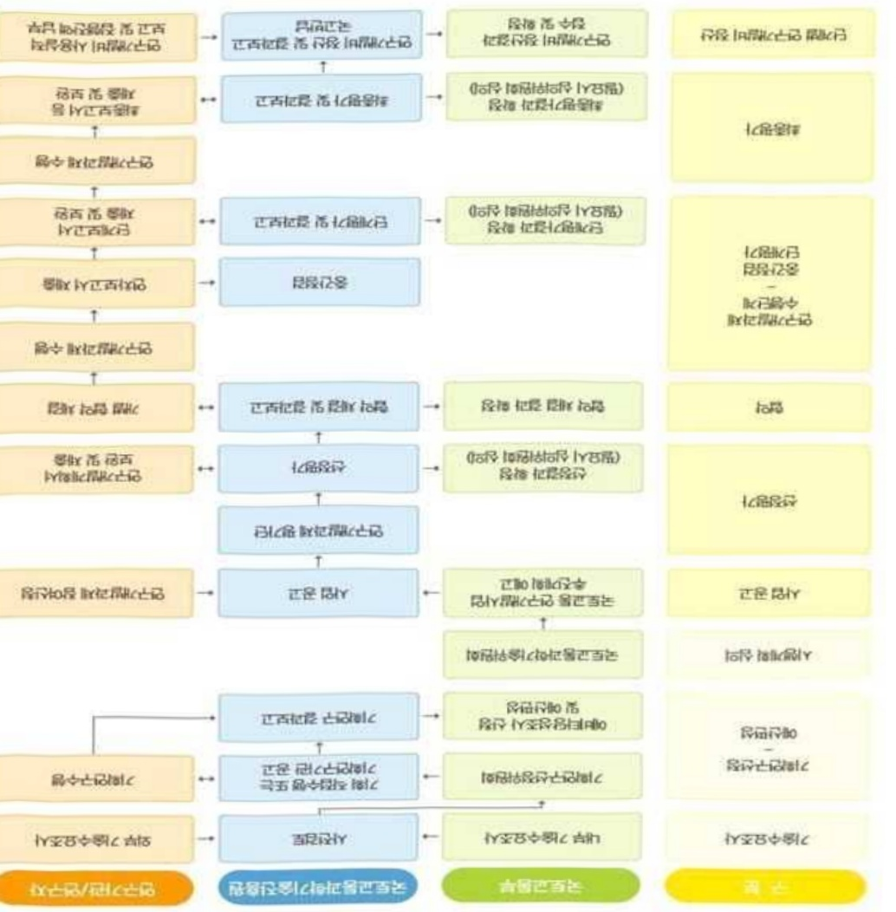
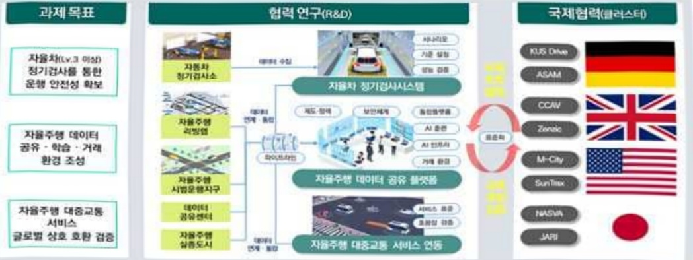

# 자율주행글로벌혁신클러스터연구개발사업(R&D)

**해당 페이지**: PDF 2443 ~ 2453 쪽 해당

**부처**: 국토교통부
**분야**: 교통 및 물류
**회계유형**: 일반회계
**2026 확정예산**: 3400.0 백만원
**전년대비 증감률**: None%
**AI 도메인**: 교통/모빌리티

---

<table border=1 style='margin: auto; word-wrap: break-word;'><tr><td style='text-align: center; word-wrap: break-word;'>사 업 명</td></tr><tr><td style='text-align: center; word-wrap: break-word;'>(11) 자율주행 글로벌 혁신클러스터 연구개발사업(R&amp;D) (4158-325)</td></tr></table>

□ 사업 코드 정보

<table border=1 style='margin: auto; word-wrap: break-word;'><tr><td style='text-align: center; word-wrap: break-word;'>구분</td><td style='text-align: center; word-wrap: break-word;'>회계</td><td style='text-align: center; word-wrap: break-word;'>소관</td><td style='text-align: center; word-wrap: break-word;'>실국(기관)</td><td style='text-align: center; word-wrap: break-word;'>계정</td><td style='text-align: center; word-wrap: break-word;'>분야</td><td style='text-align: center; word-wrap: break-word;'>부문</td></tr><tr><td style='text-align: center; word-wrap: break-word;'>코드</td><td rowspan="2">일반회계</td><td rowspan="2">국토교통부</td><td rowspan="2">모빌리티자동차국</td><td rowspan="2">-</td><td style='text-align: center; word-wrap: break-word;'>120</td><td style='text-align: center; word-wrap: break-word;'>126</td></tr><tr><td style='text-align: center; word-wrap: break-word;'>명칭</td><td style='text-align: center; word-wrap: break-word;'>교통및물류</td><td style='text-align: center; word-wrap: break-word;'>물류등기타</td></tr></table>

<table border=1 style='margin: auto; word-wrap: break-word;'><tr><td style='text-align: center; word-wrap: break-word;'>구분</td><td style='text-align: center; word-wrap: break-word;'>프로그램</td><td style='text-align: center; word-wrap: break-word;'>단위사업</td><td style='text-align: center; word-wrap: break-word;'>세부사업</td></tr><tr><td style='text-align: center; word-wrap: break-word;'>코드</td><td style='text-align: center; word-wrap: break-word;'>4100</td><td style='text-align: center; word-wrap: break-word;'>4158</td><td style='text-align: center; word-wrap: break-word;'>325</td></tr><tr><td style='text-align: center; word-wrap: break-word;'>명칭</td><td style='text-align: center; word-wrap: break-word;'>국토교통연구개발</td><td style='text-align: center; word-wrap: break-word;'>교통물류연구</td><td style='text-align: center; word-wrap: break-word;'>자율주행글로벌혁신클리스터 연구개발사업(R&amp;D)</td></tr></table>

☐ 사업 성격

<table border=1 style='margin: auto; word-wrap: break-word;'><tr><td rowspan="2">신규 계속 완료</td><td rowspan="2">예비타당성 실시여부</td><td rowspan="2">총사업비 관리대상</td><td rowspan="2">총액계상 예산사업</td><td style='text-align: center; word-wrap: break-word;'>사업소관 변경정보</td></tr><tr><td style='text-align: center; word-wrap: break-word;'>2025예산 시 소관</td></tr><tr><td style='text-align: center; word-wrap: break-word;'>○</td><td style='text-align: center; word-wrap: break-word;'></td><td style='text-align: center; word-wrap: break-word;'></td><td style='text-align: center; word-wrap: break-word;'></td><td style='text-align: center; word-wrap: break-word;'></td></tr></table>

□ 사업 지원 형태 및 지원율

<table border=1 style='margin: auto; word-wrap: break-word;'><tr><td style='text-align: center; word-wrap: break-word;'>직접</td><td style='text-align: center; word-wrap: break-word;'>출자</td><td style='text-align: center; word-wrap: break-word;'>출연</td><td style='text-align: center; word-wrap: break-word;'>보조</td><td style='text-align: center; word-wrap: break-word;'>융자</td><td style='text-align: center; word-wrap: break-word;'>국고보조율(%)</td><td style='text-align: center; word-wrap: break-word;'>융자율(%)</td></tr><tr><td style='text-align: center; word-wrap: break-word;'></td><td style='text-align: center; word-wrap: break-word;'></td><td style='text-align: center; word-wrap: break-word;'>○</td><td style='text-align: center; word-wrap: break-word;'></td><td style='text-align: center; word-wrap: break-word;'></td><td style='text-align: center; word-wrap: break-word;'></td><td style='text-align: center; word-wrap: break-word;'></td></tr></table>

□ 사업 담당자

<table border=1 style='margin: auto; word-wrap: break-word;'><tr><td style='text-align: center; word-wrap: break-word;'>사업명</td><td colspan="2">구분</td></tr><tr><td rowspan="2">자율주행글로벌 혁신클러스터 연구개발사업 (R&amp;D)</td><td style='text-align: center; word-wrap: break-word;'>소관부처</td><td style='text-align: center; word-wrap: break-word;'>실·국·과(팀) 모빌리티자동차국 자율주행정책과</td></tr><tr><td style='text-align: center; word-wrap: break-word;'>사업시행주체</td><td style='text-align: center; word-wrap: break-word;'>국토교통과학기술진흥원 글로벌성장협력실</td></tr></table>

---

### 가. 예산 총괄표

(단위:백만원,%)

<table border=1 style='margin: auto; word-wrap: break-word;'><tr><td rowspan="2">사업명</td><td rowspan="2">2024년 결산</td><td colspan="2">2025년 예산</td><td colspan="2">2026년</td><td rowspan="2">증감(B-A)</td><td rowspan="2">(B-A)/A</td></tr><tr><td style='text-align: center; word-wrap: break-word;'>본예산(A)</td><td style='text-align: center; word-wrap: break-word;'>추경</td><td style='text-align: center; word-wrap: break-word;'>정부안</td><td style='text-align: center; word-wrap: break-word;'>확정(B)</td></tr><tr><td style='text-align: center; word-wrap: break-word;'>자율주행글로벌혁신클러스터연구개발사업(R&amp;D)</td><td style='text-align: center; word-wrap: break-word;'>-</td><td style='text-align: center; word-wrap: break-word;'>3,400</td><td style='text-align: center; word-wrap: break-word;'>-</td><td style='text-align: center; word-wrap: break-word;'>3,400</td><td style='text-align: center; word-wrap: break-word;'>3,400</td><td style='text-align: center; word-wrap: break-word;'>3,400</td><td style='text-align: center; word-wrap: break-word;'>순증</td></tr></table>

□ 기능별(내역사업별), 목별 예산 내역

(단위:백만원)

<table border=1 style='margin: auto; word-wrap: break-word;'><tr><td rowspan="3"></td><td colspan="5">2024</td><td colspan="7">2025(2025.12월 말 기준)</td><td rowspan="3">2026 예산</td></tr><tr><td rowspan="2">예산액(추경)</td><td rowspan="2">예산 현액</td><td rowspan="2">집행액[실집행액]</td><td rowspan="2">이월액</td><td rowspan="2">불용액</td><td rowspan="2">분예산</td><td rowspan="2">예산 현액</td><td rowspan="2">집행액[실집행액]</td><td colspan="2">전년도 이월액 계외</td><td rowspan="2">이월 예상액</td><td rowspan="2">불용 예상액</td></tr><tr><td style='text-align: center; word-wrap: break-word;'>예산 현액</td><td style='text-align: center; word-wrap: break-word;'>집행액[실집행액]</td></tr><tr><td style='text-align: center; word-wrap: break-word;'>○ 기능별 분류(합계)</td><td style='text-align: center; word-wrap: break-word;'>-</td><td style='text-align: center; word-wrap: break-word;'>-</td><td style='text-align: center; word-wrap: break-word;'>-</td><td style='text-align: center; word-wrap: break-word;'>-</td><td style='text-align: center; word-wrap: break-word;'>-</td><td style='text-align: center; word-wrap: break-word;'>-</td><td style='text-align: center; word-wrap: break-word;'>-</td><td style='text-align: center; word-wrap: break-word;'>-</td><td style='text-align: center; word-wrap: break-word;'>-</td><td style='text-align: center; word-wrap: break-word;'>-</td><td style='text-align: center; word-wrap: break-word;'>-</td><td style='text-align: center; word-wrap: break-word;'>-</td><td style='text-align: center; word-wrap: break-word;'>3,400</td></tr><tr><td style='text-align: center; word-wrap: break-word;'>· 자율주행 글로벌 혁신 클러스터 연구개발</td><td style='text-align: center; word-wrap: break-word;'>-</td><td style='text-align: center; word-wrap: break-word;'>-</td><td style='text-align: center; word-wrap: break-word;'>-</td><td style='text-align: center; word-wrap: break-word;'>-</td><td style='text-align: center; word-wrap: break-word;'>-</td><td style='text-align: center; word-wrap: break-word;'>-</td><td style='text-align: center; word-wrap: break-word;'>-</td><td style='text-align: center; word-wrap: break-word;'>-</td><td style='text-align: center; word-wrap: break-word;'>-</td><td style='text-align: center; word-wrap: break-word;'>-</td><td style='text-align: center; word-wrap: break-word;'>-</td><td style='text-align: center; word-wrap: break-word;'>-</td><td style='text-align: center; word-wrap: break-word;'>3,400</td></tr><tr><td style='text-align: center; word-wrap: break-word;'>○ 비목별 분류(합계)</td><td style='text-align: center; word-wrap: break-word;'>-</td><td style='text-align: center; word-wrap: break-word;'>-</td><td style='text-align: center; word-wrap: break-word;'>-</td><td style='text-align: center; word-wrap: break-word;'>-</td><td style='text-align: center; word-wrap: break-word;'>-</td><td style='text-align: center; word-wrap: break-word;'>-</td><td style='text-align: center; word-wrap: break-word;'>-</td><td style='text-align: center; word-wrap: break-word;'>-</td><td style='text-align: center; word-wrap: break-word;'>-</td><td style='text-align: center; word-wrap: break-word;'>-</td><td style='text-align: center; word-wrap: break-word;'>-</td><td style='text-align: center; word-wrap: break-word;'>-</td><td style='text-align: center; word-wrap: break-word;'>3,400</td></tr><tr><td style='text-align: center; word-wrap: break-word;'>· 연구활동 비 등 (360-05)</td><td style='text-align: center; word-wrap: break-word;'>-</td><td style='text-align: center; word-wrap: break-word;'>-</td><td style='text-align: center; word-wrap: break-word;'>-</td><td style='text-align: center; word-wrap: break-word;'>-</td><td style='text-align: center; word-wrap: break-word;'>-</td><td style='text-align: center; word-wrap: break-word;'>-</td><td style='text-align: center; word-wrap: break-word;'>-</td><td style='text-align: center; word-wrap: break-word;'>-</td><td style='text-align: center; word-wrap: break-word;'>-</td><td style='text-align: center; word-wrap: break-word;'>-</td><td style='text-align: center; word-wrap: break-word;'>-</td><td style='text-align: center; word-wrap: break-word;'>-</td><td style='text-align: center; word-wrap: break-word;'>3,400</td></tr></table>

### 나. 사업설명자료

## 1 ) 사업목적·내용

- (자율주행 글로벌 혁신클러스터 연구개발) 혁신클러스터형 국제협력을 통해 국내

자율주행시스템·인프라 안전성·신뢰도를 향상시켜 글로벌 스텐다드 수준 자율주행 상시

시 운행기반 조기 구축

① (자율주행자동차 정기검사시스템 고도화 국제공동연구) 자율주행차 안전운행을 위한 정기검사 시나리오 및 통합 시스템 개발, 국제 교차실증 기반 상호인정 확보와 글로벌 시장·환경 대응을 통한 자율주행 지속발전 기반 구축

---

② (자율주행 데이터 공유·활용을 위한 통합플랫폼 구축·검증) 다양한 자율주행 빅데이터를 취합·학습·공유·거래할 수 있는 통합플랫폼 구축 및 검증 지원체계 수립

③ (자율주행 서비스 글로벌 상호호환 지원 기술 개발) 자율주행 서비스 글로벌 연동을 위한 대중교통 자율주행 서비스 표준 개발·검증 추진

## 2 ) 사업개요

## □ 사업근거 및 추진경위

① 법령상 근거 및 조항 적시

- <과학기술기본법> 제18조(과학기술의 국제화 촉진)

· 정부는 국제사회에 공헌하고 국내 과학기술 수준을 향상시킬 수 있도록 외국정부, 국제기구 또는 외국의 연구개발 관련 기관·단체 등과 과학기술분야의 국제협력을 촉진하기 위하여 다음 각 호의 사항에 관한 시책을 세우고 추진하여야 한다.

- <국토교통과학기술육성법> 제14조(국제협력 등)

① 국토교통부장관은 연구개발사업 및 연구개발성과의 보급·활용을 촉진시키기 위하여 필요한 관련 국제적 동향을 파악하고 국제공동연구개발의 활성화 등 국제협력 업무를 추진하여야 한다. ② 국토교통부장관은 국토교통과학기술에 관한 국제적 개발동향·투자방향 및 기술수준 등을 주기적으로 조사·분석하여 기술개발과 관련된 정책에 반영하여야 한다.

- <해외건설촉진법> 제15조의4(해외건설 정책 및 연구개발 등 지원)

· 국토교통부장관은 해외건설의 진흥을 위하여 해외건설시장 동향 조사·분석 및 시장 전망, 주요 국가 해외건설 제도·정책 동향 조사·분석, 해외건설 진흥을 위한 국제협력의 추진 등을 지원할 수 있다.

## ② 추진경위

- (추진 배경) 자율주행 상용화 시대에 대비하여 국제적 규제·안전·검사기준 마련 가속화에 따라, 안전운행을 위한 정기검사 체계 구축, 데이터 공유 플랫폼 및 AI 기반 대중교통 서비스 등 자율주행 생태계에 대한 통합적 R&D 투자 필요성 대두

- (정부 중장기 계획) 첨단 모빌리티 집중 육성 및 자율주행 안전운행 추진전략 등 발표

22.9 : 국토교통부 [모빌리티 혁신로드맵]에 따라 모빌리티 시대 글로벌 선도와 혁신

---

서비스의 일상 구현을 위하여 완전자율주행 등 첨단 모빌리티 기술혁신 추진

23.12 : [12대 국가전략기술(과학기술정보통신부)]에서 글로벌 기술패권 경쟁과 미래

성장을 위한 중점기술로 자율주행시스템 기술 선정

23.12 : 「완전 자율주행 시대에 대비한 도로교통안전 추진전략(관계부처합동)에서 자율주행 안전운행 법제도 개선, 도로교통 안전분야 R&D사업 확장 등 강조

25.11 : '자율주행차 산업 경쟁력 제고방안(관계부처합동)'

- (국가간 협력) 국가간 협력 추진을 위한 양해각서 추진

'22~'25 : 영국혁신청(Innovate UK)과 KAIA 간 MOU 체결('22.11)·갱신('25.12), 영국 정부부처(CCAV)의 참여의향서(LOI) 접수('24.4)

23.11 : 자율주행기술개발혁신사업(R&D) 수행기관인 한국교통안전공단(TS)와 MORAI (시뮬레이션기반 자율주행 검증업체)와 미국 M-City와 MOU 체결

'24~25 : 캐나다온타리오주정부혁신센터(OCI)와 KAIA 간 자율주행자동차 공동 실증 등 모빌리티분야 공동R&D 추진을 위한 MOU 체결('24.6)·갱신('25.8)

- (신규과제 기획) '국토교통 혁신클러스터형 국제협력 연구개발사업' 기획(5개 분야)

- '23.12~25.1 : '자율주행 글로벌 혁신클러스터 연구개발사업' 기획 수행

※ (관련 정책공약 및 국정과제) [1. AI 3대 강국 진입과 미래전략산업 육성] 전략에 따라 자율주행 등 국토교통 첨단·고부가치 산업을 대한민국 미래 성장동력으로 육성

° (정책공약) [2. 성장] 2. 성장기반구축 - 15. 자율주행, 스마트도시, 전기·수소열차 등 국토교통 첨단산업을 대한민국 미래 성장동력으로 만들겠습니다

°(국정과제③)“미래 모빌리티·K-AI 시티 실현” - (실천과제)“자율주행차 산업 육성”

□ 주요내용

① 사업규모

- 총사업비 : 해당없음

- 사업기간 : '26 ~ '29

- 최근 5년 간 투입된 사업비(예산액기준, 추경편성한 연도에는 추경포함)

<table border=1 style='margin: auto; word-wrap: break-word;'><tr><td style='text-align: center; word-wrap: break-word;'>$ \underline{\text{所}} $</td><td style='text-align: center; word-wrap: break-word;'>2022</td><td style='text-align: center; word-wrap: break-word;'>2023</td><td style='text-align: center; word-wrap: break-word;'>2024</td><td style='text-align: center; word-wrap: break-word;'>2025</td><td style='text-align: center; word-wrap: break-word;'>2026</td></tr><tr><td style='text-align: center; word-wrap: break-word;'>$ \underline{\text{人}} $</td><td style='text-align: center; word-wrap: break-word;'>-</td><td style='text-align: center; word-wrap: break-word;'>-</td><td style='text-align: center; word-wrap: break-word;'>-</td><td style='text-align: center; word-wrap: break-word;'>-</td><td style='text-align: center; word-wrap: break-word;'>3,400</td></tr></table>

- 기타: 해당없음

---

② 사업추진체계

- 사업시행방법 : 출연(참여기업이 있는 경우 Matching)

- 사업시행주체 : 국토교통부(전문기관 : 국토교통과학기술진흥원)

- 사업 수혜자 : 대학, 기업, 출연연 등

- 보조, 융자, 출연, 출자 등의 경우 보조·융자 등 지원 비율 및 법적근거

<table border=1 style='margin: auto; word-wrap: break-word;'><tr><td style='text-align: center; word-wrap: break-word;'>내역사업명</td><td style='text-align: center; word-wrap: break-word;'>구분</td><td style='text-align: center; word-wrap: break-word;'>피보조·피출연 등 기관명</td><td style='text-align: center; word-wrap: break-word;'>지원 금액 (2026예산)</td><td style='text-align: center; word-wrap: break-word;'>지원 비율(%)</td><td style='text-align: center; word-wrap: break-word;'>보조율 법적근거 (해당 조항)</td></tr><tr><td rowspan="3">자율주행글로벌 혁신클러스터 연구개발</td><td rowspan="3">출연</td><td style='text-align: center; word-wrap: break-word;'>「중소기업기본법」제2조에 따른 중소기업에 해당하는 연구개발기관</td><td rowspan="3">3,400 백만원</td><td style='text-align: center; word-wrap: break-word;'>연구개발 비의 100분의 75 이하</td><td rowspan="3">「국가연구개발 혁신법 시행령」 제19조</td></tr><tr><td style='text-align: center; word-wrap: break-word;'>「중견기업 성장촉진 및 경쟁력 강화에 관한 특별법」제2조제1호에 따른 중견기업에 해당하는 연구개발기관</td><td style='text-align: center; word-wrap: break-word;'>연구개발 비의 100분의 70 이하</td></tr><tr><td style='text-align: center; word-wrap: break-word;'>「공공기관의 운영에 관한 법률」제5조제4항제1호에 따른 공기업에 해당하거나 ‘가’, ‘나’에 해당 해당하지 않는 연구개발기관</td><td style='text-align: center; word-wrap: break-word;'>연구개발 비의 100분의 50 이하</td></tr></table>

* 다만, 중앙행정기관의 장이 필요하다고 인정하는 국가연구개발사업에 대하여 별도로 정할 수 있음

## 3 ) 2026년도 예산 산출 근거

① 자율주행글로벌혁신클러스터연구개발

:(25)0→(26요구)3,400백만원,순증

- (보구) 사출수행 상용와 시내에 내비하여 국제적 규제·안전·검사기준 마련 가속화에 따라, 안전운행을 위한 자율주행차 정기검사 체계 구축, 자율주행 데이터 공유 플랫폼 및 서비스 상호호환 지원 기술 등 자율주행 생태계에 대한 통합적 R&D 투자 필요성이 인정되어 소요예산 3,400백만원 요구

- (산출) ① 자율주행글로벌혁신클러스터연구개발 3,400백만원

·(정기검사 시스템) (신규) 1개 × 1,600백만원 × 9/12 = 1,200백만원

·(데이터 통합플랫폼) (신규) 1개 × 2,667백만원 × 9/12 = 2,000백만원

·(자율주행 서비스 글로벌 상호호환) (신규) 1개 × 267백만원 × 9/12 = 200백만원

o 2025년도 예산 및 2026년도 예산 산출 세부내역 비교

<table border=1 style='margin: auto; word-wrap: break-word;'><tr><td colspan="2">2025년 예산</td><td colspan="2">2026년 예산</td></tr><tr><td style='text-align: center; word-wrap: break-word;'>예산</td><td style='text-align: center; word-wrap: break-word;'>산출내역</td><td style='text-align: center; word-wrap: break-word;'>예산</td><td style='text-align: center; word-wrap: break-word;'>산출내역</td></tr><tr><td style='text-align: center; word-wrap: break-word;'>-</td><td style='text-align: center; word-wrap: break-word;'>-</td><td style='text-align: center; word-wrap: break-word;'>3,400 백만원</td><td style='text-align: center; word-wrap: break-word;'>○ 연구활동비 등(360-05):3,400백만원 가. (정기검사 시스템) (신규) 1개 × 1,600백만원 × 9/12 = 1,200백만원 • 자율주행 정기 검사기술 개념설계 및 기술규격서 개발: 300백만원 • 검사기술 개념설계 및 검사정비 표준시장 도출(국제공동연구): 250백만원 • 정기검사 통합 시스템 및 선서 시뮬레이터 시장 검토(국제공동연구): 150백만원 • 검사 시나리오 개발 환경 구축: 240백만원 • 검사 시나리오 개발을 위한 평가방법론 개발: 260백만원 나. (데이터 통합물렛움) (신규) 1개 × 2,667백만원 × 9/12 = 2,000백만원 • 자율주행 데이터 통합 연계수집활용 체계 수립: 200백만원 • 국제표준ISO 11859 등 현황분석 및 효율기능한 매타디터 체계 설계: 100백만원</td></tr></table>

---

<table border=1 style='margin: auto; word-wrap: break-word;'><tr><td colspan="2">2025년 예산</td><td colspan="2">2026년 예산</td></tr><tr><td style='text-align: center; word-wrap: break-word;'>예산</td><td style='text-align: center; word-wrap: break-word;'>산출내역</td><td style='text-align: center; word-wrap: break-word;'>예산</td><td style='text-align: center; word-wrap: break-word;'>산출내역</td></tr><tr><td style='text-align: center; word-wrap: break-word;'></td><td style='text-align: center; word-wrap: break-word;'></td><td style='text-align: center; word-wrap: break-word;'></td><td style='text-align: center; word-wrap: break-word;'>• 데이터 중심 AI 이기택처(Data-Centric AI) 개발 분석/설계 : 300백만원
• 특화 도델 카스타미징 위한 도메인 특허형 AI 개발 프로젝트 : 200백만원
• 다계증 주체증심 도메인 분류체계 장립 및 학습 지원 : 200백만원
• 데이터 공유이용 촉진을 위한 제도정책 기반 구축 : 100백만원
• 잇맛계이스 주형데이터 확보를 위한 데이터 증강 기술 분석/설계 : 150백만원
• 데이터 생애 전주가수집기공 공유재사용 초화형 기술 분석/설계 : 150백만원
• 연합학습(Federated Learning) 기반의 AI 학습 구조 분석/설계 : 150백만원
• AI 기반 데이터 자동분류 및 규격변환 학습 데이터셋 품질 검증 기술 분석/설계 : 150백만원
• 자율주행 데이터 공유 통합물맹품 구축을 위한 인프라 환경 조성 300백만원
다. (대중교통 서비스) (신규) 1개 × 267백만원 × 9/12 = 200백만원
• 국제자율주행 표준 기반 글로벌 연동 대중교통 자율주행 서비스 표준 : 100백만원
• 대중교통 자율주행 서비스 글로벌 상호환 서비스 상호감증 추진 100백만원</td></tr></table>

## 4 ) 사업효과

□ 사업영향, 산출물 성과지표 등

① 2022~2026년도 성과계획서 상 성과지표 및 최근 5년간 성과 달성도

<table border=1 style='margin: auto; word-wrap: break-word;'><tr><td colspan="2">성과지표</td><td style='text-align: center; word-wrap: break-word;'>구분</td><td style='text-align: center; word-wrap: break-word;'>2022</td><td style='text-align: center; word-wrap: break-word;'>2023</td><td style='text-align: center; word-wrap: break-word;'>2024</td><td style='text-align: center; word-wrap: break-word;'>2025</td><td style='text-align: center; word-wrap: break-word;'>2026</td><td style='text-align: center; word-wrap: break-word;'>2026목표치산출근거</td><td style='text-align: center; word-wrap: break-word;'>측정산식(또는측정방법)</td><td style='text-align: center; word-wrap: break-word;'>자료수집방법(또는자료출처)</td></tr><tr><td rowspan="6">정기검사시스템</td><td rowspan="2">HW성과물</td><td style='text-align: center; word-wrap: break-word;'>재현율</td><td style='text-align: center; word-wrap: break-word;'>-</td><td style='text-align: center; word-wrap: break-word;'>-</td><td style='text-align: center; word-wrap: break-word;'>-</td><td style='text-align: center; word-wrap: break-word;'>-</td><td style='text-align: center; word-wrap: break-word;'>85%</td><td rowspan="2">·시뮬레이션신뢰도 향상을 위해 최초 재현율 85% 이상, 오차율 2% 이하로 설정·OTA 대용량 데이터 처리를 위한 전송 속도 1Gbps 이상으로 설정</td><td rowspan="2">·시뮬레이션 재현율 95% 이상, 오차율 \pm 2%·OTA 장비 데이터 전송 속도 1Gbps 이상.</td><td rowspan="2">실험 및 테스트 데이터 분석 보고서</td></tr><tr><td style='text-align: center; word-wrap: break-word;'>오차율</td><td style='text-align: center; word-wrap: break-word;'>-</td><td style='text-align: center; word-wrap: break-word;'>-</td><td style='text-align: center; word-wrap: break-word;'>-</td><td style='text-align: center; word-wrap: break-word;'>-</td><td style='text-align: center; word-wrap: break-word;'>2%</td></tr><tr><td rowspan="2">SW성과물</td><td style='text-align: center; word-wrap: break-word;'>처리율</td><td style='text-align: center; word-wrap: break-word;'>-</td><td style='text-align: center; word-wrap: break-word;'>-</td><td style='text-align: center; word-wrap: break-word;'>-</td><td style='text-align: center; word-wrap: break-word;'>-</td><td style='text-align: center; word-wrap: break-word;'>80%</td><td rowspan="2">·증가하는 데이터 실시간 분석을 위해 100TB 데이터 80% 이상 처리를 최초 목표로 설정·법규 및 기준 준수, 기술적 완성도를 위해 99% 이상 적합으로 설정</td><td rowspan="2">·데이터 처리 속도: 100TB 데이터 90% 이상 처리 완료·ADAS 검사 정확도: 99% 이상 적합 판정</td><td rowspan="2">벤치마킹 등 자체 성능검증 분석 보고서</td></tr><tr><td style='text-align: center; word-wrap: break-word;'>정확도</td><td style='text-align: center; word-wrap: break-word;'>-</td><td style='text-align: center; word-wrap: break-word;'>-</td><td style='text-align: center; word-wrap: break-word;'>-</td><td style='text-align: center; word-wrap: break-word;'>-</td><td style='text-align: center; word-wrap: break-word;'>99%</td></tr><tr><td rowspan="2">법·제도성과물</td><td style='text-align: center; word-wrap: break-word;'>성공률</td><td style='text-align: center; word-wrap: break-word;'>-</td><td style='text-align: center; word-wrap: break-word;'>-</td><td style='text-align: center; word-wrap: break-word;'>-</td><td style='text-align: center; word-wrap: break-word;'>-</td><td style='text-align: center; word-wrap: break-word;'>85%</td><td rowspan="2">·글로벌 경쟁력 강화를 위해 국제표준반 국내법규 제정·데이터 공유를 통한 연구 개발 효율 증대를 위해 교류 성공률 85% 이상을 목표로 설정</td><td rowspan="2">·UNECE/WP29 및 ISO 표준 기반 국내 법규 3개 이상 제정·글로벌 테스트베드(한국 독일) 간 데이터 교류 성공률 95% 이상</td><td rowspan="2">UNECE 및 ISO 등 국제 표준 데이터 분석 보고서</td></tr><tr><td style='text-align: center; word-wrap: break-word;'>법규</td><td style='text-align: center; word-wrap: break-word;'>-</td><td style='text-align: center; word-wrap: break-word;'>-</td><td style='text-align: center; word-wrap: break-word;'>-</td><td style='text-align: center; word-wrap: break-word;'>-</td><td style='text-align: center; word-wrap: break-word;'>-</td></tr></table>

---

<table border=1 style='margin: auto; word-wrap: break-word;'><tr><td rowspan="9">데이터 통합 플랫폼</td><td style='text-align: center; word-wrap: break-word;'>자율주행 데이터 공유 통합플랫폼 아키텍치/ 프레임워크 (단위: 식)</td><td style='text-align: center; word-wrap: break-word;'>목표</td><td style='text-align: center; word-wrap: break-word;'>-</td><td style='text-align: center; word-wrap: break-word;'>-</td><td style='text-align: center; word-wrap: break-word;'>-</td><td style='text-align: center; word-wrap: break-word;'>-</td><td style='text-align: center; word-wrap: break-word;'>3</td><td style='text-align: center; word-wrap: break-word;'>연합학습, 도메인 특화형 AI Data-Centric AI 구현 아키텍치 및 프레임워크 수립 전수</td><td style='text-align: center; word-wrap: break-word;'>1차년도 논리아키텍치 및 프레임워크 수립, 2차년도 물리아키텍치 수립</td><td style='text-align: center; word-wrap: break-word;'>아키텍치 및 프레임워크 보고서 작성</td></tr><tr><td style='text-align: center; word-wrap: break-word;'>자율주행 데이터 공유 통합플랫폼 및 데이터 연계 파이프라인, 연합학습 시스템 설계 (단위: 점)</td><td style='text-align: center; word-wrap: break-word;'>목표</td><td style='text-align: center; word-wrap: break-word;'>-</td><td style='text-align: center; word-wrap: break-word;'>-</td><td style='text-align: center; word-wrap: break-word;'>-</td><td style='text-align: center; word-wrap: break-word;'>-</td><td style='text-align: center; word-wrap: break-word;'>90</td><td style='text-align: center; word-wrap: break-word;'>플랫폼 설계 내역 교통, 시스템, 자율주행 전문가 정성평가 실시</td><td style='text-align: center; word-wrap: break-word;'>설계보고서 전문가 대면 발표 및 내역 검토 후 점수 부여</td><td style='text-align: center; word-wrap: break-word;'>전문가 정성평가</td></tr><tr><td style='text-align: center; word-wrap: break-word;'>Data-Centric AI를 통한 AI정확도 향상률 (단위: %)</td><td style='text-align: center; word-wrap: break-word;'>목표</td><td style='text-align: center; word-wrap: break-word;'>-</td><td style='text-align: center; word-wrap: break-word;'>-</td><td style='text-align: center; word-wrap: break-word;'>-</td><td style='text-align: center; word-wrap: break-word;'>-</td><td style='text-align: center; word-wrap: break-word;'>-</td><td style='text-align: center; word-wrap: break-word;'>태습과 오토파일렛의 경우, 고품질 라벨 아이지를 추가한 데이터를 활용하여, 아라인식 정밀도 22% 증가</td><td style='text-align: center; word-wrap: break-word;'>별크데이터를 활용한 대비 정제 데이터를 활용한 인식 정확도 향상</td><td style='text-align: center; word-wrap: break-word;'>별크데이터와 Data-Centric AI을 통한 데이터의 인식 정확도 비교</td></tr><tr><td style='text-align: center; word-wrap: break-word;'>데이터 및 모델 사용자 매뉴얼 (단위: 식)</td><td style='text-align: center; word-wrap: break-word;'>목표</td><td style='text-align: center; word-wrap: break-word;'>-</td><td style='text-align: center; word-wrap: break-word;'>-</td><td style='text-align: center; word-wrap: break-word;'>-</td><td style='text-align: center; word-wrap: break-word;'>-</td><td style='text-align: center; word-wrap: break-word;'>-</td><td style='text-align: center; word-wrap: break-word;'>과기부 유관과제 목표치 참고 설정</td><td style='text-align: center; word-wrap: break-word;'>보고서 작성 전수</td><td style='text-align: center; word-wrap: break-word;'>플랫폼을 통해 생성된 AI, 데이터 이용자 매뉴얼 작성</td></tr><tr><td style='text-align: center; word-wrap: break-word;'>종별 엣지케이스 자율주행 데이터 확보 (단위: 종)</td><td style='text-align: center; word-wrap: break-word;'>목표</td><td style='text-align: center; word-wrap: break-word;'>-</td><td style='text-align: center; word-wrap: break-word;'>-</td><td style='text-align: center; word-wrap: break-word;'>-</td><td style='text-align: center; word-wrap: break-word;'>-</td><td style='text-align: center; word-wrap: break-word;'>-</td><td style='text-align: center; word-wrap: break-word;'>자동차안전연구 원 엣지케이스 시나리오에서 제시하는 24종 구분 적용</td><td style='text-align: center; word-wrap: break-word;'>엣지케이스 종 전수</td><td style='text-align: center; word-wrap: break-word;'>자율주행 데이터 확보 종별 짐게</td></tr><tr><td style='text-align: center; word-wrap: break-word;'>자율주행 데이터 검색 성능 (단위: tps)</td><td style='text-align: center; word-wrap: break-word;'>목표</td><td style='text-align: center; word-wrap: break-word;'>-</td><td style='text-align: center; word-wrap: break-word;'>-</td><td style='text-align: center; word-wrap: break-word;'>-</td><td style='text-align: center; word-wrap: break-word;'>-</td><td style='text-align: center; word-wrap: break-word;'>-</td><td style='text-align: center; word-wrap: break-word;'>선도기술성능 상회치 (500tps/Waymo /미국)</td><td style='text-align: center; word-wrap: break-word;'>공식 Elastisearch 벤치마크 도구활용 처리속도 측정</td><td style='text-align: center; word-wrap: break-word;'>공인시험</td></tr><tr><td style='text-align: center; word-wrap: break-word;'>주행환경 객체 AI 학습 데이터셋 (단위 frame)</td><td style='text-align: center; word-wrap: break-word;'>목표</td><td style='text-align: center; word-wrap: break-word;'>-</td><td style='text-align: center; word-wrap: break-word;'>-</td><td style='text-align: center; word-wrap: break-word;'>-</td><td style='text-align: center; word-wrap: break-word;'>-</td><td style='text-align: center; word-wrap: break-word;'>-</td><td style='text-align: center; word-wrap: break-word;'>과기부 유관과제 성과달성치 참고 설정</td><td style='text-align: center; word-wrap: break-word;'>RGB, LiDAR, GPS 등 이기종 센서 용합 데이터셋 건수</td><td style='text-align: center; word-wrap: break-word;'>Data-Centric AI 데이터셋 정체 처리 건수</td></tr><tr><td style='text-align: center; word-wrap: break-word;'>전방위 이동계획 개체 AI 학습 데이터셋 (단위: km)</td><td style='text-align: center; word-wrap: break-word;'>목표</td><td style='text-align: center; word-wrap: break-word;'>-</td><td style='text-align: center; word-wrap: break-word;'>-</td><td style='text-align: center; word-wrap: break-word;'>-</td><td style='text-align: center; word-wrap: break-word;'>-</td><td style='text-align: center; word-wrap: break-word;'>-</td><td style='text-align: center; word-wrap: break-word;'>과기부 유관과제 목표치 참고 설정</td><td style='text-align: center; word-wrap: break-word;'>이벤트 발생 데이터 수집 누적 주행거리</td><td style='text-align: center; word-wrap: break-word;'>Data-Centric AI 데이터셋 정체 처리 누적거리</td></tr><tr><td style='text-align: center; word-wrap: break-word;'>도로 상황 AI 학습 엣지케이스 데이터셋 (단위: km)</td><td style='text-align: center; word-wrap: break-word;'>목표</td><td style='text-align: center; word-wrap: break-word;'>-</td><td style='text-align: center; word-wrap: break-word;'>-</td><td style='text-align: center; word-wrap: break-word;'>-</td><td style='text-align: center; word-wrap: break-word;'>-</td><td style='text-align: center; word-wrap: break-word;'>-</td><td style='text-align: center; word-wrap: break-word;'>자율주행 차량 데이터 중 엣지케이스에 해당하는 데이터 연계 누적거리</td><td style='text-align: center; word-wrap: break-word;'>자율차량검지로 도로 객체 정보 발생 엣지케이스 데이터 수집 누적 주행거리</td><td style='text-align: center; word-wrap: break-word;'>Data-Centric AI 데이터셋 정체 처리 누적거리</td></tr></table>

---

<table border=1 style='margin: auto; word-wrap: break-word;'><tr><td rowspan="3">도로인프라 기반 도로 상황 AI 학습 데이터셋 (단위: TB)</td><td style='text-align: center; word-wrap: break-word;'>목표</td><td style='text-align: center; word-wrap: break-word;'>-</td><td style='text-align: center; word-wrap: break-word;'>-</td><td style='text-align: center; word-wrap: break-word;'>-</td><td style='text-align: center; word-wrap: break-word;'>-</td><td style='text-align: center; word-wrap: break-word;'>-</td><td rowspan="3">HD급 CCTV 300개소 기준 영상정보 용량 기준 산정 (1시간 2GB 소요)</td><td rowspan="3">기존 CCTV, 검지기 등으로 검지한 도로 객체 정보 발생 데이터 수집 누적 용량</td><td rowspan="3">ITS 센터 등 보유 영상정보 연계 용량</td><td rowspan="3"></td></tr><tr><td style='text-align: center; word-wrap: break-word;'>실적</td><td style='text-align: center; word-wrap: break-word;'>-</td><td style='text-align: center; word-wrap: break-word;'>-</td><td style='text-align: center; word-wrap: break-word;'>-</td><td style='text-align: center; word-wrap: break-word;'>-</td><td style='text-align: center; word-wrap: break-word;'>-</td></tr><tr><td style='text-align: center; word-wrap: break-word;'>달성도</td><td style='text-align: center; word-wrap: break-word;'>-</td><td style='text-align: center; word-wrap: break-word;'>-</td><td style='text-align: center; word-wrap: break-word;'>-</td><td style='text-align: center; word-wrap: break-word;'>-</td><td style='text-align: center; word-wrap: break-word;'>-</td></tr><tr><td rowspan="3">자율주행 용 데이터 연관성 분석 정확도 (단위: %)</td><td style='text-align: center; word-wrap: break-word;'>목표</td><td style='text-align: center; word-wrap: break-word;'>-</td><td style='text-align: center; word-wrap: break-word;'>-</td><td style='text-align: center; word-wrap: break-word;'>-</td><td style='text-align: center; word-wrap: break-word;'>-</td><td style='text-align: center; word-wrap: break-word;'>-</td><td rowspan="3">선도기술성능 상회치 (90%/Waymo Open/미국)</td><td rowspan="3">3D 감지 + 행동 예측 + 시멘틱 세분화 등 분석 정확도</td><td rowspan="3">데이터 라벨링 요소별 평균 매칭 정확도</td><td rowspan="3"></td></tr><tr><td style='text-align: center; word-wrap: break-word;'>실적</td><td style='text-align: center; word-wrap: break-word;'>-</td><td style='text-align: center; word-wrap: break-word;'>-</td><td style='text-align: center; word-wrap: break-word;'>-</td><td style='text-align: center; word-wrap: break-word;'>-</td><td style='text-align: center; word-wrap: break-word;'>-</td></tr><tr><td style='text-align: center; word-wrap: break-word;'>달성도</td><td style='text-align: center; word-wrap: break-word;'>-</td><td style='text-align: center; word-wrap: break-word;'>-</td><td style='text-align: center; word-wrap: break-word;'>-</td><td style='text-align: center; word-wrap: break-word;'>-</td><td style='text-align: center; word-wrap: break-word;'>-</td></tr><tr><td rowspan="3">자율주행 용 데이터 라벨링 처리 속도 (단위: tps)</td><td style='text-align: center; word-wrap: break-word;'>목표</td><td style='text-align: center; word-wrap: break-word;'>-</td><td style='text-align: center; word-wrap: break-word;'>-</td><td style='text-align: center; word-wrap: break-word;'>-</td><td style='text-align: center; word-wrap: break-word;'>-</td><td style='text-align: center; word-wrap: break-word;'>-</td><td rowspan="3">선도기술성능 근접치 (80,000/Apache Druid/미국)</td><td rowspan="3">공식 Elasticsearch 벤치마크 도구활용 처리속도 측정</td><td rowspan="3">데이터 1,000만건 색인 시 Jinter 기준 API ThreadFO, 에러율 0%, CPU 사용률 90% 기준 시 초당 트랜젤선 처리 수</td><td rowspan="3"></td></tr><tr><td style='text-align: center; word-wrap: break-word;'>실적</td><td style='text-align: center; word-wrap: break-word;'>-</td><td style='text-align: center; word-wrap: break-word;'>-</td><td style='text-align: center; word-wrap: break-word;'>-</td><td style='text-align: center; word-wrap: break-word;'>-</td><td style='text-align: center; word-wrap: break-word;'>-</td></tr><tr><td style='text-align: center; word-wrap: break-word;'>달성도</td><td style='text-align: center; word-wrap: break-word;'>-</td><td style='text-align: center; word-wrap: break-word;'>-</td><td style='text-align: center; word-wrap: break-word;'>-</td><td style='text-align: center; word-wrap: break-word;'>-</td><td style='text-align: center; word-wrap: break-word;'>-</td></tr><tr><td rowspan="3">자율 주행 대중 교통 서비스 연동 기술</td><td style='text-align: center; word-wrap: break-word;'>자율주행 대중교통 서비스 표준 (단위: 건)</td><td style='text-align: center; word-wrap: break-word;'>목표</td><td style='text-align: center; word-wrap: break-word;'>-</td><td style='text-align: center; word-wrap: break-word;'>-</td><td style='text-align: center; word-wrap: break-word;'>-</td><td style='text-align: center; word-wrap: break-word;'>-</td><td rowspan="3">·자율주행 대중교통 글로벌 서비스 상호 호환을 위한 국제표준 추진 활동</td><td rowspan="3">·국제 표준 기반 자율주행 대중교통 서비스 표준 제정</td><td rowspan="3">국제로밍 데이터 스키마 및 교차연동 규격, 국제 표준화 회의, 표준화 추진결과</td><td rowspan="3"></td></tr><tr><td style='text-align: center; word-wrap: break-word;'>실적</td><td style='text-align: center; word-wrap: break-word;'>-</td><td style='text-align: center; word-wrap: break-word;'>-</td><td style='text-align: center; word-wrap: break-word;'>-</td><td style='text-align: center; word-wrap: break-word;'>-</td><td style='text-align: center; word-wrap: break-word;'>-</td></tr><tr><td style='text-align: center; word-wrap: break-word;'>달성도</td><td style='text-align: center; word-wrap: break-word;'>-</td><td style='text-align: center; word-wrap: break-word;'>-</td><td style='text-align: center; word-wrap: break-word;'>-</td><td style='text-align: center; word-wrap: break-word;'>-</td><td style='text-align: center; word-wrap: break-word;'>-</td></tr><tr><td rowspan="3">글로벌 상호호환 연동 시스템 (단위: 건)</td><td style='text-align: center; word-wrap: break-word;'>목표</td><td style='text-align: center; word-wrap: break-word;'>-</td><td style='text-align: center; word-wrap: break-word;'>-</td><td style='text-align: center; word-wrap: break-word;'>-</td><td style='text-align: center; word-wrap: break-word;'>-</td><td style='text-align: center; word-wrap: break-word;'>-</td><td rowspan="3">·글로벌 확산을 위한 자율주행 대중교통 서비스 연동기술 설계, 상호교차 검증을 위한 국제협력 파트너 선정</td><td rowspan="3">·자율주행 대중교통 글로벌 상호호환 연동시스템 1건 개발 ·자율주행 대중교통 글로벌 상호호환 지원서비스 연동률 95% 이상</td><td rowspan="3">국제 교차검증 결과보고서</td><td rowspan="3"></td></tr><tr><td style='text-align: center; word-wrap: break-word;'>실적</td><td style='text-align: center; word-wrap: break-word;'>-</td><td style='text-align: center; word-wrap: break-word;'>-</td><td style='text-align: center; word-wrap: break-word;'>-</td><td style='text-align: center; word-wrap: break-word;'>-</td><td style='text-align: center; word-wrap: break-word;'>-</td></tr><tr><td style='text-align: center; word-wrap: break-word;'>달성도</td><td style='text-align: center; word-wrap: break-word;'>-</td><td style='text-align: center; word-wrap: break-word;'>-</td><td style='text-align: center; word-wrap: break-word;'>-</td><td style='text-align: center; word-wrap: break-word;'>-</td><td style='text-align: center; word-wrap: break-word;'>-</td></tr></table>

② 성과지표 이외의 연도별 사업추진 경과 및 실적 : 해당없음

③ 향후(2026년도 이후) 기대효과

- (기술적 측면) 자율주행 기술은 AI, 5G 등 첨단기술과의 연계를 통해 안전성과 국제호환성을 확보하고 기술자립 추진

- (경제적 측면) 자율주행산업 신시장과 일자리를 창출하며, 대중교통의 무인화와 데이터 기반 산업 활성화를 통해 경쟁력 강화

- (사회적 측면) 교통약자 지원과 탄소중립에 기여하며 글로벌 협력을 통해 국제

표준과 규제 주도권 확보

## 5 ) 타당성조사 및 예비타당성조사 시행여부 및 결과 요지 : 해당없음

---

<table border=1 style='margin: auto; word-wrap: break-word;'><tr><td style='text-align: center; word-wrap: break-word;'>부처</td><td style='text-align: center; word-wrap: break-word;'></td><td style='text-align: center; word-wrap: break-word;'>피출연·피보조기관</td><td style='text-align: center; word-wrap: break-word;'></td><td style='text-align: center; word-wrap: break-word;'>간접보조사업자·사업수행자</td></tr><tr><td style='text-align: center; word-wrap: break-word;'>국토교통부(3,400백만원)</td><td style='text-align: center; word-wrap: break-word;'>=&gt;(3,400백만원)</td><td style='text-align: center; word-wrap: break-word;'>국토교통과학기술진흥원(3,400백만원)</td><td style='text-align: center; word-wrap: break-word;'>=&gt;(3,400백만원)</td><td style='text-align: center; word-wrap: break-word;'>선정예정(&#x27;26년 신규&#x27;)</td></tr></table>

<자율주행 글로벌 혁신클러스터 연구개발>

7)사업 집행절차

6) 총사업비 대상사업 여부 및 내역 : 해당없음

---

## 8 ) 중기재정계획 상 연도별 투자계획 및 추진경과

(단위: 백만원)

<table border=1 style='margin: auto; word-wrap: break-word;'><tr><td style='text-align: center; word-wrap: break-word;'>$ 중기 $ 재정계획</td><td style='text-align: center; word-wrap: break-word;'>2024</td><td style='text-align: center; word-wrap: break-word;'>2025</td><td style='text-align: center; word-wrap: break-word;'>2026</td><td style='text-align: center; word-wrap: break-word;'>2027</td><td style='text-align: center; word-wrap: break-word;'>2028</td><td style='text-align: center; word-wrap: break-word;'>2029</td></tr><tr><td style='text-align: center; word-wrap: break-word;'>2024~2028</td><td style='text-align: center; word-wrap: break-word;'>-</td><td style='text-align: center; word-wrap: break-word;'>-</td><td style='text-align: center; word-wrap: break-word;'>6,000</td><td style='text-align: center; word-wrap: break-word;'>7,800</td><td style='text-align: center; word-wrap: break-word;'>7,300</td><td style='text-align: center; word-wrap: break-word;'>☑</td></tr><tr><td style='text-align: center; word-wrap: break-word;'>2025~2029</td><td style='text-align: center; word-wrap: break-word;'>☑</td><td style='text-align: center; word-wrap: break-word;'>-</td><td style='text-align: center; word-wrap: break-word;'>3,400</td><td style='text-align: center; word-wrap: break-word;'>7,000</td><td style='text-align: center; word-wrap: break-word;'>8,600</td><td style='text-align: center; word-wrap: break-word;'>6,000</td></tr></table>

9) 최근 3년간 동 사업에 대한 주요 외부지적사항 및 평가, 문제점 및 대책 : 해당없음

## 10 )향후 추진방향 및 추진계획

□ 자율주행 상용화 시대에 대비하여 국제적 규제·안전·검사기준 마련 가속화에 따라, 안전운행을 위한 자율주행차 정기검사 체계 구축, 데이터 공유·활용·거래를 위한 통합플랫폼 및 자율주행 대중교통 글로벌 상호호환 지원 서비스 연동기술 등 자율주행 생태계 기반 강화

(중점1) 자율주행 정기점검시스템 고도화를 통해 센서·소프트웨어까지 표준화·확장, 국제공동연구 기반 글로벌 인증체계를 확보하여 안전운행과 산업경쟁력 동시 강화

(중점2) 방대한 자율주행 데이터를 통합·표준화·관리·공유할 수 있는 자율주행 데이터 공유·활용·거래를 위한 통합 플랫폼을 구축하여 차세대 기술과 연동된 혁신 서비스 생태계 창출

(중점3) 동합클랫폼과 연계된 대중교통 자율주행 서비스 표준을 개발하고 국제 협력을 통해 서비스·데이터 상호 교차 검증을 위해 자율주행 대중교통 글로벌 상호호환(Cross-Border Roaming) 지원 서비스 연동기술 개발

## 혁신클러스터형 국제 협력을 통해 글로벌 스탠다드 수준의 자율주행 운행 기반 구축

[사업 개념도]

---

## 11 ) 해당사업에 대한 각종 사업평가의 결과 : 해당없음

1) 「국가재정법」제85조의8제1항에 따른 재정사업자율평가 결과에 대한 기획재정부의 상위평가(심충평가) 결과 : 해당없음
2) R&D사업의 경우「국가연구개발사업 등의 성과평가 및 성과관리에 관한 법률」
제7조제3항에 따른 부처의 R&D사업 자체성과평가에 대한 과학기술정보통신부
상위평가 결과 : 해당없음
3) 그 의 보조사업 연장평가, 재정지원 일자리사업 평가 등 개별 법률에 규정된 평가
시행 결과 : 해당없음

## 12 ) 해당사업에 대한 부처 자체평가의 결과 : 해당없음

1) 2023년도 부처 재정사업 자율평가 결과: 해당없음
2) 2024년도 부처 재정사업 자율평가 결과: 해당없음
3) 2025년도 부처 재정사업 자율평가 결과: 해당없음

## 13 ) 부처 건의사항 : 해당없음

---

### 원본 PDF 크롭 이미지

