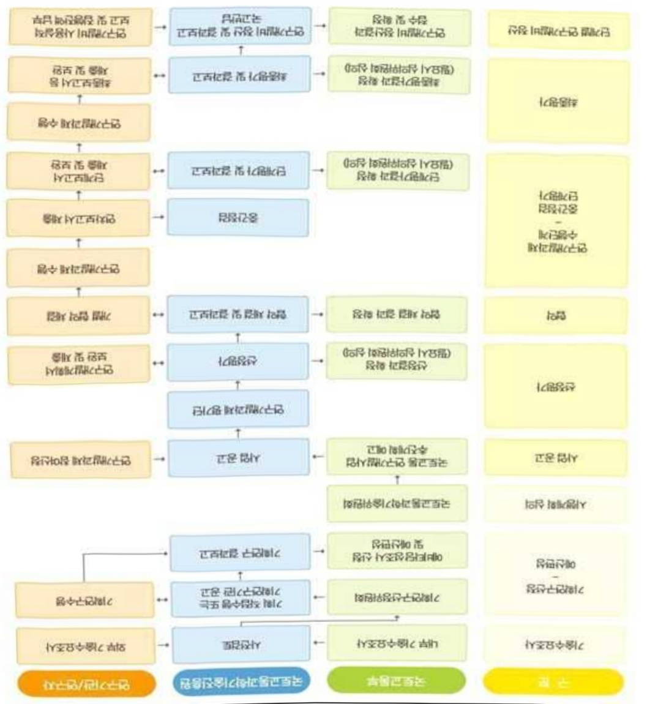

# 철도차량차륜자동검사시스템기술개발(R&D)

**해당 페이지**: PDF 2468 ~ 2475 쪽 해당

**부처**: 국토교통부
**분야**: 교통 및 물류
**회계유형**: 교통시설 특별회계
**2026 확정예산**: 2169.0 백만원
**전년대비 증감률**: None%
**AI 도메인**: 건설/스마트시티

---

### 가. 예산 총괄표

(단위: 백만원, %)

<table border=1 style='margin: auto; word-wrap: break-word;'><tr><td rowspan="2">사업명</td><td rowspan="2">2024년 결산</td><td colspan="2">2025년 예산</td><td colspan="2">2026년</td><td rowspan="2">중감(B-A)</td><td rowspan="2">(B-A)/A</td></tr><tr><td style='text-align: center; word-wrap: break-word;'>본예산(A)</td><td style='text-align: center; word-wrap: break-word;'>추경</td><td style='text-align: center; word-wrap: break-word;'>정부안</td><td style='text-align: center; word-wrap: break-word;'>확정(B)</td></tr><tr><td style='text-align: center; word-wrap: break-word;'>철도차량차륜자동검사 시스템기술개발(R&amp;D)</td><td style='text-align: center; word-wrap: break-word;'>-</td><td style='text-align: center; word-wrap: break-word;'>-</td><td style='text-align: center; word-wrap: break-word;'>-</td><td style='text-align: center; word-wrap: break-word;'>2,169</td><td style='text-align: center; word-wrap: break-word;'>2,169</td><td style='text-align: center; word-wrap: break-word;'>2,169</td><td style='text-align: center; word-wrap: break-word;'>순증</td></tr></table>

□ 기능별(내역사업별), 목별 예산 내역

(단위:백만원)

<table border=1 style='margin: auto; word-wrap: break-word;'><tr><td rowspan="3"></td><td colspan="5">2024</td><td colspan="7">2025(2025.12월 말 기준)</td><td rowspan="3">2026예산</td></tr><tr><td rowspan="2">예산액(추경)</td><td rowspan="2">예산현액</td><td rowspan="2">집행액[실집행액]</td><td rowspan="2">이월액</td><td rowspan="2">불용액</td><td rowspan="2">본예산</td><td rowspan="2">예산현액</td><td rowspan="2">집행액[실집행액]</td><td colspan="2">전년도 이월액제외</td><td rowspan="2">이월예상액</td><td rowspan="2">불용예상액</td></tr><tr><td style='text-align: center; word-wrap: break-word;'>예산현액</td><td style='text-align: center; word-wrap: break-word;'>집행액[실집행액]</td></tr><tr><td style='text-align: center; word-wrap: break-word;'>○ 기능별 분류(합계)</td><td style='text-align: center; word-wrap: break-word;'>-</td><td style='text-align: center; word-wrap: break-word;'>-</td><td style='text-align: center; word-wrap: break-word;'>-</td><td style='text-align: center; word-wrap: break-word;'>-</td><td style='text-align: center; word-wrap: break-word;'>-</td><td style='text-align: center; word-wrap: break-word;'>-</td><td style='text-align: center; word-wrap: break-word;'>-</td><td style='text-align: center; word-wrap: break-word;'>-</td><td style='text-align: center; word-wrap: break-word;'>-</td><td style='text-align: center; word-wrap: break-word;'>-</td><td style='text-align: center; word-wrap: break-word;'>-</td><td style='text-align: center; word-wrap: break-word;'>-</td><td style='text-align: center; word-wrap: break-word;'>2,169</td></tr><tr><td style='text-align: center; word-wrap: break-word;'>· 차륜관리기술기준및초음파정밀탐상·AI상태예측기술개발</td><td style='text-align: center; word-wrap: break-word;'>-</td><td style='text-align: center; word-wrap: break-word;'>-</td><td style='text-align: center; word-wrap: break-word;'>-</td><td style='text-align: center; word-wrap: break-word;'>-</td><td style='text-align: center; word-wrap: break-word;'>-</td><td style='text-align: center; word-wrap: break-word;'>-</td><td style='text-align: center; word-wrap: break-word;'>-</td><td style='text-align: center; word-wrap: break-word;'>-</td><td style='text-align: center; word-wrap: break-word;'>-</td><td style='text-align: center; word-wrap: break-word;'>-</td><td style='text-align: center; word-wrap: break-word;'>-</td><td style='text-align: center; word-wrap: break-word;'>-</td><td style='text-align: center; word-wrap: break-word;'>2,169</td></tr><tr><td style='text-align: center; word-wrap: break-word;'>○ 비목별 분류(합계)</td><td style='text-align: center; word-wrap: break-word;'>-</td><td style='text-align: center; word-wrap: break-word;'>-</td><td style='text-align: center; word-wrap: break-word;'>-</td><td style='text-align: center; word-wrap: break-word;'>-</td><td style='text-align: center; word-wrap: break-word;'>-</td><td style='text-align: center; word-wrap: break-word;'>-</td><td style='text-align: center; word-wrap: break-word;'>-</td><td style='text-align: center; word-wrap: break-word;'>-</td><td style='text-align: center; word-wrap: break-word;'>-</td><td style='text-align: center; word-wrap: break-word;'>-</td><td style='text-align: center; word-wrap: break-word;'>-</td><td style='text-align: center; word-wrap: break-word;'>-</td><td style='text-align: center; word-wrap: break-word;'>2,169</td></tr><tr><td style='text-align: center; word-wrap: break-word;'>· 연구활동비등(360-05)</td><td style='text-align: center; word-wrap: break-word;'>-</td><td style='text-align: center; word-wrap: break-word;'>-</td><td style='text-align: center; word-wrap: break-word;'>-</td><td style='text-align: center; word-wrap: break-word;'>-</td><td style='text-align: center; word-wrap: break-word;'>-</td><td style='text-align: center; word-wrap: break-word;'>-</td><td style='text-align: center; word-wrap: break-word;'>-</td><td style='text-align: center; word-wrap: break-word;'>-</td><td style='text-align: center; word-wrap: break-word;'>-</td><td style='text-align: center; word-wrap: break-word;'>-</td><td style='text-align: center; word-wrap: break-word;'>-</td><td style='text-align: center; word-wrap: break-word;'>-</td><td style='text-align: center; word-wrap: break-word;'>2,169</td></tr><tr><td style='text-align: center; word-wrap: break-word;'>○ 기능·비목별 분류(합계)</td><td style='text-align: center; word-wrap: break-word;'>-</td><td style='text-align: center; word-wrap: break-word;'>-</td><td style='text-align: center; word-wrap: break-word;'>-</td><td style='text-align: center; word-wrap: break-word;'>-</td><td style='text-align: center; word-wrap: break-word;'>-</td><td style='text-align: center; word-wrap: break-word;'>-</td><td style='text-align: center; word-wrap: break-word;'>-</td><td style='text-align: center; word-wrap: break-word;'>-</td><td style='text-align: center; word-wrap: break-word;'>-</td><td style='text-align: center; word-wrap: break-word;'>-</td><td style='text-align: center; word-wrap: break-word;'>-</td><td style='text-align: center; word-wrap: break-word;'>-</td><td style='text-align: center; word-wrap: break-word;'>2,169</td></tr><tr><td style='text-align: center; word-wrap: break-word;'>· 차륜관리기술기준및초음파정밀탐상·AI상태예측기술개발·연구활동비등(360-05)</td><td style='text-align: center; word-wrap: break-word;'>-</td><td style='text-align: center; word-wrap: break-word;'>-</td><td style='text-align: center; word-wrap: break-word;'>-</td><td style='text-align: center; word-wrap: break-word;'>-</td><td style='text-align: center; word-wrap: break-word;'>-</td><td style='text-align: center; word-wrap: break-word;'>-</td><td style='text-align: center; word-wrap: break-word;'>-</td><td style='text-align: center; word-wrap: break-word;'>-</td><td style='text-align: center; word-wrap: break-word;'>-</td><td style='text-align: center; word-wrap: break-word;'>-</td><td style='text-align: center; word-wrap: break-word;'>-</td><td style='text-align: center; word-wrap: break-word;'>-</td><td style='text-align: center; word-wrap: break-word;'>2,169</td></tr></table>

---

### 나. 사업설명자료

## 1 ) 사업목적·내용

- (차륜관리기술기준및초음파정밀탐상·AI상태예측기술개발) 동 내역사업은 차륜결합

(균열, 과손 등)에 따른 열차탈선 등 철도 대형사고 예방을 위한 국가 철도차량 차륜관리

기술기준 및 차륜 정밀탐상·AI 상태예측 자동검사시스템 기술개발을 지원하는 것임

## 2 ) 사업개요

## □ 사업근거 및 추진경위

① 법령상 근거 및 조항 적시

- 국토교통과학기술육성법 제8조(연구개발사업의 추진)

- 철도산업발전기본법 제11조(철도기술의 진흥 등)

- 철도안전법 제26조(철도차량 형식승인 등)

과기정통부「2026년도 정부연구개발 투자방향 및 기준(안)」(25.3)

AI 분야 글로벌 G3 도약을 목표로 국가AI컴퓨팅 인프라 및 원천기술, 공공·산업의 AX 확산을 위한 전방위적 집중 지원

- 제4차 철도안전종합계획('23~27)(21.10)

· 철도안전 분야의 첨단화 · 과학화를 통한 철도안전관리 실현

- 제4차 철도산업발전기본계획('21~'25)('22.4)

·디지털 기술 활용 철도차량 안전관리 및 데이터 기반의 스마트 철도안전관리 실현

- 제5차 국토종합계획('20～'40)('19.12)

· 첨단 기술을 활용한 인프라 유지관리 고도화 실현으로 국토 균형발전을 위한 국가철도망 구축

- 제4차 국가철도망 구축계획('21~30)('21.7)

· 철도 경쟁력 강화 및 국가 균형발전을 위해 ‘철도운영 효율성 제고’(용량부족

해소로 철도망 전체의 이용률 제고, 이동시간 획기적으로 단축 등)

- 국토부 고속열차 안전관리 및 신속대응 전략('22.03)

KTX 차륜 파손 사고('22.1월)를 계기로 고속열차 사고의 재발방지와 사고 발생 시

---

신속 대응을 주된 내용으로 철도차륜 초음파 탐상 정비기술을 일방향에서 입체탐상으로 고도화하고 탐상주기 또한 매45만 km에서 30만 km로 단축하는 방안 발표

② 추진경위

- (22.3.) 고속열차 안전관리 및 신속대응 전략(국토부)

-(22.9.) '철도차량 차륜 자동검사시스템 기술개발 기획' 착수

- (24.1~10) 기획보고서 발간 및 사업 추진방식 결정

□ 주요내용

① 사업규모

- 총사업비 : 해당없음

- 사업기간 : '26 ~ '29

- 최근 5년 간 투입된 사업비(예산액기준, 추경편성한 연도에는 추경포함)

<table border=1 style='margin: auto; word-wrap: break-word;'><tr><td style='text-align: center; word-wrap: break-word;'>연도</td><td style='text-align: center; word-wrap: break-word;'>2022</td><td style='text-align: center; word-wrap: break-word;'>2023</td><td style='text-align: center; word-wrap: break-word;'>2024</td><td style='text-align: center; word-wrap: break-word;'>2025</td><td style='text-align: center; word-wrap: break-word;'>2026</td></tr><tr><td style='text-align: center; word-wrap: break-word;'>사업비</td><td style='text-align: center; word-wrap: break-word;'>-</td><td style='text-align: center; word-wrap: break-word;'>-</td><td style='text-align: center; word-wrap: break-word;'>-</td><td style='text-align: center; word-wrap: break-word;'>-</td><td style='text-align: center; word-wrap: break-word;'>2,169</td></tr></table>

-기타: 해당없음

② 사업추진체계

- 사업시행방법 : 출연(참여기업이 있는 경우 Matching)

- 사업시행주체 : 국토교통부(전문기관 : 국토교통과학기술진흥원)

- 사업 수혜자 : 대학, 기업, 출연연 등

- 보조, 융자, 출연, 출자 등의 경우 보조·융자 등 지원 비율 및 법적근거

<table border=1 style='margin: auto; word-wrap: break-word;'><tr><td style='text-align: center; word-wrap: break-word;'>내역사업명</td><td style='text-align: center; word-wrap: break-word;'>구분</td><td style='text-align: center; word-wrap: break-word;'>피보조·피출연 등 기관명</td><td style='text-align: center; word-wrap: break-word;'>지원 금액 (2026예산)</td><td style='text-align: center; word-wrap: break-word;'>지원 비율(%)</td><td style='text-align: center; word-wrap: break-word;'>보조율 법적근거 (해당 조항)</td></tr><tr><td rowspan="3">차륜관리기술기준및초음파정밀탐상·AI상태예측기술개발</td><td rowspan="3">출연</td><td style='text-align: center; word-wrap: break-word;'>「중소기업기본법」제2조에 따른 중소기업에 해당하는 연구개발기관</td><td rowspan="3">2,169 백만원</td><td style='text-align: center; word-wrap: break-word;'>연구개발비의 100분의 75 이하</td><td rowspan="3">「국가연구개발혁신법 시행령」제19조</td></tr><tr><td style='text-align: center; word-wrap: break-word;'>「중전기업 성장촉진 및 경쟁력 강화에 관한 특별법」제2조제1호에 따른 중전기업에 해당하는 연구개발기관</td><td style='text-align: center; word-wrap: break-word;'>연구개발비의 100분의 70 이하</td></tr><tr><td style='text-align: center; word-wrap: break-word;'>「공공기관의 운영에 관한 법률」제5조제4항제1호에 따른 공기업에 해당하거나 ‘가’, ‘나’에 해당 해당하지 않는 연구개발기관</td><td style='text-align: center; word-wrap: break-word;'>연구개발비의 100분의 50 이하</td></tr></table>

* 다만, 중앙행정기관의 장이 필요하다고 인정하는 국가연구개발사업에 대하여 별도로 정할 수 있음

---

① 차륜관리기술기준 및 초음파정 밀탐상·AI상태예측기술개발

:(25)0→(26)2,169백만원,2,169백만원 증액

- (요구) 철도 유지보수체계 및 관련 법·제도 등 조사 분석, AI 기반 차륜 결함 검축 기술 개발 및 정밀 점검용 다채널 초음파 탐촉자 설계, 제작 등의 필요성이 인정되어 소요예산 2,169백만원 요구

- (산출) ① 철도 유지보수체계 및 관련 법제도 등 조사 분석, AI 기반 차륜 결함 검축 기술 개발 및

차륜 검축 다채널 초음파 탐촉자 설계, 제작 등 750백만원

② AI 알고리즘·모델 개발 및 학습, 정밀검사용 초음파 센서·제어기술 및 자동검사장치 기본 설계 등 1,419백만원

·(신규) 1개 × 2,892백만원 × 9/12 = 2,169백만원

2025년도 예산 및 2026년도 예산안 산출 세부내역 비교

<table border=1 style='margin: auto; word-wrap: break-word;'><tr><td colspan="2">&#x27;25년 예산</td><td colspan="2">&#x27;26년 예산</td></tr><tr><td style='text-align: center; word-wrap: break-word;'>예산</td><td style='text-align: center; word-wrap: break-word;'>산출내역</td><td style='text-align: center; word-wrap: break-word;'>예산</td><td style='text-align: center; word-wrap: break-word;'>산출내역</td></tr><tr><td style='text-align: center; word-wrap: break-word;'>-</td><td style='text-align: center; word-wrap: break-word;'>-</td><td style='text-align: center; word-wrap: break-word;'>2,169 백만원</td><td style='text-align: center; word-wrap: break-word;'>○ 연구활동비 등(360-05): 2,169백만원 가. 철도 유지보수체계 및 관련 법제도 등 조사 분석, AI 기반 차륜 결합 검축 기술 개발 및 차륜 검축 다채널 초음파 탐촉자 설계, 제작 등 1식x750백만원 나. AI 알고리즘모델 개발 및 학습, 정밀검사용 초음파 센서. 제어기술 및 자동검사장치 기본설계 등 1식x1,419백만원</td></tr></table>

## 4 ) 사업효과

□ 사업영향, 산출물 성과지표 등

① 2022~2026년도 성과계획서 상 성과지표 및 최근 5년간 성과 달성도 : 해당없음

② 성과지표 이외의 연도별 사업추진 경과 및 실적 : 해당없음

③ 향후(2026년도 이후) 기대효과

- 국가기술표준 마련으로 철도 운영기관의 유지보수 효율성·신뢰성 제고

* 운영사별 자체기준 → 국가기술표준, 결함분류 상세기준 및 조치사항 의무화

* 결함검출범위 확대 : 10%(차륜 표면 림부) → 90%(중앙부(웹부) 등)

결함검출률 90% 이상, 결함 탐지/분석 정밀도 1mm

* 편성당 검사 소요시간 단축(일상 50분 → 8분, 정밀 22시간 → 4시간)

- 인력 위주 유지보수업무 자동화로 인적오류 예방 및 철도 운행 안전성 향상

- 국가 주도의 연구개발(R&D)을 통한 차륜 초음파 탐상장비 가격경쟁력 확보로 해외 장비 도입 대비 약 4,950억원의 수입절감효과 발생 및 국내 철도산업 육성

<해외 장비 도입 시-국산화 개발 시 효율 비교> * 유지보수 비용 제외

<table border=1 style='margin: auto; word-wrap: break-word;'><tr><td style='text-align: center; word-wrap: break-word;'>구 분</td><td style='text-align: center; word-wrap: break-word;'>국내 수요처</td><td style='text-align: center; word-wrap: break-word;'>단위 비용</td><td style='text-align: center; word-wrap: break-word;'>추가비용</td><td style='text-align: center; word-wrap: break-word;'>합 계</td></tr><tr><td style='text-align: center; word-wrap: break-word;'>중국 Tycho社 제품</td><td style='text-align: center; word-wrap: break-word;'>70개</td><td style='text-align: center; word-wrap: break-word;'>150억원</td><td style='text-align: center; word-wrap: break-word;'>50억원(탐촉자 개발)</td><td style='text-align: center; word-wrap: break-word;'>1조 550억원</td></tr><tr><td style='text-align: center; word-wrap: break-word;'>국산화 개발품</td><td style='text-align: center; word-wrap: break-word;'>차량사업소</td><td style='text-align: center; word-wrap: break-word;'>80억원</td><td style='text-align: center; word-wrap: break-word;'>-</td><td style='text-align: center; word-wrap: break-word;'>5,600억원</td></tr><tr><td colspan="2">차 액</td><td style='text-align: center; word-wrap: break-word;'>△70억원</td><td style='text-align: center; word-wrap: break-word;'>△50억원</td><td style='text-align: center; word-wrap: break-word;'>△4,950억원</td></tr></table>

---

<table border=1 style='margin: auto; word-wrap: break-word;'><tr><td style='text-align: center; word-wrap: break-word;'>부처</td><td style='text-align: center; word-wrap: break-word;'></td><td style='text-align: center; word-wrap: break-word;'>피출연·피보조기관</td><td style='text-align: center; word-wrap: break-word;'>=&gt; (2,169백만원)</td><td style='text-align: center; word-wrap: break-word;'>간접보조사업자·사업수행자</td></tr><tr><td style='text-align: center; word-wrap: break-word;'>국토교통부 (2,169백만원)</td><td style='text-align: center; word-wrap: break-word;'>=&gt; (2,169백만원)</td><td style='text-align: center; word-wrap: break-word;'>국토교통과학 기술진흥원 (2,169백만원)</td><td style='text-align: center; word-wrap: break-word;'>=&gt; (2,169백만원)</td><td style='text-align: center; word-wrap: break-word;'>주관연구개발기관 등(미정)</td></tr></table>

<차륜관리기술기준및초음파정밀탐상·AI상태예측기술개발>

7)사업 집행절차

6) 총사업비 대상사업 여부 및 내역 : 해당없음

5) 타당성조사 및 예비타당성조사 시행여부 및 결과 요지 : 해당없음

---

8) 중기재정계획 상 연도별 투자계획 및 추진경과

(단위: 백만원)

<table border=1 style='margin: auto; word-wrap: break-word;'><tr><td style='text-align: center; word-wrap: break-word;'>2024~2028</td><td style='text-align: center; word-wrap: break-word;'>2024</td><td style='text-align: center; word-wrap: break-word;'>2025</td><td style='text-align: center; word-wrap: break-word;'>2026</td><td style='text-align: center; word-wrap: break-word;'>2027</td><td style='text-align: center; word-wrap: break-word;'>2028</td><td style='text-align: center; word-wrap: break-word;'>2029</td></tr><tr><td style='text-align: center; word-wrap: break-word;'>2025~2029</td><td style='text-align: center; word-wrap: break-word;'></td><td style='text-align: center; word-wrap: break-word;'></td><td style='text-align: center; word-wrap: break-word;'>7,524</td><td style='text-align: center; word-wrap: break-word;'>5,010</td><td style='text-align: center; word-wrap: break-word;'>4,208</td><td style='text-align: center; word-wrap: break-word;'></td></tr></table>

9) 최근 3년간 동 사업에 대한 주요 외부지적사항 및 평가, 문제점 및 대책 : 해당없음

## 10 ) 향후 추진방향 및 추진계획

□ 차륜결함(균열, 과손 등)에 따른 열차탈선 등 철도 대형사고 예방을 위한 국가

차원의 철도차량 차륜관리 기술기준 및 차륜 초음파 정밀탐상 · AI상태예측

자동검사시스템 개발

* 운영사별 자체기준 → 국가기술표준, 결함분류 상세기준 및 조치사항 의무화

* (인력) 수동검사 → (시스템) 자동검사, 기존 결합검출시간 50% 이상 단축

* (검사 범위 확대) 차륜 표면 림부 → 웹부, 플랜지부 및 차륜형상 자동 측정

<table border=1 style='margin: auto; word-wrap: break-word;'><tr><td style='text-align: center; word-wrap: break-word;'>구분</td><td style='text-align: center; word-wrap: break-word;'>AI 기술결함검출률</td><td style='text-align: center; word-wrap: break-word;'>정밀점검자동검사</td><td style='text-align: center; word-wrap: break-word;'>유지보수제계 및 관련 법·제도 정비</td></tr><tr><td style='text-align: center; word-wrap: break-word;'>성과목표</td><td style='text-align: center; word-wrap: break-word;'>·(검출률) 90% 이상·(분석정밀도) 1mm</td><td style='text-align: center; word-wrap: break-word;'>·(시간) 4시간/편성·(탐지정밀도) 1mm</td><td style='text-align: center; word-wrap: break-word;'>·유지보수 체계 개선(안) 및 차륜관리 기술기준(안)</td></tr><tr><td colspan="4">○ (중점1) 국가 차원의 차륜관리 기술기준 마련 및 법·제도 정비○ (중점2) AI기반 철도차륜 결함 분석 및 결함상태 예측 기술 개발○ (중점3) 정밀 검사용 차륜 로봇설비 자동 검사 기술 개발- 정밀 점검용 위상배열 초음파 센서 및 제어 기술 개발- 차륜 전반검사 자동화 기술 및 정밀 검사 통합 플랫폼 기술 개발</td></tr></table>

---

## 11 ) 해당사업에 대한 각종 사업평가의 결과

1) 「국가재정법」제85조의8제1항에 따른 재정사업자율평가 결과에 대한 기획재정부의 상위평가(심층평가) 결과 : 해당없음

2) R&D사업의 경우「국가연구개발사업 등의 성과평가 및 성과관리에 관한 법률」

제7조제3항에 따른 부처의 R&D사업 자체성과평가에 대한 과학기술정보통신부

상위평가 결과 : 해당없음

3) 그 외 보조사업 연장평가, 재정지원 일자리사업 평가 등 개별 법률에 규정된 평가

시행 결과 : 해당없음

## 12 ) 해당사업에 대한 부처 자체평가의 결과

1) 2023년도 부처 재정사업 자율평가 결과: 해당없음

2) 2024년도 부처 재정사업 자율평가 결과: 해당없음

3) 2025년도 부처 재정사업 자율평가 결과: 해당없음

## 13 ) 부처 건의사항 : 해당없음

---

<table border=1 style='margin: auto; word-wrap: break-word;'><tr><td style='text-align: center; word-wrap: break-word;'>사 업 명</td></tr><tr><td style='text-align: center; word-wrap: break-word;'>(9) 철도치안관리(2731-341)</td></tr></table>

□ 사업 코드 정보

<table border=1 style='margin: auto; word-wrap: break-word;'><tr><td style='text-align: center; word-wrap: break-word;'>구분</td><td style='text-align: center; word-wrap: break-word;'>회계</td><td style='text-align: center; word-wrap: break-word;'>소관</td><td style='text-align: center; word-wrap: break-word;'>실국(기관)</td><td style='text-align: center; word-wrap: break-word;'>계정</td><td style='text-align: center; word-wrap: break-word;'>분야</td><td style='text-align: center; word-wrap: break-word;'>부문</td></tr><tr><td style='text-align: center; word-wrap: break-word;'>코드</td><td style='text-align: center; word-wrap: break-word;'>11</td><td style='text-align: center; word-wrap: break-word;'>26</td><td rowspan="2">철도국</td><td rowspan="2"></td><td style='text-align: center; word-wrap: break-word;'>120</td><td style='text-align: center; word-wrap: break-word;'>122</td></tr><tr><td style='text-align: center; word-wrap: break-word;'>명칭</td><td style='text-align: center; word-wrap: break-word;'>일반회계</td><td style='text-align: center; word-wrap: break-word;'>국토교통부</td><td style='text-align: center; word-wrap: break-word;'>교통 및 물류</td><td style='text-align: center; word-wrap: break-word;'>철도</td></tr></table>

<table border=1 style='margin: auto; word-wrap: break-word;'><tr><td style='text-align: center; word-wrap: break-word;'>구분</td><td style='text-align: center; word-wrap: break-word;'>프로그램</td><td style='text-align: center; word-wrap: break-word;'>단위사업</td><td style='text-align: center; word-wrap: break-word;'>세부사업</td></tr><tr><td style='text-align: center; word-wrap: break-word;'>코드</td><td style='text-align: center; word-wrap: break-word;'>2700</td><td style='text-align: center; word-wrap: break-word;'>2731</td><td style='text-align: center; word-wrap: break-word;'>341</td></tr><tr><td style='text-align: center; word-wrap: break-word;'>명칭</td><td style='text-align: center; word-wrap: break-word;'>철도안전 및 운영</td><td style='text-align: center; word-wrap: break-word;'>철도안전(일반)</td><td style='text-align: center; word-wrap: break-word;'>철도치안관리</td></tr></table>

□ 사업 성격 (공통요구자료 Ⅱ-1 작성유의사항 4. 참조, 해당하는 사항에 “○” 표시)

<table border=1 style='margin: auto; word-wrap: break-word;'><tr><td rowspan="2">신규</td><td rowspan="2">계속</td><td rowspan="2">완료</td><td rowspan="2">예비타당성 실시여부</td><td rowspan="2">총사업비 관리대상</td><td rowspan="2">총액계상 예산사업</td><td style='text-align: center; word-wrap: break-word;'>사업소관 변경정보</td></tr><tr><td style='text-align: center; word-wrap: break-word;'>2025예산 시 소관</td></tr><tr><td style='text-align: center; word-wrap: break-word;'></td><td style='text-align: center; word-wrap: break-word;'>○</td><td style='text-align: center; word-wrap: break-word;'></td><td style='text-align: center; word-wrap: break-word;'></td><td style='text-align: center; word-wrap: break-word;'></td><td style='text-align: center; word-wrap: break-word;'></td><td style='text-align: center; word-wrap: break-word;'>국토교통부</td></tr></table>

□ 사업 지원 형태 및 지원을 (최소한 한 개는 반드시 선택하시오. 해당사항에 0 표시)

<table border=1 style='margin: auto; word-wrap: break-word;'><tr><td style='text-align: center; word-wrap: break-word;'>직접</td><td style='text-align: center; word-wrap: break-word;'>출자</td><td style='text-align: center; word-wrap: break-word;'>출연</td><td style='text-align: center; word-wrap: break-word;'>보조</td><td style='text-align: center; word-wrap: break-word;'>융자</td><td style='text-align: center; word-wrap: break-word;'>국고보조율(%)</td><td style='text-align: center; word-wrap: break-word;'>융자율(%)</td></tr><tr><td style='text-align: center; word-wrap: break-word;'>○</td><td style='text-align: center; word-wrap: break-word;'></td><td style='text-align: center; word-wrap: break-word;'></td><td style='text-align: center; word-wrap: break-word;'></td><td style='text-align: center; word-wrap: break-word;'></td><td style='text-align: center; word-wrap: break-word;'></td><td style='text-align: center; word-wrap: break-word;'></td></tr></table>

## □ 사업 담당자

<table border=1 style='margin: auto; word-wrap: break-word;'><tr><td style='text-align: center; word-wrap: break-word;'>사업명</td><td colspan="2">구분</td></tr><tr><td rowspan="5">철도치안 관리</td><td rowspan="3">소관부처</td><td style='text-align: center; word-wrap: break-word;'>실·국·과(팀)</td></tr><tr><td style='text-align: center; word-wrap: break-word;'>철도국</td></tr><tr><td style='text-align: center; word-wrap: break-word;'>철도안전정책과</td></tr><tr><td rowspan="2">사업시행주체</td><td style='text-align: center; word-wrap: break-word;'>철도특별사법경찰대기획과</td></tr><tr><td style='text-align: center; word-wrap: break-word;'>수사과</td></tr></table>

---

### 원본 PDF 크롭 이미지

