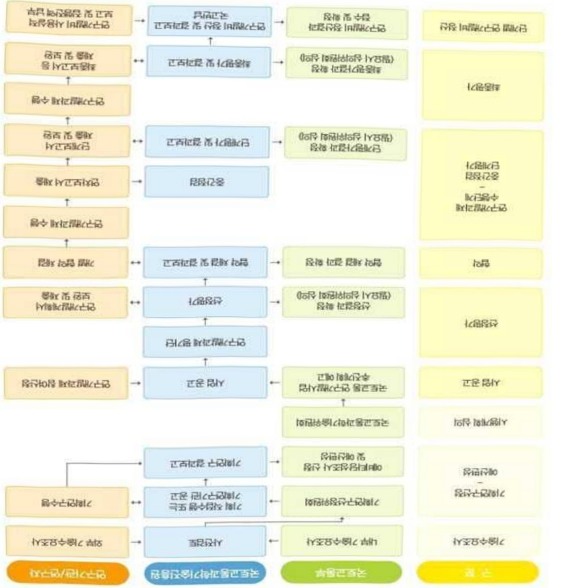
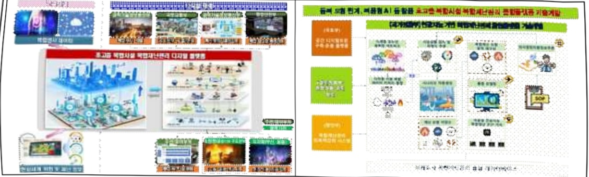
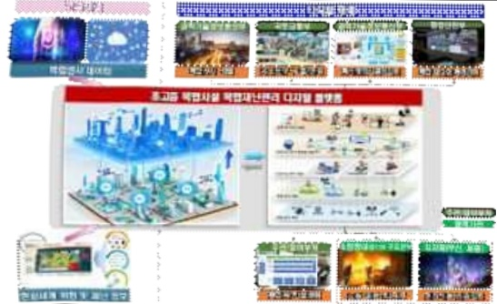
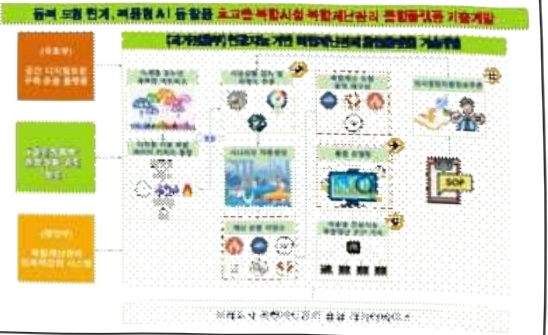

# 초고층 복합시설 복합재난관리 디지털플랫폼 기술개발(R&D)

**해당 페이지**: PDF 2484 ~ 2495 쪽 해당

**부처**: 국토교통부
**분야**: 교통 및 물류
**회계유형**: 일반회계
**2026 확정예산**: 2000.0 백만원
**전년대비 증감률**: None%
**AI 도메인**: 건설/스마트시티, 재난/안전

---

### 가.예산 총괄표

(단위: 백만원, %)

<table border=1 style='margin: auto; word-wrap: break-word;'><tr><td rowspan="2">사업명</td><td rowspan="2">2024년 결산</td><td colspan="2">2025년 예산</td><td colspan="2">2026년</td><td rowspan="2">증감(B-A)</td><td rowspan="2">(B-A)/A</td></tr><tr><td style='text-align: center; word-wrap: break-word;'>본예산(A)</td><td style='text-align: center; word-wrap: break-word;'>추경</td><td style='text-align: center; word-wrap: break-word;'>정부안</td><td style='text-align: center; word-wrap: break-word;'>확정(B)</td></tr><tr><td style='text-align: center; word-wrap: break-word;'>초고층복합시설 복합재난관리 디지털플랫폼 기술개발(R&amp;D)</td><td style='text-align: center; word-wrap: break-word;'>-</td><td style='text-align: center; word-wrap: break-word;'>-</td><td style='text-align: center; word-wrap: break-word;'>-</td><td style='text-align: center; word-wrap: break-word;'>2,000</td><td style='text-align: center; word-wrap: break-word;'>2,000</td><td style='text-align: center; word-wrap: break-word;'>2,000</td><td style='text-align: center; word-wrap: break-word;'>순증</td></tr></table>

□ 기능별(내역사업별), 목별 예산 내역

(단위:백만원)

<table border=1 style='margin: auto; word-wrap: break-word;'><tr><td rowspan="3"></td><td colspan="5">2024</td><td colspan="7">2025(2025.12월말 기준)</td><td rowspan="3">2026예산</td></tr><tr><td rowspan="2">예산액(추경)</td><td rowspan="2">예산현액</td><td rowspan="2">집행액[실집행액]</td><td rowspan="2">이월액</td><td rowspan="2">불용액</td><td rowspan="2">분예산</td><td rowspan="2">예산현액</td><td rowspan="2">집행액[실집행액]</td><td colspan="2">전년도 이월액제외</td><td rowspan="2">이월예상액</td><td rowspan="2">불용예상액</td></tr><tr><td style='text-align: center; word-wrap: break-word;'>예산현액</td><td style='text-align: center; word-wrap: break-word;'>집행액[실집행액]</td></tr><tr><td style='text-align: center; word-wrap: break-word;'>○ 기능별 분류(함께)</td><td style='text-align: center; word-wrap: break-word;'></td><td style='text-align: center; word-wrap: break-word;'></td><td style='text-align: center; word-wrap: break-word;'></td><td style='text-align: center; word-wrap: break-word;'></td><td style='text-align: center; word-wrap: break-word;'></td><td style='text-align: center; word-wrap: break-word;'></td><td style='text-align: center; word-wrap: break-word;'></td><td style='text-align: center; word-wrap: break-word;'></td><td style='text-align: center; word-wrap: break-word;'></td><td style='text-align: center; word-wrap: break-word;'></td><td style='text-align: center; word-wrap: break-word;'></td><td style='text-align: center; word-wrap: break-word;'></td><td style='text-align: center; word-wrap: break-word;'>2,000</td></tr><tr><td style='text-align: center; word-wrap: break-word;'>• 복합 재난 관리 공간 디지털 트윈 구축운용기술개발</td><td style='text-align: center; word-wrap: break-word;'></td><td style='text-align: center; word-wrap: break-word;'></td><td style='text-align: center; word-wrap: break-word;'></td><td style='text-align: center; word-wrap: break-word;'></td><td style='text-align: center; word-wrap: break-word;'></td><td style='text-align: center; word-wrap: break-word;'></td><td style='text-align: center; word-wrap: break-word;'></td><td style='text-align: center; word-wrap: break-word;'></td><td style='text-align: center; word-wrap: break-word;'></td><td style='text-align: center; word-wrap: break-word;'></td><td style='text-align: center; word-wrap: break-word;'></td><td style='text-align: center; word-wrap: break-word;'></td><td style='text-align: center; word-wrap: break-word;'>2,000</td></tr><tr><td style='text-align: center; word-wrap: break-word;'>○ 비목별 분류(함께)</td><td style='text-align: center; word-wrap: break-word;'></td><td style='text-align: center; word-wrap: break-word;'></td><td style='text-align: center; word-wrap: break-word;'></td><td style='text-align: center; word-wrap: break-word;'></td><td style='text-align: center; word-wrap: break-word;'></td><td style='text-align: center; word-wrap: break-word;'></td><td style='text-align: center; word-wrap: break-word;'></td><td style='text-align: center; word-wrap: break-word;'></td><td style='text-align: center; word-wrap: break-word;'></td><td style='text-align: center; word-wrap: break-word;'></td><td style='text-align: center; word-wrap: break-word;'></td><td style='text-align: center; word-wrap: break-word;'></td><td style='text-align: center; word-wrap: break-word;'>2,000</td></tr><tr><td style='text-align: center; word-wrap: break-word;'>• 연구 활동 비 등(360-05)</td><td style='text-align: center; word-wrap: break-word;'></td><td style='text-align: center; word-wrap: break-word;'></td><td style='text-align: center; word-wrap: break-word;'></td><td style='text-align: center; word-wrap: break-word;'></td><td style='text-align: center; word-wrap: break-word;'></td><td style='text-align: center; word-wrap: break-word;'></td><td style='text-align: center; word-wrap: break-word;'></td><td style='text-align: center; word-wrap: break-word;'></td><td style='text-align: center; word-wrap: break-word;'></td><td style='text-align: center; word-wrap: break-word;'></td><td style='text-align: center; word-wrap: break-word;'></td><td style='text-align: center; word-wrap: break-word;'></td><td style='text-align: center; word-wrap: break-word;'>2,000</td></tr><tr><td style='text-align: center; word-wrap: break-word;'>○ 기능·비목별 분류(함께)</td><td style='text-align: center; word-wrap: break-word;'></td><td style='text-align: center; word-wrap: break-word;'></td><td style='text-align: center; word-wrap: break-word;'></td><td style='text-align: center; word-wrap: break-word;'></td><td style='text-align: center; word-wrap: break-word;'></td><td style='text-align: center; word-wrap: break-word;'></td><td style='text-align: center; word-wrap: break-word;'></td><td style='text-align: center; word-wrap: break-word;'></td><td style='text-align: center; word-wrap: break-word;'></td><td style='text-align: center; word-wrap: break-word;'></td><td style='text-align: center; word-wrap: break-word;'></td><td style='text-align: center; word-wrap: break-word;'></td><td style='text-align: center; word-wrap: break-word;'>2,000</td></tr><tr><td style='text-align: center; word-wrap: break-word;'>• 복합 재난 관리 공간 디지털 트윈 구축운용기술개발</td><td style='text-align: center; word-wrap: break-word;'></td><td style='text-align: center; word-wrap: break-word;'></td><td style='text-align: center; word-wrap: break-word;'></td><td style='text-align: center; word-wrap: break-word;'></td><td style='text-align: center; word-wrap: break-word;'></td><td style='text-align: center; word-wrap: break-word;'></td><td style='text-align: center; word-wrap: break-word;'></td><td style='text-align: center; word-wrap: break-word;'></td><td style='text-align: center; word-wrap: break-word;'></td><td style='text-align: center; word-wrap: break-word;'></td><td style='text-align: center; word-wrap: break-word;'></td><td style='text-align: center; word-wrap: break-word;'></td><td style='text-align: center; word-wrap: break-word;'>2,000</td></tr><tr><td style='text-align: center; word-wrap: break-word;'>- 연구 활동 비 등(360-05)</td><td style='text-align: center; word-wrap: break-word;'></td><td style='text-align: center; word-wrap: break-word;'></td><td style='text-align: center; word-wrap: break-word;'></td><td style='text-align: center; word-wrap: break-word;'></td><td style='text-align: center; word-wrap: break-word;'></td><td style='text-align: center; word-wrap: break-word;'></td><td style='text-align: center; word-wrap: break-word;'></td><td style='text-align: center; word-wrap: break-word;'></td><td style='text-align: center; word-wrap: break-word;'></td><td style='text-align: center; word-wrap: break-word;'></td><td style='text-align: center; word-wrap: break-word;'></td><td style='text-align: center; word-wrap: break-word;'></td><td style='text-align: center; word-wrap: break-word;'>2,000</td></tr></table>

---

### 나. 사업설명자료

1) 사업목적·내용

- (초고층 복합시설 복합재난관리 디지털플랫폼 기술개발)

·농세부사업내용은지상·지하공간이상호연계된도심지복합공간에서의복합재난발생을

억제하고 피해를 줄이기 위해 초고층 복합시설 복합재난 회복력 강화를 위한 예측·예방

중심의 초고층 복합시설 복합재난관리 디지털플랫폼 개발을 지원하는 것임

- (복합재난관리 공간디지털트런 구축·운용기술 개발)

·동 내역 사업은 안전한 사회건설을 위해 초고층 복합시설을 대상으로 인공지능 등

디지털 기술을 활용한 재난 시뮬레이션을 위해 공간에 대한 세부적인 형상과 속성

정보들에 대해 높은 수준의 세밀도로 디지털트럴을 구축하는 것을 지원하는 것임

## 2 ) 사업개요

□ 사업근거 및 추진경위

① 법령상 근거 및 조항 적시

-「재난 및 안전관리 기본법」

0 (제25조) 시·군·구 안전관리계획의 수립

① 시장·군수·구청장은 재난 및 사고로부터 관할 구역 주민의 생명·신체 및 재산을 보호하기 위하여 시·도안전관리계획에 따라 지역 여건을 고려하여 매년 시·군·구의 재난 및 안전관리업무에 관한 계획(이하 “시·군·구안전관리계획”이라 한다)을 수립하여야 한다. <신설 2025. 4. 1.>

② 시·도지사는 시·도안전관리계획에 따라 매년 시·군·구안전관리계획의 수립지침을 작성하여 시장·군수·구청장에게 통보하여야 한다. <개정 2013. 8. 6., 2017. 1. 17., 2024. 1. 16., 2025. 4. 1.>

③ 시·군·구의 전부 또는 일부를 관할 구역으로 하는 제3조제5호나목에 따른 재난관리책임기관의 장은 매년 그 소관 재난 및 안전관리업무에 관한 계획을 작성하여 관할 시장·군수·구청장에게 제출하여야 한다. <개정 2013. 8. 6., 2024. 1. 16., 2025. 4. 1.>

④ 시장·군수·구청장은 제2항에 따라 통보받은 수립지침과 제3항에 따라 제출받은 재난 및 안전관리업무에 관한 계획을 종합하여 시·군·구안전관리계획을 작성하고 시·군·구위원회의 심의를 거쳐 확정한다. <개정 2013. 8. 6., 2017. 1. 17., 2025. 4. 1.>

⑤ 시장·군수·구청장은 제4항에 따라 확정된 시·군·구안전관리계획을 시·도지사에게 보고하고, 제3항에 따른 재난관리책임기관의 장에게 통보하여야 한다. <개정 2025. 4. 1.>

0 (제71조) 재난 및 안전관리에 필요한 과학기술의 진흥 등

① 정부는 재난 및 안전관리에 필요한 연구·실험·조사·기술개발(이하 “연구개발사업”이라 한다) 및 전문인력 양성 등 재난 및 안전관리 분야의 과학기술 진흥시책을 마련하여

---

추진하여야 한다.

② 행정안전부장관은 연구개발사업을 하는 데에 드는 비용의 전부 또는 일부를 예산의 범위에서 출연금으로 지원할 수 있다. <개정 2013. 3. 23., 2013. 8. 6., 2014. 11. 19., 2017. 7. 26.>

③ 행정안전부장관은 연구개발사업을 효율적으로 추진하기 위하여 다음 각 호의 어느 하나에 해당하는 기관·단체 또는 사업자와 협약을 맺어 연구개발사업을 실시하게 할 수 있다.

<개정 2013. 3. 23., 2014. 11. 19., 2016. 3. 22., 2017. 7. 26.>

1. 국공립 연구기관

2. 「특정연구기관 육성법」에 따른 특정연구기관

3. 「과학기술분야 정부출연연구기관 등의 설립·운영 및 육성에 관한 법률」에 따라 설립된 과학기술분야 정부출연연구기관

4. 「고등교육법」에 따른 대학·산업대학·전문대학 및 기술대학

5. '민법' 또는 다른 법률에 따라 설립된 법인으로서 재난 또는 안전 분야의 연구기관

6. 「기초연구진흥 및 기술개발지원에 관한 법률」 제14조의2제1항에 따라 인정받은 기업부설연구소 또는 기업의 연구개발전담부서

## o (제71조의2) 재난 및 안전관리기술개발 종합계획의 수립 등

① 행정안전부장관은 제71조제1항의 재난 및 안전관리에 관한 과학기술의 진흥을 위하여 5년마다 관계 중앙행정기관의 재난 및 안전관리기술개발에 관한 계획을 종합하여 조정위원회의 심의와 「국가과학기술자문회의법」에 따른 국가과학기술자문회의의 심의를 거쳐 재난 및 안전관리기술개발 종합계획(이하 “개발계획”이라 한다)을 수립하여야 한다.

<개정 2013. 3. 23., 2013. 8. 6., 2014. 11. 19., 2017. 7. 26., 2018. 1. 16.>

② 관계 중앙행정기관의 장은 개발계획에 따라 소관 업무에 관한 해당 연도 시행계획을 수립하고 추진하여야 한다.

③ 개발계획 및 시행계획에 포함하여야 할 사항 및 계획수립의 절차 등에 관하여는 대통령령으로 정한다.

## o (제72조) 연구개발사업 성과의 사업화 지원

① 행정안전부장관은 연구개발사업의 성과를 사업화하는「중소기업기본법」제2조에 따른 중소기업(이하“중소기업”이라 한다)이나 그 밖의 법인 또는 사업자 등에 대하여 다음 각호의 지원을 할 수 있다. 이 경우 중소기업에 대한 지원을 우선적으로 실시할 수 있다.

<개정 2013. 3. 23., 2014. 11. 19., 2017. 1. 17., 2017. 7. 26.>

1. 시제품(試製品)의 개발·제작 및 설비투자에 필요한 비용의 지원

2. 연구개발사업의 성과로 발생한 특허권 등 지식재산권의 전용실시권(専用實施權) 또는 통상실시권(通常實施權)의 설정·허락 또는 그 알선

3. 사업화로 생산된 재난 및 안전 관련 제품 등의 우선 구매

4. 연구개발사업에 사용되거나 생산된 기기·설비 및 시제품 등의 사용권 부여 또는 그 알선

5. 그 밖에 사업화를 위하여 필요한 사항으로서 행정안전부령으로 정하는 사항

② 제1항에 따른 지원의 방법 및 절차 등에 관하여 필요한 사항은 대통령령으로 정한다.

-「초고층 건축물과 지하연계 복합건축물 재난관리에 관한 특별법」

## 0(제2조)정의

1.“초고층 건축물”이란 층수가 50층 이상 또는 높이가 200미터 이상인 건축물을 말한다(「건축법」 제84조에 따른 높이 및 층수를 말한다. 이하 같다).

2. “지하연계 복합건축물”이란 다음 각 목의 요건을 모두 갖춘 것을 말한다.

가. 층수가 11층 이상이거나 1일 수용인원이 5천명 이상인 건축물로서 지하부분이 지하역사 또는 지하도상가와 연결된 건축물

나. 건축물 안에「건축법」제2조제2항제5호에 따른 문화 및 집회시설, 같은 항 제7호에

---

따른 판매시설, 같은 항 제8호에 따른 운수시설, 같은 항 제14호에 따른 업무시설, 같은 항 제15호에 따른 숙박시설, 같은 항 제16호에 따른 위락(慰樂)시설 중 유원시설업(遊園施設業)의 시설 또는 대통령령으로 정하는 용도의 시설이 하나 이상 있는 건축물

3. 관계지역"이란 제3조에 따른 건축물 및 시설물(이하 “초고층 건축물등”이라 한다)과 그 주변지역을 포함하여 재난의 예방·대비·대응 및 수습 등의 활동에 필요한 지역으로 대통령령으로 정하는 지역을 말한다.

4. 일반건축물등"이란 관계지역 안에서 초고층 건축물등을 제외한 건축물 또는 시설물을 말한다.

5. 관리주체"란 초고층 건축물등 또는 일반건축물등의 소유자 또는 관리자(그 건축물등의 소유자와 관리계약 등에 따라 관리책임을 진지를 포함한다)를 말한다.

6.“관계인”이란 해당 초고층 건축물등 또는 일반건축물등의 소유자·관리자 또는 점유자를 말한다.

7. 총괄재단관리사단 해방 논고층 건축물등의 재단 및 안전관리 업무를 총괄하는 자를 말한다.

8. “유해 · 위험물질”이란 유독물 · 독성가스 · 가연성가스 · 위험물 등 사람에게 유해하거나 화재 또는 폭발의 위험성이 있는 물질로서 그 종류 및 범위는 대통령령으로 정한다.

## 0 제16조(종합방재실의 설치·운영)

① 초고층 건축물등의 관리주체는 그 건축물등의 건축·소방·전기·가스 등 안전관리 및 방범·보안·테러 등을 포함한 통합적 재난관리를 효율적으로 시행하기 위하여 종합방재실을 설치·운영하여야 하며, 관리주체 간 종합방재실을 통합하여 운영할 수 있다.

② 제1항에 따른 종합방재실은「소방기본법」 제4조에 따른 종합상황실과 연계되어야 한다.

③ 관계지역 내 관리주체는 제1항에 따른 종합방재실(일반건축물등의 방재실 등을 포함한다) 간 재난 및 안전정보 등을 공유할 수 있는 정보망을 구축하여야 하며, 유사시 서로 긴급연락이 가능한 경보 및 통신설비를 설치하여야 한다.

④ 종합방재실의 설치기준 등 필요한 사항은 행정안전부령으로 정한다. <개정 2013. 3. 23., 2014. 11. 19., 2017. 7. 26.>

## 0 제17조(종합재난관리체제의 구축)

① 초고층 건축물등의 관리주체는 관계지역 안에서 재난의 신속한 대응 및 재난정보 공유·전파를 위한 종합재난관리체제를 종합방재실에 구축·운영하여야 한다.

② 제1항에 따른 종합재난관리체제의 구축 시 다음 각 호의 사항이 포함되어야 한다. <개정 2024. 2. 13.>

1. 재난대 응체제

2. 재난·테러 및 안전 정보관리체제

3. 그 밖에 관리주체가 필요로 하는 사항

## 0 제18조(피난안전구역 설치)

① 초고층 건축물등의 관리주체는 그 건축물등에 재난발생 시 상시근무자, 거주자 및 이용자가 대피할 수 있는 피난안전구역을 설치·운영하여야 한다.

② 제1항에 따른 피난안전구역의 기능과 성능에 지장을 초래하는 폐쇄 · 차단 등의 행위를 하여서는 아니 된다.

③ 피난안전구역의 설치·운영 기준 및 규모는 대통령령으로 정한다.

## 0 제21조(재난대응 및 지원체계의 구축)

① 시·도지사 및 시장·군수·구청장은 초고층 건축물등(일반건축물등을 포함한다)에서 재난 발생 시 피해를 줄이기 위한 예방·대비·대응·지원 및 긴급구조·화재진압·구호 등 지원체계(이하 “재난대응 및 지원체계”라 한다)를 구축·운영하여야 한다. <개정 2024. 2.

---

13. $ >0 $

② 재난대응 및 지원체계의 구축·운영 등에 대하여 필요한 사항은 행정안전부령으로 정한다.

<개정 2013. 3. 23., 2014. 11. 19., 2017. 7. 26.>

## 0 제22조(초기대응대 구성·운영)

① 초고층 건축물등의 관리주체는 신속한 초기 대응을 위하여 초기대응대를 구성·운영하여야 한다.

② 초기대응대의 구성·운영, 교육·훈련 및 장비 등에 관하여 필요한 사항은 행정안전부령으로 적한다. <개정 2013. 3. 23., 2014. 11. 19., 2017. 7. 26.>

o 제23조(재난정보의 공유 및 전파) 초고층 건축물등의 관리주체는 그 건축물등의 재난에 관한 정보를 관계지역 안의 상시근무자, 거주자 및 이용자에게 신속하게 전파 및 공유하여야 한다.

## 0 제24조(대피 및 피난유도)

① 대표총괄재난관리자 및 총괄재난관리자는 「재난 및 안전관리 기본법」 제40조에 따른 대피명령 이전에 현장상황이 긴급하다고 판단될 때에는 상시근무자, 거주자 및 이용자에 대한 대피조치를 할 수 있고, 입점자 및 안전요원으로 하여금 피난종료 시까지 피난유도를 하도록 하여야 한다.

② 제1항에 따라 대피조치 및 피난유도를 받은 자는 즉시 이에 응하여야 한다.

③ 초고층 건축물등의 관리주체는 그 건축물등의 상시근무자, 거주자 및 이용자가 신속한 위치정보를 파악하여 대피할 수 있도록 위치정보알림판, 피난유도 안내시설 및 영상물 등을 제공하여야 한다.

## -「정보통신산업진흥법」

## o (제7조) 정보통신기술진흥 시행계획

① 과학기술정보통신부장관은 정보통신기술의 진흥을 위하여 진흥계획에 따라 다음 각 호의 사항이 포함된 정보통신기술진흥 시행계획을 매년 수립 · 시행하여야 한다.

1. 정보통신기술 수준의 조사, 개발된 정보통신기술의 평가 및 활용에 관한 사항

2. 정보통신기술 관련 정보의 원활한 유통에 관한 사항

3. 정보통신기술의 연구개발 및 다른 기술과의 결합 및 융합 촉진에 관한 사항

4. 정보통신기술의 협력, 지도 및 이전에 관한 사항

5. 정보통신기술에 관한 산학협동 촉진에 관한 사항

6. 전문인력의 양성 및 수급에 관한 사항

7. 정보통신기술의 표준화 및 새로운 정보통신기술의 채택에 관한 사항

8. 정보통신기술을 연구하는 기관 또는 단체의 육성에 관한 사항

9. 정보통신기술의 국제협력에 관한 사항

10. 그 밖에 정보통신기술의 진흥을 위하여 필요한 사항

② 지방자치단체의 장은 진흥계획에 따른 중·장기 정책목표 및 방향을 지역 특성에 맞게 이행하기 위하여 필요한 경우 과학기술정보통신부장관과 협의하여 지역 정보통신산업 시행계획을 수립·시행할 수 있다.

③ 과학기술정보통신부장관 및 지방자치단체의 장은 제1항 및 제2항에 따른 사항을 효율적으로 추진하기 위하여 필요하면 대통령령으로 정하는 바에 따라 정보통신기술의 개발 및 정보통신산업의 진흥과 관련된 연구기관 및 단체로 하여금 이를 대행하게 할 수 있으며 이에 드는 비용을 지원할 수 있다.

④ 제1항 및 제2항에 따른 정보통신기술진흥 시행계획의 수립·시행 등에 필요한 사항은 대통령령으로 정한다.

-「정보통신 진흥 및 융합 활성화 등에 관한 특별법」

---

0 (제32조) 정보통신 융합 등 기술·서비스 개발 등의 지원

① 과학기술정보통신부장관은 다른 산업 및 서비스 등에 정보통신의 접목을 통하여 생산성과 가치를 높일 수 있도록 노력하여야 한다. <개정 2017. 7. 26.>

② 과학기술정보통신부장관은 정보통신융합등 기술·서비스의 개발을 촉진하기 위하여 다음 각 호의 사업을 추진할 수 있다. <개정 2017. 7. 26.>

1. 정보통신융합등 기술·서비스 관련 연구개발 사업

2. 제1호에 따라 추진되는 과제에 대한 기획·평가·관리

3. 국가·지방자치단체, 대학·정부출연연구기관, 민간 등이 보유한 정보통신융합등 기술의 거래 등 기술이전을 위한 중개·알선 지원

4. 정보통신융합등 기술에 대한 평가 및 평가 기법의 개발·보급

5. 정보통신융합등 기술의 기술이전·사업화에 관한 통계조사·연구 등 관련 정보의 수집·분석·제공

6. 정보통신융합등 기술의 기술이전 후 상용화 연구개발 지원

7. 정보통신융합등 기술의 기술사업화 전문인력 양성

8. 정보통신융합등 기술의 기술거래 · 사업화 촉진을 위한 정보시스템 구축 · 활용

9. 지식재산권 등 정보통신융합등 기술 관련 연구성과물의 관리·홍보·활용

10. 정보통신융합등 기술·서비스의 수준조사 등 정책연구 사업

11. 정보통신융합등 기술·서비스 관련 시범사업

12. 그 밖에 정보통신기술진흥을 위하여 필요한 사업

③ 과학기술정보통신부장관은 제2항 각 호의 사업을 추진하기 위하여 법인인 전담기관을 설립하거나 법인·단체에 위탁·운영할 수 있으며, 필요한 비용의 전부 또는 일부를 예산의 범위에서 출연 또는 보조할 수 있다. <개정 2017. 7. 26.>

④ 중앙행정기관의 장 및 지방자치단체의 장은 제2항 각 호의 사업을 제3항에 따른 전담기관으로 하여금 수행하게 하고, 그에 소요되는 비용의 전부 또는 일부를 지원할 수 있다.

⑤ 제3항에 따른 전담기관에 관하여 이 법에서 정한 것을 제외하고는「민법」중 재단법인에 관한 규정을 준용하며, 전담기관의 운영 및 제2항 각 호의 업무수행에 필요한 사항은 대통령령으로 정한다.

## ② 추진경위 및 근거

- (국정과제 31) 미래 모빌리티와 'K-AI시티' 실현

- (국정과제 72) 국민안전 보장을 위한 재난안전관리체계 확립

- (국정과제 73) 재난피해 최소화를 위한 예방 · 대응 강화

- '23.6 월 : 다부처공동기획연구지원사업(KISTEP) 신규과제 접수, 서면평가 및 대상과제 선정

- ~22.12월 : 다부처공동기획연구지원사업 수행

- '24.01 월 : 다부처공동기획연구 최종후보 주제선정

- '24.12월 : 부처협업사업 관련 부처 협의(과기정통부, 국토부, 행안부)

---

## □ 주요내용

① 사업규모

- 총사업비 : 해당없음

- 사업기간 : '26 ~ '28

- 최근 5년 간 투입된 사업비(예산액기준, 추경편성한 연도에는 추경포함)

<table border=1 style='margin: auto; word-wrap: break-word;'><tr><td style='text-align: center; word-wrap: break-word;'>연도</td><td style='text-align: center; word-wrap: break-word;'>2022</td><td style='text-align: center; word-wrap: break-word;'>2023</td><td style='text-align: center; word-wrap: break-word;'>2024</td><td style='text-align: center; word-wrap: break-word;'>2025</td><td style='text-align: center; word-wrap: break-word;'>2026</td></tr><tr><td style='text-align: center; word-wrap: break-word;'>사업비</td><td style='text-align: center; word-wrap: break-word;'>-</td><td style='text-align: center; word-wrap: break-word;'>-</td><td style='text-align: center; word-wrap: break-word;'>-</td><td style='text-align: center; word-wrap: break-word;'>-</td><td style='text-align: center; word-wrap: break-word;'>2,000</td></tr></table>

- 기타: 해당없음

② 사업추진체계

- 사업시행방법 : 출연

- 사업시행주체 : 국토교통부(전문기관 : 국토교통과학기술진흥원)

- 사업 수혜자 : 대학, 기업, 출연연 등

- 보조, 융자, 출연, 출자 등의 경우 보조·융자 등 지원 비율 및 법적근거

<table border=1 style='margin: auto; word-wrap: break-word;'><tr><td style='text-align: center; word-wrap: break-word;'>내역사업명</td><td style='text-align: center; word-wrap: break-word;'>구분</td><td style='text-align: center; word-wrap: break-word;'>피보조·피출연 등 기관명</td><td style='text-align: center; word-wrap: break-word;'>지원 금액 (2026예산)</td><td style='text-align: center; word-wrap: break-word;'>지원 비율(%)</td><td style='text-align: center; word-wrap: break-word;'>보조율 법적근거 (해당 조항)</td></tr><tr><td rowspan="3">복합재난관리 공간디지털 트윈구축·운용기술개발</td><td rowspan="3">출연</td><td style='text-align: center; word-wrap: break-word;'>「중소기업기본법」제2조에 따른 중소기업에 해당하는 연구개발기관</td><td rowspan="3">2,000 백만원</td><td style='text-align: center; word-wrap: break-word;'>연구개발비의 100분의 75 이하</td><td rowspan="3">「국가연구개발혁신법 시행령」제19조</td></tr><tr><td style='text-align: center; word-wrap: break-word;'>「중견기업 성장촉진 및 경쟁력 강화에 관한 특별법」제2조제1호에 따른 중견기업에 해당하는 연구개발기관</td><td style='text-align: center; word-wrap: break-word;'>연구개발비의 100분의 70 이하</td></tr><tr><td style='text-align: center; word-wrap: break-word;'>「공공기관의 운영에 관한 법률」제5조제4항제1호에 따른 공기업에 해당하거나 ‘가’, ‘나’에 해당 해당하지 않는 연구개발기관</td><td style='text-align: center; word-wrap: break-word;'>연구개발비의 100분의 50 이하</td></tr></table>

* 다만, 중앙행정기관의 장이 필요하다고 인정하는 국가연구개발사업에 대하여 별도로 정할 수 있음

---

## 3 ) 2026년도 예산 산출 근거

①복합재난관리 공간디지털트원 구축·운용기술 개발

:(25)0백만원→(26요구)2,000백만원,순증

- (요구) 3차원 고정밀 데이터 생성 및 구조화, 대용량 시계열 관리 기술 개발, 시스템 운용 최적화를 위한 필요성이 인정되어 신규 소요예산 2,000백만원 요구

- (산출) ① 실내외 고정밀 3차원 공간 데이터 생성 및 구조화 800백만원

②Geo-IT 공간구성을 통한 현실-가상세계 공간 동기화 기술 400백만원

③ 초고층 복합시설 공간디지털트윈 플랫폼 기술 개발 및 기술·데이터·체계 표준화 800백만원

·(신규) 1개 × 2,667백만원 × 9/12개월 = 2,000백만원

0 2025년도 예산 및 2026년도 예산 산출 세부내역 비교

<table border=1 style='margin: auto; word-wrap: break-word;'><tr><td colspan="2">2025년 예산</td><td colspan="2">2026년 예산</td></tr><tr><td style='text-align: center; word-wrap: break-word;'>예산</td><td style='text-align: center; word-wrap: break-word;'>산출내역</td><td style='text-align: center; word-wrap: break-word;'>예산</td><td style='text-align: center; word-wrap: break-word;'>산출내역</td></tr><tr><td style='text-align: center; word-wrap: break-word;'>-</td><td style='text-align: center; word-wrap: break-word;'>-</td><td style='text-align: center; word-wrap: break-word;'>복합재난 관리공간 디지털 트윈구축 운용기술 개발 2,000</td><td style='text-align: center; word-wrap: break-word;'>○ 연구개발활동비등(360-05): 2,000백만원 - 초고층 복합시설 복합재난관리 디지털플랫폼 기술개발 2,000백만원 • (신규) 1개 과제 x 2,667백만원 x 9/12개월 = 2,000백만원 ① 실내외 고정밀 3차원 공간 데이터 생성 및 구조화 800백만원 ② Geo-IT 공간구성을 통한 현실-가상세계 공간 동기화 기술 400백만원 ③ 초고층 복합시설 공간디지털트윈 플랫폼 기술 개발 및 기술 • 데이터·체계 표준화 800백만원</td></tr></table>

## 4 ) 사업효과

□ 사업영향, 산출물 성과지표 등

① 2022~2026년도 성과계획서 상 성과지표 및 최근 5년간 성과 달성도 : 해당없음

* '26년 신규사업으로 향후 과학기술정통부에서 전략계획서 제출 예정

② 성과지표 이외의 연도별 사업추진 경과 및 실적 : 해당없음

③향후(2026년도 이후)기대효과

- (과학·기술) 기존 대응중심·매뉴얼 중심의 재난안전관리 체계에서 예측·예방 중심 적극적 재난관리 체계 구축 및 초고층 복합시설 복합재난 피해 저감을 위한 핵심 기술 확보

- (경제) ICT 기술이 융합된 디지털트런 기술 모듈화를 통해 요소 기술 단위로 관련 산업에 확대 적용하여 재난안전분야 및 타 산업분야와 동반성장을 위한 생태계 조성

- (사회) 초고층 복합시설 복합재난 피해를 예방·저감하여 인명과 재산 피해 최소

화 및 전조 감지 인프라·효율적인 복합재난관리 시스템 체계 구축을 통한 재난

안전관리 역량 강화

## 5 ) 타당성조사 및 예비타당성조사 시행여부 및 결과 요지 : 해당없음

---

<table border=1 style='margin: auto; word-wrap: break-word;'><tr><td style='text-align: center; word-wrap: break-word;'>부처</td><td style='text-align: center; word-wrap: break-word;'></td><td style='text-align: center; word-wrap: break-word;'>피출연·피보조기관</td><td style='text-align: center; word-wrap: break-word;'>간접보조사업자·사업수행자</td></tr><tr><td style='text-align: center; word-wrap: break-word;'>국토교통부(2,000백만원)</td><td style='text-align: center; word-wrap: break-word;'>=&gt;(2,000백만원)</td><td style='text-align: center; word-wrap: break-word;'>국토교통과학기술진흥원(2,000백만원)</td><td style='text-align: center; word-wrap: break-word;'>=&gt;(2,000백만원)</td></tr></table>

<복합재난관리 공간디지털트윈 구축·운용기술 개발>

7)사업 집행절차

---

## 8 ) 중기재정계획 상 연도별 투자계획 및 추진경과

(단위: 백만원)

<table border=1 style='margin: auto; word-wrap: break-word;'><tr><td style='text-align: center; word-wrap: break-word;'>2024</td><td style='text-align: center; word-wrap: break-word;'>2025</td><td style='text-align: center; word-wrap: break-word;'>2026</td><td style='text-align: center; word-wrap: break-word;'>2027</td><td style='text-align: center; word-wrap: break-word;'>2028</td><td style='text-align: center; word-wrap: break-word;'>2029</td></tr><tr><td style='text-align: center; word-wrap: break-word;'>2024~2028</td><td style='text-align: center; word-wrap: break-word;'>-</td><td style='text-align: center; word-wrap: break-word;'>-</td><td style='text-align: center; word-wrap: break-word;'>-</td><td style='text-align: center; word-wrap: break-word;'>-</td><td style='text-align: center; word-wrap: break-word;'>-</td></tr><tr><td style='text-align: center; word-wrap: break-word;'>2025~2029</td><td style='text-align: center; word-wrap: break-word;'>-</td><td style='text-align: center; word-wrap: break-word;'>2,000</td><td style='text-align: center; word-wrap: break-word;'>2,000</td><td style='text-align: center; word-wrap: break-word;'>2,000</td><td style='text-align: center; word-wrap: break-word;'>2,000</td></tr></table>

※ 중기사업계획에서는 미래도시복합재난관리디지털플랫폼기술개발(R&D) 과제명으로 제출되었음

9) 최근 3년간 동 사업에 대한 주요 외부지적사항 및 평가, 문제점 및 대책 : 해당없음

## 10 ) 향후 추진방향 및 추진계획

## [중점투자 분야 및 기술]

°(목표) 지상·지하 공간이 상호연계된 도심지 복합공간에서의 복합재난 발생을 억제하고 피해를 줄이기 위한 초고층 복합시설 복합재난 회복력 강화를 위한 예측·예방 중심의 전주기(복합)재난 디지털플랫폼 개발

- (재난안전) 복합공간에서 발생할 수 있는 안전사고는 물론 공간의 연결성 시설의 복잡성 등에 의한 대규모 재난이나 복합재난에 대한 효과적 예방 및 대응을 위한 초고층 복합시설 복합재난관리 디지털 플랫폼 개발

※ 대상 복합재난: 집중호우(침수), 강풍(빌딩풍), 폭염, 화재, 지진, 미세먼지, 압사사고

- (초고층 복합시설) 시민들의 경제적 활동 및 위락 활동을 위한 시설물이 집중된 도심지 복합시설에서 발생하는 재난에 대한 피해 저감

- (플랫폼) 디지털트윈, 인공지능, 빅데이터, IoT 등 다양한 ICT 기술, 재난안전관리 기술, 공간정보기술 등을 활용한 초고층 복합시설 복합재난관리 기술 융합 플랫폼 개발

---

## [연도별 예산 투입계획]

(단위 : 억원)

<table border=1 style='margin: auto; word-wrap: break-word;'><tr><td style='text-align: center; word-wrap: break-word;'>내역사업명</td><td style='text-align: center; word-wrap: break-word;'>구분</td><td style='text-align: center; word-wrap: break-word;'>&#x27;26</td><td style='text-align: center; word-wrap: break-word;'>&#x27;27</td><td style='text-align: center; word-wrap: break-word;'>&#x27;28</td><td style='text-align: center; word-wrap: break-word;'>&#x27;29</td><td style='text-align: center; word-wrap: break-word;'>합계</td></tr><tr><td style='text-align: center; word-wrap: break-word;'>복합재난관리</td><td style='text-align: center; word-wrap: break-word;'>국비</td><td style='text-align: center; word-wrap: break-word;'>20</td><td style='text-align: center; word-wrap: break-word;'>30</td><td style='text-align: center; word-wrap: break-word;'>30</td><td style='text-align: center; word-wrap: break-word;'>-</td><td style='text-align: center; word-wrap: break-word;'>80</td></tr><tr><td rowspan="2">공간디지털트런</td><td style='text-align: center; word-wrap: break-word;'>지방비</td><td style='text-align: center; word-wrap: break-word;'>-</td><td style='text-align: center; word-wrap: break-word;'>-</td><td style='text-align: center; word-wrap: break-word;'>-</td><td style='text-align: center; word-wrap: break-word;'>-</td><td style='text-align: center; word-wrap: break-word;'>-</td></tr><tr><td style='text-align: center; word-wrap: break-word;'>민자</td><td style='text-align: center; word-wrap: break-word;'>-</td><td style='text-align: center; word-wrap: break-word;'>-</td><td style='text-align: center; word-wrap: break-word;'>-</td><td style='text-align: center; word-wrap: break-word;'>-</td><td style='text-align: center; word-wrap: break-word;'>-</td></tr><tr><td style='text-align: center; word-wrap: break-word;'>구축·운용기술 개발</td><td style='text-align: center; word-wrap: break-word;'>계</td><td style='text-align: center; word-wrap: break-word;'>20</td><td style='text-align: center; word-wrap: break-word;'>30</td><td style='text-align: center; word-wrap: break-word;'>30</td><td style='text-align: center; word-wrap: break-word;'>-</td><td style='text-align: center; word-wrap: break-word;'>80</td></tr></table>

※ 민자(민간부담금)는 실 참여 영리기관 규모에 따라 추후 변동가능

## [재원조달 방안]

° '26 ~ '28년 3년간 총 80억원(출연금 80억원)으로, 각 주관 및 협력부처는 자체 R&D 사업예산, 국가연구개발사업 투자예산 등으로 재원 확보

- '26년-'28년간 총 3년 수행하며, 총 255억 원의 예산을 투입에 대해 3개 부처

(과기정통부(100억), 국토부(80억), 행안부(75억))와 사전 참여의향 협의 완료

## [향후 추진방향]

□ 복합재난관리 공간 디지털트윈 구축·운용 기술개발

°(중점1)실내외고정밀3차원공간디지털가상화기술

° (중점2) Geo-IoT 공간 구성을 통한 현실-가상세계 공간 동기화 기술

°(중점3)복합재난관리를위한공간디지털트윈플랫폼개발

°(중점4)국내외복합재난관리기술·데이터·체계표준화

(중점5) 복합재난관리 디지털플랫폼 현장적용 실증서비스

11) 해당사업에 대한 각종 사업평가의 결과 : 해당없음

12) 해당사업에 대한 부처 자체평가의 결과 : 해당없음

13) 부처 건의사항 : 해당없음

---

<table border=1 style='margin: auto; word-wrap: break-word;'><tr><td style='text-align: center; word-wrap: break-word;'>사 업 명</td></tr><tr><td style='text-align: center; word-wrap: break-word;'>(5) 초연결지능도시 핵심기반 기술개발(R&amp;D) (4156-364)</td></tr></table>

□ 사업 코드 정보

<table border=1 style='margin: auto; word-wrap: break-word;'><tr><td style='text-align: center; word-wrap: break-word;'>구분</td><td style='text-align: center; word-wrap: break-word;'>회계</td><td style='text-align: center; word-wrap: break-word;'>소관</td><td style='text-align: center; word-wrap: break-word;'>실국(기관)</td><td style='text-align: center; word-wrap: break-word;'>계정</td><td style='text-align: center; word-wrap: break-word;'>분야</td><td style='text-align: center; word-wrap: break-word;'>부문</td></tr><tr><td style='text-align: center; word-wrap: break-word;'>코드</td><td rowspan="2">일반회계</td><td rowspan="2">국토교통부</td><td style='text-align: center; word-wrap: break-word;'>국토도시실</td><td rowspan="2">교통맞춤</td><td rowspan="2">120</td><td style='text-align: center; word-wrap: break-word;'>126</td></tr><tr><td style='text-align: center; word-wrap: break-word;'>명칭</td><td style='text-align: center; word-wrap: break-word;'>도시정책관</td><td style='text-align: center; word-wrap: break-word;'>물류등기타</td></tr></table>

<table border=1 style='margin: auto; word-wrap: break-word;'><tr><td style='text-align: center; word-wrap: break-word;'>구분</td><td style='text-align: center; word-wrap: break-word;'>프로그램</td><td style='text-align: center; word-wrap: break-word;'>단위사업</td><td style='text-align: center; word-wrap: break-word;'>세부사업</td></tr><tr><td style='text-align: center; word-wrap: break-word;'>코드</td><td style='text-align: center; word-wrap: break-word;'>4100</td><td style='text-align: center; word-wrap: break-word;'>4156</td><td style='text-align: center; word-wrap: break-word;'>364</td></tr><tr><td style='text-align: center; word-wrap: break-word;'>명칭</td><td style='text-align: center; word-wrap: break-word;'>국토교통연구개발</td><td style='text-align: center; word-wrap: break-word;'>도시건축연구</td><td style='text-align: center; word-wrap: break-word;'>초연결지능도시핵심기반기술개발(R&amp;D)</td></tr></table>

☐ 사업 성격

<table border=1 style='margin: auto; word-wrap: break-word;'><tr><td rowspan="2">신규</td><td rowspan="2">계속</td><td rowspan="2">완료</td><td style='text-align: center; word-wrap: break-word;'>예비타당성</td><td style='text-align: center; word-wrap: break-word;'>총사업비</td><td style='text-align: center; word-wrap: break-word;'>총액계상</td><td style='text-align: center; word-wrap: break-word;'>사업소관 변경정보</td></tr><tr><td style='text-align: center; word-wrap: break-word;'>실시여부</td><td style='text-align: center; word-wrap: break-word;'>관리대상</td><td style='text-align: center; word-wrap: break-word;'>예산사업</td><td style='text-align: center; word-wrap: break-word;'>2025예산 시 소관</td></tr><tr><td style='text-align: center; word-wrap: break-word;'>○</td><td style='text-align: center; word-wrap: break-word;'></td><td style='text-align: center; word-wrap: break-word;'></td><td style='text-align: center; word-wrap: break-word;'></td><td style='text-align: center; word-wrap: break-word;'></td><td style='text-align: center; word-wrap: break-word;'></td><td style='text-align: center; word-wrap: break-word;'></td></tr></table>

□ 사업 지원 형태 및 지원율

<table border=1 style='margin: auto; word-wrap: break-word;'><tr><td style='text-align: center; word-wrap: break-word;'>직접</td><td style='text-align: center; word-wrap: break-word;'>출자</td><td style='text-align: center; word-wrap: break-word;'>출연</td><td style='text-align: center; word-wrap: break-word;'>보조</td><td style='text-align: center; word-wrap: break-word;'>융자</td><td style='text-align: center; word-wrap: break-word;'>국고보조율(%)</td><td style='text-align: center; word-wrap: break-word;'>융자율(%)</td></tr><tr><td style='text-align: center; word-wrap: break-word;'></td><td style='text-align: center; word-wrap: break-word;'></td><td style='text-align: center; word-wrap: break-word;'>○</td><td style='text-align: center; word-wrap: break-word;'></td><td style='text-align: center; word-wrap: break-word;'></td><td style='text-align: center; word-wrap: break-word;'></td><td style='text-align: center; word-wrap: break-word;'></td></tr></table>

□ 사업 담당자

<table border=1 style='margin: auto; word-wrap: break-word;'><tr><td style='text-align: center; word-wrap: break-word;'>사업명</td><td colspan="2">구분</td></tr><tr><td rowspan="2">초연결 지능도시 핵심기반기술 개발(R&amp;D)</td><td style='text-align: center; word-wrap: break-word;'>소관부처</td><td style='text-align: center; word-wrap: break-word;'>실·국·과(팀) 도시정책관 도시경제과</td></tr><tr><td style='text-align: center; word-wrap: break-word;'>사업시행주체</td><td style='text-align: center; word-wrap: break-word;'>국토교통과학기술진흥원 도시공간정보실</td></tr></table>

---

### 원본 PDF 크롭 이미지

