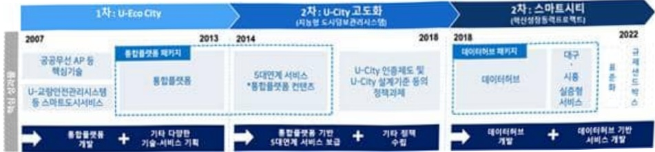
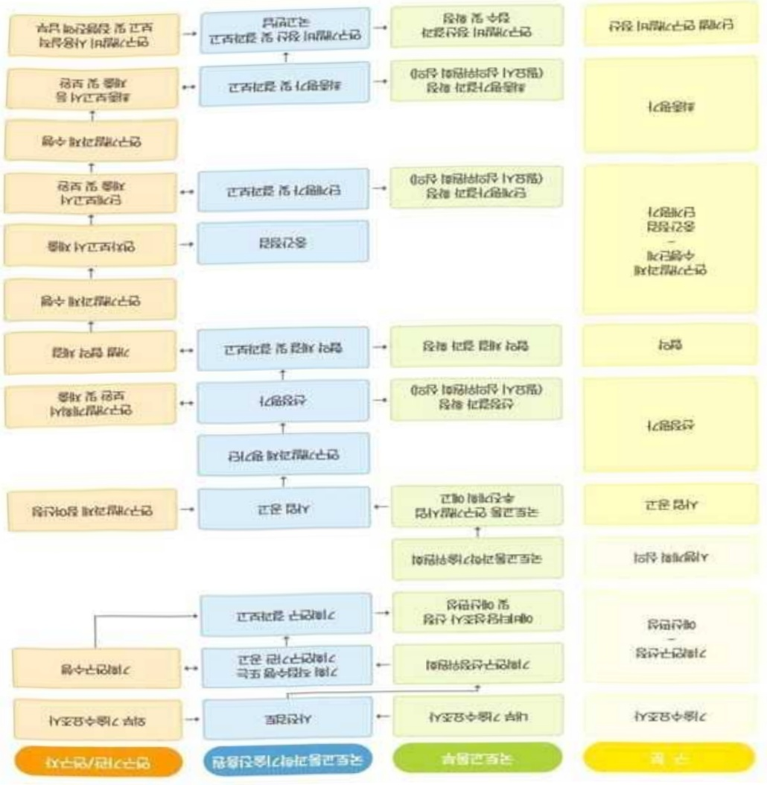

# 초연결지능도시핵심기반기술개발(R&D)

**해당 페이지**: PDF 2496 ~ 2502 쪽 해당

**부처**: 국토교통부
**분야**: 교통 및 물류
**회계유형**: 일반회계
**2026 확정예산**: 4000.0 백만원
**전년대비 증감률**: None%
**AI 도메인**: LLM/언어모델, 데이터, 법률/치안, 피지컬AI/디바이스

---

### 가.예산 총괄표

(단위:백만원,%)

<table border=1 style='margin: auto; word-wrap: break-word;'><tr><td rowspan="2">사업명</td><td rowspan="2">2024년 결산</td><td colspan="2">2025년 예산</td><td colspan="2">2026년</td><td rowspan="2">증감(B-A)</td><td rowspan="2">(B-A)/A</td></tr><tr><td style='text-align: center; word-wrap: break-word;'>본예산(A)</td><td style='text-align: center; word-wrap: break-word;'>추경</td><td style='text-align: center; word-wrap: break-word;'>정부안</td><td style='text-align: center; word-wrap: break-word;'>확정(B)</td></tr><tr><td style='text-align: center; word-wrap: break-word;'>초연결지능도시 핵심기반기술개발(R&amp;D)</td><td style='text-align: center; word-wrap: break-word;'>-</td><td style='text-align: center; word-wrap: break-word;'>-</td><td style='text-align: center; word-wrap: break-word;'>-</td><td style='text-align: center; word-wrap: break-word;'>4,000</td><td style='text-align: center; word-wrap: break-word;'>4,000</td><td style='text-align: center; word-wrap: break-word;'>4,000</td><td style='text-align: center; word-wrap: break-word;'>순증</td></tr></table>

□ 기능별(내역사업별), 목별 예산 내역

(단위:백만원)

<table border=1 style='margin: auto; word-wrap: break-word;'><tr><td rowspan="3"></td><td colspan="5">2024</td><td colspan="7">2025(2025.12월 말 기준)</td><td rowspan="3">2026 예산</td></tr><tr><td rowspan="2">예산액 (추경)</td><td rowspan="2">예산 현액</td><td rowspan="2">집행액 [실집 행액]</td><td rowspan="2">이월액</td><td rowspan="2">불용액</td><td rowspan="2">본예산</td><td rowspan="2">예산 현액</td><td rowspan="2">집행액 [실집 행액]</td><td colspan="2">전년도 이월액 제외</td><td rowspan="2">이월 예산액</td><td rowspan="2">불용 예산액</td></tr><tr><td style='text-align: center; word-wrap: break-word;'>예산 현액</td><td style='text-align: center; word-wrap: break-word;'>집행액 [실집 행액]</td></tr><tr><td style='text-align: center; word-wrap: break-word;'>○ 기능별 분류(함께)</td><td style='text-align: center; word-wrap: break-word;'>-</td><td style='text-align: center; word-wrap: break-word;'>-</td><td style='text-align: center; word-wrap: break-word;'>-</td><td style='text-align: center; word-wrap: break-word;'>-</td><td style='text-align: center; word-wrap: break-word;'>-</td><td style='text-align: center; word-wrap: break-word;'>-</td><td style='text-align: center; word-wrap: break-word;'>-</td><td style='text-align: center; word-wrap: break-word;'>-</td><td style='text-align: center; word-wrap: break-word;'>-</td><td style='text-align: center; word-wrap: break-word;'>-</td><td style='text-align: center; word-wrap: break-word;'>-</td><td style='text-align: center; word-wrap: break-word;'>-</td><td style='text-align: center; word-wrap: break-word;'>4,000</td></tr><tr><td style='text-align: center; word-wrap: break-word;'>· 초연 결지능도시 핵심기반기술개발</td><td style='text-align: center; word-wrap: break-word;'>-</td><td style='text-align: center; word-wrap: break-word;'>-</td><td style='text-align: center; word-wrap: break-word;'>-</td><td style='text-align: center; word-wrap: break-word;'>-</td><td style='text-align: center; word-wrap: break-word;'>-</td><td style='text-align: center; word-wrap: break-word;'>-</td><td style='text-align: center; word-wrap: break-word;'>-</td><td style='text-align: center; word-wrap: break-word;'>-</td><td style='text-align: center; word-wrap: break-word;'>-</td><td style='text-align: center; word-wrap: break-word;'>-</td><td style='text-align: center; word-wrap: break-word;'>-</td><td style='text-align: center; word-wrap: break-word;'>-</td><td style='text-align: center; word-wrap: break-word;'>4,000</td></tr><tr><td style='text-align: center; word-wrap: break-word;'>○ 비목별 분류(함께)</td><td style='text-align: center; word-wrap: break-word;'>-</td><td style='text-align: center; word-wrap: break-word;'>-</td><td style='text-align: center; word-wrap: break-word;'>-</td><td style='text-align: center; word-wrap: break-word;'>-</td><td style='text-align: center; word-wrap: break-word;'>-</td><td style='text-align: center; word-wrap: break-word;'>-</td><td style='text-align: center; word-wrap: break-word;'>-</td><td style='text-align: center; word-wrap: break-word;'>-</td><td style='text-align: center; word-wrap: break-word;'>-</td><td style='text-align: center; word-wrap: break-word;'>-</td><td style='text-align: center; word-wrap: break-word;'>-</td><td style='text-align: center; word-wrap: break-word;'>-</td><td style='text-align: center; word-wrap: break-word;'>4,000</td></tr><tr><td style='text-align: center; word-wrap: break-word;'>· 연 구 활 동 비 등 (360-05)</td><td style='text-align: center; word-wrap: break-word;'>-</td><td style='text-align: center; word-wrap: break-word;'>-</td><td style='text-align: center; word-wrap: break-word;'>-</td><td style='text-align: center; word-wrap: break-word;'>-</td><td style='text-align: center; word-wrap: break-word;'>-</td><td style='text-align: center; word-wrap: break-word;'>-</td><td style='text-align: center; word-wrap: break-word;'>-</td><td style='text-align: center; word-wrap: break-word;'>-</td><td style='text-align: center; word-wrap: break-word;'>-</td><td style='text-align: center; word-wrap: break-word;'>-</td><td style='text-align: center; word-wrap: break-word;'>-</td><td style='text-align: center; word-wrap: break-word;'>-</td><td style='text-align: center; word-wrap: break-word;'>4,000</td></tr><tr><td style='text-align: center; word-wrap: break-word;'>○ 기능·비목별 분류 (함께)</td><td style='text-align: center; word-wrap: break-word;'>-</td><td style='text-align: center; word-wrap: break-word;'>-</td><td style='text-align: center; word-wrap: break-word;'>-</td><td style='text-align: center; word-wrap: break-word;'>-</td><td style='text-align: center; word-wrap: break-word;'>-</td><td style='text-align: center; word-wrap: break-word;'>-</td><td style='text-align: center; word-wrap: break-word;'>-</td><td style='text-align: center; word-wrap: break-word;'>-</td><td style='text-align: center; word-wrap: break-word;'>-</td><td style='text-align: center; word-wrap: break-word;'>-</td><td style='text-align: center; word-wrap: break-word;'>-</td><td style='text-align: center; word-wrap: break-word;'>-</td><td style='text-align: center; word-wrap: break-word;'>4,000</td></tr><tr><td style='text-align: center; word-wrap: break-word;'>· 초연 결지능도시 핵심기반기술개발</td><td style='text-align: center; word-wrap: break-word;'>-</td><td style='text-align: center; word-wrap: break-word;'>-</td><td style='text-align: center; word-wrap: break-word;'>-</td><td style='text-align: center; word-wrap: break-word;'>-</td><td style='text-align: center; word-wrap: break-word;'>-</td><td style='text-align: center; word-wrap: break-word;'>-</td><td style='text-align: center; word-wrap: break-word;'>-</td><td style='text-align: center; word-wrap: break-word;'>-</td><td style='text-align: center; word-wrap: break-word;'>-</td><td style='text-align: center; word-wrap: break-word;'>-</td><td style='text-align: center; word-wrap: break-word;'>-</td><td style='text-align: center; word-wrap: break-word;'>-</td><td style='text-align: center; word-wrap: break-word;'>4,000</td></tr><tr><td style='text-align: center; word-wrap: break-word;'>· 연 구 활 동 비 등 (360-05)</td><td style='text-align: center; word-wrap: break-word;'>-</td><td style='text-align: center; word-wrap: break-word;'>-</td><td style='text-align: center; word-wrap: break-word;'>-</td><td style='text-align: center; word-wrap: break-word;'>-</td><td style='text-align: center; word-wrap: break-word;'>-</td><td style='text-align: center; word-wrap: break-word;'>-</td><td style='text-align: center; word-wrap: break-word;'>-</td><td style='text-align: center; word-wrap: break-word;'>-</td><td style='text-align: center; word-wrap: break-word;'>-</td><td style='text-align: center; word-wrap: break-word;'>-</td><td style='text-align: center; word-wrap: break-word;'>-</td><td style='text-align: center; word-wrap: break-word;'>-</td><td style='text-align: center; word-wrap: break-word;'>4,000</td></tr></table>

### 나.사업설명자료

## 1 ) 사업목적·내용

- (초연결 지능도시 핵심 기반기술 개발) 인공지능을 활용한 고도화된 지능도시 구현 및 인프라 조성을 위하여 도시데이터 표준화 및 초연결 지능도시 플랫폼 핵심기술 개발과 지자체 실·검증

* (주요 개발 핵심기술) 초연결 지능도시 플랫폼, 도시데이터 표준 모델, 다종 다해상도 CCTV 영상 분석·상황인지 AI 모듈, 이종·다종 초대규모 IoT 데이터 경량화 처리 AI Edge 시스템, LLM 기반 도시데이터 분석 및 시각화 생성형 AI, 우수 서비스·솔루션 표준 모델, 지능형 도시서비스·솔루션 등

---

## 2 ) 사업개요

## □ 사업근거 및 추진경위

① 법령상 근거 및 조항 적시 : 「국토교통과학기술육성법」 제8조, 「스마트도시 조성 및 산업진흥 등에 관한 법률」 제27조(연구·개발 등)

<table border=1 style='margin: auto; word-wrap: break-word;'><tr><td style='text-align: center; word-wrap: break-word;'>구분</td><td style='text-align: center; word-wrap: break-word;'>주요 내용(일부발취)</td></tr><tr><td style='text-align: center; word-wrap: break-word;'>「국토교통과학기술 육성법」</td><td style='text-align: center; word-wrap: break-word;'>• 제8조(연구개발사업의 추진) ① 국토교통부장관은 종합계획을 효율적으로 추진하기 위하여 국토교통과학기술 연구개발사업을 할 수 있다.</td></tr><tr><td style='text-align: center; word-wrap: break-word;'>「스마트도시 조성 및 산업진흥 등에 관한 법률」</td><td style='text-align: center; word-wrap: break-word;'>• 제27조(연구개발 등) ① 국가와 지방자치단체는 스마트도시기술의 개발과 기술수준의 향상 및 해외수출 촉진 등을 위하여 다음 각 호의 사업을 추진·지원할 수 있다.
1. 스마트도시기술의 연구·개발 및 이전·보급
2. 산업계·학계·연구기관 등과의 공동연구·개발</td></tr></table>

## ② 추진경위

- (U7~22, 선행연구) U-Eco City (요소기술·서비스 중심) → U-city 고도화™ (서비스 연계 중심) → 스마트시티*** (도시데이터 중심) 추진하여 데이터 기반 도시구현을 위한 기반기술 개발 * (1차, U-Eco City) 개별 도시 서비스·솔루션(CCTV통합관제, 기반시설 운영·관리 등)과 이를 구현하기 위한 요소기술(플랫폼, 무선통신, 센서 등) 개발

** (2차, U-City 고도화) 통합플랫폼 기반으로 CCTV 영상정보를 연계하는 5대 연계서비스 지원 등 개발 및 실증, 재정사업 통해 전국 108개 지자체 보급

*** (3차, 스마트시티) 통합적 도시데이터 관리 및 공유·활용 등을 위한 데이터허브 기반 기술, 스마트시티 서비스(교통, 안전, 환경, 에너지 등) 개발 및 실증

-(21.09.~22.04., 데이터허브 고도화 기획) 도시 간 데이터 연계·활용 위한 데이터허브 고도화, 광역·생활권 스마트시티 서비스 개발 위한 기획연구 완료(본사업 미추진)

-(23.05.~24.11., 초연결 지능도시 기획) 기존 도시데이터 수집·관리 체계, 요소기술 등의 한계점을 극복하여, 실질적인 데이터 기반 스마트도시 구현 및 지능형 도시문제 해결 가능하도록 초연결 지능도시 기술개발 기획연구 완료

-(25.08., 123대 국정과제 : 31. 미래 모빌리티와 'K-AI 시티' 실현) 'K-AI 시티 실현' 구체화의 핵심은 다양한 도시서비스의 인공지능 융합 및 상호 연결·연동(초연결)으로, 이를 위해서는 모든 도시데이터의 표준화 및 초연결 지능도시 플랫폼 기술개발 선행이 필수

---

## □ 주요내용

① 사업규모

- 총사업비 : 해당없음

- 사업기간 : '26 ~ '30

- 최근 5년 간 투입된 사업비(예산액기준, 추경편성한 연도에는 추경포함)

<table border=1 style='margin: auto; word-wrap: break-word;'><tr><td style='text-align: center; word-wrap: break-word;'>연도</td><td style='text-align: center; word-wrap: break-word;'>2022</td><td style='text-align: center; word-wrap: break-word;'>2023</td><td style='text-align: center; word-wrap: break-word;'>2024</td><td style='text-align: center; word-wrap: break-word;'>2025</td><td style='text-align: center; word-wrap: break-word;'>2026</td></tr><tr><td style='text-align: center; word-wrap: break-word;'>사업비</td><td style='text-align: center; word-wrap: break-word;'>-</td><td style='text-align: center; word-wrap: break-word;'>-</td><td style='text-align: center; word-wrap: break-word;'>-</td><td style='text-align: center; word-wrap: break-word;'>-</td><td style='text-align: center; word-wrap: break-word;'>4,000</td></tr></table>

- 기타: 해당없음

② 사업추진체계

- 사업시행방법 : 출연(참여기업이 있는 경우 Matching)

- 사업시행주체 : 국토교통부(전문기관 : 국토교통과학기술진흥원)

- 사업 수혜자 : 대학, 기업, 출연연 등

- 보조, 융자, 출연, 출자 등의 경우 보조·융자 등 지원 비율 및 법적근거

<table border=1 style='margin: auto; word-wrap: break-word;'><tr><td style='text-align: center; word-wrap: break-word;'>내역사업명</td><td style='text-align: center; word-wrap: break-word;'>구분</td><td style='text-align: center; word-wrap: break-word;'>피보조·피출연 등 기관명</td><td style='text-align: center; word-wrap: break-word;'>지원 금액 (2026예산)</td><td style='text-align: center; word-wrap: break-word;'>지원 비율(%)</td><td style='text-align: center; word-wrap: break-word;'>보조율 법적근거 (해당 조항)</td></tr><tr><td rowspan="3">초연결 지능도시 핵심 기반기술 개발</td><td rowspan="3">출연</td><td style='text-align: center; word-wrap: break-word;'>「중소기업기본법」제2조에 따른 중소기업에 해당하는 연구개발기관</td><td rowspan="3">4,000 백만원</td><td style='text-align: center; word-wrap: break-word;'>연구개발비의 100분의 75 이하</td><td rowspan="3">「국가연구개발 혁신법 시행령」제19조</td></tr><tr><td style='text-align: center; word-wrap: break-word;'>「중전기업 성장촉진 및 경쟁력 강화에 관한 특별법」제2조제1호에 따른 중전기업에 해당하는 연구개발기관</td><td style='text-align: center; word-wrap: break-word;'>연구개발비의 100분의 70 이하</td></tr><tr><td style='text-align: center; word-wrap: break-word;'>「공공기관의 운영에 관한 법률」제5조제4항제1호에 따른 공기업에 해당하거나 ‘가’, ‘나’에 해당 해당하지 않는 연구개발기관</td><td style='text-align: center; word-wrap: break-word;'>연구개발비의 100분의 50 이하</td></tr></table>

* 다만, 중앙행정기관의 장이 필요하다고 인정하는 국가연구개발사업에 대하여 별도로 정할 수 있음

---

## 3 )2026년도 예산 산출 근거

□ 초연결 지능도시 핵심 기반기술 개발 : (2025) - → (2026 확정) 4,000백만원

① 초연결 지능도시 핵심 기반기술 개발 : (2025) - → (2026 확정) 4,000백만원, 순증

(편성) 팬 도시데이터의 비표준화로 도시운영의 고비용·저효율 및 신규 융합서비스 창출 등의 한계 극복과 고도화된 AI도시 구현을 위해, 인공지능을 활용한 도시데이터 표준화 및 초연결 지능도시 플랫폼 기술 개발 필요성이 인정되어 소요예산 4,000백만원 편성

- (산출) ① 초연결 지능도시 데이터 및 플랫폼 핵심 기반기술 개발 : 2,600백만원

② 플랫폼 기반 서비스·솔루션 기술개발 : 800백만원

③ 기술·서비스 확산을 위한 리빙랩 및 실증 : 600백만원

·(신규) 1개 × 5,333백만원 × 9/12 = 4,000백만원

ㅇ 2025년도 예산 및 2026년도 예산 산출 세부내역 비교

<table border=1 style='margin: auto; word-wrap: break-word;'><tr><td colspan="2">2025년 예산</td><td colspan="2">2026년 예산</td></tr><tr><td style='text-align: center; word-wrap: break-word;'>예산</td><td style='text-align: center; word-wrap: break-word;'>산출내역</td><td style='text-align: center; word-wrap: break-word;'>예산</td><td style='text-align: center; word-wrap: break-word;'>산출내역</td></tr><tr><td style='text-align: center; word-wrap: break-word;'>-</td><td style='text-align: center; word-wrap: break-word;'>-</td><td style='text-align: center; word-wrap: break-word;'>초연결 지능도시 핵심기반기술 개발 4,000</td><td style='text-align: center; word-wrap: break-word;'>○ 연구활동비 등(360-05): 4,000백만원가. 초연결 지능도시 데이터 및 플랫폼 핵심 기반기술 개발: 2,600백만원 • (데이터 및 플랫폼) 플랫폼 체계 및 데이터허브 코어모듈 고도화 설계, 도시데이터 표준화 및 운용체계 개발, 최적화 경량화된 공간정보 모델 개발, LLM 기반 도시데이터 분석 및 시각화 생성형 AI 도구 개발 • (인프라) 레거시 데이터 및 공간정보 자동 연계·변환 모듈, AI기반 CCTV 영상 분석을 통한 도시정보 주출 모듈 개발, 실시간 이종다종 초대규모 도시데이터 경량화·전처리 기술, 다종 대용량 데이터 통신 네트워크 환경 구축 나. 플랫폼 기반 서비스·솔루션 기술개발: 800백만원 • 도시(인구성장/감소) 문제해결 혁신 아이디어 발굴, 우수 도시서비스·솔루션 구현, 전국 보급 모델 표준화 • 우수 도시서비스·솔루션 대상 데이터허브 기반 표준모델 설계 다. 기술·서비스 확산을 위한 리빙랩 및 실증: 600백만원 • (리빙랩 및 거버넌스) 개인(시민) 참여형 지능형 리빙랩 모듈 개발, 데이터 법제도 개선을 위한 거버넌스 구축 • (인프라 평가) 초연결 지능도시 구현을 위한 성과 평가·관리 시스템 개발, 도시서비스·솔루션 인덱스 시스템 개발 • (실증) 인구성장/감소 도시형 사업모델 커스터마이징 설계</td></tr></table>

## 4 ) 사업효과

□ 사업영향, 산출물 성과지표 등

①2022~2026년도 성과계획서 상 성과지표 및 최근 5년간 성과 달성도: 해당없음(26년 신규)

② 성과지표 이외의 연도별 사업추진 경과 및 실적 : 해당없음('26년 신규)

③향후(2026년도 이후)기대효과

- (사회적 효과) 인공지능 기반의 효율적 도시서비스 제공을 통한 사회 안전 및 국민 편의 도모

* 범죄율 감소(20%), 재난·안전·환경 감시 대응시간 단축(30%), 건강·복지 서비스 처리 시간 개선 (25%) 예상

- (경제적 효과) 개방형의 표준화된 도시 데이터를 공유하여 신규·부가서비스 및 일자리 창출, 도시 운영의 효율화로 도시 서비스 유지·관리 비용 절감

- (기술적 효과) 초연결 지능도시 인프라 기술 개발을 통해 향후 스마트도시 글로벌 기술 표준(국제표준 제안 3건 이상) 및 세계시장 우위 선점(국내 기술 도입률 향상), 스마트도시 혁신기술 생태계 기반 조성(지자체 확산 및 사업화 등)

---

<table border=1 style='margin: auto; word-wrap: break-word;'><tr><td style='text-align: center; word-wrap: break-word;'>부처</td><td style='text-align: center; word-wrap: break-word;'></td><td style='text-align: center; word-wrap: break-word;'>피출연·피보조기관</td><td style='text-align: center; word-wrap: break-word;'></td><td style='text-align: center; word-wrap: break-word;'>간접보조사업자·사업수행자</td></tr><tr><td style='text-align: center; word-wrap: break-word;'>국토교통부(4,000백만원)</td><td style='text-align: center; word-wrap: break-word;'>=&gt;(4,000백만원)</td><td style='text-align: center; word-wrap: break-word;'>국토교통과학기술진흥원(4,000백만원)</td><td style='text-align: center; word-wrap: break-word;'>=&gt;(4,000백만원)</td><td style='text-align: center; word-wrap: break-word;'>미정(대학, 기업, 출연연 등)</td></tr></table>

## 초연결 지능도시 핵심 기반기술 개발

7)사업 집행절차

6) 총사업비 대상사업 여부 및 내역 : 해당없음

5) 타당성조사 및 예비타당성조사 시행여부 및 결과 요지 : 해당없음

---

## 8 ) 중기재정계획 상 연도별 투자계획 및 추진경과

(단위:백만원)

<table border=1 style='margin: auto; word-wrap: break-word;'><tr><td style='text-align: center; word-wrap: break-word;'>$ 중기 $ 재정계획</td><td style='text-align: center; word-wrap: break-word;'>2024</td><td style='text-align: center; word-wrap: break-word;'>2025</td><td style='text-align: center; word-wrap: break-word;'>2026</td><td style='text-align: center; word-wrap: break-word;'>2027</td><td style='text-align: center; word-wrap: break-word;'>2028</td><td style='text-align: center; word-wrap: break-word;'>2029</td></tr><tr><td style='text-align: center; word-wrap: break-word;'>2024~2028</td><td style='text-align: center; word-wrap: break-word;'>-</td><td style='text-align: center; word-wrap: break-word;'>-</td><td style='text-align: center; word-wrap: break-word;'>-</td><td style='text-align: center; word-wrap: break-word;'>-</td><td style='text-align: center; word-wrap: break-word;'>-</td><td style='text-align: center; word-wrap: break-word;'>-</td></tr><tr><td style='text-align: center; word-wrap: break-word;'>2025~2029</td><td style='text-align: center; word-wrap: break-word;'>-</td><td style='text-align: center; word-wrap: break-word;'>-</td><td style='text-align: center; word-wrap: break-word;'>4,000</td><td style='text-align: center; word-wrap: break-word;'>6,300</td><td style='text-align: center; word-wrap: break-word;'>7,500</td><td style='text-align: center; word-wrap: break-word;'>5,000</td></tr></table>

9) 최근 3년간 동 사업에 대한 주요 외부지적사항 및 평가, 문제점 및 대책 : 해당없음

## 10 ) 향후 추진방향 및 추진계획

<table border=1 style='margin: auto; word-wrap: break-word;'><tr><td style='text-align: center; word-wrap: break-word;'>☐ 도시데이터의 통합적 연계·활용 및 인공지능 분석의 기반이 되는 초연결 지능도시 핵심 기반기술 개발 및 실증 통한 고도화된 스마트시티 실현</td></tr><tr><td style='text-align: center; word-wrap: break-word;'>○ (핵심기술①) 초연결 지능도시 데이터 및 플랫폼 핵심 기반기술 개발</td></tr><tr><td style='text-align: center; word-wrap: break-word;'>○ (핵심기술②) 초연결 지능도시 플랫폼 기반 지능형 서비스·솔루션 기술 개발</td></tr><tr><td style='text-align: center; word-wrap: break-word;'>○ (핵심기술③) 초연결 지능도시 기술·서비스 확산 위한 리빙랩 및 실증</td></tr></table>

11) 해당사업에 대한 각종 사업평가의 결과 : 해당없음

12) 해당사업에 대한 부처 자체평가의 결과

<table border=1 style='margin: auto; word-wrap: break-word;'><tr><td style='text-align: center; word-wrap: break-word;'>1) 2023년도 부처 재정사업 자율평가 결과: 해당없음</td></tr><tr><td style='text-align: center; word-wrap: break-word;'>2) 2024년도 부처 재정사업 자율평가 결과: 해당없음</td></tr><tr><td style='text-align: center; word-wrap: break-word;'>3) 2025년도 부처 재정사업 자율평가 결과: 해당없음</td></tr></table>

## 13 ) 부처 건의사항 : 해당없음

---

<table border=1 style='margin: auto; word-wrap: break-word;'><tr><td style='text-align: center; word-wrap: break-word;'>사 업 명</td></tr><tr><td style='text-align: center; word-wrap: break-word;'>(4) FIU 전산망 구축·운영(정보화)(1332 - 501)</td></tr></table>

사업 코드 정보

<table border=1 style='margin: auto; word-wrap: break-word;'><tr><td style='text-align: center; word-wrap: break-word;'>구분</td><td style='text-align: center; word-wrap: break-word;'>회계</td><td style='text-align: center; word-wrap: break-word;'>소관</td><td style='text-align: center; word-wrap: break-word;'>실국(기관)</td><td style='text-align: center; word-wrap: break-word;'>계정</td><td style='text-align: center; word-wrap: break-word;'>분야</td><td style='text-align: center; word-wrap: break-word;'>부문</td></tr><tr><td style='text-align: center; word-wrap: break-word;'>코드</td><td rowspan="2">일반회계</td><td rowspan="2">금융위원회</td><td rowspan="2">금융정보분석원</td><td rowspan="2"></td><td style='text-align: center; word-wrap: break-word;'>010</td><td style='text-align: center; word-wrap: break-word;'>014</td></tr><tr><td style='text-align: center; word-wrap: break-word;'>명칭</td><td style='text-align: center; word-wrap: break-word;'>일반·지방행정</td><td style='text-align: center; word-wrap: break-word;'>재정·금융</td></tr></table>

<table border=1 style='margin: auto; word-wrap: break-word;'><tr><td style='text-align: center; word-wrap: break-word;'>구분</td><td style='text-align: center; word-wrap: break-word;'>프로그램</td><td style='text-align: center; word-wrap: break-word;'>단위사업</td><td style='text-align: center; word-wrap: break-word;'>세부사업</td></tr><tr><td style='text-align: center; word-wrap: break-word;'>코드</td><td style='text-align: center; word-wrap: break-word;'>1300</td><td style='text-align: center; word-wrap: break-word;'>1332</td><td style='text-align: center; word-wrap: break-word;'>501</td></tr><tr><td style='text-align: center; word-wrap: break-word;'>명칭</td><td style='text-align: center; word-wrap: break-word;'>자금세탁방지시스템 선진화</td><td style='text-align: center; word-wrap: break-word;'>FIU전산망구축·운영</td><td style='text-align: center; word-wrap: break-word;'>FIU 전산망 구축·운영(정보화)</td></tr></table>

□ 사업 성격 (공통요구자료 Ⅱ-1 작성유의사항 4. 참조, 해당하는 사항에 “○” 표시)

<table border=1 style='margin: auto; word-wrap: break-word;'><tr><td rowspan="2">신규</td><td rowspan="2">계속</td><td rowspan="2">완료</td><td rowspan="2">예비타당성 실시여부</td><td rowspan="2">총사업비 관리대상</td><td rowspan="2">총액계상 예산사업</td><td style='text-align: center; word-wrap: break-word;'>사업소관 변경정보</td></tr><tr><td style='text-align: center; word-wrap: break-word;'>2025예산 시 소관</td></tr><tr><td style='text-align: center; word-wrap: break-word;'></td><td style='text-align: center; word-wrap: break-word;'>☐</td><td style='text-align: center; word-wrap: break-word;'></td><td style='text-align: center; word-wrap: break-word;'></td><td style='text-align: center; word-wrap: break-word;'></td><td style='text-align: center; word-wrap: break-word;'></td><td style='text-align: center; word-wrap: break-word;'></td></tr></table>

□ 사업 지원 형태 및 지원을 (최소한 한 개는 반드시 선택하시오. 해당사항에 O 표시)

<table border=1 style='margin: auto; word-wrap: break-word;'><tr><td style='text-align: center; word-wrap: break-word;'>직접</td><td style='text-align: center; word-wrap: break-word;'>출자</td><td style='text-align: center; word-wrap: break-word;'>출연</td><td style='text-align: center; word-wrap: break-word;'>보조</td><td style='text-align: center; word-wrap: break-word;'>융자</td><td style='text-align: center; word-wrap: break-word;'>국고보조율(%)</td><td style='text-align: center; word-wrap: break-word;'>융자율(%)</td></tr><tr><td style='text-align: center; word-wrap: break-word;'>○</td><td style='text-align: center; word-wrap: break-word;'></td><td style='text-align: center; word-wrap: break-word;'></td><td style='text-align: center; word-wrap: break-word;'></td><td style='text-align: center; word-wrap: break-word;'></td><td style='text-align: center; word-wrap: break-word;'></td><td style='text-align: center; word-wrap: break-word;'></td></tr></table>

사업 소관부처 및 시행주체

<table border=1 style='margin: auto; word-wrap: break-word;'><tr><td style='text-align: center; word-wrap: break-word;'>사업명</td><td colspan="2">구분</td></tr><tr><td rowspan="2">FIU전산망구축운영(정보화)</td><td rowspan="2">소관부처</td><td style='text-align: center; word-wrap: break-word;'>금융정보분석원</td></tr><tr><td style='text-align: center; word-wrap: break-word;'>기획행정실</td></tr></table>

---

### 원본 PDF 크롭 이미지

