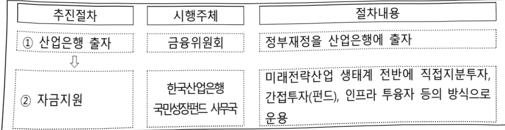

# 국민성장펀드

**해당 페이지**: PDF 2508 ~ 2513 쪽 해당

**부처**: 금융위원회
**분야**: 일반·지방행정
**회계유형**: 일반회계
**2026 확정예산**: 1000000.0 백만원
**전년대비 증감률**: 100.0%
**AI 도메인**: 금융

---

<table border=1 style='margin: auto; word-wrap: break-word;'><tr><td style='text-align: center; word-wrap: break-word;'>사 업 명</td></tr><tr><td style='text-align: center; word-wrap: break-word;'>(13) 국민성장펀드 (2414-326)</td></tr></table>

사업 코드 정보

<table border=1 style='margin: auto; word-wrap: break-word;'><tr><td style='text-align: center; word-wrap: break-word;'>구분</td><td style='text-align: center; word-wrap: break-word;'>회계</td><td style='text-align: center; word-wrap: break-word;'>소관</td><td style='text-align: center; word-wrap: break-word;'>실국(기관)</td><td style='text-align: center; word-wrap: break-word;'>계정</td><td style='text-align: center; word-wrap: break-word;'>분야</td><td style='text-align: center; word-wrap: break-word;'>부문</td></tr><tr><td style='text-align: center; word-wrap: break-word;'>코드</td><td rowspan="2">일반회계</td><td rowspan="2">금융위원회</td><td rowspan="2">국민성장펀드 추진단</td><td rowspan="2"></td><td style='text-align: center; word-wrap: break-word;'>010</td><td style='text-align: center; word-wrap: break-word;'>014</td></tr><tr><td style='text-align: center; word-wrap: break-word;'>명칭</td><td style='text-align: center; word-wrap: break-word;'>일반·지방행정</td><td style='text-align: center; word-wrap: break-word;'>재정·금융</td></tr></table>

<table border=1 style='margin: auto; word-wrap: break-word;'><tr><td style='text-align: center; word-wrap: break-word;'>구분</td><td style='text-align: center; word-wrap: break-word;'>프로그램</td><td style='text-align: center; word-wrap: break-word;'>단위사업</td><td style='text-align: center; word-wrap: break-word;'>세부사업</td></tr><tr><td style='text-align: center; word-wrap: break-word;'>코드</td><td style='text-align: center; word-wrap: break-word;'>2400</td><td style='text-align: center; word-wrap: break-word;'>2414</td><td style='text-align: center; word-wrap: break-word;'>326</td></tr><tr><td style='text-align: center; word-wrap: break-word;'>명칭</td><td style='text-align: center; word-wrap: break-word;'>산업금융지원</td><td style='text-align: center; word-wrap: break-word;'>산업은행 출자</td><td style='text-align: center; word-wrap: break-word;'>산업은행 출자(국민성장펀드)</td></tr></table>

□ 사업 성격 (공통요구자료 Ⅱ-1 작성유의사항 4. 참조, 해당하는 사항에 “○” 표시)

<table border=1 style='margin: auto; word-wrap: break-word;'><tr><td style='text-align: center; word-wrap: break-word;'>신규</td><td style='text-align: center; word-wrap: break-word;'>계속</td><td style='text-align: center; word-wrap: break-word;'>완료</td><td style='text-align: center; word-wrap: break-word;'>예비타당성 실시여부</td><td style='text-align: center; word-wrap: break-word;'>총사업비 관리대상</td><td style='text-align: center; word-wrap: break-word;'>총액계상 예산사업</td><td style='text-align: center; word-wrap: break-word;'>사업소관 변경정보 2025예산 시 소관</td></tr><tr><td style='text-align: center; word-wrap: break-word;'></td><td style='text-align: center; word-wrap: break-word;'></td><td style='text-align: center; word-wrap: break-word;'></td><td style='text-align: center; word-wrap: break-word;'></td><td style='text-align: center; word-wrap: break-word;'></td><td style='text-align: center; word-wrap: break-word;'></td><td style='text-align: center; word-wrap: break-word;'></td></tr></table>

사업지원형태 및 지원을(최소한 한 개는 반드시 선택하시오. 해당사항에 O 표시)

<table border=1 style='margin: auto; word-wrap: break-word;'><tr><td style='text-align: center; word-wrap: break-word;'>직접</td><td style='text-align: center; word-wrap: break-word;'>출자</td><td style='text-align: center; word-wrap: break-word;'>출연</td><td style='text-align: center; word-wrap: break-word;'>보조</td><td style='text-align: center; word-wrap: break-word;'>융자</td><td style='text-align: center; word-wrap: break-word;'>국고보조율(%)</td><td style='text-align: center; word-wrap: break-word;'>융자율(%)</td></tr><tr><td style='text-align: center; word-wrap: break-word;'></td><td style='text-align: center; word-wrap: break-word;'>○</td><td style='text-align: center; word-wrap: break-word;'></td><td style='text-align: center; word-wrap: break-word;'></td><td style='text-align: center; word-wrap: break-word;'></td><td style='text-align: center; word-wrap: break-word;'></td><td style='text-align: center; word-wrap: break-word;'></td></tr></table>

□ 사업 소관부처 및 시행주체

<table border=1 style='margin: auto; word-wrap: break-word;'><tr><td style='text-align: center; word-wrap: break-word;'>사업명</td><td colspan="2">구분</td></tr><tr><td rowspan="3">국민성장펀드</td><td rowspan="2">소관부처</td><td style='text-align: center; word-wrap: break-word;'>국민성장펀드추진단</td></tr><tr><td style='text-align: center; word-wrap: break-word;'>국민성장펀드총괄과</td></tr><tr><td style='text-align: center; word-wrap: break-word;'>사업시행주체</td><td style='text-align: center; word-wrap: break-word;'>한국산업은행국민성장펀드 사무국</td></tr></table>

---

### 가. 예산 총괄표

(단위: 백만원, %)

<table border=1 style='margin: auto; word-wrap: break-word;'><tr><td rowspan="2">사업명</td><td rowspan="2">2024년 결산</td><td colspan="2">2025년 예산</td><td colspan="2">2026년 예산</td><td rowspan="2">중감 (B-A)</td><td rowspan="2">(B-A)/A</td></tr><tr><td style='text-align: center; word-wrap: break-word;'>본예산</td><td style='text-align: center; word-wrap: break-word;'>추경*(A)</td><td style='text-align: center; word-wrap: break-word;'>요구안</td><td style='text-align: center; word-wrap: break-word;'>본예산(B)</td></tr><tr><td style='text-align: center; word-wrap: break-word;'>국민성장펀드</td><td style='text-align: center; word-wrap: break-word;'>-</td><td style='text-align: center; word-wrap: break-word;'>-</td><td style='text-align: center; word-wrap: break-word;'>-</td><td style='text-align: center; word-wrap: break-word;'>1,000,000</td><td style='text-align: center; word-wrap: break-word;'>1,000,000</td><td style='text-align: center; word-wrap: break-word;'>1,000,000</td><td style='text-align: center; word-wrap: break-word;'>100</td></tr></table>

* 추경: 추경증감액을 포함한 최종 예산액을 기재

## □ 기능별(내역사업별) 예산 내역

(단위:백만원)

<table border=1 style='margin: auto; word-wrap: break-word;'><tr><td rowspan="2"></td><td colspan="5">2024</td><td colspan="5">2025</td><td rowspan="2">2026예산</td></tr><tr><td style='text-align: center; word-wrap: break-word;'>예산액(추경)</td><td style='text-align: center; word-wrap: break-word;'>예산현액</td><td style='text-align: center; word-wrap: break-word;'>집행액</td><td style='text-align: center; word-wrap: break-word;'>이월액</td><td style='text-align: center; word-wrap: break-word;'>불용액</td><td style='text-align: center; word-wrap: break-word;'>예산액(추경)</td><td style='text-align: center; word-wrap: break-word;'>예산현액</td><td style='text-align: center; word-wrap: break-word;'>집행액</td><td style='text-align: center; word-wrap: break-word;'>이월액</td><td style='text-align: center; word-wrap: break-word;'>불용액</td></tr><tr><td style='text-align: center; word-wrap: break-word;'>○ 기능별 분류(합계)</td><td style='text-align: center; word-wrap: break-word;'>-</td><td style='text-align: center; word-wrap: break-word;'>-</td><td style='text-align: center; word-wrap: break-word;'>-</td><td style='text-align: center; word-wrap: break-word;'>-</td><td style='text-align: center; word-wrap: break-word;'>-</td><td style='text-align: center; word-wrap: break-word;'>-</td><td style='text-align: center; word-wrap: break-word;'>-</td><td style='text-align: center; word-wrap: break-word;'>-</td><td style='text-align: center; word-wrap: break-word;'>-</td><td style='text-align: center; word-wrap: break-word;'>-</td><td style='text-align: center; word-wrap: break-word;'>1,000,000</td></tr><tr><td style='text-align: center; word-wrap: break-word;'>• 산업은행 출자(국민성장펀드)</td><td style='text-align: center; word-wrap: break-word;'>-</td><td style='text-align: center; word-wrap: break-word;'>-</td><td style='text-align: center; word-wrap: break-word;'>-</td><td style='text-align: center; word-wrap: break-word;'>-</td><td style='text-align: center; word-wrap: break-word;'>-</td><td style='text-align: center; word-wrap: break-word;'>-</td><td style='text-align: center; word-wrap: break-word;'>-</td><td style='text-align: center; word-wrap: break-word;'>-</td><td style='text-align: center; word-wrap: break-word;'>-</td><td style='text-align: center; word-wrap: break-word;'>-</td><td style='text-align: center; word-wrap: break-word;'>1,000,000</td></tr></table>

### 나. 사업설명자료

## 1 ) 사업목적·내용

○ 첨단전략산업 경쟁격화에 대응한 적극적인 금융지원으로 산업경쟁력 강화가 필요한 상황에서, 시중자금의 물꼬를 생산적 영역으로 바꾸는 금융대전환 추진 대표과제로 민관합동 150조원 이상의 '국민성장펀드' 프로젝트 추진

- 첨단전략산업에 대한 장기투자 및 메가프로젝트 투자를 확대하는 정부 정책에 부응,

정책편드가 생산적 금융의 중심축으로 기능할 수 있도록 기존 정책편드를 개편하고,

26년 사업에 필요한 마중물 자금으로서 총 1조원 출자

---

## 2 ) 사업개요

## ☐ 사업근거 및 추진경위

지원근거

추진경위

## 0 정부 정책발표

<table border=1 style='margin: auto; word-wrap: break-word;'><tr><td style='text-align: center; word-wrap: break-word;'>지원근거</td><td style='text-align: center; word-wrap: break-word;'>○ 정부 정책발표 - (25.3.5)「첨단전략산업기금 신설 방안」 발표(산경장) - (25.3.27) 국회, 산은법 개정안 여·야 공동 발의 ▶ 제29조의7(첨단전략산업기금의 설치) ① 국가 미래전략과 경제안보에 필요한 산업 및 기업에 대한 효율적인 자금지원(제29조의9제2항 제1호부터 제4호까지에 따른 지원을 말하며, 이하 이 장에서 같다)을 통하여 첨단전략산업의 경쟁력을 강화하기 위해 한국산업은행에 첨단전략산업기금을 둔다. ② 제1항에 따른 자금지원은 국민경제 및 산업경쟁력 유지 등에 중대한 영향을 미치는 다음 각호의 업종에 속하는 기업(이하 “첨단전략산업기업”이라 한다) 및 첨단전략산업기업과 거래를 하거나 첨단전략산업기업에 투자 등을 하는 기업으로서 대통령령으로 정하는 기업(이하 “첨단전략산업관련기업”이라 한다)을 대상으로 한다. 1. 「국가첨단전략산업 경쟁력 강화 및 보호에 관한 특별조치법」 제11조에 따라 산업통상자원 부장관이 지정한 전략기술을 보유한 기업이 속하는 업종 2. 「조세특례제한법」 제10조제1항제2호에 따라 지정된 국가전략기술을 보유한 기업이 속하는 업종 3. 그 밖에 미래전략과 경제안보에 필요한 산업으로서 대통령령으로 정하는 업종 - (25.7.30) 국회, 산은법 개정안 정무위 전체회의 통과 - (25.8.13) 新정부 국정기획위원회 국정과제”로 최종 채택 * [국정과제 46번] 진짜 성장을 뒷받침하는 생산적 금융(국민성장펀드 100조원 조성)(금융위) - (25.9.9) 정부, 산은법 개정안 공포(시행일 : &#x27;25.12.10.) - (25.9.10) 정부, “국민성장펀드 국민보고대회” 개최하여, 국민성장펀드 150”조원의 조성 및 운용계획 발표(대통령 참석) * 첨단전략산업기금 75조원, 민간·국민자금 75조원으로 구성</td></tr><tr><td style='text-align: center; word-wrap: break-word;'>추진경위</td><td style='text-align: center; word-wrap: break-word;'>○ 국민성장펀드 150조원(공공기금 75조원 + 민간 75조원) 이상의 자금을 미래 전략산업과 생태계 전반에 지원하여 향후 20년의 대한민국 성장동력 준비 ➞ 산은법상 정부보증기금 명칭 : 첨단전략산업기금 첨단전략산업기금 + 민간자금 개념으로 국민성장펀드 추진 ○ 미래 20년 新성장동력이 될 “첨단전략산업” Target - 첨단전략산업기술 및 국가전략기술 12개 산업 90개 기술 * 반도체, 이차전지, 백신, 디스플레이, 수소, 미래차, 바이오, 인공지능, 방산, 로봇 + 미래전략과 경제안보에 필요한 산업(시행령 - 예: 컨텐츠·핵심광물 등) ○ 첨단전략산업의 “뺄류체인”을 구성하는 생태계 전반 포괄 - R&amp;D, 중소·중견 및 장비·설비기업, 에너지 등 인프라, 해외진출 및 구매자 금융 등 첨단전략산업 전·후방을 포괄 지원 ○ 지역 소멸 위기를 타개할 수 있는 “지역성장 프로젝트” - 5극·3류 전략 등을 고려한 지역특화 성장 프로젝트를 적극 발굴하고, 지역 우대 정책과 연계 * 예) 경남 방산 프로젝트, 호남 AI 데이터센터, 경북 이차전지 프로젝트 등</td></tr></table>

- (25.3.5) 「첨단전략산업기금 신설 방안」 발표(산경장)

- (25.3.27) 국회, 산은법 개정안 여·야 공동 발의

## ▶ 제29조의7(첨단전략산업기금의 설치)

① 국가 미래전략과 경제안보에 필요한 산업 및 기업에 대한 효율적인 자금지원(제29조의9제2항 제1호부터 제4호까지에 따른 지원을 말하며, 이하 이 장에서 같다)을 통하여 첨단전략산업의 경쟁력을 강화하기 위해 한국산업은행에 첨단전략산업기금을 둔다.

② 제1항에 따른 자금지원은 국민경제 및 산업경쟁력 유지 등에 중대한 영향을 미치는 다음 각호의 업종에 속하는 기업(이하 “첨단전략산업기업”이라 한다) 및 첨단전략산업기업과 거래를 하거나 첨단전략산업기업에 투자 등을 하는 기업으로서 대통령령으로 정하는 기업(이하 “첨단전략산업관련기업”이라 한다)을 대상으로 한다.

1. 「국가첨단전략산업 경쟁력 강화 및 보호에 관한 특별조치법」 제11조에 따라 산업통상자원 부장관이 지정한 전략기술을 보유한 기업이 속하는 업종

2. 「조세특례제한법」 제10조제1항제2호에 따라 지정된 국가전략기술을 보유한 기업이 속하는 업종

3. 그 밖에 미래전략과 경제안보에 필요한 산업으로서 대통령령으로 정하는 업종

- (25.7.30) 국회, 산은법 개정안 정무위 전체회의 통과

- (25.8.13) 新정부 국정기획위원회 국정과제*로 최종 채택

* [국정과제 46번] 진짜 성장을 뒷받침하는 생산적 금융(국민성장펀드 100조원 조성)(금융위)

- (25.9.9) 정부, 산은법 개정안 공포(시행일 : '25.12.10.)

- (25.9.10) 정부, “국민성장펀드 국민보고대회” 개최하여, 국민성장펀드 150*조원의 조성 및 운용계획 발표(대통령 참석)

* 첨단전략산업기금 75조원 민간국민자금 75조원으로 구성

*첨단전략산업기금 75조원, 민간·국민자금 75조원으로 구성

○ 국민성장펀드 150조원(공공기금 75조원 + 민간 75조원) 이상의 자금을 미래 전략산업과 생태계 전반에 지원하여 향후 20년의 대한민국 성장동력 준비

산은법상 정부보증기금 명칭 : 첨단전략산업기금

첨단전략산업기금 + 민간자금 개념으로 국민성장펀드 추진

미래 20년 新성장동력이 될 “첨단전략산업” Target

- 첨단전략산업기술 및 국가전략기술 12개 산업 90개 기술

* 반도체, 이차전지, 백신, 디스플레이, 수소, 미래차, 바이오, 인공지능, 방산, 로봇 + 미래전략과 경제안보에 필요한 산업(시행령 - 예: 컨텐츠·핵심광물 등)

0 첨단전략산업의 “밸류체인”을 구성하는 생태계 전반 포괄

- R&D, 중소·중견 및 장비·설비기업, 에너지 등 인프라, 해외진출 및 구매자 금융 등 첨단전략산업 전·후방을 포괄 지원

- 지역 소멸 위기를 타개할 수 있는 “지역성장 프로젝트”

- 5극·3특 전략 등을 고려한 지역특화 성장 프로젝트를 적극 발굴하고, 지역 우대 정책과 연계

* 예) 경남 방산 프로젝트, 호남 AI 데이터센터, 경북 이차전지 프로젝트 등

---

## 주요내용

① 사업규모

- 사업기간 : '26~'30년

- 최근 5년 간 투입된 사업비(예산액기준, 추경편성한 연도에는 추경포함)

<table border=1 style='margin: auto; word-wrap: break-word;'><tr><td style='text-align: center; word-wrap: break-word;'>연도</td><td style='text-align: center; word-wrap: break-word;'>2022</td><td style='text-align: center; word-wrap: break-word;'>2023</td><td style='text-align: center; word-wrap: break-word;'>2024</td><td style='text-align: center; word-wrap: break-word;'>2025</td><td style='text-align: center; word-wrap: break-word;'>2026</td></tr><tr><td style='text-align: center; word-wrap: break-word;'>사업비</td><td style='text-align: center; word-wrap: break-word;'>-</td><td style='text-align: center; word-wrap: break-word;'>-</td><td style='text-align: center; word-wrap: break-word;'>-</td><td style='text-align: center; word-wrap: break-word;'>-</td><td style='text-align: center; word-wrap: break-word;'>1조원</td></tr></table>

② 사업추진체계

- 사업시행방법 : 산업은행 출자

- 사업시행주체 : 국민성장편드 사무국

- 사업 수혜자 : 첨단전략산업·국가전략기술 영위 기업 및 관련 인프라·기술 등 산업

생태계 관련 기업

- 보조, 융자, 출연, 출자 등의 경우 보조·융자 등 지원 비율 및 법적근거

<table border=1 style='margin: auto; word-wrap: break-word;'><tr><td style='text-align: center; word-wrap: break-word;'>내역사업명</td><td style='text-align: center; word-wrap: break-word;'>구분</td><td style='text-align: center; word-wrap: break-word;'>피보조·피출연 등 기관명</td><td style='text-align: center; word-wrap: break-word;'>지원 금액(2026예산)</td><td style='text-align: center; word-wrap: break-word;'>지원 비율(%)</td><td style='text-align: center; word-wrap: break-word;'>보조율 법적근거 (해당 조항)</td></tr><tr><td style='text-align: center; word-wrap: break-word;'>신업은행 출자(국민성장펀드)</td><td style='text-align: center; word-wrap: break-word;'>출자</td><td style='text-align: center; word-wrap: break-word;'>한국산업은행</td><td style='text-align: center; word-wrap: break-word;'>1조원</td><td style='text-align: center; word-wrap: break-word;'>6.67%</td><td style='text-align: center; word-wrap: break-word;'>-</td></tr></table>

## 3 ) 2026년도 예산 산출 근거

산업은행 출자(국민성장펀드) : (2025) -백만원 → (2026요구) 1,000,000백만원

- (요구) '25.8.13 국정기획위원회 국정과제로 채택된 국민성장펀드 150조원 조성에 따라 필요한 마중물 자금으로서 '26년 1조원 출자 요청

- (산출) 직접지분투자, 간접투자(펀드), 인프라 투융자 등 재정이 마중물로서 후순위 보강재원(5~40%)으로 활용(초저리대출은 재정출자 대상 제외, 산은 자체감당)

→ 민간자금의 리스크를 분담하고 참여유인 제고

<table border=1 style='margin: auto; word-wrap: break-word;'><tr><td rowspan="2">구분 (조원)</td><td colspan="4">&#x27;26년 투자규모(아래 수치 예시)</td><td rowspan="2">재정역할 비율</td></tr><tr><td style='text-align: center; word-wrap: break-word;'>소계</td><td style='text-align: center; word-wrap: break-word;'>기금</td><td style='text-align: center; word-wrap: break-word;'>민간</td><td style='text-align: center; word-wrap: break-word;'>재정</td></tr><tr><td style='text-align: center; word-wrap: break-word;'>①직접지분투자</td><td style='text-align: center; word-wrap: break-word;'>3.0</td><td style='text-align: center; word-wrap: break-word;'>1.5</td><td style='text-align: center; word-wrap: break-word;'>1.5</td><td style='text-align: center; word-wrap: break-word;'>0.15</td><td style='text-align: center; word-wrap: break-word;'>마중물</td></tr><tr><td style='text-align: center; word-wrap: break-word;'>②간접투자(펀드)</td><td style='text-align: center; word-wrap: break-word;'>7.0</td><td style='text-align: center; word-wrap: break-word;'>1.5</td><td style='text-align: center; word-wrap: break-word;'>5.5</td><td style='text-align: center; word-wrap: break-word;'>0.45</td><td style='text-align: center; word-wrap: break-word;'>후순위 보강(5~40%)</td></tr><tr><td style='text-align: center; word-wrap: break-word;'>③인프라 투융자</td><td style='text-align: center; word-wrap: break-word;'>10.0</td><td style='text-align: center; word-wrap: break-word;'>2.0</td><td style='text-align: center; word-wrap: break-word;'>8.0</td><td style='text-align: center; word-wrap: break-word;'>0.4</td><td style='text-align: center; word-wrap: break-word;'>후순위 5%</td></tr><tr><td style='text-align: center; word-wrap: break-word;'>초저리대출</td><td style='text-align: center; word-wrap: break-word;'>10.0</td><td style='text-align: center; word-wrap: break-word;'>10.0</td><td style='text-align: center; word-wrap: break-word;'>-</td><td style='text-align: center; word-wrap: break-word;'>-</td><td style='text-align: center; word-wrap: break-word;'>산은 자체 감당</td></tr><tr><td style='text-align: center; word-wrap: break-word;'>합계</td><td style='text-align: center; word-wrap: break-word;'>30.0</td><td style='text-align: center; word-wrap: break-word;'>15.0</td><td style='text-align: center; word-wrap: break-word;'>15.0</td><td style='text-align: center; word-wrap: break-word;'>1.0</td><td style='text-align: center; word-wrap: break-word;'></td></tr></table>

※ 사업 예산안 산출근거용이나 추후 정부정책에 따라 구체적 계획 사업 내용 변경 가능

0 2025년도 예산 및 2026년도 예산 산출 세부내역 비교

<table border=1 style='margin: auto; word-wrap: break-word;'><tr><td colspan="2">&#x27;25년 예산</td><td colspan="2">&#x27;26년 예산</td></tr><tr><td style='text-align: center; word-wrap: break-word;'>예산</td><td style='text-align: center; word-wrap: break-word;'>산출내역</td><td style='text-align: center; word-wrap: break-word;'>예산</td><td style='text-align: center; word-wrap: break-word;'>산출내역</td></tr><tr><td style='text-align: center; word-wrap: break-word;'>-</td><td style='text-align: center; word-wrap: break-word;'>-</td><td style='text-align: center; word-wrap: break-word;'>○ 산업은행 출자(국민성장펀드)(2414-326): 1,000,000백만원 1,000,000</td><td style='text-align: center; word-wrap: break-word;'>1년 민간투자 유치규모 15조원 × 정부재정비율 6.67% = 1,000,000백만원</td></tr></table>

---

## 4 ) 사업효과

☐ 사업영향, 산출물 성과지표 등

① 2022~2026년도 성과계획서 상 성과지표 및 최근 5년간 성과 달성도

<table border=1 style='margin: auto; word-wrap: break-word;'><tr><td style='text-align: center; word-wrap: break-word;'>성과지표</td><td style='text-align: center; word-wrap: break-word;'>구분</td><td style='text-align: center; word-wrap: break-word;'>2022</td><td style='text-align: center; word-wrap: break-word;'>2023</td><td style='text-align: center; word-wrap: break-word;'>2024</td><td style='text-align: center; word-wrap: break-word;'>2025</td><td style='text-align: center; word-wrap: break-word;'>2026</td><td style='text-align: center; word-wrap: break-word;'>2026 목표치산출근거</td><td style='text-align: center; word-wrap: break-word;'>측정산식(또는 측정방법)</td><td style='text-align: center; word-wrap: break-word;'>자료수집방법(또는 자료출처)</td></tr><tr><td rowspan="3">투자(결성)실적(단위:백억원, &#x27;25.6월기준)</td><td style='text-align: center; word-wrap: break-word;'>목표</td><td rowspan="3">-</td><td rowspan="3">-</td><td rowspan="3">-</td><td rowspan="3">-</td><td rowspan="3">3,000</td><td rowspan="3">투자위험도를 반영한 재정의 마중물 역할</td><td rowspan="3">직접지분투자금액 간접투자(펜딩)금액 인프라 투융자금액 초저리대출금액</td><td rowspan="3">산업은행 제출자료</td></tr><tr><td style='text-align: center; word-wrap: break-word;'>실적</td></tr><tr><td style='text-align: center; word-wrap: break-word;'>달성도</td></tr></table>

② 성과지표 이외의 연도별 사업추진 경과 및 실적 : 해당사항 없음

③향후(2026년도 이후)기대효과

○ 첨단전략산업 경쟁격화에 대응한 적극적인 금융지원으로 산업경쟁력 강화가 필요한 상황에서, 정부 재정의 마중물 및 후순위 보강을 통해 민간 자금의 유입을 촉진하고 첨단전략산업에 대해 산업 파급효과가 큰 메가 프로젝트 중심으로 지원하여 국가 경제성장 제고

5) 타당성조사 및 예비타당성조사 시행여부 및 결과 요지 : 해당사항 없음

6) 총사업비 대상사업 정보 : 해당사항 없음

7) 사업 집행절차

---

## 8 ) 각종 평가

1) 국회(예결위, 상임위, 예정처, 국정감사 포함) 지적

- ①모태펀드 및 부처간 정책금융 사업의 중복지원에 따른 민간 출자 수요 분산 문제가 심화될 우려(예정처_26예산)

- ②국민성장펀드의 민간투자 부족시 재원 조달 방안(예정처_26예산)

- ③국민성장펀드 투자 및 성과에 대한 국회 보고절차 마련 필요(예결위_26예산)

- ④한국산업은행 재정모편드 회수 재원 활용 필요(예결위_26예산)

- ⑤국민성장펀드의 조속한 사업계획 수립 필요(정무위_26예산)

- ⑥국민성장펀드의 국민참여형편드 수익률이 저조하지 않도록 면밀한 사전준비 필요(정무위_26예산)

2) 대외공개 평가 : 해당사항 없음

<table border=1 style='margin: auto; word-wrap: break-word;'><tr><td style='text-align: center; word-wrap: break-word;'>1) 국회(예결위, 상임위, 예정처, 국정감사 포함) 지적</td></tr><tr><td style='text-align: center; word-wrap: break-word;'>- ①모태편드 및 부처간 정책금융 사업의 중복지원에 따른 민간 출자 수요 분산 문제가 심화될 우려(예정처_26예산)</td></tr><tr><td style='text-align: center; word-wrap: break-word;'>- ②국민성장편드의 민간투자 부족시 재원 조달 방안(예정처_26예산)</td></tr><tr><td style='text-align: center; word-wrap: break-word;'>- ③국민성장편드 투자 및 성과에 대한 국회 보고절차 마련 필요(예결위_26예산)</td></tr><tr><td style='text-align: center; word-wrap: break-word;'>- ④한국산업은행 재정모편드 회수 재원 활용 필요(예결위_26예산)</td></tr><tr><td style='text-align: center; word-wrap: break-word;'>- ⑤국민성장편드의 조속한 사업계획 수립 필요(정무위_26예산)</td></tr><tr><td style='text-align: center; word-wrap: break-word;'>- ⑥국민성장편드의 국민참여형편드 수익률이 저조하지 않도록 면밀한 사전준비 필요(정무위_26예산)</td></tr><tr><td style='text-align: center; word-wrap: break-word;'>⑦ 대외공개 평가 : 해당사항 없음</td></tr><tr><td style='text-align: center; word-wrap: break-word;'>⑧ 자체평가 : 해당사항 없음</td></tr></table>

3) 자체평가 : 해당사항 없음

### 다. 최근 4년간 결산내역

## 1 ) 결산표

☐ 부처 결산내역 : 해당사항 없음

## 2 ) 주요 결산사항

□ 2022~2025년 결산 주요 지적사항 및 시정요구사항 : 해당사항 없음

2025년 이·전용 등 세부내역 : 해당사항 없음

---

### 원본 PDF 크롭 이미지

