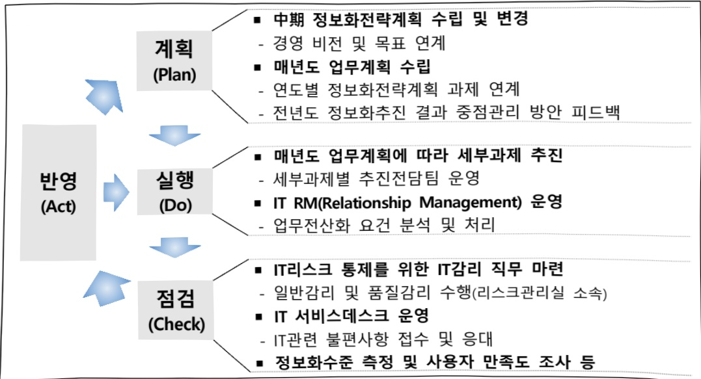

# 신용정보(정보화)

**해당 페이지**: PDF 2514 ~ 2518 쪽 해당

**부처**: 금융위원회
**분야**: 산업·중소기업 및 에너지
**회계유형**: 기금
**2026 확정예산**: 2244.0 백만원
**전년대비 증감률**: None%
**AI 도메인**: 데이터

---

### 가.지출계획 총괄표

(단위: 백만원, %)

<table border=1 style='margin: auto; word-wrap: break-word;'><tr><td rowspan="2">사업명</td><td rowspan="2">2024년 결산</td><td colspan="2">2025년 예산</td><td colspan="2">2026년 예산</td><td rowspan="2">중감 (B-A)</td><td rowspan="2">(B-A)/A</td></tr><tr><td style='text-align: center; word-wrap: break-word;'>본예산</td><td style='text-align: center; word-wrap: break-word;'>추경*(A)</td><td style='text-align: center; word-wrap: break-word;'>요구안</td><td style='text-align: center; word-wrap: break-word;'>본예산(B)</td></tr><tr><td style='text-align: center; word-wrap: break-word;'>신용정보(정보화)</td><td style='text-align: center; word-wrap: break-word;'>1,364</td><td style='text-align: center; word-wrap: break-word;'>2,034</td><td style='text-align: center; word-wrap: break-word;'>2,034</td><td style='text-align: center; word-wrap: break-word;'>4,911</td><td style='text-align: center; word-wrap: break-word;'>2,244</td><td style='text-align: center; word-wrap: break-word;'>210</td><td style='text-align: center; word-wrap: break-word;'>10.3%</td></tr></table>

* 추경: 추경증감액을 포함한 최종 예산액

## □ 기능별(내역사업별) 계획 내역

(단위:백만원)

<table border=1 style='margin: auto; word-wrap: break-word;'><tr><td rowspan="2"></td><td colspan="5">2024</td><td colspan="5">2025</td><td rowspan="2">2026 계획</td></tr><tr><td style='text-align: center; word-wrap: break-word;'>계획액 (추정)</td><td style='text-align: center; word-wrap: break-word;'>계획 현액</td><td style='text-align: center; word-wrap: break-word;'>집행액</td><td style='text-align: center; word-wrap: break-word;'>이월액</td><td style='text-align: center; word-wrap: break-word;'>불용액</td><td style='text-align: center; word-wrap: break-word;'>계획액 (추정)</td><td style='text-align: center; word-wrap: break-word;'>계획 현액</td><td style='text-align: center; word-wrap: break-word;'>집행액</td><td style='text-align: center; word-wrap: break-word;'>이월액</td><td style='text-align: center; word-wrap: break-word;'>불용액</td></tr><tr><td style='text-align: center; word-wrap: break-word;'>○ 기능별 분류(합계)</td><td style='text-align: center; word-wrap: break-word;'>1,364</td><td style='text-align: center; word-wrap: break-word;'>1,364</td><td style='text-align: center; word-wrap: break-word;'>1,364</td><td style='text-align: center; word-wrap: break-word;'>-</td><td style='text-align: center; word-wrap: break-word;'>-</td><td style='text-align: center; word-wrap: break-word;'>2,034</td><td style='text-align: center; word-wrap: break-word;'>2,034</td><td style='text-align: center; word-wrap: break-word;'>2,020</td><td style='text-align: center; word-wrap: break-word;'>-</td><td style='text-align: center; word-wrap: break-word;'>14</td><td style='text-align: center; word-wrap: break-word;'>2,244</td></tr><tr><td style='text-align: center; word-wrap: break-word;'>• 신용정보(정보화)</td><td style='text-align: center; word-wrap: break-word;'>1,364</td><td style='text-align: center; word-wrap: break-word;'>1,364</td><td style='text-align: center; word-wrap: break-word;'>1,364</td><td style='text-align: center; word-wrap: break-word;'>-</td><td style='text-align: center; word-wrap: break-word;'>-</td><td style='text-align: center; word-wrap: break-word;'>2,034</td><td style='text-align: center; word-wrap: break-word;'>2,034</td><td style='text-align: center; word-wrap: break-word;'>2,020</td><td style='text-align: center; word-wrap: break-word;'>-</td><td style='text-align: center; word-wrap: break-word;'>14</td><td style='text-align: center; word-wrap: break-word;'>2,244</td></tr></table>

* 2025년 집행액 및 불용액은 가결산 기준

### 나. 사업설명자료

## 1 ) 사업목적·내용

- ‘빅데이터 플랫폼’ 구축·운영을 통해 신뢰성 높은 기업 데이터와 신용정보서비스를 공공·민간에 제공함으로써 기업 지원 강화 및 기업 데이터 시장 활성화 촉진

## 2 ) 사업개요

☐ 사업근거 및 추진경위

① 법령상 근거 및 조항

## 신용보증기금법 제23조(업무)

① 기금은 이 법의 목적을 달성하기 위하여 다음 각 호의 업무를 수행한다.

9. 제1호 · 제2호, 제2호의2부터 제2호의4까지 및 제3호부터 제8호까지의 업무에 부수되는 업무로서 금융위원회의 승인을 받은 것

---

## ② 추진경위

-(18.09) 빅데이터를 활용한 동태적 경영활동 모니터링 체계연구 (NICE평가정보)

-(18.10) 공공기관 빅데이터 활용 컨설팅 수행 (주관: 과학기술정보통신부)

- (19.03월) 상거래 DB구축 기관 선정 (금융위원회)

-(20.01) 상거래 신용지수(한국형Paydex) 모형 개발 (사업자: 엠씨지컨설팅)

- (20.03월) 신용정보업 면허 취득 (금융위원회)

- (20.06월) 빅데이터 정보화전략계획 수립(ISP) (사업자: 넥스트아이앤아이)

- (22.12월) 기업 빅데이터 전용 포털 BASA(Business Analytics System on AI) 오픈

- (23.03월) 데이터 가치평가기관으로 지정 (과학기술정보통신부)

## 주요내용

① 사업규모

- 총사업비 : 해당사항 없음

- 사업기간 : 2021년 ~ 계속

- 최근 5년 간 투입된 사업비(예산액기준, 추경편성한 연도에는 추경포함)

(단위: 백만원)

<table border=1 style='margin: auto; word-wrap: break-word;'><tr><td style='text-align: center; word-wrap: break-word;'>연도</td><td style='text-align: center; word-wrap: break-word;'>2022</td><td style='text-align: center; word-wrap: break-word;'>2023</td><td style='text-align: center; word-wrap: break-word;'>2024</td><td style='text-align: center; word-wrap: break-word;'>2025</td><td style='text-align: center; word-wrap: break-word;'>2026</td></tr><tr><td style='text-align: center; word-wrap: break-word;'>사업비</td><td style='text-align: center; word-wrap: break-word;'>3,209</td><td style='text-align: center; word-wrap: break-word;'>2,323</td><td style='text-align: center; word-wrap: break-word;'>1,364</td><td style='text-align: center; word-wrap: break-word;'>2,034</td><td style='text-align: center; word-wrap: break-word;'>2,244</td></tr></table>

- 기타 : 해당사항 없음

② 사업추진체계

- 사업시행방법 : 직접수행

- 사업시행주체 : 신용보증기금

- 사업 수혜자 : 정보이용자(일반국민, 기업, 금융회사, 공공기관, 정부·지자체)

- 보조, 융자, 출연, 출자 등의 경우 보조·융자 등 지원 비율 및 법적근거 : 해당사항 없음

## 3 ) 2026년도 계획 산출 근거

- (산출) 신용정보 인프라 유지관리, 빅데이터 기반 업무선진화, 빅데이터플랫폼 운영 등을 위해 2025년도 계획 대비 210백만원 증액

---

## 4 ) 사업효과

☐ 사업영향, 산출물 성과지표 등

① 2022~2026년도 성과계획서 상 성과지표 및 최근 5년간 성과 달성도

<table border=1 style='margin: auto; word-wrap: break-word;'><tr><td style='text-align: center; word-wrap: break-word;'>성과지표</td><td style='text-align: center; word-wrap: break-word;'>구분</td><td style='text-align: center; word-wrap: break-word;'>2022</td><td style='text-align: center; word-wrap: break-word;'>2023</td><td style='text-align: center; word-wrap: break-word;'>2024</td><td style='text-align: center; word-wrap: break-word;'>2025</td><td style='text-align: center; word-wrap: break-word;'>2026</td><td style='text-align: center; word-wrap: break-word;'>2026목표치산출근거</td><td style='text-align: center; word-wrap: break-word;'>측정산식(또는 측정방법)</td><td style='text-align: center; word-wrap: break-word;'>자료수집방법(또는 자료출처)</td></tr><tr><td rowspan="3">신용보증기금보증공급(조원, %)</td><td style='text-align: center; word-wrap: break-word;'>목표</td><td style='text-align: center; word-wrap: break-word;'>53.0</td><td style='text-align: center; word-wrap: break-word;'>55.0</td><td rowspan="3">(삭제)</td><td rowspan="3">(삭제)</td><td rowspan="3">(삭제)</td><td rowspan="3">(해당사항 없음)</td><td rowspan="3">∑연간보증공급금액</td><td rowspan="3">신용보증기금자체실적집계자료</td></tr><tr><td style='text-align: center; word-wrap: break-word;'>실적</td><td style='text-align: center; word-wrap: break-word;'>59.2</td><td style='text-align: center; word-wrap: break-word;'>61.1</td></tr><tr><td style='text-align: center; word-wrap: break-word;'>달성도</td><td style='text-align: center; word-wrap: break-word;'>111.7</td><td style='text-align: center; word-wrap: break-word;'>111.1</td></tr><tr><td rowspan="3">일반보증부실률(%)</td><td style='text-align: center; word-wrap: break-word;'>목표</td><td style='text-align: center; word-wrap: break-word;'>4.0</td><td style='text-align: center; word-wrap: break-word;'>3.9</td><td rowspan="3">(삭제)</td><td rowspan="3">(삭제)</td><td rowspan="3">(삭제)</td><td rowspan="3">(해당사항 없음)</td><td style='text-align: center; word-wrap: break-word;'>부실순증액</td><td rowspan="3">신용보증기금자체실적집계자료</td></tr><tr><td style='text-align: center; word-wrap: break-word;'>실적</td><td style='text-align: center; word-wrap: break-word;'>2.0</td><td style='text-align: center; word-wrap: break-word;'>3.3</td><td rowspan="2">∑연도말보증잔액</td></tr><tr><td style='text-align: center; word-wrap: break-word;'>달성도</td><td style='text-align: center; word-wrap: break-word;'>148.9</td><td style='text-align: center; word-wrap: break-word;'>115.1</td></tr><tr><td rowspan="3">중점정책부문신용보증공급(조원, %)</td><td style='text-align: center; word-wrap: break-word;'>목표</td><td style='text-align: center; word-wrap: break-word;'>신규</td><td style='text-align: center; word-wrap: break-word;'>신규</td><td style='text-align: center; word-wrap: break-word;'>55.0</td><td style='text-align: center; word-wrap: break-word;'>59.0</td><td style='text-align: center; word-wrap: break-word;'>61.0</td><td rowspan="3">통상환경급변대수경기침체대응및경제 활력 제고를 위한 유동성 확대차원에서 전년 대비2조원 상향</td><td rowspan="3">∑연간중점정책부문신용보증공급금액</td><td rowspan="3">신용보증기금자체실적집계자료</td></tr><tr><td style='text-align: center; word-wrap: break-word;'>실적</td><td style='text-align: center; word-wrap: break-word;'>신규</td><td style='text-align: center; word-wrap: break-word;'>신규</td><td style='text-align: center; word-wrap: break-word;'>70.7</td><td style='text-align: center; word-wrap: break-word;'>75.6</td><td style='text-align: center; word-wrap: break-word;'>-</td></tr><tr><td style='text-align: center; word-wrap: break-word;'>달성도</td><td style='text-align: center; word-wrap: break-word;'>신규</td><td style='text-align: center; word-wrap: break-word;'>신규</td><td style='text-align: center; word-wrap: break-word;'>128.5</td><td style='text-align: center; word-wrap: break-word;'>128.1</td><td style='text-align: center; word-wrap: break-word;'>-</td></tr></table>

② 성과지표 이외의 연도별 사업추진 경과 및 실적 : 해당사항 없음

③향후(2026년도 이후)기대효과

- 유용하고 품질높은 기업 데이터 및 신용정보서비스 제공을 확대하여 공공부문의 데이터 기반 행정 활성화 및 중소기업의 경쟁력 강화를 지원하고, 데이터 생태계 활성화를 도모

5) 타당성조사 및 예비타당성조사 시행여부 및 결과 요지 : 해당사항 없음

6) 총사업비 대상사업 정보 : 해당사항 없음

7) 사업 집행절차

---

## 8 ) 각종 평가

<table border=1 style='margin: auto; word-wrap: break-word;'><tr><td style='text-align: center; word-wrap: break-word;'>1) 국회(예결위, 상임위, 예정처, 국정감사 포함) 지적 - ① (‘23년 결산 예결위·정무위) 신용정보(정보화) 사업의 철저한 사업 분석을 실시하고, 중소기업에 실질적으로 도움이 될 수 있는 예산 편성 방안을 강구할 것 2) 대외공개 평가 : 해당사항 없음 3) 자체평가 : 해당사항 없음</td></tr></table>

### 다.최근 4년간 결산내역

## 1 ) 결산표

☐ 부처 결산내역

(단위: 백만원, %)

<table border=1 style='margin: auto; word-wrap: break-word;'><tr><td rowspan="2">闰도</td><td colspan="3">계획액</td><td rowspan="2">계획현액(A)</td><td rowspan="2">집행액(B)</td><td rowspan="2">집행률(B/A)</td><td rowspan="2">다음연도이월액</td><td rowspan="2">불용액</td></tr><tr><td style='text-align: center; word-wrap: break-word;'>본예산</td><td style='text-align: center; word-wrap: break-word;'>추경중감액</td><td style='text-align: center; word-wrap: break-word;'>추경</td></tr><tr><td style='text-align: center; word-wrap: break-word;'>2022</td><td style='text-align: center; word-wrap: break-word;'>3,209</td><td style='text-align: center; word-wrap: break-word;'>-</td><td style='text-align: center; word-wrap: break-word;'>3,209</td><td style='text-align: center; word-wrap: break-word;'>3,209</td><td style='text-align: center; word-wrap: break-word;'>3,202</td><td style='text-align: center; word-wrap: break-word;'>99.8</td><td style='text-align: center; word-wrap: break-word;'>-</td><td style='text-align: center; word-wrap: break-word;'>7</td></tr><tr><td style='text-align: center; word-wrap: break-word;'>2023</td><td style='text-align: center; word-wrap: break-word;'>2,323</td><td style='text-align: center; word-wrap: break-word;'>-</td><td style='text-align: center; word-wrap: break-word;'>2,323</td><td style='text-align: center; word-wrap: break-word;'>2,323</td><td style='text-align: center; word-wrap: break-word;'>2,301</td><td style='text-align: center; word-wrap: break-word;'>99.1</td><td style='text-align: center; word-wrap: break-word;'>-</td><td style='text-align: center; word-wrap: break-word;'>22</td></tr><tr><td style='text-align: center; word-wrap: break-word;'>2024</td><td style='text-align: center; word-wrap: break-word;'>1,364</td><td style='text-align: center; word-wrap: break-word;'>-</td><td style='text-align: center; word-wrap: break-word;'>1,364</td><td style='text-align: center; word-wrap: break-word;'>1,364</td><td style='text-align: center; word-wrap: break-word;'>1,364</td><td style='text-align: center; word-wrap: break-word;'>99.9</td><td style='text-align: center; word-wrap: break-word;'>-</td><td style='text-align: center; word-wrap: break-word;'>-</td></tr><tr><td style='text-align: center; word-wrap: break-word;'>2025</td><td style='text-align: center; word-wrap: break-word;'>2,034</td><td style='text-align: center; word-wrap: break-word;'>-</td><td style='text-align: center; word-wrap: break-word;'>2,034</td><td style='text-align: center; word-wrap: break-word;'>2,034</td><td style='text-align: center; word-wrap: break-word;'>2,020</td><td style='text-align: center; word-wrap: break-word;'>99.3</td><td style='text-align: center; word-wrap: break-word;'>-</td><td style='text-align: center; word-wrap: break-word;'>14</td></tr></table>

*2025년 집행액 및 불용액은 가결산 기준

## 2 ) 주요 결산사항

□ 2022~2025년 결산 주요사항

<table border=1 style='margin: auto; word-wrap: break-word;'><tr><td style='text-align: center; word-wrap: break-word;'>2022</td><td style='text-align: center; word-wrap: break-word;'>- &#x27;계획변경&#x27;의 상세내역 및 계획변경 사유: 해당사항 없음- 이월 사유 및 불용 사유(집행부진사유): 해당사항 없음</td></tr><tr><td style='text-align: center; word-wrap: break-word;'>2023</td><td style='text-align: center; word-wrap: break-word;'>- &#x27;계획변경&#x27;의 상세내역 및 계획변경 사유: 해당사항 없음- 이월 사유 및 불용 사유(집행부진사유): 해당사항 없음</td></tr><tr><td style='text-align: center; word-wrap: break-word;'>2024</td><td style='text-align: center; word-wrap: break-word;'>- &#x27;계획변경&#x27;의 상세내역 및 계획변경 사유: 해당사항 없음- 이월 사유 및 불용 사유(집행부진사유): 해당사항 없음</td></tr><tr><td style='text-align: center; word-wrap: break-word;'>2025</td><td style='text-align: center; word-wrap: break-word;'>- &#x27;계획변경&#x27;의 상세내역 및 계획변경 사유: 해당사항 없음- 이월 사유 및 불용 사유(집행부진사유): 해당사항 없음</td></tr></table>

□ 2025년 계획변경 세부내역 : 해당사항 없음

---

<table border=1 style='margin: auto; word-wrap: break-word;'><tr><td style='text-align: center; word-wrap: break-word;'>사 업 명</td></tr><tr><td style='text-align: center; word-wrap: break-word;'>기상업무지원기술개발연구(R&amp;D) (4133-301)</td></tr></table>

사업 코드 정보

<table border=1 style='margin: auto; word-wrap: break-word;'><tr><td style='text-align: center; word-wrap: break-word;'>구분</td><td style='text-align: center; word-wrap: break-word;'>회계</td><td style='text-align: center; word-wrap: break-word;'>소관</td><td style='text-align: center; word-wrap: break-word;'>실국(기관)</td><td style='text-align: center; word-wrap: break-word;'>계정</td><td style='text-align: center; word-wrap: break-word;'>분야</td><td style='text-align: center; word-wrap: break-word;'>부문</td></tr><tr><td style='text-align: center; word-wrap: break-word;'>코드</td><td rowspan="2">일반</td><td rowspan="2">기상청</td><td rowspan="2">국립기상과학원</td><td rowspan="2"></td><td style='text-align: center; word-wrap: break-word;'>150</td><td style='text-align: center; word-wrap: break-word;'>153</td></tr><tr><td style='text-align: center; word-wrap: break-word;'>명칭</td><td style='text-align: center; word-wrap: break-word;'>과학기술</td><td style='text-align: center; word-wrap: break-word;'>과학기술일반</td></tr></table>

<table border=1 style='margin: auto; word-wrap: break-word;'><tr><td style='text-align: center; word-wrap: break-word;'>구분</td><td style='text-align: center; word-wrap: break-word;'>프로그램</td><td style='text-align: center; word-wrap: break-word;'>단위사업</td><td style='text-align: center; word-wrap: break-word;'>세부사업</td></tr><tr><td style='text-align: center; word-wrap: break-word;'>코드</td><td style='text-align: center; word-wrap: break-word;'>4100</td><td style='text-align: center; word-wrap: break-word;'>4133</td><td style='text-align: center; word-wrap: break-word;'>301</td></tr><tr><td style='text-align: center; word-wrap: break-word;'>명칭</td><td style='text-align: center; word-wrap: break-word;'>책임행정기관 운영</td><td style='text-align: center; word-wrap: break-word;'>국립기상과학원 연구개발</td><td style='text-align: center; word-wrap: break-word;'>기상업무지원기술개발연구(R&amp;D)</td></tr></table>

☐ 사업 성격

<table border=1 style='margin: auto; word-wrap: break-word;'><tr><td rowspan="2">신규</td><td rowspan="2">계속</td><td rowspan="2">완료</td><td rowspan="2">예비타당성 실시여부</td><td rowspan="2">총사업비 관리대상</td><td rowspan="2">총액계상 예산사업</td><td style='text-align: center; word-wrap: break-word;'>사업소관 변경정보</td></tr><tr><td style='text-align: center; word-wrap: break-word;'>2025예산 시 소관</td></tr><tr><td style='text-align: center; word-wrap: break-word;'></td><td style='text-align: center; word-wrap: break-word;'>○</td><td style='text-align: center; word-wrap: break-word;'></td><td style='text-align: center; word-wrap: break-word;'></td><td style='text-align: center; word-wrap: break-word;'></td><td style='text-align: center; word-wrap: break-word;'></td><td style='text-align: center; word-wrap: break-word;'></td></tr></table>

□ 사업 지원 형태 및 지원을

<table border=1 style='margin: auto; word-wrap: break-word;'><tr><td style='text-align: center; word-wrap: break-word;'>직접</td><td style='text-align: center; word-wrap: break-word;'>출자</td><td style='text-align: center; word-wrap: break-word;'>출연</td><td style='text-align: center; word-wrap: break-word;'>보조</td><td style='text-align: center; word-wrap: break-word;'>융자</td><td style='text-align: center; word-wrap: break-word;'>국고보조율(%)</td><td style='text-align: center; word-wrap: break-word;'>융자율(%)</td></tr><tr><td style='text-align: center; word-wrap: break-word;'>○</td><td style='text-align: center; word-wrap: break-word;'></td><td style='text-align: center; word-wrap: break-word;'></td><td style='text-align: center; word-wrap: break-word;'></td><td style='text-align: center; word-wrap: break-word;'></td><td style='text-align: center; word-wrap: break-word;'></td><td style='text-align: center; word-wrap: break-word;'></td></tr></table>

## □ 사업 담당자

<table border=1 style='margin: auto; word-wrap: break-word;'><tr><td style='text-align: center; word-wrap: break-word;'>사업명</td><td colspan="2">구분</td></tr><tr><td rowspan="2">기상업무지원 기술개발연구 (R&amp;D)</td><td style='text-align: center; word-wrap: break-word;'>소관부처</td><td style='text-align: center; word-wrap: break-word;'>국립기상과학원 기획운영과</td></tr><tr><td style='text-align: center; word-wrap: break-word;'>사업시행주체</td><td style='text-align: center; word-wrap: break-word;'>국립기상과학원</td></tr></table>

---

### 원본 PDF 크롭 이미지

