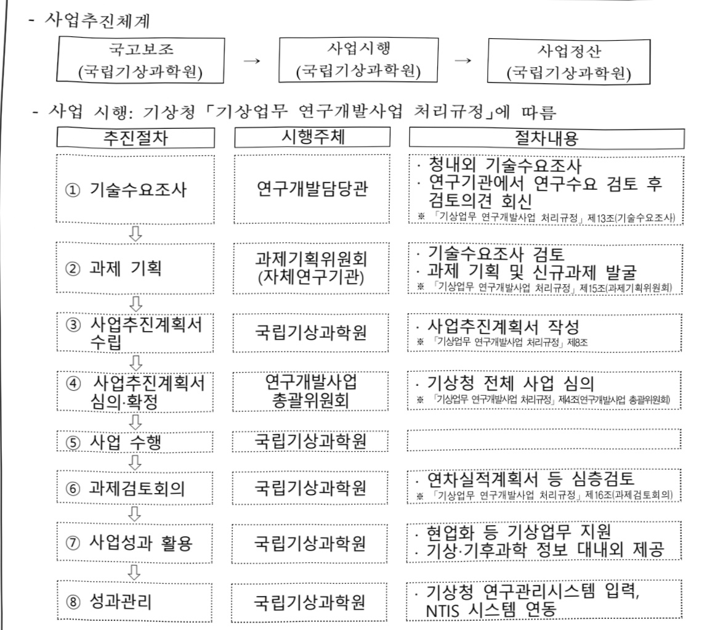

# 기상업무지원기술개발연구(R&D)

**해당 페이지**: PDF 2519 ~ 2541 쪽 해당

**부처**: 기상청
**분야**: 과학기술
**회계유형**: 일반
**2026 확정예산**: 34801.0 백만원
**전년대비 증감률**: 6.3%
**AI 도메인**: 농업/식품, 에너지, 환경/기후

---

<table border=1 style='margin: auto; word-wrap: break-word;'><tr><td style='text-align: center; word-wrap: break-word;'>사 업 명</td></tr><tr><td style='text-align: center; word-wrap: break-word;'>기상업무지원기술개발연구(R&amp;D) (4133-301)</td></tr></table>

사업 코드 정보

<table border=1 style='margin: auto; word-wrap: break-word;'><tr><td style='text-align: center; word-wrap: break-word;'>구분</td><td style='text-align: center; word-wrap: break-word;'>회계</td><td style='text-align: center; word-wrap: break-word;'>소관</td><td style='text-align: center; word-wrap: break-word;'>실국(기관)</td><td style='text-align: center; word-wrap: break-word;'>계정</td><td style='text-align: center; word-wrap: break-word;'>분야</td><td style='text-align: center; word-wrap: break-word;'>부문</td></tr><tr><td style='text-align: center; word-wrap: break-word;'>코드</td><td rowspan="2">일반</td><td rowspan="2">기상청</td><td rowspan="2">국립기상과학원</td><td rowspan="2"></td><td style='text-align: center; word-wrap: break-word;'>150</td><td style='text-align: center; word-wrap: break-word;'>153</td></tr><tr><td style='text-align: center; word-wrap: break-word;'>명칭</td><td style='text-align: center; word-wrap: break-word;'>과학기술</td><td style='text-align: center; word-wrap: break-word;'>과학기술일반</td></tr></table>

<table border=1 style='margin: auto; word-wrap: break-word;'><tr><td style='text-align: center; word-wrap: break-word;'>구분</td><td style='text-align: center; word-wrap: break-word;'>프로그램</td><td style='text-align: center; word-wrap: break-word;'>단위사업</td><td style='text-align: center; word-wrap: break-word;'>세부사업</td></tr><tr><td style='text-align: center; word-wrap: break-word;'>코드</td><td style='text-align: center; word-wrap: break-word;'>4100</td><td style='text-align: center; word-wrap: break-word;'>4133</td><td style='text-align: center; word-wrap: break-word;'>301</td></tr><tr><td style='text-align: center; word-wrap: break-word;'>명칭</td><td style='text-align: center; word-wrap: break-word;'>책임행정기관 운영</td><td style='text-align: center; word-wrap: break-word;'>국립기상과학원 연구개발</td><td style='text-align: center; word-wrap: break-word;'>기상업무지원기술개발연구(R&amp;D)</td></tr></table>

☐ 사업 성격

<table border=1 style='margin: auto; word-wrap: break-word;'><tr><td rowspan="2">신규</td><td rowspan="2">계속</td><td rowspan="2">완료</td><td rowspan="2">예비타당성 실시여부</td><td rowspan="2">총사업비 관리대상</td><td rowspan="2">총액계상 예산사업</td><td style='text-align: center; word-wrap: break-word;'>사업소관 변경정보</td></tr><tr><td style='text-align: center; word-wrap: break-word;'>2025예산 시 소관</td></tr><tr><td style='text-align: center; word-wrap: break-word;'></td><td style='text-align: center; word-wrap: break-word;'>○</td><td style='text-align: center; word-wrap: break-word;'></td><td style='text-align: center; word-wrap: break-word;'></td><td style='text-align: center; word-wrap: break-word;'></td><td style='text-align: center; word-wrap: break-word;'></td><td style='text-align: center; word-wrap: break-word;'></td></tr></table>

□ 사업 지원 형태 및 지원을

<table border=1 style='margin: auto; word-wrap: break-word;'><tr><td style='text-align: center; word-wrap: break-word;'>직접</td><td style='text-align: center; word-wrap: break-word;'>출자</td><td style='text-align: center; word-wrap: break-word;'>출연</td><td style='text-align: center; word-wrap: break-word;'>보조</td><td style='text-align: center; word-wrap: break-word;'>융자</td><td style='text-align: center; word-wrap: break-word;'>국고보조율(%)</td><td style='text-align: center; word-wrap: break-word;'>융자율(%)</td></tr><tr><td style='text-align: center; word-wrap: break-word;'>○</td><td style='text-align: center; word-wrap: break-word;'></td><td style='text-align: center; word-wrap: break-word;'></td><td style='text-align: center; word-wrap: break-word;'></td><td style='text-align: center; word-wrap: break-word;'></td><td style='text-align: center; word-wrap: break-word;'></td><td style='text-align: center; word-wrap: break-word;'></td></tr></table>

## □ 사업 담당자

<table border=1 style='margin: auto; word-wrap: break-word;'><tr><td style='text-align: center; word-wrap: break-word;'>사업명</td><td colspan="2">구분</td></tr><tr><td rowspan="2">기상업무지원 기술개발연구 (R&amp;D)</td><td style='text-align: center; word-wrap: break-word;'>소관부처</td><td style='text-align: center; word-wrap: break-word;'>국립기상과학원 기획운영과</td></tr><tr><td style='text-align: center; word-wrap: break-word;'>사업시행주체</td><td style='text-align: center; word-wrap: break-word;'>국립기상과학원</td></tr></table>

---

### 가.예산안 총괄표

(단위:백만원,%)

<table border=1 style='margin: auto; word-wrap: break-word;'><tr><td rowspan="2">사업명</td><td style='text-align: center; word-wrap: break-word;'>2024년</td><td colspan="2">2025년 예산</td><td colspan="2">2026년</td><td colspan="2">중감</td></tr><tr><td style='text-align: center; word-wrap: break-word;'>결산</td><td style='text-align: center; word-wrap: break-word;'>본예산(A)</td><td style='text-align: center; word-wrap: break-word;'>추경</td><td style='text-align: center; word-wrap: break-word;'>요구안</td><td style='text-align: center; word-wrap: break-word;'>본예산(B)</td><td style='text-align: center; word-wrap: break-word;'>(B-A)</td><td style='text-align: center; word-wrap: break-word;'>(B-A)/A</td></tr><tr><td style='text-align: center; word-wrap: break-word;'>기상업무지원기술개발연구(R&amp;D)</td><td style='text-align: center; word-wrap: break-word;'>26,916</td><td style='text-align: center; word-wrap: break-word;'>32,753</td><td style='text-align: center; word-wrap: break-word;'>32,753</td><td style='text-align: center; word-wrap: break-word;'>34,801</td><td style='text-align: center; word-wrap: break-word;'>34,801</td><td style='text-align: center; word-wrap: break-word;'>2,048</td><td style='text-align: center; word-wrap: break-word;'>6.3</td></tr></table>

□ 기능별(내역사업별), 목별 예산안 내역

(단위:백만원)

<table border=1 style='margin: auto; word-wrap: break-word;'><tr><td rowspan="3"></td><td colspan="5">2024</td><td colspan="7">2025(2025.12월 말)</td><td rowspan="3">2026예산안</td></tr><tr><td rowspan="2">예산액(추정)</td><td rowspan="2">예산현액</td><td rowspan="2">집행액[실집행액]</td><td rowspan="2">이월액</td><td rowspan="2">불용액</td><td rowspan="2">본예산</td><td rowspan="2">예산현액</td><td rowspan="2">집행액[실집행액]</td><td colspan="2">전년도 이월액제외</td><td rowspan="2">이월예상액</td><td rowspan="2">불용예상액</td></tr><tr><td style='text-align: center; word-wrap: break-word;'>예산현액</td><td style='text-align: center; word-wrap: break-word;'>집행액[실집행액]</td></tr><tr><td style='text-align: center; word-wrap: break-word;'>○ 기능별 분류(합계)</td><td style='text-align: center; word-wrap: break-word;'>27,785</td><td style='text-align: center; word-wrap: break-word;'>27,785</td><td style='text-align: center; word-wrap: break-word;'>26,916</td><td style='text-align: center; word-wrap: break-word;'>-</td><td style='text-align: center; word-wrap: break-word;'>869</td><td style='text-align: center; word-wrap: break-word;'>32,753</td><td style='text-align: center; word-wrap: break-word;'>31,924</td><td style='text-align: center; word-wrap: break-word;'>31,653</td><td style='text-align: center; word-wrap: break-word;'>31,924</td><td style='text-align: center; word-wrap: break-word;'>31,653</td><td style='text-align: center; word-wrap: break-word;'>106</td><td style='text-align: center; word-wrap: break-word;'>165</td><td style='text-align: center; word-wrap: break-word;'>34,801</td></tr><tr><td style='text-align: center; word-wrap: break-word;'>·예보기술 지원 및 활용연구</td><td style='text-align: center; word-wrap: break-word;'>3,551</td><td style='text-align: center; word-wrap: break-word;'>3,551</td><td style='text-align: center; word-wrap: break-word;'>3,473</td><td style='text-align: center; word-wrap: break-word;'>-</td><td style='text-align: center; word-wrap: break-word;'>78</td><td style='text-align: center; word-wrap: break-word;'>3,570</td><td style='text-align: center; word-wrap: break-word;'>3,486</td><td style='text-align: center; word-wrap: break-word;'>3,443</td><td style='text-align: center; word-wrap: break-word;'>3,486</td><td style='text-align: center; word-wrap: break-word;'>3,443</td><td style='text-align: center; word-wrap: break-word;'>-</td><td style='text-align: center; word-wrap: break-word;'>43</td><td style='text-align: center; word-wrap: break-word;'>4,106</td></tr><tr><td style='text-align: center; word-wrap: break-word;'>·관측기술 지원 및 활용연구</td><td style='text-align: center; word-wrap: break-word;'>11,610</td><td style='text-align: center; word-wrap: break-word;'>11,610</td><td style='text-align: center; word-wrap: break-word;'>11,320</td><td style='text-align: center; word-wrap: break-word;'>-</td><td style='text-align: center; word-wrap: break-word;'>290</td><td style='text-align: center; word-wrap: break-word;'>14,850</td><td style='text-align: center; word-wrap: break-word;'>14,757</td><td style='text-align: center; word-wrap: break-word;'>14,625</td><td style='text-align: center; word-wrap: break-word;'>14,757</td><td style='text-align: center; word-wrap: break-word;'>14,625</td><td style='text-align: center; word-wrap: break-word;'>106</td><td style='text-align: center; word-wrap: break-word;'>26</td><td style='text-align: center; word-wrap: break-word;'>13,154</td></tr><tr><td style='text-align: center; word-wrap: break-word;'>·기후기후화예측살 지원 및 활용연구</td><td style='text-align: center; word-wrap: break-word;'>4,638</td><td style='text-align: center; word-wrap: break-word;'>4,638</td><td style='text-align: center; word-wrap: break-word;'>4,212</td><td style='text-align: center; word-wrap: break-word;'>-</td><td style='text-align: center; word-wrap: break-word;'>426</td><td style='text-align: center; word-wrap: break-word;'>6,279</td><td style='text-align: center; word-wrap: break-word;'>5,684</td><td style='text-align: center; word-wrap: break-word;'>5,614</td><td style='text-align: center; word-wrap: break-word;'>5,684</td><td style='text-align: center; word-wrap: break-word;'>5,614</td><td style='text-align: center; word-wrap: break-word;'>-</td><td style='text-align: center; word-wrap: break-word;'>70</td><td style='text-align: center; word-wrap: break-word;'>6,678</td></tr><tr><td style='text-align: center; word-wrap: break-word;'>·황사·연무기술 지원 및 활용연구</td><td style='text-align: center; word-wrap: break-word;'>1,274</td><td style='text-align: center; word-wrap: break-word;'>1,274</td><td style='text-align: center; word-wrap: break-word;'>1,265</td><td style='text-align: center; word-wrap: break-word;'>-</td><td style='text-align: center; word-wrap: break-word;'>9</td><td style='text-align: center; word-wrap: break-word;'>1,141</td><td style='text-align: center; word-wrap: break-word;'>1,136</td><td style='text-align: center; word-wrap: break-word;'>1,134</td><td style='text-align: center; word-wrap: break-word;'>1,136</td><td style='text-align: center; word-wrap: break-word;'>1,134</td><td style='text-align: center; word-wrap: break-word;'>-</td><td style='text-align: center; word-wrap: break-word;'>2</td><td style='text-align: center; word-wrap: break-word;'>1,093</td></tr><tr><td style='text-align: center; word-wrap: break-word;'>·응용기상기술 지원 및 활용연구</td><td style='text-align: center; word-wrap: break-word;'>3,611</td><td style='text-align: center; word-wrap: break-word;'>3,611</td><td style='text-align: center; word-wrap: break-word;'>3,568</td><td style='text-align: center; word-wrap: break-word;'>-</td><td style='text-align: center; word-wrap: break-word;'>43</td><td style='text-align: center; word-wrap: break-word;'>3,315</td><td style='text-align: center; word-wrap: break-word;'>3,277</td><td style='text-align: center; word-wrap: break-word;'>3,265</td><td style='text-align: center; word-wrap: break-word;'>3,277</td><td style='text-align: center; word-wrap: break-word;'>3,265</td><td style='text-align: center; word-wrap: break-word;'>-</td><td style='text-align: center; word-wrap: break-word;'>12</td><td style='text-align: center; word-wrap: break-word;'>3,417</td></tr><tr><td style='text-align: center; word-wrap: break-word;'>·인공지능 기술 지원 및 활용연구</td><td style='text-align: center; word-wrap: break-word;'>3,101</td><td style='text-align: center; word-wrap: break-word;'>3,101</td><td style='text-align: center; word-wrap: break-word;'>3,077</td><td style='text-align: center; word-wrap: break-word;'>-</td><td style='text-align: center; word-wrap: break-word;'>24</td><td style='text-align: center; word-wrap: break-word;'>3,598</td><td style='text-align: center; word-wrap: break-word;'>3,584</td><td style='text-align: center; word-wrap: break-word;'>3,571</td><td style='text-align: center; word-wrap: break-word;'>3,584</td><td style='text-align: center; word-wrap: break-word;'>3,571</td><td style='text-align: center; word-wrap: break-word;'>-</td><td style='text-align: center; word-wrap: break-word;'>13</td><td style='text-align: center; word-wrap: break-word;'>6,353</td></tr><tr><td style='text-align: center; word-wrap: break-word;'>○ 비목별 분류(합계)</td><td style='text-align: center; word-wrap: break-word;'>27,785</td><td style='text-align: center; word-wrap: break-word;'>27,785</td><td style='text-align: center; word-wrap: break-word;'>26,916</td><td style='text-align: center; word-wrap: break-word;'>-</td><td style='text-align: center; word-wrap: break-word;'>869</td><td style='text-align: center; word-wrap: break-word;'>32,753</td><td style='text-align: center; word-wrap: break-word;'>31,924</td><td style='text-align: center; word-wrap: break-word;'>31,653</td><td style='text-align: center; word-wrap: break-word;'>31,924</td><td style='text-align: center; word-wrap: break-word;'>31,653</td><td style='text-align: center; word-wrap: break-word;'>106</td><td style='text-align: center; word-wrap: break-word;'>165</td><td style='text-align: center; word-wrap: break-word;'>34,801</td></tr><tr><td style='text-align: center; word-wrap: break-word;'>·상용임금(110-03)</td><td style='text-align: center; word-wrap: break-word;'>5,113</td><td style='text-align: center; word-wrap: break-word;'>5,113</td><td style='text-align: center; word-wrap: break-word;'>4,556</td><td style='text-align: center; word-wrap: break-word;'>-</td><td style='text-align: center; word-wrap: break-word;'>557</td><td style='text-align: center; word-wrap: break-word;'>5,274</td><td style='text-align: center; word-wrap: break-word;'>4,847</td><td style='text-align: center; word-wrap: break-word;'>4,748</td><td style='text-align: center; word-wrap: break-word;'>4,847</td><td style='text-align: center; word-wrap: break-word;'>4,748</td><td style='text-align: center; word-wrap: break-word;'>-</td><td style='text-align: center; word-wrap: break-word;'>99</td><td style='text-align: center; word-wrap: break-word;'>5,701</td></tr><tr><td style='text-align: center; word-wrap: break-word;'>·복리후생비(210-12)</td><td style='text-align: center; word-wrap: break-word;'>67</td><td style='text-align: center; word-wrap: break-word;'>67</td><td style='text-align: center; word-wrap: break-word;'>52</td><td style='text-align: center; word-wrap: break-word;'>-</td><td style='text-align: center; word-wrap: break-word;'>15</td><td style='text-align: center; word-wrap: break-word;'>67</td><td style='text-align: center; word-wrap: break-word;'>57</td><td style='text-align: center; word-wrap: break-word;'>51</td><td style='text-align: center; word-wrap: break-word;'>57</td><td style='text-align: center; word-wrap: break-word;'>51</td><td style='text-align: center; word-wrap: break-word;'>-</td><td style='text-align: center; word-wrap: break-word;'>6</td><td style='text-align: center; word-wrap: break-word;'>66</td></tr><tr><td style='text-align: center; word-wrap: break-word;'>·시험연구비(210-13)</td><td style='text-align: center; word-wrap: break-word;'>4,789</td><td style='text-align: center; word-wrap: break-word;'>4,789</td><td style='text-align: center; word-wrap: break-word;'>4,787</td><td style='text-align: center; word-wrap: break-word;'>-</td><td style='text-align: center; word-wrap: break-word;'>2</td><td style='text-align: center; word-wrap: break-word;'>7,281</td><td style='text-align: center; word-wrap: break-word;'>7,228</td><td style='text-align: center; word-wrap: break-word;'>7,205</td><td style='text-align: center; word-wrap: break-word;'>7,228</td><td style='text-align: center; word-wrap: break-word;'>7,205</td><td style='text-align: center; word-wrap: break-word;'>-</td><td style='text-align: center; word-wrap: break-word;'>23</td><td style='text-align: center; word-wrap: break-word;'>8,904</td></tr><tr><td style='text-align: center; word-wrap: break-word;'>·일반용역비(210-14)</td><td style='text-align: center; word-wrap: break-word;'>4,800</td><td style='text-align: center; word-wrap: break-word;'>4,800</td><td style='text-align: center; word-wrap: break-word;'>4,741</td><td style='text-align: center; word-wrap: break-word;'>-</td><td style='text-align: center; word-wrap: break-word;'>59</td><td style='text-align: center; word-wrap: break-word;'>6,119</td><td style='text-align: center; word-wrap: break-word;'>6,089</td><td style='text-align: center; word-wrap: break-word;'>6,082</td><td style='text-align: center; word-wrap: break-word;'>6,089</td><td style='text-align: center; word-wrap: break-word;'>6,082</td><td style='text-align: center; word-wrap: break-word;'>-</td><td style='text-align: center; word-wrap: break-word;'>7</td><td style='text-align: center; word-wrap: break-word;'>6,240</td></tr><tr><td style='text-align: center; word-wrap: break-word;'>·관리용역비(210-15)</td><td style='text-align: center; word-wrap: break-word;'>1,986</td><td style='text-align: center; word-wrap: break-word;'>1,986</td><td style='text-align: center; word-wrap: break-word;'>1,930</td><td style='text-align: center; word-wrap: break-word;'>-</td><td style='text-align: center; word-wrap: break-word;'>56</td><td style='text-align: center; word-wrap: break-word;'>2,344</td><td style='text-align: center; word-wrap: break-word;'>2,264</td><td style='text-align: center; word-wrap: break-word;'>2,255</td><td style='text-align: center; word-wrap: break-word;'>2,264</td><td style='text-align: center; word-wrap: break-word;'>2,255</td><td style='text-align: center; word-wrap: break-word;'>-</td><td style='text-align: center; word-wrap: break-word;'>9</td><td style='text-align: center; word-wrap: break-word;'>2,276</td></tr><tr><td style='text-align: center; word-wrap: break-word;'>·일반연구비(260-01)</td><td style='text-align: center; word-wrap: break-word;'>9,267</td><td style='text-align: center; word-wrap: break-word;'>9,267</td><td style='text-align: center; word-wrap: break-word;'>9,175</td><td style='text-align: center; word-wrap: break-word;'>-</td><td style='text-align: center; word-wrap: break-word;'>92</td><td style='text-align: center; word-wrap: break-word;'>8,352</td><td style='text-align: center; word-wrap: break-word;'>8,232</td><td style='text-align: center; word-wrap: break-word;'>8,216</td><td style='text-align: center; word-wrap: break-word;'>8,232</td><td style='text-align: center; word-wrap: break-word;'>8,216</td><td style='text-align: center; word-wrap: break-word;'>-</td><td style='text-align: center; word-wrap: break-word;'>16</td><td style='text-align: center; word-wrap: break-word;'>9,785</td></tr><tr><td style='text-align: center; word-wrap: break-word;'>·고용부담금(320-09)</td><td style='text-align: center; word-wrap: break-word;'>1,001</td><td style='text-align: center; word-wrap: break-word;'>1,001</td><td style='text-align: center; word-wrap: break-word;'>914</td><td style='text-align: center; word-wrap: break-word;'>-</td><td style='text-align: center; word-wrap: break-word;'>88</td><td style='text-align: center; word-wrap: break-word;'>1,031</td><td style='text-align: center; word-wrap: break-word;'>941</td><td style='text-align: center; word-wrap: break-word;'>940</td><td style='text-align: center; word-wrap: break-word;'>941</td><td style='text-align: center; word-wrap: break-word;'>940</td><td style='text-align: center; word-wrap: break-word;'>-</td><td style='text-align: center; word-wrap: break-word;'>1</td><td style='text-align: center; word-wrap: break-word;'>1,129</td></tr><tr><td style='text-align: center; word-wrap: break-word;'>·자산취득비(430-01)</td><td style='text-align: center; word-wrap: break-word;'>762</td><td style='text-align: center; word-wrap: break-word;'>762</td><td style='text-align: center; word-wrap: break-word;'>761</td><td style='text-align: center; word-wrap: break-word;'>-</td><td style='text-align: center; word-wrap: break-word;'>1</td><td style='text-align: center; word-wrap: break-word;'>2,286</td><td style='text-align: center; word-wrap: break-word;'>2,266</td><td style='text-align: center; word-wrap: break-word;'>2,156</td><td style='text-align: center; word-wrap: break-word;'>2,266</td><td style='text-align: center; word-wrap: break-word;'>2,156</td><td style='text-align: center; word-wrap: break-word;'>106</td><td style='text-align: center; word-wrap: break-word;'>110</td><td style='text-align: center; word-wrap: break-word;'>701</td></tr><tr><td style='text-align: center; word-wrap: break-word;'>○ 기능비무별 분류(합계)</td><td style='text-align: center; word-wrap: break-word;'>27,785</td><td style='text-align: center; word-wrap: break-word;'>27,785</td><td style='text-align: center; word-wrap: break-word;'>26,916</td><td style='text-align: center; word-wrap: break-word;'>-</td><td style='text-align: center; word-wrap: break-word;'>869</td><td style='text-align: center; word-wrap: break-word;'>32,753</td><td style='text-align: center; word-wrap: break-word;'>31,924</td><td style='text-align: center; word-wrap: break-word;'>31,653</td><td style='text-align: center; word-wrap: break-word;'>31,924</td><td style='text-align: center; word-wrap: break-word;'>31,653</td><td style='text-align: center; word-wrap: break-word;'>106</td><td style='text-align: center; word-wrap: break-word;'>165</td><td style='text-align: center; word-wrap: break-word;'>34,801</td></tr><tr><td style='text-align: center; word-wrap: break-word;'>·예보기술 지원 및 활용연구</td><td style='text-align: center; word-wrap: break-word;'>3,551</td><td style='text-align: center; word-wrap: break-word;'>3,551</td><td style='text-align: center; word-wrap: break-word;'>3,473</td><td style='text-align: center; word-wrap: break-word;'>-</td><td style='text-align: center; word-wrap: break-word;'>78</td><td style='text-align: center; word-wrap: break-word;'>3,570</td><td style='text-align: center; word-wrap: break-word;'>3,486</td><td style='text-align: center; word-wrap: break-word;'>3,443</td><td style='text-align: center; word-wrap: break-word;'>3,486</td><td style='text-align: center; word-wrap: break-word;'>3,443</td><td style='text-align: center; word-wrap: break-word;'>-</td><td style='text-align: center; word-wrap: break-word;'>43</td><td style='text-align: center; word-wrap: break-word;'>4,106</td></tr><tr><td style='text-align: center; word-wrap: break-word;'>·상용임금(110-03)</td><td style='text-align: center; word-wrap: break-word;'>500</td><td style='text-align: center; word-wrap: break-word;'>500</td><td style='text-align: center; word-wrap: break-word;'>446</td><td style='text-align: center; word-wrap: break-word;'>-</td><td style='text-align: center; word-wrap: break-word;'>54</td><td style='text-align: center; word-wrap: break-word;'>516</td><td style='text-align: center; word-wrap: break-word;'>496</td><td style='text-align: center; word-wrap: break-word;'>466</td><td style='text-align: center; word-wrap: break-word;'>496</td><td style='text-align: center; word-wrap: break-word;'>466</td><td style='text-align: center; word-wrap: break-word;'>-</td><td style='text-align: center; word-wrap: break-word;'>29</td><td style='text-align: center; word-wrap: break-word;'>696</td></tr><tr><td style='text-align: center; word-wrap: break-word;'>·복리후생비(210-12)</td><td style='text-align: center; word-wrap: break-word;'>7</td><td style='text-align: center; word-wrap: break-word;'>7</td><td style='text-align: center; word-wrap: break-word;'>5</td><td style='text-align: center; word-wrap: break-word;'>-</td><td style='text-align: center; word-wrap: break-word;'>1</td><td style='text-align: center; word-wrap: break-word;'>7</td><td style='text-align: center; word-wrap: break-word;'>7</td><td style='text-align: center; word-wrap: break-word;'>4</td><td style='text-align: center; word-wrap: break-word;'>7</td><td style='text-align: center; word-wrap: break-word;'>4</td><td style='text-align: center; word-wrap: break-word;'>-</td><td style='text-align: center; word-wrap: break-word;'>2</td><td style='text-align: center; word-wrap: break-word;'>8</td></tr><tr><td style='text-align: center; word-wrap: break-word;'>·시험연구비(210-13)</td><td style='text-align: center; word-wrap: break-word;'>577</td><td style='text-align: center; word-wrap: break-word;'>577</td><td style='text-align: center; word-wrap: break-word;'>577</td><td style='text-align: center; word-wrap: break-word;'>-</td><td style='text-align: center; word-wrap: break-word;'>0</td><td style='text-align: center; word-wrap: break-word;'>584</td><td style='text-align: center; word-wrap: break-word;'>555</td><td style='text-align: center; word-wrap: break-word;'>550</td><td style='text-align: center; word-wrap: break-word;'>555</td><td style='text-align: center; word-wrap: break-word;'>550</td><td style='text-align: center; word-wrap: break-word;'>-</td><td style='text-align: center; word-wrap: break-word;'>5</td><td style='text-align: center; word-wrap: break-word;'>674</td></tr><tr><td style='text-align: center; word-wrap: break-word;'>·일반용역비(210-14)</td><td style='text-align: center; word-wrap: break-word;'>620</td><td style='text-align: center; word-wrap: break-word;'>620</td><td style='text-align: center; word-wrap: break-word;'>609</td><td style='text-align: center; word-wrap: break-word;'>-</td><td style='text-align: center; word-wrap: break-word;'>11</td><td style='text-align: center; word-wrap: break-word;'>644</td><td style='text-align: center; word-wrap: break-word;'>634</td><td style='text-align: center; word-wrap: break-word;'>633</td><td style='text-align: center; word-wrap: break-word;'>634</td><td style='text-align: center; word-wrap: break-word;'>633</td><td style='text-align: center; word-wrap: break-word;'>-</td><td style='text-align: center; word-wrap: break-word;'>1</td><td style='text-align: center; word-wrap: break-word;'>935</td></tr><tr><td style='text-align: center; word-wrap: break-word;'>·관리용역비(210-15)</td><td style='text-align: center; word-wrap: break-word;'>100</td><td style='text-align: center; word-wrap: break-word;'>100</td><td style='text-align: center; word-wrap: break-word;'>100</td><td style='text-align: center; word-wrap: break-word;'>-</td><td style='text-align: center; word-wrap: break-word;'>0</td><td style='text-align: center; word-wrap: break-word;'>100</td><td style='text-align: center; word-wrap: break-word;'>99</td><td style='text-align: center; word-wrap: break-word;'>99</td><td style='text-align: center; word-wrap: break-word;'>99</td><td style='text-align: center; word-wrap: break-word;'>99</td><td style='text-align: center; word-wrap: break-word;'>-</td><td style='text-align: center; word-wrap: break-word;'>0</td><td style='text-align: center; word-wrap: break-word;'>110</td></tr><tr><td style='text-align: center; word-wrap: break-word;'>·일반연구비(260-01)</td><td style='text-align: center; word-wrap: break-word;'>1,640</td><td style='text-align: center; word-wrap: break-word;'>1,640</td><td style='text-align: center; word-wrap: break-word;'>1,631</td><td style='text-align: center; word-wrap: break-word;'>-</td><td style='text-align: center; word-wrap: break-word;'>9</td><td style='text-align: center; word-wrap: break-word;'>1,599</td><td style='text-align: center; word-wrap: break-word;'>1,575</td><td style='text-align: center; word-wrap: break-word;'>1,570</td><td style='text-align: center; word-wrap: break-word;'>1,575</td><td style='text-align: center; word-wrap: break-word;'>1,570</td><td style='text-align: center; word-wrap: break-word;'>-</td><td style='text-align: center; word-wrap: break-word;'>5</td><td style='text-align: center; word-wrap: break-word;'>1,440</td></tr><tr><td style='text-align: center; word-wrap: break-word;'>·고용부담금(320-09)</td><td style='text-align: center; word-wrap: break-word;'>98</td><td style='text-align: center; word-wrap: break-word;'>98</td><td style='text-align: center; word-wrap: break-word;'>95</td><td style='text-align: center; word-wrap: break-word;'>-</td><td style='text-align: center; word-wrap: break-word;'>3</td><td style='text-align: center; word-wrap: break-word;'>101</td><td style='text-align: center; word-wrap: break-word;'>101</td><td style='text-align: center; word-wrap: break-word;'>100</td><td style='text-align: center; word-wrap: break-word;'>101</td><td style='text-align: center; word-wrap: break-word;'>100</td><td style='text-align: center; word-wrap: break-word;'>-</td><td style='text-align: center; word-wrap: break-word;'>1</td><td style='text-align: center; word-wrap: break-word;'>138</td></tr><tr><td style='text-align: center; word-wrap: break-word;'>·자산취득비(430-01)</td><td style='text-align: center; word-wrap: break-word;'>10</td><td style='text-align: center; word-wrap: break-word;'>10</td><td style='text-align: center; word-wrap: break-word;'>10</td><td style='text-align: center; word-wrap: break-word;'>-</td><td style='text-align: center; word-wrap: break-word;'>0</td><td style='text-align: center; word-wrap: break-word;'>20</td><td style='text-align: center; word-wrap: break-word;'>20</td><td style='text-align: center; word-wrap: break-word;'>20</td><td style='text-align: center; word-wrap: break-word;'>20</td><td style='text-align: center; word-wrap: break-word;'>20</td><td style='text-align: center; word-wrap: break-word;'>-</td><td style='text-align: center; word-wrap: break-word;'>0</td><td style='text-align: center; word-wrap: break-word;'>105</td></tr></table>

---

<table border=1 style='margin: auto; word-wrap: break-word;'><tr><td rowspan="2"></td><td colspan="5">2024</td><td colspan="7">2025(2025.12월 말)</td><td rowspan="2">2026예산안</td></tr><tr><td style='text-align: center; word-wrap: break-word;'>예산액(추경)</td><td style='text-align: center; word-wrap: break-word;'>예산현액</td><td style='text-align: center; word-wrap: break-word;'>집행액[실집행액]</td><td style='text-align: center; word-wrap: break-word;'>이월액</td><td style='text-align: center; word-wrap: break-word;'>불용액</td><td style='text-align: center; word-wrap: break-word;'>본예산</td><td style='text-align: center; word-wrap: break-word;'>예산현액</td><td style='text-align: center; word-wrap: break-word;'>집행액[실집행액]</td><td style='text-align: center; word-wrap: break-word;'>예산현액</td><td style='text-align: center; word-wrap: break-word;'>집행액[실집행액]</td><td style='text-align: center; word-wrap: break-word;'>이월액예상액</td><td style='text-align: center; word-wrap: break-word;'>불용예상액</td></tr><tr><td style='text-align: center; word-wrap: break-word;'>·관측기술 지원 및 활용연구</td><td style='text-align: center; word-wrap: break-word;'>11,610</td><td style='text-align: center; word-wrap: break-word;'>11,610</td><td style='text-align: center; word-wrap: break-word;'>11,320</td><td style='text-align: center; word-wrap: break-word;'>-</td><td style='text-align: center; word-wrap: break-word;'>290</td><td style='text-align: center; word-wrap: break-word;'>14,850</td><td style='text-align: center; word-wrap: break-word;'>14,757</td><td style='text-align: center; word-wrap: break-word;'>14,625</td><td style='text-align: center; word-wrap: break-word;'>14,757</td><td style='text-align: center; word-wrap: break-word;'>14,625</td><td style='text-align: center; word-wrap: break-word;'>106</td><td style='text-align: center; word-wrap: break-word;'>26</td><td style='text-align: center; word-wrap: break-word;'>13,154</td></tr><tr><td style='text-align: center; word-wrap: break-word;'>·상용임금(110.03)</td><td style='text-align: center; word-wrap: break-word;'>1,345</td><td style='text-align: center; word-wrap: break-word;'>1,345</td><td style='text-align: center; word-wrap: break-word;'>1,227</td><td style='text-align: center; word-wrap: break-word;'>-</td><td style='text-align: center; word-wrap: break-word;'>119</td><td style='text-align: center; word-wrap: break-word;'>1,387</td><td style='text-align: center; word-wrap: break-word;'>1,381</td><td style='text-align: center; word-wrap: break-word;'>1,375</td><td style='text-align: center; word-wrap: break-word;'>1,381</td><td style='text-align: center; word-wrap: break-word;'>1,375</td><td style='text-align: center; word-wrap: break-word;'>-</td><td style='text-align: center; word-wrap: break-word;'>6</td><td style='text-align: center; word-wrap: break-word;'>1,349</td></tr><tr><td style='text-align: center; word-wrap: break-word;'>·복리후생비(210-12)</td><td style='text-align: center; word-wrap: break-word;'>18</td><td style='text-align: center; word-wrap: break-word;'>18</td><td style='text-align: center; word-wrap: break-word;'>13</td><td style='text-align: center; word-wrap: break-word;'>-</td><td style='text-align: center; word-wrap: break-word;'>4</td><td style='text-align: center; word-wrap: break-word;'>18</td><td style='text-align: center; word-wrap: break-word;'>16</td><td style='text-align: center; word-wrap: break-word;'>15</td><td style='text-align: center; word-wrap: break-word;'>16</td><td style='text-align: center; word-wrap: break-word;'>15</td><td style='text-align: center; word-wrap: break-word;'>-</td><td style='text-align: center; word-wrap: break-word;'>1</td><td style='text-align: center; word-wrap: break-word;'>16</td></tr><tr><td style='text-align: center; word-wrap: break-word;'>·시험연구비(210-13)</td><td style='text-align: center; word-wrap: break-word;'>2,812</td><td style='text-align: center; word-wrap: break-word;'>2,812</td><td style='text-align: center; word-wrap: break-word;'>2,810</td><td style='text-align: center; word-wrap: break-word;'>-</td><td style='text-align: center; word-wrap: break-word;'>1</td><td style='text-align: center; word-wrap: break-word;'>3,665</td><td style='text-align: center; word-wrap: break-word;'>3,654</td><td style='text-align: center; word-wrap: break-word;'>3,648</td><td style='text-align: center; word-wrap: break-word;'>3,654</td><td style='text-align: center; word-wrap: break-word;'>3,648</td><td style='text-align: center; word-wrap: break-word;'>-</td><td style='text-align: center; word-wrap: break-word;'>5</td><td style='text-align: center; word-wrap: break-word;'>3,609</td></tr><tr><td style='text-align: center; word-wrap: break-word;'>·일반용역비(210-14)</td><td style='text-align: center; word-wrap: break-word;'>3,895</td><td style='text-align: center; word-wrap: break-word;'>3,895</td><td style='text-align: center; word-wrap: break-word;'>3,854</td><td style='text-align: center; word-wrap: break-word;'>-</td><td style='text-align: center; word-wrap: break-word;'>41</td><td style='text-align: center; word-wrap: break-word;'>5,095</td><td style='text-align: center; word-wrap: break-word;'>5,082</td><td style='text-align: center; word-wrap: break-word;'>5,081</td><td style='text-align: center; word-wrap: break-word;'>5,082</td><td style='text-align: center; word-wrap: break-word;'>5,081</td><td style='text-align: center; word-wrap: break-word;'>-</td><td style='text-align: center; word-wrap: break-word;'>1</td><td style='text-align: center; word-wrap: break-word;'>5,070</td></tr><tr><td style='text-align: center; word-wrap: break-word;'>·관리용역비(210-15)</td><td style='text-align: center; word-wrap: break-word;'>925</td><td style='text-align: center; word-wrap: break-word;'>925</td><td style='text-align: center; word-wrap: break-word;'>882</td><td style='text-align: center; word-wrap: break-word;'>-</td><td style='text-align: center; word-wrap: break-word;'>43</td><td style='text-align: center; word-wrap: break-word;'>927</td><td style='text-align: center; word-wrap: break-word;'>914</td><td style='text-align: center; word-wrap: break-word;'>908</td><td style='text-align: center; word-wrap: break-word;'>914</td><td style='text-align: center; word-wrap: break-word;'>908</td><td style='text-align: center; word-wrap: break-word;'>-</td><td style='text-align: center; word-wrap: break-word;'>6</td><td style='text-align: center; word-wrap: break-word;'>935</td></tr><tr><td style='text-align: center; word-wrap: break-word;'>·일반연구비(260-01)</td><td style='text-align: center; word-wrap: break-word;'>1,959</td><td style='text-align: center; word-wrap: break-word;'>1,959</td><td style='text-align: center; word-wrap: break-word;'>1,893</td><td style='text-align: center; word-wrap: break-word;'>-</td><td style='text-align: center; word-wrap: break-word;'>66</td><td style='text-align: center; word-wrap: break-word;'>1,889</td><td style='text-align: center; word-wrap: break-word;'>1,861</td><td style='text-align: center; word-wrap: break-word;'>1,857</td><td style='text-align: center; word-wrap: break-word;'>1,861</td><td style='text-align: center; word-wrap: break-word;'>1,857</td><td style='text-align: center; word-wrap: break-word;'>-</td><td style='text-align: center; word-wrap: break-word;'>4</td><td style='text-align: center; word-wrap: break-word;'>1,502</td></tr><tr><td style='text-align: center; word-wrap: break-word;'>·고용부담금(320-09)</td><td style='text-align: center; word-wrap: break-word;'>264</td><td style='text-align: center; word-wrap: break-word;'>264</td><td style='text-align: center; word-wrap: break-word;'>249</td><td style='text-align: center; word-wrap: break-word;'>-</td><td style='text-align: center; word-wrap: break-word;'>15</td><td style='text-align: center; word-wrap: break-word;'>271</td><td style='text-align: center; word-wrap: break-word;'>271</td><td style='text-align: center; word-wrap: break-word;'>271</td><td style='text-align: center; word-wrap: break-word;'>271</td><td style='text-align: center; word-wrap: break-word;'>271</td><td style='text-align: center; word-wrap: break-word;'>-</td><td style='text-align: center; word-wrap: break-word;'>0</td><td style='text-align: center; word-wrap: break-word;'>267</td></tr><tr><td style='text-align: center; word-wrap: break-word;'>·자산취득비(430-01)</td><td style='text-align: center; word-wrap: break-word;'>393</td><td style='text-align: center; word-wrap: break-word;'>393</td><td style='text-align: center; word-wrap: break-word;'>392</td><td style='text-align: center; word-wrap: break-word;'>-</td><td style='text-align: center; word-wrap: break-word;'>1</td><td style='text-align: center; word-wrap: break-word;'>1,598</td><td style='text-align: center; word-wrap: break-word;'>1,578</td><td style='text-align: center; word-wrap: break-word;'>1,469</td><td style='text-align: center; word-wrap: break-word;'>1,578</td><td style='text-align: center; word-wrap: break-word;'>1,469</td><td style='text-align: center; word-wrap: break-word;'>106</td><td style='text-align: center; word-wrap: break-word;'>3</td><td style='text-align: center; word-wrap: break-word;'>406</td></tr><tr><td style='text-align: center; word-wrap: break-word;'>·기후기후변화예측철지지원 및 활용연구</td><td style='text-align: center; word-wrap: break-word;'>4,638</td><td style='text-align: center; word-wrap: break-word;'>4,638</td><td style='text-align: center; word-wrap: break-word;'>4,212</td><td style='text-align: center; word-wrap: break-word;'>-</td><td style='text-align: center; word-wrap: break-word;'>426</td><td style='text-align: center; word-wrap: break-word;'>6,279</td><td style='text-align: center; word-wrap: break-word;'>5,684</td><td style='text-align: center; word-wrap: break-word;'>5,614</td><td style='text-align: center; word-wrap: break-word;'>5,684</td><td style='text-align: center; word-wrap: break-word;'>5,614</td><td style='text-align: center; word-wrap: break-word;'>-</td><td style='text-align: center; word-wrap: break-word;'>70</td><td style='text-align: center; word-wrap: break-word;'>6,678</td></tr><tr><td style='text-align: center; word-wrap: break-word;'>·상용임금(110.03)</td><td style='text-align: center; word-wrap: break-word;'>1,692</td><td style='text-align: center; word-wrap: break-word;'>1,692</td><td style='text-align: center; word-wrap: break-word;'>1,354</td><td style='text-align: center; word-wrap: break-word;'>-</td><td style='text-align: center; word-wrap: break-word;'>337</td><td style='text-align: center; word-wrap: break-word;'>1,745</td><td style='text-align: center; word-wrap: break-word;'>1,345</td><td style='text-align: center; word-wrap: break-word;'>1,282</td><td style='text-align: center; word-wrap: break-word;'>1,345</td><td style='text-align: center; word-wrap: break-word;'>1,282</td><td style='text-align: center; word-wrap: break-word;'>-</td><td style='text-align: center; word-wrap: break-word;'>63</td><td style='text-align: center; word-wrap: break-word;'>1,915</td></tr><tr><td style='text-align: center; word-wrap: break-word;'>·복리후생비(210-12)</td><td style='text-align: center; word-wrap: break-word;'>22</td><td style='text-align: center; word-wrap: break-word;'>22</td><td style='text-align: center; word-wrap: break-word;'>14</td><td style='text-align: center; word-wrap: break-word;'>-</td><td style='text-align: center; word-wrap: break-word;'>8</td><td style='text-align: center; word-wrap: break-word;'>22</td><td style='text-align: center; word-wrap: break-word;'>14</td><td style='text-align: center; word-wrap: break-word;'>13</td><td style='text-align: center; word-wrap: break-word;'>14</td><td style='text-align: center; word-wrap: break-word;'>13</td><td style='text-align: center; word-wrap: break-word;'>-</td><td style='text-align: center; word-wrap: break-word;'>1</td><td style='text-align: center; word-wrap: break-word;'>22</td></tr><tr><td style='text-align: center; word-wrap: break-word;'>·시험연구비(210-13)</td><td style='text-align: center; word-wrap: break-word;'>380</td><td style='text-align: center; word-wrap: break-word;'>380</td><td style='text-align: center; word-wrap: break-word;'>380</td><td style='text-align: center; word-wrap: break-word;'>-</td><td style='text-align: center; word-wrap: break-word;'>0</td><td style='text-align: center; word-wrap: break-word;'>1,007</td><td style='text-align: center; word-wrap: break-word;'>1,007</td><td style='text-align: center; word-wrap: break-word;'>1,007</td><td style='text-align: center; word-wrap: break-word;'>1,007</td><td style='text-align: center; word-wrap: break-word;'>1,007</td><td style='text-align: center; word-wrap: break-word;'>-</td><td style='text-align: center; word-wrap: break-word;'>1</td><td style='text-align: center; word-wrap: break-word;'>2,018</td></tr><tr><td style='text-align: center; word-wrap: break-word;'>·일반용역비(210-14)</td><td style='text-align: center; word-wrap: break-word;'>140</td><td style='text-align: center; word-wrap: break-word;'>140</td><td style='text-align: center; word-wrap: break-word;'>135</td><td style='text-align: center; word-wrap: break-word;'>-</td><td style='text-align: center; word-wrap: break-word;'>5</td><td style='text-align: center; word-wrap: break-word;'>100</td><td style='text-align: center; word-wrap: break-word;'>98</td><td style='text-align: center; word-wrap: break-word;'>97</td><td style='text-align: center; word-wrap: break-word;'>98</td><td style='text-align: center; word-wrap: break-word;'>97</td><td style='text-align: center; word-wrap: break-word;'>-</td><td style='text-align: center; word-wrap: break-word;'>1</td><td style='text-align: center; word-wrap: break-word;'>-</td></tr><tr><td style='text-align: center; word-wrap: break-word;'>·관리용역비(210-15)</td><td style='text-align: center; word-wrap: break-word;'>430</td><td style='text-align: center; word-wrap: break-word;'>430</td><td style='text-align: center; word-wrap: break-word;'>428</td><td style='text-align: center; word-wrap: break-word;'>-</td><td style='text-align: center; word-wrap: break-word;'>2</td><td style='text-align: center; word-wrap: break-word;'>831</td><td style='text-align: center; word-wrap: break-word;'>769</td><td style='text-align: center; word-wrap: break-word;'>768</td><td style='text-align: center; word-wrap: break-word;'>769</td><td style='text-align: center; word-wrap: break-word;'>768</td><td style='text-align: center; word-wrap: break-word;'>-</td><td style='text-align: center; word-wrap: break-word;'>1</td><td style='text-align: center; word-wrap: break-word;'>749</td></tr><tr><td style='text-align: center; word-wrap: break-word;'>·일반연구비(260-01)</td><td style='text-align: center; word-wrap: break-word;'>1,600</td><td style='text-align: center; word-wrap: break-word;'>1,600</td><td style='text-align: center; word-wrap: break-word;'>1,594</td><td style='text-align: center; word-wrap: break-word;'>-</td><td style='text-align: center; word-wrap: break-word;'>6</td><td style='text-align: center; word-wrap: break-word;'>1,630</td><td style='text-align: center; word-wrap: break-word;'>1,597</td><td style='text-align: center; word-wrap: break-word;'>1,593</td><td style='text-align: center; word-wrap: break-word;'>1,597</td><td style='text-align: center; word-wrap: break-word;'>1,593</td><td style='text-align: center; word-wrap: break-word;'>-</td><td style='text-align: center; word-wrap: break-word;'>4</td><td style='text-align: center; word-wrap: break-word;'>1,570</td></tr><tr><td style='text-align: center; word-wrap: break-word;'>·고용부담금(320-09)</td><td style='text-align: center; word-wrap: break-word;'>332</td><td style='text-align: center; word-wrap: break-word;'>332</td><td style='text-align: center; word-wrap: break-word;'>265</td><td style='text-align: center; word-wrap: break-word;'>-</td><td style='text-align: center; word-wrap: break-word;'>66</td><td style='text-align: center; word-wrap: break-word;'>341</td><td style='text-align: center; word-wrap: break-word;'>251</td><td style='text-align: center; word-wrap: break-word;'>251</td><td style='text-align: center; word-wrap: break-word;'>251</td><td style='text-align: center; word-wrap: break-word;'>251</td><td style='text-align: center; word-wrap: break-word;'>-</td><td style='text-align: center; word-wrap: break-word;'>0</td><td style='text-align: center; word-wrap: break-word;'>379</td></tr><tr><td style='text-align: center; word-wrap: break-word;'>·자산취득비(430-01)</td><td style='text-align: center; word-wrap: break-word;'>43</td><td style='text-align: center; word-wrap: break-word;'>43</td><td style='text-align: center; word-wrap: break-word;'>43</td><td style='text-align: center; word-wrap: break-word;'>-</td><td style='text-align: center; word-wrap: break-word;'>0</td><td style='text-align: center; word-wrap: break-word;'>603</td><td style='text-align: center; word-wrap: break-word;'>603</td><td style='text-align: center; word-wrap: break-word;'>603</td><td style='text-align: center; word-wrap: break-word;'>603</td><td style='text-align: center; word-wrap: break-word;'>603</td><td style='text-align: center; word-wrap: break-word;'>-</td><td style='text-align: center; word-wrap: break-word;'>0</td><td style='text-align: center; word-wrap: break-word;'>25</td></tr><tr><td style='text-align: center; word-wrap: break-word;'>·황사·연무기술지원 및 활용연구</td><td style='text-align: center; word-wrap: break-word;'>1,274</td><td style='text-align: center; word-wrap: break-word;'>1,274</td><td style='text-align: center; word-wrap: break-word;'>1,265</td><td style='text-align: center; word-wrap: break-word;'>-</td><td style='text-align: center; word-wrap: break-word;'>9</td><td style='text-align: center; word-wrap: break-word;'>1,141</td><td style='text-align: center; word-wrap: break-word;'>1,136</td><td style='text-align: center; word-wrap: break-word;'>1,134</td><td style='text-align: center; word-wrap: break-word;'>1,136</td><td style='text-align: center; word-wrap: break-word;'>1,134</td><td style='text-align: center; word-wrap: break-word;'>-</td><td style='text-align: center; word-wrap: break-word;'>2</td><td style='text-align: center; word-wrap: break-word;'>1,093</td></tr><tr><td style='text-align: center; word-wrap: break-word;'>·상용임금(110.03)</td><td style='text-align: center; word-wrap: break-word;'>461</td><td style='text-align: center; word-wrap: break-word;'>461</td><td style='text-align: center; word-wrap: break-word;'>456</td><td style='text-align: center; word-wrap: break-word;'>-</td><td style='text-align: center; word-wrap: break-word;'>5</td><td style='text-align: center; word-wrap: break-word;'>476</td><td style='text-align: center; word-wrap: break-word;'>476</td><td style='text-align: center; word-wrap: break-word;'>476</td><td style='text-align: center; word-wrap: break-word;'>476</td><td style='text-align: center; word-wrap: break-word;'>476</td><td style='text-align: center; word-wrap: break-word;'>-</td><td style='text-align: center; word-wrap: break-word;'>0</td><td style='text-align: center; word-wrap: break-word;'>479</td></tr><tr><td style='text-align: center; word-wrap: break-word;'>·복리후생비(210-12)</td><td style='text-align: center; word-wrap: break-word;'>6</td><td style='text-align: center; word-wrap: break-word;'>6</td><td style='text-align: center; word-wrap: break-word;'>5</td><td style='text-align: center; word-wrap: break-word;'>-</td><td style='text-align: center; word-wrap: break-word;'>1</td><td style='text-align: center; word-wrap: break-word;'>6</td><td style='text-align: center; word-wrap: break-word;'>6</td><td style='text-align: center; word-wrap: break-word;'>6</td><td style='text-align: center; word-wrap: break-word;'>6</td><td style='text-align: center; word-wrap: break-word;'>6</td><td style='text-align: center; word-wrap: break-word;'>-</td><td style='text-align: center; word-wrap: break-word;'>0</td><td style='text-align: center; word-wrap: break-word;'>6</td></tr><tr><td style='text-align: center; word-wrap: break-word;'>·시험연구비(210-13)</td><td style='text-align: center; word-wrap: break-word;'>176</td><td style='text-align: center; word-wrap: break-word;'>176</td><td style='text-align: center; word-wrap: break-word;'>176</td><td style='text-align: center; word-wrap: break-word;'>-</td><td style='text-align: center; word-wrap: break-word;'>0</td><td style='text-align: center; word-wrap: break-word;'>211</td><td style='text-align: center; word-wrap: break-word;'>211</td><td style='text-align: center; word-wrap: break-word;'>211</td><td style='text-align: center; word-wrap: break-word;'>211</td><td style='text-align: center; word-wrap: break-word;'>211</td><td style='text-align: center; word-wrap: break-word;'>-</td><td style='text-align: center; word-wrap: break-word;'>0</td><td style='text-align: center; word-wrap: break-word;'>161</td></tr><tr><td style='text-align: center; word-wrap: break-word;'>·일반용역비(210-14)</td><td style='text-align: center; word-wrap: break-word;'>80</td><td style='text-align: center; word-wrap: break-word;'>80</td><td style='text-align: center; word-wrap: break-word;'>79</td><td style='text-align: center; word-wrap: break-word;'>-</td><td style='text-align: center; word-wrap: break-word;'>1</td><td style='text-align: center; word-wrap: break-word;'>120</td><td style='text-align: center; word-wrap: break-word;'>115</td><td style='text-align: center; word-wrap: break-word;'>113</td><td style='text-align: center; word-wrap: break-word;'>115</td><td style='text-align: center; word-wrap: break-word;'>113</td><td style='text-align: center; word-wrap: break-word;'>-</td><td style='text-align: center; word-wrap: break-word;'>2</td><td style='text-align: center; word-wrap: break-word;'>70</td></tr><tr><td style='text-align: center; word-wrap: break-word;'>·관리용역비(210-15)</td><td style='text-align: center; word-wrap: break-word;'>-</td><td style='text-align: center; word-wrap: break-word;'>-</td><td style='text-align: center; word-wrap: break-word;'>0</td><td style='text-align: center; word-wrap: break-word;'>-</td><td style='text-align: center; word-wrap: break-word;'>0</td><td style='text-align: center; word-wrap: break-word;'>0</td><td style='text-align: center; word-wrap: break-word;'>0</td><td style='text-align: center; word-wrap: break-word;'>0</td><td style='text-align: center; word-wrap: break-word;'>0</td><td style='text-align: center; word-wrap: break-word;'>0</td><td style='text-align: center; word-wrap: break-word;'>-</td><td style='text-align: center; word-wrap: break-word;'>0</td><td style='text-align: center; word-wrap: break-word;'>-</td></tr><tr><td style='text-align: center; word-wrap: break-word;'>·일반연구비(260-01)</td><td style='text-align: center; word-wrap: break-word;'>330</td><td style='text-align: center; word-wrap: break-word;'>330</td><td style='text-align: center; word-wrap: break-word;'>329</td><td style='text-align: center; word-wrap: break-word;'>-</td><td style='text-align: center; word-wrap: break-word;'>1</td><td style='text-align: center; word-wrap: break-word;'>230</td><td style='text-align: center; word-wrap: break-word;'>230</td><td style='text-align: center; word-wrap: break-word;'>230</td><td style='text-align: center; word-wrap: break-word;'>230</td><td style='text-align: center; word-wrap: break-word;'>230</td><td style='text-align: center; word-wrap: break-word;'>-</td><td style='text-align: center; word-wrap: break-word;'>0</td><td style='text-align: center; word-wrap: break-word;'>278</td></tr><tr><td style='text-align: center; word-wrap: break-word;'>·고용부담금(320-09)</td><td style='text-align: center; word-wrap: break-word;'>91</td><td style='text-align: center; word-wrap: break-word;'>91</td><td style='text-align: center; word-wrap: break-word;'>90</td><td style='text-align: center; word-wrap: break-word;'>-</td><td style='text-align: center; word-wrap: break-word;'>1</td><td style='text-align: center; word-wrap: break-word;'>93</td><td style='text-align: center; word-wrap: break-word;'>93</td><td style='text-align: center; word-wrap: break-word;'>93</td><td style='text-align: center; word-wrap: break-word;'>93</td><td style='text-align: center; word-wrap: break-word;'>93</td><td style='text-align: center; word-wrap: break-word;'>-</td><td style='text-align: center; word-wrap: break-word;'>0</td><td style='text-align: center; word-wrap: break-word;'>95</td></tr><tr><td style='text-align: center; word-wrap: break-word;'>·자산취득비(430-01)</td><td style='text-align: center; word-wrap: break-word;'>130</td><td style='text-align: center; word-wrap: break-word;'>130</td><td style='text-align: center; word-wrap: break-word;'>130</td><td style='text-align: center; word-wrap: break-word;'>-</td><td style='text-align: center; word-wrap: break-word;'>0</td><td style='text-align: center; word-wrap: break-word;'>5</td><td style='text-align: center; word-wrap: break-word;'>5</td><td style='text-align: center; word-wrap: break-word;'>5</td><td style='text-align: center; word-wrap: break-word;'>5</td><td style='text-align: center; word-wrap: break-word;'>5</td><td style='text-align: center; word-wrap: break-word;'>-</td><td style='text-align: center; word-wrap: break-word;'>0</td><td style='text-align: center; word-wrap: break-word;'>5</td></tr><tr><td style='text-align: center; word-wrap: break-word;'>·용용기상 기술지원 및 활용연구</td><td style='text-align: center; word-wrap: break-word;'>3,611</td><td style='text-align: center; word-wrap: break-word;'>3,611</td><td style='text-align: center; word-wrap: break-word;'>3,568</td><td style='text-align: center; word-wrap: break-word;'>-</td><td style='text-align: center; word-wrap: break-word;'>43</td><td style='text-align: center; word-wrap: break-word;'>3,315</td><td style='text-align: center; word-wrap: break-word;'>3,277</td><td style='text-align: center; word-wrap: break-word;'>3,265</td><td style='text-align: center; word-wrap: break-word;'>3,277</td><td style='text-align: center; word-wrap: break-word;'>3,265</td><td style='text-align: center; word-wrap: break-word;'>-</td><td style='text-align: center; word-wrap: break-word;'>12</td><td style='text-align: center; word-wrap: break-word;'>3,417</td></tr><tr><td style='text-align: center; word-wrap: break-word;'>·상용임금(110.03)</td><td style='text-align: center; word-wrap: break-word;'>1,000</td><td style='text-align: center; word-wrap: break-word;'>1,000</td><td style='text-align: center; word-wrap: break-word;'>976</td><td style='text-align: center; word-wrap: break-word;'>-</td><td style='text-align: center; word-wrap: break-word;'>24</td><td style='text-align: center; word-wrap: break-word;'>1,031</td><td style='text-align: center; word-wrap: break-word;'>1,031</td><td style='text-align: center; word-wrap: break-word;'>1,030</td><td style='text-align: center; word-wrap: break-word;'>1,031</td><td style='text-align: center; word-wrap: break-word;'>1,030</td><td style='text-align: center; word-wrap: break-word;'>-</td><td style='text-align: center; word-wrap: break-word;'>1</td><td style='text-align: center; word-wrap: break-word;'>1,131</td></tr><tr><td style='text-align: center; word-wrap: break-word;'>·복리후생비(210-12)</td><td style='text-align: center; word-wrap: break-word;'>13</td><td style='text-align: center; word-wrap: break-word;'>13</td><td style='text-align: center; word-wrap: break-word;'>12</td><td style='text-align: center; word-wrap: break-word;'>-</td><td style='text-align: center; word-wrap: break-word;'>1</td><td style='text-align: center; word-wrap: break-word;'>13</td><td style='text-align: center; word-wrap: break-word;'>13</td><td style='text-align: center; word-wrap: break-word;'>11</td><td style='text-align: center; word-wrap: break-word;'>13</td><td style='text-align: center; word-wrap: break-word;'>11</td><td style='text-align: center; word-wrap: break-word;'>-</td><td style='text-align: center; word-wrap: break-word;'>2</td><td style='text-align: center; word-wrap: break-word;'>13</td></tr><tr><td style='text-align: center; word-wrap: break-word;'>·시험연구비(210-13)</td><td style='text-align: center; word-wrap: break-word;'>481</td><td style='text-align: center; word-wrap: break-word;'>481</td><td style='text-align: center; word-wrap: break-word;'>481</td><td style='text-align: center; word-wrap: break-word;'>-</td><td style='text-align: center; word-wrap: break-word;'>0</td><td style='text-align: center; word-wrap: break-word;'>530</td><td style='text-align: center; word-wrap: break-word;'>517</td><td style='text-align: center; word-wrap: break-word;'>512</td><td style='text-align: center; word-wrap: break-word;'>517</td><td style='text-align: center; word-wrap: break-word;'>512</td><td style='text-align: center; word-wrap: break-word;'>-</td><td style='text-align: center; word-wrap: break-word;'>5</td><td style='text-align: center; word-wrap: break-word;'>538</td></tr><tr><td style='text-align: center; word-wrap: break-word;'>·일반용역비(210-14)</td><td style='text-align: center; word-wrap: break-word;'>65</td><td style='text-align: center; word-wrap: break-word;'>65</td><td style='text-align: center; word-wrap: break-word;'>65</td><td style='text-align: center; word-wrap: break-word;'>-</td><td style='text-align: center; word-wrap: break-word;'>0</td><td style='text-align: center; word-wrap: break-word;'>10</td><td style='text-align: center; word-wrap: break-word;'>10</td><td style='text-align: center; word-wrap: break-word;'>10</td><td style='text-align: center; word-wrap: break-word;'>10</td><td style='text-align: center; word-wrap: break-word;'>10</td><td style='text-align: center; word-wrap: break-word;'>-</td><td style='text-align: center; word-wrap: break-word;'>0</td><td style='text-align: center; word-wrap: break-word;'>15</td></tr><tr><td style='text-align: center; word-wrap: break-word;'>·관리용역비(210-15)</td><td style='text-align: center; word-wrap: break-word;'>531</td><td style='text-align: center; word-wrap: break-word;'>531</td><td style='text-align: center; word-wrap: break-word;'>520</td><td style='text-align: center; word-wrap: break-word;'>-</td><td style='text-align: center; word-wrap: break-word;'>11</td><td style='text-align: center; word-wrap: break-word;'>486</td><td style='text-align: center; word-wrap: break-word;'>482</td><td style='text-align: center; word-wrap: break-word;'>479</td><td style='text-align: center; word-wrap: break-word;'>482</td><td style='text-align: center; word-wrap: break-word;'>479</td><td style='text-align: center; word-wrap: break-word;'>-</td><td style='text-align: center; word-wrap: break-word;'>2</td><td style='text-align: center; word-wrap: break-word;'>441</td></tr><tr><td style='text-align: center; word-wrap: break-word;'>·일반연구비(260-01)</td><td style='text-align: center; word-wrap: break-word;'>1,145</td><td style='text-align: center; word-wrap: break-word;'>1,145</td><td style='text-align: center; word-wrap: break-word;'>1,140</td><td style='text-align: center; word-wrap: break-word;'>-</td><td style='text-align: center; word-wrap: break-word;'>5</td><td style='text-align: center; word-wrap: break-word;'>1,004</td><td style='text-align: center; word-wrap: break-word;'>983</td><td style='text-align: center; word-wrap: break-word;'>982</td><td style='text-align: center; word-wrap: break-word;'>983</td><td style='text-align: center; word-wrap: break-word;'>982</td><td style='text-align: center; word-wrap: break-word;'>-</td><td style='text-align: center; word-wrap: break-word;'>1</td><td style='text-align: center; word-wrap: break-word;'>995</td></tr><tr><td style='text-align: center; word-wrap: break-word;'>·고용부담금(320-09)</td><td style='text-align: center; word-wrap: break-word;'>196</td><td style='text-align: center; word-wrap: break-word;'>196</td><td style='text-align: center; word-wrap: break-word;'>193</td><td style='text-align: center; word-wrap: break-word;'>-</td><td style='text-align: center; word-wrap: break-word;'>2</td><td style='text-align: center; word-wrap: break-word;'>202</td><td style='text-align: center; word-wrap: break-word;'>202</td><td style='text-align: center; word-wrap: break-word;'>202</td><td style='text-align: center; word-wrap: break-word;'>202</td><td style='text-align: center; word-wrap: break-word;'>202</td><td style='text-align: center; word-wrap: break-word;'>-</td><td style='text-align: center; word-wrap: break-word;'>0</td><td style='text-align: center; word-wrap: break-word;'>224</td></tr><tr><td style='text-align: center; word-wrap: break-word;'>·자산취득비(430-01)</td><td style='text-align: center; word-wrap: break-word;'>181</td><td style='text-align: center; word-wrap: break-word;'>181</td><td style='text-align: center; word-wrap: break-word;'>181</td><td style='text-align: center; word-wrap: break-word;'>-</td><td style='text-align: center; word-wrap: break-word;'>0</td><td style='text-align: center; word-wrap: break-word;'>40</td><td style='text-align: center; word-wrap: break-word;'>40</td><td style='text-align: center; word-wrap: break-word;'>39</td><td style='text-align: center; word-wrap: break-word;'>40</td><td style='text-align: center; word-wrap: break-word;'>39</td><td style='text-align: center; word-wrap: break-word;'>-</td><td style='text-align: center; word-wrap: break-word;'>1</td><td style='text-align: center; word-wrap: break-word;'>60</td></tr><tr><td style='text-align: center; word-wrap: break-word;'>·인공지능 기술 지원 및 활용연구</td><td style='text-align: center; word-wrap: break-word;'>3,101</td><td style='text-align: center; word-wrap: break-word;'>3,101</td><td style='text-align: center; word-wrap: break-word;'>3,077</td><td style='text-align: center; word-wrap: break-word;'>-</td><td style='text-align: center; word-wrap: break-word;'>24</td><td style='text-align: center; word-wrap: break-word;'>3,598</td><td style='text-align: center; word-wrap: break-word;'>3,584</td><td style='text-align: center; word-wrap: break-word;'>3,571</td><td style='text-align: center; word-wrap: break-word;'>3,584</td><td style='text-align: center; word-wrap: break-word;'>3,571</td><td style='text-align: center; word-wrap: break-word;'>-</td><td style='text-align: center; word-wrap: break-word;'>13</td><td style='text-align: center; word-wrap: break-word;'>6,353</td></tr><tr><td style='text-align: center; word-wrap: break-word;'>·상용임금(110-03)</td><td style='text-align: center; word-wrap: break-word;'>115</td><td style='text-align: center; word-wrap: break-word;'>115</td><td style='text-align: center; word-wrap: break-word;'>97</td><td style='text-align: center; word-wrap: break-word;'>-</td><td style='text-align: center; word-wrap: break-word;'>18</td><td style='text-align: center; word-wrap: break-word;'>119</td><td style='text-align: center; word-wrap: break-word;'>119</td><td style='text-align: center; word-wrap: break-word;'>119</td><td style='text-align: center; word-wrap: break-word;'>119</td><td style='text-align: center; word-wrap: break-word;'>119</td><td style='text-align: center; word-wrap: break-word;'>-</td><td style='text-align: center; word-wrap: break-word;'>0</td><td style='text-align: center; word-wrap: break-word;'>131</td></tr><tr><td style='text-align: center; word-wrap: break-word;'>·복리후생비(210-12)</td><td style='text-align: center; word-wrap: break-word;'>2</td><td style='text-align: center; word-wrap: break-word;'>2</td><td style='text-align: center; word-wrap: break-word;'>2</td><td style='text-align: center; word-wrap: break-word;'>-</td><td style='text-align: center; word-wrap: break-word;'>0</td><td style='text-align: center; word-wrap: break-word;'>2</td><td style='text-align: center; word-wrap: break-word;'>2</td><td style='text-align: center; word-wrap: break-word;'>2</td><td style='text-align: center; word-wrap: break-word;'>2</td><td style='text-align: center; word-wrap: break-word;'>2</td><td style='text-align: center; word-wrap: break-word;'>-</td><td style='text-align: center; word-wrap: break-word;'>0</td><td style='text-align: center; word-wrap: break-word;'>2</td></tr><tr><td style='text-align: center; word-wrap: break-word;'>·시험연구비(210-13)</td><td style='text-align: center; word-wrap: break-word;'>364</td><td style='text-align: center; word-wrap: break-word;'>364</td><td style='text-align: center; word-wrap: break-word;'>363</td><td style='text-align: center; word-wrap: break-word;'>-</td><td style='text-align: center; word-wrap: break-word;'>0</td><td style='text-align: center; word-wrap: break-word;'>1,284</td><td style='text-align: center; word-wrap: break-word;'>1,284</td><td style='text-align: center; word-wrap: break-word;'>1,277</td><td style='text-align: center; word-wrap: break-word;'>1,284</td><td style='text-align: center; word-wrap: break-word;'>1,277</td><td style='text-align: center; word-wrap: break-word;'>-</td><td style='text-align: center; word-wrap: break-word;'>7</td><td style='text-align: center; word-wrap: break-word;'>1,904</td></tr><tr><td style='text-align: center; word-wrap: break-word;'>·일반용역비(210-14)</td><td style='text-align: center; word-wrap: break-word;'>-</td><td style='text-align: center; word-wrap: break-word;'>-</td><td style='text-align: center; word-wrap: break-word;'>0</td><td style='text-align: center; word-wrap: break-word;'>-</td><td style='text-align: center; word-wrap: break-word;'>0</td><td style='text-align: center; word-wrap: break-word;'>150</td><td style='text-align: center; word-wrap: break-word;'>150</td><td style='text-align: center; word-wrap: break-word;'>147</td><td style='text-align: center; word-wrap: break-word;'>150</td><td style='text-align: center; word-wrap: break-word;'>147</td><td style='text-align: center; word-wrap: break-word;'>-</td><td style='text-align: center; word-wrap: break-word;'>3</td><td style='text-align: center; word-wrap: break-word;'>150</td></tr><tr><td style='text-align: center; word-wrap: break-word;'>·관리용역비(210-15)</td><td style='text-align: center; word-wrap: break-word;'>-</td><td style='text-align: center; word-wrap: break-word;'>-</td><td style='text-align: center; word-wrap: break-word;'>0</td><td style='text-align: center; word-wrap: break-word;'>-</td><td style='text-align: center; word-wrap: break-word;'>0</td><td style='text-align: center; word-wrap: break-word;'>0</td><td style='text-align: center; word-wrap: break-word;'>0</td><td style='text-align: center; word-wrap: break-word;'>0</td><td style='text-align: center; word-wrap: break-word;'>0</td><td style='text-align: center; word-wrap: break-word;'>0</td><td style='text-align: center; word-wrap: break-word;'>-</td><td style='text-align: center; word-wrap: break-word;'>0</td><td style='text-align: center; word-wrap: break-word;'>41</td></tr></table>

---

<table border=1 style='margin: auto; word-wrap: break-word;'><tr><td rowspan="3"></td><td colspan="5">2024</td><td colspan="7">2025(2025.12월 말)</td><td rowspan="3">2026예산안</td></tr><tr><td rowspan="2">예산액(추경)</td><td rowspan="2">예산현액</td><td rowspan="2">집행액[실집행액]</td><td rowspan="2">이월액</td><td rowspan="2">불용액</td><td rowspan="2">본예산</td><td rowspan="2">예산현액</td><td rowspan="2">집행액[실집행액]</td><td colspan="2">전년도 이월액제외</td><td rowspan="2">이월예산액</td><td rowspan="2">불용예산액</td></tr><tr><td style='text-align: center; word-wrap: break-word;'>예산현액</td><td style='text-align: center; word-wrap: break-word;'>집행액[실집행액]</td></tr><tr><td style='text-align: center; word-wrap: break-word;'>- 일반연구비(260-01)</td><td style='text-align: center; word-wrap: break-word;'>2,593</td><td style='text-align: center; word-wrap: break-word;'>2,593</td><td style='text-align: center; word-wrap: break-word;'>2,588</td><td style='text-align: center; word-wrap: break-word;'>-</td><td style='text-align: center; word-wrap: break-word;'>5</td><td style='text-align: center; word-wrap: break-word;'>2,000</td><td style='text-align: center; word-wrap: break-word;'>1,986</td><td style='text-align: center; word-wrap: break-word;'>1,983</td><td style='text-align: center; word-wrap: break-word;'>1,986</td><td style='text-align: center; word-wrap: break-word;'>1,983</td><td style='text-align: center; word-wrap: break-word;'>-</td><td style='text-align: center; word-wrap: break-word;'>3</td><td style='text-align: center; word-wrap: break-word;'>4,000</td></tr><tr><td style='text-align: center; word-wrap: break-word;'>- 고용부담금(320-09)</td><td style='text-align: center; word-wrap: break-word;'>23</td><td style='text-align: center; word-wrap: break-word;'>23</td><td style='text-align: center; word-wrap: break-word;'>22</td><td style='text-align: center; word-wrap: break-word;'>-</td><td style='text-align: center; word-wrap: break-word;'>1</td><td style='text-align: center; word-wrap: break-word;'>23</td><td style='text-align: center; word-wrap: break-word;'>23</td><td style='text-align: center; word-wrap: break-word;'>23</td><td style='text-align: center; word-wrap: break-word;'>23</td><td style='text-align: center; word-wrap: break-word;'>23</td><td style='text-align: center; word-wrap: break-word;'>-</td><td style='text-align: center; word-wrap: break-word;'>0</td><td style='text-align: center; word-wrap: break-word;'>26</td></tr><tr><td style='text-align: center; word-wrap: break-word;'>- 자산취득비(430-01)</td><td style='text-align: center; word-wrap: break-word;'>5</td><td style='text-align: center; word-wrap: break-word;'>5</td><td style='text-align: center; word-wrap: break-word;'>5</td><td style='text-align: center; word-wrap: break-word;'>-</td><td style='text-align: center; word-wrap: break-word;'>0</td><td style='text-align: center; word-wrap: break-word;'>20</td><td style='text-align: center; word-wrap: break-word;'>20</td><td style='text-align: center; word-wrap: break-word;'>20</td><td style='text-align: center; word-wrap: break-word;'>20</td><td style='text-align: center; word-wrap: break-word;'>20</td><td style='text-align: center; word-wrap: break-word;'>-</td><td style='text-align: center; word-wrap: break-word;'>0</td><td style='text-align: center; word-wrap: break-word;'>100</td></tr></table>

---

### 나. 사업설명자료

## 1 ) 사업목적·내용

(기상업무지원기술개발연구) 기상청 기상·기후 서비스 수준 제고에 필수적인 핵심

기술*현업화를 위해 최신기술을 적용한 자체 연구개발을 추진

*핵심기술:인공지능,인공강우,예보기술,관측기술,기후실험등

- (내역사업1: 예보기술 지원 및 활용연구) 위험기상(장마, 집중호우 등) 메커니즘 이해하여 예보역량을 높이고, 수도권 및 재해취약 지역을 대상으로 위험기상 대응 및 기상재해 최소화를 위해 최신 감시·진단·예측기술 개발 및 예보 현업을 지원함.

- (대역사업2: 관측기술 지원 및 활용연구) 국가기상관측자료의 윤질 확보와 위험기상 조기감지 능력 강화를 위해 현업 및 첨단 기상관측장비를 대상으로 기술규격·운영환경 기준 마련, 위험기상 선행관측·특별관측, 해양기상 관측, 기상조절 및 구름물리 실험을 수행함.

- (내역사업3: 기후·기후변화 예측기술 지원 및 활용연구) 기후변화 정책지원 및 탄소중립 실현을 위한 국가기후변화 표준시나리오 산출 및 한반도 기후변화 분석, 다양한 기후변화정보 (입체감시, 예측 등) 및 영향평가를 제공하며, 기상청 기후예측 성능 향상을 위한 현업기후 예측시스템을 운영·개선함.

- (내역사업4: 황사·연무기술 지원 및 활용연구) 기상청 황사·연무 감시 및 예보지원을 위해

종합관측체계를 통한 감시 및 현업 통합예측모델 개선을 통한 예측정확도 향상, 한반도 대기

조성물질의 장기변화 특성 분석을 수행함.

- (내역사업5: 응용기상기술 지원 및 활용연구) 국민 생활·산업 전반의 기상 수요 충족과 사회적 가치

창출을 위해 다양한 분야의 수요자를 대상으로 초고해상도 상세기상정보를 비롯한 보건·농림·

도시·산업 등 맞춤형 응용기상정보를 제공함.

- (내역사업6: 인공지능기술 지원 및 활용연구) 기상정보 분석 · 예측의 신속·정확성을 제고하고 예보관 의사결정을 지원하기 위해 인공지능을 접목한 예측기술(초단기~기후) 및 예보지원 기술 개발, AI 처리성과 성능 향상을 위한 대용량·다양한 기상·기후자료 융합기술 개발을 수행함.

## 2 ) 사업개요

□ 사업근거 및 추진경위

① 법령상 근거 및 조항 적시

°「기상법」

- 제4조(국가의 책무), 제5조(국가기상 기본계획 등), 제12조의2(기후자료의 관리 및 융합 특화기상정보의 활용), 제18조(기상조절의 금지), 제32조(기상업무에 관한 연구개발사업의 추진), 제32조의2(기상정보 등의 공동활용을 위한 협동사업), 제33조(국제협력의 추진), 제34조(기상현상 및 기후 분야에 관한 지식보급)

○「기상관측표준화법」

- 제10조(기상관측자료의 표준화 및 품질관리)

○「자연재해대책법」

- 제58조(방재기술의 연구·개발 및 방재산업의 육성)

---

## ○「재난 및 안전관리 기본법」

- 제4조(국가 등의 책무), 제25조의2(재난관리책임기관의 장의 재난예방조치 등), 제71조(재난 및 안전관리에 필요한 과학기술의 진흥 등)

## °「기후위기 대응을 위한 탄소중립·녹색성장 기본법」

## °「기후·기후변화 감시 및 예측 등에 관한 법률(기후변화감시예측법)」

- 제7조(기후·기후변화 감시 정보의 생산 등), 제8조(기후예측 정보의 생산), 제9조(국가 기후변화 표준 시나리오의 생산 등), 제11조(기후·기후변화 예측 정보 생산체계 구축·운영), 제15조(기후위기 대응 관련 대책 지원을 위한 조사·연구), 제16조(기후위기 대응 관련 대책 지원 등), 제17조(기후·기후변화 감시 및 예측 기술의 연구·개발사업 추진)

## ② 상위계획 관련성

## ○ 국정기획위 123대 국정과제('25~'30)

- 24 세계 1위 AI 정부 실현

- 43 국가 기후적 액량 강화

## ° 제4차 재난 및 안전관리 기술개발 종합계획('23~'27)

- 전략Ⅲ-1. 불확실한 미래의 재난예측력 강화

## ○ 제5차 과학기술기본계획('23~'27)

- 전략3. 과학기술 기반 국가적 현안 해결 및 미래대응

## ○ 제5차 국가안전관리 기본계획('25~'29)

- 전략1. 새로운 위험에 대비하는 재난안전관리

## ○ 제4차 기상업무발전 기본계획('23~'27)

- 전략2. 기후위기 극복을 지원하는 기후·기후변화정보 고도화

- 전략3. 미래도약의 기반인 초격차 기상·기후기술 확보

## ° 제4차 기후업무발전 종합계획('23~'27)

- 전략1. 탄소중립 이행을 위한 기후·기후변화 감시정보 생산 및 활용 확대

- 전략2. 미래수요에 부합하는 선진 기후·기후변화 정보 서비스

- 전략3. 과학적 의사결정 지원을 위한 기후·기후변화 감시 및 예측 기술개발

## ○ 기상청 연구개발 중장기 발전계획('18~'27)

- 극한 기상기후현상의 이해와 대응 연구,

- 날씨와 기후 예측을 위한 수치모델링 연구

-기후변화대응역량강화위한장기기후예측·영향평가기술개발

## ③ 추진경위

2008년 국무총리 지시사항: 봄철 황사 철저한 대응 필요

2008년 대통령 지시사항: 풍력발전소 건설 등에 활용할 수 있도록 풍력지도를 만들 것

2008년 기상청 홈페이지를 통한 꽃가루 알레르기 위험도 제공

2008년 기획재정부 특정평가: 세부사업의 통폐합 권고

2009년 기존 연구개발과제를 통합하여「예보기술 지원 및 활용연구」，「관측기술 지원 및 활용연구」，「기후변화 예측기술 지원 및 활용연구」수행

2010년 풍력-기상자원지도(1km 해상도), 태양-기상자원지도(4km 해상도) 개발

2010년 강원영동지역 악기상연구를 위한 "재해기상연구센터" 개소

°2011년「재해기상연구센터 설립운영(R&D)」수행

2011년 세계기상기구(WMO)/국가간 해양과학위원회(IOC)의 국제 ARGO 공동연구

---

o 2012년 세계기상기구(WMO) 측기 및 관측법위원회(CIMO) 테스트베드 지정

o 2013년 IPCC 5차 평가보고서 대응 RCP 기후변화 시나리오 산출

o 2013년 기존 연구개발과제를 통합하여「응용기상기술개발연구」수행

o 2014년 보성 글로벌표준관측소 활용 연구 R&D 사업 추진

o 2015년 국민건강을 위한 꽃가루 농도 통합예측모델 준 현업 운영

o 2016년 미세먼지예보지원을 위한 황사·연무통합모델 현업화

o 2017년 ‘하늘위 기상관측소’ 국내 첫 기상항공기 도입

o 2017년 ‘기상업무지원기술개발연구(R&D)’ 세부사업으로 추진

o 2018년 현업 기후예측시스템 운영 및 자체 운영기술 기반 구축

o 2018년 기상청 직제 개편에 따라 세부사업 ‘수치예보·지진업무 지원 및 활용 연구’ 시규 분리

o 2019년 IPCC 6차 평가보고서 대응 새로운 기후변화 시나리오 산출

o 2020년 다중 기상관측차량 통합활용체계 구축(산불지원 등에 활용)

o 2021년 여름철 수도권 위험기상 입체관측 수행 및 거점관측소 기반 구축

o 2021년 기후예측시스템(GloSea5→GloSea6) 업

o 2021년 인공지능의 기상분야 활용연구를 위한 ‘인공지능기술 지원 및 활용연구’

o 2022년 「국가연구개발혁신법」에 따른 전략계획서(2021~2027) 수립

o 2025년 국가전략기술(인공지능 분야) 특화연구소 지정(2025.2.3./과기부 승인)

o 2025년 기상청 직제에 따른 ‘해양기상예측모델개발’ 업무 타사업으로 이관

<table border=1 style='margin: auto; word-wrap: break-word;'><tr><td style='text-align: center; word-wrap: break-word;'>○ 2012년 세계기상기구(WMO) 측기 및 관측법위원회(CIMO) 테스트베드 지정</td></tr><tr><td style='text-align: center; word-wrap: break-word;'>○ 2013년 IPCC 5차 평가보고서 대응 RCP 기후변화 시나리오 산출</td></tr><tr><td style='text-align: center; word-wrap: break-word;'>○ 2013년 기존 연구개발과제를 통합하여「응용기상기술개발연구」수행</td></tr><tr><td style='text-align: center; word-wrap: break-word;'>○ 2014년 보성 글로벌표준관측소 활용 연구 R&amp;D 사업 추진</td></tr><tr><td style='text-align: center; word-wrap: break-word;'>○ 2015년 국민건강을 위한 꽃가루 농도 통합예측모델 준 현업 운영</td></tr><tr><td style='text-align: center; word-wrap: break-word;'>○ 2016년 미세먼지예보지원을 위한 황사·연무통합모델 현업화</td></tr><tr><td style='text-align: center; word-wrap: break-word;'>○ 2017년 ‘하늘위 기상관측소’ 국내 첫 기상항공기 도입</td></tr><tr><td style='text-align: center; word-wrap: break-word;'>○ 2017년 ‘기상업무지원기술개발연구(R&amp;D)’ 세부사업으로 추진</td></tr><tr><td style='text-align: center; word-wrap: break-word;'>○ 2018년 현업 기후예측시스템 운영 및 자체 운영기술 기반 구축</td></tr><tr><td style='text-align: center; word-wrap: break-word;'>○ 2018년 기상청 직제 개편에 따라 세부사업「수치예보·지진업무 지원 및 활용 연구」신규 분리</td></tr><tr><td style='text-align: center; word-wrap: break-word;'>○ 2019년 IPCC 6차 평가보고서 대응 새로운 기후변화 시나리오 산출</td></tr><tr><td style='text-align: center; word-wrap: break-word;'>○ 2020년 다중 기상관측차량 통합활용체계 구축(산불지원 등에 활용)</td></tr><tr><td style='text-align: center; word-wrap: break-word;'>○ 2021년 여름철 수도권 위험기상 입체관측 수행 및 거점관측소 기반 구축</td></tr><tr><td style='text-align: center; word-wrap: break-word;'>○ 2021년 기후예측시스템(GloSea5→GloSea6) 업그레이드</td></tr><tr><td style='text-align: center; word-wrap: break-word;'>○ 2021년 인공지능의 기상분야 활용연구를 위한 ‘인공지능기술 지원 및 활용연구’ 내역사업 신설로 인공지능 기반 초단기 강수예측 기술 개발</td></tr><tr><td style='text-align: center; word-wrap: break-word;'>○ 2022년「국가연구개발혁신법」에 따른 전략계획서(2021~2027) 수립</td></tr><tr><td style='text-align: center; word-wrap: break-word;'>○ 2025년 국가전략기술(인공지능 분야) 특화연구소 지정(2025.2.3./과기부 승인)</td></tr><tr><td style='text-align: center; word-wrap: break-word;'>○ 2025년 기상청 직제에 따른 ‘해양기상예측모델개발’ 업무 타사업으로 인과</td></tr></table>

## □ 주요내용

① 사업규모

- 총사업비 : 해당없음

- 사업기간 : 2003 ~ 계속

- 최근 5년 간 투입된 사업비(예산액기준, 추경편성한 연도에는 추경포함)

<table border=1 style='margin: auto; word-wrap: break-word;'><tr><td style='text-align: center; word-wrap: break-word;'>연도</td><td style='text-align: center; word-wrap: break-word;'>2022</td><td style='text-align: center; word-wrap: break-word;'>2023</td><td style='text-align: center; word-wrap: break-word;'>2024</td><td style='text-align: center; word-wrap: break-word;'>2025</td><td style='text-align: center; word-wrap: break-word;'>2026(안)</td></tr><tr><td style='text-align: center; word-wrap: break-word;'>사업비</td><td style='text-align: center; word-wrap: break-word;'>31,541</td><td style='text-align: center; word-wrap: break-word;'>31,735</td><td style='text-align: center; word-wrap: break-word;'>27,785</td><td style='text-align: center; word-wrap: break-word;'>32,753</td><td style='text-align: center; word-wrap: break-word;'>34,801</td></tr></table>

-기타: 해당없음

② 사업추진체계

- 사업시행방법 : 직접수행

- 사업시행주체 : 기상청 국립기상과학원

-사업 수혜자 : 국민

- 보조, 융자, 출연, 출자 등의 경우 보조·융자 등 지원 비율 및 법적근거 : 해당없음

※ 기상청 직제('24.12.31)에 따른 내역사업 조정사항 및 세부과제 이관사항을 '26년 예산(안)에 반영

<table border=1 style='margin: auto; word-wrap: break-word;'><tr><td colspan="2">기존 (25년)</td></tr><tr><td style='text-align: center; word-wrap: break-word;'>내역1</td><td style='text-align: center; word-wrap: break-word;'>예보기술 지원 및 활용연구(3,570)</td></tr><tr><td style='text-align: center; word-wrap: break-word;'>과제3</td><td style='text-align: center; word-wrap: break-word;'>1-3. 현업 해양예측시스템 개발</td></tr><tr><td style='text-align: center; word-wrap: break-word;'>내역2</td><td style='text-align: center; word-wrap: break-word;'>관측기술 지원 및 활용연구(14,850)</td></tr><tr><td style='text-align: center; word-wrap: break-word;'>과제2</td><td style='text-align: center; word-wrap: break-word;'>2-2. 재해기상 목표관측·분석·활용기술 개발</td></tr></table>

예보기술 지원 및 활용연구(3,570)

직제반영(안)('26년~)

예보기술 지원 및 활용연구(4,135)

1-3. 재해유발 국지기상 분석 및 예보체계 개선 연구

관측기술 지원 및 활용연구(14,285)

2-3. 해양기상 관측 및 활용기술 개발(△314백만원)

※ ‘해양기상 예측모델 개발’은 수치모델링센터 ‘수치예보 지원 및 활용기술 개발’로 이관

---

## ①예보기술 지원 및 활용연구

: (2025 본예산) 4,135백만원 → (2026 요구) 4,106백만원, 29백만원 감액

※'25년 대비 수도권 국제공동 집중관측 확대 증(+200),연구용역비 축소 등 △29백만원

(요구) 기상재해 현상의 국제공동 집중관측 확대 수행과 이를 기반한 위험기상의 예보지원 기술

향상을 위해 예산 요구

- (산출) (계속) 3과제 × 1,369백만원 × 12/12개월

1) 위험기상 분석 및 예보기술 고도화 : 1,133백만원(+14백만원)

2) 수도권 위험기상 입체관측 및 예보 활용기술 개발 : 1,400백만원(전년동)

3) 재해유발 국지기상 분석 및 예보체계 개선 연구 : 1,573백만원(△43백만원)

※ 3)과제는 '25년' 관측기술 지원 및 활용연구 내역사업에서 '26년' 예보기술 지원 및 활용연구 내역사업으로 이동

## 2025 년도 예산 및 2026년도 예산안 산출 세부내역 비교

※ 기상청 직제·내역사업 조정에 따라 '25년 본예산값 변경: (당초)3,570백만원→(변경)4,135백만원

<table border=1 style='margin: auto; word-wrap: break-word;'><tr><td style='text-align: center; word-wrap: break-word;'>내역사업명</td><td style='text-align: center; word-wrap: break-word;'>본예산(25년)</td><td style='text-align: center; word-wrap: break-word;'>&#x27;26년(안) 대비를 위한 직제반영 수정예산(25년)</td><td style='text-align: center; word-wrap: break-word;'>&#x27;26년(안)</td></tr><tr><td style='text-align: center; word-wrap: break-word;'>예보기술 지원 및 활용연구</td><td style='text-align: center; word-wrap: break-word;'>3,570</td><td style='text-align: center; word-wrap: break-word;'>4,135</td><td style='text-align: center; word-wrap: break-word;'>4,106</td></tr><tr><td style='text-align: center; word-wrap: break-word;'>관측기술 지원 및 활용연구</td><td style='text-align: center; word-wrap: break-word;'>14,850</td><td style='text-align: center; word-wrap: break-word;'>14,285</td><td style='text-align: center; word-wrap: break-word;'>13,154</td></tr></table>

<table border=1 style='margin: auto; word-wrap: break-word;'><tr><td colspan="2">2025년 본예산</td><td colspan="2">2026년 예산안</td></tr><tr><td style='text-align: center; word-wrap: break-word;'>예산</td><td style='text-align: center; word-wrap: break-word;'>산출내역</td><td style='text-align: center; word-wrap: break-word;'>예산</td><td style='text-align: center; word-wrap: break-word;'>산출내역</td></tr><tr><td style='text-align: center; word-wrap: break-word;'>3,570 백만원</td><td style='text-align: center; word-wrap: break-word;'>○ 상용임금(110-03): 516백만원
○ 연구원 4명×39.7백만원=159백만원
○ 연구원 9명×39.7백만원=357백만원
○ 복리후생비(210-12): 7백만원
○ 연구원 13명×0.5백만원
○ 시험연구비(210-13): 584백만원
○ ARGO 플로트 구매 89백만원
○ 일반수용비, 국내·외여비, 임차료 등 495백만원
○ 일반용역비(210-14): 644백만원
○ 2개 용역×322백만원
○ 관리용역비(210-15): 100백만원
○ 1개 용역×100백만원
○ 일반연구비(260-01): 1,599백만원
○ 7개 용역×228.4백만원
○ 고용부담금(320-09): 101백만원
○ 연구원 13명×7.8백만원
○ 자산취득비(430-01): 20백만원
○ 연구용 PC 및 모니터 교체 등 20백만원</td><td style='text-align: center; word-wrap: break-word;'>4,106 백만원</td><td style='text-align: center; word-wrap: break-word;'>○ 상용임금(110-03): 696백만원
○ 연구원 5명(+1명)×43.5백만원=217.5백만원
○ 연구원 11명(+2명)×43.5백만원=478.5백만원
○ 1개 과제 내역사업 이동에 따른 +2명 반영
○ 복리후생비(210-12): 8백만원
○ 연구원 16명×0.5백만원
○ 시험연구비(210-13): 674백만원
○ 고층관측용 라디오존대, 헬륨가스 등 140백만원
○ 일반수용비, 국내·외여비, 임차료 등 534백만원
○ 일반용역비(210-14): 935백만원
○ 4개 용역(+2개)×234백만원
○ 관리용역비(210-15): 110백만원
○ 2개 용역(+1개)×55백만원
○ 일반연구비(260-01): 1,440백만원
○ 9개 용역×160백만원
○ 고용부담금(320-09): 138백만원
○ 연구원 16명×8.6백만원
○ 자산취득비(430-01): 105백만원
○ 연구용 PC, 기자재 구매 등 105백만원</td></tr></table>

---

## ②관측기술 지원 및 활용연구

: (2025 본예산) 14,285백만원 → (2026 요구) 13,154백만원, 1,131백만원 감액

※'25년 대비 인공강우 실험 증(+202),업무 이관(△314),자산취득비 감 등 △1,131백만원

(요구) 기상관측장비 표준화 연구, 기상관측자료 통합 수집·관리·활용체계 구축, 산불예방을 위한 인공강우 통합(항공, 지상, 챔버)실험, 해양기상 입체감시를 위해 예산 요구

- (산출) (계속) 4과제 × 3,289백만원 × 12/12개월

1) 국가 기상관측장비 및 관측자료 표준화 : 1,623백만원(△1,025백만원)

2) 기상항공기 활용기술 개발 : 1,520백만원(+14백만원)

3) 해양기상 관측 및 활용기술 개발 : 786백만원(△265백만원)

4) 기상조절 및 구름물리 연구 : 9,225백만원(+145백만원)

※ 3)과제는 기상청 직제('24.12)에 따른 '해양기상예측모델개발' 업무를 타 사업으로 이관하고, '25년 '예보기술 지원 및 활용연구' 내역사업에서 '26년 '관측기술 지원 및 활용연구' 내역사업으로 이동

## 2025 년도 예산 및 2026년도 예산안 산출 세부내역 비교

※기상청 직제·내역사업 조정에 따라'25년 본예산값 변경:(당초)14,850백만원→(변경)14,285백만원

<table border=1 style='margin: auto; word-wrap: break-word;'><tr><td style='text-align: center; word-wrap: break-word;'>내역사업명</td><td style='text-align: center; word-wrap: break-word;'>본예산(25년)</td><td style='text-align: center; word-wrap: break-word;'>&#x27;26년(안) 대비를 위한 직제반영 수정예산(25년)</td><td style='text-align: center; word-wrap: break-word;'>&#x27;26년(안)</td></tr><tr><td style='text-align: center; word-wrap: break-word;'>예보기술 지원 및 활용연구</td><td style='text-align: center; word-wrap: break-word;'>3,570</td><td style='text-align: center; word-wrap: break-word;'>4,135</td><td style='text-align: center; word-wrap: break-word;'>4,106</td></tr><tr><td style='text-align: center; word-wrap: break-word;'>관측기술 지원 및 활용연구</td><td style='text-align: center; word-wrap: break-word;'>14,850</td><td style='text-align: center; word-wrap: break-word;'>14,285</td><td style='text-align: center; word-wrap: break-word;'>13,154</td></tr></table>

<table border=1 style='margin: auto; word-wrap: break-word;'><tr><td colspan="2">2025년 본예산</td><td colspan="2">2026년 예산안</td></tr><tr><td style='text-align: center; word-wrap: break-word;'>예산</td><td style='text-align: center; word-wrap: break-word;'>산출내역</td><td style='text-align: center; word-wrap: break-word;'>예산</td><td style='text-align: center; word-wrap: break-word;'>산출내역</td></tr><tr><td style='text-align: center; word-wrap: break-word;'>14,850 백만원</td><td style='text-align: center; word-wrap: break-word;'>○ 상용임금(110-03): 1,387백만원
· 연구원 24명×39.7백만원=951백만원
· 연구원 11명×39.7백만원=436백만원
○ 복리후생비(210-12): 18백만원
· 연구원 35명×0.5백만원
○ 시험연구비(210-13): 3,665백만원
· 관측연구용 원드라이다 임자료=180백만원
· 구름물리 및 인공강우 실험 장비도입 임자료=330백만원
· 인공강우 실험물질(연소탄) 6회×167백만원=1,000백만원
· 기상항공기용 드롭존대 290개×3백만원=870백만원
· 고층관측용 라디오존대, 헬륨가스 등 142백만원
· 일반수용비, 국내·외여비, 임자료 등 1,143백만원
○ 일반용역비(210-14): 5,095백만원
· 3개 용역×1,698백만원
○ 관리용역비(210-15): 927백만원
· 6개 용역×155백만원
○ 일반연구비(260-01): 1,889백만원
· 12개 용역×157백만원
○ 고용부담금(320-09): 271백만원
· 연구원 35명×7.8백만원
○ 자산취득비(430-01): 1,598백만원
· 연구용 기상관측자료 인트라넷 시스템=970백만원
· 구름첨버 관측장비보강=235백만원
· 보성기상관측탑 관측센서=50백만원
· 노후장비교체 연구용 서버 구매 등 343백만원</td><td style='text-align: center; word-wrap: break-word;'>13,154 백만원</td><td style='text-align: center; word-wrap: break-word;'>○ 상용임금(110-03): 1,349백만원
· 연구원 24명×43.5백만원=1,044백만원
· 연구원 7명×43.5백만원=305백만원
※ 1개 과제 내역사업 이동 및 업무 이관 반영 4명 감소
○ 복리후생비(210-12): 16백만원
· 연구원 31명×0.5백만원
○ 시험연구비(210-13): 3,609백만원
· 표준기상관측소 원드라이다 임자료=220백만원
· 기상조절 실험검증용 관측장비 임자료=178백만원
· 인공강우 실험물질(연소탄) 3760백×0.3백만원=1,128백만원
· 기상항공기용 드롭존대 290개×3백만원=870백만원
· ARGO 풀로트 구매 83백만원
· 일반수용비, 국내·외여비, 임자료 등 1,130백만원
○ 일반용역비(210-14): 5,070백만원
· 2개 용역×2,535백만원
○ 관리용역비(210-15): 935백만원
· 5개 용역×187백만원
○ 일반연구비(260-01): 1,502백만원
· 7개 용역×215백만원
○ 고용부담금(320-09): 267백만원
· 연구원 31명×8.6백만원
○ 자산취득비(430-01): 406백만원
· 연직강우레이더 2조×108백만원=216백만원
· 국제기준관측망 보조관측장비=95백만원
· 보성기상관측탑 기본관측장비=80백만원
· 연구용 PC, 기자재 구매 등 15백만원</td></tr></table>

---

## ③기후·기후변화 예측기술 지원 및 활용연구

:(2025 본예산) 6,279백만원 → (2026 요구) 6,678백만원, 399백만원 증액

※'25년 대비 저장장치 임차 증(+600), 자산취득비 감 등 +399백만원

(요구) IPCC AR7 대응 기후변화시나리오 생산용 대용량 저장장치(도입심의 완료/24.6.12.) 확보,

기후예측기술 개발, 온실가스 입체감시 기술 개발을 위해 예산 요구

- (산출) (계속) 3과제 × 2,226백만원 × 12/12개월

1) 신기후체제 대응 기후변화 시나리오 개발·평가 : 3,318백만원(+667백만원)

2) 기후예측 현업시스템 운영 및 개발 : 2,236백만원(+66백만원)

3) 기후변화 입체감시 기술 개발 : 1,124백만원(△334백만원)

## °2025년도 예산 및 2026년도 예산안 산출 세부내역 비교

<table border=1 style='margin: auto; word-wrap: break-word;'><tr><td colspan="2">2025년 본예산</td><td colspan="2">2026년 예산안</td></tr><tr><td style='text-align: center; word-wrap: break-word;'>예산</td><td style='text-align: center; word-wrap: break-word;'>산출내역</td><td style='text-align: center; word-wrap: break-word;'>예산</td><td style='text-align: center; word-wrap: break-word;'>산출내역</td></tr><tr><td style='text-align: center; word-wrap: break-word;'>○ 상용임금(110-03): 1,745백만원
  · 연구원 44명×39.7백만원
○ 복리후생비(210-12): 22백만원
  · 연구원 44명×0.5백만원
○ 시험연구비(210-13): 1,007백만원
  · AR7 기후변화 시나리오 및 기후예측 대용량 저장장치
    임차료 375백만원
  · 일반수용비, 국내·외여비, 임차료 등 635백만원
○ 일반용역비(210-14): 100백만원</td><td style='text-align: center; word-wrap: break-word;'>6,678
백만원</td><td style='text-align: center; word-wrap: break-word;'>○ 상용임금(110-03): 1,915백만원
  · 연구원 44명×43.5백만원
○ 복리후생비(210-12): 22백만원
  · 연구원 44명×0.5백만원
○ 시험연구비(210-13): 2,018백만원
  · AR7 기후변화 시나리오 및 기후예측 대용량 저장장치
    임차료 1,500백만원
  · 일반수용비, 국내·외여비, 임차료 등 518백만원</td><td style='text-align: center; word-wrap: break-word;'>6,279
백만원</td></tr><tr><td style='text-align: center; word-wrap: break-word;'>○ 관리용역비(210-15): 831백만원
  · 3개 용역×277백만원
○ 일반연구비(260-01): 1,630백만원
  · 7개 용역×233백만원
○ 고용부담금(320-09): 341백만원
  · 연구원 44명×7.8백만원
○ 자산취득비(430-01): 603백만원
  · 온실가스 관측장비 2조×215백만원=430백만원
  · CORDEX ESGF 시스템 구축, 제습장치 등 120백만원</td><td style='text-align: center; word-wrap: break-word;'>6,678
백만원</td><td style='text-align: center; word-wrap: break-word;'>○ 관리용역비(210-15): 749백만원
  · 5개 용역×150백만원
○ 일반연구비(260-01): 1,570만원
  · 5개 용역×314백만원
○ 고용부담금(320-09): 379백만원
  · 연구원 44명×8.6백만원
○ 자산취득비(430-01): 25백만원
  · 연구원 PC 및 모니터 교체 등 25백만원</td><td style='text-align: center; word-wrap: break-word;'>5개 용역×314백만원
  · 5개 용역×314백만원
  · 연구원 44명×8.6백만원
○ 자산취득비(430-01): 25백만원
  · 연구원 PC 및 모니터 교체 등 25백만원</td></tr></table>

---

## ④황사·연무기술 지원 및 활용연구

: (2025 본예산) 1,141백만원 → (2026 요구) 1,093백만원, 48백만원 감액

※'25년 대비 일반용역비 감 등 1,093백만원(△48백만원)

- (요구) 신규 황사발원모델 개발 반영, 황사감시 강화 및 기후영향 분석 위해 예산 요구

- (산출) (계속) 1과제 × 1,093백만원 × 12/12개월

1) 황사·연무 감시 및 예보기술 개발 : 1,093백만원(△48백만원)

## 2025 년도 예산 및 2026년도 예산안 산출 세부내역 비교

<table border=1 style='margin: auto; word-wrap: break-word;'><tr><td colspan="2">2025년 분예산</td><td colspan="2">2026년 예산안</td></tr><tr><td style='text-align: center; word-wrap: break-word;'>예산</td><td style='text-align: center; word-wrap: break-word;'>산출내역</td><td style='text-align: center; word-wrap: break-word;'>예산</td><td style='text-align: center; word-wrap: break-word;'>산출내역</td></tr><tr><td style='text-align: center; word-wrap: break-word;'>1,141 백만원</td><td style='text-align: center; word-wrap: break-word;'>○ 상용임금(110-03): 476백만원
○ 연구원 12명×39.7백만원
○ 복리후생비(210-12): 6백만원
○ 연구원 12명×0.5백만원
○ 시험연구비(210-13): 211백만원
○ 일반수용비, 국내·외여비, 임차료 등 211백만원
○ 일반용역비(210-14): 120백만원
○ 3개 용역×40백만원
○ 일반연구비(260-01): 230백만원
○ 2개 용역×115백만원
○ 고용부담금(320-09): 93백만원
○ 연구원 12명×7.8백만원
○ 자산취득비(430-01): 5백만원
○ 연구용 PC 및 모니터 교체 등 5백만원</td><td style='text-align: center; word-wrap: break-word;'>1,093 백만원</td><td style='text-align: center; word-wrap: break-word;'>○ 상용임금(110-03): 479백만원
○ 연구원 11명(-1명)×43.5백만원
○ 복리후생비(210-12): 6백만원
○ 연구원 11명×0.5백만원
○ 시험연구비(210-13): 161백만원
○ 일반수용비, 국내·외여비, 임차료 등 161백만원
○ 일반용역비(210-14): 70백만원
○ 2개 용역×35백만원
○ 일반연구비(260-01): 278만원
○ 3개 용역×93백만원
○ 고용부담금(320-09): 95백만원
○ 연구원 11명×8.6백만원
○ 자산취득비(430-01): 5백만원
○ 연구용 PC 및 모니터 교체 등 5백만원</td></tr></table>

---

## ⑤ 응용기상기술 지원 및 활용연구

: (2025 본예산) 3,315백만원 → (2026 요구) 3,417백만원, 102백만원 증액

- (요구) 친환경에너지, 농업, 보건 분야 및 도시환경의 기후변화 적응을 위하여 수요 맞춤형 응용

기상 서비스 기술 강화를 위해 예산 요구

- (산출) (계속) 3과제 × 1,139백만원 × 12/12개월

1) 생명기상 및 농림 기상기술 개발 : 966백만원(+22백만원)

2) 수요자 맞춤형 기상정보 산출기술 개발 : 1,278백만원(+66백만원)

3) 고해상도 도시기상 서비스기술 개발 : 1,173백만원(+14백만원)

## 2025 년도 예산 및 2026년도 예산안 산출 세부내역 비교

<table border=1 style='margin: auto; word-wrap: break-word;'><tr><td colspan="2">2025년 본예산</td><td colspan="2">2026년 예산안</td></tr><tr><td style='text-align: center; word-wrap: break-word;'>예산</td><td style='text-align: center; word-wrap: break-word;'>산출내역</td><td style='text-align: center; word-wrap: break-word;'>예산</td><td style='text-align: center; word-wrap: break-word;'>산출내역</td></tr><tr><td style='text-align: center; word-wrap: break-word;'>3,315 백만원</td><td style='text-align: center; word-wrap: break-word;'>○ 상용임금(110-03): 1,031백만원
  · 연구원 26명×39.7백만원
○ 복리후생비(210-12): 13백만원
  · 연구원 26명×0.5백만원
○ 시험연구비(210-13): 530백만원
  · 일반수용비, 국내·외여비, 임차료 등 530백만원
○ 일반용역비(210-14): 10백만원
  · 1개 용역×10백만원
○ 관리용역비(210-15): 486백만원
  · 4개 용역×162백만원
○ 일반연구비(260-01): 1,004백만원
  · 3개 용역×335백만원
○ 고용부담금(320-09): 202백만원
  · 연구원 26명×7.8백만원
○ 자산취득비(430-01): 40백만원
  · 꽃가루농도수동관측장비 노후지점 교체 3지점×13.3백만원</td><td style='text-align: center; word-wrap: break-word;'>3,417 백만원</td><td style='text-align: center; word-wrap: break-word;'>○ 상용임금(110-03): 1,131백만원
  · 연구원 26명×43.5백만원
○ 복리후생비(210-12): 13백만원
  · 연구원 26명×0.5백만원
○ 시험연구비(210-13): 538백만원
  · 일반수용비, 국내·외여비, 임차료 등 538백만원
○ 일반용역비(210-14): 15백만원
  · 1개 용역×15백만원
○ 관리용역비(210-15): 441백만원
  · 2개 용역×221백만원
○ 일반연구비(260-01): 995백만원
  · 3개 용역×332백만원
○ 고용부담금(320-09): 224백만원
  · 연구원 26명×8.6백만원
○ 자산취득비(430-01): 60백만원
  · 보건농림 관측기, 교체용 데이터로거 2대 등 40백만원
  · 연구용 PC 및 모니터 교체 등 20백만원</td></tr></table>

---

## ⑥ 인공지능기술 지원 및 활용연구

:(2025 본예산) 3,598백만원 → (2026 요구) 6,353백만원, 2,755백만원 증액

※'25년 대비 한국형 기상·기후 AI 기반모델 신규 개발 증 +2,755백만원

- (요구) 국가전략기술 인공지능분야 특화연구소 지정('25.2.)에 따른 한국형 기상·기후 기반모델 개발,

AI 예보지원 기술개발을 위해 예산 요구

- (산출) (계속) 3과제 × 2,117백만원 × 12/12개월

1) AI 기상예측기술 개발 : 3,960백만원(+2,755백만원)

2) AI 예보지원 및 활용기술 개발 : 1,868백만원(전년동)

3) AI 데이터 융합서비스 기술개발 : 525백만원(전년동)

## °2025년도 예산 및 2026년도 예산안 산출 세부내역 비교

<table border=1 style='margin: auto; word-wrap: break-word;'><tr><td colspan="2">2025년 분예산</td><td colspan="2">2026년 예산안</td><td style='text-align: center; word-wrap: break-word;'></td><td style='text-align: center; word-wrap: break-word;'></td><td style='text-align: center; word-wrap: break-word;'></td><td style='text-align: center; word-wrap: break-word;'></td></tr><tr><td style='text-align: center; word-wrap: break-word;'>예산</td><td style='text-align: center; word-wrap: break-word;'>산출내역</td><td style='text-align: center; word-wrap: break-word;'>예산</td><td style='text-align: center; word-wrap: break-word;'>산출내역</td><td style='text-align: center; word-wrap: break-word;'></td><td style='text-align: center; word-wrap: break-word;'></td><td style='text-align: center; word-wrap: break-word;'></td><td style='text-align: center; word-wrap: break-word;'></td></tr><tr><td style='text-align: center; word-wrap: break-word;'>3,598 백만원</td><td style='text-align: center; word-wrap: break-word;'>○ 상용임금(110-03): 119백만원
  · 연구원 3명×39.7백만원
○ 복리후생비(210-12): 2백만원
  · 연구원 3명×0.5백만원
○ 시험연구비(210-13): 1,284백만원
  · 일용임금 10명×10개월×2.5백만원=250백만원
  · AI 활용기술연구개발용 전산장비 임차료=500백만원
  · 일반수용비, 국내·외여비, 임차료 등 534백만원
○ 일반용역비(210-14): 150백만원
  · 3개 용역×50백만원
○ 일반연구비(260-01): 2,000백만원
  · 7개 용역×667백만원
○ 고용부담금(320-09): 23백만원
○ 연구원 3명×7.8백만원
○ 자산취득비(430-01): 20백만원
  · 연구 및 자료처리용 전산장비 구매 등 20백만원</td><td style='text-align: center; word-wrap: break-word;'>6,353 백만원</td><td style='text-align: center; word-wrap: break-word;'>○ 상용임금(110-03): 131백만원
  · 연구원 3명×43.5백만원
○ 복리후생비(210-12): 2백만원
  · 연구원 3명×0.5백만원
○ 시험연구비(210-13): 1,904백만원
  · 일용임금 16명×10개월×4.3백만원=680백만원
  · AI 활용기술연구개발용 전산장비 임차료=600백만원
  · 일반수용비, 국내·외여비, 임차료 등 624백만원
○ 일반용역비(210-14): 150백만원
  · 3개 용역×50백만원
○ 관리용역비(210-15): 41백만원
  · 1개 용역×41백만원
○ 일반연구비(260-01): 4,000백만원
  · 1개 용역(기상·기후 AI 기반모델 개발)=2,000백만원
  · 3개 용역×667백만원 = 2,000백만원
○ 고용부담금(320-09): 26백만원
○ 연구원 3명×8.6백만원
○ 자산취득비(430-01): 100백만원
  · 연구 및 자료처리용 전산장비 구매 등 100백만원</td><td style='text-align: center; word-wrap: break-word;'>6,353 백만원</td><td style='text-align: center; word-wrap: break-word;'>○ 상용임금(110-03): 131백만원
  · 연구원 3명×43.5백만원
○ 복리후생비(210-12): 2백만원
  · 연구원 3명×0.5백만원
○ 시험연구비(210-13): 1,904백만원
  · 일용임금 16명×10개월×4.3백만원=680백만원
  · AI 활용기술연구개발용 전산장비 임차료=600백만원
  · 일반수용비, 국내·외여비, 임차료 등 624백만원
○ 일반용역비(210-14): 150백만원
  · 3개 용역×50백만원
○ 관리용역비(210-15): 41백만원
  · 1개 용역×41백만원
○ 일반연구비(260-01): 4,000백만원
  · 1개 용역(기상·기후 AI 기반모델 개발)=2,000백만원
  · 3개 용역×667백만원 = 2,000백만원
○ 고용부담금(320-09): 26백만원
○ 연구원 3명×8.6백만원
○ 자산취득비(430-01): 100백만원
  · 연구 및 자료처리용 전산장비 구매 등 100백만원</td><td style='text-align: center; word-wrap: break-word;'>6,353 백만원</td><td style='text-align: center; word-wrap: break-word;'>○ 상용임금(110-03): 131백만원
  · 연구원 3명×43.5백만원
○ 복리후생비(210-12): 2백만원
  · 연구원 3명×0.5백만원
○ 시험연구비(210-13): 1,904백만원
  · 일용임금 16명×10개월×4.3백만원=680백만원
  · AI 활용기술연구개발용 전산장비 임차료=600백만원
  · 일반수용비, 국내·외여비, 임차료 등 624백만원
○ 일반용역비(210-14): 150백만원
  · 3개 용역×50백만원
○ 관리용역비(210-15): 41백만원
  · 1개 용역×41백만원
○ 일반연구비(260-01): 4,000백만원
  · 1개 용역(기상·기후 AI 기반모델 개발)=2,000백만원
  · 3개 용역×667백만원 = 2,000백만원
○ 고용부담금(320-09): 26백만원
○ 연구원 3명×8.6백만원
○ 자산취득비(430-01): 100백만원
  · 연구 및 자료처리용 전산장비 구매 등 100백만원</td></tr></table>

---

## 4 ) 사업효과

사업영향,산출물 성과지표 등

① 2022~2026년도 성과계획서 상 성과지표 및 최근 5년간 성과 달성도

<table border=1 style='margin: auto; word-wrap: break-word;'><tr><td style='text-align: center; word-wrap: break-word;'>성과지표</td><td style='text-align: center; word-wrap: break-word;'>구분</td><td style='text-align: center; word-wrap: break-word;'>2022</td><td style='text-align: center; word-wrap: break-word;'>2023</td><td style='text-align: center; word-wrap: break-word;'>2024</td><td style='text-align: center; word-wrap: break-word;'>2025</td><td style='text-align: center; word-wrap: break-word;'>2026</td><td style='text-align: center; word-wrap: break-word;'>2026 목표치산출근거</td><td style='text-align: center; word-wrap: break-word;'>측정산식(또는 측정방법)</td><td style='text-align: center; word-wrap: break-word;'>자료수집방법</td></tr><tr><td rowspan="4">기상·기후연구성과 창출지수(단위:점)</td><td style='text-align: center; word-wrap: break-word;'>목표</td><td style='text-align: center; word-wrap: break-word;'>-</td><td style='text-align: center; word-wrap: break-word;'>-</td><td style='text-align: center; word-wrap: break-word;'>-</td><td style='text-align: center; word-wrap: break-word;'>112</td><td style='text-align: center; word-wrap: break-word;'>115</td><td rowspan="3">o 국민안전을 위한기상기후연구성과의질적 향상을 도모하기위하여 국내외 개체된 논문의 등급별 점수를 부여하여 평판한 것으로 연구실를 정당적으로 측정하는 지표o 전년도와 최근3년의 평균 중 높은 점수에 10%를 적용하여 목표치설정</td><td rowspan="3">o∑(표준화순위보정영향력 지수* 등급별 논문게재 건수×가중치**) *표준화된 순위보정영향력지수(mmIF) =100×(N×mlF-1)/(N-1) - N: 해당분야 내 저널 수 - mlF: 순위보정영향력지수 = (N-R+1)/N - R: 해당 저널의 분야내 등수** 우수학술지 개재 강화를 위한 공인된 JCR(Jornal Citation Reports)기반의 등급 분류체제를 바탕으로 기증지 부여</td><td rowspan="3">조사분석성과평가자료</td></tr><tr><td style='text-align: center; word-wrap: break-word;'>실적</td><td style='text-align: center; word-wrap: break-word;'>137</td><td style='text-align: center; word-wrap: break-word;'>121</td><td style='text-align: center; word-wrap: break-word;'>70</td><td style='text-align: center; word-wrap: break-word;'>-</td><td rowspan="2">-</td></tr><tr><td rowspan="2">달성도</td><td rowspan="2">-</td><td style='text-align: center; word-wrap: break-word;'>-</td><td style='text-align: center; word-wrap: break-word;'>-</td><td style='text-align: center; word-wrap: break-word;'>-</td></tr><tr><td style='text-align: center; word-wrap: break-word;'></td><td style='text-align: center; word-wrap: break-word;'></td><td style='text-align: center; word-wrap: break-word;'></td><td style='text-align: center; word-wrap: break-word;'></td><td style='text-align: center; word-wrap: break-word;'></td><td style='text-align: center; word-wrap: break-word;'></td><td style='text-align: center; word-wrap: break-word;'></td></tr></table>

---

② 성과지표 이외의 연도별 사업추진 경과 및 실적

<table border=1 style='margin: auto; word-wrap: break-word;'><tr><td style='text-align: center; word-wrap: break-word;'>2022</td><td style='text-align: center; word-wrap: break-word;'>o [예보기술 지원 및 활용연구] - 서해안, 동해안 대설의 분석을 통한 발생유형별 대기특성분석 - 장마진단인자를 활용한 여름철 장마예보지원 강화 - 수도권 중규모대류계 관측망 확대구축 및 여름철 집중관측 수행 - 파랑모델 자료동화에 해양부이관측자료 확대 적용 o [관측기술 지원 및 활용연구] - 시정현천계 자동화 기법 개선 및 라디오존태 수신이중화 기술개선 - 강원영동 재해기상(대설, 강풍) 공동 집중관측 캠페인 및 관측자료 생산 - 대설위험 4단계 위험수준 산출 및 부산지역 특보세분화 평가 - 여름철 몬순에 대한 항공연직관측자료의 수치모델 활용기술 개발 - 구름물리실험 챔버 시운전 완료 및 구름미세물리 관측장비 도입 - 인공강우-미세먼지 접합모델 개발 등으로 수치분석 기술 강화 o [기후·기후변화 예측기술 지원 및 활용연구] - 기후변화 남한 상세 전망보고서 발간 - 장기전망 예측성 향상을 위한 기후예측시스템의 양상블 멤버 확대 - 3차원 입체감시를 위한 온실가스 관측자료 수집체계 구축 o [황사·연무기술 지원 및 활용연구] - 천리안위성 에어로졸 관측자료를 이용한 황사·연무통합예측모델의 자료동화과정 개선 o [응용기상기술 지원 및 활용연구] - 폭염·한파 통합 한국인 보건영향 모델 원형 개발 - 꽃가루 자동관측장비(1조) 시범 도입 및 관측 최적화 연구 - 공항 저층 수평·연직 급변풍(wind shear) 예측시스템 확대 적용 - 수도권 지역 지표특성을 반영한 도시캐노피 모델 원형 구동 o [인공지능기술 지원 및 활용연구] - AI기반 수치모델의 미세물리 과정 에뮬레이터 개발 - 레이더, 위성자료 등을 활용한 용합 AI 초단기 강수예측기술 개선 - AI분야 기상자료 활용을 위한 반자동 라벨링 기술 기초 설계</td></tr><tr><td style='text-align: center; word-wrap: break-word;'>2023</td><td style='text-align: center; word-wrap: break-word;'>o [예보기술 지원 및 활용연구] - 장마진단인자 확대(강수촉발인자 추가)와 여름철 장마예보지원 강화 - 수도권 위험기상 국제공동관측 집중관측 수행 - 단기예보 상세화를 위한 비정형격자체계 지역 파랑모델 원형 개발 o [관측기술 지원 및 활용연구] - 고층기상정보 수집을 위한 독자 라디오존태 이중수신체계 구축 - 야외 비교실험을 통한 강수량계 허터성능의 표준기술규격 개선(안) - 2023 강원영동지역 학·연·관 공동 집중관측 캠페인 실시</td></tr></table>

---

<table border=1 style='margin: auto; word-wrap: break-word;'><tr><td style='text-align: center; word-wrap: break-word;'></td><td style='text-align: center; word-wrap: break-word;'>- 도로기상관측자료 기반 도로살얼음 예측 시범서비스 구간 확대- 울산·광주 기상특보 구역 세분화 방안 마련 및 검증- 기상항공 관측자료의 수치모의 성능평가를 위한 모의실험체계 구축- 구름물리캠버 대내외 활용을 위한 정규운영·실험절차 마련- 목적별(산불, 미세먼지, 안개 등) 기상조절실험의 실시관단·분석체계 개발○ [기후·기후변화 예측기술 지원 및 활용연구]- 남한상세 시나리오 기반 온난화 위험수준별 평가정보 산출- 탄소중립목표/이행경로 반영을 위한 기후실험체계 구축- 기후예측시스템 고해상도 양상블의 계절별 예측장 시험생산 및 후처리과정 개발- 입체관측자료(항공기, 고층타워, 원격관측 등)의 자료품질 관리기술 개발○ [황사·연무기술 지원 및 활용연구]- 2023 YES-AQ 캠페인 수행 및 서해상 탄소혼합상태 분석- 황사발원지의 토양수분효과를 반영한 황사연무통합예측모델 개선- 화산재 확산예측모델 개선 및 예측영역 확장(동아시아→유럽~아시아)○ [용용기상기술 지원 및 활용연구]- 한국인 인지온도 열·한랭 스트레스 영향정보 지원체계 시범구축- 농업서리 자동관측자료 검증 및 진단모델 개발- 원드라이다를 이용한 인천공항 미세규모 바람장 생산- 수도권 및 제주시범지역 실시간 도시기상정보 산출 체계구축○ [인공지능기술 지원 및 활용연구]- AI기반 다중수치모델을 활용한 강수예측 보정기술 시험평가- 관측자료 기반 AI 초단기 강수예측모형 시험평가- 폭염·강풍 관련 예보관 반복업무를 자동화하는 로봇 개발 및 시험평가- 한반도 강수 유형별 데이터(수치모델, 위성, 레이더) 산출 및 레이블링</td></tr><tr><td style='text-align: center; word-wrap: break-word;'>2024</td><td style='text-align: center; word-wrap: break-word;'>○ [예보기술 지원 및 활용연구]- 수도권 지역 위험기상 예측성 향상을 위한 입체관측 및 예보지원○ [관측기술 지원 및 활용연구]- 구름물리실험챔버를 이용한 구름특성 관측 및 독자 인공강우 구름 씨앗물질 개발○ [기후·기후변화 예측기술 지원 및 활용연구]- 2050 탄소중립 지원을 위한 기후변화 과학정보 제공, 관측기반 기후변화 감시 및 원인물질 발생기원 연구○ [황사·연무기술 지원 및 활용연구]- 다양한 관측과 모델 자료를 이용한 황사연무통합예측모델 개선○ [용용기상기술 지원 및 활용연구]- 꽃가루농도위험지수 예측기술 개선, 한국인 표준 폭염·한파 모델 등 개발</td></tr></table>

---

<table border=1 style='margin: auto; word-wrap: break-word;'><tr><td style='text-align: center; word-wrap: break-word;'></td><td style='text-align: center; word-wrap: break-word;'>- 고해상도 기상정보 산출기술 개선 및 전국공항 정밀공항기상산출 기술 제공- 도시민 안전을 위한 고해상도 도시 특화 기상정보 서비스기술 개발○ [인공지능기술 지원 및 활용연구]- AI 산출 기상예보자료의 설명력·신뢰성 확보를 위한 AI 기법 개발- AI 기술을 적용하여 예보관 단순·반복 업무 자동화 출루선 개발</td></tr><tr><td style='text-align: center; word-wrap: break-word;'>2025</td><td style='text-align: center; word-wrap: break-word;'>○ [예보기술 지원 및 활용연구]- 수도권 집중관측 자료를 활용한 고해상도(1km) 재분석장 산출- 강원도 호우 유형분류 및 발생·발달 메커니즘 분석 결과 현업 제공- 실황 기반 예측정보와 수치모델 자료를 이용한 도로위험기상 통합 예측모형 개발○ [관측기술 지원 및 활용연구]- 마이크로파 링크를 활용한 실시간 강우 관측 기술 개발- 아르고플로트·해양글라이더를 이용한 해양환경 관측 영역 확대(동중 국해, 북서태평양), 태풍 이동에 따른 해양 열용량 변동성 분석 및 현업 제공- 대기 연직분포 관측용 K·드롭존대 시작품 개발- 세계 최고 수준의 효율성 확보를 위한 한국형 인공강우 실험체계 개발 및 산불예방 효과 객관적 검증○ [기후·기후변화 예측기술 지원 및 활용연구]- 1·3개월 예측향상을 위한 해빙물리과정 및 약결합초기화를 통한 기후 예측시스템 개선 운영- 온실가스 기원추적시스템을 활용한 한반도 이산화탄소 배출·흡수 계절 변동특성 분석- 탄소중립 이행경로(NDC)를 적용한 전지구 미래전망 자료 생산·평가○ [황사·연무기술 지원 및 활용연구]- 여름 황사 대응을 위한 참조농도 산출법 개선 및 참조농도표 갱신○ [응용기상기술 지원 및 활용연구]- 한국형 종합 급변풍·난류 탐지기술 개발- 다목적(항공/UAM/친환경에너지 등) 기상예측을 위한 전국 규모의 고해상도 (500m) 수치모델(KIM·응용) 원형 개발- 도시 안전을 위한 부산 엘시티 주변 빌딩풍 발생 예측체계 구축○ [인공지능기술 지원 및 활용연구]- 초단기 정량·구간 강수예측(6시간) 모델 현업화- 10일 이상 예측 가능한 AI 중기 기상예측 모델 원형 자체 개발</td></tr></table>

---

③ 향후(2026년도 이후) 기대효과

<table border=1 style='margin: auto; word-wrap: break-word;'><tr><td style='text-align: center; word-wrap: break-word;'>○(과학적) 위험기상 기작 규명으로 예보정확도 향상 및 과학적 근거 마련</td></tr><tr><td style='text-align: center; word-wrap: break-word;'>※ 수도권 집중관측 자료 활용을 통한 수치모델 성능 개선 확인(&#x27;24): 한국형모델(KIM) 1~3일 평균 강수 예측(ETS) 약 11.8% 향상</td></tr><tr><td style='text-align: center; word-wrap: break-word;'>○(기술적) 인공강우 실용화, AI 기반 예보체계 전환, 첨단기상관측 등 독자 기술력 확보</td></tr><tr><td style='text-align: center; word-wrap: break-word;'>※ (1) 기상 · 기후 AI 기반모델 분야 기술 자립화로 세계 5위권 진입 기대 (2) 산불예방을 위한 실용적 인공증우량(&#x27;27년 산불유의기간 평년강수량의 7.5%, 34.5mm 목표) 확보○(경제적) 기상정보 활용으로 재해피해 감소, 산업 효율성 향상 및 비용 절감으로 경제 활성화 기여</td></tr><tr><td style='text-align: center; word-wrap: break-word;'>※ 인공강우 경제적 가치: 수자원 확보(348백만원/년), 산불방지효과(22,458백만원/년), 가뭄피해저감(28,458백만원/년), 수도권대기질개선효과(5,689백만원/년) [출처: 이철규 등 (2010), 대기, &#x27;기상조절(인공강우와 안개저감)의 경제적 가치 추정연구]○(사회적) 온실가스 감시기술, 기후변화 과학정보 제공으로 국가 기후위기 대응 정책 지원 및 국민안전 강화</td></tr><tr><td style='text-align: center; word-wrap: break-word;'>○(인프라) 고성능 관측장비 개발, 세계를 선도하는 위험기상 대응 관측망(도로기상, 집중관측, 이동식 관측 등) 및 인공강우 실험 장비 구축</td></tr></table>

(과학적) 위험기상 기자 규명으로 예보정확도 향상 및 과학적 근거 마련

※ 수도권 집중관측 자료 활용을 통한 수치모델 성능 개선 확인('24): 한국형모델(KIM)

1~3일 평균 강수 예측(ETS) 약 11.8% 향상

(기술적) 인공강우 실용화, AI 기반 예보체계 전환, 첨단기상관측 등 독자 기술력 확보

※ (1) 기상·기후 AI 기반모델 분야 기술 자립화로 세계 5위권 진입 기대

(2) 산불예방을 위한 실용적 인공증우량(27년 산불유의기간 평년강수량의 7.5%, 34.5mm 목표) 확보

(경제적) 기상정보 활용으로 재해피해 감소, 산업 효율성 향상 및 비용 절감으로

경제 활성화 기여

※ 인공강우 경제적 가치: 수자원 확보(348백만원/년), 산불방지효과(22,458백만원/년), 가뭄

피해자감(28,458백만원/년), 수도권대기질개선효과(5,689백만원/년)

[출처: 이철규 등 (2010), 대기, '기상조절(인공강우와 안개저감)의 경제적 가치 추정연구]

(사회적) 온실가스 감시기술, 기후변화 과학정보 제공으로 국가 기후위기 대응 정

책 지원 및 국민안전 강화

°(인프라) 고성능 관측장비 개발, 세계를 선도하는 위험기상 대응 관측망(도로기상,

집중관측, 이동식 관측 등) 및 인공강우 실험 장비 구축

5) 타당성조사 및 예비타당성조사 시행여부 및 결과 요지 : 해당없음

6) 총사업비 대상사업 여부 및 내역 : 해당없음

---

## 7 ) 사업 집행절차

---

## 8 ) 각종 평가

## 1 ) 국회(예결위, 상임위, 예정처, 국정감사 포함) 지적

°(22년 국정감사)인공강우 기술의 육성 방안을 강구 하고, 공동 인공강우 실험 등 선진국과의 협업방안 마련 → (기술육성) 다중항공기 연속 실험기술개발(24~)기반 확보, 지속적 실험연구로 통계적 실험자료 확보 → (선진국협업) 미국·중국·아랍에미리트·태국 등 인공강우 실용화 국가와 기술 교류

°(22년 결산, 예결위)재난안전관리 사업에서 사업기간 연장 등으로 이월되는 사업 다수

→ 항공구름관측레이터 구입 등 조달발주 후 유찰에 따른 계약절차 장기간 소요로 이월액이

발생하였으며, 이월이 발생하지 않도록 집행관리를 철저하게 하겠음(23년 이월액 없음)

°(23년 결산, 환노위 · 예결위)시험연구와 직접 관련없는 경비 집행 문제 개선 필요

→ '23년 결산 지적에 따라 '24년 집행시 점검을 강화하여 이·전용 및 세목조정 등 연관성 없는

목적의 부적절한 조정 없이 사업을 마무리함

→ 비목별 예산집행 현황 자체 점검(수시/월·주간)을 통해 예산집행 점검을 강화하였으며, 향후 지속적인 관리를 통해 용도와 목적에 맞게 집행하겠음

·집행점검: 매월 집행현황 자료 전직원 공유 및 월간 점검 실시

·교육 등을 통한 집행 유의사항 공유: 관련 직장교육 실시('24.7.11.) 및 업무공유 소통브리핑시 전파(수시)

°(23년 결산, 예정처)안정적 연구개발 환경 조성을 위한 적정 인력 확보 필요

→ 국립기상과학원 연구원의 정상적인 인력 운영을 위해 근무여건 개선과 협업을 통한 인재 확보 방안 마련 등 연구개발 환경 개선을 위한 정책방안 강구

· 이격지 근무제도* 등 일·가정 양립 가능한 근무환경 제공('24.5.1.)하고 자녀동반사무실 구축('24.12.10.)

* 이격지 근무제도: 만 5세 이하 자녀를 둔 공무직의 연고지 근무

· 연구성과 우수자에 대한 포상 등 인센티브를 강화하기 위해「연구성과 공유발표회」를 개최하여 13명 포상('24.12.10.)

· 미래 연구인력 확보를 위해 학계와 협업 및 소통을 강화하기 위해「국립기상과학원 연구성과 이해 확산 홍보부스」

운영 및 '23-24 국립기상과학원 연구개발 우수성과경진대회'를 개최하여 연구개발 참여 대학생 포상(대상 1팀, 최우수상 1팀, 우수상 3팀 포상('24.10.29.)

°(24년, 국정감사)향후 기상예보에서 AI 활용이 증대될 것으로 예상되므로, AI 학습용 데이터 축적, GPU 확보 등을 위해 노력할 것

→ '25~'27년 기상예보에 AI 기술 활용 개발을 지속 추진할 예정이며, 기술 개발 및 학습데이터 구축에 필요한 전산자원 확보를 위하여 '26년 및 중기재정에 GPU 임차료 예산 증액 추진 중

• GPU임차: 500백만원('25), 2,500백만원 요구('26~'27), 슈퍼컴 6호기 도입 시 자체 GPU 확보('27.7.)

o (24년 국정감사)연구용 해양기상관측부이의 설치 지연 등으로 해양 예·특보 업무 지원에

차질 없도록 기상관측 환경관리를 철저히 할 것

---

<table border=1 style='margin: auto; word-wrap: break-word;'><tr><td style='text-align: center; word-wrap: break-word;'>→ 해양 예특보 업무지원 위해 해당 해양기상관측부이를 현업이관*하여 안정적 운영 및 관리 * 연구용 부이 3대 이관 완료(국립기상과학원→기상청 관측정책과, &#x27;24.12.31.)</td></tr><tr><td style='text-align: center; word-wrap: break-word;'>○ (&quot;24년 결산, 환노위)인공강우 중장기적 연구개발 및 선진국 협력 강화 → 제2차 인공강우 기본계획(&#x27;25~&#x27;29) 수립(&#x27;25.5.)으로 인공강우 실증기술 확보를 위한 중장기 연구개발과 정책적 일관성 유지, 예산 지원과 인력양성, 인공강우 선진국과의 협력 추진 중 · 국제공동 기술협력 MOU 체결: 독일(&#x27;22.12.), 태국(&#x27;24.5.), 미국(&#x27;24.7.) · 미국 노스다코타주와 의 상시 항공실험 참가 및 훈련(&#x27;23~&#x27;25), 태국 왕립인공강우청과 상호 방문 기술교류 (&#x27;25.6, &#x27;25.7), 중국기상청 기상조절센터와 기술교류워크숍(&#x27;21~&#x27;24, 영상회의)</td></tr><tr><td style='text-align: center; word-wrap: break-word;'>2) 감사원 또는 국무총리실 지적 : 해당 없음</td></tr><tr><td style='text-align: center; word-wrap: break-word;'>3) 자체평가·감사</td></tr><tr><td style='text-align: center; word-wrap: break-word;'>○ (&quot;25년, 국가R&amp;D 중간평가 자체평가위) ① 연구결과·개발기술의 목표성능·수준 또는 파급효과 등이 잘 드러나도록 전략체계·성과지표를 운영할 필요가 있으며, 다양한 자료의 통합수집관리체계 마련 필요, ② 기상업무지원을 위한 기술개발 연구인 만큼 수혜자 의견수렴 절차를 강화할 것을 제안하며, 수렴의견이 효과적인 사업목표 달성에 기여할 수 있도록 전략적 요소 설정 필요 → ① 전략계획서 상 전략체계 · 성과지표 수정 조치(&#x27;25) 및 연구용 기상관측자료 통합 수집·관리·활용체계 자체 구축 중(&#x27;23~&#x27;25) → ② 사업 2단계(&#x27;25~&#x27;27)부터 부문별 수요자의 만족도, 사업성과의 효과 점검·개선방안을 도출하여 기획에 반영할 수 있도록 &quot;고객의견 선순환 환류체계&quot;를 마련 예정</td></tr><tr><td style='text-align: center; word-wrap: break-word;'>4) 기타 시민단체, 언론 및 민원 : 해당 없음</td></tr><tr><td style='text-align: center; word-wrap: break-word;'>5) 문제점 지적에 대한 후속조치 : 해당 없음</td></tr></table>

5) 문제점 지적에 대한 후속조치 : 해당 없음

---

### 다. 최근 4년간 결산내역

## 1 ) 결산표

☐ 부처 결산내역

(단위:백만원,%)

<table border=1 style='margin: auto; word-wrap: break-word;'><tr><td rowspan="2">연도</td><td colspan="3">예산액</td><td rowspan="2">전년도 이월액</td><td rowspan="2">이·전용 등</td><td rowspan="2">예비비</td><td rowspan="2">예산 현액(B)</td><td rowspan="2">집행액(C)</td><td rowspan="2">집행률(C/A)</td><td rowspan="2">집행률(C/B)</td><td rowspan="2">다음연도 이월액</td><td rowspan="2">불용액</td></tr><tr><td style='text-align: center; word-wrap: break-word;'>본예산 중감액</td><td style='text-align: center; word-wrap: break-word;'>추경</td><td style='text-align: center; word-wrap: break-word;'>추경(A)</td></tr><tr><td style='text-align: center; word-wrap: break-word;'>2022</td><td style='text-align: center; word-wrap: break-word;'>31,981</td><td style='text-align: center; word-wrap: break-word;'>△440</td><td style='text-align: center; word-wrap: break-word;'>31,541</td><td style='text-align: center; word-wrap: break-word;'>2,247</td><td style='text-align: center; word-wrap: break-word;'>△93</td><td style='text-align: center; word-wrap: break-word;'>-</td><td style='text-align: center; word-wrap: break-word;'>33,696</td><td style='text-align: center; word-wrap: break-word;'>31,016</td><td style='text-align: center; word-wrap: break-word;'>98.3</td><td style='text-align: center; word-wrap: break-word;'>92.0</td><td style='text-align: center; word-wrap: break-word;'>1,186</td><td style='text-align: center; word-wrap: break-word;'>1,493</td></tr><tr><td style='text-align: center; word-wrap: break-word;'>2023</td><td style='text-align: center; word-wrap: break-word;'>31,735</td><td style='text-align: center; word-wrap: break-word;'>-</td><td style='text-align: center; word-wrap: break-word;'>31,735</td><td style='text-align: center; word-wrap: break-word;'>1,186</td><td style='text-align: center; word-wrap: break-word;'>△722</td><td style='text-align: center; word-wrap: break-word;'>-</td><td style='text-align: center; word-wrap: break-word;'>32,199</td><td style='text-align: center; word-wrap: break-word;'>30,584</td><td style='text-align: center; word-wrap: break-word;'>96.4</td><td style='text-align: center; word-wrap: break-word;'>95.0</td><td style='text-align: center; word-wrap: break-word;'>-</td><td style='text-align: center; word-wrap: break-word;'>1,615</td></tr><tr><td style='text-align: center; word-wrap: break-word;'>2024</td><td style='text-align: center; word-wrap: break-word;'>27,785</td><td style='text-align: center; word-wrap: break-word;'>-</td><td style='text-align: center; word-wrap: break-word;'>27,785</td><td style='text-align: center; word-wrap: break-word;'>-</td><td style='text-align: center; word-wrap: break-word;'>-</td><td style='text-align: center; word-wrap: break-word;'>-</td><td style='text-align: center; word-wrap: break-word;'>27,785</td><td style='text-align: center; word-wrap: break-word;'>26,916</td><td style='text-align: center; word-wrap: break-word;'>96.9</td><td style='text-align: center; word-wrap: break-word;'>96.9</td><td style='text-align: center; word-wrap: break-word;'>-</td><td style='text-align: center; word-wrap: break-word;'>869</td></tr><tr><td style='text-align: center; word-wrap: break-word;'>2025</td><td style='text-align: center; word-wrap: break-word;'>32,753</td><td style='text-align: center; word-wrap: break-word;'>-</td><td style='text-align: center; word-wrap: break-word;'>32,753</td><td style='text-align: center; word-wrap: break-word;'>-</td><td style='text-align: center; word-wrap: break-word;'>△829</td><td style='text-align: center; word-wrap: break-word;'>-</td><td style='text-align: center; word-wrap: break-word;'>31,924</td><td style='text-align: center; word-wrap: break-word;'>31,653</td><td style='text-align: center; word-wrap: break-word;'>96.6</td><td style='text-align: center; word-wrap: break-word;'>99.2</td><td style='text-align: center; word-wrap: break-word;'>106</td><td style='text-align: center; word-wrap: break-word;'>165</td></tr></table>

□ 출연·보조사업 등 실집행내역: 해당없음

## 2 ) 주요 결산사항

□ 2022~2025년 결산 주요 지적사항 및 시정요구사항

<table border=1 style='margin: auto; word-wrap: break-word;'><tr><td style='text-align: center; word-wrap: break-word;'>2022</td><td style='text-align: center; word-wrap: break-word;'>o 전용(93백만원) - ‘고산기후변화감시소 부지 인도 등’ 청구 소송 관결 확정(건물절거 및 토지인도 완료일(‘22.10.12.〕까지 손실 보상금 지급)에 따라 손실보상금 지급을 위해 자체 ‘국립기상과학원 기본경비’로 전용(93백만원) o 이월액(1,186백만원) - 인공강우 실험을 위한 연소탄 구매 관련하여 환율급등에 따른 무응찰 등 계약체결이 지연됨에 따라 시험 연구비 이월(112백만원) - 조달발주 후 유찰 등에 따른 계약 절차 장기간 소요(항공구름관측레이더/292백만원, 수중기온도 프로파일링 라만라이더/665백만원), 우크라이나 전쟁과 코로나로 인한 핵심 부품 납품 지연(빙정핵계수기/117백만원) 등으로 자산취득비 이월(1,074백만원) o 불용액(1,493백만원) - 연구원 미응시에 따른 채용 지연으로 인건비 관련(상용임금·복리후생비·고용부담금)(508백만원) - 코로나19로 국내외 학회 축소, 관측소모품 등 집행잔액 시험연구비 불용(521백만원) - 일반용역비, 관리용역비, 연구용역비, 자산취득비 등 낙찰차액 불용(327백만원) - 구름물리실험 챔버동 준공에 따른 4대보험, 안전관리비 정산에 따른 공사비 불용(137백만원)</td></tr><tr><td style='text-align: center; word-wrap: break-word;'>2023</td><td style='text-align: center; word-wrap: break-word;'>o 이용(722백만원) - ‘연구용 X-Band 연직지향레이더 구매’ 사업의 레이더 핵심부품이 우크라 전쟁으로 인한 수급문제(원자재 가격상승·납품기한 연장·부품 수급 등)로 사업 중단. ‘기상용슈퍼컴운영(정보화)’ 사업 공공요금 부족분에 사용하기 위해 이용(722백만원) o 불용액(1,615백만원) - 연구원 결원, 휴직으로 인해 인건비 관련 예산(상용임금·복리후생비·고용부담금)(685백만원) 불용 - 소모품 구매 등 집행잔액(7백만원) 및 해양기상부이 과손 보험 보상금(32백만원) 시험연구비(39백만원) 불용 - 관리용역비 집행잔액(29백만원), 일반용역비 및 연구용역비 낙찰차액(196백만원) 불용 - 자산취득비 이월사업(라만라이더) 계약해제※에 따른 이월액(665백만원) 및 집행잔액(1백만원) 불용 ※ 계약해제: 국가계약법 시행령 제75조(계약의 해제·해지) 및 물품구매 계약일반조건 제26조(계약상대자의 책임있는 사유로 인한 계약의 해제 또는 해지)에 근거</td></tr><tr><td style='text-align: center; word-wrap: break-word;'>2024</td><td style='text-align: center; word-wrap: break-word;'>o 불용액(869백만원) - 연구원 결원(미채용, 퇴직 등)으로 인한 공무직 근로자 인건비 관련 예산(상용임금, 복리후생비, 고용부담금) 집행잔액(659백만원) 불용</td></tr></table>

---

<table border=1 style='margin: auto; word-wrap: break-word;'><tr><td style='text-align: center; word-wrap: break-word;'>2025</td><td style='text-align: center; word-wrap: break-word;'>- 소모품 구매 등 시험연구비 집행잔액(2백만원) 불용- 일반용역, 학술연구용역 낙찰차액 및 관리용역비 집행잔액(207만원) 불용- 자산취득비 집행잔액(1백만원) 불용</td></tr><tr><td style='text-align: center; word-wrap: break-word;'>2025</td><td style='text-align: center; word-wrap: break-word;'>- 이용(300백만원)- 기상행정지원 ‘본부 인건비(총액인건비)’ 보수 부족분에 사용하기 위해 이용(300백만원)o 전용(529백만원)- ‘국립기상과학원 인건비(총액인건비)(R&amp;D)’ 보수 부족분에 사용하기 위해 전용(450백만원)- ‘국립기상과학원 기본경비(총액인건비)(R&amp;D)’ 상용임금과 공공요금 부족분에 사용하기 위해 전용(73백만원)- 행정소송 패소로 인한 소송비용 지급을 위해 ‘국립기상과학원 기본경비(R&amp;D)’ 보상금 전용(6백만원)o 이월액(106백만원)- 구름물리실험챔버 연구장비(냉각거울습도계) 구매건의 제조사 제작·납품 지연으로 이월106백만원)o 불용액(165백만원)- 연구원 결원, 휴직으로 인한 인건비 관련 예산(상용임금·복리후생비·고용부담금) 불용(106백만원)- 소모품 구매 등 시험연구비 집행잔액 불용(23백만원)- 일반용역비 집행잔액(1백만원), 일반용역비·관리용역비·연구용역비·자산취득비 낙찰차액(35백만원) 불용</td></tr></table>

□2025년 이·전용 등 세부내역

(단위:백만원)

<table border=1 style='margin: auto; word-wrap: break-word;'><tr><td rowspan="2">구분(날짜)</td><td colspan="2">~에서</td><td rowspan="2">금액</td><td colspan="2">~으로</td><td rowspan="2">이·전용 등 사유</td></tr><tr><td style='text-align: center; word-wrap: break-word;'>세부사업 명(사업코드)</td><td style='text-align: center; word-wrap: break-word;'>목-세목코드</td><td style='text-align: center; word-wrap: break-word;'>세부사업 명(사업코드)</td><td style='text-align: center; word-wrap: break-word;'>목-세목코드</td></tr><tr><td style='text-align: center; word-wrap: break-word;'>이용(2025.12.12)</td><td style='text-align: center; word-wrap: break-word;'>기상업무지원기술개발연구(R&amp;D)(4133-301)</td><td style='text-align: center; word-wrap: break-word;'>110-03210-12210-15320-09</td><td style='text-align: center; word-wrap: break-word;'>200108010</td><td style='text-align: center; word-wrap: break-word;'>본부 인건비(총액인건비)(7101-100)</td><td style='text-align: center; word-wrap: break-word;'>110-01</td><td style='text-align: center; word-wrap: break-word;'>기상청 본부 공무원 보수부족분 충당</td></tr><tr><td style='text-align: center; word-wrap: break-word;'>전용(2025.12.12)</td><td style='text-align: center; word-wrap: break-word;'>기상업무지원기술개발연구(R&amp;D)(4133-301)</td><td style='text-align: center; word-wrap: break-word;'>110-03210-14260-01320-09430-01</td><td style='text-align: center; word-wrap: break-word;'>200301208020</td><td style='text-align: center; word-wrap: break-word;'>국립기상과학원 인건비(총액인건비)(R&amp;D)(4101-101)</td><td style='text-align: center; word-wrap: break-word;'>110-01</td><td style='text-align: center; word-wrap: break-word;'>국립기상과학원 공무원 보수부족분 충당</td></tr><tr><td style='text-align: center; word-wrap: break-word;'>자체전용(2025.12.11)</td><td style='text-align: center; word-wrap: break-word;'>기상업무지원기술개발연구(R&amp;D)(4133-301)</td><td style='text-align: center; word-wrap: break-word;'>110-03</td><td style='text-align: center; word-wrap: break-word;'>20</td><td style='text-align: center; word-wrap: break-word;'>국립기상과학원 기본경비(총액인건비)(R&amp;D)(4111-201)</td><td style='text-align: center; word-wrap: break-word;'>110-03</td><td style='text-align: center; word-wrap: break-word;'>대법원 통상시급 판례변경으로 공무직 등 근로자 상용임금 부족액 충당</td></tr><tr><td style='text-align: center; word-wrap: break-word;'>자체전용(2025.12.11)</td><td style='text-align: center; word-wrap: break-word;'>기상업무지원기술개발연구(R&amp;D)(4133-301)</td><td style='text-align: center; word-wrap: break-word;'>210-13</td><td style='text-align: center; word-wrap: break-word;'>53</td><td style='text-align: center; word-wrap: break-word;'>국립기상과학원 기본경비(총액인건비)(R&amp;D)(4111-201)</td><td style='text-align: center; word-wrap: break-word;'>210-02</td><td style='text-align: center; word-wrap: break-word;'>본원·지구대기감시소,표준기상관측소 공공요금 부족액 충당</td></tr><tr><td style='text-align: center; word-wrap: break-word;'>자체전용(2025.11.25)</td><td style='text-align: center; word-wrap: break-word;'>기상업무지원기술개발연구(R&amp;D)(4133-301)</td><td style='text-align: center; word-wrap: break-word;'>110-03</td><td style='text-align: center; word-wrap: break-word;'>6</td><td style='text-align: center; word-wrap: break-word;'>국립기상과학원 기본경비(R&amp;D)(4111-251)</td><td style='text-align: center; word-wrap: break-word;'>310-02</td><td style='text-align: center; word-wrap: break-word;'>행정소송 기상청 폐소로 소송비용 지급을 위한 보상금 부족액 충당</td></tr></table>

□ 2025년 예비비 배정 세부내역: 해당 없음

라. 기타 추가자료: 해당없음

---

### 원본 PDF 크롭 이미지

