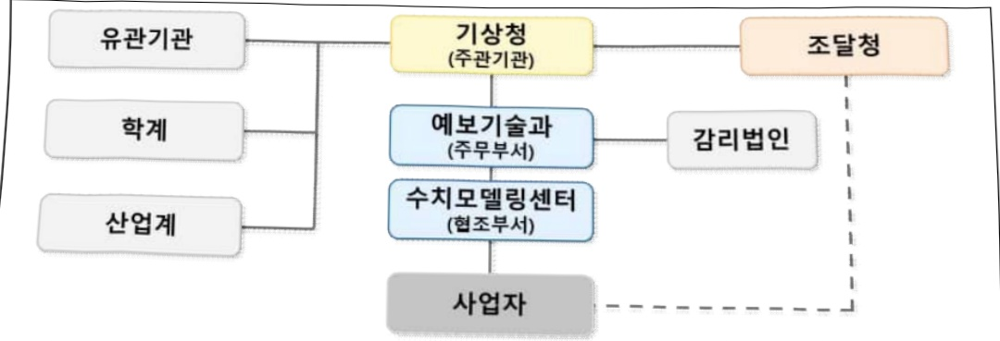

# 선진예보시스템 구축 및 운영(정보화)

**해당 페이지**: PDF 2550 ~ 2561 쪽 해당

**부처**: 기상청
**분야**: 과학기술
**회계유형**: 일반
**2026 확정예산**: 6780.0 백만원
**전년대비 증감률**: -37.4%
**AI 도메인**: 환경/기후

---

<table border=1 style='margin: auto; word-wrap: break-word;'><tr><td style='text-align: center; word-wrap: break-word;'>사 엽 명</td></tr><tr><td style='text-align: center; word-wrap: break-word;'>선진예보시스템 구축 및 운영(정보화) (1140-501)</td></tr></table>

## □ 사업 코드 정보

<table border=1 style='margin: auto; word-wrap: break-word;'><tr><td style='text-align: center; word-wrap: break-word;'>구분</td><td style='text-align: center; word-wrap: break-word;'>회계</td><td style='text-align: center; word-wrap: break-word;'>소관</td><td style='text-align: center; word-wrap: break-word;'>실국(기관)</td><td style='text-align: center; word-wrap: break-word;'>계정</td><td style='text-align: center; word-wrap: break-word;'>분야</td><td style='text-align: center; word-wrap: break-word;'>부문</td></tr><tr><td style='text-align: center; word-wrap: break-word;'>코드</td><td rowspan="2">일반</td><td rowspan="2">기상청</td><td rowspan="2">예보국</td><td rowspan="2"></td><td style='text-align: center; word-wrap: break-word;'>150</td><td style='text-align: center; word-wrap: break-word;'>153</td></tr><tr><td style='text-align: center; word-wrap: break-word;'>명칭</td><td style='text-align: center; word-wrap: break-word;'>과학기술</td><td style='text-align: center; word-wrap: break-word;'>과학기술일반</td></tr></table>

<table border=1 style='margin: auto; word-wrap: break-word;'><tr><td style='text-align: center; word-wrap: break-word;'>구분</td><td style='text-align: center; word-wrap: break-word;'>프로그램</td><td style='text-align: center; word-wrap: break-word;'>단위사업</td><td style='text-align: center; word-wrap: break-word;'>세부사업</td></tr><tr><td style='text-align: center; word-wrap: break-word;'>코드</td><td style='text-align: center; word-wrap: break-word;'>1100</td><td style='text-align: center; word-wrap: break-word;'>1140</td><td style='text-align: center; word-wrap: break-word;'>501</td></tr><tr><td style='text-align: center; word-wrap: break-word;'>명칭</td><td style='text-align: center; word-wrap: break-word;'>기상예보</td><td style='text-align: center; word-wrap: break-word;'>예보 및 통보체계 개선</td><td style='text-align: center; word-wrap: break-word;'>선진예보시스템 구축 및 운영</td></tr></table>

□ 사업 성격 (공통요구자료 1-1 작성유의사항 4. 참조, 해당하는 사항에 “0” 표시)

<table border=1 style='margin: auto; word-wrap: break-word;'><tr><td rowspan="2">신규</td><td rowspan="2">계속</td><td rowspan="2">완료</td><td rowspan="2">예비타당성 실시여부</td><td rowspan="2">총사업비 관리대상</td><td rowspan="2">총액계상 예산사업</td><td style='text-align: center; word-wrap: break-word;'>사업소관 변경정보</td></tr><tr><td style='text-align: center; word-wrap: break-word;'>2025예산 시 소관</td></tr><tr><td style='text-align: center; word-wrap: break-word;'></td><td style='text-align: center; word-wrap: break-word;'></td><td style='text-align: center; word-wrap: break-word;'></td><td style='text-align: center; word-wrap: break-word;'></td><td style='text-align: center; word-wrap: break-word;'></td><td style='text-align: center; word-wrap: break-word;'></td><td style='text-align: center; word-wrap: break-word;'></td></tr></table>

□ 사업 지원 형태 및 지원을 (최소한 한 개는 반드시 선택하시오. 해당사항에 0 표시)

<table border=1 style='margin: auto; word-wrap: break-word;'><tr><td style='text-align: center; word-wrap: break-word;'>직접</td><td style='text-align: center; word-wrap: break-word;'>출자</td><td style='text-align: center; word-wrap: break-word;'>출연</td><td style='text-align: center; word-wrap: break-word;'>보조</td><td style='text-align: center; word-wrap: break-word;'>융자</td><td style='text-align: center; word-wrap: break-word;'>국고보조율(%)</td><td style='text-align: center; word-wrap: break-word;'>융자율(%)</td></tr><tr><td style='text-align: center; word-wrap: break-word;'>○</td><td style='text-align: center; word-wrap: break-word;'></td><td style='text-align: center; word-wrap: break-word;'></td><td style='text-align: center; word-wrap: break-word;'></td><td style='text-align: center; word-wrap: break-word;'></td><td style='text-align: center; word-wrap: break-word;'></td><td style='text-align: center; word-wrap: break-word;'></td></tr></table>

## □ 사업 담당자

<table border=1 style='margin: auto; word-wrap: break-word;'><tr><td style='text-align: center; word-wrap: break-word;'>사업명</td><td colspan="2">구분</td></tr><tr><td style='text-align: center; word-wrap: break-word;'>선진예보시스템 구축 및 운영</td><td style='text-align: center; word-wrap: break-word;'>소관부처</td><td style='text-align: center; word-wrap: break-word;'>예보국 예보기술과</td></tr></table>

---

### 가.예산안 총괄표

(단위: 백만원, %)

<table border=1 style='margin: auto; word-wrap: break-word;'><tr><td rowspan="2">사업명</td><td style='text-align: center; word-wrap: break-word;'>2024년</td><td colspan="2">2025년 예산</td><td colspan="2">2026년</td><td rowspan="2">중감(B-A)</td><td rowspan="2">(B-A)/A</td></tr><tr><td style='text-align: center; word-wrap: break-word;'>결산</td><td style='text-align: center; word-wrap: break-word;'>본예산(A)</td><td style='text-align: center; word-wrap: break-word;'>추경</td><td style='text-align: center; word-wrap: break-word;'>요구안</td><td style='text-align: center; word-wrap: break-word;'>본예산(B)</td></tr><tr><td style='text-align: center; word-wrap: break-word;'>선진예보시스템구축 및 운영(정보화)</td><td style='text-align: center; word-wrap: break-word;'>13,966</td><td style='text-align: center; word-wrap: break-word;'>10,830</td><td style='text-align: center; word-wrap: break-word;'>10,830</td><td style='text-align: center; word-wrap: break-word;'>6,780</td><td style='text-align: center; word-wrap: break-word;'>6,780</td><td style='text-align: center; word-wrap: break-word;'>△4,050</td><td style='text-align: center; word-wrap: break-word;'>△37.4</td></tr></table>

□ 기능별(내역사업별), 목별 예산안 내역

(단위:백만원)

<table border=1 style='margin: auto; word-wrap: break-word;'><tr><td rowspan="3"></td><td colspan="5">2024</td><td colspan="7">2025(2025.12월말)</td><td rowspan="3">2026예산안</td></tr><tr><td rowspan="2">예산액(추정)</td><td rowspan="2">예산현액</td><td rowspan="2">집행액[실질행액]</td><td rowspan="2">이월액</td><td rowspan="2">불용액</td><td rowspan="2">분예산</td><td rowspan="2">예산현액</td><td rowspan="2">집행액[실질행액]</td><td colspan="2">전년도이월액제외</td><td rowspan="2">이월예상액</td><td rowspan="2">불용예상액</td></tr><tr><td style='text-align: center; word-wrap: break-word;'>예산현액</td><td style='text-align: center; word-wrap: break-word;'>집행액[실질행액]</td></tr><tr><td style='text-align: center; word-wrap: break-word;'>○ 기능별 분류(합계)</td><td style='text-align: center; word-wrap: break-word;'>14,131</td><td style='text-align: center; word-wrap: break-word;'>14,131</td><td style='text-align: center; word-wrap: break-word;'>13,966</td><td style='text-align: center; word-wrap: break-word;'>-</td><td style='text-align: center; word-wrap: break-word;'>165</td><td style='text-align: center; word-wrap: break-word;'>10,830</td><td style='text-align: center; word-wrap: break-word;'>10,830</td><td style='text-align: center; word-wrap: break-word;'>10,309</td><td style='text-align: center; word-wrap: break-word;'>10,830</td><td style='text-align: center; word-wrap: break-word;'>10,309</td><td style='text-align: center; word-wrap: break-word;'>-</td><td style='text-align: center; word-wrap: break-word;'>521</td><td style='text-align: center; word-wrap: break-word;'>6,780</td></tr><tr><td style='text-align: center; word-wrap: break-word;'>·예보시스템 개선 및 운영</td><td style='text-align: center; word-wrap: break-word;'>4,102</td><td style='text-align: center; word-wrap: break-word;'>4,102</td><td style='text-align: center; word-wrap: break-word;'>4,001</td><td style='text-align: center; word-wrap: break-word;'>-</td><td style='text-align: center; word-wrap: break-word;'>101</td><td style='text-align: center; word-wrap: break-word;'>3,402</td><td style='text-align: center; word-wrap: break-word;'>3,402</td><td style='text-align: center; word-wrap: break-word;'>3,261</td><td style='text-align: center; word-wrap: break-word;'>3,402</td><td style='text-align: center; word-wrap: break-word;'>3,261</td><td style='text-align: center; word-wrap: break-word;'>-</td><td style='text-align: center; word-wrap: break-word;'>141</td><td style='text-align: center; word-wrap: break-word;'>5,291</td></tr><tr><td style='text-align: center; word-wrap: break-word;'>·국가기상센터 운영</td><td style='text-align: center; word-wrap: break-word;'>889</td><td style='text-align: center; word-wrap: break-word;'>889</td><td style='text-align: center; word-wrap: break-word;'>861</td><td style='text-align: center; word-wrap: break-word;'>-</td><td style='text-align: center; word-wrap: break-word;'>28</td><td style='text-align: center; word-wrap: break-word;'>689</td><td style='text-align: center; word-wrap: break-word;'>689</td><td style='text-align: center; word-wrap: break-word;'>340</td><td style='text-align: center; word-wrap: break-word;'>689</td><td style='text-align: center; word-wrap: break-word;'>340</td><td style='text-align: center; word-wrap: break-word;'>-</td><td style='text-align: center; word-wrap: break-word;'>349</td><td style='text-align: center; word-wrap: break-word;'>689</td></tr><tr><td style='text-align: center; word-wrap: break-word;'>·선반에보시스템Ⅱ 구축</td><td style='text-align: center; word-wrap: break-word;'>8,440</td><td style='text-align: center; word-wrap: break-word;'>8,440</td><td style='text-align: center; word-wrap: break-word;'>8,411</td><td style='text-align: center; word-wrap: break-word;'>-</td><td style='text-align: center; word-wrap: break-word;'>29</td><td style='text-align: center; word-wrap: break-word;'>6,039</td><td style='text-align: center; word-wrap: break-word;'>6,039</td><td style='text-align: center; word-wrap: break-word;'>6,032</td><td style='text-align: center; word-wrap: break-word;'>6,039</td><td style='text-align: center; word-wrap: break-word;'>6,032</td><td style='text-align: center; word-wrap: break-word;'>-</td><td style='text-align: center; word-wrap: break-word;'>7</td><td style='text-align: center; word-wrap: break-word;'>-</td></tr><tr><td style='text-align: center; word-wrap: break-word;'>·수치에보시스템 운영체계 개선</td><td style='text-align: center; word-wrap: break-word;'>700</td><td style='text-align: center; word-wrap: break-word;'>700</td><td style='text-align: center; word-wrap: break-word;'>693</td><td style='text-align: center; word-wrap: break-word;'>-</td><td style='text-align: center; word-wrap: break-word;'>7</td><td style='text-align: center; word-wrap: break-word;'>700</td><td style='text-align: center; word-wrap: break-word;'>700</td><td style='text-align: center; word-wrap: break-word;'>675</td><td style='text-align: center; word-wrap: break-word;'>700</td><td style='text-align: center; word-wrap: break-word;'>675</td><td style='text-align: center; word-wrap: break-word;'>-</td><td style='text-align: center; word-wrap: break-word;'>25</td><td style='text-align: center; word-wrap: break-word;'>800</td></tr><tr><td style='text-align: center; word-wrap: break-word;'>○ 비목별 분류(합계)</td><td style='text-align: center; word-wrap: break-word;'>14,131</td><td style='text-align: center; word-wrap: break-word;'>14,131</td><td style='text-align: center; word-wrap: break-word;'>13,966</td><td style='text-align: center; word-wrap: break-word;'>-</td><td style='text-align: center; word-wrap: break-word;'>165</td><td style='text-align: center; word-wrap: break-word;'>10,830</td><td style='text-align: center; word-wrap: break-word;'>10,830</td><td style='text-align: center; word-wrap: break-word;'>10,309</td><td style='text-align: center; word-wrap: break-word;'>10,830</td><td style='text-align: center; word-wrap: break-word;'>10,309</td><td style='text-align: center; word-wrap: break-word;'>-</td><td style='text-align: center; word-wrap: break-word;'>521</td><td style='text-align: center; word-wrap: break-word;'>6,780</td></tr><tr><td style='text-align: center; word-wrap: break-word;'>·일반수용비(210-01)</td><td style='text-align: center; word-wrap: break-word;'>186</td><td style='text-align: center; word-wrap: break-word;'>186</td><td style='text-align: center; word-wrap: break-word;'>151</td><td style='text-align: center; word-wrap: break-word;'>-</td><td style='text-align: center; word-wrap: break-word;'>35</td><td style='text-align: center; word-wrap: break-word;'>186</td><td style='text-align: center; word-wrap: break-word;'>177</td><td style='text-align: center; word-wrap: break-word;'>101</td><td style='text-align: center; word-wrap: break-word;'>177</td><td style='text-align: center; word-wrap: break-word;'>101</td><td style='text-align: center; word-wrap: break-word;'>-</td><td style='text-align: center; word-wrap: break-word;'>76</td><td style='text-align: center; word-wrap: break-word;'>186</td></tr><tr><td style='text-align: center; word-wrap: break-word;'>·공공요금 및 제세(210-02)</td><td style='text-align: center; word-wrap: break-word;'>794</td><td style='text-align: center; word-wrap: break-word;'>794</td><td style='text-align: center; word-wrap: break-word;'>776</td><td style='text-align: center; word-wrap: break-word;'>-</td><td style='text-align: center; word-wrap: break-word;'>18</td><td style='text-align: center; word-wrap: break-word;'>594</td><td style='text-align: center; word-wrap: break-word;'>594</td><td style='text-align: center; word-wrap: break-word;'>257</td><td style='text-align: center; word-wrap: break-word;'>594</td><td style='text-align: center; word-wrap: break-word;'>257</td><td style='text-align: center; word-wrap: break-word;'>-</td><td style='text-align: center; word-wrap: break-word;'>337</td><td style='text-align: center; word-wrap: break-word;'>594</td></tr><tr><td style='text-align: center; word-wrap: break-word;'>·입차료(210-07)</td><td style='text-align: center; word-wrap: break-word;'>8</td><td style='text-align: center; word-wrap: break-word;'>8</td><td style='text-align: center; word-wrap: break-word;'>1</td><td style='text-align: center; word-wrap: break-word;'>-</td><td style='text-align: center; word-wrap: break-word;'>7</td><td style='text-align: center; word-wrap: break-word;'>8</td><td style='text-align: center; word-wrap: break-word;'>8</td><td style='text-align: center; word-wrap: break-word;'>4</td><td style='text-align: center; word-wrap: break-word;'>8</td><td style='text-align: center; word-wrap: break-word;'>4</td><td style='text-align: center; word-wrap: break-word;'>-</td><td style='text-align: center; word-wrap: break-word;'>4</td><td style='text-align: center; word-wrap: break-word;'>8</td></tr><tr><td style='text-align: center; word-wrap: break-word;'>·시설장비유지비(210-09)</td><td style='text-align: center; word-wrap: break-word;'>17</td><td style='text-align: center; word-wrap: break-word;'>17</td><td style='text-align: center; word-wrap: break-word;'>8</td><td style='text-align: center; word-wrap: break-word;'>-</td><td style='text-align: center; word-wrap: break-word;'>9</td><td style='text-align: center; word-wrap: break-word;'>17</td><td style='text-align: center; word-wrap: break-word;'>17</td><td style='text-align: center; word-wrap: break-word;'>0</td><td style='text-align: center; word-wrap: break-word;'>17</td><td style='text-align: center; word-wrap: break-word;'>0</td><td style='text-align: center; word-wrap: break-word;'>-</td><td style='text-align: center; word-wrap: break-word;'>17</td><td style='text-align: center; word-wrap: break-word;'>17</td></tr><tr><td style='text-align: center; word-wrap: break-word;'>·일반용역비(210-14)</td><td style='text-align: center; word-wrap: break-word;'>417</td><td style='text-align: center; word-wrap: break-word;'>417</td><td style='text-align: center; word-wrap: break-word;'>413</td><td style='text-align: center; word-wrap: break-word;'>-</td><td style='text-align: center; word-wrap: break-word;'>4</td><td style='text-align: center; word-wrap: break-word;'>417</td><td style='text-align: center; word-wrap: break-word;'>417</td><td style='text-align: center; word-wrap: break-word;'>381</td><td style='text-align: center; word-wrap: break-word;'>417</td><td style='text-align: center; word-wrap: break-word;'>381</td><td style='text-align: center; word-wrap: break-word;'>-</td><td style='text-align: center; word-wrap: break-word;'>36</td><td style='text-align: center; word-wrap: break-word;'>417</td></tr><tr><td style='text-align: center; word-wrap: break-word;'>·관리용역비(210-15)</td><td style='text-align: center; word-wrap: break-word;'>1,925</td><td style='text-align: center; word-wrap: break-word;'>1,925</td><td style='text-align: center; word-wrap: break-word;'>1,904</td><td style='text-align: center; word-wrap: break-word;'>-</td><td style='text-align: center; word-wrap: break-word;'>21</td><td style='text-align: center; word-wrap: break-word;'>1,925</td><td style='text-align: center; word-wrap: break-word;'>1,925</td><td style='text-align: center; word-wrap: break-word;'>1,906</td><td style='text-align: center; word-wrap: break-word;'>1,925</td><td style='text-align: center; word-wrap: break-word;'>1,906</td><td style='text-align: center; word-wrap: break-word;'>-</td><td style='text-align: center; word-wrap: break-word;'>19</td><td style='text-align: center; word-wrap: break-word;'>2,014</td></tr><tr><td style='text-align: center; word-wrap: break-word;'>·국내여비(220-01)</td><td style='text-align: center; word-wrap: break-word;'>11</td><td style='text-align: center; word-wrap: break-word;'>11</td><td style='text-align: center; word-wrap: break-word;'>9</td><td style='text-align: center; word-wrap: break-word;'>-</td><td style='text-align: center; word-wrap: break-word;'>2</td><td style='text-align: center; word-wrap: break-word;'>11</td><td style='text-align: center; word-wrap: break-word;'>11</td><td style='text-align: center; word-wrap: break-word;'>9</td><td style='text-align: center; word-wrap: break-word;'>11</td><td style='text-align: center; word-wrap: break-word;'>9</td><td style='text-align: center; word-wrap: break-word;'>-</td><td style='text-align: center; word-wrap: break-word;'>2</td><td style='text-align: center; word-wrap: break-word;'>11</td></tr><tr><td style='text-align: center; word-wrap: break-word;'>·국외업무여비(220-02)</td><td style='text-align: center; word-wrap: break-word;'>19</td><td style='text-align: center; word-wrap: break-word;'>19</td><td style='text-align: center; word-wrap: break-word;'>17</td><td style='text-align: center; word-wrap: break-word;'>-</td><td style='text-align: center; word-wrap: break-word;'>3</td><td style='text-align: center; word-wrap: break-word;'>19</td><td style='text-align: center; word-wrap: break-word;'>19</td><td style='text-align: center; word-wrap: break-word;'>11</td><td style='text-align: center; word-wrap: break-word;'>19</td><td style='text-align: center; word-wrap: break-word;'>11</td><td style='text-align: center; word-wrap: break-word;'>-</td><td style='text-align: center; word-wrap: break-word;'>8</td><td style='text-align: center; word-wrap: break-word;'>19</td></tr><tr><td style='text-align: center; word-wrap: break-word;'>·사업추진비(240-01)</td><td style='text-align: center; word-wrap: break-word;'>4</td><td style='text-align: center; word-wrap: break-word;'>4</td><td style='text-align: center; word-wrap: break-word;'>4</td><td style='text-align: center; word-wrap: break-word;'>-</td><td style='text-align: center; word-wrap: break-word;'>0</td><td style='text-align: center; word-wrap: break-word;'>4</td><td style='text-align: center; word-wrap: break-word;'>4</td><td style='text-align: center; word-wrap: break-word;'>4</td><td style='text-align: center; word-wrap: break-word;'>4</td><td style='text-align: center; word-wrap: break-word;'>4</td><td style='text-align: center; word-wrap: break-word;'>-</td><td style='text-align: center; word-wrap: break-word;'>0</td><td style='text-align: center; word-wrap: break-word;'>4</td></tr><tr><td style='text-align: center; word-wrap: break-word;'>·일반연구비(260-01)</td><td style='text-align: center; word-wrap: break-word;'>9,083</td><td style='text-align: center; word-wrap: break-word;'>9,083</td><td style='text-align: center; word-wrap: break-word;'>9,042</td><td style='text-align: center; word-wrap: break-word;'>-</td><td style='text-align: center; word-wrap: break-word;'>41</td><td style='text-align: center; word-wrap: break-word;'>6,794</td><td style='text-align: center; word-wrap: break-word;'>6,794</td><td style='text-align: center; word-wrap: break-word;'>6,778</td><td style='text-align: center; word-wrap: break-word;'>6,794</td><td style='text-align: center; word-wrap: break-word;'>6,778</td><td style='text-align: center; word-wrap: break-word;'>-</td><td style='text-align: center; word-wrap: break-word;'>16</td><td style='text-align: center; word-wrap: break-word;'>3,187</td></tr><tr><td style='text-align: center; word-wrap: break-word;'>·국제부담금(340-02)</td><td style='text-align: center; word-wrap: break-word;'>180</td><td style='text-align: center; word-wrap: break-word;'>180</td><td style='text-align: center; word-wrap: break-word;'>178</td><td style='text-align: center; word-wrap: break-word;'>-</td><td style='text-align: center; word-wrap: break-word;'>2</td><td style='text-align: center; word-wrap: break-word;'>180</td><td style='text-align: center; word-wrap: break-word;'>189</td><td style='text-align: center; word-wrap: break-word;'>189</td><td style='text-align: center; word-wrap: break-word;'>189</td><td style='text-align: center; word-wrap: break-word;'>189</td><td style='text-align: center; word-wrap: break-word;'>-</td><td style='text-align: center; word-wrap: break-word;'>0</td><td style='text-align: center; word-wrap: break-word;'>280</td></tr><tr><td style='text-align: center; word-wrap: break-word;'>·자산취득비(430-01)</td><td style='text-align: center; word-wrap: break-word;'>1,487</td><td style='text-align: center; word-wrap: break-word;'>1,487</td><td style='text-align: center; word-wrap: break-word;'>1,464</td><td style='text-align: center; word-wrap: break-word;'>-</td><td style='text-align: center; word-wrap: break-word;'>23</td><td style='text-align: center; word-wrap: break-word;'>675</td><td style='text-align: center; word-wrap: break-word;'>675</td><td style='text-align: center; word-wrap: break-word;'>669</td><td style='text-align: center; word-wrap: break-word;'>675</td><td style='text-align: center; word-wrap: break-word;'>669</td><td style='text-align: center; word-wrap: break-word;'>-</td><td style='text-align: center; word-wrap: break-word;'>6</td><td style='text-align: center; word-wrap: break-word;'>43</td></tr></table>

---

<table border=1 style='margin: auto; word-wrap: break-word;'><tr><td rowspan="3"></td><td colspan="5">2024</td><td colspan="7">2025(2025.12월말)</td><td rowspan="3">2026예산안</td></tr><tr><td rowspan="2">예산액(추정)</td><td rowspan="2">예산현액</td><td rowspan="2">집행액[실질행액]</td><td rowspan="2">이월액</td><td rowspan="2">불용액</td><td rowspan="2">본예산</td><td rowspan="2">예산현액</td><td rowspan="2">집행액[실질행액]</td><td colspan="2">전년도이월액제외</td><td rowspan="2">이월예산액</td><td rowspan="2">불용예상액</td></tr><tr><td style='text-align: center; word-wrap: break-word;'>예산현액</td><td style='text-align: center; word-wrap: break-word;'>집행액[실질행액]</td></tr><tr><td style='text-align: center; word-wrap: break-word;'>○가능비목별분류(액)</td><td style='text-align: center; word-wrap: break-word;'>14,131</td><td style='text-align: center; word-wrap: break-word;'>14,131</td><td style='text-align: center; word-wrap: break-word;'>13,966</td><td style='text-align: center; word-wrap: break-word;'>-</td><td style='text-align: center; word-wrap: break-word;'>165</td><td style='text-align: center; word-wrap: break-word;'>10,830</td><td style='text-align: center; word-wrap: break-word;'>10,830</td><td style='text-align: center; word-wrap: break-word;'>10,309</td><td style='text-align: center; word-wrap: break-word;'>10,830</td><td style='text-align: center; word-wrap: break-word;'>10,309</td><td style='text-align: center; word-wrap: break-word;'>-</td><td style='text-align: center; word-wrap: break-word;'>521</td><td style='text-align: center; word-wrap: break-word;'>6,780</td></tr><tr><td style='text-align: center; word-wrap: break-word;'>·예보시스템개선 및운영</td><td style='text-align: center; word-wrap: break-word;'>4,102</td><td style='text-align: center; word-wrap: break-word;'>4,102</td><td style='text-align: center; word-wrap: break-word;'>4,001</td><td style='text-align: center; word-wrap: break-word;'>-</td><td style='text-align: center; word-wrap: break-word;'>101</td><td style='text-align: center; word-wrap: break-word;'>3,402</td><td style='text-align: center; word-wrap: break-word;'>3,402</td><td style='text-align: center; word-wrap: break-word;'>3,261</td><td style='text-align: center; word-wrap: break-word;'>3,402</td><td style='text-align: center; word-wrap: break-word;'>3,261</td><td style='text-align: center; word-wrap: break-word;'>-</td><td style='text-align: center; word-wrap: break-word;'>141</td><td style='text-align: center; word-wrap: break-word;'>5,291</td></tr><tr><td style='text-align: center; word-wrap: break-word;'>·일반수용비(210-01)</td><td style='text-align: center; word-wrap: break-word;'>112</td><td style='text-align: center; word-wrap: break-word;'>112</td><td style='text-align: center; word-wrap: break-word;'>79</td><td style='text-align: center; word-wrap: break-word;'>-</td><td style='text-align: center; word-wrap: break-word;'>33</td><td style='text-align: center; word-wrap: break-word;'>112</td><td style='text-align: center; word-wrap: break-word;'>112</td><td style='text-align: center; word-wrap: break-word;'>39</td><td style='text-align: center; word-wrap: break-word;'>112</td><td style='text-align: center; word-wrap: break-word;'>39</td><td style='text-align: center; word-wrap: break-word;'>-</td><td style='text-align: center; word-wrap: break-word;'>73</td><td style='text-align: center; word-wrap: break-word;'>112</td></tr><tr><td style='text-align: center; word-wrap: break-word;'>·임차료(210-07)</td><td style='text-align: center; word-wrap: break-word;'>6</td><td style='text-align: center; word-wrap: break-word;'>6</td><td style='text-align: center; word-wrap: break-word;'>0</td><td style='text-align: center; word-wrap: break-word;'>-</td><td style='text-align: center; word-wrap: break-word;'>6</td><td style='text-align: center; word-wrap: break-word;'>6</td><td style='text-align: center; word-wrap: break-word;'>6</td><td style='text-align: center; word-wrap: break-word;'>2</td><td style='text-align: center; word-wrap: break-word;'>6</td><td style='text-align: center; word-wrap: break-word;'>2</td><td style='text-align: center; word-wrap: break-word;'>-</td><td style='text-align: center; word-wrap: break-word;'>4</td><td style='text-align: center; word-wrap: break-word;'>6</td></tr><tr><td style='text-align: center; word-wrap: break-word;'>·일반용액비(210-14)</td><td style='text-align: center; word-wrap: break-word;'>417</td><td style='text-align: center; word-wrap: break-word;'>417</td><td style='text-align: center; word-wrap: break-word;'>413</td><td style='text-align: center; word-wrap: break-word;'>-</td><td style='text-align: center; word-wrap: break-word;'>4</td><td style='text-align: center; word-wrap: break-word;'>417</td><td style='text-align: center; word-wrap: break-word;'>417</td><td style='text-align: center; word-wrap: break-word;'>381</td><td style='text-align: center; word-wrap: break-word;'>417</td><td style='text-align: center; word-wrap: break-word;'>381</td><td style='text-align: center; word-wrap: break-word;'>-</td><td style='text-align: center; word-wrap: break-word;'>36</td><td style='text-align: center; word-wrap: break-word;'>417</td></tr><tr><td style='text-align: center; word-wrap: break-word;'>·관리용액비(210-15)</td><td style='text-align: center; word-wrap: break-word;'>1,925</td><td style='text-align: center; word-wrap: break-word;'>1,925</td><td style='text-align: center; word-wrap: break-word;'>1,904</td><td style='text-align: center; word-wrap: break-word;'>-</td><td style='text-align: center; word-wrap: break-word;'>21</td><td style='text-align: center; word-wrap: break-word;'>1,925</td><td style='text-align: center; word-wrap: break-word;'>1,925</td><td style='text-align: center; word-wrap: break-word;'>1,906</td><td style='text-align: center; word-wrap: break-word;'>1,925</td><td style='text-align: center; word-wrap: break-word;'>1,906</td><td style='text-align: center; word-wrap: break-word;'>-</td><td style='text-align: center; word-wrap: break-word;'>19</td><td style='text-align: center; word-wrap: break-word;'>2,014</td></tr><tr><td style='text-align: center; word-wrap: break-word;'>·국내억비(220-01)</td><td style='text-align: center; word-wrap: break-word;'>4</td><td style='text-align: center; word-wrap: break-word;'>4</td><td style='text-align: center; word-wrap: break-word;'>3</td><td style='text-align: center; word-wrap: break-word;'>-</td><td style='text-align: center; word-wrap: break-word;'>1</td><td style='text-align: center; word-wrap: break-word;'>4</td><td style='text-align: center; word-wrap: break-word;'>4</td><td style='text-align: center; word-wrap: break-word;'>3</td><td style='text-align: center; word-wrap: break-word;'>4</td><td style='text-align: center; word-wrap: break-word;'>3</td><td style='text-align: center; word-wrap: break-word;'>-</td><td style='text-align: center; word-wrap: break-word;'>1</td><td style='text-align: center; word-wrap: break-word;'>4</td></tr><tr><td style='text-align: center; word-wrap: break-word;'>·국외억비(220-02)</td><td style='text-align: center; word-wrap: break-word;'>13</td><td style='text-align: center; word-wrap: break-word;'>13</td><td style='text-align: center; word-wrap: break-word;'>12</td><td style='text-align: center; word-wrap: break-word;'>-</td><td style='text-align: center; word-wrap: break-word;'>1</td><td style='text-align: center; word-wrap: break-word;'>13</td><td style='text-align: center; word-wrap: break-word;'>13</td><td style='text-align: center; word-wrap: break-word;'>5</td><td style='text-align: center; word-wrap: break-word;'>13</td><td style='text-align: center; word-wrap: break-word;'>5</td><td style='text-align: center; word-wrap: break-word;'>-</td><td style='text-align: center; word-wrap: break-word;'>8</td><td style='text-align: center; word-wrap: break-word;'>13</td></tr><tr><td style='text-align: center; word-wrap: break-word;'>·사업추진비(240-01)</td><td style='text-align: center; word-wrap: break-word;'>1</td><td style='text-align: center; word-wrap: break-word;'>1</td><td style='text-align: center; word-wrap: break-word;'>1</td><td style='text-align: center; word-wrap: break-word;'>-</td><td style='text-align: center; word-wrap: break-word;'>0</td><td style='text-align: center; word-wrap: break-word;'>1</td><td style='text-align: center; word-wrap: break-word;'>1</td><td style='text-align: center; word-wrap: break-word;'>1</td><td style='text-align: center; word-wrap: break-word;'>1</td><td style='text-align: center; word-wrap: break-word;'>1</td><td style='text-align: center; word-wrap: break-word;'>-</td><td style='text-align: center; word-wrap: break-word;'>0</td><td style='text-align: center; word-wrap: break-word;'>1</td></tr><tr><td style='text-align: center; word-wrap: break-word;'>·일반연구비(260-01)</td><td style='text-align: center; word-wrap: break-word;'>1,624</td><td style='text-align: center; word-wrap: break-word;'>1,624</td><td style='text-align: center; word-wrap: break-word;'>1,589</td><td style='text-align: center; word-wrap: break-word;'>-</td><td style='text-align: center; word-wrap: break-word;'>35</td><td style='text-align: center; word-wrap: break-word;'>924</td><td style='text-align: center; word-wrap: break-word;'>924</td><td style='text-align: center; word-wrap: break-word;'>924</td><td style='text-align: center; word-wrap: break-word;'>924</td><td style='text-align: center; word-wrap: break-word;'>924</td><td style='text-align: center; word-wrap: break-word;'>-</td><td style='text-align: center; word-wrap: break-word;'>0</td><td style='text-align: center; word-wrap: break-word;'>2,724</td></tr><tr><td style='text-align: center; word-wrap: break-word;'>·국가기상센터운영</td><td style='text-align: center; word-wrap: break-word;'>889</td><td style='text-align: center; word-wrap: break-word;'>889</td><td style='text-align: center; word-wrap: break-word;'>861</td><td style='text-align: center; word-wrap: break-word;'>-</td><td style='text-align: center; word-wrap: break-word;'>28</td><td style='text-align: center; word-wrap: break-word;'>689</td><td style='text-align: center; word-wrap: break-word;'>689</td><td style='text-align: center; word-wrap: break-word;'>340</td><td style='text-align: center; word-wrap: break-word;'>689</td><td style='text-align: center; word-wrap: break-word;'>340</td><td style='text-align: center; word-wrap: break-word;'>-</td><td style='text-align: center; word-wrap: break-word;'>349</td><td style='text-align: center; word-wrap: break-word;'>689</td></tr><tr><td style='text-align: center; word-wrap: break-word;'>·일반수용비(210-01)</td><td style='text-align: center; word-wrap: break-word;'>40</td><td style='text-align: center; word-wrap: break-word;'>40</td><td style='text-align: center; word-wrap: break-word;'>40</td><td style='text-align: center; word-wrap: break-word;'>-</td><td style='text-align: center; word-wrap: break-word;'>0</td><td style='text-align: center; word-wrap: break-word;'>40</td><td style='text-align: center; word-wrap: break-word;'>40</td><td style='text-align: center; word-wrap: break-word;'>38</td><td style='text-align: center; word-wrap: break-word;'>40</td><td style='text-align: center; word-wrap: break-word;'>38</td><td style='text-align: center; word-wrap: break-word;'>-</td><td style='text-align: center; word-wrap: break-word;'>2</td><td style='text-align: center; word-wrap: break-word;'>40</td></tr><tr><td style='text-align: center; word-wrap: break-word;'>·공공요금 및제세(210-02)</td><td style='text-align: center; word-wrap: break-word;'>794</td><td style='text-align: center; word-wrap: break-word;'>794</td><td style='text-align: center; word-wrap: break-word;'>776</td><td style='text-align: center; word-wrap: break-word;'>-</td><td style='text-align: center; word-wrap: break-word;'>18</td><td style='text-align: center; word-wrap: break-word;'>594</td><td style='text-align: center; word-wrap: break-word;'>594</td><td style='text-align: center; word-wrap: break-word;'>257</td><td style='text-align: center; word-wrap: break-word;'>594</td><td style='text-align: center; word-wrap: break-word;'>257</td><td style='text-align: center; word-wrap: break-word;'>-</td><td style='text-align: center; word-wrap: break-word;'>337</td><td style='text-align: center; word-wrap: break-word;'>594</td></tr><tr><td style='text-align: center; word-wrap: break-word;'>·시설장비유지비(210-09)</td><td style='text-align: center; word-wrap: break-word;'>9</td><td style='text-align: center; word-wrap: break-word;'>9</td><td style='text-align: center; word-wrap: break-word;'>0</td><td style='text-align: center; word-wrap: break-word;'>-</td><td style='text-align: center; word-wrap: break-word;'>9</td><td style='text-align: center; word-wrap: break-word;'>9</td><td style='text-align: center; word-wrap: break-word;'>9</td><td style='text-align: center; word-wrap: break-word;'>-</td><td style='text-align: center; word-wrap: break-word;'>9</td><td style='text-align: center; word-wrap: break-word;'>-</td><td style='text-align: center; word-wrap: break-word;'>-</td><td style='text-align: center; word-wrap: break-word;'>9</td><td style='text-align: center; word-wrap: break-word;'>9</td></tr><tr><td style='text-align: center; word-wrap: break-word;'>·국내억비(220-01)</td><td style='text-align: center; word-wrap: break-word;'>4</td><td style='text-align: center; word-wrap: break-word;'>4</td><td style='text-align: center; word-wrap: break-word;'>3</td><td style='text-align: center; word-wrap: break-word;'>-</td><td style='text-align: center; word-wrap: break-word;'>1</td><td style='text-align: center; word-wrap: break-word;'>4</td><td style='text-align: center; word-wrap: break-word;'>4</td><td style='text-align: center; word-wrap: break-word;'>3</td><td style='text-align: center; word-wrap: break-word;'>4</td><td style='text-align: center; word-wrap: break-word;'>3</td><td style='text-align: center; word-wrap: break-word;'>-</td><td style='text-align: center; word-wrap: break-word;'>1</td><td style='text-align: center; word-wrap: break-word;'>4</td></tr><tr><td style='text-align: center; word-wrap: break-word;'>·사업추진비(240-01)</td><td style='text-align: center; word-wrap: break-word;'>2</td><td style='text-align: center; word-wrap: break-word;'>2</td><td style='text-align: center; word-wrap: break-word;'>2</td><td style='text-align: center; word-wrap: break-word;'>-</td><td style='text-align: center; word-wrap: break-word;'>0</td><td style='text-align: center; word-wrap: break-word;'>2</td><td style='text-align: center; word-wrap: break-word;'>2</td><td style='text-align: center; word-wrap: break-word;'>2</td><td style='text-align: center; word-wrap: break-word;'>2</td><td style='text-align: center; word-wrap: break-word;'>2</td><td style='text-align: center; word-wrap: break-word;'>-</td><td style='text-align: center; word-wrap: break-word;'>0</td><td style='text-align: center; word-wrap: break-word;'>2</td></tr><tr><td style='text-align: center; word-wrap: break-word;'>·자산취득비(430-01)</td><td style='text-align: center; word-wrap: break-word;'>40</td><td style='text-align: center; word-wrap: break-word;'>40</td><td style='text-align: center; word-wrap: break-word;'>40</td><td style='text-align: center; word-wrap: break-word;'>-</td><td style='text-align: center; word-wrap: break-word;'>0</td><td style='text-align: center; word-wrap: break-word;'>40</td><td style='text-align: center; word-wrap: break-word;'>40</td><td style='text-align: center; word-wrap: break-word;'>40</td><td style='text-align: center; word-wrap: break-word;'>40</td><td style='text-align: center; word-wrap: break-word;'>40</td><td style='text-align: center; word-wrap: break-word;'>-</td><td style='text-align: center; word-wrap: break-word;'>0</td><td style='text-align: center; word-wrap: break-word;'>40</td></tr><tr><td style='text-align: center; word-wrap: break-word;'>·선진예보시스템Ⅱ구축</td><td style='text-align: center; word-wrap: break-word;'>8,440</td><td style='text-align: center; word-wrap: break-word;'>8,440</td><td style='text-align: center; word-wrap: break-word;'>8,411</td><td style='text-align: center; word-wrap: break-word;'>-</td><td style='text-align: center; word-wrap: break-word;'>29</td><td style='text-align: center; word-wrap: break-word;'>6,039</td><td style='text-align: center; word-wrap: break-word;'>6,039</td><td style='text-align: center; word-wrap: break-word;'>6,032</td><td style='text-align: center; word-wrap: break-word;'>6,039</td><td style='text-align: center; word-wrap: break-word;'>6,032</td><td style='text-align: center; word-wrap: break-word;'>-</td><td style='text-align: center; word-wrap: break-word;'>7</td><td style='text-align: center; word-wrap: break-word;'>-</td></tr><tr><td style='text-align: center; word-wrap: break-word;'>·일반연구비(260-01)</td><td style='text-align: center; word-wrap: break-word;'>6,996</td><td style='text-align: center; word-wrap: break-word;'>6,996</td><td style='text-align: center; word-wrap: break-word;'>6,990</td><td style='text-align: center; word-wrap: break-word;'>-</td><td style='text-align: center; word-wrap: break-word;'>6</td><td style='text-align: center; word-wrap: break-word;'>5,407</td><td style='text-align: center; word-wrap: break-word;'>5,407</td><td style='text-align: center; word-wrap: break-word;'>5,406</td><td style='text-align: center; word-wrap: break-word;'>5,407</td><td style='text-align: center; word-wrap: break-word;'>5,406</td><td style='text-align: center; word-wrap: break-word;'>-</td><td style='text-align: center; word-wrap: break-word;'>1</td><td style='text-align: center; word-wrap: break-word;'>-</td></tr><tr><td style='text-align: center; word-wrap: break-word;'>·자산취득비(430-01)</td><td style='text-align: center; word-wrap: break-word;'>1,444</td><td style='text-align: center; word-wrap: break-word;'>1,444</td><td style='text-align: center; word-wrap: break-word;'>1,421</td><td style='text-align: center; word-wrap: break-word;'>-</td><td style='text-align: center; word-wrap: break-word;'>23</td><td style='text-align: center; word-wrap: break-word;'>632</td><td style='text-align: center; word-wrap: break-word;'>632</td><td style='text-align: center; word-wrap: break-word;'>626</td><td style='text-align: center; word-wrap: break-word;'>632</td><td style='text-align: center; word-wrap: break-word;'>626</td><td style='text-align: center; word-wrap: break-word;'>-</td><td style='text-align: center; word-wrap: break-word;'>6</td><td style='text-align: center; word-wrap: break-word;'>-</td></tr><tr><td style='text-align: center; word-wrap: break-word;'>·수치예보시스템운영체계개선</td><td style='text-align: center; word-wrap: break-word;'>700</td><td style='text-align: center; word-wrap: break-word;'>700</td><td style='text-align: center; word-wrap: break-word;'>693</td><td style='text-align: center; word-wrap: break-word;'>-</td><td style='text-align: center; word-wrap: break-word;'>7</td><td style='text-align: center; word-wrap: break-word;'>700</td><td style='text-align: center; word-wrap: break-word;'>700</td><td style='text-align: center; word-wrap: break-word;'>675</td><td style='text-align: center; word-wrap: break-word;'>700</td><td style='text-align: center; word-wrap: break-word;'>675</td><td style='text-align: center; word-wrap: break-word;'>-</td><td style='text-align: center; word-wrap: break-word;'>25</td><td style='text-align: center; word-wrap: break-word;'>800</td></tr><tr><td style='text-align: center; word-wrap: break-word;'>·일반수용비(210-01)</td><td style='text-align: center; word-wrap: break-word;'>34</td><td style='text-align: center; word-wrap: break-word;'>34</td><td style='text-align: center; word-wrap: break-word;'>32</td><td style='text-align: center; word-wrap: break-word;'>-</td><td style='text-align: center; word-wrap: break-word;'>2</td><td style='text-align: center; word-wrap: break-word;'>34</td><td style='text-align: center; word-wrap: break-word;'>25</td><td style='text-align: center; word-wrap: break-word;'>24</td><td style='text-align: center; word-wrap: break-word;'>25</td><td style='text-align: center; word-wrap: break-word;'>24</td><td style='text-align: center; word-wrap: break-word;'>-</td><td style='text-align: center; word-wrap: break-word;'>1</td><td style='text-align: center; word-wrap: break-word;'>34</td></tr><tr><td style='text-align: center; word-wrap: break-word;'>·임차료(210-07)</td><td style='text-align: center; word-wrap: break-word;'>2</td><td style='text-align: center; word-wrap: break-word;'>2</td><td style='text-align: center; word-wrap: break-word;'>1</td><td style='text-align: center; word-wrap: break-word;'>-</td><td style='text-align: center; word-wrap: break-word;'>1</td><td style='text-align: center; word-wrap: break-word;'>2</td><td style='text-align: center; word-wrap: break-word;'>2</td><td style='text-align: center; word-wrap: break-word;'>1</td><td style='text-align: center; word-wrap: break-word;'>2</td><td style='text-align: center; word-wrap: break-word;'>1</td><td style='text-align: center; word-wrap: break-word;'>-</td><td style='text-align: center; word-wrap: break-word;'>1</td><td style='text-align: center; word-wrap: break-word;'>2</td></tr><tr><td style='text-align: center; word-wrap: break-word;'>·시설장비유지비(210-09)</td><td style='text-align: center; word-wrap: break-word;'>8</td><td style='text-align: center; word-wrap: break-word;'>8</td><td style='text-align: center; word-wrap: break-word;'>8</td><td style='text-align: center; word-wrap: break-word;'>-</td><td style='text-align: center; word-wrap: break-word;'>0</td><td style='text-align: center; word-wrap: break-word;'>8</td><td style='text-align: center; word-wrap: break-word;'>8</td><td style='text-align: center; word-wrap: break-word;'>-</td><td style='text-align: center; word-wrap: break-word;'>8</td><td style='text-align: center; word-wrap: break-word;'>-</td><td style='text-align: center; word-wrap: break-word;'>-</td><td style='text-align: center; word-wrap: break-word;'>8</td><td style='text-align: center; word-wrap: break-word;'>8</td></tr><tr><td style='text-align: center; word-wrap: break-word;'>·국내억비(220-01)</td><td style='text-align: center; word-wrap: break-word;'>3</td><td style='text-align: center; word-wrap: break-word;'>3</td><td style='text-align: center; word-wrap: break-word;'>3</td><td style='text-align: center; word-wrap: break-word;'>-</td><td style='text-align: center; word-wrap: break-word;'>0</td><td style='text-align: center; word-wrap: break-word;'>3</td><td style='text-align: center; word-wrap: break-word;'>3</td><td style='text-align: center; word-wrap: break-word;'>3</td><td style='text-align: center; word-wrap: break-word;'>3</td><td style='text-align: center; word-wrap: break-word;'>3</td><td style='text-align: center; word-wrap: break-word;'>-</td><td style='text-align: center; word-wrap: break-word;'>0</td><td style='text-align: center; word-wrap: break-word;'>3</td></tr><tr><td style='text-align: center; word-wrap: break-word;'>·국외억비(220-02)</td><td style='text-align: center; word-wrap: break-word;'>6</td><td style='text-align: center; word-wrap: break-word;'>6</td><td style='text-align: center; word-wrap: break-word;'>4</td><td style='text-align: center; word-wrap: break-word;'>-</td><td style='text-align: center; word-wrap: break-word;'>2</td><td style='text-align: center; word-wrap: break-word;'>6</td><td style='text-align: center; word-wrap: break-word;'>6</td><td style='text-align: center; word-wrap: break-word;'>6</td><td style='text-align: center; word-wrap: break-word;'>6</td><td style='text-align: center; word-wrap: break-word;'>6</td><td style='text-align: center; word-wrap: break-word;'>-</td><td style='text-align: center; word-wrap: break-word;'>0</td><td style='text-align: center; word-wrap: break-word;'>6</td></tr><tr><td style='text-align: center; word-wrap: break-word;'>·사업추진비(240-01)</td><td style='text-align: center; word-wrap: break-word;'>1</td><td style='text-align: center; word-wrap: break-word;'>1</td><td style='text-align: center; word-wrap: break-word;'>1</td><td style='text-align: center; word-wrap: break-word;'>-</td><td style='text-align: center; word-wrap: break-word;'>0</td><td style='text-align: center; word-wrap: break-word;'>1</td><td style='text-align: center; word-wrap: break-word;'>1</td><td style='text-align: center; word-wrap: break-word;'>1</td><td style='text-align: center; word-wrap: break-word;'>1</td><td style='text-align: center; word-wrap: break-word;'>1</td><td style='text-align: center; word-wrap: break-word;'>-</td><td style='text-align: center; word-wrap: break-word;'>0</td><td style='text-align: center; word-wrap: break-word;'>1</td></tr><tr><td style='text-align: center; word-wrap: break-word;'>·일반연구비(260-01)</td><td style='text-align: center; word-wrap: break-word;'>463</td><td style='text-align: center; word-wrap: break-word;'>463</td><td style='text-align: center; word-wrap: break-word;'>463</td><td style='text-align: center; word-wrap: break-word;'>-</td><td style='text-align: center; word-wrap: break-word;'>0</td><td style='text-align: center; word-wrap: break-word;'>463</td><td style='text-align: center; word-wrap: break-word;'>463</td><td style='text-align: center; word-wrap: break-word;'>448</td><td style='text-align: center; word-wrap: break-word;'>463</td><td style='text-align: center; word-wrap: break-word;'>448</td><td style='text-align: center; word-wrap: break-word;'>-</td><td style='text-align: center; word-wrap: break-word;'>15</td><td style='text-align: center; word-wrap: break-word;'>463</td></tr><tr><td style='text-align: center; word-wrap: break-word;'>·국제부담금(340-02)</td><td style='text-align: center; word-wrap: break-word;'>180</td><td style='text-align: center; word-wrap: break-word;'>180</td><td style='text-align: center; word-wrap: break-word;'>178</td><td style='text-align: center; word-wrap: break-word;'>-</td><td style='text-align: center; word-wrap: break-word;'>2</td><td style='text-align: center; word-wrap: break-word;'>180</td><td style='text-align: center; word-wrap: break-word;'>189</td><td style='text-align: center; word-wrap: break-word;'>189</td><td style='text-align: center; word-wrap: break-word;'>189</td><td style='text-align: center; word-wrap: break-word;'>189</td><td style='text-align: center; word-wrap: break-word;'>-</td><td style='text-align: center; word-wrap: break-word;'>0</td><td style='text-align: center; word-wrap: break-word;'>280</td></tr><tr><td style='text-align: center; word-wrap: break-word;'>·자산취득비(430-01)</td><td style='text-align: center; word-wrap: break-word;'>3</td><td style='text-align: center; word-wrap: break-word;'>3</td><td style='text-align: center; word-wrap: break-word;'>3</td><td style='text-align: center; word-wrap: break-word;'>-</td><td style='text-align: center; word-wrap: break-word;'>0</td><td style='text-align: center; word-wrap: break-word;'>3</td><td style='text-align: center; word-wrap: break-word;'>3</td><td style='text-align: center; word-wrap: break-word;'>3</td><td style='text-align: center; word-wrap: break-word;'>3</td><td style='text-align: center; word-wrap: break-word;'>3</td><td style='text-align: center; word-wrap: break-word;'>-</td><td style='text-align: center; word-wrap: break-word;'>0</td><td style='text-align: center; word-wrap: break-word;'>3</td></tr></table>

---

### 나. 사업설명자료

## 1 ) 사업목적·내용

- (예보시스템 개선 및 운영) 동 내역사업은 예보시스템에 예보정책 변화를 반영하고, 수치모델·위성·레이더의 향상된 기술 및 산출물을 적용하며, 국민·예보관·방재담당자의 서비스 및 시스템 개선 요구를 반영하는 등 지속적인 개선과 보완을 추진하고, 현업 예보시스템이 안정적으로 운영될 수 있도록 체계적인 운영관리로 무중단 예보서비스 제공을 지원하는 것임

- (국가기상센터 운영) 동 내역사업은 24시간 정확한 기상정보 생산을 위해 국가기상센터

운영을 지원하는 것임

- (선진예보시스템Ⅱ 구축) 동 내역사업은 지능화 기반의 예보시스템 구축을 위해 2023~2025년까지 수행한 사업으로, 2026년에는 ‘예보시스템 개선 및 운영’ 내역 사업을 통해 지속적인 개선을 수행하게 됨

- (수치예보시스템 운영체계 개선) 동 내역사업은 현업 수치예보모델의 예보지원을 위한 전

후처리 기술개발 및 수치예보시스템 운영의 안정성 확보를 위한 관리체계를 개선하는 것임

## 2 ) 사업개요

## □ 사업근거 및 추진경위

① 법령상 근거 및 조항 적시

- 기상법 제4조 : 국가의 책무(적정한 정보의 생산 및 전달체계의 유지)

- 기상법 제12조 : 기상업무에 관한 정보의 관리 및 공동활용체계의 구축 등

- 기상법 제13조 : 일반인을 위한 예보 및 특보

- 기상법 제19조 : 기상현상에 관한 정보의 수집 및 통신을 이용한 발표

- 재난 및 안전관리 기본법 제4조 : 재난이나 그 밖의 각종 사고로부터 국민의 생명 및 재산 보호 등

- 자연재해대책법 제3조: 자연재난으로부터 국민의 생명 및 재산보호 위한 대비 종합계획 수립

## ② 추진경위

- 이재명정부 123대 국정과제(생명과 안전이 우선하는 사회)

국정과제(전략73 재난 피해 최소화를 위한 예방·대응 강화): 호우·대설 등 위험기상 감시·분석에서부터 통보까지의 순 과정을 통합 지원하는 선진형 위험기상 감시·추적·예측·대응 기술 확산

---

- 전지구수치예보모델(T106/21층), 지역수치예보모델(40km/23층) 현업운영 개시('97)

- 수치예보발전계획 수립, 영국기상청 통합모델 도입 결정('07)

- "지역별로 세분화된 일기예보 실시와 과학적 예보를 위한 기술개발 노력 필요" (VIP 지시 : '08.3.8, '08.3.21, '08.3.29)

-단기예보의 동네예보 시행('08)

- 세계 6위의 기상선진국 달성을 위한 기상선진화추진단 구성('09)

- 국정과제(2-3-2) 반영, 기상선진화추진단장 영입('09.8, 켄 크로포드)

- 기상선진화 로드맵 수립('09.12), 선진예보시스템 구축 추진('10.4~)

- 영국기상청의 통합모델(UM) 도입 및 현업운영('10)

- 기후변화 대응 재난관리 개선 종합대책('11, 국무총리실)

·기후변화에 선제적으로 대응하여 국민안전과 국가경제 선도를 위한 선진에보

시스템 조기 현업화 추진

- 기상예보체계 발전방안 연구('12)

- 2015년「강수정량 예보 개선」주요정책 실행계획 수립

· 정량적 강수 예측정보 생산, 강수예보를 위한 관측망 최적화, 정량예보 경험·지식 노하우를 객관화한 예보 가이던스 개발을 통한 국민이 체감하는 강수

· 동네예보체계 진단 및 발전 방향에 관한 정책 연구('19)

- 예보업무 및 근무체계 개선 계획(20)

-한국형모델 개발('11~'19) 및 현업운영('20)

- 차기 예·특보시스템 구축을 위한 업무재설계(BPR) 및 정보화전략계획(ISP) 수립('21)

- 「선진예보시스템Ⅱ 구축 기본 계획(2023~2025년)」 수립('22)

- 한국형지역모델(RDAPS-KIM) 현업운영('22)

## □ 주요내용

① 사업규모

- 총사업비(해당되는 경우에만 기재) : 계속사업('25년까지 기투자액 : 1,423억원)

- 사업기간 : 선진예보시스템('10년~계속), 수치예보시스템('98년~계속)

- 최근 5년 간 투입된 사업비(예산액기준, 추경편성한 연도에는 추경포함)

<table border=1 style='margin: auto; word-wrap: break-word;'><tr><td style='text-align: center; word-wrap: break-word;'>$ \underline{\text{所}} $</td><td style='text-align: center; word-wrap: break-word;'>2022</td><td style='text-align: center; word-wrap: break-word;'>2023</td><td style='text-align: center; word-wrap: break-word;'>2024</td><td style='text-align: center; word-wrap: break-word;'>2025</td><td style='text-align: center; word-wrap: break-word;'>2026(所)</td></tr><tr><td style='text-align: center; word-wrap: break-word;'>$ \underline{\text{人}} $</td><td style='text-align: center; word-wrap: break-word;'>6,078</td><td style='text-align: center; word-wrap: break-word;'>9,872</td><td style='text-align: center; word-wrap: break-word;'>14,131</td><td style='text-align: center; word-wrap: break-word;'>10,830</td><td style='text-align: center; word-wrap: break-word;'>6,780</td></tr></table>

- 기타: 해당없음

② 사업추진체계

- 사업시행방법 : 직접수행

- 사업시행주체 : 기상청

- 사업 수혜자 : 전 국민

- 보조, 융자, 출연, 출자 등의 경우 보조·융자 등 지원 비율 및 법적근거: 해당사항 없음

---

## 3 ) 2026년도 예산안 산출 근거

① 예보시스템 개선 및 운영 : ('25) 3,402 → ('26요구) 5,291백만원, 1,889백만원 증액

- (요구)예보시스템 개선(2,724)

- (산출)

· 긴급재난문자 서비스 확대(400)

· 방재기상플랫폼 개선(400)

· 특보구역 세분화 중기예보기간 확대, 선제적 기상정보 대국민 서비스 등 예보시스템 개선(554)

· 인공지능 기술 적용 예보생산체계 고도화(1,300)

· 감리/조달수수료(70)

## - (요구)선진예보시스템 유지관리(2,014)

- (산출)

- H/W 운영 및 유지관리(137 = 도입비 2,283 × 요율 6%)

- 상용 S/W 유지관리(126 = 도입비 1,326 × 요율 9.5%)

- 개발 S/W 유지관리(1,751 = 도입비 19,452 × 요율 9%)

## - (요구)인터넷기상방송 및 워크숍 용역(417)

- (산출)

·예보 소통·해설 강화를 위한 인터넷 기상방송 운영(317)

·선진예보시스템 가치 확산을 위한 워크숍 운영(100)

- (요구) 예보시스템 일반운영(136)

- (산출)

- 예보시스템 운영을 위한 일반 경비(136)

## ② 국가기상센터 운영: (2025) 689 → (2026 요구) 689백만원, 전년 동

- (요구)기상 예·특보 통보시스템 운영(634)

- (산출)

· 노후화된 국가기상센터 전산장비 교체(40)

· 기상 예·특보 통보를 위한 공공요금(594)

- (요구)국가기상센터 일반운영(55)

- (산출)

· 국가기상센터 운영을 위한 일반 경비(55)

③ 선진예보시스템Ⅱ 구축: ('25) 6,039 → ('26요구) -, 순감

- 시스템 구축 완료(2023~2025)

## ④ 수치예보시스템 운영체계 개선: (25) 700 → (26) 요구) 800백만원, 100백만원 증액

- (요구)수치예보시스템 운영기술 개발(463)

- (산출)

·현업수치일기도생산 및가시화체계개선·개발

·수요자맞춤형수치예보가이던스생산/분석/표출/검증체계개선·개발

·현업수치예보모델표준검증체계개선·개발

·수치예보모델표준검증체계의안정적운영을위한관리기술개발

·수치예보정보시스템보안맞유지관리

## - (요구)수치예보시스템 운영 유지비(337)

- (산출)

· 국제 부담금 연회비(15만 파운드)(280), 수치예보시스템 운영을 위한 일반 경비(57)

---

2025년도 예산 및 2026년도 예산안 산출 세부내역 비교

<table border=1 style='margin: auto; word-wrap: break-word;'><tr><td colspan="2">&#x27;25년 예산</td><td colspan="2">&#x27;26년 예산안</td></tr><tr><td style='text-align: center; word-wrap: break-word;'>예산</td><td style='text-align: center; word-wrap: break-word;'>산출내역</td><td style='text-align: center; word-wrap: break-word;'>예산</td><td style='text-align: center; word-wrap: break-word;'>산출내역</td></tr><tr><td rowspan="2">9,872</td><td style='text-align: center; word-wrap: break-word;'>○ 예보시스템 개선 및 운영: 3,402,000천원</td><td style='text-align: center; word-wrap: break-word;'>14,131</td><td style='text-align: center; word-wrap: break-word;'>○ 예보시스템 개선 및 운영: 5,219,000천원</td></tr><tr><td style='text-align: center; word-wrap: break-word;'>가. 예보시스템 개선(260-01): 924,000천원• 선진예보시스템 기능 개선: 1,243FPx687천원×1개=854,000천원• 감리: 1회×60,000천원=60,000천원• 조달수수료: 1회×10,000천원=10,000천원나. 예보시스템 유지관리(210-15): 1,925,000천원• H/W 운영 및 유지관리: 도입비 1,119×요율 6% = 67,000천원• 상용 S/W 유지관리: 도입비 1,128×요율 9.5% = 107,000천원• 개발 S/W 유지관리: 도입비 19,452×요율 9% = 1,751,000천원다. 인터넷 기상방송 및 워크숍 운영(210-14): 417,000천원• 인터넷 기상방송 운영: 12개발×26,400천원=317,000천원• 예보시스템 활용확산 워크숍: 13회×7,700천원=100,000천원라. 예보시스템 일반운영: 136,000천원• 자문회의 등(210-01): 18,000천원(18회×1,000천원)• 소모품구입(210-01): 23,000천원(10회×2,300천원)• 조달수수료(210-01): 22,000천원(3건×7,270천원)• 기술노트발간(210-01): 26,000천원(5종×5,200천원)• 원가계산(210-01): 8,000천원(1회×8,000천원)• 경진대회 등(210-01): 15,000천원(10회×1,500천원)• 워크숍 운영(210-07): 6,000천원(2회×3,000천원)• 사용자 교육(220-01): 4,000천원(4회×1,000천원)• 국제협력(220-02): 13,000천원(4인×3,250천원)• 업무협의(430-01): 1,000천원(4회×250천원)</td><td rowspan="6">14,131</td><td style='text-align: center; word-wrap: break-word;'>가. 통보시스템 운영(634,000천원)• 예보지원 전산장비 교체 등(430-01): 40,000천원(10대×4,000천원)• 통보시스템 회선료(210-02): 594,000천원(12개월×49,500천원)나. 국가기상센터 일반운영(55,000천원)• 전산소모품 등(210-01): 40,000천원(20회×2,000천원)• 시설장비유지비(210-09): 9,000천원(1건×9,000천원)• 업무협의(240-01): 6,000천원(6회×1,000천원)</td></tr><tr><td rowspan="5">9,872</td><td style='text-align: center; word-wrap: break-word;'>○ 국가기상센터 운영: 689,000천원</td><td style='text-align: center; word-wrap: break-word;'>○ 국가기상센터 운영: 689,000천원</td></tr><tr><td style='text-align: center; word-wrap: break-word;'>가. 통보시스템 운영(634,000천원)• 예보지원 전산장비 교체 등(430-01): 40,000천원(10대×4,000천원)나. 국가기상센터 일반운영(55,000천원)• 전산소모품 등(210-01): 40,000천원(20회×2,000천원)• 시설장비유지비(210-09): 9,000천원(1건×9,000천원)• 업무협의(240-01): 6,000천원(6회×1,000천원)</td><td style='text-align: center; word-wrap: break-word;'>가. 통보시스템 운영(634,000천원)• 예보지원 전산장비 교체 등(430-01): 40,000천원(10대×4,000천원)나. 국가기상센터 일반운영(55,000천원)• 전산소모품 등(210-01): 40,000천원(20회×2,000천원)• 시설장비유지비(210-09): 9,000천원(1건×9,000천원)• 업무협의(240-01): 6,000천원(6회×1,000천원)</td></tr><tr><td style='text-align: center; word-wrap: break-word;'>가. 선진예보시스템Ⅱ 2차년도 구축(SW개발)(260-01): 5,407,000천원• 지능화 기반 예보생산 체계: 2,713,000천원(3,989,7FP×0.68백만원)• 지역기반 기상분석 예측시스템: 1,265,000천원(1,524FP×830천원)• 공동분석시스템: 60,000천원(72.3FP×830천원)• 방재기상다면물량품: 1,000,000천원(1,205FP×830천원)• 예보관 훈련운영: 232,000천원(279.5FP×830천원)• 타기관 시스템 연계: 37,000천원(54.4FP×680천원)나. 선진예보시스템Ⅱ 2차년도 구축(인프라)(430-01): 632,000천원• 전산자원 도입: 632,000천원(약44대×14,500천원)</td><td style='text-align: center; word-wrap: break-word;'>가. 선진예보시스템Ⅱ 구축: 순감</td></tr><tr><td style='text-align: center; word-wrap: break-word;'>○ 수치예보시스템 운영체계 개선: 700,000천원</td><td style='text-align: center; word-wrap: break-word;'>○ 수치예보시스템 운영체계 개선: 800,000천원</td></tr><tr><td style='text-align: center; word-wrap: break-word;'>가. 수치예보시스템 운영기술 개발(463,000천원)• 수치예보시스템 전후처리 기술 개발: 681FPx680천원=463,000천원나. 수치예보시스템 운영유지비(237,000천원)• 수치예보시스템 운영을 위한 일반 경비(237,000천원)</td><td style='text-align: center; word-wrap: break-word;'>가. 수치예보시스템 운영기술 개발(463,000천원)• 수치예보시스템 전후처리 기술 개발: 681FPx680천원=463,000천원나. 수치예보시스템 운영유지비(337,000천원)• 수치예보시스템 운영을 위한 일반 경비(337,000천원)</td></tr></table>

---

## 4 ) 사업효과

□ 사업영향, 산출물 성과지표 등

① 2022~2026년도 성과계획서 상 성과지표 및 최근 5년간 성과 달성도

<table border=1 style='margin: auto; word-wrap: break-word;'><tr><td style='text-align: center; word-wrap: break-word;'>성과지표</td><td style='text-align: center; word-wrap: break-word;'>구분</td><td style='text-align: center; word-wrap: break-word;'>2022</td><td style='text-align: center; word-wrap: break-word;'>2023</td><td style='text-align: center; word-wrap: break-word;'>2024</td><td style='text-align: center; word-wrap: break-word;'>2025</td><td style='text-align: center; word-wrap: break-word;'>2026</td><td style='text-align: center; word-wrap: break-word;'>2026 목표치산출근거</td><td style='text-align: center; word-wrap: break-word;'>측정산식(또는 측정방법)</td><td style='text-align: center; word-wrap: break-word;'>자료수집방법(또는 자료출처)</td></tr><tr><td rowspan="3">강수유무정확도(단위: %)</td><td style='text-align: center; word-wrap: break-word;'>목표</td><td style='text-align: center; word-wrap: break-word;'>92.4</td><td style='text-align: center; word-wrap: break-word;'>91.7</td><td style='text-align: center; word-wrap: break-word;'>91.3</td><td style='text-align: center; word-wrap: break-word;'>91.3</td><td style='text-align: center; word-wrap: break-word;'>90.9</td><td rowspan="3">최근 3년(‘22~’24) 평균 90.9를 올해 목표치로 설정</td><td rowspan="3">강수유무정확도={(예보맞은횟수/전체예보횟수)}×100°. 전체예보횟수: 강수맞힘+무강수맞힘+강수놓침+강수빛나감°예보맞은횟수: 강수맞힘+무강수맞힘</td><td rowspan="3">기상청 검증/평가시스템</td></tr><tr><td style='text-align: center; word-wrap: break-word;'>실적</td><td style='text-align: center; word-wrap: break-word;'>92.4</td><td style='text-align: center; word-wrap: break-word;'>90.2</td><td style='text-align: center; word-wrap: break-word;'>90.0</td><td style='text-align: center; word-wrap: break-word;'>90.5</td><td style='text-align: center; word-wrap: break-word;'>-</td></tr><tr><td style='text-align: center; word-wrap: break-word;'>달성도</td><td style='text-align: center; word-wrap: break-word;'>100.0</td><td style='text-align: center; word-wrap: break-word;'>98.4</td><td style='text-align: center; word-wrap: break-word;'>98.6</td><td style='text-align: center; word-wrap: break-word;'>99.1</td><td style='text-align: center; word-wrap: break-word;'>-</td></tr></table>

② 성과지표 이외의 연도별 사업추진 경과 및 실적

<table border=1 style='margin: auto; word-wrap: break-word;'><tr><td style='text-align: center; word-wrap: break-word;'>2022</td><td style='text-align: center; word-wrap: break-word;'>o 수요자 맞춤 통보 및 전달체계 다각화를 위한 기상통보 운영·관리 체계 개편 및 기능 확대 o 기상정보 종합 통보 운영·관리 체계 개편 및 기능 확대 o WMO GMAS(Global Multi-hazard Alert System, 전지구다중재해경보시스템) 참여를 위한 재난경보 전달체계 구축 o 방재업무 분야별 맞춤형 기상상황 콘텐츠 제공 및 사용자 활용 중심의 모바일 서비스 확대 o 예보관의 기상 분석업무 편의 개선을 위해 활용 빈도가 높은 기능 위주의 기상분석시스템 구축 o 예·특보 검증·평가 체계 개편 및 안정성 확보</td></tr><tr><td style='text-align: center; word-wrap: break-word;'>2023</td><td style='text-align: center; word-wrap: break-word;'>o &#x27;26년 현업운영을 목표로 지능화 기술 기반의 선진예보시스템Ⅱ 1차년도 구축 o 산속한 위험기상 상황 현장 전달을 위한 기상정호우 재난문지(CB) 직접 발송시스템 구축운영 o 위험기상 분석 강화를 위해 지역특화 안개 예측가이던스 개발 o 효율적 재난대응업무 지원을 위한 종합통보시스템 개선 o 단기예보 통보문의 예상강수량을 격지예보 분포도로 연계하기 위한 기능 구현 o 종합통보 및 방재기상정보시스템 수요자맞춤형서비스 앱 메시지 통보체계 구축</td></tr><tr><td style='text-align: center; word-wrap: break-word;'>2024</td><td style='text-align: center; word-wrap: break-word;'>o &#x27;26년 현업운영을 목표로 지능화 기술 기반의 선진예보시스템Ⅱ 2차년도 구축 o 호우 긴급재난문자 시행지역 확대 o 방재업무 담당자 부서별 정보 종류, 지역 등 선택 가능한 공유사서함 서비스 기반의 통보체계 o KMA 클라우드, 핵심 시스템 독립 서버 운영 등 신규 전산자원 도입</td></tr><tr><td style='text-align: center; word-wrap: break-word;'>2025</td><td style='text-align: center; word-wrap: break-word;'>o 선진예보시스템Ⅱ 3차년도 구축 및 단계적 현업 운영 o 호우 긴급재난문자 전국 확대 및 대설 안전안내문자 발송 o 초단기예보의 강수예측 일관성 확보 및 예측성능 향상을 위한 운영 체계 개선 o 기상청·방재기관 양방향 소통 가능, 재난·기상정보 융합 표출이 가능한 방재기상다면플랫폼 신규 운영 o 기상정보를 직관적으로 이해할 수 있도록 텍스트 중심에서 그림·이미지 형태의 그래픽 중심으로 전환 o 선박 안전운항 지원을 위한 풍랑경보 변경 가능성 정보 시범제공 및 관계기관 대상 해양 상세기상정보 제공 o 고해상도 전구·지역모델 및 양상블모델 검증체계 개선</td></tr></table>

---

③ 향후(2026년도 이후) 기대효과

- (사회·경제적 활용 중대) 중기예보기간 연장을 통해 교통·물류·에너지 수급계획 등

중장기 운영계획 수립에 활용함으로써 산업계 의사결정 지원으로 연간 수백억 원 규모의

경제적 편의 창출

(기존) 중기예보 기간 10일→(개선) 14일까지로 기간 연장, 격자 형태 날씨 정보제공

(재해 경감) 초단기·중기 강수 및 위험기상 등 예보정보와 방재시스템 간 유기적

소통체계 강화 및 호우 긴급재난문자 서비스 확대 운영으로 인명피해 저감

여름철 풍수해 인명피해 '23년 53명 → '24년 5명

- (경제적 효과) 선진예보시스템을 통한 경제적 편익종합 결과, 6년간('19~'24년) 484억 원 투입대비 7,847억 원 편익(재해피해 복구 기여, 기상정보 가치 등) 산출

※ 근거자료: 선진예보시스템 성과분석 및 발전방향 수립 보고서(기상청, 2016년)

- (현장 맞춤형 예보업무 지원강화) 신규 수치모델 개발 및 예보 상세화 추진 등 변화

하는 예보 체계지원을 위한 현업 수치예보모델의 전후처리 기술개발

5) 타당성조사 및 예비타당성조사 시행여부 및 결과 요지: 해당없음

6) 총사업비 대상사업 여부 및 내역: 해당없음

7) 사업 집행절차

<table border=1 style='margin: auto; word-wrap: break-word;'><tr><td style='text-align: center; word-wrap: break-word;'>구분</td><td style='text-align: center; word-wrap: break-word;'>담당 업무</td></tr><tr><td style='text-align: center; word-wrap: break-word;'>기상청 (예보기술과, 수치모델링센터)</td><td style='text-align: center; word-wrap: break-word;'>- 사업계획 수립, 제안요청서 작성 - 사업 관리 및 검사 - 예산 및 인력 확보 등 운영환경 조성</td></tr><tr><td style='text-align: center; word-wrap: break-word;'>사업자</td><td style='text-align: center; word-wrap: break-word;'>- 계약에 따른 사업 추진 - 사용자 교육 및 기술 이전, 하자 보수 등</td></tr></table>

---

<table border=1 style='margin: auto; word-wrap: break-word;'><tr><td style='text-align: center; word-wrap: break-word;'>조달청</td><td style='text-align: center; word-wrap: break-word;'>- 사업 공고 및 계약 지원</td></tr><tr><td style='text-align: center; word-wrap: break-word;'>감리법인</td><td style='text-align: center; word-wrap: break-word;'>- 감리 시행 (설계감리, 중간감리, 최종감리 등)</td></tr><tr><td style='text-align: center; word-wrap: break-word;'>유관기관</td><td style='text-align: center; word-wrap: break-word;'>- 선진예보시스템 개발결과들을 공유 활용
- 대상기관 : 군(국방부, 공군), 방재(행정안전부, 지자체 등), 한국전력, 운송(항공청, 항공사, 도로공사, 철도청 등), 농촌진흥청, 수문(수자원공사, 홍수통제소, 국토교통부)
- 유관기관 워크숍 등을 통한 참여</td></tr><tr><td style='text-align: center; word-wrap: break-word;'>학계</td><td style='text-align: center; word-wrap: break-word;'>- 사업에 사용되는 기상과학기술에 대한 자문
- 예보관 고급훈련기술서 작성 참여
- 위험기상 감시 및 통합기상분석 시스템을 이용한 연구활용</td></tr><tr><td style='text-align: center; word-wrap: break-word;'>산업계</td><td style='text-align: center; word-wrap: break-word;'>- 선진예보시스템 사업 결과 활용을 통한 사회적 확산</td></tr></table>

## 8 ) 각종 평가

1) 국회(예결위, 상임위, 예정처, 국정감사 포함) 지적

○ 공공요금 집행 소요 급증에 따른 연례적인 이·전용 및 세목조정이 재발하지 않도록 예산 편성 시 적정 소요를 반영할 것('22년 환노위 결산 시정요구)

2023년~2025년까지 약 343억원을 투입하여 새로운 시스템인 ‘선진예보시스템Ⅱ’을 운영할 계획이므로, 현행 예보시스템에 대한 개선은 최소화할 필요(‘22년 예결위 예산안 심사)

2) 감사원 또는 국무총리실 지적 : 해당없음

3) 자체평가 : 해당없음

4) 기타 시민단체, 언론 및 민원 : 해당없음

5) 문제점 지적에 대한 후속조치

○ 공공요금이 부족하지 않도록 ‘공공요금 및 제세(210-02)’의 ‘23년 예산(정부안) 증액 편성

※ '23년 공공요금 예산 794백만원으로 '22년 예산(644백만원) 대비 150백만원 증액

○ 현행 예보시스템* 개선 시 당해연도에 긴급하게 요구되는 모듈 단위의 신규 기능을 개발하고, 이를 통해 만들어지는 결과물들은 선진예보시스템Ⅱ에서의 활용성을 고려하여 개발 추진

* 국민의 안전과 직결되는 예·특보 생산 및 위험기상 대응을 관장하는 국내 유일 시스템으로 예보정확도 향상과 기상특보 적시성 확보를 위한 개선·보완이 반드시 필요

---

### 다. 최근 4년간 결산내역

## 1 ) 결산표

☐ 부처 결산내역

(단위: 백만원, %)

<table border=1 style='margin: auto; word-wrap: break-word;'><tr><td rowspan="2">연도</td><td colspan="3">예산액</td><td rowspan="2">전년도 이월액</td><td rowspan="2">이·전용 등</td><td rowspan="2">예비비</td><td rowspan="2">예산 현액(B)</td><td rowspan="2">집행액(C)</td><td rowspan="2">집행률(C/A)</td><td rowspan="2">집행률(C/B)</td><td rowspan="2">다음연도 이월액</td><td rowspan="2">불용액</td></tr><tr><td style='text-align: center; word-wrap: break-word;'>본예산 중감액</td><td style='text-align: center; word-wrap: break-word;'>추경</td><td style='text-align: center; word-wrap: break-word;'>추경(A)</td></tr><tr><td style='text-align: center; word-wrap: break-word;'>2022</td><td style='text-align: center; word-wrap: break-word;'>6,091</td><td style='text-align: center; word-wrap: break-word;'>△13</td><td style='text-align: center; word-wrap: break-word;'>6,078</td><td style='text-align: center; word-wrap: break-word;'>-</td><td style='text-align: center; word-wrap: break-word;'>121,△21</td><td style='text-align: center; word-wrap: break-word;'>-</td><td style='text-align: center; word-wrap: break-word;'>6,178</td><td style='text-align: center; word-wrap: break-word;'>6,070</td><td style='text-align: center; word-wrap: break-word;'>99.9</td><td style='text-align: center; word-wrap: break-word;'>98.3</td><td style='text-align: center; word-wrap: break-word;'>-</td><td style='text-align: center; word-wrap: break-word;'>108</td></tr><tr><td style='text-align: center; word-wrap: break-word;'>2023</td><td style='text-align: center; word-wrap: break-word;'>9,872</td><td style='text-align: center; word-wrap: break-word;'>-</td><td style='text-align: center; word-wrap: break-word;'>9,872</td><td style='text-align: center; word-wrap: break-word;'>-</td><td style='text-align: center; word-wrap: break-word;'>-</td><td style='text-align: center; word-wrap: break-word;'>-</td><td style='text-align: center; word-wrap: break-word;'>9,872</td><td style='text-align: center; word-wrap: break-word;'>9,709</td><td style='text-align: center; word-wrap: break-word;'>98.4</td><td style='text-align: center; word-wrap: break-word;'>98.4</td><td style='text-align: center; word-wrap: break-word;'>-</td><td style='text-align: center; word-wrap: break-word;'>163</td></tr><tr><td style='text-align: center; word-wrap: break-word;'>2024</td><td style='text-align: center; word-wrap: break-word;'>14,131</td><td style='text-align: center; word-wrap: break-word;'>-</td><td style='text-align: center; word-wrap: break-word;'>14,131</td><td style='text-align: center; word-wrap: break-word;'>-</td><td style='text-align: center; word-wrap: break-word;'>-</td><td style='text-align: center; word-wrap: break-word;'>-</td><td style='text-align: center; word-wrap: break-word;'>14,131</td><td style='text-align: center; word-wrap: break-word;'>13,966</td><td style='text-align: center; word-wrap: break-word;'>98.8</td><td style='text-align: center; word-wrap: break-word;'>98.8</td><td style='text-align: center; word-wrap: break-word;'>-</td><td style='text-align: center; word-wrap: break-word;'>165</td></tr><tr><td style='text-align: center; word-wrap: break-word;'>2025</td><td style='text-align: center; word-wrap: break-word;'>10,830</td><td style='text-align: center; word-wrap: break-word;'>-</td><td style='text-align: center; word-wrap: break-word;'>10,830</td><td style='text-align: center; word-wrap: break-word;'>-</td><td style='text-align: center; word-wrap: break-word;'>9,△9</td><td style='text-align: center; word-wrap: break-word;'>-</td><td style='text-align: center; word-wrap: break-word;'>10,830</td><td style='text-align: center; word-wrap: break-word;'>10,309</td><td style='text-align: center; word-wrap: break-word;'>95.2</td><td style='text-align: center; word-wrap: break-word;'>95.2</td><td style='text-align: center; word-wrap: break-word;'>-</td><td style='text-align: center; word-wrap: break-word;'>521</td></tr></table>

□출연·보조사업 등 실집행내역 : 해당없음

## 2 ) 주요 결산사항

2022~2025년 결산 주요 지적사항 및 시정요구사항

<table border=1 style='margin: auto; word-wrap: break-word;'><tr><td style='text-align: center; word-wrap: break-word;'>2022</td><td style='text-align: center; word-wrap: break-word;'>- 불용: 정보화사업 낙찰차액(68백만원), 집행잔액(20백만원), 국제부담금(20백만원) · 낙찰차액(68백만원) : 연구용역비(35), 관리용역비/일반용역비(33) · 국제부담금(20백만원) : 파운드화 환율 하락(20백만원) · 집행잔액(20백만원) - 이용: 공공요금 부족액 충당을 위한 이용(100백만원) - 전용: 공공요금 부족액 충당을 위한 자체전용(21백만원)</td></tr><tr><td style='text-align: center; word-wrap: break-word;'>2023</td><td style='text-align: center; word-wrap: break-word;'>- 불용: 정보화사업 낙찰차액(57백만원), 집행잔액(90백만원), 국제부담금(16백만원) · 낙찰차액(68백만원) : 연구용역비(20), 관리용역비/일반용역비(37) · 국제부담금(16백만원) : 파운드화 환율 하락(16백만원) · 집행잔액(90백만원) - 이용: 해당없음 - 전용: 해당없음</td></tr><tr><td style='text-align: center; word-wrap: break-word;'>2024</td><td style='text-align: center; word-wrap: break-word;'>- 불용: 정보화사업 낙찰차액(89백만원), 집행잔액(76백만원) · 낙찰차액(89백만원) : 연구용역비(41), 관리용역비/일반용역비(25), 자산취득비(23) · 집행잔액(76백만원) - 이용: 해당없음 - 전용: 해당없음</td></tr><tr><td style='text-align: center; word-wrap: break-word;'>2025</td><td style='text-align: center; word-wrap: break-word;'>- 이용: 해당없음 - 전용: 일반수용비(210-01)에서 국제분담금(340-02)으로 부족분(9백만원) 충당</td></tr></table>

---

□ 2025년 이·전용 등 세부내역

<table border=1 style='margin: auto; word-wrap: break-word;'><tr><td rowspan="2">구분(날짜)</td><td colspan="2">~에서</td><td rowspan="2">금액</td><td colspan="2">~으로</td><td rowspan="2">이·전용 등 사유</td></tr><tr><td style='text-align: center; word-wrap: break-word;'>세부사업 명(사업코드)</td><td style='text-align: center; word-wrap: break-word;'>목-세목 코드</td><td style='text-align: center; word-wrap: break-word;'>세부사업 명(사업코드)</td><td style='text-align: center; word-wrap: break-word;'>목-세목 코드</td></tr><tr><td style='text-align: center; word-wrap: break-word;'>전용(25.11.4.)</td><td style='text-align: center; word-wrap: break-word;'>선진예보시스템 구축 및 운영(정보화)(1140-501)</td><td style='text-align: center; word-wrap: break-word;'>210-01</td><td style='text-align: center; word-wrap: break-word;'>9</td><td style='text-align: center; word-wrap: break-word;'>선진예보시스템 구축 및 운영(정보화)(1140-501)</td><td style='text-align: center; word-wrap: break-word;'>340-02</td><td style='text-align: center; word-wrap: break-word;'>국제부담금 부족분 충당</td></tr></table>

2025년 예비비 배정 세부내역: 해당없음

라. 기타 추가자료 : 해당없음

---

### 원본 PDF 크롭 이미지

