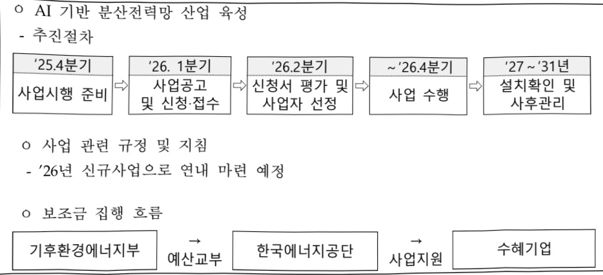

# AI기반 분산전력망 산업육성

**해당 페이지**: PDF 2568 ~ 2575 쪽 해당

**부처**: 기후에너지환경부
**분야**: 산업·중소기업 및 에너지
**회계유형**: 기금
**2026 확정예산**: 217116.0 백만원
**전년대비 증감률**: None%
**AI 도메인**: 디지털전환(AX)

---

<table border=1 style='margin: auto; word-wrap: break-word;'><tr><td style='text-align: center; word-wrap: break-word;'>사 업 명</td></tr><tr><td style='text-align: center; word-wrap: break-word;'>가. (23) AI 기반 분산전력망 산업 육성(5203-333)</td></tr></table>

□ 사업 코드 정보

<table border=1 style='margin: auto; word-wrap: break-word;'><tr><td style='text-align: center; word-wrap: break-word;'>구분</td><td style='text-align: center; word-wrap: break-word;'>기금</td><td style='text-align: center; word-wrap: break-word;'>소관</td><td style='text-align: center; word-wrap: break-word;'>실국(기관)</td><td style='text-align: center; word-wrap: break-word;'>계정</td><td style='text-align: center; word-wrap: break-word;'>분야</td><td style='text-align: center; word-wrap: break-word;'>부문</td></tr><tr><td style='text-align: center; word-wrap: break-word;'>코드</td><td style='text-align: center; word-wrap: break-word;'>전력산업</td><td style='text-align: center; word-wrap: break-word;'>기후에너지</td><td style='text-align: center; word-wrap: break-word;'>에너지전환</td><td rowspan="2">산업·중소기업 및 에너지</td><td rowspan="2">110</td><td style='text-align: center; word-wrap: break-word;'>115</td></tr><tr><td style='text-align: center; word-wrap: break-word;'>명칭</td><td style='text-align: center; word-wrap: break-word;'>기반기금</td><td style='text-align: center; word-wrap: break-word;'>환경부</td><td style='text-align: center; word-wrap: break-word;'>정책실</td><td style='text-align: center; word-wrap: break-word;'>에너지 및 자원개발</td></tr></table>

<table border=1 style='margin: auto; word-wrap: break-word;'><tr><td style='text-align: center; word-wrap: break-word;'>구분</td><td style='text-align: center; word-wrap: break-word;'>프로그램</td><td style='text-align: center; word-wrap: break-word;'>단위사업</td><td style='text-align: center; word-wrap: break-word;'>세부사업</td></tr><tr><td style='text-align: center; word-wrap: break-word;'>코드</td><td style='text-align: center; word-wrap: break-word;'>5200</td><td style='text-align: center; word-wrap: break-word;'>5203</td><td style='text-align: center; word-wrap: break-word;'>333</td></tr><tr><td style='text-align: center; word-wrap: break-word;'>명칭</td><td style='text-align: center; word-wrap: break-word;'>재생에너지 및 에너지신산업활성화</td><td style='text-align: center; word-wrap: break-word;'>에너지신산업</td><td style='text-align: center; word-wrap: break-word;'>AI 기반 분산전력망 산업 육성</td></tr></table>

사업 성격 (공통요구자료 Ⅱ-1 작성유의사항 4. 참조, 해당하는 사항에 “0” 표시)

<table border=1 style='margin: auto; word-wrap: break-word;'><tr><td rowspan="2">신규</td><td rowspan="2">계속</td><td rowspan="2">완료</td><td rowspan="2">예비타당성 실시여부</td><td rowspan="2">총사업비 관리대상</td><td rowspan="2">총액계상 예산사업</td><td style='text-align: center; word-wrap: break-word;'>사업소관 변경정보</td></tr><tr><td style='text-align: center; word-wrap: break-word;'>2025예산 시 소관</td></tr><tr><td style='text-align: center; word-wrap: break-word;'>O</td><td style='text-align: center; word-wrap: break-word;'></td><td style='text-align: center; word-wrap: break-word;'></td><td style='text-align: center; word-wrap: break-word;'></td><td style='text-align: center; word-wrap: break-word;'></td><td style='text-align: center; word-wrap: break-word;'></td><td style='text-align: center; word-wrap: break-word;'></td></tr></table>

□ 사업 지원 형태 및 지원을 (최소한 한 개는 반드시 선택하시오. 해당사항에 O 표시)

<table border=1 style='margin: auto; word-wrap: break-word;'><tr><td style='text-align: center; word-wrap: break-word;'>직접</td><td style='text-align: center; word-wrap: break-word;'>출자</td><td style='text-align: center; word-wrap: break-word;'>출연</td><td style='text-align: center; word-wrap: break-word;'>보조</td><td style='text-align: center; word-wrap: break-word;'>융자</td><td style='text-align: center; word-wrap: break-word;'>국고보조율(%)</td><td style='text-align: center; word-wrap: break-word;'>융자율(%)</td></tr><tr><td style='text-align: center; word-wrap: break-word;'></td><td style='text-align: center; word-wrap: break-word;'></td><td style='text-align: center; word-wrap: break-word;'></td><td style='text-align: center; word-wrap: break-word;'>0</td><td style='text-align: center; word-wrap: break-word;'></td><td style='text-align: center; word-wrap: break-word;'>50%~80%</td><td style='text-align: center; word-wrap: break-word;'></td></tr></table>

## □ 사업 담당자

<table border=1 style='margin: auto; word-wrap: break-word;'><tr><td style='text-align: center; word-wrap: break-word;'>사업명</td><td colspan="2">구분</td></tr><tr><td rowspan="3">AI 활용 ESS 구축 지원, 공유형 ESS</td><td rowspan="2">소관부처</td><td style='text-align: center; word-wrap: break-word;'>에너지전환정책실 전력망전책관</td></tr><tr><td style='text-align: center; word-wrap: break-word;'>분산에너지과</td></tr><tr><td style='text-align: center; word-wrap: break-word;'>사업시행주체</td><td style='text-align: center; word-wrap: break-word;'>한국에너지공단</td></tr><tr><td rowspan="3">커뮤니티슬라</td><td rowspan="2">소관부처</td><td style='text-align: center; word-wrap: break-word;'>에너지전환정책실 재생에너지정책관</td></tr><tr><td style='text-align: center; word-wrap: break-word;'>태양광산업과</td></tr><tr><td style='text-align: center; word-wrap: break-word;'>사업시행주체</td><td style='text-align: center; word-wrap: break-word;'>한국에너지공단</td></tr></table>

---

### 가.지출계획 총괄표

(단위: 백만원, %)

<table border=1 style='margin: auto; word-wrap: break-word;'><tr><td rowspan="2">목명</td><td rowspan="2">2024년 결산</td><td colspan="2">2025년 계획</td><td colspan="2">2026년</td><td rowspan="2">중감 (B-A)</td><td rowspan="2">(B-A)/A</td></tr><tr><td style='text-align: center; word-wrap: break-word;'>본예산(A)</td><td style='text-align: center; word-wrap: break-word;'>추경</td><td style='text-align: center; word-wrap: break-word;'>정부안</td><td style='text-align: center; word-wrap: break-word;'>확정(B)</td></tr><tr><td style='text-align: center; word-wrap: break-word;'>AI 기반 분산전력망산업 육성</td><td style='text-align: center; word-wrap: break-word;'>-</td><td style='text-align: center; word-wrap: break-word;'>-</td><td style='text-align: center; word-wrap: break-word;'>-</td><td style='text-align: center; word-wrap: break-word;'>217,116</td><td style='text-align: center; word-wrap: break-word;'>217,116</td><td style='text-align: center; word-wrap: break-word;'>217,116</td><td style='text-align: center; word-wrap: break-word;'>순증</td></tr></table>

<이관 내역>

(단위:백만원)

<table border=1 style='margin: auto; word-wrap: break-word;'><tr><td style='text-align: center; word-wrap: break-word;'>정부조직 개편으로 산업통상부 소관 세부인 AI 기반 분산전력망 산업 육성’ 사업 (2026년 신규)이 기후에너지환경부 소관 세부사업인 AI 기반 분산전력망 산업 육성’ 사업으로 이관(전력산업기반기금 → 전력산업기반기금)</td></tr></table>

## □ 기능별(내역사업별), 목별 계획 내역

(단위:백만원)

<table border=1 style='margin: auto; word-wrap: break-word;'><tr><td rowspan="3"></td><td colspan="5">2024</td><td colspan="8">2025</td><td rowspan="3">2026예산</td></tr><tr><td rowspan="2">계획액(수정)</td><td rowspan="2">계획현액</td><td rowspan="2">집행액[실집행액]</td><td rowspan="2">이월액</td><td rowspan="2">불용액</td><td colspan="2">본예산</td><td rowspan="2">예산현액</td><td rowspan="2">집행액[실집행액]</td><td colspan="2">전년도이월액제외</td><td rowspan="2">이월예상액</td><td rowspan="2">불용예상액</td></tr><tr><td style='text-align: center; word-wrap: break-word;'>예산현액</td><td style='text-align: center; word-wrap: break-word;'>집행액[실집행액]</td><td style='text-align: center; word-wrap: break-word;'>계획현액</td><td style='text-align: center; word-wrap: break-word;'>집행액[실집행액]</td></tr><tr><td style='text-align: center; word-wrap: break-word;'>○ 기능별 분류(합계)</td><td style='text-align: center; word-wrap: break-word;'>-</td><td style='text-align: center; word-wrap: break-word;'>-</td><td style='text-align: center; word-wrap: break-word;'>-</td><td style='text-align: center; word-wrap: break-word;'>-</td><td style='text-align: center; word-wrap: break-word;'>-</td><td style='text-align: center; word-wrap: break-word;'>-</td><td style='text-align: center; word-wrap: break-word;'>-</td><td style='text-align: center; word-wrap: break-word;'>-</td><td style='text-align: center; word-wrap: break-word;'>-</td><td style='text-align: center; word-wrap: break-word;'>-</td><td style='text-align: center; word-wrap: break-word;'>-</td><td style='text-align: center; word-wrap: break-word;'>-</td><td style='text-align: center; word-wrap: break-word;'>-</td><td style='text-align: center; word-wrap: break-word;'>217,116</td></tr><tr><td style='text-align: center; word-wrap: break-word;'>· AI 활용  ESS 구축지원</td><td style='text-align: center; word-wrap: break-word;'>-</td><td style='text-align: center; word-wrap: break-word;'>-</td><td style='text-align: center; word-wrap: break-word;'>-</td><td style='text-align: center; word-wrap: break-word;'>-</td><td style='text-align: center; word-wrap: break-word;'>-</td><td style='text-align: center; word-wrap: break-word;'>-</td><td style='text-align: center; word-wrap: break-word;'>-</td><td style='text-align: center; word-wrap: break-word;'>-</td><td style='text-align: center; word-wrap: break-word;'>-</td><td style='text-align: center; word-wrap: break-word;'>-</td><td style='text-align: center; word-wrap: break-word;'>-</td><td style='text-align: center; word-wrap: break-word;'>-</td><td style='text-align: center; word-wrap: break-word;'>-</td><td style='text-align: center; word-wrap: break-word;'>117,600</td></tr><tr><td style='text-align: center; word-wrap: break-word;'>· 공유형  ESS</td><td style='text-align: center; word-wrap: break-word;'>-</td><td style='text-align: center; word-wrap: break-word;'>-</td><td style='text-align: center; word-wrap: break-word;'>-</td><td style='text-align: center; word-wrap: break-word;'>-</td><td style='text-align: center; word-wrap: break-word;'>-</td><td style='text-align: center; word-wrap: break-word;'>-</td><td style='text-align: center; word-wrap: break-word;'>-</td><td style='text-align: center; word-wrap: break-word;'>-</td><td style='text-align: center; word-wrap: break-word;'>-</td><td style='text-align: center; word-wrap: break-word;'>-</td><td style='text-align: center; word-wrap: break-word;'>-</td><td style='text-align: center; word-wrap: break-word;'>-</td><td style='text-align: center; word-wrap: break-word;'>-</td><td style='text-align: center; word-wrap: break-word;'>1,120</td></tr><tr><td style='text-align: center; word-wrap: break-word;'>· 커뮤니티슬라</td><td style='text-align: center; word-wrap: break-word;'>-</td><td style='text-align: center; word-wrap: break-word;'>-</td><td style='text-align: center; word-wrap: break-word;'>-</td><td style='text-align: center; word-wrap: break-word;'>-</td><td style='text-align: center; word-wrap: break-word;'>-</td><td style='text-align: center; word-wrap: break-word;'>-</td><td style='text-align: center; word-wrap: break-word;'>-</td><td style='text-align: center; word-wrap: break-word;'>-</td><td style='text-align: center; word-wrap: break-word;'>-</td><td style='text-align: center; word-wrap: break-word;'>-</td><td style='text-align: center; word-wrap: break-word;'>-</td><td style='text-align: center; word-wrap: break-word;'>-</td><td style='text-align: center; word-wrap: break-word;'>-</td><td style='text-align: center; word-wrap: break-word;'>98,396</td></tr><tr><td style='text-align: center; word-wrap: break-word;'>○ 비목별 분류(합계)</td><td style='text-align: center; word-wrap: break-word;'>-</td><td style='text-align: center; word-wrap: break-word;'>-</td><td style='text-align: center; word-wrap: break-word;'>-</td><td style='text-align: center; word-wrap: break-word;'>-</td><td style='text-align: center; word-wrap: break-word;'>-</td><td style='text-align: center; word-wrap: break-word;'>-</td><td style='text-align: center; word-wrap: break-word;'>-</td><td style='text-align: center; word-wrap: break-word;'>-</td><td style='text-align: center; word-wrap: break-word;'>-</td><td style='text-align: center; word-wrap: break-word;'>-</td><td style='text-align: center; word-wrap: break-word;'>-</td><td style='text-align: center; word-wrap: break-word;'>-</td><td style='text-align: center; word-wrap: break-word;'>-</td><td style='text-align: center; word-wrap: break-word;'>217,116</td></tr><tr><td style='text-align: center; word-wrap: break-word;'>· 민간경상보조(320-01)</td><td style='text-align: center; word-wrap: break-word;'>-</td><td style='text-align: center; word-wrap: break-word;'>-</td><td style='text-align: center; word-wrap: break-word;'>-</td><td style='text-align: center; word-wrap: break-word;'>-</td><td style='text-align: center; word-wrap: break-word;'>-</td><td style='text-align: center; word-wrap: break-word;'>-</td><td style='text-align: center; word-wrap: break-word;'>-</td><td style='text-align: center; word-wrap: break-word;'>-</td><td style='text-align: center; word-wrap: break-word;'>-</td><td style='text-align: center; word-wrap: break-word;'>-</td><td style='text-align: center; word-wrap: break-word;'>-</td><td style='text-align: center; word-wrap: break-word;'>-</td><td style='text-align: center; word-wrap: break-word;'>-</td><td style='text-align: center; word-wrap: break-word;'>217,116</td></tr><tr><td style='text-align: center; word-wrap: break-word;'>○ 기능비목별 분류(합계)</td><td style='text-align: center; word-wrap: break-word;'>-</td><td style='text-align: center; word-wrap: break-word;'>-</td><td style='text-align: center; word-wrap: break-word;'>-</td><td style='text-align: center; word-wrap: break-word;'>-</td><td style='text-align: center; word-wrap: break-word;'>-</td><td style='text-align: center; word-wrap: break-word;'>-</td><td style='text-align: center; word-wrap: break-word;'>-</td><td style='text-align: center; word-wrap: break-word;'>-</td><td style='text-align: center; word-wrap: break-word;'>-</td><td style='text-align: center; word-wrap: break-word;'>-</td><td style='text-align: center; word-wrap: break-word;'>-</td><td style='text-align: center; word-wrap: break-word;'>-</td><td style='text-align: center; word-wrap: break-word;'>-</td><td style='text-align: center; word-wrap: break-word;'>217,116</td></tr><tr><td style='text-align: center; word-wrap: break-word;'>· AI 활용  ESS 구축지원</td><td style='text-align: center; word-wrap: break-word;'>-</td><td style='text-align: center; word-wrap: break-word;'>-</td><td style='text-align: center; word-wrap: break-word;'>-</td><td style='text-align: center; word-wrap: break-word;'>-</td><td style='text-align: center; word-wrap: break-word;'>-</td><td style='text-align: center; word-wrap: break-word;'>-</td><td style='text-align: center; word-wrap: break-word;'>-</td><td style='text-align: center; word-wrap: break-word;'>-</td><td style='text-align: center; word-wrap: break-word;'>-</td><td style='text-align: center; word-wrap: break-word;'>-</td><td style='text-align: center; word-wrap: break-word;'>-</td><td style='text-align: center; word-wrap: break-word;'>-</td><td style='text-align: center; word-wrap: break-word;'>-</td><td style='text-align: center; word-wrap: break-word;'>117,600</td></tr><tr><td style='text-align: center; word-wrap: break-word;'>· 민간경상보조(320-01)</td><td style='text-align: center; word-wrap: break-word;'>-</td><td style='text-align: center; word-wrap: break-word;'>-</td><td style='text-align: center; word-wrap: break-word;'>-</td><td style='text-align: center; word-wrap: break-word;'>-</td><td style='text-align: center; word-wrap: break-word;'>-</td><td style='text-align: center; word-wrap: break-word;'>-</td><td style='text-align: center; word-wrap: break-word;'>-</td><td style='text-align: center; word-wrap: break-word;'>-</td><td style='text-align: center; word-wrap: break-word;'>-</td><td style='text-align: center; word-wrap: break-word;'>-</td><td style='text-align: center; word-wrap: break-word;'>-</td><td style='text-align: center; word-wrap: break-word;'>-</td><td style='text-align: center; word-wrap: break-word;'>-</td><td style='text-align: center; word-wrap: break-word;'>117,600</td></tr><tr><td style='text-align: center; word-wrap: break-word;'>· 공유형  ESS</td><td style='text-align: center; word-wrap: break-word;'>-</td><td style='text-align: center; word-wrap: break-word;'>-</td><td style='text-align: center; word-wrap: break-word;'>-</td><td style='text-align: center; word-wrap: break-word;'>-</td><td style='text-align: center; word-wrap: break-word;'>-</td><td style='text-align: center; word-wrap: break-word;'>-</td><td style='text-align: center; word-wrap: break-word;'>-</td><td style='text-align: center; word-wrap: break-word;'>-</td><td style='text-align: center; word-wrap: break-word;'>-</td><td style='text-align: center; word-wrap: break-word;'>-</td><td style='text-align: center; word-wrap: break-word;'>-</td><td style='text-align: center; word-wrap: break-word;'>-</td><td style='text-align: center; word-wrap: break-word;'>-</td><td style='text-align: center; word-wrap: break-word;'>1,120</td></tr><tr><td style='text-align: center; word-wrap: break-word;'>· 민간경상보조(320-01)</td><td style='text-align: center; word-wrap: break-word;'>-</td><td style='text-align: center; word-wrap: break-word;'>-</td><td style='text-align: center; word-wrap: break-word;'>-</td><td style='text-align: center; word-wrap: break-word;'>-</td><td style='text-align: center; word-wrap: break-word;'>-</td><td style='text-align: center; word-wrap: break-word;'>-</td><td style='text-align: center; word-wrap: break-word;'>-</td><td style='text-align: center; word-wrap: break-word;'>-</td><td style='text-align: center; word-wrap: break-word;'>-</td><td style='text-align: center; word-wrap: break-word;'>-</td><td style='text-align: center; word-wrap: break-word;'>-</td><td style='text-align: center; word-wrap: break-word;'>-</td><td style='text-align: center; word-wrap: break-word;'>-</td><td style='text-align: center; word-wrap: break-word;'>1,120</td></tr><tr><td style='text-align: center; word-wrap: break-word;'>· 커뮤니티슬라</td><td style='text-align: center; word-wrap: break-word;'>-</td><td style='text-align: center; word-wrap: break-word;'>-</td><td style='text-align: center; word-wrap: break-word;'>-</td><td style='text-align: center; word-wrap: break-word;'>-</td><td style='text-align: center; word-wrap: break-word;'>-</td><td style='text-align: center; word-wrap: break-word;'>-</td><td style='text-align: center; word-wrap: break-word;'>-</td><td style='text-align: center; word-wrap: break-word;'>-</td><td style='text-align: center; word-wrap: break-word;'>-</td><td style='text-align: center; word-wrap: break-word;'>-</td><td style='text-align: center; word-wrap: break-word;'>-</td><td style='text-align: center; word-wrap: break-word;'>-</td><td style='text-align: center; word-wrap: break-word;'>-</td><td style='text-align: center; word-wrap: break-word;'>98,396</td></tr><tr><td style='text-align: center; word-wrap: break-word;'>· 민간경상보조(320-01)</td><td style='text-align: center; word-wrap: break-word;'>-</td><td style='text-align: center; word-wrap: break-word;'>-</td><td style='text-align: center; word-wrap: break-word;'>-</td><td style='text-align: center; word-wrap: break-word;'>-</td><td style='text-align: center; word-wrap: break-word;'>-</td><td style='text-align: center; word-wrap: break-word;'>-</td><td style='text-align: center; word-wrap: break-word;'>-</td><td style='text-align: center; word-wrap: break-word;'>-</td><td style='text-align: center; word-wrap: break-word;'>-</td><td style='text-align: center; word-wrap: break-word;'>-</td><td style='text-align: center; word-wrap: break-word;'>-</td><td style='text-align: center; word-wrap: break-word;'>-</td><td style='text-align: center; word-wrap: break-word;'>-</td><td style='text-align: center; word-wrap: break-word;'>98,396</td></tr></table>

---

### 나. 사업설명자료

## 1 ) 사업목적·내용

- (AI 기반 분산전력망 산업 육성)

(목적) 지역 단위의 좀춤한 소규모 전력망(한국형 차세대 전력망)을 배전망에 구축하여 재생에너지에 적합한 전력시스템 구성 및 지역별 전력수급의 균형 도모

(내용) VPP사업 활성화, 재생에너지 출력제어 및 접속지연 완화, 주민참여형 이익 공유 시스템 마련을 위한 에너지저장장치 설치 지원

- (AI 활용 ESS 구축지원 사업) 재생에너지 출력제어 및 접속지연 완화를 위해 VPP 사업자를 대상으로 ESS 설치를 지원

- (공유형 ESS) 지역 경제 활성화 및 주민-기업 이익 공유를 위해 주민협의체를 대상으로 ESS 설비 구축을 지원

- (커뮤니티솔라) 주민이의 공유모델의 확산을 위해 계통이 부족한 지역의 햇빛소득

마을을 대상으로 ESS 설비 구축을 지원

ESS 수요가 있는 햇빛소득마을에 ESS 설비를 구축 및 운영할 수 있는 민간사업자를 선정하고 구축 비용을 지원

## 2 ) 사업개요

## □ 사업근거 및 추진경위

① 법령상 근거 및 조항 적시

- 분산에너지 활성화 특별법 제47조(보조·융자)

제47조(보조·융자) ① 정부는 분산에너지 개발 및 보급 촉진을 위하여 필요한 경우에는 대통령령으로 정하는 바에 따라 분산에너지사업자에 대하여 다음 각 호의 어느 하나에 해당하는 비용을 보조 또는 융자할 수 있다.

1. 분산에너지사업의 안정성·효율성·친환경성을 혁신하기 위한 기술 개발 및 전문 인력 양성에 드는 비용

2. 분산에너지사업 관련 외국과의 협력 및 기술교류에 드는 비용

3. 그 밖에 분산에너지 개발 및 보급 촉진을 위하여 필요한 비용으로서 대통령령으로 정하는 비용

- 분산에너지 활성화 특별법 시행령 제45조(보조·융자)

제45조(비용의 보조 또는 융자) ② 법 제47조제1항제3호에서 "대통령령으로 정하는 비용"

이란 다음 각 호의 비용을 말한다.

1. 분산에너지 기술의 사업화에 필요한 비용

2. 분산에너지 사업 초기 투자비용

3. 그 밖에 기후에너지환경부장관이 분산에너지 활성화 지원에 필요하다고 인정하는 비용

---

- 분산에너지 활성화 특별법 제48조(분산에너지사업 등에 대한 기금의 투자)

제48조(분산에너지사업 등에 대한 기금의 투자) 다음 각 호의 어느 하나에 해당하는 기금을 관리하는 자는 해당 기금운용계획에 따라 분산에너지사업에 투자하거나 출자할 수 있다.
1. 「국가재정법」 별표2에 규정된 법률에 따라 설치된 기금으로서 대통령령으로 정하는 기금
2. 그 밖에 설치목적이 제1호의 기금에 준하는 기금으로서 대통령령으로 정하는 기금

- 분산에너지 활성화 특별법 시행령 제46조(분산에너지사업에 투자할 수 있는 기금)

제46조(분산에너지사업에 투자할 수 있는 기금) 법 제48조제1호에 따른 "대통령령으로 정하는 기금"이랑 다음 각 호의 기금을 말한다.
1.「전기사업법」제48조에 따라 설치된 전력산업기반기금
2.「기후위기 대응을 위한 탄소중립·녹색성장 기본법」제69조에 따라 설치된 기후대응기금

## ② 추진경위

· 제10차 전력수급기본계획('23.1) : 재생에너지 확대에 대응하여 ESS 확보 필요

·분산에너지 활성화 특별법 제정('23.6) : 분산에너지 활성화 기반 조성으로 에너지 공급 안정성 증대 및 국민경제 발전에 이바지

·에너지 스토리지 발전 전략('23.10) : ESS에 대한 민간 투자 촉진, 계통 안정성을 보장하기 위한 에너지저장장치 필요량 선제적 확보

· 제11차 전력수급기본계획('25.3) : 통합발전소(VPP) 활성화 및 분산에너지 활용 신사업자 육성

· 차세대 전력망 구축 발표 (25.7) : AI기반 분산에너지 확산 및 전력망 안정성 제고

## □ 주요내용

① 사업규모

- 총사업비 : 해당없음

- 사업기간 : '26~'30

- 최근 5년 간 투입된 사업비(예산액기준, 추경편성한 연도에는 추경포함)

<table border=1 style='margin: auto; word-wrap: break-word;'><tr><td style='text-align: center; word-wrap: break-word;'>$ \underline{\text{연도}} $</td><td style='text-align: center; word-wrap: break-word;'>2022</td><td style='text-align: center; word-wrap: break-word;'>2023</td><td style='text-align: center; word-wrap: break-word;'>2024</td><td style='text-align: center; word-wrap: break-word;'>2025</td><td style='text-align: center; word-wrap: break-word;'>2026</td></tr><tr><td style='text-align: center; word-wrap: break-word;'>$ \underline{\text{사업비(매만원)}} $</td><td style='text-align: center; word-wrap: break-word;'>-</td><td style='text-align: center; word-wrap: break-word;'>-</td><td style='text-align: center; word-wrap: break-word;'>-</td><td style='text-align: center; word-wrap: break-word;'>-</td><td style='text-align: center; word-wrap: break-word;'>217,116</td></tr></table>

- 기타: 해당없음

---

## ② 사업추진체계

- 사업시행방법 : 보조

- 사업시행주체 : 한국에너지공단

- 사업 수혜자 : VPP사업자, ESS사업자, 태양광사업자, 주민협동조합 등

- 보조, 융자, 출연, 출자 등의 경우 보조·융자 등 지원 비율 및 법적근거

<table border=1 style='margin: auto; word-wrap: break-word;'><tr><td style='text-align: center; word-wrap: break-word;'>내역사업명</td><td style='text-align: center; word-wrap: break-word;'>구분</td><td style='text-align: center; word-wrap: break-word;'>피보조·피출연 등 기관명</td><td style='text-align: center; word-wrap: break-word;'>지원 금액 (2026계획)</td><td style='text-align: center; word-wrap: break-word;'>지원 비율(%)</td><td style='text-align: center; word-wrap: break-word;'>보조율 법적근거 (해당 조항)</td></tr><tr><td style='text-align: center; word-wrap: break-word;'>AI 활용 ESS 구축지원 사업</td><td style='text-align: center; word-wrap: break-word;'>보조</td><td style='text-align: center; word-wrap: break-word;'>한국에너 지공단</td><td style='text-align: center; word-wrap: break-word;'>117,600 백만원</td><td style='text-align: center; word-wrap: break-word;'>50</td><td style='text-align: center; word-wrap: break-word;'>분산에너지 활성화 특별법 제47조(보조·융자)</td></tr><tr><td style='text-align: center; word-wrap: break-word;'>공유형 ESS</td><td style='text-align: center; word-wrap: break-word;'>보조</td><td style='text-align: center; word-wrap: break-word;'>한국에너 지공단</td><td style='text-align: center; word-wrap: break-word;'>1,120 백만원</td><td style='text-align: center; word-wrap: break-word;'>50</td><td style='text-align: center; word-wrap: break-word;'>분산에너지 활성화 특별법 제47조(보조·융자)</td></tr><tr><td style='text-align: center; word-wrap: break-word;'>커뮤니티슬라</td><td style='text-align: center; word-wrap: break-word;'>보조</td><td style='text-align: center; word-wrap: break-word;'>한국에너 지공단</td><td style='text-align: center; word-wrap: break-word;'>98,396 백만원</td><td style='text-align: center; word-wrap: break-word;'>50</td><td style='text-align: center; word-wrap: break-word;'>분산에너지 활성화 특별법 제47조(보조·융자)</td></tr></table>

## 3 ) 2026년도 계획 산출 근거

□ AI 기반 분산전력망 산업 육성

:(2026 예산) 119,616백만원

- (요구) VPP사업 활성화, 재생에너지 출력제어 및 접속지연 완화, 주민참여형 이익공유 시스템 마련을 위한 에너지저장장치 설치 신규 예산 요구

- (산출) AI 활용 ESS 구축지원 사업 117,600백만원

공유형 ESS 1,120백만원

커뮤니티솔라 98,396백만원

o 2025년도 예산 및 2026년도 예산 산출 세부내역 비교

<table border=1 style='margin: auto; word-wrap: break-word;'><tr><td colspan="3">2025년 본예산</td><td colspan="2">2026년 예산</td></tr><tr><td style='text-align: center; word-wrap: break-word;'>사업</td><td style='text-align: center; word-wrap: break-word;'>예산</td><td style='text-align: center; word-wrap: break-word;'>산출내역</td><td style='text-align: center; word-wrap: break-word;'>예산</td><td style='text-align: center; word-wrap: break-word;'>산출내역</td></tr><tr><td style='text-align: center; word-wrap: break-word;'>AI 활용
ESS
구축지원
사업</td><td style='text-align: center; word-wrap: break-word;'>-</td><td style='text-align: center; word-wrap: break-word;'>-</td><td style='text-align: center; word-wrap: break-word;'>117,600</td><td style='text-align: center; word-wrap: break-word;'>☐ 민간경상보조(320-01): 117,600백만원
☐ ESS 설치지원: 117,100백만원
☐ 400MWh × 292.75백만원(보조율 50%) = 117,100백만원
☐ 사업운영비: 500백만원
☐ 1개 × 500백만원 = 500백만원</td></tr><tr><td style='text-align: center; word-wrap: break-word;'>공유형 ESS</td><td style='text-align: center; word-wrap: break-word;'>-</td><td style='text-align: center; word-wrap: break-word;'>-</td><td style='text-align: center; word-wrap: break-word;'>1,120</td><td style='text-align: center; word-wrap: break-word;'>☐ 민간경상보조(320-01): 1,120백만원
☐ ESS 설치지원: 1,120백만원
☐ 1개 × 1,120백만원(보조율 50%) = 1,120백만원</td></tr><tr><td style='text-align: center; word-wrap: break-word;'>커뮤니티
슬라</td><td style='text-align: center; word-wrap: break-word;'>-</td><td style='text-align: center; word-wrap: break-word;'>-</td><td style='text-align: center; word-wrap: break-word;'>98,396</td><td style='text-align: center; word-wrap: break-word;'>☐ 민간경상보조(320-01): 98,396백만원
☐ ESS 251개소 설치 지원: 98,100백만원
☐ 1MW 51개소, 0.75MW 50개소, 0.5MW 150개소 구축
☐ 사업운영비: 296백만원
☐ 1개 × 296백만원 = 296백만원</td></tr></table>

---

## 4 ) 사업효과

☐ 사업영향, 산출물 성과지표 등

① 2022~2026년도 성과계획서 상 성과지표 및 최근 5년간 성과 달성도

<AI 활용 ESS 구축지원 사업>

<table border=1 style='margin: auto; word-wrap: break-word;'><tr><td style='text-align: center; word-wrap: break-word;'>성과지표</td><td style='text-align: center; word-wrap: break-word;'>구분</td><td style='text-align: center; word-wrap: break-word;'>2022</td><td style='text-align: center; word-wrap: break-word;'>2023</td><td style='text-align: center; word-wrap: break-word;'>2024</td><td style='text-align: center; word-wrap: break-word;'>2025</td><td style='text-align: center; word-wrap: break-word;'>2026</td><td style='text-align: center; word-wrap: break-word;'>2026 목표치산출근거</td><td style='text-align: center; word-wrap: break-word;'>측정산식(또는 측정방법)</td><td style='text-align: center; word-wrap: break-word;'>자료수집방법(또는 자료출처)</td></tr><tr><td rowspan="2">지표명:재생에너지절속지연완화(단위: MW)</td><td rowspan="2">목표실적달성도</td><td style='text-align: center; word-wrap: break-word;'>-</td><td style='text-align: center; word-wrap: break-word;'>-</td><td style='text-align: center; word-wrap: break-word;'>-</td><td style='text-align: center; word-wrap: break-word;'>-</td><td style='text-align: center; word-wrap: break-word;'>80</td><td rowspan="2">ESS 단위 설비(4MW/20MWh) 및 지원 개소(207)PCS용량</td><td rowspan="2">설치된 ESS의PCS용량 합산결과보고</td><td rowspan="2">전수조사 /사업 계획 및</td></tr><tr><td style='text-align: center; word-wrap: break-word;'>-</td><td style='text-align: center; word-wrap: break-word;'>-</td><td style='text-align: center; word-wrap: break-word;'>-</td><td style='text-align: center; word-wrap: break-word;'>-</td><td style='text-align: center; word-wrap: break-word;'>-</td></tr></table>

<공유형 ESS>

<table border=1 style='margin: auto; word-wrap: break-word;'><tr><td style='text-align: center; word-wrap: break-word;'>성과지표</td><td style='text-align: center; word-wrap: break-word;'>구분</td><td style='text-align: center; word-wrap: break-word;'>2022</td><td style='text-align: center; word-wrap: break-word;'>2023</td><td style='text-align: center; word-wrap: break-word;'>2024</td><td style='text-align: center; word-wrap: break-word;'>2025</td><td style='text-align: center; word-wrap: break-word;'>2026</td><td style='text-align: center; word-wrap: break-word;'>2026 목표치산출근거</td><td style='text-align: center; word-wrap: break-word;'>측정산시(또는 측정방법)</td><td style='text-align: center; word-wrap: break-word;'>자료수집방법(또는 자료출처)</td></tr><tr><td style='text-align: center; word-wrap: break-word;'>지표명:ESS 활용률(단위: MWh)</td><td style='text-align: center; word-wrap: break-word;'>목표실적달성도</td><td style='text-align: center; word-wrap: break-word;'>-</td><td style='text-align: center; word-wrap: break-word;'>-</td><td style='text-align: center; word-wrap: break-word;'>-</td><td style='text-align: center; word-wrap: break-word;'>-</td><td style='text-align: center; word-wrap: break-word;'>950.4</td><td style='text-align: center; word-wrap: break-word;'>ESS 4MWh × 가동일 264 × 효율 90%</td><td style='text-align: center; word-wrap: break-word;'>ESS의 전력방전량 데이터</td><td style='text-align: center; word-wrap: break-word;'>전수조사 / 사업 계획 및 결과보고</td></tr></table>

<커뮤니티솔라>

<table border=1 style='margin: auto; word-wrap: break-word;'><tr><td style='text-align: center; word-wrap: break-word;'>성과지표</td><td style='text-align: center; word-wrap: break-word;'>구분</td><td style='text-align: center; word-wrap: break-word;'>2022</td><td style='text-align: center; word-wrap: break-word;'>2023</td><td style='text-align: center; word-wrap: break-word;'>2024</td><td style='text-align: center; word-wrap: break-word;'>2025</td><td style='text-align: center; word-wrap: break-word;'>2026</td><td style='text-align: center; word-wrap: break-word;'>2026 목표치산출근거</td><td style='text-align: center; word-wrap: break-word;'>측정산식(또는 측정방법)</td><td style='text-align: center; word-wrap: break-word;'>자료수집방법(또는 자료출처)</td></tr><tr><td rowspan="3">지표명: 햇빛소득마을발전소 운영(단위: MWh)</td><td style='text-align: center; word-wrap: break-word;'>목표</td><td rowspan="3">-</td><td rowspan="3">-</td><td rowspan="3">-</td><td rowspan="3">-</td><td rowspan="3">490</td><td rowspan="3">설치된 ESS 총량(설치 MWh * 마을수)</td><td rowspan="3">출력제어 발생中 태양광 전력의 ESS 총전량 데이터</td><td rowspan="3">전수조사 / 사업 계획 및 결과보고</td></tr><tr><td style='text-align: center; word-wrap: break-word;'>실적</td></tr><tr><td style='text-align: center; word-wrap: break-word;'>달성도</td></tr></table>

② 성과지표 이외의 연도별 사업추진 경과 및 실적 : 해당없음

③향후(2026년도 이후)기대효과

- AI 활용 ESS 구축지원 사업을 통해 총 340MW의 태양광 접속지연 해소

<table border=1 style='margin: auto; word-wrap: break-word;'><tr><td style='text-align: center; word-wrap: break-word;'>구분</td><td style='text-align: center; word-wrap: break-word;'>&#x27;26</td><td style='text-align: center; word-wrap: break-word;'>&#x27;27</td><td style='text-align: center; word-wrap: break-word;'>&#x27;28</td><td style='text-align: center; word-wrap: break-word;'>&#x27;29</td><td style='text-align: center; word-wrap: break-word;'>&#x27;30</td></tr><tr><td style='text-align: center; word-wrap: break-word;'>AI 활용 ESS 구축지원에 의한 태양광 접속지연 해소</td><td style='text-align: center; word-wrap: break-word;'>80</td><td style='text-align: center; word-wrap: break-word;'>80</td><td style='text-align: center; word-wrap: break-word;'>80</td><td style='text-align: center; word-wrap: break-word;'>60</td><td style='text-align: center; word-wrap: break-word;'>40</td></tr></table>

- 공유형 ESS 사업을 통해 ESS 활용 신사업 창출 기대 및 커뮤니티솔라로 연간 98MWh의 태양광 출력제어 완화 기대

---

## 5 ) 타당성조사 및 예비타당성조사 시행여부 및 결과 요지

□ 예비타당성 조사 면제 필요성

AI 기반 분산 전력망은 송전 비용 절감, 재생 e확대, 에너지신산업 수출산업화 등의 효과가 있는 바, 에타면제를 통한 신속 추진 필요

※ 기재부 협의 완료 (7.28), 대통령실 협의 완료 (7.31)

6) 총사업비 대상사업 여부 및 내역 : 해당없음

## 7 ) 사업 집행절차

8) 중기재정계획 상 연도별 투자계획 및 추진경과

(단위:백만원)

<table border=1 style='margin: auto; word-wrap: break-word;'><tr><td style='text-align: center; word-wrap: break-word;'>$ 중기 $ 재정계획</td><td style='text-align: center; word-wrap: break-word;'>2024</td><td style='text-align: center; word-wrap: break-word;'>2025</td><td style='text-align: center; word-wrap: break-word;'>2026</td><td style='text-align: center; word-wrap: break-word;'>2027</td><td style='text-align: center; word-wrap: break-word;'>2028</td><td style='text-align: center; word-wrap: break-word;'>2029</td></tr><tr><td style='text-align: center; word-wrap: break-word;'>2024~2028</td><td style='text-align: center; word-wrap: break-word;'>-</td><td style='text-align: center; word-wrap: break-word;'>-</td><td style='text-align: center; word-wrap: break-word;'>-</td><td style='text-align: center; word-wrap: break-word;'>-</td><td style='text-align: center; word-wrap: break-word;'>-</td><td style='text-align: center; word-wrap: break-word;'>☑</td></tr><tr><td style='text-align: center; word-wrap: break-word;'>2025~2029</td><td style='text-align: center; word-wrap: break-word;'>-</td><td style='text-align: center; word-wrap: break-word;'>-</td><td style='text-align: center; word-wrap: break-word;'>119,616</td><td style='text-align: center; word-wrap: break-word;'>117,600</td><td style='text-align: center; word-wrap: break-word;'>117,600</td><td style='text-align: center; word-wrap: break-word;'>88,200</td></tr></table>

9) 최근 3년간 동 사업에 대한 주요 외부지적사항 및 평가, 문제점 및 대책 : 해당없음

---

## 10 ) 향후 추진방향 및 추진계획

<table border=1 style='margin: auto; word-wrap: break-word;'><tr><td style='text-align: center; word-wrap: break-word;'>○ 사업비 과다 여부, ESS산업 기여도, 화재 안전성, 주민 신뢰도 등을 포함한 공모평가지표 검토 및 선정을 위한 민관 공동 위원회 구성</td></tr><tr><td style='text-align: center; word-wrap: break-word;'>○ 사업자 사전 현장 설명 및 평가지표를 통한 보조사업 이행률을 제고하고, 사업자의 도덕적 해이를 방지하기 위해 사업신뢰도 평가, 보조금 단계별 지급, 사후관리 등을 추진할 예정</td></tr></table>

11) 해당사업에 대한 각종 사업평가의 결과 : 해당없음

12) 해당사업에 대한 부처 자체평가의 결과 : 해당없음

13) 부처 건의사항 : 해당없음

다. 최근 4년간 결산내역 : 해당없음

---

### 원본 PDF 크롭 이미지

