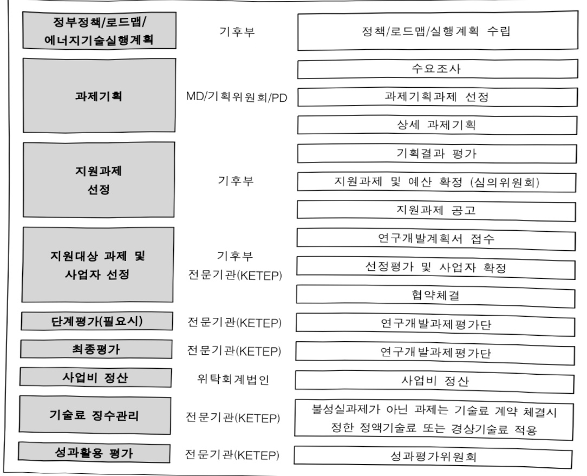

# AI기반분산·예비전력안전관리통합플랫폼개발및실증(R…

**해당 페이지**: PDF 2583 ~ 2591 쪽 해당

**부처**: 기후에너지환경부
**분야**: 산업·중소기업 및 에너지
**회계유형**: 기금
**2026 확정예산**: 9446.0 백만원
**전년대비 증감률**: 126.8%
**AI 도메인**: 데이터

---

<table border=1 style='margin: auto; word-wrap: break-word;'><tr><td style='text-align: center; word-wrap: break-word;'>사업명</td><td colspan="2">구분</td></tr><tr><td rowspan="3">AI 기반분산·예비전력 안전관리통합 플랫폼개발 및 실증(R&amp;D)</td><td rowspan="2">소관부처</td><td style='text-align: center; word-wrap: break-word;'>기후에너지정책실 수소열산업정책관</td></tr><tr><td style='text-align: center; word-wrap: break-word;'>에너지안전효율과</td></tr><tr><td style='text-align: center; word-wrap: break-word;'>사업시행주체</td><td style='text-align: center; word-wrap: break-word;'>한국에너지기술평가원</td></tr></table>

□사업담당자

<table border=1 style='margin: auto; word-wrap: break-word;'><tr><td style='text-align: center; word-wrap: break-word;'>직접</td><td style='text-align: center; word-wrap: break-word;'>출자</td><td style='text-align: center; word-wrap: break-word;'>출연</td><td style='text-align: center; word-wrap: break-word;'>보조</td><td style='text-align: center; word-wrap: break-word;'>융자</td><td style='text-align: center; word-wrap: break-word;'>국고보조율(%)</td><td style='text-align: center; word-wrap: break-word;'>융자율(%)</td></tr><tr><td style='text-align: center; word-wrap: break-word;'></td><td style='text-align: center; word-wrap: break-word;'></td><td style='text-align: center; word-wrap: break-word;'>○</td><td style='text-align: center; word-wrap: break-word;'></td><td style='text-align: center; word-wrap: break-word;'></td><td style='text-align: center; word-wrap: break-word;'></td><td style='text-align: center; word-wrap: break-word;'></td></tr></table>

□사업지원형태 및지원을(최소한 한 개는 반드시 선택하시오.해당사항에 0 표시)

<table border=1 style='margin: auto; word-wrap: break-word;'><tr><td style='text-align: center; word-wrap: break-word;'>신규 계속</td><td style='text-align: center; word-wrap: break-word;'>완료</td><td style='text-align: center; word-wrap: break-word;'>예비타당성 실시여부</td><td style='text-align: center; word-wrap: break-word;'>총사업비 관리대상</td><td style='text-align: center; word-wrap: break-word;'>총액계상 예산사업</td><td style='text-align: center; word-wrap: break-word;'>사업소관 변경정보 2025예산 시 소관</td></tr><tr><td style='text-align: center; word-wrap: break-word;'></td><td style='text-align: center; word-wrap: break-word;'>○</td><td style='text-align: center; word-wrap: break-word;'></td><td style='text-align: center; word-wrap: break-word;'></td><td style='text-align: center; word-wrap: break-word;'></td><td style='text-align: center; word-wrap: break-word;'></td></tr></table>

□사업 성격(공통요구자료Ⅱ-1 작성유의사항 4.참조,해당하는 사항에“°표시)

<table border=1 style='margin: auto; word-wrap: break-word;'><tr><td style='text-align: center; word-wrap: break-word;'>구분</td><td style='text-align: center; word-wrap: break-word;'>프로그램</td><td style='text-align: center; word-wrap: break-word;'>단위사업</td><td style='text-align: center; word-wrap: break-word;'>세부사업</td></tr><tr><td style='text-align: center; word-wrap: break-word;'>코드</td><td style='text-align: center; word-wrap: break-word;'>5100</td><td style='text-align: center; word-wrap: break-word;'>5144</td><td style='text-align: center; word-wrap: break-word;'>327</td></tr><tr><td style='text-align: center; word-wrap: break-word;'>명칭</td><td style='text-align: center; word-wrap: break-word;'>에너지자원정책</td><td style='text-align: center; word-wrap: break-word;'>전기안전관리</td><td style='text-align: center; word-wrap: break-word;'>AI 기반 분산·예비전력 안전관리 통합 플랫폼 개발 및 실증(R&amp;D)</td></tr></table>

<table border=1 style='margin: auto; word-wrap: break-word;'><tr><td style='text-align: center; word-wrap: break-word;'>구분</td><td rowspan="2">기금</td><td rowspan="2">소관</td><td rowspan="2">실국(기관)</td><td rowspan="2">계정</td><td style='text-align: center; word-wrap: break-word;'>분야</td><td style='text-align: center; word-wrap: break-word;'>부문</td></tr><tr><td style='text-align: center; word-wrap: break-word;'>코드</td><td style='text-align: center; word-wrap: break-word;'>110</td><td style='text-align: center; word-wrap: break-word;'>115</td></tr><tr><td style='text-align: center; word-wrap: break-word;'>명칭</td><td style='text-align: center; word-wrap: break-word;'>전력산업 기반기금</td><td style='text-align: center; word-wrap: break-word;'>기후에너지 환경부</td><td style='text-align: center; word-wrap: break-word;'>기후에너지정책실 수소열산업정책관</td><td style='text-align: center; word-wrap: break-word;'>-</td><td style='text-align: center; word-wrap: break-word;'>산업·중소기업 및 에너지</td><td style='text-align: center; word-wrap: break-word;'>에너지 및 자원개발</td></tr></table>

□사업코드정보

<table border=1 style='margin: auto; word-wrap: break-word;'><tr><td style='text-align: center; word-wrap: break-word;'>사 업 명</td></tr><tr><td style='text-align: center; word-wrap: break-word;'>가. (8) AI 기반 분산·예비전력 안전관리 통합 플랫폼 개발 및 실증(R&amp;D)(5144-327)</td></tr></table>

---

### 가.지출계획 총괄표

(단위:백만원,%)

<table border=1 style='margin: auto; word-wrap: break-word;'><tr><td rowspan="2">$ \underset{\cdot}{목} $ $ \underset{\cdot}{명} $</td><td style='text-align: center; word-wrap: break-word;'>2024 $ \underset{\cdot}{년} $</td><td colspan="2">2025 $ \underset{\cdot}{년} $ 계획</td><td colspan="2">2026 $ \underset{\cdot}{년} $</td><td rowspan="2">$ \underset{\cdot}{증} $ $ \underset{\cdot}{감} $(B-A)</td><td rowspan="2">(B-A)/A</td></tr><tr><td style='text-align: center; word-wrap: break-word;'>결산</td><td style='text-align: center; word-wrap: break-word;'>당초(A)</td><td style='text-align: center; word-wrap: break-word;'>수정</td><td style='text-align: center; word-wrap: break-word;'>정부안</td><td style='text-align: center; word-wrap: break-word;'>$ \underset{\cdot}{확} $ $ \underset{\cdot}{정} $(B)</td></tr><tr><td style='text-align: center; word-wrap: break-word;'>연구개발 $ \underset{\cdot}{활} $ $ \underset{\cdot}{동} $ $ \underset{\cdot}{비} $</td><td style='text-align: center; word-wrap: break-word;'>1,200</td><td style='text-align: center; word-wrap: break-word;'>4,164</td><td style='text-align: center; word-wrap: break-word;'>4,164</td><td style='text-align: center; word-wrap: break-word;'>9,446</td><td style='text-align: center; word-wrap: break-word;'>9,446</td><td style='text-align: center; word-wrap: break-word;'>5,282</td><td style='text-align: center; word-wrap: break-word;'>126.8</td></tr></table>

## <이관 내역>

<table border=1 style='margin: auto; word-wrap: break-word;'><tr><td style='text-align: center; word-wrap: break-word;'>정부조직 개편으로 산업통상부 소관 세부사업인 ‘AI 기반 분산·예비전력 안전관리 통합 플랫폼 개발 및 실증(R&amp;D)’사업(2024결산: 1,200 2025예산: 4,164)이 기후 에너지환경부 소관 세부사업인 ‘AI 기반 분산·예비전력 안전관리 통합 플랫폼 개발 및 실증(R&amp;D)’사업으로 이관</td></tr></table>

## □ 기능별(내역사업별), 목별 계획 내역

(단위:백만원)

<table border=1 style='margin: auto; word-wrap: break-word;'><tr><td rowspan="3"></td><td colspan="5">2024</td><td colspan="8">2025</td><td rowspan="3">2026예산</td></tr><tr><td rowspan="2">계획액(수정)</td><td rowspan="2">계획현액</td><td rowspan="2">집행액[실집행액]</td><td rowspan="2">이월액</td><td rowspan="2">불용액</td><td colspan="2">계획액</td><td rowspan="2">계획현액</td><td rowspan="2">집행액[실집행액]</td><td colspan="2">전년도이월액제외</td><td rowspan="2">이월예상액</td><td rowspan="2">불용예상액</td></tr><tr><td style='text-align: center; word-wrap: break-word;'>당초</td><td style='text-align: center; word-wrap: break-word;'>수정</td><td style='text-align: center; word-wrap: break-word;'>계획현액</td><td style='text-align: center; word-wrap: break-word;'>집행액[실집행액]</td></tr><tr><td style='text-align: center; word-wrap: break-word;'>○기능별분류(합계)</td><td style='text-align: center; word-wrap: break-word;'>1,200</td><td style='text-align: center; word-wrap: break-word;'>1,200</td><td style='text-align: center; word-wrap: break-word;'>1,200[1,200]</td><td style='text-align: center; word-wrap: break-word;'>-</td><td style='text-align: center; word-wrap: break-word;'>-</td><td style='text-align: center; word-wrap: break-word;'>4,164</td><td style='text-align: center; word-wrap: break-word;'>4,164</td><td style='text-align: center; word-wrap: break-word;'>4,164</td><td style='text-align: center; word-wrap: break-word;'>4,164[4,164]</td><td style='text-align: center; word-wrap: break-word;'>4,164</td><td style='text-align: center; word-wrap: break-word;'>4,164[4,164]</td><td style='text-align: center; word-wrap: break-word;'>-</td><td style='text-align: center; word-wrap: break-word;'>-</td><td style='text-align: center; word-wrap: break-word;'>9,446</td></tr><tr><td style='text-align: center; word-wrap: break-word;'>-AI기반분산예비전력안전관리통합플랫폼개발및실증</td><td style='text-align: center; word-wrap: break-word;'>1,200</td><td style='text-align: center; word-wrap: break-word;'>1,200</td><td style='text-align: center; word-wrap: break-word;'>1,200[1,200]</td><td style='text-align: center; word-wrap: break-word;'>-</td><td style='text-align: center; word-wrap: break-word;'>-</td><td style='text-align: center; word-wrap: break-word;'>4,164</td><td style='text-align: center; word-wrap: break-word;'>4,164</td><td style='text-align: center; word-wrap: break-word;'>4,164</td><td style='text-align: center; word-wrap: break-word;'>4,164[4,164]</td><td style='text-align: center; word-wrap: break-word;'>4,164</td><td style='text-align: center; word-wrap: break-word;'>4,164[4,164]</td><td style='text-align: center; word-wrap: break-word;'>-</td><td style='text-align: center; word-wrap: break-word;'>-</td><td style='text-align: center; word-wrap: break-word;'>9,446</td></tr><tr><td style='text-align: center; word-wrap: break-word;'>○비목별분류(합계)</td><td style='text-align: center; word-wrap: break-word;'>1,200</td><td style='text-align: center; word-wrap: break-word;'>1,200</td><td style='text-align: center; word-wrap: break-word;'>1,200[1,200]</td><td style='text-align: center; word-wrap: break-word;'>-</td><td style='text-align: center; word-wrap: break-word;'>-</td><td style='text-align: center; word-wrap: break-word;'>4,164</td><td style='text-align: center; word-wrap: break-word;'>4,164</td><td style='text-align: center; word-wrap: break-word;'>4,164</td><td style='text-align: center; word-wrap: break-word;'>4,164[4,164]</td><td style='text-align: center; word-wrap: break-word;'>4,164</td><td style='text-align: center; word-wrap: break-word;'>4,164[4,164]</td><td style='text-align: center; word-wrap: break-word;'>-</td><td style='text-align: center; word-wrap: break-word;'>-</td><td style='text-align: center; word-wrap: break-word;'>9,446</td></tr><tr><td style='text-align: center; word-wrap: break-word;'>-연구개발활동비등(360-05)</td><td style='text-align: center; word-wrap: break-word;'>1,200</td><td style='text-align: center; word-wrap: break-word;'>1,200</td><td style='text-align: center; word-wrap: break-word;'>1,200[1,200]</td><td style='text-align: center; word-wrap: break-word;'>-</td><td style='text-align: center; word-wrap: break-word;'>-</td><td style='text-align: center; word-wrap: break-word;'>4,164</td><td style='text-align: center; word-wrap: break-word;'>4,164</td><td style='text-align: center; word-wrap: break-word;'>4,164</td><td style='text-align: center; word-wrap: break-word;'>4,164[4,164]</td><td style='text-align: center; word-wrap: break-word;'>4,164</td><td style='text-align: center; word-wrap: break-word;'>4,164[4,164]</td><td style='text-align: center; word-wrap: break-word;'>-</td><td style='text-align: center; word-wrap: break-word;'>-</td><td style='text-align: center; word-wrap: break-word;'>9,446</td></tr><tr><td style='text-align: center; word-wrap: break-word;'>○기능비목별분류(합계)</td><td style='text-align: center; word-wrap: break-word;'>1,200</td><td style='text-align: center; word-wrap: break-word;'>1,200</td><td style='text-align: center; word-wrap: break-word;'>1,200[1,200]</td><td style='text-align: center; word-wrap: break-word;'>-</td><td style='text-align: center; word-wrap: break-word;'>-</td><td style='text-align: center; word-wrap: break-word;'>4,164</td><td style='text-align: center; word-wrap: break-word;'>4,164</td><td style='text-align: center; word-wrap: break-word;'>4,164</td><td style='text-align: center; word-wrap: break-word;'>4,164[4,164]</td><td style='text-align: center; word-wrap: break-word;'>4,164</td><td style='text-align: center; word-wrap: break-word;'>4,164[4,164]</td><td style='text-align: center; word-wrap: break-word;'>-</td><td style='text-align: center; word-wrap: break-word;'>-</td><td style='text-align: center; word-wrap: break-word;'>9,446</td></tr><tr><td style='text-align: center; word-wrap: break-word;'>-AI기반분산예비전력안전관리통합플랫폼개발및실증</td><td style='text-align: center; word-wrap: break-word;'>1,200</td><td style='text-align: center; word-wrap: break-word;'>1,200</td><td style='text-align: center; word-wrap: break-word;'>1,200[1,200]</td><td style='text-align: center; word-wrap: break-word;'>-</td><td style='text-align: center; word-wrap: break-word;'>-</td><td style='text-align: center; word-wrap: break-word;'>4,164</td><td style='text-align: center; word-wrap: break-word;'>4,164</td><td style='text-align: center; word-wrap: break-word;'>4,164</td><td style='text-align: center; word-wrap: break-word;'>4,164[4,164]</td><td style='text-align: center; word-wrap: break-word;'>4,164</td><td style='text-align: center; word-wrap: break-word;'>4,164[4,164]</td><td style='text-align: center; word-wrap: break-word;'>-</td><td style='text-align: center; word-wrap: break-word;'>-</td><td style='text-align: center; word-wrap: break-word;'>9,446</td></tr><tr><td style='text-align: center; word-wrap: break-word;'>·연구개발활동비</td><td style='text-align: center; word-wrap: break-word;'>1,200</td><td style='text-align: center; word-wrap: break-word;'>1,200</td><td style='text-align: center; word-wrap: break-word;'>1,200</td><td style='text-align: center; word-wrap: break-word;'>-</td><td style='text-align: center; word-wrap: break-word;'>-</td><td style='text-align: center; word-wrap: break-word;'>4,164</td><td style='text-align: center; word-wrap: break-word;'>4,164</td><td style='text-align: center; word-wrap: break-word;'>4,164</td><td style='text-align: center; word-wrap: break-word;'>4,164</td><td style='text-align: center; word-wrap: break-word;'>4,164</td><td style='text-align: center; word-wrap: break-word;'>4,164</td><td style='text-align: center; word-wrap: break-word;'>-</td><td style='text-align: center; word-wrap: break-word;'>-</td><td style='text-align: center; word-wrap: break-word;'>9,446</td></tr></table>

---

<table border=1 style='margin: auto; word-wrap: break-word;'><tr><td rowspan="3"></td><td colspan="5">2024</td><td colspan="8">2025</td><td rowspan="3">2026예산</td></tr><tr><td rowspan="2">계획액(수정)</td><td rowspan="2">계획현액</td><td rowspan="2">집행액[실집행액]</td><td rowspan="2">이월액</td><td rowspan="2">불용액</td><td colspan="2">계획액</td><td rowspan="2">계획현액</td><td rowspan="2">집행액[실집행액]</td><td colspan="2">전년도 이월액제외</td><td rowspan="2">이월예상액</td><td rowspan="2">불용예상액</td></tr><tr><td style='text-align: center; word-wrap: break-word;'>당초</td><td style='text-align: center; word-wrap: break-word;'>수정</td><td style='text-align: center; word-wrap: break-word;'>계획현액</td><td style='text-align: center; word-wrap: break-word;'>집행액[실집행액]</td></tr><tr><td style='text-align: center; word-wrap: break-word;'>등(360-05)</td><td style='text-align: center; word-wrap: break-word;'></td><td style='text-align: center; word-wrap: break-word;'></td><td style='text-align: center; word-wrap: break-word;'>[1,200]</td><td style='text-align: center; word-wrap: break-word;'></td><td style='text-align: center; word-wrap: break-word;'></td><td style='text-align: center; word-wrap: break-word;'></td><td style='text-align: center; word-wrap: break-word;'></td><td style='text-align: center; word-wrap: break-word;'></td><td style='text-align: center; word-wrap: break-word;'>[4,164]</td><td style='text-align: center; word-wrap: break-word;'></td><td style='text-align: center; word-wrap: break-word;'>[4,164]</td><td style='text-align: center; word-wrap: break-word;'></td><td style='text-align: center; word-wrap: break-word;'></td><td style='text-align: center; word-wrap: break-word;'></td></tr></table>

나.사업설명자료

## 1 ) 사업목적·내용

- AI기반 재생에너지·유연성 전력자원의 실시간 양방향 안전관리 통합 플랫폼 구축을 통한

안정적인 전력공급 및 재난사고 예방에 기여

- (내용) 분산·예비전력(비상발전기, ESS, V2G 등) 자원의 자산·운영·설비안전 데이터에 대한 디지털 통합 안전관리 플랫폼 개발/실증 및 제도화를 위한 2개 과제 지원

(안전관리 통합 플랫폼) AI 빅데이터와 연동된 분산·예비전력 자원의 지역별/설비별 실시간 모니터링을 통한 위험예측 및 비상대응 안전관리 플랫폼 개발

(비상대응 원격제어 기술) 디지털 기반 분산·예비전력(ESS, 비상발전기, 전기차 충전기 등) 자원과 연계한 전력수급 비상대응 원격제어 기술개발 및 정보공유체계 구축/실증

## 2 ) 사업개요

☐ 사업근거 및 추진경위

① 법령상 근거 및 조항 적시

-에너지법 제12조(에너지기술 개발)

② 관계 중앙행정기관의 장은 제1항에 따른 기술개발에 필요한 비용의 전부 또는 일부를 출연할 수 있다.

-에너지법 제14조(에너지기술개발사업비)

④ 에너지기술개발사업비는 다음 각 호의 사업지원을 위하여 사용하여야 한다.

1. 에너지기술의 연구·개발에 관한 사항

- 전기사업법 제49조(기금의 사용)

---

기금은 다음 각 호의 사업을 위하여 사용한다.

5. 전력산업 관련 연구개발사업

7. 전기안전관리법에 따른 전기안전·전기재해 예방 및 대응 관련 조사·연구·홍보에 관한 지원 사업

12. 그 밖에 대통령령으로 정하는 전력산업과 관련한 중요 사업

- 전기안전관리법 제7조(전기안전관리 관련 기술의 연구·개발)

② 기후에너지환경부장관은 제1항에 따른 연구·개발에 필요한 재정적 지원을 할 수 있다.

② 추진경위

- (22. 7) 정부의 에너지정책 방향

·에너지 복지 및 정책수용성 강화와 연계한 AI 등 디지털 기술 등을 활용한 발전

사업 현장 안전관리 강화 제시

- (22. 10) 재생에너지 발전설비 확대에 따른 재해예측·비상대응 및 안전관리 핵심기술 개발

- (23. 1) 제10차 전력수급 기본계획

- (23. 2) 비상예비·분산전력을 활용한 전력수급 위기 대응방안 수립 발표(기후부)

- (23. 2) AI기반 분산·예비전력 안전관리 통합 플랫폼 개발 사업 기획

□ 주요내용

① 사업규모

- 총사업비(해당되는 경우에만 기재) : 해당없음

- 사업기간 : 2024~2027

- 최근 5년 간 투입된 사업비(예산액기준, 추경편성한 연도에는 추경포함)

<table border=1 style='margin: auto; word-wrap: break-word;'><tr><td style='text-align: center; word-wrap: break-word;'>$ \underline{\text{연도}} $</td><td style='text-align: center; word-wrap: break-word;'>2022</td><td style='text-align: center; word-wrap: break-word;'>2023</td><td style='text-align: center; word-wrap: break-word;'>2024</td><td style='text-align: center; word-wrap: break-word;'>2025</td><td style='text-align: center; word-wrap: break-word;'>2026</td></tr><tr><td style='text-align: center; word-wrap: break-word;'>$ \underline{\text{사업비}} $</td><td style='text-align: center; word-wrap: break-word;'>-</td><td style='text-align: center; word-wrap: break-word;'>-</td><td style='text-align: center; word-wrap: break-word;'>1,200</td><td style='text-align: center; word-wrap: break-word;'>4,164</td><td style='text-align: center; word-wrap: break-word;'>9,446</td></tr></table>

② 사업추진체계

- 사업시행방법 : 출연(Matching Fund, 연구수행형태에 따라 33~100% 정부지원)

- 사업시행주체 : 한국에너지기술평가원

- 사업 수혜자 : 기업, 대학, 연구소 등

- 보조, 융자, 출연, 출자 등의 경우 보조·융자 등 지원 비율 및 법적근거

---

<table border=1 style='margin: auto; word-wrap: break-word;'><tr><td style='text-align: center; word-wrap: break-word;'>내역사업명</td><td style='text-align: center; word-wrap: break-word;'>구분</td><td style='text-align: center; word-wrap: break-word;'>피보조·피출연 등 기관명</td><td style='text-align: center; word-wrap: break-word;'>지원 금액 (2026계획)</td><td style='text-align: center; word-wrap: break-word;'>지원 비율(%)</td><td style='text-align: center; word-wrap: break-word;'>보조율 법적근거 (해당 조항)</td></tr><tr><td style='text-align: center; word-wrap: break-word;'>AI 기반 분산·예비전력 안전관리 통합 플랫폼 개발 및 실증(R&amp;D)</td><td style='text-align: center; word-wrap: break-word;'>출연</td><td style='text-align: center; word-wrap: break-word;'>한국에너지기술평가원</td><td style='text-align: center; word-wrap: break-word;'>9,446</td><td style='text-align: center; word-wrap: break-word;'>33~100</td><td style='text-align: center; word-wrap: break-word;'>산업기술 혁신사업 공통 운영요령 제24조(정부지원연구개발비의 지원기준)</td></tr></table>

---

3) 2026년도 계획 산출 근거

(1) AI 기반 분산 · 예비전력 안전관리 통합 플랫폼 개발 및 실증 내역 : (2025) 4,164 → (2026요구) 9,446백만원, +126.8%

- (요구) AI기반 분산·예비전력 안전관리 통합 플랫폼 개발 및 실증을 위해 2개 계속 과제 9,446백만원 요구

- (산출) 계속 : 2개 과제 x 4,723백만원 = 9,446백만원

°2025년도 계획 및 2026년도 계획 산출 세부내역 비교

<table border=1 style='margin: auto; word-wrap: break-word;'><tr><td colspan="2">&#x27;25년 계획</td><td colspan="2">&#x27;26년 계획</td></tr><tr><td style='text-align: center; word-wrap: break-word;'>예산</td><td style='text-align: center; word-wrap: break-word;'>산출내역</td><td style='text-align: center; word-wrap: break-word;'>예산</td><td style='text-align: center; word-wrap: break-word;'>산출내역</td></tr><tr><td style='text-align: center; word-wrap: break-word;'>4,164</td><td style='text-align: center; word-wrap: break-word;'>○ 연구개발활동비등(360-05): 4,164백만원가. (총괄) AI 기반 분산·유휴자원 안전관리 통합 플랫폼 개발 및 실증 (25년 2,347백만원) 나. (세부) 분산 유휴자원의 비상대응 원격제어 기술 개발 (25년 1,817백만원)</td><td style='text-align: center; word-wrap: break-word;'>9,446</td><td style='text-align: center; word-wrap: break-word;'>○ 연구개발활동비등(360-05): 9,446백만원가. (총괄) AI 기반 분산·유휴자원 안전관리 통합 플랫폼 개발 및 실증 (26년 5,613백만원) 나. (세부) 분산 유휴자원의 비상대응 원격제어 기술 개발 (25년 3,833백만원)</td></tr></table>

## 4 ) 사업효과

☐ 사업영향, 산출물 성과지표 등

①2022~2026년도 성과계획서 상 성과지표 및 최근 5년간 성과 달성도

<table border=1 style='margin: auto; word-wrap: break-word;'><tr><td style='text-align: center; word-wrap: break-word;'>성과지표</td><td style='text-align: center; word-wrap: break-word;'>구분</td><td style='text-align: center; word-wrap: break-word;'>2022</td><td style='text-align: center; word-wrap: break-word;'>2023</td><td style='text-align: center; word-wrap: break-word;'>2024</td><td style='text-align: center; word-wrap: break-word;'>2025</td><td style='text-align: center; word-wrap: break-word;'>2026</td><td style='text-align: center; word-wrap: break-word;'>2026 목표치산출근거</td><td style='text-align: center; word-wrap: break-word;'>측정산식(또는 측정방법)</td><td style='text-align: center; word-wrap: break-word;'>자료수집방법(또는 자료출처)</td></tr><tr><td rowspan="3">①에너지원단위(to e/백만원)(하향지표)</td><td style='text-align: center; word-wrap: break-word;'>목표</td><td style='text-align: center; word-wrap: break-word;'>0.159</td><td style='text-align: center; word-wrap: break-word;'>0.158</td><td style='text-align: center; word-wrap: break-word;'>0.156</td><td style='text-align: center; word-wrap: break-word;'>0.146</td><td style='text-align: center; word-wrap: break-word;'>0.142</td><td rowspan="3">&#x27;GDP 성장률 전망치가 하향되는 등 여러 운영진에도 불구, 그 간 실적 주세인 연령균 1.0% 개선율을 적용하여 목표 설정*</td><td rowspan="3">° 측정 산식 : 일차 에너지공급량(toe) / 실질GDP(백만원) * 1차 에너지공급량 : 석탄·석유·가스·전력 등 에너지공급체계 자료 실질GDP : 한국은행</td><td rowspan="3">에너지통계연보, 한국은행 경제통계시스템</td></tr><tr><td style='text-align: center; word-wrap: break-word;'>실적</td><td style='text-align: center; word-wrap: break-word;'>0.155</td><td style='text-align: center; word-wrap: break-word;'>0.149</td><td style='text-align: center; word-wrap: break-word;'>0.135</td><td style='text-align: center; word-wrap: break-word;'>-</td><td style='text-align: center; word-wrap: break-word;'>-</td></tr><tr><td style='text-align: center; word-wrap: break-word;'>달성도</td><td style='text-align: center; word-wrap: break-word;'>97.5</td><td style='text-align: center; word-wrap: break-word;'>94.33</td><td style='text-align: center; word-wrap: break-word;'>86.5</td><td style='text-align: center; word-wrap: break-word;'>-</td><td style='text-align: center; word-wrap: break-word;'>-</td></tr></table>

② 성과지표 이외의 연도별 사업추진 경과 및 실적 : 해당없음

③향후(2026년도 이후)기대효과

- (정책적 효과) 피크릿 등 비상시 전력수요 단계적 유연한 공급자원 확보 및 비상 수요 통합 관리체계(정부-KPX-KESCO) 구축 법적 기반 마련

* (1단계) 전국 공공기관(5GW) 및 민간의 비상발전기를 수요관리 자원으로 활용

* (2단계) 재생E 연계 ESS(3GW)와 전치차 배터리 잠재 전력(15GW) 이용하는 V2G 활용

---

5) 타당성조사 및 예비타당성조사 시행여부 및 결과 요지 : 해당없음

6) 총사업비 대상사업 여부 및 내역 : 해당없음

## 7 ) 사업 집행절차

8) 중기재정계획 상 연도별 투자계획 및 추진경과

(단위: 백만원)

<table border=1 style='margin: auto; word-wrap: break-word;'><tr><td style='text-align: center; word-wrap: break-word;'>$ 중기 $ 재정계획</td><td style='text-align: center; word-wrap: break-word;'>2024</td><td style='text-align: center; word-wrap: break-word;'>2025</td><td style='text-align: center; word-wrap: break-word;'>2026</td><td style='text-align: center; word-wrap: break-word;'>2027</td><td style='text-align: center; word-wrap: break-word;'>2028</td><td style='text-align: center; word-wrap: break-word;'>2029</td></tr><tr><td rowspan="2">2024~2028 2025~2029</td><td style='text-align: center; word-wrap: break-word;'>1,200</td><td style='text-align: center; word-wrap: break-word;'>4,164</td><td style='text-align: center; word-wrap: break-word;'>8,600</td><td style='text-align: center; word-wrap: break-word;'>5,200</td><td style='text-align: center; word-wrap: break-word;'>-</td><td style='text-align: center; word-wrap: break-word;'>-</td></tr><tr><td style='text-align: center; word-wrap: break-word;'></td><td style='text-align: center; word-wrap: break-word;'>4,164</td><td style='text-align: center; word-wrap: break-word;'>9,446</td><td style='text-align: center; word-wrap: break-word;'>5,190</td><td style='text-align: center; word-wrap: break-word;'>-</td><td style='text-align: center; word-wrap: break-word;'>-</td></tr></table>

---

9) 최근 3년간 동 사업에 대한 주요 외부지적사항 및 평가, 문제점 및 대책 : 해당없음

10) 향후 추진방향 및 추진계획

- 분산·예비전력(비상발전기, ESS, EV, 풍력, 태양광 등) 자원의 자산·운영·설비안전 데이터에 대한 디지털 통합 안전관리 플랫폼 개발/실증 및 제도화

11) 해당사업에 대한 각종 사업평가의 결과 : 해당없음

12) 해당사업에 대한 부처 자체평가의 결과 : 해당없음

13) 부처 건의사항 : 해당없음

### 다.최근 4년간 결산내역

1) 결산표

☐ 부처 결산내역

(단위:백만원,%)

<table border=1 style='margin: auto; word-wrap: break-word;'><tr><td rowspan="2">闰土</td><td colspan="3">계획액</td><td rowspan="2">전년도 이월액</td><td rowspan="2">계획 현액(B)</td><td rowspan="2">집행액 (C)</td><td rowspan="2">집행률 (C/A)</td><td rowspan="2">집행률 (C/B)</td><td rowspan="2">다음연도 이월액</td><td rowspan="2">불용액</td></tr><tr><td style='text-align: center; word-wrap: break-word;'>당초</td><td style='text-align: center; word-wrap: break-word;'>증감액</td><td style='text-align: center; word-wrap: break-word;'>수정(A)</td></tr><tr><td style='text-align: center; word-wrap: break-word;'>2022</td><td style='text-align: center; word-wrap: break-word;'>-</td><td style='text-align: center; word-wrap: break-word;'>-</td><td style='text-align: center; word-wrap: break-word;'>-</td><td style='text-align: center; word-wrap: break-word;'>-</td><td style='text-align: center; word-wrap: break-word;'>-</td><td style='text-align: center; word-wrap: break-word;'>-</td><td style='text-align: center; word-wrap: break-word;'>-</td><td style='text-align: center; word-wrap: break-word;'>-</td><td style='text-align: center; word-wrap: break-word;'>-</td><td style='text-align: center; word-wrap: break-word;'>-</td></tr><tr><td style='text-align: center; word-wrap: break-word;'>2023</td><td style='text-align: center; word-wrap: break-word;'>-</td><td style='text-align: center; word-wrap: break-word;'>-</td><td style='text-align: center; word-wrap: break-word;'>-</td><td style='text-align: center; word-wrap: break-word;'>-</td><td style='text-align: center; word-wrap: break-word;'>-</td><td style='text-align: center; word-wrap: break-word;'>-</td><td style='text-align: center; word-wrap: break-word;'>-</td><td style='text-align: center; word-wrap: break-word;'>-</td><td style='text-align: center; word-wrap: break-word;'>-</td><td style='text-align: center; word-wrap: break-word;'>-</td></tr><tr><td style='text-align: center; word-wrap: break-word;'>2024</td><td style='text-align: center; word-wrap: break-word;'>1,200</td><td style='text-align: center; word-wrap: break-word;'>-</td><td style='text-align: center; word-wrap: break-word;'>1,200</td><td style='text-align: center; word-wrap: break-word;'>-</td><td style='text-align: center; word-wrap: break-word;'>1,200</td><td style='text-align: center; word-wrap: break-word;'>1,200</td><td style='text-align: center; word-wrap: break-word;'>100</td><td style='text-align: center; word-wrap: break-word;'>100</td><td style='text-align: center; word-wrap: break-word;'>-</td><td style='text-align: center; word-wrap: break-word;'>-</td></tr><tr><td style='text-align: center; word-wrap: break-word;'>2025</td><td style='text-align: center; word-wrap: break-word;'>4,164</td><td style='text-align: center; word-wrap: break-word;'>-</td><td style='text-align: center; word-wrap: break-word;'>4,164</td><td style='text-align: center; word-wrap: break-word;'>-</td><td style='text-align: center; word-wrap: break-word;'>4,164</td><td style='text-align: center; word-wrap: break-word;'>4,164</td><td style='text-align: center; word-wrap: break-word;'>100</td><td style='text-align: center; word-wrap: break-word;'>100</td><td style='text-align: center; word-wrap: break-word;'>-</td><td style='text-align: center; word-wrap: break-word;'>-</td></tr></table>

□출연·보조사업 등 실집행내역

(단위:백만원,%)

<table border=1 style='margin: auto; word-wrap: break-word;'><tr><td rowspan="3">구분</td><td colspan="3">부처</td><td colspan="6">사업시행주체(피출연·피보조기관 등)</td></tr><tr><td colspan="2">계획액</td><td rowspan="2">집행액</td><td rowspan="2">교부액</td><td rowspan="2">전년도이월액</td><td rowspan="2">교부현액</td><td rowspan="2">집행액(B)</td><td rowspan="2">이월액</td><td rowspan="2">불용액</td></tr><tr><td style='text-align: center; word-wrap: break-word;'>당초</td><td style='text-align: center; word-wrap: break-word;'>수정(A)</td></tr><tr><td style='text-align: center; word-wrap: break-word;'>2022</td><td style='text-align: center; word-wrap: break-word;'>-</td><td style='text-align: center; word-wrap: break-word;'>-</td><td style='text-align: center; word-wrap: break-word;'>-</td><td style='text-align: center; word-wrap: break-word;'>-</td><td style='text-align: center; word-wrap: break-word;'>-</td><td style='text-align: center; word-wrap: break-word;'>-</td><td style='text-align: center; word-wrap: break-word;'>-</td><td style='text-align: center; word-wrap: break-word;'>-</td><td style='text-align: center; word-wrap: break-word;'>-</td></tr><tr><td style='text-align: center; word-wrap: break-word;'>2023</td><td style='text-align: center; word-wrap: break-word;'>-</td><td style='text-align: center; word-wrap: break-word;'>-</td><td style='text-align: center; word-wrap: break-word;'>-</td><td style='text-align: center; word-wrap: break-word;'>-</td><td style='text-align: center; word-wrap: break-word;'>-</td><td style='text-align: center; word-wrap: break-word;'>-</td><td style='text-align: center; word-wrap: break-word;'>-</td><td style='text-align: center; word-wrap: break-word;'>-</td><td style='text-align: center; word-wrap: break-word;'>-</td></tr><tr><td style='text-align: center; word-wrap: break-word;'>2024</td><td style='text-align: center; word-wrap: break-word;'>1,200</td><td style='text-align: center; word-wrap: break-word;'>1,200</td><td style='text-align: center; word-wrap: break-word;'>1,200</td><td style='text-align: center; word-wrap: break-word;'>1,200</td><td style='text-align: center; word-wrap: break-word;'>-</td><td style='text-align: center; word-wrap: break-word;'>1,200</td><td style='text-align: center; word-wrap: break-word;'>1,200</td><td style='text-align: center; word-wrap: break-word;'>-</td><td style='text-align: center; word-wrap: break-word;'>-</td></tr><tr><td style='text-align: center; word-wrap: break-word;'>2025</td><td style='text-align: center; word-wrap: break-word;'>4,164</td><td style='text-align: center; word-wrap: break-word;'>4,164</td><td style='text-align: center; word-wrap: break-word;'>4,164</td><td style='text-align: center; word-wrap: break-word;'>4,164</td><td style='text-align: center; word-wrap: break-word;'>-</td><td style='text-align: center; word-wrap: break-word;'>4,164</td><td style='text-align: center; word-wrap: break-word;'>4,164</td><td style='text-align: center; word-wrap: break-word;'>-</td><td style='text-align: center; word-wrap: break-word;'>-</td></tr></table>

---

## 2 ) 주요 결산사항

□2022~2025년 결산사항

<table border=1 style='margin: auto; word-wrap: break-word;'><tr><td style='text-align: center; word-wrap: break-word;'>2022</td><td style='text-align: center; word-wrap: break-word;'>- 특이사항 없음</td></tr><tr><td style='text-align: center; word-wrap: break-word;'>2023</td><td style='text-align: center; word-wrap: break-word;'>- 특이사항 없음</td></tr><tr><td style='text-align: center; word-wrap: break-word;'>2024</td><td style='text-align: center; word-wrap: break-word;'>- 특이사항 없음</td></tr><tr><td style='text-align: center; word-wrap: break-word;'>2025</td><td style='text-align: center; word-wrap: break-word;'>- 특이사항 없음</td></tr></table>

□2025년 계획변경 세부내역:해당없음

---

### 원본 PDF 크롭 이미지

