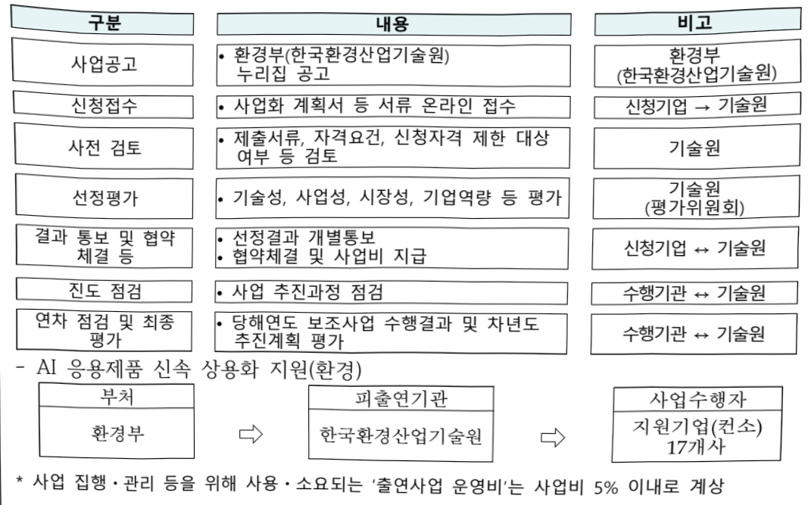

# AI응용제품 신속 상용화 지원사업(환경)

**해당 페이지**: PDF 2592 ~ 2598 쪽 해당

**부처**: 기후에너지환경부
**분야**: 환경
**회계유형**: 환경개선 특별회계
**2026 확정예산**: 30500.0 백만원
**전년대비 증감률**: None%
**AI 도메인**: 환경/기후, 디지털전환(AX)

---

### 가. 예산 총괄표

(단위: 백만원, %)

<table border=1 style='margin: auto; word-wrap: break-word;'><tr><td rowspan="2">사업명</td><td rowspan="2">2024년 결산</td><td colspan="2">2025년 예산</td><td colspan="2">2026년</td><td rowspan="2">증감(B-A)</td><td rowspan="2">(B-A)/A</td></tr><tr><td style='text-align: center; word-wrap: break-word;'>본예산(A)</td><td style='text-align: center; word-wrap: break-word;'>추경</td><td style='text-align: center; word-wrap: break-word;'>정부안</td><td style='text-align: center; word-wrap: break-word;'>확정(B)</td></tr><tr><td style='text-align: center; word-wrap: break-word;'>AI응용제품신속 상용화지원사업(환경)</td><td style='text-align: center; word-wrap: break-word;'>-</td><td style='text-align: center; word-wrap: break-word;'>-</td><td style='text-align: center; word-wrap: break-word;'>-</td><td style='text-align: center; word-wrap: break-word;'>50,000</td><td style='text-align: center; word-wrap: break-word;'>30,500</td><td style='text-align: center; word-wrap: break-word;'>30,500</td><td style='text-align: center; word-wrap: break-word;'>순증</td></tr></table>

□ 기능별(내역사업별), 목별 예산 내역

(단위:백만원)

<table border=1 style='margin: auto; word-wrap: break-word;'><tr><td rowspan="3"></td><td colspan="5">2024</td><td colspan="7">2025</td><td rowspan="3">2026예산</td></tr><tr><td rowspan="2">예산액(추경)</td><td rowspan="2">예산현액</td><td rowspan="2">집행액[실집행액]</td><td rowspan="2">이월액</td><td rowspan="2">불용액</td><td rowspan="2">본예산</td><td rowspan="2">예산현액</td><td rowspan="2">집행액[실집행액]</td><td colspan="2">전년도 이월액제외</td><td rowspan="2">이월예상액</td><td rowspan="2">불용예상액</td></tr><tr><td style='text-align: center; word-wrap: break-word;'>예산현액</td><td style='text-align: center; word-wrap: break-word;'>집행액[실집행액]</td></tr><tr><td style='text-align: center; word-wrap: break-word;'>○ 기능별 분류(합계)</td><td style='text-align: center; word-wrap: break-word;'>-</td><td style='text-align: center; word-wrap: break-word;'>-</td><td style='text-align: center; word-wrap: break-word;'>-</td><td style='text-align: center; word-wrap: break-word;'>-</td><td style='text-align: center; word-wrap: break-word;'>-</td><td style='text-align: center; word-wrap: break-word;'>-</td><td style='text-align: center; word-wrap: break-word;'>-</td><td style='text-align: center; word-wrap: break-word;'>-</td><td style='text-align: center; word-wrap: break-word;'>-</td><td style='text-align: center; word-wrap: break-word;'>-</td><td style='text-align: center; word-wrap: break-word;'>-</td><td style='text-align: center; word-wrap: break-word;'>-</td><td style='text-align: center; word-wrap: break-word;'>30,500</td></tr><tr><td style='text-align: center; word-wrap: break-word;'>· AI응용제품신속 상용화지원사업(환경)</td><td style='text-align: center; word-wrap: break-word;'>-</td><td style='text-align: center; word-wrap: break-word;'>-</td><td style='text-align: center; word-wrap: break-word;'>-</td><td style='text-align: center; word-wrap: break-word;'>-</td><td style='text-align: center; word-wrap: break-word;'>-</td><td style='text-align: center; word-wrap: break-word;'>-</td><td style='text-align: center; word-wrap: break-word;'>-</td><td style='text-align: center; word-wrap: break-word;'>-</td><td style='text-align: center; word-wrap: break-word;'>-</td><td style='text-align: center; word-wrap: break-word;'>-</td><td style='text-align: center; word-wrap: break-word;'>-</td><td style='text-align: center; word-wrap: break-word;'>-</td><td style='text-align: center; word-wrap: break-word;'>30,500</td></tr><tr><td style='text-align: center; word-wrap: break-word;'>○ 비목별 분류(합계)</td><td style='text-align: center; word-wrap: break-word;'>-</td><td style='text-align: center; word-wrap: break-word;'>-</td><td style='text-align: center; word-wrap: break-word;'>-</td><td style='text-align: center; word-wrap: break-word;'>-</td><td style='text-align: center; word-wrap: break-word;'>-</td><td style='text-align: center; word-wrap: break-word;'>-</td><td style='text-align: center; word-wrap: break-word;'>-</td><td style='text-align: center; word-wrap: break-word;'>-</td><td style='text-align: center; word-wrap: break-word;'>-</td><td style='text-align: center; word-wrap: break-word;'>-</td><td style='text-align: center; word-wrap: break-word;'>-</td><td style='text-align: center; word-wrap: break-word;'>-</td><td style='text-align: center; word-wrap: break-word;'>30,500</td></tr><tr><td style='text-align: center; word-wrap: break-word;'>· 사업출연금(350-02)</td><td style='text-align: center; word-wrap: break-word;'>-</td><td style='text-align: center; word-wrap: break-word;'>-</td><td style='text-align: center; word-wrap: break-word;'>-</td><td style='text-align: center; word-wrap: break-word;'>-</td><td style='text-align: center; word-wrap: break-word;'>-</td><td style='text-align: center; word-wrap: break-word;'>-</td><td style='text-align: center; word-wrap: break-word;'>-</td><td style='text-align: center; word-wrap: break-word;'>-</td><td style='text-align: center; word-wrap: break-word;'>-</td><td style='text-align: center; word-wrap: break-word;'>-</td><td style='text-align: center; word-wrap: break-word;'>-</td><td style='text-align: center; word-wrap: break-word;'>-</td><td style='text-align: center; word-wrap: break-word;'>30,500</td></tr><tr><td style='text-align: center; word-wrap: break-word;'>○ 기능비목별 분류합계)</td><td style='text-align: center; word-wrap: break-word;'>-</td><td style='text-align: center; word-wrap: break-word;'>-</td><td style='text-align: center; word-wrap: break-word;'>-</td><td style='text-align: center; word-wrap: break-word;'>-</td><td style='text-align: center; word-wrap: break-word;'>-</td><td style='text-align: center; word-wrap: break-word;'>-</td><td style='text-align: center; word-wrap: break-word;'>-</td><td style='text-align: center; word-wrap: break-word;'>-</td><td style='text-align: center; word-wrap: break-word;'>-</td><td style='text-align: center; word-wrap: break-word;'>-</td><td style='text-align: center; word-wrap: break-word;'>-</td><td style='text-align: center; word-wrap: break-word;'>-</td><td style='text-align: center; word-wrap: break-word;'>30,500</td></tr><tr><td style='text-align: center; word-wrap: break-word;'>· AI응용제품신속 상용화지원사업(환경)</td><td style='text-align: center; word-wrap: break-word;'>-</td><td style='text-align: center; word-wrap: break-word;'>-</td><td style='text-align: center; word-wrap: break-word;'>-</td><td style='text-align: center; word-wrap: break-word;'>-</td><td style='text-align: center; word-wrap: break-word;'>-</td><td style='text-align: center; word-wrap: break-word;'>-</td><td style='text-align: center; word-wrap: break-word;'>-</td><td style='text-align: center; word-wrap: break-word;'>-</td><td style='text-align: center; word-wrap: break-word;'>-</td><td style='text-align: center; word-wrap: break-word;'>-</td><td style='text-align: center; word-wrap: break-word;'>-</td><td style='text-align: center; word-wrap: break-word;'>-</td><td style='text-align: center; word-wrap: break-word;'>30,500</td></tr><tr><td style='text-align: center; word-wrap: break-word;'>· 사업출연금(350-02)</td><td style='text-align: center; word-wrap: break-word;'>-</td><td style='text-align: center; word-wrap: break-word;'>-</td><td style='text-align: center; word-wrap: break-word;'>-</td><td style='text-align: center; word-wrap: break-word;'>-</td><td style='text-align: center; word-wrap: break-word;'>-</td><td style='text-align: center; word-wrap: break-word;'>-</td><td style='text-align: center; word-wrap: break-word;'>-</td><td style='text-align: center; word-wrap: break-word;'>-</td><td style='text-align: center; word-wrap: break-word;'>-</td><td style='text-align: center; word-wrap: break-word;'>-</td><td style='text-align: center; word-wrap: break-word;'>-</td><td style='text-align: center; word-wrap: break-word;'>-</td><td style='text-align: center; word-wrap: break-word;'>30,500</td></tr></table>

### 나. 사업설명자료

## 1 ) 사업목적·내용

- 국내 환경 기업의 AI 응용제품 사업화 기간 단축 및 조기 상용화를 위해 1~2년 내 성과도출이 가능한 유망 AI 응합분야의 상용화 및 확산을 지원하는 사업

---

<table border=1 style='margin: auto; word-wrap: break-word;'><tr><td style='text-align: center; word-wrap: break-word;'>구분</td><td style='text-align: center; word-wrap: break-word;'>1년 지원</td><td style='text-align: center; word-wrap: break-word;'>2년 지원</td></tr><tr><td style='text-align: center; word-wrap: break-word;'>지원과제</td><td style='text-align: center; word-wrap: break-word;'>10개</td><td style='text-align: center; word-wrap: break-word;'>7개</td></tr><tr><td style='text-align: center; word-wrap: break-word;'>지원품목</td><td style='text-align: center; word-wrap: break-word;'>· 1년 內 개발 가능 · 빠른 시장 침투 가능 품목</td><td style='text-align: center; word-wrap: break-word;'>· 1년 이상 개발 필요 · 활용도가 높고 파급력이 큰 품목</td></tr></table>

## 2 ) 사업개요

□ 사업근거 및 추진경위

①법령상 근거 및 조항 적시

「환경기술 및 환경산업 지원법」제6조(환경기술의 실용화)

제6조(환경기술의 실용화) ① 정부는 다음 각 호의 사업자 등을 육성하기 위하여 필요한 시책을 마련
하여야 한다. 다만, 제4호에 해당하는 자에 대하여는 지원시책을 마련하여야 한다.
1. 환경기술을 개발하거나 이를 실용화하는 사업자
6. 환경산업체
② 정부는 개발된 환경기술의 실용화를 촉진하기 위하여 다음 각 호의 사업을 할 수 있다.
2. 특허기술의 실용화 사업
3. 환경기술의 실용화에 필요한 인력, 시설, 정보 등의 지원 및 기술 지도

「기후위기 대응을 위한 탄소중립·녹색성장 기본법」 제56조(녹색기술의 연구개발 및 사업화 등의 촉진)

제56조(녹색기술의 연구개발 및 사업화 등의 촉진) ① 정부는 녹색기술의 연구개발 및 사업화 등을 촉진하기 위하여 다음 각 호의 사항을 포함하는 시책을 수립·시행하여야 한다.
1. 녹색기술과 관련된 정보의 수집·분석 및 제공
2. 녹색기술 평가기법의 개발 및 보급
3. 녹색기술 연구개발 및 사업화 등의 촉진을 위한 금융지원

-「산업디지털전환촉진법」제20조(기술·서비스 개발 등의 촉진)

제20조(기술·서비스 개발 등의 촉진) 산업통상자원부장관은 산업 디지털 전환에 관한 기술·장비·소프트웨어와 산업 디지털 전환을 통한 제품·서비스(이하 “기술등”이라 한다)의 개발을 촉진하기 위하여 다음 각 호의 사업을 추진할 수 있다.
2. 기술등의 개발 및 사업화
5. 그 밖에 기술등의 개발을 위하여 필요한 사업

## ② 추진경위

- '25.8월 : 다부처 사업으로 AI응용제품 상용화 지원사업 논의

- '25.8월 : 산업부 등 관계 부처에 관련사항 알림(다부처 사업)

※ 산업부, 기재부, 복지부, 농림부, 해수부, 환경부, 국방부, 국토부, 과기부, 중기부, 식약처 등

- '25.8월 : '새정부 경제성장전략'에 'AX-Sprint(전력질주) 300 프로젝트' 내용 반영

---

## <AX-Sprint(전력질주) 300 프로젝트 >

◆ '새정부 경제성장전략' 중 'AI대전환' 부문 주요 추진사업

◆주요 사업내용

- (참여부처) 산업부, 환경부 등 10개 부처 (사업예산) 1조 1,571억원(국비 9,340억원)

(지원대상) 300개 업체 (사업기간) '26~'27 (지원방식) 출연금

## □ 주요내용

① 사업규모

- 총사업비(해당되는 경우에만 기재) : 해당없음

- 사업기간 : '26년 ~ '27년 [국비410억원('26년: 305억원)/ 총사업비 586억원]

- 최근 5년 간 투입된 사업비(예산액기준, 추경편성한 연도에는 추경포함)

<table border=1 style='margin: auto; word-wrap: break-word;'><tr><td style='text-align: center; word-wrap: break-word;'>$ \underline{\text{연도}} $</td><td style='text-align: center; word-wrap: break-word;'>2022</td><td style='text-align: center; word-wrap: break-word;'>2023</td><td style='text-align: center; word-wrap: break-word;'>2024</td><td style='text-align: center; word-wrap: break-word;'>2025</td><td style='text-align: center; word-wrap: break-word;'>2026</td></tr><tr><td style='text-align: center; word-wrap: break-word;'>$ \underline{\text{사업비}} $</td><td style='text-align: center; word-wrap: break-word;'>-</td><td style='text-align: center; word-wrap: break-word;'>-</td><td style='text-align: center; word-wrap: break-word;'>-</td><td style='text-align: center; word-wrap: break-word;'>-</td><td style='text-align: center; word-wrap: break-word;'>30,500</td></tr></table>

-기타:해당없음

② 사업추진체계

- 사업시행방법 : 출연(국고지원 및 민간부담금(민간30%))

- 사업시행주체 : 한국환경산업기술원

- 사업 수혜자 : 기후·환경분야 국내기업, 연구기관 등

- 보조, 융자, 출연, 출자 등의 경우 보조·융자 등 지원 비율 및 법적근거

<table border=1 style='margin: auto; word-wrap: break-word;'><tr><td style='text-align: center; word-wrap: break-word;'>내역사업명</td><td style='text-align: center; word-wrap: break-word;'>구분</td><td style='text-align: center; word-wrap: break-word;'>피보조·피출연 등 기관명</td><td style='text-align: center; word-wrap: break-word;'>지원 금액 (2026예산)</td><td style='text-align: center; word-wrap: break-word;'>지원 비율(%)</td><td style='text-align: center; word-wrap: break-word;'>보조율 법적근거 (해당 조항)</td></tr><tr><td style='text-align: center; word-wrap: break-word;'>AI 응용제품 신속 상용화 지원(환경)</td><td style='text-align: center; word-wrap: break-word;'>출연</td><td style='text-align: center; word-wrap: break-word;'>한국환경 산업기술원</td><td style='text-align: center; word-wrap: break-word;'>30,500</td><td style='text-align: center; word-wrap: break-word;'>70%</td><td style='text-align: center; word-wrap: break-word;'>「환경기술 및 환경산업 지원법」제6조, 제6조의3(환경기술 사업화 지원) 1항의 1</td></tr></table>

## 3 ) 2026년도 예산 산출 근거

□ AI 응용제품 신속 상용화 지원(환경) : ('25) 0백만원 → ('26) 30,500백만원

- (요구) 유망 AI 융합분야의 상용화 및 확산 지원을 위한 예산 요구

- (산출) 단년도 10개 과제 × 20억원 = 200억원, 2개년도 7개 과제 × 15억원 = 105억원

## 4 ) 사업효과

☐ 사업영향, 산출물 성과지표 등

① 2022~2026년도 성과계획서 상 성과지표 및 최근 5년간 성과 달성도

---

<table border=1 style='margin: auto; word-wrap: break-word;'><tr><td style='text-align: center; word-wrap: break-word;'>성과지표</td><td style='text-align: center; word-wrap: break-word;'>구분</td><td style='text-align: center; word-wrap: break-word;'>2022</td><td style='text-align: center; word-wrap: break-word;'>2023</td><td style='text-align: center; word-wrap: break-word;'>2024</td><td style='text-align: center; word-wrap: break-word;'>2025</td><td style='text-align: center; word-wrap: break-word;'>2026</td><td style='text-align: center; word-wrap: break-word;'>2026 목표치산출근거</td><td style='text-align: center; word-wrap: break-word;'>측정산식(또는 측정방법)</td><td style='text-align: center; word-wrap: break-word;'>자료수집방법(또는 자료출처)</td></tr><tr><td rowspan="3">AI응용제품 신속 상용화 지원건수(단위: 건)</td><td style='text-align: center; word-wrap: break-word;'>목표</td><td style='text-align: center; word-wrap: break-word;'>-</td><td style='text-align: center; word-wrap: break-word;'>-</td><td style='text-align: center; word-wrap: break-word;'>-</td><td style='text-align: center; word-wrap: break-word;'>신규</td><td style='text-align: center; word-wrap: break-word;'>17</td><td rowspan="3">(1년 지원) 10개(2년 지원) 7개</td><td rowspan="3">당해연도 지원과제 건수</td><td rowspan="3">사업수행 결과보고서(한국환경산업기술원)</td></tr><tr><td style='text-align: center; word-wrap: break-word;'>실적</td><td style='text-align: center; word-wrap: break-word;'>-</td><td style='text-align: center; word-wrap: break-word;'>-</td><td style='text-align: center; word-wrap: break-word;'>-</td><td style='text-align: center; word-wrap: break-word;'>-</td><td style='text-align: center; word-wrap: break-word;'>-</td></tr><tr><td style='text-align: center; word-wrap: break-word;'>달성도</td><td style='text-align: center; word-wrap: break-word;'>-</td><td style='text-align: center; word-wrap: break-word;'>-</td><td style='text-align: center; word-wrap: break-word;'>-</td><td style='text-align: center; word-wrap: break-word;'>-</td><td style='text-align: center; word-wrap: break-word;'>-</td></tr></table>

② 성과지표 이외의 연도별 사업추진 경과 및 실적 : 해당없음

③향후(2026년도 이후)기대효과

- (AI 응용제품 시장 선점) 유망기술에 대한 상용화 지원, 수요 창출 등으로 국내 신산업을 육성하고, 이를 바탕으로 글로벌 시장을 선점

- (AI 응용제품 국내 생태계 강화) AI 응용제품 상용화에 필요한 제조기업 - AI 기업간 매칭 등을 통해 AI 전문기업을 육성하고 협업 생태계도 조성, 성능평가 기준, 인증절차, 표준 모델 등을 개발해 제품 신뢰성 제고

- (AX 국민 체감도 제고) 일반 국민들이 제조현장, 일상 등에서 체감할 수 있는 제품을 확산하여 AI 전환 등에 대한 국민들의 인식을 제고

- (국민 편의성 향상) AI 응용제품을 활용하는 기업·소비자 확대 등을 통해 우리 산업의 생산성 증대 및 사회 전반의 편의성 향상

5) 타당성조사 및 예비타당성조사 시행여부 및 결과 요지

- (예비타당성조사) 면제  ※ 「국가재정법」 제38조 제2항 제10호에 따라 면제

6) 총사업비 대상사업 여부 및 내역: 해당없음

7) 사업 집행절차

8) 중기재정계획 상 연도별 투자계획 및 추진경과

(단위:백만원)

<table border=1 style='margin: auto; word-wrap: break-word;'><tr><td style='text-align: center; word-wrap: break-word;'>중기 재정계획</td><td style='text-align: center; word-wrap: break-word;'>2024</td><td style='text-align: center; word-wrap: break-word;'>2025</td><td style='text-align: center; word-wrap: break-word;'>2026</td><td style='text-align: center; word-wrap: break-word;'>2027</td><td style='text-align: center; word-wrap: break-word;'>2028</td><td style='text-align: center; word-wrap: break-word;'>2029</td></tr><tr><td style='text-align: center; word-wrap: break-word;'>2024~2028</td><td style='text-align: center; word-wrap: break-word;'>-</td><td style='text-align: center; word-wrap: break-word;'>-</td><td style='text-align: center; word-wrap: break-word;'>-</td><td style='text-align: center; word-wrap: break-word;'>-</td><td style='text-align: center; word-wrap: break-word;'>-</td><td style='text-align: center; word-wrap: break-word;'>☑</td></tr><tr><td style='text-align: center; word-wrap: break-word;'>2025~2029</td><td style='text-align: center; word-wrap: break-word;'>☑</td><td style='text-align: center; word-wrap: break-word;'>-</td><td style='text-align: center; word-wrap: break-word;'>30,500</td><td style='text-align: center; word-wrap: break-word;'>10,500</td><td style='text-align: center; word-wrap: break-word;'>-</td><td style='text-align: center; word-wrap: break-word;'>-</td></tr></table>

9)최근 3년간 동 사업에 대한 주요 외부지적사항 및 평가, 문제점 및 대책 : 해당없음

---

환경부

(한국환경산업기술원)

* 사업 집행 · 관리 등을 위해 사용 · 소요되는 '출연사업 운영비'는 사업비 5% 이내로 계상

## 10 ) 향후 추진방향 및 추진계획

o 사업계획적정성 평가('25년,4분기)를 거쳐 '26년 사업계획 공고('26.1분기) 추진

°26년 단년도 사업 10개, 다년도 사업 7개를 선발하고, 최대 2년간 지원

0 AI 응용제품 신속 상용화 지원을 통해 글로벌 AI 시장을 견인하는 기술(기업)으로 성장할 수 있도록 지원 강화

- 기업 선발 시 단기 내 성과 창출이 가능한 유망분야를 선정하여, 이를 집중 지원하는 ‘AX-Sprint(전력질주)’ 프로젝트 추진(최대 2년간 지속 지원)

- 부처 간 공동 공모(산업부·중기부 등 10개 부처) 등 협업 강화 및 중복성 검토 등을 통해 중복지원 방지

- 부처 간 협업을 통해서 지원조건·지원개사 등에서 사업 내용 구체화·조정

- 최근 대내외 경제여건 악화로 인해 민간의 투자 위축 우려, 마중물 차원의 국가 재정 지원으로 유망 AI 융합분야 산업 활성화 도모

11) 해당사업에 대한 각종 사업평가의 결과 : 해당 없음

12) 해당사업에 대한 부처 자체평가의 결과 : 해당 없음

13) 부처 건의사항 : 해당 없음

---

다. 최근 4년간 결산내역 : 해당없음

---

<table border=1 style='margin: auto; word-wrap: break-word;'><tr><td style='text-align: center; word-wrap: break-word;'>사 업 명</td></tr><tr><td style='text-align: center; word-wrap: break-word;'>가. (1) K-그리드 인재·창업 벨리 조성(5139-301)</td></tr></table>

□ 사업 코드 정보

<table border=1 style='margin: auto; word-wrap: break-word;'><tr><td style='text-align: center; word-wrap: break-word;'>구분</td><td style='text-align: center; word-wrap: break-word;'>기금</td><td style='text-align: center; word-wrap: break-word;'>소관</td><td style='text-align: center; word-wrap: break-word;'>실국(기관)</td><td style='text-align: center; word-wrap: break-word;'>계정</td><td style='text-align: center; word-wrap: break-word;'>분야</td><td style='text-align: center; word-wrap: break-word;'>부문</td></tr><tr><td style='text-align: center; word-wrap: break-word;'>코드</td><td rowspan="2">전력산업기반기금</td><td rowspan="2">기후에너지환경부</td><td rowspan="2">에너지전환정책실</td><td rowspan="2">-</td><td style='text-align: center; word-wrap: break-word;'>110</td><td style='text-align: center; word-wrap: break-word;'>115</td></tr><tr><td style='text-align: center; word-wrap: break-word;'>명칭</td><td style='text-align: center; word-wrap: break-word;'>산업·중소기업및에너지</td><td style='text-align: center; word-wrap: break-word;'>에너지및자원개발</td></tr></table>

<table border=1 style='margin: auto; word-wrap: break-word;'><tr><td style='text-align: center; word-wrap: break-word;'>구분</td><td style='text-align: center; word-wrap: break-word;'>프로그램</td><td style='text-align: center; word-wrap: break-word;'>단위사업</td><td style='text-align: center; word-wrap: break-word;'>세부사업</td></tr><tr><td style='text-align: center; word-wrap: break-word;'>코드</td><td style='text-align: center; word-wrap: break-word;'>5100</td><td style='text-align: center; word-wrap: break-word;'>5139</td><td style='text-align: center; word-wrap: break-word;'>301</td></tr><tr><td style='text-align: center; word-wrap: break-word;'>명칭</td><td style='text-align: center; word-wrap: break-word;'>에너지자원정책</td><td style='text-align: center; word-wrap: break-word;'>에너지이용합리화</td><td style='text-align: center; word-wrap: break-word;'>K-그리드 인재·창업 밸리 조성</td></tr></table>

<table border=1 style='margin: auto; word-wrap: break-word;'><tr><td colspan="6">☐ 사업 성격 (공통요구자료 II-1 작성유의사항 4. 참조, 해당하는 사항에 “○” 표시)</td></tr><tr><td rowspan="4">신규</td><td rowspan="4">계속</td><td rowspan="4">완료</td><td rowspan="4">예비타당성 실시여부</td><td rowspan="4">총사업비 관리대상</td><td rowspan="2">총액계상 예산사업</td></tr><tr></tr><tr><td style='text-align: center; word-wrap: break-word;'>사업소관 변경정보</td></tr><tr><td style='text-align: center; word-wrap: break-word;'>2025예산 시 소관</td></tr><tr><td style='text-align: center; word-wrap: break-word;'>O</td><td style='text-align: center; word-wrap: break-word;'></td><td style='text-align: center; word-wrap: break-word;'></td><td style='text-align: center; word-wrap: break-word;'></td><td style='text-align: center; word-wrap: break-word;'></td><td style='text-align: center; word-wrap: break-word;'></td></tr></table>

□ 사업 지원 형태 및 지원을 (최소한 한 개는 반드시 선택하시오. 해당사항에 0 표시)

<table border=1 style='margin: auto; word-wrap: break-word;'><tr><td colspan="6">☐ 사업 지원 형태 및 지원을 (최소한 한 개는 넘어져요)</td></tr><tr><td style='text-align: center; word-wrap: break-word;'>직접</td><td style='text-align: center; word-wrap: break-word;'>출자</td><td style='text-align: center; word-wrap: break-word;'>출연</td><td style='text-align: center; word-wrap: break-word;'>보조</td><td style='text-align: center; word-wrap: break-word;'>융자</td><td style='text-align: center; word-wrap: break-word;'>국고보조율(%) 융자율(%)</td></tr><tr><td style='text-align: center; word-wrap: break-word;'></td><td style='text-align: center; word-wrap: break-word;'></td><td style='text-align: center; word-wrap: break-word;'>0</td><td style='text-align: center; word-wrap: break-word;'></td><td style='text-align: center; word-wrap: break-word;'></td><td style='text-align: center; word-wrap: break-word;'></td></tr></table>

□사업담당자

<table border=1 style='margin: auto; word-wrap: break-word;'><tr><td style='text-align: center; word-wrap: break-word;'>사업명</td><td colspan="2">구분</td></tr><tr><td rowspan="3">K-그리드 인재·창업 밸리 조성</td><td rowspan="2">기후에너지 환경부</td><td style='text-align: center; word-wrap: break-word;'>에너지전환정책실 전력망전책관</td></tr><tr><td style='text-align: center; word-wrap: break-word;'>분산에너지과</td></tr><tr><td style='text-align: center; word-wrap: break-word;'>사업시행주체</td><td style='text-align: center; word-wrap: break-word;'>한국에너지 공과대학교</td></tr><tr><td rowspan="3">K-그리드 인재·창업 밸리 조성 (고전력반도체 실증 인프라 구축)</td><td rowspan="2">산업통상부</td><td style='text-align: center; word-wrap: break-word;'>산업성장실 첨단산업정책관</td></tr><tr><td style='text-align: center; word-wrap: break-word;'>반도체과</td></tr><tr><td style='text-align: center; word-wrap: break-word;'>사업시행주체</td><td style='text-align: center; word-wrap: break-word;'>한국에너지 공과대학교</td></tr></table>

---

### 원본 PDF 크롭 이미지

