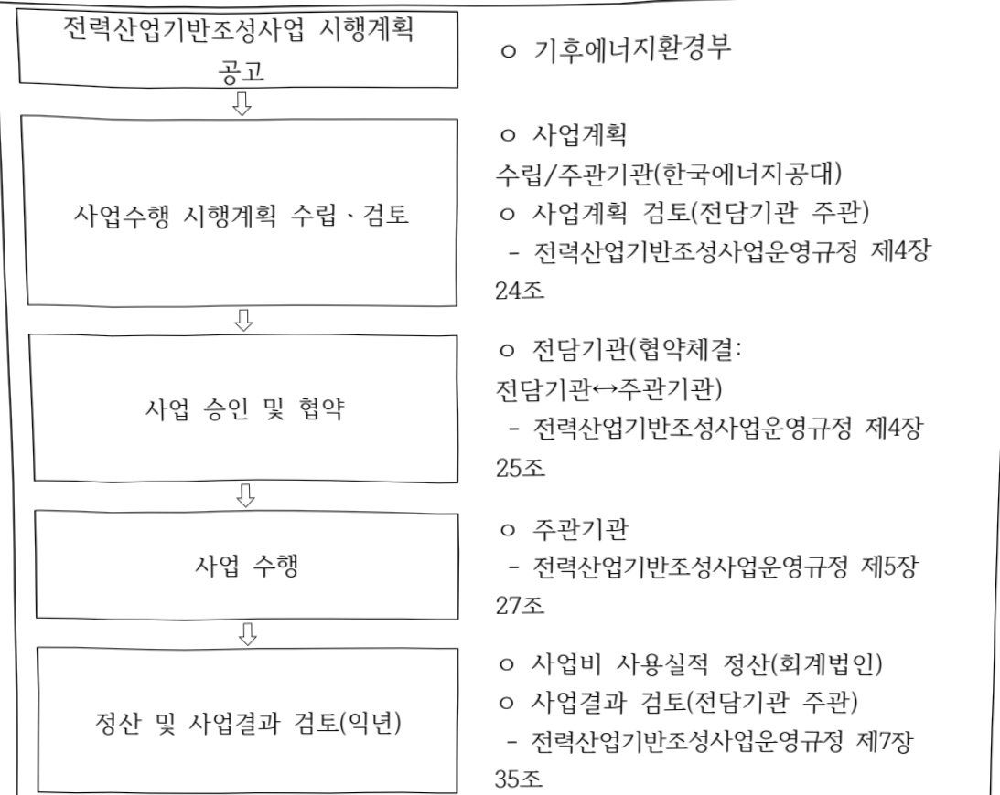

# K-그리드 인재·창업 밸리

**해당 페이지**: PDF 2599 ~ 2608 쪽 해당

**부처**: 기후에너지환경부
**분야**: 산업·중소기업 및 에너지
**회계유형**: 기금
**2026 확정예산**: 24500.0 백만원
**전년대비 증감률**: None%
**AI 도메인**: 건설/스마트시티

---

<table border=1 style='margin: auto; word-wrap: break-word;'><tr><td rowspan="3"></td><td colspan="5">2024</td><td colspan="8">2025</td><td rowspan="3">2026예산</td></tr><tr><td rowspan="2">예산액(추경)</td><td rowspan="2">예산현액</td><td rowspan="2">집행액[실질행액]</td><td rowspan="2">이월액</td><td rowspan="2">불용액</td><td colspan="2">본예산</td><td rowspan="2">예산현액</td><td rowspan="2">집행액[실질행액]</td><td colspan="2">전년도이월액제외</td><td rowspan="2">이월예산액</td><td rowspan="2">불용예산</td></tr><tr><td style='text-align: center; word-wrap: break-word;'>예산현액</td><td style='text-align: center; word-wrap: break-word;'>집행액[실질행액]</td><td style='text-align: center; word-wrap: break-word;'>계획현액</td><td style='text-align: center; word-wrap: break-word;'>집행액[실질행액]</td></tr><tr><td style='text-align: center; word-wrap: break-word;'>○ 기능별 분류(합계)</td><td style='text-align: center; word-wrap: break-word;'>-</td><td style='text-align: center; word-wrap: break-word;'>-</td><td style='text-align: center; word-wrap: break-word;'>-</td><td style='text-align: center; word-wrap: break-word;'>-</td><td style='text-align: center; word-wrap: break-word;'>-</td><td style='text-align: center; word-wrap: break-word;'>-</td><td style='text-align: center; word-wrap: break-word;'>-</td><td style='text-align: center; word-wrap: break-word;'>-</td><td style='text-align: center; word-wrap: break-word;'>-</td><td style='text-align: center; word-wrap: break-word;'>-</td><td style='text-align: center; word-wrap: break-word;'>-</td><td style='text-align: center; word-wrap: break-word;'>-</td><td style='text-align: center; word-wrap: break-word;'>-</td><td style='text-align: center; word-wrap: break-word;'>24,500</td></tr><tr><td style='text-align: center; word-wrap: break-word;'>• 분산에너지 실증클러스터 구축</td><td style='text-align: center; word-wrap: break-word;'>-</td><td style='text-align: center; word-wrap: break-word;'>-</td><td style='text-align: center; word-wrap: break-word;'>-</td><td style='text-align: center; word-wrap: break-word;'>-</td><td style='text-align: center; word-wrap: break-word;'>-</td><td style='text-align: center; word-wrap: break-word;'>-</td><td style='text-align: center; word-wrap: break-word;'>-</td><td style='text-align: center; word-wrap: break-word;'>-</td><td style='text-align: center; word-wrap: break-word;'>-</td><td style='text-align: center; word-wrap: break-word;'>-</td><td style='text-align: center; word-wrap: break-word;'>-</td><td style='text-align: center; word-wrap: break-word;'>-</td><td style='text-align: center; word-wrap: break-word;'>-</td><td style='text-align: center; word-wrap: break-word;'>14,500</td></tr><tr><td style='text-align: center; word-wrap: break-word;'>• 글로벌 K-에너지 스타트업 인재양성 인턴쉽 추진</td><td style='text-align: center; word-wrap: break-word;'>-</td><td style='text-align: center; word-wrap: break-word;'>-</td><td style='text-align: center; word-wrap: break-word;'>-</td><td style='text-align: center; word-wrap: break-word;'>-</td><td style='text-align: center; word-wrap: break-word;'>-</td><td style='text-align: center; word-wrap: break-word;'>-</td><td style='text-align: center; word-wrap: break-word;'>-</td><td style='text-align: center; word-wrap: break-word;'>-</td><td style='text-align: center; word-wrap: break-word;'>-</td><td style='text-align: center; word-wrap: break-word;'>-</td><td style='text-align: center; word-wrap: break-word;'>-</td><td style='text-align: center; word-wrap: break-word;'>-</td><td style='text-align: center; word-wrap: break-word;'>-</td><td style='text-align: center; word-wrap: break-word;'>1,000</td></tr><tr><td style='text-align: center; word-wrap: break-word;'>• 우수 벤처기업유치 및 글로벌공동연구</td><td style='text-align: center; word-wrap: break-word;'>-</td><td style='text-align: center; word-wrap: break-word;'>-</td><td style='text-align: center; word-wrap: break-word;'>-</td><td style='text-align: center; word-wrap: break-word;'>-</td><td style='text-align: center; word-wrap: break-word;'>-</td><td style='text-align: center; word-wrap: break-word;'>-</td><td style='text-align: center; word-wrap: break-word;'>-</td><td style='text-align: center; word-wrap: break-word;'>-</td><td style='text-align: center; word-wrap: break-word;'>-</td><td style='text-align: center; word-wrap: break-word;'>-</td><td style='text-align: center; word-wrap: break-word;'>-</td><td style='text-align: center; word-wrap: break-word;'>-</td><td style='text-align: center; word-wrap: break-word;'>-</td><td style='text-align: center; word-wrap: break-word;'>2,350</td></tr><tr><td style='text-align: center; word-wrap: break-word;'>• 에너지 창업지원프로그램 운영</td><td style='text-align: center; word-wrap: break-word;'>-</td><td style='text-align: center; word-wrap: break-word;'>-</td><td style='text-align: center; word-wrap: break-word;'>-</td><td style='text-align: center; word-wrap: break-word;'>-</td><td style='text-align: center; word-wrap: break-word;'>-</td><td style='text-align: center; word-wrap: break-word;'>-</td><td style='text-align: center; word-wrap: break-word;'>-</td><td style='text-align: center; word-wrap: break-word;'>-</td><td style='text-align: center; word-wrap: break-word;'>-</td><td style='text-align: center; word-wrap: break-word;'>-</td><td style='text-align: center; word-wrap: break-word;'>-</td><td style='text-align: center; word-wrap: break-word;'>-</td><td style='text-align: center; word-wrap: break-word;'>-</td><td style='text-align: center; word-wrap: break-word;'>1,650</td></tr><tr><td style='text-align: center; word-wrap: break-word;'>• 고전력반도체 실증 인프라 구축</td><td style='text-align: center; word-wrap: break-word;'>-</td><td style='text-align: center; word-wrap: break-word;'>-</td><td style='text-align: center; word-wrap: break-word;'>-</td><td style='text-align: center; word-wrap: break-word;'>-</td><td style='text-align: center; word-wrap: break-word;'>-</td><td style='text-align: center; word-wrap: break-word;'>-</td><td style='text-align: center; word-wrap: break-word;'>-</td><td style='text-align: center; word-wrap: break-word;'>-</td><td style='text-align: center; word-wrap: break-word;'>-</td><td style='text-align: center; word-wrap: break-word;'>-</td><td style='text-align: center; word-wrap: break-word;'>-</td><td style='text-align: center; word-wrap: break-word;'>-</td><td style='text-align: center; word-wrap: break-word;'>-</td><td style='text-align: center; word-wrap: break-word;'>5,000</td></tr><tr><td style='text-align: center; word-wrap: break-word;'>○ 비목별 분류(합계)</td><td style='text-align: center; word-wrap: break-word;'>-</td><td style='text-align: center; word-wrap: break-word;'>-</td><td style='text-align: center; word-wrap: break-word;'>-</td><td style='text-align: center; word-wrap: break-word;'>-</td><td style='text-align: center; word-wrap: break-word;'>-</td><td style='text-align: center; word-wrap: break-word;'>-</td><td style='text-align: center; word-wrap: break-word;'>-</td><td style='text-align: center; word-wrap: break-word;'>-</td><td style='text-align: center; word-wrap: break-word;'>-</td><td style='text-align: center; word-wrap: break-word;'>-</td><td style='text-align: center; word-wrap: break-word;'>-</td><td style='text-align: center; word-wrap: break-word;'>-</td><td style='text-align: center; word-wrap: break-word;'>-</td><td style='text-align: center; word-wrap: break-word;'>24,500</td></tr><tr><td style='text-align: center; word-wrap: break-word;'>• 사 업 출 연 금</td><td style='text-align: center; word-wrap: break-word;'>-</td><td style='text-align: center; word-wrap: break-word;'>-</td><td style='text-align: center; word-wrap: break-word;'>-</td><td style='text-align: center; word-wrap: break-word;'>-</td><td style='text-align: center; word-wrap: break-word;'>-</td><td style='text-align: center; word-wrap: break-word;'>-</td><td style='text-align: center; word-wrap: break-word;'>-</td><td style='text-align: center; word-wrap: break-word;'>-</td><td style='text-align: center; word-wrap: break-word;'>-</td><td style='text-align: center; word-wrap: break-word;'>-</td><td style='text-align: center; word-wrap: break-word;'>-</td><td style='text-align: center; word-wrap: break-word;'>-</td><td style='text-align: center; word-wrap: break-word;'>-</td><td style='text-align: center; word-wrap: break-word;'>24,500</td></tr></table>

(단위: 백만원)

□ 기능별(내역사업별), 목별 계획 내역

정부조직 개편으로 산업통상부 소관 세부인 ‘K-그리드 인재·창업 밸리 조성’ 사업(2026년 신규)이 기후에너지환경부 소관 세부사업인 ‘K-그리드 인재·창업 밸리 조성’사업으로 이관(전력산업기반기금 → 전력산업기반기금)

(단위: 백만원)

<0|관 내역>

<table border=1 style='margin: auto; word-wrap: break-word;'><tr><td rowspan="2">목명</td><td rowspan="2">2024년 결산</td><td colspan="2">2025년 예산</td><td colspan="2">2026년</td><td rowspan="2">증감(B-A)</td><td rowspan="2">(B-A)/A</td></tr><tr><td style='text-align: center; word-wrap: break-word;'>본예산(A)</td><td style='text-align: center; word-wrap: break-word;'>추경</td><td style='text-align: center; word-wrap: break-word;'>정부안</td><td style='text-align: center; word-wrap: break-word;'>확정(B)</td></tr><tr><td style='text-align: center; word-wrap: break-word;'>K-그리드 인재·창업 밸리 조성</td><td style='text-align: center; word-wrap: break-word;'>-</td><td style='text-align: center; word-wrap: break-word;'>-</td><td style='text-align: center; word-wrap: break-word;'>-</td><td style='text-align: center; word-wrap: break-word;'>24,500</td><td style='text-align: center; word-wrap: break-word;'>24,500</td><td style='text-align: center; word-wrap: break-word;'>24,500</td><td style='text-align: center; word-wrap: break-word;'>순증</td></tr></table>

(단위: 백만원, %)

가.지출계획 총괄표

---

<table border=1 style='margin: auto; word-wrap: break-word;'><tr><td rowspan="3"></td><td colspan="4">2024</td><td colspan="8">2025</td><td style='text-align: center; word-wrap: break-word;'>2026예산</td></tr><tr><td rowspan="2">예산액(추정)</td><td rowspan="2">예산현액</td><td rowspan="2">집행액[실집행액]</td><td rowspan="2">이월액</td><td rowspan="2">불용액</td><td colspan="2">본예산</td><td rowspan="2">예산현액</td><td rowspan="2">집행액[실집행액]</td><td colspan="2">전년도이월액제외</td><td rowspan="2">이월예상액</td><td rowspan="2">불용예상액</td></tr><tr><td style='text-align: center; word-wrap: break-word;'>예산현액</td><td style='text-align: center; word-wrap: break-word;'>집행액[실집행액]</td><td style='text-align: center; word-wrap: break-word;'>계획현액</td><td style='text-align: center; word-wrap: break-word;'>집행액[실집행액]</td></tr><tr><td style='text-align: center; word-wrap: break-word;'>(350-02)</td><td style='text-align: center; word-wrap: break-word;'></td><td style='text-align: center; word-wrap: break-word;'></td><td style='text-align: center; word-wrap: break-word;'></td><td style='text-align: center; word-wrap: break-word;'></td><td style='text-align: center; word-wrap: break-word;'></td><td style='text-align: center; word-wrap: break-word;'></td><td style='text-align: center; word-wrap: break-word;'></td><td style='text-align: center; word-wrap: break-word;'></td><td style='text-align: center; word-wrap: break-word;'></td><td style='text-align: center; word-wrap: break-word;'></td><td style='text-align: center; word-wrap: break-word;'></td><td style='text-align: center; word-wrap: break-word;'></td><td style='text-align: center; word-wrap: break-word;'></td></tr><tr><td style='text-align: center; word-wrap: break-word;'>○ 기능비목별 분류합계</td><td style='text-align: center; word-wrap: break-word;'>-</td><td style='text-align: center; word-wrap: break-word;'>-</td><td style='text-align: center; word-wrap: break-word;'>-</td><td style='text-align: center; word-wrap: break-word;'>-</td><td style='text-align: center; word-wrap: break-word;'>-</td><td style='text-align: center; word-wrap: break-word;'>-</td><td style='text-align: center; word-wrap: break-word;'>-</td><td style='text-align: center; word-wrap: break-word;'>-</td><td style='text-align: center; word-wrap: break-word;'>-</td><td style='text-align: center; word-wrap: break-word;'>-</td><td style='text-align: center; word-wrap: break-word;'>-</td><td style='text-align: center; word-wrap: break-word;'>-</td><td style='text-align: center; word-wrap: break-word;'>24,500</td></tr><tr><td style='text-align: center; word-wrap: break-word;'>· 분산에너지 실증클러스터 구축-사 업 출 연 금(350-02)· 글로벌 K-에너지 스타트업 인재양성 인턴쉽추진-사 업 출 연 금(350-02)· 우수 벤처기업유치 및 글로벌공동연구-사 업 출 연 금(350-02)· 에너지 창업지원프로그램 운영-사 업 출 연 금(350-02)· 고전력반도체 실증 인프라 구축-사 업 출 연 금(350-02)</td><td style='text-align: center; word-wrap: break-word;'>-</td><td style='text-align: center; word-wrap: break-word;'>-</td><td style='text-align: center; word-wrap: break-word;'>-</td><td style='text-align: center; word-wrap: break-word;'>-</td><td style='text-align: center; word-wrap: break-word;'>-</td><td style='text-align: center; word-wrap: break-word;'>-</td><td style='text-align: center; word-wrap: break-word;'>-</td><td style='text-align: center; word-wrap: break-word;'>-</td><td style='text-align: center; word-wrap: break-word;'>-</td><td style='text-align: center; word-wrap: break-word;'>-</td><td style='text-align: center; word-wrap: break-word;'>-</td><td style='text-align: center; word-wrap: break-word;'>14,50014,5001,0002,3502,3501,6501,6505,0005,000</td><td style='text-align: center; word-wrap: break-word;'></td></tr></table>

### 나. 사업설명자료

## 1 ) 사업목적·내용

(K-그리드 인재·창업 밸리 조성) 한국에너지공대를 중심으로 분산 에너지 거점 지역인 전남·광주를 차세대 전력망의 사업화, 제도화, 국제화를 통합 구현하는 국가 전략 플랫폼으로 조성하여, 전력신산업 혁신 연구와 창업생태계 활성화를 통해 분산전력망 혁신사례 확산 및 지역 경제 진흥 도모

- (분산에너지 실증 클러스터 구축) 차세대 분산에너지를 중심으로한 전력망 운영 모의 통합 시스템 구축을 통해 재생에너지 기반 VPP와 디지털 트런을 활용한 한국형 차세대 전력망 실증 및 기반 기술 개발 지원

- (글로벌 K-에너지 스타트업 인재양성 인턴쉽 추진) 해외 주요 혁신 에너지기업, 스타트업 및 기관에서 인턴십을 수행하며 최신 기술 및 혁신 비즈니스 모델

---

을 직접 경험할 수 있도록 지원하여 글로벌에너지 산업을 이끌어갈 K-에너지

분야 청년 스타트업 인재 발굴 및 육성

- (우수 벤처기업 유치 및 글로벌 공동연구) 차세대 전력망 관련 국내외 유망 스타트

업의 지역 유치 활동 및 국제 공동연구 추진을 통해 전력망 혁신 창업 생태계

구축

- (에너지 창업지원 프로그램 운영) 한국에너지공대 중심의 오픈 플랫폼 구축을

통한 에너지 기업·연구기관 협업 및 청년 창업가 양성으로 차세대 전력망 신산

업 육성

- (고전력반도체 실증 인프라 구축) 차세대 분산 전력망에 적용될 고전력반도체

의 장시간 수명 보증을 위한 가속 수명 시험 평가 인프라 구축과 기업 평가 지

원

## 2 ) 사업개요

☐ 사업근거 및 추진경위

① 법령상 근거 및 조항 적시

<table border=1 style='margin: auto; word-wrap: break-word;'><tr><td style='text-align: center; word-wrap: break-word;'>「한국에너지공과대학교법」제11조(출연금)</td></tr><tr><td style='text-align: center; word-wrap: break-word;'>① 국가·지방자치단체 또는 「공공기관의 운영에 관한 법률」 제4조에 따른 공공기관은 한국에너지공대에 출연금을 지급할 수 있다.</td></tr><tr><td style='text-align: center; word-wrap: break-word;'>「전기사업법」제49조(기금의 사용) 기금은 다음 각 호의 사업을 위하여 사용한다.</td></tr><tr><td style='text-align: center; word-wrap: break-word;'>12. 그 밖에 대통령령으로 정하는 전력산업과 관련한 중요 사업</td></tr><tr><td style='text-align: center; word-wrap: break-word;'>「전기사업법 시행령」제34조(기금의 사용) 법 제49조제1호에서 “대통령령으로 정하는 전력산업과 관련한 중요 사업”이란 다음 각 호의 사업을 말한다.</td></tr><tr><td style='text-align: center; word-wrap: break-word;'>4. 전력산업 및 전력산업 관련 융복합 분야 전문인력의 양성 및 관리</td></tr><tr><td style='text-align: center; word-wrap: break-word;'>5. 전력산업 분야의 시험·평가 및 검사시설의 구축</td></tr><tr><td style='text-align: center; word-wrap: break-word;'>7. 전력산업 분야 개발기술의 사업화 지원사업</td></tr></table>

② 추진경위 - 사업 시작년도, 추진배경, 부처별 중점과제, 대통령 공약사항 등

- '17.7월 정부 「국정운영 5개년 계획」에 한전공대 설립 추진 반영

- '19.7월 균형위 '한전공대 설립 기본계획' 의결 및 '19.8월 국무회의 보고(관계부처 합

---

동)

- '20.4월: 한전공대 캠퍼스 종합계획 수립

- '21.3월: 「한국에너지공과대학교법」국회 본회의 통과 및 공포('21.4.1. 공포, '21.5.2. 시행)

- '21.5월: 한국에너지공과대학교 설립 등기

- '22.3월: 한국에너지공과대학교 개교

- '24.6월: 「분산에너지활성화특별법」 시행

- '25.7월: "한국형 차세대 전력망 구축계획" 발표,

- '25.8월: “한국형 차세대 전력망 거버넌스” 출범

## □ 주요내용

① 사업규모

- 총사업비 : 490억원

- 사업기간 : '26년 ~ '28년

- 최근 5년 간 투입된 사업비(예산액기준, 추경편성한 연도에는 추경포함)

(단위:백만원)

<table border=1 style='margin: auto; word-wrap: break-word;'><tr><td style='text-align: center; word-wrap: break-word;'>$ \underline{\text{연도}} $</td><td style='text-align: center; word-wrap: break-word;'>2022</td><td style='text-align: center; word-wrap: break-word;'>2023</td><td style='text-align: center; word-wrap: break-word;'>2024</td><td style='text-align: center; word-wrap: break-word;'>2025</td><td style='text-align: center; word-wrap: break-word;'>2026</td></tr><tr><td style='text-align: center; word-wrap: break-word;'>사업비</td><td style='text-align: center; word-wrap: break-word;'>-</td><td style='text-align: center; word-wrap: break-word;'>-</td><td style='text-align: center; word-wrap: break-word;'>-</td><td style='text-align: center; word-wrap: break-word;'>-</td><td style='text-align: center; word-wrap: break-word;'>24,500</td></tr></table>

-기타: 해당없음

② 사업추진체계

- 사업시행방법 : 출연

- 사업시행주체 : 한국에너지공과대학교

- 사업 수혜자 : 에너지산업 창업기업 및 중소·중견기업, 대학 및 연구기관

- 보조, 융자, 출연, 출자 등의 경우 보조·융자 등 지원 비율 및 법적근거

---

<table border=1 style='margin: auto; word-wrap: break-word;'><tr><td style='text-align: center; word-wrap: break-word;'>내역사업명</td><td style='text-align: center; word-wrap: break-word;'>구분</td><td style='text-align: center; word-wrap: break-word;'>피보조·피출연 등 기관명</td><td style='text-align: center; word-wrap: break-word;'>지원 금액 (2026계획)</td><td style='text-align: center; word-wrap: break-word;'>지원 비율(%)</td><td style='text-align: center; word-wrap: break-word;'>보조율 법적근거 (해당 조항)</td></tr><tr><td style='text-align: center; word-wrap: break-word;'>분산에너지 실증 클러스터 구축</td><td style='text-align: center; word-wrap: break-word;'>출연</td><td style='text-align: center; word-wrap: break-word;'>한국 에너지공대</td><td style='text-align: center; word-wrap: break-word;'>14,500</td><td style='text-align: center; word-wrap: break-word;'>100%</td><td style='text-align: center; word-wrap: break-word;'>한국에너지공과대학교법 제11조 전기사업법 제49조 및 시행령 제34조</td></tr><tr><td style='text-align: center; word-wrap: break-word;'>글로벌 K-에너지 스타트업 인재양성 인턴쉽 추진</td><td style='text-align: center; word-wrap: break-word;'>출연</td><td style='text-align: center; word-wrap: break-word;'>한국 에너지공대</td><td style='text-align: center; word-wrap: break-word;'>1,000</td><td style='text-align: center; word-wrap: break-word;'>100%</td><td style='text-align: center; word-wrap: break-word;'>한국에너지공과대학교법 제11조 전기사업법 제49조 및 시행령 제34조</td></tr><tr><td style='text-align: center; word-wrap: break-word;'>우수 벤처기업 유치 및 글로벌 공동연구</td><td style='text-align: center; word-wrap: break-word;'>출연</td><td style='text-align: center; word-wrap: break-word;'>한국 에너지공대</td><td style='text-align: center; word-wrap: break-word;'>2,350</td><td style='text-align: center; word-wrap: break-word;'>100%</td><td style='text-align: center; word-wrap: break-word;'>한국에너지공과대학교법 제11조 전기사업법 제49조 및 시행령 제34조</td></tr><tr><td style='text-align: center; word-wrap: break-word;'>에너지 창업지원 프로그램 운영</td><td style='text-align: center; word-wrap: break-word;'>출연</td><td style='text-align: center; word-wrap: break-word;'>한국 에너지공대</td><td style='text-align: center; word-wrap: break-word;'>1,650</td><td style='text-align: center; word-wrap: break-word;'>100%</td><td style='text-align: center; word-wrap: break-word;'>한국에너지공과대학교법 제11조 전기사업법 제49조 및 시행령 제34조</td></tr><tr><td style='text-align: center; word-wrap: break-word;'>고전력 반도체 실증 인프라 구축</td><td style='text-align: center; word-wrap: break-word;'>출연</td><td style='text-align: center; word-wrap: break-word;'>한국 에너지공대</td><td style='text-align: center; word-wrap: break-word;'>5,000</td><td style='text-align: center; word-wrap: break-word;'>100%</td><td style='text-align: center; word-wrap: break-word;'>한국에너지공과대학교법 제11조 전기사업법 제49조 및 시행령 제34조</td></tr></table>

---

## 3 ) 2026년도 계획 산출 근거

① K-그리드 인재·창업 밸리 조성 : (2026 예산) 24,500백만원

:(25)0,000백만원→(26예산)24,500백만원

(요구) 오픈 플랫폼 구축을 통한 에너지 기업·연구기관 협업 및 청년 창업가 양성을 통한 차세대 전력망 신산업 육성 및 차세대 분산에너지 중심 전력망 운영 모의 통합 시스템 구축 및 실증 및 계통 연계 운영 강화를 위하여 24,500백만원 요구

- (산출) 분산에너지 실증 클러스터 구축 14,500배만원

글로벌 K-에너지 스타트업 인재양성 인턴십 추진 1,000백만원

우수 벤처기업 유치 및 글로벌 공동연구 2,350백만원

에너지 창업지원 프로그램 운영 1,650백만원

고전력반도체 실증 인프라 구축 5,000백만원

2025년도 계획 및 2026년도 계획 산출 세부내역 비교

<table border=1 style='margin: auto; word-wrap: break-word;'><tr><td colspan="2">2025년 계획</td><td colspan="2">2026년 계획</td></tr><tr><td style='text-align: center; word-wrap: break-word;'>예산</td><td style='text-align: center; word-wrap: break-word;'>산출내역</td><td style='text-align: center; word-wrap: break-word;'>예산</td><td style='text-align: center; word-wrap: break-word;'>산출내역</td></tr><tr><td style='text-align: center; word-wrap: break-word;'>-</td><td style='text-align: center; word-wrap: break-word;'>-</td><td style='text-align: center; word-wrap: break-word;'>24,500</td><td style='text-align: center; word-wrap: break-word;'>&lt; K·그리드 인재·창업 빨리 조성 24,500백만원 &gt; 가. 분산에너지 실증 클러스터 구축(14,500백만원) · 실증 클러스터 구축 29,000백만원×50.0%(1차년도)=14,500백만원 나. 글로벌 K·에너지 스타트업 인재양성 인턴쉽 주진(1,000백만원) · 글로벌 K·에너지 스타트업 인재양성 인턴쉽 3,000백만원 ×33.3%(1차년도)=1,000백만원 다. 우수 벤처기업 유치 및 글로벌 공동연구(2,350백만원) · 우수 벤처기업 유치 및 글로벌 공동연구 7,050백만원×33.3%(1차년도)=2,350백만원 라. 에너지 창업지원 프로그램 운영(1,650백만원) · 에너지 창업지원 프로그램 운영 4,950백만원×33.3%(1차년도)=1,650백만원 마. 고전력반도체 실증 인프라 구축(5,000백만원) · 고전력반도체 실증 인프라 구축 5,000백만원×100.0%=5,000백만원</td></tr></table>

## 4 ) 사업효과

□ 사업영향, 산출물 성과지표 등

① 2022~2026년도 성과계획서 상 성과지표 및 최근 5년간 성과 달성도

---

<table border=1 style='margin: auto; word-wrap: break-word;'><tr><td style='text-align: center; word-wrap: break-word;'>성과지표</td><td style='text-align: center; word-wrap: break-word;'>구분</td><td style='text-align: center; word-wrap: break-word;'>2022</td><td style='text-align: center; word-wrap: break-word;'>2023</td><td style='text-align: center; word-wrap: break-word;'>2024</td><td style='text-align: center; word-wrap: break-word;'>2025</td><td style='text-align: center; word-wrap: break-word;'>2026</td><td style='text-align: center; word-wrap: break-word;'>2026 목표치산출근거</td><td style='text-align: center; word-wrap: break-word;'>측정산식(또는 측정방법)</td><td style='text-align: center; word-wrap: break-word;'>자료수집방법(또는 자료출처)</td></tr><tr><td rowspan="3">창업교육 참여 인원 수(단위: 명)</td><td style='text-align: center; word-wrap: break-word;'>목표</td><td style='text-align: center; word-wrap: break-word;'>-</td><td style='text-align: center; word-wrap: break-word;'>-</td><td style='text-align: center; word-wrap: break-word;'>-</td><td style='text-align: center; word-wrap: break-word;'>-</td><td style='text-align: center; word-wrap: break-word;'>40</td><td rowspan="3">창업관련 교육과정 및 예산 등 고려신규목표 설정</td><td rowspan="3">창업 프로그램 참여 학생 수</td><td rowspan="3">사업결과 보고서</td></tr><tr><td style='text-align: center; word-wrap: break-word;'>실적</td><td style='text-align: center; word-wrap: break-word;'>-</td><td style='text-align: center; word-wrap: break-word;'>-</td><td style='text-align: center; word-wrap: break-word;'>-</td><td style='text-align: center; word-wrap: break-word;'>-</td><td style='text-align: center; word-wrap: break-word;'>-</td></tr><tr><td style='text-align: center; word-wrap: break-word;'>달성도</td><td style='text-align: center; word-wrap: break-word;'>-</td><td style='text-align: center; word-wrap: break-word;'>-</td><td style='text-align: center; word-wrap: break-word;'>-</td><td style='text-align: center; word-wrap: break-word;'>-</td><td style='text-align: center; word-wrap: break-word;'>-</td></tr><tr><td rowspan="3">글로벌 공동연구 수행 건수(단위: 건)</td><td style='text-align: center; word-wrap: break-word;'>목표</td><td style='text-align: center; word-wrap: break-word;'>-</td><td style='text-align: center; word-wrap: break-word;'>-</td><td style='text-align: center; word-wrap: break-word;'>-</td><td style='text-align: center; word-wrap: break-word;'></td><td style='text-align: center; word-wrap: break-word;'>2</td><td rowspan="3">사업 첫해협력기관 발굴 등 고려</td><td rowspan="3">해외 우수기관과 공동연구 수행 건수</td><td rowspan="3">사업결과 보고서</td></tr><tr><td style='text-align: center; word-wrap: break-word;'>실적</td><td style='text-align: center; word-wrap: break-word;'>-</td><td style='text-align: center; word-wrap: break-word;'>-</td><td style='text-align: center; word-wrap: break-word;'>-</td><td style='text-align: center; word-wrap: break-word;'>-</td><td style='text-align: center; word-wrap: break-word;'>-</td></tr><tr><td style='text-align: center; word-wrap: break-word;'>달성도</td><td style='text-align: center; word-wrap: break-word;'>-</td><td style='text-align: center; word-wrap: break-word;'>-</td><td style='text-align: center; word-wrap: break-word;'>-</td><td style='text-align: center; word-wrap: break-word;'>-</td><td style='text-align: center; word-wrap: break-word;'>-</td></tr></table>

② 성과지표 이외의 연도별 사업추진 경과 및 실적 : 해당없음

③ 향후(2026년도 이후) 기대효과

- 한국에너지공대 중심의 오픈 플랫폼 구축을 통한 에너지 기업·연구기관 협업 및 청년 창업가 양성으로 차세대 전력망 신산업 육성

- 차세대 분산에너지 중심 전력망 운영 모의 통합 시스템 구축을 통해 재생에너지 기반 VPP와 디지털 트런을 활용한 한국형 차세대 전력망 구현 기술 실증 및 계통 연계 기술 개발 지원

5) 타당성조사 및 예비타당성조사 시행여부 및 결과 요지 : 해당없음

6) 총사업비 대상사업 여부 및 내역 : 해당없음

## 7 ) 사업 집행절차

---

8) 중기재정계획 상 연도별 투자계획 및 추진경과

(단위: 백만원)

<table border=1 style='margin: auto; word-wrap: break-word;'><tr><td colspan="6">$  \text{중기}  $ 2024 2025 2026 2027 2028 2029</td></tr><tr><td style='text-align: center; word-wrap: break-word;'>2024~2028</td><td style='text-align: center; word-wrap: break-word;'>-</td><td style='text-align: center; word-wrap: break-word;'>-</td><td style='text-align: center; word-wrap: break-word;'>-</td><td style='text-align: center; word-wrap: break-word;'>-</td><td style='text-align: center; word-wrap: break-word;'>☑</td></tr><tr><td style='text-align: center; word-wrap: break-word;'>2025~2029</td><td style='text-align: center; word-wrap: break-word;'>-</td><td style='text-align: center; word-wrap: break-word;'>24,500</td><td style='text-align: center; word-wrap: break-word;'>19,500</td><td style='text-align: center; word-wrap: break-word;'>5,000</td><td style='text-align: center; word-wrap: break-word;'>-</td></tr></table>

9) 최근 3년간 동 사업에 대한 주요 외부지적사항 및 평가, 문제점 및 대책

: 해당없음

10)향후 추진방향 및 추진계획 : 해당없음

11) 해당사업에 대한 각종 사업평가의 결과 : 해당없음

---

12) 해당사업에 대한 부처 자체평가의 결과 : 해당없음

13) 부처 건의사항 : 해당없음

다.최근 4년간 결산내역:해당없음

---

<table border=1 style='margin: auto; word-wrap: break-word;'><tr><td style='text-align: center; word-wrap: break-word;'>사 업 명</td></tr><tr><td style='text-align: center; word-wrap: break-word;'>(4) 광역상수도 안정화(5033-303)</td></tr></table>

□ 사업 코드 정보

<table border=1 style='margin: auto; word-wrap: break-word;'><tr><td style='text-align: center; word-wrap: break-word;'>구분</td><td style='text-align: center; word-wrap: break-word;'>회계</td><td style='text-align: center; word-wrap: break-word;'>소관</td><td style='text-align: center; word-wrap: break-word;'>실국(기관)</td><td style='text-align: center; word-wrap: break-word;'>계정</td><td style='text-align: center; word-wrap: break-word;'>분야</td><td style='text-align: center; word-wrap: break-word;'>부문</td></tr><tr><td style='text-align: center; word-wrap: break-word;'>코드</td><td style='text-align: center; word-wrap: break-word;'>11</td><td style='text-align: center; word-wrap: break-word;'>24</td><td style='text-align: center; word-wrap: break-word;'>물관리정책실</td><td rowspan="2"></td><td style='text-align: center; word-wrap: break-word;'>140</td><td style='text-align: center; word-wrap: break-word;'>141</td></tr><tr><td style='text-align: center; word-wrap: break-word;'>명칭</td><td style='text-align: center; word-wrap: break-word;'>일반회계</td><td style='text-align: center; word-wrap: break-word;'>환경부</td><td style='text-align: center; word-wrap: break-word;'>물이용정책관</td><td style='text-align: center; word-wrap: break-word;'>국토및지역개발</td><td style='text-align: center; word-wrap: break-word;'>수자원</td></tr></table>

<table border=1 style='margin: auto; word-wrap: break-word;'><tr><td style='text-align: center; word-wrap: break-word;'>구분</td><td style='text-align: center; word-wrap: break-word;'>프로그램</td><td style='text-align: center; word-wrap: break-word;'>단위사업</td><td style='text-align: center; word-wrap: break-word;'>세부사업</td></tr><tr><td style='text-align: center; word-wrap: break-word;'>코드</td><td style='text-align: center; word-wrap: break-word;'>5000</td><td style='text-align: center; word-wrap: break-word;'>5033</td><td style='text-align: center; word-wrap: break-word;'>303</td></tr><tr><td style='text-align: center; word-wrap: break-word;'>명칭</td><td style='text-align: center; word-wrap: break-word;'>맑은물 공급·이용(광역)</td><td style='text-align: center; word-wrap: break-word;'>광역상수도 관리</td><td style='text-align: center; word-wrap: break-word;'>광역상수도 안정화</td></tr></table>

□ 사업 성격 (공통요구자료 Ⅱ-1 작성유의사항 4. 참조, 해당하는 사항에 “○” 표시)

<table border=1 style='margin: auto; word-wrap: break-word;'><tr><td rowspan="2">신규</td><td rowspan="2">계속</td><td rowspan="2">완료</td><td rowspan="2">예비타당성 실시여부</td><td rowspan="2">총사업비 관리대상</td><td rowspan="2">총액계상 예산사업</td><td style='text-align: center; word-wrap: break-word;'>사업소관 변경정보</td></tr><tr><td style='text-align: center; word-wrap: break-word;'>2025예산 시 소관</td></tr><tr><td style='text-align: center; word-wrap: break-word;'></td><td style='text-align: center; word-wrap: break-word;'>☐</td><td style='text-align: center; word-wrap: break-word;'></td><td style='text-align: center; word-wrap: break-word;'>☐</td><td style='text-align: center; word-wrap: break-word;'>☐</td><td style='text-align: center; word-wrap: break-word;'></td><td style='text-align: center; word-wrap: break-word;'></td></tr></table>

□ 사업 지원 형태 및 지원을 (최소한 한 개는 반드시 선택하시오. 해당사항에 0 표시)

<table border=1 style='margin: auto; word-wrap: break-word;'><tr><td style='text-align: center; word-wrap: break-word;'>직접</td><td style='text-align: center; word-wrap: break-word;'>출자</td><td style='text-align: center; word-wrap: break-word;'>출연</td><td style='text-align: center; word-wrap: break-word;'>보조</td><td style='text-align: center; word-wrap: break-word;'>융자</td><td style='text-align: center; word-wrap: break-word;'>국고보조율(%)</td><td style='text-align: center; word-wrap: break-word;'>융자율(%)</td></tr><tr><td style='text-align: center; word-wrap: break-word;'></td><td style='text-align: center; word-wrap: break-word;'>○</td><td style='text-align: center; word-wrap: break-word;'></td><td style='text-align: center; word-wrap: break-word;'></td><td style='text-align: center; word-wrap: break-word;'></td><td style='text-align: center; word-wrap: break-word;'>30</td><td style='text-align: center; word-wrap: break-word;'></td></tr></table>

## ☐ 사업 담당자

<table border=1 style='margin: auto; word-wrap: break-word;'><tr><td style='text-align: center; word-wrap: break-word;'>사업명</td><td colspan="2">구분</td></tr><tr><td rowspan="3">광역상수도 안정화</td><td rowspan="2">소관부처</td><td style='text-align: center; word-wrap: break-word;'>물관리정책실 물이용정책관</td></tr><tr><td style='text-align: center; word-wrap: break-word;'>수도기획과</td></tr><tr><td style='text-align: center; word-wrap: break-word;'>사업시행주체</td><td style='text-align: center; word-wrap: break-word;'>한국수자원공사</td></tr></table>

---

### 원본 PDF 크롭 이미지

