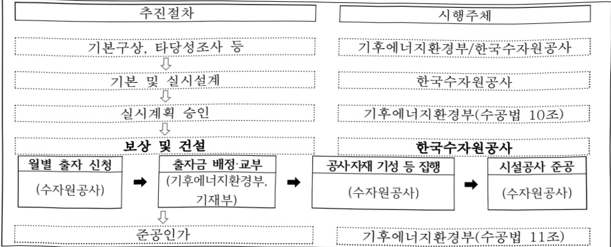

# 광역상수도 안정화

**해당 페이지**: PDF 2609 ~ 2632 쪽 해당

**부처**: 기후에너지환경부
**분야**: 국토 및 지역개발
**회계유형**: 일반회계
**2026 확정예산**: 48705.0 백만원
**전년대비 증감률**: -16.9%
**AI 도메인**: 로봇, 환경/기후, 건설/스마트시티

---

<table border=1 style='margin: auto; word-wrap: break-word;'><tr><td style='text-align: center; word-wrap: break-word;'>사 업 명</td></tr><tr><td style='text-align: center; word-wrap: break-word;'>(4) 광역상수도 안정화(5033-303)</td></tr></table>

□ 사업 코드 정보

<table border=1 style='margin: auto; word-wrap: break-word;'><tr><td style='text-align: center; word-wrap: break-word;'>구분</td><td style='text-align: center; word-wrap: break-word;'>회계</td><td style='text-align: center; word-wrap: break-word;'>소관</td><td style='text-align: center; word-wrap: break-word;'>실국(기관)</td><td style='text-align: center; word-wrap: break-word;'>계정</td><td style='text-align: center; word-wrap: break-word;'>분야</td><td style='text-align: center; word-wrap: break-word;'>부문</td></tr><tr><td style='text-align: center; word-wrap: break-word;'>코드</td><td style='text-align: center; word-wrap: break-word;'>11</td><td style='text-align: center; word-wrap: break-word;'>24</td><td style='text-align: center; word-wrap: break-word;'>물관리정책실</td><td rowspan="2"></td><td style='text-align: center; word-wrap: break-word;'>140</td><td style='text-align: center; word-wrap: break-word;'>141</td></tr><tr><td style='text-align: center; word-wrap: break-word;'>명칭</td><td style='text-align: center; word-wrap: break-word;'>일반회계</td><td style='text-align: center; word-wrap: break-word;'>환경부</td><td style='text-align: center; word-wrap: break-word;'>물이용정책관</td><td style='text-align: center; word-wrap: break-word;'>국토및지역개발</td><td style='text-align: center; word-wrap: break-word;'>수자원</td></tr></table>

<table border=1 style='margin: auto; word-wrap: break-word;'><tr><td style='text-align: center; word-wrap: break-word;'>구분</td><td style='text-align: center; word-wrap: break-word;'>프로그램</td><td style='text-align: center; word-wrap: break-word;'>단위사업</td><td style='text-align: center; word-wrap: break-word;'>세부사업</td></tr><tr><td style='text-align: center; word-wrap: break-word;'>코드</td><td style='text-align: center; word-wrap: break-word;'>5000</td><td style='text-align: center; word-wrap: break-word;'>5033</td><td style='text-align: center; word-wrap: break-word;'>303</td></tr><tr><td style='text-align: center; word-wrap: break-word;'>명칭</td><td style='text-align: center; word-wrap: break-word;'>맑은물 공급·이용(광역)</td><td style='text-align: center; word-wrap: break-word;'>광역상수도 관리</td><td style='text-align: center; word-wrap: break-word;'>광역상수도 안정화</td></tr></table>

□ 사업 성격 (공통요구자료 Ⅱ-1 작성유의사항 4. 참조, 해당하는 사항에 “○” 표시)

<table border=1 style='margin: auto; word-wrap: break-word;'><tr><td rowspan="2">신규</td><td rowspan="2">계속</td><td rowspan="2">완료</td><td rowspan="2">예비타당성 실시여부</td><td rowspan="2">총사업비 관리대상</td><td rowspan="2">총액계상 예산사업</td><td style='text-align: center; word-wrap: break-word;'>사업소관 변경정보</td></tr><tr><td style='text-align: center; word-wrap: break-word;'>2025예산 시 소관</td></tr><tr><td style='text-align: center; word-wrap: break-word;'></td><td style='text-align: center; word-wrap: break-word;'>☐</td><td style='text-align: center; word-wrap: break-word;'></td><td style='text-align: center; word-wrap: break-word;'>☐</td><td style='text-align: center; word-wrap: break-word;'>☐</td><td style='text-align: center; word-wrap: break-word;'></td><td style='text-align: center; word-wrap: break-word;'></td></tr></table>

□ 사업 지원 형태 및 지원을 (최소한 한 개는 반드시 선택하시오. 해당사항에 0 표시)

<table border=1 style='margin: auto; word-wrap: break-word;'><tr><td style='text-align: center; word-wrap: break-word;'>직접</td><td style='text-align: center; word-wrap: break-word;'>출자</td><td style='text-align: center; word-wrap: break-word;'>출연</td><td style='text-align: center; word-wrap: break-word;'>보조</td><td style='text-align: center; word-wrap: break-word;'>융자</td><td style='text-align: center; word-wrap: break-word;'>국고보조율(%)</td><td style='text-align: center; word-wrap: break-word;'>융자율(%)</td></tr><tr><td style='text-align: center; word-wrap: break-word;'></td><td style='text-align: center; word-wrap: break-word;'>○</td><td style='text-align: center; word-wrap: break-word;'></td><td style='text-align: center; word-wrap: break-word;'></td><td style='text-align: center; word-wrap: break-word;'></td><td style='text-align: center; word-wrap: break-word;'>30</td><td style='text-align: center; word-wrap: break-word;'></td></tr></table>

## ☐ 사업 담당자

<table border=1 style='margin: auto; word-wrap: break-word;'><tr><td style='text-align: center; word-wrap: break-word;'>사업명</td><td colspan="2">구분</td></tr><tr><td rowspan="3">광역상수도 안정화</td><td rowspan="2">소관부처</td><td style='text-align: center; word-wrap: break-word;'>물관리정책실 물이용정책관</td></tr><tr><td style='text-align: center; word-wrap: break-word;'>수도기획과</td></tr><tr><td style='text-align: center; word-wrap: break-word;'>사업시행주체</td><td style='text-align: center; word-wrap: break-word;'>한국수자원공사</td></tr></table>

---

<table border=1 style='margin: auto; word-wrap: break-word;'><tr><td rowspan="2"></td><td colspan="5">2024</td><td colspan="6">2025</td><td rowspan="2">2026예산</td></tr><tr><td style='text-align: center; word-wrap: break-word;'>예산액(추경)</td><td style='text-align: center; word-wrap: break-word;'>예산현액</td><td style='text-align: center; word-wrap: break-word;'>집행액[실집행액]</td><td style='text-align: center; word-wrap: break-word;'>이럴액</td><td style='text-align: center; word-wrap: break-word;'>불용액</td><td style='text-align: center; word-wrap: break-word;'>본예산</td><td style='text-align: center; word-wrap: break-word;'>예산현액</td><td style='text-align: center; word-wrap: break-word;'>집행액[실집행액]</td><td style='text-align: center; word-wrap: break-word;'>전년도이럴액제외</td><td style='text-align: center; word-wrap: break-word;'>이럴예산현액</td><td style='text-align: center; word-wrap: break-word;'>불용예산</td></tr><tr><td style='text-align: center; word-wrap: break-word;'>○ 기능별 분류(합계)</td><td style='text-align: center; word-wrap: break-word;'>42,485</td><td style='text-align: center; word-wrap: break-word;'>42,485</td><td style='text-align: center; word-wrap: break-word;'>37,478</td><td style='text-align: center; word-wrap: break-word;'>-</td><td style='text-align: center; word-wrap: break-word;'>5,007</td><td style='text-align: center; word-wrap: break-word;'>58,634</td><td style='text-align: center; word-wrap: break-word;'>58,634</td><td style='text-align: center; word-wrap: break-word;'>58,634</td><td style='text-align: center; word-wrap: break-word;'>58,634</td><td style='text-align: center; word-wrap: break-word;'>58,634</td><td style='text-align: center; word-wrap: break-word;'>-</td><td style='text-align: center; word-wrap: break-word;'>48,705</td></tr><tr><td style='text-align: center; word-wrap: break-word;'>· 금강광역(2차)노후관 개량</td><td style='text-align: center; word-wrap: break-word;'>-</td><td style='text-align: center; word-wrap: break-word;'>-</td><td style='text-align: center; word-wrap: break-word;'>-</td><td style='text-align: center; word-wrap: break-word;'>-</td><td style='text-align: center; word-wrap: break-word;'>-</td><td style='text-align: center; word-wrap: break-word;'>392</td><td style='text-align: center; word-wrap: break-word;'>392</td><td style='text-align: center; word-wrap: break-word;'>392</td><td style='text-align: center; word-wrap: break-word;'>392</td><td style='text-align: center; word-wrap: break-word;'>-</td><td style='text-align: center; word-wrap: break-word;'>-</td><td style='text-align: center; word-wrap: break-word;'>-</td></tr><tr><td style='text-align: center; word-wrap: break-word;'>· 수도권 I)광역상수도노후관 개량(2차)</td><td style='text-align: center; word-wrap: break-word;'>3,866</td><td style='text-align: center; word-wrap: break-word;'>3,866</td><td style='text-align: center; word-wrap: break-word;'>3,866[3,866]</td><td style='text-align: center; word-wrap: break-word;'>-</td><td style='text-align: center; word-wrap: break-word;'>-</td><td style='text-align: center; word-wrap: break-word;'>4,668</td><td style='text-align: center; word-wrap: break-word;'>4,668</td><td style='text-align: center; word-wrap: break-word;'>4,668</td><td style='text-align: center; word-wrap: break-word;'>4,668</td><td style='text-align: center; word-wrap: break-word;'>-</td><td style='text-align: center; word-wrap: break-word;'>-</td><td style='text-align: center; word-wrap: break-word;'>1,809</td></tr><tr><td style='text-align: center; word-wrap: break-word;'>· 남강망광역1단계노후관 개량</td><td style='text-align: center; word-wrap: break-word;'>5,502</td><td style='text-align: center; word-wrap: break-word;'>2,500</td><td style='text-align: center; word-wrap: break-word;'>-</td><td style='text-align: center; word-wrap: break-word;'>-</td><td style='text-align: center; word-wrap: break-word;'>2,500</td><td style='text-align: center; word-wrap: break-word;'>11,442</td><td style='text-align: center; word-wrap: break-word;'>11,442</td><td style='text-align: center; word-wrap: break-word;'>11,442</td><td style='text-align: center; word-wrap: break-word;'>11,442</td><td style='text-align: center; word-wrap: break-word;'>-</td><td style='text-align: center; word-wrap: break-word;'>-</td><td style='text-align: center; word-wrap: break-word;'>1,000</td></tr><tr><td style='text-align: center; word-wrap: break-word;'>· 대청망광역 1단계노후관 개량</td><td style='text-align: center; word-wrap: break-word;'>4,728</td><td style='text-align: center; word-wrap: break-word;'>4,728</td><td style='text-align: center; word-wrap: break-word;'>4,728[4,728]</td><td style='text-align: center; word-wrap: break-word;'>-</td><td style='text-align: center; word-wrap: break-word;'>-</td><td style='text-align: center; word-wrap: break-word;'>9,838</td><td style='text-align: center; word-wrap: break-word;'>9,838</td><td style='text-align: center; word-wrap: break-word;'>9,838</td><td style='text-align: center; word-wrap: break-word;'>9,838</td><td style='text-align: center; word-wrap: break-word;'>-</td><td style='text-align: center; word-wrap: break-word;'>-</td><td style='text-align: center; word-wrap: break-word;'>8,396</td></tr><tr><td style='text-align: center; word-wrap: break-word;'>· 태백관광역 광동계통노후관 개량</td><td style='text-align: center; word-wrap: break-word;'>4,597</td><td style='text-align: center; word-wrap: break-word;'>4,597</td><td style='text-align: center; word-wrap: break-word;'>4,597[4,597]</td><td style='text-align: center; word-wrap: break-word;'>-</td><td style='text-align: center; word-wrap: break-word;'>-</td><td style='text-align: center; word-wrap: break-word;'>6,280</td><td style='text-align: center; word-wrap: break-word;'>6,280</td><td style='text-align: center; word-wrap: break-word;'>6,280</td><td style='text-align: center; word-wrap: break-word;'>6,280</td><td style='text-align: center; word-wrap: break-word;'>-</td><td style='text-align: center; word-wrap: break-word;'>-</td><td style='text-align: center; word-wrap: break-word;'>6,104</td></tr><tr><td style='text-align: center; word-wrap: break-word;'>· 수도권(IV)복선화</td><td style='text-align: center; word-wrap: break-word;'>4,002</td><td style='text-align: center; word-wrap: break-word;'>4,002</td><td style='text-align: center; word-wrap: break-word;'>4,002[4,002]</td><td style='text-align: center; word-wrap: break-word;'>-</td><td style='text-align: center; word-wrap: break-word;'>-</td><td style='text-align: center; word-wrap: break-word;'>1,896</td><td style='text-align: center; word-wrap: break-word;'>1,896</td><td style='text-align: center; word-wrap: break-word;'>1,896</td><td style='text-align: center; word-wrap: break-word;'>1,896</td><td style='text-align: center; word-wrap: break-word;'>-</td><td style='text-align: center; word-wrap: break-word;'>-</td><td style='text-align: center; word-wrap: break-word;'>3,286</td></tr><tr><td style='text-align: center; word-wrap: break-word;'>· 동화댐광역 복선화</td><td style='text-align: center; word-wrap: break-word;'>2,208</td><td style='text-align: center; word-wrap: break-word;'>2,208</td><td style='text-align: center; word-wrap: break-word;'>2,208[2,208]</td><td style='text-align: center; word-wrap: break-word;'>-</td><td style='text-align: center; word-wrap: break-word;'>-</td><td style='text-align: center; word-wrap: break-word;'>1,132</td><td style='text-align: center; word-wrap: break-word;'>1,132</td><td style='text-align: center; word-wrap: break-word;'>1,132</td><td style='text-align: center; word-wrap: break-word;'>1,132</td><td style='text-align: center; word-wrap: break-word;'>-</td><td style='text-align: center; word-wrap: break-word;'>-</td><td style='text-align: center; word-wrap: break-word;'>2,941</td></tr><tr><td style='text-align: center; word-wrap: break-word;'>· 포항광역 복선화</td><td style='text-align: center; word-wrap: break-word;'>4,551</td><td style='text-align: center; word-wrap: break-word;'>7,553</td><td style='text-align: center; word-wrap: break-word;'>7,553[7,553]</td><td style='text-align: center; word-wrap: break-word;'>-</td><td style='text-align: center; word-wrap: break-word;'>-</td><td style='text-align: center; word-wrap: break-word;'>5,403</td><td style='text-align: center; word-wrap: break-word;'>5,403</td><td style='text-align: center; word-wrap: break-word;'>5,403</td><td style='text-align: center; word-wrap: break-word;'>5,403</td><td style='text-align: center; word-wrap: break-word;'>-</td><td style='text-align: center; word-wrap: break-word;'>-</td><td style='text-align: center; word-wrap: break-word;'>593</td></tr><tr><td style='text-align: center; word-wrap: break-word;'>· 전남남부 복선화</td><td style='text-align: center; word-wrap: break-word;'>7,277</td><td style='text-align: center; word-wrap: break-word;'>7,277</td><td style='text-align: center; word-wrap: break-word;'>7,277[7,277]</td><td style='text-align: center; word-wrap: break-word;'>-</td><td style='text-align: center; word-wrap: break-word;'>-</td><td style='text-align: center; word-wrap: break-word;'>4,842</td><td style='text-align: center; word-wrap: break-word;'>4,842</td><td style='text-align: center; word-wrap: break-word;'>4,842</td><td style='text-align: center; word-wrap: break-word;'>4,842</td><td style='text-align: center; word-wrap: break-word;'>-</td><td style='text-align: center; word-wrap: break-word;'>-</td><td style='text-align: center; word-wrap: break-word;'>5,627</td></tr><tr><td style='text-align: center; word-wrap: break-word;'>· 고도정수처리시설 설치(광역)</td><td style='text-align: center; word-wrap: break-word;'>-</td><td style='text-align: center; word-wrap: break-word;'>-</td><td style='text-align: center; word-wrap: break-word;'>-</td><td style='text-align: center; word-wrap: break-word;'>-</td><td style='text-align: center; word-wrap: break-word;'>-</td><td style='text-align: center; word-wrap: break-word;'>5,328</td><td style='text-align: center; word-wrap: break-word;'>5,328</td><td style='text-align: center; word-wrap: break-word;'>5,328</td><td style='text-align: center; word-wrap: break-word;'>5,328</td><td style='text-align: center; word-wrap: break-word;'>-</td><td style='text-align: center; word-wrap: break-word;'>-</td><td style='text-align: center; word-wrap: break-word;'>6,662</td></tr><tr><td style='text-align: center; word-wrap: break-word;'>· 경기북부1차 복선화</td><td style='text-align: center; word-wrap: break-word;'>2,507</td><td style='text-align: center; word-wrap: break-word;'>2,507</td><td style='text-align: center; word-wrap: break-word;'>-</td><td style='text-align: center; word-wrap: break-word;'>-</td><td style='text-align: center; word-wrap: break-word;'>2,507</td><td style='text-align: center; word-wrap: break-word;'>4,513</td><td style='text-align: center; word-wrap: break-word;'>4,513</td><td style='text-align: center; word-wrap: break-word;'>4,513</td><td style='text-align: center; word-wrap: break-word;'>4,513</td><td style='text-align: center; word-wrap: break-word;'>-</td><td style='text-align: center; word-wrap: break-word;'>-</td><td style='text-align: center; word-wrap: break-word;'>6,167</td></tr><tr><td style='text-align: center; word-wrap: break-word;'>· 전주권광역 복선화</td><td style='text-align: center; word-wrap: break-word;'>1,000</td><td style='text-align: center; word-wrap: break-word;'>1,000</td><td style='text-align: center; word-wrap: break-word;'>1,000</td><td style='text-align: center; word-wrap: break-word;'>-</td><td style='text-align: center; word-wrap: break-word;'>-</td><td style='text-align: center; word-wrap: break-word;'>1,000</td><td style='text-align: center; word-wrap: break-word;'>1,000</td><td style='text-align: center; word-wrap: break-word;'>1,000</td><td style='text-align: center; word-wrap: break-word;'>1,000</td><td style='text-align: center; word-wrap: break-word;'>-</td><td style='text-align: center; word-wrap: break-word;'>-</td><td style='text-align: center; word-wrap: break-word;'>100</td></tr></table>

(단위: 백만원)

□ 기능별(내역사업별), 목별 예산 내역

<table border=1 style='margin: auto; word-wrap: break-word;'><tr><td rowspan="2">사업명</td><td rowspan="2">2024년 결산</td><td colspan="2">2025년 예산</td><td colspan="2">2026년</td><td rowspan="2">증감 (B-A)/A</td></tr><tr><td style='text-align: center; word-wrap: break-word;'>본예산(A)</td><td style='text-align: center; word-wrap: break-word;'>추경</td><td style='text-align: center; word-wrap: break-word;'>정부안</td><td style='text-align: center; word-wrap: break-word;'>확정(B)</td></tr><tr><td style='text-align: center; word-wrap: break-word;'>광역상수도 안정화</td><td style='text-align: center; word-wrap: break-word;'>37,478</td><td style='text-align: center; word-wrap: break-word;'>58,634</td><td style='text-align: center; word-wrap: break-word;'>58,634</td><td style='text-align: center; word-wrap: break-word;'>73,643</td><td style='text-align: center; word-wrap: break-word;'>48,705</td><td style='text-align: center; word-wrap: break-word;'>△9,929</td></tr></table>

(단위: 백만원, %)

---

<table border=1 style='margin: auto; word-wrap: break-word;'><tr><td rowspan="3"></td><td colspan="4">2024</td><td colspan="7">2025</td><td style='text-align: center; word-wrap: break-word;'>2026</td></tr><tr><td rowspan="2">예산액(주경)</td><td rowspan="2">예산현액</td><td rowspan="2">집행액[실집행액]</td><td rowspan="2">이럴액</td><td rowspan="2">불용액</td><td rowspan="2">본예산</td><td rowspan="2">예산현액</td><td rowspan="2">집행액[실집행액]</td><td colspan="2">전년도 이럴액제외</td><td rowspan="2">이럴예상액</td><td rowspan="2">불용예상액</td></tr><tr><td style='text-align: center; word-wrap: break-word;'>예산현액</td><td style='text-align: center; word-wrap: break-word;'>집행액[실집행액]</td></tr><tr><td style='text-align: center; word-wrap: break-word;'>· 수도권(V)인천평택 복선화</td><td style='text-align: center; word-wrap: break-word;'>500</td><td style='text-align: center; word-wrap: break-word;'>500</td><td style='text-align: center; word-wrap: break-word;'>[1.000]</td><td style='text-align: center; word-wrap: break-word;'>-</td><td style='text-align: center; word-wrap: break-word;'>-</td><td style='text-align: center; word-wrap: break-word;'>500</td><td style='text-align: center; word-wrap: break-word;'>500</td><td style='text-align: center; word-wrap: break-word;'>[1.000]</td><td style='text-align: center; word-wrap: break-word;'>500</td><td style='text-align: center; word-wrap: break-word;'>[1.000]</td><td style='text-align: center; word-wrap: break-word;'>-</td><td style='text-align: center; word-wrap: break-word;'>100</td></tr><tr><td style='text-align: center; word-wrap: break-word;'>· 수도권(Ⅲ)광역노후관 개량</td><td style='text-align: center; word-wrap: break-word;'>1,000</td><td style='text-align: center; word-wrap: break-word;'>1,000</td><td style='text-align: center; word-wrap: break-word;'>[500]</td><td style='text-align: center; word-wrap: break-word;'>-</td><td style='text-align: center; word-wrap: break-word;'>-</td><td style='text-align: center; word-wrap: break-word;'>1,000</td><td style='text-align: center; word-wrap: break-word;'>1,000</td><td style='text-align: center; word-wrap: break-word;'>[500]</td><td style='text-align: center; word-wrap: break-word;'>1,000</td><td style='text-align: center; word-wrap: break-word;'>[500]</td><td style='text-align: center; word-wrap: break-word;'>-</td><td style='text-align: center; word-wrap: break-word;'>1,320</td></tr><tr><td style='text-align: center; word-wrap: break-word;'>· 보령망역 당진계통노후관 개량</td><td style='text-align: center; word-wrap: break-word;'>630</td><td style='text-align: center; word-wrap: break-word;'>630</td><td style='text-align: center; word-wrap: break-word;'>[1,000]</td><td style='text-align: center; word-wrap: break-word;'>-</td><td style='text-align: center; word-wrap: break-word;'>-</td><td style='text-align: center; word-wrap: break-word;'>300</td><td style='text-align: center; word-wrap: break-word;'>300</td><td style='text-align: center; word-wrap: break-word;'>[1,000]</td><td style='text-align: center; word-wrap: break-word;'>300</td><td style='text-align: center; word-wrap: break-word;'>[1,000]</td><td style='text-align: center; word-wrap: break-word;'>-</td><td style='text-align: center; word-wrap: break-word;'>300</td></tr><tr><td style='text-align: center; word-wrap: break-word;'>· 수도권(Ⅳ) 시흥계통 노후관 개량</td><td style='text-align: center; word-wrap: break-word;'>117</td><td style='text-align: center; word-wrap: break-word;'>117</td><td style='text-align: center; word-wrap: break-word;'>[630]</td><td style='text-align: center; word-wrap: break-word;'>-</td><td style='text-align: center; word-wrap: break-word;'>-</td><td style='text-align: center; word-wrap: break-word;'>100</td><td style='text-align: center; word-wrap: break-word;'>100</td><td style='text-align: center; word-wrap: break-word;'>[300]</td><td style='text-align: center; word-wrap: break-word;'>100</td><td style='text-align: center; word-wrap: break-word;'>[300]</td><td style='text-align: center; word-wrap: break-word;'>-</td><td style='text-align: center; word-wrap: break-word;'>100</td></tr><tr><td style='text-align: center; word-wrap: break-word;'>· 주암댐(Ⅰ)광역노후관 개량(1차·광주)</td><td style='text-align: center; word-wrap: break-word;'>-</td><td style='text-align: center; word-wrap: break-word;'>-</td><td style='text-align: center; word-wrap: break-word;'>[117]</td><td style='text-align: center; word-wrap: break-word;'>-</td><td style='text-align: center; word-wrap: break-word;'>-</td><td style='text-align: center; word-wrap: break-word;'>-</td><td style='text-align: center; word-wrap: break-word;'>-</td><td style='text-align: center; word-wrap: break-word;'>[100]</td><td style='text-align: center; word-wrap: break-word;'>100</td><td style='text-align: center; word-wrap: break-word;'>[100]</td><td style='text-align: center; word-wrap: break-word;'>-</td><td style='text-align: center; word-wrap: break-word;'>210</td></tr><tr><td style='text-align: center; word-wrap: break-word;'>· 광역 스마트관리체계 고도화</td><td style='text-align: center; word-wrap: break-word;'>-</td><td style='text-align: center; word-wrap: break-word;'>-</td><td style='text-align: center; word-wrap: break-word;'>-</td><td style='text-align: center; word-wrap: break-word;'>-</td><td style='text-align: center; word-wrap: break-word;'>-</td><td style='text-align: center; word-wrap: break-word;'>-</td><td style='text-align: center; word-wrap: break-word;'>-</td><td style='text-align: center; word-wrap: break-word;'>-</td><td style='text-align: center; word-wrap: break-word;'>-</td><td style='text-align: center; word-wrap: break-word;'>-</td><td style='text-align: center; word-wrap: break-word;'>-</td><td style='text-align: center; word-wrap: break-word;'>3,990</td></tr><tr><td style='text-align: center; word-wrap: break-word;'>○ 비목별 분류(합계)</td><td style='text-align: center; word-wrap: break-word;'>42,485</td><td style='text-align: center; word-wrap: break-word;'>42,485</td><td style='text-align: center; word-wrap: break-word;'>37,478</td><td style='text-align: center; word-wrap: break-word;'>-</td><td style='text-align: center; word-wrap: break-word;'>5,007</td><td style='text-align: center; word-wrap: break-word;'>58,634</td><td style='text-align: center; word-wrap: break-word;'>58,634</td><td style='text-align: center; word-wrap: break-word;'>58,634</td><td style='text-align: center; word-wrap: break-word;'>58,634</td><td style='text-align: center; word-wrap: break-word;'>58,634</td><td style='text-align: center; word-wrap: break-word;'>-</td><td style='text-align: center; word-wrap: break-word;'>48,705</td></tr><tr><td style='text-align: center; word-wrap: break-word;'>· 일반출자금(460-01)</td><td style='text-align: center; word-wrap: break-word;'>42,485</td><td style='text-align: center; word-wrap: break-word;'>42,485</td><td style='text-align: center; word-wrap: break-word;'>37,478</td><td style='text-align: center; word-wrap: break-word;'>-</td><td style='text-align: center; word-wrap: break-word;'>5,007</td><td style='text-align: center; word-wrap: break-word;'>58,634</td><td style='text-align: center; word-wrap: break-word;'>58,634</td><td style='text-align: center; word-wrap: break-word;'>58,634</td><td style='text-align: center; word-wrap: break-word;'>58,634</td><td style='text-align: center; word-wrap: break-word;'>58,634</td><td style='text-align: center; word-wrap: break-word;'>-</td><td style='text-align: center; word-wrap: break-word;'>48,705</td></tr><tr><td style='text-align: center; word-wrap: break-word;'>○ 기능비목별 분류(합계)</td><td style='text-align: center; word-wrap: break-word;'>42,485</td><td style='text-align: center; word-wrap: break-word;'>42,485</td><td style='text-align: center; word-wrap: break-word;'>37,478</td><td style='text-align: center; word-wrap: break-word;'>-</td><td style='text-align: center; word-wrap: break-word;'>5,007</td><td style='text-align: center; word-wrap: break-word;'>58,634</td><td style='text-align: center; word-wrap: break-word;'>58,634</td><td style='text-align: center; word-wrap: break-word;'>58,634</td><td style='text-align: center; word-wrap: break-word;'>58,634</td><td style='text-align: center; word-wrap: break-word;'>58,634</td><td style='text-align: center; word-wrap: break-word;'>-</td><td style='text-align: center; word-wrap: break-word;'>48,705</td></tr><tr><td style='text-align: center; word-wrap: break-word;'>· 금강광역(2차) 노후관 개량</td><td style='text-align: center; word-wrap: break-word;'>-</td><td style='text-align: center; word-wrap: break-word;'>-</td><td style='text-align: center; word-wrap: break-word;'>-</td><td style='text-align: center; word-wrap: break-word;'>-</td><td style='text-align: center; word-wrap: break-word;'>-</td><td style='text-align: center; word-wrap: break-word;'>392</td><td style='text-align: center; word-wrap: break-word;'>392</td><td style='text-align: center; word-wrap: break-word;'>[392]</td><td style='text-align: center; word-wrap: break-word;'>392</td><td style='text-align: center; word-wrap: break-word;'>[392]</td><td style='text-align: center; word-wrap: break-word;'>-</td><td style='text-align: center; word-wrap: break-word;'>-</td></tr><tr><td style='text-align: center; word-wrap: break-word;'>· 일반 출자금(460-01)</td><td style='text-align: center; word-wrap: break-word;'>-</td><td style='text-align: center; word-wrap: break-word;'>-</td><td style='text-align: center; word-wrap: break-word;'>-</td><td style='text-align: center; word-wrap: break-word;'>-</td><td style='text-align: center; word-wrap: break-word;'>-</td><td style='text-align: center; word-wrap: break-word;'>392</td><td style='text-align: center; word-wrap: break-word;'>392</td><td style='text-align: center; word-wrap: break-word;'>[392]</td><td style='text-align: center; word-wrap: break-word;'>392</td><td style='text-align: center; word-wrap: break-word;'>[392]</td><td style='text-align: center; word-wrap: break-word;'>-</td><td style='text-align: center; word-wrap: break-word;'>-</td></tr><tr><td style='text-align: center; word-wrap: break-word;'>· 수도권(Ⅰ)광역상수도노후관 개량(2차)</td><td style='text-align: center; word-wrap: break-word;'>3,866</td><td style='text-align: center; word-wrap: break-word;'>3,866</td><td style='text-align: center; word-wrap: break-word;'>3,866</td><td style='text-align: center; word-wrap: break-word;'>-</td><td style='text-align: center; word-wrap: break-word;'>-</td><td style='text-align: center; word-wrap: break-word;'>4,668</td><td style='text-align: center; word-wrap: break-word;'>4,668</td><td style='text-align: center; word-wrap: break-word;'>4,668</td><td style='text-align: center; word-wrap: break-word;'>4,668</td><td style='text-align: center; word-wrap: break-word;'>4,668</td><td style='text-align: center; word-wrap: break-word;'>-</td><td style='text-align: center; word-wrap: break-word;'>1,809</td></tr><tr><td style='text-align: center; word-wrap: break-word;'>· 일반 출자금(460-01)</td><td style='text-align: center; word-wrap: break-word;'>3,866</td><td style='text-align: center; word-wrap: break-word;'>3,866</td><td style='text-align: center; word-wrap: break-word;'>3,866</td><td style='text-align: center; word-wrap: break-word;'>-</td><td style='text-align: center; word-wrap: break-word;'>-</td><td style='text-align: center; word-wrap: break-word;'>4,668</td><td style='text-align: center; word-wrap: break-word;'>4,668</td><td style='text-align: center; word-wrap: break-word;'>4,668</td><td style='text-align: center; word-wrap: break-word;'>4,668</td><td style='text-align: center; word-wrap: break-word;'>4,668</td><td style='text-align: center; word-wrap: break-word;'>-</td><td style='text-align: center; word-wrap: break-word;'>1,809</td></tr><tr><td style='text-align: center; word-wrap: break-word;'>· 남강댐광역1단계 노후관 개량</td><td style='text-align: center; word-wrap: break-word;'>5,502</td><td style='text-align: center; word-wrap: break-word;'>2,500</td><td style='text-align: center; word-wrap: break-word;'>-</td><td style='text-align: center; word-wrap: break-word;'>-</td><td style='text-align: center; word-wrap: break-word;'>2,500</td><td style='text-align: center; word-wrap: break-word;'>11,442</td><td style='text-align: center; word-wrap: break-word;'>11,442</td><td style='text-align: center; word-wrap: break-word;'>11,442</td><td style='text-align: center; word-wrap: break-word;'>11,442</td><td style='text-align: center; word-wrap: break-word;'>11,442</td><td style='text-align: center; word-wrap: break-word;'>-</td><td style='text-align: center; word-wrap: break-word;'>1,000</td></tr><tr><td style='text-align: center; word-wrap: break-word;'>· 일반 출자금(460-01)</td><td style='text-align: center; word-wrap: break-word;'>5,502</td><td style='text-align: center; word-wrap: break-word;'>2,500</td><td style='text-align: center; word-wrap: break-word;'>-</td><td style='text-align: center; word-wrap: break-word;'>-</td><td style='text-align: center; word-wrap: break-word;'>2,500</td><td style='text-align: center; word-wrap: break-word;'>11,442</td><td style='text-align: center; word-wrap: break-word;'>11,442</td><td style='text-align: center; word-wrap: break-word;'>11,442</td><td style='text-align: center; word-wrap: break-word;'>11,442</td><td style='text-align: center; word-wrap: break-word;'>11,442</td><td style='text-align: center; word-wrap: break-word;'>-</td><td style='text-align: center; word-wrap: break-word;'>1,000</td></tr><tr><td style='text-align: center; word-wrap: break-word;'>· 대청댐광역 1단계 노후관 개량</td><td style='text-align: center; word-wrap: break-word;'>4,728</td><td style='text-align: center; word-wrap: break-word;'>4,728</td><td style='text-align: center; word-wrap: break-word;'>4,728</td><td style='text-align: center; word-wrap: break-word;'>-</td><td style='text-align: center; word-wrap: break-word;'>-</td><td style='text-align: center; word-wrap: break-word;'>9,838</td><td style='text-align: center; word-wrap: break-word;'>9,838</td><td style='text-align: center; word-wrap: break-word;'>9,838</td><td style='text-align: center; word-wrap: break-word;'>9,838</td><td style='text-align: center; word-wrap: break-word;'>9,838</td><td style='text-align: center; word-wrap: break-word;'>-</td><td style='text-align: center; word-wrap: break-word;'>8,396</td></tr><tr><td style='text-align: center; word-wrap: break-word;'>· 일반 출자금(460-01)</td><td style='text-align: center; word-wrap: break-word;'>4,728</td><td style='text-align: center; word-wrap: break-word;'>4,728</td><td style='text-align: center; word-wrap: break-word;'>4,728</td><td style='text-align: center; word-wrap: break-word;'>-</td><td style='text-align: center; word-wrap: break-word;'>-</td><td style='text-align: center; word-wrap: break-word;'>9,838</td><td style='text-align: center; word-wrap: break-word;'>9,838</td><td style='text-align: center; word-wrap: break-word;'>9,838</td><td style='text-align: center; word-wrap: break-word;'>9,838</td><td style='text-align: center; word-wrap: break-word;'>9,838</td><td style='text-align: center; word-wrap: break-word;'>-</td><td style='text-align: center; word-wrap: break-word;'>8,396</td></tr><tr><td style='text-align: center; word-wrap: break-word;'>· 대박망역 광동계통 노후관 개량</td><td style='text-align: center; word-wrap: break-word;'>4,597</td><td style='text-align: center; word-wrap: break-word;'>4,597</td><td style='text-align: center; word-wrap: break-word;'>4,597</td><td style='text-align: center; word-wrap: break-word;'>-</td><td style='text-align: center; word-wrap: break-word;'>-</td><td style='text-align: center; word-wrap: break-word;'>6,280</td><td style='text-align: center; word-wrap: break-word;'>6,280</td><td style='text-align: center; word-wrap: break-word;'>6,280</td><td style='text-align: center; word-wrap: break-word;'>6,280</td><td style='text-align: center; word-wrap: break-word;'>6,280</td><td style='text-align: center; word-wrap: break-word;'>-</td><td style='text-align: center; word-wrap: break-word;'>6,104</td></tr><tr><td style='text-align: center; word-wrap: break-word;'>· 일반 출자금(460-01)</td><td style='text-align: center; word-wrap: break-word;'>4,597</td><td style='text-align: center; word-wrap: break-word;'>4,597</td><td style='text-align: center; word-wrap: break-word;'>4,597</td><td style='text-align: center; word-wrap: break-word;'>-</td><td style='text-align: center; word-wrap: break-word;'>-</td><td style='text-align: center; word-wrap: break-word;'>6,280</td><td style='text-align: center; word-wrap: break-word;'>6,280</td><td style='text-align: center; word-wrap: break-word;'>6,280</td><td style='text-align: center; word-wrap: break-word;'>6,280</td><td style='text-align: center; word-wrap: break-word;'>6,280</td><td style='text-align: center; word-wrap: break-word;'>-</td><td style='text-align: center; word-wrap: break-word;'>6,104</td></tr><tr><td style='text-align: center; word-wrap: break-word;'>· 수도권(Ⅳ)복선화</td><td style='text-align: center; word-wrap: break-word;'>4,002</td><td style='text-align: center; word-wrap: break-word;'>4,002</td><td style='text-align: center; word-wrap: break-word;'>4,002</td><td style='text-align: center; word-wrap: break-word;'>-</td><td style='text-align: center; word-wrap: break-word;'>-</td><td style='text-align: center; word-wrap: break-word;'>1,896</td><td style='text-align: center; word-wrap: break-word;'>1,896</td><td style='text-align: center; word-wrap: break-word;'>1,896</td><td style='text-align: center; word-wrap: break-word;'>1,896</td><td style='text-align: center; word-wrap: break-word;'>1,896</td><td style='text-align: center; word-wrap: break-word;'>-</td><td style='text-align: center; word-wrap: break-word;'>3,286</td></tr><tr><td style='text-align: center; word-wrap: break-word;'>· 일반 출자금</td><td style='text-align: center; word-wrap: break-word;'>4,002</td><td style='text-align: center; word-wrap: break-word;'>4,002</td><td style='text-align: center; word-wrap: break-word;'>4,002</td><td style='text-align: center; word-wrap: break-word;'>-</td><td style='text-align: center; word-wrap: break-word;'>-</td><td style='text-align: center; word-wrap: break-word;'>1,896</td><td style='text-align: center; word-wrap: break-word;'>1,896</td><td style='text-align: center; word-wrap: break-word;'>1,896</td><td style='text-align: center; word-wrap: break-word;'>1,896</td><td style='text-align: center; word-wrap: break-word;'>1,896</td><td style='text-align: center; word-wrap: break-word;'>-</td><td style='text-align: center; word-wrap: break-word;'>3,286</td></tr></table>

---

<table border=1 style='margin: auto; word-wrap: break-word;'><tr><td rowspan="3"></td><td colspan="5">2024</td><td colspan="6">2025</td><td style='text-align: center; word-wrap: break-word;'>2026예산</td></tr><tr><td rowspan="2">예산액(추경)</td><td rowspan="2">예산현액</td><td rowspan="2">집행액[실집행액]</td><td rowspan="2">이량액</td><td rowspan="2">불용액</td><td rowspan="2">본예산</td><td rowspan="2">예산현액</td><td rowspan="2">집행액[실집행액]</td><td colspan="2">전년도이량액제외</td><td rowspan="2">이량액</td><td rowspan="2">불용예상액</td></tr><tr><td style='text-align: center; word-wrap: break-word;'>예산현액</td><td style='text-align: center; word-wrap: break-word;'>집행액[실집행액]</td></tr><tr><td style='text-align: center; word-wrap: break-word;'>(460-01)</td><td style='text-align: center; word-wrap: break-word;'></td><td style='text-align: center; word-wrap: break-word;'></td><td style='text-align: center; word-wrap: break-word;'>[4,002]</td><td style='text-align: center; word-wrap: break-word;'></td><td style='text-align: center; word-wrap: break-word;'></td><td style='text-align: center; word-wrap: break-word;'></td><td style='text-align: center; word-wrap: break-word;'></td><td style='text-align: center; word-wrap: break-word;'>[1,896]</td><td style='text-align: center; word-wrap: break-word;'></td><td style='text-align: center; word-wrap: break-word;'>[1,896]</td><td style='text-align: center; word-wrap: break-word;'></td><td style='text-align: center; word-wrap: break-word;'></td></tr><tr><td rowspan="2">·동화림망역복선화-일반출자금(460-01)</td><td style='text-align: center; word-wrap: break-word;'>2,208</td><td style='text-align: center; word-wrap: break-word;'>2,208</td><td style='text-align: center; word-wrap: break-word;'>2,208[2,208]</td><td style='text-align: center; word-wrap: break-word;'>-</td><td style='text-align: center; word-wrap: break-word;'>-</td><td style='text-align: center; word-wrap: break-word;'>1,132</td><td style='text-align: center; word-wrap: break-word;'>1,132</td><td style='text-align: center; word-wrap: break-word;'>1,132[1,132]</td><td style='text-align: center; word-wrap: break-word;'>1,132</td><td style='text-align: center; word-wrap: break-word;'>1,132[1,132]</td><td style='text-align: center; word-wrap: break-word;'>-</td><td style='text-align: center; word-wrap: break-word;'>2,941</td></tr><tr><td style='text-align: center; word-wrap: break-word;'>2,208</td><td style='text-align: center; word-wrap: break-word;'>2,208</td><td style='text-align: center; word-wrap: break-word;'>2,208[2,208]</td><td style='text-align: center; word-wrap: break-word;'>-</td><td style='text-align: center; word-wrap: break-word;'>-</td><td style='text-align: center; word-wrap: break-word;'>1,132</td><td style='text-align: center; word-wrap: break-word;'>1,132</td><td style='text-align: center; word-wrap: break-word;'>1,132[1,132]</td><td style='text-align: center; word-wrap: break-word;'>1,132</td><td style='text-align: center; word-wrap: break-word;'>1,132[1,132]</td><td style='text-align: center; word-wrap: break-word;'>-</td><td style='text-align: center; word-wrap: break-word;'>2,941</td></tr><tr><td rowspan="2">·포항막역복선화-일반출자금(460-01)</td><td style='text-align: center; word-wrap: break-word;'>4,551</td><td style='text-align: center; word-wrap: break-word;'>7,553</td><td style='text-align: center; word-wrap: break-word;'>7,553[7,553]</td><td style='text-align: center; word-wrap: break-word;'>-</td><td style='text-align: center; word-wrap: break-word;'>-</td><td style='text-align: center; word-wrap: break-word;'>5,403</td><td style='text-align: center; word-wrap: break-word;'>5,403</td><td style='text-align: center; word-wrap: break-word;'>5,403[5,403]</td><td style='text-align: center; word-wrap: break-word;'>5,403</td><td style='text-align: center; word-wrap: break-word;'>5,403[5,403]</td><td style='text-align: center; word-wrap: break-word;'>-</td><td style='text-align: center; word-wrap: break-word;'>593</td></tr><tr><td style='text-align: center; word-wrap: break-word;'>4,551</td><td style='text-align: center; word-wrap: break-word;'>7,553</td><td style='text-align: center; word-wrap: break-word;'>7,553[7,553]</td><td style='text-align: center; word-wrap: break-word;'>-</td><td style='text-align: center; word-wrap: break-word;'>-</td><td style='text-align: center; word-wrap: break-word;'>5,403</td><td style='text-align: center; word-wrap: break-word;'>5,403</td><td style='text-align: center; word-wrap: break-word;'>5,403[5,403]</td><td style='text-align: center; word-wrap: break-word;'>5,403</td><td style='text-align: center; word-wrap: break-word;'>5,403[5,403]</td><td style='text-align: center; word-wrap: break-word;'>-</td><td style='text-align: center; word-wrap: break-word;'>593</td></tr><tr><td rowspan="2">·전남남부복선화-일반출자금(460-01)</td><td style='text-align: center; word-wrap: break-word;'>7,277</td><td style='text-align: center; word-wrap: break-word;'>7,277</td><td style='text-align: center; word-wrap: break-word;'>7,277[7,277]</td><td style='text-align: center; word-wrap: break-word;'>-</td><td style='text-align: center; word-wrap: break-word;'>-</td><td style='text-align: center; word-wrap: break-word;'>4,842</td><td style='text-align: center; word-wrap: break-word;'>4,842</td><td style='text-align: center; word-wrap: break-word;'>4,842[4,842]</td><td style='text-align: center; word-wrap: break-word;'>4,842</td><td style='text-align: center; word-wrap: break-word;'>4,842[4,842]</td><td style='text-align: center; word-wrap: break-word;'>-</td><td style='text-align: center; word-wrap: break-word;'>5,627</td></tr><tr><td style='text-align: center; word-wrap: break-word;'>7,277</td><td style='text-align: center; word-wrap: break-word;'>7,277</td><td style='text-align: center; word-wrap: break-word;'>7,277[7,277]</td><td style='text-align: center; word-wrap: break-word;'>-</td><td style='text-align: center; word-wrap: break-word;'>-</td><td style='text-align: center; word-wrap: break-word;'>4,842</td><td style='text-align: center; word-wrap: break-word;'>4,842</td><td style='text-align: center; word-wrap: break-word;'>4,842[4,842]</td><td style='text-align: center; word-wrap: break-word;'>4,842</td><td style='text-align: center; word-wrap: break-word;'>4,842[4,842]</td><td style='text-align: center; word-wrap: break-word;'>-</td><td style='text-align: center; word-wrap: break-word;'>5,627</td></tr><tr><td rowspan="2">·고도정수처리시설설치(광역) - 일반출자금(460-01)</td><td style='text-align: center; word-wrap: break-word;'>-</td><td style='text-align: center; word-wrap: break-word;'>-</td><td style='text-align: center; word-wrap: break-word;'>-</td><td style='text-align: center; word-wrap: break-word;'>-</td><td style='text-align: center; word-wrap: break-word;'>-</td><td style='text-align: center; word-wrap: break-word;'>5,328</td><td style='text-align: center; word-wrap: break-word;'>5,328</td><td style='text-align: center; word-wrap: break-word;'>5,328[5,328]</td><td style='text-align: center; word-wrap: break-word;'>5,328</td><td style='text-align: center; word-wrap: break-word;'>5,328[5,328]</td><td style='text-align: center; word-wrap: break-word;'>-</td><td style='text-align: center; word-wrap: break-word;'>6,662</td></tr><tr><td style='text-align: center; word-wrap: break-word;'>-</td><td style='text-align: center; word-wrap: break-word;'>-</td><td style='text-align: center; word-wrap: break-word;'>-</td><td style='text-align: center; word-wrap: break-word;'>-</td><td style='text-align: center; word-wrap: break-word;'>-</td><td style='text-align: center; word-wrap: break-word;'>5,328</td><td style='text-align: center; word-wrap: break-word;'>5,328</td><td style='text-align: center; word-wrap: break-word;'>5,328[5,328]</td><td style='text-align: center; word-wrap: break-word;'>5,328</td><td style='text-align: center; word-wrap: break-word;'>5,328[5,328]</td><td style='text-align: center; word-wrap: break-word;'>-</td><td style='text-align: center; word-wrap: break-word;'>6,662</td></tr><tr><td rowspan="2">·경기복부차복선화-일반출자금(460-01)</td><td style='text-align: center; word-wrap: break-word;'>2,507</td><td style='text-align: center; word-wrap: break-word;'>2,507</td><td style='text-align: center; word-wrap: break-word;'>-</td><td style='text-align: center; word-wrap: break-word;'>-</td><td style='text-align: center; word-wrap: break-word;'>2,507</td><td style='text-align: center; word-wrap: break-word;'>4,513</td><td style='text-align: center; word-wrap: break-word;'>4,513</td><td style='text-align: center; word-wrap: break-word;'>4,513[4,513]</td><td style='text-align: center; word-wrap: break-word;'>4,513</td><td style='text-align: center; word-wrap: break-word;'>4,513[4,513]</td><td style='text-align: center; word-wrap: break-word;'>-</td><td style='text-align: center; word-wrap: break-word;'>6,167</td></tr><tr><td style='text-align: center; word-wrap: break-word;'>2,507</td><td style='text-align: center; word-wrap: break-word;'>2,507</td><td style='text-align: center; word-wrap: break-word;'>-</td><td style='text-align: center; word-wrap: break-word;'>-</td><td style='text-align: center; word-wrap: break-word;'>2,507</td><td style='text-align: center; word-wrap: break-word;'>4,513</td><td style='text-align: center; word-wrap: break-word;'>4,513</td><td style='text-align: center; word-wrap: break-word;'>4,513[4,513]</td><td style='text-align: center; word-wrap: break-word;'>4,513</td><td style='text-align: center; word-wrap: break-word;'>4,513[4,513]</td><td style='text-align: center; word-wrap: break-word;'>-</td><td style='text-align: center; word-wrap: break-word;'>6,167</td></tr><tr><td rowspan="2">·전주권광역복선화-일반출자금(460-01)</td><td style='text-align: center; word-wrap: break-word;'>1,000</td><td style='text-align: center; word-wrap: break-word;'>1,000</td><td style='text-align: center; word-wrap: break-word;'>1,000[1,000]</td><td style='text-align: center; word-wrap: break-word;'>-</td><td style='text-align: center; word-wrap: break-word;'>-</td><td style='text-align: center; word-wrap: break-word;'>1,000</td><td style='text-align: center; word-wrap: break-word;'>1,000</td><td style='text-align: center; word-wrap: break-word;'>1,000[1,000]</td><td style='text-align: center; word-wrap: break-word;'>1,000</td><td style='text-align: center; word-wrap: break-word;'>1,000[1,000]</td><td style='text-align: center; word-wrap: break-word;'>-</td><td style='text-align: center; word-wrap: break-word;'>100</td></tr><tr><td style='text-align: center; word-wrap: break-word;'>1,000</td><td style='text-align: center; word-wrap: break-word;'>1,000</td><td style='text-align: center; word-wrap: break-word;'>1,000[1,000]</td><td style='text-align: center; word-wrap: break-word;'>-</td><td style='text-align: center; word-wrap: break-word;'>-</td><td style='text-align: center; word-wrap: break-word;'>1,000</td><td style='text-align: center; word-wrap: break-word;'>1,000</td><td style='text-align: center; word-wrap: break-word;'>1,000[1,000]</td><td style='text-align: center; word-wrap: break-word;'>1,000</td><td style='text-align: center; word-wrap: break-word;'>1,000[1,000]</td><td style='text-align: center; word-wrap: break-word;'>-</td><td style='text-align: center; word-wrap: break-word;'>100</td></tr><tr><td rowspan="2">·수도권(V)인천평택복선화-일반출자금(460-01)</td><td style='text-align: center; word-wrap: break-word;'>500</td><td style='text-align: center; word-wrap: break-word;'>500</td><td style='text-align: center; word-wrap: break-word;'>500[500]</td><td style='text-align: center; word-wrap: break-word;'>-</td><td style='text-align: center; word-wrap: break-word;'>-</td><td style='text-align: center; word-wrap: break-word;'>500</td><td style='text-align: center; word-wrap: break-word;'>500</td><td style='text-align: center; word-wrap: break-word;'>500[500]</td><td style='text-align: center; word-wrap: break-word;'>500</td><td style='text-align: center; word-wrap: break-word;'>500[500]</td><td style='text-align: center; word-wrap: break-word;'>-</td><td style='text-align: center; word-wrap: break-word;'>100</td></tr><tr><td style='text-align: center; word-wrap: break-word;'>500</td><td style='text-align: center; word-wrap: break-word;'>500</td><td style='text-align: center; word-wrap: break-word;'>500[500]</td><td style='text-align: center; word-wrap: break-word;'>-</td><td style='text-align: center; word-wrap: break-word;'>-</td><td style='text-align: center; word-wrap: break-word;'>500</td><td style='text-align: center; word-wrap: break-word;'>500</td><td style='text-align: center; word-wrap: break-word;'>500[500]</td><td style='text-align: center; word-wrap: break-word;'>500</td><td style='text-align: center; word-wrap: break-word;'>500[500]</td><td style='text-align: center; word-wrap: break-word;'>-</td><td style='text-align: center; word-wrap: break-word;'>100</td></tr><tr><td rowspan="2">·수도권(Ⅲ)광역노후관개량-일반출자금(460-01)</td><td style='text-align: center; word-wrap: break-word;'>1,000</td><td style='text-align: center; word-wrap: break-word;'>1,000</td><td style='text-align: center; word-wrap: break-word;'>1,000[1,000]</td><td style='text-align: center; word-wrap: break-word;'>-</td><td style='text-align: center; word-wrap: break-word;'>-</td><td style='text-align: center; word-wrap: break-word;'>1,000</td><td style='text-align: center; word-wrap: break-word;'>1,000</td><td style='text-align: center; word-wrap: break-word;'>1,000[1,000]</td><td style='text-align: center; word-wrap: break-word;'>1,000</td><td style='text-align: center; word-wrap: break-word;'>1,000[1,000]</td><td style='text-align: center; word-wrap: break-word;'>-</td><td style='text-align: center; word-wrap: break-word;'>1,320</td></tr><tr><td style='text-align: center; word-wrap: break-word;'>1,000</td><td style='text-align: center; word-wrap: break-word;'>1,000</td><td style='text-align: center; word-wrap: break-word;'>1,000[1,000]</td><td style='text-align: center; word-wrap: break-word;'>-</td><td style='text-align: center; word-wrap: break-word;'>-</td><td style='text-align: center; word-wrap: break-word;'>1,000</td><td style='text-align: center; word-wrap: break-word;'>1,000</td><td style='text-align: center; word-wrap: break-word;'>1,000[1,000]</td><td style='text-align: center; word-wrap: break-word;'>1,000</td><td style='text-align: center; word-wrap: break-word;'>1,000[1,000]</td><td style='text-align: center; word-wrap: break-word;'>-</td><td style='text-align: center; word-wrap: break-word;'>1,320</td></tr><tr><td rowspan="2">·보량광역당진계통노후관개량-일반출자금(460-01)</td><td style='text-align: center; word-wrap: break-word;'>630</td><td style='text-align: center; word-wrap: break-word;'>630</td><td style='text-align: center; word-wrap: break-word;'>630[630]</td><td style='text-align: center; word-wrap: break-word;'>-</td><td style='text-align: center; word-wrap: break-word;'>-</td><td style='text-align: center; word-wrap: break-word;'>300</td><td style='text-align: center; word-wrap: break-word;'>300</td><td style='text-align: center; word-wrap: break-word;'>300[300]</td><td style='text-align: center; word-wrap: break-word;'>300</td><td style='text-align: center; word-wrap: break-word;'>300[300]</td><td style='text-align: center; word-wrap: break-word;'>-</td><td style='text-align: center; word-wrap: break-word;'>300</td></tr><tr><td style='text-align: center; word-wrap: break-word;'>630</td><td style='text-align: center; word-wrap: break-word;'>630</td><td style='text-align: center; word-wrap: break-word;'>630[630]</td><td style='text-align: center; word-wrap: break-word;'>-</td><td style='text-align: center; word-wrap: break-word;'>-</td><td style='text-align: center; word-wrap: break-word;'>300</td><td style='text-align: center; word-wrap: break-word;'>300</td><td style='text-align: center; word-wrap: break-word;'>300[300]</td><td style='text-align: center; word-wrap: break-word;'>300</td><td style='text-align: center; word-wrap: break-word;'>300[300]</td><td style='text-align: center; word-wrap: break-word;'>-</td><td style='text-align: center; word-wrap: break-word;'>300</td></tr><tr><td rowspan="2">·수도권(IV)시흥계통노후관개량-일반출자금(460-01)</td><td style='text-align: center; word-wrap: break-word;'>117</td><td style='text-align: center; word-wrap: break-word;'>117</td><td style='text-align: center; word-wrap: break-word;'>117[117]</td><td style='text-align: center; word-wrap: break-word;'>-</td><td style='text-align: center; word-wrap: break-word;'>-</td><td style='text-align: center; word-wrap: break-word;'>100</td><td style='text-align: center; word-wrap: break-word;'>100</td><td style='text-align: center; word-wrap: break-word;'>100[100]</td><td style='text-align: center; word-wrap: break-word;'>100</td><td style='text-align: center; word-wrap: break-word;'>100[100]</td><td style='text-align: center; word-wrap: break-word;'>-</td><td style='text-align: center; word-wrap: break-word;'>100</td></tr><tr><td style='text-align: center; word-wrap: break-word;'>117</td><td style='text-align: center; word-wrap: break-word;'>117</td><td style='text-align: center; word-wrap: break-word;'>117[117]</td><td style='text-align: center; word-wrap: break-word;'>-</td><td style='text-align: center; word-wrap: break-word;'>-</td><td style='text-align: center; word-wrap: break-word;'>100</td><td style='text-align: center; word-wrap: break-word;'>100</td><td style='text-align: center; word-wrap: break-word;'>100[100]</td><td style='text-align: center; word-wrap: break-word;'>100</td><td style='text-align: center; word-wrap: break-word;'>100[100]</td><td style='text-align: center; word-wrap: break-word;'>-</td><td style='text-align: center; word-wrap: break-word;'>100</td></tr><tr><td rowspan="2">·주암댐(I)광역노후관개량(차광전) - 일반출자금(460-01)</td><td style='text-align: center; word-wrap: break-word;'>-</td><td style='text-align: center; word-wrap: break-word;'>-</td><td style='text-align: center; word-wrap: break-word;'>-</td><td style='text-align: center; word-wrap: break-word;'>-</td><td style='text-align: center; word-wrap: break-word;'>-</td><td style='text-align: center; word-wrap: break-word;'>-</td><td style='text-align: center; word-wrap: break-word;'>-</td><td style='text-align: center; word-wrap: break-word;'>-</td><td style='text-align: center; word-wrap: break-word;'>-</td><td style='text-align: center; word-wrap: break-word;'>-</td><td style='text-align: center; word-wrap: break-word;'>-</td><td style='text-align: center; word-wrap: break-word;'>210</td></tr><tr><td style='text-align: center; word-wrap: break-word;'>-</td><td style='text-align: center; word-wrap: break-word;'>-</td><td style='text-align: center; word-wrap: break-word;'>-</td><td style='text-align: center; word-wrap: break-word;'>-</td><td style='text-align: center; word-wrap: break-word;'>-</td><td style='text-align: center; word-wrap: break-word;'>-</td><td style='text-align: center; word-wrap: break-word;'>-</td><td style='text-align: center; word-wrap: break-word;'>-</td><td style='text-align: center; word-wrap: break-word;'>-</td><td style='text-align: center; word-wrap: break-word;'>-</td><td style='text-align: center; word-wrap: break-word;'>-</td><td style='text-align: center; word-wrap: break-word;'>210</td></tr><tr><td style='text-align: center; word-wrap: break-word;'>·광역 스마트관리</td><td style='text-align: center; word-wrap: break-word;'>-</td><td style='text-align: center; word-wrap: break-word;'>-</td><td style='text-align: center; word-wrap: break-word;'>-</td><td style='text-align: center; word-wrap: break-word;'>-</td><td style='text-align: center; word-wrap: break-word;'>-</td><td style='text-align: center; word-wrap: break-word;'>-</td><td style='text-align: center; word-wrap: break-word;'>-</td><td style='text-align: center; word-wrap: break-word;'>-</td><td style='text-align: center; word-wrap: break-word;'>-</td><td style='text-align: center; word-wrap: break-word;'>-</td><td style='text-align: center; word-wrap: break-word;'>-</td><td style='text-align: center; word-wrap: break-word;'>3,990</td></tr></table>

---

<table border=1 style='margin: auto; word-wrap: break-word;'><tr><td rowspan="3"></td><td colspan="5">2024</td><td colspan="7">2025</td><td rowspan="3">2026예산</td></tr><tr><td rowspan="2">예산액(추경)</td><td rowspan="2">예산현액</td><td rowspan="2">집행액[실집행액]</td><td rowspan="2">이월액</td><td rowspan="2">불용액</td><td rowspan="2">본예산</td><td rowspan="2">예산현액</td><td rowspan="2">집행액[실집행액]</td><td colspan="2">전년도 이월액제외</td><td rowspan="2">이월예상액</td><td rowspan="2">불용예상액</td></tr><tr><td style='text-align: center; word-wrap: break-word;'>예산현액</td><td style='text-align: center; word-wrap: break-word;'>집행액[실집행액]</td></tr><tr><td style='text-align: center; word-wrap: break-word;'>체계 고도화-일반 출자금(460-01)</td><td style='text-align: center; word-wrap: break-word;'>-</td><td style='text-align: center; word-wrap: break-word;'>-</td><td style='text-align: center; word-wrap: break-word;'>-</td><td style='text-align: center; word-wrap: break-word;'>-</td><td style='text-align: center; word-wrap: break-word;'>-</td><td style='text-align: center; word-wrap: break-word;'>-</td><td style='text-align: center; word-wrap: break-word;'>-</td><td style='text-align: center; word-wrap: break-word;'>-</td><td style='text-align: center; word-wrap: break-word;'>-</td><td style='text-align: center; word-wrap: break-word;'>-</td><td style='text-align: center; word-wrap: break-word;'>-</td><td style='text-align: center; word-wrap: break-word;'>-</td><td style='text-align: center; word-wrap: break-word;'>3,990</td></tr></table>

---

### 나. 사업설명자료

## 1 ) 사업목적·내용

(광역상수도 안정화) 준공 이후 30년 이상 경과한 광역상수도 노후관로 개량, 단선관로 복선화, 고도정수처리시설 설치를 통한 용수공급 신뢰성 제고

- (수도권(I) 광역상수도 노후관 개량(2차)) '79년 준공 후 46년이 경과한 수도권(I)

광역상수도 노후관 개량을 통해 경기 서부지역 용수공급 안정성 강화

- (남강댐광역 1단계 노후관 개량) '89년 준공 후 36년이 경과한 남강댐 광역상수도 1단계의 관로 개량 및 대체관로를 통한 용수공급 신뢰성 제고

- (대청댐광역 노후관 개량) '87년 준공 후 38년이 경과한 대청댐 광역상수도(대청댐, 1,010천m³/일)의 관로 개량 및 대체관로를 통한 용수공급 신뢰성 제고

- (태백권 광역상수도 광동계통 노후관 개량) ‘89년 준공 후 36년이 경과한 태백권광역상수도 광동계통(광동댐, 70천m³/일)의 관로 개량 및 대체 관로 신설을 통한 태백시 등 4개 시·군의 용수공급 신뢰성 제고

- (수도권(IV) 광역상수도 복선화) 수도권IV단계 복선화사업 대상인 시화/안산계통은 단수시 광역상수도를 대체할 수원이 없어 대규모 단수가 불가피한 실정임에 따라 안정성 확보를 위한 복선화 사업 시행

- (동화댐광역상수도 관로복선화) 동화댐 광역상수도는 단선관로로 사고발생시 대규모

단수가 불가피하여 주요구간 복선화를 통해 안정적 용수공급 도모

- (포항광역상수도 관로복선화) 포항광역상수도는 단선관로로 사고시 대규모 단수가 불가피하여 주요구간 복선화를 통해 안정적 용수공급 도모

- (전남남부 광역상수도 관로복선화(1차)) 전남 10개 시·군의 생활 및 공업용수 공급 시설로 급수인구가 약 35만명에 달하지만 사고 시 대체할 수원이 없어 대규모 단수 사태를 사전에 방지하기 위한 복선화 사업 시행(장흥댐, 200천 $ m^{2} $/일)

- (고도정수처리시설 설치(광역)) 원수 수질악화로 일반공정으로 처리가 곤란한 맛·냄새 물질, 미량 유해물질 등을 제거하고자 고도정수처리시설(광역) 도입

- (경기북부1차 관로복선화) 경기북부1차 관로는 포천시 등 3개 지자체에 용수를 공급하는 시설(급수인구 45만명)로 사고 시 대체할 수원이 없어 대규모 단수 사태를 사전에 방지하기 위한 복선화 사업 시행

- (전주권광역 관로목선화) 전주권 광역상수도는 전주 등 6개 지자체(급수 인구 137만명)와

군산국가산업단지 등에 용수를 공급하는 단선관로로 사고 시 비상용수 공급이 불가

하여 단수 예방을 위한 복선화사업 추진

---

- (수도권(V)인천평택 관로복선화) 수도권(V) 인천평택계통은 인천시 등 10개 지자체(급수인구 365만명)와 경기도지역 산업단지 등에 용수를 공급하는 단선관로로 사고 시 비상용수 공급이 불가하여 단수 예방을 위한 복선화 사업 시행

- (수도권(Ⅲ)노후관 개량) ‘89년 준공 후 36년 경과한 수도권(Ⅲ) 광역상수도 관로(167km) 중 개량이 시급한 90.3km 노후관 개량 사업 시행

- (보령광역 당진계통 노후관 개량) '98년 준공 후 28년이 경과한 보령댐광역상수도 관로 중 개량이 시급한 당진계통 24.2km 노후관 개량 사업 시행

- (수도권(IV)시흥계통 노후관 개량) '94년 준공 후 31년이 경과한 수도권광역상수도(IV단계) 관로 중 개량이 시급한 시흥계통 6.2km 노후관 개량 사업 시행

- (주암(I) 노후관 개량(1차, 광주)) '94년 준공 후 31년이 경과한 주암댐(I)광역상수도 노후관로 개량(23.3km)으로 용수공급 신뢰성 확보

- (광역상수도 SWM 고도화) 기후위기 및 사회환경 변향에 맞춰 AI정수장 고도 자율

## 2 ) 사업개요

## ☐ 사업근거 및 추진경위

① 법령상 근거 및 조항 적시 : 수도법 제2조 및 제3조, 한국수자원공사법 제4조 및 제9조

수도법 제2조(책무) ① 국가는 모든 국민이 질 좋은 물을 공급받을 수 있도록 수도에 관한 종합적인 계획을 수립하고 합리적인 시책을 강구하며 수도사업자에 대한 기술 지원 및 재정 지원을 위하여 노력하여야 한다.

수도법 제3조(정의) 7. “광역상수도”란 국가·지방자치단체·한국수자원공사 또는 환경부장관이 인정하는 자가 둘 이상의 지방자치단체에 원수나 정수를 공급(제43조 제4항에 따라 일반 수요자에게 공급하는 경우를 포함한다)하는 일반수도를 말한다. 이 경우 국가나 지방자치단체가 설치할 수 있는 광역상수도의 범위는 대통령령으로 정한다.

한국수자원공사법 제4조(자본금 및 출자) ② 제1항에 따른 자본금은 국가, 지방자치단체 또는 「한국산업은행법」에 따른 한국산업은행이 출자하되, 국가가 100분의 50 이상을 출자하여야 한다. ③ 국가, 지방자치단체 또는 「한국산업은행법」에 따른 한국산업은행은 공사의 사업에 필요한 동산(動産) 또는 부동산을 공사에 현물로 출자할 수 있다.

한국수자원공사법 제9조(사업) ① 공사는 다음 각 호의 사업을 한다. (…중간 생략…)

2. 수도시설의 개발과 이용에 관한 다음 각 목의 사업. 다만, 일반수도 중 지방상수도 및 마을상수도는 지방자치단체로부터 위탁받은 사업에 한정한다.

가. 수도시설의 건설

나. 수도시설의 사용 및 유지·관리

다. 수도시설의 사용 및 유지·관리 등을 위한 시설의 정비

---

## ② 추진경위

<table border=1 style='margin: auto; word-wrap: break-word;'><tr><td style='text-align: center; word-wrap: break-word;'>- &#x27;09. 12 : &quot;2025 수도정비기본계획&quot; 수립·고시(국토부)</td></tr><tr><td style='text-align: center; word-wrap: break-word;'>- &#x27;09. 12 : &quot;2025 수도정비기본계획&quot; 수립·고시(국토부)</td></tr><tr><td style='text-align: center; word-wrap: break-word;'>- &#x27;13. 4 : (수도권(Ⅱ) 신뢰성) 예비타당성 조사(기재부, B/C 1.23, AHP 0.586)</td></tr><tr><td style='text-align: center; word-wrap: break-word;'>- &#x27;15. 8 : &quot;2025 수도정비기본계획(변경)&quot; 고시(국토부)</td></tr><tr><td style='text-align: center; word-wrap: break-word;'>- &#x27;15. 12 ~ &#x27;20. 11 : (수도권(Ⅱ) 신뢰성) 1공구 시설공사</td></tr><tr><td style='text-align: center; word-wrap: break-word;'>- &#x27;16. 12 : (수도권(Ⅱ) 신뢰성) 2공구 시설공사 착수</td></tr><tr><td style='text-align: center; word-wrap: break-word;'>- &#x27;18. 4 ~ &#x27;21. 3 : (수도권(Ⅳ) 복선화) 기본 및 실시설계</td></tr><tr><td style='text-align: center; word-wrap: break-word;'>- &#x27;20. 9 : (고도정수) 일산정수장 고도정수처리시설 시설공사 착수</td></tr><tr><td style='text-align: center; word-wrap: break-word;'>- &#x27;20. 10 : (남강광역, 대청댐광역) 사업계획 적정성 검토 착수(기재부/한국조세재정억)</td></tr><tr><td style='text-align: center; word-wrap: break-word;'>- &#x27;20. 11 : (고도정수) 수지·천안정수장 고도정수처리시설 시설공사 착수</td></tr><tr><td style='text-align: center; word-wrap: break-word;'>척주·사천·평림·아산정수장 고도정수처리시설 설계 착수</td></tr><tr><td style='text-align: center; word-wrap: break-word;'>- &#x27;20. 12 : (수도권(Ⅰ) 노후관, 동화댐광역·포항광역 복선화) 기본 및 실시설계 착수</td></tr><tr><td style='text-align: center; word-wrap: break-word;'>- &#x27;21. 5 : (수도권(Ⅵ) 복선화) 시설공사 착수</td></tr><tr><td style='text-align: center; word-wrap: break-word;'>(고도정수) 충남서부·석성정수장 고도정수처리시설 설계 착수</td></tr><tr><td style='text-align: center; word-wrap: break-word;'>- &#x27;21. 6 : (태백광동 노후관, 전남남부 복선화) 기본 및 실시설계 착수</td></tr><tr><td style='text-align: center; word-wrap: break-word;'>- &#x27;21. 12 : (남강광역, 대청댐광역) 기본 및 실시설계 착수</td></tr><tr><td style='text-align: center; word-wrap: break-word;'>- &#x27;22. 6 : (경기북부1차) 기본 및 실시설계 착수</td></tr><tr><td style='text-align: center; word-wrap: break-word;'>- &#x27;22. 12 : (동화댐복선화) 시설공사 착수</td></tr><tr><td style='text-align: center; word-wrap: break-word;'>- &#x27;23. 6 : (전주권광역, 수도권(Ⅳ) 인천평택계통 복선화) 기본 및 실시설계 착수</td></tr><tr><td style='text-align: center; word-wrap: break-word;'>- &#x27;23. 7 : (포항광역복선화) 시설공사 착수</td></tr><tr><td style='text-align: center; word-wrap: break-word;'>- &#x27;23. 12 : (전남남부복선화) 시설공사 착수, (태백광동노후관) 시설공사 착수</td></tr><tr><td style='text-align: center; word-wrap: break-word;'>- &#x27;24. 10 : (수도권(Ⅲ)노후관, 보령댐 노후관, 수도권(Ⅳ) 노후관) 기본 및 실시설계 착수</td></tr><tr><td style='text-align: center; word-wrap: break-word;'>- &#x27;24. 12 : (대청댐광역노후관) 시설공사 착수</td></tr></table>

□ 주요내용

① 사업규모

- 총사업비 : 3조 1,167억원(국고 9,349억원)

- 사업기간 : 2019 ~2032

- 최근 5년 간 투입된 사업비(예산액기준, 추경편성한 연도에는 추경포함)

<table border=1 style='margin: auto; word-wrap: break-word;'><tr><td style='text-align: center; word-wrap: break-word;'>연도</td><td style='text-align: center; word-wrap: break-word;'>2022</td><td style='text-align: center; word-wrap: break-word;'>2023</td><td style='text-align: center; word-wrap: break-word;'>2024</td><td style='text-align: center; word-wrap: break-word;'>2025</td><td style='text-align: center; word-wrap: break-word;'>2026</td></tr><tr><td style='text-align: center; word-wrap: break-word;'>사업비</td><td style='text-align: center; word-wrap: break-word;'>35,054</td><td style='text-align: center; word-wrap: break-word;'>36,451</td><td style='text-align: center; word-wrap: break-word;'>42,485</td><td style='text-align: center; word-wrap: break-word;'>58,634</td><td style='text-align: center; word-wrap: break-word;'>48,705</td></tr></table>

---

-사업규모:내역사업1개

(수도권(I)광역상수도 노후관개량(2차)) 노후관 개량 23.8km

·(남강댐광역 1단계 노후관개량) 노후관 개량 43.6km, 대체관로 22.3km

·(대청댐광역 노후관 개량) 노후관 개량 41.3km, 대체관로 24.2km

(태백권 광역상수도 광동계통 노후관 개량) 노후관 개량 26.9km, 대체관로 8.6km

· (수도권(IV) 광역상수도 복선화) 관로복선화 10.9km

·(동화댐광역상수도 관로복선화) 관로복선화 20.5km

·(포항광역상수도 관로복선화) 관로복선화 24.4km

·(전남남부 광역상수도 관로복선화(1차)) 관로복선화 24.8km

·(고도정수처리시설 설치(광역)) 고도정수처리시설(광역) 설치 12개소(준공 3개)

·(경기북부 관로복선화(1차)) 관로복선화 31.7km

· (전주권광역상수도 관로복선화) 관로복선화 59.3km

· (수도권(V)인천평택계통 관로복선화) 관로복선화 29.7km

·(수도권(Ⅲ)노후관 개량) 노후관 개량 90.1km, 대체관로 58.8km

· (보령댐광역상수도 당진계통 노후관 개량) 노후관 개량 24.2km, 대체관로 20.0km

·(수도권(IV)광역상수도 시흥계통 노후관 개량) 노후관 개량 6.2km

· (주암(I)광역상수도 노후관 개량(1차, 광주)) 노후관 개량 22.1km, 대체관로 1.2km

(광역상수도 SWM 고도화) 취수원 AI 수질예측, AI정수장 고도화, 로봇도입 등

② 사업추진체계

- 사업시행방법 : 출자, 국고 30%

- 사업시행주체 : 한국수자원공사

- 사업 수혜자 : 각 사업별 급수지역

- 보조, 융자, 출연, 출자 등의 경우 보조·융자 등 지원 비율 및 법적근거

<table border=1 style='margin: auto; word-wrap: break-word;'><tr><td style='text-align: center; word-wrap: break-word;'>내역사업명</td><td style='text-align: center; word-wrap: break-word;'>구분</td><td style='text-align: center; word-wrap: break-word;'>피보조·피출연 등 기관명</td><td style='text-align: center; word-wrap: break-word;'>지원 금액 (2026예산)</td><td style='text-align: center; word-wrap: break-word;'>지원 비율(%)</td><td style='text-align: center; word-wrap: break-word;'>보조율 법적근거 (해당 조항)</td></tr><tr><td style='text-align: center; word-wrap: break-word;'>수도권(I)광역 상수도 노후관 개량(2차)</td><td style='text-align: center; word-wrap: break-word;'>출자</td><td style='text-align: center; word-wrap: break-word;'>한국 수자원공사</td><td style='text-align: center; word-wrap: break-word;'>1,809</td><td style='text-align: center; word-wrap: break-word;'>30</td><td style='text-align: center; word-wrap: break-word;'>수도법 제75조, 한국수자원공사법 제4조</td></tr><tr><td style='text-align: center; word-wrap: break-word;'>남강댐광역 1단계 노후관개량</td><td style='text-align: center; word-wrap: break-word;'>출자</td><td style='text-align: center; word-wrap: break-word;'>한국 수자원공사</td><td style='text-align: center; word-wrap: break-word;'>1,000</td><td style='text-align: center; word-wrap: break-word;'>30</td><td style='text-align: center; word-wrap: break-word;'>수도법 제75조, 한국수자원공사법 제4조</td></tr><tr><td style='text-align: center; word-wrap: break-word;'>대청댐광역 노후관개량</td><td style='text-align: center; word-wrap: break-word;'>출자</td><td style='text-align: center; word-wrap: break-word;'>한국 수자원공사</td><td style='text-align: center; word-wrap: break-word;'>8,396</td><td style='text-align: center; word-wrap: break-word;'>30</td><td style='text-align: center; word-wrap: break-word;'>수도법 제75조, 한국수자원공사법 제4조</td></tr></table>

---

<table border=1 style='margin: auto; word-wrap: break-word;'><tr><td style='text-align: center; word-wrap: break-word;'>태백권광역상수도광동계통 노후관 개량</td><td style='text-align: center; word-wrap: break-word;'>출자</td><td style='text-align: center; word-wrap: break-word;'>한국수자원공사</td><td style='text-align: center; word-wrap: break-word;'>6,104</td><td style='text-align: center; word-wrap: break-word;'>30</td><td style='text-align: center; word-wrap: break-word;'>수도법 제75조, 한국수자원공사법 제4조</td></tr><tr><td style='text-align: center; word-wrap: break-word;'>수도권(IV)광역상수도관로복선화</td><td style='text-align: center; word-wrap: break-word;'>출자</td><td style='text-align: center; word-wrap: break-word;'>한국수자원공사</td><td style='text-align: center; word-wrap: break-word;'>3,286</td><td style='text-align: center; word-wrap: break-word;'>30</td><td style='text-align: center; word-wrap: break-word;'>수도법 제75조, 한국수자원공사법 제4조</td></tr><tr><td style='text-align: center; word-wrap: break-word;'>동화댐 광역상수도관로복선화</td><td style='text-align: center; word-wrap: break-word;'>출자</td><td style='text-align: center; word-wrap: break-word;'>한국수자원공사</td><td style='text-align: center; word-wrap: break-word;'>2,941</td><td style='text-align: center; word-wrap: break-word;'>30</td><td style='text-align: center; word-wrap: break-word;'>수도법 제75조, 한국수자원공사법 제4조</td></tr><tr><td style='text-align: center; word-wrap: break-word;'>포항광역상수도관로복선화</td><td style='text-align: center; word-wrap: break-word;'>출자</td><td style='text-align: center; word-wrap: break-word;'>한국수자원공사</td><td style='text-align: center; word-wrap: break-word;'>593</td><td style='text-align: center; word-wrap: break-word;'>30</td><td style='text-align: center; word-wrap: break-word;'>수도법 제75조, 한국수자원공사법 제4조</td></tr><tr><td style='text-align: center; word-wrap: break-word;'>전남남부권광역상수도 관로복선화(1차)</td><td style='text-align: center; word-wrap: break-word;'>출자</td><td style='text-align: center; word-wrap: break-word;'>한국수자원공사</td><td style='text-align: center; word-wrap: break-word;'>5,627</td><td style='text-align: center; word-wrap: break-word;'>30</td><td style='text-align: center; word-wrap: break-word;'>수도법 제75조, 한국수자원공사법 제4조</td></tr><tr><td style='text-align: center; word-wrap: break-word;'>고도정수처리시설설치(광역)</td><td style='text-align: center; word-wrap: break-word;'>출자</td><td style='text-align: center; word-wrap: break-word;'>한국수자원공사</td><td style='text-align: center; word-wrap: break-word;'>6,662</td><td style='text-align: center; word-wrap: break-word;'>30</td><td style='text-align: center; word-wrap: break-word;'>수도법 제75조, 한국수자원공사법 제4조</td></tr><tr><td style='text-align: center; word-wrap: break-word;'>경기북부1차관로복선화</td><td style='text-align: center; word-wrap: break-word;'>출자</td><td style='text-align: center; word-wrap: break-word;'>한국수자원공사</td><td style='text-align: center; word-wrap: break-word;'>6,167</td><td style='text-align: center; word-wrap: break-word;'>30</td><td style='text-align: center; word-wrap: break-word;'>수도법 제75조, 한국수자원공사법 제4조</td></tr><tr><td style='text-align: center; word-wrap: break-word;'>전주권광역상수도관로복선화</td><td style='text-align: center; word-wrap: break-word;'>출자</td><td style='text-align: center; word-wrap: break-word;'>한국수자원공사</td><td style='text-align: center; word-wrap: break-word;'>100</td><td style='text-align: center; word-wrap: break-word;'>30</td><td style='text-align: center; word-wrap: break-word;'>수도법 제75조, 한국수자원공사법 제4조</td></tr><tr><td style='text-align: center; word-wrap: break-word;'>수도권(V)인천평택계통관로복선화</td><td style='text-align: center; word-wrap: break-word;'>출자</td><td style='text-align: center; word-wrap: break-word;'>한국수자원공사</td><td style='text-align: center; word-wrap: break-word;'>100</td><td style='text-align: center; word-wrap: break-word;'>30</td><td style='text-align: center; word-wrap: break-word;'>수도법 제75조, 한국수자원공사법 제4조</td></tr><tr><td style='text-align: center; word-wrap: break-word;'>수도권(Ⅲ)노후관 개량</td><td style='text-align: center; word-wrap: break-word;'>출자</td><td style='text-align: center; word-wrap: break-word;'>한국수자원공사</td><td style='text-align: center; word-wrap: break-word;'>1,320</td><td style='text-align: center; word-wrap: break-word;'>30</td><td style='text-align: center; word-wrap: break-word;'>수도법 제75조, 한국수자원공사법 제4조</td></tr><tr><td style='text-align: center; word-wrap: break-word;'>보령댐광역 당진계통노후관개량</td><td style='text-align: center; word-wrap: break-word;'>출자</td><td style='text-align: center; word-wrap: break-word;'>한국수자원공사</td><td style='text-align: center; word-wrap: break-word;'>300</td><td style='text-align: center; word-wrap: break-word;'>30</td><td style='text-align: center; word-wrap: break-word;'>수도법 제75조, 한국수자원공사법 제4조</td></tr><tr><td style='text-align: center; word-wrap: break-word;'>수도권(Ⅳ)시흥계통노후관개량</td><td style='text-align: center; word-wrap: break-word;'>출자</td><td style='text-align: center; word-wrap: break-word;'>한국수자원공사</td><td style='text-align: center; word-wrap: break-word;'>100</td><td style='text-align: center; word-wrap: break-word;'>30</td><td style='text-align: center; word-wrap: break-word;'>수도법 제75조, 한국수자원공사법 제4조</td></tr><tr><td style='text-align: center; word-wrap: break-word;'>주암댐(I)광역노후관 개량(1차,광주)</td><td style='text-align: center; word-wrap: break-word;'>출자</td><td style='text-align: center; word-wrap: break-word;'>한국수자원공사</td><td style='text-align: center; word-wrap: break-word;'>210</td><td style='text-align: center; word-wrap: break-word;'>30</td><td style='text-align: center; word-wrap: break-word;'>수도법 제75조, 한국수자원공사법 제4조</td></tr><tr><td style='text-align: center; word-wrap: break-word;'>광역상수도스마트관리체계 고도화</td><td style='text-align: center; word-wrap: break-word;'>출자</td><td style='text-align: center; word-wrap: break-word;'>한국수자원공사</td><td style='text-align: center; word-wrap: break-word;'>3,990</td><td style='text-align: center; word-wrap: break-word;'>30</td><td style='text-align: center; word-wrap: break-word;'>수도법 제75조, 한국수자원공사법 제4조</td></tr></table>

---

## 3 ) 2026년도 예산 산출 근거

① 수도권(I)광역 노후관 개량(2차)

: (2025 본예산) 4,668백만원 → (2026 예산) 1,809백만원, △61.2%

- (기준) 정상연부율 100% → 조정연부율 50% ※ 사업기간 연장

- (요구) 시설공사 4년차(관로 2.8km)에 소요되는 공사비 등 적정사업비 1,809백만원

- (산출) '26년 사업비 6,030백만원 × 국고출자 30%

② 남강댐(I)광역 노후관 개량

: (2025 본예산) 11,442백만원 → (2026 예산) 1,000백만원, △91.3%

- (기준) 정상연부율 50% → 건설사업관리 감리비 최소소요 반영

- (요구) 시설공사 2년차(관로 등) 건설공사관리(감리)에 소요되는 최소비용 1,000백만원

- (산출) '26년 감리 소요비 3,333백만원 × 국고출자 30%

③ 대청댐 광역상수도 노후관 개량

: (2025 본예산) 9,838백만원 → (2026 예산) 8,396백만원, △14.7%

- (기준) 정상연부율 20%

- (요구) 시설공사 2년차(관로 6.9km)에 소요되는 공사비 등 적정사업비 8,396백만원

- (산출) '26년 사업비 27,987백만원 × 국고출자 30%

## ④ 태백권광역 광동계통 노후관 개량

④) 태백권광역 광동계통 노후관 개량

: (2025 본예산) 6,280백만원 → (2026 예산) 6,104백만원, △2.8%

- (기준) 정상연부율 50%

- (요구) 시설공사 3년차(관로 7.1km)에 소요되는 공사비 등 적정사업비 6,104백만원

- (산출) '26년 사업비 20,347백만원 × 국고출자 30%

⑤ 수도권(IV)광역상수도 목소:

: (2025 본예산) 1,896백만원 → (2026 예산) 3,286백만원, +73.3%

- (기준) 정상연부율 100%(‘26년 준공)

- (요구) 시설공사 6년차·준공(관로 0.6km)에 소요되는 공사비 등 적정사업비 3,286백만원

- (산출) '26년 사업비 10,953백만원 × 국고출자 30%

## ⑥ 동화댐 광역상수도 관로복선화

: (2025 본예산) 1,132백만원 → (2026 예산) 2,941백만원, +159.8%

- (기준) 정상연부율 100%('26년 준공)

- (요구) 시설공사 4년차·준공(관로 1.4km)에 소요되는 공사비 등 적정사업비 2,941백만원

- (산출) '26년 사업비 9,803백만원 × 국고출자 30%

⑦ 포항광역상수도 관로복선화

: (2025 본예산) 5,403백만원 → (2026 예산) 593백만원, △89.0%

- (기준) 정상연부율 100% → 조정연부율 50% ※ 사업기간 연장

- (요구) 시설공사 4년차(관로 0.9km)에 소요되는 공사비 등 적정사업비 593백만원

- (산출) '26년 사업비 1,977백만원 × 국고출자 30%

⑧ 전남남부권 광역 관로복선화

: (2025 본예산) 4,842백만원 → (2026 예산) 5,627백만원, +16.2%

---

- (기준) 정상연부율 50%

- (요구) 시설공사 3년차(관로 6.0km)에 소요되는 공사비 등 적정사업비 5,627백만원

- (산출) '26년 사업비 18,757백만원 × 국고출자 30%

⑨ 경기북부1차 관로북선화

: (2025 본예산) 4,513백만원 → (2026 예산) 6,167백만원, +36.6%

- (기준) 정상연부율 30% → 조정연부율 25% ※ 사업추진 여건 반영

- (요구) 시설공사 2년차(관로 6.4km)에 소요되는 공사비 등 적정사업비 6,167백만원

- (산출) '26년 사업비 20,557백만원 × 국고출자 30%

⑩ 고도정수처리시설 설치(0)

: (2025 본예산) 5,328백만원 → (2026 예산) 6,662백만원, +25.0%

- (기준) 정상연부율 100% → 조정연부율 50% 이하 ※ 내내역사업별 사업여건 반영

- (요구) 3개 내내역사업 시설공사(청주고도 1개)·설계(공주·학야고도 2개)에 소요되는 적정

사업비 6,662 백만원

- (산출) '26년 사업비 22,206 백만원 × 국고출자 30%

⑪ 전주권 광역상수도 관로복선 4

: (2025 본예산) 1,000백만원 → (2026 예산) 100백만원, △90.0%

- (기준) 준공 소요 설계비

- (요구) 기본 및 실시설계 준공에 소요되는 적정사업비 100백만원 요구

- (산출) '26년 사업비 333백만원 × 국고출자 30%

12) 수도권(V) 인천평택계통 관로복선화

: (2025 본예산) 500백만원 → (2026 예산) 100백만원, △80.0%

- (기준) 준공 소요 설계비

- (요구) 기본 및 실시설계 준공에 소요되는 적정사업비 100백만원 요구

- (산출) '26년 사업비 333백만원 × 국고출자 30%

## 13 수도권(Ⅲ) 노후관 개량사업

: (2025 본예산) 1,000백만원 → (2026 예산) 1,320백만원, +32.0%

- (기준) 설계 2년차 소요 설계비

- (요구) 기본 및 실시설계(2년차)에 소요되는 적정사업비 1,320백만원 요구

- (산출) '26년 사업비 4,400백만원 × 국고출자 30%

## 14 보령댐광역 당진계통 노후관 개량

: (2025 본예산) 300백만원 → (2026 예산) 300백만원, 전년동

- (기준) 설계 2년차 소요 설계비

- (요구) 기본 및 실시설계(2년차)에 소요되는 적정사업비 300백만원 요구

- (산출) '26년 사업비 1,000백만원 × 국고출자 30%

15 수도권(IV) 시흥계통 노후관 개량

: (2025 본예산) 100백만원 → (2026 예산) 100백만원, 전년동

- (기준) 설계 2년차 소요 설계비

- (요구) 기본 및 실시설계(2년차)에 소요되는 적정사업비 100백만원 요구

- (산출) '26년 사업비 333백만원 × 국고출자 30%

---

16 주암광역(I) 노후관 개량(1차,광주계통)

:(2025 본예산) -백만원 → (2026 예산) 210백만원, 순증

- (기준) 신규설계 1년차 소요 설계비

- (요구) 신규 기본 및 실시설계 용역 시행에 따라 소요되는 적정사업비 210백만원 요구

- (산출) '26년 사업비 700백만원 × 국고출자 30%

17 광역상수도 스마트관리체계 고도화

:(2025 본예산) -백만원 → (2026 예산) 3,990백만원, 순증

- (기준) 고도화 사업 1년차 소요 사업비

- (요구) 취수원 AI예측, AI정수장 고도화, 정수장 점검로봇 1차년도에 소요되는 적정사업비 3,990백만원 요구

- (산출) '26년 사업비 13,300백만원 × 국고출자 30%

°2025년도 예산 및 2026년도 예산 산출 세부내역 비교

<table border=1 style='margin: auto; word-wrap: break-word;'><tr><td colspan="2">2025년 본예산</td><td colspan="2">2026년 예산</td></tr><tr><td style='text-align: center; word-wrap: break-word;'>예산</td><td style='text-align: center; word-wrap: break-word;'>산출내역</td><td style='text-align: center; word-wrap: break-word;'>예산</td><td style='text-align: center; word-wrap: break-word;'>산출내역</td></tr><tr><td style='text-align: center; word-wrap: break-word;'>58,634</td><td style='text-align: center; word-wrap: break-word;'>○ 일반출자(460-01): 58,634백만원가. 수도권(I) 광역 노후관 개량(2차) (4,668백만원) • (사업단계) 시설공사 3년차 • (공사물량) 관로 5.6km • (본예산) 4,668백만원 - 공사비 (4,446백만원 - 부대비((공사비+ 설계비)×5%) 222백만원 나. 남강댐(I) 광역 노후관 개량 (11,442백만원) • (사업단계) 시설공사 1년차 • (공사물량) 관로 15.3km • (본예산) 11,442백만원 - 공사비 10,897백만원 - 부대비((공사비+ 설계비)×5%) 545백만원 다. 대청댐광역 노후관 개량 (9,838백만원) • (사업단계) 시설공사 1년차 • (공사물량) 관로 11.9km • (본예산) 9,838백만원 - 공사비 9,369백만원 - 부대비((공사비+ 설계비)×5%) 469백만원 라. 태백광역 광동계통 노후관 개량 (6,280백만원) • (사업단계) 시설공사 2년차 • (공사물량) 관로 11.0km • (본예산) 6,280백만원 - 공사비 5,980백만원 - 부대비((공사비+ 설계비)×5%) 300백만원 마. 수도권(IV) 광역상수도 관로 북선화 (1,896백만원) • (사업단계) 시설공사 5년차 • (공사물량) 관로 1.0km • (본예산) 1,896백만원 - 공사비 1,806백만원 - 부대비((공사비+ 설계비)×5%) 90백만원 바. 동화댐 광역상수도 관로 북선화 (1,132백만원) • (사업단계) 시설공사 3년차 • (공사물량) 관로 5.0km • (본예산) 1,132백만원 - 공사비 1,078백만원 - 부대비((공사비+ 설계비)×5%) 54백만원 사. 포항광역상수도 관로 북선화 (5,403백만원)</td><td style='text-align: center; word-wrap: break-word;'>58,634</td><td style='text-align: center; word-wrap: break-word;'>○ 일반출자(460-01): 48,705백만원가. 수도권(I) 광역 노후관 개량(2차) (1,809백만원) • (사업단계) 시설공사 4년차 • (공사물량) 관로 2.8km • (26년 요구) 1,809백만원 - 공사비 1,723백만원 - 부대비((공사비+ 설계비)×5%) 86백만원 나. 남강댐(I) 광역 노후관 개량 (1,000백만원) • (사업단계) 시설공사 2년차 • (공사물량) 관로 공사 감리비 등 • (26년 요구) 1,000백만원 - 공사비 -백만원 - 부대비(시설공사 감리비) 1,000백만원 다. 대청댐광역 노후관 개량 (8,396백만원) • (사업단계) 시설공사 2년차 • (공사물량) 관로 6.9km • (26년 요구) 8,396백만원 - 공사비 7,996백만원 - 부대비((공사비+ 설계비)×5%) 400백만원 라. 태백광역 광동계통 노후관 개량 (6,104백만원) • (사업단계) 시설공사 3년차 • (공사물량) 관로 7.1km • (26년 요구) 6,104백만원 - 공사비 5,813백만원 - 부대비((공사비+ 설계비)×5%) 291백만원 마. 수도권(IV) 광역상수도 관로 북선화 (3,286백만원) • (사업단계) 시설공사 6년차(준공) • (공사물량) 관로 0.6km • (26년 요구) 3,286백만원 - 공사비 3,130백만원 - 부대비((공사비+ 설계비)×5%) 156백만원 바. 동화댐 광역상수도 관로 북선화 (2,941백만원) • (사업단계) 시설공사 4년차(준공) • (공사물량) 관로 1.4km • (26년 요구) 2,941백만원 - 공사비 2,801백만원 - 부대비((공사비+ 설계비)×5%) 140백만원 사. 포항광역상수도 관로 북선화 (5,403백만원)</td></tr></table>

---

<table border=1 style='margin: auto; word-wrap: break-word;'><tr><td colspan="2">2025년 본예산</td><td colspan="2">2026년 예산</td></tr><tr><td style='text-align: center; word-wrap: break-word;'>예산</td><td style='text-align: center; word-wrap: break-word;'>산출내역</td><td style='text-align: center; word-wrap: break-word;'>예산</td><td style='text-align: center; word-wrap: break-word;'>산출내역</td></tr><tr><td style='text-align: center; word-wrap: break-word;'></td><td style='text-align: center; word-wrap: break-word;'>· (사업단계) 시설공사 3년차
· (공사물량) 관료 8.3km
· (본예산) 5,403백만원
- 공사비 5,146백만원
- 부대비((공사비+ 설계비)×5%) 257백만원
아. 전남남부권 광역 관료 복선화(1차) (4,842백만원)
· (사업단계) 시설공사 2년차
· (공사물량) 관료 5.1km
· (본예산) 4,842백만원
- 공사비 4,611백만원
- 부대비((공사비+ 설계비)×5%) 231백만원
자. 경기북부1차 관료 복선화 (4,513백만원)
· (사업단계) 시설공사 1년차
· (공사물량) 관료 6.0km
· (본예산) 4,513백만원
- 공사비 4,298백만원
- 부대비((공사비+ 설계비)×5%) 215백만원
자. 고도정수처리 시설설치(광역) (5,328백만원)
· (사업단계) 시설공사 내내역 1개
  설계진행 내내역 2개
· (공사물량) 고도정수처리구조물
· (본예산) 5,328백만원
- 공사비 등 3개소 5,074백만원
- 부대비((공사비+설계비)×5%) 254백만원
카. 전주권 광역 관료 복선화 (1,000백만원)
· (사업단계) 설계 3년차
· (본예산) 1,000백만원
- 설계비 952백만원
- 부대비((공사비+ 설계비)×5%) 484백만원
타. 수도권(V) 인천평택계통 관료 복선화 (500백만원)
· (사업단계) 설계 3년차
· (본예산) 500백만원
- 설계비 476백만원
- 부대비((공사비+ 설계비)×5%) 24백만원
파. 수도권(Ⅲ) 노후관 개량 (1,000백만원)
· (사업단계) 설계 1년차
· (본예산) 1,000백만원
- 설계비 952백만원
- 부대비((공사비+ 설계비)×5%) 48백만원
하. 보령댐광역 당진계통 노후관 개량 (300백만원)
· (사업단계) 설계 1년차
· (본예산) 300백만원
- 설계비 285백만원
- 부대비((공사비+ 설계비)×5%) 15백만원
거. 수도권(IV) 시흥계통 노후관 개량 (100백만원)
· (사업단계) 설계 1년차
· (본예산) 100백만원
- 설계비 95백만원
- 부대비((공사비+ 설계비)×5%) 5백만원
거. 수도권(IV) 시흥계통 노후관 개량 (100백만원)
· (사업단계) 설계 1년차 (신규)
· (26년 요구) 210백만원
- 설계비 200백만원
- 부대비((공사비+ 설계비)×5%) 10백만원
더. 광역상수도 스마트관리체계 고도화 (3,990백만원)
· (사업단계) 고도화 1년차
· (26년 요구) 3,990백만원
- 취수원 AI수질 예측 270백만원</td><td style='text-align: center; word-wrap: break-word;'></td><td style='text-align: center; word-wrap: break-word;'></td></tr></table>

---

<table border=1 style='margin: auto; word-wrap: break-word;'><tr><td colspan="2">2025년 본예산</td><td colspan="2">2026년 예산</td></tr><tr><td style='text-align: center; word-wrap: break-word;'>예산</td><td style='text-align: center; word-wrap: break-word;'>산출내역</td><td style='text-align: center; word-wrap: break-word;'>예산</td><td style='text-align: center; word-wrap: break-word;'>산출내역</td></tr><tr><td style='text-align: center; word-wrap: break-word;'></td><td style='text-align: center; word-wrap: break-word;'></td><td style='text-align: center; word-wrap: break-word;'></td><td style='text-align: center; word-wrap: break-word;'>- AI 정수장 고도화 2,400백만원
- 점검로봇 도입 1,320백만원</td></tr></table>

---

## 4 ) 사업효과

□ 사업영향, 산출물 성과지표 등

① 2022~2026년도 성과계획서 상 성과지표 및 최근 5년간 성과 달성도

<table border=1 style='margin: auto; word-wrap: break-word;'><tr><td style='text-align: center; word-wrap: break-word;'>성과지표</td><td style='text-align: center; word-wrap: break-word;'>구분</td><td style='text-align: center; word-wrap: break-word;'>2022</td><td style='text-align: center; word-wrap: break-word;'>2023</td><td style='text-align: center; word-wrap: break-word;'>2024</td><td style='text-align: center; word-wrap: break-word;'>2025</td><td style='text-align: center; word-wrap: break-word;'>2026</td><td style='text-align: center; word-wrap: break-word;'>2026 목표치산출근거</td><td style='text-align: center; word-wrap: break-word;'>측정산식(또는 측정방법)</td><td style='text-align: center; word-wrap: break-word;'>자료수집방법(또는 자료출처)</td></tr><tr><td rowspan="3">장래 수요량 대비 용수 총 확보율(단위: %)</td><td style='text-align: center; word-wrap: break-word;'>목표</td><td style='text-align: center; word-wrap: break-word;'>79.2</td><td style='text-align: center; word-wrap: break-word;'>81.0</td><td style='text-align: center; word-wrap: break-word;'>81.6</td><td style='text-align: center; word-wrap: break-word;'>83.3</td><td style='text-align: center; word-wrap: break-word;'>85.4</td><td rowspan="3">&#x27;26년까지 용수 총 확보 계획량(22년까지 1,868천 $ m^{2} $/일 + &#x27;26년까지 추가 394 $ km^{2} $/일)</td><td rowspan="3">용수 총 확보량(누계) / 시설확충계획량 × 100</td><td rowspan="3">관련문서 및 통계자료</td></tr><tr><td style='text-align: center; word-wrap: break-word;'>실적</td><td style='text-align: center; word-wrap: break-word;'>79.2</td><td style='text-align: center; word-wrap: break-word;'>81.1</td><td style='text-align: center; word-wrap: break-word;'>81.6</td><td style='text-align: center; word-wrap: break-word;'>83.3</td><td style='text-align: center; word-wrap: break-word;'>-</td></tr><tr><td style='text-align: center; word-wrap: break-word;'>달성도</td><td style='text-align: center; word-wrap: break-word;'>100.0</td><td style='text-align: center; word-wrap: break-word;'>100.1</td><td style='text-align: center; word-wrap: break-word;'>100.0</td><td style='text-align: center; word-wrap: break-word;'>100.0</td><td style='text-align: center; word-wrap: break-word;'>-</td></tr></table>

② 성과지표 이외의 연도별 사업추진 경과 및 실적

<table border=1 style='margin: auto; word-wrap: break-word;'><tr><td style='text-align: center; word-wrap: break-word;'>2022</td><td style='text-align: center; word-wrap: break-word;'>(수도권(I)) 시설공사(관로 1.0km) (동화댐 복선화) 시설공사(관로 2.1km) (대청(I),남강(I),태백광동(I),전남남부,경기북부1차) 기본 및 실시설계 (수도권(IV) 복선화) 시설공사(관로 2.6km) (포항광역 복선화) 시설공사(관로 1.3km) (고도정수처리시설 설치(광역)) (설계) 공주, 학야 (공사) 청주, 아산, 평림, 사천, 석성, 충남서부, 수지, 일산, 천안</td></tr><tr><td style='text-align: center; word-wrap: break-word;'>2023</td><td style='text-align: center; word-wrap: break-word;'>(수도권(I)) 시설공사(관로 7.5km) (남강노후관) 시설공사(관로 3.0km) (대청노후관) 시설공사(관로 2.3km) (태백노후관) 시설공사(관로 6.1km) (수도권(IV) 복선화) 시설공사(관로 2.7km) (동화댐 복선화) 시설공사(관로 5.7km) (포항광역 복선화) 시설공사(관로 3.6km) (전남남부 복선화) 시설공사(관로 1.6km) (경기북부1차,전주복선화,수도권(V)인천평택 복선화) 기본 및 실시설계 (고도정수처리시설 설치(광역)) (설계 등) 공주, 학야, 사천, 아산, 평림, 석성, 충남서부, 와부 (공사) 수지, 천안, 청주</td></tr></table>

---

<table border=1 style='margin: auto; word-wrap: break-word;'><tr><td style='text-align: center; word-wrap: break-word;'>2024</td><td style='text-align: center; word-wrap: break-word;'>(수도권(I)) 시설공사(관로 4.2km) (남강노후관) 기본 및 실시설계, 사업계획 적정성 재검토 착수 (대청노후관) 시설공사(관로 3.7km) (태백노후관) 시설공사(관로 10.4km) (수도권(IV) 복선화) 시설공사(관로 2.0km) (동화댐 복선화) 시설공사(관로 4.3km) (포항광역 복선화) 시설공사(관로 9.5km) (전남남부 복선화) 시설공사(관로 6.2km) (경기북부1차) 기본 및 실시설계 (고도정수처리시설 설치(광역)) (공사단계) 수지·천안 준공, 청주 계속 (설계단계) 공주, 학야, 사천, 아산, 평림, 석성, 충남서부, 와부 (전주복선화, 수도권(V)인천평택 복선화, 수도권(Ⅲ)노후관, 보령광역 노후관, 수도권(Ⅳ)시흥 노후관) 기본 및 실시설계</td></tr><tr><td style='text-align: center; word-wrap: break-word;'>2025</td><td style='text-align: center; word-wrap: break-word;'>(수도권(I)) 시설공사(관로 5.6km) (남강노후관) 사업계획적정성 재검토 완료, 시설공사 착공 (대청노후관) 시설공사(관로 11.9km) (태백노후관) 시설공사(관로 11.0km) (수도권(Ⅳ) 복선화) 시설공사(관로 1.0km) (동화댐 복선화) 시설공사(관로 5.0km) (포항광역 복선화) 시설공사(관로 8.3km) (전남남부 복선화) 시설공사(관로 5.1km) (경기북부1차) 시설공사(관로 6.0km) (고도정수처리시설 설치(광역)) (공사단계) 청주, (설계단계) 아산, 평림, 석성, 충남서부, 와부 사재완료, 사천 타재계속, 공주·학야 설계계속 (전주복선화, 수도권(V)인천평택 복선화, 수도권(Ⅲ)노후관, 보령광역 노후관, 수도권(Ⅳ)시흥 노후관) 기본 및 실시설계</td></tr></table>

③ 향후(2026년도 이후) 기대효과

- (수도권(I) 광역상수도 노후관 개량(2차)) 수도권(I) 광역상수도의 노후관 적기

개량을 통한 안정적 용수공급 도모

(남강댐광역 1단계·대청댐 광역·태백권 광역상수도 광동계통 노후관) 광역상수도 노후관로 적기 개량을 통해 사고위험 사전방지 및 용수공급 안정성 확보를 통한 국민안전 강화

---

- (수도권(IV) 광역상수도 복선화) 시흥시, 안산시 지역의 대규모 단수사고 방지 및

용수공급 신뢰성 제고

- (동화댐광역상수도 관로복선화) 남원시 등 5개 시·군 지역의 대규모 단수사고 방지 및 용수공급 신뢰성 제고

- (포항광역상수도 관로복선화) 포항시, 경주시 지역의 대규모 단수사고 방지 및 용수

공급 신뢰성 제고

- (전남남부 광역상수도 관로복선화(1차), 경기북부1차 관로복선화) 대규모 단수사고 방지 및 용수공급 신뢰성 제고

- (고도정수처리시설 설치(광역)) 수량 및 수질의 균형있는 물 관리를 통해 안정적

용수 공급 도모

- (전주권광역 관로복선화) 전주시 등 6개 지자체와 군산국가산업단지 등의 대규모

단수사태 방지 및 용수공급 신뢰성 제고

- (수도권(V)인천평택계통 관로 복선화) 인천시 등 10개 지자체와 경기도지역 산업

단지 등의 대규모 단수사고 방지 및 용수공급 신뢰성 제고

- (수도권(Ⅲ)노후관개량, 보령댐 노후관 개량, 수도권(Ⅳ) 시흥계통 노후관 개량, 주암(Ⅰ)노후관 개량) 광역상수도 노후관로 적기 개량을 통해 사고위험 사전방지 및 용수공급 안정성 확보를 통한 국민안전 강화

- (광역상수도 스마트관리체계 고도화) 국가 상수도체계 전반 안정성·생산성 향상

기반의 서비스 혁신 및 국내 물산업 성장 기여

## 5 ) 타당성조사 및 예비타당성조사 시행여부 및 결과 요지

□ (전남남부 광역상수도 관로복선화사업(1차)) 총사업비는 500억원 이상이나, 국고 300억원 미만으로 예비타당성조사 미대상, 타당성조사 완료('20.12, 환경부)

<table border=1 style='margin: auto; word-wrap: break-word;'><tr><td style='text-align: center; word-wrap: break-word;'>구 분</td><td style='text-align: center; word-wrap: break-word;'>시행주체</td><td style='text-align: center; word-wrap: break-word;'>조사기관</td><td style='text-align: center; word-wrap: break-word;'>조사기간</td><td style='text-align: center; word-wrap: break-word;'>조사결과</td><td style='text-align: center; word-wrap: break-word;'>비 고</td></tr><tr><td style='text-align: center; word-wrap: break-word;'>타당성조사</td><td style='text-align: center; word-wrap: break-word;'>환경부</td><td style='text-align: center; word-wrap: break-word;'>(주)경호ENG</td><td style='text-align: center; word-wrap: break-word;'>&#x27;20.3 ~ &#x27;20.12</td><td style='text-align: center; word-wrap: break-word;'>B/C : 1.57</td><td style='text-align: center; word-wrap: break-word;'></td></tr></table>

□ (경기북부1차 관로복선화사업) 총사업비는 500억원 이상이나, 국고 300억원 미만으로 예비타당성조사 미대상, 타당성조사 완료('21.12, 환경부)

<table border=1 style='margin: auto; word-wrap: break-word;'><tr><td style='text-align: center; word-wrap: break-word;'>구 분</td><td style='text-align: center; word-wrap: break-word;'>시행주체</td><td style='text-align: center; word-wrap: break-word;'>조사기관</td><td style='text-align: center; word-wrap: break-word;'>조사기간</td><td style='text-align: center; word-wrap: break-word;'>조사결과</td><td style='text-align: center; word-wrap: break-word;'>비 고</td></tr><tr><td style='text-align: center; word-wrap: break-word;'>타당성조사</td><td style='text-align: center; word-wrap: break-word;'>환경부</td><td style='text-align: center; word-wrap: break-word;'>(주)서영엔지니어링</td><td style='text-align: center; word-wrap: break-word;'>&#x27;21.3 ~ &#x27;21.12</td><td style='text-align: center; word-wrap: break-word;'>B/C : 1.10</td><td style='text-align: center; word-wrap: break-word;'></td></tr></table>

---

□ (전주권 광역 관로복선화 사업) 예비타당성조사 통과('21.12, 기획재정부)

<table border=1 style='margin: auto; word-wrap: break-word;'><tr><td style='text-align: center; word-wrap: break-word;'>구 분</td><td style='text-align: center; word-wrap: break-word;'>시행주체</td><td style='text-align: center; word-wrap: break-word;'>조사기관</td><td style='text-align: center; word-wrap: break-word;'>조사기간</td><td style='text-align: center; word-wrap: break-word;'>조사결과</td><td style='text-align: center; word-wrap: break-word;'>비 고</td></tr><tr><td style='text-align: center; word-wrap: break-word;'>예비타당성조사</td><td style='text-align: center; word-wrap: break-word;'>환경부</td><td style='text-align: center; word-wrap: break-word;'>KDI</td><td style='text-align: center; word-wrap: break-word;'>&#x27;21.3 ~ &#x27;21.12</td><td style='text-align: center; word-wrap: break-word;'>B/C:0.62 AHP:0.548</td><td style='text-align: center; word-wrap: break-word;'></td></tr><tr><td style='text-align: center; word-wrap: break-word;'>타당성조사</td><td style='text-align: center; word-wrap: break-word;'>환경부</td><td style='text-align: center; word-wrap: break-word;'>(쥐)이산</td><td style='text-align: center; word-wrap: break-word;'>&#x27;22.4 ~ &#x27;22.12</td><td style='text-align: center; word-wrap: break-word;'>B/C:1.43</td><td style='text-align: center; word-wrap: break-word;'></td></tr></table>

□ (수도권(V)인천평택계통 관로 복선화사업) 예비타당성조사 통과('21.12, 기획재정부)

<table border=1 style='margin: auto; word-wrap: break-word;'><tr><td style='text-align: center; word-wrap: break-word;'>구분</td><td style='text-align: center; word-wrap: break-word;'>시행주체</td><td style='text-align: center; word-wrap: break-word;'>조사기관</td><td style='text-align: center; word-wrap: break-word;'>조사기간</td><td style='text-align: center; word-wrap: break-word;'>조사결과</td><td style='text-align: center; word-wrap: break-word;'>비고</td></tr><tr><td style='text-align: center; word-wrap: break-word;'>예비타당성조사</td><td style='text-align: center; word-wrap: break-word;'>환경부</td><td style='text-align: center; word-wrap: break-word;'>KDI</td><td style='text-align: center; word-wrap: break-word;'>&#x27;21.3 ~ &#x27;21.12</td><td style='text-align: center; word-wrap: break-word;'>B/C:1.63 AHP:0.704</td><td style='text-align: center; word-wrap: break-word;'></td></tr><tr><td style='text-align: center; word-wrap: break-word;'>타당성조사</td><td style='text-align: center; word-wrap: break-word;'>환경부</td><td style='text-align: center; word-wrap: break-word;'>(쥐범한엔지니어링)</td><td style='text-align: center; word-wrap: break-word;'>&#x27;22.3 ~ &#x27;22.11</td><td style='text-align: center; word-wrap: break-word;'>B/C:1.55</td><td style='text-align: center; word-wrap: break-word;'></td></tr></table>

□ (남강댐(I)광역상수도 노후관 개량, 대청댐광역상수도 노후관 개량, 수도권(Ⅲ)광역상수도 노후관 개량) 예비타당성 조사 면제 및 사업계획 적정성검토 시행

- 「국가재정법」 제38조 제2항 제5호에 따라 “노후 상수도 개량 등 기존 시설의 효용증진을 위한 단순개량 및 유지보수사업”은 예비타당성조사 면제대상

* (남강노후관, 대청노후관) 사업계획 적정성 완료('21.9), (수도권(Ⅲ) 노후관) 사업계획 적정성 완료('22.12))

-「건설기술진흥법」제81조에 따른“보수·철거 또는 개량을 위한 건설공사”로 타당성조사 미대상

□ (보령댐 노후관 개량) 총사업비는 500억원 이상이나, 국고 300억원 미만으로 예비

타당성조사 미대상, 「건설기술진흥법」 제81조에 따른 “보수·철거 또는 개량을 위

한 건설공사"로 타당성조사 미대상

□ (수도권(IV) 광역상수도 복선화, 금강광역(2차) 노후관 개량, 수도권(I) 광역상수도 노후관 개량(2차), 동화댐광역상수도 관로복선화, 포항광역상수도 관로복선화, 태백권광역 광동계통 노후관 개량, 수도권(IV)시흥계통 노후관 개량) 총사업비 500억원 미만 사업으로 예비타당성조사 및 타당성조사 미대상

□ (주암(I)광역 노후관 개량(1차, 광주계통)) 총사업비는 500억원 이상이나, 국고 300

억원 미만으로 예비타당성조사 미대상, 「건설기술진흥법」 제81조에 따른 “보수·

철거 또는 개량을 위한 건설공사”로 타당성조사 미대상

□ (광역상수도 스마트관리체계 고도화) 총사업비는 500억원 이상이나, 국고 300억원

미만으로 예비타당성조사 미대상

---

## 6 ) 총사업비 대상사업 여부 및 내역

< 전주권광역상수도 관로 복선화사업 >

(단위: 억원)

<table border=1 style='margin: auto; word-wrap: break-word;'><tr><td style='text-align: center; word-wrap: break-word;'>연도</td><td style='text-align: center; word-wrap: break-word;'>사업기간</td><td style='text-align: center; word-wrap: break-word;'>2022까지 기투자액</td><td style='text-align: center; word-wrap: break-word;'>2023</td><td style='text-align: center; word-wrap: break-word;'>2024</td><td style='text-align: center; word-wrap: break-word;'>2025</td><td style='text-align: center; word-wrap: break-word;'>2026</td><td style='text-align: center; word-wrap: break-word;'>2027이후 투자계획</td><td style='text-align: center; word-wrap: break-word;'>계</td></tr><tr><td style='text-align: center; word-wrap: break-word;'>사업비</td><td style='text-align: center; word-wrap: break-word;'>&#x27;23 ~ &#x27;29</td><td style='text-align: center; word-wrap: break-word;'>-</td><td style='text-align: center; word-wrap: break-word;'>5</td><td style='text-align: center; word-wrap: break-word;'>10</td><td style='text-align: center; word-wrap: break-word;'>10</td><td style='text-align: center; word-wrap: break-word;'>1</td><td style='text-align: center; word-wrap: break-word;'>988</td><td style='text-align: center; word-wrap: break-word;'>1,014</td></tr></table>

☐ 총사업비 변경내역(변경일자 및 규모, 변경사유)

(단위: 억원)

<table border=1 style='margin: auto; word-wrap: break-word;'><tr><td rowspan="2">구분</td><td rowspan="2">변경연도</td><td colspan="2">총사업비</td><td colspan="2">사업기간</td><td style='text-align: center; word-wrap: break-word;'>변경사유 및 내역</td></tr><tr><td style='text-align: center; word-wrap: break-word;'>당초</td><td style='text-align: center; word-wrap: break-word;'>변경</td><td style='text-align: center; word-wrap: break-word;'>착수연도</td><td style='text-align: center; word-wrap: break-word;'>완료연도</td><td style='text-align: center; word-wrap: break-word;'></td></tr><tr><td style='text-align: center; word-wrap: break-word;'>최초</td><td style='text-align: center; word-wrap: break-word;'>-</td><td colspan="2">907</td><td style='text-align: center; word-wrap: break-word;'>2023</td><td style='text-align: center; word-wrap: break-word;'>2029</td><td style='text-align: center; word-wrap: break-word;'>예비타당성조사 결과 반영</td></tr><tr><td style='text-align: center; word-wrap: break-word;'>(1)차 변경</td><td style='text-align: center; word-wrap: break-word;'>2022</td><td style='text-align: center; word-wrap: break-word;'></td><td style='text-align: center; word-wrap: break-word;'>1,014</td><td style='text-align: center; word-wrap: break-word;'>2023</td><td style='text-align: center; word-wrap: break-word;'>2029</td><td style='text-align: center; word-wrap: break-word;'>타당성조사 결과 반영</td></tr><tr><td colspan="2">2026년도 요구</td><td colspan="2">1</td><td style='text-align: center; word-wrap: break-word;'></td><td style='text-align: center; word-wrap: break-word;'></td><td style='text-align: center; word-wrap: break-word;'>(국고)</td></tr></table>

## < 수도권(V) 인천평택계통 관로 복선화사업 >

☐ 총사업비 정보

(단위: 억원)

<table border=1 style='margin: auto; word-wrap: break-word;'><tr><td style='text-align: center; word-wrap: break-word;'>$ \underline{\text{연도}} $</td><td style='text-align: center; word-wrap: break-word;'>$ \underline{\text{사업기간}} $</td><td style='text-align: center; word-wrap: break-word;'>2022까지 기 $ \underline{\text{투자액}} $</td><td style='text-align: center; word-wrap: break-word;'>2023</td><td style='text-align: center; word-wrap: break-word;'>2024</td><td style='text-align: center; word-wrap: break-word;'>2025</td><td style='text-align: center; word-wrap: break-word;'>2026</td><td style='text-align: center; word-wrap: break-word;'>2027이후 투자계획</td><td style='text-align: center; word-wrap: break-word;'>계</td></tr><tr><td style='text-align: center; word-wrap: break-word;'>사업비</td><td style='text-align: center; word-wrap: break-word;'>&#x27;23 ~ &#x27;29</td><td style='text-align: center; word-wrap: break-word;'>-</td><td style='text-align: center; word-wrap: break-word;'>2</td><td style='text-align: center; word-wrap: break-word;'>5</td><td style='text-align: center; word-wrap: break-word;'>5</td><td style='text-align: center; word-wrap: break-word;'>1</td><td style='text-align: center; word-wrap: break-word;'>544</td><td style='text-align: center; word-wrap: break-word;'>557</td></tr></table>

☐ 총사업비 변경내역(변경일자 및 규모, 변경사유)

(단위: 억원)

<table border=1 style='margin: auto; word-wrap: break-word;'><tr><td rowspan="2">구분</td><td rowspan="2">변경연도</td><td colspan="2">총사업비</td><td colspan="2">사업기간</td><td style='text-align: center; word-wrap: break-word;'>변경사유 및 내역</td></tr><tr><td style='text-align: center; word-wrap: break-word;'>당초</td><td style='text-align: center; word-wrap: break-word;'>변경</td><td style='text-align: center; word-wrap: break-word;'>착수연도</td><td style='text-align: center; word-wrap: break-word;'>완료연도</td><td style='text-align: center; word-wrap: break-word;'></td></tr><tr><td style='text-align: center; word-wrap: break-word;'>최 초</td><td style='text-align: center; word-wrap: break-word;'>-</td><td colspan="2">485</td><td style='text-align: center; word-wrap: break-word;'>2023</td><td style='text-align: center; word-wrap: break-word;'>2029</td><td style='text-align: center; word-wrap: break-word;'>예비타당성조사 결과 반영</td></tr><tr><td style='text-align: center; word-wrap: break-word;'>(1)차 변경</td><td style='text-align: center; word-wrap: break-word;'>2022</td><td style='text-align: center; word-wrap: break-word;'>/</td><td style='text-align: center; word-wrap: break-word;'>557</td><td style='text-align: center; word-wrap: break-word;'>2023</td><td style='text-align: center; word-wrap: break-word;'>2029</td><td style='text-align: center; word-wrap: break-word;'>타당성조사 결과 반영</td></tr><tr><td colspan="2">2026년도 요구</td><td colspan="2">1</td><td style='text-align: center; word-wrap: break-word;'></td><td style='text-align: center; word-wrap: break-word;'></td><td style='text-align: center; word-wrap: break-word;'>(국고)</td></tr></table>

---

## 7 ) 사업 집행절차

8) 중기재정계획 상 연도별 투자계획 및 추진경과

(단위: 백만원)

<table border=1 style='margin: auto; word-wrap: break-word;'><tr><td style='text-align: center; word-wrap: break-word;'>$ \underline{\text{冬기}} $ 2024</td><td style='text-align: center; word-wrap: break-word;'>2025</td><td style='text-align: center; word-wrap: break-word;'>2026</td><td style='text-align: center; word-wrap: break-word;'>2027</td><td style='text-align: center; word-wrap: break-word;'>2028</td><td style='text-align: center; word-wrap: break-word;'>2029</td></tr><tr><td style='text-align: center; word-wrap: break-word;'>2024~2028</td><td style='text-align: center; word-wrap: break-word;'>42,485</td><td style='text-align: center; word-wrap: break-word;'>58,634</td><td style='text-align: center; word-wrap: break-word;'>99,451</td><td style='text-align: center; word-wrap: break-word;'>159,002</td><td style='text-align: center; word-wrap: break-word;'>175,812</td></tr><tr><td style='text-align: center; word-wrap: break-word;'>2025~2029</td><td style='text-align: center; word-wrap: break-word;'></td><td style='text-align: center; word-wrap: break-word;'>58,634</td><td style='text-align: center; word-wrap: break-word;'>71,933</td><td style='text-align: center; word-wrap: break-word;'>108,853</td><td style='text-align: center; word-wrap: break-word;'>140,007</td></tr></table>

## 9 ) 최근 3년간 동 사업에 대한 주요 외부지적사항 및 평가, 문제점 및 대책

1) 국회(예결위, 상임위, 예정처, 국정감사 포함) 지적

o (환노위, '23결산) 수자원공사의 적정 매칭비율 등을 고려한 출자금 예산 편성 필요

o (환노위, '24결산) 수자원공사의 적정 매칭비율을 고려한 출자금 예산 편성 필요

2) 감사원 감사 또는 국무총리실 지적 : 해당사항 없음

3) 자체평가·감사 : 해당사항 없음

4) 기타 시민단체, 언론 및 민원 : 해당사항 없음

5) 문제점 지적에 대한 후속조치

° (환노위, '23결산) 수공부담분 매칭비율을 지속 개선 중이며, 수공의 실집행 여건

(사업여건에 따라 연부율 조정, 설계 완료연도는 공사비 미편성 등)을 고려하여 '25년도 예산

편성하였음

° (환노위, '24결산) '23년 국회 지적 이후 누적 매칭비율은 지속 개선 중, 향후 국고 예산 적정 편성 및 수자원공사 자금 추가 투입 등을 통해 매칭비율을 달성하도록 노력하겠음

---

## 10 ) 향후 추진방향 및 추진계획

<table border=1 style='margin: auto; word-wrap: break-word;'><tr><td style='text-align: center; word-wrap: break-word;'>- (수도권(I)광역상수도 노후관개량(2차)) 노후 상태가 심각한 수도권(I) 광역상수도 노후관 적기 개량을 통한 용수공급 안정성 강화</td></tr><tr><td style='text-align: center; word-wrap: break-word;'>- (남강댐광역 1단계 노후관개량) 노후 상태가 심각한 남강댐광역상수도 1단계 노후관 적기 개량(43.6km) 및 대체관로(22.3km) 등 설치를 통한 용수공급 안정성 강화</td></tr><tr><td style='text-align: center; word-wrap: break-word;'>- (대청댐광역 노후관 개량) 노후 상태가 심각한 대청댐광역 노후관 적기 개량(41.3km) 및 대체관로(24.2km) 설치를 통한 용수공급 안정성 강화</td></tr><tr><td style='text-align: center; word-wrap: break-word;'>- (태백권 광역상수도 광동계통 노후관개량) 노후 상태가 심각한 태백권 광역상수도 노후관 적기 개량(26.9km) 및 대체관로(8.6km) 설치를 통한 용수공급 안정성 강화</td></tr><tr><td style='text-align: center; word-wrap: break-word;'>- (수도권(IV) 광역상수도 관로복선화) 수도권 IV단계 광역상수도 시화/안산계통 관로복선화(10.9km)를 통한 안정적인 용수공급 도모</td></tr><tr><td style='text-align: center; word-wrap: break-word;'>- (동화댐광역상수도 관로복선화) 동화댐 광역상수도 관로 복선화(20.5km)를 통한 안정적인 용수공급 도모</td></tr><tr><td style='text-align: center; word-wrap: break-word;'>- (포항광역상수도 관로복선화) 포항 광역상수도 관로 복선화(24.4km)를 통한 안정적인 용수공급 도모</td></tr><tr><td style='text-align: center; word-wrap: break-word;'>- (전남남부권 광역상수도 관로복선화(1차)) 전남남부권 광역상수도 관로복선화(24.5km)를 통한 안정적인 용수공급 도모</td></tr><tr><td style='text-align: center; word-wrap: break-word;'>- (경기북부1차 관로복선화) 경기북부1차 관로 복선화(31.7km)를 통한 안정적인 용수공급 도모</td></tr><tr><td style='text-align: center; word-wrap: break-word;'>- (고도정수처리시설 설치(광역)) 기존 정수처리시설 고도화를 통한 수량 및 수질의 균형 있는 물관리 및 녹조, 미량유해물질 제거 등 수질오염으로부터 안전한 수돗물 공급 기반 마련</td></tr><tr><td style='text-align: center; word-wrap: break-word;'>- (전주권광역 관로복선화) 전주권광역 관로 복선화(59.3km)를 통한 안정적인 용수공급 도모</td></tr><tr><td style='text-align: center; word-wrap: break-word;'>- (수도권(V)인천평택 관로복선화) 수도권(V) 인천평택 관로 복선화(29.7km)를 통한 안정적인 용수공급 도모</td></tr><tr><td style='text-align: center; word-wrap: break-word;'>- (수도권(Ⅲ) 노후관 개량) 노후 상태가 심각한 수도권(Ⅲ) 노후관 적기개량(90.3km)를 통한 용수공급 안정성 강화</td></tr><tr><td style='text-align: center; word-wrap: break-word;'>- (보령댐광역 당진계통 노후관 개량) 노후 상태가 심각한 보령댐광역상수도 당진계통 노후관 적기개량(24.2km)를 통한 용수공급 안정성 강화</td></tr><tr><td style='text-align: center; word-wrap: break-word;'>- (수도권(IV) 시흥계통 노후관 개량) 노후 상태가 심각한 수도권(IV) 시흥계통 노후관 적기개량(6.2km)를 통한 용수공급 안정성 강화</td></tr><tr><td style='text-align: center; word-wrap: break-word;'>- (주암(I) 노후관 개량(1차, 광주계통)) 노후 상태가 심각한 주암광역상수도 광주계통 노후관 적기개량(22.1km)를 통한 용수공급 안정성 강화</td></tr><tr><td style='text-align: center; word-wrap: break-word;'>- (광역상수도 스마트관리체계 고도화) AI 및 로봇 등 첨단기술 기반으로 스마트 상수도 고도화 추진을 통해 수도사업 지속가능성 확보 및 구조 삼수도 패킹 컨설팅 컨설팅 컨설팅 컨설팅 컨설팅 컨설팅 컨설팅 컨설팅 컨설팅 컨설팅 컨설팅 컨설팅 컨설팅 컨설팅 컨설팅 컨설팅 컨설팅 컨설팅 컨설팅 컨설팅 컨설팅 컨설팅 컨설팅 컨설팅 컨설팅 컨설팅 컨설팅 컨설팅 컨설팅 컨설팅 컨설팅 컨설팅 컨설팅 컨설팅 컨설팅 컨설팅 컨설팅 컨설팅 컨설팅 컨설팅 컨설팅 컨설팅 컨설팅 컨설팅 컨설팅 컨설팅 컨설팅 컨설팅 컨설팅 컨설팅 컨설팅 컨설팅 컨설팅 컨설팅 컨설팅 컨설팅 컨설팅 컨설팅 컨설팅 컨설팅 컨설팅 컨설팅 컨설팅 컨설팅 컨설팅 컨설팅 컨설팅 컨설팅 컨설팅 컨설팅 컨설팅 컨설팅 컨설팅 컨설팅 컨설팅 컨설팅 컨설팅 컨설팅 컨설팅 컨설팅 컨설팅 컨설팅 컨설팅 컨설팅 컨설팅 컨설팅 컨설팅 컨설팅 컨설팅 컨설팅 컨설팅 컨설팅 컨설팅 컨설팅 컨설팅 컨설팅 컨설팅 컨설팅 컨설팅 컨설팅 컨설팅 컨설팅 컨설팅 컨설팅 컨설팅 컨설팅 컨설팅 컨설팅 컨설팅 컨설팅 컨설팅 컨설팅 컨설팅 컨설팅 컨설팅 컨설팅 컨설팅 컨설팅 컨설팅 컨설팅 컨설팅 컨설팅 컨설팅 컨설팅 컨설팅 컨설팅 컨설팅 컨설팅 컨설팅 컨설팅 컨설팅 컨설팅 컨설팅 컨설팅 컨설팅 컨설팅 컨설팅 컨설팅 컨설팅 컨설팅 컨설팅 컨설팅 컨설팅 컨설팅 컨설팅 컨설팅 컨설팅 컨설팅 컨설팅 컨설팅 컨설팅 컨설팅 컨설팅 컨설팅 컨설팅 컨설팅 컨설팅 컨설팅 컨설팅 컨설팅 컨설팅 컨설팅 컨설팅 컨설팅 컨설팅 컨설팅 컨설팅 컨설팅 컨설팅 컨설팅 컨설팅 컨설팅 컨설팅 컨설팅 컨설팅 컨설팅 컨설팅 컨설팅 컨설팅 컨설팅 컨설팅 컨설팅 컨설팅 컨설팅 컨설팅 컨설팅 컨설팅 컨설팅 컨설팅 컨설팅 컨설팅 컨설팅 컨설팅 컨설팅 컨설팅 컨설팅 컨설팅 컨설팅 컨설팅 컨설팅 컨설팅 컨설팅 컨설팅 컨설팅 컨설팅 컨설팅 컨설팅 컨설팅 컨설팅 컨설팅 컨설팅 컨설팅 컨설팅 컨설팅 컨설팅 컨설팅 컨설팅 컨설팅 컨설팅 컨설팅 컨설팅 컨설팅 컨설팅 컨설팅 컨설팅 컨설팅 컨설팅 컨설팅 컨설팅 컨설팅 컨설팅 컨설팅 컨설팅 컨설팅 컨설팅 컨설팅 컨설팅 컨설팅 컨설팅 컨설팅 컨설팅 컨설팅 컨설팅 컨설팅 컨설팅 컨설팅 컨설팅 컨설팅 컨설팅 컨설팅 컨설팅 컨설팅 컨설팅 컨설팅 컨설팅 컨설팅 컨설팅 컨설팅 컨설팅 컨설팅 컨설팅 컨설팅 컨설팅 컨설팅 컨설팅 컨설팅 컨설팅 컨설팅 컨설팅 컨설팅 컨설팅 컨설팅 컨설팅 컨설팅 컨설팅 컨설팅 컨설팅 컨설팅 컨설팅 컨설팅 컨설팅 컨설팅 컨설팅 컨설팅 컨설팅 컨설팅 컨설팅 컨설팅 컨설팅 컨설팅 컨설팅 컨설팅 컨설팅 컨설팅 컨설팅 컨설팅 컨설팅 컨설팅 컨설팅 컨설팅 컨설팅 컨설팅 컨설팅 컨설팅 컨설팅 컨설팅 컨설팅 컨설팅 컨설팅 컨설팅 컨설팅 컨설팅 컨설팅 컨설팅 컨설팅 컨설팅 컨설팅 컨설팅 컨설팅 컨설팅 컨설팅 컨설팅 컨설팅 컨설팅 컨설팅 컨설팅 컨설팅 컨설팅 컨설팅 컨설팅 컨설팅 컨설팅 컨설팅 컨설팅 컨설팅 컨설팅 컨설팅 컨설팅 컨설팅 컨설팅 컨설팅 컨설팅 컨설팅 컨설팅 컨설팅 컨설팅 컨설팅 컨설팅 컨설팅 컨설팅 컨설팅 컨설팅 컨설팅 컨설팅 컨설팅 컨설팅 컨설팅 컨설팅 컨설팅 컨설팅 컨설팅 컨설팅 컨설팅</td></tr></table>

---

11) 해당사업에 대한 각종 사업평가의 결과 : 해당없음

12) 해당사업에 대한 부처 자체평가의 결과

1) 2023년 재정사업 자율평가 결과('24.03) : 보통(85.2점)

2) 2024년 재정사업 자율평가 결과('25.03) : 우수(97점)

13) 부처 건의사항 : 해당사항 없음

### 다.최근 4년간 결산내역

1) 결산표

☐ 부처 결산내역

(단위:백만원,%)

<table border=1 style='margin: auto; word-wrap: break-word;'><tr><td rowspan="2">연도</td><td colspan="3">예산액</td><td rowspan="2">전년도 이월액</td><td rowspan="2">이·전용 등</td><td rowspan="2">예비비</td><td rowspan="2">예산 현액(B)</td><td rowspan="2">집행액(C)</td><td rowspan="2">집행률(C/A)</td><td rowspan="2">집행률(C/B)</td><td rowspan="2">다음연도 이월액</td><td rowspan="2">불용액</td></tr><tr><td style='text-align: center; word-wrap: break-word;'>본예산 증감액</td><td style='text-align: center; word-wrap: break-word;'>추경</td><td style='text-align: center; word-wrap: break-word;'>추경(A)</td></tr><tr><td style='text-align: center; word-wrap: break-word;'>2022</td><td style='text-align: center; word-wrap: break-word;'>35,054</td><td style='text-align: center; word-wrap: break-word;'>-</td><td style='text-align: center; word-wrap: break-word;'>35,054</td><td style='text-align: center; word-wrap: break-word;'>-</td><td style='text-align: center; word-wrap: break-word;'>-</td><td style='text-align: center; word-wrap: break-word;'>-</td><td style='text-align: center; word-wrap: break-word;'>35,054</td><td style='text-align: center; word-wrap: break-word;'>35,054</td><td style='text-align: center; word-wrap: break-word;'>100.0</td><td style='text-align: center; word-wrap: break-word;'>100.0</td><td style='text-align: center; word-wrap: break-word;'>-</td><td style='text-align: center; word-wrap: break-word;'>-</td></tr><tr><td style='text-align: center; word-wrap: break-word;'>2023</td><td style='text-align: center; word-wrap: break-word;'>36,451</td><td style='text-align: center; word-wrap: break-word;'>-</td><td style='text-align: center; word-wrap: break-word;'>36,451</td><td style='text-align: center; word-wrap: break-word;'>-</td><td style='text-align: center; word-wrap: break-word;'>-</td><td style='text-align: center; word-wrap: break-word;'>-</td><td style='text-align: center; word-wrap: break-word;'>36,451</td><td style='text-align: center; word-wrap: break-word;'>34,969</td><td style='text-align: center; word-wrap: break-word;'>95.9</td><td style='text-align: center; word-wrap: break-word;'>95.9</td><td style='text-align: center; word-wrap: break-word;'>-</td><td style='text-align: center; word-wrap: break-word;'>1,482</td></tr><tr><td style='text-align: center; word-wrap: break-word;'>2024</td><td style='text-align: center; word-wrap: break-word;'>42,485</td><td style='text-align: center; word-wrap: break-word;'>-</td><td style='text-align: center; word-wrap: break-word;'>42,485</td><td style='text-align: center; word-wrap: break-word;'>-</td><td style='text-align: center; word-wrap: break-word;'>-</td><td style='text-align: center; word-wrap: break-word;'>-</td><td style='text-align: center; word-wrap: break-word;'>42,485</td><td style='text-align: center; word-wrap: break-word;'>37,478</td><td style='text-align: center; word-wrap: break-word;'>88.2</td><td style='text-align: center; word-wrap: break-word;'>88.2</td><td style='text-align: center; word-wrap: break-word;'>-</td><td style='text-align: center; word-wrap: break-word;'>5,007</td></tr><tr><td style='text-align: center; word-wrap: break-word;'>2025</td><td style='text-align: center; word-wrap: break-word;'>58,634</td><td style='text-align: center; word-wrap: break-word;'>-</td><td style='text-align: center; word-wrap: break-word;'>58,634</td><td style='text-align: center; word-wrap: break-word;'>-</td><td style='text-align: center; word-wrap: break-word;'>-</td><td style='text-align: center; word-wrap: break-word;'>-</td><td style='text-align: center; word-wrap: break-word;'>58,634</td><td style='text-align: center; word-wrap: break-word;'>58,634</td><td style='text-align: center; word-wrap: break-word;'>100.0</td><td style='text-align: center; word-wrap: break-word;'>100.0</td><td style='text-align: center; word-wrap: break-word;'>-</td><td style='text-align: center; word-wrap: break-word;'>-</td></tr></table>

□출연·보조사업 등 실집행내역

(단위:백만원,%)

<table border=1 style='margin: auto; word-wrap: break-word;'><tr><td rowspan="3">구분</td><td colspan="3">부처</td><td colspan="6">사업시행주체(피출연·피보조 기관 등)</td></tr><tr><td colspan="2">예산액</td><td rowspan="2">집행액</td><td rowspan="2">교부액</td><td rowspan="2">전년도 이월액</td><td rowspan="2">교부 현액</td><td rowspan="2">집행액(B)</td><td rowspan="2">이월액</td><td rowspan="2">불용액(B/A)</td></tr><tr><td style='text-align: center; word-wrap: break-word;'>본예산</td><td style='text-align: center; word-wrap: break-word;'>추경(A)</td></tr><tr><td style='text-align: center; word-wrap: break-word;'>2022</td><td style='text-align: center; word-wrap: break-word;'>35,054</td><td style='text-align: center; word-wrap: break-word;'>35,054</td><td style='text-align: center; word-wrap: break-word;'>35,054</td><td style='text-align: center; word-wrap: break-word;'>35,054</td><td style='text-align: center; word-wrap: break-word;'>-</td><td style='text-align: center; word-wrap: break-word;'>35,054</td><td style='text-align: center; word-wrap: break-word;'>35,054</td><td style='text-align: center; word-wrap: break-word;'>-</td><td style='text-align: center; word-wrap: break-word;'>-</td></tr><tr><td style='text-align: center; word-wrap: break-word;'>2023</td><td style='text-align: center; word-wrap: break-word;'>36,451</td><td style='text-align: center; word-wrap: break-word;'>36,451</td><td style='text-align: center; word-wrap: break-word;'>34,969</td><td style='text-align: center; word-wrap: break-word;'>34,969</td><td style='text-align: center; word-wrap: break-word;'>-</td><td style='text-align: center; word-wrap: break-word;'>34,969</td><td style='text-align: center; word-wrap: break-word;'>34,969</td><td style='text-align: center; word-wrap: break-word;'>-</td><td style='text-align: center; word-wrap: break-word;'>-</td></tr><tr><td style='text-align: center; word-wrap: break-word;'>2024</td><td style='text-align: center; word-wrap: break-word;'>42,485</td><td style='text-align: center; word-wrap: break-word;'>42,485</td><td style='text-align: center; word-wrap: break-word;'>37,478</td><td style='text-align: center; word-wrap: break-word;'>37,478</td><td style='text-align: center; word-wrap: break-word;'>-</td><td style='text-align: center; word-wrap: break-word;'>37,478</td><td style='text-align: center; word-wrap: break-word;'>37,478</td><td style='text-align: center; word-wrap: break-word;'>-</td><td style='text-align: center; word-wrap: break-word;'>-</td></tr><tr><td style='text-align: center; word-wrap: break-word;'>2025</td><td style='text-align: center; word-wrap: break-word;'>58,634</td><td style='text-align: center; word-wrap: break-word;'>58,634</td><td style='text-align: center; word-wrap: break-word;'>58,634</td><td style='text-align: center; word-wrap: break-word;'>58,634</td><td style='text-align: center; word-wrap: break-word;'>-</td><td style='text-align: center; word-wrap: break-word;'>58,634</td><td style='text-align: center; word-wrap: break-word;'>58,634</td><td style='text-align: center; word-wrap: break-word;'>-</td><td style='text-align: center; word-wrap: break-word;'>-</td></tr></table>

---

## 2 ) 주요 결산사항

□ 2022~2025년 결산 주요 지적사항 및 시정요구사항

<table border=1 style='margin: auto; word-wrap: break-word;'><tr><td style='text-align: center; word-wrap: break-word;'>2022</td><td style='text-align: center; word-wrap: break-word;'>- 해당사항 없음</td></tr><tr><td style='text-align: center; word-wrap: break-word;'>2023</td><td style='text-align: center; word-wrap: break-word;'>- (수도권Ⅱ 신뢰성제고, 불용) &#x27;23년 사업준공에 따른 집행잔액 반납 등 준공정산 1,482백만원 - (내역조정) 세부사업 내에서 사업추진 여건을 고려한 내역사업* 간 조정(세부사업 예산 총액은 동일) * ① 남강댐광역 노후관 (2,220백만원 감액) → 금강광역 노후관 (2,220백만원 증액) ② 태백권광역 노후관 노후관 (2,731백만원 감액) → 동화댐광역 복선화 (2,731백만원 증액)</td></tr><tr><td style='text-align: center; word-wrap: break-word;'>2024</td><td style='text-align: center; word-wrap: break-word;'>- (내역조정) 세부사업 내에서 사업추진 여건을 고려한 내역사업* 간 조정(세부사업 예산 총액은 동일) * 남강댐광역 노후관 (3,002백만원 감액) → 포항권광역 관로 복선화 (3,002백만원 증액) - (남강댐 노후관, 불용) 사업 추진 여건에 따른 예산 불용 2,500백만원 - (경기북부1차, 불용) 사업 추진 여건에 따른 예산 불용 2,507백만원</td></tr><tr><td style='text-align: center; word-wrap: break-word;'>2025</td><td style='text-align: center; word-wrap: break-word;'>- 해당사항 없음</td></tr></table>

□ 2025년 이·전용 등 세부내역 : 해당사항 없음

2025년 예비비 배정 세부내역 : 해당사항 없음

---

### 원본 PDF 크롭 이미지

