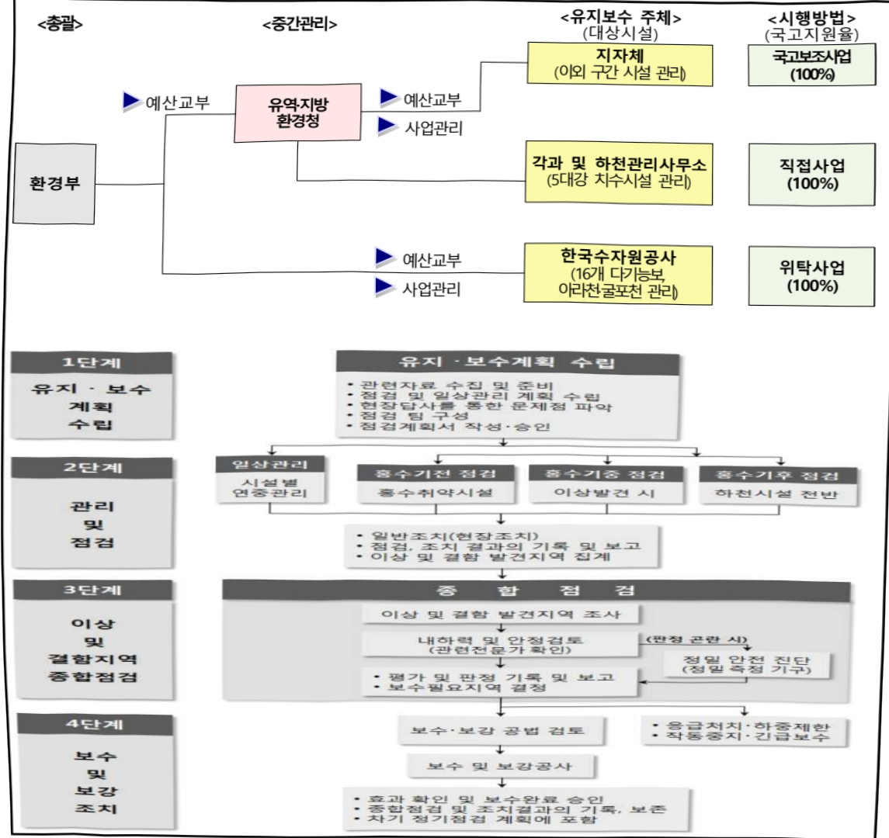

# 국가하천유지보수

**해당 페이지**: PDF 2633 ~ 2644 쪽 해당

**부처**: 기후에너지환경부
**분야**: 국토 및 지역개발
**회계유형**: 일반회계
**2026 확정예산**: 296948.0 백만원
**전년대비 증감률**: 13.3%
**AI 도메인**: 환경/기후

---

### 가. 예산 총괄표

(단위:백만원,%)

<table border=1 style='margin: auto; word-wrap: break-word;'><tr><td rowspan="2">사업명</td><td rowspan="2">2024년 결산</td><td colspan="2">2025년 예산</td><td colspan="2">2026년</td><td rowspan="2">증감 (B-A)</td><td rowspan="2">(B-A)/A</td></tr><tr><td style='text-align: center; word-wrap: break-word;'>본예산(A)</td><td style='text-align: center; word-wrap: break-word;'>추경</td><td style='text-align: center; word-wrap: break-word;'>정부안</td><td style='text-align: center; word-wrap: break-word;'>확정(B)</td></tr><tr><td style='text-align: center; word-wrap: break-word;'>국가하천유지보수</td><td style='text-align: center; word-wrap: break-word;'>257,294</td><td style='text-align: center; word-wrap: break-word;'>262,157</td><td style='text-align: center; word-wrap: break-word;'>262,157</td><td style='text-align: center; word-wrap: break-word;'>296,948</td><td style='text-align: center; word-wrap: break-word;'>296,948</td><td style='text-align: center; word-wrap: break-word;'>34,791</td><td style='text-align: center; word-wrap: break-word;'>13.3</td></tr></table>

□ 기능별(내역사업별), 목별 예산 내역

(단위:백만원)

<table border=1 style='margin: auto; word-wrap: break-word;'><tr><td rowspan="3"></td><td colspan="5">2024</td><td colspan="7">2025</td><td rowspan="3">2026예산</td></tr><tr><td rowspan="2">예산액(추경)</td><td rowspan="2">예산현액</td><td rowspan="2">집행액[실집행액]</td><td rowspan="2">이월액</td><td rowspan="2">불용액</td><td rowspan="2">분예산</td><td rowspan="2">예산현액</td><td rowspan="2">집행액[실집행액]</td><td colspan="2">전년도 이월액제외</td><td rowspan="2">이월예상액</td><td rowspan="2">불용예상액</td></tr><tr><td style='text-align: center; word-wrap: break-word;'>예산현액</td><td style='text-align: center; word-wrap: break-word;'>집행액[실집행액]</td></tr><tr><td style='text-align: center; word-wrap: break-word;'>○ 기능별 분류(합계)</td><td style='text-align: center; word-wrap: break-word;'>261,406</td><td style='text-align: center; word-wrap: break-word;'>265,345</td><td style='text-align: center; word-wrap: break-word;'>257,294[229,402]</td><td style='text-align: center; word-wrap: break-word;'>3,883</td><td style='text-align: center; word-wrap: break-word;'>4,168</td><td style='text-align: center; word-wrap: break-word;'>262,157</td><td style='text-align: center; word-wrap: break-word;'>266,040</td><td style='text-align: center; word-wrap: break-word;'>257,032[235,900]</td><td style='text-align: center; word-wrap: break-word;'>262,157</td><td style='text-align: center; word-wrap: break-word;'>253,429[232,97]</td><td style='text-align: center; word-wrap: break-word;'></td><td style='text-align: center; word-wrap: break-word;'></td><td style='text-align: center; word-wrap: break-word;'>296,948</td></tr><tr><td style='text-align: center; word-wrap: break-word;'>· 국가하천유지보수</td><td style='text-align: center; word-wrap: break-word;'>261,406</td><td style='text-align: center; word-wrap: break-word;'>265,345</td><td style='text-align: center; word-wrap: break-word;'>257,294[229,402]</td><td style='text-align: center; word-wrap: break-word;'>3,883</td><td style='text-align: center; word-wrap: break-word;'>4,168</td><td style='text-align: center; word-wrap: break-word;'>262,157</td><td style='text-align: center; word-wrap: break-word;'>266,040</td><td style='text-align: center; word-wrap: break-word;'>257,032[235,900]</td><td style='text-align: center; word-wrap: break-word;'>262,157</td><td style='text-align: center; word-wrap: break-word;'>253,429[232,97]</td><td style='text-align: center; word-wrap: break-word;'></td><td style='text-align: center; word-wrap: break-word;'></td><td style='text-align: center; word-wrap: break-word;'>296,948</td></tr><tr><td style='text-align: center; word-wrap: break-word;'>○ 비목별 분류(합계)</td><td style='text-align: center; word-wrap: break-word;'>261,406</td><td style='text-align: center; word-wrap: break-word;'>265,345</td><td style='text-align: center; word-wrap: break-word;'>257,294[229,402]</td><td style='text-align: center; word-wrap: break-word;'>3,883</td><td style='text-align: center; word-wrap: break-word;'>4,168</td><td style='text-align: center; word-wrap: break-word;'>262,157</td><td style='text-align: center; word-wrap: break-word;'>266,040</td><td style='text-align: center; word-wrap: break-word;'>257,032[235,900]</td><td style='text-align: center; word-wrap: break-word;'>262,157</td><td style='text-align: center; word-wrap: break-word;'>253,429[232,97]</td><td style='text-align: center; word-wrap: break-word;'></td><td style='text-align: center; word-wrap: break-word;'></td><td style='text-align: center; word-wrap: break-word;'>296,948</td></tr><tr><td style='text-align: center; word-wrap: break-word;'>· 상용임금(110-03)</td><td style='text-align: center; word-wrap: break-word;'>5,099</td><td style='text-align: center; word-wrap: break-word;'>4,687</td><td style='text-align: center; word-wrap: break-word;'>4,612</td><td style='text-align: center; word-wrap: break-word;'>-</td><td style='text-align: center; word-wrap: break-word;'>75</td><td style='text-align: center; word-wrap: break-word;'>5,260</td><td style='text-align: center; word-wrap: break-word;'>4,579</td><td style='text-align: center; word-wrap: break-word;'>4,469</td><td style='text-align: center; word-wrap: break-word;'>4,579</td><td style='text-align: center; word-wrap: break-word;'>4,469</td><td style='text-align: center; word-wrap: break-word;'></td><td style='text-align: center; word-wrap: break-word;'></td><td style='text-align: center; word-wrap: break-word;'>5,260</td></tr><tr><td style='text-align: center; word-wrap: break-word;'>· 일반수용비(210-01)</td><td style='text-align: center; word-wrap: break-word;'>335</td><td style='text-align: center; word-wrap: break-word;'>569</td><td style='text-align: center; word-wrap: break-word;'>528</td><td style='text-align: center; word-wrap: break-word;'>17</td><td style='text-align: center; word-wrap: break-word;'>24</td><td style='text-align: center; word-wrap: break-word;'>335</td><td style='text-align: center; word-wrap: break-word;'>354</td><td style='text-align: center; word-wrap: break-word;'>348</td><td style='text-align: center; word-wrap: break-word;'>337</td><td style='text-align: center; word-wrap: break-word;'>331</td><td style='text-align: center; word-wrap: break-word;'></td><td style='text-align: center; word-wrap: break-word;'></td><td style='text-align: center; word-wrap: break-word;'>335</td></tr><tr><td style='text-align: center; word-wrap: break-word;'>· 공공요금및제세(210-02)</td><td style='text-align: center; word-wrap: break-word;'>4,300</td><td style='text-align: center; word-wrap: break-word;'>4,092</td><td style='text-align: center; word-wrap: break-word;'>3,247</td><td style='text-align: center; word-wrap: break-word;'>-</td><td style='text-align: center; word-wrap: break-word;'>845</td><td style='text-align: center; word-wrap: break-word;'>4,300</td><td style='text-align: center; word-wrap: break-word;'>4,317</td><td style='text-align: center; word-wrap: break-word;'>4,189</td><td style='text-align: center; word-wrap: break-word;'>4,317</td><td style='text-align: center; word-wrap: break-word;'>4,189</td><td style='text-align: center; word-wrap: break-word;'></td><td style='text-align: center; word-wrap: break-word;'></td><td style='text-align: center; word-wrap: break-word;'>4,446</td></tr><tr><td style='text-align: center; word-wrap: break-word;'>· 피복비(210-03)</td><td style='text-align: center; word-wrap: break-word;'>71</td><td style='text-align: center; word-wrap: break-word;'>71</td><td style='text-align: center; word-wrap: break-word;'>69</td><td style='text-align: center; word-wrap: break-word;'>-</td><td style='text-align: center; word-wrap: break-word;'>2</td><td style='text-align: center; word-wrap: break-word;'>71</td><td style='text-align: center; word-wrap: break-word;'>71</td><td style='text-align: center; word-wrap: break-word;'>67</td><td style='text-align: center; word-wrap: break-word;'>71</td><td style='text-align: center; word-wrap: break-word;'>67</td><td style='text-align: center; word-wrap: break-word;'></td><td style='text-align: center; word-wrap: break-word;'></td><td style='text-align: center; word-wrap: break-word;'>71</td></tr><tr><td style='text-align: center; word-wrap: break-word;'>· 특근매식비(210-05)</td><td style='text-align: center; word-wrap: break-word;'>37</td><td style='text-align: center; word-wrap: break-word;'>37</td><td style='text-align: center; word-wrap: break-word;'>19</td><td style='text-align: center; word-wrap: break-word;'>-</td><td style='text-align: center; word-wrap: break-word;'>18</td><td style='text-align: center; word-wrap: break-word;'>37</td><td style='text-align: center; word-wrap: break-word;'>37</td><td style='text-align: center; word-wrap: break-word;'>21</td><td style='text-align: center; word-wrap: break-word;'>37</td><td style='text-align: center; word-wrap: break-word;'>21</td><td style='text-align: center; word-wrap: break-word;'></td><td style='text-align: center; word-wrap: break-word;'></td><td style='text-align: center; word-wrap: break-word;'>37</td></tr><tr><td style='text-align: center; word-wrap: break-word;'>· 유류비(210-08)</td><td style='text-align: center; word-wrap: break-word;'>173</td><td style='text-align: center; word-wrap: break-word;'>193</td><td style='text-align: center; word-wrap: break-word;'>114</td><td style='text-align: center; word-wrap: break-word;'>-</td><td style='text-align: center; word-wrap: break-word;'>79</td><td style='text-align: center; word-wrap: break-word;'>173</td><td style='text-align: center; word-wrap: break-word;'>173</td><td style='text-align: center; word-wrap: break-word;'>132</td><td style='text-align: center; word-wrap: break-word;'>173</td><td style='text-align: center; word-wrap: break-word;'>132</td><td style='text-align: center; word-wrap: break-word;'></td><td style='text-align: center; word-wrap: break-word;'></td><td style='text-align: center; word-wrap: break-word;'>173</td></tr><tr><td style='text-align: center; word-wrap: break-word;'>· 시설장비유지비(210-09)</td><td style='text-align: center; word-wrap: break-word;'>158</td><td style='text-align: center; word-wrap: break-word;'>162</td><td style='text-align: center; word-wrap: break-word;'>152</td><td style='text-align: center; word-wrap: break-word;'>-</td><td style='text-align: center; word-wrap: break-word;'>10</td><td style='text-align: center; word-wrap: break-word;'>158</td><td style='text-align: center; word-wrap: break-word;'>158</td><td style='text-align: center; word-wrap: break-word;'>146</td><td style='text-align: center; word-wrap: break-word;'>158</td><td style='text-align: center; word-wrap: break-word;'>146</td><td style='text-align: center; word-wrap: break-word;'></td><td style='text-align: center; word-wrap: break-word;'></td><td style='text-align: center; word-wrap: break-word;'>158</td></tr><tr><td style='text-align: center; word-wrap: break-word;'>· 복리후생비(210-12)</td><td style='text-align: center; word-wrap: break-word;'>64</td><td style='text-align: center; word-wrap: break-word;'>64</td><td style='text-align: center; word-wrap: break-word;'>58</td><td style='text-align: center; word-wrap: break-word;'>-</td><td style='text-align: center; word-wrap: break-word;'>6</td><td style='text-align: center; word-wrap: break-word;'>64</td><td style='text-align: center; word-wrap: break-word;'>64</td><td style='text-align: center; word-wrap: break-word;'>56</td><td style='text-align: center; word-wrap: break-word;'>64</td><td style='text-align: center; word-wrap: break-word;'>56</td><td style='text-align: center; word-wrap: break-word;'></td><td style='text-align: center; word-wrap: break-word;'></td><td style='text-align: center; word-wrap: break-word;'>64</td></tr><tr><td style='text-align: center; word-wrap: break-word;'>· 관리용역비(210-15)</td><td style='text-align: center; word-wrap: break-word;'>-</td><td style='text-align: center; word-wrap: break-word;'>-</td><td style='text-align: center; word-wrap: break-word;'>-</td><td style='text-align: center; word-wrap: break-word;'>-</td><td style='text-align: center; word-wrap: break-word;'>-</td><td style='text-align: center; word-wrap: break-word;'>2,000</td><td style='text-align: center; word-wrap: break-word;'>1,968</td><td style='text-align: center; word-wrap: break-word;'>1,637</td><td style='text-align: center; word-wrap: break-word;'>1,968</td><td style='text-align: center; word-wrap: break-word;'>1,637</td><td style='text-align: center; word-wrap: break-word;'></td><td style='text-align: center; word-wrap: break-word;'></td><td style='text-align: center; word-wrap: break-word;'>2,000</td></tr><tr><td style='text-align: center; word-wrap: break-word;'>· 국내여비(220-01)</td><td style='text-align: center; word-wrap: break-word;'>129</td><td style='text-align: center; word-wrap: break-word;'>129</td><td style='text-align: center; word-wrap: break-word;'>129</td><td style='text-align: center; word-wrap: break-word;'>-</td><td style='text-align: center; word-wrap: break-word;'>-</td><td style='text-align: center; word-wrap: break-word;'>129</td><td style='text-align: center; word-wrap: break-word;'>129</td><td style='text-align: center; word-wrap: break-word;'>129</td><td style='text-align: center; word-wrap: break-word;'>129</td><td style='text-align: center; word-wrap: break-word;'>129</td><td style='text-align: center; word-wrap: break-word;'></td><td style='text-align: center; word-wrap: break-word;'></td><td style='text-align: center; word-wrap: break-word;'>129</td></tr><tr><td style='text-align: center; word-wrap: break-word;'>· 사업추진비</td><td style='text-align: center; word-wrap: break-word;'>5</td><td style='text-align: center; word-wrap: break-word;'>5</td><td style='text-align: center; word-wrap: break-word;'>5</td><td style='text-align: center; word-wrap: break-word;'>-</td><td style='text-align: center; word-wrap: break-word;'>-</td><td style='text-align: center; word-wrap: break-word;'>5</td><td style='text-align: center; word-wrap: break-word;'>5</td><td style='text-align: center; word-wrap: break-word;'>5</td><td style='text-align: center; word-wrap: break-word;'>5</td><td style='text-align: center; word-wrap: break-word;'>5</td><td style='text-align: center; word-wrap: break-word;'></td><td style='text-align: center; word-wrap: break-word;'></td><td style='text-align: center; word-wrap: break-word;'>5</td></tr></table>

---

<table border=1 style='margin: auto; word-wrap: break-word;'><tr><td rowspan="3"></td><td colspan="5">2024</td><td colspan="7">2025</td><td rowspan="3">2026예산</td></tr><tr><td rowspan="2">예산액(추경)</td><td rowspan="2">예산현액</td><td rowspan="2">집행액[실집행액]</td><td rowspan="2">이월액</td><td rowspan="2">불용액</td><td rowspan="2">본예산</td><td rowspan="2">예산현액</td><td rowspan="2">집행액[실집행액]</td><td colspan="2">전년도 이월액제외</td><td rowspan="2">이월예상액</td><td rowspan="2">불용예상액</td></tr><tr><td style='text-align: center; word-wrap: break-word;'>예산현액</td><td style='text-align: center; word-wrap: break-word;'>집행액[실집행액]</td></tr><tr><td style='text-align: center; word-wrap: break-word;'>(240-01)</td><td style='text-align: center; word-wrap: break-word;'>2,000</td><td style='text-align: center; word-wrap: break-word;'>2,723</td><td style='text-align: center; word-wrap: break-word;'>2,119</td><td style='text-align: center; word-wrap: break-word;'>173</td><td style='text-align: center; word-wrap: break-word;'>431</td><td style='text-align: center; word-wrap: break-word;'>1,800</td><td style='text-align: center; word-wrap: break-word;'>1,973</td><td style='text-align: center; word-wrap: break-word;'>1,620</td><td style='text-align: center; word-wrap: break-word;'>1,800</td><td style='text-align: center; word-wrap: break-word;'>1,506</td><td style='text-align: center; word-wrap: break-word;'></td><td style='text-align: center; word-wrap: break-word;'></td><td style='text-align: center; word-wrap: break-word;'>1,800</td></tr><tr><td style='text-align: center; word-wrap: break-word;'>· 일반연구비(260-01)</td><td style='text-align: center; word-wrap: break-word;'>-</td><td style='text-align: center; word-wrap: break-word;'>-</td><td style='text-align: center; word-wrap: break-word;'>-</td><td style='text-align: center; word-wrap: break-word;'>-</td><td style='text-align: center; word-wrap: break-word;'>-</td><td style='text-align: center; word-wrap: break-word;'>-</td><td style='text-align: center; word-wrap: break-word;'>14</td><td style='text-align: center; word-wrap: break-word;'>13</td><td style='text-align: center; word-wrap: break-word;'>14</td><td style='text-align: center; word-wrap: break-word;'>13</td><td style='text-align: center; word-wrap: break-word;'></td><td style='text-align: center; word-wrap: break-word;'></td><td style='text-align: center; word-wrap: break-word;'>-</td></tr><tr><td style='text-align: center; word-wrap: break-word;'>· 배상금(310-02)</td><td style='text-align: center; word-wrap: break-word;'>50,500</td><td style='text-align: center; word-wrap: break-word;'>50,500</td><td style='text-align: center; word-wrap: break-word;'>50,469</td><td style='text-align: center; word-wrap: break-word;'>31</td><td style='text-align: center; word-wrap: break-word;'>-</td><td style='text-align: center; word-wrap: break-word;'>50,500</td><td style='text-align: center; word-wrap: break-word;'>50,531</td><td style='text-align: center; word-wrap: break-word;'>50,155</td><td style='text-align: center; word-wrap: break-word;'>50,500</td><td style='text-align: center; word-wrap: break-word;'>50,155</td><td style='text-align: center; word-wrap: break-word;'></td><td style='text-align: center; word-wrap: break-word;'></td><td style='text-align: center; word-wrap: break-word;'>50,500</td></tr><tr><td style='text-align: center; word-wrap: break-word;'>· 법정민간대행사업비(320-08)</td><td style='text-align: center; word-wrap: break-word;'>999</td><td style='text-align: center; word-wrap: break-word;'>1,411</td><td style='text-align: center; word-wrap: break-word;'>1,344</td><td style='text-align: center; word-wrap: break-word;'>-</td><td style='text-align: center; word-wrap: break-word;'>67</td><td style='text-align: center; word-wrap: break-word;'>1,028</td><td style='text-align: center; word-wrap: break-word;'>1,709</td><td style='text-align: center; word-wrap: break-word;'>1,421</td><td style='text-align: center; word-wrap: break-word;'>1,709</td><td style='text-align: center; word-wrap: break-word;'>1,421</td><td style='text-align: center; word-wrap: break-word;'></td><td style='text-align: center; word-wrap: break-word;'></td><td style='text-align: center; word-wrap: break-word;'>1,028</td></tr><tr><td style='text-align: center; word-wrap: break-word;'>· 고용부담금(320-09)</td><td style='text-align: center; word-wrap: break-word;'>120,000</td><td style='text-align: center; word-wrap: break-word;'>120,000</td><td style='text-align: center; word-wrap: break-word;'>120,000[92,108]</td><td style='text-align: center; word-wrap: break-word;'>-</td><td style='text-align: center; word-wrap: break-word;'>-</td><td style='text-align: center; word-wrap: break-word;'>118,561</td><td style='text-align: center; word-wrap: break-word;'>118,561</td><td style='text-align: center; word-wrap: break-word;'>118,561[97,429]</td><td style='text-align: center; word-wrap: break-word;'>118,561</td><td style='text-align: center; word-wrap: break-word;'>118,561[97,429]</td><td style='text-align: center; word-wrap: break-word;'></td><td style='text-align: center; word-wrap: break-word;'></td><td style='text-align: center; word-wrap: break-word;'>138,061</td></tr><tr><td style='text-align: center; word-wrap: break-word;'>· 자치단체자본보조(330-03)</td><td style='text-align: center; word-wrap: break-word;'>13,000</td><td style='text-align: center; word-wrap: break-word;'>15,292</td><td style='text-align: center; word-wrap: break-word;'>13,381</td><td style='text-align: center; word-wrap: break-word;'>904</td><td style='text-align: center; word-wrap: break-word;'>1,007</td><td style='text-align: center; word-wrap: break-word;'>13,000</td><td style='text-align: center; word-wrap: break-word;'>13,935</td><td style='text-align: center; word-wrap: break-word;'>13,410</td><td style='text-align: center; word-wrap: break-word;'>13,031</td><td style='text-align: center; word-wrap: break-word;'>12,515</td><td style='text-align: center; word-wrap: break-word;'></td><td style='text-align: center; word-wrap: break-word;'></td><td style='text-align: center; word-wrap: break-word;'>13,000</td></tr><tr><td style='text-align: center; word-wrap: break-word;'>· 기본조사설계비(420-01)</td><td style='text-align: center; word-wrap: break-word;'>1,200</td><td style='text-align: center; word-wrap: break-word;'>1,306</td><td style='text-align: center; word-wrap: break-word;'>1,200</td><td style='text-align: center; word-wrap: break-word;'>70</td><td style='text-align: center; word-wrap: break-word;'>36</td><td style='text-align: center; word-wrap: break-word;'>1,200</td><td style='text-align: center; word-wrap: break-word;'>1,239</td><td style='text-align: center; word-wrap: break-word;'>1,003</td><td style='text-align: center; word-wrap: break-word;'>1,169</td><td style='text-align: center; word-wrap: break-word;'>932</td><td style='text-align: center; word-wrap: break-word;'></td><td style='text-align: center; word-wrap: break-word;'></td><td style='text-align: center; word-wrap: break-word;'>1,200</td></tr><tr><td style='text-align: center; word-wrap: break-word;'>· 실시설계비(420-02)</td><td style='text-align: center; word-wrap: break-word;'>59,204</td><td style='text-align: center; word-wrap: break-word;'>59,188</td><td style='text-align: center; word-wrap: break-word;'>55,195</td><td style='text-align: center; word-wrap: break-word;'>2,612</td><td style='text-align: center; word-wrap: break-word;'>1,381</td><td style='text-align: center; word-wrap: break-word;'>59,404</td><td style='text-align: center; word-wrap: break-word;'>60,973</td><td style='text-align: center; word-wrap: break-word;'>54,859</td><td style='text-align: center; word-wrap: break-word;'>58,362</td><td style='text-align: center; word-wrap: break-word;'>52,430</td><td style='text-align: center; word-wrap: break-word;'></td><td style='text-align: center; word-wrap: break-word;'></td><td style='text-align: center; word-wrap: break-word;'>74,549</td></tr><tr><td style='text-align: center; word-wrap: break-word;'>· 공사비(420-03)</td><td style='text-align: center; word-wrap: break-word;'>3,400</td><td style='text-align: center; word-wrap: break-word;'>4,184</td><td style='text-align: center; word-wrap: break-word;'>4,037</td><td style='text-align: center; word-wrap: break-word;'>76</td><td style='text-align: center; word-wrap: break-word;'>71</td><td style='text-align: center; word-wrap: break-word;'>3,400</td><td style='text-align: center; word-wrap: break-word;'>4,518</td><td style='text-align: center; word-wrap: break-word;'>4,195</td><td style='text-align: center; word-wrap: break-word;'>4,442</td><td style='text-align: center; word-wrap: break-word;'>4,119</td><td style='text-align: center; word-wrap: break-word;'></td><td style='text-align: center; word-wrap: break-word;'></td><td style='text-align: center; word-wrap: break-word;'>3,400</td></tr><tr><td style='text-align: center; word-wrap: break-word;'>· 감리비(420-04)</td><td style='text-align: center; word-wrap: break-word;'>370</td><td style='text-align: center; word-wrap: break-word;'>370</td><td style='text-align: center; word-wrap: break-word;'>256</td><td style='text-align: center; word-wrap: break-word;'>-</td><td style='text-align: center; word-wrap: break-word;'>114</td><td style='text-align: center; word-wrap: break-word;'>370</td><td style='text-align: center; word-wrap: break-word;'>370</td><td style='text-align: center; word-wrap: break-word;'>235</td><td style='text-align: center; word-wrap: break-word;'>370</td><td style='text-align: center; word-wrap: break-word;'>235</td><td style='text-align: center; word-wrap: break-word;'></td><td style='text-align: center; word-wrap: break-word;'></td><td style='text-align: center; word-wrap: break-word;'>370</td></tr><tr><td style='text-align: center; word-wrap: break-word;'>· 시설부대비(420-05)</td><td style='text-align: center; word-wrap: break-word;'>362</td><td style='text-align: center; word-wrap: break-word;'>362</td><td style='text-align: center; word-wrap: break-word;'>360</td><td style='text-align: center; word-wrap: break-word;'>-</td><td style='text-align: center; word-wrap: break-word;'>2</td><td style='text-align: center; word-wrap: break-word;'>362</td><td style='text-align: center; word-wrap: break-word;'>362</td><td style='text-align: center; word-wrap: break-word;'>361</td><td style='text-align: center; word-wrap: break-word;'>362</td><td style='text-align: center; word-wrap: break-word;'>361</td><td style='text-align: center; word-wrap: break-word;'></td><td style='text-align: center; word-wrap: break-word;'></td><td style='text-align: center; word-wrap: break-word;'>362</td></tr></table>

### 나. 사업설명자료

## 1 ) 사업목적·내용

- (국가하천유지보수) 전국 89개 국가하천('25년 승격 포함)의 제방, 호안, 배수시설, 저수로, 16개 다기능보, 홍수조절지, 친수시설 등 하천시설에 대한 체계적인 유지관리를 통해 기후 변화에 능동적으로 대처함으로써 수해 예방 및 친환경적인 하천공간 조성

## 2 ) 사업개요

□ 사업근거 및 추진경위

① 법령상 근거 및 조항 적시

---

0 하천법 제27조(하천관리청의 하천공사 및 유지·보수) ⑥ 하천공사와 하천의 유지·보수는 이 법에 특별한 규정이 있는 경우를 제외하고는 하천관리청이 시행한다. 다만, 국가하천의 유지·보수는 홍수로 인한 재해의 방지와 수자원의 효율적인 운영을 위하여 다음 각 호의 어느 하나에 해당하는 경우로서 환경부장관이 고시하는 국가하천의 시설 및 구간을 제외하고 시·도지사가 시행한다.

(1. 제방(호안 및 배수시설을 포함한다), 2. 저수로, 3. 보, 4. 그 밖에 제1호부터 제3호까지의 시설과 연계하여 관리할 필요가 있는 시설로서 대통령령으로 정하는 시설)

O 하천법 제64조(비용보조) 환경부장관은 다음 각 호의 어느 하나에 해당하는 경우에는 그 비용의 일부를 시 · 도에 보조할 수 있다.

(1. 국가하천의 유지 · 보수, 2. ~ 3. (생략))

0 하천법 제92조(권한의 위임 · 위탁 등) ③ 이 법에 따른 환경부장관의 업무 중 다음 각 호의 업무는 대통령령으로 정하는 바에 따라 하천과 관련된 기관 또는 단체에 위탁할 수 있다.

(1.~6.(생략),6의2. 제27조제6항에 따라 환경부장관이 시행하는 국가하천 시설 및 구간의 유지 · 보수 업무)

0 하천법 시행령 제26조의2(국가하천의 유지·보수 대상시설) 법 제27조제6항제4호에서 "대통령령으로 정하는 시설"이란 다음 각 호의 어느 하나에 해당하는 시설을 말한다.

(1. 홍수조절지·저류지·수문·선착장·갑문, 1의2. 제방, 저수로, 보와 인접한 시설로서 홍수 때 저수로를 넘쳐흐르는 부분인 홍수터 등 물길안정과 관련된 시설, 2. 그 밖에 수자원의 효율적 운영을 도모하기 위하여 설치하는 홍보관·전망대 및 이에 부속되는 휴게시설 또는 하천 관리사무소)

0 하천범 시행령 제106조(위탁기관) 법 제92조제3항에 따라 환경부장관은 같은 항각 호에 따른 업무를 다음 각 호의 기관에 위탁할 수 있다. 이 경우 환경부장관은 수탁기관 및 수탁업무를 고시하여야 한다.

(1. 「한국수자원공사법」에 따른 한국수자원공사, 2. ~ 3. (생략))

## ② 추진경위

## < 국가하천유지보수 >

o 1962. 1. 1. 하천법이 제정되면서 국가하천에 대한 유지관리를 시행

* 1962년 제정 하천법 제10조 (관리청) 하천은 국토건설청장이 관리한다. 단, 각령으로 지정하는 하천은 관할지방장관이 이를 관리한다.

제14조 (하천공사와 유지) 하천의 신설, 개축 및 보수에 관한 공사(以下 河川에 봉한 工事라 한다)와 유지는 본법에 특별한 규정이 있는 경우를 제외하고는 관리청이 이를 하여야 한다.

제15조(하천의 보수 및 유지)①국토건설청장이 관리하는 하천의 보수에 관한 공사와 유지는 지방장관이 시행한다.

o 하천시설(제방, 16개 다기능 보 등)의 증가와 대규모 친수공간의 조성에 따라 시설·공간의 특성을 감안한 유지관리 역할 분담을 통해 효율적인 국가하천의 관리를 위해 '12년 신규사업에 반영

---

## □ 주요내용

① 사업규모

- 총사업비(해당되는 경우에만 기재) : 해당 없음

- 사업기간 : 2012 ~ 계속

- 최근 5년 간 투입된 사업비(예산액기준, 추경편성한 연도에는 추경포함)

<table border=1 style='margin: auto; word-wrap: break-word;'><tr><td style='text-align: center; word-wrap: break-word;'>$ \underline{\text{西}} $</td><td style='text-align: center; word-wrap: break-word;'>2022</td><td style='text-align: center; word-wrap: break-word;'>2023</td><td style='text-align: center; word-wrap: break-word;'>2024</td><td style='text-align: center; word-wrap: break-word;'>2025</td><td style='text-align: center; word-wrap: break-word;'>2026</td></tr><tr><td style='text-align: center; word-wrap: break-word;'>$ \underline{\text{사업비}} $</td><td style='text-align: center; word-wrap: break-word;'>259,922</td><td style='text-align: center; word-wrap: break-word;'>250,763</td><td style='text-align: center; word-wrap: break-word;'>261,406</td><td style='text-align: center; word-wrap: break-word;'>262,157</td><td style='text-align: center; word-wrap: break-word;'>296,948</td></tr></table>

- 기타: 89개 국가하천 4,059km 유지·보수(하천시설 - 제방, 저수로, 보 등)

② 사업추진체계

- 사업시행방법 : 직접수행(5대강 치수시설), 보조(5대강 친수시설, 83개 국가하천

치수시설·친수시설), 민간위탁(16개 다기능보 및 아라천)

- 사업시행주체 : 직접수행(7개 유역·지방환경청), 보조(17개 광역시·도), 민간위탁(한국수자원공사)

-사업 수혜자 : 일반 국민

- 보조, 융자, 출연, 출자 등의 경우 보조 · 융자 등 지원 비율 및 법적근거

<table border=1 style='margin: auto; word-wrap: break-word;'><tr><td style='text-align: center; word-wrap: break-word;'>내역사업명</td><td style='text-align: center; word-wrap: break-word;'>구분</td><td style='text-align: center; word-wrap: break-word;'>피보조·피출연 등 기관명</td><td style='text-align: center; word-wrap: break-word;'>지원 금액 (2026예산)</td><td style='text-align: center; word-wrap: break-word;'>지원 비율(%)</td><td style='text-align: center; word-wrap: break-word;'>보조율 법적근거 (해당 조항)</td></tr><tr><td style='text-align: center; word-wrap: break-word;'>국가하천 유지보수</td><td style='text-align: center; word-wrap: break-word;'>보조</td><td style='text-align: center; word-wrap: break-word;'>지자체 보조</td><td style='text-align: center; word-wrap: break-word;'>138,061</td><td style='text-align: center; word-wrap: break-word;'>100</td><td style='text-align: center; word-wrap: break-word;'>「하천법」제64조</td></tr></table>

---

## 3 ) 2026년도 예산 산출 근거

## ① 국가하천유지보수

:(2025 본예산) 262,157백만원 → (2026 조정) 296,948백만원, 34,791백만원 증액

- (요구) 국가하천 89개소(승격 연장(L=467km) 포함 층 4,059km) 시설물 유지·관리비

- (산출)「시설물안전법」에 따른 점검 및 기타 유지·보수, 지능형 CCTV 구축, 준설 및 잡목제거 등 296,948백만원

°2025년도 예산 및 2026년도 예산 산출 세부내역 비교

<table border=1 style='margin: auto; word-wrap: break-word;'><tr><td colspan="2">2025년 분예산</td><td colspan="2">2026년 예산</td></tr><tr><td style='text-align: center; word-wrap: break-word;'>예산</td><td style='text-align: center; word-wrap: break-word;'>산출내역</td><td style='text-align: center; word-wrap: break-word;'>예산</td><td style='text-align: center; word-wrap: break-word;'>산출내역</td></tr><tr><td style='text-align: center; word-wrap: break-word;'>262,157</td><td style='text-align: center; word-wrap: break-word;'>○ 상용임금(110-03): 5,260백만원가. 하천보수원 인건비 1식 x 5,260백만원 = 5,260백만원○ 일반수용비(210-01): 335백만원가. 자문비, 행사 소요 비용 1식 x 573백만원 = 335백만원· 제안서 평가, 소모품 구매 등○ 공공요금및제세(210-02): 4,300백만원가. 시설물 운영 관련 비용 1식 x 4,300백만원 = 4,300백만원· 국가하천 모니터링 체계(CCTV-2,990개소) 전기료, 통신료 등○ 피복비(210-03): 71백만원가. 하천 순찰 피복 1식 x 71백만원 = 71백만원· 하천보수원 피복(하게, 동계) 등○ 특근매식비(210-05): 37백만원가. 특근매식비 1식 x 37백만원 = 37백만원· 하천보수원 수해근무 등○ 유류비(210-08): 173백만원가. 유류비 1식 x 173백만원 = 173백만원· 하천 순찰용 차량, 장비 등○ 시설장비유지비(210-09): 158백만원가. 시설 및 장비 유지비 1식 x 158백만원 = 158백만원· 작업대기소, 차량, 장비 수리비 등○ 복리후생비(210-12): 64백만원가. 복리후생비 1식 x 64백만원 = 64백만원· 공무직 복지포인트 지원 등○ 관리용역비(210-15): 2,000백만원가. 관리용역비 1식 x 2,000백만원 = 2,000백만원○ 국내여비(220-01): 129백만원가. 국내여비 1식 x 129백만원 = 129백만원· 출장비, 운전여비 등○ 사업추진비(240-01): 5백만원가. 사업추진비 1식 x 5백만원 = 5백만원○ 일반연구비(260-01): 1,800백만원가. 연구용역비 1식 x 1,800백만원 = 1,800백만원· 7기반시설법, 예 따른 관리계획, 「중대재해처벌법」 관련 전설팀 용역, 국가하천 체계 개선 방안 연구 용역 등</td><td style='text-align: center; word-wrap: break-word;'>296,948</td><td style='text-align: center; word-wrap: break-word;'>○ 상용임금(110-03): 5,260백만원가. 하천보수원 인건비 1식 x 5,260백만원 = 5,260백만원○ 일반수용비(210-01): 335백만원가. 자문비, 행사 소요 비용 1식 x 573백만원 = 335백만원· 제안서 평가, 소모품 구매 등○ 공공요금및제세(210-02): 4,446백만원가. 시설물 운영 관련 비용 1식 x 4,446백만원 = 4,446백만원· 국가하천 모니터링 체계(CCTV-3,209개소) 전기료, 통신료 등○ 피복비(210-03): 71백만원가. 하천 순찰 피복 1식 x 71백만원 = 71백만원· 하천보수원 피복(하게, 동계) 등○ 특근매식비(210-05): 37백만원가. 특근매식비 1식 x 37백만원 = 37백만원· 하천보수원 수해근무 등○ 유류비(210-08): 173백만원가. 유류비 1식 x 173백만원 = 173백만원· 하천 순찰용 차량, 장비 등○ 시설장비유지비(210-09): 158백만원가. 시설 및 장비 유지비 1식 x 158백만원 = 158백만원· 작업대기소, 차량, 장비 수리비 등○ 복리후생비(210-12): 64백만원가. 복리후생비 1식 x 64백만원 = 64백만원· 공무직 복지포인트 지원 등○ 관리용역비(210-15): 2,000백만원가. 관리용역비 1식 x 2,000백만원 = 2,000백만원○ 국내여비(220-01): 129백만원가. 국내여비 1식 x 129백만원 = 129백만원· 출장비, 운전여비 등○ 사업추진비(240-01): 5백만원가. 사업추진비 1식 x 5백만원 = 5백만원○ 일반연구비(260-01): 1,800백만원가. 연구용역비 1식 x 1,800백만원 = 1,800백만원· 7기반시설법, 예 따른 관리계획, 「중대재해처벌법」 관련 전설팀 용역, 국가하천 체계 개선 방안 연구 용역 등</td></tr></table>

---

<table border=1 style='margin: auto; word-wrap: break-word;'><tr><td colspan="2">2025년 본예산</td><td colspan="2">2026년 예산</td></tr><tr><td style='text-align: center; word-wrap: break-word;'>예산</td><td style='text-align: center; word-wrap: break-word;'>산출내역</td><td style='text-align: center; word-wrap: break-word;'>예산</td><td style='text-align: center; word-wrap: break-word;'>산출내역</td></tr><tr><td style='text-align: center; word-wrap: break-word;'></td><td style='text-align: center; word-wrap: break-word;'>○ 법정민간대행사업비(320-08): 50,500백만원
가. 16개 다기능보 위탁 1식 x 36,650백만원 = 36,650백만원
· (위탁기관) 한국수자원공사
나. 아라천 및 골포천 위탁 1식 x 12,050백만원 = 12,050백만원
· (위탁기관) 한국수자원공사
다. 정보화구축 1식 x 1,300백만원 = 1,300백만원
라. 홍수취약지구 1식 x 500백만원 = 500백만원
○ 고용부담금(320-09): 1,028백만원
가. 고용부담금 1식 x 1,028백만원 = 1,028백만원
· 퇴직금 및 사회보험료 등 각종 법정부담금
○ 자치단체자본보조(330-03): 118,561백만원
가. 자치단체자본보조 1식 x 118,561백만원 = 118,561백만원
· 「하천법」에 따른 위임 하천 구간(한강 등 5대강 제외)에 대한 유지·보수비용
○ 기본조사설계비(420-01): 13,000백만원
가. 기본조사설계비 1식 x 13,000백만원 = 13,000백만원
· 「시설물안전법」에 따른 정밀점검 등 법정 점검
○ 실시설계비(420-02): 1,200백만원
가. 실시설계비 1식 x 1,200백만원 = 1,200백만원
· 시설물 유지·보수 공사를 위한 설계비
○ 공사비(420-03): 59,404백만원
가. 유지·보수 공사비 1식 x 59,404백만원 = 59,404백만원
· 제방, 저수로, 보 등 하천시설물 보수 공사
○ 감리비(420-04): 3,400백만원
가. 건설사업관리 1식 x 3,400백만원 = 3,400백만원
· 유지·보수 공사 감독을 위한 용역
○ 시설부대비(420-05): 370백만원
가. 시설부대비 1식 x 370백만원 = 370백만원
· 조달수수료 등
○ 자산취득비(430-01): 362백만원
가. 자산취득비 1식 x 362백만원 = 362백만원
· 각종 물품 구매비용</td><td style='text-align: center; word-wrap: break-word;'>○ 법정민간대행사업비(320-08): 50,500백만원
가. 16개 다기능보 위탁 1식 x 36,650백만원 = 36,650백만원
· (위탁기관) 한국수자원공사
나. 아라천 및 골포천 위탁 1식 x 12,050백만원 = 12,050백만원
· (위탁기관) 한국수자원공사
다. 정보화구축 1식 x 1,300백만원 = 1,300백만원
라. 홍수취약지구 1식 x 500백만원 = 500백만원
○ 고용부담금(320-09): 1,028백만원
가. 고용부담금 1식 x 1,028백만원 = 1,028백만원
· 퇴직금 및 사회보험료 등 각종 법정부담금
○ 자치단체자본보조(330-03): 138,061백만원
가. 자치단체자본보조 1식 x 118,561백만원 = 118,561백만원
· 「하천법」에 따른 위임 하천 구간(한강 등 5대강 제외)에 대한 유지·보수비용
나. 준설 78만㎡ x 2.5만원 = 19,500백만원
○ 기본조사설계비(420-01): 13,000백만원
가. 기본조사설계비 1식 x 13,000백만원 = 13,000백만원
· 「시설물안전법」에 따른 정밀점검 등 법정 점검
○ 실시설계비(420-02): 1,200백만원
가. 실시설계비 1식 x 1,200백만원 = 1,200백만원
· 시설물 유지·보수 공사를 위한 설계비
○ 공사비(420-03): 74,549백만원
가. 유지·보수 공사비 1식 x 59,404백만원 = 59,404백만원
· 제방, 저수로, 보 등 하천시설물 보수 공사
나. 준설 24만㎡ x 2.5만원 + 잡목정비 1,402km x 2.6백만원 = 9,645백만원
다. 지능형 CCTV 구축비 1,000개소 x 5.5백만원 = 5,500백만원
○ 감리비(420-04): 3,400백만원
가. 건설사업관리 1식 x 3,400백만원 = 3,400백만원
· 유지·보수 공사 감독을 위한 용역
○ 시설부대비(420-05): 370백만원
가. 시설부대비 1식 x 370백만원 = 370백만원
· 조달수수료 등
○ 자산취득비(430-01): 362백만원
가. 자산취득비 1식 x 362백만원 = 362백만원
· 각종 물품 구매비용
○ 자산취득비 1식 x 362백만원 = 362백만원
· 각종 물품 구매비용</td><td style='text-align: center; word-wrap: break-word;'></td></tr></table>

---

6) 총사업비 대상사업 여부 및 내역 : 해당 없음

5) 타당성조사 및 예비타당성조사 시행여부 및 결과 요지 : 해당 없음

이상 97.9% 달성

③ 향후(2026년도 이후) 기대효과 : 국가하천에 대한 체계적이고 선제적인 유지관리를 통하여 홍수 및 가뭄 등 이상 기후에 안전하게 대처할 수 있도록 하천의 기능을 유지함은 물론 친환경적인 하천공간을 조성하여 국민에게 제공(시설물 안전 등급 B등급

<table border=1 style='margin: auto; word-wrap: break-word;'><tr><td style='text-align: center; word-wrap: break-word;'>2022</td><td style='text-align: center; word-wrap: break-word;'>국가하천 3,601km에 대한 유지관리 추진 (국가하천 유지보수비 276,306백만원 중 247,953백만원 집행)</td></tr><tr><td style='text-align: center; word-wrap: break-word;'>2023</td><td style='text-align: center; word-wrap: break-word;'>국가하천 3,601km에 대한 유지관리 추진 (국가하천 유지보수비 276,871백만원 중 270,041백만원 집행)</td></tr><tr><td style='text-align: center; word-wrap: break-word;'>2024</td><td style='text-align: center; word-wrap: break-word;'>국가하천 3,801km에 대한 유지관리 추진 (국가하천 유지보수비 265,345백만원 중 257,294백만원 집행)</td></tr><tr><td style='text-align: center; word-wrap: break-word;'>2025</td><td style='text-align: center; word-wrap: break-word;'>국가하천 4,059km에 대한 유지관리 추진 (국가하천 유지보수비 266,040백만원 중 257,032백만원 집행)</td></tr></table>

② 성과지표 이외의 연도별 사업추진 경과 및 실적

<table border=1 style='margin: auto; word-wrap: break-word;'><tr><td style='text-align: center; word-wrap: break-word;'>성과지표</td><td style='text-align: center; word-wrap: break-word;'>구분</td><td style='text-align: center; word-wrap: break-word;'>2022</td><td style='text-align: center; word-wrap: break-word;'>2023</td><td style='text-align: center; word-wrap: break-word;'>2024</td><td style='text-align: center; word-wrap: break-word;'>2025</td><td style='text-align: center; word-wrap: break-word;'>2026</td><td style='text-align: center; word-wrap: break-word;'>2026 목표치산출근거</td><td style='text-align: center; word-wrap: break-word;'>측정산식(또는 측정방법)</td><td style='text-align: center; word-wrap: break-word;'>자료수집방법(또는 자료출처)</td></tr><tr><td rowspan="2">하천시설안전등급</td><td style='text-align: center; word-wrap: break-word;'>목표</td><td style='text-align: center; word-wrap: break-word;'>96.5</td><td style='text-align: center; word-wrap: break-word;'>96.5</td><td style='text-align: center; word-wrap: break-word;'>97.2</td><td style='text-align: center; word-wrap: break-word;'>97.9</td><td style='text-align: center; word-wrap: break-word;'>97.9</td><td rowspan="2">하천시설의 과거목표치 및 최근 3년간 평균</td><td rowspan="2">국가하천 시특별 대상시설의 안전등급</td><td rowspan="3">주요업무 심사분석결과(FMS)</td></tr><tr><td style='text-align: center; word-wrap: break-word;'>실적</td><td style='text-align: center; word-wrap: break-word;'>96.6</td><td style='text-align: center; word-wrap: break-word;'>97.7</td><td style='text-align: center; word-wrap: break-word;'>99.1</td><td style='text-align: center; word-wrap: break-word;'>99.2</td><td style='text-align: center; word-wrap: break-word;'>-</td></tr><tr><td style='text-align: center; word-wrap: break-word;'>확보율(단위:%)</td><td style='text-align: center; word-wrap: break-word;'>달성도</td><td style='text-align: center; word-wrap: break-word;'>100.1</td><td style='text-align: center; word-wrap: break-word;'>101.2</td><td style='text-align: center; word-wrap: break-word;'>102.0</td><td style='text-align: center; word-wrap: break-word;'>101.3</td><td style='text-align: center; word-wrap: break-word;'>-</td><td style='text-align: center; word-wrap: break-word;'>실적을 고려하여 목표치 상향 설정</td><td style='text-align: center; word-wrap: break-word;'>확보율(B등급 이상)</td></tr></table>

① 2022~2026년도 성과계획서 상 성과지표 및 최근 5년간 성과 달성도

☐ 사업영향, 산출물 성과지표 등

4) 사업효과

---

## 7 ) 사업 집행절차

8) 중기재정계획 상 연도별 투자계획 및 추진경과

(단위:백만원)

<table border=1 style='margin: auto; word-wrap: break-word;'><tr><td style='text-align: center; word-wrap: break-word;'>2024~2028</td><td style='text-align: center; word-wrap: break-word;'>2024</td><td style='text-align: center; word-wrap: break-word;'>2025</td><td style='text-align: center; word-wrap: break-word;'>2026</td><td style='text-align: center; word-wrap: break-word;'>2027</td><td style='text-align: center; word-wrap: break-word;'>2028</td><td style='text-align: center; word-wrap: break-word;'>2029</td></tr><tr><td rowspan="2">2025~2029</td><td style='text-align: center; word-wrap: break-word;'>261,406</td><td style='text-align: center; word-wrap: break-word;'>262,157</td><td style='text-align: center; word-wrap: break-word;'>277,325</td><td style='text-align: center; word-wrap: break-word;'>285,645</td><td style='text-align: center; word-wrap: break-word;'>294,814</td><td style='text-align: center; word-wrap: break-word;'>☑</td></tr><tr><td style='text-align: center; word-wrap: break-word;'>☑</td><td style='text-align: center; word-wrap: break-word;'>262,157</td><td style='text-align: center; word-wrap: break-word;'>296,948</td><td style='text-align: center; word-wrap: break-word;'>305,856</td><td style='text-align: center; word-wrap: break-word;'>315,032</td><td style='text-align: center; word-wrap: break-word;'>324,483</td></tr></table>

---

9) 최근 3년간 동 사업에 대한 주요 외부지적사항 및 평가, 문제점 및 대책

1) 국회(예결위, 상임위, 예정처, 국정감사 포함) 지적
① ' 22년 회계결산 시 절대공기 부족 등으로 2022년 예산현액 2,763억 600만원 중
261억 800만원이 이월되었는데, 이는 전체 사업비의 9%로 최근 4년간 이월액에서 가장 큰 규모로 이월화 최소화가 필요(' 22년 결산 환노위)
- 이월액 최소화를 위해 매월 집행상황을 점검하고, 점검결과 부진한 사업은 필요시 현
장점검 등을 통해 집행관리를 강화해 나가고 있음
※ 이월 현황( '22년 이후) : '23년 39억(1.4%), ' 24년 39억(1.5%)

## 10 ) 향후 추진방향 및 추진계획

<table border=1 style='margin: auto; word-wrap: break-word;'><tr><td style='text-align: center; word-wrap: break-word;'>- 홍수, 가뭄 등 수재해 예방 및 대응에 자질 없도록 국가하천 구간 내 하천시설물, 친 수공간 등에 대한 점검 및 유지보수 지속</td></tr></table>

## 11 ) 해당사업에 대한 각종 사업평가의 결과

<table border=1 style='margin: auto; word-wrap: break-word;'><tr><td style='text-align: center; word-wrap: break-word;'>재난안전사업평가(‘22, 행안부)</td><td style='text-align: center; word-wrap: break-word;'>○ (최종결과) 적정 / 82.5- 사업결과·예산집행률 우수○ (결과 요약) 재난안전사업 투자우선순위 선정 시 20점 우선 배점</td></tr><tr><td style='text-align: center; word-wrap: break-word;'>보조사업연장평가(‘24. 기재부)</td><td style='text-align: center; word-wrap: break-word;'>○ (최종의견 및 점수) 감축(25~27년), 73.9점○ (결과 요약) 실집행률이 73.2%로 부진함에 따라 향후 3년간 일정수준 감축 필요</td></tr></table>

12) 해당사업에 대한 부처 자체평가의 결과 : 해당 없음

13) 부처 건의사항 : 해당 없음

---

### 다. 최근 4년간 결산내역

## 1 ) 결산표

☐ 부처 결산내역

(단위:백만원,%)

<table border=1 style='margin: auto; word-wrap: break-word;'><tr><td rowspan="2">연도</td><td colspan="3">예산액</td><td rowspan="2">전년도 이월액</td><td rowspan="2">이·전용 등</td><td rowspan="2">예비비</td><td rowspan="2">예산 현액(B)</td><td rowspan="2">집행액(C)</td><td rowspan="2">집행률(C/A)</td><td rowspan="2">집행률(C/B)</td><td rowspan="2">다음연도 이월액</td><td rowspan="2">불용액</td></tr><tr><td style='text-align: center; word-wrap: break-word;'>본예산</td><td style='text-align: center; word-wrap: break-word;'>추경증감액</td><td style='text-align: center; word-wrap: break-word;'>추경(A)</td></tr><tr><td style='text-align: center; word-wrap: break-word;'>2022</td><td style='text-align: center; word-wrap: break-word;'>259,922</td><td style='text-align: center; word-wrap: break-word;'>-</td><td style='text-align: center; word-wrap: break-word;'>259,922</td><td style='text-align: center; word-wrap: break-word;'>19,045</td><td style='text-align: center; word-wrap: break-word;'>△2,661</td><td style='text-align: center; word-wrap: break-word;'>-</td><td style='text-align: center; word-wrap: break-word;'>276,306</td><td style='text-align: center; word-wrap: break-word;'>247,953</td><td style='text-align: center; word-wrap: break-word;'>95.4</td><td style='text-align: center; word-wrap: break-word;'>89.7</td><td style='text-align: center; word-wrap: break-word;'>26,108</td><td style='text-align: center; word-wrap: break-word;'>2,245</td></tr><tr><td style='text-align: center; word-wrap: break-word;'>2023</td><td style='text-align: center; word-wrap: break-word;'>250,763</td><td style='text-align: center; word-wrap: break-word;'>-</td><td style='text-align: center; word-wrap: break-word;'>250,763</td><td style='text-align: center; word-wrap: break-word;'>26,108</td><td style='text-align: center; word-wrap: break-word;'>-</td><td style='text-align: center; word-wrap: break-word;'>-</td><td style='text-align: center; word-wrap: break-word;'>276,871</td><td style='text-align: center; word-wrap: break-word;'>270,041</td><td style='text-align: center; word-wrap: break-word;'>107.7</td><td style='text-align: center; word-wrap: break-word;'>97.5</td><td style='text-align: center; word-wrap: break-word;'>3,939</td><td style='text-align: center; word-wrap: break-word;'>2,892</td></tr><tr><td style='text-align: center; word-wrap: break-word;'>2024</td><td style='text-align: center; word-wrap: break-word;'>261,406</td><td style='text-align: center; word-wrap: break-word;'>-</td><td style='text-align: center; word-wrap: break-word;'>261,406</td><td style='text-align: center; word-wrap: break-word;'>3,939</td><td style='text-align: center; word-wrap: break-word;'>-</td><td style='text-align: center; word-wrap: break-word;'>-</td><td style='text-align: center; word-wrap: break-word;'>265,345</td><td style='text-align: center; word-wrap: break-word;'>257,294</td><td style='text-align: center; word-wrap: break-word;'>98.4</td><td style='text-align: center; word-wrap: break-word;'>97.0</td><td style='text-align: center; word-wrap: break-word;'>3,883</td><td style='text-align: center; word-wrap: break-word;'>4,168</td></tr><tr><td style='text-align: center; word-wrap: break-word;'>2025</td><td style='text-align: center; word-wrap: break-word;'>262,157</td><td style='text-align: center; word-wrap: break-word;'>-</td><td style='text-align: center; word-wrap: break-word;'>262,157</td><td style='text-align: center; word-wrap: break-word;'>3,883</td><td style='text-align: center; word-wrap: break-word;'>-</td><td style='text-align: center; word-wrap: break-word;'>-</td><td style='text-align: center; word-wrap: break-word;'>266,040</td><td style='text-align: center; word-wrap: break-word;'>257,032</td><td style='text-align: center; word-wrap: break-word;'>98.0</td><td style='text-align: center; word-wrap: break-word;'>96.6</td><td style='text-align: center; word-wrap: break-word;'></td><td style='text-align: center; word-wrap: break-word;'></td></tr></table>

□출연·보조사업 등 실집행내역

(단위:백만원,%)

<table border=1 style='margin: auto; word-wrap: break-word;'><tr><td rowspan="3">구분</td><td colspan="3">부처</td><td colspan="7">사업시행주체(피출연·피보조 기관 등)</td></tr><tr><td colspan="2">예산액</td><td rowspan="2">집행액</td><td rowspan="2">교부액</td><td rowspan="2">전년도 이월액</td><td rowspan="2">교부 현액</td><td rowspan="2">집행액 (B)</td><td rowspan="2">이월액</td><td rowspan="2">불용액</td><td rowspan="2">실집행률 (B/A)</td></tr><tr><td style='text-align: center; word-wrap: break-word;'>본예산</td><td style='text-align: center; word-wrap: break-word;'>추경(A)</td></tr><tr><td style='text-align: center; word-wrap: break-word;'>2022</td><td style='text-align: center; word-wrap: break-word;'>93,596</td><td style='text-align: center; word-wrap: break-word;'>93,596</td><td style='text-align: center; word-wrap: break-word;'>93,065</td><td style='text-align: center; word-wrap: break-word;'>93,065</td><td style='text-align: center; word-wrap: break-word;'>61,783</td><td style='text-align: center; word-wrap: break-word;'>154,441</td><td style='text-align: center; word-wrap: break-word;'>124,645</td><td style='text-align: center; word-wrap: break-word;'>19,762</td><td style='text-align: center; word-wrap: break-word;'>10,034</td><td style='text-align: center; word-wrap: break-word;'>133.2</td></tr><tr><td style='text-align: center; word-wrap: break-word;'>2023</td><td style='text-align: center; word-wrap: break-word;'>105,300</td><td style='text-align: center; word-wrap: break-word;'>105,300</td><td style='text-align: center; word-wrap: break-word;'>105,300</td><td style='text-align: center; word-wrap: break-word;'>105,300</td><td style='text-align: center; word-wrap: break-word;'>19,762</td><td style='text-align: center; word-wrap: break-word;'>125,062</td><td style='text-align: center; word-wrap: break-word;'>93,028</td><td style='text-align: center; word-wrap: break-word;'>29,596</td><td style='text-align: center; word-wrap: break-word;'>2,438</td><td style='text-align: center; word-wrap: break-word;'>88.3</td></tr><tr><td style='text-align: center; word-wrap: break-word;'>2024</td><td style='text-align: center; word-wrap: break-word;'>120,000</td><td style='text-align: center; word-wrap: break-word;'>120,000</td><td style='text-align: center; word-wrap: break-word;'>120,000</td><td style='text-align: center; word-wrap: break-word;'>120,000</td><td style='text-align: center; word-wrap: break-word;'>29,484</td><td style='text-align: center; word-wrap: break-word;'>149,484</td><td style='text-align: center; word-wrap: break-word;'>118,091</td><td style='text-align: center; word-wrap: break-word;'>22,801</td><td style='text-align: center; word-wrap: break-word;'>8,592</td><td style='text-align: center; word-wrap: break-word;'>98.4</td></tr><tr><td style='text-align: center; word-wrap: break-word;'>2025</td><td style='text-align: center; word-wrap: break-word;'>118,561</td><td style='text-align: center; word-wrap: break-word;'>118,561</td><td style='text-align: center; word-wrap: break-word;'>118,561</td><td style='text-align: center; word-wrap: break-word;'>118,561</td><td style='text-align: center; word-wrap: break-word;'>22,801</td><td style='text-align: center; word-wrap: break-word;'>141,362</td><td style='text-align: center; word-wrap: break-word;'>118,837</td><td style='text-align: center; word-wrap: break-word;'></td><td style='text-align: center; word-wrap: break-word;'></td><td style='text-align: center; word-wrap: break-word;'>100.2</td></tr></table>

## 2 ) 주요 결산사항

□ 2022~2025년 결산 주요 지적사항 및 시정요구사항

<table border=1 style='margin: auto; word-wrap: break-word;'><tr><td style='text-align: center; word-wrap: break-word;'>2022</td><td style='text-align: center; word-wrap: break-word;'>○ (이/전용) 경북·강원지역 산불피해 복구 지원 위한 타사업전용(△331백만원)○ (이/전용) 수해 및 힘남노 재해대책비 전용(△2,330백만원)○ (이월/불용) 집행잔액 불용, 절대공기 부족 등으로 이월(26,108백만원 이월/ 2,245 불용)</td></tr><tr><td style='text-align: center; word-wrap: break-word;'>2023</td><td style='text-align: center; word-wrap: break-word;'>○ (이월/불용) 집행잔액 불용, 절대공기 부족 등으로 이월(3,938백만원 이월/2,892백만원 불용)</td></tr><tr><td style='text-align: center; word-wrap: break-word;'>2024</td><td style='text-align: center; word-wrap: break-word;'>○ (이월/불용) 집행잔액 불용, 절대공기 부족 등으로 이월(3,883백만원 이월/4,168백만원 불용)</td></tr><tr><td style='text-align: center; word-wrap: break-word;'>2025</td><td style='text-align: center; word-wrap: break-word;'>○ (이월/불용) 집행잔액 불용, 절대공기 부족 등으로 이월( 백만원 이월/ 백만원 불용)</td></tr></table>

□2025년 이·전용 등 세부내역 : 해당 없음

---

2025년 예비비 배정 세부내역 : 해당 없음

---

<table border=1 style='margin: auto; word-wrap: break-word;'><tr><td style='text-align: center; word-wrap: break-word;'>사업명</td><td colspan="2">구분</td></tr><tr><td rowspan="3">국립생태원 출연</td><td rowspan="2">소관부처</td><td style='text-align: center; word-wrap: break-word;'>자연보전국</td></tr><tr><td style='text-align: center; word-wrap: break-word;'>자연생태정책과</td></tr><tr><td style='text-align: center; word-wrap: break-word;'>사업시행주체</td><td style='text-align: center; word-wrap: break-word;'>국립생태원</td></tr></table>

사업담당자

<table border=1 style='margin: auto; word-wrap: break-word;'><tr><td style='text-align: center; word-wrap: break-word;'>$ \underline{\text{직접}} $</td><td style='text-align: center; word-wrap: break-word;'>$ \underline{\text{줄자}} $</td><td style='text-align: center; word-wrap: break-word;'>$ \underline{\text{줄연}} $</td><td style='text-align: center; word-wrap: break-word;'>$ \underline{\text{보조}} $</td><td style='text-align: center; word-wrap: break-word;'>$ \underline{\text{읍자}} $</td><td style='text-align: center; word-wrap: break-word;'>$ \underline{\text{국고보조율(%)}} $</td><td style='text-align: center; word-wrap: break-word;'>$ \underline{\text{읍자율}} $（%）</td></tr><tr><td style='text-align: center; word-wrap: break-word;'></td><td style='text-align: center; word-wrap: break-word;'></td><td style='text-align: center; word-wrap: break-word;'>○</td><td style='text-align: center; word-wrap: break-word;'></td><td style='text-align: center; word-wrap: break-word;'></td><td style='text-align: center; word-wrap: break-word;'></td><td style='text-align: center; word-wrap: break-word;'></td></tr></table>

□사업지원형태 및지원을(최소한 한 개는 반드시 선택하시오. 해당사항에 0 표시)

<table border=1 style='margin: auto; word-wrap: break-word;'><tr><td style='text-align: center; word-wrap: break-word;'>신규 계속</td><td style='text-align: center; word-wrap: break-word;'>완료</td><td style='text-align: center; word-wrap: break-word;'>예비타당성 실시여부</td><td style='text-align: center; word-wrap: break-word;'>종사업비 관리대상</td><td style='text-align: center; word-wrap: break-word;'>총액계상 예산사업</td><td style='text-align: center; word-wrap: break-word;'>사업소관 변경정보 2025예산 시 소관</td></tr><tr><td style='text-align: center; word-wrap: break-word;'></td><td style='text-align: center; word-wrap: break-word;'>○</td><td style='text-align: center; word-wrap: break-word;'></td><td style='text-align: center; word-wrap: break-word;'></td><td style='text-align: center; word-wrap: break-word;'></td><td style='text-align: center; word-wrap: break-word;'></td></tr></table>

□사업 성격(공통요구자료Ⅱ-1 작성유의사항 4. 참조, 해당하는 사항에 “○” 표시)

<table border=1 style='margin: auto; word-wrap: break-word;'><tr><td style='text-align: center; word-wrap: break-word;'>구분</td><td style='text-align: center; word-wrap: break-word;'>프로그램</td><td style='text-align: center; word-wrap: break-word;'>단위사업</td><td style='text-align: center; word-wrap: break-word;'>제부사업</td></tr><tr><td style='text-align: center; word-wrap: break-word;'>코드</td><td style='text-align: center; word-wrap: break-word;'>1800</td><td style='text-align: center; word-wrap: break-word;'>1833</td><td style='text-align: center; word-wrap: break-word;'>332</td></tr><tr><td style='text-align: center; word-wrap: break-word;'>명칭</td><td style='text-align: center; word-wrap: break-word;'>자연생태보전</td><td style='text-align: center; word-wrap: break-word;'>자연자원의 이용</td><td style='text-align: center; word-wrap: break-word;'>국립생태원 출연</td></tr></table>

<table border=1 style='margin: auto; word-wrap: break-word;'><tr><td style='text-align: center; word-wrap: break-word;'>구분</td><td style='text-align: center; word-wrap: break-word;'>회계</td><td style='text-align: center; word-wrap: break-word;'>소관</td><td style='text-align: center; word-wrap: break-word;'>실국(기관)</td><td style='text-align: center; word-wrap: break-word;'>계정</td><td style='text-align: center; word-wrap: break-word;'>분야</td><td style='text-align: center; word-wrap: break-word;'>부문</td></tr><tr><td style='text-align: center; word-wrap: break-word;'>코드</td><td style='text-align: center; word-wrap: break-word;'>환경개선</td><td style='text-align: center; word-wrap: break-word;'>기후에너지</td><td rowspan="2">자연보전국</td><td rowspan="2"></td><td style='text-align: center; word-wrap: break-word;'>070</td><td style='text-align: center; word-wrap: break-word;'>07A</td></tr><tr><td style='text-align: center; word-wrap: break-word;'>명칭</td><td style='text-align: center; word-wrap: break-word;'>특별회계</td><td style='text-align: center; word-wrap: break-word;'>환경부</td><td style='text-align: center; word-wrap: break-word;'>환경</td><td style='text-align: center; word-wrap: break-word;'>자연환경</td></tr></table>

□사업코드정보

<table border=1 style='margin: auto; word-wrap: break-word;'><tr><td style='text-align: center; word-wrap: break-word;'>사 업 명</td></tr><tr><td style='text-align: center; word-wrap: break-word;'>(130) 국립생태원 출연(1833-332)</td></tr></table>

---

### 원본 PDF 크롭 이미지

