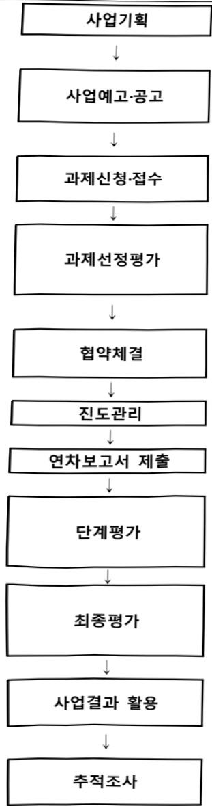

# 기후변화 적응 수재해 관리 기술개발사업(R&D)

**해당 페이지**: PDF 2667 ~ 2676 쪽 해당

**부처**: 기후에너지환경부
**분야**: 환경
**회계유형**: 환경개선 특별회계
**2026 확정예산**: 29897.0 백만원
**전년대비 증감률**: None%
**AI 도메인**: 데이터, 환경/기후

---

<table border=1 style='margin: auto; word-wrap: break-word;'><tr><td style='text-align: center; word-wrap: break-word;'>사 업 명</td></tr><tr><td style='text-align: center; word-wrap: break-word;'>(36) 기후변화 적응 수재해 관리 기술개발사업(R&amp;D) (2038-348)</td></tr></table>

□ 사업 코드 정보

<table border=1 style='margin: auto; word-wrap: break-word;'><tr><td style='text-align: center; word-wrap: break-word;'>구분</td><td style='text-align: center; word-wrap: break-word;'>회계</td><td style='text-align: center; word-wrap: break-word;'>소관</td><td style='text-align: center; word-wrap: break-word;'>실국(기관)</td><td style='text-align: center; word-wrap: break-word;'>계정</td><td style='text-align: center; word-wrap: break-word;'>분야</td><td style='text-align: center; word-wrap: break-word;'>부문</td></tr><tr><td style='text-align: center; word-wrap: break-word;'>코드</td><td rowspan="2">환경개선</td><td rowspan="2">환경부</td><td rowspan="2">수자원정책관</td><td rowspan="2">-</td><td style='text-align: center; word-wrap: break-word;'>070</td><td style='text-align: center; word-wrap: break-word;'>077</td></tr><tr><td style='text-align: center; word-wrap: break-word;'>명칭</td><td style='text-align: center; word-wrap: break-word;'>환경</td><td style='text-align: center; word-wrap: break-word;'>물환경</td></tr></table>

<table border=1 style='margin: auto; word-wrap: break-word;'><tr><td style='text-align: center; word-wrap: break-word;'>구분</td><td style='text-align: center; word-wrap: break-word;'>프로그램</td><td style='text-align: center; word-wrap: break-word;'>단위사업</td><td style='text-align: center; word-wrap: break-word;'>세부사업</td></tr><tr><td style='text-align: center; word-wrap: break-word;'>코드</td><td style='text-align: center; word-wrap: break-word;'>2000</td><td style='text-align: center; word-wrap: break-word;'>2038</td><td style='text-align: center; word-wrap: break-word;'>348</td></tr><tr><td style='text-align: center; word-wrap: break-word;'>명칭</td><td style='text-align: center; word-wrap: break-word;'>맑은물 공급·이용</td><td style='text-align: center; word-wrap: break-word;'>물산업 및 물기술 진흥</td><td style='text-align: center; word-wrap: break-word;'>기후변화 적응 수재해 관리 기술개발사업(R&amp;D)</td></tr></table>

□ 사업 성격 (공통요구자료 Ⅱ-1 작성유의사항 4. 참조, 해당하는 사항에 “○” 표시)

<table border=1 style='margin: auto; word-wrap: break-word;'><tr><td rowspan="2">신규</td><td rowspan="2">계속</td><td rowspan="2">완료</td><td rowspan="2">예비타당성 실시여부</td><td rowspan="2">총사업비 관리대상</td><td rowspan="2">총액계상 예산사업</td><td style='text-align: center; word-wrap: break-word;'>사업소관 변경정보</td></tr><tr><td style='text-align: center; word-wrap: break-word;'>2025예산 시 소관</td></tr><tr><td style='text-align: center; word-wrap: break-word;'>O</td><td style='text-align: center; word-wrap: break-word;'></td><td style='text-align: center; word-wrap: break-word;'></td><td style='text-align: center; word-wrap: break-word;'>O</td><td style='text-align: center; word-wrap: break-word;'></td><td style='text-align: center; word-wrap: break-word;'></td><td style='text-align: center; word-wrap: break-word;'></td></tr></table>

□ 사업 지원 형태 및 지원을 (최소한 한 개는 반드시 선택하시오. 해당사항에 0 표시)

<table border=1 style='margin: auto; word-wrap: break-word;'><tr><td style='text-align: center; word-wrap: break-word;'>직접</td><td style='text-align: center; word-wrap: break-word;'>출자</td><td style='text-align: center; word-wrap: break-word;'>출연</td><td style='text-align: center; word-wrap: break-word;'>보조</td><td style='text-align: center; word-wrap: break-word;'>융자</td><td style='text-align: center; word-wrap: break-word;'>국고보조율(%)</td><td style='text-align: center; word-wrap: break-word;'>융자율(%)</td></tr><tr><td style='text-align: center; word-wrap: break-word;'></td><td style='text-align: center; word-wrap: break-word;'></td><td style='text-align: center; word-wrap: break-word;'>O</td><td style='text-align: center; word-wrap: break-word;'></td><td style='text-align: center; word-wrap: break-word;'></td><td style='text-align: center; word-wrap: break-word;'></td><td style='text-align: center; word-wrap: break-word;'></td></tr></table>

☐ 사업 담당자

<table border=1 style='margin: auto; word-wrap: break-word;'><tr><td style='text-align: center; word-wrap: break-word;'>사업명</td><td colspan="2">구분</td></tr><tr><td rowspan="3">기후변화 적응 수재해 관리 기술개발사업 (R&amp;D)</td><td rowspan="2">소관부처</td><td style='text-align: center; word-wrap: break-word;'>물관리정책실 수자원정책관</td></tr><tr><td style='text-align: center; word-wrap: break-word;'>물재해대응과</td></tr><tr><td style='text-align: center; word-wrap: break-word;'>사업시행주체</td><td style='text-align: center; word-wrap: break-word;'>한국환경산업기술원</td></tr></table>

---

### 가. 예산 총괄표

(단위:백만원,%)

<table border=1 style='margin: auto; word-wrap: break-word;'><tr><td rowspan="2">사업명</td><td rowspan="2">2024년 결산</td><td colspan="2">2025년 예산</td><td colspan="2">2026년</td><td rowspan="2">증감(B-A)</td><td rowspan="2">(B-A)/A</td></tr><tr><td style='text-align: center; word-wrap: break-word;'>본예산(A)</td><td style='text-align: center; word-wrap: break-word;'>추경</td><td style='text-align: center; word-wrap: break-word;'>정부안</td><td style='text-align: center; word-wrap: break-word;'>확정(B)</td></tr><tr><td style='text-align: center; word-wrap: break-word;'>기후변화 적응 수재해 관리 기술개발사업(R&amp;D)</td><td style='text-align: center; word-wrap: break-word;'>-</td><td style='text-align: center; word-wrap: break-word;'>-</td><td style='text-align: center; word-wrap: break-word;'>-</td><td style='text-align: center; word-wrap: break-word;'>29,897</td><td style='text-align: center; word-wrap: break-word;'>29,897</td><td style='text-align: center; word-wrap: break-word;'>29,897</td><td style='text-align: center; word-wrap: break-word;'>순증</td></tr></table>

□ 기능별(내역사업별), 목별 예산 내역

(단위:백만원)

<table border=1 style='margin: auto; word-wrap: break-word;'><tr><td rowspan="3"></td><td colspan="5">2024</td><td colspan="7">2025</td><td rowspan="3">2026예산</td></tr><tr><td rowspan="2">예산액(추경)</td><td rowspan="2">예산현액</td><td rowspan="2">집행액[실집행액]</td><td rowspan="2">이월액</td><td rowspan="2">불용액</td><td rowspan="2">본예산</td><td rowspan="2">예산현액</td><td rowspan="2">집행액[실집행액]</td><td colspan="2">전년도 이월액제외</td><td rowspan="2">이월예상액</td><td rowspan="2">불용예상액</td></tr><tr><td style='text-align: center; word-wrap: break-word;'>예산현액</td><td style='text-align: center; word-wrap: break-word;'>집행액[실집행액]</td></tr><tr><td style='text-align: center; word-wrap: break-word;'>○ 기능별 분류(합계)</td><td style='text-align: center; word-wrap: break-word;'>-</td><td style='text-align: center; word-wrap: break-word;'>-</td><td style='text-align: center; word-wrap: break-word;'>-</td><td style='text-align: center; word-wrap: break-word;'>-</td><td style='text-align: center; word-wrap: break-word;'>-</td><td style='text-align: center; word-wrap: break-word;'>-</td><td style='text-align: center; word-wrap: break-word;'>-</td><td style='text-align: center; word-wrap: break-word;'>-</td><td style='text-align: center; word-wrap: break-word;'>-</td><td style='text-align: center; word-wrap: break-word;'>-</td><td style='text-align: center; word-wrap: break-word;'>-</td><td style='text-align: center; word-wrap: break-word;'>-</td><td style='text-align: center; word-wrap: break-word;'>29,897</td></tr><tr><td style='text-align: center; word-wrap: break-word;'>· 기후위기 대응 수제해 감시 기술개발</td><td style='text-align: center; word-wrap: break-word;'>-</td><td style='text-align: center; word-wrap: break-word;'>-</td><td style='text-align: center; word-wrap: break-word;'>-</td><td style='text-align: center; word-wrap: break-word;'>-</td><td style='text-align: center; word-wrap: break-word;'>-</td><td style='text-align: center; word-wrap: break-word;'>-</td><td style='text-align: center; word-wrap: break-word;'>-</td><td style='text-align: center; word-wrap: break-word;'>-</td><td style='text-align: center; word-wrap: break-word;'>-</td><td style='text-align: center; word-wrap: break-word;'>-</td><td style='text-align: center; word-wrap: break-word;'>-</td><td style='text-align: center; word-wrap: break-word;'>-</td><td style='text-align: center; word-wrap: break-word;'>8,449</td></tr><tr><td style='text-align: center; word-wrap: break-word;'>· 홍수  대응능력 강화 기술개발</td><td style='text-align: center; word-wrap: break-word;'>-</td><td style='text-align: center; word-wrap: break-word;'>-</td><td style='text-align: center; word-wrap: break-word;'>-</td><td style='text-align: center; word-wrap: break-word;'>-</td><td style='text-align: center; word-wrap: break-word;'>-</td><td style='text-align: center; word-wrap: break-word;'>-</td><td style='text-align: center; word-wrap: break-word;'>-</td><td style='text-align: center; word-wrap: break-word;'>-</td><td style='text-align: center; word-wrap: break-word;'>-</td><td style='text-align: center; word-wrap: break-word;'>-</td><td style='text-align: center; word-wrap: break-word;'>-</td><td style='text-align: center; word-wrap: break-word;'>-</td><td style='text-align: center; word-wrap: break-word;'>17,186</td></tr><tr><td style='text-align: center; word-wrap: break-word;'>· 물수요 대응 수지원 확보 기술개발</td><td style='text-align: center; word-wrap: break-word;'>-</td><td style='text-align: center; word-wrap: break-word;'>-</td><td style='text-align: center; word-wrap: break-word;'>-</td><td style='text-align: center; word-wrap: break-word;'>-</td><td style='text-align: center; word-wrap: break-word;'>-</td><td style='text-align: center; word-wrap: break-word;'>-</td><td style='text-align: center; word-wrap: break-word;'>-</td><td style='text-align: center; word-wrap: break-word;'>-</td><td style='text-align: center; word-wrap: break-word;'>-</td><td style='text-align: center; word-wrap: break-word;'>-</td><td style='text-align: center; word-wrap: break-word;'>-</td><td style='text-align: center; word-wrap: break-word;'>-</td><td style='text-align: center; word-wrap: break-word;'>4,262</td></tr><tr><td style='text-align: center; word-wrap: break-word;'>○ 비목별 분류(합계)</td><td style='text-align: center; word-wrap: break-word;'>-</td><td style='text-align: center; word-wrap: break-word;'>-</td><td style='text-align: center; word-wrap: break-word;'>-</td><td style='text-align: center; word-wrap: break-word;'>-</td><td style='text-align: center; word-wrap: break-word;'>-</td><td style='text-align: center; word-wrap: break-word;'>-</td><td style='text-align: center; word-wrap: break-word;'>-</td><td style='text-align: center; word-wrap: break-word;'>-</td><td style='text-align: center; word-wrap: break-word;'>-</td><td style='text-align: center; word-wrap: break-word;'>-</td><td style='text-align: center; word-wrap: break-word;'>-</td><td style='text-align: center; word-wrap: break-word;'>-</td><td style='text-align: center; word-wrap: break-word;'>29,897</td></tr><tr><td style='text-align: center; word-wrap: break-word;'>· 연구개발활동비 등(360-05)</td><td style='text-align: center; word-wrap: break-word;'>-</td><td style='text-align: center; word-wrap: break-word;'>-</td><td style='text-align: center; word-wrap: break-word;'>-</td><td style='text-align: center; word-wrap: break-word;'>-</td><td style='text-align: center; word-wrap: break-word;'>-</td><td style='text-align: center; word-wrap: break-word;'>-</td><td style='text-align: center; word-wrap: break-word;'>-</td><td style='text-align: center; word-wrap: break-word;'>-</td><td style='text-align: center; word-wrap: break-word;'>-</td><td style='text-align: center; word-wrap: break-word;'>-</td><td style='text-align: center; word-wrap: break-word;'>-</td><td style='text-align: center; word-wrap: break-word;'>-</td><td style='text-align: center; word-wrap: break-word;'>29,897</td></tr><tr><td style='text-align: center; word-wrap: break-word;'>○ 기능비목별 분류합계</td><td style='text-align: center; word-wrap: break-word;'>-</td><td style='text-align: center; word-wrap: break-word;'>-</td><td style='text-align: center; word-wrap: break-word;'>-</td><td style='text-align: center; word-wrap: break-word;'>-</td><td style='text-align: center; word-wrap: break-word;'>-</td><td style='text-align: center; word-wrap: break-word;'>-</td><td style='text-align: center; word-wrap: break-word;'>-</td><td style='text-align: center; word-wrap: break-word;'>-</td><td style='text-align: center; word-wrap: break-word;'>-</td><td style='text-align: center; word-wrap: break-word;'>-</td><td style='text-align: center; word-wrap: break-word;'>-</td><td style='text-align: center; word-wrap: break-word;'>-</td><td style='text-align: center; word-wrap: break-word;'>29,897</td></tr><tr><td style='text-align: center; word-wrap: break-word;'>· 기후위기 대응 수제해 감시 기술개발 -연구개발활동비 (360-05)</td><td style='text-align: center; word-wrap: break-word;'>-</td><td style='text-align: center; word-wrap: break-word;'>-</td><td style='text-align: center; word-wrap: break-word;'>-</td><td style='text-align: center; word-wrap: break-word;'>-</td><td style='text-align: center; word-wrap: break-word;'>-</td><td style='text-align: center; word-wrap: break-word;'>-</td><td style='text-align: center; word-wrap: break-word;'>-</td><td style='text-align: center; word-wrap: break-word;'>-</td><td style='text-align: center; word-wrap: break-word;'>-</td><td style='text-align: center; word-wrap: break-word;'>-</td><td style='text-align: center; word-wrap: break-word;'>-</td><td style='text-align: center; word-wrap: break-word;'>-</td><td style='text-align: center; word-wrap: break-word;'>8,449</td></tr><tr><td style='text-align: center; word-wrap: break-word;'>· 홍수  대응능력 강화 기술개발 -연구개발활동비 (360-05)</td><td style='text-align: center; word-wrap: break-word;'>-</td><td style='text-align: center; word-wrap: break-word;'>-</td><td style='text-align: center; word-wrap: break-word;'>-</td><td style='text-align: center; word-wrap: break-word;'>-</td><td style='text-align: center; word-wrap: break-word;'>-</td><td style='text-align: center; word-wrap: break-word;'>-</td><td style='text-align: center; word-wrap: break-word;'>-</td><td style='text-align: center; word-wrap: break-word;'>-</td><td style='text-align: center; word-wrap: break-word;'>-</td><td style='text-align: center; word-wrap: break-word;'>-</td><td style='text-align: center; word-wrap: break-word;'>-</td><td style='text-align: center; word-wrap: break-word;'>-</td><td style='text-align: center; word-wrap: break-word;'>17,186</td></tr><tr><td style='text-align: center; word-wrap: break-word;'>· 물수요 대응 수지원 확보 기술개발 -연구개발활동비 (360-05)</td><td style='text-align: center; word-wrap: break-word;'>-</td><td style='text-align: center; word-wrap: break-word;'>-</td><td style='text-align: center; word-wrap: break-word;'>-</td><td style='text-align: center; word-wrap: break-word;'>-</td><td style='text-align: center; word-wrap: break-word;'>-</td><td style='text-align: center; word-wrap: break-word;'>-</td><td style='text-align: center; word-wrap: break-word;'>-</td><td style='text-align: center; word-wrap: break-word;'>-</td><td style='text-align: center; word-wrap: break-word;'>-</td><td style='text-align: center; word-wrap: break-word;'>-</td><td style='text-align: center; word-wrap: break-word;'>-</td><td style='text-align: center; word-wrap: break-word;'>-</td><td style='text-align: center; word-wrap: break-word;'>17,186</td></tr></table>

---

### 나. 사업설명자료

## 1 ) 사업목적·내용

- (세부사업명) 기후변화 적응 수재해 관리 기술개발사업

- (사업목적) 수재해 관리 기술 고도화를 통해 기후변화로 인하여 심화되는 수재해에 대한 적응역량 및 대응능력 강화

- (사업목표) 기후위기로 인한 수재해 피해 최소화 및 국민안전 확보를 위한 수재해 관리 핵심기술 개발

- (내역사업1 - 기후위기 대응 수재해 감시기술개발) 동 내역사업은 기후변화로 급증하는 수재해에 대한 감시 및 예측 정확도를 높여 수재해 피해저감과 기후변화 적응역량을 강화하기 위해 인공지능(AI)을 활용한 강우·유출량 빅데이터 분석, 홍수 예측모형 고도화 등 기술개발을 지원하는 것임

- (내역사업2 - 홍수 대응능력 강화 기술개발) 동 내역사업은 극한호우로 발생하는 홍수(하천범람 및 도시침수) 피해를 저감하기 위해 모듈러 방식의 월류방어벽과 대심

도 빛물터널 등의 홍수 대응 기반시설(인프라) 개선 등 기술개발을 지원하는 것임

- (내역사업3 - 물수요 대응 수자원 확보 기술개발) 동 내역사업은 가뭄빈도 증가와

산업 변화에 따라 증대되는 물수요에 대응하기 위해 용도별 물수요-공급 관리 시스템.

저탄소·고회수율 방식의 해수담수화 기술 등 기술개발을 지원하는 것임

## 2 ) 사업개요

## ☐ 사업근거 및 추진경위

①법령상 근거 및 조항

-「환경정책기본법」 제28조(환경과학기술의 진흥)

- 「환경기술 및 환경산업지원법」 제5조(환경기술개발사업의 추진)

- 「물관리기본법」 제5조(국가의 책무), 제39조(조사연구와 기술개발에 관한 지원 등)

-「수자원의 조사계획 및 관리에 관한 법률」제26조(수자원관리기술에 관한 연구 및 실용화)

- 「물관리기술 발전 및 물산업 진흥에 관한 법률」 제3조(국가의 책무), 제8조(물관리 기술 개발 촉진)

- 「도시하천유역 침수피해방지대책법」 제16조(연구개발)

---

② 추진경위

- 사업기획 추진 (2024.5 ~ 2024.9)

• 수재해 관련 정책, 기술동향 분석 (2024.5)

· 수재해 관련 분야 주요 이슈 및 해결방안 도출 (2024.5~6)

사업추진 방향 및 중점영역설정, 필요기술 도출, 기획위원회 운영 (2024.6 ~2024.9)

공청회 개최 (2024.9)

-예비타당성조사(2024.9~2025.6)

• 예비타당성조사 신청 및 2024년도 제3차 예비타당성조사 대상 사업 선정(2024.9~11)

• 예비타당성조사 (2024.12~2025.6)

• 예비타당성조사 결과 사업추진 타당성 확보 '시행' (2025.6)

## □ 주요내용

① 사업규모

- 총사업비(해당되는 경우에만 기재) : 해당사항 없음

- 사업기간 : '26~계속 (5년 주기 재검토)

- 최근 5년 간 투입된 사업비(예산액기준, 추경편성한 연도에는 추경포함)

<table border=1 style='margin: auto; word-wrap: break-word;'><tr><td style='text-align: center; word-wrap: break-word;'>연도</td><td style='text-align: center; word-wrap: break-word;'>2022</td><td style='text-align: center; word-wrap: break-word;'>2023</td><td style='text-align: center; word-wrap: break-word;'>2024</td><td style='text-align: center; word-wrap: break-word;'>2025</td><td style='text-align: center; word-wrap: break-word;'>2026</td></tr><tr><td style='text-align: center; word-wrap: break-word;'>사업비</td><td style='text-align: center; word-wrap: break-word;'>-</td><td style='text-align: center; word-wrap: break-word;'>-</td><td style='text-align: center; word-wrap: break-word;'>-</td><td style='text-align: center; word-wrap: break-word;'>-</td><td style='text-align: center; word-wrap: break-word;'>29,897</td></tr></table>

-기타: 해당없음

## ② 사업추진체계

- 사업시행방법 : 출연

- 사업시행주체 : 환경부(한국환경산업기술원)

-사업 수혜자 : 지자체, 국민 등

- 보조, 융자, 출연, 출자 등의 경우 보조·융자 등 지원 비율 및 법적근거

<table border=1 style='margin: auto; word-wrap: break-word;'><tr><td style='text-align: center; word-wrap: break-word;'>내역사업명</td><td style='text-align: center; word-wrap: break-word;'>구분</td><td style='text-align: center; word-wrap: break-word;'>피보조·피출연 등 기관명</td><td style='text-align: center; word-wrap: break-word;'>지원 금액 (2026계획)</td><td style='text-align: center; word-wrap: break-word;'>지원 비율(%)</td><td style='text-align: center; word-wrap: break-word;'>보조율 법적근거 (해당 조항)</td></tr><tr><td style='text-align: center; word-wrap: break-word;'>기후위기 대응 수지해 감시 기술개발</td><td style='text-align: center; word-wrap: break-word;'>출연</td><td style='text-align: center; word-wrap: break-word;'>한국환경산업기술원</td><td style='text-align: center; word-wrap: break-word;'>8,449백만원</td><td style='text-align: center; word-wrap: break-word;'>100</td><td style='text-align: center; word-wrap: break-word;'>「환경기술 및 환경산업 지원법」제5조</td></tr><tr><td style='text-align: center; word-wrap: break-word;'>홍수 대응능력 강화 기술개발</td><td style='text-align: center; word-wrap: break-word;'>출연</td><td style='text-align: center; word-wrap: break-word;'>한국환경산업기술원</td><td style='text-align: center; word-wrap: break-word;'>17,186백만원</td><td style='text-align: center; word-wrap: break-word;'>100</td><td style='text-align: center; word-wrap: break-word;'>「환경기술 및 환경산업 지원법」제5조</td></tr><tr><td style='text-align: center; word-wrap: break-word;'>물수요 대응 수지원 확보 기술개발</td><td style='text-align: center; word-wrap: break-word;'>출연</td><td style='text-align: center; word-wrap: break-word;'>한국환경산업기술원</td><td style='text-align: center; word-wrap: break-word;'>4,262백만원</td><td style='text-align: center; word-wrap: break-word;'>100</td><td style='text-align: center; word-wrap: break-word;'>「환경기술 및 환경산업 지원법」제5조</td></tr></table>

---

3) 2026년도 예산 산출 근거

□ 기후변화 적응 수재해 관리 기술개발사업 : (2025) - → (2026 예산) 29,897백만원, '25년 대비 순증

① 기후위기 대응 수재해 감시 기술개발

: (2025 본예산) - → (2026 요구) 8,449백만원, 순증

- (요구) 물순환 DNA 및 가뭄대응능력 모니터링/평가/예측 플랫폼 구축 등 5개 종료과제, 기후 위기 회복력

- (요구) 물순환 DNA 및 가뭄대응능력 모니터링/평가/예측 플랫폼 구축 등 5개 종료과제, 기후 위기 회복력

- (요구) 확보를 위한 극한 가뭄 및 돌발가뭄 감시·예측 기술개발 등 4개 신규과제 지원을 위한 8,449백만원 요구

- (산출) 종료 5개×885.8백만원×12개월/12개월=4,429백만원 신규 4개×1,340백만원×9개월/12개월=4,020백만원

② 홍수 대응능력 강화 기술개발

:(2025 본예산)→(2026 요구)17,186백만원,순증

- (요구) 자연성 기반 기술을 활용한 홍수 피해 저감 및 완충 기술개발 등 4개 종료과제, 도시침수대응 지하인프라 통수능력 향상 및 설계 고도화 기술개발 등 4개 계속과제, 기후위기 대응 댐 운영 기술 고도화 등 3개 신규과제 지원을 위한 17,186백만원 요구

- (산출) 종료 4개×1,117백만원×12개월/12개월=4,468백만원

  계속 4개×2,493.75백만원×12개월/12개월=9,975백만원

  신규 3개×1,219.1백만원×9개월/12개월=2,743백만원

③ 물수요 대응 수자원 확보 기술개발

:(2025 본예산)→(2026 요구)4,262백만원,순증

(요구) 가뭄기간 생태계를 고려한 물공급 대응능력 최적화 기술개발 등 3개 종료과제, 사회-수문 연계 용도별

물수요-공급 관리 시스템 개발 1개 신규과제 지원을 위한 4,262백만원 요구

- (산출) 종료 3개×1,026.7백만원×12개월/12개월=3,080백만원 신규 1개×1,576백만원×9개월/12개월=1,182백만원

2025년도 예산 및 2026년도 예산 산출 세부내역 비교

<table border=1 style='margin: auto; word-wrap: break-word;'><tr><td colspan="2">2025년 본예산</td><td colspan="2">2026년 예산</td></tr><tr><td style='text-align: center; word-wrap: break-word;'>예산</td><td style='text-align: center; word-wrap: break-word;'>산출내역</td><td style='text-align: center; word-wrap: break-word;'>예산</td><td style='text-align: center; word-wrap: break-word;'>산출내역</td></tr><tr><td style='text-align: center; word-wrap: break-word;'>-</td><td style='text-align: center; word-wrap: break-word;'>-</td><td style='text-align: center; word-wrap: break-word;'>29,897 백만원</td><td style='text-align: center; word-wrap: break-word;'>○ 기후위기 대응 수재해 감시 기술개발: 8,449백만원
• (종료) 5개×885.8만원×12/12개월 = 4,429백만원
• (신규) 4개×1,340만원×9/12개월 = 4,020백만원
○ 홍수 대응능력 강화 기술개발: 17,186백만원
• (종료) 4개×1,117만원×12/12개월 = 4,468백만원
• (계속) 4개×2,493.75만원×12/12개월 = 9,975백만원
• (신규) 3개×1,219.1만원×9/12개월 = 2,743백만원
○ 물수요 대응 수자원 확보 기술개발: 4,262백만원
• (종료) 3개×1,026.7만원×12/12개월 = 3,080백만원
• (신규) 1개×1,576만원×9/12개월 = 1,182백만원</td></tr></table>

---

## 4 ) 사업효과

☐ 사업영향, 산출물 성과지표 등

① 2022~2026년도 성과계획서 상 성과지표 및 최근 5년간 성과 달성도

<table border=1 style='margin: auto; word-wrap: break-word;'><tr><td style='text-align: center; word-wrap: break-word;'>성과지표</td><td style='text-align: center; word-wrap: break-word;'>구분</td><td style='text-align: center; word-wrap: break-word;'>2022</td><td style='text-align: center; word-wrap: break-word;'>2023</td><td style='text-align: center; word-wrap: break-word;'>2024</td><td style='text-align: center; word-wrap: break-word;'>2025</td><td style='text-align: center; word-wrap: break-word;'>2026</td><td style='text-align: center; word-wrap: break-word;'>2026 목표치산출근거</td><td style='text-align: center; word-wrap: break-word;'>측정산식(또는 측정방법)</td><td style='text-align: center; word-wrap: break-word;'>자료수집방법(또는 자료출처)</td></tr><tr><td rowspan="3">수재해 발생예측 모델 정확도 (단위: -)</td><td style='text-align: center; word-wrap: break-word;'>목표</td><td style='text-align: center; word-wrap: break-word;'>-</td><td style='text-align: center; word-wrap: break-word;'>-</td><td style='text-align: center; word-wrap: break-word;'>-</td><td style='text-align: center; word-wrap: break-word;'>-</td><td style='text-align: center; word-wrap: break-word;'>신규</td><td rowspan="3">신규지표임을 감안하여 1차 년도 목표는 미설정</td><td rowspan="3">(하천홍수 발생예측 모델 정확도+ 도시침수 발생예측 모델 정확도)*0.8 + (가뭄 발생예측 모델 정확도)*0.2</td><td rowspan="3">테스트베드 내 감시 모델 예측 정확도 측정</td></tr><tr><td style='text-align: center; word-wrap: break-word;'>실적</td><td style='text-align: center; word-wrap: break-word;'>-</td><td style='text-align: center; word-wrap: break-word;'>-</td><td style='text-align: center; word-wrap: break-word;'>-</td><td style='text-align: center; word-wrap: break-word;'>-</td><td style='text-align: center; word-wrap: break-word;'>-</td></tr><tr><td style='text-align: center; word-wrap: break-word;'>달성도</td><td style='text-align: center; word-wrap: break-word;'>-</td><td style='text-align: center; word-wrap: break-word;'>-</td><td style='text-align: center; word-wrap: break-word;'>-</td><td style='text-align: center; word-wrap: break-word;'>-</td><td style='text-align: center; word-wrap: break-word;'>-</td></tr><tr><td rowspan="3">외수범람 저감률 (단위: %)</td><td style='text-align: center; word-wrap: break-word;'>목표</td><td style='text-align: center; word-wrap: break-word;'>-</td><td style='text-align: center; word-wrap: break-word;'>-</td><td style='text-align: center; word-wrap: break-word;'>-</td><td style='text-align: center; word-wrap: break-word;'>-</td><td style='text-align: center; word-wrap: break-word;'>신규</td><td rowspan="3">신규지표임을 감안하여 1차 년도 목표는 미설정</td><td rowspan="3">(동사업 개발기술 적용 전 월 류량 - 동사업 개발기술 적용 후 월류량)/(동사업 개발기술 적용 전 월류량) × 100(%)</td><td rowspan="3">하천유역에 대한 유출 모델 황용</td></tr><tr><td style='text-align: center; word-wrap: break-word;'>실적</td><td style='text-align: center; word-wrap: break-word;'>-</td><td style='text-align: center; word-wrap: break-word;'>-</td><td style='text-align: center; word-wrap: break-word;'>-</td><td style='text-align: center; word-wrap: break-word;'>-</td><td style='text-align: center; word-wrap: break-word;'>-</td></tr><tr><td style='text-align: center; word-wrap: break-word;'>달성도</td><td style='text-align: center; word-wrap: break-word;'>-</td><td style='text-align: center; word-wrap: break-word;'>-</td><td style='text-align: center; word-wrap: break-word;'>-</td><td style='text-align: center; word-wrap: break-word;'>-</td><td style='text-align: center; word-wrap: break-word;'>-</td></tr><tr><td rowspan="3">도시침수량 저감률 (단위: %)</td><td style='text-align: center; word-wrap: break-word;'>목표</td><td style='text-align: center; word-wrap: break-word;'>-</td><td style='text-align: center; word-wrap: break-word;'>-</td><td style='text-align: center; word-wrap: break-word;'>-</td><td style='text-align: center; word-wrap: break-word;'>-</td><td style='text-align: center; word-wrap: break-word;'>신규</td><td rowspan="3">신규지표임을 감안하여 1차 년도 목표는 미설정</td><td rowspan="3">(동사업 개발기술 적용 전 도시침수량 - 동사업 개발기술 적용 후 도시침수량)/(동사업 개발기술 적용 전 도시침수량) × 100(%)</td><td rowspan="3">도시 침수 모델 황용</td></tr><tr><td style='text-align: center; word-wrap: break-word;'>실적</td><td style='text-align: center; word-wrap: break-word;'>-</td><td style='text-align: center; word-wrap: break-word;'>-</td><td style='text-align: center; word-wrap: break-word;'>-</td><td style='text-align: center; word-wrap: break-word;'>-</td><td style='text-align: center; word-wrap: break-word;'>-</td></tr><tr><td style='text-align: center; word-wrap: break-word;'>달성도</td><td style='text-align: center; word-wrap: break-word;'>-</td><td style='text-align: center; word-wrap: break-word;'>-</td><td style='text-align: center; word-wrap: break-word;'>-</td><td style='text-align: center; word-wrap: break-word;'>-</td><td style='text-align: center; word-wrap: break-word;'>-</td></tr><tr><td rowspan="3">가뭄 시 물공급 여유량 증가율 (단위: %)</td><td style='text-align: center; word-wrap: break-word;'>목표</td><td style='text-align: center; word-wrap: break-word;'>-</td><td style='text-align: center; word-wrap: break-word;'>-</td><td style='text-align: center; word-wrap: break-word;'>-</td><td style='text-align: center; word-wrap: break-word;'>-</td><td style='text-align: center; word-wrap: break-word;'>신규</td><td rowspan="3">신규지표임을 감안하여 1차 년도 목표는 미설정</td><td rowspan="3">(동사업 개발기술 적용 전 물공급 여유량 - 동사업 개발기술 적용 후 물공급 여유량)/(동사업 개발기술 적용 전 물공급 여유량) × 100(%)</td><td rowspan="3">수요량 및 공급가능량 정보 측정</td></tr><tr><td style='text-align: center; word-wrap: break-word;'>실적</td><td style='text-align: center; word-wrap: break-word;'>-</td><td style='text-align: center; word-wrap: break-word;'>-</td><td style='text-align: center; word-wrap: break-word;'>-</td><td style='text-align: center; word-wrap: break-word;'>-</td><td style='text-align: center; word-wrap: break-word;'>-</td></tr><tr><td style='text-align: center; word-wrap: break-word;'>달성도</td><td style='text-align: center; word-wrap: break-word;'>-</td><td style='text-align: center; word-wrap: break-word;'>-</td><td style='text-align: center; word-wrap: break-word;'>-</td><td style='text-align: center; word-wrap: break-word;'>-</td><td style='text-align: center; word-wrap: break-word;'>-</td></tr></table>

② 성과지표 이외의 연도별 사업추진 경과 및 실적 : 해당사항 없음('26년 신규사업)

③향후(2026년도 이후)기대효과

- AI 기반 가뭄 예측 기술 및 물순환 분석 기술개발을 통해 기후변화로 인한 새로운 유형의 가뭄에 대응 정책 수립 및 추진 가능

- 기후-사회-수문 상호관계를 고려한 미래 여건 변화 시나리오 구축과 시나리오 기반

수자원 및 미래 물수급 전망 기술개발을 통해 미래 수자원 정책 방향에 기여

---

- 현행 환경부 AI 홍수예보 모형 고도화를 통해 홍수예보의 정확도를 향상시켜 확대된 홍수특보지점에 적극 활용

- 정확한 예측 데이터 기반으로 하천홍수 및 도시침수 피해저감 관리를 최적화하여 수재해 복구 비용 등 사회적 비용 절감

- 디지털트런 기술로 국가하천 홍수 등 재난 발생 시 의사결정 지원과 신속한 필요성

보 제공으로 홍수 피해 최소화 및 하천시설 운영효율 향상

- 모듈형 월류 방어벽 설치 등으로 홍수 발생 시 하천 인근 지역에서 발생할 수 있는

직간접적인 피해 최소화, 홍수 피해 사전 방지로 복구 및 재건 비용 절감

- 기후변화로 인한 미래 수자원 부족량의 변동성을 고려하여 수자원의 효율적 이용이

가능하고 이를 통한 국가예산의 효율적 집행에 따른 경제적 효과 개선

- 대체수자원 개발로 물 부족 지역에 안정적인 물 공급 기여

## 5 ) 타당성조사 및 예비타당성조사 시행여부 및 결과 요지

- (조사기간) '24년도 제3차 예비타당성조사, '24.9 ~ '25.6

- (조사기관) 한국과학기술기획평가원(KISTEP)

- (조사결과) 시행 (E/C 96.21억원, AHP 0.753)

- (조사결과 반영현황) 원안 1,322억원(국고)에서 대안으로 948억원(국고) 반영

6) 총사업비 대상사업 여부 및 내역 : 해당사항 없음

---

## 7 ) 사업 집행절차

### ☐ 환경부.한국환경산업기술원

*「환경기술개발사업운영규정」제16조(사전기획 및 연구개발과제의 발굴), 제18조(세부 추진계획의 수립·확정·예고)

°환경부·한국환경산업기술원:사업 예고 및 추진계획 공고

- 사업목적, 연구개발비, 공모일정, 지원내용 및 기간

*「환경기술개발사업운영규정」제18조(세부추진계획의 수립·확정·예고). 제19조(연구개발과제 및 연구개발기관의 공모)

○ 연구개발기관 : 신규과제 연구개발계획서 작성.신청

○ 한국환경산업기술원 : 접수

*「환경기술개발사업운영규정」제20조(사업참여의 신청)

- 한국환경산업기술원

- 사전검토 → 선정평가(발표·패널심사) → 전문기관 조정

- 환경부 : 심의 및 연구개발과제 확정

*「환경기술개발사업운영규정」제21조(사전검토). 제22조(연구개발계획서의 평가·심의 및 선정)

°협약 : 환경부 ↔ 한국환경산업기술원

- 한국환경산업기술원 ↔ 연구개발기관

*「환경기술개발사업운영규정」제26조(협약의 체결)

•한국환경산업기술원:진도관리 또는 현장조사,필요 시 특별평가

*「환경기술개발사업운영규정제36조(과제수행 및 진도 관리)

·한국환경산업기술원:연차보고서점검

*「환경기술개발사업운영규정」제37조(연차보고서의 제출)

- 한국환경산업기술원 : 해당단계 종료 시, 단계보고서 평가

- 단계평가→전문기관 조정

- 환경부 : 심의 및 연구개발과제의 다음단계 계획 확정

*「환경기술개발사업운영규정」제38조(단계평가)

·한국환경산업기술원:최종연구결과 및성과활용계획평가

-최종평가

·환경부:심의 및연구개발과제최종등급확정

*「환경기술개발사업운영규정」제39조(최종평가)

• 한국환경산업기술원/연구개발성과 소유기관

: 기술실시계약(기술료 징수) 및 실시

*「환경기술개발사업운영규정」제48조(연구개발사업성과의 활용촉진), 제49조(기술료의 징수)

°한국환경산업기술원 : 종료된 해의 다음해부터 5년 동안 연구개발기관이 제출한 성과활용보고서 조사·분석

-기후위기 대응 수재해 감시 기술개발

<table border=1 style='margin: auto; word-wrap: break-word;'><tr><td style='text-align: center; word-wrap: break-word;'>부처</td><td style='text-align: center; word-wrap: break-word;'></td><td style='text-align: center; word-wrap: break-word;'>피출연·피보조기관</td><td style='text-align: center; word-wrap: break-word;'></td><td style='text-align: center; word-wrap: break-word;'>간접보조사업자·사업수행자</td></tr><tr><td style='text-align: center; word-wrap: break-word;'>환경부(8,449백만원)</td><td style='text-align: center; word-wrap: break-word;'>=&gt;(8,449백만원)</td><td style='text-align: center; word-wrap: break-word;'>한국환경산업기술원(-)</td><td style='text-align: center; word-wrap: break-word;'>=&gt;(8,449백만원)</td><td style='text-align: center; word-wrap: break-word;'>세종대학교산학협력단외 15개 기관.</td></tr></table>

---

-홍수 대응능력 강화 기술개발

<table border=1 style='margin: auto; word-wrap: break-word;'><tr><td style='text-align: center; word-wrap: break-word;'>부처</td><td style='text-align: center; word-wrap: break-word;'></td><td style='text-align: center; word-wrap: break-word;'>피출연·피보조기관</td><td style='text-align: center; word-wrap: break-word;'></td><td style='text-align: center; word-wrap: break-word;'>간접보조사업자·사업수행자</td></tr><tr><td style='text-align: center; word-wrap: break-word;'>환경부(17,186백만원)</td><td style='text-align: center; word-wrap: break-word;'>=&gt;(17,186백만원)</td><td style='text-align: center; word-wrap: break-word;'>한국환경산업기술원(-)</td><td style='text-align: center; word-wrap: break-word;'>=&gt;(17,186백만원)</td><td style='text-align: center; word-wrap: break-word;'>인하대학교산학협력단의 34개 기관</td></tr></table>

- 물수요 대응 수자원 확보 기술개발

<table border=1 style='margin: auto; word-wrap: break-word;'><tr><td style='text-align: center; word-wrap: break-word;'>부처</td><td style='text-align: center; word-wrap: break-word;'></td><td style='text-align: center; word-wrap: break-word;'>피출연·피보조기관</td><td style='text-align: center; word-wrap: break-word;'></td><td style='text-align: center; word-wrap: break-word;'>간접보조사업자·사업수행자</td></tr><tr><td style='text-align: center; word-wrap: break-word;'>환경부(4,262백만원)</td><td style='text-align: center; word-wrap: break-word;'>=&gt;(4,262백만원)</td><td style='text-align: center; word-wrap: break-word;'>한국환경산업기술원(-)</td><td style='text-align: center; word-wrap: break-word;'>=&gt;(4,262백만원)</td><td style='text-align: center; word-wrap: break-word;'>아주대학교산학협력단외 10개 기관</td></tr></table>

8) 중기재정계획 상 연도별 투자계획 및 추진경과

(단위:백만원)

<table border=1 style='margin: auto; word-wrap: break-word;'><tr><td style='text-align: center; word-wrap: break-word;'>2024 2025 2026 2027 2028 2029 2025~2029</td><td style='text-align: center; word-wrap: break-word;'>2024</td><td style='text-align: center; word-wrap: break-word;'>2025</td><td style='text-align: center; word-wrap: break-word;'>2026</td><td style='text-align: center; word-wrap: break-word;'>2027</td><td style='text-align: center; word-wrap: break-word;'>2028</td><td style='text-align: center; word-wrap: break-word;'>2029</td></tr><tr><td style='text-align: center; word-wrap: break-word;'>2024~2028</td><td style='text-align: center; word-wrap: break-word;'>-</td><td style='text-align: center; word-wrap: break-word;'>-</td><td style='text-align: center; word-wrap: break-word;'>-</td><td style='text-align: center; word-wrap: break-word;'>-</td><td style='text-align: center; word-wrap: break-word;'>-</td><td style='text-align: center; word-wrap: break-word;'>☑</td></tr><tr><td style='text-align: center; word-wrap: break-word;'>2025~2029</td><td style='text-align: center; word-wrap: break-word;'>☑</td><td style='text-align: center; word-wrap: break-word;'>-</td><td style='text-align: center; word-wrap: break-word;'>33,279</td><td style='text-align: center; word-wrap: break-word;'>30,930</td><td style='text-align: center; word-wrap: break-word;'>31,565</td><td style='text-align: center; word-wrap: break-word;'>21,159</td></tr></table>

※예비타당성조사 원안(1,322억원)에 대해 기제출된 중기재정계획임

9) 최근 3년간 동 사업에 대한 주요 외부지적사항 및 평가, 문제점 및 대책

- 해당없음

10) 향후 추진방향 및 추진계획

<table border=1 style='margin: auto; word-wrap: break-word;'><tr><td style='text-align: center; word-wrap: break-word;'>- 예비타당성조사에서 성과목표 및 성과지표의 보완을 명시하였으며, 이에 따라 성과목표 및 성과지표 개념 및 측정방법 명확화를 하여 지표를 관리할 계획</td></tr><tr><td style='text-align: center; word-wrap: break-word;'>- 수재해 정책을 담당하는 유관기관과의 유기적인 협력체계 구축을 통해 수요기관의 현장 니즈를 적극 반영하여 기술개발결과의 현장 활용성 제고</td></tr></table>

11) 해당사업에 대한 각종 사업평가의 결과 : 해당사항 없음

12) 해당사업에 대한 부처 자체평가의 결과 : 해당사항 없음

13) 부처 건의사항 : 해당사항 없음

---

### 다.최근 4년간 결산내역

## 1 ) 결산표

☐ 부처 결산내역 : '26년 신규사업으로 해당사항 없음

□출연·보조사업 등 실집행내역 : '26년 신규사업으로 해당사항 없음

## 2 ) 주요 결산사항

□ 2022~2025년 결산 주요 지적사항 및 시정요구사항 : 해당사항 없음

2025년 이·전용 등 세부내역 : 해당사항 없음

2025년 예비비 배정 세부내역 : 해당사항 없음

---

### 원본 PDF 크롭 이미지

