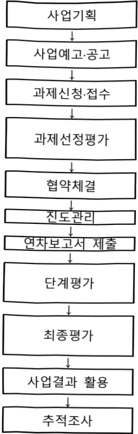

# 기후변화 적응을 위한 생태계 복원 및 관리 기술개발사…

**해당 페이지**: PDF 2677 ~ 2683 쪽 해당

**부처**: 기후에너지환경부
**분야**: 환경
**회계유형**: 환경개선 특별회계
**2026 확정예산**: 5900.0 백만원
**전년대비 증감률**: None%
**AI 도메인**: 환경/기후, 산림/생태

---

<table border=1 style='margin: auto; word-wrap: break-word;'><tr><td style='text-align: center; word-wrap: break-word;'>사 업 명</td></tr><tr><td style='text-align: center; word-wrap: break-word;'>(127) 기후변화 적응을 위한 생태계 복원 및 관리 기술개발사업(1832-353)</td></tr></table>

□ 사업 코드 정보

<table border=1 style='margin: auto; word-wrap: break-word;'><tr><td style='text-align: center; word-wrap: break-word;'>구분</td><td style='text-align: center; word-wrap: break-word;'>회계</td><td style='text-align: center; word-wrap: break-word;'>소관</td><td style='text-align: center; word-wrap: break-word;'>실국(기관)</td><td style='text-align: center; word-wrap: break-word;'>계정</td><td style='text-align: center; word-wrap: break-word;'>분야</td><td style='text-align: center; word-wrap: break-word;'>부문</td></tr><tr><td style='text-align: center; word-wrap: break-word;'>코드</td><td style='text-align: center; word-wrap: break-word;'>환경개선</td><td rowspan="2">환경부</td><td rowspan="2">자연보전국</td><td rowspan="2"></td><td style='text-align: center; word-wrap: break-word;'>070</td><td style='text-align: center; word-wrap: break-word;'>07A</td></tr><tr><td style='text-align: center; word-wrap: break-word;'>명칭</td><td style='text-align: center; word-wrap: break-word;'>특별회계</td><td style='text-align: center; word-wrap: break-word;'>환경</td><td style='text-align: center; word-wrap: break-word;'>자연환경</td></tr></table>

<table border=1 style='margin: auto; word-wrap: break-word;'><tr><td style='text-align: center; word-wrap: break-word;'>구분</td><td style='text-align: center; word-wrap: break-word;'>프로그램</td><td style='text-align: center; word-wrap: break-word;'>단위사업</td><td style='text-align: center; word-wrap: break-word;'>세부사업</td></tr><tr><td style='text-align: center; word-wrap: break-word;'>코드</td><td style='text-align: center; word-wrap: break-word;'>1800</td><td style='text-align: center; word-wrap: break-word;'>1832</td><td style='text-align: center; word-wrap: break-word;'>353</td></tr><tr><td style='text-align: center; word-wrap: break-word;'>명칭</td><td style='text-align: center; word-wrap: break-word;'>자연생태 보전</td><td style='text-align: center; word-wrap: break-word;'>자연생태 복원</td><td style='text-align: center; word-wrap: break-word;'>기후변화 적응을 위한 생태계 복원 및 관리 기술개발사업</td></tr></table>

□ 사업 성격 (공통요구자료 Ⅱ-1 작성유의사항 4. 참조, 해당하는 사항에 “○” 표시)

<table border=1 style='margin: auto; word-wrap: break-word;'><tr><td style='text-align: center; word-wrap: break-word;'>신규</td><td style='text-align: center; word-wrap: break-word;'>계속</td><td style='text-align: center; word-wrap: break-word;'>완료</td><td style='text-align: center; word-wrap: break-word;'>예비타당성 실시여부</td><td style='text-align: center; word-wrap: break-word;'>총사업비 관리대상</td><td style='text-align: center; word-wrap: break-word;'>총액계상 예산사업</td><td style='text-align: center; word-wrap: break-word;'>사업소관 변경정보 2025예산 시 소관</td></tr><tr><td style='text-align: center; word-wrap: break-word;'>○</td><td style='text-align: center; word-wrap: break-word;'></td><td style='text-align: center; word-wrap: break-word;'></td><td style='text-align: center; word-wrap: break-word;'></td><td style='text-align: center; word-wrap: break-word;'></td><td style='text-align: center; word-wrap: break-word;'></td><td style='text-align: center; word-wrap: break-word;'></td></tr></table>

□ 사업 지원 형태 및 지원을 (최소한 한 개는 반드시 선택하시오. 해당사항에 0 표시)

<table border=1 style='margin: auto; word-wrap: break-word;'><tr><td style='text-align: center; word-wrap: break-word;'>직접</td><td style='text-align: center; word-wrap: break-word;'>출자</td><td style='text-align: center; word-wrap: break-word;'>출연</td><td style='text-align: center; word-wrap: break-word;'>보조</td><td style='text-align: center; word-wrap: break-word;'>융자</td><td style='text-align: center; word-wrap: break-word;'>국고보조율(%)</td><td style='text-align: center; word-wrap: break-word;'>융자율(%)</td></tr><tr><td style='text-align: center; word-wrap: break-word;'></td><td style='text-align: center; word-wrap: break-word;'></td><td style='text-align: center; word-wrap: break-word;'>○</td><td style='text-align: center; word-wrap: break-word;'></td><td style='text-align: center; word-wrap: break-word;'></td><td style='text-align: center; word-wrap: break-word;'></td><td style='text-align: center; word-wrap: break-word;'></td></tr></table>

☐ 사업 담당자

<table border=1 style='margin: auto; word-wrap: break-word;'><tr><td style='text-align: center; word-wrap: break-word;'>사업명</td><td colspan="2">구분</td></tr><tr><td rowspan="3">기후변화 적응을 위한 생태계복원 및 관리 기술개발사업</td><td rowspan="2">소관부처</td><td style='text-align: center; word-wrap: break-word;'>자연보전국</td></tr><tr><td style='text-align: center; word-wrap: break-word;'>자연생태정책과</td></tr><tr><td style='text-align: center; word-wrap: break-word;'>사업시행주체</td><td style='text-align: center; word-wrap: break-word;'>한국환경산업기술원</td></tr></table>

---

### 가. 예산 총괄표

(단위:백만원,%)

<table border=1 style='margin: auto; word-wrap: break-word;'><tr><td rowspan="2">사업명</td><td rowspan="2">2024년 결산</td><td colspan="2">2025년 예산</td><td colspan="2">2026년</td><td rowspan="2">증감(B-A)</td><td rowspan="2">(B-A)/A</td></tr><tr><td style='text-align: center; word-wrap: break-word;'>본예산(A)</td><td style='text-align: center; word-wrap: break-word;'>추경</td><td style='text-align: center; word-wrap: break-word;'>정부안</td><td style='text-align: center; word-wrap: break-word;'>확정(B)</td></tr><tr><td style='text-align: center; word-wrap: break-word;'>기후변화 적응을 위한 생태계복원 및 관리 기술개발사업</td><td style='text-align: center; word-wrap: break-word;'>-</td><td style='text-align: center; word-wrap: break-word;'>-</td><td style='text-align: center; word-wrap: break-word;'>-</td><td style='text-align: center; word-wrap: break-word;'>5,900</td><td style='text-align: center; word-wrap: break-word;'>5,900</td><td style='text-align: center; word-wrap: break-word;'>5,900</td><td style='text-align: center; word-wrap: break-word;'>순증</td></tr></table>

□ 기능별(내역사업별), 목별 예산 내역

(단위:백만원)

<table border=1 style='margin: auto; word-wrap: break-word;'><tr><td rowspan="3"></td><td colspan="5">2024</td><td colspan="7">2025</td><td rowspan="3">2026예산</td></tr><tr><td rowspan="2">예산액(추경)</td><td rowspan="2">예산현액</td><td rowspan="2">집행액[실집행액]</td><td rowspan="2">이월액</td><td rowspan="2">불용액</td><td rowspan="2">본예산</td><td rowspan="2">예산현액</td><td rowspan="2">집행액[실집행액]</td><td colspan="2">전년도 이월액제외</td><td rowspan="2">이월예산액</td><td rowspan="2">불용예산액</td></tr><tr><td style='text-align: center; word-wrap: break-word;'>예산현액</td><td style='text-align: center; word-wrap: break-word;'>집행액[실집행액]</td></tr><tr><td style='text-align: center; word-wrap: break-word;'>○ 기능별 분류(합계)</td><td style='text-align: center; word-wrap: break-word;'>-</td><td style='text-align: center; word-wrap: break-word;'>-</td><td style='text-align: center; word-wrap: break-word;'>-</td><td style='text-align: center; word-wrap: break-word;'>-</td><td style='text-align: center; word-wrap: break-word;'>-</td><td style='text-align: center; word-wrap: break-word;'>-</td><td style='text-align: center; word-wrap: break-word;'>-</td><td style='text-align: center; word-wrap: break-word;'>-</td><td style='text-align: center; word-wrap: break-word;'>-</td><td style='text-align: center; word-wrap: break-word;'>-</td><td style='text-align: center; word-wrap: break-word;'>-</td><td style='text-align: center; word-wrap: break-word;'>-</td><td style='text-align: center; word-wrap: break-word;'>5,900</td></tr><tr><td style='text-align: center; word-wrap: break-word;'>· 기후변화  적응생태계  복원 및 관리 기술</td><td style='text-align: center; word-wrap: break-word;'>-</td><td style='text-align: center; word-wrap: break-word;'>-</td><td style='text-align: center; word-wrap: break-word;'>-</td><td style='text-align: center; word-wrap: break-word;'>-</td><td style='text-align: center; word-wrap: break-word;'>-</td><td style='text-align: center; word-wrap: break-word;'>-</td><td style='text-align: center; word-wrap: break-word;'>-</td><td style='text-align: center; word-wrap: break-word;'>-</td><td style='text-align: center; word-wrap: break-word;'>-</td><td style='text-align: center; word-wrap: break-word;'>-</td><td style='text-align: center; word-wrap: break-word;'>-</td><td style='text-align: center; word-wrap: break-word;'>-</td><td style='text-align: center; word-wrap: break-word;'>5,900</td></tr><tr><td style='text-align: center; word-wrap: break-word;'>○ 비목별 분류(합계)</td><td style='text-align: center; word-wrap: break-word;'>-</td><td style='text-align: center; word-wrap: break-word;'>-</td><td style='text-align: center; word-wrap: break-word;'>-</td><td style='text-align: center; word-wrap: break-word;'>-</td><td style='text-align: center; word-wrap: break-word;'>-</td><td style='text-align: center; word-wrap: break-word;'>-</td><td style='text-align: center; word-wrap: break-word;'>-</td><td style='text-align: center; word-wrap: break-word;'>-</td><td style='text-align: center; word-wrap: break-word;'>-</td><td style='text-align: center; word-wrap: break-word;'>-</td><td style='text-align: center; word-wrap: break-word;'>-</td><td style='text-align: center; word-wrap: break-word;'>-</td><td style='text-align: center; word-wrap: break-word;'>5,900</td></tr><tr><td style='text-align: center; word-wrap: break-word;'>· 연구개발활동비등(360-05)</td><td style='text-align: center; word-wrap: break-word;'>-</td><td style='text-align: center; word-wrap: break-word;'>-</td><td style='text-align: center; word-wrap: break-word;'>-</td><td style='text-align: center; word-wrap: break-word;'>-</td><td style='text-align: center; word-wrap: break-word;'>-</td><td style='text-align: center; word-wrap: break-word;'>-</td><td style='text-align: center; word-wrap: break-word;'>-</td><td style='text-align: center; word-wrap: break-word;'>-</td><td style='text-align: center; word-wrap: break-word;'>-</td><td style='text-align: center; word-wrap: break-word;'>-</td><td style='text-align: center; word-wrap: break-word;'>-</td><td style='text-align: center; word-wrap: break-word;'>-</td><td style='text-align: center; word-wrap: break-word;'>5,900</td></tr><tr><td style='text-align: center; word-wrap: break-word;'>○ 기능비목별 분류합계</td><td style='text-align: center; word-wrap: break-word;'>-</td><td style='text-align: center; word-wrap: break-word;'>-</td><td style='text-align: center; word-wrap: break-word;'>-</td><td style='text-align: center; word-wrap: break-word;'>-</td><td style='text-align: center; word-wrap: break-word;'>-</td><td style='text-align: center; word-wrap: break-word;'>-</td><td style='text-align: center; word-wrap: break-word;'>-</td><td style='text-align: center; word-wrap: break-word;'>-</td><td style='text-align: center; word-wrap: break-word;'>-</td><td style='text-align: center; word-wrap: break-word;'>-</td><td style='text-align: center; word-wrap: break-word;'>-</td><td style='text-align: center; word-wrap: break-word;'>-</td><td style='text-align: center; word-wrap: break-word;'>5,900</td></tr><tr><td style='text-align: center; word-wrap: break-word;'>· 기후변화  적응생태계  복원 및 관리 기술-연구개발활동비등(360-05)</td><td style='text-align: center; word-wrap: break-word;'>-</td><td style='text-align: center; word-wrap: break-word;'>-</td><td style='text-align: center; word-wrap: break-word;'>-</td><td style='text-align: center; word-wrap: break-word;'>-</td><td style='text-align: center; word-wrap: break-word;'>-</td><td style='text-align: center; word-wrap: break-word;'>-</td><td style='text-align: center; word-wrap: break-word;'>-</td><td style='text-align: center; word-wrap: break-word;'>-</td><td style='text-align: center; word-wrap: break-word;'>-</td><td style='text-align: center; word-wrap: break-word;'>-</td><td style='text-align: center; word-wrap: break-word;'>-</td><td style='text-align: center; word-wrap: break-word;'>-</td><td style='text-align: center; word-wrap: break-word;'>5,900</td></tr></table>

### 나. 사업설명자료

## 1 ) 사업목적·내용

- (기후변화 적응을 위한 생태계 복원 및 관리 기술) 기후변화 적응을 위한 자연생태계

복원 및 관리 기술 개발로 국토의 생태적 지속가능성 확보

---

- (기후변화 적응 생태계 복원 및 관리 기술) 목적별 자연생태계 복원 기술과 디지털 기반의 자연환경복원 전과정 관리 기술을 개발하여 생태계 기후탄력성 제고를 위한 과학적 관리 방안을 마련하고자 함

## 2 ) 사업개요

## □ 사업근거 및 추진경위

① 법령상 근거 및 조항 적시

-「환경정책기본법」제57조(조사·연구 및 기술개발에 대한 재정지원)

제57조(조사·연구 및 기술개발에 대한 재정지원) 국가 및 지방자치단체는 환경보전에 관련되는 학술 조사·연구 및 기술개발에 필요한 재정지원을 할 수 있다.

-「환경기술 및 환경산업 지원법」 제5조(환경기술개발의 추진)

제5조(환경기술개발사업의 추진) ① 정부는 환경보전 및 국민경제의 지속가능한 발전을 위하여 대통령령으로 정하는 바에 따라 다음 각 호의 어느 하나에 해당하는 기관이나 단체 또는 사업자(이하 이 조에서 “연구기관등”이라 한다)로 하여금 환경기술개발사업(이하 “개발사업”이라 한다)을 하게 할 수 있다.

-「자연환경보전법」제36조(생태계의 연구·기술개발 등)

제36조(생태계의 연구·기술개발 등) ①정부는 자연환경의 조사, 생태계의 체계·기능·복원에 대한 연구, 기후변화 등에 의한 생태계 변화와 적응 등에 관하여 연구 및 기술개발을 하여야 한다

- 생물다양성 보전 및 이용에 관한 법률 제27조(기술개발)

제27조(기술개발)국가와 지방자치단체는 다음 각 호의 기술개발을 촉진하기 위한 사업을 추진하여야 한다.

1. 멸종위기종의 증식 · 복원 기술 등 생물다양성의 보전을 위한 기술

3. 생물자원의 지속가능한 이용에 관한 기술

4. 훼손된 생태계 및 서식지의 복원기술

6. 생태계서비스 측정 · 평가 및 증진 기술

## ② 추진경위

- (22.) 제15차 생물다양성협약 당사국 총회에서 훼손지 복원 목표 채택('22.12.)

- (23.12.) 국가생물다양성 전략 확정(훼손지 30% 복원)

- (23.11.~24.03.) 신규사업 기획 보고서 완료

---

□ 주요내용

① 사업규모

- 총사업비(해당되는 경우에만 기재) : 466.69억원(국고 375억원)

- 사업기간 : 2026~2030년

- 최근 5년 간 투입된 사업비(예산액기준, 추경편성한 연도에는 추경포함)

<table border=1 style='margin: auto; word-wrap: break-word;'><tr><td style='text-align: center; word-wrap: break-word;'>연도</td><td style='text-align: center; word-wrap: break-word;'>2022</td><td style='text-align: center; word-wrap: break-word;'>2023</td><td style='text-align: center; word-wrap: break-word;'>2024</td><td style='text-align: center; word-wrap: break-word;'>2025</td><td style='text-align: center; word-wrap: break-word;'>2026</td></tr><tr><td style='text-align: center; word-wrap: break-word;'>사업비</td><td style='text-align: center; word-wrap: break-word;'>-</td><td style='text-align: center; word-wrap: break-word;'>-</td><td style='text-align: center; word-wrap: break-word;'>-</td><td style='text-align: center; word-wrap: break-word;'>-</td><td style='text-align: center; word-wrap: break-word;'>5,900</td></tr></table>

② 사업추진체계

- 사업시행방법 : 출연

- 사업시행주체 : 환경부(한국환경산업기술원 대행)

- 사업 수혜자 : 산·학·연 및 일반국민

- 보조, 융자, 출연, 출자 등의 경우 보조·융자 등 지원 비율 및 법적근거

<table border=1 style='margin: auto; word-wrap: break-word;'><tr><td style='text-align: center; word-wrap: break-word;'>내역사업명</td><td style='text-align: center; word-wrap: break-word;'>구분</td><td style='text-align: center; word-wrap: break-word;'>피보조·피출연 등 기관명</td><td style='text-align: center; word-wrap: break-word;'>지원 금액 (2026예산)</td><td style='text-align: center; word-wrap: break-word;'>지원 비율(%)</td><td style='text-align: center; word-wrap: break-word;'>보조율 법적근거 (해당 조항)</td></tr><tr><td style='text-align: center; word-wrap: break-word;'>기 후 변 화 적응 생태계 복원 및 관리 기술</td><td style='text-align: center; word-wrap: break-word;'>출연</td><td style='text-align: center; word-wrap: break-word;'>미정</td><td style='text-align: center; word-wrap: break-word;'>5,900 백만원</td><td style='text-align: center; word-wrap: break-word;'>50~100%</td><td style='text-align: center; word-wrap: break-word;'>환경기술 및 환경산업 지원법 제5조, 환경기술개발사업 운영규정 제26조</td></tr></table>

## 3 ) 2026년도 예산 산출 근거

□ 기후변화 적응을 위한 생태계 복원 및 관리 기술개발사업 : (2025 본예산) 0 → (2026 예산) 5,900백만원, 순증

① 기후변화 적응 생태계 복원 및 관리 기술

:(2025 본예산) 0 → (2026 요구) 5,900백만원, 순증

- (요구) 기후변화 적응을 위한 생태계 복원 및 관리 기술개발을 위한 신규과제 작수를 위해 5,900백만원 요구

- (산출) 신규과제 4개 x 1,966.8 x 9/12개월 = 5,900백만원

2025년도 예산 및 2026년도 예산 산출 세부내역 비교

<table border=1 style='margin: auto; word-wrap: break-word;'><tr><td colspan="2">2025년 분예산</td><td colspan="2">2026년 예산</td></tr><tr><td style='text-align: center; word-wrap: break-word;'>예산</td><td style='text-align: center; word-wrap: break-word;'>산출내역</td><td style='text-align: center; word-wrap: break-word;'>예산</td><td style='text-align: center; word-wrap: break-word;'>산출내역</td></tr><tr><td style='text-align: center; word-wrap: break-word;'></td><td style='text-align: center; word-wrap: break-word;'>-</td><td style='text-align: center; word-wrap: break-word;'>6,759</td><td style='text-align: center; word-wrap: break-word;'>○ 연구개발활동비 등(360-05): 5,900백만원 가. 기후변화 적응 생태계 복원 및 관리 기술(5,900백만원) · 신규과제 4개×1,966.8백만×9/12=5,900백만원</td></tr></table>

---

## 4 ) 사업효과

□ 사업영향, 산출물 성과지표 등

① 2022~2026년도 성과계획서 상 성과지표 및 최근 5년간 성과 달성도

<table border=1 style='margin: auto; word-wrap: break-word;'><tr><td style='text-align: center; word-wrap: break-word;'>성과지표</td><td style='text-align: center; word-wrap: break-word;'>구분</td><td style='text-align: center; word-wrap: break-word;'>2022</td><td style='text-align: center; word-wrap: break-word;'>2023</td><td style='text-align: center; word-wrap: break-word;'>2024</td><td style='text-align: center; word-wrap: break-word;'>2025</td><td style='text-align: center; word-wrap: break-word;'>2026</td><td style='text-align: center; word-wrap: break-word;'>2026 목표치산출근거</td><td style='text-align: center; word-wrap: break-word;'>측정산식(또는 측정방법)</td><td style='text-align: center; word-wrap: break-word;'>자료수집방법(또는 자료출처)</td></tr><tr><td rowspan="3">성능지표 달성률(단위:%)</td><td style='text-align: center; word-wrap: break-word;'>목표</td><td style='text-align: center; word-wrap: break-word;'>-</td><td style='text-align: center; word-wrap: break-word;'>-</td><td style='text-align: center; word-wrap: break-word;'>-</td><td style='text-align: center; word-wrap: break-word;'>-</td><td style='text-align: center; word-wrap: break-word;'>20</td><td rowspan="3">연차별연구개발계획일정을 고려하여 연20% 씩 산정(종료 시 100%)</td><td rowspan="3">연구성과 보고 및 공문</td><td rowspan="3">연구성과 보고 및 공문, NTIS 자료, SMART 평가보고서</td></tr><tr><td style='text-align: center; word-wrap: break-word;'>실적</td><td style='text-align: center; word-wrap: break-word;'>-</td><td style='text-align: center; word-wrap: break-word;'>-</td><td style='text-align: center; word-wrap: break-word;'>-</td><td style='text-align: center; word-wrap: break-word;'>-</td><td style='text-align: center; word-wrap: break-word;'>-</td></tr><tr><td style='text-align: center; word-wrap: break-word;'>달성도</td><td style='text-align: center; word-wrap: break-word;'>-</td><td style='text-align: center; word-wrap: break-word;'>-</td><td style='text-align: center; word-wrap: break-word;'>-</td><td style='text-align: center; word-wrap: break-word;'>-</td><td style='text-align: center; word-wrap: break-word;'>-</td></tr></table>

② 성과지표 이외의 연도별 사업추진 경과 및 실적 : 해당사항 없음

③향후(2026년도 이후)기대효과

-기후변화적응을위한생태계복원기술7개확보를통한생태계기능30%향상

-복원전과정을디지털화하여신속하게훼손지를탐색하고생태계복원관리에대한비용절감효과30%확보

5) 타당성조사 및 예비타당성조사 시행여부 및 결과 요지 : 해당없음

6) 총사업비 대상사업 여부 및 내역 : 해당없음

---

## 7 ) 사업 집행절차

-기후변화 적응 생태계 복원 및 관리 기술

<table border=1 style='margin: auto; word-wrap: break-word;'><tr><td style='text-align: center; word-wrap: break-word;'>부처</td><td style='text-align: center; word-wrap: break-word;'></td><td style='text-align: center; word-wrap: break-word;'>피출연·피보조기관</td><td style='text-align: center; word-wrap: break-word;'></td><td style='text-align: center; word-wrap: break-word;'>간접보조사업자·사업수행자</td></tr><tr><td style='text-align: center; word-wrap: break-word;'>환경부(5,900백만원)</td><td style='text-align: center; word-wrap: break-word;'>=&gt;(5,900백만원)</td><td style='text-align: center; word-wrap: break-word;'>한국환경산업기술원(5,900백만원)</td><td style='text-align: center; word-wrap: break-word;'>=&gt;(5,900백만원)</td><td style='text-align: center; word-wrap: break-word;'>연구기관(미정)</td></tr></table>

·환경부·한국환경산업기술원

·환경부·한국환경산업기술원:사업 예고 및 추진계획 공고

- 사업목적, 연구개발비, 공모일정, 지원내용 및 기간

연구개발기관 : 신규과제 연구개발계획서 작성.신청

한국환경산업기술원 : 접수

○ 한국환경산업기술원

- 사전검토 → 사전평가(필요시) → 선정평가 → 전문기관 조정

○ 환 경 부 : 심의 및 연구개발과제 확정

°협약:(대행협약)환경부↔한국환경산업기술원

-한국환경산업기술원↔연구개발기관

·한국환경산업기술원:과제수행 점검 및 컨설팅(현장 확인 또는 서면)

·한국환경산업기술원:연차보고서 검토,필요시 현장실태조사

·한국환경산업기술원:단계보고서 및 다음 단계의 연구개발계획서 검토

-단계평가→전문기관 조정

·환경부:심의 및 연구개발과제의 다음단계 계획 확정

• 한국환경산업기술원 : 최종 연구결과 및 성과활용계획 평가

- 최종평가

• 환경부 : 심의 및 연구개발과제 최종결과 확정

·한국환경산업기술원/연구개발성과 소유기관

:기술실시계약(기술료 징수)

°한국환경산업기술원 : 종료된 해의 다음 해부터 5년 동안 연구 개발기관이 제출한 성과활용보고서 조사·분석

8) 중기재정계획 상 연도별 투자계획 및 추진경과

(단위:백만원)

<table border=1 style='margin: auto; word-wrap: break-word;'><tr><td style='text-align: center; word-wrap: break-word;'>중기 재정계획</td><td style='text-align: center; word-wrap: break-word;'>2024</td><td style='text-align: center; word-wrap: break-word;'>2025</td><td style='text-align: center; word-wrap: break-word;'>2026</td><td style='text-align: center; word-wrap: break-word;'>2027</td><td style='text-align: center; word-wrap: break-word;'>2028</td><td style='text-align: center; word-wrap: break-word;'>2029</td></tr><tr><td style='text-align: center; word-wrap: break-word;'>2024~2028</td><td style='text-align: center; word-wrap: break-word;'>-</td><td style='text-align: center; word-wrap: break-word;'>-</td><td style='text-align: center; word-wrap: break-word;'>-</td><td style='text-align: center; word-wrap: break-word;'>-</td><td style='text-align: center; word-wrap: break-word;'>-</td><td style='text-align: center; word-wrap: break-word;'>☑</td></tr><tr><td style='text-align: center; word-wrap: break-word;'>2025~2029</td><td style='text-align: center; word-wrap: break-word;'>☑</td><td style='text-align: center; word-wrap: break-word;'>-</td><td style='text-align: center; word-wrap: break-word;'>-</td><td style='text-align: center; word-wrap: break-word;'>-</td><td style='text-align: center; word-wrap: break-word;'>-</td><td style='text-align: center; word-wrap: break-word;'>-</td></tr></table>

---

9) 최근 3년간 동 사업에 대한 주요 외부지적사항 및 평가, 문제점 및 대책 : 해당없음

10) 향후 추진방향 및 추진계획

- 기후변화 적응을 위한 자연환경 관리를 위해 목적별 생태계 복원 기술과 디지털 기반의 관리 기술 등 자연환경복원 전과정 지원 기술을 개발('26~'30년, 국고 375억원 투입)하여 생태계 기후탄력성 제고 및 녹색 생태계 기반 구축

11) 해당사업에 대한 각종 사업평가의 결과 : 해당없음

12) 해당사업에 대한 부처 자체평가의 결과 : 해당없음

13) 부처 건의사항 : 해당없음

다. 최근 4년간 결산내역 : 해당없음

---

### 원본 PDF 크롭 이미지

