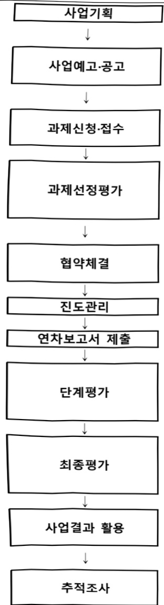

# 디지털 담수화 플랜트 농축수 자원화 기술 개발사업(R…

**해당 페이지**: PDF 2711 ~ 2719 쪽 해당

**부처**: 기후에너지환경부
**분야**: 환경
**회계유형**: 환경개선 특별회계
**2026 확정예산**: 7800.0 백만원
**전년대비 증감률**: 110.8%
**AI 도메인**: 디지털전환(AX)

---

<table border=1 style='margin: auto; word-wrap: break-word;'><tr><td style='text-align: center; word-wrap: break-word;'>사 업 명</td></tr><tr><td style='text-align: center; word-wrap: break-word;'>(35) 디지털 담수화 플랜트 농축수 자원화 기술개발사업(2038-347)</td></tr></table>

☐ 사업 코드 정보

<table border=1 style='margin: auto; word-wrap: break-word;'><tr><td style='text-align: center; word-wrap: break-word;'>구분</td><td style='text-align: center; word-wrap: break-word;'>회계</td><td style='text-align: center; word-wrap: break-word;'>소관</td><td style='text-align: center; word-wrap: break-word;'>실국(기관)</td><td style='text-align: center; word-wrap: break-word;'>계정</td><td style='text-align: center; word-wrap: break-word;'>분야</td><td style='text-align: center; word-wrap: break-word;'>부문</td></tr><tr><td style='text-align: center; word-wrap: break-word;'>코드</td><td style='text-align: center; word-wrap: break-word;'>환경개선</td><td rowspan="2">환경부</td><td rowspan="2">물이용정책관</td><td rowspan="2"></td><td style='text-align: center; word-wrap: break-word;'>070</td><td style='text-align: center; word-wrap: break-word;'>077</td></tr><tr><td style='text-align: center; word-wrap: break-word;'>명칭</td><td style='text-align: center; word-wrap: break-word;'>특별회계</td><td style='text-align: center; word-wrap: break-word;'>환경</td><td style='text-align: center; word-wrap: break-word;'>물환경</td></tr></table>

<table border=1 style='margin: auto; word-wrap: break-word;'><tr><td style='text-align: center; word-wrap: break-word;'>구분</td><td style='text-align: center; word-wrap: break-word;'>프로그램</td><td style='text-align: center; word-wrap: break-word;'>단위사업</td><td style='text-align: center; word-wrap: break-word;'>세부사업</td></tr><tr><td style='text-align: center; word-wrap: break-word;'>코드</td><td style='text-align: center; word-wrap: break-word;'>2000</td><td style='text-align: center; word-wrap: break-word;'>2038</td><td style='text-align: center; word-wrap: break-word;'>347</td></tr><tr><td style='text-align: center; word-wrap: break-word;'>명칭</td><td style='text-align: center; word-wrap: break-word;'>맑은물 공급·이용</td><td style='text-align: center; word-wrap: break-word;'>물산업 및 물기술 진흥</td><td style='text-align: center; word-wrap: break-word;'>디지털 담수화 플랜트 농축수 자원화 기술개발사업(R&amp;D)</td></tr></table>

□ 사업 성격 (공통요구자료 Ⅱ-1 작성유의사항 4. 참조, 해당하는 사항에 “○” 표시)

<table border=1 style='margin: auto; word-wrap: break-word;'><tr><td rowspan="2">신규</td><td rowspan="2">계속</td><td rowspan="2">완료</td><td rowspan="2">예비타당성실시여부</td><td rowspan="2">총사업비관리대상</td><td rowspan="2">총액계상예산사업</td><td style='text-align: center; word-wrap: break-word;'>사업소관 변경정보</td></tr><tr><td style='text-align: center; word-wrap: break-word;'>2025예산 시 소관</td></tr><tr><td style='text-align: center; word-wrap: break-word;'></td><td style='text-align: center; word-wrap: break-word;'>O</td><td style='text-align: center; word-wrap: break-word;'></td><td style='text-align: center; word-wrap: break-word;'></td><td style='text-align: center; word-wrap: break-word;'></td><td style='text-align: center; word-wrap: break-word;'></td><td style='text-align: center; word-wrap: break-word;'></td></tr></table>

□ 사업 지원 형태 및 지원을 (최소한 한 개는 반드시 선택하시오. 해당사항에 0 표시)

<table border=1 style='margin: auto; word-wrap: break-word;'><tr><td style='text-align: center; word-wrap: break-word;'>직접</td><td style='text-align: center; word-wrap: break-word;'>출자</td><td style='text-align: center; word-wrap: break-word;'>출연</td><td style='text-align: center; word-wrap: break-word;'>보조</td><td style='text-align: center; word-wrap: break-word;'>융자</td><td style='text-align: center; word-wrap: break-word;'>국고보조율(%)</td><td style='text-align: center; word-wrap: break-word;'>융자율(%)</td></tr><tr><td style='text-align: center; word-wrap: break-word;'></td><td style='text-align: center; word-wrap: break-word;'></td><td style='text-align: center; word-wrap: break-word;'>O</td><td style='text-align: center; word-wrap: break-word;'></td><td style='text-align: center; word-wrap: break-word;'></td><td style='text-align: center; word-wrap: break-word;'></td><td style='text-align: center; word-wrap: break-word;'></td></tr></table>

사업 담당자

<table border=1 style='margin: auto; word-wrap: break-word;'><tr><td style='text-align: center; word-wrap: break-word;'>사업명</td><td colspan="2">구분</td></tr><tr><td rowspan="3">디지털 담수화 플랜트 농축수 지원화 기술개발사업 (R&amp;D)</td><td rowspan="2">소관부처</td><td style='text-align: center; word-wrap: break-word;'>물관리정책실 물이용정책관</td></tr><tr><td style='text-align: center; word-wrap: break-word;'>물산업협력과</td></tr><tr><td style='text-align: center; word-wrap: break-word;'>사업시행주체</td><td style='text-align: center; word-wrap: break-word;'>한국환경산업기술원</td></tr><tr><td rowspan="3">해수담수화 플랜트 디지털 전환 및 농축수 지원화 기술</td><td rowspan="2">소관부처</td><td style='text-align: center; word-wrap: break-word;'>물관리정책실 물이용정책관</td></tr><tr><td style='text-align: center; word-wrap: break-word;'>물산업협력과</td></tr><tr><td style='text-align: center; word-wrap: break-word;'>사업시행주체</td><td style='text-align: center; word-wrap: break-word;'>한국환경산업기술원</td></tr></table>

---

### 가. 예산 총괄표

(단위:백만원,%)

<table border=1 style='margin: auto; word-wrap: break-word;'><tr><td rowspan="2">사업명</td><td rowspan="2">2024년 결산</td><td colspan="2">2025년 예산</td><td colspan="2">2026년</td><td rowspan="2">증감(B-A)</td><td rowspan="2">(B-A)/A</td></tr><tr><td style='text-align: center; word-wrap: break-word;'>본예산(A)</td><td style='text-align: center; word-wrap: break-word;'>추경</td><td style='text-align: center; word-wrap: break-word;'>정부안</td><td style='text-align: center; word-wrap: break-word;'>확정(B)</td></tr><tr><td style='text-align: center; word-wrap: break-word;'>디지털 담수화 플랜트 농축수 지원화 기술개발사업(R&amp;D)</td><td style='text-align: center; word-wrap: break-word;'>-</td><td style='text-align: center; word-wrap: break-word;'>3,700</td><td style='text-align: center; word-wrap: break-word;'>3,700</td><td style='text-align: center; word-wrap: break-word;'>7,800</td><td style='text-align: center; word-wrap: break-word;'>7,800</td><td style='text-align: center; word-wrap: break-word;'>4,100</td><td style='text-align: center; word-wrap: break-word;'>110.8</td></tr></table>

□ 기능별(내역사업별), 목별 예산 내역

(단위:백만원)

<table border=1 style='margin: auto; word-wrap: break-word;'><tr><td rowspan="3"></td><td colspan="5">2024</td><td colspan="7">2025</td><td rowspan="3">2026예산</td></tr><tr><td rowspan="2">예산액(추경)</td><td rowspan="2">예산현액</td><td rowspan="2">집행액[실집행액]</td><td rowspan="2">이월액</td><td rowspan="2">불용액</td><td rowspan="2">본예산</td><td rowspan="2">예산현액</td><td rowspan="2">집행액[실집행액]</td><td colspan="2">전년도이월액제외</td><td rowspan="2">이월예상액</td><td rowspan="2">불용예상액</td></tr><tr><td style='text-align: center; word-wrap: break-word;'>예산현액</td><td style='text-align: center; word-wrap: break-word;'>집행액[실집행액]</td></tr><tr><td style='text-align: center; word-wrap: break-word;'>○ 기능별 분류(합계)</td><td style='text-align: center; word-wrap: break-word;'>-</td><td style='text-align: center; word-wrap: break-word;'>-</td><td style='text-align: center; word-wrap: break-word;'>-</td><td style='text-align: center; word-wrap: break-word;'>-</td><td style='text-align: center; word-wrap: break-word;'>-</td><td style='text-align: center; word-wrap: break-word;'>3,700</td><td style='text-align: center; word-wrap: break-word;'>3,700</td><td style='text-align: center; word-wrap: break-word;'>3,700(3,700)</td><td style='text-align: center; word-wrap: break-word;'>3,700</td><td style='text-align: center; word-wrap: break-word;'>3,700(3,700)</td><td style='text-align: center; word-wrap: break-word;'>-</td><td style='text-align: center; word-wrap: break-word;'>-</td><td style='text-align: center; word-wrap: break-word;'>7,800</td></tr><tr><td style='text-align: center; word-wrap: break-word;'>· 해수담수화 플랜트디지털 전환 및 농축수 지원화 기술개발</td><td style='text-align: center; word-wrap: break-word;'>-</td><td style='text-align: center; word-wrap: break-word;'>-</td><td style='text-align: center; word-wrap: break-word;'>-</td><td style='text-align: center; word-wrap: break-word;'>-</td><td style='text-align: center; word-wrap: break-word;'>-</td><td style='text-align: center; word-wrap: break-word;'>3,700</td><td style='text-align: center; word-wrap: break-word;'>3,700</td><td style='text-align: center; word-wrap: break-word;'>3,700(3,700)</td><td style='text-align: center; word-wrap: break-word;'>3,700</td><td style='text-align: center; word-wrap: break-word;'>3,700(3,700)</td><td style='text-align: center; word-wrap: break-word;'>-</td><td style='text-align: center; word-wrap: break-word;'>-</td><td style='text-align: center; word-wrap: break-word;'>7,800</td></tr><tr><td style='text-align: center; word-wrap: break-word;'>○ 비목별 분류(합계)</td><td style='text-align: center; word-wrap: break-word;'>-</td><td style='text-align: center; word-wrap: break-word;'>-</td><td style='text-align: center; word-wrap: break-word;'>-</td><td style='text-align: center; word-wrap: break-word;'>-</td><td style='text-align: center; word-wrap: break-word;'>-</td><td style='text-align: center; word-wrap: break-word;'>3,700</td><td style='text-align: center; word-wrap: break-word;'>3,700</td><td style='text-align: center; word-wrap: break-word;'>3,700(3,700)</td><td style='text-align: center; word-wrap: break-word;'>3,700</td><td style='text-align: center; word-wrap: break-word;'>3,700(3,700)</td><td style='text-align: center; word-wrap: break-word;'>-</td><td style='text-align: center; word-wrap: break-word;'>-</td><td style='text-align: center; word-wrap: break-word;'>7,800</td></tr><tr><td style='text-align: center; word-wrap: break-word;'>· 연구개발활동비(360-05)</td><td style='text-align: center; word-wrap: break-word;'>-</td><td style='text-align: center; word-wrap: break-word;'>-</td><td style='text-align: center; word-wrap: break-word;'>-</td><td style='text-align: center; word-wrap: break-word;'>-</td><td style='text-align: center; word-wrap: break-word;'>-</td><td style='text-align: center; word-wrap: break-word;'>3,700</td><td style='text-align: center; word-wrap: break-word;'>3,700</td><td style='text-align: center; word-wrap: break-word;'>3,700(3,700)</td><td style='text-align: center; word-wrap: break-word;'>3,700</td><td style='text-align: center; word-wrap: break-word;'>3,700(3,700)</td><td style='text-align: center; word-wrap: break-word;'>-</td><td style='text-align: center; word-wrap: break-word;'>-</td><td style='text-align: center; word-wrap: break-word;'>7,800</td></tr><tr><td style='text-align: center; word-wrap: break-word;'>○ 기능비목별 분류(합계)</td><td style='text-align: center; word-wrap: break-word;'>-</td><td style='text-align: center; word-wrap: break-word;'>-</td><td style='text-align: center; word-wrap: break-word;'>-</td><td style='text-align: center; word-wrap: break-word;'>-</td><td style='text-align: center; word-wrap: break-word;'>-</td><td style='text-align: center; word-wrap: break-word;'>3,700</td><td style='text-align: center; word-wrap: break-word;'>3,700</td><td style='text-align: center; word-wrap: break-word;'>3,700(3,700)</td><td style='text-align: center; word-wrap: break-word;'>3,700</td><td style='text-align: center; word-wrap: break-word;'>3,700(3,700)</td><td style='text-align: center; word-wrap: break-word;'>-</td><td style='text-align: center; word-wrap: break-word;'>-</td><td style='text-align: center; word-wrap: break-word;'>7,800</td></tr><tr><td style='text-align: center; word-wrap: break-word;'>· 해수담수화 플랜트디지털 전환 및 농축수 지원화 기술개발-연구개발활동비(360-05)</td><td style='text-align: center; word-wrap: break-word;'>-</td><td style='text-align: center; word-wrap: break-word;'>-</td><td style='text-align: center; word-wrap: break-word;'>-</td><td style='text-align: center; word-wrap: break-word;'>-</td><td style='text-align: center; word-wrap: break-word;'>-</td><td style='text-align: center; word-wrap: break-word;'>3,700</td><td style='text-align: center; word-wrap: break-word;'>3,700</td><td style='text-align: center; word-wrap: break-word;'>3,700(3,700)</td><td style='text-align: center; word-wrap: break-word;'>3,700</td><td style='text-align: center; word-wrap: break-word;'>3,700(3,700)</td><td style='text-align: center; word-wrap: break-word;'>-</td><td style='text-align: center; word-wrap: break-word;'>-</td><td style='text-align: center; word-wrap: break-word;'>7,800</td></tr></table>

---

### 나. 사업설명자료

## 1 ) 사업목적·내용

- (디지털 담수화 플랜트 농축수 자원화 기술개발사업) 국내·외 환경 변화에 따른 담수화

新시장 진출 및 선점을 위한 담수화 플랜트 디지털 전환 및 농축수 자원화 기술 개발

(해수담수화 플랜트 디지털 전환 및 농축수 자원화 기술 개발) 동 내역사업은 해수담수화 선도기술 확보를 통한 미래 신시장 선점 및 수출경쟁력 강화를 위해 해수담수화 연구 기관(대학, 기업, 출연, 국공립 연구소 등)을 대상으로 디지털 기술과 농축수 자원화 기술이 융복합된 차세대 해수담수화 신격차 핵심기술을 확보하는 것임

## 2 ) 사업개요

## ☐ 사업근거 및 추진경위

① 법령상 근거 및 조항 적시

-「물관리기본법」 제4조(물 이용의 권리와 의무), 제15조(물수요관리 등), 제19조(기후변화 대응)

- 「물관리기술 발전 및 물산업 진흥에 관한 법률」 제8조(물관리기술 개발 촉진), 제15조(물산업 실증화 시설 및 집적단지의 조성·운영 등), 제17조(분산형 실증화 시설 조성 등)

-「수자원의 조사·계획 및 관리에 관한 법률」 제23조(대체·보조 수자원의 개발·활용 등)

- 「과학기술기본법」 제6조(국가과학기술혁신체제의 구축)

- 「물의 재이용 촉진 및 지원에 관한 법률」 제22조(연구·개발 촉진 등)

## ② 추진경위

- 사업 시작년도 : 2025년

- 추진 배경 : 해수담수화 시장 경쟁력 선점을 위한 혁신기술 및 기후변화 영향으로 인한 물부족 대응 해수담수화를 위한 수자원 확보·보급 필요성 강화

- 디지털 담수화 플랜트 농축수 자원화 기술개발사업 보완 기획('24.2~'24.3)

- 디지털 담수화 플랜트 농축수 자원화 기술개발사업 기재부 제출('24.2)

- 2024년도 혁신도전형 R&D 사업군(신격차형) 과기부 제출('24.4)

- 국정과제 35. ‘ 미래 신기술로 성장하고, 글로벌로 도약하는 중소기업’ 및 43. ‘국가 기후적응 역량 강화’를 통해 국내·외 환경 변화에 따른 담수화 창의성 진출 및 선점을 위한 담수화 플랜트 디지털 전환 및 농축수 자원화 기술 개발

---

□ 주요내용

① 사업규모

- 총사업비(해당되는 경우에만 기재) : 354.5억(국고 기준)

※ 총사업비 관리 대상은 아님

- 사업기간 : 2025 ~ 2029년(총 5년)

- 최근 5년 간 투입된 사업비(예산액기준, 추경편성한 연도에는 추경포함)

<table border=1 style='margin: auto; word-wrap: break-word;'><tr><td style='text-align: center; word-wrap: break-word;'>$ \underline{\text{연도}} $</td><td style='text-align: center; word-wrap: break-word;'>2022</td><td style='text-align: center; word-wrap: break-word;'>2023</td><td style='text-align: center; word-wrap: break-word;'>2024</td><td style='text-align: center; word-wrap: break-word;'>2025</td><td style='text-align: center; word-wrap: break-word;'>2026</td></tr><tr><td style='text-align: center; word-wrap: break-word;'>$ \underline{\text{사업비}} $</td><td style='text-align: center; word-wrap: break-word;'>-</td><td style='text-align: center; word-wrap: break-word;'>-</td><td style='text-align: center; word-wrap: break-word;'>-</td><td style='text-align: center; word-wrap: break-word;'>3,700</td><td style='text-align: center; word-wrap: break-word;'>7,800</td></tr></table>

- 기타: 해당사항 없음

② 사업추진체계

- 사업시행방법 : 출연

- 사업시행주체 : 환경부(한국환경산업기술원 대행)

- 사업 수혜자 : 해수담수화 관련 기업, 연구소

- 보조, 융자, 출연, 출자 등의 경우 보조 · 융자 등 지원 비율 및 법적근거

<table border=1 style='margin: auto; word-wrap: break-word;'><tr><td style='text-align: center; word-wrap: break-word;'>내역사업명</td><td style='text-align: center; word-wrap: break-word;'>구분</td><td style='text-align: center; word-wrap: break-word;'>피보조·피출연 등 기관명</td><td style='text-align: center; word-wrap: break-word;'>지원 금액 (2026예산)</td><td style='text-align: center; word-wrap: break-word;'>지원 비율(%)</td><td style='text-align: center; word-wrap: break-word;'>보조율 법적근거 (해당 조항)</td></tr><tr><td style='text-align: center; word-wrap: break-word;'>해수담수화 플랜트 다지털 전환 및 농축수 지원화 기술 개발</td><td style='text-align: center; word-wrap: break-word;'>출연</td><td style='text-align: center; word-wrap: break-word;'>한국환경 산업기술원</td><td style='text-align: center; word-wrap: break-word;'>7,800백만 원</td><td style='text-align: center; word-wrap: break-word;'>100</td><td style='text-align: center; word-wrap: break-word;'>「환경기술 및 환경산업 지원법」제5조</td></tr></table>

## 3 ) 2026년도 예산 산출 근거

□ 디지털 담수화 플랜트 농축수 자원화 기술개발사업(R&D): (2025 예산) 3,700백만원 → (2026 예산) 7,800백만원

해수담수화 플랜트 디지털 전환 및 농축수 자원화 기술개발

:(2025 본예산) 3,700백만원 → (2026 요구) 7,800백만원, 4,100백만원 증액

- (요구) 담수화 플랜트의 디지털 전환 및 농축수를 활용한 자원화 기술 개발을 위한 예산 요구

- (산출) 계속과제 1개 × 8,509.1백만원 × 11/12개월 = 7,800백만원

2025년도 예산 및 2026년도 예산 산출 세부내역 비교

<table border=1 style='margin: auto; word-wrap: break-word;'><tr><td colspan="2">&#x27;24년 예산</td><td colspan="2">&#x27;25년 예산</td></tr><tr><td style='text-align: center; word-wrap: break-word;'>예산</td><td style='text-align: center; word-wrap: break-word;'>산출내역</td><td style='text-align: center; word-wrap: break-word;'>예산</td><td style='text-align: center; word-wrap: break-word;'>산출내역</td></tr><tr><td rowspan="3">3,700 백만원</td><td style='text-align: center; word-wrap: break-word;'>연구개발활동비등(360-05): 3,700백만원</td><td colspan="2">연구개발활동비등(360-05): 7,800백만원</td></tr><tr><td style='text-align: center; word-wrap: break-word;'>가. 해수담수화 플랜트 디지털 전환 및 농축수 자원화 기술개발(3,700백만원)</td><td style='text-align: center; word-wrap: break-word;'>7,800 백만원</td><td style='text-align: center; word-wrap: break-word;'>가. 해수담수화 플랜트 디지털 전환 및 농축수 자원화 기술개발(7,800백만원)</td></tr><tr><td style='text-align: center; word-wrap: break-word;'>연구개발활동비 등: 1개과제 × 4,933.3백만원 × 9/12개월</td><td colspan="2">연구개발활동비 등: 1개과제 × 8,509.1백만원 × 11/12개월</td></tr></table>

---

## 4 ) 사업효과

☐ 사업영향, 산출물 성과지표 등

①2022~2026년도 성과계획서 상 성과지표 및 최근 5년간 성과 달성도

<table border=1 style='margin: auto; word-wrap: break-word;'><tr><td style='text-align: center; word-wrap: break-word;'>성과지표</td><td style='text-align: center; word-wrap: break-word;'>구분</td><td style='text-align: center; word-wrap: break-word;'>2022</td><td style='text-align: center; word-wrap: break-word;'>2023</td><td style='text-align: center; word-wrap: break-word;'>2024</td><td style='text-align: center; word-wrap: break-word;'>2025</td><td style='text-align: center; word-wrap: break-word;'>2026</td><td style='text-align: center; word-wrap: break-word;'>2026목표치산출근거</td><td style='text-align: center; word-wrap: break-word;'>측정산식(또는 측정방법)</td><td style='text-align: center; word-wrap: break-word;'>자료수집방법(또는 자료출처)</td></tr><tr><td rowspan="3">게재 논문우수성(mnIF)</td><td style='text-align: center; word-wrap: break-word;'>목표</td><td style='text-align: center; word-wrap: break-word;'>-</td><td style='text-align: center; word-wrap: break-word;'>-</td><td style='text-align: center; word-wrap: break-word;'>-</td><td style='text-align: center; word-wrap: break-word;'>-</td><td style='text-align: center; word-wrap: break-word;'>77.06</td><td rowspan="3">RFP 내 평균 질적우수성 목표 설정</td><td rowspan="3">성과발표도 다음해 1월 중 성과발표도의 mnIF 기준 평균 신출</td><td rowspan="3">IRIS 및 NTIS 등록 파일</td></tr><tr><td style='text-align: center; word-wrap: break-word;'>실적</td><td style='text-align: center; word-wrap: break-word;'>-</td><td style='text-align: center; word-wrap: break-word;'>-</td><td style='text-align: center; word-wrap: break-word;'>-</td><td style='text-align: center; word-wrap: break-word;'>-</td><td style='text-align: center; word-wrap: break-word;'>-</td></tr><tr><td style='text-align: center; word-wrap: break-word;'>달성도</td><td style='text-align: center; word-wrap: break-word;'>-</td><td style='text-align: center; word-wrap: break-word;'>-</td><td style='text-align: center; word-wrap: break-word;'>-</td><td style='text-align: center; word-wrap: break-word;'>-</td><td style='text-align: center; word-wrap: break-word;'>-</td></tr><tr><td rowspan="3">등록특허SMART지수(점)</td><td style='text-align: center; word-wrap: break-word;'>목표</td><td style='text-align: center; word-wrap: break-word;'>-</td><td style='text-align: center; word-wrap: break-word;'>-</td><td style='text-align: center; word-wrap: break-word;'>-</td><td style='text-align: center; word-wrap: break-word;'>-</td><td style='text-align: center; word-wrap: break-word;'>-</td><td rowspan="3">유사사업의 SMART등급 평균점수</td><td rowspan="3">$ \sum_{i=1}^{n} S_i $Si = i 특허의 SMART 등급지수n = 당해연도 국내등록특허 건수</td><td rowspan="3">연구관리시스템 등록 자료 활용</td></tr><tr><td style='text-align: center; word-wrap: break-word;'>실적</td><td style='text-align: center; word-wrap: break-word;'>-</td><td style='text-align: center; word-wrap: break-word;'>-</td><td style='text-align: center; word-wrap: break-word;'>-</td><td style='text-align: center; word-wrap: break-word;'>-</td><td style='text-align: center; word-wrap: break-word;'>-</td></tr><tr><td style='text-align: center; word-wrap: break-word;'>달성도</td><td style='text-align: center; word-wrap: break-word;'>-</td><td style='text-align: center; word-wrap: break-word;'>-</td><td style='text-align: center; word-wrap: break-word;'>-</td><td style='text-align: center; word-wrap: break-word;'>-</td><td style='text-align: center; word-wrap: break-word;'>-</td></tr><tr><td rowspan="3">기술 성능지표달성지수</td><td style='text-align: center; word-wrap: break-word;'>목표</td><td style='text-align: center; word-wrap: break-word;'>-</td><td style='text-align: center; word-wrap: break-word;'>-</td><td style='text-align: center; word-wrap: break-word;'>-</td><td style='text-align: center; word-wrap: break-word;'>100</td><td style='text-align: center; word-wrap: break-word;'>100</td><td rowspan="3">연차별 핵심 및 기본 요소기술 지표를 27개 도출하고핵심 및 기본 요소기술 지표별 성능목표치를 설정</td><td rowspan="3">연차별 층 기술 성능지표 건수 대비 달성 간수에 기증치 반영</td><td rowspan="3">연차보고서 및 공인시험성적서 등 증빙자료</td></tr><tr><td style='text-align: center; word-wrap: break-word;'>실적</td><td style='text-align: center; word-wrap: break-word;'>-</td><td style='text-align: center; word-wrap: break-word;'>-</td><td style='text-align: center; word-wrap: break-word;'>-</td><td style='text-align: center; word-wrap: break-word;'>-</td><td style='text-align: center; word-wrap: break-word;'>-</td></tr><tr><td style='text-align: center; word-wrap: break-word;'>달성도</td><td style='text-align: center; word-wrap: break-word;'>-</td><td style='text-align: center; word-wrap: break-word;'>-</td><td style='text-align: center; word-wrap: break-word;'>-</td><td style='text-align: center; word-wrap: break-word;'>-</td><td style='text-align: center; word-wrap: break-word;'>-</td></tr><tr><td rowspan="3">실증플랜트현장적용지수</td><td style='text-align: center; word-wrap: break-word;'>목표</td><td style='text-align: center; word-wrap: break-word;'>-</td><td style='text-align: center; word-wrap: break-word;'>-</td><td style='text-align: center; word-wrap: break-word;'>-</td><td style='text-align: center; word-wrap: break-word;'>1.5</td><td style='text-align: center; word-wrap: break-word;'>1.5</td><td rowspan="2">실증플랜트 구축을 위한 프로세스별 목표 설정</td><td rowspan="2">실증플랜트 현장적용 프로세스 별 현장적용 간수에 기증치 반영</td><td rowspan="2">연차보고서 및 보고서, 계약서 등 증빙자료</td></tr><tr><td style='text-align: center; word-wrap: break-word;'>실적</td><td style='text-align: center; word-wrap: break-word;'>-</td><td style='text-align: center; word-wrap: break-word;'>-</td><td style='text-align: center; word-wrap: break-word;'>-</td><td style='text-align: center; word-wrap: break-word;'>-</td><td style='text-align: center; word-wrap: break-word;'>-</td></tr><tr><td style='text-align: center; word-wrap: break-word;'>달성도</td><td style='text-align: center; word-wrap: break-word;'>-</td><td style='text-align: center; word-wrap: break-word;'>-</td><td style='text-align: center; word-wrap: break-word;'>-</td><td style='text-align: center; word-wrap: break-word;'>-</td><td style='text-align: center; word-wrap: break-word;'>-</td><td rowspan="4">2단계 지표</td><td rowspan="4">용준이은 주춤 회수 지수 =  $ \sum_{i=1}^{P_i} Q_i \times w_i $</td><td rowspan="4">성능검증 내용이 포함된 연차보고서 공인시험성적서 등 증빙자료</td></tr><tr><td rowspan="3">용준이온 추출회수지수</td><td style='text-align: center; word-wrap: break-word;'>목표</td><td style='text-align: center; word-wrap: break-word;'>-</td><td style='text-align: center; word-wrap: break-word;'>-</td><td style='text-align: center; word-wrap: break-word;'>-</td><td style='text-align: center; word-wrap: break-word;'>-</td><td style='text-align: center; word-wrap: break-word;'>-</td></tr><tr><td style='text-align: center; word-wrap: break-word;'>실적</td><td style='text-align: center; word-wrap: break-word;'>-</td><td style='text-align: center; word-wrap: break-word;'>-</td><td style='text-align: center; word-wrap: break-word;'>-</td><td style='text-align: center; word-wrap: break-word;'>-</td><td style='text-align: center; word-wrap: break-word;'>-</td></tr><tr><td style='text-align: center; word-wrap: break-word;'>달성도</td><td style='text-align: center; word-wrap: break-word;'>-</td><td style='text-align: center; word-wrap: break-word;'>-</td><td style='text-align: center; word-wrap: break-word;'>-</td><td style='text-align: center; word-wrap: break-word;'>-</td><td style='text-align: center; word-wrap: break-word;'>-</td></tr><tr><td rowspan="3">생산수 회수율</td><td style='text-align: center; word-wrap: break-word;'>목표</td><td style='text-align: center; word-wrap: break-word;'>-</td><td style='text-align: center; word-wrap: break-word;'>-</td><td style='text-align: center; word-wrap: break-word;'>-</td><td style='text-align: center; word-wrap: break-word;'>-</td><td style='text-align: center; word-wrap: break-word;'>-</td><td rowspan="3">2단계 지표</td><td rowspan="3">(4차년도)생산수 회수율 =  $ \frac{RO_p + (NF_p) \times NF_f}{5차년도} $RO_f생산수 회수율 =  $ \frac{RO_p + (HRP_p) \times HRP_f}{5차년도} $RO_f</td><td rowspan="3">성능검증 내용이 포함된 연차보고서 공인시험성적서 등 증빙자료</td></tr><tr><td style='text-align: center; word-wrap: break-word;'>실적</td><td style='text-align: center; word-wrap: break-word;'>-</td><td style='text-align: center; word-wrap: break-word;'>-</td><td style='text-align: center; word-wrap: break-word;'>-</td><td style='text-align: center; word-wrap: break-word;'>-</td><td style='text-align: center; word-wrap: break-word;'>-</td></tr><tr><td style='text-align: center; word-wrap: break-word;'>달성도</td><td style='text-align: center; word-wrap: break-word;'>-</td><td style='text-align: center; word-wrap: break-word;'>-</td><td style='text-align: center; word-wrap: break-word;'>-</td><td style='text-align: center; word-wrap: break-word;'>-</td><td style='text-align: center; word-wrap: break-word;'>-</td></tr><tr><td rowspan="3">실증플랜트현장운영지수</td><td style='text-align: center; word-wrap: break-word;'>목표</td><td style='text-align: center; word-wrap: break-word;'>-</td><td style='text-align: center; word-wrap: break-word;'>-</td><td style='text-align: center; word-wrap: break-word;'>-</td><td style='text-align: center; word-wrap: break-word;'>-</td><td style='text-align: center; word-wrap: break-word;'>-</td><td rowspan="3">2단계 지표</td><td rowspan="3">(4차년도) 실증플랜트시윤전(5차년도) 실증플랜트 본온전 및 초자에너지 달성도(22kWh/m3)</td><td rowspan="3">성능검증 내용이 포함된 연차보고서 공인시험성적서 등 증빙자료</td></tr><tr><td style='text-align: center; word-wrap: break-word;'>실적</td><td style='text-align: center; word-wrap: break-word;'>-</td><td style='text-align: center; word-wrap: break-word;'>-</td><td style='text-align: center; word-wrap: break-word;'>-</td><td style='text-align: center; word-wrap: break-word;'>-</td><td style='text-align: center; word-wrap: break-word;'>-</td></tr><tr><td style='text-align: center; word-wrap: break-word;'>달성도</td><td style='text-align: center; word-wrap: break-word;'>-</td><td style='text-align: center; word-wrap: break-word;'>-</td><td style='text-align: center; word-wrap: break-word;'>-</td><td style='text-align: center; word-wrap: break-word;'>-</td><td style='text-align: center; word-wrap: break-word;'>-</td></tr></table>

---

② 성과지표 이외의 연도별 사업추진 경과 및 실적

<table border=1 style='margin: auto; word-wrap: break-word;'><tr><td style='text-align: center; word-wrap: break-word;'>2022</td><td style='text-align: center; word-wrap: break-word;'>해당사항 없음</td></tr><tr><td style='text-align: center; word-wrap: break-word;'>2023</td><td style='text-align: center; word-wrap: break-word;'>해당사항 없음</td></tr><tr><td style='text-align: center; word-wrap: break-word;'>2024</td><td style='text-align: center; word-wrap: break-word;'>해당사항 없음</td></tr><tr><td style='text-align: center; word-wrap: break-word;'>2025</td><td style='text-align: center; word-wrap: break-word;'>- 1개 과제 착수
- 담수화 플랜트 디지털 기반 저에너지화 설계 및 운전관리 기술 신규 추진
- 담수화 농축수 내 용존이온 경제적 자원화 기술 신규 추진
- 디지털·농축수 재이용 담수화 플랜트 통합 실증화 기술 신규 추진</td></tr></table>

## ③향후(2026년도 이후)기대효과

- 담수화 기술의 핵심 및 차세대 기술개발과 글로벌 수준의 기술 경쟁력 확보

- 시장수요를 고려한 맞춤형 기술개발로 담수화 기술관련 국내기업의 시장

  진출 지원과 해외 수출 확대

- 국가적 차원 물관련 정책 및 환경부 차원 담수화 관련 정책의 효과적 추진에

필요한 기술적 해결수단 제공 및 기술기반 강화를 통한 정책목표 달성 기여

- 국내 담수화 시설의 노후화율 증가에 대응하는 저에너지 담수화 기술 대체

5) 타당성조사 및 예비타당성조사 시행여부 및 결과 요지 : 해당사항 없음

6) 총사업비 대상사업 여부 및 내역 : 해당사항 없음

---

## 7 ) 사업 집행절차

### ·환경부.한국환경산업기술원

*「환경기술개발사업운영규정」제16조(사전기획 및 연구개발과제의 발굴), 제18조(세부 추진계획의 수립·확정·예고)

°환경부·한국환경산업기술원:사업 예고 및 추진계획 공고

- 사업목적, 연구개발비, 공모일정, 지원내용 및 기간

*「환경기술개발사업운영규정」제18조(세부추진계획의 수립·확정·예고). 제19조(연구개발과제 및 연구개발기관의 공모)

○ 연구개발기관 : 신규과제 연구개발계획서 작성신청

○ 한국환경산업기술원 : 접수

*「환경기술개발사업운영규정」제20조(사업참여의 신청)

• 한국환경산업기술원

- 사전검토 → 선정평가(발표·패널심사) → 전문기관 조정

• 환경부 : 심의 및 연구개발과제 확정

*「환경기술개발사업운영규정」제21조(사전검토). 제22조(연구개발계획서의 평가·심의 및 선정)

°협약 : 환경부 ↔ 한국환경산업기술원

- 한국환경산업기술원 ↔ 연구개발기관

*「환경기술개발사업운영규정」제26조(협약의 체결)

•한국환경산업기술원:진도관리 또는 현장조사,필요 시 특별평가

*「환경기술개발사업운영규정제36조(과제수행 및 진도 관리)

·한국환경산업기술원:연차보고서점검

*「환경기술개발사업운영규정」제37조(연차보고서의 제출)

- 한국환경산업기술원 : 해당단계 종료 시, 단계보고서 평가

- 단계평가→전문기관 조정

- 환경부 : 심의 및 연구개발과제의 다음단계 계획 확정

*「환경기술개발사업운영규정」제38조(단계평가)

-한국환경산업기술원:최종연구결과 및 성과활용계획평가

-최종평가

-환경부:심의 및 연구개발과제 최종등급 확정

*「환경기술개발사업운영규정」제39조(최종평가)

○ 한국환경산업기술원/연구개발성과 소유기관 : 기술실시계약(기술료 징수) 및 실시

*「환경기술개발사업운영규정」제48조(연구개발사업성과의 활용촉진), 제49조(기술료의

징수)

한국환경산업기술원: 종료된 해의 다음해부터 5년 동안 연구개발기관이 제출한 성과활용보고서 조사·분석

- 해수담수화 플랜트 디지털 전환 및 농축수 자원화 기술개발

<table border=1 style='margin: auto; word-wrap: break-word;'><tr><td style='text-align: center; word-wrap: break-word;'>부처</td><td style='text-align: center; word-wrap: break-word;'></td><td style='text-align: center; word-wrap: break-word;'>피출연·피보조기관</td><td style='text-align: center; word-wrap: break-word;'></td><td style='text-align: center; word-wrap: break-word;'>간접보조사업자·사업수행자</td></tr><tr><td style='text-align: center; word-wrap: break-word;'>환경부(7,800)</td><td style='text-align: center; word-wrap: break-word;'>=&gt;(7,800)</td><td style='text-align: center; word-wrap: break-word;'>한국환경산업기술원(7,800)</td><td style='text-align: center; word-wrap: break-word;'>=&gt;(7,800)</td><td style='text-align: center; word-wrap: break-word;'>국민대,쥐씨제이케이,성균관대 등</td></tr></table>

---

9) 최근 3년간 동 사업에 대한 주요 외부지적사항 및 평가, 문제점 및 대책 : 해당사항 없음

10) 향후 추진방향 및 추진계획

- 담수화 플랜트 디지털 기반 저에너지화 설계 및 운전관리 기술 개발

- 담수화 농축수 내 용존이 온 경제적 자원화 기술 개발

- 디지털·농축수 재이용 담수화 플랜트 통합 실증화 기술 개발

11) 해당사업에 대한 각종 사업평가의 결과 : 해당사항 없음

12) 해당사업에 대한 부처 자체평가의 결과 : 해당사항 없음

13) 부처 건의사항 : 해당사항 없음

### 다.최근 4년간 결산내역

1) 결산표

☐ 부처 결산내역

(단위: 백만원, %)

<table border=1 style='margin: auto; word-wrap: break-word;'><tr><td rowspan="2">연도</td><td colspan="3">예산액</td><td rowspan="2">전년도이월액</td><td rowspan="2">이·전용등</td><td rowspan="2">예비비</td><td rowspan="2">예산현액(B)</td><td rowspan="2">집행액(C)</td><td rowspan="2">집행률(C/A)</td><td rowspan="2">집행률(C/B)</td><td rowspan="2">다음연도이월액</td><td rowspan="2">불용액</td></tr><tr><td style='text-align: center; word-wrap: break-word;'>본예산</td><td style='text-align: center; word-wrap: break-word;'>추경증감액</td><td style='text-align: center; word-wrap: break-word;'>추경(A)</td></tr><tr><td style='text-align: center; word-wrap: break-word;'>2022</td><td style='text-align: center; word-wrap: break-word;'>-</td><td style='text-align: center; word-wrap: break-word;'>-</td><td style='text-align: center; word-wrap: break-word;'>-</td><td style='text-align: center; word-wrap: break-word;'>-</td><td style='text-align: center; word-wrap: break-word;'>-</td><td style='text-align: center; word-wrap: break-word;'>-</td><td style='text-align: center; word-wrap: break-word;'>-</td><td style='text-align: center; word-wrap: break-word;'>-</td><td style='text-align: center; word-wrap: break-word;'>-</td><td style='text-align: center; word-wrap: break-word;'>-</td><td style='text-align: center; word-wrap: break-word;'>-</td><td style='text-align: center; word-wrap: break-word;'>-</td></tr><tr><td style='text-align: center; word-wrap: break-word;'>2023</td><td style='text-align: center; word-wrap: break-word;'>-</td><td style='text-align: center; word-wrap: break-word;'>-</td><td style='text-align: center; word-wrap: break-word;'>-</td><td style='text-align: center; word-wrap: break-word;'>-</td><td style='text-align: center; word-wrap: break-word;'>-</td><td style='text-align: center; word-wrap: break-word;'>-</td><td style='text-align: center; word-wrap: break-word;'>-</td><td style='text-align: center; word-wrap: break-word;'>-</td><td style='text-align: center; word-wrap: break-word;'>-</td><td style='text-align: center; word-wrap: break-word;'>-</td><td style='text-align: center; word-wrap: break-word;'>-</td><td style='text-align: center; word-wrap: break-word;'>-</td></tr><tr><td style='text-align: center; word-wrap: break-word;'>2024</td><td style='text-align: center; word-wrap: break-word;'>-</td><td style='text-align: center; word-wrap: break-word;'>-</td><td style='text-align: center; word-wrap: break-word;'>-</td><td style='text-align: center; word-wrap: break-word;'>-</td><td style='text-align: center; word-wrap: break-word;'>-</td><td style='text-align: center; word-wrap: break-word;'>-</td><td style='text-align: center; word-wrap: break-word;'>-</td><td style='text-align: center; word-wrap: break-word;'>-</td><td style='text-align: center; word-wrap: break-word;'>-</td><td style='text-align: center; word-wrap: break-word;'>-</td><td style='text-align: center; word-wrap: break-word;'>-</td><td style='text-align: center; word-wrap: break-word;'>-</td></tr><tr><td style='text-align: center; word-wrap: break-word;'>2025</td><td style='text-align: center; word-wrap: break-word;'>3,700</td><td style='text-align: center; word-wrap: break-word;'>-</td><td style='text-align: center; word-wrap: break-word;'>3,700</td><td style='text-align: center; word-wrap: break-word;'>-</td><td style='text-align: center; word-wrap: break-word;'>-</td><td style='text-align: center; word-wrap: break-word;'>-</td><td style='text-align: center; word-wrap: break-word;'>3,700</td><td style='text-align: center; word-wrap: break-word;'>3,700</td><td style='text-align: center; word-wrap: break-word;'>100.0</td><td style='text-align: center; word-wrap: break-word;'>100.0</td><td style='text-align: center; word-wrap: break-word;'>-</td><td style='text-align: center; word-wrap: break-word;'>-</td></tr></table>

---

□출연·보조사업 등 실집행내역

(단위: 백만원, %)

<table border=1 style='margin: auto; word-wrap: break-word;'><tr><td rowspan="3">구분</td><td colspan="3">부처</td><td colspan="6">사업시행주체(피출연·피보조 기관 등)</td></tr><tr><td colspan="2">예산액</td><td rowspan="2">집행액</td><td rowspan="2">교부액</td><td rowspan="2">전년도 이월액</td><td rowspan="2">교부 현액</td><td rowspan="2">집행액 (B)</td><td rowspan="2">이월액</td><td rowspan="2">불용액 (B/A)</td></tr><tr><td style='text-align: center; word-wrap: break-word;'>본예산</td><td style='text-align: center; word-wrap: break-word;'>추경(A)</td></tr><tr><td style='text-align: center; word-wrap: break-word;'>2022</td><td style='text-align: center; word-wrap: break-word;'>-</td><td style='text-align: center; word-wrap: break-word;'>-</td><td style='text-align: center; word-wrap: break-word;'>-</td><td style='text-align: center; word-wrap: break-word;'>-</td><td style='text-align: center; word-wrap: break-word;'>-</td><td style='text-align: center; word-wrap: break-word;'>-</td><td style='text-align: center; word-wrap: break-word;'>-</td><td style='text-align: center; word-wrap: break-word;'>-</td><td style='text-align: center; word-wrap: break-word;'>-</td></tr><tr><td style='text-align: center; word-wrap: break-word;'>2023</td><td style='text-align: center; word-wrap: break-word;'>-</td><td style='text-align: center; word-wrap: break-word;'>-</td><td style='text-align: center; word-wrap: break-word;'>-</td><td style='text-align: center; word-wrap: break-word;'>-</td><td style='text-align: center; word-wrap: break-word;'>-</td><td style='text-align: center; word-wrap: break-word;'>-</td><td style='text-align: center; word-wrap: break-word;'>-</td><td style='text-align: center; word-wrap: break-word;'>-</td><td style='text-align: center; word-wrap: break-word;'>-</td></tr><tr><td style='text-align: center; word-wrap: break-word;'>2024</td><td style='text-align: center; word-wrap: break-word;'>-</td><td style='text-align: center; word-wrap: break-word;'>-</td><td style='text-align: center; word-wrap: break-word;'>-</td><td style='text-align: center; word-wrap: break-word;'>-</td><td style='text-align: center; word-wrap: break-word;'>-</td><td style='text-align: center; word-wrap: break-word;'>-</td><td style='text-align: center; word-wrap: break-word;'>-</td><td style='text-align: center; word-wrap: break-word;'>-</td><td style='text-align: center; word-wrap: break-word;'>-</td></tr><tr><td style='text-align: center; word-wrap: break-word;'>2025</td><td style='text-align: center; word-wrap: break-word;'>3,700</td><td style='text-align: center; word-wrap: break-word;'>3,700</td><td style='text-align: center; word-wrap: break-word;'>3,700</td><td style='text-align: center; word-wrap: break-word;'>3,700</td><td style='text-align: center; word-wrap: break-word;'>-</td><td style='text-align: center; word-wrap: break-word;'>3,700</td><td style='text-align: center; word-wrap: break-word;'>3,700</td><td style='text-align: center; word-wrap: break-word;'>-</td><td style='text-align: center; word-wrap: break-word;'>-</td></tr></table>

## 2 ) 주요 결산사항

□ 2022~2025년 결산 주요 지적사항 및 시정요구사항 : 해당사항 없음

□ 2025년 이·전용 등 세부내역 : 해당사항 없음

2025년 예비비 배정 세부내역 : 해당사항 없음

---

### 원본 PDF 크롭 이미지

