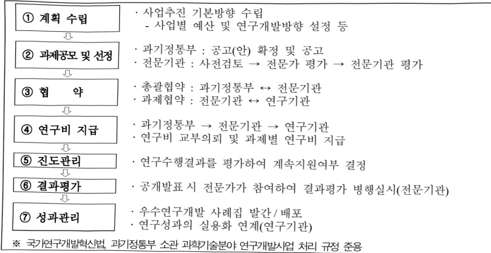

# 무탄소에너지핵심기술개발사업(R&D)

**해당 페이지**: PDF 2720 ~ 2740 쪽 해당

**부처**: 기후에너지환경부
**분야**: 과학기술
**회계유형**: 기금
**2026 확정예산**: 70052.0 백만원
**전년대비 증감률**: 18.4%
**AI 도메인**: 에너지

---

<table border=1 style='margin: auto; word-wrap: break-word;'><tr><td rowspan="3">DACU원천기술개발</td><td rowspan="2">소관부처</td><td style='text-align: center; word-wrap: break-word;'>연구개발정책실 미래전략기술정책관</td></tr><tr><td style='text-align: center; word-wrap: break-word;'>핵융합에너지환경기술과</td></tr><tr><td style='text-align: center; word-wrap: break-word;'>사업시행주체</td><td style='text-align: center; word-wrap: break-word;'>한국연구재단</td></tr><tr><td rowspan="3">그린수소기술자립프로젝트</td><td rowspan="2">소관부처</td><td style='text-align: center; word-wrap: break-word;'>연구개발정책실 미래전략기술정책관</td></tr><tr><td style='text-align: center; word-wrap: break-word;'>핵융합에너지환경기술과</td></tr><tr><td style='text-align: center; word-wrap: break-word;'>사업시행주체</td><td style='text-align: center; word-wrap: break-word;'>한국연구재단</td></tr><tr><td rowspan="3">H2NEXT ROUND</td><td rowspan="2">소관부처</td><td style='text-align: center; word-wrap: break-word;'>연구개발정책실 미래전략기술정책관</td></tr><tr><td style='text-align: center; word-wrap: break-word;'>핵융합에너지환경기술과</td></tr><tr><td style='text-align: center; word-wrap: break-word;'>사업시행주체</td><td style='text-align: center; word-wrap: break-word;'>한국연구재단</td></tr><tr><td rowspan="3">미래수소원천기술개발</td><td rowspan="2">소관부처</td><td style='text-align: center; word-wrap: break-word;'>연구개발정책실 미래전략기술정책관</td></tr><tr><td style='text-align: center; word-wrap: break-word;'>핵융합에너지환경기술과</td></tr><tr><td style='text-align: center; word-wrap: break-word;'>사업시행주체</td><td style='text-align: center; word-wrap: break-word;'>한국연구재단</td></tr><tr><td rowspan="3">AI기반미래기후기술개발원천연구사업</td><td rowspan="2">소관부처</td><td style='text-align: center; word-wrap: break-word;'>연구개발정책실 미래전략기술정책관</td></tr><tr><td style='text-align: center; word-wrap: break-word;'>핵융합에너지환경기술과</td></tr><tr><td style='text-align: center; word-wrap: break-word;'>사업시행주체</td><td style='text-align: center; word-wrap: break-word;'>한국연구재단</td></tr><tr><td rowspan="3">석유대체친환경화학기술개발</td><td rowspan="2">소관부처</td><td style='text-align: center; word-wrap: break-word;'>연구개발정책실 미래전략기술정책관</td></tr><tr><td style='text-align: center; word-wrap: break-word;'>핵융합에너지환경기술과</td></tr><tr><td style='text-align: center; word-wrap: break-word;'>사업시행주체</td><td style='text-align: center; word-wrap: break-word;'>한국연구재단</td></tr><tr><td rowspan="3">바이오매스기반탄소중립형바이오플라스틱제품기술개발</td><td rowspan="2">소관부처</td><td style='text-align: center; word-wrap: break-word;'>연구개발정책실 미래전략기술정책관</td></tr><tr><td style='text-align: center; word-wrap: break-word;'>핵융합에너지환경기술과</td></tr><tr><td style='text-align: center; word-wrap: break-word;'>사업시행주체</td><td style='text-align: center; word-wrap: break-word;'>한국연구재단</td></tr><tr><td rowspan="3">(혁신도전형)플라즈마황용폐유기물고부가가치기초원료화</td><td rowspan="2">소관부처</td><td style='text-align: center; word-wrap: break-word;'>연구개발정책실 미래전략기술정책관</td></tr><tr><td style='text-align: center; word-wrap: break-word;'>핵융합에너지환경기술과</td></tr><tr><td style='text-align: center; word-wrap: break-word;'>사업시행주체</td><td style='text-align: center; word-wrap: break-word;'>한국연구재단</td></tr></table>

---

<table border=1 style='margin: auto; word-wrap: break-word;'><tr><td style='text-align: center; word-wrap: break-word;'>기술개발</td><td style='text-align: center; word-wrap: break-word;'></td><td style='text-align: center; word-wrap: break-word;'></td></tr></table>

가.지출계획 총괄표

(단위:백만원,%)

<table border=1 style='margin: auto; word-wrap: break-word;'><tr><td rowspan="2">목명</td><td rowspan="2">2024년 결산</td><td colspan="2">2025년 계획</td><td colspan="2">2026년</td><td rowspan="2">증감 (B-A)</td><td rowspan="2">(B-A)/A</td></tr><tr><td style='text-align: center; word-wrap: break-word;'>당초(A)</td><td style='text-align: center; word-wrap: break-word;'>수정</td><td style='text-align: center; word-wrap: break-word;'>정부안</td><td style='text-align: center; word-wrap: break-word;'>확정(B)</td></tr><tr><td style='text-align: center; word-wrap: break-word;'>무탄소에너지 핵심기술개발 사업(R&amp;D)</td><td style='text-align: center; word-wrap: break-word;'>29,252</td><td style='text-align: center; word-wrap: break-word;'>59,182</td><td style='text-align: center; word-wrap: break-word;'>59,182</td><td style='text-align: center; word-wrap: break-word;'>68,827</td><td style='text-align: center; word-wrap: break-word;'>70,052</td><td style='text-align: center; word-wrap: break-word;'>10,870</td><td style='text-align: center; word-wrap: break-word;'>18.4</td></tr></table>

기능별(내역사업별), 목별 계획 내역

(단위:백만원)

<table border=1 style='margin: auto; word-wrap: break-word;'><tr><td rowspan="3"></td><td colspan="4">2024</td><td colspan="8">2025</td><td style='text-align: center; word-wrap: break-word;'>2026 계획</td></tr><tr><td rowspan="2">계획액(수정)</td><td rowspan="2">계획현액</td><td rowspan="2">집행액[실집행액]</td><td rowspan="2">이일액</td><td rowspan="2">불용액</td><td colspan="2">계획액</td><td rowspan="2">계획현액</td><td rowspan="2">집행액[실집행액]</td><td colspan="2">전년도 이일액제외</td><td rowspan="2">이일액예상액</td><td rowspan="2">불용예상액</td></tr><tr><td style='text-align: center; word-wrap: break-word;'>당초</td><td style='text-align: center; word-wrap: break-word;'>수정</td><td style='text-align: center; word-wrap: break-word;'>계획현액</td><td style='text-align: center; word-wrap: break-word;'>집행액[실집행액]</td></tr><tr><td style='text-align: center; word-wrap: break-word;'>○ 기능별 분류(합계)</td><td style='text-align: center; word-wrap: break-word;'>29,252</td><td style='text-align: center; word-wrap: break-word;'>29,252</td><td style='text-align: center; word-wrap: break-word;'>29,252[29,252]</td><td style='text-align: center; word-wrap: break-word;'>-</td><td style='text-align: center; word-wrap: break-word;'>-</td><td style='text-align: center; word-wrap: break-word;'>59,182</td><td style='text-align: center; word-wrap: break-word;'>59,182</td><td style='text-align: center; word-wrap: break-word;'>59,182[59,182]</td><td style='text-align: center; word-wrap: break-word;'>59,182</td><td style='text-align: center; word-wrap: break-word;'>59,182[59,182]</td><td style='text-align: center; word-wrap: break-word;'>-</td><td style='text-align: center; word-wrap: break-word;'>-</td><td style='text-align: center; word-wrap: break-word;'>70,052</td></tr><tr><td style='text-align: center; word-wrap: break-word;'>· 무탄소 에너지핵심기술개발</td><td style='text-align: center; word-wrap: break-word;'>-</td><td style='text-align: center; word-wrap: break-word;'>-</td><td style='text-align: center; word-wrap: break-word;'>-</td><td style='text-align: center; word-wrap: break-word;'>-</td><td style='text-align: center; word-wrap: break-word;'>-</td><td style='text-align: center; word-wrap: break-word;'>5,700</td><td style='text-align: center; word-wrap: break-word;'>5,700</td><td style='text-align: center; word-wrap: break-word;'>5,700[5,700]</td><td style='text-align: center; word-wrap: break-word;'>5,700</td><td style='text-align: center; word-wrap: break-word;'>5,700[5,700]</td><td style='text-align: center; word-wrap: break-word;'>-</td><td style='text-align: center; word-wrap: break-word;'>-</td><td style='text-align: center; word-wrap: break-word;'>8,070</td></tr><tr><td style='text-align: center; word-wrap: break-word;'>· C1가스리파이너리밸류업기술개발</td><td style='text-align: center; word-wrap: break-word;'>2,000</td><td style='text-align: center; word-wrap: break-word;'>2,000</td><td style='text-align: center; word-wrap: break-word;'>2,000[2,000]</td><td style='text-align: center; word-wrap: break-word;'>-</td><td style='text-align: center; word-wrap: break-word;'>-</td><td style='text-align: center; word-wrap: break-word;'>6,000</td><td style='text-align: center; word-wrap: break-word;'>6,000</td><td style='text-align: center; word-wrap: break-word;'>6,000[6,000]</td><td style='text-align: center; word-wrap: break-word;'>6,000</td><td style='text-align: center; word-wrap: break-word;'>6,000[6,000]</td><td style='text-align: center; word-wrap: break-word;'>-</td><td style='text-align: center; word-wrap: break-word;'>-</td><td style='text-align: center; word-wrap: break-word;'>11,400</td></tr><tr><td style='text-align: center; word-wrap: break-word;'>· 차세대CCU기술고도화</td><td style='text-align: center; word-wrap: break-word;'>-</td><td style='text-align: center; word-wrap: break-word;'>-</td><td style='text-align: center; word-wrap: break-word;'>-</td><td style='text-align: center; word-wrap: break-word;'>-</td><td style='text-align: center; word-wrap: break-word;'>-</td><td style='text-align: center; word-wrap: break-word;'>4,275</td><td style='text-align: center; word-wrap: break-word;'>4,275</td><td style='text-align: center; word-wrap: break-word;'>4,275[4,275]</td><td style='text-align: center; word-wrap: break-word;'>4,275</td><td style='text-align: center; word-wrap: break-word;'>4,275[4,275]</td><td style='text-align: center; word-wrap: break-word;'>-</td><td style='text-align: center; word-wrap: break-word;'>-</td><td style='text-align: center; word-wrap: break-word;'>9,775</td></tr><tr><td style='text-align: center; word-wrap: break-word;'>· DACU원천기술개발</td><td style='text-align: center; word-wrap: break-word;'>4,776</td><td style='text-align: center; word-wrap: break-word;'>4,776</td><td style='text-align: center; word-wrap: break-word;'>4,776[4,776]</td><td style='text-align: center; word-wrap: break-word;'>-</td><td style='text-align: center; word-wrap: break-word;'>-</td><td style='text-align: center; word-wrap: break-word;'>6,776</td><td style='text-align: center; word-wrap: break-word;'>6,776</td><td style='text-align: center; word-wrap: break-word;'>6,776[6,776]</td><td style='text-align: center; word-wrap: break-word;'>6,776</td><td style='text-align: center; word-wrap: break-word;'>6,776[6,776]</td><td style='text-align: center; word-wrap: break-word;'>-</td><td style='text-align: center; word-wrap: break-word;'>-</td><td style='text-align: center; word-wrap: break-word;'>-</td></tr><tr><td style='text-align: center; word-wrap: break-word;'>· 그린수소기술자립프로젝트</td><td style='text-align: center; word-wrap: break-word;'>3,400</td><td style='text-align: center; word-wrap: break-word;'>3,400</td><td style='text-align: center; word-wrap: break-word;'>3,400[3,400]</td><td style='text-align: center; word-wrap: break-word;'>-</td><td style='text-align: center; word-wrap: break-word;'>-</td><td style='text-align: center; word-wrap: break-word;'>10,300</td><td style='text-align: center; word-wrap: break-word;'>10,300</td><td style='text-align: center; word-wrap: break-word;'>10,300[10,300]</td><td style='text-align: center; word-wrap: break-word;'>10,300</td><td style='text-align: center; word-wrap: break-word;'>10,300[10,300]</td><td style='text-align: center; word-wrap: break-word;'>-</td><td style='text-align: center; word-wrap: break-word;'>-</td><td style='text-align: center; word-wrap: break-word;'>12,000</td></tr><tr><td style='text-align: center; word-wrap: break-word;'>· H2NEXTROUND</td><td style='text-align: center; word-wrap: break-word;'>4,300</td><td style='text-align: center; word-wrap: break-word;'>4,300</td><td style='text-align: center; word-wrap: break-word;'>4,300[4,300]</td><td style='text-align: center; word-wrap: break-word;'>-</td><td style='text-align: center; word-wrap: break-word;'>-</td><td style='text-align: center; word-wrap: break-word;'>6,800</td><td style='text-align: center; word-wrap: break-word;'>6,800</td><td style='text-align: center; word-wrap: break-word;'>6,800[6,800]</td><td style='text-align: center; word-wrap: break-word;'>6,800</td><td style='text-align: center; word-wrap: break-word;'>6,800[6,800]</td><td style='text-align: center; word-wrap: break-word;'>-</td><td style='text-align: center; word-wrap: break-word;'>-</td><td style='text-align: center; word-wrap: break-word;'>8,600</td></tr><tr><td style='text-align: center; word-wrap: break-word;'>· 미래수소원천기술개발</td><td style='text-align: center; word-wrap: break-word;'>6,900</td><td style='text-align: center; word-wrap: break-word;'>6,900</td><td style='text-align: center; word-wrap: break-word;'>6,900[6,900]</td><td style='text-align: center; word-wrap: break-word;'>-</td><td style='text-align: center; word-wrap: break-word;'>-</td><td style='text-align: center; word-wrap: break-word;'>4,300</td><td style='text-align: center; word-wrap: break-word;'>4,300</td><td style='text-align: center; word-wrap: break-word;'>4,300[4,300]</td><td style='text-align: center; word-wrap: break-word;'>4,300</td><td style='text-align: center; word-wrap: break-word;'>4,300[4,300]</td><td style='text-align: center; word-wrap: break-word;'>-</td><td style='text-align: center; word-wrap: break-word;'>-</td><td style='text-align: center; word-wrap: break-word;'>4,300</td></tr><tr><td style='text-align: center; word-wrap: break-word;'>· AI기반미래기후기술개발원천연구사업</td><td style='text-align: center; word-wrap: break-word;'>-</td><td style='text-align: center; word-wrap: break-word;'>-</td><td style='text-align: center; word-wrap: break-word;'>-</td><td style='text-align: center; word-wrap: break-word;'>-</td><td style='text-align: center; word-wrap: break-word;'>-</td><td style='text-align: center; word-wrap: break-word;'>3,100</td><td style='text-align: center; word-wrap: break-word;'>3,100</td><td style='text-align: center; word-wrap: break-word;'>3,100[3,100]</td><td style='text-align: center; word-wrap: break-word;'>3,100</td><td style='text-align: center; word-wrap: break-word;'>3,100[3,100]</td><td style='text-align: center; word-wrap: break-word;'>-</td><td style='text-align: center; word-wrap: break-word;'>-</td><td style='text-align: center; word-wrap: break-word;'>5,083</td></tr><tr><td style='text-align: center; word-wrap: break-word;'>· 석유대체친환경화학기술개발</td><td style='text-align: center; word-wrap: break-word;'>5,551</td><td style='text-align: center; word-wrap: break-word;'>5,551</td><td style='text-align: center; word-wrap: break-word;'>5,551[5,551]</td><td style='text-align: center; word-wrap: break-word;'>-</td><td style='text-align: center; word-wrap: break-word;'>-</td><td style='text-align: center; word-wrap: break-word;'>9,228</td><td style='text-align: center; word-wrap: break-word;'>9,228</td><td style='text-align: center; word-wrap: break-word;'>9,228[9,228]</td><td style='text-align: center; word-wrap: break-word;'>9,228</td><td style='text-align: center; word-wrap: break-word;'>9,228[9,228]</td><td style='text-align: center; word-wrap: break-word;'>-</td><td style='text-align: center; word-wrap: break-word;'>-</td><td style='text-align: center; word-wrap: break-word;'>10,824</td></tr><tr><td style='text-align: center; word-wrap: break-word;'>· 바이오매스기반탄소중립형바이오플라스틱제품기술개발</td><td style='text-align: center; word-wrap: break-word;'>400</td><td style='text-align: center; word-wrap: break-word;'>400</td><td style='text-align: center; word-wrap: break-word;'>400[400]</td><td style='text-align: center; word-wrap: break-word;'>-</td><td style='text-align: center; word-wrap: break-word;'>-</td><td style='text-align: center; word-wrap: break-word;'>1,703</td><td style='text-align: center; word-wrap: break-word;'>1,703</td><td style='text-align: center; word-wrap: break-word;'>1,703[1,703]</td><td style='text-align: center; word-wrap: break-word;'>1,703</td><td style='text-align: center; word-wrap: break-word;'>1,703[1,703]</td><td style='text-align: center; word-wrap: break-word;'>-</td><td style='text-align: center; word-wrap: break-word;'>-</td><td style='text-align: center; word-wrap: break-word;'>-</td></tr><tr><td style='text-align: center; word-wrap: break-word;'>· (혁신도전형) 플</td><td style='text-align: center; word-wrap: break-word;'>1,925</td><td style='text-align: center; word-wrap: break-word;'>1,925</td><td style='text-align: center; word-wrap: break-word;'>1,925</td><td style='text-align: center; word-wrap: break-word;'>-</td><td style='text-align: center; word-wrap: break-word;'>-</td><td style='text-align: center; word-wrap: break-word;'>1,000</td><td style='text-align: center; word-wrap: break-word;'>1,000</td><td style='text-align: center; word-wrap: break-word;'>1,000</td><td style='text-align: center; word-wrap: break-word;'>1,000</td><td style='text-align: center; word-wrap: break-word;'>1,000</td><td style='text-align: center; word-wrap: break-word;'>1,000</td><td style='text-align: center; word-wrap: break-word;'>-</td><td style='text-align: center; word-wrap: break-word;'></td></tr></table>

---

<table border=1 style='margin: auto; word-wrap: break-word;'><tr><td rowspan="3"></td><td colspan="4">2024</td><td colspan="8">2025</td><td style='text-align: center; word-wrap: break-word;'>2026 계획</td><td style='text-align: center; word-wrap: break-word;'></td></tr><tr><td rowspan="2">계획액(수정)</td><td rowspan="2">계획현액</td><td rowspan="2">집행액[실질행액]</td><td rowspan="2">이익액</td><td rowspan="2">불용액</td><td colspan="2">계획액</td><td rowspan="2">계획현액</td><td rowspan="2">집행액[실질행액]</td><td colspan="2">전년도 이익액제외</td><td rowspan="2">이익액예상액</td><td rowspan="2">불용예상액</td><td style='text-align: center; word-wrap: break-word;'></td></tr><tr><td style='text-align: center; word-wrap: break-word;'>당초</td><td style='text-align: center; word-wrap: break-word;'>수정</td><td style='text-align: center; word-wrap: break-word;'>계획현액</td><td style='text-align: center; word-wrap: break-word;'>집행액[실질행액]</td><td style='text-align: center; word-wrap: break-word;'></td></tr><tr><td style='text-align: center; word-wrap: break-word;'>라즈마활용폐유기물고부가가치기초원료화기술개발</td><td style='text-align: center; word-wrap: break-word;'></td><td style='text-align: center; word-wrap: break-word;'></td><td style='text-align: center; word-wrap: break-word;'>[1,925]</td><td style='text-align: center; word-wrap: break-word;'></td><td style='text-align: center; word-wrap: break-word;'></td><td style='text-align: center; word-wrap: break-word;'></td><td style='text-align: center; word-wrap: break-word;'></td><td style='text-align: center; word-wrap: break-word;'></td><td style='text-align: center; word-wrap: break-word;'>[1,000]</td><td style='text-align: center; word-wrap: break-word;'></td><td style='text-align: center; word-wrap: break-word;'>[1,000]</td><td style='text-align: center; word-wrap: break-word;'></td><td style='text-align: center; word-wrap: break-word;'></td><td style='text-align: center; word-wrap: break-word;'></td></tr><tr><td style='text-align: center; word-wrap: break-word;'>○ 비목별 분류(합계)</td><td style='text-align: center; word-wrap: break-word;'>29,252</td><td style='text-align: center; word-wrap: break-word;'>29,252</td><td style='text-align: center; word-wrap: break-word;'>29,252</td><td style='text-align: center; word-wrap: break-word;'>-</td><td style='text-align: center; word-wrap: break-word;'>-</td><td style='text-align: center; word-wrap: break-word;'>59,182</td><td style='text-align: center; word-wrap: break-word;'>59,182</td><td style='text-align: center; word-wrap: break-word;'>59,182</td><td style='text-align: center; word-wrap: break-word;'>59,182</td><td style='text-align: center; word-wrap: break-word;'>59,182</td><td style='text-align: center; word-wrap: break-word;'>59,182</td><td style='text-align: center; word-wrap: break-word;'>-</td><td style='text-align: center; word-wrap: break-word;'>-</td><td style='text-align: center; word-wrap: break-word;'>70,052</td></tr><tr><td style='text-align: center; word-wrap: break-word;'>· 연구개발연구활동비 등(360-05)</td><td style='text-align: center; word-wrap: break-word;'>29,252</td><td style='text-align: center; word-wrap: break-word;'>29,252</td><td style='text-align: center; word-wrap: break-word;'>29,252</td><td style='text-align: center; word-wrap: break-word;'>-</td><td style='text-align: center; word-wrap: break-word;'>-</td><td style='text-align: center; word-wrap: break-word;'>59,182</td><td style='text-align: center; word-wrap: break-word;'>59,182</td><td style='text-align: center; word-wrap: break-word;'>59,182</td><td style='text-align: center; word-wrap: break-word;'>59,182</td><td style='text-align: center; word-wrap: break-word;'>59,182</td><td style='text-align: center; word-wrap: break-word;'>59,182</td><td style='text-align: center; word-wrap: break-word;'>-</td><td style='text-align: center; word-wrap: break-word;'>-</td><td style='text-align: center; word-wrap: break-word;'>70,052</td></tr><tr><td style='text-align: center; word-wrap: break-word;'>○ 기능비목별 분류합계</td><td style='text-align: center; word-wrap: break-word;'>29,252</td><td style='text-align: center; word-wrap: break-word;'>29,252</td><td style='text-align: center; word-wrap: break-word;'>29,252</td><td style='text-align: center; word-wrap: break-word;'>-</td><td style='text-align: center; word-wrap: break-word;'>-</td><td style='text-align: center; word-wrap: break-word;'>59,182</td><td style='text-align: center; word-wrap: break-word;'>59,182</td><td style='text-align: center; word-wrap: break-word;'>59,182</td><td style='text-align: center; word-wrap: break-word;'>59,182</td><td style='text-align: center; word-wrap: break-word;'>59,182</td><td style='text-align: center; word-wrap: break-word;'>59,182</td><td style='text-align: center; word-wrap: break-word;'>-</td><td style='text-align: center; word-wrap: break-word;'>-</td><td style='text-align: center; word-wrap: break-word;'>70,052</td></tr><tr><td style='text-align: center; word-wrap: break-word;'>· 무탄소에너지핵심기술개발</td><td style='text-align: center; word-wrap: break-word;'>-</td><td style='text-align: center; word-wrap: break-word;'>-</td><td style='text-align: center; word-wrap: break-word;'>-</td><td style='text-align: center; word-wrap: break-word;'>-</td><td style='text-align: center; word-wrap: break-word;'>-</td><td style='text-align: center; word-wrap: break-word;'>5,700</td><td style='text-align: center; word-wrap: break-word;'>5,700</td><td style='text-align: center; word-wrap: break-word;'>5,700</td><td style='text-align: center; word-wrap: break-word;'>5,700</td><td style='text-align: center; word-wrap: break-word;'>5,700</td><td style='text-align: center; word-wrap: break-word;'>5,700</td><td style='text-align: center; word-wrap: break-word;'>-</td><td style='text-align: center; word-wrap: break-word;'>-</td><td style='text-align: center; word-wrap: break-word;'>8,070</td></tr><tr><td style='text-align: center; word-wrap: break-word;'>· 연구개발연구활동비 등(360-05)</td><td style='text-align: center; word-wrap: break-word;'>-</td><td style='text-align: center; word-wrap: break-word;'>-</td><td style='text-align: center; word-wrap: break-word;'>-</td><td style='text-align: center; word-wrap: break-word;'>-</td><td style='text-align: center; word-wrap: break-word;'>-</td><td style='text-align: center; word-wrap: break-word;'>5,700</td><td style='text-align: center; word-wrap: break-word;'>5,700</td><td style='text-align: center; word-wrap: break-word;'>5,700</td><td style='text-align: center; word-wrap: break-word;'>5,700</td><td style='text-align: center; word-wrap: break-word;'>5,700</td><td style='text-align: center; word-wrap: break-word;'>5,700</td><td style='text-align: center; word-wrap: break-word;'>-</td><td style='text-align: center; word-wrap: break-word;'>-</td><td style='text-align: center; word-wrap: break-word;'>8,070</td></tr><tr><td style='text-align: center; word-wrap: break-word;'>· C1가스리파이너리밸류업기술개발</td><td style='text-align: center; word-wrap: break-word;'>2,000</td><td style='text-align: center; word-wrap: break-word;'>2,000</td><td style='text-align: center; word-wrap: break-word;'>2,000</td><td style='text-align: center; word-wrap: break-word;'>-</td><td style='text-align: center; word-wrap: break-word;'>-</td><td style='text-align: center; word-wrap: break-word;'>6,000</td><td style='text-align: center; word-wrap: break-word;'>6,000</td><td style='text-align: center; word-wrap: break-word;'>6,000</td><td style='text-align: center; word-wrap: break-word;'>6,000</td><td style='text-align: center; word-wrap: break-word;'>6,000</td><td style='text-align: center; word-wrap: break-word;'>6,000</td><td style='text-align: center; word-wrap: break-word;'>-</td><td style='text-align: center; word-wrap: break-word;'>-</td><td style='text-align: center; word-wrap: break-word;'>11,400</td></tr><tr><td style='text-align: center; word-wrap: break-word;'>· 연구개발연구활동비 등(360-05)</td><td style='text-align: center; word-wrap: break-word;'>2,000</td><td style='text-align: center; word-wrap: break-word;'>2,000</td><td style='text-align: center; word-wrap: break-word;'>2,000</td><td style='text-align: center; word-wrap: break-word;'>-</td><td style='text-align: center; word-wrap: break-word;'>-</td><td style='text-align: center; word-wrap: break-word;'>6,000</td><td style='text-align: center; word-wrap: break-word;'>6,000</td><td style='text-align: center; word-wrap: break-word;'>6,000</td><td style='text-align: center; word-wrap: break-word;'>6,000</td><td style='text-align: center; word-wrap: break-word;'>6,000</td><td style='text-align: center; word-wrap: break-word;'>6,000</td><td style='text-align: center; word-wrap: break-word;'>-</td><td style='text-align: center; word-wrap: break-word;'>-</td><td style='text-align: center; word-wrap: break-word;'>11,400</td></tr><tr><td style='text-align: center; word-wrap: break-word;'>· 차세대CCU기술고도화</td><td style='text-align: center; word-wrap: break-word;'>-</td><td style='text-align: center; word-wrap: break-word;'>-</td><td style='text-align: center; word-wrap: break-word;'>-</td><td style='text-align: center; word-wrap: break-word;'>-</td><td style='text-align: center; word-wrap: break-word;'>-</td><td style='text-align: center; word-wrap: break-word;'>4,275</td><td style='text-align: center; word-wrap: break-word;'>4,275</td><td style='text-align: center; word-wrap: break-word;'>4,275</td><td style='text-align: center; word-wrap: break-word;'>4,275</td><td style='text-align: center; word-wrap: break-word;'>4,275</td><td style='text-align: center; word-wrap: break-word;'>4,275</td><td style='text-align: center; word-wrap: break-word;'>-</td><td style='text-align: center; word-wrap: break-word;'>-</td><td style='text-align: center; word-wrap: break-word;'>9,775</td></tr><tr><td style='text-align: center; word-wrap: break-word;'>· 연구개발연구활동비 등(360-05)</td><td style='text-align: center; word-wrap: break-word;'>-</td><td style='text-align: center; word-wrap: break-word;'>-</td><td style='text-align: center; word-wrap: break-word;'>-</td><td style='text-align: center; word-wrap: break-word;'>-</td><td style='text-align: center; word-wrap: break-word;'>-</td><td style='text-align: center; word-wrap: break-word;'>4,275</td><td style='text-align: center; word-wrap: break-word;'>4,275</td><td style='text-align: center; word-wrap: break-word;'>4,275</td><td style='text-align: center; word-wrap: break-word;'>4,275</td><td style='text-align: center; word-wrap: break-word;'>4,275</td><td style='text-align: center; word-wrap: break-word;'>4,275</td><td style='text-align: center; word-wrap: break-word;'>-</td><td style='text-align: center; word-wrap: break-word;'>-</td><td style='text-align: center; word-wrap: break-word;'>9,775</td></tr><tr><td style='text-align: center; word-wrap: break-word;'>· DACU원천기술개발</td><td style='text-align: center; word-wrap: break-word;'>4,776</td><td style='text-align: center; word-wrap: break-word;'>4,776</td><td style='text-align: center; word-wrap: break-word;'>4,776</td><td style='text-align: center; word-wrap: break-word;'>-</td><td style='text-align: center; word-wrap: break-word;'>-</td><td style='text-align: center; word-wrap: break-word;'>6,776</td><td style='text-align: center; word-wrap: break-word;'>6,776</td><td style='text-align: center; word-wrap: break-word;'>6,776</td><td style='text-align: center; word-wrap: break-word;'>6,776</td><td style='text-align: center; word-wrap: break-word;'>6,776</td><td style='text-align: center; word-wrap: break-word;'>6,776</td><td style='text-align: center; word-wrap: break-word;'>-</td><td style='text-align: center; word-wrap: break-word;'>-</td><td style='text-align: center; word-wrap: break-word;'>-</td></tr><tr><td style='text-align: center; word-wrap: break-word;'>· 연구개발연구활동비 등(360-05)</td><td style='text-align: center; word-wrap: break-word;'>4,776</td><td style='text-align: center; word-wrap: break-word;'>4,776</td><td style='text-align: center; word-wrap: break-word;'>4,776</td><td style='text-align: center; word-wrap: break-word;'>-</td><td style='text-align: center; word-wrap: break-word;'>-</td><td style='text-align: center; word-wrap: break-word;'>6,776</td><td style='text-align: center; word-wrap: break-word;'>6,776</td><td style='text-align: center; word-wrap: break-word;'>6,776</td><td style='text-align: center; word-wrap: break-word;'>6,776</td><td style='text-align: center; word-wrap: break-word;'>6,776</td><td style='text-align: center; word-wrap: break-word;'>6,776</td><td style='text-align: center; word-wrap: break-word;'>-</td><td style='text-align: center; word-wrap: break-word;'>-</td><td style='text-align: center; word-wrap: break-word;'>-</td></tr><tr><td style='text-align: center; word-wrap: break-word;'>· 그린수소기술자립프로젝트</td><td style='text-align: center; word-wrap: break-word;'>3,400</td><td style='text-align: center; word-wrap: break-word;'>3,400</td><td style='text-align: center; word-wrap: break-word;'>3,400</td><td style='text-align: center; word-wrap: break-word;'>-</td><td style='text-align: center; word-wrap: break-word;'>-</td><td style='text-align: center; word-wrap: break-word;'>10,300</td><td style='text-align: center; word-wrap: break-word;'>10,300</td><td style='text-align: center; word-wrap: break-word;'>10,300</td><td style='text-align: center; word-wrap: break-word;'>10,300</td><td style='text-align: center; word-wrap: break-word;'>10,300</td><td style='text-align: center; word-wrap: break-word;'>10,300</td><td style='text-align: center; word-wrap: break-word;'>-</td><td style='text-align: center; word-wrap: break-word;'>-</td><td style='text-align: center; word-wrap: break-word;'>12,000</td></tr><tr><td style='text-align: center; word-wrap: break-word;'>· 연구개발연구활동비 등(360-05)</td><td style='text-align: center; word-wrap: break-word;'>3,400</td><td style='text-align: center; word-wrap: break-word;'>3,400</td><td style='text-align: center; word-wrap: break-word;'>3,400</td><td style='text-align: center; word-wrap: break-word;'>-</td><td style='text-align: center; word-wrap: break-word;'>-</td><td style='text-align: center; word-wrap: break-word;'>10,300</td><td style='text-align: center; word-wrap: break-word;'>10,300</td><td style='text-align: center; word-wrap: break-word;'>10,300</td><td style='text-align: center; word-wrap: break-word;'>10,300</td><td style='text-align: center; word-wrap: break-word;'>10,300</td><td style='text-align: center; word-wrap: break-word;'>10,300</td><td style='text-align: center; word-wrap: break-word;'>-</td><td style='text-align: center; word-wrap: break-word;'>-</td><td style='text-align: center; word-wrap: break-word;'>12,000</td></tr><tr><td style='text-align: center; word-wrap: break-word;'>· H2NEXTROUND</td><td style='text-align: center; word-wrap: break-word;'>4,300</td><td style='text-align: center; word-wrap: break-word;'>4,300</td><td style='text-align: center; word-wrap: break-word;'>4,300</td><td style='text-align: center; word-wrap: break-word;'>-</td><td style='text-align: center; word-wrap: break-word;'>-</td><td style='text-align: center; word-wrap: break-word;'>6,800</td><td style='text-align: center; word-wrap: break-word;'>6,800</td><td style='text-align: center; word-wrap: break-word;'>6,800</td><td style='text-align: center; word-wrap: break-word;'>6,800</td><td style='text-align: center; word-wrap: break-word;'>6,800</td><td style='text-align: center; word-wrap: break-word;'>6,800</td><td style='text-align: center; word-wrap: break-word;'>-</td><td style='text-align: center; word-wrap: break-word;'>-</td><td style='text-align: center; word-wrap: break-word;'>8,600</td></tr><tr><td style='text-align: center; word-wrap: break-word;'>· 연구개발연구활동비 등(360-05)</td><td style='text-align: center; word-wrap: break-word;'>4,300</td><td style='text-align: center; word-wrap: break-word;'>4,300</td><td style='text-align: center; word-wrap: break-word;'>4,300</td><td style='text-align: center; word-wrap: break-word;'>-</td><td style='text-align: center; word-wrap: break-word;'>-</td><td style='text-align: center; word-wrap: break-word;'>6,800</td><td style='text-align: center; word-wrap: break-word;'>6,800</td><td style='text-align: center; word-wrap: break-word;'>6,800</td><td style='text-align: center; word-wrap: break-word;'>6,800</td><td style='text-align: center; word-wrap: break-word;'>6,800</td><td style='text-align: center; word-wrap: break-word;'>6,800</td><td style='text-align: center; word-wrap: break-word;'>-</td><td style='text-align: center; word-wrap: break-word;'>-</td><td style='text-align: center; word-wrap: break-word;'>8,600</td></tr><tr><td style='text-align: center; word-wrap: break-word;'>· 미래수소원천기술개발</td><td style='text-align: center; word-wrap: break-word;'>6,900</td><td style='text-align: center; word-wrap: break-word;'>6,900</td><td style='text-align: center; word-wrap: break-word;'>6,900</td><td style='text-align: center; word-wrap: break-word;'>-</td><td style='text-align: center; word-wrap: break-word;'>-</td><td style='text-align: center; word-wrap: break-word;'>4,300</td><td style='text-align: center; word-wrap: break-word;'>4,300</td><td style='text-align: center; word-wrap: break-word;'>4,300</td><td style='text-align: center; word-wrap: break-word;'>4,300</td><td style='text-align: center; word-wrap: break-word;'>4,300</td><td style='text-align: center; word-wrap: break-word;'>4,300</td><td style='text-align: center; word-wrap: break-word;'>-</td><td style='text-align: center; word-wrap: break-word;'>-</td><td style='text-align: center; word-wrap: break-word;'>4,300</td></tr><tr><td style='text-align: center; word-wrap: break-word;'>· 연구개발연구활동비 등(360-05)</td><td style='text-align: center; word-wrap: break-word;'>6,900</td><td style='text-align: center; word-wrap: break-word;'>6,900</td><td style='text-align: center; word-wrap: break-word;'>6,900</td><td style='text-align: center; word-wrap: break-word;'>-</td><td style='text-align: center; word-wrap: break-word;'>-</td><td style='text-align: center; word-wrap: break-word;'>4,300</td><td style='text-align: center; word-wrap: break-word;'>4,300</td><td style='text-align: center; word-wrap: break-word;'>4,300</td><td style='text-align: center; word-wrap: break-word;'>4,300</td><td style='text-align: center; word-wrap: break-word;'>4,300</td><td style='text-align: center; word-wrap: break-word;'>4,300</td><td style='text-align: center; word-wrap: break-word;'>-</td><td style='text-align: center; word-wrap: break-word;'>-</td><td style='text-align: center; word-wrap: break-word;'>4,300</td></tr></table>

---

<table border=1 style='margin: auto; word-wrap: break-word;'><tr><td rowspan="3"></td><td colspan="5">2024</td><td colspan="8">2025</td><td rowspan="3">2026 계획</td></tr><tr><td rowspan="2">계획액(수정)</td><td rowspan="2">계획현액</td><td rowspan="2">집행액[실집행액]</td><td rowspan="2">이월액</td><td rowspan="2">불용액</td><td colspan="2">계획액</td><td rowspan="2">계획현액</td><td rowspan="2">집행액[실집행액]</td><td colspan="2">전년도 이월액제외</td><td rowspan="2">이월예상액</td><td rowspan="2">불용예상액</td></tr><tr><td style='text-align: center; word-wrap: break-word;'>당초</td><td style='text-align: center; word-wrap: break-word;'>수정</td><td style='text-align: center; word-wrap: break-word;'>계획현액</td><td style='text-align: center; word-wrap: break-word;'>집행액[실집행액]</td></tr><tr><td rowspan="8">· AI기반미래기후기술개발원천연구사업- 연구개발연구활동비 등(360-05)· 석유대체친환경화학기술개발- 연구개발연구활동비 등(360-05)· 바이오매스기반탄소중립형바이오플라스틱제품기술개발- 연구개발연구활동비 등(360-05)· (혁신도전형) 플라즈마홀용폐유기물고부가가치기초원료화기술개발- 연구개발연구활동비 등(360-05)</td><td rowspan="8">5,551</td><td rowspan="8">5,551</td><td rowspan="8">5,551[5,551]</td><td rowspan="8">-</td><td rowspan="8">-</td><td style='text-align: center; word-wrap: break-word;'>3,100</td><td style='text-align: center; word-wrap: break-word;'>3,100</td><td style='text-align: center; word-wrap: break-word;'>3,100[3,100]</td><td style='text-align: center; word-wrap: break-word;'>3,100</td><td style='text-align: center; word-wrap: break-word;'>3,100[3,100]</td><td style='text-align: center; word-wrap: break-word;'>-</td><td style='text-align: center; word-wrap: break-word;'>-</td><td style='text-align: center; word-wrap: break-word;'>5,083</td><td style='text-align: center; word-wrap: break-word;'></td></tr><tr><td style='text-align: center; word-wrap: break-word;'>-</td><td style='text-align: center; word-wrap: break-word;'>3,100</td><td style='text-align: center; word-wrap: break-word;'>3,100</td><td style='text-align: center; word-wrap: break-word;'>3,100[3,100]</td><td style='text-align: center; word-wrap: break-word;'>3,100</td><td style='text-align: center; word-wrap: break-word;'>3,100[3,100]</td><td style='text-align: center; word-wrap: break-word;'>-</td><td style='text-align: center; word-wrap: break-word;'>-</td><td style='text-align: center; word-wrap: break-word;'>5,083</td></tr><tr><td style='text-align: center; word-wrap: break-word;'>-</td><td style='text-align: center; word-wrap: break-word;'>9,228</td><td style='text-align: center; word-wrap: break-word;'>9,228</td><td style='text-align: center; word-wrap: break-word;'>9,228[9,228]</td><td style='text-align: center; word-wrap: break-word;'>9,228</td><td style='text-align: center; word-wrap: break-word;'>9,228[9,228]</td><td style='text-align: center; word-wrap: break-word;'>-</td><td style='text-align: center; word-wrap: break-word;'>-</td><td style='text-align: center; word-wrap: break-word;'>10,824</td></tr><tr><td style='text-align: center; word-wrap: break-word;'>-</td><td style='text-align: center; word-wrap: break-word;'>9,228</td><td style='text-align: center; word-wrap: break-word;'>9,228</td><td style='text-align: center; word-wrap: break-word;'>9,228[9,228]</td><td style='text-align: center; word-wrap: break-word;'>9,228</td><td style='text-align: center; word-wrap: break-word;'>9,228[9,228]</td><td style='text-align: center; word-wrap: break-word;'>-</td><td style='text-align: center; word-wrap: break-word;'>-</td><td style='text-align: center; word-wrap: break-word;'>10,824</td></tr><tr><td style='text-align: center; word-wrap: break-word;'>-</td><td style='text-align: center; word-wrap: break-word;'>1,703</td><td style='text-align: center; word-wrap: break-word;'>1,703</td><td style='text-align: center; word-wrap: break-word;'>1,703[1,703]</td><td style='text-align: center; word-wrap: break-word;'>1,703</td><td style='text-align: center; word-wrap: break-word;'>1,703[1,703]</td><td style='text-align: center; word-wrap: break-word;'>-</td><td style='text-align: center; word-wrap: break-word;'>-</td><td style='text-align: center; word-wrap: break-word;'>-</td></tr><tr><td style='text-align: center; word-wrap: break-word;'>-</td><td style='text-align: center; word-wrap: break-word;'>1,703</td><td style='text-align: center; word-wrap: break-word;'>1,703</td><td style='text-align: center; word-wrap: break-word;'>1,703[1,703]</td><td style='text-align: center; word-wrap: break-word;'>1,703</td><td style='text-align: center; word-wrap: break-word;'>1,703[1,703]</td><td style='text-align: center; word-wrap: break-word;'>-</td><td style='text-align: center; word-wrap: break-word;'>-</td><td style='text-align: center; word-wrap: break-word;'>-</td></tr><tr><td style='text-align: center; word-wrap: break-word;'>-</td><td style='text-align: center; word-wrap: break-word;'>1,000</td><td style='text-align: center; word-wrap: break-word;'>1,000</td><td style='text-align: center; word-wrap: break-word;'>1,000[1,000]</td><td style='text-align: center; word-wrap: break-word;'>1,000</td><td style='text-align: center; word-wrap: break-word;'>1,000[1,000]</td><td style='text-align: center; word-wrap: break-word;'>-</td><td style='text-align: center; word-wrap: break-word;'>-</td><td style='text-align: center; word-wrap: break-word;'>-</td></tr><tr><td style='text-align: center; word-wrap: break-word;'>-</td><td style='text-align: center; word-wrap: break-word;'>1,000</td><td style='text-align: center; word-wrap: break-word;'>1,000</td><td style='text-align: center; word-wrap: break-word;'>1,000[1,000]</td><td style='text-align: center; word-wrap: break-word;'>1,000</td><td style='text-align: center; word-wrap: break-word;'>1,000[1,000]</td><td style='text-align: center; word-wrap: break-word;'>-</td><td style='text-align: center; word-wrap: break-word;'>-</td><td style='text-align: center; word-wrap: break-word;'>-</td></tr></table>

### 나. 사업설명자료

## 1 ) 사업목적·내용

- (무탄소에너지핵심기술개발사업) 국가 온실가스 감축목표('18년 배출량 대비 40% 감축) 및 2050 탄소중립 실현에 기여하기 위한 전환, 폐기물, 수소, CCUS 유형별 R&D 추진을 통하여 에너지·환경 산업 전략 기술을 중심으로 대규모 탄소 감축 유도 및 미래혁신기술 확보

(무탄소에너지핵심기술개발) 무탄소 발전원을 활용한 핵심 에너지 신기술 확보를 통해 에너지 대외의 존도를 완화하고, 2050 탄소중립 실현에 기여

(C1가스리파이너리밸류업) 선행사업(C1가스리파이너리, '15~'24)을 통해 확보한 원천기술의 성과를 고도화하여 CCU 기술의 조기상용화 및 탄소중립 분야 창출

---

(차세대CCU기술고도화) 무탄소에너지 밸류체인 구축을 위한 e-CCU* 전주기 실증 기술 및 차세대 혁신기술의 동시확보를 통해 2030 NDC 및 2050 탄소중립에 기여

(DACU원천기술개발) 2030 국가 온실가스감축목표 달성 및 2050 탄소중립 이행을 위한 직접공기포집(DAC)과 동시포집전환(RCC) 원천기술 확보

(그린수소기술자립프로젝트) 2030년 국내 수소경제 미래 현안(그린수소 국내 25만t 생산, 해외 196만t 수입목표) 해결을 위한 그린수소 생산기술 국산화 연구개발 추진 (H2NEXTROUND) 수소 분야 개방형 R&D 플랫폼을 구축하여 세계적 수준의 청정 수소 생산·저장 기술(고체산화물수전해, 음이온교환막수전해 및 액상유기수소운반체) 확보를 통해 글로벌 수소시장 선도에 기여

(미래수소원천기술개발) 고효율·경제적·친환경적으로 수소를 생산, 저장하기 위해 도전적이고 파급효과가 큰 미래선도형 수소 생산·저장 기술 개발

(AI기반미래기후기술개발원천연구사업) AI 기반의 한반도 미래기후 예측·대응 원천 기술 개발을 통해 국가의 기후기술 혁신 가속화 및 미래 기후위기 대응역량 강화에 기여

(석유대체친환경화학기술개발) 탄소 배출을 최소화하고, 재활용을 최대화하는 혁신적 화학기술 확보를 통해 온실가스 감축 및 기업경쟁력 강화 기여

(바이오매스기반탄소중립형바이오플라스틱제품기술개발) 100% 바이오매스 기반 차세대 바이오플라스틱 소재 기술 개발을 통해 생분해성 바이오플라스틱 소재 생산·제조 기술 확보

· ((혁신도전형) 플라즈마홀용폐유기물고부가가치기초원료화기술개발) 폐유기물의

종류·성상 제한없이 플라즈마 공정을 통해 기초원료(C2 단량체)로 전환을 통해

CO₂의 획기적 저감 및 폐기물 고부가가치화 기술개발 추진

## 2 ) 사업개요

☐ 사업근거 및 추진경위

① 법령상 근거 및 조항 적시

- 과학기술기본법 제11조

- 기초연구진흥 및 기술개발지원에 관한 법률 제14조

-기후변화대응 기술개발 촉진법 제8조

- 국가전략기술 육성에 관한 특별법 제11조

② 추진경위

## [공통]

- (국정과제 28) 세계를 선도할 넥스트(NEXT) 전략기술 육성

---

[무탄소에너지핵심기술개발]

- 「제1차 기후변화대응 기술개발 기본계획」 수립 ('22.12월)

- 「국가 탄소중립·녹색성장 기본계획」 ('23.4월)

- 기후변화대응기술개발 사업 성과분석 및 자체평가 시행('24.2월)

[C1가스리파이너리밸류업기술개발]

- 「2030 국가 온실가스 감축 기본로드맵 수정(안)」수립('18.7)

- 「제3차 녹색성장 5개년 계획」수립('19.5)

- 「2050 탄소중립 추진전략」('20.12, 경제중대본)

- 「탄소중립 기술혁신 추진전략」('21.3, 과기관계장관회의)

[차세대CCU기술고도화]

- 탄소중립 기술혁신 추진전략('21.3)

- 이산화탄소 포집·활용(CCU) 기술혁신 로드맵('21.6)

- 탄소중립 녹색성장 기술혁신전략('22.10)

- CCUS 분야 탄소중립 기술혁신 전략로드맵('22.11)

- 제1차 기후변화대응 기술개발 기본계획('22.12)

- 국가 탄소중립·녹색성장 기본계획('23.4)

- 기업·출연연 참여 CCUS 산업 기술혁신 추진(안) ('23.4)

- 이산화탄소 포집·활용(CCU) 기술혁신 로드맵('23.12)

[DACU원천기술개발]

- 과학기술기본법 제11조(국가연구개발사업의 추진)

- 기후위기 대응을 위한 탄소중립·녹색성장 기본법 제34조

- 기후변화대응 기술개발 촉진법 제8조

[H2NEXTROUND]

- ('22.6) “범부처 청정수소 공급 밸류체인 핵심기술개발 사업” 예타 신청

- ('22.11) “H2 NEXT ROUND” 기획연구 용역 발주

- ('22.12 ~ '23.6) 기획위원회 운영 및 사업기획 추진

[그린수소기술자립프로젝트]

- ('22.6) “범부처 청정수소 공급 밸류체인 핵심기술개발 사업” 예타 신청

- ('22.11) “그린수소 기술자립 프로젝트” 기획연구 용역 착수

- ('22.12 ~ '23.6) 기획위원회 운영 및 사업기획 추진

[미래수소원천기술개발]

- 「2030 국가 온실가스 감축 기본로드맵 수정(안)」('18.7) 수립

- 「2030 국가 온실가스 감축 기본로드맵 수정(안)」('18.7) 수립

- 「제3차 녹색성장 5개년 계획」('19.5) 수립

---

- 「수소경제 활성화 로드맵」('19.1) 및 「수소 기술개발 로드맵」('19.10) 수립

[AI기반미래기후기술개발원천연구사업]

- (22.8.~23.1) 기후미래포럼 기술분과위 운영

- (23.8) 이상기후 대응 첨단기술 연계 전문가 간담회 개최

- (23.12) 차세대 기후·에너지 R&D 기획포럼

- (24.1) 기후변화 적응부문 R&D 추진방향 전문가 자문회의

- (24.2) 신규 R&D 기획위원회의(통합 회의(2/7), 사업별 회의(2/19))

- (24.3) 기획보고서 도출

- (24.4) 신규사업 사전 기획 컨설팅 수행(4/2)

[석유대체친환경화학기술개발]

- 「2030 국가 온실가스 감축 기본로드맵 수정(안)」 수립('18.7)

- 「제3차 녹색성장 5개년 계획」수립('19.5)

- 「2050 탄소중립 추진전략」('20.12, 경제중대본)

- 「탄소중립 기술혁신 추진전략」('21.3, 과기관계장관회의)

[바이오매스기반탄소중립형바이오플라스틱제품기술개발]

- 과학기술기본법 제11조

- 기초연구진흥 및 기술개발지원에 관한 법률 제14조

- 기후변화대응 기술개발 촉진법 제8조

[(혁신도전형) 플라즈마활용폐유기물고부가가치기초원료화기술개발]

- 과학기술기본법 제11조

- 기초연구진흥 및 기술개발지원에 관한 법률 제14조

- 기후변화대응 기술개발 촉진법 제8조

-「제4차 과학기술기본계획」

-「2050 탄소중립」추진전략

## □주요내용

① 사업규모

- 총사업비(해당되는 경우에만 기재) : 해당없음

- 사업기간 : '21~'30

- 최근 5년 간 투입된 사업비(예산액기준, 추경편성한 연도에는 추경포함)

<table border=1 style='margin: auto; word-wrap: break-word;'><tr><td style='text-align: center; word-wrap: break-word;'>$ \underline{\text{연도}} $</td><td style='text-align: center; word-wrap: break-word;'>2022</td><td style='text-align: center; word-wrap: break-word;'>2023</td><td style='text-align: center; word-wrap: break-word;'>2024</td><td style='text-align: center; word-wrap: break-word;'>2025</td><td style='text-align: center; word-wrap: break-word;'>2026</td></tr><tr><td style='text-align: center; word-wrap: break-word;'>$ \underline{\text{사업비}} $</td><td style='text-align: center; word-wrap: break-word;'>20,100</td><td style='text-align: center; word-wrap: break-word;'>28,756</td><td style='text-align: center; word-wrap: break-word;'>29,252</td><td style='text-align: center; word-wrap: break-word;'>59,182</td><td style='text-align: center; word-wrap: break-word;'>70,052</td></tr></table>

---

- 기타: 해당사항 없음

② 사업추진체계

- 사업시행방법 : 출연

- 사업시행주체 : 산·학·연 등

- 사업 수혜자 : 출연(연), 대학, 기업, 국민 등

- 보조, 융자, 출연, 출자 등의 경우 보조 · 융자 등 지원 비율 및 법적근거

<table border=1 style='margin: auto; word-wrap: break-word;'><tr><td style='text-align: center; word-wrap: break-word;'>내역사업명</td><td style='text-align: center; word-wrap: break-word;'>구분</td><td style='text-align: center; word-wrap: break-word;'>피보조·피출연 등 기관명</td><td style='text-align: center; word-wrap: break-word;'>지원 금액 (2026계획)</td><td style='text-align: center; word-wrap: break-word;'>지원 비율(%)</td><td style='text-align: center; word-wrap: break-word;'>보조율 법적근거 (해당 조항)</td></tr><tr><td style='text-align: center; word-wrap: break-word;'>무탄소에너지핵심기술개발</td><td style='text-align: center; word-wrap: break-word;'>출연</td><td style='text-align: center; word-wrap: break-word;'>한국연구재단</td><td style='text-align: center; word-wrap: break-word;'>8,070</td><td style='text-align: center; word-wrap: break-word;'>100</td><td style='text-align: center; word-wrap: break-word;'>기초연구진흥 및 기술개발지원에 관한 법률 제14조</td></tr><tr><td style='text-align: center; word-wrap: break-word;'>C1가스리파이너리밸류업</td><td style='text-align: center; word-wrap: break-word;'>출연</td><td style='text-align: center; word-wrap: break-word;'>한국연구재단</td><td style='text-align: center; word-wrap: break-word;'>11,400</td><td style='text-align: center; word-wrap: break-word;'>100</td><td style='text-align: center; word-wrap: break-word;'>기초연구진흥 및 기술개발지원에 관한 법률 제14조</td></tr><tr><td style='text-align: center; word-wrap: break-word;'>차세대CCU기술고도화</td><td style='text-align: center; word-wrap: break-word;'>출연</td><td style='text-align: center; word-wrap: break-word;'>한국연구재단</td><td style='text-align: center; word-wrap: break-word;'>9,775</td><td style='text-align: center; word-wrap: break-word;'>100</td><td style='text-align: center; word-wrap: break-word;'>기초연구진흥 및 기술개발지원에 관한 법률 제14조</td></tr><tr><td style='text-align: center; word-wrap: break-word;'>DACU원천기술개발</td><td style='text-align: center; word-wrap: break-word;'>출연</td><td style='text-align: center; word-wrap: break-word;'>한국연구재단</td><td style='text-align: center; word-wrap: break-word;'>-</td><td style='text-align: center; word-wrap: break-word;'>100</td><td style='text-align: center; word-wrap: break-word;'>기초연구진흥 및 기술개발지원에 관한 법률 제14조</td></tr><tr><td style='text-align: center; word-wrap: break-word;'>그린수소기술자립프로젝트</td><td style='text-align: center; word-wrap: break-word;'>출연</td><td style='text-align: center; word-wrap: break-word;'>한국연구재단</td><td style='text-align: center; word-wrap: break-word;'>12,000</td><td style='text-align: center; word-wrap: break-word;'>100</td><td style='text-align: center; word-wrap: break-word;'>기초연구진흥 및 기술개발지원에 관한 법률 제14조</td></tr><tr><td style='text-align: center; word-wrap: break-word;'>H2NEXTROUND</td><td style='text-align: center; word-wrap: break-word;'>출연</td><td style='text-align: center; word-wrap: break-word;'>한국연구재단</td><td style='text-align: center; word-wrap: break-word;'>8,600</td><td style='text-align: center; word-wrap: break-word;'>100</td><td style='text-align: center; word-wrap: break-word;'>기초연구진흥 및 기술개발지원에 관한 법률 제14조</td></tr><tr><td style='text-align: center; word-wrap: break-word;'>미래수소원천기술개발</td><td style='text-align: center; word-wrap: break-word;'>출연</td><td style='text-align: center; word-wrap: break-word;'>한국연구재단</td><td style='text-align: center; word-wrap: break-word;'>4,300</td><td style='text-align: center; word-wrap: break-word;'>100</td><td style='text-align: center; word-wrap: break-word;'>기초연구진흥 및 기술개발지원에 관한 법률 제14조</td></tr><tr><td style='text-align: center; word-wrap: break-word;'>AI기반미래기후기술개발원천연구사업</td><td style='text-align: center; word-wrap: break-word;'>출연</td><td style='text-align: center; word-wrap: break-word;'>한국연구재단</td><td style='text-align: center; word-wrap: break-word;'>5,083</td><td style='text-align: center; word-wrap: break-word;'>100</td><td style='text-align: center; word-wrap: break-word;'>기초연구진흥 및 기술개발지원에 관한 법률 제14조</td></tr><tr><td style='text-align: center; word-wrap: break-word;'>석유대체친환경화학기술개발</td><td style='text-align: center; word-wrap: break-word;'>출연</td><td style='text-align: center; word-wrap: break-word;'>한국연구재단</td><td style='text-align: center; word-wrap: break-word;'>10,824</td><td style='text-align: center; word-wrap: break-word;'>100</td><td style='text-align: center; word-wrap: break-word;'>기초연구진흥 및 기술개발지원에 관한 법률 제14조</td></tr><tr><td style='text-align: center; word-wrap: break-word;'>바이오매스기반탄소중립형바이오플라스틱제품기술개발</td><td style='text-align: center; word-wrap: break-word;'>출연</td><td style='text-align: center; word-wrap: break-word;'>한국연구재단</td><td style='text-align: center; word-wrap: break-word;'>-</td><td style='text-align: center; word-wrap: break-word;'>100</td><td style='text-align: center; word-wrap: break-word;'>기초연구진흥 및 기술개발지원에 관한 법률 제14조</td></tr><tr><td style='text-align: center; word-wrap: break-word;'>(혁신도전형)플라즈마활용폐유기물고부가가치기초원료화기술개발</td><td style='text-align: center; word-wrap: break-word;'>출연</td><td style='text-align: center; word-wrap: break-word;'>한국연구재단</td><td style='text-align: center; word-wrap: break-word;'>-</td><td style='text-align: center; word-wrap: break-word;'>100</td><td style='text-align: center; word-wrap: break-word;'>기초연구진흥 및 기술개발지원에 관한 법률 제14조</td></tr></table>

---

## 3 ) '26년도 계획 산출 근거

① 무탄소에너지핵심기술개발사업
: (2025 당초 계획) 5,700백만원 → (2026 계획) 8,070백만원, +2,370백만원
- (요구) 2030 NDC에 기여할 수 있는 수명/내구성 등 성능향상 기술개발과 2050년 탄소중립을 목표로 한 차세대 기술 확보를 병행하여 추진하기 위해 8,070백만원 요구
- (산출) (계속) 3개 과제 × 1,182백만원 × 12/12개월 = 3,546백만원
(계속) 1개 과제 × 1,552백만원 × 12/12개월 = 1,552백만원
(계속) 2개 과제 × 811백만원 × 12/12개월 = 1,622백만원
(계속) 2개 과제 × 675백만원 × 12/12개월 = 1,350백만원
② C1가스리파이너리밸류업
: (2025 당초 계획) 6,000백만원 → (2026 계획) 11,400백만원, +5,400백만원
- (요구) C1 가스 리파이너리 밸류업 기술 개발에 필요한 저등급 CO2/CH4 바이오전환, 부생가스 내 CO2/CO 전환 효소시스템, 부생가스 측매전환, 오프가스 융복합 전환, C1 가스 전환공정 연구 및 기술확산 등을 위하여 사업비 11,400백만원 요구
- (산출) (계속) 3개 과제 × 744백만원 × 12/12개월 = 2,231백만원
(계속) 1개 과제 × 5,454백만원 × 12/12개월 = 5,454백만원
(계속) 2개 과제 × 917백만원 × 12/12개월 = 1,833백만원
(계속) 2개 과제 × 941백만원 × 12/12개월 = 1,883백만원
③ 차세대CCU기술고도화
: (2025 당초 계획) 4,275백만원 → (2026 계획) 9,775백만원, +5,500백만원
- (요구) 온실가스 감축 목표 달성 및 CCU 기술고도화를 목표로 무탄소 에너지 기반 CCU 공정 실증, 고에너지밀도 액 • 고상 화학제품 생산 실증화 기초설비 구축을 위한 사업비 8,550백만원 요구
* 이산화탄소 포집·전환 통합공정 기반 고에너지밀도 액 • 고상 화학제품 생산 기술 실증
- (산출) (계속) 1개 과제 × 4,275백만원 × 12/12개월 = 4,275백만원
- (산출) (계속) 1개 과제 × 5,500백만원 × 12/12개월 = 5,500백만원
④ DACU원천기술개발
: (2025 당초 계획) 6,776백만원 → (2026 계획) 0백만원, 순감
- '25년 내역사업 종료
⑤ 그린수소기술자립프로젝트
: (2025 당초 계획) 10,300백만원 → (2026 계획) 12,000백만원, +1,700백만원
1. 차세대칼칼라인수전해국산기술개발 : (2025) 5,150 → (2026요구) 6,000백만원 +16.5%
- (요구) 10 MW급 대응 가압형 알칼라인 수전해 시스템 핵심 기반 기술 개발 추진 및 국가수소중점연구실 연계 알칼라인 수전해 핵심 소재 개발을 위한 신규과제의 26년도 지원 개월 수 확대에 따른 예산 6,000백만원 요구
- (산출) (계속) 1개×4,500백만원×12/12개월 = 4,500백만원
※ 10 MW급 대응 가압형 알칼라인 수전해 스택, BOP 등 수전해 시스템 핵심 기반 기술 개발
- (산출) (계속) 3개×500백만원×12/12개월 = 1,500 백만원
※ 차세대 알칼라인 수전해 시스템에 스케일·업 적용 가능한 대면적 수소발생반응(HER) 전극 핵심기술 개발
※ 가압형 알칼라인 수전해움 차세대 이온 솔베이팅 분리막 개발
※ 모델링 및 실험 기반 알칼라인 수전해움 고성능 차세대 확산체 기술 개발
2. 차세대PEM수전해국산기술개발 : (2025) 5,150 → (2026요구) 6,000백만원 +16.5%
- (요구) 차세대 PEM 수전해 핵심소재/부품 국산화 원천기술 개발 및 신뢰성 검증 플랫폼 구축을 통한 실용화 기술 개발 추진 및 국가수소중점연구실 연계 PEM 핵심 소재 고도화를 위한 수전해 통성

---

<table border=1 style='margin: auto; word-wrap: break-word;'><tr><td style='text-align: center; word-wrap: break-word;'>석·평가 기술 개발을 위한 신규과제의 26년도 지원 개월 수 확대에 따른 예산 6,000백만원 요구- (산출) (계속) 1개×4,500백만×12/12개월 = 4,500백만원※ 차세대 PEM 수전해 핵심 소재/부품 국산화 원천기술 기술개발 및 PEM 수전해 신뢰성 검증을 위한 플랫폼 구축- (산출) (계속) 3개×500백만×12/12개월 = 1,500백만원※ 고분자 전해질막(PEM) 수전해 스택 환경 모사를 위한 유동해석 및 대면적 특성 평가 기술 개발※ 고분자 전해질막(PEM) 수전해 핵심 소재의 스택 모사 환경 특성 및 열화 메커니즘 분석·평가 기술 개발※ 고온 운전(≥ 90°C) 대응 고분자 전해질막(PEM) 수전해용 고성능 막전극접합체(MEA) 핵심 원천소재 기술 개발</td></tr><tr><td style='text-align: center; word-wrap: break-word;'>⑥ H2NEXTROUND: (2025 당초 계획) 6,800백만원 → (2026 계획) 8,600백만원, +1,800백만원</td></tr><tr><td style='text-align: center; word-wrap: break-word;'>1. SOEC수전해기술육성: (2025) 2,600 → (2026요구) 3,200백만원, +23.1%- (요구) 중온형(700°C) 고체산화물수전해 내구성, 효율 향상, 스케일업을 위한 소재, 셀, 스택 및 6Nm3/hr·H2 급 시스템 개발 추진 및 SOEC 수전해 시스템의 핵심 구성요소인 고내구성 고성능 SOEC 스택 개발을 위해 소재 열화 억제 방안 도출 및 첨단 전극 코팅 공정을 적용한 고효율 전극 개발을 위한 예산 3,200백만원 요구- (산출) (계속) 1개 × 3,200백만 × 12/12개월 = 3,200백만원</td></tr><tr><td style='text-align: center; word-wrap: break-word;'>2. AEM수전해기술육성: (2025) 2,600 → (2026요구) 3,200백만원, +23.1%- (요구) 알칼라인 전해질 활용 기반 우수한 성능을 갖는 고내구형 AEM 수전해 원천기술 개발 추진 및 AEM 수전해 기반 기술이 되는 AEM 수전해 단위 셀 개발을 위해 대용량장수명 AEM 수전해 MEA/스택 핵심기술 개발 및 높은 이온전도도와 기계적 물성을 갖는 멤브레인 선행기술 개발 등을 위한 예산 3,200백만원 요구- (산출) (계속) 1개 × 3,200백만 × 12/12개월 = 3,200백만원</td></tr><tr><td style='text-align: center; word-wrap: break-word;'>3. LOHC글로벌선도기술개발: (2025) 1,600 → (2026요구) 2,200백만원, +37.5%- (요구) 고효율 LOHC 신규 물질 및 저가 합성기술, 고효율 촉매 기술, 대용량 공정/플랜트화 핵심기술 개발 추진 및 신규 LOHC 소재 및 촉매 기반 1Nm3/hr급 수소추출 시스템 개발을 위한 예산 2,200백만원 요구- (산출) (계속) 1개 × 2,200백만 × 12/12개월 = 2,200백만원</td></tr><tr><td style='text-align: center; word-wrap: break-word;'>⑦ 미래수소원천기술개발: (2025 당초 계획) 4,300백만원 → (2026 계획) 4,300백만원, 0백만원</td></tr><tr><td style='text-align: center; word-wrap: break-word;'>1. 미래선도수소생산: (2025) 2,750백만원 → (2026요구) 2,750백만원, +0.0%- (요구) 고효율 태양광 수소생산, 프로톤 기반 수전해(PCEC) 고효율 수소생산, 재생에너지 연계형 열화 학적 수소생산, 생물학적 발효 수소생산 기술개발을 위한 사업비 2,750백만원 요구- (산출) (계속) 5개×400백만×12/12개월=2,000백만원※ 태양광 수소생산: (계속) 2개 × 400백만원 = 800백만원※ 중온 수전해 수소생산: (계속) 2개 × 400백만원 = 800백만원※ 재생에너지 연계형 열화학적 수소생산: (계속) 1개 × 400백만원 = 400백만원- (산출) (계속) 1개×750백만×12/12개월=750백만원※ 생물화학적 수소생산: (계속) 1개 × 750백만원 = 750백만원</td></tr><tr><td style='text-align: center; word-wrap: break-word;'>2. 미래선도수소저장: (2025) 1,550백만원 → (2026요구) 1,550백만원, +0.0%- (요구) 고체 흡착 수소저장, 액상 유기화물(암모니아) 합성 수소 저장 기술 개발을 위한 사업비 1,550백만원 요구- (산출) (계속) 2개×400백만×12/12개월=800백만원※ 고체 흡착 수소저장: (계속) 2개 × 400백만원 = 800백만원- (산출) (계속) 1개×750백만×12/12개월=750백만원</td></tr></table>

---

※ 액상 유기화물(암모니아) 합성 수소 저장 : (계속) 1개 x 750백만원 = 750백만원

## ⑧ AI기반미래기후기술개발원천연구사업

:(2025 당초 계획) 3,100백만원 → (2026 계획) 5,083백만원, +1,983백만원

- (요구) 전지구 기후변화 및 한반도 복합재해 예측, 기후-인간 상호영향 통합평가, 기후 인프라 진단 분야 계속과제의 지속지원 및 미래기후리스크 대응 등 신규과제 선정을 위한 5,083백만원 요구

- (산출) 5,083백만원

· AI 기반 전지구 기후변화 예측 : (계속) 1개×1,429백만원 x 12/12개월 = 1,429백만원

· AI 기반 한반도 복합재해 예측 : (계속) 1개×1,071백만원 × 12/12개월 = 1,071백만원

AI 기반 기후-인간 상호영향 평가 : (계속) 1개x1,000백만원 x 12/12개월 = 1,000백만원

· AI 기반 기후 적응 역량 강화

- (계속) 1개x 633백만원 x 12/12개월 = 633백만원

- (신규) 2개x 633백만원 x 9/12개월 = 950백만원

## ⑨ 석유대체친환경화학기술개발

:(2025 당초 계획) 9,228백만원 → (2026 계획) 10,824백만원, +1,596백만원

- (요구) 탄소중립 추진전략(20.12), 탄소중립 기술혁신 추진전략(21.3) 등에 따른 탄소중립 혁신 산업 생태계 기반 마련 및 저탄소 화학산업 이행을 위한 사업비 요구

26년도는 본 사업의 마지막 연차로 연구성과의 원활한 도출 및 최종 연구목표 달성을 위한 계속과제의 안정적인 지원 필요

- (산출) (계속) 9개 과제 × 1,202백만원 × 12/12개월 = 10,824백만원

10 바이오매스기반탄소중립형바이오플라스틱제품기술개발

:(2025 당초 계획) 1,703백만원 → (2026 계획) 0백만원, 순감

- '25년 내역사업 종료

(혁신도전형) 플라즈마활용폐유기물고부가가치기초원료화기술개발

:(2025 당초 계획) 1,000백만원 → (2026 계획) 0백만원, 순감

- '25년 내역사업 종료

ㅇ 2025년도 계획 및 2026년도 계획 산출 세부내역 비교

<table border=1 style='margin: auto; word-wrap: break-word;'><tr><td rowspan="2">예산</td><td style='text-align: center; word-wrap: break-word;'>2025년 계획</td><td style='text-align: center; word-wrap: break-word;'>2026년 계획</td><td style='text-align: center; word-wrap: break-word;'></td></tr><tr><td style='text-align: center; word-wrap: break-word;'>산출내역</td><td style='text-align: center; word-wrap: break-word;'>산출내역</td><td style='text-align: center; word-wrap: break-word;'></td></tr><tr><td style='text-align: center; word-wrap: break-word;'>59,182</td><td style='text-align: center; word-wrap: break-word;'>무탄소에너지핵심기술개발]○ 연구활동비 (360-05)    - 3개×1,111백만×9/12개월=2,500백만원    - 1개×1,478백만×9/12개월=1,109백만원    - 2개×763백만×9/12개월=1,145백만원    - 2개×631백만×9/12개월=946백만원[C1가스리파이너리밸류업기술개발]○ 연구개발활동비 (360-05)    - 저등급 CO2/CH4 바이오 전환 기술개발    2개×1125백만×12/12개월=2,250백만원    1개×600백만×12/12개월=600백만원    - 부생가스 내 CO2/CO 전환 효소시스템 개발    2개×1125백만×12/12개월=2,250백만원    - 부생가스 측매 전환 기술 개발    1개×450백만원×12/12개월=450백만원    - 오프가스 용복합 전환 기술 개발    1개×450백만원×12/12개월=450백만원[차세대CCU기술고도화]○ 연구개발활동비 등(360-05)</td><td style='text-align: center; word-wrap: break-word;'>68,827</td><td style='text-align: center; word-wrap: break-word;'>[C1가스리파이너리밸류업기술개발]○ 연구개발활동비 (360-05)    - 저등급 CO2/CH4 바이오 전환 기술개발    3개×744백만×12/12개월=2,231백만원    - 부생가스 내 CO2/CO 전환 효소시스템 개발    1개×5,454백만×12/12개월=5,454백만원    - 부생가스 측매 전환 기술 개발    2개×917백만원×12/12개월=1,833백만원    - 오프가스 용복합 전환 기술 개발    2개×941백만원×12/12개월=1,883백만원[차세대CCU기술고도화]○ 연구개발활동비 등(360-05)    - 2개 과제 × 4,275백만원 × 12/12개월 = 8,550백만원</td></tr></table>

---

<table border=1 style='margin: auto; word-wrap: break-word;'><tr><td colspan="2">2025년 계획</td><td colspan="2">2026년 계획</td></tr><tr><td style='text-align: center; word-wrap: break-word;'>예산</td><td style='text-align: center; word-wrap: break-word;'>산출내역</td><td style='text-align: center; word-wrap: break-word;'>예산</td><td style='text-align: center; word-wrap: break-word;'>산출내역</td></tr><tr><td style='text-align: center; word-wrap: break-word;'></td><td style='text-align: center; word-wrap: break-word;'>- (신규) 2개 과제 x 2,850백만원 x 9/12개월 = 4,275백만원 [DACU원천기술개발]○ 연구개발활동비 등(360-05)  - (종료) 2개 x 3,388백만원 x 12/12개월 = 6,776백만원 [그린수소기술자립프로젝트]○ 연구개발활동비 등(360-05)○ 차세대 알칼라인 수전해 국산기술 개발  - 가압형 알칼라인 수전해 시스템을 구성하는 핵심 요소 기술들의 대형화·저가화를 통해 가격 경쟁력 확보  · (계속) 1개 x 4,025백만원 x 12/12개월 = 4,025백만원  - PEM수전해 재생에너지 연계 및 고효율 운전을 위한 부하변동 및 고운운전 대응 소재 및 분석기술 개발  · (신규) 1개 x 500백만원 x 9/12개월 = 375백만원  - 유럽PL 유동해석 및 설계기술 개발을 통한 PEM수전해 스택부품 원천 기술개발  · (신규) 1개 x 500백만원 x 9/12개월 = 375백만원  - 초자귀금속 측대 혁신 기술 개발을 통한 PEM수전해 기술자립 원천기술 확보  · (신규) 1개 x 500백만원 x 9/12개월 = 375백만원○ 차세대 PEM 수전해 기술개발  - 2030년 수MW금 시스템 상용화를 위한 핵심 소재·부품(전국, 분리막, MEA) 국산화 및 CAPEX 저감 핵심기술 개발  · (계속) 1개 x 4,025백만원 x 12/12개월 = 4,025백만원  - 수전해 시스템의 운전조건 변화 및 정기적인 운전에 따른 전력 변화장지 및 스택의 전기/화학적 성능 변화 모니터링 기술 개발  · (신규) 1개 x 500백만원 x 9/12개월 = 375백만원  - 분리막의 국산화와 고성능화를 위해 인공지능 열티스게일 모델링을 이용하여 신규 유무기 하이브리드 분리막 원천 소재 확보  · (신규) 1개 x 500백만원 x 9/12개월 = 375백만원  - 전국의 대면적화 기술 개발을 통한 kW-MW급 알칼라인 수전해의 고성능 확보  · (신규) 1개 x 500백만원 x 9/12개월 = 375백만원 [H2NEXTROUND]○ 연구개발활동비 등(360-05)○ 2030년대 상용화 유망기술에 대한 선재적 투자 기반의 초적차 기술 확보, 글로벌 사업화를 통해 글로벌 시장 선점을 지향① SOEC 수전해 기술 육성: (24) 1,600백만원 → (25요구) 2,600백만원, 1,000백만원 증액  - (요구) 중지온(기준 800°C 이상→ 750°C 이하)에서 운전이 가능한 고성능&amp;#8231;대용량 스택 기술 개발지원  - (산출) (계속)1개×2,600백만×12/12개월 = 2,600백만원② AEM 수전해 기술 육성: (24) 1,600백만원 → (25요구) 2,600백만원, 1,000백만원 증액  - (요구) 수전해와 동일한 성능을 구현하는 AEM 시스템 기술개발을 목표로 핵심 소재&amp;#12539;부품 기술 국산화 및 대용량화 지원  - (산출) (계속)1개×2,600백만×12/12개월 = 2,600백만원③ LOHC 글로벌 선도기술 개발: (24) 1,100백만원 → (25요구) 1,600백만원, 500백만원 증액  - (요구) 고효율 LOHC 신규 물질 및 저가 합성기술, 고효율 측매 기술, 대용량 공정/플랜트화 핵심기술 개발 지원</td><td style='text-align: center; word-wrap: break-word;'>[DACU원천기술개발]○ 내역사업 종료[그린수소기술자립프로젝트]○ 연구개발활동비 등(360-05)○ 차세대 알칼라인 수전해 국산기술 개발- 10MW급 대용 가압형 알칼라인 수전해 시스템 핵심기반 기술 개발 추진 및 국가수소중점연구실 연계 알칼라인 수전해 핵심 소재개발을 위한 신규과제의 26년도 지원 개월 수확·(계속) 1개×4,500백만×12/12개월 = 4,500백만원※ 10MW급 대용 가압형 알칼라인 수전해 스택, BOP 등 수전해 시스템 핵심 기반 기술 개발·(계속) 3개×500백만×12/12개월 = 1,500백만원※ 차세대 알칼라인 수전해 시스템에 스케냐업·적용가능한 대면적·수소발생반응(HER) 전곡 핵심기술 개발※ 가압형 알칼라인 수전해응 차세대 이은 솔베이팅 분리막 개발※ 모델링 및 실험 기반 알칼라인 수전해응 고성능 차세대 확산체 기술 개발○ 차세대 PEM 수전해 기술개발- 차세대 PEM 수전해 핵심소재/부품 국산화 원천기술개발 및 신뢰성 검증 플랫폼 구축을 통한 실용화기술 개발 추진 및 국가수소중점연구실 연계 PEM 핵심 소재 고도화를 위한 수전해 특성 분석·평가 기술 개발을 위한 신규과제의 26년도 지원 개월 수확대·(계속) 1개×4,500백만×12/12개월 = 4,500백만원※ 차세대 PEM 수전해 핵심 소재/부품 국산화 원천기술개발 및 PEM 수전해 신뢰성 검증 플랫폼 구축을 위한 플랫폼 구축·(계속) 3개×500백만×12/12개월 = 1,500백만원※ 고분자 전해질막(PEM) 수전해 스택 환경 모사를 위한 유동해석 및 대면적 특성 평가 기술 개발※ 고분자 전해질막(PEM) 수전해 핵심 소재·평가 기술 개발·고분자 전해질막·핵심 소재·평가 기술 개발[H2NEXTROUND]○ 연구개발활동비 등(360-05)1. SOEC수전해기술육성: (2025) 2,600 → (2026요구) 3,200백만원, +23.1%  - (요구) 중은형(700°C) 고체산화물수전해 내구성, 효율향상, 스케일업을 위한 소재, 셀, 스택 및 6Nm3/hr·H2 급 시스템 개발 추진 및 SOEC 수전해 시스템의 핵심 구성요소인 고내구성 고성능 SOEC 스택 개발을 위해 소재 열화 억제 방안 도출 및 첨단 전국 코팅 공정을 적용한 고효율 전국 개발을 위한 예산 3,200백만원 요구- (산출) (계속) 1개×3,200백만×12/12개월 = 3,200백만원2. AEM수전해기술육성: (2025) 2,600 → (2026요구) 3,200백만원, +23.1%  - (요구) 알칼라인 전해질 활용 기반 우수한 성능을 갖는 고내구형 AEM 수전해 원천기술 개발 추진 및 AEM 수전해 기반 기술이 되는 AEM 수전해 단위셀 개발을 위해 대용량장수명 AEM 수전해 MEA/스택 핵심기술 개발 및 높은 이온전도도와 기계적 물성을 갖는 멤브래인 선행기술 개발 등을 위한 예산</td><td style='text-align: center; word-wrap: break-word;'></td></tr></table>

---

<table border=1 style='margin: auto; word-wrap: break-word;'><tr><td colspan="2">2025년 계획</td><td colspan="2">2026년 계획</td></tr><tr><td style='text-align: center; word-wrap: break-word;'>예산</td><td style='text-align: center; word-wrap: break-word;'>산출내역</td><td style='text-align: center; word-wrap: break-word;'>예산</td><td style='text-align: center; word-wrap: break-word;'>산출내역</td></tr><tr><td style='text-align: center; word-wrap: break-word;'></td><td style='text-align: center; word-wrap: break-word;'>- (산출) (계속)1개×1,600백만×12/12개월 = 1,600백만원[미래수소원천기술개발]○ 연구개발활동비 (360-05)○ 미래선도수소생산 : 2,750백만원- (태양광 수소생산 태양광과 측매를 이용해 물을 수소로 분해하는 기술 개발○ (계속) 2개 × 400백만원 = 800백만원- (열화학적 수소생산) 메탄 등 탄화수소에 1,000°C 이상의 열을 가하여 탄화수소에서 수소를 분리 생산하는 기술 개발· (계속) 1개 × 400백만원 = 400백만원- (중은 수전해 수소생산 고은수전해보다 낮은 온도*에서 수증기를 전기 분해하고, 프로톤(H+ 이익이 이동되면서 수소를 생산하는 기술 개발○ (계속) 2개 × 400백만원 = 800백만원- (생물화학적 수소생산) 유기성 폐기물에 수소생산균주(또는 효소)를 점가하여 균주의 발효 과정을 통해 수소를 생산하는 기술 개발○ (계속) 1개 × 750백만원 = 750백만원○ 미래선도수소저장 : 1,550백만원- (흡착저장) 수소 저장 용량과 내구성을 높이는 다공성흡착 소재 개발 및 최적 구조 설계 기술 개발○ (계속) 2개 × 400백만원 = 800백만원- (암모니아) 대용량 저장, 장거리 운송이 가능한 암모니아로부터 전기화학적으로 수소를 추출하는 기술 개발○ (계속) 1개 × 750백만원 = 750백만원[AI기반미래기후기술개발원천연구사업]○ 연구개발활동비 (360-05)○ (AI 용합 기후변화 예측)- 1개×1,428.6백만×9/12개월- 1개×1,071.4백만×9/12개월○ (AI 기반 기후·인간 상호영향평가)○ 1개×1,000백만×9/12개월○ (AI 활용 기후 적응 역량강화) - 1개×633.3백만×9/12개[석유대체전환경화학기술개발]○ 연구개발활동비 (360-05)○ (계속) 10개 × 922.8백만원 × 12/12개월[바이오매스기반탄소중립형바이오플라스틱제품기술개발]○ 연구개발활동비 (360-05)○ (계속) 3개 × 567.7백만 × 12/12개월[【혁신도전형】플라즈마황용폐유기물고부가자치기초원료화기술개발]○ 연구개발활동비 (360-05)○ (계속) 3개 × 666.7백만원 × 6/12개월 = 1,000백만원- (계속)</td><td style='text-align: center; word-wrap: break-word;'>3,200백만원 요구- (산출) (계속) 1개 × 3,200백만 × 12/12개월 = 3,200백만원3. LOHC글로벌선도기술개발 : (2025) 1,600 → (2026요구) 2,200백만원, +37.5%- (요구) 고효율 LOHC 신규 물질 및 저가 합성기술, 고효율 측매 기술, 대용량 공정/플랜트화 핵심기술 개발 추진 및 신규 LOHC 소재 및 측매 기반 1Nm3/hr금 수소추출 시스템 개발을 위한 예산 2,200백만원 요구- (산출) (계속) 1개 × 2,200백만 × 12/12개월 = 2,200백만원[미래수소원천기술개발]○ 연구개발활동비 (360-05)○ 미래선도수소생산 : 2,750백만원- (태양광 수소생산 태양광과 측매를 이용해 물을 수소로 분해하는 기술 개발○ (계속) 2개 × 400백만원 = 800백만원- (열화학적 수소생산) 메탄 등 탄화수소에 1,000°C 이상의 열을 가하여 탄화수소에서 수소를 분리, 생산하는 기술 개발○ (계속) 1개 × 400백만원 = 400백만원- (중은 수전해 수소생산) 고온수전해보다 낮은 온도*에서 수증기를 전기 분해하고, 프로톤(H+ 이익)이 이동되면서 수소를 생산하는 기술 개발○ (계속) 2개 × 400백만원 = 400백만원- (중은 수전해 수소생산) 고온수전해보다 낮은 온도*에서 수증기를 전기 분해하고, 프로톤(H+ 이익)이 이동되면서 수소를 생산하는 기술 개발○ (계속) 2개 × 400백만원 = 800백만원- (생물화학적 수소생산) 유기성 폐기물에 수소생산균주(또는 효소)를 점가하여 균주의 발효 과정을 통해 수소를 생산하는 기술 개발○ (계속) 1개 × 750백만원 = 750백만원○ 미래선도수소저장 : 1,550백만원- (흡착저장) 수소 저장 용량과 내구성을 높이는 다공성흡착 소재 개발 및 최적 구조 설계 기술 개발○ (계속) 2개 × 400백만원 = 800백만원- (암모니아) 대용량 저장, 장거리 운송이 가능한 암모니아로부터 전기화학적으로 수소를 추출하는 기술 개발○ (계속) 1개 × 750백만원 = 750백만원○ 미래선도수소저장 : 1,550백만원- (흡착저장) 수소 저장 용량과 내구성을 높이는 다공성흡착 소재 개발 및 최적 구조 설계 기술 개발○ (계속) 2개 × 400백만원 = 800백만원- (암모니아) 대용량 저장, 장거리 운송이 가능한 암모니아로부터 전기화학적으로 수소를 추출하는 기술 개발○ (계속) 1개 × 750백만원 = 750백만원[AI기반미래기후기술개발원천연구사업]○ 연구개발활동비 (360-05)○ (AI 용합 기후변화 예측)○ 연구개발활동비 (360-05)○ 연구개발활동비 (360-05)○ (계속) 1개×1,429백만원 × 12/12개월(계속) 1개×1,071백만원 × 12/12개월○ (AI 기반 기후·인간 상호영향평가)○ (계속) 1개×1,000백만×9/12개월○ (AI 활용 기후 적응 역량강화)○ 연구개발활동비 (360-05)○ (AI 용합 기후변화 예측)○ 연구개발활동비 (360-05)○ 연구개발활동비 (360-05)○ (계속) 1개×1,071백만원 × 12/12개월(계속) 1개×1,000백만×9/12개월○ (AI 활용 기후 적응 역량강화)○ (계속) 1개×633.3백만×9/12개[【혁신도전형】플라즈마황용폐유기물고부가자치기초원료화기술개발]○ 연구개발활동비 (360-05)○ 연구개발활동비 (360-05)○ 연구개발활동비 (360-05)○ 연구개발활동비 (360-05)○ 연구개발활동비 (360-05)○ 연구개발활동비 (360-05)○ 연구개발활동비 (360-05)○ 연구개발활동비 (360-05)○ 연구개발활동비 (360-05)○ 연구개발활동비 (360-05)○ 연구개발활동비 (360-05)○ 연구개발활동비 (360-05)○ 연구개발활동비 (360-05)○ 연구개발활동비 (360-05)○ 연구개발활동비 (360-05)○ 연구개발활동비 (360-05)○ 연구개발활동비 (360-05)○ 연구개발활동비 (360-05)○ 연구개발활동비 (360-05)○ 연구개발활동비 (360-05)○ 연구개발활동비 (360-05)○ 연구개발활동비 (360-05)○ 연구개발활동비 (360-05)○ 연구개발활동비 (360-05)○ 연구개발활동비 (360-05)○ 연구개발활동비 (360-05)○ 연구개발활동비 (360-05)○ 연구개발활동비 (360-05)○ 연구개발활동비 (360-05)○ 연구개발활동비 (360-05)○ 연구개발활동비 (360-05)○ 연구개발활동비 (360-05)○ 연구개발활동비 (360-05)○ 연구개발활동비 (360-05)○ 연구개발활동비 (360-05)○ 연구개발활동비 (360-05)○ 연구개발활동비 (360-05)○ 연구개발활동비 (360-05)○ 연구개발활동비 (360-05)○ 연구개발활동비 (360-05)○ 연구개발활동비 (360-05)○ 연구개발활동비 (360-05)○ 연구개발활동비 (360-05)○ 연구개발활동비 (360-05)○ 연구개발활동비 (360-05)○ 연구개발활동비 (360-05)○ 연구개발활동비 (360-05)○ 연구개발활동비 (360-05)○ 연구개발활동비 (360-05)○ 연구개발활동비 (360-05)○ 연구개발활동비 (360-05)○ 연구개발활동비 (360-05)○ 연구개발활동비 (360-05)○ 연구개발활동비 (360-05)○ 연구개발활동비 (360-05)○ 연구개발활동비 (360-05)○ 연구개발활동비 (360-05)○ 연구개발활동비 (360-05)○ 연구개발활동비 (360-05)○ 연구개발활동비 (360-05)○ 연구개발활동비 (360-05)○ 연구개발활동비 (360-05)○ 연구개발활동비 (360-05)○ 연구개발활동비 (360-05)○ 연구개발활동비 (360-05)○ 연구개발활동비 (360-05)○ 연구개발활동비 (360-05)○ 연구개발활동비 (360-05)○ 연구개발활동비 (360-05)○ 연구개발활동비 (360-05)○ 연구개발활동비 (360-05)○ 연구개발활동비 (360-05)○ 연구개발활동비 (360-05)○ 연구개발활동비 (360-05)○ 연구개발활동비 (360-05)○ 연구개발활동비 (360-05)○ 연구개발활동비 (360-05)○ 연구개발활동비 (360-05)○ 연구개발활동비 (360-05)○ 연구개발활동비 (360-05)○ 연구개발활동비 (360-05)○ 연구개발활동비 (360-05)○ 연구개발활동비 (360-05)○ 연구개발활동비 (360-05)○ 연구개발활동비 (360-05)○ 연구개발활동비 (360-05)○ 연구개발활동비 (360-05)○ 연구개발활동비 (360-05)○ 연구개발활동비 (360-05)○ 연구개발활동비 (360-05)○ 연구개발활동비 (360-05)○ 연구개발활동비 (360-0</td><td style='text-align: center; word-wrap: break-word;'></td></tr></table>

---

## 4 ) 사업효과

☐ 사업영향, 산출물 성과지표 등

1 '22~'26년도 성과계획서 상 성과지표 및 최근 5년간 성과 달성도

<table border=1 style='margin: auto; word-wrap: break-word;'><tr><td colspan="2">성과지표</td><td style='text-align: center; word-wrap: break-word;'>구분</td><td style='text-align: center; word-wrap: break-word;'>&#x27;22</td><td style='text-align: center; word-wrap: break-word;'>&#x27;23</td><td style='text-align: center; word-wrap: break-word;'>&#x27;24</td><td style='text-align: center; word-wrap: break-word;'>&#x27;25</td><td style='text-align: center; word-wrap: break-word;'>&#x27;26</td><td style='text-align: center; word-wrap: break-word;'>&#x27;26목표치산출근거</td><td style='text-align: center; word-wrap: break-word;'>측정산식(또는 측정방법)</td><td style='text-align: center; word-wrap: break-word;'>자료수집방법(또는 자료출처)</td></tr><tr><td rowspan="3" colspan="2">메탄전환PHA생산성(단위:g/L/h)</td><td style='text-align: center; word-wrap: break-word;'>목표</td><td style='text-align: center; word-wrap: break-word;'>-</td><td style='text-align: center; word-wrap: break-word;'>-</td><td style='text-align: center; word-wrap: break-word;'>0.35</td><td style='text-align: center; word-wrap: break-word;'>0.5</td><td style='text-align: center; word-wrap: break-word;'>0.65</td><td rowspan="3">선행사업성과의10%상향설정</td><td rowspan="3">PHA 농도/PHA생산 시간</td><td rowspan="3">공정운전 결과</td></tr><tr><td style='text-align: center; word-wrap: break-word;'>실적</td><td style='text-align: center; word-wrap: break-word;'>-</td><td style='text-align: center; word-wrap: break-word;'>-</td><td style='text-align: center; word-wrap: break-word;'>0.48</td><td style='text-align: center; word-wrap: break-word;'>-</td><td style='text-align: center; word-wrap: break-word;'>-</td></tr><tr><td style='text-align: center; word-wrap: break-word;'>달성도</td><td style='text-align: center; word-wrap: break-word;'>-</td><td style='text-align: center; word-wrap: break-word;'>-</td><td style='text-align: center; word-wrap: break-word;'>137%</td><td style='text-align: center; word-wrap: break-word;'>-</td><td style='text-align: center; word-wrap: break-word;'>-</td></tr><tr><td rowspan="3" colspan="2">CO 전환개미산업생산성(단위:g/L/h)</td><td style='text-align: center; word-wrap: break-word;'>목표</td><td style='text-align: center; word-wrap: break-word;'>-</td><td style='text-align: center; word-wrap: break-word;'>-</td><td style='text-align: center; word-wrap: break-word;'>4.1</td><td style='text-align: center; word-wrap: break-word;'>4.2</td><td style='text-align: center; word-wrap: break-word;'>4.4</td><td rowspan="3">선행사업성과의10%상향설정</td><td rowspan="3">개미산업 농도/운전시간</td><td rowspan="3">공정운전 결과</td></tr><tr><td style='text-align: center; word-wrap: break-word;'>실적</td><td style='text-align: center; word-wrap: break-word;'>-</td><td style='text-align: center; word-wrap: break-word;'>-</td><td style='text-align: center; word-wrap: break-word;'>4.36</td><td style='text-align: center; word-wrap: break-word;'>-</td><td style='text-align: center; word-wrap: break-word;'>-</td></tr><tr><td style='text-align: center; word-wrap: break-word;'>달성도</td><td style='text-align: center; word-wrap: break-word;'>-</td><td style='text-align: center; word-wrap: break-word;'>-</td><td style='text-align: center; word-wrap: break-word;'>106%</td><td style='text-align: center; word-wrap: break-word;'>-</td><td style='text-align: center; word-wrap: break-word;'>-</td></tr><tr><td rowspan="3" colspan="2">부생가스측매전환CH4/CO2전환유기산생산성(단위:mmol/g·측매)</td><td style='text-align: center; word-wrap: break-word;'>목표</td><td style='text-align: center; word-wrap: break-word;'>-</td><td style='text-align: center; word-wrap: break-word;'>-</td><td style='text-align: center; word-wrap: break-word;'>0.3</td><td style='text-align: center; word-wrap: break-word;'>1</td><td style='text-align: center; word-wrap: break-word;'>2.5</td><td rowspan="3">선행사업성과의10%상향설정</td><td rowspan="3">측매 무게당 유기산물수 측정</td><td rowspan="3">공정운전 결과</td></tr><tr><td style='text-align: center; word-wrap: break-word;'>실적</td><td style='text-align: center; word-wrap: break-word;'>-</td><td style='text-align: center; word-wrap: break-word;'>-</td><td style='text-align: center; word-wrap: break-word;'>0.31</td><td style='text-align: center; word-wrap: break-word;'>-</td><td style='text-align: center; word-wrap: break-word;'>-</td></tr><tr><td style='text-align: center; word-wrap: break-word;'>달성도</td><td style='text-align: center; word-wrap: break-word;'>-</td><td style='text-align: center; word-wrap: break-word;'>-</td><td style='text-align: center; word-wrap: break-word;'>103%</td><td style='text-align: center; word-wrap: break-word;'>-</td><td style='text-align: center; word-wrap: break-word;'>-</td></tr><tr><td rowspan="3" colspan="2">부생C1 전환제품생산규모(단위:kg/일)</td><td style='text-align: center; word-wrap: break-word;'>목표</td><td style='text-align: center; word-wrap: break-word;'>-</td><td style='text-align: center; word-wrap: break-word;'>-</td><td style='text-align: center; word-wrap: break-word;'>0.5</td><td style='text-align: center; word-wrap: break-word;'>1</td><td style='text-align: center; word-wrap: break-word;'>10</td><td rowspan="3">선행사업성과의10%상향설정</td><td rowspan="3">제품 생산량/운전 시간</td><td rowspan="3">공정운전 결과</td></tr><tr><td style='text-align: center; word-wrap: break-word;'>실적</td><td style='text-align: center; word-wrap: break-word;'>-</td><td style='text-align: center; word-wrap: break-word;'>-</td><td style='text-align: center; word-wrap: break-word;'>0.53</td><td style='text-align: center; word-wrap: break-word;'>-</td><td style='text-align: center; word-wrap: break-word;'>-</td></tr><tr><td style='text-align: center; word-wrap: break-word;'>달성도</td><td style='text-align: center; word-wrap: break-word;'>-</td><td style='text-align: center; word-wrap: break-word;'>-</td><td style='text-align: center; word-wrap: break-word;'>106%</td><td style='text-align: center; word-wrap: break-word;'>-</td><td style='text-align: center; word-wrap: break-word;'>-</td></tr><tr><td rowspan="3" colspan="2">탄소포집-전환연계공정실증</td><td style='text-align: center; word-wrap: break-word;'>목표</td><td style='text-align: center; word-wrap: break-word;'>-</td><td style='text-align: center; word-wrap: break-word;'>-</td><td style='text-align: center; word-wrap: break-word;'>-</td><td style='text-align: center; word-wrap: break-word;'>TRL5설계</td><td style='text-align: center; word-wrap: break-word;'>TRL5실증</td><td rowspan="3">CCU공정실증목표달성을위한기술성숙도</td><td rowspan="3">공정 설계도면 및 CO2 처리량</td><td rowspan="3">공정 설계도면 등</td></tr><tr><td style='text-align: center; word-wrap: break-word;'>실적</td><td style='text-align: center; word-wrap: break-word;'>-</td><td style='text-align: center; word-wrap: break-word;'>-</td><td style='text-align: center; word-wrap: break-word;'>-</td><td style='text-align: center; word-wrap: break-word;'>-</td><td style='text-align: center; word-wrap: break-word;'>-</td></tr><tr><td style='text-align: center; word-wrap: break-word;'>달성도</td><td style='text-align: center; word-wrap: break-word;'>-</td><td style='text-align: center; word-wrap: break-word;'>-</td><td style='text-align: center; word-wrap: break-word;'>-</td><td style='text-align: center; word-wrap: break-word;'>-</td><td style='text-align: center; word-wrap: break-word;'>-</td></tr><tr><td rowspan="6">국내외SCI논문질적수준</td><td rowspan="3">무탄소에너지핵심기술개발사업</td><td style='text-align: center; word-wrap: break-word;'>목표</td><td style='text-align: center; word-wrap: break-word;'>-</td><td style='text-align: center; word-wrap: break-word;'>-</td><td style='text-align: center; word-wrap: break-word;'>신규</td><td style='text-align: center; word-wrap: break-word;'>70</td><td style='text-align: center; word-wrap: break-word;'>70.35</td><td rowspan="3">&#x27;18~20년과기정통부 주요R&amp;D사업(중복배제)평균실적(69.25)목표치기준*시작년도(25)대비,매년0.5%(0.35)상향설정</td><td rowspan="3">표준화된순위보정영향력지수(mmolF) 사용</td><td rowspan="3">한국연구재단성과관리 시스템</td></tr><tr><td style='text-align: center; word-wrap: break-word;'>실적</td><td style='text-align: center; word-wrap: break-word;'>-</td><td style='text-align: center; word-wrap: break-word;'>-</td><td style='text-align: center; word-wrap: break-word;'>-</td><td style='text-align: center; word-wrap: break-word;'>-</td><td style='text-align: center; word-wrap: break-word;'>-</td></tr><tr><td style='text-align: center; word-wrap: break-word;'>달성도</td><td style='text-align: center; word-wrap: break-word;'>-</td><td style='text-align: center; word-wrap: break-word;'>-</td><td style='text-align: center; word-wrap: break-word;'>-</td><td style='text-align: center; word-wrap: break-word;'>-</td><td style='text-align: center; word-wrap: break-word;'>-</td></tr><tr><td rowspan="3">차세대ccu기술고도화</td><td style='text-align: center; word-wrap: break-word;'>목표</td><td style='text-align: center; word-wrap: break-word;'>-</td><td style='text-align: center; word-wrap: break-word;'>-</td><td style='text-align: center; word-wrap: break-word;'>-</td><td style='text-align: center; word-wrap: break-word;'>70</td><td style='text-align: center; word-wrap: break-word;'>-</td><td rowspan="3">차세대혁신 원천기술 개발 우수성</td><td rowspan="3">논문성과 평균mmolF</td><td rowspan="3">동 사업을 통해도출되는 논문성과 IF 분석</td></tr><tr><td style='text-align: center; word-wrap: break-word;'>실적</td><td style='text-align: center; word-wrap: break-word;'>-</td><td style='text-align: center; word-wrap: break-word;'>-</td><td style='text-align: center; word-wrap: break-word;'>-</td><td style='text-align: center; word-wrap: break-word;'>-</td><td style='text-align: center; word-wrap: break-word;'>-</td></tr><tr><td style='text-align: center; word-wrap: break-word;'>달성도</td><td style='text-align: center; word-wrap: break-word;'>-</td><td style='text-align: center; word-wrap: break-word;'>-</td><td style='text-align: center; word-wrap: break-word;'>-</td><td style='text-align: center; word-wrap: break-word;'>-</td><td style='text-align: center; word-wrap: break-word;'>-</td></tr></table>

---

<table border=1 style='margin: auto; word-wrap: break-word;'><tr><td colspan="2">성과지표</td><td style='text-align: center; word-wrap: break-word;'>구분</td><td style='text-align: center; word-wrap: break-word;'>&#x27;22</td><td style='text-align: center; word-wrap: break-word;'>&#x27;23</td><td style='text-align: center; word-wrap: break-word;'>&#x27;24</td><td style='text-align: center; word-wrap: break-word;'>&#x27;25</td><td style='text-align: center; word-wrap: break-word;'>&#x27;26</td><td style='text-align: center; word-wrap: break-word;'>&#x27;26목표치산출근거</td><td style='text-align: center; word-wrap: break-word;'>측정산식(또는 측정방법)</td><td style='text-align: center; word-wrap: break-word;'>자료수집방법(또는 자료출처)</td></tr><tr><td rowspan="15"></td><td rowspan="3">H2NEXTROUND</td><td style='text-align: center; word-wrap: break-word;'>목표</td><td style='text-align: center; word-wrap: break-word;'>-</td><td style='text-align: center; word-wrap: break-word;'>-</td><td style='text-align: center; word-wrap: break-word;'>78.93</td><td style='text-align: center; word-wrap: break-word;'>79.72</td><td style='text-align: center; word-wrap: break-word;'>80.52</td><td rowspan="3">과기정통부 주요 R&amp;D사업의 최근 3년(20~22) 평균 실적(77.38) 대비 매년 1%씩 상향하여 &#x27;24년 목표 설정</td><td rowspan="3">\Sigma 문(mmIF) /논문건수</td><td rowspan="3">범부처통합연구지원시스템(IRIS) 등록 현황기초 - 측정수행기관: 한국연구재단 - 측정대상 표본수 및 선정방법: 당해연도 계속 과제에 대한 전수조사</td></tr><tr><td style='text-align: center; word-wrap: break-word;'>실적</td><td style='text-align: center; word-wrap: break-word;'>-</td><td style='text-align: center; word-wrap: break-word;'>-</td><td style='text-align: center; word-wrap: break-word;'>90.25</td><td style='text-align: center; word-wrap: break-word;'>-</td><td style='text-align: center; word-wrap: break-word;'>-</td></tr><tr><td style='text-align: center; word-wrap: break-word;'>달성도</td><td style='text-align: center; word-wrap: break-word;'>-</td><td style='text-align: center; word-wrap: break-word;'>-</td><td style='text-align: center; word-wrap: break-word;'>114.35</td><td style='text-align: center; word-wrap: break-word;'>-</td><td style='text-align: center; word-wrap: break-word;'>-</td></tr><tr><td rowspan="3">그린수소기술자립프로젝트</td><td style='text-align: center; word-wrap: break-word;'>목표</td><td style='text-align: center; word-wrap: break-word;'>-</td><td style='text-align: center; word-wrap: break-word;'>-</td><td style='text-align: center; word-wrap: break-word;'>78.15</td><td style='text-align: center; word-wrap: break-word;'>78.93</td><td style='text-align: center; word-wrap: break-word;'>79.72</td><td rowspan="3">과기정통부 주요 R&amp;D사업의 최근 3년(20~22) 평균 실적(77.38) 대비 매년 1%씩 상향하여 &#x27;26년 목표 설정</td><td rowspan="3">\Sigma 문(mmIF) /논문건수</td><td rowspan="3">연구사업통합지원시스템(e-R&amp;D) 등록 현황기초 - 측정수행기관: 한국연구재단 - 측정대상 표본수 및 선정방법: 당해 연도 계속 과제에 대한 전수조사</td></tr><tr><td style='text-align: center; word-wrap: break-word;'>실적</td><td style='text-align: center; word-wrap: break-word;'>-</td><td style='text-align: center; word-wrap: break-word;'>-</td><td style='text-align: center; word-wrap: break-word;'>94.77</td><td style='text-align: center; word-wrap: break-word;'>-</td><td style='text-align: center; word-wrap: break-word;'>-</td></tr><tr><td style='text-align: center; word-wrap: break-word;'>달성도</td><td style='text-align: center; word-wrap: break-word;'>-</td><td style='text-align: center; word-wrap: break-word;'>-</td><td style='text-align: center; word-wrap: break-word;'>121.27</td><td style='text-align: center; word-wrap: break-word;'>-</td><td style='text-align: center; word-wrap: break-word;'>-</td></tr><tr><td rowspan="3">미래수소원천기술개발</td><td style='text-align: center; word-wrap: break-word;'>목표</td><td style='text-align: center; word-wrap: break-word;'>70.36</td><td style='text-align: center; word-wrap: break-word;'>71.77</td><td style='text-align: center; word-wrap: break-word;'>73.20</td><td style='text-align: center; word-wrap: break-word;'>74.67</td><td style='text-align: center; word-wrap: break-word;'>76.16</td><td rowspan="3">과기정통부 주요 R&amp;D사업중복배제의 최근 3년(17~19) 평균 대비 매년 2%씩 상향하여 &#x27;23년 목표 설정</td><td rowspan="3">\Sigma 문(mmIF) /논문건수</td><td rowspan="3">연구사업통합지원시스템(e-R&amp;D) 등록 현황기초 - 측정수행기관: 한국연구재단 - 측정대상 표본수 및 선정방법: 당해 연도 계속 과제에 대한 전수조사</td></tr><tr><td style='text-align: center; word-wrap: break-word;'>실적</td><td style='text-align: center; word-wrap: break-word;'>78.9</td><td style='text-align: center; word-wrap: break-word;'>81.18</td><td style='text-align: center; word-wrap: break-word;'>85.46</td><td style='text-align: center; word-wrap: break-word;'>-</td><td style='text-align: center; word-wrap: break-word;'>-</td></tr><tr><td style='text-align: center; word-wrap: break-word;'>달성도</td><td style='text-align: center; word-wrap: break-word;'>112</td><td style='text-align: center; word-wrap: break-word;'>113.1</td><td style='text-align: center; word-wrap: break-word;'>116.7</td><td style='text-align: center; word-wrap: break-word;'>-</td><td style='text-align: center; word-wrap: break-word;'>-</td></tr><tr><td rowspan="3">AI기반미래기후기술개발원천연구사업</td><td style='text-align: center; word-wrap: break-word;'>목표</td><td style='text-align: center; word-wrap: break-word;'>-</td><td style='text-align: center; word-wrap: break-word;'>-</td><td style='text-align: center; word-wrap: break-word;'>-</td><td style='text-align: center; word-wrap: break-word;'>70.34</td><td style='text-align: center; word-wrap: break-word;'>70.69</td><td rowspan="3">&#x27;20~22년 과기정통부 주요 R&amp;D사업(중복배제) 평균실적(69.99) 기준 매년 0.5%씩 상승하도록 목표치 설정</td><td rowspan="3">표준화된 순위보정영향력 지수(mmIF) 사용</td><td rowspan="3">한국연구재단 성과관리 시스템</td></tr><tr><td style='text-align: center; word-wrap: break-word;'>실적</td><td style='text-align: center; word-wrap: break-word;'>-</td><td style='text-align: center; word-wrap: break-word;'>-</td><td style='text-align: center; word-wrap: break-word;'>-</td><td style='text-align: center; word-wrap: break-word;'>-</td><td style='text-align: center; word-wrap: break-word;'>-</td></tr><tr><td style='text-align: center; word-wrap: break-word;'>달성도</td><td style='text-align: center; word-wrap: break-word;'>-</td><td style='text-align: center; word-wrap: break-word;'>-</td><td style='text-align: center; word-wrap: break-word;'>-</td><td style='text-align: center; word-wrap: break-word;'>-</td><td style='text-align: center; word-wrap: break-word;'>-</td></tr><tr><td rowspan="3">석유대체친환경화학기술개발사업</td><td style='text-align: center; word-wrap: break-word;'>목표</td><td style='text-align: center; word-wrap: break-word;'>69.60</td><td style='text-align: center; word-wrap: break-word;'>69.94</td><td style='text-align: center; word-wrap: break-word;'>70.29</td><td style='text-align: center; word-wrap: break-word;'>70.65</td><td style='text-align: center; word-wrap: break-word;'>70.99</td><td rowspan="3">최근 3년(18~20) 과기부 주요 R&amp;D사업 평균실적(69.25)을 기준감으로 설정하고, 매년 0.5%씩 상승하도록 목표치 설정</td><td rowspan="3">표준화된 순위보정영향력 지수(mmIF) /NTI, N 분야 내 저널 수, mIF, 순위보정영향력 지수</td><td rowspan="3">한국연구재단 성과관리시스템(e-R&amp;D시스템) 및 NTIS</td></tr><tr><td style='text-align: center; word-wrap: break-word;'>실적</td><td style='text-align: center; word-wrap: break-word;'>92.36</td><td style='text-align: center; word-wrap: break-word;'>87.53</td><td style='text-align: center; word-wrap: break-word;'>86.4</td><td style='text-align: center; word-wrap: break-word;'>-</td><td style='text-align: center; word-wrap: break-word;'>-</td></tr><tr><td style='text-align: center; word-wrap: break-word;'>달성도</td><td style='text-align: center; word-wrap: break-word;'>138%</td><td style='text-align: center; word-wrap: break-word;'>125%</td><td style='text-align: center; word-wrap: break-word;'>122%</td><td style='text-align: center; word-wrap: break-word;'>-</td><td style='text-align: center; word-wrap: break-word;'>-</td></tr></table>

---

② 성과지표 이외의 연도별 사업추진 경과 및 실적

<table border=1 style='margin: auto; word-wrap: break-word;'><tr><td style='text-align: center; word-wrap: break-word;'>2022</td><td style='text-align: center; word-wrap: break-word;'>○ 신규과제 공모(4~5월)○ 신규과제 선정평가(6월)○ 사업착수(7월)○ 단계평가(12월)</td></tr><tr><td style='text-align: center; word-wrap: break-word;'>2023</td><td style='text-align: center; word-wrap: break-word;'>○ 신규과제 공모(4~5월)○ 신규과제 선정평가(6월)○ 사업착수(7월)○ 단계평가(12월)</td></tr><tr><td style='text-align: center; word-wrap: break-word;'>2024</td><td style='text-align: center; word-wrap: break-word;'>○ 신규과제 공모(4~5월)○ 신규과제 선정평가(6월)○ 사업착수(7월)○ 단계평가(12월)</td></tr><tr><td style='text-align: center; word-wrap: break-word;'>2025</td><td style='text-align: center; word-wrap: break-word;'>○ 신규과제 공모(4~5월)○ 신규과제 선정평가(6월)○ 사업착수(7월)○ 단계평가(12월)</td></tr></table>

## ③향후('26년도 이후)기대효과

## [무탄소에너지핵심기술개발]

·무탄소에너지 기술혁신을 통해 경제적이고 효율적인 탄소중립 실현에 기여하고, 세계 최고 수준의 혁신원천기술을 확보하여 기술경쟁력 향상

## [C1가스리파이너리밸류업기술개발]

28년 사업 종료 시 0.5톤/년 규모 3건 실증 성공 시 340톤-CO2/년 감축, 사업 성과 물의 기술이전 후 '30년 산업화 플랜트 가동 시 63,000톤-CO2/년 감축에 기여

·신규산업의 매출창출·상기 CCU 기술 사업화를 통하여 '30년 1,100억원/년 매출 창출에 기여

## [차세대CCU기술고도화]

(기술적 성과) 탄소 포집 및 전환 공정 연계 실증으로 CCU 기술의 대규모 상용화 기반 구축 및 신규 탄소감축 경로 발굴

(경제·사회적 성과) CCU 분야 해외 플랜트 시장 진출 및 무탄소 에너지 보유국으로부터 무탄소 에너지 도입경로를 통한 국가 에너지안보 확보 및 국가 CCU 기술·제품 인증제도 운영토대 마련

(파급효과) 2030 NDC 달성을 위해 필수적인 CCU 기술 전주기 실증 및 차세대 미래혁신 기술 확보

---

## [DACU원천기술개발]

(정책적 효과) 2050 탄소중립을 위한 네거티브 탄소배출기술 확보 및 시나리오 B

안에 따른 DAC를 통한 이산화탄소 포집 목표 달성에 기여

(경제·사회적 성과) CO2 농도가 높은 대량 고정배출원에서 포집하는 기존 CCS 기술의 한계를 극복하고 소형 분산형 CO2 포집으로 발상 전환

## [H2NEXTROUND]

국내 기술 기반의 그린수소 생산, 국산 기술/자본에 기반한 해외 수소 공급망 구축 등을 통해 수소경제 자립도 및 목표 달성에 기여하고, 지속가능한 국가 에너지 시스템 구현 및 이를 통한 탄소중립 목표 달성 등 국가 수소경제 정책의 궁극적 목표 달성 기반을 제공할 수 있을 것으로 기대

## [그린수소기술자립프로젝트]

· 청정수소 생산기술 자립화를 통한 에너지 안보 실현 및 글로벌 수출 산업화를 통한 미래 먹거리 확보

지속가능한 국가 에너지 시스템 구현 및 이를 통한 탄소중립 목표 달성 등 국가 수

소경제 정책의 궁극적 목표 달성 기반을 제공할 수 있을 것으로 기대

## [미래수소원천기술개발사업]

·고효율·경제적·친환경적인 수소 생산·저장을 위해 도전적이고 파급효과가 큰 미래선

도형 기술 발굴 및 육성 지원

## [AI기반미래기후기술개발원천연구사업]

AI-기후 융합 연구 기반 기술력 강화를 통해 미래기후원천기술 확보 및 심화되고 있는 글로벌 기술 경쟁에서 우위 선점

· 기후변화로 인한 다양한 사회·경제적 피해를 사전에 정밀하게 예측하고 선제적으로 대응하여 피해 최소화

## [석유대체친환경화학기술개발]

탄소배출 최소화 및 재활용을 극대화하는 혁신 화학기술 확보를 통해 저탄소 화학

산업 및 탄소중립 이행에 기여

## [바이오매스기반탄소중립형바이오플라스틱제품기술개발]

바이오매스 기반 바이오플라스틱 소재 및 제조기술 개발로 국가 온실가스 감축에 기여

[(혁신도전형) 플라스마활용폐유기물고부가가치기초원료화기술개발]

· 고체·액체 상태의 폐유기자원을 C2 단량체로 전환 가능한 공정기술개발

---

5) 타당성조사 및 예비타당성조사 시행여부 및 결과 요지 : 해당사항 없음

6) 총사업비 대상사업 여부 및 내역 : 해당사항 없음

## 7 ) 사업 집행절차

8) 중기재정계획 상 연도별 투자계획 및 추진경과

(단위:백만원)

<table border=1 style='margin: auto; word-wrap: break-word;'><tr><td style='text-align: center; word-wrap: break-word;'>$ ‘24 $</td><td style='text-align: center; word-wrap: break-word;'>$ ‘25 $</td><td style='text-align: center; word-wrap: break-word;'>$ ‘26 $</td><td style='text-align: center; word-wrap: break-word;'>$ ‘27 $</td><td style='text-align: center; word-wrap: break-word;'>$ ‘28 $</td><td style='text-align: center; word-wrap: break-word;'>$ ‘29 $</td></tr><tr><td style='text-align: center; word-wrap: break-word;'>$ ‘24~’28 $</td><td style='text-align: center; word-wrap: break-word;'>-</td><td style='text-align: center; word-wrap: break-word;'>59,182</td><td style='text-align: center; word-wrap: break-word;'>70,052</td><td style='text-align: center; word-wrap: break-word;'>38,626</td><td style='text-align: center; word-wrap: break-word;'>27,826</td></tr><tr><td style='text-align: center; word-wrap: break-word;'>$ ‘25~’29 $</td><td style='text-align: center; word-wrap: break-word;'></td><td style='text-align: center; word-wrap: break-word;'>59,182</td><td style='text-align: center; word-wrap: break-word;'>70,052</td><td style='text-align: center; word-wrap: break-word;'>58,619</td><td style='text-align: center; word-wrap: break-word;'>42,069</td></tr></table>

## 9 ) 최근 3년간 동 사업에 대한 주요 외부지적사항 및 평가, 문제점 및 대책 : 해당없음

1) 국회(예결위, 상임위, 예정처, 국정감사 포함) 지적

이 기재위 ‘26년 예산안 검토보고서(’25.11월) : 연구개발사업 수행기간 확보를 위한 조속한 협약체결 필요

---

## 10 ) 향후 추진방향 및 추진계획

○ 2030 NDC 및 2050 탄소중립 달성을 위해 필수적인 무탄소 전환, 폐기물, 수소, CCUS 기술개발을 통한 국가 온실가스 감축 목표에 기여
- (무탄소에너지핵심기술개발) 탄소중립 대전환 시대에 필요한 혁신적인 무탄소 에너지 신기술을 개발하여 2050 탄소중립 실현에 기여
- (석유대체친환경화학기술개발) 석유계 원료를 대체할 수 있는 혁신적 화학산업 원천 기술 3종 확보를 통해 저탄소 화학산업 및 탄소중립 이행에 기여
- (미래수소원천기술개발) 국내 기술수준은 낮은 편이나 미래 선도를 위해 필요한 수소 생산·저장 기술에 대해 연구자 주도의 상향식 R&D를 추진하여 관련 원천기술 확보
- (차세대CCU기술고도화) 탄소 포집 및 전환 공정 연계 소/중규모 실증으로 CCU 기술의 대규모 실증 및 상용화 대비 기반 구축
- (AI기반미래기후기술개발원천연구사업) AI 기반 한반도 미래기후 예측과 기후-인간영향 통합모델을 통해 실질적인 탄소중립 실현에 기여할 수 있는 정책 수립을 지원하고, 무탄소 기후위기 대응 차세대 혁신 기술을 발굴하여 온실가스 감축과 지속가능한 기후변화 적응 기반 마련
- (그린수소기술자립프로젝트, H2NEXTROUND) 2030년 국내 수소경제 이행 목표 달성을 위한 과학기술적 솔루션 제공 및 수소산업 생태계의 글로벌 경쟁력 제고를 통해 국가 수소경제 전환을 통한 NDC 목표 달성, 에너지 안보 실현 등에 기여
- (C1가스리파이너리밸류업기술개발) ‘28년 사업 종료 시 50kg/일 2건 등 실증성공 시 340톤-CO2/년, 기업에 기술 이전 후 ’30년 산업화 플랜트 가동 시 49,400톤-CO2/년의 감축 효과 기대 및 부생가스 공급기업, 화학촉매 제조기업, C1 전환공정 기업 및 최종 화학물질 수요기업 등 탄소중립 관련 찬산업 생태계 성장을 촉진

## 11 ) 해당사업에 대한 각종 사업평가의 결과

- 2025년도 국가연구개발사업 중간평가 상위점검(미래수소원천기술개발) 결과, 우수
- 2025년도 국가연구개발사업 중간평가 상위점검(석유대체친환경화학기술개발·바이오매스기반탄소중립형바이오플라스틱제품기술개발) 결과, 보통

## 12 ) 해당사업에 대한 부처 자체평가의 결과 : 해당없음

## 13 ) 부처 건의사항 : 해당없음

---

### 다. 최근 4년간 결산내역

## 1 ) 결산표

☐ 부처 결산내역

(단위: 백만원, %)

<table border=1 style='margin: auto; word-wrap: break-word;'><tr><td rowspan="2">연도</td><td colspan="3">계획액</td><td rowspan="2">전년도 이월액</td><td rowspan="2">계획 현액(B)</td><td rowspan="2">집행액(C)</td><td rowspan="2">집행률(C/A)</td><td rowspan="2">집행률(C/B)</td><td rowspan="2">다음연도 이월액</td><td rowspan="2">불용액</td></tr><tr><td style='text-align: center; word-wrap: break-word;'>당초</td><td style='text-align: center; word-wrap: break-word;'>증감액</td><td style='text-align: center; word-wrap: break-word;'>수정(A)</td></tr><tr><td style='text-align: center; word-wrap: break-word;'>2022</td><td style='text-align: center; word-wrap: break-word;'>20,100</td><td style='text-align: center; word-wrap: break-word;'>-</td><td style='text-align: center; word-wrap: break-word;'>20,100</td><td style='text-align: center; word-wrap: break-word;'>-</td><td style='text-align: center; word-wrap: break-word;'>20,100</td><td style='text-align: center; word-wrap: break-word;'>20,100</td><td style='text-align: center; word-wrap: break-word;'>100.0</td><td style='text-align: center; word-wrap: break-word;'>100.0</td><td style='text-align: center; word-wrap: break-word;'>-</td><td style='text-align: center; word-wrap: break-word;'>-</td></tr><tr><td style='text-align: center; word-wrap: break-word;'>2023</td><td style='text-align: center; word-wrap: break-word;'>28,756</td><td style='text-align: center; word-wrap: break-word;'>-</td><td style='text-align: center; word-wrap: break-word;'>28,756</td><td style='text-align: center; word-wrap: break-word;'>-</td><td style='text-align: center; word-wrap: break-word;'>28,756</td><td style='text-align: center; word-wrap: break-word;'>28,756</td><td style='text-align: center; word-wrap: break-word;'>100.0</td><td style='text-align: center; word-wrap: break-word;'>100.0</td><td style='text-align: center; word-wrap: break-word;'>-</td><td style='text-align: center; word-wrap: break-word;'>-</td></tr><tr><td style='text-align: center; word-wrap: break-word;'>2024</td><td style='text-align: center; word-wrap: break-word;'>29,252</td><td style='text-align: center; word-wrap: break-word;'>-</td><td style='text-align: center; word-wrap: break-word;'>29,252</td><td style='text-align: center; word-wrap: break-word;'>-</td><td style='text-align: center; word-wrap: break-word;'>29,252</td><td style='text-align: center; word-wrap: break-word;'>29,252</td><td style='text-align: center; word-wrap: break-word;'>100.0</td><td style='text-align: center; word-wrap: break-word;'>100.0</td><td style='text-align: center; word-wrap: break-word;'>-</td><td style='text-align: center; word-wrap: break-word;'>-</td></tr><tr><td style='text-align: center; word-wrap: break-word;'>2025</td><td style='text-align: center; word-wrap: break-word;'>59,182</td><td style='text-align: center; word-wrap: break-word;'>-</td><td style='text-align: center; word-wrap: break-word;'>59,182</td><td style='text-align: center; word-wrap: break-word;'>-</td><td style='text-align: center; word-wrap: break-word;'>59,182</td><td style='text-align: center; word-wrap: break-word;'>59,182</td><td style='text-align: center; word-wrap: break-word;'>100.0</td><td style='text-align: center; word-wrap: break-word;'>100.0</td><td style='text-align: center; word-wrap: break-word;'>-</td><td style='text-align: center; word-wrap: break-word;'>-</td></tr></table>

□출연·보조사업 등 실집행내역

(단위: 백만원, %)

<table border=1 style='margin: auto; word-wrap: break-word;'><tr><td rowspan="2">구분</td><td colspan="3">부처</td><td colspan="7">사업시행주체(피출연·피보조 기관 등)</td></tr><tr><td colspan="2">계획액</td><td style='text-align: center; word-wrap: break-word;'>집행액</td><td style='text-align: center; word-wrap: break-word;'>교부액</td><td style='text-align: center; word-wrap: break-word;'>전년도 이월액</td><td style='text-align: center; word-wrap: break-word;'>교부 현액</td><td style='text-align: center; word-wrap: break-word;'>집행액 (B)</td><td style='text-align: center; word-wrap: break-word;'>이월액</td><td style='text-align: center; word-wrap: break-word;'>불용액</td><td style='text-align: center; word-wrap: break-word;'>실집행를 (B/A)</td></tr><tr><td style='text-align: center; word-wrap: break-word;'>2022</td><td style='text-align: center; word-wrap: break-word;'>20,100</td><td style='text-align: center; word-wrap: break-word;'>20,100</td><td style='text-align: center; word-wrap: break-word;'>20,100</td><td style='text-align: center; word-wrap: break-word;'>20,100</td><td style='text-align: center; word-wrap: break-word;'>-</td><td style='text-align: center; word-wrap: break-word;'>20,100</td><td style='text-align: center; word-wrap: break-word;'>20,100</td><td style='text-align: center; word-wrap: break-word;'>-</td><td style='text-align: center; word-wrap: break-word;'>-</td><td style='text-align: center; word-wrap: break-word;'>100.0</td></tr><tr><td style='text-align: center; word-wrap: break-word;'>2023</td><td style='text-align: center; word-wrap: break-word;'>28,756</td><td style='text-align: center; word-wrap: break-word;'>28,756</td><td style='text-align: center; word-wrap: break-word;'>28,756</td><td style='text-align: center; word-wrap: break-word;'>28,756</td><td style='text-align: center; word-wrap: break-word;'>-</td><td style='text-align: center; word-wrap: break-word;'>28,756</td><td style='text-align: center; word-wrap: break-word;'>28,756</td><td style='text-align: center; word-wrap: break-word;'>-</td><td style='text-align: center; word-wrap: break-word;'>-</td><td style='text-align: center; word-wrap: break-word;'>100.0</td></tr><tr><td style='text-align: center; word-wrap: break-word;'>2024</td><td style='text-align: center; word-wrap: break-word;'>29,252</td><td style='text-align: center; word-wrap: break-word;'>29,252</td><td style='text-align: center; word-wrap: break-word;'>29,252</td><td style='text-align: center; word-wrap: break-word;'>29,252</td><td style='text-align: center; word-wrap: break-word;'>-</td><td style='text-align: center; word-wrap: break-word;'>29,252</td><td style='text-align: center; word-wrap: break-word;'>29,252</td><td style='text-align: center; word-wrap: break-word;'>-</td><td style='text-align: center; word-wrap: break-word;'>-</td><td style='text-align: center; word-wrap: break-word;'>100.0</td></tr><tr><td style='text-align: center; word-wrap: break-word;'>2025</td><td style='text-align: center; word-wrap: break-word;'>59,182</td><td style='text-align: center; word-wrap: break-word;'>59,182</td><td style='text-align: center; word-wrap: break-word;'>59,182</td><td style='text-align: center; word-wrap: break-word;'>59,182</td><td style='text-align: center; word-wrap: break-word;'>-</td><td style='text-align: center; word-wrap: break-word;'>59,182</td><td style='text-align: center; word-wrap: break-word;'>59,182</td><td style='text-align: center; word-wrap: break-word;'>-</td><td style='text-align: center; word-wrap: break-word;'>-</td><td style='text-align: center; word-wrap: break-word;'>100.0</td></tr></table>

2) 주요 결산사항 : 해당사항 없음

---

<table border=1 style='margin: auto; word-wrap: break-word;'><tr><td style='text-align: center; word-wrap: break-word;'>사 업 명</td></tr><tr><td style='text-align: center; word-wrap: break-word;'>(8) 물산업정책 및 국제협력(5131-303)</td></tr></table>

□ 사업 코드 정보

<table border=1 style='margin: auto; word-wrap: break-word;'><tr><td style='text-align: center; word-wrap: break-word;'>구분</td><td style='text-align: center; word-wrap: break-word;'>회계</td><td style='text-align: center; word-wrap: break-word;'>소관</td><td style='text-align: center; word-wrap: break-word;'>실국(기관)</td><td style='text-align: center; word-wrap: break-word;'>계정</td><td style='text-align: center; word-wrap: break-word;'>분야</td><td style='text-align: center; word-wrap: break-word;'>부문</td></tr><tr><td style='text-align: center; word-wrap: break-word;'>코드</td><td rowspan="2">일반회계</td><td rowspan="2">환경부</td><td style='text-align: center; word-wrap: break-word;'>물관리정책실</td><td rowspan="2"></td><td style='text-align: center; word-wrap: break-word;'>140</td><td style='text-align: center; word-wrap: break-word;'>141</td></tr><tr><td style='text-align: center; word-wrap: break-word;'>명칭</td><td style='text-align: center; word-wrap: break-word;'>물이용정책관</td><td style='text-align: center; word-wrap: break-word;'>국토및지역개발</td><td style='text-align: center; word-wrap: break-word;'>수자원</td></tr></table>

<table border=1 style='margin: auto; word-wrap: break-word;'><tr><td style='text-align: center; word-wrap: break-word;'>구분</td><td style='text-align: center; word-wrap: break-word;'>프로그램</td><td style='text-align: center; word-wrap: break-word;'>단위사업</td><td style='text-align: center; word-wrap: break-word;'>세부사업</td></tr><tr><td style='text-align: center; word-wrap: break-word;'>코드</td><td style='text-align: center; word-wrap: break-word;'>5100</td><td style='text-align: center; word-wrap: break-word;'>5131</td><td style='text-align: center; word-wrap: break-word;'>303</td></tr><tr><td style='text-align: center; word-wrap: break-word;'>명칭</td><td style='text-align: center; word-wrap: break-word;'>수자원정책 및 홍수관리</td><td style='text-align: center; word-wrap: break-word;'>수자원정책 및 조사</td><td style='text-align: center; word-wrap: break-word;'>물산업정책 및 국제협력</td></tr></table>

사업 성격 (공통요구자료 Ⅱ-1 작성유의사항 4. 참조, 해당하는 사항에 “0” 표시)

<table border=1 style='margin: auto; word-wrap: break-word;'><tr><td rowspan="2">신규</td><td rowspan="2">계속</td><td rowspan="2">완료</td><td rowspan="2">예비타당성 실시여부</td><td rowspan="2">총사업비 관리대상</td><td rowspan="2">총액계상 예산사업</td><td style='text-align: center; word-wrap: break-word;'>사업소관 변경정보</td></tr><tr><td style='text-align: center; word-wrap: break-word;'>2025예산 시 소관</td></tr><tr><td style='text-align: center; word-wrap: break-word;'></td><td style='text-align: center; word-wrap: break-word;'>☐</td><td style='text-align: center; word-wrap: break-word;'></td><td style='text-align: center; word-wrap: break-word;'></td><td style='text-align: center; word-wrap: break-word;'></td><td style='text-align: center; word-wrap: break-word;'></td><td style='text-align: center; word-wrap: break-word;'></td></tr></table>

□ 사업 지원 형태 및 지원을 (최소한 한 개는 반드시 선택하시오. 해당사항에 0 표시)

<table border=1 style='margin: auto; word-wrap: break-word;'><tr><td style='text-align: center; word-wrap: break-word;'>직접</td><td style='text-align: center; word-wrap: break-word;'>출자</td><td style='text-align: center; word-wrap: break-word;'>출연</td><td style='text-align: center; word-wrap: break-word;'>보조</td><td style='text-align: center; word-wrap: break-word;'>융자</td><td style='text-align: center; word-wrap: break-word;'>국고보조율(%)</td><td style='text-align: center; word-wrap: break-word;'>융자율(%)</td></tr><tr><td style='text-align: center; word-wrap: break-word;'>○</td><td style='text-align: center; word-wrap: break-word;'></td><td style='text-align: center; word-wrap: break-word;'></td><td style='text-align: center; word-wrap: break-word;'>○</td><td style='text-align: center; word-wrap: break-word;'></td><td style='text-align: center; word-wrap: break-word;'>100</td><td style='text-align: center; word-wrap: break-word;'></td></tr></table>

□ 사업 담당자

<table border=1 style='margin: auto; word-wrap: break-word;'><tr><td style='text-align: center; word-wrap: break-word;'>사업명</td><td colspan="2">구분</td></tr><tr><td rowspan="4">물산업정책 및 국제협력</td><td rowspan="2">소관부처</td><td style='text-align: center; word-wrap: break-word;'>물이용정책관</td></tr><tr><td style='text-align: center; word-wrap: break-word;'>물산업협력과</td></tr><tr><td rowspan="2">사업시행주체</td><td style='text-align: center; word-wrap: break-word;'>유네스코 물안보센터</td></tr><tr><td style='text-align: center; word-wrap: break-word;'>아시아물위원회</td></tr></table>

---

### 원본 PDF 크롭 이미지

