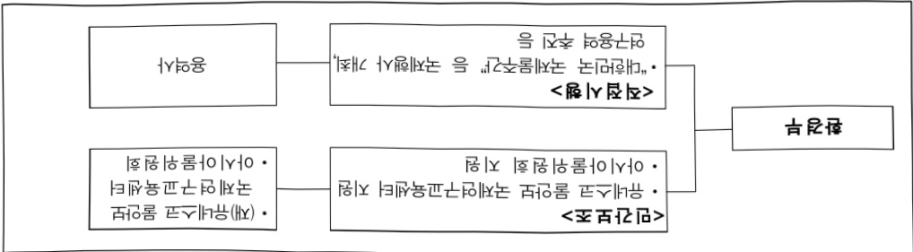

# 물산업정책 및 국제협력

**해당 페이지**: PDF 2741 ~ 2752 쪽 해당

**부처**: 기후에너지환경부
**분야**: 국토 및 지역개발
**회계유형**: 일반회계
**2026 확정예산**: 7919.0 백만원
**전년대비 증감률**: 57.1%
**AI 도메인**: 기타

---

<table border=1 style='margin: auto; word-wrap: break-word;'><tr><td style='text-align: center; word-wrap: break-word;'>사 업 명</td></tr><tr><td style='text-align: center; word-wrap: break-word;'>(8) 물산업정책 및 국제협력(5131-303)</td></tr></table>

□ 사업 코드 정보

<table border=1 style='margin: auto; word-wrap: break-word;'><tr><td style='text-align: center; word-wrap: break-word;'>구분</td><td style='text-align: center; word-wrap: break-word;'>회계</td><td style='text-align: center; word-wrap: break-word;'>소관</td><td style='text-align: center; word-wrap: break-word;'>실국(기관)</td><td style='text-align: center; word-wrap: break-word;'>계정</td><td style='text-align: center; word-wrap: break-word;'>분야</td><td style='text-align: center; word-wrap: break-word;'>부문</td></tr><tr><td style='text-align: center; word-wrap: break-word;'>코드</td><td rowspan="2">일반회계</td><td rowspan="2">환경부</td><td style='text-align: center; word-wrap: break-word;'>물관리정책실</td><td rowspan="2"></td><td style='text-align: center; word-wrap: break-word;'>140</td><td style='text-align: center; word-wrap: break-word;'>141</td></tr><tr><td style='text-align: center; word-wrap: break-word;'>명칭</td><td style='text-align: center; word-wrap: break-word;'>물이용정책관</td><td style='text-align: center; word-wrap: break-word;'>국토및지역개발</td><td style='text-align: center; word-wrap: break-word;'>수자원</td></tr></table>

<table border=1 style='margin: auto; word-wrap: break-word;'><tr><td style='text-align: center; word-wrap: break-word;'>구분</td><td style='text-align: center; word-wrap: break-word;'>프로그램</td><td style='text-align: center; word-wrap: break-word;'>단위사업</td><td style='text-align: center; word-wrap: break-word;'>세부사업</td></tr><tr><td style='text-align: center; word-wrap: break-word;'>코드</td><td style='text-align: center; word-wrap: break-word;'>5100</td><td style='text-align: center; word-wrap: break-word;'>5131</td><td style='text-align: center; word-wrap: break-word;'>303</td></tr><tr><td style='text-align: center; word-wrap: break-word;'>명칭</td><td style='text-align: center; word-wrap: break-word;'>수자원정책 및 홍수관리</td><td style='text-align: center; word-wrap: break-word;'>수자원정책 및 조사</td><td style='text-align: center; word-wrap: break-word;'>물산업정책 및 국제협력</td></tr></table>

사업 성격 (공통요구자료 Ⅱ-1 작성유의사항 4. 참조, 해당하는 사항에 “0” 표시)

<table border=1 style='margin: auto; word-wrap: break-word;'><tr><td rowspan="2">신규</td><td rowspan="2">계속</td><td rowspan="2">완료</td><td rowspan="2">예비타당성 실시여부</td><td rowspan="2">총사업비 관리대상</td><td rowspan="2">총액계상 예산사업</td><td style='text-align: center; word-wrap: break-word;'>사업소관 변경정보</td></tr><tr><td style='text-align: center; word-wrap: break-word;'>2025예산 시 소관</td></tr><tr><td style='text-align: center; word-wrap: break-word;'></td><td style='text-align: center; word-wrap: break-word;'>☐</td><td style='text-align: center; word-wrap: break-word;'></td><td style='text-align: center; word-wrap: break-word;'></td><td style='text-align: center; word-wrap: break-word;'></td><td style='text-align: center; word-wrap: break-word;'></td><td style='text-align: center; word-wrap: break-word;'></td></tr></table>

□ 사업 지원 형태 및 지원을 (최소한 한 개는 반드시 선택하시오. 해당사항에 0 표시)

<table border=1 style='margin: auto; word-wrap: break-word;'><tr><td style='text-align: center; word-wrap: break-word;'>직접</td><td style='text-align: center; word-wrap: break-word;'>출자</td><td style='text-align: center; word-wrap: break-word;'>출연</td><td style='text-align: center; word-wrap: break-word;'>보조</td><td style='text-align: center; word-wrap: break-word;'>융자</td><td style='text-align: center; word-wrap: break-word;'>국고보조율(%)</td><td style='text-align: center; word-wrap: break-word;'>융자율(%)</td></tr><tr><td style='text-align: center; word-wrap: break-word;'>○</td><td style='text-align: center; word-wrap: break-word;'></td><td style='text-align: center; word-wrap: break-word;'></td><td style='text-align: center; word-wrap: break-word;'>○</td><td style='text-align: center; word-wrap: break-word;'></td><td style='text-align: center; word-wrap: break-word;'>100</td><td style='text-align: center; word-wrap: break-word;'></td></tr></table>

□ 사업 담당자

<table border=1 style='margin: auto; word-wrap: break-word;'><tr><td style='text-align: center; word-wrap: break-word;'>사업명</td><td colspan="2">구분</td></tr><tr><td rowspan="4">물산업정책 및 국제협력</td><td rowspan="2">소관부처</td><td style='text-align: center; word-wrap: break-word;'>물이용정책관</td></tr><tr><td style='text-align: center; word-wrap: break-word;'>물산업협력과</td></tr><tr><td rowspan="2">사업시행주체</td><td style='text-align: center; word-wrap: break-word;'>유네스코 물안보센터</td></tr><tr><td style='text-align: center; word-wrap: break-word;'>아시아물위원회</td></tr></table>

---

### 가. 예산 총괄표

(단위:백만원,%)

<table border=1 style='margin: auto; word-wrap: break-word;'><tr><td rowspan="2">사업명</td><td rowspan="2">2024년 결산</td><td colspan="2">2025년 예산</td><td colspan="2">2026년</td><td rowspan="2">증감 (B-A)</td><td rowspan="2">(B-A)/A</td></tr><tr><td style='text-align: center; word-wrap: break-word;'>본예산(A)</td><td style='text-align: center; word-wrap: break-word;'>추경</td><td style='text-align: center; word-wrap: break-word;'>정부안</td><td style='text-align: center; word-wrap: break-word;'>확정(B)</td></tr><tr><td style='text-align: center; word-wrap: break-word;'>물산업정책 및 국제협력</td><td style='text-align: center; word-wrap: break-word;'>5,591</td><td style='text-align: center; word-wrap: break-word;'>5,042</td><td style='text-align: center; word-wrap: break-word;'>5,042</td><td style='text-align: center; word-wrap: break-word;'>6,919</td><td style='text-align: center; word-wrap: break-word;'>7,919</td><td style='text-align: center; word-wrap: break-word;'>2,877</td><td style='text-align: center; word-wrap: break-word;'>57.1</td></tr></table>

□ 기능별(내역사업별), 목별 예산 내역

(단위:백만원)

<table border=1 style='margin: auto; word-wrap: break-word;'><tr><td rowspan="3"></td><td colspan="5">2024</td><td colspan="7">2025</td><td rowspan="3">2026예산</td></tr><tr><td rowspan="2">예산액(추경)</td><td rowspan="2">예산현액</td><td rowspan="2">집행액[실집행액]</td><td rowspan="2">이월액</td><td rowspan="2">불용액</td><td rowspan="2">본예산</td><td rowspan="2">예산현액</td><td rowspan="2">집행액[실집행액]</td><td colspan="2">전년도이월액제외</td><td rowspan="2">이월예상액</td><td rowspan="2">불용예상액</td></tr><tr><td style='text-align: center; word-wrap: break-word;'>예산현액</td><td style='text-align: center; word-wrap: break-word;'>집행액[실집행액]</td></tr><tr><td style='text-align: center; word-wrap: break-word;'>○ 기능별 분류(합계)</td><td style='text-align: center; word-wrap: break-word;'>5,692</td><td style='text-align: center; word-wrap: break-word;'>5,997</td><td style='text-align: center; word-wrap: break-word;'>5,591[5,587]</td><td style='text-align: center; word-wrap: break-word;'>288</td><td style='text-align: center; word-wrap: break-word;'>118</td><td style='text-align: center; word-wrap: break-word;'>5,042</td><td style='text-align: center; word-wrap: break-word;'>5,330</td><td style='text-align: center; word-wrap: break-word;'>4,909[4,900]</td><td style='text-align: center; word-wrap: break-word;'>5,042</td><td style='text-align: center; word-wrap: break-word;'>4,655[4,646]</td><td style='text-align: center; word-wrap: break-word;'>299</td><td style='text-align: center; word-wrap: break-word;'>122</td><td style='text-align: center; word-wrap: break-word;'>7,919</td></tr><tr><td style='text-align: center; word-wrap: break-word;'>· 대한민국 국제물주간등 국제행사 개최</td><td style='text-align: center; word-wrap: break-word;'>850</td><td style='text-align: center; word-wrap: break-word;'>1,022</td><td style='text-align: center; word-wrap: break-word;'>789[789]</td><td style='text-align: center; word-wrap: break-word;'>154</td><td style='text-align: center; word-wrap: break-word;'>79</td><td style='text-align: center; word-wrap: break-word;'>850</td><td style='text-align: center; word-wrap: break-word;'>1,004</td><td style='text-align: center; word-wrap: break-word;'>917[917]</td><td style='text-align: center; word-wrap: break-word;'>850</td><td style='text-align: center; word-wrap: break-word;'>763[763]</td><td style='text-align: center; word-wrap: break-word;'>-</td><td style='text-align: center; word-wrap: break-word;'>87</td><td style='text-align: center; word-wrap: break-word;'>850</td></tr><tr><td style='text-align: center; word-wrap: break-word;'>· 물분야 국제기구 합류 및 공동연구</td><td style='text-align: center; word-wrap: break-word;'>3,770</td><td style='text-align: center; word-wrap: break-word;'>3,770</td><td style='text-align: center; word-wrap: break-word;'>3,770[3,766]</td><td style='text-align: center; word-wrap: break-word;'>-</td><td style='text-align: center; word-wrap: break-word;'>-</td><td style='text-align: center; word-wrap: break-word;'>2,650</td><td style='text-align: center; word-wrap: break-word;'>2,650</td><td style='text-align: center; word-wrap: break-word;'>2,650[2,641]</td><td style='text-align: center; word-wrap: break-word;'>2,650</td><td style='text-align: center; word-wrap: break-word;'>2,650[2,641]</td><td style='text-align: center; word-wrap: break-word;'>-</td><td style='text-align: center; word-wrap: break-word;'>-</td><td style='text-align: center; word-wrap: break-word;'>5,595</td></tr><tr><td style='text-align: center; word-wrap: break-word;'>· 기타물법정책지원</td><td style='text-align: center; word-wrap: break-word;'>1,072</td><td style='text-align: center; word-wrap: break-word;'>1,205</td><td style='text-align: center; word-wrap: break-word;'>1,032[1,032]</td><td style='text-align: center; word-wrap: break-word;'>134</td><td style='text-align: center; word-wrap: break-word;'>39</td><td style='text-align: center; word-wrap: break-word;'>1,542</td><td style='text-align: center; word-wrap: break-word;'>1,676</td><td style='text-align: center; word-wrap: break-word;'>1,342[1,342]</td><td style='text-align: center; word-wrap: break-word;'>1,542</td><td style='text-align: center; word-wrap: break-word;'>1,242[1,242]</td><td style='text-align: center; word-wrap: break-word;'>299</td><td style='text-align: center; word-wrap: break-word;'>35</td><td style='text-align: center; word-wrap: break-word;'>1,474</td></tr><tr><td style='text-align: center; word-wrap: break-word;'>○ 비목별 분류(합계)</td><td style='text-align: center; word-wrap: break-word;'>5,692</td><td style='text-align: center; word-wrap: break-word;'>5,997</td><td style='text-align: center; word-wrap: break-word;'>5,591[5,587]</td><td style='text-align: center; word-wrap: break-word;'>288</td><td style='text-align: center; word-wrap: break-word;'>118</td><td style='text-align: center; word-wrap: break-word;'>5,042</td><td style='text-align: center; word-wrap: break-word;'>5,330</td><td style='text-align: center; word-wrap: break-word;'>4,909[4,900]</td><td style='text-align: center; word-wrap: break-word;'>5,042</td><td style='text-align: center; word-wrap: break-word;'>4,655[4,646]</td><td style='text-align: center; word-wrap: break-word;'>299</td><td style='text-align: center; word-wrap: break-word;'>122</td><td style='text-align: center; word-wrap: break-word;'>7,919</td></tr><tr><td style='text-align: center; word-wrap: break-word;'>· 일반 수용비(210-01)</td><td style='text-align: center; word-wrap: break-word;'>19</td><td style='text-align: center; word-wrap: break-word;'>16</td><td style='text-align: center; word-wrap: break-word;'>15[15]</td><td style='text-align: center; word-wrap: break-word;'>-</td><td style='text-align: center; word-wrap: break-word;'>1</td><td style='text-align: center; word-wrap: break-word;'>25</td><td style='text-align: center; word-wrap: break-word;'>19</td><td style='text-align: center; word-wrap: break-word;'>19[19]</td><td style='text-align: center; word-wrap: break-word;'>19</td><td style='text-align: center; word-wrap: break-word;'>19[19]</td><td style='text-align: center; word-wrap: break-word;'>-</td><td style='text-align: center; word-wrap: break-word;'>-</td><td style='text-align: center; word-wrap: break-word;'>25</td></tr><tr><td style='text-align: center; word-wrap: break-word;'>· 임차료(210-07)</td><td style='text-align: center; word-wrap: break-word;'>-</td><td style='text-align: center; word-wrap: break-word;'>3</td><td style='text-align: center; word-wrap: break-word;'>3[3]</td><td style='text-align: center; word-wrap: break-word;'>-</td><td style='text-align: center; word-wrap: break-word;'>-</td><td style='text-align: center; word-wrap: break-word;'>-</td><td style='text-align: center; word-wrap: break-word;'>-</td><td style='text-align: center; word-wrap: break-word;'>-</td><td style='text-align: center; word-wrap: break-word;'>-</td><td style='text-align: center; word-wrap: break-word;'>-</td><td style='text-align: center; word-wrap: break-word;'>-</td><td style='text-align: center; word-wrap: break-word;'>-</td><td style='text-align: center; word-wrap: break-word;'>-</td></tr><tr><td style='text-align: center; word-wrap: break-word;'>· 일반 용 역 비(210-14)</td><td style='text-align: center; word-wrap: break-word;'>550</td><td style='text-align: center; word-wrap: break-word;'>556</td><td style='text-align: center; word-wrap: break-word;'>479[479]</td><td style='text-align: center; word-wrap: break-word;'>52</td><td style='text-align: center; word-wrap: break-word;'>25</td><td style='text-align: center; word-wrap: break-word;'>327</td><td style='text-align: center; word-wrap: break-word;'>337</td><td style='text-align: center; word-wrap: break-word;'>250[250]</td><td style='text-align: center; word-wrap: break-word;'>285</td><td style='text-align: center; word-wrap: break-word;'>211[211]</td><td style='text-align: center; word-wrap: break-word;'>74</td><td style='text-align: center; word-wrap: break-word;'>13</td><td style='text-align: center; word-wrap: break-word;'>220</td></tr><tr><td style='text-align: center; word-wrap: break-word;'>· 국 내 여 비(220-01)</td><td style='text-align: center; word-wrap: break-word;'>9</td><td style='text-align: center; word-wrap: break-word;'>9</td><td style='text-align: center; word-wrap: break-word;'>9[9]</td><td style='text-align: center; word-wrap: break-word;'>-</td><td style='text-align: center; word-wrap: break-word;'>-</td><td style='text-align: center; word-wrap: break-word;'>8</td><td style='text-align: center; word-wrap: break-word;'>8</td><td style='text-align: center; word-wrap: break-word;'>8[8]</td><td style='text-align: center; word-wrap: break-word;'>8</td><td style='text-align: center; word-wrap: break-word;'>8[8]</td><td style='text-align: center; word-wrap: break-word;'>-</td><td style='text-align: center; word-wrap: break-word;'>-</td><td style='text-align: center; word-wrap: break-word;'>8</td></tr><tr><td style='text-align: center; word-wrap: break-word;'>· 국위업무여비(220-02)</td><td style='text-align: center; word-wrap: break-word;'>39</td><td style='text-align: center; word-wrap: break-word;'>50</td><td style='text-align: center; word-wrap: break-word;'>47[47]</td><td style='text-align: center; word-wrap: break-word;'>-</td><td style='text-align: center; word-wrap: break-word;'>3</td><td style='text-align: center; word-wrap: break-word;'>35</td><td style='text-align: center; word-wrap: break-word;'>61</td><td style='text-align: center; word-wrap: break-word;'>61[61]</td><td style='text-align: center; word-wrap: break-word;'>61</td><td style='text-align: center; word-wrap: break-word;'>61[61]</td><td style='text-align: center; word-wrap: break-word;'>-</td><td style='text-align: center; word-wrap: break-word;'>-</td><td style='text-align: center; word-wrap: break-word;'>35</td></tr><tr><td style='text-align: center; word-wrap: break-word;'>· 사업 추진 비(240-01)</td><td style='text-align: center; word-wrap: break-word;'>9</td><td style='text-align: center; word-wrap: break-word;'>9</td><td style='text-align: center; word-wrap: break-word;'>8[8]</td><td style='text-align: center; word-wrap: break-word;'>-</td><td style='text-align: center; word-wrap: break-word;'>1</td><td style='text-align: center; word-wrap: break-word;'>8</td><td style='text-align: center; word-wrap: break-word;'>8</td><td style='text-align: center; word-wrap: break-word;'>8[8]</td><td style='text-align: center; word-wrap: break-word;'>8</td><td style='text-align: center; word-wrap: break-word;'>8[8]</td><td style='text-align: center; word-wrap: break-word;'>-</td><td style='text-align: center; word-wrap: break-word;'>-</td><td style='text-align: center; word-wrap: break-word;'>8</td></tr><tr><td style='text-align: center; word-wrap: break-word;'>· 일반 연 구 비(260-01)</td><td style='text-align: center; word-wrap: break-word;'>443</td><td style='text-align: center; word-wrap: break-word;'>559</td><td style='text-align: center; word-wrap: break-word;'>468[468]</td><td style='text-align: center; word-wrap: break-word;'>82</td><td style='text-align: center; word-wrap: break-word;'>9</td><td style='text-align: center; word-wrap: break-word;'>1,136</td><td style='text-align: center; word-wrap: break-word;'>1,240</td><td style='text-align: center; word-wrap: break-word;'>993[993]</td><td style='text-align: center; word-wrap: break-word;'>1,158</td><td style='text-align: center; word-wrap: break-word;'>932[932]</td><td style='text-align: center; word-wrap: break-word;'>225</td><td style='text-align: center; word-wrap: break-word;'>22</td><td style='text-align: center; word-wrap: break-word;'>974</td></tr><tr><td style='text-align: center; word-wrap: break-word;'>· 민간 경상 보조(320-01)</td><td style='text-align: center; word-wrap: break-word;'>1,750</td><td style='text-align: center; word-wrap: break-word;'>1,750</td><td style='text-align: center; word-wrap: break-word;'>1,750[1,746]</td><td style='text-align: center; word-wrap: break-word;'>-</td><td style='text-align: center; word-wrap: break-word;'>-</td><td style='text-align: center; word-wrap: break-word;'>1,750</td><td style='text-align: center; word-wrap: break-word;'>1,750</td><td style='text-align: center; word-wrap: break-word;'>1,750[1,741]</td><td style='text-align: center; word-wrap: break-word;'>1,750</td><td style='text-align: center; word-wrap: break-word;'>1,750[1,741]</td><td style='text-align: center; word-wrap: break-word;'>-</td><td style='text-align: center; word-wrap: break-word;'>-</td><td style='text-align: center; word-wrap: break-word;'>2,575</td></tr><tr><td style='text-align: center; word-wrap: break-word;'>· 민간위탁사업비(320-02)</td><td style='text-align: center; word-wrap: break-word;'>850</td><td style='text-align: center; word-wrap: break-word;'>1,022</td><td style='text-align: center; word-wrap: break-word;'>789[789]</td><td style='text-align: center; word-wrap: break-word;'>154</td><td style='text-align: center; word-wrap: break-word;'>79</td><td style='text-align: center; word-wrap: break-word;'>850</td><td style='text-align: center; word-wrap: break-word;'>1,004</td><td style='text-align: center; word-wrap: break-word;'>917[917]</td><td style='text-align: center; word-wrap: break-word;'>850</td><td style='text-align: center; word-wrap: break-word;'>763[763]</td><td style='text-align: center; word-wrap: break-word;'>-</td><td style='text-align: center; word-wrap: break-word;'>87</td><td style='text-align: center; word-wrap: break-word;'>1,050</td></tr><tr><td style='text-align: center; word-wrap: break-word;'>· 국제 부 담 금</td><td style='text-align: center; word-wrap: break-word;'>2,023</td><td style='text-align: center; word-wrap: break-word;'>2,023</td><td style='text-align: center; word-wrap: break-word;'>2,023</td><td style='text-align: center; word-wrap: break-word;'>-</td><td style='text-align: center; word-wrap: break-word;'>-</td><td style='text-align: center; word-wrap: break-word;'>903</td><td style='text-align: center; word-wrap: break-word;'>903</td><td style='text-align: center; word-wrap: break-word;'>903</td><td style='text-align: center; word-wrap: break-word;'>903</td><td style='text-align: center; word-wrap: break-word;'>903</td><td style='text-align: center; word-wrap: break-word;'>-</td><td style='text-align: center; word-wrap: break-word;'>-</td><td style='text-align: center; word-wrap: break-word;'>3,024</td></tr></table>

---

<table border=1 style='margin: auto; word-wrap: break-word;'><tr><td rowspan="3"></td><td colspan="5">2024</td><td colspan="7">2025</td><td rowspan="3">2026예산</td></tr><tr><td rowspan="2">예산액(추경)</td><td rowspan="2">예산현액</td><td rowspan="2">집행액[실집행액]</td><td rowspan="2">이왈액</td><td rowspan="2">불용액</td><td rowspan="2">분예산</td><td rowspan="2">예산현액</td><td rowspan="2">집행액[실집행액]</td><td colspan="2">전년도 이왈액제외</td><td rowspan="2">이왈액예상액</td><td rowspan="2">불용예상액</td></tr><tr><td style='text-align: center; word-wrap: break-word;'>예산현액</td><td style='text-align: center; word-wrap: break-word;'>집행액[실집행액]</td></tr><tr><td style='text-align: center; word-wrap: break-word;'>(340-02)</td><td style='text-align: center; word-wrap: break-word;'></td><td style='text-align: center; word-wrap: break-word;'></td><td style='text-align: center; word-wrap: break-word;'>[2,023]</td><td style='text-align: center; word-wrap: break-word;'></td><td style='text-align: center; word-wrap: break-word;'></td><td style='text-align: center; word-wrap: break-word;'></td><td style='text-align: center; word-wrap: break-word;'></td><td style='text-align: center; word-wrap: break-word;'>[903]</td><td style='text-align: center; word-wrap: break-word;'></td><td style='text-align: center; word-wrap: break-word;'>[903]</td><td style='text-align: center; word-wrap: break-word;'></td><td style='text-align: center; word-wrap: break-word;'></td><td style='text-align: center; word-wrap: break-word;'></td></tr><tr><td style='text-align: center; word-wrap: break-word;'>○ 기능비목별 분류합계</td><td style='text-align: center; word-wrap: break-word;'>5,692</td><td style='text-align: center; word-wrap: break-word;'>5,997</td><td style='text-align: center; word-wrap: break-word;'>5,591[5,587]</td><td style='text-align: center; word-wrap: break-word;'>288</td><td style='text-align: center; word-wrap: break-word;'>118</td><td style='text-align: center; word-wrap: break-word;'>5,042</td><td style='text-align: center; word-wrap: break-word;'>5,330</td><td style='text-align: center; word-wrap: break-word;'>4,909[4,900]</td><td style='text-align: center; word-wrap: break-word;'>5,042</td><td style='text-align: center; word-wrap: break-word;'>4,655[4,646]</td><td style='text-align: center; word-wrap: break-word;'>299</td><td style='text-align: center; word-wrap: break-word;'>122</td><td style='text-align: center; word-wrap: break-word;'>7,919</td></tr><tr><td style='text-align: center; word-wrap: break-word;'>· 대환보국 국제물주간등 국제행사 개최</td><td style='text-align: center; word-wrap: break-word;'>850</td><td style='text-align: center; word-wrap: break-word;'>1,022</td><td style='text-align: center; word-wrap: break-word;'>789[789]</td><td style='text-align: center; word-wrap: break-word;'>154</td><td style='text-align: center; word-wrap: break-word;'>79</td><td style='text-align: center; word-wrap: break-word;'>850</td><td style='text-align: center; word-wrap: break-word;'>1,004</td><td style='text-align: center; word-wrap: break-word;'>917[917]</td><td style='text-align: center; word-wrap: break-word;'>850</td><td style='text-align: center; word-wrap: break-word;'>763[763]</td><td style='text-align: center; word-wrap: break-word;'>-</td><td style='text-align: center; word-wrap: break-word;'>87</td><td style='text-align: center; word-wrap: break-word;'>850</td></tr><tr><td style='text-align: center; word-wrap: break-word;'>- 민간위탁사업비(320-02)</td><td style='text-align: center; word-wrap: break-word;'>850</td><td style='text-align: center; word-wrap: break-word;'>1,022</td><td style='text-align: center; word-wrap: break-word;'>789[789]</td><td style='text-align: center; word-wrap: break-word;'>154</td><td style='text-align: center; word-wrap: break-word;'>79</td><td style='text-align: center; word-wrap: break-word;'>850</td><td style='text-align: center; word-wrap: break-word;'>1,004</td><td style='text-align: center; word-wrap: break-word;'>917[917]</td><td style='text-align: center; word-wrap: break-word;'>850</td><td style='text-align: center; word-wrap: break-word;'>763[763]</td><td style='text-align: center; word-wrap: break-word;'>-</td><td style='text-align: center; word-wrap: break-word;'>87</td><td style='text-align: center; word-wrap: break-word;'>850</td></tr><tr><td style='text-align: center; word-wrap: break-word;'>· 물분야 국제기구협력 및 공동연구</td><td style='text-align: center; word-wrap: break-word;'>3,770</td><td style='text-align: center; word-wrap: break-word;'>3,770</td><td style='text-align: center; word-wrap: break-word;'>3,770[3,766]</td><td style='text-align: center; word-wrap: break-word;'>-</td><td style='text-align: center; word-wrap: break-word;'>-</td><td style='text-align: center; word-wrap: break-word;'>2,650</td><td style='text-align: center; word-wrap: break-word;'>2,650</td><td style='text-align: center; word-wrap: break-word;'>2,650[2,641]</td><td style='text-align: center; word-wrap: break-word;'>2,650</td><td style='text-align: center; word-wrap: break-word;'>2,650[2,641]</td><td style='text-align: center; word-wrap: break-word;'>-</td><td style='text-align: center; word-wrap: break-word;'>-</td><td style='text-align: center; word-wrap: break-word;'>5,595</td></tr><tr><td style='text-align: center; word-wrap: break-word;'>- 민간경상보조(320-01)</td><td style='text-align: center; word-wrap: break-word;'>1,750</td><td style='text-align: center; word-wrap: break-word;'>1,750</td><td style='text-align: center; word-wrap: break-word;'>1,750[1,746]</td><td style='text-align: center; word-wrap: break-word;'>-</td><td style='text-align: center; word-wrap: break-word;'>-</td><td style='text-align: center; word-wrap: break-word;'>1,750</td><td style='text-align: center; word-wrap: break-word;'>1,750</td><td style='text-align: center; word-wrap: break-word;'>1,750[1,741]</td><td style='text-align: center; word-wrap: break-word;'>1,750</td><td style='text-align: center; word-wrap: break-word;'>1,750[1,741]</td><td style='text-align: center; word-wrap: break-word;'>-</td><td style='text-align: center; word-wrap: break-word;'>-</td><td style='text-align: center; word-wrap: break-word;'>2,575</td></tr><tr><td style='text-align: center; word-wrap: break-word;'>- 국제부담금(340-02)</td><td style='text-align: center; word-wrap: break-word;'>2,020</td><td style='text-align: center; word-wrap: break-word;'>2,020</td><td style='text-align: center; word-wrap: break-word;'>2,020[2,020]</td><td style='text-align: center; word-wrap: break-word;'>-</td><td style='text-align: center; word-wrap: break-word;'>-</td><td style='text-align: center; word-wrap: break-word;'>900</td><td style='text-align: center; word-wrap: break-word;'>900</td><td style='text-align: center; word-wrap: break-word;'>900[900]</td><td style='text-align: center; word-wrap: break-word;'>900</td><td style='text-align: center; word-wrap: break-word;'>900[900]</td><td style='text-align: center; word-wrap: break-word;'>-</td><td style='text-align: center; word-wrap: break-word;'>-</td><td style='text-align: center; word-wrap: break-word;'>3,020</td></tr><tr><td style='text-align: center; word-wrap: break-word;'>· 기타물산업정책지원</td><td style='text-align: center; word-wrap: break-word;'>1,072</td><td style='text-align: center; word-wrap: break-word;'>1,205</td><td style='text-align: center; word-wrap: break-word;'>1,032[1,032]</td><td style='text-align: center; word-wrap: break-word;'>134</td><td style='text-align: center; word-wrap: break-word;'>39</td><td style='text-align: center; word-wrap: break-word;'>1,542</td><td style='text-align: center; word-wrap: break-word;'>1,676</td><td style='text-align: center; word-wrap: break-word;'>1,342[1,342]</td><td style='text-align: center; word-wrap: break-word;'>1,542</td><td style='text-align: center; word-wrap: break-word;'>1,242[1,242]</td><td style='text-align: center; word-wrap: break-word;'>299</td><td style='text-align: center; word-wrap: break-word;'>35</td><td style='text-align: center; word-wrap: break-word;'>1,474</td></tr><tr><td style='text-align: center; word-wrap: break-word;'>- 일반수용비(210-01)</td><td style='text-align: center; word-wrap: break-word;'>19</td><td style='text-align: center; word-wrap: break-word;'>16</td><td style='text-align: center; word-wrap: break-word;'>15[15]</td><td style='text-align: center; word-wrap: break-word;'>-</td><td style='text-align: center; word-wrap: break-word;'>1</td><td style='text-align: center; word-wrap: break-word;'>25</td><td style='text-align: center; word-wrap: break-word;'>19</td><td style='text-align: center; word-wrap: break-word;'>19[19]</td><td style='text-align: center; word-wrap: break-word;'>19</td><td style='text-align: center; word-wrap: break-word;'>19[19]</td><td style='text-align: center; word-wrap: break-word;'>-</td><td style='text-align: center; word-wrap: break-word;'>-</td><td style='text-align: center; word-wrap: break-word;'>25</td></tr><tr><td style='text-align: center; word-wrap: break-word;'>- 임차료(210-07)</td><td style='text-align: center; word-wrap: break-word;'>-</td><td style='text-align: center; word-wrap: break-word;'>3</td><td style='text-align: center; word-wrap: break-word;'>3[3]</td><td style='text-align: center; word-wrap: break-word;'>-</td><td style='text-align: center; word-wrap: break-word;'>-</td><td style='text-align: center; word-wrap: break-word;'>-</td><td style='text-align: center; word-wrap: break-word;'>-</td><td style='text-align: center; word-wrap: break-word;'>-</td><td style='text-align: center; word-wrap: break-word;'>-</td><td style='text-align: center; word-wrap: break-word;'>-</td><td style='text-align: center; word-wrap: break-word;'>-</td><td style='text-align: center; word-wrap: break-word;'>-</td><td style='text-align: center; word-wrap: break-word;'>-</td></tr><tr><td style='text-align: center; word-wrap: break-word;'>- 일반용역비(210-14)</td><td style='text-align: center; word-wrap: break-word;'>550</td><td style='text-align: center; word-wrap: break-word;'>556</td><td style='text-align: center; word-wrap: break-word;'>479[479]</td><td style='text-align: center; word-wrap: break-word;'>52</td><td style='text-align: center; word-wrap: break-word;'>25</td><td style='text-align: center; word-wrap: break-word;'>327</td><td style='text-align: center; word-wrap: break-word;'>337</td><td style='text-align: center; word-wrap: break-word;'>250[250]</td><td style='text-align: center; word-wrap: break-word;'>285</td><td style='text-align: center; word-wrap: break-word;'>211[211]</td><td style='text-align: center; word-wrap: break-word;'>74</td><td style='text-align: center; word-wrap: break-word;'>13</td><td style='text-align: center; word-wrap: break-word;'>220</td></tr><tr><td style='text-align: center; word-wrap: break-word;'>- 국내여비(220-01)</td><td style='text-align: center; word-wrap: break-word;'>9</td><td style='text-align: center; word-wrap: break-word;'>9</td><td style='text-align: center; word-wrap: break-word;'>9[9]</td><td style='text-align: center; word-wrap: break-word;'>-</td><td style='text-align: center; word-wrap: break-word;'>-</td><td style='text-align: center; word-wrap: break-word;'>8</td><td style='text-align: center; word-wrap: break-word;'>8</td><td style='text-align: center; word-wrap: break-word;'>8[8]</td><td style='text-align: center; word-wrap: break-word;'>8</td><td style='text-align: center; word-wrap: break-word;'>8[8]</td><td style='text-align: center; word-wrap: break-word;'>-</td><td style='text-align: center; word-wrap: break-word;'>-</td><td style='text-align: center; word-wrap: break-word;'>8</td></tr><tr><td style='text-align: center; word-wrap: break-word;'>- 국외업무여비(220-02)</td><td style='text-align: center; word-wrap: break-word;'>39</td><td style='text-align: center; word-wrap: break-word;'>50</td><td style='text-align: center; word-wrap: break-word;'>47[47]</td><td style='text-align: center; word-wrap: break-word;'>-</td><td style='text-align: center; word-wrap: break-word;'>3</td><td style='text-align: center; word-wrap: break-word;'>35</td><td style='text-align: center; word-wrap: break-word;'>61</td><td style='text-align: center; word-wrap: break-word;'>61[61]</td><td style='text-align: center; word-wrap: break-word;'>61</td><td style='text-align: center; word-wrap: break-word;'>61[61]</td><td style='text-align: center; word-wrap: break-word;'>-</td><td style='text-align: center; word-wrap: break-word;'>-</td><td style='text-align: center; word-wrap: break-word;'>35</td></tr><tr><td style='text-align: center; word-wrap: break-word;'>- 사업추진비(240-01)</td><td style='text-align: center; word-wrap: break-word;'>9</td><td style='text-align: center; word-wrap: break-word;'>9</td><td style='text-align: center; word-wrap: break-word;'>8[8]</td><td style='text-align: center; word-wrap: break-word;'>-</td><td style='text-align: center; word-wrap: break-word;'>1</td><td style='text-align: center; word-wrap: break-word;'>8</td><td style='text-align: center; word-wrap: break-word;'>8</td><td style='text-align: center; word-wrap: break-word;'>8[8]</td><td style='text-align: center; word-wrap: break-word;'>8</td><td style='text-align: center; word-wrap: break-word;'>8[8]</td><td style='text-align: center; word-wrap: break-word;'>-</td><td style='text-align: center; word-wrap: break-word;'>-</td><td style='text-align: center; word-wrap: break-word;'>8</td></tr><tr><td style='text-align: center; word-wrap: break-word;'>- 일반연구비(260-01)</td><td style='text-align: center; word-wrap: break-word;'>443</td><td style='text-align: center; word-wrap: break-word;'>559</td><td style='text-align: center; word-wrap: break-word;'>468[468]</td><td style='text-align: center; word-wrap: break-word;'>82</td><td style='text-align: center; word-wrap: break-word;'>9</td><td style='text-align: center; word-wrap: break-word;'>1,136</td><td style='text-align: center; word-wrap: break-word;'>1,240</td><td style='text-align: center; word-wrap: break-word;'>993[993]</td><td style='text-align: center; word-wrap: break-word;'>1,158</td><td style='text-align: center; word-wrap: break-word;'>932[932]</td><td style='text-align: center; word-wrap: break-word;'>225</td><td style='text-align: center; word-wrap: break-word;'>22</td><td style='text-align: center; word-wrap: break-word;'>974</td></tr><tr><td style='text-align: center; word-wrap: break-word;'>- 민간위탁사업비(320-02)</td><td style='text-align: center; word-wrap: break-word;'>-</td><td style='text-align: center; word-wrap: break-word;'>-</td><td style='text-align: center; word-wrap: break-word;'>-</td><td style='text-align: center; word-wrap: break-word;'>-</td><td style='text-align: center; word-wrap: break-word;'>-</td><td style='text-align: center; word-wrap: break-word;'>-</td><td style='text-align: center; word-wrap: break-word;'>-</td><td style='text-align: center; word-wrap: break-word;'>-</td><td style='text-align: center; word-wrap: break-word;'>-</td><td style='text-align: center; word-wrap: break-word;'>-</td><td style='text-align: center; word-wrap: break-word;'>-</td><td style='text-align: center; word-wrap: break-word;'>-</td><td style='text-align: center; word-wrap: break-word;'>200</td></tr><tr><td style='text-align: center; word-wrap: break-word;'>- 국제부담금(340-02)</td><td style='text-align: center; word-wrap: break-word;'>3</td><td style='text-align: center; word-wrap: break-word;'>3</td><td style='text-align: center; word-wrap: break-word;'>3[3]</td><td style='text-align: center; word-wrap: break-word;'>-</td><td style='text-align: center; word-wrap: break-word;'>-</td><td style='text-align: center; word-wrap: break-word;'>3</td><td style='text-align: center; word-wrap: break-word;'>3</td><td style='text-align: center; word-wrap: break-word;'>3[3]</td><td style='text-align: center; word-wrap: break-word;'>3</td><td style='text-align: center; word-wrap: break-word;'>3[3]</td><td style='text-align: center; word-wrap: break-word;'>-</td><td style='text-align: center; word-wrap: break-word;'>-</td><td style='text-align: center; word-wrap: break-word;'>4</td></tr></table>

---

### 나. 사업설명자료

## 1 ) 사업목적·내용

□ (물산업정책 및 국제협력) 주요국 정부 및 국제기구와 물분야 양자·다자 협력을 추진하고, 국내·외 행사 개최 등을 통해 물산업 해외진출·수주 지원, 물분야 국제위상 제고

- (대한민국 국제물주간 등 국제행사 개최) 각 국 정부, 국제기구 및 국내·외 물분야 전문가

대상으로 물 문제 해결방안 논의, 국내 물산업 해외진출 확대 등을 위한 국제행사 개최·운영

- (물분야 국제기구 협력 및 공동연구) 유네스코 물안보센터 및 아시아물위원회 운영,

WMO·OECD·유네스코·IDB 등 국제기구 공동연구

- (기타 물산업정책 지원) 국내 물분야 관계기관 협의체 운영 및 향후 물분야 국제협력 로

- 댄마련을 위한 연구용역, 그 외 국내·외 여비 등 국제업무 수행 소요비용 등

## 2 ) 사업개요

□ 사업근거 및 추진경위

① 법령상 근거 및 조항 적시

- 수자원의 조사·계획 및 관리에 관한 법률 제27조

① 환경부장관은 수자원정책의 국제공조 및 우리나라 수자원 관리기술의 해외시장 진출을 지원하기 위하여 다음 각 호의 사업을 할 수 있다.

1. 수자원 분야 국제협력을 위한 조사·연구

2. 수자원 분야 기술·인력 및 정보의 국제교류

3. 수자원에 관한 전시회·학술회의·국제회의 개최

4. 수자원관리기술의 해외시장 진출을 위한 시장조사 및 타당성 조사

5. 제1호부터 제4호까지에서 규정한 사업 외에 대통령령으로 정하는 사업

② 환경부장관은 제1항 각 호의 사업을 하는 기관에 예산의 범위에서 필요한 경비의 전부 또는 일부를 지원할 수 있다.

## - 한-유네스코 물안보 국제연구교육센터 갱신 협정 제8조(정부의 기여)

1. 정부는 대한민국의 적절한 관련 법령과 연간 예산 배정에 따라 대한민국에서 센터의 행정과 온전한 기능 수행을 위하여 필요한 재정적 또는 현물 형태의 모든 자원을 제공한다.

---

- 물관리기본법 제36조 및 제36조의2

제36조(물관리 국제협력의 추진) 국가와 지방자치단체는 효율적인 물관리를 위하여 외국 및 국제기구 등과 기술협력, 정보교환, 공동 조사 · 연구 등을 추진하기 위한 시책을 수립하고 시행하여야 한다.

제36조의2(유네스코 물안보국제연구교육센터의 설립 등) ① 「국제연합교육과학문화기구(유네스코) 후원 물 안보 및 지속가능 수자원 관리 국제센터(카테고리 2) 설립에 관한 대한민국 정부와 유네스코 간의 협정」의 이행을 장려하고, 세계 물 안보 및 지속가능한 물 관리를 증진하기 위하여 유네스코 물안보국제연구교육센터(이하 “물안보국제연구교육센터”라 한다)를 설립한다.

## (중략)

⑥ 국가 및 지방자치단체는 예산의 범위에서 물안보국제연구교육센터의 운영 및 사업수행에 필요한 경비를 지원할 수 있다.

## ② 추진경위

- '12.12.18 : '2015세계물포럼 지원특별법' 제정

- '13.08.01 : (재)2015세계물포럼 조직위원회 사무국 발족

- '15.03.31 : 대통령 지시사항(세계물포럼 행사 준비에 만전 및 물산업 해외진출 토대 마련)

- '15.04.12~17. : 「2015 제7차 세계물포럼」 개최

- '16.12.16 : 한-유네스코 물안보 국제연구교육센터 설립 협정 체결

- '17.04.13 : 한-유네스코 물안보 국제연구교육센터 설립

- '22.12.29 : 한-유네스코 물안보 국제연구교육센터 갱신 협정 체결

- '15.04.13~현재 : 대한민국국제물주간 개최(매년), 워터비즈니스포럼 개최(수시), 월드워터파트너십 운영(매년), 월드워터챔린지 운영(매년), 세계물포럼 참가(3년), 국가간 MOU체결 등

- '22.12.11 : 세계물위원회 이사기관 연임(환경부 등 3개 기관, '22~ $ ^{25} $)

- '23.09.07 : 제2차 한-메콩 국제 물포럼(MKWF) 개최

- '24.06.05 : 유네스코 물과학보고서 결의안 채택(제26차 유네스코 IHP 정부간이사회)

- '25.03.24 : 제3차 한-메콩 국제 물포럼(MKWF) 개최

## □ 주요내용

① 사업규모

- 총사업비 : 해당없음

- 사업기간 : '06~계속

---

- 최근 5년 간 투입된 사업비(예산액기준, 추경편성한 연도에는 추경포함)

<table border=1 style='margin: auto; word-wrap: break-word;'><tr><td style='text-align: center; word-wrap: break-word;'>연도</td><td style='text-align: center; word-wrap: break-word;'>2022</td><td style='text-align: center; word-wrap: break-word;'>2023</td><td style='text-align: center; word-wrap: break-word;'>2024</td><td style='text-align: center; word-wrap: break-word;'>2025</td><td style='text-align: center; word-wrap: break-word;'>2026</td></tr><tr><td style='text-align: center; word-wrap: break-word;'>사업비</td><td style='text-align: center; word-wrap: break-word;'>6,099</td><td style='text-align: center; word-wrap: break-word;'>5,992</td><td style='text-align: center; word-wrap: break-word;'>5,692</td><td style='text-align: center; word-wrap: break-word;'>5,042</td><td style='text-align: center; word-wrap: break-word;'>7,919</td></tr></table>

- 기타: 해당없음

② 사업추진체계

- 사업시행방법 : 직접수행, 보조, 국제부담금 등

- 사업시행주체 : 환경부, 유네스코 물안보센터, 아시아물위원회 등

- 사업수혜자 : 국민 및 물산업 분야 관련기업

- 보조, 융자, 출연, 출자 등의 경우 보조 · 융자 등 지원 비율 및 법적근거

<table border=1 style='margin: auto; word-wrap: break-word;'><tr><td style='text-align: center; word-wrap: break-word;'>내역사업명</td><td style='text-align: center; word-wrap: break-word;'>구분</td><td style='text-align: center; word-wrap: break-word;'>피보조·피출연 등 기관명</td><td style='text-align: center; word-wrap: break-word;'>지원 금액 (2026예산)</td><td style='text-align: center; word-wrap: break-word;'>지원 비율(%)</td><td style='text-align: center; word-wrap: break-word;'>보조율 법적근거 (해당 조항)</td></tr><tr><td rowspan="2">물분야 국제기구 협력 및 공동연구</td><td style='text-align: center; word-wrap: break-word;'>보조</td><td style='text-align: center; word-wrap: break-word;'>유네스코 물안보 국제연구 교육센터</td><td style='text-align: center; word-wrap: break-word;'>1,000</td><td style='text-align: center; word-wrap: break-word;'>100</td><td style='text-align: center; word-wrap: break-word;'>한-유네스코 물안보 국제연구교육센터 갱신 협정 제8조</td></tr><tr><td style='text-align: center; word-wrap: break-word;'>보조</td><td style='text-align: center; word-wrap: break-word;'>아시아 물위원회</td><td style='text-align: center; word-wrap: break-word;'>575</td><td style='text-align: center; word-wrap: break-word;'>70</td><td style='text-align: center; word-wrap: break-word;'>물관리기본법 제44조</td></tr></table>

## 3 ) 2026년도 예산 산출 근거

□ 물산업정책 및 국제협력 : (2025 본예산) 5,042백만원 → (2026 예산) 6,919백만원, 1,877백만원 증액

① 대한민국 국제물주간 등 국제행사 개최 : (2025 본예산) 850백만원 → (2026 예산) 850백만원, 전년동 - (요구) 한국의 물관리 정책·기술 공유 및 해외진출 활성화를 위해 전년 수준의 예산 요구

- (산출) 국제물주간 시 국내·외 인사 초청 및 행사 개최 400백만원

월드워터챔린지·월드워터파트너십 등 연계행사 개최 300백만원

참가기업 지원 및 국내외 홍보 150백만원

② 물분야 국제기구 협력 및 공동연구 : (2025 본예산) 2,650백만원 → (2026 예산) 4,595백만원, 1,945백만원 증액 - (요구) 한국의 우수한 디지털 물관리 기술 확산을 위한 WMO, OECD 신규 협력사업 등 예산 반영 요구 - (산출) 유네스코 물안보센터 운영 지원 1,000백만원, 아시아물위원회 활성화 575백만원

AI 홍수예보 고도화 및 보급을 위한 WMO 공동연구 1,000백만원

디지털 물 솔루션 보급을 위한 OECD 공동연구 1,000백만원

개도국 물안보 체계 구축을 위한 유네스코 공동연구 520백만원, IDB 중남미 공동연구 500백만원

③ 기타 물산업 정책 지원 : (2025 본예산) 1,542백만원 → (2026 예산) 1,474백만원, 68백만원 감액

- (요구) 물분야 국제협력 및 물산업 정책 연구, 국외여비 등 연차별 소요에 따라 68백만원 감액

- (산출) 일반수용비 25백만원, 업무추진비 8백만원, 국내여비 8백만원, 국외여비 35백만원, 물분야 국제협력 및 물산업 진출 관련 연구 및 용역비 1,394백만원, 세계물위원회 부담금 4백만원

2025년도 예산 및 2026년도 예산 산출 세부내역 비교

---

<table border=1 style='margin: auto; word-wrap: break-word;'><tr><td style='text-align: center; word-wrap: break-word;'>구분</td><td style='text-align: center; word-wrap: break-word;'>2025예산</td><td style='text-align: center; word-wrap: break-word;'>2026예산</td></tr><tr><td style='text-align: center; word-wrap: break-word;'>☐물산업정책 및 국제협력</td><td style='text-align: center; word-wrap: break-word;'>5,042</td><td style='text-align: center; word-wrap: break-word;'>7,919</td></tr><tr><td style='text-align: center; word-wrap: break-word;'>(1) 대한민국국제물주간 등 국제행사 개최</td><td style='text-align: center; word-wrap: break-word;'>850 - 대한민국 국제물주간 및 연계행사 개최 등 850</td><td style='text-align: center; word-wrap: break-word;'>850 - 대한민국 국제물주간 및 연계행사 개최 등 850 (+0)</td></tr><tr><td style='text-align: center; word-wrap: break-word;'>(2) 물 분야 국제기구 협력 및 공동연구</td><td style='text-align: center; word-wrap: break-word;'>2,650 - 유네스코 물안보센터 운영 1,050 - 아시아물위원회 활성화 700 - 기후변화 대응을 위한 개도국 물안보 체계 구축 유네스코 공동연구 400 - IDB 공동연구 500</td><td style='text-align: center; word-wrap: break-word;'>5,595 - 유네스코 물안보센터 운영 1,200 (+150) - 아시아물위원회 활성화 1,375 (+675) - AI홍수예보 고도화 및 보급을 위한 WMO 공동연구 1,000 (+1,000) - 디지털 물관리 솔루션 확산을 위한 OECD 공동연구 1,000 (+1,000) - 기후변화 대응을 위한 개도국 물안보 체계 구축 유네스코 공동연구 520 (+120) - IDB 공동연구 500 (+0)</td></tr><tr><td style='text-align: center; word-wrap: break-word;'>(3) 기타 물산업 정책 지원</td><td style='text-align: center; word-wrap: break-word;'>1,542 - 물산업 및 국제협력 정책 관련 연구 및 용역 1,463 (+0) - 일반수용비 25 (+6), 업무추진비 8 (△1) - 국내여비 8 (△1), 국외여비 35 (△4) - 세계물위원회 회비 3 (+0)</td><td style='text-align: center; word-wrap: break-word;'>1,474 - 물산업 및 국제협력 정책 관련 연구 및 용역 1,394 (△69) - 일반수용비 25 (+0), 업무추진비 8 (+0) - 국내여비 8 (+0), 국외여비 35 (+0) - 세계물위원회 회비 4 (+1)</td></tr></table>

## 4 ) 사업효과

☐ 사업영향, 산출물 성과지표 등

① 2022~2026년도 성과계획서 상 성과지표 및 최근 5년간 성과 달성도

<table border=1 style='margin: auto; word-wrap: break-word;'><tr><td style='text-align: center; word-wrap: break-word;'>성과지표</td><td style='text-align: center; word-wrap: break-word;'>구분</td><td style='text-align: center; word-wrap: break-word;'>2022</td><td style='text-align: center; word-wrap: break-word;'>2023</td><td style='text-align: center; word-wrap: break-word;'>2024</td><td style='text-align: center; word-wrap: break-word;'>2025</td><td style='text-align: center; word-wrap: break-word;'>2026</td><td style='text-align: center; word-wrap: break-word;'>2026 목표치산출근거</td><td style='text-align: center; word-wrap: break-word;'>측정산식(또는 측정방법)</td><td style='text-align: center; word-wrap: break-word;'>자료수집방법(또는 자료출처)</td></tr><tr><td rowspan="3">국제협약 체결 및 양다자간 협력사업 추진건수(건)</td><td style='text-align: center; word-wrap: break-word;'>목표</td><td style='text-align: center; word-wrap: break-word;'>9</td><td style='text-align: center; word-wrap: break-word;'>10</td><td style='text-align: center; word-wrap: break-word;'>10</td><td style='text-align: center; word-wrap: break-word;'>-</td><td style='text-align: center; word-wrap: break-word;'>-</td><td rowspan="3">연간 MOU 및 협력사업 추진현황 대비 도전적인 목표 설정</td><td rowspan="3">양해각서 체결건수 + 양·다자간 협력사업 건수</td><td rowspan="3">관련 공문 및 내부자료</td></tr><tr><td style='text-align: center; word-wrap: break-word;'>실적</td><td style='text-align: center; word-wrap: break-word;'>9</td><td style='text-align: center; word-wrap: break-word;'>10</td><td style='text-align: center; word-wrap: break-word;'>10</td><td style='text-align: center; word-wrap: break-word;'>-</td><td style='text-align: center; word-wrap: break-word;'>-</td></tr><tr><td style='text-align: center; word-wrap: break-word;'>달성도</td><td style='text-align: center; word-wrap: break-word;'>100</td><td style='text-align: center; word-wrap: break-word;'>100</td><td style='text-align: center; word-wrap: break-word;'>100</td><td style='text-align: center; word-wrap: break-word;'>-</td><td style='text-align: center; word-wrap: break-word;'>-</td></tr><tr><td rowspan="3">국내 국제기구 물분야 국제협력 실적(%)</td><td style='text-align: center; word-wrap: break-word;'>목표</td><td style='text-align: center; word-wrap: break-word;'>-</td><td style='text-align: center; word-wrap: break-word;'>-</td><td style='text-align: center; word-wrap: break-word;'>100</td><td style='text-align: center; word-wrap: break-word;'>100</td><td style='text-align: center; word-wrap: break-word;'>-</td><td rowspan="3">기관별 사업 추진여건을 고려한 목표치 설정</td><td rowspan="3">[①국제행사 개최 및 위터프로젝트 시행/ 목표(5건) × 0.5 + [②해외물담당자대상 국제교육/목표(35명) +③유네스코 공동책자 발간/목표(2건)] × 0.5</td><td rowspan="3">결과보고 문서</td></tr><tr><td style='text-align: center; word-wrap: break-word;'>실적</td><td style='text-align: center; word-wrap: break-word;'>-</td><td style='text-align: center; word-wrap: break-word;'>-</td><td style='text-align: center; word-wrap: break-word;'>193</td><td style='text-align: center; word-wrap: break-word;'>-</td><td style='text-align: center; word-wrap: break-word;'>-</td></tr><tr><td style='text-align: center; word-wrap: break-word;'>달성도</td><td style='text-align: center; word-wrap: break-word;'>-</td><td style='text-align: center; word-wrap: break-word;'>-</td><td style='text-align: center; word-wrap: break-word;'>193</td><td style='text-align: center; word-wrap: break-word;'>-</td><td style='text-align: center; word-wrap: break-word;'>-</td></tr></table>

---

<table border=1 style='margin: auto; word-wrap: break-word;'><tr><td style='text-align: center; word-wrap: break-word;'>성과지표</td><td style='text-align: center; word-wrap: break-word;'>구분</td><td style='text-align: center; word-wrap: break-word;'>2022</td><td style='text-align: center; word-wrap: break-word;'>2023</td><td style='text-align: center; word-wrap: break-word;'>2024</td><td style='text-align: center; word-wrap: break-word;'>2025</td><td style='text-align: center; word-wrap: break-word;'>2026</td><td style='text-align: center; word-wrap: break-word;'>2026 목표치산출근거</td><td style='text-align: center; word-wrap: break-word;'>측정산식(또는 측정방법)</td><td style='text-align: center; word-wrap: break-word;'>자료수집방법(또는 자료출처)</td></tr><tr><td rowspan="3">유네스코 물안보 국제연구교육 센터 국제협력 실적(%)</td><td style='text-align: center; word-wrap: break-word;'>목표</td><td style='text-align: center; word-wrap: break-word;'>-</td><td style='text-align: center; word-wrap: break-word;'>-</td><td style='text-align: center; word-wrap: break-word;'>-</td><td style='text-align: center; word-wrap: break-word;'>-</td><td style='text-align: center; word-wrap: break-word;'>100</td><td rowspan="3">기관별 사업 추진여건을 고려한 목표치 설정</td><td rowspan="3">해 외 물 담 당 자 대상 국제교육(65명)(40%) + 유네스코 공동책자 발간(1건)(30%) + 국제협력 행사(2건)(30%)</td><td rowspan="3">결과보고 문서</td></tr><tr><td style='text-align: center; word-wrap: break-word;'>실적</td><td style='text-align: center; word-wrap: break-word;'>-</td><td style='text-align: center; word-wrap: break-word;'>-</td><td style='text-align: center; word-wrap: break-word;'>-</td><td style='text-align: center; word-wrap: break-word;'>-</td><td style='text-align: center; word-wrap: break-word;'>-</td></tr><tr><td style='text-align: center; word-wrap: break-word;'>달성도</td><td style='text-align: center; word-wrap: break-word;'>-</td><td style='text-align: center; word-wrap: break-word;'>-</td><td style='text-align: center; word-wrap: break-word;'>-</td><td style='text-align: center; word-wrap: break-word;'>-</td><td style='text-align: center; word-wrap: break-word;'>-</td></tr><tr><td rowspan="3">아시아물위원회 국제협력 실적(%)</td><td style='text-align: center; word-wrap: break-word;'>목표</td><td style='text-align: center; word-wrap: break-word;'>-</td><td style='text-align: center; word-wrap: break-word;'>-</td><td style='text-align: center; word-wrap: break-word;'>-</td><td style='text-align: center; word-wrap: break-word;'>-</td><td style='text-align: center; word-wrap: break-word;'>100</td><td rowspan="3">기관별 사업 추진여건을 고려한 목표치 설정</td><td rowspan="3">국제회의 개최 5건(30%) + 국내 물기업 해외진출 박람회 2건(30%) + 협력사업 발굴 4건(40%)</td><td rowspan="3">결과보고 문서</td></tr><tr><td style='text-align: center; word-wrap: break-word;'>실적</td><td style='text-align: center; word-wrap: break-word;'>-</td><td style='text-align: center; word-wrap: break-word;'>-</td><td style='text-align: center; word-wrap: break-word;'>-</td><td style='text-align: center; word-wrap: break-word;'>-</td><td style='text-align: center; word-wrap: break-word;'>-</td></tr><tr><td style='text-align: center; word-wrap: break-word;'>달성도</td><td style='text-align: center; word-wrap: break-word;'>-</td><td style='text-align: center; word-wrap: break-word;'>-</td><td style='text-align: center; word-wrap: break-word;'>-</td><td style='text-align: center; word-wrap: break-word;'>-</td><td style='text-align: center; word-wrap: break-word;'>-</td></tr></table>

② 성과지표 이외의 연도별 사업추진 경과 및 실적

<table border=1 style='margin: auto; word-wrap: break-word;'><tr><td style='text-align: center; word-wrap: break-word;'>2022</td><td style='text-align: center; word-wrap: break-word;'>·(국제회의·행사) 제2차 아시아국제물주간(22.3, 인니) 및 제9차 세계물포럼(22.3, 세네갈) 참가하여 MOU 체결 및 한국관 운영 등 성과·(국제기구 협력) 유네스코 물안보센터 및 아시아물위원회 운영 지원(19.5억원), OECD·유네스코 등 국제기구와 공동연구 추진(20.2억원)·(국제협력 네트워크 마련) 국내 물분야 관계기관 협의체 운영, 물산업 및 국제협력 연구용역 등 추진</td></tr><tr><td style='text-align: center; word-wrap: break-word;'>2023</td><td style='text-align: center; word-wrap: break-word;'>·(국제회의·행사) 한-UAE 수자원 협력 MOU 체결(23.1월, UAE), UN 물 컨퍼런스(23.3, 미국) 본회의 및 부대행사 참여, 주요 국가기관 고위급 양자 면담 등 성과·(국제기구 협력) 유네스코 물안보센터 및 아시아물위원회 운영 지원(19.5억원), OECD·유네스코 등 국제기구와 공동연구 추진(20.2억원)·(국제협력 네트워크 마련) 국내 물분야 관계기관 협의체 운영, 물산업 및 국제협력 연구용역 등 추진, 한-UAE 협력 기반으로 9,200억원 규모 해수담수화 계약 수주</td></tr><tr><td style='text-align: center; word-wrap: break-word;'>2024</td><td style='text-align: center; word-wrap: break-word;'>·(국제회의·행사) 제10차 세계물포럼 참가, MOU 체결 및 한국관 운영 등(24.5, 인니), 제26차 유네스코 IHP 정부간이사회참여(24.6, 프랑스), 주요 국가기관 고위급 양자면담 등 성과·(국제기구 협력) 유네스코 물안보센터 및 아시아물위원회 운영 지원(17.5억원), OECD·유네스코 등 국제기구와 공동연구 추진(20.2억원)·(국제협력 네트워크 마련) 국내 물분야 관계기관 협의체 운영, 물분야 국제협력 활성화 연구 등 추진</td></tr><tr><td style='text-align: center; word-wrap: break-word;'>2025</td><td style='text-align: center; word-wrap: break-word;'>·(국제회의·행사) 제3차 한-메콩 국제물포럼 개최(25.3), 캄보디아 물산업 협력사절단 파견(25.5), 제2차 고위급 기후·물 라운드테이블(25.7), 한중일 수자원 청년 세미나(25.5), 유네스코 IHP 50주년 기념행사 참가(25.6), 주요 국가기관 고위급 양자면담 등 성과·(국제기구 협력) 유네스코 물안보센터 및 아시아물위원회 운영 지원(17.5억원), 유네스코·IDB 등 국제기구와 공동연구 추진(9.0억원)·(국제협력 네트워크 마련) 국내 물분야 관계기관 협의체 운영, 과학기반 국가 물평가 대응 연구 및 물분야 국제협력 활성화 연구 등 추진</td></tr></table>

---

9) 최근 3년간 동 사업에 대한 주요 외부지적사항 및 평가, 문제점 및 대책 : 해

<table border=1 style='margin: auto; word-wrap: break-word;'><tr><td style='text-align: center; word-wrap: break-word;'>$ \underset{\cdot}{各} $기 재정계획</td><td style='text-align: center; word-wrap: break-word;'>2024</td><td style='text-align: center; word-wrap: break-word;'>2025</td><td style='text-align: center; word-wrap: break-word;'>2026</td><td style='text-align: center; word-wrap: break-word;'>2027</td><td style='text-align: center; word-wrap: break-word;'>2028</td><td style='text-align: center; word-wrap: break-word;'>2029</td></tr><tr><td style='text-align: center; word-wrap: break-word;'>2024~2028</td><td style='text-align: center; word-wrap: break-word;'>5,595</td><td style='text-align: center; word-wrap: break-word;'>5,042</td><td style='text-align: center; word-wrap: break-word;'>4,572</td><td style='text-align: center; word-wrap: break-word;'>4,572</td><td style='text-align: center; word-wrap: break-word;'>4,572</td><td style='text-align: center; word-wrap: break-word;'>☑</td></tr><tr><td style='text-align: center; word-wrap: break-word;'>2025~2029</td><td style='text-align: center; word-wrap: break-word;'>☑</td><td style='text-align: center; word-wrap: break-word;'>5,042</td><td style='text-align: center; word-wrap: break-word;'>5,042</td><td style='text-align: center; word-wrap: break-word;'>5,042</td><td style='text-align: center; word-wrap: break-word;'>5,042</td><td style='text-align: center; word-wrap: break-word;'>5,042</td></tr></table>

(단위: 백만원)

8) 중기재정계획 상 연도별 투자계획 및 추진경과

7) 사업 집행절차

6) 총사업비 대상사업 여부 및 내역 : 해당없음

5) 타당성조사 및 예비타당성조사 시행여부 및 결과 요지 : 해당없음

0 이와 연계하여 급성장하는 세계 물시장에서 국내기업의 적극적인 진출 기회로 활용

- 유네스코 과학 기반 국가물평가 의제 선도, 2026 유엔 물 컨퍼런스(26.12, UAE) 및 제11차 세계물포럼(27.3, 사우디) 등 주요 물분야 국제회의·행사에서 국제적 위상 제고

0 곡가 간 및 국제기구와의 수자원 협력 확대, 국제행사 개최 등을 통해 국제 네트워크를 강화하고, 이를 기반으로 우리나라의 물 관련 기술과 경험을 세계와 공유할 수 있는 체계 마련

③향후(2026년도 이후)기대효과

---

## 10 )향후 추진방향 및 추진계획

<table border=1 style='margin: auto; word-wrap: break-word;'><tr><td style='text-align: center; word-wrap: break-word;'>- 최근 기후변화로 인해 물관련 재해가 전 지구적으로 증가함에 따라 UN 등 국제사회에서의 논의 주도권을 확보하고, 물안보 확보 등을 위한 양·다자 협력을 강화하여 한국 정부의 국제적 위상(물 외교력) 제고</td></tr><tr><td style='text-align: center; word-wrap: break-word;'>- 국내·외 물분야 이해관계자가 참여하는 국제행사 개최로 협력 네트워크를 강화하고, 국내 중소기업의 행사 참가를 지원하여 물산업 활성화 및 세계 물 시장 진출 독려</td></tr><tr><td style='text-align: center; word-wrap: break-word;'>- 물안보를 국정·외교의 핵심 의제화 추진, 국제협력 중장기 전략 수립 등 기반 강화</td></tr><tr><td style='text-align: center; word-wrap: break-word;'>- 유네스코 물과학보고서, AI 홍수예보 등 핵심 의제 지속 추진, 주요 물분야 국제회의·행사에서의 영향력 확대, 다자협의체 활동 등 다자무대에서의 글로벌 중추국가 위상 확립</td></tr><tr><td style='text-align: center; word-wrap: break-word;'>- 중점협력국 선정 문제해결형 중장기 협력 추진, 물안보 ODA 확대 등 전략적 협력</td></tr></table>

## 11 ) 해당사업에 대한 각종 사업평가의 결과

## ※ 2025 보조사업 연장평가(국제기구 지원 내내역 대상) : 일정수준 감축

- (감축) 현행 성과지표(국내 국제기구 물분야 국제협력 실적)만으로는 해외 수출지원 등 직접적인 사업 효과성 판단이 어렵고, 연도별 직간접 수혜자 수 편차 큼. 아시아물위 원회 100% 보조율은 당위성이 적고, 부정수급(1건, 행정상 착오) 발생에 따라 공공재원 효용성 제고를 위해 일정수준(‘26-28년) 감축

- (사업운영개선) 사업 효과성을 직접 판단할 수 있도록 각 기관의 사업 대표하기 위한 객관적 성과지표 발굴, 수혜자 범위 재설정, 아시아물위원회 보조율 조정 및 부정수급 관리 강화 등 제도 마련을 위한 사업운영 개선

## 12 ) 해당사업에 대한 부처 자체평가의 결과

1) 2023년도 부처 재정사업 자율평가 결과: 보통

2) 2024년도 부처 재정사업 자율평가 결과: 보통

3) 2025년도 부처 재정사업 자율평가 결과: 보통

---

## 13 ) 부처 건의사항

- 극한가뭄·홍수 등 기후위기의 현실화에 따라 물관리가 국민의 안전 보장과 국가 경쟁력을 좌우할 핵심 요소로 부상하고 있으며, 주요 선진국은 물을 국가의제화하고 국제사회 주도권 확보를 위해 경쟁중. 유엔 물 컨퍼런스('23)가 46년만에 개최된 것은 이를 방증

- 한국 또한 물을 눌러싼 나사부내에서의 면와된 여선에 대응하고 물분야 글로벌 중추국 가로서의 위상 확립 등 물 외교력을 확보할 수 있도록 다각적 양다자협력 추진 및 이를 뒷받침할 연구·용역 예산을 대폭 확대할 필요 있음 → 선진 물관리 기술·정책을 보유하고 있음에도 불구, 국제무대에서의 위상 확립 및 지원이 부족하다면 해외진출 확대는 어려움

### 다.최근 4년간 결산내역

## 1 ) 결산표

☐ 부처 결산내역

(단위: 백만원, %)

<table border=1 style='margin: auto; word-wrap: break-word;'><tr><td rowspan="2">연도</td><td colspan="3">예산액</td><td rowspan="2">전년도 이월액</td><td rowspan="2">이·전용 등</td><td rowspan="2">예비비</td><td rowspan="2">예산 현액(B)</td><td rowspan="2">집행액(C)</td><td rowspan="2">집행률(C/A)</td><td rowspan="2">집행률(C/B)</td><td rowspan="2">다음연도 이월액</td><td rowspan="2">불용액</td></tr><tr><td style='text-align: center; word-wrap: break-word;'>본예산</td><td style='text-align: center; word-wrap: break-word;'>추경 증감액</td><td style='text-align: center; word-wrap: break-word;'>추경(A)</td></tr><tr><td style='text-align: center; word-wrap: break-word;'>2022</td><td style='text-align: center; word-wrap: break-word;'>6,115</td><td style='text-align: center; word-wrap: break-word;'>△16</td><td style='text-align: center; word-wrap: break-word;'>6,099</td><td style='text-align: center; word-wrap: break-word;'>389</td><td style='text-align: center; word-wrap: break-word;'>-</td><td style='text-align: center; word-wrap: break-word;'>-</td><td style='text-align: center; word-wrap: break-word;'>6,488</td><td style='text-align: center; word-wrap: break-word;'>5,817</td><td style='text-align: center; word-wrap: break-word;'>95.4</td><td style='text-align: center; word-wrap: break-word;'>89.7</td><td style='text-align: center; word-wrap: break-word;'>386</td><td style='text-align: center; word-wrap: break-word;'>285</td></tr><tr><td style='text-align: center; word-wrap: break-word;'>2023</td><td style='text-align: center; word-wrap: break-word;'>5,992</td><td style='text-align: center; word-wrap: break-word;'></td><td style='text-align: center; word-wrap: break-word;'>5,992</td><td style='text-align: center; word-wrap: break-word;'>386</td><td style='text-align: center; word-wrap: break-word;'>-</td><td style='text-align: center; word-wrap: break-word;'>-</td><td style='text-align: center; word-wrap: break-word;'>6,378</td><td style='text-align: center; word-wrap: break-word;'>5,905</td><td style='text-align: center; word-wrap: break-word;'>98.5</td><td style='text-align: center; word-wrap: break-word;'>92.6</td><td style='text-align: center; word-wrap: break-word;'>305</td><td style='text-align: center; word-wrap: break-word;'>168</td></tr><tr><td style='text-align: center; word-wrap: break-word;'>2024</td><td style='text-align: center; word-wrap: break-word;'>5,692</td><td style='text-align: center; word-wrap: break-word;'></td><td style='text-align: center; word-wrap: break-word;'>5,692</td><td style='text-align: center; word-wrap: break-word;'>305</td><td style='text-align: center; word-wrap: break-word;'>-</td><td style='text-align: center; word-wrap: break-word;'>-</td><td style='text-align: center; word-wrap: break-word;'>5,997</td><td style='text-align: center; word-wrap: break-word;'>5,591</td><td style='text-align: center; word-wrap: break-word;'>98.2</td><td style='text-align: center; word-wrap: break-word;'>93.2</td><td style='text-align: center; word-wrap: break-word;'>288</td><td style='text-align: center; word-wrap: break-word;'>118</td></tr><tr><td style='text-align: center; word-wrap: break-word;'>2025</td><td style='text-align: center; word-wrap: break-word;'>5,042</td><td style='text-align: center; word-wrap: break-word;'></td><td style='text-align: center; word-wrap: break-word;'>5,042</td><td style='text-align: center; word-wrap: break-word;'>288</td><td style='text-align: center; word-wrap: break-word;'>-</td><td style='text-align: center; word-wrap: break-word;'>-</td><td style='text-align: center; word-wrap: break-word;'>5,330</td><td style='text-align: center; word-wrap: break-word;'>4,909</td><td style='text-align: center; word-wrap: break-word;'>97.4</td><td style='text-align: center; word-wrap: break-word;'>92.1</td><td style='text-align: center; word-wrap: break-word;'>299</td><td style='text-align: center; word-wrap: break-word;'>122</td></tr></table>

□출연·보조사업 등 실집행내역

(단위:백만원,%)

<table border=1 style='margin: auto; word-wrap: break-word;'><tr><td rowspan="3">구분</td><td colspan="3">부처</td><td colspan="7">사업시행주체(피출연·피보조 기관 등)</td></tr><tr><td colspan="2">예산액</td><td rowspan="2">집행액</td><td rowspan="2">교부액</td><td rowspan="2">전년도 이월액</td><td rowspan="2">교부 현액</td><td rowspan="2">집행액 (B)</td><td rowspan="2">이월액</td><td rowspan="2">불용액</td><td rowspan="2">실집행률 (B/A)</td></tr><tr><td style='text-align: center; word-wrap: break-word;'>본예산</td><td style='text-align: center; word-wrap: break-word;'>추경(A)</td></tr><tr><td style='text-align: center; word-wrap: break-word;'>2022</td><td style='text-align: center; word-wrap: break-word;'>1,950</td><td style='text-align: center; word-wrap: break-word;'>1,950</td><td style='text-align: center; word-wrap: break-word;'>1,950</td><td style='text-align: center; word-wrap: break-word;'>1,950</td><td style='text-align: center; word-wrap: break-word;'>-</td><td style='text-align: center; word-wrap: break-word;'>1,950</td><td style='text-align: center; word-wrap: break-word;'>1,927</td><td style='text-align: center; word-wrap: break-word;'>-</td><td style='text-align: center; word-wrap: break-word;'>23</td><td style='text-align: center; word-wrap: break-word;'>98.8</td></tr><tr><td style='text-align: center; word-wrap: break-word;'>2023</td><td style='text-align: center; word-wrap: break-word;'>1,950</td><td style='text-align: center; word-wrap: break-word;'>1,950</td><td style='text-align: center; word-wrap: break-word;'>1,950</td><td style='text-align: center; word-wrap: break-word;'>1,950</td><td style='text-align: center; word-wrap: break-word;'>-</td><td style='text-align: center; word-wrap: break-word;'>1,950</td><td style='text-align: center; word-wrap: break-word;'>1,928</td><td style='text-align: center; word-wrap: break-word;'>-</td><td style='text-align: center; word-wrap: break-word;'>22</td><td style='text-align: center; word-wrap: break-word;'>98.9</td></tr><tr><td style='text-align: center; word-wrap: break-word;'>2024</td><td style='text-align: center; word-wrap: break-word;'>1,750</td><td style='text-align: center; word-wrap: break-word;'>1,750</td><td style='text-align: center; word-wrap: break-word;'>1,750</td><td style='text-align: center; word-wrap: break-word;'>1,750</td><td style='text-align: center; word-wrap: break-word;'>-</td><td style='text-align: center; word-wrap: break-word;'>1,750</td><td style='text-align: center; word-wrap: break-word;'>1,746</td><td style='text-align: center; word-wrap: break-word;'>-</td><td style='text-align: center; word-wrap: break-word;'>4</td><td style='text-align: center; word-wrap: break-word;'>99.8</td></tr><tr><td style='text-align: center; word-wrap: break-word;'>2025</td><td style='text-align: center; word-wrap: break-word;'>1,750</td><td style='text-align: center; word-wrap: break-word;'>1,750</td><td style='text-align: center; word-wrap: break-word;'>1,750</td><td style='text-align: center; word-wrap: break-word;'>1,750</td><td style='text-align: center; word-wrap: break-word;'>-</td><td style='text-align: center; word-wrap: break-word;'>1,750</td><td style='text-align: center; word-wrap: break-word;'>1,741</td><td style='text-align: center; word-wrap: break-word;'>-</td><td style='text-align: center; word-wrap: break-word;'>-</td><td style='text-align: center; word-wrap: break-word;'>99.5</td></tr></table>

---

## 2 ) 주요 결산사항

□2022~2025년 결산 주요 지적사항 및 시정요구사항

<table border=1 style='margin: auto; word-wrap: break-word;'><tr><td style='text-align: center; word-wrap: break-word;'>2022</td><td style='text-align: center; word-wrap: break-word;'>- 이월사유 : 연구용역 등의 절대공기 부족에 따른 이월액 발생(386백만원) - 불용사유 : 용역 낙찰차액 및 정산 등에 따른 집행잔액(285백만원) - 세목조정 : 수용비 및 국외여비 부족에 따라 일반용역비 및 국내여비 감액</td></tr><tr><td style='text-align: center; word-wrap: break-word;'>2023</td><td style='text-align: center; word-wrap: break-word;'>- 이월사유 : 연구용역 등의 절대공기 부족에 따른 이월액 발생(305백만원) - 불용사유 : 용역 낙찰차액 및 정산 등에 따른 집행잔액(168백만원) - 전용사유 : 국제회의·행사 참가를 위해 일반용역비를 국외여비로 전용(50백만원) - 세목조정 : 일반수용비, 임차료 부족에 따라 일반용역비 등 감액(73백만원)</td></tr><tr><td style='text-align: center; word-wrap: break-word;'>2024</td><td style='text-align: center; word-wrap: break-word;'>- 이월사유 : 연구용역 등의 절대공기 부족에 따른 이월액 발생(288백만원) - 불용사유 : 보조사업, 용역 낙찰차액 및 정산 등에 따른 집행잔액(118백만원) - 전용사유 : 국제회의·행사 참가를 위해 일반용역비를 국외여비로 전용(11백만원), 물분야 협력 사업 발굴 용역을 위해 일반연구비를 일반용역비로 전용(40백만원), 국제협력 중장기 전략 수립 등을 위해 일반용역비를 일반연구비로 전용(67백만원) - 세목조정 : 임차료 부족에 따라 일반수용비 감액(3백만원)</td></tr><tr><td style='text-align: center; word-wrap: break-word;'>2025</td><td style='text-align: center; word-wrap: break-word;'>- 이월사유 : 연구용역 등의 절대공기 부족에 따른 이월액 발생(407백만원 예상) - 불용사유 : 보조사업, 용역 낙찰차액 및 정산 등에 따른 집행잔액(88백만원 예상) - 전용사유 : 국제회의·행사 참가를 위해 일반수용비 및 일반용역비를 각각 국외여비로 전용(6백만원, 20백만원)</td></tr></table>

□2025년 이·전용 등 세부내역

(단위:백만원)

<table border=1 style='margin: auto; word-wrap: break-word;'><tr><td rowspan="2">구분(날짜)</td><td colspan="2">~에서</td><td rowspan="2">금액</td><td colspan="2">~으로</td><td rowspan="2">이·전용 등 사유</td></tr><tr><td style='text-align: center; word-wrap: break-word;'>세부사업 명(사업코드)</td><td style='text-align: center; word-wrap: break-word;'>목-세목 코드</td><td style='text-align: center; word-wrap: break-word;'>세부사업 명(사업코드)</td><td style='text-align: center; word-wrap: break-word;'>목-세목 코드</td></tr><tr><td style='text-align: center; word-wrap: break-word;'>전용(2025.7.1)</td><td style='text-align: center; word-wrap: break-word;'>물산업정책 및 국제협력(5131-303)</td><td style='text-align: center; word-wrap: break-word;'>210-01</td><td style='text-align: center; word-wrap: break-word;'>6</td><td style='text-align: center; word-wrap: break-word;'>물산업정책 및 국제협력(5131-303)</td><td style='text-align: center; word-wrap: break-word;'>220-02</td><td rowspan="2">물산업 육성 및 해외진출 활성화를 위한 국외업무여비 부족분 전용</td></tr><tr><td style='text-align: center; word-wrap: break-word;'>전용(2025.7.4)</td><td style='text-align: center; word-wrap: break-word;'>물산업정책 및 국제협력(5131-303)</td><td style='text-align: center; word-wrap: break-word;'>210-14</td><td style='text-align: center; word-wrap: break-word;'>20</td><td style='text-align: center; word-wrap: break-word;'>물산업정책 및 국제협력(5131-303)</td><td style='text-align: center; word-wrap: break-word;'>220-02</td></tr><tr><td style='text-align: center; word-wrap: break-word;'>전용(2025.11.9)</td><td style='text-align: center; word-wrap: break-word;'>물산업정책 및 국제협력(5131-303)</td><td style='text-align: center; word-wrap: break-word;'>210-14</td><td style='text-align: center; word-wrap: break-word;'>22</td><td style='text-align: center; word-wrap: break-word;'>물산업정책 및 국제협력(5131-303)</td><td style='text-align: center; word-wrap: break-word;'>260-01</td><td style='text-align: center; word-wrap: break-word;'>메콩지역 국제개발협력 방안 연구비 부족분 전용</td></tr></table>

□2025년 예비비 배정 세부내역 : 해당없음

---

### 원본 PDF 크롭 이미지

