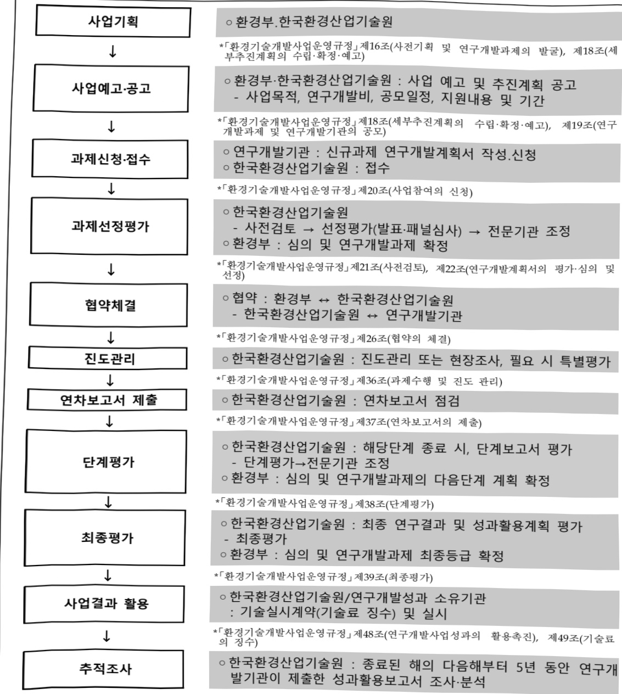

# 미래변화 대응 수자원 안정성 확보 기술개발사업(R&D)

**해당 페이지**: PDF 2753 ~ 2762 쪽 해당

**부처**: 기후에너지환경부
**분야**: 교통 및 물류
**회계유형**: 일반회계
**2026 확정예산**: 22380.0 백만원
**전년대비 증감률**: 33.9%
**AI 도메인**: 환경/기후

---

### 가.예산 총괄표

(단위: 백만원, %)

<table border=1 style='margin: auto; word-wrap: break-word;'><tr><td rowspan="2">사업명</td><td rowspan="2">2024년 결산</td><td colspan="2">2025년 예산</td><td colspan="2">2026년</td><td rowspan="2">중감(B-A)</td><td rowspan="2">(B-A)/A</td></tr><tr><td style='text-align: center; word-wrap: break-word;'>본예산(A)</td><td style='text-align: center; word-wrap: break-word;'>추경</td><td style='text-align: center; word-wrap: break-word;'>정부안</td><td style='text-align: center; word-wrap: break-word;'>확정(B)</td></tr><tr><td style='text-align: center; word-wrap: break-word;'>미래변화 대응 수자원 안정성 확보 기술개발사업(R&amp;D)</td><td style='text-align: center; word-wrap: break-word;'>9,500</td><td style='text-align: center; word-wrap: break-word;'>16,720</td><td style='text-align: center; word-wrap: break-word;'>16,720</td><td style='text-align: center; word-wrap: break-word;'>22,380</td><td style='text-align: center; word-wrap: break-word;'>22,380</td><td style='text-align: center; word-wrap: break-word;'>5,660</td><td style='text-align: center; word-wrap: break-word;'>33.9</td></tr></table>

□ 기능별(내역사업별), 목별 예산 내역

(단위:백만원)

<table border=1 style='margin: auto; word-wrap: break-word;'><tr><td rowspan="3">미래변화 대응 수자원 안정성 확보 기술개발사업 (R&amp;D)</td><td colspan="5">2024</td><td colspan="6">2025(12월 말 기준)</td><td style='text-align: center; word-wrap: break-word;'>2026 예산</td></tr><tr><td rowspan="2">예산액 (추정)</td><td rowspan="2">예산 현액</td><td rowspan="2">집행액 [실집 행액]</td><td rowspan="2">이월액</td><td rowspan="2">불용액</td><td rowspan="2">본예산</td><td rowspan="2">예산 현액</td><td rowspan="2">집행액 [실집 행액]</td><td colspan="2">전년도 이월액 제외</td><td rowspan="2">이월 예상액</td><td rowspan="2">불용 예상액</td></tr><tr><td style='text-align: center; word-wrap: break-word;'>예산 현액</td><td style='text-align: center; word-wrap: break-word;'>집행액 [실집 행액]</td></tr><tr><td style='text-align: center; word-wrap: break-word;'>○ 기능별 분류(함께)</td><td style='text-align: center; word-wrap: break-word;'>9,500</td><td style='text-align: center; word-wrap: break-word;'>9,500</td><td style='text-align: center; word-wrap: break-word;'>9,500 [9,500]</td><td style='text-align: center; word-wrap: break-word;'>-</td><td style='text-align: center; word-wrap: break-word;'>-</td><td style='text-align: center; word-wrap: break-word;'>16,720</td><td style='text-align: center; word-wrap: break-word;'>16,720</td><td style='text-align: center; word-wrap: break-word;'>16,720 [16,720]</td><td style='text-align: center; word-wrap: break-word;'>16,720</td><td style='text-align: center; word-wrap: break-word;'>16,720 [16,720]</td><td style='text-align: center; word-wrap: break-word;'>-</td><td style='text-align: center; word-wrap: break-word;'>- 22,380</td></tr><tr><td rowspan="3">· 수자원 변동성 대응 능력 강화 기술개발 · 수요기반 수자원 균형공급 기술개발 · 스마트기반 수자원시설 최적된다 기술개발</td><td style='text-align: center; word-wrap: break-word;'>3,600</td><td style='text-align: center; word-wrap: break-word;'>3,600</td><td style='text-align: center; word-wrap: break-word;'>3,600 [3,600]</td><td style='text-align: center; word-wrap: break-word;'>-</td><td style='text-align: center; word-wrap: break-word;'>-</td><td style='text-align: center; word-wrap: break-word;'>6,260</td><td style='text-align: center; word-wrap: break-word;'>6,260</td><td style='text-align: center; word-wrap: break-word;'>6,260 [6,260]</td><td style='text-align: center; word-wrap: break-word;'>6,260</td><td style='text-align: center; word-wrap: break-word;'>6,260 [6,260]</td><td style='text-align: center; word-wrap: break-word;'>-</td><td style='text-align: center; word-wrap: break-word;'>- 8,140</td></tr><tr><td style='text-align: center; word-wrap: break-word;'>900</td><td style='text-align: center; word-wrap: break-word;'>900</td><td style='text-align: center; word-wrap: break-word;'>900 [900]</td><td style='text-align: center; word-wrap: break-word;'>-</td><td style='text-align: center; word-wrap: break-word;'>-</td><td style='text-align: center; word-wrap: break-word;'>1,800</td><td style='text-align: center; word-wrap: break-word;'>1,800</td><td style='text-align: center; word-wrap: break-word;'>1,800 [1,800]</td><td style='text-align: center; word-wrap: break-word;'>1,800</td><td style='text-align: center; word-wrap: break-word;'>1,800 [1,800]</td><td style='text-align: center; word-wrap: break-word;'>-</td><td style='text-align: center; word-wrap: break-word;'>- 2,400</td></tr><tr><td style='text-align: center; word-wrap: break-word;'>5,000</td><td style='text-align: center; word-wrap: break-word;'>5,000</td><td style='text-align: center; word-wrap: break-word;'>5,000 [5,000]</td><td style='text-align: center; word-wrap: break-word;'>-</td><td style='text-align: center; word-wrap: break-word;'>-</td><td style='text-align: center; word-wrap: break-word;'>8,660</td><td style='text-align: center; word-wrap: break-word;'>8,660</td><td style='text-align: center; word-wrap: break-word;'>8,660 [8,660]</td><td style='text-align: center; word-wrap: break-word;'>8,660</td><td style='text-align: center; word-wrap: break-word;'>8,660 [8,660]</td><td style='text-align: center; word-wrap: break-word;'>-</td><td style='text-align: center; word-wrap: break-word;'>- 11,840</td></tr><tr><td style='text-align: center; word-wrap: break-word;'>○ 비목별 분류(합계)</td><td style='text-align: center; word-wrap: break-word;'>9,500</td><td style='text-align: center; word-wrap: break-word;'>9,500</td><td style='text-align: center; word-wrap: break-word;'>9,500 [9,500]</td><td style='text-align: center; word-wrap: break-word;'>-</td><td style='text-align: center; word-wrap: break-word;'>-</td><td style='text-align: center; word-wrap: break-word;'>16,720</td><td style='text-align: center; word-wrap: break-word;'>16,720</td><td style='text-align: center; word-wrap: break-word;'>16,720 [16,720]</td><td style='text-align: center; word-wrap: break-word;'>16,720</td><td style='text-align: center; word-wrap: break-word;'>16,720 [16,720]</td><td style='text-align: center; word-wrap: break-word;'>-</td><td style='text-align: center; word-wrap: break-word;'>- 22,380</td></tr><tr><td style='text-align: center; word-wrap: break-word;'>· 연구개 발 활동비 (360-05)</td><td style='text-align: center; word-wrap: break-word;'>9,500</td><td style='text-align: center; word-wrap: break-word;'>9,500</td><td style='text-align: center; word-wrap: break-word;'>9,500 [9,500]</td><td style='text-align: center; word-wrap: break-word;'>-</td><td style='text-align: center; word-wrap: break-word;'>-</td><td style='text-align: center; word-wrap: break-word;'>16,720</td><td style='text-align: center; word-wrap: break-word;'>16,720</td><td style='text-align: center; word-wrap: break-word;'>16,720 [16,720]</td><td style='text-align: center; word-wrap: break-word;'>16,720</td><td style='text-align: center; word-wrap: break-word;'>16,720 [16,720]</td><td style='text-align: center; word-wrap: break-word;'>-</td><td style='text-align: center; word-wrap: break-word;'>- 22,380</td></tr><tr><td style='text-align: center; word-wrap: break-word;'>○ 기능비목별 분류(합계)</td><td style='text-align: center; word-wrap: break-word;'>9,500</td><td style='text-align: center; word-wrap: break-word;'>9,500</td><td style='text-align: center; word-wrap: break-word;'>9,500 [9,500]</td><td style='text-align: center; word-wrap: break-word;'>-</td><td style='text-align: center; word-wrap: break-word;'>-</td><td style='text-align: center; word-wrap: break-word;'>16,720</td><td style='text-align: center; word-wrap: break-word;'>16,720</td><td style='text-align: center; word-wrap: break-word;'>16,720 [16,720]</td><td style='text-align: center; word-wrap: break-word;'>16,720</td><td style='text-align: center; word-wrap: break-word;'>16,720 [16,720]</td><td style='text-align: center; word-wrap: break-word;'>-</td><td style='text-align: center; word-wrap: break-word;'>- 22,380</td></tr><tr><td rowspan="2">· 수자원 변동성 대응 능력 강화 기술개발 · 연구개 발 활동비 (360-05)</td><td style='text-align: center; word-wrap: break-word;'>3,600</td><td style='text-align: center; word-wrap: break-word;'>3,600</td><td style='text-align: center; word-wrap: break-word;'>3,600 [3,600]</td><td style='text-align: center; word-wrap: break-word;'>-</td><td style='text-align: center; word-wrap: break-word;'>-</td><td style='text-align: center; word-wrap: break-word;'>6,260</td><td style='text-align: center; word-wrap: break-word;'>6,260</td><td style='text-align: center; word-wrap: break-word;'>6,260 [6,260]</td><td style='text-align: center; word-wrap: break-word;'>6,260</td><td style='text-align: center; word-wrap: break-word;'>6,260 [6,260]</td><td style='text-align: center; word-wrap: break-word;'>-</td><td style='text-align: center; word-wrap: break-word;'>- 8,140</td></tr><tr><td style='text-align: center; word-wrap: break-word;'>3,600</td><td style='text-align: center; word-wrap: break-word;'>3,600</td><td style='text-align: center; word-wrap: break-word;'>3,600 [3,600]</td><td style='text-align: center; word-wrap: break-word;'>-</td><td style='text-align: center; word-wrap: break-word;'>-</td><td style='text-align: center; word-wrap: break-word;'>6,260</td><td style='text-align: center; word-wrap: break-word;'>6,260</td><td style='text-align: center; word-wrap: break-word;'>6,260 [6,260]</td><td style='text-align: center; word-wrap: break-word;'>6,260</td><td style='text-align: center; word-wrap: break-word;'>6,260 [6,260]</td><td style='text-align: center; word-wrap: break-word;'>-</td><td style='text-align: center; word-wrap: break-word;'>- 8,140</td></tr><tr><td rowspan="2">· 수요기반 수자원 균형공급 기술개발 · 연구개 발 활동비 (360-05)</td><td style='text-align: center; word-wrap: break-word;'>900</td><td style='text-align: center; word-wrap: break-word;'>900</td><td style='text-align: center; word-wrap: break-word;'>900 [900]</td><td style='text-align: center; word-wrap: break-word;'>-</td><td style='text-align: center; word-wrap: break-word;'>-</td><td style='text-align: center; word-wrap: break-word;'>1,800</td><td style='text-align: center; word-wrap: break-word;'>1,800</td><td style='text-align: center; word-wrap: break-word;'>1,800 [1,800]</td><td style='text-align: center; word-wrap: break-word;'>1,800</td><td style='text-align: center; word-wrap: break-word;'>1,800 [1,800]</td><td style='text-align: center; word-wrap: break-word;'>-</td><td style='text-align: center; word-wrap: break-word;'>- 2,400</td></tr><tr><td style='text-align: center; word-wrap: break-word;'>900</td><td style='text-align: center; word-wrap: break-word;'>900</td><td style='text-align: center; word-wrap: break-word;'>900 [900]</td><td style='text-align: center; word-wrap: break-word;'>-</td><td style='text-align: center; word-wrap: break-word;'>-</td><td style='text-align: center; word-wrap: break-word;'>1,800</td><td style='text-align: center; word-wrap: break-word;'>1,800</td><td style='text-align: center; word-wrap: break-word;'>1,800 [1,800]</td><td style='text-align: center; word-wrap: break-word;'>1,800</td><td style='text-align: center; word-wrap: break-word;'>1,800 [1,800]</td><td style='text-align: center; word-wrap: break-word;'>-</td><td style='text-align: center; word-wrap: break-word;'>- 2,400</td></tr><tr><td rowspan="2">· 스마트기반 수자원시설 최적된다 기술개발 · 연구개 발 활동비 (360-05)</td><td style='text-align: center; word-wrap: break-word;'>5,000</td><td style='text-align: center; word-wrap: break-word;'>5,000</td><td style='text-align: center; word-wrap: break-word;'>5,000 [5,000]</td><td style='text-align: center; word-wrap: break-word;'>-</td><td style='text-align: center; word-wrap: break-word;'>-</td><td style='text-align: center; word-wrap: break-word;'>8,660</td><td style='text-align: center; word-wrap: break-word;'>8,660</td><td style='text-align: center; word-wrap: break-word;'>8,660 [8,660]</td><td style='text-align: center; word-wrap: break-word;'>8,660</td><td style='text-align: center; word-wrap: break-word;'>8,660 [8,660]</td><td style='text-align: center; word-wrap: break-word;'>-</td><td style='text-align: center; word-wrap: break-word;'>- 11,840</td></tr><tr><td style='text-align: center; word-wrap: break-word;'>5,000</td><td style='text-align: center; word-wrap: break-word;'>5,000</td><td style='text-align: center; word-wrap: break-word;'>5,000 [5,000]</td><td style='text-align: center; word-wrap: break-word;'>-</td><td style='text-align: center; word-wrap: break-word;'>-</td><td style='text-align: center; word-wrap: break-word;'>8,660</td><td style='text-align: center; word-wrap: break-word;'>8,660</td><td style='text-align: center; word-wrap: break-word;'>8,660 [8,660]</td><td style='text-align: center; word-wrap: break-word;'>8,660</td><td style='text-align: center; word-wrap: break-word;'>8,660 [8,660]</td><td style='text-align: center; word-wrap: break-word;'>-</td><td style='text-align: center; word-wrap: break-word;'>- 11,840</td></tr></table>

---

### 나. 사업설명자료

## 1 ) 사업목적·내용

- (세부사업명) 미래변화 대응 수자원 안정성 확보 기술개발사업

- (사업목적) 수자원 관리와 관련된 미래변화에 효과적으로 대응하기 위한 핵심 기술을 확보함으로써 수자원 안정성 지속 확보로 국가 물관리 정책지원 및 물 복지 실현을 위한 기술개발 추진

- (내역사업1- 수자원 변동성 대응능력 강화 기술개발) 동 내역사업은 수자원에 대한 지능형 실시간 측정·모니터링을 통해 수문학적 상호작용을 고려한 변동성 예측 지원 기술 개발을 지원하는 것임

- (내역사업2- 수요기반 수자원 균형공급 기술개발) 동 내역사업은 수자원시설에 대한 재평가 및 최적 연계를 통한 비구조적인 방법의 수자원 확보 기술 개발 등을 지원하는 것임

- (내역사업3-스마트기반수자원시설최적관리기술개발)동내역사업은노후화맞다양한재해에대비하여첨단기술을활용한스마트기반의시설안전관리기술개발

등을 지원하는 것임

## 2 ) 사업개요

## □ 사업근거 및 추진경위

① 법령상 근거 조항 적시 :

- 「환경정책기본법」 제28조(환경과학기술의 진흥)

- 「환경기술 및 환경산업지원법」 제5조(환경기술개발사업의 추진)

- 「물관리기본법」 제5조(국가의 책무), 제39조(조사연구와 기술개발에 관한 지원 등)

- 「물관리기술 발전 및 물산업 진흥에 관한 법률」 제3조(국가의 책무), 제8조(물관리 기술 개발 촉진)

-「수자원의 조사·계획 및 관리에 관한 법률」제26조(수자원관리기술에 관한 연구 및 실용화)

-「수도법」제73조(기술 연구·개발 등)

---

② 추진경위 - 사업 시작연도, 추진배경, 부처별 중점과제, 대통령 공약사항 등

○ 사업기획 추진(2021.5~2022.5)

- 수자원 관련 정책, 기술동향 분석 (2021.5~8)

- 수자원 관련 분야 주요 이슈 및 해결방안 도출(2021.9)

- 사업추진 방향 및 중점영역설정, 필요기술 도출, 기획위원회 운영(2021.10 ~ 2022.03)

- 사업추진계획 수립(2022.4~5)

- 공청회 개최(2022.5)

☐ 예비타당성조사(2022.6~2023.2)

- 수자원 관련 정책, 기술동향 분석 (2021.5~8)

- 예비타당성조사 신청 및 2022년도 제2차 예비타당성조사 대상 사업 선정(2022.6~7)

- 예비타당성조사 (2022.9~2023.2)

- 예비타당성조사 결과 사업추진 타당성 확보 '시행' (2023.2)

□ 주요내용

① 사업규모

- 총사업비(해당되는 경우에만 기재) : 1,108억원(국고: 831억원)

- 사업기간 : '24~'31년(총 8년)

- 최근 5년 간 투입된 사업비(예산액기준, 추경편성한 연도에는 추경포함)

<table border=1 style='margin: auto; word-wrap: break-word;'><tr><td style='text-align: center; word-wrap: break-word;'>연도</td><td style='text-align: center; word-wrap: break-word;'>2022</td><td style='text-align: center; word-wrap: break-word;'>2023</td><td style='text-align: center; word-wrap: break-word;'>2024</td><td style='text-align: center; word-wrap: break-word;'>2025</td><td style='text-align: center; word-wrap: break-word;'>2026</td></tr><tr><td style='text-align: center; word-wrap: break-word;'>사업비</td><td style='text-align: center; word-wrap: break-word;'>-</td><td style='text-align: center; word-wrap: break-word;'>-</td><td style='text-align: center; word-wrap: break-word;'>9,500</td><td style='text-align: center; word-wrap: break-word;'>16,720</td><td style='text-align: center; word-wrap: break-word;'>22,380</td></tr></table>

- 기타: 해당사항 없음

② 사업추진체계

- 사업시행방법 : 출연

- 사업시행주체 : 환경부(한국환경산업기술원 대행)

- 사업 수혜자 : 국민(환경산업체 등)

- 보조, 융자, 출연, 출자 등의 경우 보조·융자 등 지원 비율 및 법적근거

<table border=1 style='margin: auto; word-wrap: break-word;'><tr><td style='text-align: center; word-wrap: break-word;'>내역사업명</td><td style='text-align: center; word-wrap: break-word;'>구분</td><td style='text-align: center; word-wrap: break-word;'>피보조·피출연 등 기관명</td><td style='text-align: center; word-wrap: break-word;'>지원 금액 (2026계획)</td><td style='text-align: center; word-wrap: break-word;'>지원 비율(%)</td><td style='text-align: center; word-wrap: break-word;'>보조율 법적근거 (해당 조항)</td></tr><tr><td style='text-align: center; word-wrap: break-word;'>수자원 변동성 대응능력 강화 기술개발</td><td style='text-align: center; word-wrap: break-word;'>출연</td><td style='text-align: center; word-wrap: break-word;'>한국환경산업 기술원</td><td style='text-align: center; word-wrap: break-word;'>8,140</td><td style='text-align: center; word-wrap: break-word;'>100</td><td style='text-align: center; word-wrap: break-word;'>「환경기술 및 환경산업 지원법」제5조</td></tr><tr><td style='text-align: center; word-wrap: break-word;'>수요기반 수자원 균형공급 기술개발</td><td style='text-align: center; word-wrap: break-word;'>출연</td><td style='text-align: center; word-wrap: break-word;'>한국환경산업 기술원</td><td style='text-align: center; word-wrap: break-word;'>2,400</td><td style='text-align: center; word-wrap: break-word;'>100</td><td style='text-align: center; word-wrap: break-word;'>「환경기술 및 환경산업 지원법」제5조</td></tr><tr><td style='text-align: center; word-wrap: break-word;'>스마트기반 수자원시설 최적관리 기술개발</td><td style='text-align: center; word-wrap: break-word;'>출연</td><td style='text-align: center; word-wrap: break-word;'>한국환경산업 기술원</td><td style='text-align: center; word-wrap: break-word;'>11,840</td><td style='text-align: center; word-wrap: break-word;'>100</td><td style='text-align: center; word-wrap: break-word;'>「환경기술 및 환경산업 지원법」제5조</td></tr></table>

---

3) 2026년도 예산 산출 근거

□ 미래변화 대응 수자원 안정성 확보 기술개발 : (2025) 16,720백만원 → (2026) 22,380백만원, '25년 대비+5,660백만원

① 수자원 변동성 대응능력 강화 기술개발

:(2025 본예산) 6,260백만원 → (2026 요구) 8,140백만원, 1,880백만원 증액

- (요구) 첨단 원격탐사 기반 수자원 활용 가능량 모니터링 기술 개발을 위한 신규과제 1개, 초음파 및 광학 기반 하천 유사량 연속 자동측정 기술개발 등 계속과제 2개, 유량 측정 정확도 개선 및 불확도 평가 고도화 기술 개발을 위한 종료과제 1개 지원을 위한 8,140백만원 요구

- (산출) 신규 1개×1,600백만원×9개월/12개월=1,200백만원

  계속 2개×2,553.5백만원×12개월/12개월=5,107백만원

  종료 1개×1,833백만원×12개월/12개월=1,833백만원

② 수요기반 수자원 균형공급 기술개발

: (2025 본예산) 1,800백만원 → (2026 요구) 2,400백만원, 600백만원 증액

- (요구) 유역내외 수자원시설의 상호연계 고려 재평가 기술 개발을 위한 신규과제 1개, AI 기반 수자원 빅데이터 품질관리 기술 개발을 위한 계속과제 1개 지원을 위한 2,400백만원 요구

- (산술) 신규 1개×1,200백만원×9개월/12개월=900백만원

  계속 1개×1,500백만원×12개월/12개월=1,500백만원

③ 스마트 기반 수자원시설 최적관리 기술개발

: (2025 본예산) 8,660백만원 → (2026 요구) 11,840백만원, 3,180백만원 증액

- (요구) 디지털 트런 활용 수자원시설 통합 자산관리 기술개발, 물리-가상 센서 네트워크 기반 수자원시설 재해 조기감지 기술개발 등 6개 계속과제 지원을 위한 11,840백만원 요구

- (산출) 계속 6개×1,973.3백만원×12개월/12개월=11,840백만원

2025년도 예산 및 2026년도 예산 산출 세부내역 비교

<table border=1 style='margin: auto; word-wrap: break-word;'><tr><td rowspan="2">예산</td><td colspan="2">2025년 본예산</td><td colspan="2">2026년 계획</td></tr><tr><td colspan="2">산출내역</td><td style='text-align: center; word-wrap: break-word;'>예산</td><td style='text-align: center; word-wrap: break-word;'>산출내역</td></tr><tr><td style='text-align: center; word-wrap: break-word;'>16,720 백만원</td><td style='text-align: center; word-wrap: break-word;'>○ 수자원 변동성 대응능력 강화 기술개발: 6,260백만원• (계속) 3개×2086.6만원×12/12개월 = 6,260백만원○ 수요기반 수자원 균형공급 기술개발: 1,800백만원• (계속) 1개×1,800만원×12/12개월 = 1,800백만원○ 스마트 기반 수자원시설 최적관리 기술개발: 8,660백만원• (계속) 6개×1,443.3만원×12/12개월 = 8,660백만원</td><td style='text-align: center; word-wrap: break-word;'>22,380 백만원</td><td colspan="2">○ 수자원 변동성 대응능력 강화 기술개발: 8,140백만원• (신규) 1개×1,600만원×9/12개월 = 1,200백만원• (계속) 2개×2,553.5만원×12/12개월 = 5,107백만원• (종료) 1개×1,833만원×12/12개월 = 1,833백만원○ 수요기반 수자원 균형공급 기술개발: 2,400백만원• (신규) 1개×1,200만원×9/12개월 = 900백만원• (계속) 1개×1,500만원×12/12개월 = 1,500백만원○ 스마트 기반 수자원시설 최적관리 기술개발: 11,840백만원• (계속) 6개×1,973.3만원×12/12개월 = 11,840백만원</td></tr></table>

---

## 4 ) 사업효과

□ 사업영향, 산출물 성과지표 등

① 2022~2026년도 성과계획서 상 성과지표 및 최근 5년간 성과 달성도

<table border=1 style='margin: auto; word-wrap: break-word;'><tr><td style='text-align: center; word-wrap: break-word;'>성과지표</td><td style='text-align: center; word-wrap: break-word;'>구분</td><td style='text-align: center; word-wrap: break-word;'>2022</td><td style='text-align: center; word-wrap: break-word;'>2023</td><td style='text-align: center; word-wrap: break-word;'>2024</td><td style='text-align: center; word-wrap: break-word;'>2025</td><td style='text-align: center; word-wrap: break-word;'>2026</td><td style='text-align: center; word-wrap: break-word;'>2026 목표치산출근거</td><td style='text-align: center; word-wrap: break-word;'>측정산식(또는 측정방법)</td><td style='text-align: center; word-wrap: break-word;'>자료수집방법(또는 자료출처)</td></tr><tr><td rowspan="3">논문mmlF(단위)</td><td style='text-align: center; word-wrap: break-word;'>목표</td><td style='text-align: center; word-wrap: break-word;'>-</td><td style='text-align: center; word-wrap: break-word;'>-</td><td style='text-align: center; word-wrap: break-word;'>58.00</td><td style='text-align: center; word-wrap: break-word;'>59.45</td><td style='text-align: center; word-wrap: break-word;'>60.94</td><td rowspan="3">전년보다2.5점 향상</td><td rowspan="3">$ \frac{\sum_{i=1}^{n} mrnIF_i}{n} $mmlFi = 논문의 mrnIF(%)n = 당해연도 SC 논문게재 성과</td><td rowspan="3">연구관리시스템등록 및성과검증위원회개최</td></tr><tr><td style='text-align: center; word-wrap: break-word;'>실적</td><td style='text-align: center; word-wrap: break-word;'>-</td><td style='text-align: center; word-wrap: break-word;'>-</td><td style='text-align: center; word-wrap: break-word;'>63.42</td><td style='text-align: center; word-wrap: break-word;'>-</td><td style='text-align: center; word-wrap: break-word;'>-</td></tr><tr><td style='text-align: center; word-wrap: break-word;'>달성도</td><td style='text-align: center; word-wrap: break-word;'>-</td><td style='text-align: center; word-wrap: break-word;'>-</td><td style='text-align: center; word-wrap: break-word;'>10934%</td><td style='text-align: center; word-wrap: break-word;'>-</td><td style='text-align: center; word-wrap: break-word;'>-</td></tr><tr><td rowspan="3">등록특허SMART지수(점)</td><td style='text-align: center; word-wrap: break-word;'>목표</td><td style='text-align: center; word-wrap: break-word;'>-</td><td style='text-align: center; word-wrap: break-word;'>-</td><td style='text-align: center; word-wrap: break-word;'>신규</td><td style='text-align: center; word-wrap: break-word;'>4.5</td><td style='text-align: center; word-wrap: break-word;'>4.58</td><td rowspan="3">전년보다1.81점 향상</td><td rowspan="3">$ \frac{\sum_{i=1}^{n} S_i}{n} $Si = i 특허의 SMART 등급자수n = 당해연도 국내 등록특허건수</td><td rowspan="3">연구관리시스템등록 및성과검증위원회개최</td></tr><tr><td style='text-align: center; word-wrap: break-word;'>실적</td><td style='text-align: center; word-wrap: break-word;'>-</td><td style='text-align: center; word-wrap: break-word;'>-</td><td style='text-align: center; word-wrap: break-word;'>-</td><td style='text-align: center; word-wrap: break-word;'>-</td><td style='text-align: center; word-wrap: break-word;'>-</td></tr><tr><td style='text-align: center; word-wrap: break-word;'>달성도</td><td style='text-align: center; word-wrap: break-word;'>-</td><td style='text-align: center; word-wrap: break-word;'>-</td><td style='text-align: center; word-wrap: break-word;'>-</td><td style='text-align: center; word-wrap: break-word;'>-</td><td style='text-align: center; word-wrap: break-word;'>-</td></tr><tr><td rowspan="3">수자원측정·분석개발달성지수</td><td style='text-align: center; word-wrap: break-word;'>목표</td><td style='text-align: center; word-wrap: break-word;'>-</td><td style='text-align: center; word-wrap: break-word;'>-</td><td style='text-align: center; word-wrap: break-word;'>2.04</td><td style='text-align: center; word-wrap: break-word;'>4.16</td><td style='text-align: center; word-wrap: break-word;'>8.49</td><td rowspan="3">전년보다4.33% 향상</td><td rowspan="3">r =  $ \left(\frac{\text{최종목표}}{\text{초기목표}}\right)^{\frac{1}{100}} - 1 $</td><td rowspan="3">연구관리시스템등록 및성과검증위원회개최</td></tr><tr><td style='text-align: center; word-wrap: break-word;'>실적</td><td style='text-align: center; word-wrap: break-word;'>-</td><td style='text-align: center; word-wrap: break-word;'>-</td><td style='text-align: center; word-wrap: break-word;'>2.04</td><td style='text-align: center; word-wrap: break-word;'>-</td><td style='text-align: center; word-wrap: break-word;'>-</td></tr><tr><td style='text-align: center; word-wrap: break-word;'>달성도</td><td style='text-align: center; word-wrap: break-word;'>-</td><td style='text-align: center; word-wrap: break-word;'>-</td><td style='text-align: center; word-wrap: break-word;'>100%</td><td style='text-align: center; word-wrap: break-word;'>-</td><td style='text-align: center; word-wrap: break-word;'>-</td></tr><tr><td rowspan="3">수자원빅데이터품질향상달성지수</td><td style='text-align: center; word-wrap: break-word;'>목표</td><td style='text-align: center; word-wrap: break-word;'>-</td><td style='text-align: center; word-wrap: break-word;'>-</td><td style='text-align: center; word-wrap: break-word;'>1.79</td><td style='text-align: center; word-wrap: break-word;'>3.22</td><td style='text-align: center; word-wrap: break-word;'>5.78</td><td rowspan="3">전년보다2.56% 향상</td><td rowspan="3">r =  $ \left(\frac{\text{최종목표}}{\text{초기목표}}\right)^{\frac{1}{100}} - 1 $</td><td rowspan="3">연구관리시스템등록 및성과검증위원회개최</td></tr><tr><td style='text-align: center; word-wrap: break-word;'>실적</td><td style='text-align: center; word-wrap: break-word;'>-</td><td style='text-align: center; word-wrap: break-word;'>-</td><td style='text-align: center; word-wrap: break-word;'>1.79</td><td style='text-align: center; word-wrap: break-word;'>-</td><td style='text-align: center; word-wrap: break-word;'>-</td></tr><tr><td style='text-align: center; word-wrap: break-word;'>달성도</td><td style='text-align: center; word-wrap: break-word;'>-</td><td style='text-align: center; word-wrap: break-word;'>-</td><td style='text-align: center; word-wrap: break-word;'>100%</td><td style='text-align: center; word-wrap: break-word;'>-</td><td style='text-align: center; word-wrap: break-word;'>-</td></tr><tr><td rowspan="3">수자원시설안전성능향상달성지수</td><td style='text-align: center; word-wrap: break-word;'>목표</td><td style='text-align: center; word-wrap: break-word;'>-</td><td style='text-align: center; word-wrap: break-word;'>-</td><td style='text-align: center; word-wrap: break-word;'>2.03</td><td style='text-align: center; word-wrap: break-word;'>4.12</td><td style='text-align: center; word-wrap: break-word;'>8.37</td><td rowspan="3">전년보다4.25% 향상</td><td rowspan="3">r =  $ \left(\frac{\text{최종목표}}{\text{초기목표}}\right)^{\frac{1}{100}} - 1 $</td><td rowspan="3">연구관리시스템등록 및성과검증위원회개최</td></tr><tr><td style='text-align: center; word-wrap: break-word;'>실적</td><td style='text-align: center; word-wrap: break-word;'>-</td><td style='text-align: center; word-wrap: break-word;'>-</td><td style='text-align: center; word-wrap: break-word;'>2.03</td><td style='text-align: center; word-wrap: break-word;'>-</td><td style='text-align: center; word-wrap: break-word;'>-</td></tr><tr><td style='text-align: center; word-wrap: break-word;'>달성도</td><td style='text-align: center; word-wrap: break-word;'>-</td><td style='text-align: center; word-wrap: break-word;'>-</td><td style='text-align: center; word-wrap: break-word;'>100%</td><td style='text-align: center; word-wrap: break-word;'>-</td><td style='text-align: center; word-wrap: break-word;'>-</td></tr><tr><td rowspan="3">기술성능향상을위한정보교류활동참여자만족도</td><td style='text-align: center; word-wrap: break-word;'>목표</td><td style='text-align: center; word-wrap: break-word;'>-</td><td style='text-align: center; word-wrap: break-word;'>-</td><td style='text-align: center; word-wrap: break-word;'>65</td><td style='text-align: center; word-wrap: break-word;'>67</td><td style='text-align: center; word-wrap: break-word;'>69</td><td rowspan="3">전년보다2점 향상</td><td rowspan="3">r =  $ \left(\frac{\text{최종점수}}{\text{초기점수}}\right)^{\frac{1}{100}} - 1 $</td><td rowspan="3">연구관리시스템등록 및성과검증위원회개최</td></tr><tr><td style='text-align: center; word-wrap: break-word;'>실적</td><td style='text-align: center; word-wrap: break-word;'>-</td><td style='text-align: center; word-wrap: break-word;'>-</td><td style='text-align: center; word-wrap: break-word;'>65</td><td style='text-align: center; word-wrap: break-word;'>-</td><td style='text-align: center; word-wrap: break-word;'>-</td></tr><tr><td style='text-align: center; word-wrap: break-word;'>달성도</td><td style='text-align: center; word-wrap: break-word;'>-</td><td style='text-align: center; word-wrap: break-word;'>-</td><td style='text-align: center; word-wrap: break-word;'>100%</td><td style='text-align: center; word-wrap: break-word;'>-</td><td style='text-align: center; word-wrap: break-word;'>-</td></tr></table>

---

② 성과지표 이외의 연도별 사업추진 경과 및 실적

<table border=1 style='margin: auto; word-wrap: break-word;'><tr><td style='text-align: center; word-wrap: break-word;'>2022</td><td style='text-align: center; word-wrap: break-word;'>-</td></tr><tr><td style='text-align: center; word-wrap: break-word;'>2023</td><td style='text-align: center; word-wrap: break-word;'>-</td></tr><tr><td style='text-align: center; word-wrap: break-word;'>2024</td><td style='text-align: center; word-wrap: break-word;'>신규과제 선정 10건, 연구성과(SCI 논문 8건, 특허 출원 6건)</td></tr><tr><td style='text-align: center; word-wrap: break-word;'>2025</td><td style='text-align: center; word-wrap: break-word;'>계속과제 추진 10건, 연구성과 확정 전</td></tr></table>

③ 향후(2026년도 이후) 기대효과 :

- (정책적 기대효과) 첨단기술을 활용한 스마트 기반 수자원시설 최적 관리기술을 통해 노후화 및 물재해 대비 수자원시설의 선제적 안전관리 및 효율적 운영 관리 가능

- (과학기술적 기대효과) 첨단 센서, 무인장비, IoT/ICT 기술들을 활용한 지능형 실시간 수자원 측정 및 모니터링 기술개발을 통해 신속하고 정확한 수자원 현황 파악에 활용

- (사회경제적 기대효과) 정확한 물 수요예측에 기반한 물 공급의 고도화, 체계적인 수

자원 정보관리 분석을 통해 물 공급 효율성 제고 및 불균형 해소

## 5 ) 타당성조사 및 예비타당성조사 시행여부 및 결과 요지

- (조사기간) '22년도 제2차 예비타당성조사, '22.6 ~ '23.2

- (조사기관) 과학기술정책연구원(STEPI)

- (조사결과) 시행 (B/C 1.11, AHP 0.678)

- (조사결과 반영현황) 원안 1,905억원(국고)에서 대안으로 831억원(국고) 반영

## 6 ) 총사업비 대상사업 여부 및 내역 : 해당없음

---

## 7 ) 사업 집행절차

---

-수자원 변동성 대응능력 강화 기술개발

<table border=1 style='margin: auto; word-wrap: break-word;'><tr><td style='text-align: center; word-wrap: break-word;'>부처</td><td style='text-align: center; word-wrap: break-word;'></td><td style='text-align: center; word-wrap: break-word;'>피출연·피보조기관</td><td style='text-align: center; word-wrap: break-word;'></td><td style='text-align: center; word-wrap: break-word;'>간접보조사업자·사업수행자</td></tr><tr><td style='text-align: center; word-wrap: break-word;'>환경부(8,140백만원)</td><td style='text-align: center; word-wrap: break-word;'>=&gt;(8,140백만원)</td><td style='text-align: center; word-wrap: break-word;'>한국환경산업기술원(-)</td><td style='text-align: center; word-wrap: break-word;'>=&gt;(8,140백만원)</td><td style='text-align: center; word-wrap: break-word;'>한국수지원조사기술원의 18개 기관</td></tr></table>

## -수요기반 수자원 균형공급 기술개발

<table border=1 style='margin: auto; word-wrap: break-word;'><tr><td style='text-align: center; word-wrap: break-word;'>부처</td><td style='text-align: center; word-wrap: break-word;'></td><td style='text-align: center; word-wrap: break-word;'>피출연·피보조기관</td><td style='text-align: center; word-wrap: break-word;'></td><td style='text-align: center; word-wrap: break-word;'>간접보조사업자·사업수행자</td></tr><tr><td style='text-align: center; word-wrap: break-word;'>환경부(2,400백만원)</td><td style='text-align: center; word-wrap: break-word;'>=&gt;(2,400백만원)</td><td style='text-align: center; word-wrap: break-word;'>한국환경산업기술원(-)</td><td style='text-align: center; word-wrap: break-word;'>=&gt;(2,400백만원)</td><td style='text-align: center; word-wrap: break-word;'>국립부경대학교산학협력단외 4개 기관</td></tr></table>

-스마트기반 수자원시설 최적관리 기술개발

<table border=1 style='margin: auto; word-wrap: break-word;'><tr><td style='text-align: center; word-wrap: break-word;'>부처</td><td style='text-align: center; word-wrap: break-word;'></td><td style='text-align: center; word-wrap: break-word;'>피출연·피보조기관</td><td style='text-align: center; word-wrap: break-word;'></td><td style='text-align: center; word-wrap: break-word;'>간접보조사업자·사업수행자</td></tr><tr><td style='text-align: center; word-wrap: break-word;'>환경부(11,840백만원)</td><td style='text-align: center; word-wrap: break-word;'>=&gt;(11,840백만원)</td><td style='text-align: center; word-wrap: break-word;'>한국환경산업기술원(-)</td><td style='text-align: center; word-wrap: break-word;'>=&gt;(11,840백만원)</td><td style='text-align: center; word-wrap: break-word;'>연세대학교신학협력단의 35개 기관</td></tr></table>

## 8 ) 중기재정계획 상 연도별 투자계획 및 추진경과

(단위:백만원)

<table border=1 style='margin: auto; word-wrap: break-word;'><tr><td style='text-align: center; word-wrap: break-word;'>2024 재정계획</td><td style='text-align: center; word-wrap: break-word;'>2025</td><td style='text-align: center; word-wrap: break-word;'>2026</td><td style='text-align: center; word-wrap: break-word;'>2027</td><td style='text-align: center; word-wrap: break-word;'>2028</td><td style='text-align: center; word-wrap: break-word;'>2029</td></tr><tr><td style='text-align: center; word-wrap: break-word;'>2024~2028</td><td style='text-align: center; word-wrap: break-word;'>9,500</td><td style='text-align: center; word-wrap: break-word;'>16,720</td><td style='text-align: center; word-wrap: break-word;'>22,380</td><td style='text-align: center; word-wrap: break-word;'>15,300</td><td style='text-align: center; word-wrap: break-word;'>9,000</td></tr><tr><td style='text-align: center; word-wrap: break-word;'>2025~2029</td><td style='text-align: center; word-wrap: break-word;'></td><td style='text-align: center; word-wrap: break-word;'>16,720</td><td style='text-align: center; word-wrap: break-word;'>22,380</td><td style='text-align: center; word-wrap: break-word;'>15,300</td><td style='text-align: center; word-wrap: break-word;'>9,000</td></tr></table>

## 9 ) 최근 3년간 동 사업에 대한 주요 외부지적사항 및 평가, 문제점 및 대책

<table border=1 style='margin: auto; word-wrap: break-word;'><tr><td style='text-align: center; word-wrap: break-word;'>1) 국관심 에너지환경전문위 환경소위 지적(과기부) - 기존 사업인 가뭄 및 홍수사업과의 연계활용방안 마련 - 사업·과제 관리, 성과목표 관리 충실화 필요</td></tr></table>

## 10 )향후 추진방향 및 추진계획

<table border=1 style='margin: auto; word-wrap: break-word;'><tr><td style='text-align: center; word-wrap: break-word;'>- 수자원 정책을 담당하는 유관기관과의 유기적인 협력체계 구축을 통해 수요기관의 현장 니즈를 적극 반영하여 기술개발결과의 현장 활용성 제고</td></tr></table>

---

11) 해당사업에 대한 각종 사업평가의 결과 : 해당없음

12) 해당사업에 대한 부처 자체평가의 결과 : 해당없음

## 13 ) 부처 건의사항 : 해당없음

### 다.최근 4년간 결산내역

## 1 ) 결산표

☐ 부처 결산내역

(단위: 백만원, %)

<table border=1 style='margin: auto; word-wrap: break-word;'><tr><td rowspan="2">연도</td><td colspan="3">예산액</td><td rowspan="2">전년도 이월액</td><td rowspan="2">이·전용 등</td><td rowspan="2">예비비</td><td rowspan="2">예산 현액(B)</td><td rowspan="2">집행액 (C)</td><td rowspan="2">집행률 (C/A)</td><td rowspan="2">집행률 (C/B)</td><td rowspan="2">다음연도 이월액</td><td rowspan="2">불용액</td></tr><tr><td colspan="2">본예산 중감액</td><td style='text-align: center; word-wrap: break-word;'>추경(A)</td></tr><tr><td style='text-align: center; word-wrap: break-word;'>2022</td><td style='text-align: center; word-wrap: break-word;'>-</td><td style='text-align: center; word-wrap: break-word;'>-</td><td style='text-align: center; word-wrap: break-word;'>-</td><td style='text-align: center; word-wrap: break-word;'>-</td><td style='text-align: center; word-wrap: break-word;'>-</td><td style='text-align: center; word-wrap: break-word;'>-</td><td style='text-align: center; word-wrap: break-word;'>-</td><td style='text-align: center; word-wrap: break-word;'>-</td><td style='text-align: center; word-wrap: break-word;'>-</td><td style='text-align: center; word-wrap: break-word;'>-</td><td style='text-align: center; word-wrap: break-word;'>-</td><td style='text-align: center; word-wrap: break-word;'>-</td></tr><tr><td style='text-align: center; word-wrap: break-word;'>2023</td><td style='text-align: center; word-wrap: break-word;'>-</td><td style='text-align: center; word-wrap: break-word;'>-</td><td style='text-align: center; word-wrap: break-word;'>-</td><td style='text-align: center; word-wrap: break-word;'>-</td><td style='text-align: center; word-wrap: break-word;'>-</td><td style='text-align: center; word-wrap: break-word;'>-</td><td style='text-align: center; word-wrap: break-word;'>-</td><td style='text-align: center; word-wrap: break-word;'>-</td><td style='text-align: center; word-wrap: break-word;'>-</td><td style='text-align: center; word-wrap: break-word;'>-</td><td style='text-align: center; word-wrap: break-word;'>-</td><td style='text-align: center; word-wrap: break-word;'>-</td></tr><tr><td style='text-align: center; word-wrap: break-word;'>2024</td><td style='text-align: center; word-wrap: break-word;'>9,500</td><td style='text-align: center; word-wrap: break-word;'>-</td><td style='text-align: center; word-wrap: break-word;'>9,500</td><td style='text-align: center; word-wrap: break-word;'>-</td><td style='text-align: center; word-wrap: break-word;'>-</td><td style='text-align: center; word-wrap: break-word;'>-</td><td style='text-align: center; word-wrap: break-word;'>9,500</td><td style='text-align: center; word-wrap: break-word;'>9,500</td><td style='text-align: center; word-wrap: break-word;'>100.0</td><td style='text-align: center; word-wrap: break-word;'>100.0</td><td style='text-align: center; word-wrap: break-word;'>-</td><td style='text-align: center; word-wrap: break-word;'>-</td></tr><tr><td style='text-align: center; word-wrap: break-word;'>2025</td><td style='text-align: center; word-wrap: break-word;'>16,720</td><td style='text-align: center; word-wrap: break-word;'>-</td><td style='text-align: center; word-wrap: break-word;'>16,720</td><td style='text-align: center; word-wrap: break-word;'>-</td><td style='text-align: center; word-wrap: break-word;'>-</td><td style='text-align: center; word-wrap: break-word;'>-</td><td style='text-align: center; word-wrap: break-word;'>16,720</td><td style='text-align: center; word-wrap: break-word;'>16,720</td><td style='text-align: center; word-wrap: break-word;'>100.0</td><td style='text-align: center; word-wrap: break-word;'>100.0</td><td style='text-align: center; word-wrap: break-word;'>-</td><td style='text-align: center; word-wrap: break-word;'>-</td></tr></table>

□출연·보조사업 등 실집행내역

(단위: 백만원, %)

<table border=1 style='margin: auto; word-wrap: break-word;'><tr><td rowspan="2">구분</td><td colspan="3">부처</td><td colspan="6">사업시행주체(피출연·피보조 기관 등)</td></tr><tr><td colspan="2">예산액</td><td style='text-align: center; word-wrap: break-word;'>집행액</td><td style='text-align: center; word-wrap: break-word;'>교부액</td><td style='text-align: center; word-wrap: break-word;'>전년도이월액</td><td style='text-align: center; word-wrap: break-word;'>교부현액</td><td style='text-align: center; word-wrap: break-word;'>집행액(B)</td><td style='text-align: center; word-wrap: break-word;'>이월액</td><td style='text-align: center; word-wrap: break-word;'>불용액(B/A)</td></tr><tr><td style='text-align: center; word-wrap: break-word;'>2022</td><td style='text-align: center; word-wrap: break-word;'>-</td><td style='text-align: center; word-wrap: break-word;'>-</td><td style='text-align: center; word-wrap: break-word;'>-</td><td style='text-align: center; word-wrap: break-word;'>-</td><td style='text-align: center; word-wrap: break-word;'>-</td><td style='text-align: center; word-wrap: break-word;'>-</td><td style='text-align: center; word-wrap: break-word;'>-</td><td style='text-align: center; word-wrap: break-word;'>-</td><td style='text-align: center; word-wrap: break-word;'>-</td></tr><tr><td style='text-align: center; word-wrap: break-word;'>2023</td><td style='text-align: center; word-wrap: break-word;'>-</td><td style='text-align: center; word-wrap: break-word;'>-</td><td style='text-align: center; word-wrap: break-word;'>-</td><td style='text-align: center; word-wrap: break-word;'>-</td><td style='text-align: center; word-wrap: break-word;'>-</td><td style='text-align: center; word-wrap: break-word;'>-</td><td style='text-align: center; word-wrap: break-word;'>-</td><td style='text-align: center; word-wrap: break-word;'>-</td><td style='text-align: center; word-wrap: break-word;'>-</td></tr><tr><td style='text-align: center; word-wrap: break-word;'>2024</td><td style='text-align: center; word-wrap: break-word;'>9,500</td><td style='text-align: center; word-wrap: break-word;'>9,500</td><td style='text-align: center; word-wrap: break-word;'>9,500</td><td style='text-align: center; word-wrap: break-word;'>9,500</td><td style='text-align: center; word-wrap: break-word;'>-</td><td style='text-align: center; word-wrap: break-word;'>9,500</td><td style='text-align: center; word-wrap: break-word;'>9,500</td><td style='text-align: center; word-wrap: break-word;'>-</td><td style='text-align: center; word-wrap: break-word;'>100.0</td></tr><tr><td style='text-align: center; word-wrap: break-word;'>2025</td><td style='text-align: center; word-wrap: break-word;'>16,720</td><td style='text-align: center; word-wrap: break-word;'>16,720</td><td style='text-align: center; word-wrap: break-word;'>16,720</td><td style='text-align: center; word-wrap: break-word;'>16,720</td><td style='text-align: center; word-wrap: break-word;'>-</td><td style='text-align: center; word-wrap: break-word;'>16,720</td><td style='text-align: center; word-wrap: break-word;'>16,720</td><td style='text-align: center; word-wrap: break-word;'>-</td><td style='text-align: center; word-wrap: break-word;'>100.0</td></tr></table>

## 2 ) 주요 결산사항

□ 2022~2025년 결산 주요 지적사항 및 시정요구사항 : 해당없음

□ 2025년 이·전용 등 세부내역 : 해당없음

□ 2025년 예비비 배정 세부내역 : 해당없음

---

<table border=1 style='margin: auto; word-wrap: break-word;'><tr><td style='text-align: center; word-wrap: break-word;'>사 업 명</td></tr><tr><td style='text-align: center; word-wrap: break-word;'>(104) 블록체인 기반 살생물제 정보 지능형 공정관리 기술개발사업(R&amp;D)(2310-316)</td></tr></table>

□ 사업 코드 정보

<table border=1 style='margin: auto; word-wrap: break-word;'><tr><td style='text-align: center; word-wrap: break-word;'>구분</td><td style='text-align: center; word-wrap: break-word;'>회계</td><td style='text-align: center; word-wrap: break-word;'>소관</td><td style='text-align: center; word-wrap: break-word;'>실국(기관)</td><td style='text-align: center; word-wrap: break-word;'>계정</td><td style='text-align: center; word-wrap: break-word;'>분야</td><td style='text-align: center; word-wrap: break-word;'>부문</td></tr><tr><td style='text-align: center; word-wrap: break-word;'>코드</td><td style='text-align: center; word-wrap: break-word;'>환경개선</td><td style='text-align: center; word-wrap: break-word;'>기후에너지</td><td rowspan="2">환경보건국</td><td rowspan="2"></td><td style='text-align: center; word-wrap: break-word;'>070</td><td style='text-align: center; word-wrap: break-word;'>079</td></tr><tr><td style='text-align: center; word-wrap: break-word;'>명칭</td><td style='text-align: center; word-wrap: break-word;'>특별회계</td><td style='text-align: center; word-wrap: break-word;'>환경부</td><td style='text-align: center; word-wrap: break-word;'>환경</td><td style='text-align: center; word-wrap: break-word;'>기후대기 및 환경안전</td></tr></table>

<table border=1 style='margin: auto; word-wrap: break-word;'><tr><td style='text-align: center; word-wrap: break-word;'>구분</td><td style='text-align: center; word-wrap: break-word;'>프로그램</td><td style='text-align: center; word-wrap: break-word;'>단위사업</td><td style='text-align: center; word-wrap: break-word;'>세부사업</td></tr><tr><td style='text-align: center; word-wrap: break-word;'>코드</td><td style='text-align: center; word-wrap: break-word;'>2300</td><td style='text-align: center; word-wrap: break-word;'>2310</td><td style='text-align: center; word-wrap: break-word;'>316</td></tr><tr><td style='text-align: center; word-wrap: break-word;'>명칭</td><td style='text-align: center; word-wrap: break-word;'>화학물질 안전관리</td><td style='text-align: center; word-wrap: break-word;'>화학물질 관리기반 구축</td><td style='text-align: center; word-wrap: break-word;'>블록체인 기반 살생물제정보 지능형 공정관리기술개발 사업(R&amp;D)</td></tr></table>

□ 사업 성격 (공통요구자료 Ⅱ-1 작성유의사항 4. 참조, 해당하는 사항에 “O” 표시)

<table border=1 style='margin: auto; word-wrap: break-word;'><tr><td rowspan="2">신규</td><td rowspan="2">계속</td><td rowspan="2">완료</td><td rowspan="2">예비타당성 실시여부</td><td rowspan="2">총사업비 관리대상</td><td rowspan="2">총액계상 예산사업</td><td style='text-align: center; word-wrap: break-word;'>사업소관 변경정보</td></tr><tr><td style='text-align: center; word-wrap: break-word;'>2025예산 시 소관</td></tr><tr><td style='text-align: center; word-wrap: break-word;'>○</td><td style='text-align: center; word-wrap: break-word;'></td><td style='text-align: center; word-wrap: break-word;'></td><td style='text-align: center; word-wrap: break-word;'></td><td style='text-align: center; word-wrap: break-word;'></td><td style='text-align: center; word-wrap: break-word;'></td><td style='text-align: center; word-wrap: break-word;'></td></tr></table>

□ 사업 지원 형태 및 지원을 (최소한 한 개는 반드시 선택하시오. 해당사항에 0 표시)

<table border=1 style='margin: auto; word-wrap: break-word;'><tr><td style='text-align: center; word-wrap: break-word;'>직접</td><td style='text-align: center; word-wrap: break-word;'>출자</td><td style='text-align: center; word-wrap: break-word;'>출연</td><td style='text-align: center; word-wrap: break-word;'>보조</td><td style='text-align: center; word-wrap: break-word;'>융자</td><td style='text-align: center; word-wrap: break-word;'>국고보조율(%)</td><td style='text-align: center; word-wrap: break-word;'>융자율(%)</td></tr><tr><td style='text-align: center; word-wrap: break-word;'></td><td style='text-align: center; word-wrap: break-word;'></td><td style='text-align: center; word-wrap: break-word;'>○</td><td style='text-align: center; word-wrap: break-word;'></td><td style='text-align: center; word-wrap: break-word;'></td><td style='text-align: center; word-wrap: break-word;'></td><td style='text-align: center; word-wrap: break-word;'></td></tr></table>

☐ 사업 담당자

<table border=1 style='margin: auto; word-wrap: break-word;'><tr><td style='text-align: center; word-wrap: break-word;'>사업명</td><td colspan="2">구분</td></tr><tr><td rowspan="3">블록체인 기반 살생물제정보 지능형 공정 관리기술 개발 사업 (R&amp;D)</td><td rowspan="2">소관부처</td><td style='text-align: center; word-wrap: break-word;'>환경보건국</td></tr><tr><td style='text-align: center; word-wrap: break-word;'>화학제품관리과</td></tr><tr><td style='text-align: center; word-wrap: break-word;'>사업시행주체</td><td style='text-align: center; word-wrap: break-word;'>한국환경산업기술원</td></tr></table>

---

### 원본 PDF 크롭 이미지

