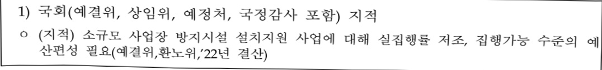
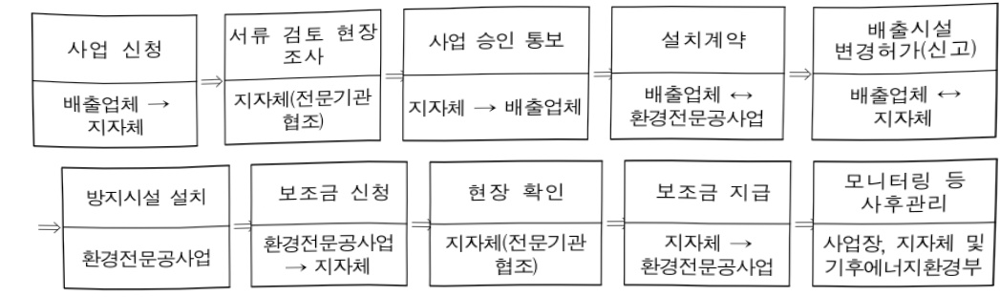
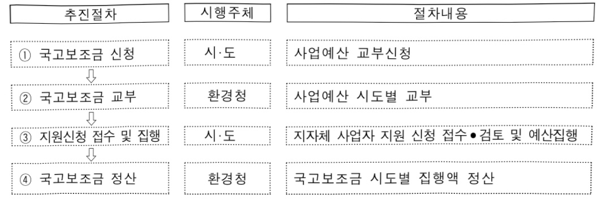

# 사업장 미세먼지 관리사업

**해당 페이지**: PDF 2771 ~ 2788 쪽 해당

**부처**: 기후에너지환경부
**분야**: 환경
**회계유형**: 환경개선 특별회계
**2026 확정예산**: 64078.0 백만원
**전년대비 증감률**: 30.9%
**AI 도메인**: 환경/기후, 피지컬AI/디바이스

---

<table border=1 style='margin: auto; word-wrap: break-word;'><tr><td style='text-align: center; word-wrap: break-word;'>사 업 명</td></tr><tr><td style='text-align: center; word-wrap: break-word;'>(74) 사업장 미세먼지 관리사업(1633-301)</td></tr></table>

□ 사업 코드 정보

<table border=1 style='margin: auto; word-wrap: break-word;'><tr><td style='text-align: center; word-wrap: break-word;'>구분</td><td style='text-align: center; word-wrap: break-word;'>회계</td><td style='text-align: center; word-wrap: break-word;'>소관</td><td style='text-align: center; word-wrap: break-word;'>실국(기관)</td><td style='text-align: center; word-wrap: break-word;'>계정</td><td style='text-align: center; word-wrap: break-word;'>분야</td><td style='text-align: center; word-wrap: break-word;'>부문</td></tr><tr><td style='text-align: center; word-wrap: break-word;'>코드</td><td style='text-align: center; word-wrap: break-word;'>환경개선</td><td style='text-align: center; word-wrap: break-word;'>기후에너지</td><td rowspan="2">대기환경국</td><td rowspan="2"></td><td style='text-align: center; word-wrap: break-word;'>070</td><td style='text-align: center; word-wrap: break-word;'>079</td></tr><tr><td style='text-align: center; word-wrap: break-word;'>명칭</td><td style='text-align: center; word-wrap: break-word;'>특별회계</td><td style='text-align: center; word-wrap: break-word;'>환경부</td><td style='text-align: center; word-wrap: break-word;'>환경</td><td style='text-align: center; word-wrap: break-word;'>기후대기 및 환경안전</td></tr></table>

<table border=1 style='margin: auto; word-wrap: break-word;'><tr><td style='text-align: center; word-wrap: break-word;'>구분</td><td style='text-align: center; word-wrap: break-word;'>프로그램</td><td style='text-align: center; word-wrap: break-word;'>단위사업</td><td style='text-align: center; word-wrap: break-word;'>세부사업</td></tr><tr><td style='text-align: center; word-wrap: break-word;'>코드</td><td style='text-align: center; word-wrap: break-word;'>1600</td><td style='text-align: center; word-wrap: break-word;'>1633</td><td style='text-align: center; word-wrap: break-word;'>301</td></tr><tr><td style='text-align: center; word-wrap: break-word;'>명칭</td><td style='text-align: center; word-wrap: break-word;'>대기환경보전</td><td style='text-align: center; word-wrap: break-word;'>대기오염 발생원 관리</td><td style='text-align: center; word-wrap: break-word;'>사업장 미세먼지 관리사업</td></tr></table>

□ 사업 성격 (공통요구자료 Ⅱ-1 작성유의사항 4. 참조, 해당하는 사항에 “○” 표시)

<table border=1 style='margin: auto; word-wrap: break-word;'><tr><td rowspan="2">신규</td><td rowspan="2">계속</td><td rowspan="2">완료</td><td rowspan="2">예비타당성 실시여부</td><td rowspan="2">총사업비 관리대상</td><td rowspan="2">총액계상 예산사업</td><td style='text-align: center; word-wrap: break-word;'>사업소관 변경정보</td></tr><tr><td style='text-align: center; word-wrap: break-word;'>2025예산 시 소관</td></tr><tr><td style='text-align: center; word-wrap: break-word;'></td><td style='text-align: center; word-wrap: break-word;'>○</td><td style='text-align: center; word-wrap: break-word;'></td><td style='text-align: center; word-wrap: break-word;'></td><td style='text-align: center; word-wrap: break-word;'></td><td style='text-align: center; word-wrap: break-word;'></td><td style='text-align: center; word-wrap: break-word;'></td></tr></table>

□ 사업 지원 형태 및 지원을 (최소한 한 개는 반드시 선택하시오. 해당사항에 0 표시)

<table border=1 style='margin: auto; word-wrap: break-word;'><tr><td style='text-align: center; word-wrap: break-word;'>직접</td><td style='text-align: center; word-wrap: break-word;'>출자</td><td style='text-align: center; word-wrap: break-word;'>출연</td><td style='text-align: center; word-wrap: break-word;'>보조</td><td style='text-align: center; word-wrap: break-word;'>융자</td><td style='text-align: center; word-wrap: break-word;'>국고보조율(%)</td><td style='text-align: center; word-wrap: break-word;'>융자율(%)</td></tr><tr><td style='text-align: center; word-wrap: break-word;'>○</td><td style='text-align: center; word-wrap: break-word;'></td><td style='text-align: center; word-wrap: break-word;'></td><td style='text-align: center; word-wrap: break-word;'>○</td><td style='text-align: center; word-wrap: break-word;'></td><td style='text-align: center; word-wrap: break-word;'>20~50</td><td style='text-align: center; word-wrap: break-word;'></td></tr></table>

## □ 사업 담당자

<table border=1 style='margin: auto; word-wrap: break-word;'><tr><td style='text-align: center; word-wrap: break-word;'>사업명</td><td colspan="2">구분</td></tr><tr><td rowspan="3">소규모 사업장 방지시설 설치 지원 사업</td><td rowspan="2">소관부처</td><td style='text-align: center; word-wrap: break-word;'>대기환경국</td></tr><tr><td style='text-align: center; word-wrap: break-word;'>대기관리과</td></tr><tr><td style='text-align: center; word-wrap: break-word;'>사업시행주체</td><td style='text-align: center; word-wrap: break-word;'>지자체</td></tr><tr><td rowspan="3">귤뚝자동측정 가기 설치 운영 관리지원사업</td><td rowspan="2">소관부처</td><td style='text-align: center; word-wrap: break-word;'>대기환경국</td></tr><tr><td style='text-align: center; word-wrap: break-word;'>대기관리과</td></tr><tr><td style='text-align: center; word-wrap: break-word;'>사업시행주체</td><td style='text-align: center; word-wrap: break-word;'>지자체</td></tr><tr><td rowspan="3">사업장 총량 관리제 운영</td><td rowspan="2">소관부처</td><td style='text-align: center; word-wrap: break-word;'>대기환경국</td></tr><tr><td style='text-align: center; word-wrap: break-word;'>대기관리과</td></tr><tr><td style='text-align: center; word-wrap: break-word;'>사업시행주체</td><td style='text-align: center; word-wrap: break-word;'>한국환경공단</td></tr></table>

---

### 가. 예산 총괄표

(단위:백만원,%)

<table border=1 style='margin: auto; word-wrap: break-word;'><tr><td rowspan="2">사업명</td><td rowspan="2">2024년 결산</td><td colspan="2">2025년 예산</td><td colspan="2">2026년</td><td rowspan="2">증감 (B-A)</td><td rowspan="2">(B-A)/A</td></tr><tr><td style='text-align: center; word-wrap: break-word;'>본예산(A)</td><td style='text-align: center; word-wrap: break-word;'>추경</td><td style='text-align: center; word-wrap: break-word;'>정부안</td><td style='text-align: center; word-wrap: break-word;'>확정(B)</td></tr><tr><td style='text-align: center; word-wrap: break-word;'>사업장 미세먼지 관리사업</td><td style='text-align: center; word-wrap: break-word;'>65,817</td><td style='text-align: center; word-wrap: break-word;'>48,953</td><td style='text-align: center; word-wrap: break-word;'>53,604</td><td style='text-align: center; word-wrap: break-word;'>64,078</td><td style='text-align: center; word-wrap: break-word;'>64,078</td><td style='text-align: center; word-wrap: break-word;'>15,125</td><td style='text-align: center; word-wrap: break-word;'>30.9</td></tr></table>

□ 기능별(내역사업별), 목별 예산 내역

(단위:백만원)

<table border=1 style='margin: auto; word-wrap: break-word;'><tr><td rowspan="3"></td><td colspan="5">2024</td><td colspan="7">2025</td><td rowspan="3">2026예산</td></tr><tr><td rowspan="2">예산액(추경)</td><td rowspan="2">예산현액</td><td rowspan="2">집행액[실집행액]</td><td rowspan="2">이월액</td><td rowspan="2">불용액</td><td rowspan="2">본예산</td><td rowspan="2">예산현액</td><td rowspan="2">집행액[실집행액]</td><td colspan="2">전년도 이월액제외</td><td rowspan="2">이월예산액</td><td rowspan="2">불용예산액</td></tr><tr><td style='text-align: center; word-wrap: break-word;'>예산현액</td><td style='text-align: center; word-wrap: break-word;'>집행액[실집행액]</td></tr><tr><td style='text-align: center; word-wrap: break-word;'>○ 기능별 분류(합계)</td><td style='text-align: center; word-wrap: break-word;'>66,591</td><td style='text-align: center; word-wrap: break-word;'>67,255</td><td style='text-align: center; word-wrap: break-word;'>65,817[86,302]</td><td style='text-align: center; word-wrap: break-word;'>514</td><td style='text-align: center; word-wrap: break-word;'>925</td><td style='text-align: center; word-wrap: break-word;'>48,953</td><td style='text-align: center; word-wrap: break-word;'>54,118</td><td style='text-align: center; word-wrap: break-word;'>51,710[52,501]</td><td style='text-align: center; word-wrap: break-word;'>53,604</td><td style='text-align: center; word-wrap: break-word;'>51,219[33,908]</td><td style='text-align: center; word-wrap: break-word;'>411</td><td style='text-align: center; word-wrap: break-word;'>1,997</td><td style='text-align: center; word-wrap: break-word;'>64,078</td></tr><tr><td style='text-align: center; word-wrap: break-word;'>· 사업장 총량관리제운영</td><td style='text-align: center; word-wrap: break-word;'>3,500</td><td style='text-align: center; word-wrap: break-word;'>3,500</td><td style='text-align: center; word-wrap: break-word;'>3,500</td><td style='text-align: center; word-wrap: break-word;'>-</td><td style='text-align: center; word-wrap: break-word;'>-</td><td style='text-align: center; word-wrap: break-word;'>3,500</td><td style='text-align: center; word-wrap: break-word;'>3,500</td><td style='text-align: center; word-wrap: break-word;'>3,500</td><td style='text-align: center; word-wrap: break-word;'>3,500</td><td style='text-align: center; word-wrap: break-word;'>3,500</td><td style='text-align: center; word-wrap: break-word;'>-</td><td style='text-align: center; word-wrap: break-word;'>-</td><td style='text-align: center; word-wrap: break-word;'>3,500</td></tr><tr><td style='text-align: center; word-wrap: break-word;'>· 굴뚝원격감시체계운영· 관리</td><td style='text-align: center; word-wrap: break-word;'>1,931</td><td style='text-align: center; word-wrap: break-word;'>1,931</td><td style='text-align: center; word-wrap: break-word;'>1,931</td><td style='text-align: center; word-wrap: break-word;'>-</td><td style='text-align: center; word-wrap: break-word;'>-</td><td style='text-align: center; word-wrap: break-word;'>1,931</td><td style='text-align: center; word-wrap: break-word;'>1,931</td><td style='text-align: center; word-wrap: break-word;'>1,931</td><td style='text-align: center; word-wrap: break-word;'>1,931</td><td style='text-align: center; word-wrap: break-word;'>1,931</td><td style='text-align: center; word-wrap: break-word;'>-</td><td style='text-align: center; word-wrap: break-word;'>-</td><td style='text-align: center; word-wrap: break-word;'>1,931</td></tr><tr><td style='text-align: center; word-wrap: break-word;'>· 굴뚝자동측정기기설치·운영 관리비지원</td><td style='text-align: center; word-wrap: break-word;'>2,100</td><td style='text-align: center; word-wrap: break-word;'>2,100</td><td style='text-align: center; word-wrap: break-word;'>1,820[1,686]</td><td style='text-align: center; word-wrap: break-word;'>-</td><td style='text-align: center; word-wrap: break-word;'>280</td><td style='text-align: center; word-wrap: break-word;'>2,100</td><td style='text-align: center; word-wrap: break-word;'>2,100</td><td style='text-align: center; word-wrap: break-word;'>2,030[1,683]</td><td style='text-align: center; word-wrap: break-word;'>2,100</td><td style='text-align: center; word-wrap: break-word;'>2,030[1,660]</td><td style='text-align: center; word-wrap: break-word;'>-</td><td style='text-align: center; word-wrap: break-word;'>70</td><td style='text-align: center; word-wrap: break-word;'>1,900</td></tr><tr><td style='text-align: center; word-wrap: break-word;'>· 소규모 사업장 방지시설 설치지원</td><td style='text-align: center; word-wrap: break-word;'>49,200</td><td style='text-align: center; word-wrap: break-word;'>49,200</td><td style='text-align: center; word-wrap: break-word;'>49,200[69,819]</td><td style='text-align: center; word-wrap: break-word;'>-</td><td style='text-align: center; word-wrap: break-word;'>-</td><td style='text-align: center; word-wrap: break-word;'>31,536</td><td style='text-align: center; word-wrap: break-word;'>36,187</td><td style='text-align: center; word-wrap: break-word;'>34,965[36,103]</td><td style='text-align: center; word-wrap: break-word;'>36,187</td><td style='text-align: center; word-wrap: break-word;'>34,965[18,024]</td><td style='text-align: center; word-wrap: break-word;'>-</td><td style='text-align: center; word-wrap: break-word;'>1,222</td><td style='text-align: center; word-wrap: break-word;'>44,849</td></tr><tr><td style='text-align: center; word-wrap: break-word;'>· 저녁스버너 성능검사 및 사후관리</td><td style='text-align: center; word-wrap: break-word;'>187</td><td style='text-align: center; word-wrap: break-word;'>187</td><td style='text-align: center; word-wrap: break-word;'>187</td><td style='text-align: center; word-wrap: break-word;'>-</td><td style='text-align: center; word-wrap: break-word;'>-</td><td style='text-align: center; word-wrap: break-word;'>187</td><td style='text-align: center; word-wrap: break-word;'>187</td><td style='text-align: center; word-wrap: break-word;'>187</td><td style='text-align: center; word-wrap: break-word;'>187</td><td style='text-align: center; word-wrap: break-word;'>187</td><td style='text-align: center; word-wrap: break-word;'>-</td><td style='text-align: center; word-wrap: break-word;'>-</td><td style='text-align: center; word-wrap: break-word;'>-</td></tr><tr><td style='text-align: center; word-wrap: break-word;'>· IoT 활용 소규모사업장 관리기반마련</td><td style='text-align: center; word-wrap: break-word;'>1,920</td><td style='text-align: center; word-wrap: break-word;'>1,920</td><td style='text-align: center; word-wrap: break-word;'>1,920</td><td style='text-align: center; word-wrap: break-word;'>-</td><td style='text-align: center; word-wrap: break-word;'>-</td><td style='text-align: center; word-wrap: break-word;'>1,920</td><td style='text-align: center; word-wrap: break-word;'>1,920</td><td style='text-align: center; word-wrap: break-word;'>1,920</td><td style='text-align: center; word-wrap: break-word;'>1,920</td><td style='text-align: center; word-wrap: break-word;'>1,920</td><td style='text-align: center; word-wrap: break-word;'>-</td><td style='text-align: center; word-wrap: break-word;'>-</td><td style='text-align: center; word-wrap: break-word;'>1,920</td></tr><tr><td style='text-align: center; word-wrap: break-word;'>· 첨단감시장비 운영사업</td><td style='text-align: center; word-wrap: break-word;'>5,437</td><td style='text-align: center; word-wrap: break-word;'>5,630</td><td style='text-align: center; word-wrap: break-word;'>4,941</td><td style='text-align: center; word-wrap: break-word;'>256</td><td style='text-align: center; word-wrap: break-word;'>434</td><td style='text-align: center; word-wrap: break-word;'>5,461</td><td style='text-align: center; word-wrap: break-word;'>5,710</td><td style='text-align: center; word-wrap: break-word;'>4,837</td><td style='text-align: center; word-wrap: break-word;'>5,455</td><td style='text-align: center; word-wrap: break-word;'>4,587</td><td style='text-align: center; word-wrap: break-word;'>253</td><td style='text-align: center; word-wrap: break-word;'>620</td><td style='text-align: center; word-wrap: break-word;'>6,550</td></tr><tr><td style='text-align: center; word-wrap: break-word;'>· 미세먼지 불법배출예방·감시 사업</td><td style='text-align: center; word-wrap: break-word;'>340</td><td style='text-align: center; word-wrap: break-word;'>340</td><td style='text-align: center; word-wrap: break-word;'>340</td><td style='text-align: center; word-wrap: break-word;'>-</td><td style='text-align: center; word-wrap: break-word;'>-</td><td style='text-align: center; word-wrap: break-word;'>340</td><td style='text-align: center; word-wrap: break-word;'>340</td><td style='text-align: center; word-wrap: break-word;'>340</td><td style='text-align: center; word-wrap: break-word;'>340</td><td style='text-align: center; word-wrap: break-word;'>340</td><td style='text-align: center; word-wrap: break-word;'>-</td><td style='text-align: center; word-wrap: break-word;'>-</td><td style='text-align: center; word-wrap: break-word;'>340</td></tr><tr><td style='text-align: center; word-wrap: break-word;'>· 미세먼지 등 인벤토리 구축</td><td style='text-align: center; word-wrap: break-word;'>500</td><td style='text-align: center; word-wrap: break-word;'>588</td><td style='text-align: center; word-wrap: break-word;'>535</td><td style='text-align: center; word-wrap: break-word;'>-</td><td style='text-align: center; word-wrap: break-word;'>53</td><td style='text-align: center; word-wrap: break-word;'>500</td><td style='text-align: center; word-wrap: break-word;'>500</td><td style='text-align: center; word-wrap: break-word;'>500</td><td style='text-align: center; word-wrap: break-word;'>500</td><td style='text-align: center; word-wrap: break-word;'>500</td><td style='text-align: center; word-wrap: break-word;'>-</td><td style='text-align: center; word-wrap: break-word;'>-</td><td style='text-align: center; word-wrap: break-word;'>600</td></tr><tr><td style='text-align: center; word-wrap: break-word;'>· 대기관리권역통합관리시스템 유지관리</td><td style='text-align: center; word-wrap: break-word;'>200</td><td style='text-align: center; word-wrap: break-word;'>257</td><td style='text-align: center; word-wrap: break-word;'>254</td><td style='text-align: center; word-wrap: break-word;'>-</td><td style='text-align: center; word-wrap: break-word;'>3</td><td style='text-align: center; word-wrap: break-word;'>200</td><td style='text-align: center; word-wrap: break-word;'>200</td><td style='text-align: center; word-wrap: break-word;'>200</td><td style='text-align: center; word-wrap: break-word;'>200</td><td style='text-align: center; word-wrap: break-word;'>200</td><td style='text-align: center; word-wrap: break-word;'>-</td><td style='text-align: center; word-wrap: break-word;'>-</td><td style='text-align: center; word-wrap: break-word;'>1,200</td></tr><tr><td style='text-align: center; word-wrap: break-word;'>· 연구용역</td><td style='text-align: center; word-wrap: break-word;'>1,195</td><td style='text-align: center; word-wrap: break-word;'>1,519</td><td style='text-align: center; word-wrap: break-word;'>1,106</td><td style='text-align: center; word-wrap: break-word;'>258</td><td style='text-align: center; word-wrap: break-word;'>155</td><td style='text-align: center; word-wrap: break-word;'>1,195</td><td style='text-align: center; word-wrap: break-word;'>1,454</td><td style='text-align: center; word-wrap: break-word;'>1,211</td><td style='text-align: center; word-wrap: break-word;'>1,195</td><td style='text-align: center; word-wrap: break-word;'>970</td><td style='text-align: center; word-wrap: break-word;'>158</td><td style='text-align: center; word-wrap: break-word;'>85</td><td style='text-align: center; word-wrap: break-word;'>1,195</td></tr></table>

---

<table border=1 style='margin: auto; word-wrap: break-word;'><tr><td rowspan="3"></td><td colspan="5">2024</td><td colspan="7">2025</td><td rowspan="3">2026에산</td></tr><tr><td rowspan="2">예산액(추경)</td><td rowspan="2">예산현액</td><td rowspan="2">집행액[실집행액]</td><td rowspan="2">이월액</td><td rowspan="2">불용액</td><td rowspan="2">본예산</td><td rowspan="2">예산현액</td><td rowspan="2">집행액[실집행액]</td><td colspan="2">전년도 이월액제외</td><td rowspan="2">이월예상액</td><td rowspan="2">불용예상액</td></tr><tr><td style='text-align: center; word-wrap: break-word;'>예산현액</td><td style='text-align: center; word-wrap: break-word;'>집행액[실집행액]</td></tr><tr><td style='text-align: center; word-wrap: break-word;'>· 일반경비</td><td style='text-align: center; word-wrap: break-word;'>81</td><td style='text-align: center; word-wrap: break-word;'>83</td><td style='text-align: center; word-wrap: break-word;'>83</td><td style='text-align: center; word-wrap: break-word;'>-</td><td style='text-align: center; word-wrap: break-word;'>-</td><td style='text-align: center; word-wrap: break-word;'>83</td><td style='text-align: center; word-wrap: break-word;'>89</td><td style='text-align: center; word-wrap: break-word;'>89</td><td style='text-align: center; word-wrap: break-word;'>89</td><td style='text-align: center; word-wrap: break-word;'>89</td><td style='text-align: center; word-wrap: break-word;'>-</td><td style='text-align: center; word-wrap: break-word;'>-</td><td style='text-align: center; word-wrap: break-word;'>93</td></tr><tr><td style='text-align: center; word-wrap: break-word;'>○ 비목별 분류(함께)</td><td style='text-align: center; word-wrap: break-word;'>66,591</td><td style='text-align: center; word-wrap: break-word;'>67,255</td><td style='text-align: center; word-wrap: break-word;'>65,817[86,302]</td><td style='text-align: center; word-wrap: break-word;'>514</td><td style='text-align: center; word-wrap: break-word;'>925</td><td style='text-align: center; word-wrap: break-word;'>48,953</td><td style='text-align: center; word-wrap: break-word;'>54,118</td><td style='text-align: center; word-wrap: break-word;'>51,710[52,501]</td><td style='text-align: center; word-wrap: break-word;'>53,604</td><td style='text-align: center; word-wrap: break-word;'>51,219[33,908]</td><td style='text-align: center; word-wrap: break-word;'>411</td><td style='text-align: center; word-wrap: break-word;'>1,997</td><td style='text-align: center; word-wrap: break-word;'>64,078</td></tr><tr><td style='text-align: center; word-wrap: break-word;'>· 상용임금(110-03)</td><td style='text-align: center; word-wrap: break-word;'>712</td><td style='text-align: center; word-wrap: break-word;'>712</td><td style='text-align: center; word-wrap: break-word;'>700</td><td style='text-align: center; word-wrap: break-word;'>-</td><td style='text-align: center; word-wrap: break-word;'>12</td><td style='text-align: center; word-wrap: break-word;'>734</td><td style='text-align: center; word-wrap: break-word;'>734</td><td style='text-align: center; word-wrap: break-word;'>731</td><td style='text-align: center; word-wrap: break-word;'>734</td><td style='text-align: center; word-wrap: break-word;'>731</td><td style='text-align: center; word-wrap: break-word;'>-</td><td style='text-align: center; word-wrap: break-word;'>3</td><td style='text-align: center; word-wrap: break-word;'>804</td></tr><tr><td style='text-align: center; word-wrap: break-word;'>· 일반 수용비(210-01)</td><td style='text-align: center; word-wrap: break-word;'>911</td><td style='text-align: center; word-wrap: break-word;'>728</td><td style='text-align: center; word-wrap: break-word;'>590</td><td style='text-align: center; word-wrap: break-word;'>37</td><td style='text-align: center; word-wrap: break-word;'>101</td><td style='text-align: center; word-wrap: break-word;'>911</td><td style='text-align: center; word-wrap: break-word;'>810</td><td style='text-align: center; word-wrap: break-word;'>594</td><td style='text-align: center; word-wrap: break-word;'>774</td><td style='text-align: center; word-wrap: break-word;'>558</td><td style='text-align: center; word-wrap: break-word;'>34</td><td style='text-align: center; word-wrap: break-word;'>182</td><td style='text-align: center; word-wrap: break-word;'>911</td></tr><tr><td style='text-align: center; word-wrap: break-word;'>· 공공요금 및 제세(210-02)</td><td style='text-align: center; word-wrap: break-word;'>214</td><td style='text-align: center; word-wrap: break-word;'>199</td><td style='text-align: center; word-wrap: break-word;'>156</td><td style='text-align: center; word-wrap: break-word;'>-</td><td style='text-align: center; word-wrap: break-word;'>43</td><td style='text-align: center; word-wrap: break-word;'>214</td><td style='text-align: center; word-wrap: break-word;'>205</td><td style='text-align: center; word-wrap: break-word;'>179</td><td style='text-align: center; word-wrap: break-word;'>205</td><td style='text-align: center; word-wrap: break-word;'>179</td><td style='text-align: center; word-wrap: break-word;'>-</td><td style='text-align: center; word-wrap: break-word;'>26</td><td style='text-align: center; word-wrap: break-word;'>214</td></tr><tr><td style='text-align: center; word-wrap: break-word;'>· 피복비(210-03)</td><td style='text-align: center; word-wrap: break-word;'>28</td><td style='text-align: center; word-wrap: break-word;'>26</td><td style='text-align: center; word-wrap: break-word;'>25</td><td style='text-align: center; word-wrap: break-word;'>-</td><td style='text-align: center; word-wrap: break-word;'>1</td><td style='text-align: center; word-wrap: break-word;'>28</td><td style='text-align: center; word-wrap: break-word;'>28</td><td style='text-align: center; word-wrap: break-word;'>27</td><td style='text-align: center; word-wrap: break-word;'>28</td><td style='text-align: center; word-wrap: break-word;'>27</td><td style='text-align: center; word-wrap: break-word;'>-</td><td style='text-align: center; word-wrap: break-word;'>1</td><td style='text-align: center; word-wrap: break-word;'>28</td></tr><tr><td style='text-align: center; word-wrap: break-word;'>· 특 근 매 식 비(210-05)</td><td style='text-align: center; word-wrap: break-word;'>15</td><td style='text-align: center; word-wrap: break-word;'>15</td><td style='text-align: center; word-wrap: break-word;'>15</td><td style='text-align: center; word-wrap: break-word;'>-</td><td style='text-align: center; word-wrap: break-word;'>-</td><td style='text-align: center; word-wrap: break-word;'>15</td><td style='text-align: center; word-wrap: break-word;'>15</td><td style='text-align: center; word-wrap: break-word;'>15</td><td style='text-align: center; word-wrap: break-word;'>15</td><td style='text-align: center; word-wrap: break-word;'>15</td><td style='text-align: center; word-wrap: break-word;'>-</td><td style='text-align: center; word-wrap: break-word;'>-</td><td style='text-align: center; word-wrap: break-word;'>15</td></tr><tr><td style='text-align: center; word-wrap: break-word;'>· 임차료(210-07)</td><td style='text-align: center; word-wrap: break-word;'>64</td><td style='text-align: center; word-wrap: break-word;'>153</td><td style='text-align: center; word-wrap: break-word;'>137</td><td style='text-align: center; word-wrap: break-word;'>-</td><td style='text-align: center; word-wrap: break-word;'>16</td><td style='text-align: center; word-wrap: break-word;'>64</td><td style='text-align: center; word-wrap: break-word;'>151</td><td style='text-align: center; word-wrap: break-word;'>139</td><td style='text-align: center; word-wrap: break-word;'>151</td><td style='text-align: center; word-wrap: break-word;'>139</td><td style='text-align: center; word-wrap: break-word;'>-</td><td style='text-align: center; word-wrap: break-word;'>12</td><td style='text-align: center; word-wrap: break-word;'>64</td></tr><tr><td style='text-align: center; word-wrap: break-word;'>· 유류비(210-08)</td><td style='text-align: center; word-wrap: break-word;'>115</td><td style='text-align: center; word-wrap: break-word;'>118</td><td style='text-align: center; word-wrap: break-word;'>82</td><td style='text-align: center; word-wrap: break-word;'>-</td><td style='text-align: center; word-wrap: break-word;'>36</td><td style='text-align: center; word-wrap: break-word;'>115</td><td style='text-align: center; word-wrap: break-word;'>115</td><td style='text-align: center; word-wrap: break-word;'>81</td><td style='text-align: center; word-wrap: break-word;'>115</td><td style='text-align: center; word-wrap: break-word;'>81</td><td style='text-align: center; word-wrap: break-word;'>-</td><td style='text-align: center; word-wrap: break-word;'>34</td><td style='text-align: center; word-wrap: break-word;'>115</td></tr><tr><td style='text-align: center; word-wrap: break-word;'>· 시설장비유지비(210-09)</td><td style='text-align: center; word-wrap: break-word;'>707</td><td style='text-align: center; word-wrap: break-word;'>591</td><td style='text-align: center; word-wrap: break-word;'>563</td><td style='text-align: center; word-wrap: break-word;'>-</td><td style='text-align: center; word-wrap: break-word;'>28</td><td style='text-align: center; word-wrap: break-word;'>707</td><td style='text-align: center; word-wrap: break-word;'>587</td><td style='text-align: center; word-wrap: break-word;'>491</td><td style='text-align: center; word-wrap: break-word;'>587</td><td style='text-align: center; word-wrap: break-word;'>491</td><td style='text-align: center; word-wrap: break-word;'>-</td><td style='text-align: center; word-wrap: break-word;'>96</td><td style='text-align: center; word-wrap: break-word;'>707</td></tr><tr><td style='text-align: center; word-wrap: break-word;'>· 재료비(210-11)</td><td style='text-align: center; word-wrap: break-word;'>672</td><td style='text-align: center; word-wrap: break-word;'>681</td><td style='text-align: center; word-wrap: break-word;'>580</td><td style='text-align: center; word-wrap: break-word;'>30</td><td style='text-align: center; word-wrap: break-word;'>71</td><td style='text-align: center; word-wrap: break-word;'>672</td><td style='text-align: center; word-wrap: break-word;'>586</td><td style='text-align: center; word-wrap: break-word;'>433</td><td style='text-align: center; word-wrap: break-word;'>556</td><td style='text-align: center; word-wrap: break-word;'>403</td><td style='text-align: center; word-wrap: break-word;'>30</td><td style='text-align: center; word-wrap: break-word;'>123</td><td style='text-align: center; word-wrap: break-word;'>672</td></tr><tr><td style='text-align: center; word-wrap: break-word;'>· 복리 후 생 비(210-12)</td><td style='text-align: center; word-wrap: break-word;'>10</td><td style='text-align: center; word-wrap: break-word;'>10</td><td style='text-align: center; word-wrap: break-word;'>9</td><td style='text-align: center; word-wrap: break-word;'>-</td><td style='text-align: center; word-wrap: break-word;'>1</td><td style='text-align: center; word-wrap: break-word;'>10</td><td style='text-align: center; word-wrap: break-word;'>10</td><td style='text-align: center; word-wrap: break-word;'>8</td><td style='text-align: center; word-wrap: break-word;'>10</td><td style='text-align: center; word-wrap: break-word;'>8</td><td style='text-align: center; word-wrap: break-word;'>-</td><td style='text-align: center; word-wrap: break-word;'>2</td><td style='text-align: center; word-wrap: break-word;'>10</td></tr><tr><td style='text-align: center; word-wrap: break-word;'>· 일 반 용 역 비(210-14)</td><td style='text-align: center; word-wrap: break-word;'>740</td><td style='text-align: center; word-wrap: break-word;'>974</td><td style='text-align: center; word-wrap: break-word;'>729</td><td style='text-align: center; word-wrap: break-word;'>169</td><td style='text-align: center; word-wrap: break-word;'>77</td><td style='text-align: center; word-wrap: break-word;'>740</td><td style='text-align: center; word-wrap: break-word;'>1,036</td><td style='text-align: center; word-wrap: break-word;'>772</td><td style='text-align: center; word-wrap: break-word;'>867</td><td style='text-align: center; word-wrap: break-word;'>608</td><td style='text-align: center; word-wrap: break-word;'>169</td><td style='text-align: center; word-wrap: break-word;'>95</td><td style='text-align: center; word-wrap: break-word;'>740</td></tr><tr><td style='text-align: center; word-wrap: break-word;'>· 관 리 용 역 비(210-15)</td><td style='text-align: center; word-wrap: break-word;'>50</td><td style='text-align: center; word-wrap: break-word;'>50</td><td style='text-align: center; word-wrap: break-word;'>50</td><td style='text-align: center; word-wrap: break-word;'>-</td><td style='text-align: center; word-wrap: break-word;'>-</td><td style='text-align: center; word-wrap: break-word;'>50</td><td style='text-align: center; word-wrap: break-word;'>50</td><td style='text-align: center; word-wrap: break-word;'>50</td><td style='text-align: center; word-wrap: break-word;'>50</td><td style='text-align: center; word-wrap: break-word;'>50</td><td style='text-align: center; word-wrap: break-word;'>-</td><td style='text-align: center; word-wrap: break-word;'>-</td><td style='text-align: center; word-wrap: break-word;'>50</td></tr><tr><td style='text-align: center; word-wrap: break-word;'>· 국내여비(220-01)</td><td style='text-align: center; word-wrap: break-word;'>128</td><td style='text-align: center; word-wrap: break-word;'>304</td><td style='text-align: center; word-wrap: break-word;'>267</td><td style='text-align: center; word-wrap: break-word;'>-</td><td style='text-align: center; word-wrap: break-word;'>37</td><td style='text-align: center; word-wrap: break-word;'>128</td><td style='text-align: center; word-wrap: break-word;'>296</td><td style='text-align: center; word-wrap: break-word;'>291</td><td style='text-align: center; word-wrap: break-word;'>296</td><td style='text-align: center; word-wrap: break-word;'>291</td><td style='text-align: center; word-wrap: break-word;'>-</td><td style='text-align: center; word-wrap: break-word;'>5</td><td style='text-align: center; word-wrap: break-word;'>128</td></tr><tr><td style='text-align: center; word-wrap: break-word;'>· 국외업무여비(220-02)</td><td style='text-align: center; word-wrap: break-word;'>-</td><td style='text-align: center; word-wrap: break-word;'>-</td><td style='text-align: center; word-wrap: break-word;'>-</td><td style='text-align: center; word-wrap: break-word;'>-</td><td style='text-align: center; word-wrap: break-word;'>-</td><td style='text-align: center; word-wrap: break-word;'>-</td><td style='text-align: center; word-wrap: break-word;'>-</td><td style='text-align: center; word-wrap: break-word;'>-</td><td style='text-align: center; word-wrap: break-word;'>-</td><td style='text-align: center; word-wrap: break-word;'>-</td><td style='text-align: center; word-wrap: break-word;'>-</td><td style='text-align: center; word-wrap: break-word;'>-</td><td style='text-align: center; word-wrap: break-word;'>-</td></tr><tr><td style='text-align: center; word-wrap: break-word;'>· 사 업 추 진 비(240-01)</td><td style='text-align: center; word-wrap: break-word;'>3</td><td style='text-align: center; word-wrap: break-word;'>3</td><td style='text-align: center; word-wrap: break-word;'>3</td><td style='text-align: center; word-wrap: break-word;'>-</td><td style='text-align: center; word-wrap: break-word;'>-</td><td style='text-align: center; word-wrap: break-word;'>3</td><td style='text-align: center; word-wrap: break-word;'>3</td><td style='text-align: center; word-wrap: break-word;'>3</td><td style='text-align: center; word-wrap: break-word;'>3</td><td style='text-align: center; word-wrap: break-word;'>3</td><td style='text-align: center; word-wrap: break-word;'>-</td><td style='text-align: center; word-wrap: break-word;'>-</td><td style='text-align: center; word-wrap: break-word;'>3</td></tr><tr><td style='text-align: center; word-wrap: break-word;'>· 일 반 연 구 비(260-01)</td><td style='text-align: center; word-wrap: break-word;'>595</td><td style='text-align: center; word-wrap: break-word;'>652</td><td style='text-align: center; word-wrap: break-word;'>470</td><td style='text-align: center; word-wrap: break-word;'>80</td><td style='text-align: center; word-wrap: break-word;'>102</td><td style='text-align: center; word-wrap: break-word;'>595</td><td style='text-align: center; word-wrap: break-word;'>675</td><td style='text-align: center; word-wrap: break-word;'>520</td><td style='text-align: center; word-wrap: break-word;'>595</td><td style='text-align: center; word-wrap: break-word;'>448</td><td style='text-align: center; word-wrap: break-word;'>80</td><td style='text-align: center; word-wrap: break-word;'>75</td><td style='text-align: center; word-wrap: break-word;'>595</td></tr><tr><td style='text-align: center; word-wrap: break-word;'>· 정 책 연 구 비(260-02)</td><td style='text-align: center; word-wrap: break-word;'>1,300</td><td style='text-align: center; word-wrap: break-word;'>1,712</td><td style='text-align: center; word-wrap: break-word;'>1,425</td><td style='text-align: center; word-wrap: break-word;'>178</td><td style='text-align: center; word-wrap: break-word;'>109</td><td style='text-align: center; word-wrap: break-word;'>1,300</td><td style='text-align: center; word-wrap: break-word;'>1,479</td><td style='text-align: center; word-wrap: break-word;'>1,391</td><td style='text-align: center; word-wrap: break-word;'>1,300</td><td style='text-align: center; word-wrap: break-word;'>1,222</td><td style='text-align: center; word-wrap: break-word;'>78</td><td style='text-align: center; word-wrap: break-word;'>10</td><td style='text-align: center; word-wrap: break-word;'>2,400</td></tr><tr><td style='text-align: center; word-wrap: break-word;'>· 법정민간대행 사 업비(320-08)</td><td style='text-align: center; word-wrap: break-word;'>7,538</td><td style='text-align: center; word-wrap: break-word;'>7,538</td><td style='text-align: center; word-wrap: break-word;'>7,538</td><td style='text-align: center; word-wrap: break-word;'>-</td><td style='text-align: center; word-wrap: break-word;'>-</td><td style='text-align: center; word-wrap: break-word;'>7,538</td><td style='text-align: center; word-wrap: break-word;'>7,538</td><td style='text-align: center; word-wrap: break-word;'>7,538</td><td style='text-align: center; word-wrap: break-word;'>7,538</td><td style='text-align: center; word-wrap: break-word;'>7,538</td><td style='text-align: center; word-wrap: break-word;'>-</td><td style='text-align: center; word-wrap: break-word;'>-</td><td style='text-align: center; word-wrap: break-word;'>7,351</td></tr><tr><td style='text-align: center; word-wrap: break-word;'>· 고 용 부 담 금(320-09)</td><td style='text-align: center; word-wrap: break-word;'>140</td><td style='text-align: center; word-wrap: break-word;'>140</td><td style='text-align: center; word-wrap: break-word;'>136</td><td style='text-align: center; word-wrap: break-word;'>-</td><td style='text-align: center; word-wrap: break-word;'>4</td><td style='text-align: center; word-wrap: break-word;'>144</td><td style='text-align: center; word-wrap: break-word;'>144</td><td style='text-align: center; word-wrap: break-word;'>142</td><td style='text-align: center; word-wrap: break-word;'>144</td><td style='text-align: center; word-wrap: break-word;'>142</td><td style='text-align: center; word-wrap: break-word;'>-</td><td style='text-align: center; word-wrap: break-word;'>2</td><td style='text-align: center; word-wrap: break-word;'>159</td></tr><tr><td style='text-align: center; word-wrap: break-word;'>· 자치단체자본보조(330-03)</td><td style='text-align: center; word-wrap: break-word;'>51,300</td><td style='text-align: center; word-wrap: break-word;'>51,300</td><td style='text-align: center; word-wrap: break-word;'>51,020[71,505]</td><td style='text-align: center; word-wrap: break-word;'>-</td><td style='text-align: center; word-wrap: break-word;'>280</td><td style='text-align: center; word-wrap: break-word;'>33,636</td><td style='text-align: center; word-wrap: break-word;'>38,287</td><td style='text-align: center; word-wrap: break-word;'>36,995[37,786]</td><td style='text-align: center; word-wrap: break-word;'>38,287</td><td style='text-align: center; word-wrap: break-word;'>36,995[19,684]</td><td style='text-align: center; word-wrap: break-word;'>-</td><td style='text-align: center; word-wrap: break-word;'>1,292</td><td style='text-align: center; word-wrap: break-word;'>46,749</td></tr><tr><td style='text-align: center; word-wrap: break-word;'>· 자 산 취 득 비(430-01)</td><td style='text-align: center; word-wrap: break-word;'>1,349</td><td style='text-align: center; word-wrap: break-word;'>1,349</td><td style='text-align: center; word-wrap: break-word;'>1,322</td><td style='text-align: center; word-wrap: break-word;'>20</td><td style='text-align: center; word-wrap: break-word;'>7</td><td style='text-align: center; word-wrap: break-word;'>1,349</td><td style='text-align: center; word-wrap: break-word;'>1,369</td><td style='text-align: center; word-wrap: break-word;'>1,310</td><td style='text-align: center; word-wrap: break-word;'>1,349</td><td style='text-align: center; word-wrap: break-word;'>1,290</td><td style='text-align: center; word-wrap: break-word;'>20</td><td style='text-align: center; word-wrap: break-word;'>39</td><td style='text-align: center; word-wrap: break-word;'>2,363</td></tr><tr><td style='text-align: center; word-wrap: break-word;'>○ 가능비목별 분류(함께)</td><td style='text-align: center; word-wrap: break-word;'>66,591</td><td style='text-align: center; word-wrap: break-word;'>67,255</td><td style='text-align: center; word-wrap: break-word;'>65,817[86,302]</td><td style='text-align: center; word-wrap: break-word;'>514</td><td style='text-align: center; word-wrap: break-word;'>925</td><td style='text-align: center; word-wrap: break-word;'>48,953</td><td style='text-align: center; word-wrap: break-word;'>54,118</td><td style='text-align: center; word-wrap: break-word;'>51,710[52,501]</td><td style='text-align: center; word-wrap: break-word;'>53,604</td><td style='text-align: center; word-wrap: break-word;'>51,219[33,908]</td><td style='text-align: center; word-wrap: break-word;'>411</td><td style='text-align: center; word-wrap: break-word;'>1,997</td><td style='text-align: center; word-wrap: break-word;'>64,078</td></tr><tr><td rowspan="2">· 사업장 종류보체 운영- 법 정 민 간 대행</td><td style='text-align: center; word-wrap: break-word;'>3,500</td><td style='text-align: center; word-wrap: break-word;'>3,500</td><td style='text-align: center; word-wrap: break-word;'>3,500</td><td style='text-align: center; word-wrap: break-word;'>-</td><td style='text-align: center; word-wrap: break-word;'>-</td><td style='text-align: center; word-wrap: break-word;'>3,500</td><td style='text-align: center; word-wrap: break-word;'>3,500</td><td style='text-align: center; word-wrap: break-word;'>3,500</td><td style='text-align: center; word-wrap: break-word;'>3,500</td><td style='text-align: center; word-wrap: break-word;'>3,500</td><td style='text-align: center; word-wrap: break-word;'>-</td><td style='text-align: center; word-wrap: break-word;'>-</td><td style='text-align: center; word-wrap: break-word;'>3,500</td></tr><tr><td style='text-align: center; word-wrap: break-word;'>3,500</td><td style='text-align: center; word-wrap: break-word;'>3,500</td><td style='text-align: center; word-wrap: break-word;'>3,500</td><td style='text-align: center; word-wrap: break-word;'>-</td><td style='text-align: center; word-wrap: break-word;'>-</td><td style='text-align: center; word-wrap: break-word;'>3,500</td><td style='text-align: center; word-wrap: break-word;'>3,500</td><td style='text-align: center; word-wrap: break-word;'>3,500</td><td style='text-align: center; word-wrap: break-word;'>3,500</td><td style='text-align: center; word-wrap: break-word;'>3,500</td><td style='text-align: center; word-wrap: break-word;'>-</td><td style='text-align: center; word-wrap: break-word;'>-</td><td style='text-align: center; word-wrap: break-word;'>3,500</td></tr></table>

---

<table border=1 style='margin: auto; word-wrap: break-word;'><tr><td rowspan="3"></td><td colspan="5">2024</td><td colspan="7">2025</td><td rowspan="3">2026예산</td></tr><tr><td rowspan="2">예산액(추경)</td><td rowspan="2">예산현액</td><td rowspan="2">집행액[실집행액]</td><td rowspan="2">이월액</td><td rowspan="2">불용액</td><td rowspan="2">본예산</td><td rowspan="2">예산현액</td><td rowspan="2">집행액[실집행액]</td><td colspan="2">전년도이월액제외</td><td rowspan="2">이월예상액</td><td rowspan="2">불용예상액</td></tr><tr><td style='text-align: center; word-wrap: break-word;'>예산현액</td><td style='text-align: center; word-wrap: break-word;'>집행액[실집행액]</td></tr><tr><td style='text-align: center; word-wrap: break-word;'>사업비(320-08)</td><td style='text-align: center; word-wrap: break-word;'>1,931</td><td style='text-align: center; word-wrap: break-word;'>1,931</td><td style='text-align: center; word-wrap: break-word;'>1,931</td><td style='text-align: center; word-wrap: break-word;'>-</td><td style='text-align: center; word-wrap: break-word;'>-</td><td style='text-align: center; word-wrap: break-word;'>1,931</td><td style='text-align: center; word-wrap: break-word;'>1,931</td><td style='text-align: center; word-wrap: break-word;'>1,931</td><td style='text-align: center; word-wrap: break-word;'>1,931</td><td style='text-align: center; word-wrap: break-word;'>1,931</td><td style='text-align: center; word-wrap: break-word;'>-</td><td style='text-align: center; word-wrap: break-word;'>-</td><td style='text-align: center; word-wrap: break-word;'>1,931</td></tr><tr><td style='text-align: center; word-wrap: break-word;'>· 굴뚝원격감시체계운영· 관리</td><td style='text-align: center; word-wrap: break-word;'>1,931</td><td style='text-align: center; word-wrap: break-word;'>1,931</td><td style='text-align: center; word-wrap: break-word;'>1,931</td><td style='text-align: center; word-wrap: break-word;'>-</td><td style='text-align: center; word-wrap: break-word;'>-</td><td style='text-align: center; word-wrap: break-word;'>1,931</td><td style='text-align: center; word-wrap: break-word;'>1,931</td><td style='text-align: center; word-wrap: break-word;'>1,931</td><td style='text-align: center; word-wrap: break-word;'>1,931</td><td style='text-align: center; word-wrap: break-word;'>1,931</td><td style='text-align: center; word-wrap: break-word;'>-</td><td style='text-align: center; word-wrap: break-word;'>-</td><td style='text-align: center; word-wrap: break-word;'>1,931</td></tr><tr><td style='text-align: center; word-wrap: break-word;'>· 법정민간대행사업비(320-08)</td><td style='text-align: center; word-wrap: break-word;'>1,931</td><td style='text-align: center; word-wrap: break-word;'>1,931</td><td style='text-align: center; word-wrap: break-word;'>1,931</td><td style='text-align: center; word-wrap: break-word;'>-</td><td style='text-align: center; word-wrap: break-word;'>-</td><td style='text-align: center; word-wrap: break-word;'>1,931</td><td style='text-align: center; word-wrap: break-word;'>1,931</td><td style='text-align: center; word-wrap: break-word;'>1,931</td><td style='text-align: center; word-wrap: break-word;'>1,931</td><td style='text-align: center; word-wrap: break-word;'>1,931</td><td style='text-align: center; word-wrap: break-word;'>-</td><td style='text-align: center; word-wrap: break-word;'>-</td><td style='text-align: center; word-wrap: break-word;'>1,931</td></tr><tr><td style='text-align: center; word-wrap: break-word;'>· 굴뚝자동측정기기설치·운영관리비지원</td><td style='text-align: center; word-wrap: break-word;'>2,100</td><td style='text-align: center; word-wrap: break-word;'>2,100</td><td style='text-align: center; word-wrap: break-word;'>1,820[1,686]</td><td style='text-align: center; word-wrap: break-word;'>-</td><td style='text-align: center; word-wrap: break-word;'>280</td><td style='text-align: center; word-wrap: break-word;'>2,100</td><td style='text-align: center; word-wrap: break-word;'>2,100</td><td style='text-align: center; word-wrap: break-word;'>2,030[1,683]</td><td style='text-align: center; word-wrap: break-word;'>2,100</td><td style='text-align: center; word-wrap: break-word;'>2,030[1,660]</td><td style='text-align: center; word-wrap: break-word;'>-</td><td style='text-align: center; word-wrap: break-word;'>70</td><td style='text-align: center; word-wrap: break-word;'>1,900</td></tr><tr><td style='text-align: center; word-wrap: break-word;'>· 자치단체자본보조(330-03)</td><td style='text-align: center; word-wrap: break-word;'>2,100</td><td style='text-align: center; word-wrap: break-word;'>2,100</td><td style='text-align: center; word-wrap: break-word;'>1,820[1,686]</td><td style='text-align: center; word-wrap: break-word;'>-</td><td style='text-align: center; word-wrap: break-word;'>280</td><td style='text-align: center; word-wrap: break-word;'>2,100</td><td style='text-align: center; word-wrap: break-word;'>2,100</td><td style='text-align: center; word-wrap: break-word;'>2,030[1,683]</td><td style='text-align: center; word-wrap: break-word;'>2,100</td><td style='text-align: center; word-wrap: break-word;'>2,030[1,660]</td><td style='text-align: center; word-wrap: break-word;'>-</td><td style='text-align: center; word-wrap: break-word;'>70</td><td style='text-align: center; word-wrap: break-word;'>1,900</td></tr><tr><td style='text-align: center; word-wrap: break-word;'>· 소규모 사업장 방지시설 설치지원</td><td style='text-align: center; word-wrap: break-word;'>49,200</td><td style='text-align: center; word-wrap: break-word;'>49,200</td><td style='text-align: center; word-wrap: break-word;'>49,200</td><td style='text-align: center; word-wrap: break-word;'>-</td><td style='text-align: center; word-wrap: break-word;'>-</td><td style='text-align: center; word-wrap: break-word;'>31,536</td><td style='text-align: center; word-wrap: break-word;'>36,187</td><td style='text-align: center; word-wrap: break-word;'>34,965[36,103]</td><td style='text-align: center; word-wrap: break-word;'>36,187</td><td style='text-align: center; word-wrap: break-word;'>34,965[18,024]</td><td style='text-align: center; word-wrap: break-word;'>-</td><td style='text-align: center; word-wrap: break-word;'>1,222</td><td style='text-align: center; word-wrap: break-word;'>44,849</td></tr><tr><td style='text-align: center; word-wrap: break-word;'>· 자치단체자본보조(330-03)</td><td style='text-align: center; word-wrap: break-word;'>49,200</td><td style='text-align: center; word-wrap: break-word;'>49,200</td><td style='text-align: center; word-wrap: break-word;'>49,200</td><td style='text-align: center; word-wrap: break-word;'>-</td><td style='text-align: center; word-wrap: break-word;'>-</td><td style='text-align: center; word-wrap: break-word;'>31,536</td><td style='text-align: center; word-wrap: break-word;'>36,187</td><td style='text-align: center; word-wrap: break-word;'>34,965[36,103]</td><td style='text-align: center; word-wrap: break-word;'>36,187</td><td style='text-align: center; word-wrap: break-word;'>34,965[18,024]</td><td style='text-align: center; word-wrap: break-word;'>-</td><td style='text-align: center; word-wrap: break-word;'>1,222</td><td style='text-align: center; word-wrap: break-word;'>44,849</td></tr><tr><td style='text-align: center; word-wrap: break-word;'>· 저녁스버너 성능검사 및 사후관리</td><td style='text-align: center; word-wrap: break-word;'>187</td><td style='text-align: center; word-wrap: break-word;'>187</td><td style='text-align: center; word-wrap: break-word;'>187</td><td style='text-align: center; word-wrap: break-word;'>-</td><td style='text-align: center; word-wrap: break-word;'>-</td><td style='text-align: center; word-wrap: break-word;'>187</td><td style='text-align: center; word-wrap: break-word;'>187</td><td style='text-align: center; word-wrap: break-word;'>187</td><td style='text-align: center; word-wrap: break-word;'>187</td><td style='text-align: center; word-wrap: break-word;'>187</td><td style='text-align: center; word-wrap: break-word;'>-</td><td style='text-align: center; word-wrap: break-word;'>-</td><td style='text-align: center; word-wrap: break-word;'>-</td></tr><tr><td style='text-align: center; word-wrap: break-word;'>· 법정민간대행사업비(320-08)</td><td style='text-align: center; word-wrap: break-word;'>187</td><td style='text-align: center; word-wrap: break-word;'>187</td><td style='text-align: center; word-wrap: break-word;'>187</td><td style='text-align: center; word-wrap: break-word;'>-</td><td style='text-align: center; word-wrap: break-word;'>-</td><td style='text-align: center; word-wrap: break-word;'>187</td><td style='text-align: center; word-wrap: break-word;'>187</td><td style='text-align: center; word-wrap: break-word;'>187</td><td style='text-align: center; word-wrap: break-word;'>187</td><td style='text-align: center; word-wrap: break-word;'>187</td><td style='text-align: center; word-wrap: break-word;'>-</td><td style='text-align: center; word-wrap: break-word;'>-</td><td style='text-align: center; word-wrap: break-word;'>-</td></tr><tr><td style='text-align: center; word-wrap: break-word;'>· IoT 활용 소규모사업장 관리기반마련</td><td style='text-align: center; word-wrap: break-word;'>1,920</td><td style='text-align: center; word-wrap: break-word;'>1,920</td><td style='text-align: center; word-wrap: break-word;'>1,920</td><td style='text-align: center; word-wrap: break-word;'>-</td><td style='text-align: center; word-wrap: break-word;'>-</td><td style='text-align: center; word-wrap: break-word;'>1,920</td><td style='text-align: center; word-wrap: break-word;'>1,920</td><td style='text-align: center; word-wrap: break-word;'>1,920</td><td style='text-align: center; word-wrap: break-word;'>1,920</td><td style='text-align: center; word-wrap: break-word;'>1,920</td><td style='text-align: center; word-wrap: break-word;'>-</td><td style='text-align: center; word-wrap: break-word;'>-</td><td style='text-align: center; word-wrap: break-word;'>1,920</td></tr><tr><td style='text-align: center; word-wrap: break-word;'>· 법정민간대행사업비(320-08)</td><td style='text-align: center; word-wrap: break-word;'>1,920</td><td style='text-align: center; word-wrap: break-word;'>1,920</td><td style='text-align: center; word-wrap: break-word;'>1,920</td><td style='text-align: center; word-wrap: break-word;'>-</td><td style='text-align: center; word-wrap: break-word;'>-</td><td style='text-align: center; word-wrap: break-word;'>1,920</td><td style='text-align: center; word-wrap: break-word;'>1,920</td><td style='text-align: center; word-wrap: break-word;'>1,920</td><td style='text-align: center; word-wrap: break-word;'>1,920</td><td style='text-align: center; word-wrap: break-word;'>1,920</td><td style='text-align: center; word-wrap: break-word;'>-</td><td style='text-align: center; word-wrap: break-word;'>-</td><td style='text-align: center; word-wrap: break-word;'>1,920</td></tr><tr><td style='text-align: center; word-wrap: break-word;'>· 첨단감시장비 운영사업</td><td style='text-align: center; word-wrap: break-word;'>5,437</td><td style='text-align: center; word-wrap: break-word;'>5,630</td><td style='text-align: center; word-wrap: break-word;'>4,941</td><td style='text-align: center; word-wrap: break-word;'>256</td><td style='text-align: center; word-wrap: break-word;'>434</td><td style='text-align: center; word-wrap: break-word;'>5,461</td><td style='text-align: center; word-wrap: break-word;'>5,710</td><td style='text-align: center; word-wrap: break-word;'>4,837</td><td style='text-align: center; word-wrap: break-word;'>5,455</td><td style='text-align: center; word-wrap: break-word;'>4,587</td><td style='text-align: center; word-wrap: break-word;'>253</td><td style='text-align: center; word-wrap: break-word;'>620</td><td style='text-align: center; word-wrap: break-word;'>6,550</td></tr><tr><td style='text-align: center; word-wrap: break-word;'>· 상용임금(110-03)</td><td style='text-align: center; word-wrap: break-word;'>650</td><td style='text-align: center; word-wrap: break-word;'>648</td><td style='text-align: center; word-wrap: break-word;'>636</td><td style='text-align: center; word-wrap: break-word;'>-</td><td style='text-align: center; word-wrap: break-word;'>12</td><td style='text-align: center; word-wrap: break-word;'>671</td><td style='text-align: center; word-wrap: break-word;'>667</td><td style='text-align: center; word-wrap: break-word;'>664</td><td style='text-align: center; word-wrap: break-word;'>667</td><td style='text-align: center; word-wrap: break-word;'>664</td><td style='text-align: center; word-wrap: break-word;'>-</td><td style='text-align: center; word-wrap: break-word;'>3</td><td style='text-align: center; word-wrap: break-word;'>731</td></tr><tr><td style='text-align: center; word-wrap: break-word;'>· 일반 수용 비(210-01)</td><td style='text-align: center; word-wrap: break-word;'>911</td><td style='text-align: center; word-wrap: break-word;'>728</td><td style='text-align: center; word-wrap: break-word;'>590</td><td style='text-align: center; word-wrap: break-word;'>37</td><td style='text-align: center; word-wrap: break-word;'>101</td><td style='text-align: center; word-wrap: break-word;'>911</td><td style='text-align: center; word-wrap: break-word;'>810</td><td style='text-align: center; word-wrap: break-word;'>594</td><td style='text-align: center; word-wrap: break-word;'>774</td><td style='text-align: center; word-wrap: break-word;'>558</td><td style='text-align: center; word-wrap: break-word;'>34</td><td style='text-align: center; word-wrap: break-word;'>182</td><td style='text-align: center; word-wrap: break-word;'>911</td></tr><tr><td style='text-align: center; word-wrap: break-word;'>· 공공요금 및 제세(210-02)</td><td style='text-align: center; word-wrap: break-word;'>214</td><td style='text-align: center; word-wrap: break-word;'>199</td><td style='text-align: center; word-wrap: break-word;'>156</td><td style='text-align: center; word-wrap: break-word;'>-</td><td style='text-align: center; word-wrap: break-word;'>43</td><td style='text-align: center; word-wrap: break-word;'>214</td><td style='text-align: center; word-wrap: break-word;'>205</td><td style='text-align: center; word-wrap: break-word;'>179</td><td style='text-align: center; word-wrap: break-word;'>205</td><td style='text-align: center; word-wrap: break-word;'>179</td><td style='text-align: center; word-wrap: break-word;'>-</td><td style='text-align: center; word-wrap: break-word;'>26</td><td style='text-align: center; word-wrap: break-word;'>214</td></tr><tr><td style='text-align: center; word-wrap: break-word;'>· 피복비(210-03)</td><td style='text-align: center; word-wrap: break-word;'>28</td><td style='text-align: center; word-wrap: break-word;'>26</td><td style='text-align: center; word-wrap: break-word;'>25</td><td style='text-align: center; word-wrap: break-word;'>-</td><td style='text-align: center; word-wrap: break-word;'>1</td><td style='text-align: center; word-wrap: break-word;'>28</td><td style='text-align: center; word-wrap: break-word;'>28</td><td style='text-align: center; word-wrap: break-word;'>27</td><td style='text-align: center; word-wrap: break-word;'>28</td><td style='text-align: center; word-wrap: break-word;'>27</td><td style='text-align: center; word-wrap: break-word;'>-</td><td style='text-align: center; word-wrap: break-word;'>1</td><td style='text-align: center; word-wrap: break-word;'>28</td></tr><tr><td style='text-align: center; word-wrap: break-word;'>· 특 근 매 식 비(210-05)</td><td style='text-align: center; word-wrap: break-word;'>15</td><td style='text-align: center; word-wrap: break-word;'>15</td><td style='text-align: center; word-wrap: break-word;'>15</td><td style='text-align: center; word-wrap: break-word;'>-</td><td style='text-align: center; word-wrap: break-word;'>-</td><td style='text-align: center; word-wrap: break-word;'>15</td><td style='text-align: center; word-wrap: break-word;'>15</td><td style='text-align: center; word-wrap: break-word;'>15</td><td style='text-align: center; word-wrap: break-word;'>15</td><td style='text-align: center; word-wrap: break-word;'>15</td><td style='text-align: center; word-wrap: break-word;'>-</td><td style='text-align: center; word-wrap: break-word;'>-</td><td style='text-align: center; word-wrap: break-word;'>15</td></tr><tr><td style='text-align: center; word-wrap: break-word;'>· 임차료(210-07)</td><td style='text-align: center; word-wrap: break-word;'>64</td><td style='text-align: center; word-wrap: break-word;'>153</td><td style='text-align: center; word-wrap: break-word;'>137</td><td style='text-align: center; word-wrap: break-word;'>-</td><td style='text-align: center; word-wrap: break-word;'>16</td><td style='text-align: center; word-wrap: break-word;'>64</td><td style='text-align: center; word-wrap: break-word;'>151</td><td style='text-align: center; word-wrap: break-word;'>139</td><td style='text-align: center; word-wrap: break-word;'>151</td><td style='text-align: center; word-wrap: break-word;'>139</td><td style='text-align: center; word-wrap: break-word;'>-</td><td style='text-align: center; word-wrap: break-word;'>12</td><td style='text-align: center; word-wrap: break-word;'>64</td></tr><tr><td style='text-align: center; word-wrap: break-word;'>· 유튜비(210-08)</td><td style='text-align: center; word-wrap: break-word;'>115</td><td style='text-align: center; word-wrap: break-word;'>118</td><td style='text-align: center; word-wrap: break-word;'>82</td><td style='text-align: center; word-wrap: break-word;'>-</td><td style='text-align: center; word-wrap: break-word;'>36</td><td style='text-align: center; word-wrap: break-word;'>115</td><td style='text-align: center; word-wrap: break-word;'>115</td><td style='text-align: center; word-wrap: break-word;'>81</td><td style='text-align: center; word-wrap: break-word;'>115</td><td style='text-align: center; word-wrap: break-word;'>81</td><td style='text-align: center; word-wrap: break-word;'>-</td><td style='text-align: center; word-wrap: break-word;'>34</td><td style='text-align: center; word-wrap: break-word;'>115</td></tr><tr><td style='text-align: center; word-wrap: break-word;'>· 시설장비유지비(210-09)</td><td style='text-align: center; word-wrap: break-word;'>707</td><td style='text-align: center; word-wrap: break-word;'>591</td><td style='text-align: center; word-wrap: break-word;'>563</td><td style='text-align: center; word-wrap: break-word;'>-</td><td style='text-align: center; word-wrap: break-word;'>28</td><td style='text-align: center; word-wrap: break-word;'>707</td><td style='text-align: center; word-wrap: break-word;'>587</td><td style='text-align: center; word-wrap: break-word;'>491</td><td style='text-align: center; word-wrap: break-word;'>587</td><td style='text-align: center; word-wrap: break-word;'>491</td><td style='text-align: center; word-wrap: break-word;'>-</td><td style='text-align: center; word-wrap: break-word;'>96</td><td style='text-align: center; word-wrap: break-word;'>707</td></tr><tr><td style='text-align: center; word-wrap: break-word;'>· 재료비(210-11)</td><td style='text-align: center; word-wrap: break-word;'>672</td><td style='text-align: center; word-wrap: break-word;'>681</td><td style='text-align: center; word-wrap: break-word;'>580</td><td style='text-align: center; word-wrap: break-word;'>30</td><td style='text-align: center; word-wrap: break-word;'>71</td><td style='text-align: center; word-wrap: break-word;'>672</td><td style='text-align: center; word-wrap: break-word;'>586</td><td style='text-align: center; word-wrap: break-word;'>433</td><td style='text-align: center; word-wrap: break-word;'>556</td><td style='text-align: center; word-wrap: break-word;'>403</td><td style='text-align: center; word-wrap: break-word;'>30</td><td style='text-align: center; word-wrap: break-word;'>123</td><td style='text-align: center; word-wrap: break-word;'>672</td></tr><tr><td style='text-align: center; word-wrap: break-word;'>· 복 리 후 생 비(210-12)</td><td style='text-align: center; word-wrap: break-word;'>9</td><td style='text-align: center; word-wrap: break-word;'>9</td><td style='text-align: center; word-wrap: break-word;'>8</td><td style='text-align: center; word-wrap: break-word;'>-</td><td style='text-align: center; word-wrap: break-word;'>1</td><td style='text-align: center; word-wrap: break-word;'>9</td><td style='text-align: center; word-wrap: break-word;'>9</td><td style='text-align: center; word-wrap: break-word;'>7</td><td style='text-align: center; word-wrap: break-word;'>9</td><td style='text-align: center; word-wrap: break-word;'>7</td><td style='text-align: center; word-wrap: break-word;'>-</td><td style='text-align: center; word-wrap: break-word;'>2</td><td style='text-align: center; word-wrap: break-word;'>9</td></tr><tr><td style='text-align: center; word-wrap: break-word;'>· 일반 용 역 비(210-14)</td><td style='text-align: center; word-wrap: break-word;'>450</td><td style='text-align: center; word-wrap: break-word;'>684</td><td style='text-align: center; word-wrap: break-word;'>439</td><td style='text-align: center; word-wrap: break-word;'>169</td><td style='text-align: center; word-wrap: break-word;'>77</td><td style='text-align: center; word-wrap: break-word;'>450</td><td style='text-align: center; word-wrap: break-word;'>746</td><td style='text-align: center; word-wrap: break-word;'>482</td><td style='text-align: center; word-wrap: break-word;'>577</td><td style='text-align: center; word-wrap: break-word;'>318</td><td style='text-align: center; word-wrap: break-word;'>169</td><td style='text-align: center; word-wrap: break-word;'>95</td><td style='text-align: center; word-wrap: break-word;'>450</td></tr><tr><td style='text-align: center; word-wrap: break-word;'>· 국내여비(220-01)</td><td style='text-align: center; word-wrap: break-word;'>124</td><td style='text-align: center; word-wrap: break-word;'>300</td><td style='text-align: center; word-wrap: break-word;'>263</td><td style='text-align: center; word-wrap: break-word;'>-</td><td style='text-align: center; word-wrap: break-word;'>37</td><td style='text-align: center; word-wrap: break-word;'>123</td><td style='text-align: center; word-wrap: break-word;'>289</td><td style='text-align: center; word-wrap: break-word;'>284</td><td style='text-align: center; word-wrap: break-word;'>289</td><td style='text-align: center; word-wrap: break-word;'>284</td><td style='text-align: center; word-wrap: break-word;'>-</td><td style='text-align: center; word-wrap: break-word;'>5</td><td style='text-align: center; word-wrap: break-word;'>123</td></tr></table>

---

<table border=1 style='margin: auto; word-wrap: break-word;'><tr><td rowspan="3"></td><td colspan="5">2024</td><td colspan="7">2025</td><td rowspan="3">2026예산</td></tr><tr><td rowspan="2">예산액(추경)</td><td rowspan="2">예산현액</td><td rowspan="2">집행액[실집행액]</td><td rowspan="2">이월액</td><td rowspan="2">불용액</td><td rowspan="2">분예산</td><td rowspan="2">예산현액</td><td rowspan="2">집행액[실집행액]</td><td colspan="2">전년도 이월액제외</td><td rowspan="2">이월예상액</td><td rowspan="2">불용예상액</td></tr><tr><td style='text-align: center; word-wrap: break-word;'>예산현액</td><td style='text-align: center; word-wrap: break-word;'>집행액[실집행액]</td></tr><tr><td style='text-align: center; word-wrap: break-word;'>- 국외업무여비(220-02)</td><td style='text-align: center; word-wrap: break-word;'>-</td><td style='text-align: center; word-wrap: break-word;'>-</td><td style='text-align: center; word-wrap: break-word;'>-</td><td style='text-align: center; word-wrap: break-word;'>-</td><td style='text-align: center; word-wrap: break-word;'>-</td><td style='text-align: center; word-wrap: break-word;'>-</td><td style='text-align: center; word-wrap: break-word;'>-</td><td style='text-align: center; word-wrap: break-word;'>-</td><td style='text-align: center; word-wrap: break-word;'>-</td><td style='text-align: center; word-wrap: break-word;'>-</td><td style='text-align: center; word-wrap: break-word;'>-</td><td style='text-align: center; word-wrap: break-word;'>-</td><td style='text-align: center; word-wrap: break-word;'>-</td></tr><tr><td style='text-align: center; word-wrap: break-word;'>- 사업 추진 비(240-01)</td><td style='text-align: center; word-wrap: break-word;'>3</td><td style='text-align: center; word-wrap: break-word;'>3</td><td style='text-align: center; word-wrap: break-word;'>3</td><td style='text-align: center; word-wrap: break-word;'>-</td><td style='text-align: center; word-wrap: break-word;'>-</td><td style='text-align: center; word-wrap: break-word;'>3</td><td style='text-align: center; word-wrap: break-word;'>3</td><td style='text-align: center; word-wrap: break-word;'>3</td><td style='text-align: center; word-wrap: break-word;'>3</td><td style='text-align: center; word-wrap: break-word;'>3</td><td style='text-align: center; word-wrap: break-word;'>-</td><td style='text-align: center; word-wrap: break-word;'>-</td><td style='text-align: center; word-wrap: break-word;'>3</td></tr><tr><td style='text-align: center; word-wrap: break-word;'>- 고 용 부 담 금(320-09)</td><td style='text-align: center; word-wrap: break-word;'>126</td><td style='text-align: center; word-wrap: break-word;'>126</td><td style='text-align: center; word-wrap: break-word;'>122</td><td style='text-align: center; word-wrap: break-word;'>-</td><td style='text-align: center; word-wrap: break-word;'>4</td><td style='text-align: center; word-wrap: break-word;'>130</td><td style='text-align: center; word-wrap: break-word;'>130</td><td style='text-align: center; word-wrap: break-word;'>128</td><td style='text-align: center; word-wrap: break-word;'>130</td><td style='text-align: center; word-wrap: break-word;'>128</td><td style='text-align: center; word-wrap: break-word;'>-</td><td style='text-align: center; word-wrap: break-word;'>2</td><td style='text-align: center; word-wrap: break-word;'>145</td></tr><tr><td style='text-align: center; word-wrap: break-word;'>- 자 산 취 득 비(430-01)</td><td style='text-align: center; word-wrap: break-word;'>1,349</td><td style='text-align: center; word-wrap: break-word;'>1,349</td><td style='text-align: center; word-wrap: break-word;'>1,322</td><td style='text-align: center; word-wrap: break-word;'>20</td><td style='text-align: center; word-wrap: break-word;'>7</td><td style='text-align: center; word-wrap: break-word;'>1,349</td><td style='text-align: center; word-wrap: break-word;'>1,369</td><td style='text-align: center; word-wrap: break-word;'>1,310</td><td style='text-align: center; word-wrap: break-word;'>1,349</td><td style='text-align: center; word-wrap: break-word;'>1,290</td><td style='text-align: center; word-wrap: break-word;'>20</td><td style='text-align: center; word-wrap: break-word;'>39</td><td style='text-align: center; word-wrap: break-word;'>2,363</td></tr><tr><td style='text-align: center; word-wrap: break-word;'>- 미세먼지 불법배출예방·감시 사업</td><td style='text-align: center; word-wrap: break-word;'>340</td><td style='text-align: center; word-wrap: break-word;'>340</td><td style='text-align: center; word-wrap: break-word;'>340</td><td style='text-align: center; word-wrap: break-word;'>-</td><td style='text-align: center; word-wrap: break-word;'>-</td><td style='text-align: center; word-wrap: break-word;'>340</td><td style='text-align: center; word-wrap: break-word;'>340</td><td style='text-align: center; word-wrap: break-word;'>340</td><td style='text-align: center; word-wrap: break-word;'>340</td><td style='text-align: center; word-wrap: break-word;'>340</td><td style='text-align: center; word-wrap: break-word;'>-</td><td style='text-align: center; word-wrap: break-word;'>-</td><td style='text-align: center; word-wrap: break-word;'>340</td></tr><tr><td style='text-align: center; word-wrap: break-word;'>- 일 반 용 역 비(210-14)</td><td style='text-align: center; word-wrap: break-word;'>290</td><td style='text-align: center; word-wrap: break-word;'>290</td><td style='text-align: center; word-wrap: break-word;'>290</td><td style='text-align: center; word-wrap: break-word;'>-</td><td style='text-align: center; word-wrap: break-word;'>-</td><td style='text-align: center; word-wrap: break-word;'>290</td><td style='text-align: center; word-wrap: break-word;'>290</td><td style='text-align: center; word-wrap: break-word;'>290</td><td style='text-align: center; word-wrap: break-word;'>290</td><td style='text-align: center; word-wrap: break-word;'>290</td><td style='text-align: center; word-wrap: break-word;'>-</td><td style='text-align: center; word-wrap: break-word;'>-</td><td style='text-align: center; word-wrap: break-word;'>290</td></tr><tr><td style='text-align: center; word-wrap: break-word;'>- 관 리 용 역 비(210-15)</td><td style='text-align: center; word-wrap: break-word;'>50</td><td style='text-align: center; word-wrap: break-word;'>50</td><td style='text-align: center; word-wrap: break-word;'>50</td><td style='text-align: center; word-wrap: break-word;'>-</td><td style='text-align: center; word-wrap: break-word;'>-</td><td style='text-align: center; word-wrap: break-word;'>50</td><td style='text-align: center; word-wrap: break-word;'>50</td><td style='text-align: center; word-wrap: break-word;'>50</td><td style='text-align: center; word-wrap: break-word;'>50</td><td style='text-align: center; word-wrap: break-word;'>50</td><td style='text-align: center; word-wrap: break-word;'>-</td><td style='text-align: center; word-wrap: break-word;'>-</td><td style='text-align: center; word-wrap: break-word;'>50</td></tr><tr><td style='text-align: center; word-wrap: break-word;'>- 미세먼지 등 인벤토리 구축</td><td style='text-align: center; word-wrap: break-word;'>500</td><td style='text-align: center; word-wrap: break-word;'>588</td><td style='text-align: center; word-wrap: break-word;'>535</td><td style='text-align: center; word-wrap: break-word;'>-</td><td style='text-align: center; word-wrap: break-word;'>53</td><td style='text-align: center; word-wrap: break-word;'>500</td><td style='text-align: center; word-wrap: break-word;'>500</td><td style='text-align: center; word-wrap: break-word;'>500</td><td style='text-align: center; word-wrap: break-word;'>500</td><td style='text-align: center; word-wrap: break-word;'>500</td><td style='text-align: center; word-wrap: break-word;'>-</td><td style='text-align: center; word-wrap: break-word;'>-</td><td style='text-align: center; word-wrap: break-word;'>600</td></tr><tr><td style='text-align: center; word-wrap: break-word;'>- 정 책 연 구 비(260-02)</td><td style='text-align: center; word-wrap: break-word;'>500</td><td style='text-align: center; word-wrap: break-word;'>588</td><td style='text-align: center; word-wrap: break-word;'>535</td><td style='text-align: center; word-wrap: break-word;'>-</td><td style='text-align: center; word-wrap: break-word;'>53</td><td style='text-align: center; word-wrap: break-word;'>500</td><td style='text-align: center; word-wrap: break-word;'>500</td><td style='text-align: center; word-wrap: break-word;'>500</td><td style='text-align: center; word-wrap: break-word;'>500</td><td style='text-align: center; word-wrap: break-word;'>500</td><td style='text-align: center; word-wrap: break-word;'>-</td><td style='text-align: center; word-wrap: break-word;'>-</td><td style='text-align: center; word-wrap: break-word;'>600</td></tr><tr><td style='text-align: center; word-wrap: break-word;'>- 대기관리권역통합관리시스템 유지관리</td><td style='text-align: center; word-wrap: break-word;'>200</td><td style='text-align: center; word-wrap: break-word;'>257</td><td style='text-align: center; word-wrap: break-word;'>254</td><td style='text-align: center; word-wrap: break-word;'>-</td><td style='text-align: center; word-wrap: break-word;'>3</td><td style='text-align: center; word-wrap: break-word;'>200</td><td style='text-align: center; word-wrap: break-word;'>200</td><td style='text-align: center; word-wrap: break-word;'>200</td><td style='text-align: center; word-wrap: break-word;'>200</td><td style='text-align: center; word-wrap: break-word;'>200</td><td style='text-align: center; word-wrap: break-word;'>-</td><td style='text-align: center; word-wrap: break-word;'>-</td><td style='text-align: center; word-wrap: break-word;'>1,200</td></tr><tr><td style='text-align: center; word-wrap: break-word;'>- 일 반 연 구 비(260-01)</td><td style='text-align: center; word-wrap: break-word;'>200</td><td style='text-align: center; word-wrap: break-word;'>257</td><td style='text-align: center; word-wrap: break-word;'>254</td><td style='text-align: center; word-wrap: break-word;'>-</td><td style='text-align: center; word-wrap: break-word;'>3</td><td style='text-align: center; word-wrap: break-word;'>200</td><td style='text-align: center; word-wrap: break-word;'>200</td><td style='text-align: center; word-wrap: break-word;'>200</td><td style='text-align: center; word-wrap: break-word;'>200</td><td style='text-align: center; word-wrap: break-word;'>200</td><td style='text-align: center; word-wrap: break-word;'>-</td><td style='text-align: center; word-wrap: break-word;'>-</td><td style='text-align: center; word-wrap: break-word;'>200</td></tr><tr><td style='text-align: center; word-wrap: break-word;'>- 정 책 연 구 비(260-02)</td><td style='text-align: center; word-wrap: break-word;'>-</td><td style='text-align: center; word-wrap: break-word;'>-</td><td style='text-align: center; word-wrap: break-word;'>-</td><td style='text-align: center; word-wrap: break-word;'>-</td><td style='text-align: center; word-wrap: break-word;'>-</td><td style='text-align: center; word-wrap: break-word;'>-</td><td style='text-align: center; word-wrap: break-word;'>-</td><td style='text-align: center; word-wrap: break-word;'>-</td><td style='text-align: center; word-wrap: break-word;'>-</td><td style='text-align: center; word-wrap: break-word;'>-</td><td style='text-align: center; word-wrap: break-word;'>-</td><td style='text-align: center; word-wrap: break-word;'>-</td><td style='text-align: center; word-wrap: break-word;'>1,000</td></tr><tr><td style='text-align: center; word-wrap: break-word;'>- 연구용역</td><td style='text-align: center; word-wrap: break-word;'>1,195</td><td style='text-align: center; word-wrap: break-word;'>1,519</td><td style='text-align: center; word-wrap: break-word;'>1,106</td><td style='text-align: center; word-wrap: break-word;'>258</td><td style='text-align: center; word-wrap: break-word;'>155</td><td style='text-align: center; word-wrap: break-word;'>1,195</td><td style='text-align: center; word-wrap: break-word;'>1,454</td><td style='text-align: center; word-wrap: break-word;'>1,211</td><td style='text-align: center; word-wrap: break-word;'>1,195</td><td style='text-align: center; word-wrap: break-word;'>970</td><td style='text-align: center; word-wrap: break-word;'>158</td><td style='text-align: center; word-wrap: break-word;'>85</td><td style='text-align: center; word-wrap: break-word;'>1,195</td></tr><tr><td style='text-align: center; word-wrap: break-word;'>- 일반연구비(260-01)</td><td style='text-align: center; word-wrap: break-word;'>395</td><td style='text-align: center; word-wrap: break-word;'>395</td><td style='text-align: center; word-wrap: break-word;'>216</td><td style='text-align: center; word-wrap: break-word;'>80</td><td style='text-align: center; word-wrap: break-word;'>99</td><td style='text-align: center; word-wrap: break-word;'>395</td><td style='text-align: center; word-wrap: break-word;'>475</td><td style='text-align: center; word-wrap: break-word;'>320</td><td style='text-align: center; word-wrap: break-word;'>395</td><td style='text-align: center; word-wrap: break-word;'>248</td><td style='text-align: center; word-wrap: break-word;'>80</td><td style='text-align: center; word-wrap: break-word;'>75</td><td style='text-align: center; word-wrap: break-word;'>395</td></tr><tr><td style='text-align: center; word-wrap: break-word;'>- 정 책 연 구 비(260-02)</td><td style='text-align: center; word-wrap: break-word;'>800</td><td style='text-align: center; word-wrap: break-word;'>1,124</td><td style='text-align: center; word-wrap: break-word;'>890</td><td style='text-align: center; word-wrap: break-word;'>178</td><td style='text-align: center; word-wrap: break-word;'>56</td><td style='text-align: center; word-wrap: break-word;'>800</td><td style='text-align: center; word-wrap: break-word;'>979</td><td style='text-align: center; word-wrap: break-word;'>891</td><td style='text-align: center; word-wrap: break-word;'>800</td><td style='text-align: center; word-wrap: break-word;'>722</td><td style='text-align: center; word-wrap: break-word;'>78</td><td style='text-align: center; word-wrap: break-word;'>10</td><td style='text-align: center; word-wrap: break-word;'>800</td></tr><tr><td style='text-align: center; word-wrap: break-word;'>- 일반경비</td><td style='text-align: center; word-wrap: break-word;'>81</td><td style='text-align: center; word-wrap: break-word;'>83</td><td style='text-align: center; word-wrap: break-word;'>83</td><td style='text-align: center; word-wrap: break-word;'>-</td><td style='text-align: center; word-wrap: break-word;'>-</td><td style='text-align: center; word-wrap: break-word;'>83</td><td style='text-align: center; word-wrap: break-word;'>89</td><td style='text-align: center; word-wrap: break-word;'>89</td><td style='text-align: center; word-wrap: break-word;'>89</td><td style='text-align: center; word-wrap: break-word;'>89</td><td style='text-align: center; word-wrap: break-word;'>-</td><td style='text-align: center; word-wrap: break-word;'>-</td><td style='text-align: center; word-wrap: break-word;'>93</td></tr><tr><td style='text-align: center; word-wrap: break-word;'>- 상용임금(110-03)</td><td style='text-align: center; word-wrap: break-word;'>62</td><td style='text-align: center; word-wrap: break-word;'>64</td><td style='text-align: center; word-wrap: break-word;'>64</td><td style='text-align: center; word-wrap: break-word;'>-</td><td style='text-align: center; word-wrap: break-word;'>-</td><td style='text-align: center; word-wrap: break-word;'>63</td><td style='text-align: center; word-wrap: break-word;'>67</td><td style='text-align: center; word-wrap: break-word;'>67</td><td style='text-align: center; word-wrap: break-word;'>67</td><td style='text-align: center; word-wrap: break-word;'>67</td><td style='text-align: center; word-wrap: break-word;'>-</td><td style='text-align: center; word-wrap: break-word;'>-</td><td style='text-align: center; word-wrap: break-word;'>73</td></tr><tr><td style='text-align: center; word-wrap: break-word;'>- 복 리 후 생 비(210-12)</td><td style='text-align: center; word-wrap: break-word;'>1</td><td style='text-align: center; word-wrap: break-word;'>1</td><td style='text-align: center; word-wrap: break-word;'>1</td><td style='text-align: center; word-wrap: break-word;'>-</td><td style='text-align: center; word-wrap: break-word;'>-</td><td style='text-align: center; word-wrap: break-word;'>1</td><td style='text-align: center; word-wrap: break-word;'>1</td><td style='text-align: center; word-wrap: break-word;'>1</td><td style='text-align: center; word-wrap: break-word;'>1</td><td style='text-align: center; word-wrap: break-word;'>1</td><td style='text-align: center; word-wrap: break-word;'>-</td><td style='text-align: center; word-wrap: break-word;'>-</td><td style='text-align: center; word-wrap: break-word;'>1</td></tr><tr><td style='text-align: center; word-wrap: break-word;'>- 국내여비(220-01)</td><td style='text-align: center; word-wrap: break-word;'>4</td><td style='text-align: center; word-wrap: break-word;'>4</td><td style='text-align: center; word-wrap: break-word;'>4</td><td style='text-align: center; word-wrap: break-word;'>-</td><td style='text-align: center; word-wrap: break-word;'>-</td><td style='text-align: center; word-wrap: break-word;'>5</td><td style='text-align: center; word-wrap: break-word;'>7</td><td style='text-align: center; word-wrap: break-word;'>7</td><td style='text-align: center; word-wrap: break-word;'>7</td><td style='text-align: center; word-wrap: break-word;'>7</td><td style='text-align: center; word-wrap: break-word;'>-</td><td style='text-align: center; word-wrap: break-word;'>-</td><td style='text-align: center; word-wrap: break-word;'>5</td></tr><tr><td style='text-align: center; word-wrap: break-word;'>- 고 용 부 담 금(320-09)</td><td style='text-align: center; word-wrap: break-word;'>14</td><td style='text-align: center; word-wrap: break-word;'>14</td><td style='text-align: center; word-wrap: break-word;'>14</td><td style='text-align: center; word-wrap: break-word;'>-</td><td style='text-align: center; word-wrap: break-word;'>-</td><td style='text-align: center; word-wrap: break-word;'>14</td><td style='text-align: center; word-wrap: break-word;'>14</td><td style='text-align: center; word-wrap: break-word;'>14</td><td style='text-align: center; word-wrap: break-word;'>14</td><td style='text-align: center; word-wrap: break-word;'>14</td><td style='text-align: center; word-wrap: break-word;'>-</td><td style='text-align: center; word-wrap: break-word;'>-</td><td style='text-align: center; word-wrap: break-word;'>14</td></tr></table>

---

### 나. 사업설명자료

## 1 ) 사업목적·내용

- (사업장총량관리제 운영) 대기관리권역(15개 시 · 도)에서 총량관리대상* 오염물질을 초과하여 배출하는 사업장의 연도별(5년간) 대기오염물질 배출허용총량 할당, 배출량 산정 및 검증, 배출권 거래 및 이전관리, 사업장별 배출허용총량 준수를 위한 전산 시스템 운영 및 기술지원으로 대기질 개선

* 대기1~3종 중 질소산화물, 황산화물을 연 4톤 초과, 먼지 0.2톤 초과 배출하는 사업장

- (굴뚝원격관제센터 운영) 굴뚝자동측정기기를 부착한 사업장에서 배출하는 대기오염물질에 대한 24시간 상시 관리체계를 구축하여 대기오염물질 배출 저감 유도

- (굴뚝자동측정기기 설치·운영비 지원) 굴뚝자동측정기기(TMS) 탄 부착 사업장에 대한 운영비(유지관리, 정도검사 등) 비용 지원으로 중소기업의 재정부담 완화, 대기오염물질 상시감시체계 구축 및 오염물질 배출 저감 유도

- (소규모 사업장 방지시설 설치지원 사업) 재정적으로 열악한 중소사업장의 노후 방지시설 설치비용 및 IoT측정기기 설치비용, 병커-C유, 유연탄 등 기존 사용하던 연료를 청정연료(기체연료)로 전환비용을 지원하여 미세먼지 등 대기오염물질 저감

- (저녁스버너 성능검사 및 사후관리) 저녁스버너 제작업체가 성능이 우수한 제품을 지속적으로 개발·보급하도록 유도하고, 저녁스버너를 설치한 사업장에서 효율적 운영을 도모하도록 검사(인정·성능확인·사후관리) 수행

- (IoT 활용 소규모 사업장(4~5종) 관리기반 마련) 굴뚝자동측정기기(TMS) 부착 배출 시설 외의 배출시설에 사물인터넷(IoT) 센서를 부착하여 배출시설 및 방지시설의 적정 가동 여부를 원격 감시하기 위한 시스템 운영

- (침단감시장비 운영 사업) 이동측정차량, 분광학 측정장비 등 침단장비를 활용하여 오염물질 배출원 탐색 및 배출농도·배출량 산출 등 종래 오염도검사의 시간적 제약 등을 극복한 효율적 사업장 관리

* 대기사업장 오염도 검사시 광역적 범위의 조사가 가능하며, 오염의심 사업장을 중심으로 선택과 집중의 지도·점검 등 감시역량 고도화

- (미세먼지 불법배출 예방·감시 지원사업) 미세먼지 불법배출 예방감시 민간점검단 운영 지원(군특, 지자체)을 위한 복무관리시스템 유지관리 및 교육·홍보 지원

- (미세먼지 등 인벤토리 구축) 특정대기유해물질, 미세먼지 배출원에 대한 인벤토리 작성 및 배출계수 개발 등을 위한 연구

- (대기관리권역 통합관리시스템 운영) 「대기관리권역의 대기환경개선에 관한 특별법」 시행('20.4)에 따라 권역별(4개권역) 대기환경관리 기본계획 수립 및 지자체의 이행실적 평가, 데이터 정보관리를 위한 통합관리시스템('15~'18 구축) 운영 및 유지보수

- (연구사업) 대기오염물질 배출사업장 관리 관련 제도개선 등을 위한 연구

- (일반경비) 굴뚝TMS 통계관리(1인), 사업장 운영관리 지원(1인)에 대한 인건비, 직무수행 경비 등

---

* 수도권, 중부권, 남부권, 동남권

- (20대 대선 공약) 미세먼지 30% 감축으로 맑고 푸른 대기환경조성

- (국정과제 2-4-44) 모두가 누리는 쾌적한 환경 구현

- (종합대책) 미세먼지 관리 특별대책('16.6.3), 미세먼지 관리 종합대책('17.9.26), 미세먼지 관리 종합계획('20~'24)('19.11.1), 권역별 대기환경관리 기본계획('20~'24)에 포함·전국단위 대기관리권역 설정* 및 대기오염총량제 시행('20.4월), 소규모 사업장 방지 시설 설치 지원, 연료전환 지원사업 등 사업장 환경관리 강화를 위한 지원 확대 등

- (공약) 국민건강 위협하는 미세먼지 저감 중합대책 마련(2017년)

· 수도권서 총량제 확대, 소규모 사업장 방지시설 설치 지원 등 사업장 환경관리 강화를 위한 지원 확대 등 산업 부문 특별대책의 주요 내용은 동 사업에 해당

(20~24)(19.11.1)에 포함

(2016.6.3.) 및 「미세먼지 관리 중압대책」(2017.9.26.), 미세먼지 관리 중압계획

- 고농도 미세먼지 빈발에 따른 미세먼지 문제해결을 위해「미세먼지 관리 특별대책」

'16. 6. : 직전년도 굴뚝TMS부착사업장 연간배출량 공개(매년 6월)

'15. 1.: 굴뚝자동측정기기를 통하여 측정한 사업장의 대기오염물질 배출량 공개 규정 마련

*호남권('98), 영남권('99), 수도권('01), 중부권('02)

·'09.1.: 중소사업장에 대해 측정기기 설치 · 운영비 일부 국고지원

'98.~02.: 지역별 4개 관제센터 설치로 전국 통합감시체계 구축

·'99.4.: 굴뚝자동측정기기 부차 의무화

세부사업 분리(사업장, 자동차, 생활) 및 굴뚝원격감시체계 세부사업 통합

* 2015년까지 구분된 3개 세부사업(“수도권 대기개선 추진대책”, “수도권의 오염심화지역 대기개선 사업”, “자동차 배출가스 관리”)를 명합하여 2016년부터 “수도권 및 수도권의 대기개선 추진대책” 사업으로 편성·운영, ‘17년부터 대기개선추진대책’으로 세부사업명 변경, ‘21년 대기개선추진대책

- 사업 시작년도 : 2005년~(굴뚝원격감시체계 운영 '97년~)

② 주진경위

제81조(재정적·기술적 지원) ①국가는 대기환경개선을 위하여 다음 각 호의 사업을 추진하는 지방자치 체나 사업자에게 필요한 재정적·기술적 지원을 할 수 있다.

7. 그 밖에 대기환경을 개선하기 위하여 기후에너지환경부장관이 필요하다고 인정하는 사업

- 대기환경보전법 제81조(재정적·기술적 지원) 제1항

① 법령상 근거 조항 적시

☐사업근거 및 추진경위

2)사업개요

---

## □ 주요내용

① 사업규모

- 총사업비(해당되는 경우에만 기재) : 해당없음

- 사업기간 : 2005~

- 최근 5년 간 투입된 사업비(예산액기준, 추경편성한 연도에는 추경포함)

<table border=1 style='margin: auto; word-wrap: break-word;'><tr><td style='text-align: center; word-wrap: break-word;'>$ \underline{\text{연도}} $</td><td style='text-align: center; word-wrap: break-word;'>2022</td><td style='text-align: center; word-wrap: break-word;'>2023</td><td style='text-align: center; word-wrap: break-word;'>2024</td><td style='text-align: center; word-wrap: break-word;'>2025</td><td style='text-align: center; word-wrap: break-word;'>2026</td></tr><tr><td style='text-align: center; word-wrap: break-word;'>$ \underline{\text{사업비}} $</td><td style='text-align: center; word-wrap: break-word;'>148,519</td><td style='text-align: center; word-wrap: break-word;'>126,042</td><td style='text-align: center; word-wrap: break-word;'>66,591</td><td style='text-align: center; word-wrap: break-word;'>53,604</td><td style='text-align: center; word-wrap: break-word;'>64,078</td></tr></table>

-기타:해당없음

② 사업추진체계

- 사업시행방법 : 직접수행, 자치단체 보조 등

- 사업시행주체 : 기후에너지환경부(유역·지방환경청, 국립환경과학원), 지방자치단체

- 사업 수혜자 : 일반국민, 중소기업 사업장, 취약계층·청년 등

- 보조, 융자, 출연, 출자 등의 경우 보조· 융자 등 지원 비율 및 법적근거

<table border=1 style='margin: auto; word-wrap: break-word;'><tr><td style='text-align: center; word-wrap: break-word;'>내역사업명</td><td style='text-align: center; word-wrap: break-word;'>구분</td><td style='text-align: center; word-wrap: break-word;'>피보조·피출연 등 기관명</td><td style='text-align: center; word-wrap: break-word;'>지원 금액 (2026예산)</td><td style='text-align: center; word-wrap: break-word;'>지원 비율(%)</td><td style='text-align: center; word-wrap: break-word;'>보조율 법적근거 (해당 조항)</td></tr><tr><td style='text-align: center; word-wrap: break-word;'>굴뚝자동측정 기기 설치운영편리비 지원사업</td><td style='text-align: center; word-wrap: break-word;'>보조</td><td style='text-align: center; word-wrap: break-word;'>지자체 보조</td><td style='text-align: center; word-wrap: break-word;'>1,900백만원</td><td style='text-align: center; word-wrap: break-word;'>40</td><td style='text-align: center; word-wrap: break-word;'>『보조금 관리에 관한 법률』 시행령 별표1 122호</td></tr><tr><td style='text-align: center; word-wrap: break-word;'>소규모 사업장 방지시설 설치 지원사업</td><td style='text-align: center; word-wrap: break-word;'>보조</td><td style='text-align: center; word-wrap: break-word;'>지자체 보조</td><td style='text-align: center; word-wrap: break-word;'>44,849백만원</td><td style='text-align: center; word-wrap: break-word;'>20~50</td><td style='text-align: center; word-wrap: break-word;'>『보조금 관리에 관한 법률』 시행령 별표1 122호</td></tr></table>

## 3 ) 2026년도 예산 산출 근거

① 사업장 총량관리제도 운영

:(25)3,500백만원→(26)3,500백만원,전년 동

- (예산) 대기관리권역 종량관리사업장의 대기오염물질 배출관리 역무대행 사업비 3,500백만원

- (산출) 3,500백만원(역무대행 1식) ※ 대기총량 관련 역무대행(운영비, 여비, 업무추진비, 자산취득비 등)

- 2025년도 예산 및 2026년도 예산 산출 세부내역 비교

<table border=1 style='margin: auto; word-wrap: break-word;'><tr><td colspan="2">&#x27;25년 예산</td><td colspan="2">&#x27;26년 예산</td></tr><tr><td style='text-align: center; word-wrap: break-word;'>예산</td><td style='text-align: center; word-wrap: break-word;'>산출내역</td><td style='text-align: center; word-wrap: break-word;'>예산</td><td style='text-align: center; word-wrap: break-word;'>산출내역</td></tr><tr><td style='text-align: center; word-wrap: break-word;'>3,500</td><td style='text-align: center; word-wrap: break-word;'>☐ 법정민간대행 사업비(320-08): 3,500백만원
- 한국환경공단 역무대행 사업비(물건비, 자산취득비 등) 3,500백만원</td><td style='text-align: center; word-wrap: break-word;'>3,500</td><td style='text-align: center; word-wrap: break-word;'>☐ 법정민간대행 사업비(320-08): 3,500백만원
- 한국환경공단 역무대행 사업비(물건비, 자산취득비 등) 3,500백만원</td></tr></table>

② 굴뚝원격감시체계 운영·관리

:(25)1,931백만원→(26)1,931백만원,전년 동

- (예산) 굴뚝원격감시 관제센터(4개소) 운영관리비 등 1,931백만원

- (산출) 1,931백만원(역무대행 1식) ※ TMS 관제센터 운영비(차량임차·재료비·출장여비 등) 1,931백만원

---

2025년도 예산 및 2026년도 예산 산출 세부내역 비교

<table border=1 style='margin: auto; word-wrap: break-word;'><tr><td colspan="2">&#x27;25년 예산</td><td colspan="2">&#x27;26년 예산</td></tr><tr><td style='text-align: center; word-wrap: break-word;'>예산</td><td style='text-align: center; word-wrap: break-word;'>산출내역</td><td style='text-align: center; word-wrap: break-word;'>예산</td><td style='text-align: center; word-wrap: break-word;'>산출내역</td></tr><tr><td style='text-align: center; word-wrap: break-word;'>1,931</td><td style='text-align: center; word-wrap: break-word;'>○ 법정민간대행 사업비(320-08) : 1,931백만원 - 한국환경공단(TMS 관제센터) 운영비(차량임차·제료비·출장여비 등) 1,931백만원</td><td style='text-align: center; word-wrap: break-word;'>1,931</td><td style='text-align: center; word-wrap: break-word;'>○ 법정민간대행 사업비(320-08) : 1,931백만원 - 한국환경공단(TMS 관제센터) 운영비(차량임차·제료비·출장여비 등) 1,931백만원</td></tr></table>

③ 굴뚝자동측정기기 설치·운영관리비 지원

:(25)2,100백만원→(26)1,900백만원,200백만원감액

- (예산) 굴뚝 TMS를 설치·운영중인 중소사업장에 대한 운영관리비 지원(지자체 수요 및 실집행률을 감안하여 '25년 대비 9.5% 감액 요구)

- (산출) 위탁관리비, 정도검사 수수료 등 1,900백만원 = 190개소 × 25백만원 × 40%

2025년도 예산 및 2026년도 예산 산출 세부내역 비교

<table border=1 style='margin: auto; word-wrap: break-word;'><tr><td colspan="2">&#x27;25년 예산</td><td colspan="2">&#x27;26년 예산</td></tr><tr><td style='text-align: center; word-wrap: break-word;'>예산</td><td style='text-align: center; word-wrap: break-word;'>산출내역</td><td style='text-align: center; word-wrap: break-word;'>예산</td><td style='text-align: center; word-wrap: break-word;'>산출내역</td></tr><tr><td style='text-align: center; word-wrap: break-word;'>2,100</td><td style='text-align: center; word-wrap: break-word;'>○ 자치단체자본보조(330-03): 2,100백만원 - 210개소 × 25백만원 × 40% = 2,100백만원</td><td style='text-align: center; word-wrap: break-word;'>2,100</td><td style='text-align: center; word-wrap: break-word;'>○ 자치단체자본보조(330-03): 1,900백만원 - 190개소 × 25백만원 × 40% = 1,900백만원</td></tr></table>

④ 소규모 사업장 방지시설 설치지원 사업

:(25)31,536백만원 + (25 2차추경) 4,651백만원 → (26) 44,849백만원, 8,662백만원 증액

- (예산) 노후 방지시설 교체지원 및 IoT 부착지원(지자체 수요 등을 감안하여 '25년 대비 23.9% 증액 요구)

(산출) 100백만원(방지시설 설치비) × 237개소(지원 사업장 수) × 국고보조율 50% + 4백만원(사물인터넷 측정기) 설치비) × 20,000개(사물인터넷 측정기) 부착지원 수) × 국고보조율 40% + 100백만원(대중소 지원사업 방지시설 설치비) × 50개소(지원 사업장 수) × 국고보조율 20%

※ 보조율 : 국고 50%, 지방비 40%, 자부담 10% 등

2025년도 예산 및 2026년도 예산 산출 세부내역 비교

<table border=1 style='margin: auto; word-wrap: break-word;'><tr><td colspan="2">&#x27;25년 예산</td><td colspan="2">&#x27;26년 예산</td></tr><tr><td style='text-align: center; word-wrap: break-word;'>예산</td><td style='text-align: center; word-wrap: break-word;'>산출내역</td><td style='text-align: center; word-wrap: break-word;'>예산</td><td style='text-align: center; word-wrap: break-word;'>산출내역</td></tr><tr><td style='text-align: center; word-wrap: break-word;'>31,536</td><td style='text-align: center; word-wrap: break-word;'>○ 자치단체 자본보조(330-03): 31,536백만원
· (방지시설 설치지원) 100백만원 × 300개소 × 50%
  = 15,000백만원
· (사물인터넷 측정기기 설치지원) 4백만원 × 7,268개 × 50%
  = 14,536백만원
· (연료전환 지원) 100백만원 × 20개소 × 50% = 1,000백만원
· (대중소 지역대기질 개선) 100백만원 × 50개소 × 20% = 1,000백만원</td><td rowspan="3">31,536</td><td rowspan="3">○ 자치단체 자본보조(330-03): 44,849백만원
· (방지시설 설치지원) 100백만원 × 237개소 × 50%
  = 16,500백만원
· (사물인터넷 측정기기 설치지원) 4백만원 × 17,095개 × 40%
  = 27,349백만원
· (대중소 지역대기질 개선) 100백만원 × 50개소 × 20% = 1,000백만원</td></tr><tr><td style='text-align: center; word-wrap: break-word;'>예산</td><td style='text-align: center; word-wrap: break-word;'>산출내역</td></tr><tr><td style='text-align: center; word-wrap: break-word;'>4,651</td><td style='text-align: center; word-wrap: break-word;'>○ 자치단체 자본보조(330-03): 4,651백만원
· (사물인터넷 측정기기 설치지원) 4백만원 × 2,907개 × 40%
  = 4,651백만원</td></tr></table>

⑤IoT 활용 소규모사업장 관리기반 마련

:(25)1,920백만원→(26)1,920백만원,전년 동

- (예산) loT를 활용한 소규모 사업장 방지시설 정상가동 여부 확인 등 민간대행사업 지속 실시에 따라 '25년과 동일 금액 요구

---

- (산줄) 1,920백만원(법정민간대행사업비) × 1식

0 2025년도 예산 및 2026년도 예산 산출 세부내역 비교

<table border=1 style='margin: auto; word-wrap: break-word;'><tr><td colspan="2">&#x27;25년 예산</td><td colspan="2">&#x27;26년 예산</td></tr><tr><td style='text-align: center; word-wrap: break-word;'>예산</td><td style='text-align: center; word-wrap: break-word;'>산출내역</td><td style='text-align: center; word-wrap: break-word;'>예산</td><td style='text-align: center; word-wrap: break-word;'>산출내역</td></tr><tr><td style='text-align: center; word-wrap: break-word;'>1,920</td><td style='text-align: center; word-wrap: break-word;'>○ 법정민간대행사업비(320-08): 1,920백만원 - 1,920백만원(법정민간대행사업비) × 1</td><td style='text-align: center; word-wrap: break-word;'>1,920</td><td style='text-align: center; word-wrap: break-word;'>○ 법정민간대행사업비(320-08): 1,920백만원 - 1,920백만원(법정민간대행사업비) × 1</td></tr></table>

⑥ 첨단감시장비 운영사업

:(25)5,461백만원→(26)6,550백만원,1,089백만원 증액

- (예산) 비상·상시 미세먼지 관리 강화대책('18.11), 미세먼지 관리 종합계획('19.11)에 따라 기후에너지환경부에 혈보급된 첨단감시장비 운영관리비 요구

- (산출) 첨단감시장비 운영비(과학원, 환경청) 4,187백만원 = 인건비(20명) 731백만원, 유지관리비(보험료, 수리비, 유류비 등) 2,883백만원, 여비 123백만원, 위탁운영 용역비(드론 등) 450백만원

⑥ 미세먼지 첨단감시센터 등 자산취득비(과학원 등) 2,363백만원 = 응축성미세먼지 측정장비 등 구매비 2,363백만원

0 2025년도 예산 및 2026년도 예산 산출 세부내역 비교

<table border=1 style='margin: auto; word-wrap: break-word;'><tr><td colspan="2">&#x27;25년 예산</td><td colspan="2">&#x27;26년 예산</td></tr><tr><td style='text-align: center; word-wrap: break-word;'>예산</td><td style='text-align: center; word-wrap: break-word;'>산출내역</td><td style='text-align: center; word-wrap: break-word;'>예산</td><td style='text-align: center; word-wrap: break-word;'>산출내역</td></tr><tr><td style='text-align: center; word-wrap: break-word;'>5,461</td><td style='text-align: center; word-wrap: break-word;'>1. 첨단감시장비 운영비: 4,112백만원 - 인건비(20명) 670백만원, 유지관리비 2,867백만원, 여비 124백만원, 위탁용역비 450백만원 2. 미세먼지 첨단감시센터 자산취득비: 1,349백만원 - 옹축성 미세먼지 측정장비 등 구매비용 1,349백만원</td><td style='text-align: center; word-wrap: break-word;'>6,550</td><td style='text-align: center; word-wrap: break-word;'>1. 첨단감시장비 운영비: 4,187백만원 - 인건비(20명) 731백만원, 유지관리비 2,883백만원, 여비 123백만원, 위탁용역비 450백만원 2. 미세먼지 첨단감시센터 등 자산취득비: 2,363백만원 - 옹축성 미세먼지 측정장비 등 구매비용 1,349백만원 - 첨단감시장비 2대 구입비용 1,014백만원</td></tr></table>

⑦ 미세먼지 불법배출 예방·감시 사업

:(25)340백만원→(26)340백만원,전년 동

- (예산) 지자체 미세먼지 불법배출 민간점검단 운영 지원을 위한 직접 사업비

- (산출) 지자체 사업추진 지원(교육, 홍보, 복무관리 등)을 위한 위탁사업비 340백만원

2025년도 예산 및 2026년도 예산 산출 세부내역 비교

<table border=1 style='margin: auto; word-wrap: break-word;'><tr><td colspan="2">&#x27;25년 예산</td><td colspan="2">&#x27;26년 예산</td></tr><tr><td style='text-align: center; word-wrap: break-word;'>예산</td><td style='text-align: center; word-wrap: break-word;'>산출내역</td><td style='text-align: center; word-wrap: break-word;'>예산</td><td style='text-align: center; word-wrap: break-word;'>산출내역</td></tr><tr><td style='text-align: center; word-wrap: break-word;'>340</td><td style='text-align: center; word-wrap: break-word;'>○ 일반용역비(210-14)；290백만원
- 지자체 사업추진 지원(교육, 홍보, 복무관리 등)을 위한 위탁 사업비 290백만원
○ 관리용역비(210-15)；50백만원
- 복무관리시스템 유지관리</td><td style='text-align: center; word-wrap: break-word;'>340</td><td style='text-align: center; word-wrap: break-word;'>○ 일반용역비(210-14)；290백만원
- 지자체 사업추진 지원(교육, 홍보, 복무관리 등)을 위한 위탁 사업비 290백만원
○ 관리용역비(210-15)；50백만원
- 복무관리시스템 유지관리</td></tr></table>

⑧ 미세먼지 등 인벤토리 구축

:(25)500백만원→(26)600백만원,100백만원증액

- (예산) 대기배출시설의 응축성 미세먼지 배출현황 조사 연구

- (산출) ⑧ 대기배출시설의 응축성 미세먼지 배출현황 조사 연구(I)(300백만원)

b 응축성 미세먼지 정책개발 연구 용역(II)(300백만원)

2025년도 예산 및 2026년도 예산 산출 세부내역 비교

---

<table border=1 style='margin: auto; word-wrap: break-word;'><tr><td colspan="2">&#x27;25년 예산</td><td colspan="2">&#x27;26년 예산</td></tr><tr><td style='text-align: center; word-wrap: break-word;'>예산</td><td style='text-align: center; word-wrap: break-word;'>산출내역</td><td style='text-align: center; word-wrap: break-word;'>예산</td><td style='text-align: center; word-wrap: break-word;'>산출내역</td></tr><tr><td style='text-align: center; word-wrap: break-word;'>500</td><td style='text-align: center; word-wrap: break-word;'>○ 정책연구비(260-02): 500백만원 가. 대기배출시설의 응축성 미세먼지 배출현황 조사 연구(500백만원)</td><td style='text-align: center; word-wrap: break-word;'>500</td><td style='text-align: center; word-wrap: break-word;'>○ 정책연구비(260-02): 600백만원 가. 대기배출시설의 응축성 미세먼지 배출현황 조사 연구(600백만원)</td></tr></table>

9 대기관리권역통합관리시스템 유지관리

:(25)200백만원→(26)1,200백만원,1,000백만원 증액

- (예산) 「대기관리권역의 대기환경개선에 관한 특별법」 시행('20.4)에 따라 기존 수도권을 포함한 4개 권역

(수도권→전국)의 지역적 특성을 고려한 체계적 대기오염원 통합관리시스템* 운영비(200백만원),

* 시·도별(전국 15개 시·도) 대기환경관리 기본 및 시행계획 수립 및 평가 지원

- (산출) 1,200백만원(용역비 2식)

°2025년도 예산 및 2026년도 예산 산출 세부내역 비교

<table border=1 style='margin: auto; word-wrap: break-word;'><tr><td colspan="2">&#x27;25년 예산</td><td colspan="2">&#x27;26년 예산</td></tr><tr><td style='text-align: center; word-wrap: break-word;'>예산</td><td style='text-align: center; word-wrap: break-word;'>산출내역</td><td style='text-align: center; word-wrap: break-word;'>예산</td><td style='text-align: center; word-wrap: break-word;'>산출내역</td></tr><tr><td style='text-align: center; word-wrap: break-word;'>200</td><td style='text-align: center; word-wrap: break-word;'>○ 일반연구비(260-01): 200백만원가. 일반유지보수- 서버 운영관리: 20백만원- 서비스운영관리- 기본/시행 계획 수립 지원: 50백만원- 성과평가 지원: 50백만원나. 기능 고도화- 대기확산모델링: 50백만원- 대기오염방지기술 정보제공: 30백만원</td><td style='text-align: center; word-wrap: break-word;'>200</td><td style='text-align: center; word-wrap: break-word;'>○ 일반연구비(260-01): 200백만원가. 일반유지보수- 서버 운영관리: 20백만원- 서비스운영관리- 기본/시행 계획 수립 지원: 50백만원- 성과평가 지원: 50백만원나. 기능 고도화- 대기확산모델링: 50백만원- 대기오염방지기술 정보제공: 30백만원○ 정책연구비(260-02): 1,000백만원가. 불법배출 사업장 대비 AI 기반 스마트 감시 플랫폼 구축- 스마트 감시 플랫폼 개발: 500백만원- HW, SW 인프라 도입: 350백만원- 사업장 데이터 연계: 150백만원</td></tr></table>

## ⑩ 연구용역

:(25)1,195백만원→(26)1,195백만원,전년 동

- (예산) 최신기법을 이용한 미세먼지 관리 기법 등 6건의 일반·정책연구 용역비용

- (산출) a 대기환경관리 기본계획 추진실적 평가(300백만원)

⑥ 대기환경관리 시행계획(4개권역) 추진실적 평가(95백만원)

© 유해대기오염물질 배출 실태조사(I)(150백만원)

d 대기오염물질 지정분류 연구(I)(150백만원)

@배출구 측정 안전성 개선방안 연구(Ⅱ)(350백만원)

f 이동측정차량을 이용한 입장상물질 화학종 분석방안 연구(II)(150백만원)

o 2025년도 예산 및 2026년도 예산 산출 세부내역 비교

<table border=1 style='margin: auto; word-wrap: break-word;'><tr><td colspan="2">&#x27;25년 예산</td><td colspan="2">&#x27;26년 예산</td></tr><tr><td style='text-align: center; word-wrap: break-word;'>예산</td><td style='text-align: center; word-wrap: break-word;'>산출내역</td><td style='text-align: center; word-wrap: break-word;'>예산</td><td style='text-align: center; word-wrap: break-word;'>산출내역</td></tr><tr><td style='text-align: center; word-wrap: break-word;'>1,195</td><td style='text-align: center; word-wrap: break-word;'>○ 일반연구비(260-01) : 395백만원가. 대기환경관리 기본계획 추진실적 평가(300백만원)나. 대기환경관리 시행계획(4개권역) 추진실적 평가(95백만원)○ 정책연구비(260-02) : 800백만원가. 유해대기오염물질 배출 실태조사(I)(150백만원)나. 대기오염물질 지정분류 연구(I)(150백만원)다. 배출구 측정 안전성 개선방안 연구(II)(350백만원)라. 이동측정차량을 이용한 입장상물질 화학종 분석방안 연구(II)(150백만원)</td><td style='text-align: center; word-wrap: break-word;'>1,195</td><td style='text-align: center; word-wrap: break-word;'>○ 일반연구비(260-01) : 395백만원가. 대기환경관리 기본계획 추진실적 평가(300백만원)나. 대기환경관리 시행계획(4개권역) 추진실적 평가(95백만원)○ 정책연구비(260-02) : 800백만원가. 유해대기오염물질 배출 실태조사(I)(150백만원)나. 대기오염물질 지정분류 연구(I)(150백만원)다. 배출구 측정 안전성 개선방안 연구(II)(350백만원)라. 이동측정차량을 이용한 입장상물질 화학종 분석방안 연구(II)(150백만원)</td></tr></table>

---

11일반경비

:(25)83백만원→(26)93백만원,10백만원 증액

-(예산) 굴뚝TMS 운영관리 전문위원(1명), 대기배출사업장 운영요원(1) 인건비

- (산출) TMS 통계관리(1명) 37백만원, 대기배출사업장 운영관리(1명) 36백만원, 직무수행 경비 등 93백만원

○ 2025년도 예산 및 2026년도 예산 산출 세부내역 비교

<table border=1 style='margin: auto; word-wrap: break-word;'><tr><td colspan="2">&#x27;25년 예산</td><td colspan="2">&#x27;26년 예산</td></tr><tr><td style='text-align: center; word-wrap: break-word;'>예산</td><td style='text-align: center; word-wrap: break-word;'>산출내역</td><td style='text-align: center; word-wrap: break-word;'>예산</td><td style='text-align: center; word-wrap: break-word;'>산출내역</td></tr><tr><td style='text-align: center; word-wrap: break-word;'>83</td><td style='text-align: center; word-wrap: break-word;'>○ 상용임금(110-03): 63백만원
가. TMS통계요원(32백만원) × 1인
나. 사업장 운영관리 요원(31백만원) × 1인
○ 국내여비(220-01): 5백만원
· 2.5백만원 × 2인
○ 복리후생비(210-12): 1백만원
· 0.5백만원 × 2인
○ 고용부담금(320-09): 14백만원
· 7백만원 × 2인</td><td style='text-align: center; word-wrap: break-word;'>83</td><td style='text-align: center; word-wrap: break-word;'>○ 상용임금(110-03): 73백만원
가. TMS통계요원(37백만원) × 1인
나. 사업장 운영관리 요원(36백만원) × 1인
○ 국내여비(220-01): 5백만원
· 2.5백만원 × 2인
○ 복리후생비(210-12): 1백만원
· 0.5백만원 × 2인
○ 고용부담금(320-09): 14백만원
· 7백만원 × 2인</td></tr></table>

## 4 ) 사업효과

☐ 사업영향, 산출물 성과지표 등

① 2022~2026년도 성과계획서 상 성과지표 및 최근 5년간 성과 달성도

<table border=1 style='margin: auto; word-wrap: break-word;'><tr><td style='text-align: center; word-wrap: break-word;'>성과지표</td><td style='text-align: center; word-wrap: break-word;'>구분</td><td style='text-align: center; word-wrap: break-word;'>2022</td><td style='text-align: center; word-wrap: break-word;'>2023</td><td style='text-align: center; word-wrap: break-word;'>2024</td><td style='text-align: center; word-wrap: break-word;'>2025</td><td style='text-align: center; word-wrap: break-word;'>2026</td><td style='text-align: center; word-wrap: break-word;'>‘25목표치산출근거</td><td style='text-align: center; word-wrap: break-word;'>측정산식(또는 측정방법)</td><td style='text-align: center; word-wrap: break-word;'>자료수집방법(또는 자료출처)</td></tr><tr><td rowspan="3">굴뚝자동측정기기정도확인시험부적합 시설의개선율(%)</td><td style='text-align: center; word-wrap: break-word;'>목표</td><td style='text-align: center; word-wrap: break-word;'>99</td><td style='text-align: center; word-wrap: break-word;'>99</td><td style='text-align: center; word-wrap: break-word;'>100</td><td style='text-align: center; word-wrap: break-word;'>100</td><td style='text-align: center; word-wrap: break-word;'>100</td><td rowspan="3">최근정도확인검사결과 붙합격기기중 재검사결과 “적합”판정비율등을 고려</td><td rowspan="3">부적합한굴뚝자동측정기기 중적합판정을 받은기기/해당연도정도확인시험실시 결과 부적합굴뚝자동측정기기*100</td><td rowspan="3">결과보고문서(환경공단)</td></tr><tr><td style='text-align: center; word-wrap: break-word;'>실적</td><td style='text-align: center; word-wrap: break-word;'>100</td><td style='text-align: center; word-wrap: break-word;'>100</td><td style='text-align: center; word-wrap: break-word;'>100</td><td style='text-align: center; word-wrap: break-word;'>100</td><td style='text-align: center; word-wrap: break-word;'>-</td></tr><tr><td style='text-align: center; word-wrap: break-word;'>달성도</td><td style='text-align: center; word-wrap: break-word;'>101</td><td style='text-align: center; word-wrap: break-word;'>101</td><td style='text-align: center; word-wrap: break-word;'>100</td><td style='text-align: center; word-wrap: break-word;'>100</td><td style='text-align: center; word-wrap: break-word;'>-</td></tr><tr><td rowspan="3">굴뚝자동측정기기원격검색추진(건)</td><td style='text-align: center; word-wrap: break-word;'>목표</td><td style='text-align: center; word-wrap: break-word;'>43,000</td><td style='text-align: center; word-wrap: break-word;'>60,000</td><td style='text-align: center; word-wrap: break-word;'>70,000</td><td style='text-align: center; word-wrap: break-word;'>77,000</td><td style='text-align: center; word-wrap: break-word;'>77,000</td><td rowspan="3">굴뚝TMS통신방식개선(‘17년)이후원격검색을 통해 신뢰성검증 필요</td><td rowspan="3">굴뚝자동측정기기정도확인시험건수(당해년도1.1~12.31)</td><td rowspan="3">결과보고문서(환경공단)</td></tr><tr><td style='text-align: center; word-wrap: break-word;'>실적</td><td style='text-align: center; word-wrap: break-word;'>57,766</td><td style='text-align: center; word-wrap: break-word;'>71,341</td><td style='text-align: center; word-wrap: break-word;'>74,354</td><td style='text-align: center; word-wrap: break-word;'>78,000</td><td style='text-align: center; word-wrap: break-word;'>-</td></tr><tr><td style='text-align: center; word-wrap: break-word;'>달성도</td><td style='text-align: center; word-wrap: break-word;'>134</td><td style='text-align: center; word-wrap: break-word;'>119</td><td style='text-align: center; word-wrap: break-word;'>106</td><td style='text-align: center; word-wrap: break-word;'>101</td><td style='text-align: center; word-wrap: break-word;'>-</td></tr><tr><td rowspan="3">소규모 사업장방지시설 지원사업장 수(개소)</td><td style='text-align: center; word-wrap: break-word;'>목표</td><td style='text-align: center; word-wrap: break-word;'>2,172</td><td style='text-align: center; word-wrap: break-word;'>1,900</td><td style='text-align: center; word-wrap: break-word;'>680</td><td style='text-align: center; word-wrap: break-word;'>270</td><td style='text-align: center; word-wrap: break-word;'>300</td><td rowspan="3">‘25년 소규모 사업장방지시설 설치 지원사업계획물량 등을 고려하여 목표 설정</td><td rowspan="3">방지시설설치비용을 지원받은 사업장수(개소)</td><td rowspan="3">결과보고문서(기후부)</td></tr><tr><td style='text-align: center; word-wrap: break-word;'>실적</td><td style='text-align: center; word-wrap: break-word;'>2,263</td><td style='text-align: center; word-wrap: break-word;'>2,049</td><td style='text-align: center; word-wrap: break-word;'>684</td><td style='text-align: center; word-wrap: break-word;'>579</td><td style='text-align: center; word-wrap: break-word;'>-</td></tr><tr><td style='text-align: center; word-wrap: break-word;'>달성도</td><td style='text-align: center; word-wrap: break-word;'>104</td><td style='text-align: center; word-wrap: break-word;'>108</td><td style='text-align: center; word-wrap: break-word;'>101</td><td style='text-align: center; word-wrap: break-word;'>214</td><td style='text-align: center; word-wrap: break-word;'>-</td></tr></table>

---

② 성과지표 이외의 연도별 사업추진 경과 및 실적

<table border=1 style='margin: auto; word-wrap: break-word;'><tr><td style='text-align: center; word-wrap: break-word;'>2022</td><td style='text-align: center; word-wrap: break-word;'>- 굴뚝TMS 설치관리비 지원 170개소- 소규모사업장 방지시설 설치지원 2,263개소</td></tr><tr><td style='text-align: center; word-wrap: break-word;'>2023</td><td style='text-align: center; word-wrap: break-word;'>- 굴뚝TMS 설치관리비 지원 170개소- 소규모사업장 방지시설 설치지원 2,049개소</td></tr><tr><td style='text-align: center; word-wrap: break-word;'>2024</td><td style='text-align: center; word-wrap: break-word;'>- 굴뚝TMS 설치관리비 지원 170개소- 소규모사업장 방지시설 설치지원 684개소</td></tr><tr><td style='text-align: center; word-wrap: break-word;'>2025</td><td style='text-align: center; word-wrap: break-word;'>- 굴뚝TMS 설치관리비 지원 170개소- 소규모사업장 방지시설 설치지원 579개소</td></tr></table>

## ③향후(2026년도 이후)기대효과

- 미세먼지 관리 종합계획('20~24)의 국내 배출량 감축 목표 달성에 기여('24년까지 초미세먼지 19%, 황산화물 42%, 질소산화물 64% 이상 감축 등)

## 5 ) 타당성조사 및 예비타당성조사 시행여부 및 결과 요지

□ 소규모사업장 방지시설 설치 지원 사업 예타 면제사업 선정('19.4.25, 기재부), 국회 상임위 동의 요청('19.4.29)

○ (면제사유) 사회재난(「재난및안전관리기본법」)인 미세먼지* 저감을 위한 사업임,

전체 사업장 중 소규모 사업장이 90%를 차지하고 있어 미세먼지 저감을

위해서는 소규모 사업장 관리가 중요

* '미세먼지 피해' 가 사회재난으로 규정(재난 및 안전관리기본법', '19.3월

## 6 ) 총사업비 대상사업 여부 및 내역 : 해당없음

---

## 7 ) 사업 집행절차

## ○ 소규모 사업장 방지시설 설치 지원사업

## ○ 굴뚝자동측정기기 설치관리비 지원

## 8 ) 중기재정계획 상 연도별 투자계획 및 추진경과

(단위:백만원)

<table border=1 style='margin: auto; word-wrap: break-word;'><tr><td style='text-align: center; word-wrap: break-word;'>2024 재정계획</td><td style='text-align: center; word-wrap: break-word;'>2024</td><td style='text-align: center; word-wrap: break-word;'>2025</td><td style='text-align: center; word-wrap: break-word;'>2026</td><td style='text-align: center; word-wrap: break-word;'>2027</td><td style='text-align: center; word-wrap: break-word;'>2028</td><td style='text-align: center; word-wrap: break-word;'>2029</td></tr><tr><td style='text-align: center; word-wrap: break-word;'>2024~2028</td><td style='text-align: center; word-wrap: break-word;'>66,591</td><td style='text-align: center; word-wrap: break-word;'>48,953</td><td style='text-align: center; word-wrap: break-word;'>86,087</td><td style='text-align: center; word-wrap: break-word;'>71,067</td><td style='text-align: center; word-wrap: break-word;'>69,667</td><td style='text-align: center; word-wrap: break-word;'>☑</td></tr><tr><td style='text-align: center; word-wrap: break-word;'>2025~2029</td><td style='text-align: center; word-wrap: break-word;'>☑</td><td style='text-align: center; word-wrap: break-word;'>48,953</td><td style='text-align: center; word-wrap: break-word;'>60,770</td><td style='text-align: center; word-wrap: break-word;'>62,953</td><td style='text-align: center; word-wrap: break-word;'>62,141</td><td style='text-align: center; word-wrap: break-word;'>46,535</td></tr></table>

## 9 ) 최근 3년간 동 사업에 대한 주요 외부지적사항 및 평가, 문제점 및 대책

---

→(조치)실집행률을 고려하여 집행가능 수준으로 예산을 감액 편성함

° (지적) 중소 대기배출사업장 연료전환 지원사업에 대해 수요를 반영한 예산 편성 및 예산 교 부시 집행를 고려한 단계적 교부 필요, 유사 내역사업 통합 필요(예결위,환노위 '22년 결산)

→ (조치) 지자체 수요(사업추진현황, 예산수요) 조사 및 실집행률을 고려한 예산 감액편성, 예산 교부시 지자체의 지방비 확보현황 및 집행실적 등을 고려하여 단계적 교부 관리 강화, 소규모사업장 방지시설 설치지원 사업과 통합

(지적) 국가미세먼지 첨단감시센터 건립 관련 회계연도를 넘어선 공사비 지급 주의(예정처, '22년 결산)

⇒ (조치) 향후 유사사례가 발생하지 않도록 공정관리표, 담당자 업무매뉴얼 등을 제작 · 배포

('23.1월)하는 등 엄정 관리하겠음

°(지적) 소규모 사업장 방지시설 설치지원 사업 실집행률 부진, 사업장 중도포기로 연례적 불용 발생하므로 일정기간 지원 제외 등 제재 방안 검토 필요(환노위,예정처 '23년 결산)

→ (조치) '24년 예산은 집행 가능성을 고려하여 대폭 감액조정하였고, 주기적 집행점검을 실시하여 연내 정상 집행 예상 및 사업장 선정 시 신청기업의 재정상황을 종합 고려, 중도포기 사업장 일정 기한 지원에서 제외하는 등 중도포기 사례 최소화

°(지적) 소규모 사업장 방지시설 설치지원 사업 연내 실집행 가능한 금액을 교부하고, 연말 교부는 불가피한 경우를 제외하고 지양(환노위 '23년 결산)

⇒ (조치) 지자체가 상반기 내 사업장을 선정할 수 있도록 독려하여 연대 집행이 완료될 수 있도록 하겠음(지자체별 집행계획 수립, 정례적 집행점검회의 실시 등)

° (지적) 소규모 사업장 방지시설 설치지원 사업 성과와 정책효과 판단을 위한 '21~'22년 성과분석 실시 필요(예정처 '23년 결산)

⇒ (조치) 소규모사업장 방지시설 설치지원사업 성과분석 및 발전방향 연구('24.6~'25.1) 결과를 토대로 구체적인 중장기 계획 수립

2) 감사원 또는 국무총리실 지적 : 해당사항 없음

3) 자체평가 : 해당사항 없음

4) 기타 시민단체, 언론 및 민원 : 해당사항 없음

5) 문제점 지적에 대한 후속조치 : 해당사항 없음

## 10 ) 향후 추진방향 및 추진계획

국정과제(44번. 모두가 누리는 쾌적한 환경 구현)의 차질 없는 수행 위해 사업장 부문 미세먼지 저감·관리사업 지속 추진

- 「대기환경개선 종합계획」재수립('22년), 중소사업장 방지시설 설치 지원, IoT를 활용한 기반 관리, 배출시설 청정연료 전환 추진, 대기오염물질 배출허용총량 50% 이상 축소

○ 「제3차(2023~2032년) 대기환경개선 종합계획」에 따라 사업장 배출관리 고도화를 위한 배출허용총량관리 및 배출허용기준 강화에 따른 사업장 방지시설 설치, 청정연료 전환, 굴뚝TMS운영관리 지원 및 사업장 대기총량관리제 운영 지속 추진

---

11) 해당사업에 대한 각종 사업평가의 결과 : 해당없음

12) 해당사업에 대한 부처 자체평가의 결과 : 해당없음

## 13 ) 부처 건의사항

○ '17.9.26일 발표된 정부합동 미세먼지 관리 종합대책, 미세먼지 관리 종합계획('20~'24)('19.11.1), 현 정부 국정과제(44번, 모두가 누리는 쾌적한 환경 구현) 이행, 「제3차(2023~2032년) 대기환경개선 종합계획」 및 대기관리권역 '대기환경관리 기본계획'('20~'24년)에 관련 되는 사업으로서, 사업장 미세먼지 저감사업의 원활한 추진 및 국정과제 추진을 위한 사업예산 적극 반영 필요

---

### 다. 최근 4년간 결산내역

## 1 ) 결산표

☐ 부처 결산내역

(단위:백만원,%)

<table border=1 style='margin: auto; word-wrap: break-word;'><tr><td rowspan="2">연도</td><td colspan="3">예산액</td><td rowspan="2">전년도 이월액</td><td rowspan="2">이·전용 등</td><td rowspan="2">예비비</td><td rowspan="2">예산 현액(B)</td><td rowspan="2">집행액(C)</td><td rowspan="2">집행률(C/A)</td><td rowspan="2">집행률(C/B)</td><td rowspan="2">다음연도 이월액</td><td rowspan="2">불용액</td></tr><tr><td style='text-align: center; word-wrap: break-word;'>본예산 증감액</td><td style='text-align: center; word-wrap: break-word;'>추경</td><td style='text-align: center; word-wrap: break-word;'>추경(A)</td></tr><tr><td style='text-align: center; word-wrap: break-word;'>2022</td><td style='text-align: center; word-wrap: break-word;'>148,519</td><td style='text-align: center; word-wrap: break-word;'>-</td><td style='text-align: center; word-wrap: break-word;'>148,378</td><td style='text-align: center; word-wrap: break-word;'>8,075</td><td style='text-align: center; word-wrap: break-word;'>-</td><td style='text-align: center; word-wrap: break-word;'>-</td><td style='text-align: center; word-wrap: break-word;'>156,453</td><td style='text-align: center; word-wrap: break-word;'>153,216</td><td style='text-align: center; word-wrap: break-word;'>103.3</td><td style='text-align: center; word-wrap: break-word;'>99.8</td><td style='text-align: center; word-wrap: break-word;'>643</td><td style='text-align: center; word-wrap: break-word;'>2,594</td></tr><tr><td style='text-align: center; word-wrap: break-word;'>2023</td><td style='text-align: center; word-wrap: break-word;'>126,042</td><td style='text-align: center; word-wrap: break-word;'>-</td><td style='text-align: center; word-wrap: break-word;'>126,042</td><td style='text-align: center; word-wrap: break-word;'>643</td><td style='text-align: center; word-wrap: break-word;'>1,847</td><td style='text-align: center; word-wrap: break-word;'>-</td><td style='text-align: center; word-wrap: break-word;'>128,532</td><td style='text-align: center; word-wrap: break-word;'>127,033</td><td style='text-align: center; word-wrap: break-word;'>100.8</td><td style='text-align: center; word-wrap: break-word;'>98.8</td><td style='text-align: center; word-wrap: break-word;'>664</td><td style='text-align: center; word-wrap: break-word;'>835</td></tr><tr><td style='text-align: center; word-wrap: break-word;'>2024</td><td style='text-align: center; word-wrap: break-word;'>66,591</td><td style='text-align: center; word-wrap: break-word;'>-</td><td style='text-align: center; word-wrap: break-word;'>66,591</td><td style='text-align: center; word-wrap: break-word;'>664</td><td style='text-align: center; word-wrap: break-word;'>-</td><td style='text-align: center; word-wrap: break-word;'>-</td><td style='text-align: center; word-wrap: break-word;'>67,255</td><td style='text-align: center; word-wrap: break-word;'>65,817</td><td style='text-align: center; word-wrap: break-word;'>98.8</td><td style='text-align: center; word-wrap: break-word;'>97.9</td><td style='text-align: center; word-wrap: break-word;'>514</td><td style='text-align: center; word-wrap: break-word;'>925</td></tr><tr><td style='text-align: center; word-wrap: break-word;'>2025</td><td style='text-align: center; word-wrap: break-word;'>48,953</td><td style='text-align: center; word-wrap: break-word;'>4,651</td><td style='text-align: center; word-wrap: break-word;'>53,604</td><td style='text-align: center; word-wrap: break-word;'>514</td><td style='text-align: center; word-wrap: break-word;'>-</td><td style='text-align: center; word-wrap: break-word;'>-</td><td style='text-align: center; word-wrap: break-word;'>54,118</td><td style='text-align: center; word-wrap: break-word;'>51,710</td><td style='text-align: center; word-wrap: break-word;'>96.5</td><td style='text-align: center; word-wrap: break-word;'>95.6</td><td style='text-align: center; word-wrap: break-word;'>411</td><td style='text-align: center; word-wrap: break-word;'>1,997</td></tr></table>

□출연·보조사업 등 실집행내역

(단위:백만원,%)

<table border=1 style='margin: auto; word-wrap: break-word;'><tr><td rowspan="2">구분</td><td colspan="3">부처</td><td colspan="6">사업시행주체(피출연·피보조기관 등)</td></tr><tr><td colspan="2">예산액</td><td style='text-align: center; word-wrap: break-word;'>집행액</td><td style='text-align: center; word-wrap: break-word;'>교부액</td><td style='text-align: center; word-wrap: break-word;'>전년도이월액</td><td style='text-align: center; word-wrap: break-word;'>교부현액(A)</td><td style='text-align: center; word-wrap: break-word;'>집행액(B)</td><td style='text-align: center; word-wrap: break-word;'>이월액</td><td style='text-align: center; word-wrap: break-word;'>불용액(B/A)</td></tr><tr><td style='text-align: center; word-wrap: break-word;'>2022</td><td style='text-align: center; word-wrap: break-word;'>146,037</td><td style='text-align: center; word-wrap: break-word;'>146,037</td><td style='text-align: center; word-wrap: break-word;'>145,657</td><td style='text-align: center; word-wrap: break-word;'>145,657</td><td style='text-align: center; word-wrap: break-word;'>7,774</td><td style='text-align: center; word-wrap: break-word;'>153,431</td><td style='text-align: center; word-wrap: break-word;'>87,700</td><td style='text-align: center; word-wrap: break-word;'>-</td><td style='text-align: center; word-wrap: break-word;'>-</td></tr><tr><td style='text-align: center; word-wrap: break-word;'>2023</td><td style='text-align: center; word-wrap: break-word;'>117,224</td><td style='text-align: center; word-wrap: break-word;'>117,224</td><td style='text-align: center; word-wrap: break-word;'>117,071</td><td style='text-align: center; word-wrap: break-word;'>117,071</td><td style='text-align: center; word-wrap: break-word;'>45,384</td><td style='text-align: center; word-wrap: break-word;'>162,469</td><td style='text-align: center; word-wrap: break-word;'>107,625</td><td style='text-align: center; word-wrap: break-word;'>44,486</td><td style='text-align: center; word-wrap: break-word;'>21,245</td></tr><tr><td style='text-align: center; word-wrap: break-word;'>2024</td><td style='text-align: center; word-wrap: break-word;'>51,300</td><td style='text-align: center; word-wrap: break-word;'>51,300</td><td style='text-align: center; word-wrap: break-word;'>51,020</td><td style='text-align: center; word-wrap: break-word;'>51,020</td><td style='text-align: center; word-wrap: break-word;'>44,486</td><td style='text-align: center; word-wrap: break-word;'>95,506</td><td style='text-align: center; word-wrap: break-word;'>71,505</td><td style='text-align: center; word-wrap: break-word;'>19,889</td><td style='text-align: center; word-wrap: break-word;'>4,112</td></tr><tr><td style='text-align: center; word-wrap: break-word;'>2025</td><td style='text-align: center; word-wrap: break-word;'>33,636</td><td style='text-align: center; word-wrap: break-word;'>38,287</td><td style='text-align: center; word-wrap: break-word;'>36,994</td><td style='text-align: center; word-wrap: break-word;'>36,994</td><td style='text-align: center; word-wrap: break-word;'>19,889</td><td style='text-align: center; word-wrap: break-word;'>56,883</td><td style='text-align: center; word-wrap: break-word;'>37,786</td><td style='text-align: center; word-wrap: break-word;'>15,540</td><td style='text-align: center; word-wrap: break-word;'>3,557</td></tr></table>

## 2 ) 주요 결산사항

□ 2022~2025년 결산 주요 지적사항 및 시정요구사항

<table border=1 style='margin: auto; word-wrap: break-word;'><tr><td style='text-align: center; word-wrap: break-word;'>2022</td><td style='text-align: center; word-wrap: break-word;'>- (불용사유) ‘첨단감시센터 건립 공사비’ 집행잔액 등 2,294백만원 불용, ‘굴뚝자동측정기기 설치운영관리비’ 집행잔액 55백만원 불용, ‘소규모 사업장 방지시설 설치지원’ 경기침체에 따른 사업장 신청저조 및 집행잔액 17,026백만원 - (이월사유) ‘첨단감시장비 운영사업’ 계약기간 미도래로 인한 295백만원 이월</td></tr><tr><td style='text-align: center; word-wrap: break-word;'>2023</td><td style='text-align: center; word-wrap: break-word;'>- (불용사유) ‘소규모 사업장 방지시설 설치지원’ 경기침체에 따른 사업장 신청저조 및 집행잔액 159백만원 - (이월사유) ‘대기환경관리 기본계획 수립’ 계약기간 미도래로 인한 246백만원 이월 - (전용사유) 22년 예산 불용에 따른 예산 부재로 인해 공사 준공금이 미지급, 중소업체(하도급)에 신속한 대가(인건비, 물품구입비 등) 지불 위해 예산 1,847백만원 전용</td></tr><tr><td style='text-align: center; word-wrap: break-word;'>2024</td><td style='text-align: center; word-wrap: break-word;'>- (불용사유) 첨단감시장비 운영사업 집행잔액 372백만원. 굴뚝자동측정기기 설치운영관리비 지원사업 집행잔액 280백만원 - (이월사유) ‘첨단감시장비 운영사업’ 드론 민간위탁 운영 계약기간 미도래 등으로 50백만원 이월</td></tr><tr><td style='text-align: center; word-wrap: break-word;'>2025</td><td style='text-align: center; word-wrap: break-word;'>- (추경사유) 소규모 사업장에 대한 사물인터넷(IoT) 측정기기 부착 의무화로 인해, 지원을 위한 증액 필요 - (불용사유) 대중소 지역대기질 개선 상생협력 시범사업 집행잔액 등으로 1,997백만원 불용 - (이월사유) ‘첨단감시장비 운영사업’ 드론 민간위탁 운영 계약기간 미도래 등으로 411백만원 이월</td></tr></table>

---

□ 2025년 이·전용 등 세부내역

(단위:백만원)

<table border=1 style='margin: auto; word-wrap: break-word;'><tr><td rowspan="2">구분(날짜)</td><td colspan="2">~에서</td><td rowspan="2">금액</td><td colspan="2">~으로</td><td rowspan="2">이·전용 등 사유</td></tr><tr><td style='text-align: center; word-wrap: break-word;'>세부사업 명(사업코드)</td><td style='text-align: center; word-wrap: break-word;'>목-세목코드</td><td style='text-align: center; word-wrap: break-word;'>세부사업 명(사업코드)</td><td style='text-align: center; word-wrap: break-word;'>목-세목코드</td></tr><tr><td rowspan="3">전용(2025.7.17)</td><td rowspan="3">사업장 미세먼지 관리사업(1633-301)</td><td style='text-align: center; word-wrap: break-word;'>210-01</td><td style='text-align: center; word-wrap: break-word;'>37</td><td rowspan="3">사업장 미세먼지 관리사업(1633-301)</td><td rowspan="3">220-01</td><td rowspan="3">○ 지역 내 산단 불법배출 감시 활동, 총량사업장 합동점검, 사업장 약취 민원 대응 등으로 첨단감시장비(이동식 측정량 드렸 활용 출장 증가 - (상반기) 제6차 계절관리제 기간 첨단감시장비 운영, 여름철 오존 집중관리기간 합동점검 등에 따른 첨단감시장비 출장 및 점검인력 증가 - (하반기) 오존취약시기(5~8월), 제7차 계절관리제(11월~익년 3월) 등 첨단감시장비 운영 업무 등을 충실히 추진하기 위한 여비 필요</td></tr><tr><td style='text-align: center; word-wrap: break-word;'>210-11</td><td style='text-align: center; word-wrap: break-word;'>75</td></tr><tr><td style='text-align: center; word-wrap: break-word;'>210-14</td><td style='text-align: center; word-wrap: break-word;'>24</td></tr><tr><td style='text-align: center; word-wrap: break-word;'>전용(2025.</td><td style='text-align: center; word-wrap: break-word;'>사업장 미세먼지 관리사업(1633-301)</td><td style='text-align: center; word-wrap: break-word;'>210-09</td><td style='text-align: center; word-wrap: break-word;'>1.5</td><td style='text-align: center; word-wrap: break-word;'>사업장 미세먼지 관리사업(1633-301)</td><td style='text-align: center; word-wrap: break-word;'>220-01</td><td style='text-align: center; word-wrap: break-word;'>○ 첨단감시장비(이동식 측정 차량, 드론) 활용 강화, 사업장 지도·점검 및 미세먼지 저감 자발적 협약 등 출장 및 점검인력 증가 - 제7차 미세먼지 계절관리제 시행 전(11월) 첨단감시장비 집중 운영 및 사업장 점검 강화, 자발적 협약 이행 실태 확인 등으로 출장 증가 - 제7차 미세먼지 계절관리제를 시작하는 12월부터 사업장 불법소각 집중 감시, 첨단 감시장비 활용 불법배출 의심 사업장 선별·점검 연계, 미세먼지 저감 자발적 협약 관련 업무 등을 충실히 추진하기 위한 여비 필요</td></tr></table>

2025년 예비비 배정 세부내역 : 해당없음

---

### 원본 PDF 크롭 이미지

