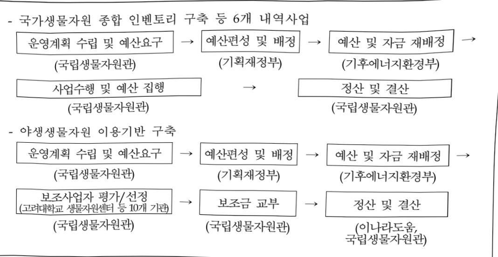

# 생물다양성 보전 및 관리

**해당 페이지**: PDF 2802 ~ 2822 쪽 해당

**부처**: 기후에너지환경부
**분야**: 환경
**회계유형**: 환경개선특별회계
**2026 확정예산**: 3321.0 백만원
**전년대비 증감률**: -2.1%
**AI 도메인**: 환경/기후

---

<table border=1 style='margin: auto; word-wrap: break-word;'><tr><td rowspan="3">환경문제생물종연구</td><td rowspan="2">기후에너지환경부</td><td style='text-align: center; word-wrap: break-word;'>국립생물자원관</td></tr><tr><td style='text-align: center; word-wrap: break-word;'>기후환경생물연구과</td></tr><tr><td style='text-align: center; word-wrap: break-word;'>사업시행주체</td><td style='text-align: center; word-wrap: break-word;'>-</td></tr><tr><td rowspan="3">주요 자생종바코드 분석 및 계통수작성</td><td rowspan="2">기후에너지환경부</td><td style='text-align: center; word-wrap: break-word;'>국립생물자원관</td></tr><tr><td style='text-align: center; word-wrap: break-word;'>생물중다양성연구과</td></tr><tr><td style='text-align: center; word-wrap: break-word;'>사업시행주체</td><td style='text-align: center; word-wrap: break-word;'>-</td></tr><tr><td rowspan="3">야생생물자원이용기반구축</td><td rowspan="2">기후에너지환경부</td><td style='text-align: center; word-wrap: break-word;'>국립생물자원관</td></tr><tr><td style='text-align: center; word-wrap: break-word;'>생물다양성총괄과</td></tr><tr><td style='text-align: center; word-wrap: break-word;'>사업시행주체</td><td style='text-align: center; word-wrap: break-word;'>-</td></tr><tr><td rowspan="3">기후변화영향 생물연구</td><td rowspan="2">기후에너지환경부</td><td style='text-align: center; word-wrap: break-word;'>국립생물자원관</td></tr><tr><td style='text-align: center; word-wrap: break-word;'>기후환경생물연구과</td></tr><tr><td style='text-align: center; word-wrap: break-word;'>사업시행주체</td><td style='text-align: center; word-wrap: break-word;'>-</td></tr><tr><td rowspan="3">생물다양성국제협력ODA</td><td rowspan="2">기후에너지환경부</td><td style='text-align: center; word-wrap: break-word;'>국립생물자원관</td></tr><tr><td style='text-align: center; word-wrap: break-word;'>생물다양성총괄과</td></tr><tr><td style='text-align: center; word-wrap: break-word;'>사업시행주체</td><td style='text-align: center; word-wrap: break-word;'>-</td></tr></table>

### 가.예산 총괄표

(단위: 백만원, %)

<table border=1 style='margin: auto; word-wrap: break-word;'><tr><td rowspan="2">사업명</td><td rowspan="2">2024년 결산</td><td colspan="2">2025년 예산</td><td colspan="2">2026년</td><td rowspan="2">증감 (B-A)</td><td rowspan="2">(B-A)/A</td></tr><tr><td style='text-align: center; word-wrap: break-word;'>본예산(A)</td><td style='text-align: center; word-wrap: break-word;'>추경</td><td style='text-align: center; word-wrap: break-word;'>정부안</td><td style='text-align: center; word-wrap: break-word;'>확정(B)</td></tr><tr><td style='text-align: center; word-wrap: break-word;'>생물다양성 보전 및 관리</td><td style='text-align: center; word-wrap: break-word;'>3,387</td><td style='text-align: center; word-wrap: break-word;'>3,392</td><td style='text-align: center; word-wrap: break-word;'>3,392</td><td style='text-align: center; word-wrap: break-word;'>3,392</td><td style='text-align: center; word-wrap: break-word;'>3,321</td><td style='text-align: center; word-wrap: break-word;'>△71</td><td style='text-align: center; word-wrap: break-word;'>△2.1</td></tr></table>

## □ 기능별(내역사업별), 목별 예산 내역

(단위:백만원)

<table border=1 style='margin: auto; word-wrap: break-word;'><tr><td rowspan="3"></td><td colspan="5">2024</td><td colspan="7">2025(24.12월)</td><td rowspan="3">2026예산</td></tr><tr><td rowspan="2">예산액(추정)</td><td rowspan="2">예산현액</td><td rowspan="2">집행액[실집행액]</td><td rowspan="2">이월액</td><td rowspan="2">불용액</td><td rowspan="2">분예산</td><td rowspan="2">예산현액</td><td rowspan="2">집행액[실집행액]</td><td colspan="2">전년도 이월액제외</td><td rowspan="2">이월예산액</td><td rowspan="2">불용예산액</td></tr><tr><td style='text-align: center; word-wrap: break-word;'>예산현액</td><td style='text-align: center; word-wrap: break-word;'>집행액[실집행액]</td></tr><tr><td style='text-align: center; word-wrap: break-word;'>○ 기능별 분류(함께)</td><td style='text-align: center; word-wrap: break-word;'>3,375</td><td style='text-align: center; word-wrap: break-word;'>3,450</td><td style='text-align: center; word-wrap: break-word;'>3,387[3,387]</td><td style='text-align: center; word-wrap: break-word;'>53</td><td style='text-align: center; word-wrap: break-word;'>10</td><td style='text-align: center; word-wrap: break-word;'>3,392</td><td style='text-align: center; word-wrap: break-word;'>3,445</td><td style='text-align: center; word-wrap: break-word;'>3,334[3,227]</td><td style='text-align: center; word-wrap: break-word;'>3,392</td><td style='text-align: center; word-wrap: break-word;'>3,224[3,207]</td><td style='text-align: center; word-wrap: break-word;'>130</td><td style='text-align: center; word-wrap: break-word;'>58</td><td style='text-align: center; word-wrap: break-word;'>3,321</td></tr><tr><td rowspan="2">· 국가 생물자원 종합인벤트리· 보호야생생물 평가 및 관리</td><td style='text-align: center; word-wrap: break-word;'>960</td><td style='text-align: center; word-wrap: break-word;'>1,035</td><td style='text-align: center; word-wrap: break-word;'>988[988]</td><td style='text-align: center; word-wrap: break-word;'>45</td><td style='text-align: center; word-wrap: break-word;'>2</td><td style='text-align: center; word-wrap: break-word;'>966</td><td style='text-align: center; word-wrap: break-word;'>1,011</td><td style='text-align: center; word-wrap: break-word;'>1,011[934]</td><td style='text-align: center; word-wrap: break-word;'>966</td><td style='text-align: center; word-wrap: break-word;'>909[909]</td><td style='text-align: center; word-wrap: break-word;'>30</td><td style='text-align: center; word-wrap: break-word;'>47</td><td style='text-align: center; word-wrap: break-word;'>757</td></tr><tr><td style='text-align: center; word-wrap: break-word;'>190</td><td style='text-align: center; word-wrap: break-word;'>190</td><td style='text-align: center; word-wrap: break-word;'>190[190]</td><td style='text-align: center; word-wrap: break-word;'>-</td><td style='text-align: center; word-wrap: break-word;'>-</td><td style='text-align: center; word-wrap: break-word;'>192</td><td style='text-align: center; word-wrap: break-word;'>192</td><td style='text-align: center; word-wrap: break-word;'>192[162]</td><td style='text-align: center; word-wrap: break-word;'>192</td><td style='text-align: center; word-wrap: break-word;'>192[175]</td><td style='text-align: center; word-wrap: break-word;'>-</td><td style='text-align: center; word-wrap: break-word;'>-</td><td style='text-align: center; word-wrap: break-word;'>196</td></tr></table>

---

<table border=1 style='margin: auto; word-wrap: break-word;'><tr><td rowspan="3"></td><td colspan="5">2024</td><td colspan="7">2025(24.12월)</td><td rowspan="3">2026예산</td></tr><tr><td rowspan="2">예산액(추정)</td><td rowspan="2">예산현액</td><td rowspan="2">집행액[실집행액]</td><td rowspan="2">이월액</td><td rowspan="2">불용액</td><td rowspan="2">본예산</td><td rowspan="2">예산현액</td><td rowspan="2">집행액[실집행액]</td><td colspan="2">전년도이월액제외</td><td rowspan="2">이월예상액</td><td rowspan="2">불용예상액</td></tr><tr><td style='text-align: center; word-wrap: break-word;'>예산현액</td><td style='text-align: center; word-wrap: break-word;'>집행액[실집행액]</td></tr><tr><td style='text-align: center; word-wrap: break-word;'>·환경문제생물종연구</td><td style='text-align: center; word-wrap: break-word;'>507</td><td style='text-align: center; word-wrap: break-word;'>507</td><td style='text-align: center; word-wrap: break-word;'>499[499]</td><td style='text-align: center; word-wrap: break-word;'>-</td><td style='text-align: center; word-wrap: break-word;'>8</td><td style='text-align: center; word-wrap: break-word;'>513</td><td style='text-align: center; word-wrap: break-word;'>513</td><td style='text-align: center; word-wrap: break-word;'>502[502]</td><td style='text-align: center; word-wrap: break-word;'>513</td><td style='text-align: center; word-wrap: break-word;'>502[502]</td><td style='text-align: center; word-wrap: break-word;'>-</td><td style='text-align: center; word-wrap: break-word;'>11</td><td style='text-align: center; word-wrap: break-word;'>826</td></tr><tr><td style='text-align: center; word-wrap: break-word;'>·주요자생종바코드분석 및계통수작성</td><td style='text-align: center; word-wrap: break-word;'>539</td><td style='text-align: center; word-wrap: break-word;'>539</td><td style='text-align: center; word-wrap: break-word;'>539[539]</td><td style='text-align: center; word-wrap: break-word;'>-</td><td style='text-align: center; word-wrap: break-word;'>-</td><td style='text-align: center; word-wrap: break-word;'>542</td><td style='text-align: center; word-wrap: break-word;'>542</td><td style='text-align: center; word-wrap: break-word;'>542[542]</td><td style='text-align: center; word-wrap: break-word;'>542</td><td style='text-align: center; word-wrap: break-word;'>542[542]</td><td style='text-align: center; word-wrap: break-word;'>-</td><td style='text-align: center; word-wrap: break-word;'>-</td><td style='text-align: center; word-wrap: break-word;'>551</td></tr><tr><td style='text-align: center; word-wrap: break-word;'>·야생생물자원이용기반구축</td><td style='text-align: center; word-wrap: break-word;'>283</td><td style='text-align: center; word-wrap: break-word;'>283</td><td style='text-align: center; word-wrap: break-word;'>283[283]</td><td style='text-align: center; word-wrap: break-word;'>-</td><td style='text-align: center; word-wrap: break-word;'>-</td><td style='text-align: center; word-wrap: break-word;'>283</td><td style='text-align: center; word-wrap: break-word;'>283</td><td style='text-align: center; word-wrap: break-word;'>283[283]</td><td style='text-align: center; word-wrap: break-word;'>283</td><td style='text-align: center; word-wrap: break-word;'>283[283]</td><td style='text-align: center; word-wrap: break-word;'>-</td><td style='text-align: center; word-wrap: break-word;'>-</td><td style='text-align: center; word-wrap: break-word;'>283</td></tr><tr><td style='text-align: center; word-wrap: break-word;'>·기후변화영향생물연구</td><td style='text-align: center; word-wrap: break-word;'>296</td><td style='text-align: center; word-wrap: break-word;'>296</td><td style='text-align: center; word-wrap: break-word;'>296[296]</td><td style='text-align: center; word-wrap: break-word;'>-</td><td style='text-align: center; word-wrap: break-word;'>-</td><td style='text-align: center; word-wrap: break-word;'>296</td><td style='text-align: center; word-wrap: break-word;'>296</td><td style='text-align: center; word-wrap: break-word;'>296[296]</td><td style='text-align: center; word-wrap: break-word;'>296</td><td style='text-align: center; word-wrap: break-word;'>296[296]</td><td style='text-align: center; word-wrap: break-word;'>-</td><td style='text-align: center; word-wrap: break-word;'>-</td><td style='text-align: center; word-wrap: break-word;'>296</td></tr><tr><td style='text-align: center; word-wrap: break-word;'>·생물다양성국제협력ODA</td><td style='text-align: center; word-wrap: break-word;'>600</td><td style='text-align: center; word-wrap: break-word;'>600</td><td style='text-align: center; word-wrap: break-word;'>592[592]</td><td style='text-align: center; word-wrap: break-word;'>8</td><td style='text-align: center; word-wrap: break-word;'>-</td><td style='text-align: center; word-wrap: break-word;'>600</td><td style='text-align: center; word-wrap: break-word;'>608</td><td style='text-align: center; word-wrap: break-word;'>508[508]</td><td style='text-align: center; word-wrap: break-word;'>600</td><td style='text-align: center; word-wrap: break-word;'>500[500]</td><td style='text-align: center; word-wrap: break-word;'>100</td><td style='text-align: center; word-wrap: break-word;'>-</td><td style='text-align: center; word-wrap: break-word;'>412</td></tr><tr><td style='text-align: center; word-wrap: break-word;'>○비목별분류(합계)</td><td style='text-align: center; word-wrap: break-word;'>3,375</td><td style='text-align: center; word-wrap: break-word;'>3,450</td><td style='text-align: center; word-wrap: break-word;'>3,287[3,287]</td><td style='text-align: center; word-wrap: break-word;'>53</td><td style='text-align: center; word-wrap: break-word;'>10</td><td style='text-align: center; word-wrap: break-word;'>3,392</td><td style='text-align: center; word-wrap: break-word;'>3,445</td><td style='text-align: center; word-wrap: break-word;'>3,334[3,227]</td><td style='text-align: center; word-wrap: break-word;'>3,392</td><td style='text-align: center; word-wrap: break-word;'>3,224[3,207]</td><td style='text-align: center; word-wrap: break-word;'>130</td><td style='text-align: center; word-wrap: break-word;'>58</td><td style='text-align: center; word-wrap: break-word;'>3,321</td></tr><tr><td style='text-align: center; word-wrap: break-word;'>·상용임금(110-03)</td><td style='text-align: center; word-wrap: break-word;'>469</td><td style='text-align: center; word-wrap: break-word;'>469</td><td style='text-align: center; word-wrap: break-word;'>469[469]</td><td style='text-align: center; word-wrap: break-word;'>-</td><td style='text-align: center; word-wrap: break-word;'>-</td><td style='text-align: center; word-wrap: break-word;'>483</td><td style='text-align: center; word-wrap: break-word;'>483</td><td style='text-align: center; word-wrap: break-word;'>483[483]</td><td style='text-align: center; word-wrap: break-word;'>483</td><td style='text-align: center; word-wrap: break-word;'>483[483]</td><td style='text-align: center; word-wrap: break-word;'>-</td><td style='text-align: center; word-wrap: break-word;'>-</td><td style='text-align: center; word-wrap: break-word;'>532</td></tr><tr><td style='text-align: center; word-wrap: break-word;'>·일반수용비(210-01)</td><td style='text-align: center; word-wrap: break-word;'>65</td><td style='text-align: center; word-wrap: break-word;'>65</td><td style='text-align: center; word-wrap: break-word;'>65[65]</td><td style='text-align: center; word-wrap: break-word;'>-</td><td style='text-align: center; word-wrap: break-word;'>-</td><td style='text-align: center; word-wrap: break-word;'>65</td><td style='text-align: center; word-wrap: break-word;'>65</td><td style='text-align: center; word-wrap: break-word;'>64[64]</td><td style='text-align: center; word-wrap: break-word;'>65</td><td style='text-align: center; word-wrap: break-word;'>64[64]</td><td style='text-align: center; word-wrap: break-word;'>-</td><td style='text-align: center; word-wrap: break-word;'>1</td><td style='text-align: center; word-wrap: break-word;'>65</td></tr><tr><td style='text-align: center; word-wrap: break-word;'>·복리후생비(210-12)</td><td style='text-align: center; word-wrap: break-word;'>7</td><td style='text-align: center; word-wrap: break-word;'>7</td><td style='text-align: center; word-wrap: break-word;'>7[7]</td><td style='text-align: center; word-wrap: break-word;'>-</td><td style='text-align: center; word-wrap: break-word;'>-</td><td style='text-align: center; word-wrap: break-word;'>7</td><td style='text-align: center; word-wrap: break-word;'>7</td><td style='text-align: center; word-wrap: break-word;'>7[7]</td><td style='text-align: center; word-wrap: break-word;'>7</td><td style='text-align: center; word-wrap: break-word;'>7[7]</td><td style='text-align: center; word-wrap: break-word;'>-</td><td style='text-align: center; word-wrap: break-word;'>-</td><td style='text-align: center; word-wrap: break-word;'>7</td></tr><tr><td style='text-align: center; word-wrap: break-word;'>·시험연구비(210-13)</td><td style='text-align: center; word-wrap: break-word;'>2,181</td><td style='text-align: center; word-wrap: break-word;'>1,654</td><td style='text-align: center; word-wrap: break-word;'>1,654[1,654]</td><td style='text-align: center; word-wrap: break-word;'>8</td><td style='text-align: center; word-wrap: break-word;'>2</td><td style='text-align: center; word-wrap: break-word;'>2,081</td><td style='text-align: center; word-wrap: break-word;'>1,758</td><td style='text-align: center; word-wrap: break-word;'>1,654[1,650]</td><td style='text-align: center; word-wrap: break-word;'>1,750</td><td style='text-align: center; word-wrap: break-word;'>1,646[1,646]</td><td style='text-align: center; word-wrap: break-word;'>100</td><td style='text-align: center; word-wrap: break-word;'>4</td><td style='text-align: center; word-wrap: break-word;'>1,556</td></tr><tr><td style='text-align: center; word-wrap: break-word;'>·일반용역비(210-14)</td><td style='text-align: center; word-wrap: break-word;'>-</td><td style='text-align: center; word-wrap: break-word;'>230</td><td style='text-align: center; word-wrap: break-word;'>230[230]</td><td style='text-align: center; word-wrap: break-word;'>-</td><td style='text-align: center; word-wrap: break-word;'>-</td><td style='text-align: center; word-wrap: break-word;'>100</td><td style='text-align: center; word-wrap: break-word;'>87</td><td style='text-align: center; word-wrap: break-word;'>87[70]</td><td style='text-align: center; word-wrap: break-word;'>87</td><td style='text-align: center; word-wrap: break-word;'>87[70]</td><td style='text-align: center; word-wrap: break-word;'>-</td><td style='text-align: center; word-wrap: break-word;'>-</td><td style='text-align: center; word-wrap: break-word;'>100</td></tr><tr><td style='text-align: center; word-wrap: break-word;'>·국내여비(220-02)</td><td style='text-align: center; word-wrap: break-word;'>2</td><td style='text-align: center; word-wrap: break-word;'>2</td><td style='text-align: center; word-wrap: break-word;'>2[2]</td><td style='text-align: center; word-wrap: break-word;'>-</td><td style='text-align: center; word-wrap: break-word;'>-</td><td style='text-align: center; word-wrap: break-word;'>2</td><td style='text-align: center; word-wrap: break-word;'>2</td><td style='text-align: center; word-wrap: break-word;'>2[2]</td><td style='text-align: center; word-wrap: break-word;'>2</td><td style='text-align: center; word-wrap: break-word;'>2[2]</td><td style='text-align: center; word-wrap: break-word;'>-</td><td style='text-align: center; word-wrap: break-word;'>-</td><td style='text-align: center; word-wrap: break-word;'>2</td></tr><tr><td style='text-align: center; word-wrap: break-word;'>·일반연구비(260-01)</td><td style='text-align: center; word-wrap: break-word;'>206</td><td style='text-align: center; word-wrap: break-word;'>503</td><td style='text-align: center; word-wrap: break-word;'>493[493]</td><td style='text-align: center; word-wrap: break-word;'>-</td><td style='text-align: center; word-wrap: break-word;'>8</td><td style='text-align: center; word-wrap: break-word;'>206</td><td style='text-align: center; word-wrap: break-word;'>550</td><td style='text-align: center; word-wrap: break-word;'>537[537]</td><td style='text-align: center; word-wrap: break-word;'>550</td><td style='text-align: center; word-wrap: break-word;'>537[537]</td><td style='text-align: center; word-wrap: break-word;'>-</td><td style='text-align: center; word-wrap: break-word;'>13</td><td style='text-align: center; word-wrap: break-word;'>600</td></tr><tr><td style='text-align: center; word-wrap: break-word;'>·민간경상보조(320-01)</td><td style='text-align: center; word-wrap: break-word;'>278</td><td style='text-align: center; word-wrap: break-word;'>278</td><td style='text-align: center; word-wrap: break-word;'>278[278]</td><td style='text-align: center; word-wrap: break-word;'>-</td><td style='text-align: center; word-wrap: break-word;'>2</td><td style='text-align: center; word-wrap: break-word;'>279</td><td style='text-align: center; word-wrap: break-word;'>279</td><td style='text-align: center; word-wrap: break-word;'>279[279]</td><td style='text-align: center; word-wrap: break-word;'>279</td><td style='text-align: center; word-wrap: break-word;'>279[279]</td><td style='text-align: center; word-wrap: break-word;'>-</td><td style='text-align: center; word-wrap: break-word;'>-</td><td style='text-align: center; word-wrap: break-word;'>279</td></tr><tr><td style='text-align: center; word-wrap: break-word;'>·고용부담금(320-09)</td><td style='text-align: center; word-wrap: break-word;'>92</td><td style='text-align: center; word-wrap: break-word;'>92</td><td style='text-align: center; word-wrap: break-word;'>92[92]</td><td style='text-align: center; word-wrap: break-word;'>-</td><td style='text-align: center; word-wrap: break-word;'>-</td><td style='text-align: center; word-wrap: break-word;'>94</td><td style='text-align: center; word-wrap: break-word;'>94</td><td style='text-align: center; word-wrap: break-word;'>94[94]</td><td style='text-align: center; word-wrap: break-word;'>94</td><td style='text-align: center; word-wrap: break-word;'>94[94]</td><td style='text-align: center; word-wrap: break-word;'>-</td><td style='text-align: center; word-wrap: break-word;'>-</td><td style='text-align: center; word-wrap: break-word;'>105</td></tr><tr><td style='text-align: center; word-wrap: break-word;'>·해외경상이전340-01)</td><td style='text-align: center; word-wrap: break-word;'>75</td><td style='text-align: center; word-wrap: break-word;'>150</td><td style='text-align: center; word-wrap: break-word;'>105[105]</td><td style='text-align: center; word-wrap: break-word;'>45</td><td style='text-align: center; word-wrap: break-word;'>-</td><td style='text-align: center; word-wrap: break-word;'>75</td><td style='text-align: center; word-wrap: break-word;'>120</td><td style='text-align: center; word-wrap: break-word;'>55[55]</td><td style='text-align: center; word-wrap: break-word;'>75</td><td style='text-align: center; word-wrap: break-word;'>25[25]</td><td style='text-align: center; word-wrap: break-word;'>30</td><td style='text-align: center; word-wrap: break-word;'>40</td><td style='text-align: center; word-wrap: break-word;'>75</td></tr><tr><td style='text-align: center; word-wrap: break-word;'>○기능비목별분류(합계)</td><td style='text-align: center; word-wrap: break-word;'>3,375</td><td style='text-align: center; word-wrap: break-word;'>3,450</td><td style='text-align: center; word-wrap: break-word;'>3,287[3,287]</td><td style='text-align: center; word-wrap: break-word;'>75</td><td style='text-align: center; word-wrap: break-word;'>24</td><td style='text-align: center; word-wrap: break-word;'>3,392</td><td style='text-align: center; word-wrap: break-word;'>3,445</td><td style='text-align: center; word-wrap: break-word;'>3,334[3,227]</td><td style='text-align: center; word-wrap: break-word;'>3,392</td><td style='text-align: center; word-wrap: break-word;'>3,224[3,207]</td><td style='text-align: center; word-wrap: break-word;'>130</td><td style='text-align: center; word-wrap: break-word;'>58</td><td style='text-align: center; word-wrap: break-word;'>3,321</td></tr><tr><td style='text-align: center; word-wrap: break-word;'>·국가생물자원종합인벤트리</td><td style='text-align: center; word-wrap: break-word;'>960</td><td style='text-align: center; word-wrap: break-word;'>1,035</td><td style='text-align: center; word-wrap: break-word;'>988[988]</td><td style='text-align: center; word-wrap: break-word;'>45</td><td style='text-align: center; word-wrap: break-word;'>2</td><td style='text-align: center; word-wrap: break-word;'>966</td><td style='text-align: center; word-wrap: break-word;'>1,011</td><td style='text-align: center; word-wrap: break-word;'>1,011[934]</td><td style='text-align: center; word-wrap: break-word;'>966</td><td style='text-align: center; word-wrap: break-word;'>966[916]</td><td style='text-align: center; word-wrap: break-word;'>30</td><td style='text-align: center; word-wrap: break-word;'>47</td><td style='text-align: center; word-wrap: break-word;'>757</td></tr><tr><td style='text-align: center; word-wrap: break-word;'>-상용임금(110-03)</td><td style='text-align: center; word-wrap: break-word;'>176</td><td style='text-align: center; word-wrap: break-word;'>176</td><td style='text-align: center; word-wrap: break-word;'>176[176]</td><td style='text-align: center; word-wrap: break-word;'>-</td><td style='text-align: center; word-wrap: break-word;'>1</td><td style='text-align: center; word-wrap: break-word;'>183</td><td style='text-align: center; word-wrap: break-word;'>183</td><td style='text-align: center; word-wrap: break-word;'>183[183]</td><td style='text-align: center; word-wrap: break-word;'>183</td><td style='text-align: center; word-wrap: break-word;'>183[183]</td><td style='text-align: center; word-wrap: break-word;'>-</td><td style='text-align: center; word-wrap: break-word;'>-</td><td style='text-align: center; word-wrap: break-word;'>199</td></tr><tr><td style='text-align: center; word-wrap: break-word;'>-일반수용비(210-01)</td><td style='text-align: center; word-wrap: break-word;'>40</td><td style='text-align: center; word-wrap: break-word;'>40</td><td style='text-align: center; word-wrap: break-word;'>40[40]</td><td style='text-align: center; word-wrap: break-word;'>-</td><td style='text-align: center; word-wrap: break-word;'>-</td><td style='text-align: center; word-wrap: break-word;'>40</td><td style='text-align: center; word-wrap: break-word;'>40</td><td style='text-align: center; word-wrap: break-word;'>40[39]</td><td style='text-align: center; word-wrap: break-word;'>40</td><td style='text-align: center; word-wrap: break-word;'>40[39]</td><td style='text-align: center; word-wrap: break-word;'>-</td><td style='text-align: center; word-wrap: break-word;'>1</td><td style='text-align: center; word-wrap: break-word;'>40</td></tr><tr><td style='text-align: center; word-wrap: break-word;'>-복리후생비(210-12)</td><td style='text-align: center; word-wrap: break-word;'>3</td><td style='text-align: center; word-wrap: break-word;'>3</td><td style='text-align: center; word-wrap: break-word;'>3[3]</td><td style='text-align: center; word-wrap: break-word;'>-</td><td style='text-align: center; word-wrap: break-word;'>1</td><td style='text-align: center; word-wrap: break-word;'>3</td><td style='text-align: center; word-wrap: break-word;'>3</td><td style='text-align: center; word-wrap: break-word;'>3[3]</td><td style='text-align: center; word-wrap: break-word;'>3</td><td style='text-align: center; word-wrap: break-word;'>3[3]</td><td style='text-align: center; word-wrap: break-word;'>-</td><td style='text-align: center; word-wrap: break-word;'>-</td><td style='text-align: center; word-wrap: break-word;'>3</td></tr><tr><td style='text-align: center; word-wrap: break-word;'>-시험연구비(210-13)</td><td style='text-align: center; word-wrap: break-word;'>358</td><td style='text-align: center; word-wrap: break-word;'>358</td><td style='text-align: center; word-wrap: break-word;'>358[358]</td><td style='text-align: center; word-wrap: break-word;'>-</td><td style='text-align: center; word-wrap: break-word;'>3</td><td style='text-align: center; word-wrap: break-word;'>424</td><td style='text-align: center; word-wrap: break-word;'>424</td><td style='text-align: center; word-wrap: break-word;'>420[420]</td><td style='text-align: center; word-wrap: break-word;'>424</td><td style='text-align: center; word-wrap: break-word;'>420[420]</td><td style='text-align: center; word-wrap: break-word;'>-</td><td style='text-align: center; word-wrap: break-word;'>4</td><td style='text-align: center; word-wrap: break-word;'>300</td></tr><tr><td style='text-align: center; word-wrap: break-word;'>-국내여비(220-01)</td><td style='text-align: center; word-wrap: break-word;'>2</td><td style='text-align: center; word-wrap: break-word;'>2</td><td style='text-align: center; word-wrap: break-word;'>2[2]</td><td style='text-align: center; word-wrap: break-word;'>-</td><td style='text-align: center; word-wrap: break-word;'>-</td><td style='text-align: center; word-wrap: break-word;'>2</td><td style='text-align: center; word-wrap: break-word;'>2</td><td style='text-align: center; word-wrap: break-word;'>2[2]</td><td style='text-align: center; word-wrap: break-word;'>2</td><td style='text-align: center; word-wrap: break-word;'>2[2]</td><td style='text-align: center; word-wrap: break-word;'>-</td><td style='text-align: center; word-wrap: break-word;'>-</td><td style='text-align: center; word-wrap: break-word;'>2</td></tr><tr><td style='text-align: center; word-wrap: break-word;'>-일반연구비(260-01)</td><td style='text-align: center; word-wrap: break-word;'>272</td><td style='text-align: center; word-wrap: break-word;'>272</td><td style='text-align: center; word-wrap: break-word;'>270[270]</td><td style='text-align: center; word-wrap: break-word;'>-</td><td style='text-align: center; word-wrap: break-word;'>1</td><td style='text-align: center; word-wrap: break-word;'>206</td><td style='text-align: center; word-wrap: break-word;'>206</td><td style='text-align: center; word-wrap: break-word;'>204[204]</td><td style='text-align: center; word-wrap: break-word;'>206</td><td style='text-align: center; word-wrap: break-word;'>204[204]</td><td style='text-align: center; word-wrap: break-word;'>-</td><td style='text-align: center; word-wrap: break-word;'>2</td><td style='text-align: center; word-wrap: break-word;'>100</td></tr></table>

---

<table border=1 style='margin: auto; word-wrap: break-word;'><tr><td rowspan="3"></td><td colspan="5">2024</td><td colspan="7">2025(24.12월)</td><td rowspan="3">2026예산</td></tr><tr><td rowspan="2">예산액(추경)</td><td rowspan="2">예산현액</td><td rowspan="2">집행액[실집행액]</td><td rowspan="2">이월액</td><td rowspan="2">불용액</td><td rowspan="2">본예산</td><td rowspan="2">예산현액</td><td rowspan="2">집행액[실집행액]</td><td colspan="2">전년도 이월액제외</td><td rowspan="2">이월예상액</td><td rowspan="2">불용예상액</td></tr><tr><td style='text-align: center; word-wrap: break-word;'>예산현액</td><td style='text-align: center; word-wrap: break-word;'>집행액[실집행액]</td></tr><tr><td style='text-align: center; word-wrap: break-word;'>- 고용부담금(320-09)</td><td style='text-align: center; word-wrap: break-word;'>34</td><td style='text-align: center; word-wrap: break-word;'>34</td><td style='text-align: center; word-wrap: break-word;'>34</td><td style='text-align: center; word-wrap: break-word;'>-</td><td style='text-align: center; word-wrap: break-word;'>-</td><td style='text-align: center; word-wrap: break-word;'>33</td><td style='text-align: center; word-wrap: break-word;'>33</td><td style='text-align: center; word-wrap: break-word;'>33</td><td style='text-align: center; word-wrap: break-word;'>33</td><td style='text-align: center; word-wrap: break-word;'>33</td><td style='text-align: center; word-wrap: break-word;'>-</td><td style='text-align: center; word-wrap: break-word;'>-</td><td style='text-align: center; word-wrap: break-word;'>38</td></tr><tr><td style='text-align: center; word-wrap: break-word;'>- 해외경상이전비(340-01)</td><td style='text-align: center; word-wrap: break-word;'>75</td><td style='text-align: center; word-wrap: break-word;'>150</td><td style='text-align: center; word-wrap: break-word;'>105[105]</td><td style='text-align: center; word-wrap: break-word;'>45</td><td style='text-align: center; word-wrap: break-word;'>-</td><td style='text-align: center; word-wrap: break-word;'>75</td><td style='text-align: center; word-wrap: break-word;'>120</td><td style='text-align: center; word-wrap: break-word;'>50[50]</td><td style='text-align: center; word-wrap: break-word;'>75</td><td style='text-align: center; word-wrap: break-word;'>25[25]</td><td style='text-align: center; word-wrap: break-word;'>30</td><td style='text-align: center; word-wrap: break-word;'>40</td><td style='text-align: center; word-wrap: break-word;'>75</td></tr><tr><td style='text-align: center; word-wrap: break-word;'>· 보호야생생물 평가 및 관리</td><td style='text-align: center; word-wrap: break-word;'>190</td><td style='text-align: center; word-wrap: break-word;'>190</td><td style='text-align: center; word-wrap: break-word;'>190[190]</td><td style='text-align: center; word-wrap: break-word;'>-</td><td style='text-align: center; word-wrap: break-word;'>-</td><td style='text-align: center; word-wrap: break-word;'>192</td><td style='text-align: center; word-wrap: break-word;'>192</td><td style='text-align: center; word-wrap: break-word;'>192[192]</td><td style='text-align: center; word-wrap: break-word;'>192</td><td style='text-align: center; word-wrap: break-word;'>192[192]</td><td style='text-align: center; word-wrap: break-word;'>-</td><td style='text-align: center; word-wrap: break-word;'>-</td><td style='text-align: center; word-wrap: break-word;'>196</td></tr><tr><td style='text-align: center; word-wrap: break-word;'>- 상용 임 금(110-03)</td><td style='text-align: center; word-wrap: break-word;'>34</td><td style='text-align: center; word-wrap: break-word;'>34</td><td style='text-align: center; word-wrap: break-word;'>34</td><td style='text-align: center; word-wrap: break-word;'>-</td><td style='text-align: center; word-wrap: break-word;'>-</td><td style='text-align: center; word-wrap: break-word;'>36</td><td style='text-align: center; word-wrap: break-word;'>36</td><td style='text-align: center; word-wrap: break-word;'>36[36]</td><td style='text-align: center; word-wrap: break-word;'>36</td><td style='text-align: center; word-wrap: break-word;'>36[36]</td><td style='text-align: center; word-wrap: break-word;'>-</td><td style='text-align: center; word-wrap: break-word;'>-</td><td style='text-align: center; word-wrap: break-word;'>36</td></tr><tr><td style='text-align: center; word-wrap: break-word;'>- 시험 연 구 비(210-13)</td><td style='text-align: center; word-wrap: break-word;'>150</td><td style='text-align: center; word-wrap: break-word;'>150</td><td style='text-align: center; word-wrap: break-word;'>150</td><td style='text-align: center; word-wrap: break-word;'>-</td><td style='text-align: center; word-wrap: break-word;'>-</td><td style='text-align: center; word-wrap: break-word;'>50</td><td style='text-align: center; word-wrap: break-word;'>63</td><td style='text-align: center; word-wrap: break-word;'>63[63]</td><td style='text-align: center; word-wrap: break-word;'>63</td><td style='text-align: center; word-wrap: break-word;'>63[63]</td><td style='text-align: center; word-wrap: break-word;'>-</td><td style='text-align: center; word-wrap: break-word;'>-</td><td style='text-align: center; word-wrap: break-word;'>50</td></tr><tr><td style='text-align: center; word-wrap: break-word;'>- 일반 용 억 비(210-14)</td><td style='text-align: center; word-wrap: break-word;'>-</td><td style='text-align: center; word-wrap: break-word;'>-</td><td style='text-align: center; word-wrap: break-word;'>-</td><td style='text-align: center; word-wrap: break-word;'>-</td><td style='text-align: center; word-wrap: break-word;'>-</td><td style='text-align: center; word-wrap: break-word;'>100</td><td style='text-align: center; word-wrap: break-word;'>87</td><td style='text-align: center; word-wrap: break-word;'>87[70]</td><td style='text-align: center; word-wrap: break-word;'>87</td><td style='text-align: center; word-wrap: break-word;'>87[70]</td><td style='text-align: center; word-wrap: break-word;'>-</td><td style='text-align: center; word-wrap: break-word;'>-</td><td style='text-align: center; word-wrap: break-word;'>100</td></tr><tr><td style='text-align: center; word-wrap: break-word;'>- 고용부 담 금(320-09)</td><td style='text-align: center; word-wrap: break-word;'>6</td><td style='text-align: center; word-wrap: break-word;'>6</td><td style='text-align: center; word-wrap: break-word;'>6</td><td style='text-align: center; word-wrap: break-word;'>-</td><td style='text-align: center; word-wrap: break-word;'>-</td><td style='text-align: center; word-wrap: break-word;'>6</td><td style='text-align: center; word-wrap: break-word;'>6</td><td style='text-align: center; word-wrap: break-word;'>6[6]</td><td style='text-align: center; word-wrap: break-word;'>6</td><td style='text-align: center; word-wrap: break-word;'>6[6]</td><td style='text-align: center; word-wrap: break-word;'>-</td><td style='text-align: center; word-wrap: break-word;'>-</td><td style='text-align: center; word-wrap: break-word;'>6</td></tr><tr><td style='text-align: center; word-wrap: break-word;'>· 환경문제 생물종연구</td><td style='text-align: center; word-wrap: break-word;'>507</td><td style='text-align: center; word-wrap: break-word;'>507</td><td style='text-align: center; word-wrap: break-word;'>499[499]</td><td style='text-align: center; word-wrap: break-word;'>-</td><td style='text-align: center; word-wrap: break-word;'>8</td><td style='text-align: center; word-wrap: break-word;'>513</td><td style='text-align: center; word-wrap: break-word;'>513</td><td style='text-align: center; word-wrap: break-word;'>502[502]</td><td style='text-align: center; word-wrap: break-word;'>513</td><td style='text-align: center; word-wrap: break-word;'>502[502]</td><td style='text-align: center; word-wrap: break-word;'>-</td><td style='text-align: center; word-wrap: break-word;'>11</td><td style='text-align: center; word-wrap: break-word;'>826</td></tr><tr><td style='text-align: center; word-wrap: break-word;'>- 상용 임 금(110-03)</td><td style='text-align: center; word-wrap: break-word;'>101</td><td style='text-align: center; word-wrap: break-word;'>101</td><td style='text-align: center; word-wrap: break-word;'>101[101]</td><td style='text-align: center; word-wrap: break-word;'>-</td><td style='text-align: center; word-wrap: break-word;'>-</td><td style='text-align: center; word-wrap: break-word;'>104</td><td style='text-align: center; word-wrap: break-word;'>104</td><td style='text-align: center; word-wrap: break-word;'>104[104]</td><td style='text-align: center; word-wrap: break-word;'>104</td><td style='text-align: center; word-wrap: break-word;'>104[104]</td><td style='text-align: center; word-wrap: break-word;'>-</td><td style='text-align: center; word-wrap: break-word;'>-</td><td style='text-align: center; word-wrap: break-word;'>117</td></tr><tr><td style='text-align: center; word-wrap: break-word;'>- 복리후 생 비(210-12)</td><td style='text-align: center; word-wrap: break-word;'>2</td><td style='text-align: center; word-wrap: break-word;'>2</td><td style='text-align: center; word-wrap: break-word;'>2[2]</td><td style='text-align: center; word-wrap: break-word;'>-</td><td style='text-align: center; word-wrap: break-word;'>-</td><td style='text-align: center; word-wrap: break-word;'>2</td><td style='text-align: center; word-wrap: break-word;'>2</td><td style='text-align: center; word-wrap: break-word;'>2[2]</td><td style='text-align: center; word-wrap: break-word;'>2</td><td style='text-align: center; word-wrap: break-word;'>2[2]</td><td style='text-align: center; word-wrap: break-word;'>-</td><td style='text-align: center; word-wrap: break-word;'>-</td><td style='text-align: center; word-wrap: break-word;'>2</td></tr><tr><td style='text-align: center; word-wrap: break-word;'>- 시험 연 구 비(210-13)</td><td style='text-align: center; word-wrap: break-word;'>385</td><td style='text-align: center; word-wrap: break-word;'>200</td><td style='text-align: center; word-wrap: break-word;'>200[200]</td><td style='text-align: center; word-wrap: break-word;'>-</td><td style='text-align: center; word-wrap: break-word;'>-</td><td style='text-align: center; word-wrap: break-word;'>385</td><td style='text-align: center; word-wrap: break-word;'>187</td><td style='text-align: center; word-wrap: break-word;'>187[187]</td><td style='text-align: center; word-wrap: break-word;'>187</td><td style='text-align: center; word-wrap: break-word;'>187[187]</td><td style='text-align: center; word-wrap: break-word;'>-</td><td style='text-align: center; word-wrap: break-word;'>-</td><td style='text-align: center; word-wrap: break-word;'>185</td></tr><tr><td style='text-align: center; word-wrap: break-word;'>- 일반 연 구 비(260-01)</td><td style='text-align: center; word-wrap: break-word;'>-</td><td style='text-align: center; word-wrap: break-word;'>185</td><td style='text-align: center; word-wrap: break-word;'>177[177]</td><td style='text-align: center; word-wrap: break-word;'>-</td><td style='text-align: center; word-wrap: break-word;'>8</td><td style='text-align: center; word-wrap: break-word;'>-</td><td style='text-align: center; word-wrap: break-word;'>198</td><td style='text-align: center; word-wrap: break-word;'>187[187]</td><td style='text-align: center; word-wrap: break-word;'>198</td><td style='text-align: center; word-wrap: break-word;'>187[187]</td><td style='text-align: center; word-wrap: break-word;'>-</td><td style='text-align: center; word-wrap: break-word;'>11</td><td style='text-align: center; word-wrap: break-word;'>500</td></tr><tr><td style='text-align: center; word-wrap: break-word;'>- 고용부 담 금(320-09)</td><td style='text-align: center; word-wrap: break-word;'>19</td><td style='text-align: center; word-wrap: break-word;'>19</td><td style='text-align: center; word-wrap: break-word;'>19[19]</td><td style='text-align: center; word-wrap: break-word;'>-</td><td style='text-align: center; word-wrap: break-word;'>-</td><td style='text-align: center; word-wrap: break-word;'>22</td><td style='text-align: center; word-wrap: break-word;'>22</td><td style='text-align: center; word-wrap: break-word;'>22[22]</td><td style='text-align: center; word-wrap: break-word;'>22</td><td style='text-align: center; word-wrap: break-word;'>22[22]</td><td style='text-align: center; word-wrap: break-word;'>-</td><td style='text-align: center; word-wrap: break-word;'>-</td><td style='text-align: center; word-wrap: break-word;'>22</td></tr><tr><td style='text-align: center; word-wrap: break-word;'>· 주요 자생종 바코드분석 및 계통수 작성</td><td style='text-align: center; word-wrap: break-word;'>539</td><td style='text-align: center; word-wrap: break-word;'>539</td><td style='text-align: center; word-wrap: break-word;'>539[539]</td><td style='text-align: center; word-wrap: break-word;'>-</td><td style='text-align: center; word-wrap: break-word;'>-</td><td style='text-align: center; word-wrap: break-word;'>542</td><td style='text-align: center; word-wrap: break-word;'>542</td><td style='text-align: center; word-wrap: break-word;'>542[542]</td><td style='text-align: center; word-wrap: break-word;'>542</td><td style='text-align: center; word-wrap: break-word;'>542[542]</td><td style='text-align: center; word-wrap: break-word;'>-</td><td style='text-align: center; word-wrap: break-word;'>-</td><td style='text-align: center; word-wrap: break-word;'>551</td></tr><tr><td style='text-align: center; word-wrap: break-word;'>- 상용 임 금(110-03)</td><td style='text-align: center; word-wrap: break-word;'>63</td><td style='text-align: center; word-wrap: break-word;'>63</td><td style='text-align: center; word-wrap: break-word;'>63[63]</td><td style='text-align: center; word-wrap: break-word;'>-</td><td style='text-align: center; word-wrap: break-word;'>-</td><td style='text-align: center; word-wrap: break-word;'>65</td><td style='text-align: center; word-wrap: break-word;'>65</td><td style='text-align: center; word-wrap: break-word;'>65[65]</td><td style='text-align: center; word-wrap: break-word;'>65</td><td style='text-align: center; word-wrap: break-word;'>65[65]</td><td style='text-align: center; word-wrap: break-word;'>-</td><td style='text-align: center; word-wrap: break-word;'>-</td><td style='text-align: center; word-wrap: break-word;'>72</td></tr><tr><td style='text-align: center; word-wrap: break-word;'>- 복리후 생 비(210-12)</td><td style='text-align: center; word-wrap: break-word;'>1</td><td style='text-align: center; word-wrap: break-word;'>1</td><td style='text-align: center; word-wrap: break-word;'>1[1]</td><td style='text-align: center; word-wrap: break-word;'>-</td><td style='text-align: center; word-wrap: break-word;'>-</td><td style='text-align: center; word-wrap: break-word;'>1</td><td style='text-align: center; word-wrap: break-word;'>1</td><td style='text-align: center; word-wrap: break-word;'>1[1]</td><td style='text-align: center; word-wrap: break-word;'>1</td><td style='text-align: center; word-wrap: break-word;'>1[1]</td><td style='text-align: center; word-wrap: break-word;'>-</td><td style='text-align: center; word-wrap: break-word;'>-</td><td style='text-align: center; word-wrap: break-word;'>1</td></tr><tr><td style='text-align: center; word-wrap: break-word;'>- 시험 연 구 비(210-13)</td><td style='text-align: center; word-wrap: break-word;'>461</td><td style='text-align: center; word-wrap: break-word;'>461</td><td style='text-align: center; word-wrap: break-word;'>461[461]</td><td style='text-align: center; word-wrap: break-word;'>-</td><td style='text-align: center; word-wrap: break-word;'>-</td><td style='text-align: center; word-wrap: break-word;'>461</td><td style='text-align: center; word-wrap: break-word;'>461</td><td style='text-align: center; word-wrap: break-word;'>461[461]</td><td style='text-align: center; word-wrap: break-word;'>461</td><td style='text-align: center; word-wrap: break-word;'>461[461]</td><td style='text-align: center; word-wrap: break-word;'>-</td><td style='text-align: center; word-wrap: break-word;'>-</td><td style='text-align: center; word-wrap: break-word;'>461</td></tr><tr><td style='text-align: center; word-wrap: break-word;'>- 고용부 담 금(320-09)</td><td style='text-align: center; word-wrap: break-word;'>14</td><td style='text-align: center; word-wrap: break-word;'>14</td><td style='text-align: center; word-wrap: break-word;'>14[14]</td><td style='text-align: center; word-wrap: break-word;'>-</td><td style='text-align: center; word-wrap: break-word;'>-</td><td style='text-align: center; word-wrap: break-word;'>15</td><td style='text-align: center; word-wrap: break-word;'>15</td><td style='text-align: center; word-wrap: break-word;'>15[15]</td><td style='text-align: center; word-wrap: break-word;'>15</td><td style='text-align: center; word-wrap: break-word;'>15[15]</td><td style='text-align: center; word-wrap: break-word;'>-</td><td style='text-align: center; word-wrap: break-word;'>-</td><td style='text-align: center; word-wrap: break-word;'>17</td></tr><tr><td style='text-align: center; word-wrap: break-word;'>· 야생생물자원이용기반 구축</td><td style='text-align: center; word-wrap: break-word;'>283</td><td style='text-align: center; word-wrap: break-word;'>283</td><td style='text-align: center; word-wrap: break-word;'>283[283]</td><td style='text-align: center; word-wrap: break-word;'>-</td><td style='text-align: center; word-wrap: break-word;'>-</td><td style='text-align: center; word-wrap: break-word;'>283</td><td style='text-align: center; word-wrap: break-word;'>283</td><td style='text-align: center; word-wrap: break-word;'>283[283]</td><td style='text-align: center; word-wrap: break-word;'>283</td><td style='text-align: center; word-wrap: break-word;'>283[283]</td><td style='text-align: center; word-wrap: break-word;'>-</td><td style='text-align: center; word-wrap: break-word;'>-</td><td style='text-align: center; word-wrap: break-word;'>283</td></tr><tr><td style='text-align: center; word-wrap: break-word;'>- 시험 연 구 비(210-13)</td><td style='text-align: center; word-wrap: break-word;'>5</td><td style='text-align: center; word-wrap: break-word;'>5</td><td style='text-align: center; word-wrap: break-word;'>5[5]</td><td style='text-align: center; word-wrap: break-word;'>-</td><td style='text-align: center; word-wrap: break-word;'>-</td><td style='text-align: center; word-wrap: break-word;'>4</td><td style='text-align: center; word-wrap: break-word;'>4</td><td style='text-align: center; word-wrap: break-word;'>4[4]</td><td style='text-align: center; word-wrap: break-word;'>4</td><td style='text-align: center; word-wrap: break-word;'>4[4]</td><td style='text-align: center; word-wrap: break-word;'>-</td><td style='text-align: center; word-wrap: break-word;'>-</td><td style='text-align: center; word-wrap: break-word;'>4</td></tr><tr><td style='text-align: center; word-wrap: break-word;'>- 민간경상보조(320-01)</td><td style='text-align: center; word-wrap: break-word;'>278</td><td style='text-align: center; word-wrap: break-word;'>278</td><td style='text-align: center; word-wrap: break-word;'>278[278]</td><td style='text-align: center; word-wrap: break-word;'>-</td><td style='text-align: center; word-wrap: break-word;'>-</td><td style='text-align: center; word-wrap: break-word;'>279</td><td style='text-align: center; word-wrap: break-word;'>279</td><td style='text-align: center; word-wrap: break-word;'>279[279]</td><td style='text-align: center; word-wrap: break-word;'>279</td><td style='text-align: center; word-wrap: break-word;'>279[279]</td><td style='text-align: center; word-wrap: break-word;'>-</td><td style='text-align: center; word-wrap: break-word;'>-</td><td style='text-align: center; word-wrap: break-word;'>279</td></tr><tr><td style='text-align: center; word-wrap: break-word;'>· 기후변화 영향 생물연구</td><td style='text-align: center; word-wrap: break-word;'>296</td><td style='text-align: center; word-wrap: break-word;'>296</td><td style='text-align: center; word-wrap: break-word;'>296[296]</td><td style='text-align: center; word-wrap: break-word;'>-</td><td style='text-align: center; word-wrap: break-word;'>-</td><td style='text-align: center; word-wrap: break-word;'>296</td><td style='text-align: center; word-wrap: break-word;'>296</td><td style='text-align: center; word-wrap: break-word;'>296[296]</td><td style='text-align: center; word-wrap: break-word;'>296</td><td style='text-align: center; word-wrap: break-word;'>296[296]</td><td style='text-align: center; word-wrap: break-word;'>-</td><td style='text-align: center; word-wrap: break-word;'>-</td><td style='text-align: center; word-wrap: break-word;'>296</td></tr><tr><td style='text-align: center; word-wrap: break-word;'>- 시험 연 구 비(210-13)</td><td style='text-align: center; word-wrap: break-word;'>296</td><td style='text-align: center; word-wrap: break-word;'>296</td><td style='text-align: center; word-wrap: break-word;'>296[296]</td><td style='text-align: center; word-wrap: break-word;'>-</td><td style='text-align: center; word-wrap: break-word;'>-</td><td style='text-align: center; word-wrap: break-word;'>296</td><td style='text-align: center; word-wrap: break-word;'>150</td><td style='text-align: center; word-wrap: break-word;'>296[296]</td><td style='text-align: center; word-wrap: break-word;'>296</td><td style='text-align: center; word-wrap: break-word;'>296[296]</td><td style='text-align: center; word-wrap: break-word;'>-</td><td style='text-align: center; word-wrap: break-word;'>-</td><td style='text-align: center; word-wrap: break-word;'>296</td></tr><tr><td style='text-align: center; word-wrap: break-word;'>- 일반 연 구 비(210-13)</td><td style='text-align: center; word-wrap: break-word;'>-</td><td style='text-align: center; word-wrap: break-word;'>-</td><td style='text-align: center; word-wrap: break-word;'>-</td><td style='text-align: center; word-wrap: break-word;'>-</td><td style='text-align: center; word-wrap: break-word;'>-</td><td style='text-align: center; word-wrap: break-word;'>-</td><td style='text-align: center; word-wrap: break-word;'>146</td><td style='text-align: center; word-wrap: break-word;'>146</td><td style='text-align: center; word-wrap: break-word;'>146</td><td style='text-align: center; word-wrap: break-word;'>146</td><td style='text-align: center; word-wrap: break-word;'>-</td><td style='text-align: center; word-wrap: break-word;'>-</td><td style='text-align: center; word-wrap: break-word;'>-</td></tr></table>

---

<table border=1 style='margin: auto; word-wrap: break-word;'><tr><td rowspan="3"></td><td colspan="5">2024</td><td colspan="7">2025(24.12월)</td><td rowspan="3">2026예산</td></tr><tr><td rowspan="2">예산액(추경)</td><td rowspan="2">예산현액</td><td rowspan="2">집행액[실집행액]</td><td rowspan="2">이월액</td><td rowspan="2">불용액</td><td rowspan="2">본예산</td><td rowspan="2">예산현액</td><td rowspan="2">집행액[실집행액]</td><td colspan="2">전년도아월액제외</td><td rowspan="2">이월예산액</td><td rowspan="2">불용예산액</td></tr><tr><td style='text-align: center; word-wrap: break-word;'>예산현액</td><td style='text-align: center; word-wrap: break-word;'>집행액[실집행액]</td></tr><tr><td rowspan="7">(260-01)·생물다양성국제협력ODA-상용임금(110-03)-일반수용비(210-01)-복리후생비(210-12)-시험연구비(210-13)-일반용역비(210-14)-고용부담금(320-09)</td><td style='text-align: center; word-wrap: break-word;'>600</td><td style='text-align: center; word-wrap: break-word;'>600</td><td style='text-align: center; word-wrap: break-word;'>592[592]</td><td style='text-align: center; word-wrap: break-word;'>8</td><td style='text-align: center; word-wrap: break-word;'>-</td><td style='text-align: center; word-wrap: break-word;'>600</td><td style='text-align: center; word-wrap: break-word;'>608</td><td style='text-align: center; word-wrap: break-word;'>[146][508][508]</td><td style='text-align: center; word-wrap: break-word;'>600</td><td style='text-align: center; word-wrap: break-word;'>[146][500][500]</td><td style='text-align: center; word-wrap: break-word;'>100</td><td style='text-align: center; word-wrap: break-word;'>-</td><td style='text-align: center; word-wrap: break-word;'>412</td></tr><tr><td style='text-align: center; word-wrap: break-word;'>95</td><td style='text-align: center; word-wrap: break-word;'>95</td><td style='text-align: center; word-wrap: break-word;'>95[95]</td><td style='text-align: center; word-wrap: break-word;'>-</td><td style='text-align: center; word-wrap: break-word;'>-</td><td style='text-align: center; word-wrap: break-word;'>95</td><td style='text-align: center; word-wrap: break-word;'>95</td><td style='text-align: center; word-wrap: break-word;'>95[95]</td><td style='text-align: center; word-wrap: break-word;'>95</td><td style='text-align: center; word-wrap: break-word;'>95[95]</td><td style='text-align: center; word-wrap: break-word;'>-</td><td style='text-align: center; word-wrap: break-word;'>-</td><td style='text-align: center; word-wrap: break-word;'>105</td></tr><tr><td style='text-align: center; word-wrap: break-word;'>25</td><td style='text-align: center; word-wrap: break-word;'>25</td><td style='text-align: center; word-wrap: break-word;'>25[25]</td><td style='text-align: center; word-wrap: break-word;'>-</td><td style='text-align: center; word-wrap: break-word;'>-</td><td style='text-align: center; word-wrap: break-word;'>25</td><td style='text-align: center; word-wrap: break-word;'>25</td><td style='text-align: center; word-wrap: break-word;'>25[25]</td><td style='text-align: center; word-wrap: break-word;'>25</td><td style='text-align: center; word-wrap: break-word;'>25[25]</td><td style='text-align: center; word-wrap: break-word;'>-</td><td style='text-align: center; word-wrap: break-word;'>-</td><td style='text-align: center; word-wrap: break-word;'>25</td></tr><tr><td style='text-align: center; word-wrap: break-word;'>1</td><td style='text-align: center; word-wrap: break-word;'>1</td><td style='text-align: center; word-wrap: break-word;'>1[1]</td><td style='text-align: center; word-wrap: break-word;'>-</td><td style='text-align: center; word-wrap: break-word;'>-</td><td style='text-align: center; word-wrap: break-word;'>1</td><td style='text-align: center; word-wrap: break-word;'>1</td><td style='text-align: center; word-wrap: break-word;'>1[1]</td><td style='text-align: center; word-wrap: break-word;'>1</td><td style='text-align: center; word-wrap: break-word;'>1[1]</td><td style='text-align: center; word-wrap: break-word;'>-</td><td style='text-align: center; word-wrap: break-word;'>-</td><td style='text-align: center; word-wrap: break-word;'>1</td></tr><tr><td style='text-align: center; word-wrap: break-word;'>460</td><td style='text-align: center; word-wrap: break-word;'>460</td><td style='text-align: center; word-wrap: break-word;'>452[452]</td><td style='text-align: center; word-wrap: break-word;'>8</td><td style='text-align: center; word-wrap: break-word;'>-</td><td style='text-align: center; word-wrap: break-word;'>460</td><td style='text-align: center; word-wrap: break-word;'>468</td><td style='text-align: center; word-wrap: break-word;'>460[460]</td><td style='text-align: center; word-wrap: break-word;'>460</td><td style='text-align: center; word-wrap: break-word;'>360[360]</td><td style='text-align: center; word-wrap: break-word;'>100</td><td style='text-align: center; word-wrap: break-word;'>-</td><td style='text-align: center; word-wrap: break-word;'>260</td></tr><tr><td style='text-align: center; word-wrap: break-word;'>-</td><td style='text-align: center; word-wrap: break-word;'>95</td><td style='text-align: center; word-wrap: break-word;'>95[95]</td><td style='text-align: center; word-wrap: break-word;'>-</td><td style='text-align: center; word-wrap: break-word;'>-</td><td style='text-align: center; word-wrap: break-word;'>-</td><td style='text-align: center; word-wrap: break-word;'>-</td><td style='text-align: center; word-wrap: break-word;'>-</td><td style='text-align: center; word-wrap: break-word;'>-</td><td style='text-align: center; word-wrap: break-word;'>-</td><td style='text-align: center; word-wrap: break-word;'>-</td><td style='text-align: center; word-wrap: break-word;'>-</td><td style='text-align: center; word-wrap: break-word;'>-</td></tr><tr><td style='text-align: center; word-wrap: break-word;'>19</td><td style='text-align: center; word-wrap: break-word;'>19</td><td style='text-align: center; word-wrap: break-word;'>19[19]</td><td style='text-align: center; word-wrap: break-word;'>-</td><td style='text-align: center; word-wrap: break-word;'>-</td><td style='text-align: center; word-wrap: break-word;'>19</td><td style='text-align: center; word-wrap: break-word;'>19</td><td style='text-align: center; word-wrap: break-word;'>19[19]</td><td style='text-align: center; word-wrap: break-word;'>19</td><td style='text-align: center; word-wrap: break-word;'>19[19]</td><td style='text-align: center; word-wrap: break-word;'>-</td><td style='text-align: center; word-wrap: break-word;'>-</td><td style='text-align: center; word-wrap: break-word;'>21</td></tr></table>

---

### 나. 사업설명자료

## 1 ) 사업목적·내용

- (국가 생물자원 종합 인벤토리 구축) 한반도에 서식하는 생물종의 목록을 구축하고, 그 증거가 되는 표본정보를 확보하며, 이를 기반으로 우리나라에만 서식하는 고유생물종을 연구하고, 고유종에 대한 평가를 통해 한반도 고유종 목록을 구축하는 등 국가 생물종 관리를 위한 기초자료 확보

- (보호야생생물 평가 및 관리) 국내 야생생물의 분류/생태/활용/보전/멸종위협 정도를 파악하여 국가생물적색목록 작성, IUCN Red list 등재 추진 기초 자료를 확보하고, 기후변화 시나리오를 활용한 생물종의 분포 예측으로 생물다양성 평가 및 손실 예측 하는 등 국가 생물다양성 보전 및 정책 수립을 지원

- (환경문제 생물종 연구) 곤충 대발생 등 환경문제 생물종 대응, 외래종 퇴치 및 수입

대체 실험생물 발굴 등을 위해 대발생 원인분석, 친환경적 개체수 저감방안 마련, 자생

생물 유래 독성물질의 유용성 정보 확보, 실험동물 대체 자생생물 탐색 등 환경 현안

밋 나고야의정서 대응을 위한 자생생물자원 발굴 및 목록화

- (수요 자생종 바코드 분석 및 계통수 작성) 생물종간 유연관계 규명 및 야생생물자원의 다양성을 쉽고 빠르게 탐색할 수 있는 DNA바코드 기법을 이용하여 CITES

종, 환경지표생물 등 생물자원관련 현안에 대한 과학적 대처 방안 마련

- (야생생물자원 이용기반 구축) 국가 생물자원의 총괄 관리를 위해 기후에너지환경부에서

지정한 생물자원 기탁등록보전기관에서 보유한 생물자원의 DB화 및 안정적 유지 관리

기반 구축

- (기후변화 영향 생물 연구) 기후변화 대응 생물다양성 연구 및 환경유전자 분석 기반

생태계 생물학적 평가

- (생물다양성 국제협력 ODA) 큰밍·몬트리얼 글러벌 생물다양성 프레임워크(GBF 19(a), GBF 20) 이행 등 글로벌 생물다양성 증진을 위한 국제적 기여 확대를 목적으로 개발도상국 등 생물다양성 ODA사업 추진 및 확대

---

## 2 ) 사업개요

## □ 사업근거 및 추진경위

① 법령상 근거 및 조항 적시

- “생물다양성 보전 및 이용에 관한 법률” 제1장 총칙, 제3조(기본원칙),

· 생물다양성 구성요소의 서식지 및 서식지외 보전

·생물자원의 보호·증식사업 등의 육성·지원

·생물자원의 적절한 관리를 위한 기술개발

- “생물다양성 보전 및 이용에 관한 법률” 제3조 2항

· 생물자원은 지속가능한 이용을 위하여 체계적으로 보호되고 관리되어야 한다.

- “생물다양성 보전 및 이용에 관한 법률” 제6장 연구 및 기술개발 등, 제 26조(생물다양성 등의 연구 및 지원),

국가 및 지방자치단체는 생물다양성의 보전 및 이용을 위한 연구를 추진하여야 함

국가 및 지방자치단체는 생물다양성의 보전 및 이용을 위한 기술개발을 촉진하기 위한 사업을 추진하여야 함(생물자원의 지속가능한 이용에 관한 기술)

- "생물다양성 보전 및 이용에 관한 법률" 제10조(국가 생물종 목록 구축 등) 이행

- “생물다양성 보전 및 이용에 관한 법률” 제20조(전통지식 등의 보호)

· 개인과 지역사회의 전통지식 발굴·연구 및 보호

· 전통지식 정보수집 및 관리시스템 구축

· 전통지식 활용을 위한 기반 구축

- “생물다양성 보전 및 이용에 관한 법률” 제27조(기술개발) 3항

· 생물다양성 보전 및 이용을 위한 생물다양성 위협요인 관리기술 및 지속가능한 이용에 관한 기술

· 생물다양성 및 생태계의 가치평가 및 생물자원의 지속가능한 이용을 위한 기술사업 추진

- “생명연구자원의 확보관리 및 활용에 관한 법률” 제8조

· 관계 중앙행정기관의 장은 생명연구자원 기탁등록보존기관을 지정할 수 있다.

· 정부는 기탁등록보존기관의 운영에 필요한 경비의 전부 또는 일부를 지원할 수 있다.

- “생명연구자원의 확보관리 및 활용에 관한 법률” 제6조

· 정부는 이 법의 목적을 효율적으로 달성하기 위하여 생명연구자원의 확보·관리 및 활용을 도모하기 위한 다음 각 호의 시책을 마련하여야 한다.

· 기후에너지환경부장관: 야생생물 분야 생명연구자원의 확보·관리 및 활용체제를 조성하고 이를 지원하기 위한 시책

- “생명연구자원의 확보관리 및 활용에 관한 법률” 제16조

· 정부는 생명연구자원의 효율적인 확보·관리 및 활용을 위하여 산업계, 학계, 연구기관

간의 공동연구 및 관련 학술활동을 지원하여야 한다.

---

정부는 외국 및 국제기구 등과 생명연구자원의 확보·관리 및 활용에 관한 기술협력, 정보교환, 공동조사, 연구 등 효율적인 국제협력의 증진을 촉진하기 위하여 적극 노력하여야 한다.

- “생명연구자원의 확보관리 및 활용에 관한 법률” 제17조

정부는 국민이 생명연구자원에 대한 연구개발 및 산업화를 위하여 생명연구자원을

적극적으로 활용할 수 있도록 필요한 시책을 마련하여야 한다.

정부는 산업계, 학계, 연구기관이 필요한 생명연구자원을 효과적으로 활용할 수 있도록 홍보 및 교육 등의 시책을 추진하여야 한다.

- “야생동·식물보호법” 제1장 총칙 제4조(국가 등의 책무)

· 국가는 야생생물의 서식실태 등을 파악하여 야생생물 보호에 관한 종합적인 시책을 수립 · 시행하고, 야생생물 보호와 관련되는 국제협약을 준수하여야 하며, 관련 국제기구와 협력하여 야생생물의 보호와 그 서식 환경의 보전을 위하여 노력하여야 한다.

- “자연환경보전법” 제 3장 생물다양성의 보전 제36조(생물계의 연구 · 기술개발 등)

· 정부는 생물다양성 구성요소의 조사를 실시하고 그 결과를 분석 · 평가 · 기록하며,

정보를 체계적으로 관리하고, 이를 생물자원의 보전에 적절하게 이용할 수 있도록

생물다양성 대책에 반영하여야 함

- “자연환경보전법” 제36조 2항

정부는 기후변화에 따른 생태계의 변화 양상 및 적응·관리 사례, 기후변화 등에 취약한 생태계 등에 대한 조사를 실시하여야 한다.

- “자연환경보전법” 시행령 제31조(생물다양성 구성요소의 조사 등)

· 국내 생물다양성 구성요소의 분석·분포 및 이용 현황

· 생물종의 생태학적 특성 및 역할

·자연적이거나 인위적인 교란에 따른 생태계의 변화 양상

·생물다양성의 보전과 그 구성요소의 지속가능한 이용에 나쁜 영향을 미칠 수 있는 개발행위

· 고유종 및 외래종의 서식현황 및 생태특성

· 전통적인 생물다양성 이용 지식 및 이용 생물종의 서식현황

· 그 밖에 생물다양성의 보전과 그 구성요소의 지속가능한 이용을 위하여 조사할 필요가 있다고 인정되는 사항

- “국제개발협력기본법” 제 5조(국가 등의 책무)

· 국가 등은 제1조의 목적과 제3조의 기본정신 및 목표 등을 고려하여 국제개발협력 사업을 추진하여야 한다.

· 국가 등은 개발도상국의 빈곤퇴치 및 지속가능한 발전을 위한 국제사회의 노력에 동참하고 이를 위하여 적극적인 역할을 수행한다.

· 국가 등은 관련 민간단체 등과 협력하여 국제개발협력 사업을 체계적으로 추진함으로써 국제개발협력 사업의 효과가 향상되도록 노력한다.

국가 등은 국제개발협력의 투명성을 증진시키기 위하여 노력하여야 한다.

---

## ② 추진경위

- 생물다양성 협약 채택('92.6) 및 우리나라 협약 가입 ('94.10.3)

협약목적 : 생물다양성 보전 및 지속가능한 이용, 유전자원 실용화 · 상품화로 획득되는 이윤의 균등한 분배(생태계, 종, 유전자원 포함)

- 생물다양성협약에 대한 국가대응체계 마련 및 생물자원의 지속가능한 보전·이용을 위한『생물다양성국가전략 수립』시행('97.12)

생물다양성 보전(현지 내·외 보전, 위협요인 통제, 생태계복원), 지속가능한 이용(농업·산림·수산자원, 관광·휴양자원, 유전자원 보호·관리), 생물다양성 관리능력 강화(관리체계개발, 정보기술교환 등)

### - 대통령 공약사항('02.12) 이행

「우리나라 고유 생물종을 조사·연구·보전하여 생물자원으로 육성하겠다。」는 공약사항을 확대 발전시켜 추진

- '07. 1월 국가 생물자원의 주권확보 등을 목적으로 우리나라 고유생물 종에 대한 조사, 연구, 수집, 수장 등의 기능을 수행할 국립생물자원관이 준공·운영

- '국가생물주권을 조기에 확립'하고 '생물강국으로 도약'하는 것을 목표로 한『생물주권 비전선포』('07.10.10)

- '08년부터 국립생물자원관에서는 한반도 생물다양성의 기원을 규명하고자『한반도 주요 생물군 계통수 작성』사업 시작

- '09. 6월 환경부 등 11개 부처 협의하여 '국가 생물다양성 전략 및 이행계획' 수립

·‘종 다양성 보전’,‘유전자원의 접근 및 이익 공유’의 방안으로 국외반출 승인대상

생물자원 지정 확대 추진

#### - 감사원 국책과제감사단 질문서('09.12.17)

• 한국환경산업기술원에서 수행중인 DNA 바코드 관련 연구는 국립생물자원관의 기능 및 역할, 설립취지 등을 고려할 때 본 기관에서 수행하는 것이 바람직

- 환경부 생물자원 보전 · 관리 및 이용 마스터플랜 수립 및 유전자원의 접근 및 이익공유(ABS)에 관한 의정서 체결('10.10)

- '11년부터 국립생물자원관에서는 자생생물자원의 빠른 탐색 및 종 동정을 위하여

『야생생물자원 DNA 바코드 시스템 구축』사업 시작

- “유전자원 접근 및 이익공유(ABS)" 나고야의정서 발효('14.10)

- 「제3차 국제개발협력 종합기본계획(2021-2025)」을 통해 환경 분야에 대한 재정 지원 확대 지침을 수립('21.1)

·리우마커* 활용 및 녹색 관련 요소를 포함한 성과지표 설정을 권고하는 등 수원국

맞춤형 그린 ODA 확대를 위한 정책을 추진

* ①생물다양성, ②기후변화 감축, ③사막화 방지, ④기후변화 적응으로 구성된 ODA 사업 통계마커

---

## 주요내용

① 사업규모

- 총사업비(해당되는 경우에만 기재) : 해당 없음

- 사업기간 : '08~계속

- 최근 5년 간 투입된 사업비(예산액기준, 추경편성한 연도에는 추경포함)

<table border=1 style='margin: auto; word-wrap: break-word;'><tr><td style='text-align: center; word-wrap: break-word;'>$ \underline{\text{연도}} $</td><td style='text-align: center; word-wrap: break-word;'>2022</td><td style='text-align: center; word-wrap: break-word;'>2023</td><td style='text-align: center; word-wrap: break-word;'>2024</td><td style='text-align: center; word-wrap: break-word;'>2025</td><td style='text-align: center; word-wrap: break-word;'>2026</td></tr><tr><td style='text-align: center; word-wrap: break-word;'>$ \underline{\text{사업비}} $</td><td style='text-align: center; word-wrap: break-word;'>3,050</td><td style='text-align: center; word-wrap: break-word;'>3,386</td><td style='text-align: center; word-wrap: break-word;'>3,375</td><td style='text-align: center; word-wrap: break-word;'>3,392</td><td style='text-align: center; word-wrap: break-word;'>3,321</td></tr></table>

- 기타 : 해당 없음

② 사업추진체계

- 사업시행방법 : 직접수행, 보조, 융자, 출연, 출자 등

- 사업시행주체 : 사업 시행 기관명 적시

- 사업 수혜자 : 사업수행대상은 구체적으로 적시 ex. 저소득층(×), 차상위계층(○)

- 보조, 융자, 출연, 출자 등의 경우 보조·융자 등 지원 비율 및 법적근거

(단위:백만원)

<table border=1 style='margin: auto; word-wrap: break-word;'><tr><td style='text-align: center; word-wrap: break-word;'>내역사업명</td><td style='text-align: center; word-wrap: break-word;'>구분</td><td style='text-align: center; word-wrap: break-word;'>피보조·피출연 등 기관명</td><td style='text-align: center; word-wrap: break-word;'>지원 금액 (2026예산)</td><td style='text-align: center; word-wrap: break-word;'>지원 비율(%)</td><td style='text-align: center; word-wrap: break-word;'>보조율 법적근거 (해당 조항)</td></tr><tr><td rowspan="8">야생생물자원이용기반 구축</td><td style='text-align: center; word-wrap: break-word;'>보조</td><td style='text-align: center; word-wrap: break-word;'>(재)전남바이오산업진흥원 친환경농업생명연구센터</td><td style='text-align: center; word-wrap: break-word;'>42</td><td style='text-align: center; word-wrap: break-word;'>100%</td><td rowspan="8">「생물다양성 보전 이용에 관한 법률」제15조, 제26조 「보조금 관리에 관한 법률」제4조, 제6조, 제16조, 제27조</td></tr><tr><td style='text-align: center; word-wrap: break-word;'>보조</td><td style='text-align: center; word-wrap: break-word;'>강원대학교 생명과학과</td><td style='text-align: center; word-wrap: break-word;'>33</td><td style='text-align: center; word-wrap: break-word;'>100%</td></tr><tr><td style='text-align: center; word-wrap: break-word;'>보조</td><td style='text-align: center; word-wrap: break-word;'>고려대학교 생물자원센터</td><td style='text-align: center; word-wrap: break-word;'>33</td><td style='text-align: center; word-wrap: break-word;'>100%</td></tr><tr><td style='text-align: center; word-wrap: break-word;'>보조</td><td style='text-align: center; word-wrap: break-word;'>서울대학교(곤충표본관)</td><td style='text-align: center; word-wrap: break-word;'>25</td><td style='text-align: center; word-wrap: break-word;'>100%</td></tr><tr><td style='text-align: center; word-wrap: break-word;'>보조</td><td style='text-align: center; word-wrap: break-word;'>서울대학교(식물표본관)</td><td style='text-align: center; word-wrap: break-word;'>33</td><td style='text-align: center; word-wrap: break-word;'>100%</td></tr><tr><td style='text-align: center; word-wrap: break-word;'>보조</td><td style='text-align: center; word-wrap: break-word;'>서울대학교(수목원)</td><td style='text-align: center; word-wrap: break-word;'>41</td><td style='text-align: center; word-wrap: break-word;'>100%</td></tr><tr><td style='text-align: center; word-wrap: break-word;'>보조</td><td style='text-align: center; word-wrap: break-word;'>영남대학교 생물다양성관리센터</td><td style='text-align: center; word-wrap: break-word;'>29</td><td style='text-align: center; word-wrap: break-word;'>100%</td></tr><tr><td style='text-align: center; word-wrap: break-word;'>보조</td><td style='text-align: center; word-wrap: break-word;'>성신여자대학교 자연사박물관</td><td style='text-align: center; word-wrap: break-word;'>42</td><td style='text-align: center; word-wrap: break-word;'>100%</td></tr></table>

※ 지자체 보조의 경우 “피보조 · 피출연 등 기관명”에 ‘지자체 보조’로 기재

---

## 3 ) 2026년도 예산 산출 근거

## ① 국가생물자원 종합 인벤토리 구축 : (2025) 966 → (2026요구) 757백만원, 209백만원 감액

- (요구) 국가생물종목록 구축, 확증표본, 고유종 등 인벤토리 사업의 지속성을 감안하여 '25년 수준의 예산 요구

- (산출) 국가생물종목록 및 확증표본 정보 구축 152백만원(563종x27만원), 한반도 고유종 및 근연종 분석연구(심층분석 주변국 공동연구) 209백만원 멸종우려 생물자원 선정 연구 150백만원 상용임금 240백만원

## ② 보호 야생생물 관찰·평가 및 관리 : (2025) 192 → (2026요구) 196백만원, 4백만원 증액

- (요구) 국가 생물다양성 관리를 위해 국가 적색목록 평가 및 등재 지속, 기후변화 대응 생물다양성 변화에 측 연구 지속 추진으로 '24년 수준의 예산 요구

- (산출) 지역별 권역별 계통학적 생물다양성 평가 및 손실예측 100백만원=4개 지자체×25백만원, 자생종평가 50백만원=7종×7.2백만원, 상용임금 46백만원

## ③ 환경문제 생물종 연구 : (2025) 513 → (2026요구) 826백만원, 전년동, 313백만원 증액

- (요구) 기후변화로 인한 대발생종 목록 구축, 분류·생태·특성정보 확보, 원인 분석 연구를 위해 예산 요구

- (보구) 기후변화로 인한 대결생층 측측, ..  태·특성정보 확보, 원인 분석 연구를 위한 “산 요구

- (산출) 대발생 생물 기초자료 확보 80백만원(목록 구축 40종×1백만원, 모니터링 8종×5백만원), 분류·생태 연구 120백만원=(종판별 매뉴얼 작성 3종×10백만원, 마커개발 및 유전자 다양성 분석 3종×30백만원), 대발생 생물 원인 분석 및 관리방안 마련 300백만원(3종×100백만원), 유용생물자원의 장기보존기법 개발 185백만원(9종×20.5백만원), 상용임금 등 141백만원

## ④ 주요 자생종 바코드 분석 및 계동수 삭성 : (2025) 542 → (2026요구) 551백만원, 9백만원 증액

- (요구) 국가생물다양성 확보를 목적으로 한반도 자생종 DNA 라이브러리의 지속적 구축를 위해 '25년 수준의 예산 요구

- (산출) 환경지표종/멸종위기종 등 자생종 DNA바코드 분석 391백만원(355종×1.1백만원), 환경DNA를 활용을 위한 유

전정보 구축 70백만원(70종×1백만원), 상용임금 등 81백만원

## ⑤ 야생생물자원 이용기반 구축 : (2025) 283 → (2026요구) 283백만원, 전년동

- (요구) 생물나양성 판리기반이 모유하고 있는 생물자원 정보를 전산화하여 지속가능한 이용기반을 구축하고, 이를 통해 대여 및 분양 확대로 생물자원 활용성 제고를 위해 '25년 수준의 예산 요구

- (산출) '생물다양성관리기관' 생물자원 정보표준화 및 DB 입력 283백만원(8개소×35.4백만원)

## ⑥ 기후변화 영향 생물 연구 : (2025) 296 → (2026요구) 296백만원, 전년동

- (요구) 기후변화 대응 생물다양성 연구 및 환경유전자 분석 기반 생태계 생물학적 평가를 위해 연구비 '25년 수준의 예산 요구

- (산출) 환경유전자 기반 생태계 평가 분석: 296백만원(4수계의 10지점×29.6백만원/지점)

## ⑦ 생물다양성 국제협력 ODA : (2025) 600 → (2026요구) 412백만원, 188백만원 감액

- (요구) 에코도르 생물다양성 ODA(22.12~28.12) 사업의 차년도 수행을 위해 사업수행계획서에 따른 '26년도 예산 요청

- (산출) 에코도르 생물다양성 ODA 1식 412백만원

o 2025년도 예산 및 2026년도 예산 산출 세부내역 비교

<table border=1 style='margin: auto; word-wrap: break-word;'><tr><td colspan="2">&#x27;25년 본예산</td><td colspan="2">&#x27;26년 예산</td></tr><tr><td style='text-align: center; word-wrap: break-word;'>예산(백만원)</td><td style='text-align: center; word-wrap: break-word;'>산출내역</td><td style='text-align: center; word-wrap: break-word;'>예산</td><td style='text-align: center; word-wrap: break-word;'>산출내역</td></tr><tr><td style='text-align: center; word-wrap: break-word;'>3,375</td><td style='text-align: center; word-wrap: break-word;'>○ 국가생물자원 종합인벤토리 구축 : 966백만원가. 국가생물종목록 및 확증표본 (378백만원) · 1,400종×27만원/종=378백만원</td><td style='text-align: center; word-wrap: break-word;'>3,392</td><td style='text-align: center; word-wrap: break-word;'>○ 국가생물자원 종합인벤토리 구축 : 757백만원가. 국가생물종목록 및 확증표본 (158백만원) · 563종×27만원/종=158백만원</td></tr></table>

---

<table border=1 style='margin: auto; word-wrap: break-word;'><tr><td colspan="2">25년 본예산</td><td colspan="2">26년 예산</td></tr><tr><td style='text-align: center; word-wrap: break-word;'>예산(백만원)</td><td style='text-align: center; word-wrap: break-word;'>산출내역</td><td style='text-align: center; word-wrap: break-word;'>예산</td><td style='text-align: center; word-wrap: break-word;'>산출내역</td></tr><tr><td style='text-align: center; word-wrap: break-word;'></td><td style='text-align: center; word-wrap: break-word;'>나. 한반도 고유종 및 해외반졸종 분석 연구 (209백만원)• 한반도 고유종 분석=209백만원다. 국외반졸승인대상종 생물자원 선정연구 (30백만원)• 국외반졸승인대상종 생물자원 연구=30백만원라. 생물자원 기초정보 탐색 및 발굴 (106백만원)• 2지역×53백만원=106백만원마. 생물자원 기초정보 조사 연구 (24백만원)• 5종류×4.8백만원=24백만원바. 공무직 인건비 5명 (219백만원)• 상용임금 등 219백만원○ 보호 야생생물 관찰·평가 및 관리 : 192백만원가. 보호 야생생물종 평가 (50백만원)• 7종×7.3백만원=50백만원나. 기후변화대응 생물다양성 변화예측 및 평가 (100백만원)• 4개 지자체×25백만원/권=100백만원다. 공무직 인건비 1명 (42백만원)• 상용임금 등 42백만원○ 환경문제 생물종 연구 : 513백만원가. 환경문제 생물종 탐색 및 특성정보 확보 (185백만원)• 10종×18.5백만원/종=185백만원나. 난동결성 유용생물자원 장기보존기법 연구 (200백만원)• 8종×25백만원=200백만원다. 공무직 인건비 3명 (128백만원)• 상용임금 등 128백만원○ 주요 자생종 바코드 분석 및 계통수 작성 : 542백만원가. 표준 DNA 바코드 확보 (391백만원)• 355종×1.1만원/종=391백만원나. 환경DNA 활용을 위한 유전정보 확보 (70백만원)• 70종×1백만원=70백만원다. 공무직 인건비 2명 (81백만원)• 상용임금 등 81백만원○ 야생생물자원 이용기반 구축 : 283백만원가. 생물다양성관리기관 생물자원 정보 표준화 및 DB 구축(278백만원)• 8개소×34.8만원=278백만원○ 기후변화 영향 생물 연구 : 296백만원가. 환경유전자 기반 생태계 평가 분석 (296백만원)• 4개 수계 10지점×29.6백만원=296백만원</td><td style='text-align: center; word-wrap: break-word;'>나. 한반도 고유종 및 근연종 분석 연구 (209백만원)• 한반도 고유종 분석=209백만원다. 물종우려 생물자원 선정 연구 (150백만원)• 물종우려 생물자원 선정 연구=150백만원라. 공무직 인건비 5명 (240백만원)• 상용임금 등 240백만원○ 보호 야생생물 관찰·평가 및 관리 : 196백만원가. 보호 야생생물종 평가 (50백만원)• 7종×7.3백만원=50백만원나. 기후변화대응 생물다양성 변화예측 및 평가 (100백만원)• 4개 지자체×25백만원/권=100백만원다. 공무직 인건비 1명 (46백만원)• 상용임금 등 46백만원○ 환경문제 생물종 연구 : 826백만원가. 대발생 생물 기초자료 확보 (80백만원)• 목록 구축 40종×1백만원, 모니터링 8종×5백만원나. 대발생 생물 분류생태 연구 (120백만원)• 종판별 매뉴얼 작성 3종×10백만원, 마케컴밸 및 유전자 다양성 분석 3종×30백만원다. 대발생 생물 원인 분석 및 관리방안 마련 (300백만원)• 3종×100백만원,나. 난동결성 유용생물자원 장기보존기법 연구 (185백만원)• 9종×20.5백만원=185백만원다. 공무직 인건비 3명 (141백만원)• 상용임금 등 141백만원○ 주요 자생종 바코드 분석 및 계통수 작성 : 551백만원가. 표준 DNA 바코드 확보 (391백만원)• 355종×1.1만원/종=391백만원나. 환경DNA 활용을 위한 유전정보 확보 (70백만원)• 70종×1백만원=70백만원다. 공무직 인건비 2명 (90백만원)• 상용임금 등 90백만원○ 야생생물자원 이용기반 구축 : 283백만원가. 생물다양성관리기관 생물자원 정보 표준화 및 DB 구축(278백만원)• 8개소×34.8만원=278백만원나. 기후변화 영향 생물 연구 : 296백만원가. 환경유전자 기반 생태계 평가 분석 (296백만원)• 4개 수계 10지점×29.6백만원=296백만원</td><td style='text-align: center; word-wrap: break-word;'>나. 한반도 고유종 및 근연종 분석 연구 (209백만원)• 한반도 고유종 분석=209백만원다. 물종우려 생물자원 선정 연구 (150백만원)• 물종우려 생물자원 선정 연구=150백만원라. 공무직 인건비 5명 (240백만원)• 상용임금 등 240백만원</td></tr></table>

---

<table border=1 style='margin: auto; word-wrap: break-word;'><tr><td colspan="2">&#x27;25년 본예산</td><td colspan="2">&#x27;26년 예산</td></tr><tr><td style='text-align: center; word-wrap: break-word;'>예산 (백만원)</td><td style='text-align: center; word-wrap: break-word;'>산출내역</td><td style='text-align: center; word-wrap: break-word;'>예산</td><td style='text-align: center; word-wrap: break-word;'>산출내역</td></tr><tr><td style='text-align: center; word-wrap: break-word;'></td><td style='text-align: center; word-wrap: break-word;'>○ 생물다양성 국제협력 ODA : 600백만원 가. 예좌도르 생물다양성 ODA (600백만원) • 예좌도르 생물다양성 ODA 1식=600백만원</td><td colspan="2">○ 생물다양성 국제협력 ODA : 412백만원 가. 예좌도르 생물다양성 ODA (412백만원) • 예좌도르 생물다양성 ODA 1식=412백만원</td></tr></table>

## 4 ) 사업효과

□ 사업영향,산출물 성과지표 등

① 2022~2026년도 성과계획서 상 성과지표 및 최근 5년간 성과 달성도: 해당 없음

② 성과지표 이외의 연도별 사업추진 경과 및 실적

<table border=1 style='margin: auto; word-wrap: break-word;'><tr><td style='text-align: center; word-wrap: break-word;'>2022</td><td style='text-align: center; word-wrap: break-word;'>○ 국가 생물자원 종합 인벤토리 구축- 국가생물종목록 1,802종 구축 및 확증표본 1,612점 정보 확보- 한반도 고유종 목록 현행화- 국가생물종목록 분류체계 현행화○ 보호 야생생물 관찰·평가 및 관리- 한국적색목록 중 멸종위기범주 고유동물의 IUCN 세계적색목록 등재 추진○ 자생생물의 전통적 이용 지식 확보· 관리- 국립공원 3개지역 생물자원 구전 전통지식 탐색 및 발굴- 생물자원 문헌계승 전통지식 조상 연구 10종○ 환경문제 생물종 연구(생물자원 유용성 탐색 및 발굴)- 환경문제 생물종 목록 30종 구축 및 분류·생태·특성정보 3종 확보- 특성분석, 종확보, 비교실험으로 모델어류 대체 가능 자생어류 후보군 선발(3종)- 자생양서류 배아 이용 호흡기질환 유효물질 탐색 기법 표준시험법 적용 분석 및 뮤신분비 관련 유전자 정보 확보(5건)○ 주요 자생종의 DNA바코드 연구 및 계통수 작성- 한반도 자생종, CITES종 및 산업소재활용종 등 야생생물자원 확증표본 및 DNA바코드 정보 확보 완료- 수생태계 생물다양성 모니터링에 환경DNA 방법 적용을 위한 가이드라인 제작○ 야생생물자원 이용기반 구축- ‘생물다양성관리기관’ 생물자원 정보표준화 및 DB 구축</td></tr><tr><td style='text-align: center; word-wrap: break-word;'>2023</td><td style='text-align: center; word-wrap: break-word;'>○ 국가 생물자원 종합 인벤토리 구축- 국가생물종목록 누적 6.1만종 구축 및 확증표본 900점 정보 확보- 한반도 고유종 목록 현행화- 국가생물종목록 분류체계 현행화○ 보호 야생생물 관찰·평가 및 관리- 한국적색목록 중 멸종위기범주 고유동물의 IUCN 세계적색목록 등재 추진○ 자생생물의 전통적 이용 지식 확보· 관리- 국립공원 3개지역 생물자원 구전 전통지식 탐색 및 발굴- 생물자원 문헌계승 전통지식 조상 연구 10종</td></tr></table>

---

<table border=1 style='margin: auto; word-wrap: break-word;'><tr><td style='text-align: center; word-wrap: break-word;'></td><td style='text-align: center; word-wrap: break-word;'>○ 환경문제 생물종 연구(생물자원 유용성 탐색 및 발굴) - 환경문제 생물종 목록 40종 구축 및 분류·생태·특성정보 4종 확보 - 유용생물자원의 미분화세포 동결보존 및 배양기법 탐색으로 멸종위기 동물의 지속가능 종복원 기술 확보(17종) ○ 주요 자생종의 DNA바코드 연구 및 계통수 작성 - 한반도 자생종, CITES종 및 산업소재활용종 등 야생생물자원 확증표본 및 DNA바코드 정보 확보 완료 - 수생태계 생물다양성 모니터링에 환경DNA 방법 적용을 위한 가이드라인 제작 ○ 야생생물자원 이용기반 구축 - ‘생물다양성관리기관’ 생물자원 정보표준화 및 DB 구축 ○ 생물다양성 국제협력 ODA - 에좌도르 착수조사 및 수원기관 현장점검 - 역량강화를 위한 실무자 및 관리자급 초청연수 프로그램 운영 - 에좌도르 바이오센터 협의체 워크숍 추진</td></tr><tr><td style='text-align: center; word-wrap: break-word;'>2024</td><td style='text-align: center; word-wrap: break-word;'>○ 국가 생물자원 종합 인벤토리 구축 - 국가생물종목록 누적 6만종 구축 및 확증표본 1,600점 정보 확보 - 한반도 고유종 목록 현행화 - 국가생물종목록 분류체계 현행화 ○ 보호 야생생물 관찰·평가 및 관리 - 균류 및 별목 국가생물적색목록 평가 및 거미류 국가생물적색자료집 발간 - 국가생물적색목록 평가 종 중 남한 고유종의 IUCN 세계적색목록 등재 추진 - SSP 시나리오에 따른 시·군별 계통학적 생물다양성 평가 ○ 자생생물의 전통적 이용 지식 확보 · 관리 - 기 확보 전통지식 정보 12만건의 대국민 공개 방안 마련 - 외부 2개 기관 이상의 전통지식 데이터베이스와 연계 추진 ○ 환경문제 생물종 연구(생물자원 유용성 탐색 및 발굴) - 환경문제 생물종 목록 40종 구축 및 분류·생태·특성정보 4종 확보 - 유용생물자원의 동결기법 탐색으로 멸종위기 동물의 유전자원 장기 보존(9종) - 유용생물자원의 미분화세포 배양기법 탐색으로 멸종위기 동물의 지속가능 종복원 기술 확보(2종) ○ 주요 자생종의 DNA바코드 연구 및 계통수 작성 - 환경지표종, CITES종 및 산업소재활용종 등 야생생물자원 확증표본 및 DNA바코드 정보 확보 완료 - 마이크로바이옴 연구를 통한 기후변화 관련 수생태계 생물다양성 모니터링 ○ 야생생물자원 이용기반 구축 - ‘생물다양성관리기관’ 생물자원 정보표준화 및 DB 구축 ○ 생물다양성 국제협력 ODA - 에좌도르 유전자원 관리 중장기 전략 수립 - 에좌도르 현지워크숍 개최 및 수원기관 현장점검 - 역량강화를 위한 실무자급 초청연수 프로그램 2회 운영 등</td></tr></table>

---

2024

---

<table border=1 style='margin: auto; word-wrap: break-word;'><tr><td style='text-align: center; word-wrap: break-word;'></td><td style='text-align: center; word-wrap: break-word;'>- 마이크로바이온 연구를 통한 기후변화 관련 수생태계 생물다양성 모니터링○ 야생생물자원 이용기반 구축- &#x27;생물다양성관리기관&#x27; 생물자원 정보표준화 및 DB 구축○ 생물다양성 국제협력 ODA- 에콰도르 유전자원 관리 중장기 전략 수립- 에콰도르 현지워크숍 개최 및 수원기관 현장점검</td></tr></table>

③ 향후(26년도 이후) 기대효과 :

°국가 생물종 목록 6만종 및 확증표본 정보 4.3만종 구축 후속으로 종정보 업데이트

0 한반도 고유 생물종 중, 고유종 판단이 모호한 분류군을 대상으로 과학적 방법을 이용한 고유종의 실체 과악 및 분류학적 타당성을 검증

- 시사성이 높고 국민에게 친숙한 종을 선정하여 분류, 생태, 분포, 유전적 정보 등을

종합한 백서 발간을 통해 고유생물의 중요성 인식

- 한반도와 유사한 식물상을 보유한 동북아시아 주변국과의 공동연구를 통해 한반도 고

유종의 고유성 확인 및 생물주권 확보

0 고유 생물자원 해외 반출·소장 현황 분석은 해외 반출되어 소장된 한반도산(북한지역 포함) 고유·자생종 기준표본 및 주요 확증표본의 정보를 확보하여 DB를 구축하여 국가 생물주권 강화에 주력함

° 국외반출 승인대상 생물자원 선정을 위해 곤충 등 8개 분류군에 대하여 자생생물 300여종을 추가적으로 평가하여 신규 지정, 해제 등을 검토 및 지속적인 고시 개정 지원 - 유전자원법 등 나고야 의정서 국내 이행 체계 관련 제도 활용 고도화 방안 논의

0 우리나라 자생 생물종 서식 실태 현황 조사 및 멸종위험도를 지속적으로 분석·평가하여 위험도 등급화를 통해 보호 및 관리를 위한 기초 정보 확보 및 멸종위기종 목록 개정, 야생생물 관리 정책 수립에 활용

- 남한 고유종에 대한 종평가서를 작성 및 자체 평가, IUCN 시스템(SIS) 제출 등을 통해 한국의 적색목록지수(RLI) 관리 추진

기후위기 적응을 위해 생물다양성 변화 및 손실을 예측하고, 국가 및 지방자치단체의 적응대책 마련을 위해 기후영향 취약성 평가와 위험지도 시각화 자료 제공

0 자생생물의 전통지식 조사 · 연구는 생물자원과 관련된 고유의 전통지식을 보호, 보전하기 위하여 매년 구전(국립공원 지역 및 전통마을) 및 고문헌 수록 전통 지식을 조사·발굴하여 DB를 구축하고, 확보된 전통지식을 분석하여 생물다양성 보전 및 생물자원의 산업적 활용기반을 마련함

---

0 환경문제 생물종 연구

- 기후변화로 인한 환경문제종의 정보 확보를 통해 대발생 상황 예측, 천적 등 관리

방법 연구를 통해 친환경적 방제 방안 제안, 개체군 내 유전적다양성 분석을 통한

외래 유입 개체군 유무 관련과 대발생 생물의 확산 및 이동경로 파악

- 환경문제 해결을 위한 유용 생물종을 탐색하여 자생종의 기초자료 및 자생 생물

독성물질의 유용성 정보 제공, 유용 생물자원의 동결보존 및 세포 배양 기법 탐색

으로 멀종위기 동물 종의 지속가능 종복원 기술 확보

° 주요 자생종의 DNA바코드 연구 및 계통수 작성

- 한반도 채집가능 종의 90%를 대상으로 고유종, 생물/환경 산업적 가치가 뛰어난 종, 국외반출 승인대상종 등 주요 생물군을 매년 선정하여 계통수(족보)를 작성

→ 한반도 자생생물의 형태, 유전학적 특성 규명 및 기원을 밝혀 자생생물자원의 보호,

강화를 위한 과학적 근거자료 제시

- DNA 바코드 기법을 이용하여, 10만종으로 추정되는 야생생물자원 중 알려지지 않은 7만여

종에 대한 실체 확인 가속화

- 우리나라 자생생물의 외부 형태적 관벌기술 확보 및 동정자료 축적으로 국가생물

자원의 발굴 및 관리 강화

0 기후변화 영향 생물 연구

- 기후변화 대응 생물다양성 연구 및 환경유전자 분석 기반 생태계 생물학적 평가

→ 국제적 관련분야 선도 및 과학적 생물 다양성 보전 및 지속가능 이용기반 마련

o 생물다양성 국제협력 ODA

- 에라도르 국가 유전자원 데이터 은행 구축(~28년) 및 미얀마, 베트남 등 동남아

시아 등 글로벌 생물다양성 증진을 위한 ODA사업 확대 추진

5) 타당성조사 및 예비타당성조사 시행여부 및 결과 요지 : 해당없음

6) 총사업비 대상사업 여부 및 내역 : 해당없음

---

## 7 ) 사업 집행절차

8) 중기재정계획 상 연도별 투자계획 및 추진경과

(단위:백만원)

<table border=1 style='margin: auto; word-wrap: break-word;'><tr><td style='text-align: center; word-wrap: break-word;'>2024 재정계획</td><td style='text-align: center; word-wrap: break-word;'>2025</td><td style='text-align: center; word-wrap: break-word;'>2026</td><td style='text-align: center; word-wrap: break-word;'>2027</td><td style='text-align: center; word-wrap: break-word;'>2028</td><td style='text-align: center; word-wrap: break-word;'>2029</td></tr><tr><td style='text-align: center; word-wrap: break-word;'>2024~2028</td><td style='text-align: center; word-wrap: break-word;'>3,321</td><td style='text-align: center; word-wrap: break-word;'>3,392</td><td style='text-align: center; word-wrap: break-word;'>5,325</td><td style='text-align: center; word-wrap: break-word;'>5,325</td><td style='text-align: center; word-wrap: break-word;'>☑</td></tr><tr><td style='text-align: center; word-wrap: break-word;'>2025~2029</td><td style='text-align: center; word-wrap: break-word;'>☑</td><td style='text-align: center; word-wrap: break-word;'>3,392</td><td style='text-align: center; word-wrap: break-word;'>3,392</td><td style='text-align: center; word-wrap: break-word;'>3,392</td><td style='text-align: center; word-wrap: break-word;'>3,392</td></tr></table>

## 9 ) 최근 3년간 동 사업에 대한 주요 외부지적사항 및 평가, 문제점 및 대책 : 해당없음

## 10 ) 향후 추진방향 및 추진계획

<table border=1 style='margin: auto; word-wrap: break-word;'><tr><td style='text-align: center; word-wrap: break-word;'>○ 국가 생물자원 종합 인벤토리 구축</td></tr><tr><td style='text-align: center; word-wrap: break-word;'>- 2030년 국가생물종목록 6.8만종 구축 및 실체 정보인 확증표본 정보 구축</td></tr><tr><td style='text-align: center; word-wrap: break-word;'>- 한반도 고유 생물종 중, 고유종 판단이 모호한 분류군을 대상으로 과학적 방법을 이용한 고유종의 실체 과악 및 분류학적 타당성을 검증</td></tr><tr><td style='text-align: center; word-wrap: break-word;'>- 고유 생물자원 해외 반출 · 소장 현황 분석은 해외 반출되어 소장된 한반도산(북한지역 포함) 고유/자생종 기준표본 및 주요 확증표본의 정보를 확보하여 DB를 구축하여 국가 생물주권 강화에 주력함</td></tr><tr><td style='text-align: center; word-wrap: break-word;'>- 매년 자생생물 460종을 평가기준에 의거 평가, 국외반출 승인대상 생물자원 선정 및 고시 개정 추진, 해외 및 타 부처 사례를 조사하여 제도 개선 방안 마련</td></tr></table>

---

0 우리나라 고유종의 IUCN 적색목록 등재를 추진하고 자생생물의 보호/관리 확대를 위해 멸종위험도를 지속적으로 분석·평가하여 등급화하여 국가생물적색목록 구축, 기후위기 적응을 위해 생물다양성 취약성 평가 및 손실 예측 자료 구축

- 신규 분류군에 대한 국가생물적색목록의 평가 수행(~'28) 및 '29년부터 국가생물적색목록 3차 평가 추진(평가 주기 : 10년)

- 시·군 지역별 생물다양성 부문 기후영향 취약성 평가 및 시각화 자료 생산

☐ 자생생물의 전통지식 조사 · 연구는 생물자원과 관련된 고유의 전통지식을 보호, 보전하기 위하여 매년 구전(국립공원 지역 및 전통마을) 및 고문헌 수록 전통지식을 조사·발굴하여 DB를 구축하고, 확보된 전통지식을 분석하여 생물다양성 보전 및 생물자원의 산업적 활용기반을 마련함

- 향후 고유의 전통지식 보호 및 보전을 위한 지역 특이적, 고유생물 관련, 산업적 활용도 높은 생물자원 전통지식의 심층분석, 평가 및 선정 추진

- 환경문제를 야기하는 대발생 곤충 목록 구축 확대, 분류·생태·특성정보 확보, 대발생 원인 구명 연구, 원인분석 결과를 감안한 효율적인 관리 방안 마련

- 환경문제 해결을 위한 유용생물종을 탐색하여 자생종의 기초자료 및 산업분야 활용을 위해 제공, 멸종위기 어류 종 복원 기술 기반 확보, 자생 양서류 배아 이용 호흡기질환 유효물질 탐색에 대한 표준시험법 확립 및 자생생물 유래 독성물질을 이용한 상용화 연구 수행

° 주요 자생종 바코드 분석 및 계통수 작성 (계속)

※ 기존「생물소재은행 운영을 위한 DNA 바코드 시스템 구축」 및 「생물산업 원천소재 기원판별」사업 통합

- 한반도 주요 생물자원에 대한 DNA 바코드 확보를 통해 한반도 생물자원의

DNA 바코드 정보 구축 및 계통수 작성

· 나고야 의정서 대비 국가생물자원 관리 및 생물다양성 관리 관련 객관적/과학

적 근거자료 확보

DNA 바코드 정보 확보 대상 생물자원 우선순위 선정, 프로토콜 및 분석법 확

립, 확보된 DNA 정보 분석 및 자료 구축

0 야생생물자원 이용기반 구축

-생물다양성 관리기관 60개 운영 및 DB 60만 건 구축

- 기후변화 대응 온실가스(아산화질소 등) 생성 미생물의 유전자 모니터링 및 유

전자 분석을 통한 탄소중립을 위한 데이터 구축

-에과도로 국가 유전자원 데이터은행 설립(~28년) 지속 추진 및 미얀마, 베트남

등 동남아시아 글로벌 생물다양성 증진 기여를 위한 ODA 사업 확대

---

11) 해당사업에 대한 각종 사업평가의 결과

1) 「국가재정법」제85조의8제1항에 따른 재정사업자율평가 결과에 대한 기획재정부의 상위평가(심층평가) 결과 : 2021년 ‘우수’ 등급

2) R&D사업의 경우 「국가연구개발사업 등의 성과평가 및 성과관리에 관한 법률」

제7조제3항에 따른 부처의 R&D사업 자체성과평가에 대한 과학기술정보통신부 상위평가 결과 : 해당 없음

3) 그 외 보조사업 연장평가, 재정지원 일자리사업 평가 등 개별 법률에 규정된 평가 시행 결과 : 해당 없음

12) 부처 건의사항 : 없음

### 다. 최근 4년간 결산내역

1) 결산표

☐ 부처 결산내역

(단위:백만원,%)

<table border=1 style='margin: auto; word-wrap: break-word;'><tr><td rowspan="2">연도</td><td colspan="3">예산액</td><td rowspan="2">전년도 이월액</td><td rowspan="2">이·전용 등</td><td rowspan="2">예비비</td><td rowspan="2">예산 현액(B)</td><td rowspan="2">집행액(C)</td><td rowspan="2">집행률 (C/A)</td><td rowspan="2">집행률 (C/B)</td><td rowspan="2">다음연도 이월액</td><td rowspan="2">불용액</td></tr><tr><td style='text-align: center; word-wrap: break-word;'>본예산 중감액</td><td style='text-align: center; word-wrap: break-word;'>추경</td><td style='text-align: center; word-wrap: break-word;'>추경(A)</td></tr><tr><td style='text-align: center; word-wrap: break-word;'>2022</td><td style='text-align: center; word-wrap: break-word;'>3,141</td><td style='text-align: center; word-wrap: break-word;'>△91</td><td style='text-align: center; word-wrap: break-word;'>3,050</td><td style='text-align: center; word-wrap: break-word;'>34</td><td style='text-align: center; word-wrap: break-word;'>-</td><td style='text-align: center; word-wrap: break-word;'>-</td><td style='text-align: center; word-wrap: break-word;'>3,084</td><td style='text-align: center; word-wrap: break-word;'>3,064</td><td style='text-align: center; word-wrap: break-word;'>100.4</td><td style='text-align: center; word-wrap: break-word;'>99.2</td><td style='text-align: center; word-wrap: break-word;'>-</td><td style='text-align: center; word-wrap: break-word;'>20</td></tr><tr><td style='text-align: center; word-wrap: break-word;'>2023</td><td style='text-align: center; word-wrap: break-word;'>3,386</td><td style='text-align: center; word-wrap: break-word;'>-</td><td style='text-align: center; word-wrap: break-word;'>3,386</td><td style='text-align: center; word-wrap: break-word;'>-</td><td style='text-align: center; word-wrap: break-word;'>-</td><td style='text-align: center; word-wrap: break-word;'>-</td><td style='text-align: center; word-wrap: break-word;'>3,386</td><td style='text-align: center; word-wrap: break-word;'>3,287</td><td style='text-align: center; word-wrap: break-word;'>97.0</td><td style='text-align: center; word-wrap: break-word;'>97.0</td><td style='text-align: center; word-wrap: break-word;'>75</td><td style='text-align: center; word-wrap: break-word;'>24</td></tr><tr><td style='text-align: center; word-wrap: break-word;'>2024</td><td style='text-align: center; word-wrap: break-word;'>3,375</td><td style='text-align: center; word-wrap: break-word;'>-</td><td style='text-align: center; word-wrap: break-word;'>3,375</td><td style='text-align: center; word-wrap: break-word;'>75</td><td style='text-align: center; word-wrap: break-word;'>-</td><td style='text-align: center; word-wrap: break-word;'>-</td><td style='text-align: center; word-wrap: break-word;'>3,450</td><td style='text-align: center; word-wrap: break-word;'>3,387</td><td style='text-align: center; word-wrap: break-word;'>100.4</td><td style='text-align: center; word-wrap: break-word;'>98.2</td><td style='text-align: center; word-wrap: break-word;'>53</td><td style='text-align: center; word-wrap: break-word;'>8</td></tr><tr><td style='text-align: center; word-wrap: break-word;'>2025</td><td style='text-align: center; word-wrap: break-word;'>3,392</td><td style='text-align: center; word-wrap: break-word;'>-</td><td style='text-align: center; word-wrap: break-word;'>3,392</td><td style='text-align: center; word-wrap: break-word;'>53</td><td style='text-align: center; word-wrap: break-word;'>-</td><td style='text-align: center; word-wrap: break-word;'>-</td><td style='text-align: center; word-wrap: break-word;'>3,445</td><td style='text-align: center; word-wrap: break-word;'>3,334</td><td style='text-align: center; word-wrap: break-word;'>98.3</td><td style='text-align: center; word-wrap: break-word;'>96.8</td><td style='text-align: center; word-wrap: break-word;'>130</td><td style='text-align: center; word-wrap: break-word;'>58</td></tr></table>

□출연·보조사업 등 실집행내역

(단위: 백만원, %)

<table border=1 style='margin: auto; word-wrap: break-word;'><tr><td rowspan="2">구분</td><td colspan="3">부처</td><td colspan="7">사업시행주체(피출연·피보조기관 등)</td></tr><tr><td colspan="2">예산액</td><td style='text-align: center; word-wrap: break-word;'>집행액</td><td style='text-align: center; word-wrap: break-word;'>교부액</td><td style='text-align: center; word-wrap: break-word;'>전년도이월액</td><td style='text-align: center; word-wrap: break-word;'>교부현액</td><td style='text-align: center; word-wrap: break-word;'>집행액(B)</td><td style='text-align: center; word-wrap: break-word;'>이월액</td><td style='text-align: center; word-wrap: break-word;'>불용액</td><td style='text-align: center; word-wrap: break-word;'>살집행률(B/A)</td></tr><tr><td style='text-align: center; word-wrap: break-word;'>2022</td><td style='text-align: center; word-wrap: break-word;'>345</td><td style='text-align: center; word-wrap: break-word;'>345</td><td style='text-align: center; word-wrap: break-word;'>341</td><td style='text-align: center; word-wrap: break-word;'>341</td><td style='text-align: center; word-wrap: break-word;'>-</td><td style='text-align: center; word-wrap: break-word;'>341</td><td style='text-align: center; word-wrap: break-word;'>341</td><td style='text-align: center; word-wrap: break-word;'>-</td><td style='text-align: center; word-wrap: break-word;'>4</td><td style='text-align: center; word-wrap: break-word;'>99.1</td></tr><tr><td style='text-align: center; word-wrap: break-word;'>2023</td><td style='text-align: center; word-wrap: break-word;'>290</td><td style='text-align: center; word-wrap: break-word;'>290</td><td style='text-align: center; word-wrap: break-word;'>290</td><td style='text-align: center; word-wrap: break-word;'>290</td><td style='text-align: center; word-wrap: break-word;'>-</td><td style='text-align: center; word-wrap: break-word;'>290</td><td style='text-align: center; word-wrap: break-word;'>288</td><td style='text-align: center; word-wrap: break-word;'>-</td><td style='text-align: center; word-wrap: break-word;'>2</td><td style='text-align: center; word-wrap: break-word;'>99.3</td></tr><tr><td style='text-align: center; word-wrap: break-word;'>2024</td><td style='text-align: center; word-wrap: break-word;'>278</td><td style='text-align: center; word-wrap: break-word;'>278</td><td style='text-align: center; word-wrap: break-word;'>278</td><td style='text-align: center; word-wrap: break-word;'>278</td><td style='text-align: center; word-wrap: break-word;'>-</td><td style='text-align: center; word-wrap: break-word;'>278</td><td style='text-align: center; word-wrap: break-word;'>278</td><td style='text-align: center; word-wrap: break-word;'>-</td><td style='text-align: center; word-wrap: break-word;'>-</td><td style='text-align: center; word-wrap: break-word;'>100</td></tr><tr><td style='text-align: center; word-wrap: break-word;'>2025</td><td style='text-align: center; word-wrap: break-word;'>279</td><td style='text-align: center; word-wrap: break-word;'>279</td><td style='text-align: center; word-wrap: break-word;'>279</td><td style='text-align: center; word-wrap: break-word;'>279</td><td style='text-align: center; word-wrap: break-word;'>-</td><td style='text-align: center; word-wrap: break-word;'>279</td><td style='text-align: center; word-wrap: break-word;'>279</td><td style='text-align: center; word-wrap: break-word;'>-</td><td style='text-align: center; word-wrap: break-word;'>-</td><td style='text-align: center; word-wrap: break-word;'>100</td></tr></table>

---

## 2 ) 주요 결산사항

□ 2022~2025년 결산 주요 지적사항 및 시정요구사항

<table border=1 style='margin: auto; word-wrap: break-word;'><tr><td style='text-align: center; word-wrap: break-word;'>2022</td><td style='text-align: center; word-wrap: break-word;'>- 불용: 용역사업 낙찰차액 10백만원, 사업집행 잔액 10백만원(20백만원)</td></tr><tr><td style='text-align: center; word-wrap: break-word;'>2023</td><td style='text-align: center; word-wrap: break-word;'>- 불용: 용역사업 낙찰차액 24백만원, 사업집행 잔액 해외경상이전비 75백만원</td></tr><tr><td style='text-align: center; word-wrap: break-word;'>2024</td><td style='text-align: center; word-wrap: break-word;'>- 불용: 용역사업 낙찰차액 10백만원- 이월: 해외 연구기관간 협력 지연에 따른 해외경상이전비 등 53백만원</td></tr><tr><td style='text-align: center; word-wrap: break-word;'>2025</td><td style='text-align: center; word-wrap: break-word;'>- 불용: 용역사업 낙찰차액 13백만원, 사업집행 잔액 및 해외경상이전비 58백만원- 이월: 해외 연구기관간 협력 지연에 따른 해외경상이전비 30백만원</td></tr></table>

□2025년 이·전용 등 세부내역

(단위:백만원)

<table border=1 style='margin: auto; word-wrap: break-word;'><tr><td rowspan="2">구분(날짜)</td><td colspan="2">~에서</td><td rowspan="2">금액</td><td colspan="2">~으로</td><td rowspan="2">이·전용 등 사유</td></tr><tr><td style='text-align: center; word-wrap: break-word;'>세부사업 명(사업코드)</td><td style='text-align: center; word-wrap: break-word;'>목-세목 코드</td><td style='text-align: center; word-wrap: break-word;'>세부사업 명(사업코드)</td><td style='text-align: center; word-wrap: break-word;'>목-세목 코드</td></tr><tr><td style='text-align: center; word-wrap: break-word;'>전용(24.1.8.)</td><td style='text-align: center; word-wrap: break-word;'>생물다양성보전 및관리(1844-306)</td><td style='text-align: center; word-wrap: break-word;'>210-13</td><td style='text-align: center; word-wrap: break-word;'>344</td><td style='text-align: center; word-wrap: break-word;'>생물다양성보전 및관리(1844-306)</td><td style='text-align: center; word-wrap: break-word;'>260-01</td><td style='text-align: center; word-wrap: break-word;'>환경문제 생물종 현안대응 연구용역 수행을 위한 전용</td></tr><tr><td style='text-align: center; word-wrap: break-word;'>조정(24.8.11.)</td><td style='text-align: center; word-wrap: break-word;'>생물다양성보전 및관리(1844-306)</td><td style='text-align: center; word-wrap: break-word;'>210-14</td><td style='text-align: center; word-wrap: break-word;'>13</td><td style='text-align: center; word-wrap: break-word;'>생물다양성보전 및관리(1844-306)</td><td style='text-align: center; word-wrap: break-word;'>210-13</td><td style='text-align: center; word-wrap: break-word;'>용역사업 낙찰 차액 활용하여 기후변화 대응 연구수행을 위한 조정</td></tr></table>

□2025년 예비비 배정 세부내역 : 해당없음

---

<table border=1 style='margin: auto; word-wrap: break-word;'><tr><td style='text-align: center; word-wrap: break-word;'>사 업 명</td></tr><tr><td style='text-align: center; word-wrap: break-word;'>가. (92) 세라믹분야 스마트그린 제조혁신 지원사업(R&amp;D)(6431-582)</td></tr></table>

## □ 사업 코드 정보

<table border=1 style='margin: auto; word-wrap: break-word;'><tr><td style='text-align: center; word-wrap: break-word;'>구분</td><td style='text-align: center; word-wrap: break-word;'>기금</td><td style='text-align: center; word-wrap: break-word;'>소관</td><td style='text-align: center; word-wrap: break-word;'>실국(기관)</td><td style='text-align: center; word-wrap: break-word;'>계정</td><td style='text-align: center; word-wrap: break-word;'>분야</td><td style='text-align: center; word-wrap: break-word;'>부문</td></tr><tr><td style='text-align: center; word-wrap: break-word;'>코드</td><td rowspan="2">기후대응기금</td><td rowspan="2">기후에너지환경부</td><td rowspan="2">기후에너지정책관기후에너지재정과</td><td rowspan="2"></td><td style='text-align: center; word-wrap: break-word;'>110</td><td style='text-align: center; word-wrap: break-word;'>117</td></tr><tr><td style='text-align: center; word-wrap: break-word;'>명칭</td><td style='text-align: center; word-wrap: break-word;'>산업·중소기업 및에너지</td><td style='text-align: center; word-wrap: break-word;'>산업혁신지원</td></tr></table>

<table border=1 style='margin: auto; word-wrap: break-word;'><tr><td style='text-align: center; word-wrap: break-word;'>구분</td><td style='text-align: center; word-wrap: break-word;'>프로그램</td><td style='text-align: center; word-wrap: break-word;'>단위사업</td><td style='text-align: center; word-wrap: break-word;'>세부사업</td></tr><tr><td style='text-align: center; word-wrap: break-word;'>코드</td><td style='text-align: center; word-wrap: break-word;'>6400</td><td style='text-align: center; word-wrap: break-word;'>6431</td><td style='text-align: center; word-wrap: break-word;'>582</td></tr><tr><td style='text-align: center; word-wrap: break-word;'>명칭</td><td style='text-align: center; word-wrap: break-word;'>탄소중립기반구축</td><td style='text-align: center; word-wrap: break-word;'>기술개발</td><td style='text-align: center; word-wrap: break-word;'>세라믹분야 스마트그린 제조혁신 지원사업(R&amp;D)</td></tr></table>

☐ 사업 성격

<table border=1 style='margin: auto; word-wrap: break-word;'><tr><td rowspan="2">신규</td><td rowspan="2">계속</td><td rowspan="2">완료</td><td rowspan="2">예비타당성 실시여부</td><td rowspan="2">총사업비 관리대상</td><td rowspan="2">총액계상 예산사업</td><td style='text-align: center; word-wrap: break-word;'>사업소관 변경정보</td></tr><tr><td style='text-align: center; word-wrap: break-word;'>2025예산 시 소관</td></tr><tr><td style='text-align: center; word-wrap: break-word;'></td><td style='text-align: center; word-wrap: break-word;'>O</td><td style='text-align: center; word-wrap: break-word;'></td><td style='text-align: center; word-wrap: break-word;'></td><td style='text-align: center; word-wrap: break-word;'></td><td style='text-align: center; word-wrap: break-word;'></td><td style='text-align: center; word-wrap: break-word;'>기획재정부</td></tr></table>

□ 사업 지원 형태 및 지원을 (최소한 한 개는 반드시 선택하시오. 해당사항에 0 표시)

<table border=1 style='margin: auto; word-wrap: break-word;'><tr><td style='text-align: center; word-wrap: break-word;'>직접</td><td style='text-align: center; word-wrap: break-word;'>출자</td><td style='text-align: center; word-wrap: break-word;'>출연</td><td style='text-align: center; word-wrap: break-word;'>보조</td><td style='text-align: center; word-wrap: break-word;'>융자</td><td style='text-align: center; word-wrap: break-word;'>국고보조율(%)</td><td style='text-align: center; word-wrap: break-word;'>융자율(%)</td></tr><tr><td style='text-align: center; word-wrap: break-word;'></td><td style='text-align: center; word-wrap: break-word;'></td><td style='text-align: center; word-wrap: break-word;'>O</td><td style='text-align: center; word-wrap: break-word;'></td><td style='text-align: center; word-wrap: break-word;'></td><td style='text-align: center; word-wrap: break-word;'></td><td style='text-align: center; word-wrap: break-word;'></td></tr></table>

## □ 사업 담당자

<table border=1 style='margin: auto; word-wrap: break-word;'><tr><td style='text-align: center; word-wrap: break-word;'>사업명</td><td colspan="2">구분</td></tr><tr><td rowspan="3">세라믹분야 스마트그린 제조혁신 지원사업 (R&amp;D)</td><td rowspan="2">소관부처</td><td style='text-align: center; word-wrap: break-word;'>산업자원안보실 산업공급망정책관</td></tr><tr><td style='text-align: center; word-wrap: break-word;'>철강세라믹과</td></tr><tr><td style='text-align: center; word-wrap: break-word;'>사업시행주체</td><td style='text-align: center; word-wrap: break-word;'>한국산업기술 기획평가원</td></tr></table>

---

### 원본 PDF 크롭 이미지

