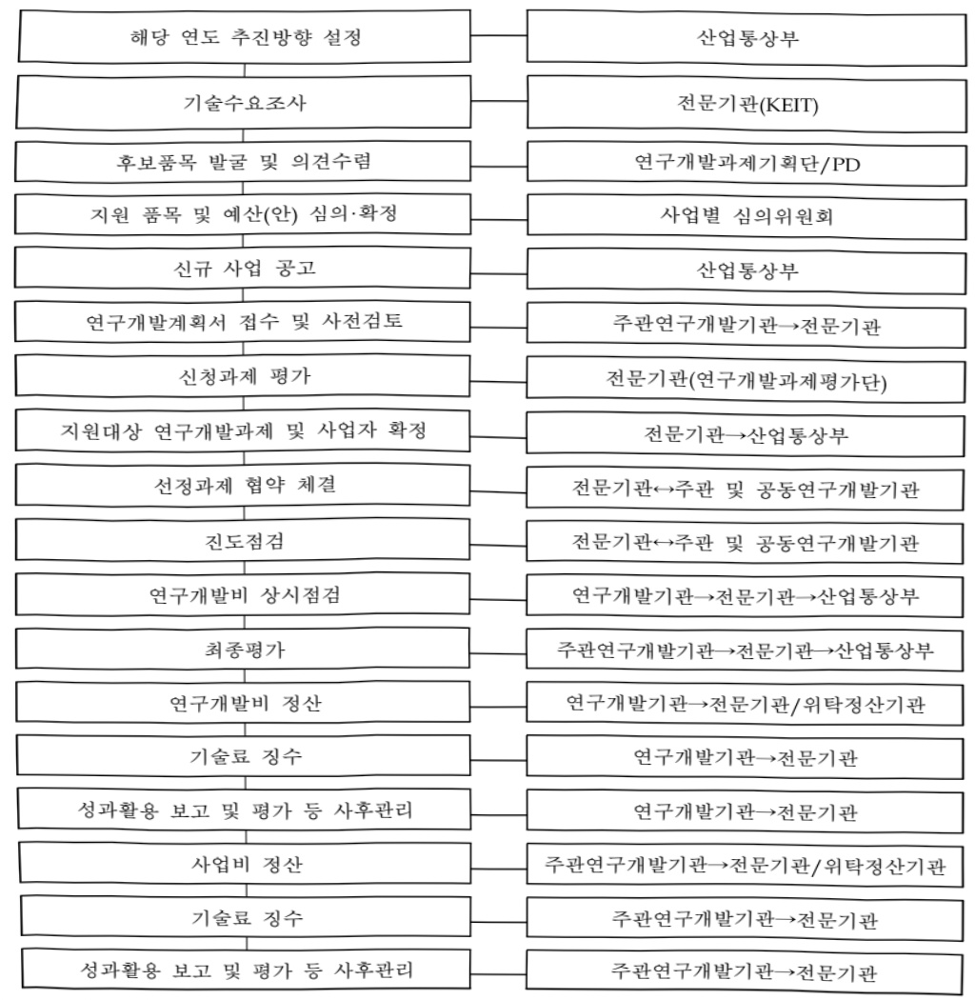

# 세라믹분야 스마트그린 제조혁신 지원사업(R&D)

**해당 페이지**: PDF 2823 ~ 2832 쪽 해당

**부처**: 기후에너지환경부
**분야**: 산업·중소기업 및 에너지
**회계유형**: 기금
**2026 확정예산**: 2052.0 백만원
**전년대비 증감률**: 66.4%
**AI 도메인**: 에너지, 제조/스마트팩토리, 디지털전환(AX)

---

### 가.지출계획 총괄표

(단위: 백만원, %)

<table border=1 style='margin: auto; word-wrap: break-word;'><tr><td rowspan="2">목명</td><td rowspan="2">2024년 결산</td><td colspan="2">2025년 계획</td><td colspan="2">2026년</td><td rowspan="2">중감(B-A)</td><td rowspan="2">(B-A)/A</td></tr><tr><td style='text-align: center; word-wrap: break-word;'>당초(A)</td><td style='text-align: center; word-wrap: break-word;'>수정</td><td style='text-align: center; word-wrap: break-word;'>정부안</td><td style='text-align: center; word-wrap: break-word;'>확정(B)</td></tr><tr><td style='text-align: center; word-wrap: break-word;'>세라믹분야 스마트그린 제조혁신 지원사업(R&amp;D)</td><td style='text-align: center; word-wrap: break-word;'>(1,233)</td><td style='text-align: center; word-wrap: break-word;'>1,233</td><td style='text-align: center; word-wrap: break-word;'>1,233</td><td style='text-align: center; word-wrap: break-word;'>2,052</td><td style='text-align: center; word-wrap: break-word;'>2,052</td><td style='text-align: center; word-wrap: break-word;'>819</td><td style='text-align: center; word-wrap: break-word;'>66.4</td></tr></table>

□ 기능별(내역사업별), 목별 계획 내역

(단위:백만원)

<table border=1 style='margin: auto; word-wrap: break-word;'><tr><td rowspan="3"></td><td colspan="5">2024</td><td colspan="8">2025</td><td rowspan="3">2026 계획</td></tr><tr><td rowspan="2">계획액(수정)</td><td rowspan="2">계획현액</td><td rowspan="2">집행액[실집행액]</td><td rowspan="2">아일액</td><td rowspan="2">불용액</td><td colspan="2">계획액</td><td rowspan="2">계획현액</td><td rowspan="2">집행액[실집행액]</td><td colspan="2">전년도 아일액제외</td><td rowspan="2">이월예상액</td><td rowspan="2">불용예상액</td></tr><tr><td style='text-align: center; word-wrap: break-word;'>당초</td><td style='text-align: center; word-wrap: break-word;'>수정</td><td style='text-align: center; word-wrap: break-word;'>계획현액</td><td style='text-align: center; word-wrap: break-word;'>집행액[실집행액]</td></tr><tr><td style='text-align: center; word-wrap: break-word;'>○ 기능별 분류(합계)</td><td style='text-align: center; word-wrap: break-word;'>1,233</td><td style='text-align: center; word-wrap: break-word;'>1,233</td><td style='text-align: center; word-wrap: break-word;'>1,233[1,233]</td><td style='text-align: center; word-wrap: break-word;'>-</td><td style='text-align: center; word-wrap: break-word;'>-</td><td style='text-align: center; word-wrap: break-word;'>1,233</td><td style='text-align: center; word-wrap: break-word;'>1,233</td><td style='text-align: center; word-wrap: break-word;'>1,233</td><td style='text-align: center; word-wrap: break-word;'>1,233[1,233]</td><td style='text-align: center; word-wrap: break-word;'>-</td><td style='text-align: center; word-wrap: break-word;'>-</td><td style='text-align: center; word-wrap: break-word;'>-</td><td style='text-align: center; word-wrap: break-word;'>-</td><td style='text-align: center; word-wrap: break-word;'>2,052</td></tr><tr><td style='text-align: center; word-wrap: break-word;'>· 세라믹분야스마트그린제조혁신지원</td><td style='text-align: center; word-wrap: break-word;'>1,233</td><td style='text-align: center; word-wrap: break-word;'>1,233</td><td style='text-align: center; word-wrap: break-word;'>1,233[1,233]</td><td style='text-align: center; word-wrap: break-word;'>-</td><td style='text-align: center; word-wrap: break-word;'>-</td><td style='text-align: center; word-wrap: break-word;'>1,233</td><td style='text-align: center; word-wrap: break-word;'>1,233</td><td style='text-align: center; word-wrap: break-word;'>1,233</td><td style='text-align: center; word-wrap: break-word;'>1,233[1,233]</td><td style='text-align: center; word-wrap: break-word;'>-</td><td style='text-align: center; word-wrap: break-word;'>-</td><td style='text-align: center; word-wrap: break-word;'>-</td><td style='text-align: center; word-wrap: break-word;'>-</td><td style='text-align: center; word-wrap: break-word;'>2,052</td></tr><tr><td style='text-align: center; word-wrap: break-word;'>○ 비목별 분류(합계)</td><td style='text-align: center; word-wrap: break-word;'>1,233</td><td style='text-align: center; word-wrap: break-word;'>1,233</td><td style='text-align: center; word-wrap: break-word;'>1,233[1,233]</td><td style='text-align: center; word-wrap: break-word;'>-</td><td style='text-align: center; word-wrap: break-word;'>-</td><td style='text-align: center; word-wrap: break-word;'>1,233</td><td style='text-align: center; word-wrap: break-word;'>1,233</td><td style='text-align: center; word-wrap: break-word;'>1,233</td><td style='text-align: center; word-wrap: break-word;'>1,233[1,233]</td><td style='text-align: center; word-wrap: break-word;'>-</td><td style='text-align: center; word-wrap: break-word;'>-</td><td style='text-align: center; word-wrap: break-word;'>-</td><td style='text-align: center; word-wrap: break-word;'>-</td><td style='text-align: center; word-wrap: break-word;'>2,052</td></tr><tr><td style='text-align: center; word-wrap: break-word;'>· 연구개발활동비등(360-05)</td><td style='text-align: center; word-wrap: break-word;'>1,233</td><td style='text-align: center; word-wrap: break-word;'>1,233</td><td style='text-align: center; word-wrap: break-word;'>1,233[1,233]</td><td style='text-align: center; word-wrap: break-word;'>-</td><td style='text-align: center; word-wrap: break-word;'>-</td><td style='text-align: center; word-wrap: break-word;'>1,233</td><td style='text-align: center; word-wrap: break-word;'>1,233</td><td style='text-align: center; word-wrap: break-word;'>1,233</td><td style='text-align: center; word-wrap: break-word;'>1,233[1,233]</td><td style='text-align: center; word-wrap: break-word;'>-</td><td style='text-align: center; word-wrap: break-word;'>-</td><td style='text-align: center; word-wrap: break-word;'>-</td><td style='text-align: center; word-wrap: break-word;'>-</td><td style='text-align: center; word-wrap: break-word;'>2,052</td></tr><tr><td style='text-align: center; word-wrap: break-word;'>○ 기능비목별 분류(합계)</td><td style='text-align: center; word-wrap: break-word;'>1,233</td><td style='text-align: center; word-wrap: break-word;'>1,233</td><td style='text-align: center; word-wrap: break-word;'>1,233[1,233]</td><td style='text-align: center; word-wrap: break-word;'>-</td><td style='text-align: center; word-wrap: break-word;'>-</td><td style='text-align: center; word-wrap: break-word;'>1,233</td><td style='text-align: center; word-wrap: break-word;'>1,233</td><td style='text-align: center; word-wrap: break-word;'>1,233</td><td style='text-align: center; word-wrap: break-word;'>1,233[1,233]</td><td style='text-align: center; word-wrap: break-word;'>-</td><td style='text-align: center; word-wrap: break-word;'>-</td><td style='text-align: center; word-wrap: break-word;'>-</td><td style='text-align: center; word-wrap: break-word;'>-</td><td style='text-align: center; word-wrap: break-word;'>2,052</td></tr><tr><td style='text-align: center; word-wrap: break-word;'>· 세라믹분야스마트그린제조혁신지원-연구개발활동비등(360-05)</td><td style='text-align: center; word-wrap: break-word;'>1,233</td><td style='text-align: center; word-wrap: break-word;'>1,233</td><td style='text-align: center; word-wrap: break-word;'>1,233[1,233]</td><td style='text-align: center; word-wrap: break-word;'>-</td><td style='text-align: center; word-wrap: break-word;'>-</td><td style='text-align: center; word-wrap: break-word;'>1,233</td><td style='text-align: center; word-wrap: break-word;'>1,233</td><td style='text-align: center; word-wrap: break-word;'>1,233</td><td style='text-align: center; word-wrap: break-word;'>1,233[1,233]</td><td style='text-align: center; word-wrap: break-word;'>-</td><td style='text-align: center; word-wrap: break-word;'>-</td><td style='text-align: center; word-wrap: break-word;'>-</td><td style='text-align: center; word-wrap: break-word;'>-</td><td style='text-align: center; word-wrap: break-word;'>2,052</td></tr></table>

---

### 나. 사업설명자료

## 1 ) 사업목적·내용

- (세라믹분야스마트그린제조혁신지원) 세라믹 산업 디지털전환 및 탄소중립 실현을 위한 제조 현장 적용 가능 세라믹 스마트 제조 플랫폼 개발, 스마트 제조 플랫폼 연계 세라믹 그린에너지 플랫폼 개발, 스마트 제조 플랫폼 활용 확대를 위한 비즈니스모델 개발 지원

(세라믹 스마트 제조 플랫폼 개발) 세라믹 공정 인프라 고도화를 통해,

세라믹 기업 제조 현장 적용이 가능한 지능화 플랫폼 개발

(세라믹 그린 에너지 플랫폼 개발) 공정 전력 에너지의 약 3~7% 절감이 가능한 지능형 FEMS(Factory Energy Management System) 개발 및 스마트 제조 플랫폼과의 연계를 통한 산업체 실증

(플랫폼 활용 비즈니스 모델 개발) 세라믹 제조분야 스마트그린 플랫폼

활용에 따른 민간 확산을 위한 신규 비즈니스모델 개발

## 2 ) 사업개요

## □ 사업근거 및 추진경위

① 법령상 근거 및 조항 적시

- 산업기술혁신촉진법, 기후위기 대응을 위한 탄소중립·녹색성장 기본법

○ 산업기술혁신촉진법 제11조(산업기술개발사업)

① 산업통상부장관은 혁신계획 및 시행계획을 효율적으로 수행하기 위하여 관계 중앙행정기관의 장과 협의하여 다음 각호의 산업기술분야에서 기술개발사업(산업기술개발을 위하여 필요한 기획 및 조사를 포함한다. 이하 "산업기술개발사업"이라 한다)을 추진할 수 있다.

1. 산업의 공통적인 기반이 되는 생산기반 기술, 부품·소재 및 장비·설비(플랜트를 포함한다) 기술

2.산업기술 분야의 미래 유망 기술

3. 산업의 고부가가치화를 위한 공정혁신, 청정생산 및 환경 설비 등에 관련된 기술 등

0 기후위기 대응을 위한 탄소중립·녹색성장 기본법 제55조(기업의 녹색경영 촉진 등)

기후위기 대응을 위한 탄소중립·녹색성책·그럼 제55조(기업의 녹색경영 촉진 :

정부는 기업이 경영활동에서 자원과 에너지를 절약하고 효율적으로 이용하며 온실가스 배출 및 환경

오염의 발생을 최소화하면서 사회적·윤리적 책임을 다하는 경영(이하 “녹색경영”이라 한다)을 할 수

있도록 지원·촉진하기 위하여 다음 각호의 사항을 포함하는 시책을 수립·시행하여야 한다.

1. 친환경 생산 체제로의 전환을 위한 기술지원

2. 기업의 온실가스 배출량, 온실가스 감축 실적 및 온실가스 감축 계획의 공개 등

---

② 추진경위

° (20.11.) 세라믹 제조혁신 얼라이언스 협약

* 23개 국내 대표 세라믹기업 포함 세라믹 제조혁신 플랫폼 개발, 구축 및 공동 활용을 위한 협약 체결

° (19~21) 세라믹 제조혁신 시범플랫폼 개발

* i-Ceramic 플랫폼 구축사업('19~'21, 156.5억원(국비 147억원), KICET, ETRI 등)

° (22.3.) 세라믹 제조혁신 스마트 그린 제조혁신 플랫폼 사업 기획 착수

*디지털 기술의 접목으로 주력산업의 생산성·부가가치 혁신

**산업 데이터 플랫폼 구축과 업종별 디지털연대의 확산으로 새로운 비즈니스모델 창출 등 산업의 부가가치를 향상

□주요내용

① 사업규모

- 총사업비 : 총 130억원(국고기준, 총사업비 대상 사업 아님)

- 사업기간 : 2023 ~ 2027(5년)

- 최근 5년 간 투입된 사업비

<table border=1 style='margin: auto; word-wrap: break-word;'><tr><td style='text-align: center; word-wrap: break-word;'>연도</td><td style='text-align: center; word-wrap: break-word;'>2022</td><td style='text-align: center; word-wrap: break-word;'>2023</td><td style='text-align: center; word-wrap: break-word;'>2024</td><td style='text-align: center; word-wrap: break-word;'>2025</td><td style='text-align: center; word-wrap: break-word;'>2026</td></tr><tr><td style='text-align: center; word-wrap: break-word;'>사업비</td><td style='text-align: center; word-wrap: break-word;'>-</td><td style='text-align: center; word-wrap: break-word;'>(2,000)</td><td style='text-align: center; word-wrap: break-word;'>(1,233)</td><td style='text-align: center; word-wrap: break-word;'>1,233</td><td style='text-align: center; word-wrap: break-word;'>2,052</td></tr></table>

- 기타 : 4개 과제(총괄 1개, 세부 3개)

② 사업추진체계

- 사업시행방법 : 출연

- 사업시행주체 : 한국산업기술기획평가원

- 사업 수혜자 : 기업, 대학, 연구소 등

- 보조, 융자, 출연, 출자 등의 경우 보조·융자 등 지원 비율 및 법적근거

<table border=1 style='margin: auto; word-wrap: break-word;'><tr><td style='text-align: center; word-wrap: break-word;'>내역사업명</td><td style='text-align: center; word-wrap: break-word;'>구분</td><td style='text-align: center; word-wrap: break-word;'>피보조·피출연 등 기관명</td><td style='text-align: center; word-wrap: break-word;'>지원 금액 (2026 계획)</td><td style='text-align: center; word-wrap: break-word;'>지원 비율(%)</td><td style='text-align: center; word-wrap: break-word;'>보조율 법적근거 (해당 조항)</td></tr><tr><td style='text-align: center; word-wrap: break-word;'>세라믹분야 스마트그린 제조혁신지원</td><td style='text-align: center; word-wrap: break-word;'>출연</td><td style='text-align: center; word-wrap: break-word;'>기업, 대학, 연구소 등</td><td style='text-align: center; word-wrap: break-word;'>2,052</td><td style='text-align: center; word-wrap: break-word;'>100</td><td style='text-align: center; word-wrap: break-word;'>산업기술혁신촉진법 제11조 (산업기술개발사업)</td></tr></table>

---

## 3 ) 2026년도 계획 산출 근거

①세라믹분야스마트그린제조혁신지원사업(R&D)

:(25)1,233백만원→(26)2,052백만원,819백만원 증액

- (계획) 스마트 제조 플랫폼 현장 적용을 위한 데이터 자동 수집 시스템 고도화 및 AI 기반 에너지 최적화 모델링 기술개발 지원을 위해 2,052백만원 필요

- (산출) 2,052백만원 = 4개 과제(계속) × 513백만원 × 12/12개월

°2025년도 예산 및 2026년도 예산 산출 세부내역 비교

<table border=1 style='margin: auto; word-wrap: break-word;'><tr><td colspan="2">2025년 예산</td><td colspan="2">2026년 예산</td></tr><tr><td style='text-align: center; word-wrap: break-word;'>예산</td><td style='text-align: center; word-wrap: break-word;'>산출내역</td><td style='text-align: center; word-wrap: break-word;'>예산</td><td style='text-align: center; word-wrap: break-word;'>산출내역</td></tr><tr><td style='text-align: center; word-wrap: break-word;'>1,233 백만원</td><td style='text-align: center; word-wrap: break-word;'>○ 세라믹분야스마트그린제조혁신지원사업(R&amp;D) 가. 계속과제 4개 지원 (1,233백만원) • 4개 과제 × 308.25백만원 × 12/12개월 = 1,233백만원</td><td style='text-align: center; word-wrap: break-word;'>2,052 백만원</td><td style='text-align: center; word-wrap: break-word;'>○ 세라믹분야스마트그린제조혁신지원사업(R&amp;D) 가. 계속과제 4개 지원 (2,052백만원) • 4개 과제 × 513백만원 × 12/12개월 = 2,052백만원</td></tr></table>

## 4 ) 사업효과

☐ 사업영향,산출물 성과지표 등

① 2022~2026년도 성과계획서 상 성과지표 및 최근 5년간 성과 달성도

<table border=1 style='margin: auto; word-wrap: break-word;'><tr><td style='text-align: center; word-wrap: break-word;'>성과지표</td><td style='text-align: center; word-wrap: break-word;'>구분</td><td style='text-align: center; word-wrap: break-word;'>2022</td><td style='text-align: center; word-wrap: break-word;'>2023</td><td style='text-align: center; word-wrap: break-word;'>2024</td><td style='text-align: center; word-wrap: break-word;'>2025</td><td style='text-align: center; word-wrap: break-word;'>2026</td><td style='text-align: center; word-wrap: break-word;'>2026 목표치산출근거</td><td style='text-align: center; word-wrap: break-word;'>측정산식(또는 측정방법)</td><td style='text-align: center; word-wrap: break-word;'>자료수집방법(또는 자료출처)</td></tr><tr><td rowspan="3">공정 데이터 수집 기술 진척도 (단위:%)</td><td style='text-align: center; word-wrap: break-word;'>목표</td><td style='text-align: center; word-wrap: break-word;'>-</td><td style='text-align: center; word-wrap: break-word;'>≥ 25</td><td style='text-align: center; word-wrap: break-word;'>≥ 40</td><td style='text-align: center; word-wrap: break-word;'>≥ 60</td><td style='text-align: center; word-wrap: break-word;'>-</td><td rowspan="3">현장 및 가상데이터 수집을 위한 모듈 및 시뮬레이터 개발 진척도</td><td rowspan="3">당해연도 현장 공정데이터 수집 모듈 개발 건수와 가상공정 데이터 수집 시뮬레이터 개발 건수를 합산하여, 최종 목표 개발 건수 대비 비율로 계산</td><td rowspan="3">연차보고서(실물 제시)</td></tr><tr><td style='text-align: center; word-wrap: break-word;'>실적</td><td style='text-align: center; word-wrap: break-word;'>-</td><td style='text-align: center; word-wrap: break-word;'>25</td><td style='text-align: center; word-wrap: break-word;'>65</td><td style='text-align: center; word-wrap: break-word;'>-</td><td style='text-align: center; word-wrap: break-word;'>-</td></tr><tr><td style='text-align: center; word-wrap: break-word;'>달성도</td><td style='text-align: center; word-wrap: break-word;'>-</td><td style='text-align: center; word-wrap: break-word;'>100</td><td style='text-align: center; word-wrap: break-word;'>100</td><td style='text-align: center; word-wrap: break-word;'>-</td><td style='text-align: center; word-wrap: break-word;'>-</td></tr><tr><td rowspan="3">품질/물성 예측 정확도 (단위:%)</td><td style='text-align: center; word-wrap: break-word;'>목표</td><td style='text-align: center; word-wrap: break-word;'>-</td><td style='text-align: center; word-wrap: break-word;'>≥ 60</td><td style='text-align: center; word-wrap: break-word;'>≥ 70</td><td style='text-align: center; word-wrap: break-word;'>≥ 80</td><td style='text-align: center; word-wrap: break-word;'>-</td><td rowspan="3">세계 최고수준인 미국(amazon)의 SageMake model의 80% 예측율을 근거로 목표지 설정</td><td rowspan="3">수요기업 서버에서 학습데이터셋 기반 품질/물성 예측 AI 모델 정확도 평가</td><td rowspan="3">연차보고서(공인성적서 등)</td></tr><tr><td style='text-align: center; word-wrap: break-word;'>실적</td><td style='text-align: center; word-wrap: break-word;'>-</td><td style='text-align: center; word-wrap: break-word;'>60</td><td style='text-align: center; word-wrap: break-word;'>70</td><td style='text-align: center; word-wrap: break-word;'>-</td><td style='text-align: center; word-wrap: break-word;'>-</td></tr><tr><td style='text-align: center; word-wrap: break-word;'>달성도</td><td style='text-align: center; word-wrap: break-word;'>-</td><td style='text-align: center; word-wrap: break-word;'>100</td><td style='text-align: center; word-wrap: break-word;'>100</td><td style='text-align: center; word-wrap: break-word;'>-</td><td style='text-align: center; word-wrap: break-word;'>-</td></tr><tr><td rowspan="3">SCI 논문 (mrnIF) (단위:점)</td><td style='text-align: center; word-wrap: break-word;'>목표</td><td style='text-align: center; word-wrap: break-word;'>-</td><td style='text-align: center; word-wrap: break-word;'>-</td><td style='text-align: center; word-wrap: break-word;'>75.0</td><td style='text-align: center; word-wrap: break-word;'>85.0</td><td style='text-align: center; word-wrap: break-word;'>-</td><td rowspan="3">유사 사업 및 전체 정부 R&amp;D mrnIF값 동사업 &#x27;20~&#x27;21년 SCI급 논문 mrnIF 실적치를 고려하여 목표치 설정</td><td rowspan="3">당해연도 말 SCI(E) 논문을 대상으로 JCR 분류에 따라 저널 Impact Factor 순위를 확인 후 표준화된 순위보정 영향력 지수를 산출</td><td rowspan="3">연차보고서(공인성적서 등)</td></tr><tr><td style='text-align: center; word-wrap: break-word;'>실적</td><td style='text-align: center; word-wrap: break-word;'>-</td><td style='text-align: center; word-wrap: break-word;'>-</td><td style='text-align: center; word-wrap: break-word;'>-</td><td style='text-align: center; word-wrap: break-word;'>-</td><td style='text-align: center; word-wrap: break-word;'>-</td></tr><tr><td style='text-align: center; word-wrap: break-word;'>달성도</td><td style='text-align: center; word-wrap: break-word;'>-</td><td style='text-align: center; word-wrap: break-word;'>-</td><td style='text-align: center; word-wrap: break-word;'>-</td><td style='text-align: center; word-wrap: break-word;'>-</td><td style='text-align: center; word-wrap: break-word;'>-</td></tr><tr><td style='text-align: center; word-wrap: break-word;'>특허</td><td style='text-align: center; word-wrap: break-word;'>목표</td><td style='text-align: center; word-wrap: break-word;'>-</td><td style='text-align: center; word-wrap: break-word;'>-</td><td style='text-align: center; word-wrap: break-word;'>-</td><td style='text-align: center; word-wrap: break-word;'>3.70</td><td style='text-align: center; word-wrap: break-word;'>-</td><td style='text-align: center; word-wrap: break-word;'>유사 사업*의</td><td style='text-align: center; word-wrap: break-word;'>당해연도 말 특허</td><td style='text-align: center; word-wrap: break-word;'>연차보고서</td></tr></table>

---

<table border=1 style='margin: auto; word-wrap: break-word;'><tr><td rowspan="2">(SMART)(단위:점)</td><td style='text-align: center; word-wrap: break-word;'>실적</td><td style='text-align: center; word-wrap: break-word;'>-</td><td style='text-align: center; word-wrap: break-word;'>-</td><td style='text-align: center; word-wrap: break-word;'>-</td><td style='text-align: center; word-wrap: break-word;'>-</td><td style='text-align: center; word-wrap: break-word;'>-</td><td rowspan="2">SMART 값을 기준으로 동사업 목표치 설정 *소재부품기술개발사업</td><td rowspan="2">등록 실적을 대상으로 SMART등급(한국발명 진흥화) 확인 후 측정</td><td rowspan="2">(공인성적서 등)</td></tr><tr><td style='text-align: center; word-wrap: break-word;'>달성도</td><td style='text-align: center; word-wrap: break-word;'>-</td><td style='text-align: center; word-wrap: break-word;'>-</td><td style='text-align: center; word-wrap: break-word;'>-</td><td style='text-align: center; word-wrap: break-word;'>-</td><td style='text-align: center; word-wrap: break-word;'>-</td></tr><tr><td rowspan="2">온실가스 감축량 (단위:tCO2eq/년)</td><td style='text-align: center; word-wrap: break-word;'>목표</td><td style='text-align: center; word-wrap: break-word;'>-</td><td style='text-align: center; word-wrap: break-word;'>-</td><td style='text-align: center; word-wrap: break-word;'>-</td><td style='text-align: center; word-wrap: break-word;'>-</td><td style='text-align: center; word-wrap: break-word;'>≥ 198</td><td rowspan="2">선진국(미국) 수준인 온실가스 감축량 5% 달성을 위하여, &#x27;26년까지 3%, &#x27;27년까지 5%의 온실가스감축 풀을 성과목표로 설정</td><td rowspan="2">산식(tCO2eq/년) = 사업장 수(개) × 세라믹 업계 평균 전력 사용량(kWh) × 전력 배출계 수 × 온실가스 감축율(%)</td><td rowspan="2">연차보고서 또는 최종보고서 (공인성적서 등)</td></tr><tr><td style='text-align: center; word-wrap: break-word;'>실적</td><td style='text-align: center; word-wrap: break-word;'>-</td><td style='text-align: center; word-wrap: break-word;'>-</td><td style='text-align: center; word-wrap: break-word;'>-</td><td style='text-align: center; word-wrap: break-word;'>-</td><td style='text-align: center; word-wrap: break-word;'>≥ 2</td></tr><tr><td style='text-align: center; word-wrap: break-word;'>세라믹 제조 지능화 시스템 확산·적용 기업 (단위:건)</td><td style='text-align: center; word-wrap: break-word;'>달성도</td><td style='text-align: center; word-wrap: break-word;'>-</td><td style='text-align: center; word-wrap: break-word;'>-</td><td style='text-align: center; word-wrap: break-word;'>-</td><td style='text-align: center; word-wrap: break-word;'>-</td><td style='text-align: center; word-wrap: break-word;'>-</td><td style='text-align: center; word-wrap: break-word;'>1공정 이상 스마트 그린 플랫폼 이적용되어, 품질 및 비용 개선 효과를 확인한 참여 및 확산기업 수</td><td style='text-align: center; word-wrap: break-word;'>제3자 입회 하에 참여/확산기업에서 제시한 품질 및 비용 개선 효과 자료를 확인하고, 이를 근거로 입회시험 보고서를 작성하여 공인시험 성적서를 대체함</td><td style='text-align: center; word-wrap: break-word;'>연차보고서 또는 최종보고서 (공인성적서 등)</td></tr><tr><td rowspan="3">품질향상율 (단위:%)</td><td style='text-align: center; word-wrap: break-word;'>목표</td><td style='text-align: center; word-wrap: break-word;'>-</td><td style='text-align: center; word-wrap: break-word;'>-</td><td style='text-align: center; word-wrap: break-word;'>-</td><td style='text-align: center; word-wrap: break-word;'>-</td><td style='text-align: center; word-wrap: break-word;'>≥ 5</td><td rowspan="3">AI 기술이 적용된 플랫폼을 이용하여, 수요기업 평가를 통해 품질향상율</td><td rowspan="3">AI 기술이 적용된 플랫폼을 적용 전 수요기업에서 생산되는 제품의 불량률과</td><td rowspan="3">연차보고서 또는 최종보고서 (공인성적서 등)</td></tr><tr><td style='text-align: center; word-wrap: break-word;'>실적</td><td style='text-align: center; word-wrap: break-word;'>-</td><td style='text-align: center; word-wrap: break-word;'>-</td><td style='text-align: center; word-wrap: break-word;'>-</td><td style='text-align: center; word-wrap: break-word;'>-</td><td style='text-align: center; word-wrap: break-word;'>-</td></tr><tr><td style='text-align: center; word-wrap: break-word;'>달성도</td><td style='text-align: center; word-wrap: break-word;'>-</td><td style='text-align: center; word-wrap: break-word;'>-</td><td style='text-align: center; word-wrap: break-word;'>-</td><td style='text-align: center; word-wrap: break-word;'>-</td><td style='text-align: center; word-wrap: break-word;'>-</td></tr></table>

---

<table border=1 style='margin: auto; word-wrap: break-word;'><tr><td style='text-align: center; word-wrap: break-word;'></td><td style='text-align: center; word-wrap: break-word;'></td><td style='text-align: center; word-wrap: break-word;'></td><td style='text-align: center; word-wrap: break-word;'></td><td style='text-align: center; word-wrap: break-word;'></td><td style='text-align: center; word-wrap: break-word;'></td><td style='text-align: center; word-wrap: break-word;'></td><td style='text-align: center; word-wrap: break-word;'>평가</td><td style='text-align: center; word-wrap: break-word;'>플랫폼 적용 후 불량률을 비교하여 평가함</td></tr></table>

② 성과지표 이외의 연도별 사업추진 경과 및 실적

<table border=1 style='margin: auto; word-wrap: break-word;'><tr><td style='text-align: center; word-wrap: break-word;'>2022</td><td style='text-align: center; word-wrap: break-word;'>○ ‘23년 신규사업으로 해당사항 없음</td></tr><tr><td style='text-align: center; word-wrap: break-word;'>2023</td><td style='text-align: center; word-wrap: break-word;'>○ 신규과제 4개 선정(협약) 및 개발 등 총 2,000백만원 지원</td></tr><tr><td style='text-align: center; word-wrap: break-word;'>2024</td><td style='text-align: center; word-wrap: break-word;'>○ 계속과제 4개 개발을 위한 1,233백만원 지원</td></tr><tr><td style='text-align: center; word-wrap: break-word;'>2025</td><td style='text-align: center; word-wrap: break-word;'>○ 계속과제 4개 개발을 위한 1,233백만원 지원</td></tr></table>

③ 향후(2026년도 이후) 기대효과 : 소결로 공정 등을 보유한 에너지 다소비 사업장인 세라믹 제조업체에 AI 기반 지능형 FEMS 플랫폼 적용을 통해 온실가스 감축('30년 약 1,650톤, '50년 11,000톤 감축')에 기여

5) 타당성조사 및 예비타당성조사 시행여부 및 결과 요지 : 해당없음

6) 총사업비 대상사업 여부 및 내역 : 해당없음

---

## 7 ) 사업 집행절차

-세라믹분야스마트그린제조혁신지원사업(R&D)

<table border=1 style='margin: auto; word-wrap: break-word;'><tr><td style='text-align: center; word-wrap: break-word;'>부처</td><td style='text-align: center; word-wrap: break-word;'></td><td style='text-align: center; word-wrap: break-word;'>피출연·피보조기관</td><td style='text-align: center; word-wrap: break-word;'></td><td style='text-align: center; word-wrap: break-word;'>간접보조사업자·사업수행자</td></tr><tr><td style='text-align: center; word-wrap: break-word;'>산업통상부(2,052백만원)</td><td style='text-align: center; word-wrap: break-word;'>=&gt;(2,052백만원)</td><td style='text-align: center; word-wrap: break-word;'>한국산업기술기획평가원(-)</td><td style='text-align: center; word-wrap: break-word;'>=&gt;(2,052백만원)</td><td style='text-align: center; word-wrap: break-word;'>기업, 대학, 연구소 등</td></tr></table>

---

## 8 ) 중기재정계획 상 연도별 투자계획 및 추진경과

(단위: 백만원)

<table border=1 style='margin: auto; word-wrap: break-word;'><tr><td style='text-align: center; word-wrap: break-word;'>중기 재정계획</td><td style='text-align: center; word-wrap: break-word;'>2024</td><td style='text-align: center; word-wrap: break-word;'>2025</td><td style='text-align: center; word-wrap: break-word;'>2026</td><td style='text-align: center; word-wrap: break-word;'>2027</td><td style='text-align: center; word-wrap: break-word;'>2028</td><td style='text-align: center; word-wrap: break-word;'>2029</td></tr><tr><td style='text-align: center; word-wrap: break-word;'>2024~2028</td><td style='text-align: center; word-wrap: break-word;'>(1,233)</td><td style='text-align: center; word-wrap: break-word;'>1,233</td><td style='text-align: center; word-wrap: break-word;'>2,052</td><td style='text-align: center; word-wrap: break-word;'>1,233</td><td style='text-align: center; word-wrap: break-word;'>1,233</td><td style='text-align: center; word-wrap: break-word;'></td></tr><tr><td style='text-align: center; word-wrap: break-word;'>2025~2029</td><td style='text-align: center; word-wrap: break-word;'></td><td style='text-align: center; word-wrap: break-word;'>1,233</td><td style='text-align: center; word-wrap: break-word;'>2,052</td><td style='text-align: center; word-wrap: break-word;'>2,524</td><td style='text-align: center; word-wrap: break-word;'>-</td><td style='text-align: center; word-wrap: break-word;'>-</td></tr></table>

9) 최근 3년간 동 사업에 대한 주요 외부지적사항 및 평가, 문제점 및 대책 : 해당없음

10) 향후 추진방향 및 추진계획

<table border=1 style='margin: auto; word-wrap: break-word;'><tr><td style='text-align: center; word-wrap: break-word;'>- 세라믹 제조 주요 공정(볼밀, 분무·건조, 프레스·성형, 소결)별 현장 빅데이터 수집 및 분석에 따른 AI 및 디지털트윈 기반 세라믹 그린에너지 플랫폼 기술개발 고도화를 위한 공정 및 설비별 에너지 최적화 알고리즘 개발 지원</td></tr></table>

11) 해당사업에 대한 각종 사업평가의 결과 : 해당없음

12) 해당사업에 대한 부처 자체평가의 결과 : 해당없음

13) 부처 건의사항 : 해당없음

---

### 다. 최근 4년간 결산내역

## 1 ) 결산표

☐ 부처 결산내역

(단위: 백만원, %)

<table border=1 style='margin: auto; word-wrap: break-word;'><tr><td rowspan="2">연도</td><td colspan="3">계획액</td><td rowspan="2">전년도 이월액</td><td rowspan="2">계획 현액(B)</td><td rowspan="2">집행액(C)</td><td rowspan="2">집행률(C/A)</td><td rowspan="2">집행률(C/B)</td><td rowspan="2">다음연도 이월액</td><td rowspan="2">불용액</td></tr><tr><td style='text-align: center; word-wrap: break-word;'>당초</td><td style='text-align: center; word-wrap: break-word;'>증감액</td><td style='text-align: center; word-wrap: break-word;'>수정(A)</td></tr><tr><td style='text-align: center; word-wrap: break-word;'>2022</td><td style='text-align: center; word-wrap: break-word;'>-</td><td style='text-align: center; word-wrap: break-word;'>-</td><td style='text-align: center; word-wrap: break-word;'>-</td><td style='text-align: center; word-wrap: break-word;'>-</td><td style='text-align: center; word-wrap: break-word;'>-</td><td style='text-align: center; word-wrap: break-word;'>-</td><td style='text-align: center; word-wrap: break-word;'>-</td><td style='text-align: center; word-wrap: break-word;'>-</td><td style='text-align: center; word-wrap: break-word;'>-</td><td style='text-align: center; word-wrap: break-word;'>-</td></tr><tr><td style='text-align: center; word-wrap: break-word;'>2023</td><td style='text-align: center; word-wrap: break-word;'>(2,000)</td><td style='text-align: center; word-wrap: break-word;'>-</td><td style='text-align: center; word-wrap: break-word;'>2,000</td><td style='text-align: center; word-wrap: break-word;'>-</td><td style='text-align: center; word-wrap: break-word;'>2,000</td><td style='text-align: center; word-wrap: break-word;'>2,000</td><td style='text-align: center; word-wrap: break-word;'>100.0</td><td style='text-align: center; word-wrap: break-word;'>100.0</td><td style='text-align: center; word-wrap: break-word;'>-</td><td style='text-align: center; word-wrap: break-word;'>-</td></tr><tr><td style='text-align: center; word-wrap: break-word;'>2024</td><td style='text-align: center; word-wrap: break-word;'>(1,233)</td><td style='text-align: center; word-wrap: break-word;'>-</td><td style='text-align: center; word-wrap: break-word;'>1,233</td><td style='text-align: center; word-wrap: break-word;'>-</td><td style='text-align: center; word-wrap: break-word;'>1,233</td><td style='text-align: center; word-wrap: break-word;'>1,233</td><td style='text-align: center; word-wrap: break-word;'>100.0</td><td style='text-align: center; word-wrap: break-word;'>100.0</td><td style='text-align: center; word-wrap: break-word;'>-</td><td style='text-align: center; word-wrap: break-word;'>-</td></tr><tr><td style='text-align: center; word-wrap: break-word;'>2025</td><td style='text-align: center; word-wrap: break-word;'>1,233</td><td style='text-align: center; word-wrap: break-word;'>-</td><td style='text-align: center; word-wrap: break-word;'>1,233</td><td style='text-align: center; word-wrap: break-word;'>-</td><td style='text-align: center; word-wrap: break-word;'>1,233</td><td style='text-align: center; word-wrap: break-word;'>1,233</td><td style='text-align: center; word-wrap: break-word;'>100.0</td><td style='text-align: center; word-wrap: break-word;'>100.0</td><td style='text-align: center; word-wrap: break-word;'>-</td><td style='text-align: center; word-wrap: break-word;'>-</td></tr></table>

□ 출연·보조사업 등 실집행내역

(단위: 백만원, %)

<table border=1 style='margin: auto; word-wrap: break-word;'><tr><td rowspan="2">구분</td><td colspan="3">부처</td><td colspan="6">사업시행주체(피출연·피보조 기관 등)</td></tr><tr><td colspan="2">계획액</td><td style='text-align: center; word-wrap: break-word;'>집행액</td><td style='text-align: center; word-wrap: break-word;'>교부액</td><td style='text-align: center; word-wrap: break-word;'>전년도 이월액</td><td style='text-align: center; word-wrap: break-word;'>교부 현액</td><td style='text-align: center; word-wrap: break-word;'>집행액 (B)</td><td style='text-align: center; word-wrap: break-word;'>이월액</td><td style='text-align: center; word-wrap: break-word;'>불용액 (B/A)</td></tr><tr><td style='text-align: center; word-wrap: break-word;'>2022</td><td style='text-align: center; word-wrap: break-word;'>-</td><td style='text-align: center; word-wrap: break-word;'>-</td><td style='text-align: center; word-wrap: break-word;'>-</td><td style='text-align: center; word-wrap: break-word;'>-</td><td style='text-align: center; word-wrap: break-word;'>-</td><td style='text-align: center; word-wrap: break-word;'>-</td><td style='text-align: center; word-wrap: break-word;'>-</td><td style='text-align: center; word-wrap: break-word;'>-</td><td style='text-align: center; word-wrap: break-word;'>-</td></tr><tr><td style='text-align: center; word-wrap: break-word;'>2023</td><td style='text-align: center; word-wrap: break-word;'>(2,000)</td><td style='text-align: center; word-wrap: break-word;'>2,000</td><td style='text-align: center; word-wrap: break-word;'>2,000</td><td style='text-align: center; word-wrap: break-word;'>2,000</td><td style='text-align: center; word-wrap: break-word;'>-</td><td style='text-align: center; word-wrap: break-word;'>2,000</td><td style='text-align: center; word-wrap: break-word;'>2,000</td><td style='text-align: center; word-wrap: break-word;'>-</td><td style='text-align: center; word-wrap: break-word;'>-</td></tr><tr><td style='text-align: center; word-wrap: break-word;'>2024</td><td style='text-align: center; word-wrap: break-word;'>(1,233)</td><td style='text-align: center; word-wrap: break-word;'>1,233</td><td style='text-align: center; word-wrap: break-word;'>1,233</td><td style='text-align: center; word-wrap: break-word;'>1,233</td><td style='text-align: center; word-wrap: break-word;'>-</td><td style='text-align: center; word-wrap: break-word;'>1,233</td><td style='text-align: center; word-wrap: break-word;'>1,233</td><td style='text-align: center; word-wrap: break-word;'>-</td><td style='text-align: center; word-wrap: break-word;'>-</td></tr><tr><td style='text-align: center; word-wrap: break-word;'>2025</td><td style='text-align: center; word-wrap: break-word;'>1,233</td><td style='text-align: center; word-wrap: break-word;'>1,233</td><td style='text-align: center; word-wrap: break-word;'>1,233</td><td style='text-align: center; word-wrap: break-word;'>1,233</td><td style='text-align: center; word-wrap: break-word;'>-</td><td style='text-align: center; word-wrap: break-word;'>1,233</td><td style='text-align: center; word-wrap: break-word;'>1,233</td><td style='text-align: center; word-wrap: break-word;'>-</td><td style='text-align: center; word-wrap: break-word;'>-</td></tr></table>

## 2 ) 주요 결산사항

2022~2025년 결산사항 : 특이사항 없음

2025년 계획변경 세부내역 : 해당없음

---

<table border=1 style='margin: auto; word-wrap: break-word;'><tr><td style='text-align: center; word-wrap: break-word;'>사 업 명</td></tr><tr><td style='text-align: center; word-wrap: break-word;'>(16) 수문조사시설 설치 및 개선(5134-302)</td></tr></table>

사업 코드 정보

<table border=1 style='margin: auto; word-wrap: break-word;'><tr><td style='text-align: center; word-wrap: break-word;'>구분</td><td style='text-align: center; word-wrap: break-word;'>회계</td><td style='text-align: center; word-wrap: break-word;'>소관</td><td style='text-align: center; word-wrap: break-word;'>실국(기관)</td><td style='text-align: center; word-wrap: break-word;'>계정</td><td style='text-align: center; word-wrap: break-word;'>분야</td><td style='text-align: center; word-wrap: break-word;'>부문</td></tr><tr><td style='text-align: center; word-wrap: break-word;'>코드</td><td style='text-align: center; word-wrap: break-word;'>11</td><td style='text-align: center; word-wrap: break-word;'>24</td><td style='text-align: center; word-wrap: break-word;'>물관리정책실</td><td rowspan="2"></td><td style='text-align: center; word-wrap: break-word;'>140</td><td style='text-align: center; word-wrap: break-word;'>141</td></tr><tr><td style='text-align: center; word-wrap: break-word;'>명칭</td><td style='text-align: center; word-wrap: break-word;'>일반회계</td><td style='text-align: center; word-wrap: break-word;'>환경부</td><td style='text-align: center; word-wrap: break-word;'>수자원정책관</td><td style='text-align: center; word-wrap: break-word;'>국토및지역개발</td><td style='text-align: center; word-wrap: break-word;'>수자원</td></tr></table>

<table border=1 style='margin: auto; word-wrap: break-word;'><tr><td style='text-align: center; word-wrap: break-word;'>구분</td><td style='text-align: center; word-wrap: break-word;'>프로그램</td><td style='text-align: center; word-wrap: break-word;'>단위사업</td><td style='text-align: center; word-wrap: break-word;'>세부사업</td></tr><tr><td style='text-align: center; word-wrap: break-word;'>코드</td><td style='text-align: center; word-wrap: break-word;'>5100</td><td style='text-align: center; word-wrap: break-word;'>5134</td><td style='text-align: center; word-wrap: break-word;'>302</td></tr><tr><td style='text-align: center; word-wrap: break-word;'>명칭</td><td style='text-align: center; word-wrap: break-word;'>수자원정책 및 홍수관리</td><td style='text-align: center; word-wrap: break-word;'>수문조사 및 시설운영</td><td style='text-align: center; word-wrap: break-word;'>수문조사시설 설치 및 개선</td></tr></table>

□ 사업 성격 (공통요구자료 Ⅱ-1 작성유의사항 4. 참조, 해당하는 사항에 “O” 표시)

<table border=1 style='margin: auto; word-wrap: break-word;'><tr><td rowspan="2">신규</td><td rowspan="2">계속</td><td rowspan="2">완료</td><td rowspan="2">예비타당성 실시여부</td><td rowspan="2">총사업비 관리대상</td><td rowspan="2">총액계상 예산사업</td><td style='text-align: center; word-wrap: break-word;'>사업소관 변경정보</td></tr><tr><td style='text-align: center; word-wrap: break-word;'>2025예산 시 소관</td></tr><tr><td style='text-align: center; word-wrap: break-word;'></td><td style='text-align: center; word-wrap: break-word;'>○</td><td style='text-align: center; word-wrap: break-word;'></td><td style='text-align: center; word-wrap: break-word;'></td><td style='text-align: center; word-wrap: break-word;'></td><td style='text-align: center; word-wrap: break-word;'></td><td style='text-align: center; word-wrap: break-word;'></td></tr></table>

☐ 사업 지원 형태 및 지원을 (최소한 한 개는 반드시 선택하시오. 해당사항에 0 표시)

<table border=1 style='margin: auto; word-wrap: break-word;'><tr><td style='text-align: center; word-wrap: break-word;'>직접</td><td style='text-align: center; word-wrap: break-word;'>출자</td><td style='text-align: center; word-wrap: break-word;'>출연</td><td style='text-align: center; word-wrap: break-word;'>보조</td><td style='text-align: center; word-wrap: break-word;'>융자</td><td style='text-align: center; word-wrap: break-word;'>국고보조율(%)</td><td style='text-align: center; word-wrap: break-word;'>융자율(%)</td></tr><tr><td style='text-align: center; word-wrap: break-word;'>○</td><td style='text-align: center; word-wrap: break-word;'></td><td style='text-align: center; word-wrap: break-word;'></td><td style='text-align: center; word-wrap: break-word;'></td><td style='text-align: center; word-wrap: break-word;'></td><td style='text-align: center; word-wrap: break-word;'></td><td style='text-align: center; word-wrap: break-word;'></td></tr></table>

## □ 사업 담당자

<table border=1 style='margin: auto; word-wrap: break-word;'><tr><td style='text-align: center; word-wrap: break-word;'>사업명</td><td colspan="2">구분</td></tr><tr><td rowspan="4">수문조사시설 설치 및 개선</td><td rowspan="2">소관부처</td><td style='text-align: center; word-wrap: break-word;'>물관리정책실 수자원정책관</td></tr><tr><td style='text-align: center; word-wrap: break-word;'>물재해대응과</td></tr><tr><td rowspan="2">사업시행주체</td><td style='text-align: center; word-wrap: break-word;'>홍수통제소</td></tr><tr><td style='text-align: center; word-wrap: break-word;'>한국수자원공사</td></tr></table>

---

### 원본 PDF 크롭 이미지

