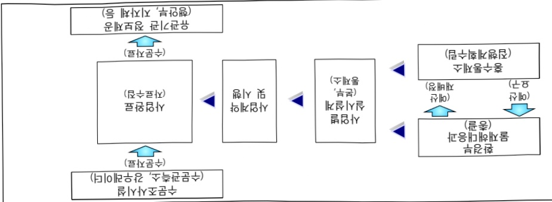

# 수문조사시설 설치 및 개선

**해당 페이지**: PDF 2833 ~ 2844 쪽 해당

**부처**: 기후에너지환경부
**분야**: 국토 및 지역개발
**회계유형**: 일반회계
**2026 확정예산**: 97350.0 백만원
**전년대비 증감률**: 4.1%
**AI 도메인**: 데이터

---

<table border=1 style='margin: auto; word-wrap: break-word;'><tr><td style='text-align: center; word-wrap: break-word;'>사 업 명</td></tr><tr><td style='text-align: center; word-wrap: break-word;'>(16) 수문조사시설 설치 및 개선(5134-302)</td></tr></table>

사업 코드 정보

<table border=1 style='margin: auto; word-wrap: break-word;'><tr><td style='text-align: center; word-wrap: break-word;'>구분</td><td style='text-align: center; word-wrap: break-word;'>회계</td><td style='text-align: center; word-wrap: break-word;'>소관</td><td style='text-align: center; word-wrap: break-word;'>실국(기관)</td><td style='text-align: center; word-wrap: break-word;'>계정</td><td style='text-align: center; word-wrap: break-word;'>분야</td><td style='text-align: center; word-wrap: break-word;'>부문</td></tr><tr><td style='text-align: center; word-wrap: break-word;'>코드</td><td style='text-align: center; word-wrap: break-word;'>11</td><td style='text-align: center; word-wrap: break-word;'>24</td><td style='text-align: center; word-wrap: break-word;'>물관리정책실</td><td rowspan="2"></td><td style='text-align: center; word-wrap: break-word;'>140</td><td style='text-align: center; word-wrap: break-word;'>141</td></tr><tr><td style='text-align: center; word-wrap: break-word;'>명칭</td><td style='text-align: center; word-wrap: break-word;'>일반회계</td><td style='text-align: center; word-wrap: break-word;'>환경부</td><td style='text-align: center; word-wrap: break-word;'>수자원정책관</td><td style='text-align: center; word-wrap: break-word;'>국토및지역개발</td><td style='text-align: center; word-wrap: break-word;'>수자원</td></tr></table>

<table border=1 style='margin: auto; word-wrap: break-word;'><tr><td style='text-align: center; word-wrap: break-word;'>구분</td><td style='text-align: center; word-wrap: break-word;'>프로그램</td><td style='text-align: center; word-wrap: break-word;'>단위사업</td><td style='text-align: center; word-wrap: break-word;'>세부사업</td></tr><tr><td style='text-align: center; word-wrap: break-word;'>코드</td><td style='text-align: center; word-wrap: break-word;'>5100</td><td style='text-align: center; word-wrap: break-word;'>5134</td><td style='text-align: center; word-wrap: break-word;'>302</td></tr><tr><td style='text-align: center; word-wrap: break-word;'>명칭</td><td style='text-align: center; word-wrap: break-word;'>수자원정책 및 홍수관리</td><td style='text-align: center; word-wrap: break-word;'>수문조사 및 시설운영</td><td style='text-align: center; word-wrap: break-word;'>수문조사시설 설치 및 개선</td></tr></table>

□ 사업 성격 (공통요구자료 Ⅱ-1 작성유의사항 4. 참조, 해당하는 사항에 “O” 표시)

<table border=1 style='margin: auto; word-wrap: break-word;'><tr><td rowspan="2">신규</td><td rowspan="2">계속</td><td rowspan="2">완료</td><td rowspan="2">예비타당성 실시여부</td><td rowspan="2">총사업비 관리대상</td><td rowspan="2">총액계상 예산사업</td><td style='text-align: center; word-wrap: break-word;'>사업소관 변경정보</td></tr><tr><td style='text-align: center; word-wrap: break-word;'>2025예산 시 소관</td></tr><tr><td style='text-align: center; word-wrap: break-word;'></td><td style='text-align: center; word-wrap: break-word;'>○</td><td style='text-align: center; word-wrap: break-word;'></td><td style='text-align: center; word-wrap: break-word;'></td><td style='text-align: center; word-wrap: break-word;'></td><td style='text-align: center; word-wrap: break-word;'></td><td style='text-align: center; word-wrap: break-word;'></td></tr></table>

☐ 사업 지원 형태 및 지원을 (최소한 한 개는 반드시 선택하시오. 해당사항에 0 표시)

<table border=1 style='margin: auto; word-wrap: break-word;'><tr><td style='text-align: center; word-wrap: break-word;'>직접</td><td style='text-align: center; word-wrap: break-word;'>출자</td><td style='text-align: center; word-wrap: break-word;'>출연</td><td style='text-align: center; word-wrap: break-word;'>보조</td><td style='text-align: center; word-wrap: break-word;'>융자</td><td style='text-align: center; word-wrap: break-word;'>국고보조율(%)</td><td style='text-align: center; word-wrap: break-word;'>융자율(%)</td></tr><tr><td style='text-align: center; word-wrap: break-word;'>○</td><td style='text-align: center; word-wrap: break-word;'></td><td style='text-align: center; word-wrap: break-word;'></td><td style='text-align: center; word-wrap: break-word;'></td><td style='text-align: center; word-wrap: break-word;'></td><td style='text-align: center; word-wrap: break-word;'></td><td style='text-align: center; word-wrap: break-word;'></td></tr></table>

## □ 사업 담당자

<table border=1 style='margin: auto; word-wrap: break-word;'><tr><td style='text-align: center; word-wrap: break-word;'>사업명</td><td colspan="2">구분</td></tr><tr><td rowspan="4">수문조사시설 설치 및 개선</td><td rowspan="2">소관부처</td><td style='text-align: center; word-wrap: break-word;'>물관리정책실 수자원정책관</td></tr><tr><td style='text-align: center; word-wrap: break-word;'>물재해대응과</td></tr><tr><td rowspan="2">사업시행주체</td><td style='text-align: center; word-wrap: break-word;'>홍수통제소</td></tr><tr><td style='text-align: center; word-wrap: break-word;'>한국수자원공사</td></tr></table>

---

### 가. 예산 총괄표

(단위:백만원,%)

<table border=1 style='margin: auto; word-wrap: break-word;'><tr><td rowspan="2">사업명</td><td rowspan="2">2024년 결산</td><td colspan="2">2025년 예산</td><td colspan="2">2026년</td><td rowspan="2">증감 (B-A)</td><td rowspan="2">(B-A)/A</td></tr><tr><td style='text-align: center; word-wrap: break-word;'>본예산(A)</td><td style='text-align: center; word-wrap: break-word;'>추경</td><td style='text-align: center; word-wrap: break-word;'>정부안</td><td style='text-align: center; word-wrap: break-word;'>확정(B)</td></tr><tr><td style='text-align: center; word-wrap: break-word;'>수문조사시설 설치 및 개선</td><td style='text-align: center; word-wrap: break-word;'>154,657</td><td style='text-align: center; word-wrap: break-word;'>93,484</td><td style='text-align: center; word-wrap: break-word;'>15,000</td><td style='text-align: center; word-wrap: break-word;'>97,350</td><td style='text-align: center; word-wrap: break-word;'>97,350</td><td style='text-align: center; word-wrap: break-word;'>3,866</td><td style='text-align: center; word-wrap: break-word;'>4.13</td></tr></table>

□ 기능별(내역사업별), 목별 예산 내역

(단위:백만원)

<table border=1 style='margin: auto; word-wrap: break-word;'><tr><td rowspan="2"></td><td colspan="5">2024</td><td colspan="7">2025</td><td rowspan="2">2026예산</td></tr><tr><td style='text-align: center; word-wrap: break-word;'>예산액(추경)</td><td style='text-align: center; word-wrap: break-word;'>예산현액</td><td style='text-align: center; word-wrap: break-word;'>집행액(집행액)</td><td style='text-align: center; word-wrap: break-word;'>이율액</td><td style='text-align: center; word-wrap: break-word;'>불용액</td><td style='text-align: center; word-wrap: break-word;'>본예산</td><td style='text-align: center; word-wrap: break-word;'>예산현액</td><td style='text-align: center; word-wrap: break-word;'>집행액[실집행액]</td><td style='text-align: center; word-wrap: break-word;'>전념도액액제거</td><td style='text-align: center; word-wrap: break-word;'>이율액예상액</td><td style='text-align: center; word-wrap: break-word;'>불용예상액</td><td style='text-align: center; word-wrap: break-word;'></td></tr><tr><td style='text-align: center; word-wrap: break-word;'>○ 기능별 분류(합계)</td><td style='text-align: center; word-wrap: break-word;'>154,657</td><td style='text-align: center; word-wrap: break-word;'>157,772</td><td style='text-align: center; word-wrap: break-word;'>145,694[145,694]</td><td style='text-align: center; word-wrap: break-word;'>1,452</td><td style='text-align: center; word-wrap: break-word;'>10,625</td><td style='text-align: center; word-wrap: break-word;'>108,504</td><td style='text-align: center; word-wrap: break-word;'>109,935</td><td style='text-align: center; word-wrap: break-word;'>103,149[102,112]</td><td style='text-align: center; word-wrap: break-word;'>108,484</td><td style='text-align: center; word-wrap: break-word;'>101,729[100,692]</td><td style='text-align: center; word-wrap: break-word;'>3,519</td><td style='text-align: center; word-wrap: break-word;'>4,304</td><td style='text-align: center; word-wrap: break-word;'>97,350</td></tr><tr><td style='text-align: center; word-wrap: break-word;'>·수문조사철 운영 및 개선</td><td style='text-align: center; word-wrap: break-word;'>49,632</td><td style='text-align: center; word-wrap: break-word;'>50,743</td><td style='text-align: center; word-wrap: break-word;'>46,741[46,741]</td><td style='text-align: center; word-wrap: break-word;'>354</td><td style='text-align: center; word-wrap: break-word;'>3,649</td><td style='text-align: center; word-wrap: break-word;'>4,463</td><td style='text-align: center; word-wrap: break-word;'>54,796</td><td style='text-align: center; word-wrap: break-word;'>51,875[51,875]</td><td style='text-align: center; word-wrap: break-word;'>54,444</td><td style='text-align: center; word-wrap: break-word;'>51,598[51,598]</td><td style='text-align: center; word-wrap: break-word;'>752</td><td style='text-align: center; word-wrap: break-word;'>2,169</td><td style='text-align: center; word-wrap: break-word;'>56,480</td></tr><tr><td style='text-align: center; word-wrap: break-word;'>·강우레이더구축</td><td style='text-align: center; word-wrap: break-word;'>11,688</td><td style='text-align: center; word-wrap: break-word;'>13,043</td><td style='text-align: center; word-wrap: break-word;'>11,908[11,908]</td><td style='text-align: center; word-wrap: break-word;'>794</td><td style='text-align: center; word-wrap: break-word;'>341</td><td style='text-align: center; word-wrap: break-word;'>14,396</td><td style='text-align: center; word-wrap: break-word;'>15,190</td><td style='text-align: center; word-wrap: break-word;'>13,080[13,080]</td><td style='text-align: center; word-wrap: break-word;'>14,396</td><td style='text-align: center; word-wrap: break-word;'>12,314[12,314]</td><td style='text-align: center; word-wrap: break-word;'>1,647</td><td style='text-align: center; word-wrap: break-word;'>463</td><td style='text-align: center; word-wrap: break-word;'>9,396</td></tr><tr><td style='text-align: center; word-wrap: break-word;'>·AI홍수예보 시설 구축</td><td style='text-align: center; word-wrap: break-word;'>81,848</td><td style='text-align: center; word-wrap: break-word;'>82,498</td><td style='text-align: center; word-wrap: break-word;'>75,557[75,557]</td><td style='text-align: center; word-wrap: break-word;'>304</td><td style='text-align: center; word-wrap: break-word;'>6,635</td><td style='text-align: center; word-wrap: break-word;'>24,479</td><td style='text-align: center; word-wrap: break-word;'>24,783</td><td style='text-align: center; word-wrap: break-word;'>23,028[23,028]</td><td style='text-align: center; word-wrap: break-word;'>24,478</td><td style='text-align: center; word-wrap: break-word;'>22,651[22,651]</td><td style='text-align: center; word-wrap: break-word;'>83</td><td style='text-align: center; word-wrap: break-word;'>1,672</td><td style='text-align: center; word-wrap: break-word;'>21,479</td></tr><tr><td style='text-align: center; word-wrap: break-word;'>·위성반 북련 모냐링</td><td style='text-align: center; word-wrap: break-word;'>1,194</td><td style='text-align: center; word-wrap: break-word;'>1,194</td><td style='text-align: center; word-wrap: break-word;'>1,194[1,194]</td><td style='text-align: center; word-wrap: break-word;'>-</td><td style='text-align: center; word-wrap: break-word;'>-</td><td style='text-align: center; word-wrap: break-word;'>1,554</td><td style='text-align: center; word-wrap: break-word;'>1,554</td><td style='text-align: center; word-wrap: break-word;'>1,554[1,554]</td><td style='text-align: center; word-wrap: break-word;'>1,554</td><td style='text-align: center; word-wrap: break-word;'>1,554[1,554]</td><td style='text-align: center; word-wrap: break-word;'>-</td><td style='text-align: center; word-wrap: break-word;'>-</td><td style='text-align: center; word-wrap: break-word;'>1,842</td></tr><tr><td style='text-align: center; word-wrap: break-word;'>·수련성지상 운영계구축</td><td style='text-align: center; word-wrap: break-word;'>10,294</td><td style='text-align: center; word-wrap: break-word;'>10,294</td><td style='text-align: center; word-wrap: break-word;'>10,294[10,294]</td><td style='text-align: center; word-wrap: break-word;'>-</td><td style='text-align: center; word-wrap: break-word;'>-</td><td style='text-align: center; word-wrap: break-word;'>13,612</td><td style='text-align: center; word-wrap: break-word;'>13,612</td><td style='text-align: center; word-wrap: break-word;'>13,612[12,575]</td><td style='text-align: center; word-wrap: break-word;'>13,612</td><td style='text-align: center; word-wrap: break-word;'>13,612[12,575]</td><td style='text-align: center; word-wrap: break-word;'>1,037</td><td style='text-align: center; word-wrap: break-word;'>-</td><td style='text-align: center; word-wrap: break-word;'>8,153</td></tr><tr><td style='text-align: center; word-wrap: break-word;'>○ 비목별 분류(합계)</td><td style='text-align: center; word-wrap: break-word;'>154,657</td><td style='text-align: center; word-wrap: break-word;'>157,772</td><td style='text-align: center; word-wrap: break-word;'>145,694[145,694]</td><td style='text-align: center; word-wrap: break-word;'>1,452</td><td style='text-align: center; word-wrap: break-word;'>10,625</td><td style='text-align: center; word-wrap: break-word;'>108,504</td><td style='text-align: center; word-wrap: break-word;'>109,935</td><td style='text-align: center; word-wrap: break-word;'>103,149[103,149]</td><td style='text-align: center; word-wrap: break-word;'>108,484</td><td style='text-align: center; word-wrap: break-word;'>101,729[101,729]</td><td style='text-align: center; word-wrap: break-word;'>2,482</td><td style='text-align: center; word-wrap: break-word;'>4,304</td><td style='text-align: center; word-wrap: break-word;'>97,350</td></tr><tr><td style='text-align: center; word-wrap: break-word;'>·일반수용비(210-01)</td><td style='text-align: center; word-wrap: break-word;'>570</td><td style='text-align: center; word-wrap: break-word;'>603</td><td style='text-align: center; word-wrap: break-word;'>565[565]</td><td style='text-align: center; word-wrap: break-word;'>-</td><td style='text-align: center; word-wrap: break-word;'>38</td><td style='text-align: center; word-wrap: break-word;'>658</td><td style='text-align: center; word-wrap: break-word;'>658</td><td style='text-align: center; word-wrap: break-word;'>605[605]</td><td style='text-align: center; word-wrap: break-word;'>658</td><td style='text-align: center; word-wrap: break-word;'>605[605]</td><td style='text-align: center; word-wrap: break-word;'>-</td><td style='text-align: center; word-wrap: break-word;'>53</td><td style='text-align: center; word-wrap: break-word;'>658</td></tr><tr><td style='text-align: center; word-wrap: break-word;'>·공공요금및제세(210-02)</td><td style='text-align: center; word-wrap: break-word;'>1,796</td><td style='text-align: center; word-wrap: break-word;'>1,812</td><td style='text-align: center; word-wrap: break-word;'>1,795[1,795]</td><td style='text-align: center; word-wrap: break-word;'>-</td><td style='text-align: center; word-wrap: break-word;'>17</td><td style='text-align: center; word-wrap: break-word;'>2,552</td><td style='text-align: center; word-wrap: break-word;'>2,482</td><td style='text-align: center; word-wrap: break-word;'>2,470[2,470]</td><td style='text-align: center; word-wrap: break-word;'>2,482</td><td style='text-align: center; word-wrap: break-word;'>2,470[2,470]</td><td style='text-align: center; word-wrap: break-word;'>-</td><td style='text-align: center; word-wrap: break-word;'>12</td><td style='text-align: center; word-wrap: break-word;'>3,014</td></tr><tr><td style='text-align: center; word-wrap: break-word;'>·시설장비유지비(210-09)</td><td style='text-align: center; word-wrap: break-word;'>1,632</td><td style='text-align: center; word-wrap: break-word;'>1,805</td><td style='text-align: center; word-wrap: break-word;'>1,698[1,698]</td><td style='text-align: center; word-wrap: break-word;'>52</td><td style='text-align: center; word-wrap: break-word;'>55</td><td style='text-align: center; word-wrap: break-word;'>3,266</td><td style='text-align: center; word-wrap: break-word;'>3,318</td><td style='text-align: center; word-wrap: break-word;'>2,515[2,515]</td><td style='text-align: center; word-wrap: break-word;'>3,266</td><td style='text-align: center; word-wrap: break-word;'>2,463[2,463]</td><td style='text-align: center; word-wrap: break-word;'>236</td><td style='text-align: center; word-wrap: break-word;'>567</td><td style='text-align: center; word-wrap: break-word;'>3,382</td></tr><tr><td style='text-align: center; word-wrap: break-word;'>·일반용역비(210-14)</td><td style='text-align: center; word-wrap: break-word;'>-</td><td style='text-align: center; word-wrap: break-word;'>-</td><td style='text-align: center; word-wrap: break-word;'>-</td><td style='text-align: center; word-wrap: break-word;'>-</td><td style='text-align: center; word-wrap: break-word;'>-</td><td style='text-align: center; word-wrap: break-word;'>200</td><td style='text-align: center; word-wrap: break-word;'>200</td><td style='text-align: center; word-wrap: break-word;'>172[172]</td><td style='text-align: center; word-wrap: break-word;'>200</td><td style='text-align: center; word-wrap: break-word;'>172[172]</td><td style='text-align: center; word-wrap: break-word;'>-</td><td style='text-align: center; word-wrap: break-word;'>28</td><td style='text-align: center; word-wrap: break-word;'>200</td></tr><tr><td style='text-align: center; word-wrap: break-word;'>·관리용역비(210-15)</td><td style='text-align: center; word-wrap: break-word;'>4,220</td><td style='text-align: center; word-wrap: break-word;'>4,260</td><td style='text-align: center; word-wrap: break-word;'>3,888[3,888]</td><td style='text-align: center; word-wrap: break-word;'>18</td><td style='text-align: center; word-wrap: break-word;'>354</td><td style='text-align: center; word-wrap: break-word;'>6,415</td><td style='text-align: center; word-wrap: break-word;'>6,472</td><td style='text-align: center; word-wrap: break-word;'>6,272[6,272]</td><td style='text-align: center; word-wrap: break-word;'>6,455</td><td style='text-align: center; word-wrap: break-word;'>6,255[6,255]</td><td style='text-align: center; word-wrap: break-word;'>-</td><td style='text-align: center; word-wrap: break-word;'>200</td><td style='text-align: center; word-wrap: break-word;'>7,551</td></tr><tr><td style='text-align: center; word-wrap: break-word;'>·국외여비(220-02)</td><td style='text-align: center; word-wrap: break-word;'>109</td><td style='text-align: center; word-wrap: break-word;'>110</td><td style='text-align: center; word-wrap: break-word;'>109[109]</td><td style='text-align: center; word-wrap: break-word;'>0</td><td style='text-align: center; word-wrap: break-word;'>1</td><td style='text-align: center; word-wrap: break-word;'>100</td><td style='text-align: center; word-wrap: break-word;'>110</td><td style='text-align: center; word-wrap: break-word;'>110[110]</td><td style='text-align: center; word-wrap: break-word;'>110[110]</td><td style='text-align: center; word-wrap: break-word;'>110[110]</td><td style='text-align: center; word-wrap: break-word;'>-</td><td style='text-align: center; word-wrap: break-word;'>-</td><td style='text-align: center; word-wrap: break-word;'>110</td></tr><tr><td style='text-align: center; word-wrap: break-word;'>·사업추진비(240-01)</td><td style='text-align: center; word-wrap: break-word;'>26</td><td style='text-align: center; word-wrap: break-word;'>26</td><td style='text-align: center; word-wrap: break-word;'>25[25]</td><td style='text-align: center; word-wrap: break-word;'>0</td><td style='text-align: center; word-wrap: break-word;'>1</td><td style='text-align: center; word-wrap: break-word;'>26</td><td style='text-align: center; word-wrap: break-word;'>26</td><td style='text-align: center; word-wrap: break-word;'>25[25]</td><td style='text-align: center; word-wrap: break-word;'>26[25]</td><td style='text-align: center; word-wrap: break-word;'>25[25]</td><td style='text-align: center; word-wrap: break-word;'>-</td><td style='text-align: center; word-wrap: break-word;'>1</td><td style='text-align: center; word-wrap: break-word;'>26</td></tr><tr><td style='text-align: center; word-wrap: break-word;'>·일반연구비(260-01)</td><td style='text-align: center; word-wrap: break-word;'>4,582</td><td style='text-align: center; word-wrap: break-word;'>5,043</td><td style='text-align: center; word-wrap: break-word;'>4,727[4,727]</td><td style='text-align: center; word-wrap: break-word;'>176</td><td style='text-align: center; word-wrap: break-word;'>140</td><td style='text-align: center; word-wrap: break-word;'>3,200</td><td style='text-align: center; word-wrap: break-word;'>3,376</td><td style='text-align: center; word-wrap: break-word;'>3,091[3,091]</td><td style='text-align: center; word-wrap: break-word;'>3,200</td><td style='text-align: center; word-wrap: break-word;'>2,918[2,918]</td><td style='text-align: center; word-wrap: break-word;'>83</td><td style='text-align: center; word-wrap: break-word;'>202</td><td style='text-align: center; word-wrap: break-word;'>3,493</td></tr></table>

---

<table border=1 style='margin: auto; word-wrap: break-word;'><tr><td rowspan="2"></td><td colspan="5">2024</td><td colspan="7">2025</td><td rowspan="2">2026에산</td></tr><tr><td style='text-align: center; word-wrap: break-word;'>예산액(주경)</td><td style='text-align: center; word-wrap: break-word;'>예산액현액</td><td style='text-align: center; word-wrap: break-word;'>집행액삼액액</td><td style='text-align: center; word-wrap: break-word;'>이월액</td><td style='text-align: center; word-wrap: break-word;'>불용액</td><td style='text-align: center; word-wrap: break-word;'>본예산</td><td style='text-align: center; word-wrap: break-word;'>예산현액</td><td style='text-align: center; word-wrap: break-word;'>집행액삼액액</td><td style='text-align: center; word-wrap: break-word;'>예산현액</td><td style='text-align: center; word-wrap: break-word;'>집행액삼액액</td><td style='text-align: center; word-wrap: break-word;'>이월액예산액</td><td style='text-align: center; word-wrap: break-word;'>불용예산</td></tr><tr><td style='text-align: center; word-wrap: break-word;'>·법정민간대행사업비(320-08)</td><td style='text-align: center; word-wrap: break-word;'>11,488</td><td style='text-align: center; word-wrap: break-word;'>11,488</td><td style='text-align: center; word-wrap: break-word;'>11,488</td><td style='text-align: center; word-wrap: break-word;'>0</td><td style='text-align: center; word-wrap: break-word;'>0</td><td style='text-align: center; word-wrap: break-word;'>15,166</td><td style='text-align: center; word-wrap: break-word;'>15,166</td><td style='text-align: center; word-wrap: break-word;'>15,166</td><td style='text-align: center; word-wrap: break-word;'>15,166</td><td style='text-align: center; word-wrap: break-word;'>15,166</td><td style='text-align: center; word-wrap: break-word;'>-</td><td style='text-align: center; word-wrap: break-word;'>-</td><td style='text-align: center; word-wrap: break-word;'>9,995</td></tr><tr><td style='text-align: center; word-wrap: break-word;'>·건설보상비(420-00)</td><td style='text-align: center; word-wrap: break-word;'>1,862</td><td style='text-align: center; word-wrap: break-word;'>1,862</td><td style='text-align: center; word-wrap: break-word;'>1,732</td><td style='text-align: center; word-wrap: break-word;'>0</td><td style='text-align: center; word-wrap: break-word;'>130</td><td style='text-align: center; word-wrap: break-word;'>-</td><td style='text-align: center; word-wrap: break-word;'>-</td><td style='text-align: center; word-wrap: break-word;'>-</td><td style='text-align: center; word-wrap: break-word;'>-</td><td style='text-align: center; word-wrap: break-word;'>-</td><td style='text-align: center; word-wrap: break-word;'>-</td><td style='text-align: center; word-wrap: break-word;'>-</td><td style='text-align: center; word-wrap: break-word;'>-</td></tr><tr><td style='text-align: center; word-wrap: break-word;'>·실시설계비(420-02)</td><td style='text-align: center; word-wrap: break-word;'>3,298</td><td style='text-align: center; word-wrap: break-word;'>3,399</td><td style='text-align: center; word-wrap: break-word;'>3,081</td><td style='text-align: center; word-wrap: break-word;'>18</td><td style='text-align: center; word-wrap: break-word;'>300</td><td style='text-align: center; word-wrap: break-word;'>2,399</td><td style='text-align: center; word-wrap: break-word;'>2,417</td><td style='text-align: center; word-wrap: break-word;'>1,799</td><td style='text-align: center; word-wrap: break-word;'>2,399</td><td style='text-align: center; word-wrap: break-word;'>1,781</td><td style='text-align: center; word-wrap: break-word;'>66</td><td style='text-align: center; word-wrap: break-word;'>552</td><td style='text-align: center; word-wrap: break-word;'>2,240</td></tr><tr><td style='text-align: center; word-wrap: break-word;'>·공사비(420-03)</td><td style='text-align: center; word-wrap: break-word;'>120,694</td><td style='text-align: center; word-wrap: break-word;'>122,600</td><td style='text-align: center; word-wrap: break-word;'>112,099</td><td style='text-align: center; word-wrap: break-word;'>1,042</td><td style='text-align: center; word-wrap: break-word;'>9,459</td><td style='text-align: center; word-wrap: break-word;'>73,667</td><td style='text-align: center; word-wrap: break-word;'>74,619</td><td style='text-align: center; word-wrap: break-word;'>1,799</td><td style='text-align: center; word-wrap: break-word;'>1,799</td><td style='text-align: center; word-wrap: break-word;'>1,781</td><td style='text-align: center; word-wrap: break-word;'>66</td><td style='text-align: center; word-wrap: break-word;'>552</td><td style='text-align: center; word-wrap: break-word;'>2,240</td></tr><tr><td style='text-align: center; word-wrap: break-word;'>·감리비(420-04)</td><td style='text-align: center; word-wrap: break-word;'>100</td><td style='text-align: center; word-wrap: break-word;'>260</td><td style='text-align: center; word-wrap: break-word;'>175</td><td style='text-align: center; word-wrap: break-word;'>44</td><td style='text-align: center; word-wrap: break-word;'>41</td><td style='text-align: center; word-wrap: break-word;'>-</td><td style='text-align: center; word-wrap: break-word;'>134</td><td style='text-align: center; word-wrap: break-word;'>127</td><td style='text-align: center; word-wrap: break-word;'>90</td><td style='text-align: center; word-wrap: break-word;'>83</td><td style='text-align: center; word-wrap: break-word;'>6</td><td style='text-align: center; word-wrap: break-word;'>1</td><td style='text-align: center; word-wrap: break-word;'>-</td></tr><tr><td style='text-align: center; word-wrap: break-word;'>·시설부대비(420-05)</td><td style='text-align: center; word-wrap: break-word;'>813</td><td style='text-align: center; word-wrap: break-word;'>813</td><td style='text-align: center; word-wrap: break-word;'>742</td><td style='text-align: center; word-wrap: break-word;'>2</td><td style='text-align: center; word-wrap: break-word;'>69</td><td style='text-align: center; word-wrap: break-word;'>355</td><td style='text-align: center; word-wrap: break-word;'>357</td><td style='text-align: center; word-wrap: break-word;'>301</td><td style='text-align: center; word-wrap: break-word;'>355</td><td style='text-align: center; word-wrap: break-word;'>299</td><td style='text-align: center; word-wrap: break-word;'>1</td><td style='text-align: center; word-wrap: break-word;'>55</td><td style='text-align: center; word-wrap: break-word;'>304</td></tr><tr><td style='text-align: center; word-wrap: break-word;'>·자산취득비(430-01)</td><td style='text-align: center; word-wrap: break-word;'>3,466</td><td style='text-align: center; word-wrap: break-word;'>3,691</td><td style='text-align: center; word-wrap: break-word;'>3,570</td><td style='text-align: center; word-wrap: break-word;'>100</td><td style='text-align: center; word-wrap: break-word;'>20</td><td style='text-align: center; word-wrap: break-word;'>500</td><td style='text-align: center; word-wrap: break-word;'>600</td><td style='text-align: center; word-wrap: break-word;'>599</td><td style='text-align: center; word-wrap: break-word;'>500</td><td style='text-align: center; word-wrap: break-word;'>499</td><td style='text-align: center; word-wrap: break-word;'>-</td><td style='text-align: center; word-wrap: break-word;'>1</td><td style='text-align: center; word-wrap: break-word;'>500</td></tr><tr><td style='text-align: center; word-wrap: break-word;'>○기능비목밀분류함계</td><td style='text-align: center; word-wrap: break-word;'>154,657</td><td style='text-align: center; word-wrap: break-word;'>157,772</td><td style='text-align: center; word-wrap: break-word;'>145,694</td><td style='text-align: center; word-wrap: break-word;'>1,452</td><td style='text-align: center; word-wrap: break-word;'>10,625</td><td style='text-align: center; word-wrap: break-word;'>108,504</td><td style='text-align: center; word-wrap: break-word;'>109,935</td><td style='text-align: center; word-wrap: break-word;'>103,149</td><td style='text-align: center; word-wrap: break-word;'>108,484</td><td style='text-align: center; word-wrap: break-word;'>101,729</td><td style='text-align: center; word-wrap: break-word;'>2,482</td><td style='text-align: center; word-wrap: break-word;'>4,304</td><td style='text-align: center; word-wrap: break-word;'>97,350</td></tr><tr><td style='text-align: center; word-wrap: break-word;'>·수문조처원운영및개선</td><td style='text-align: center; word-wrap: break-word;'>49,632</td><td style='text-align: center; word-wrap: break-word;'>50,743</td><td style='text-align: center; word-wrap: break-word;'>46,741</td><td style='text-align: center; word-wrap: break-word;'>354</td><td style='text-align: center; word-wrap: break-word;'>3,649</td><td style='text-align: center; word-wrap: break-word;'>54,463</td><td style='text-align: center; word-wrap: break-word;'>54,796</td><td style='text-align: center; word-wrap: break-word;'>51,875</td><td style='text-align: center; word-wrap: break-word;'>54,444</td><td style='text-align: center; word-wrap: break-word;'>51,598</td><td style='text-align: center; word-wrap: break-word;'>752</td><td style='text-align: center; word-wrap: break-word;'>2,169</td><td style='text-align: center; word-wrap: break-word;'>56,480</td></tr><tr><td style='text-align: center; word-wrap: break-word;'>-일반수용비(210-01)</td><td style='text-align: center; word-wrap: break-word;'>570</td><td style='text-align: center; word-wrap: break-word;'>603</td><td style='text-align: center; word-wrap: break-word;'>565</td><td style='text-align: center; word-wrap: break-word;'>-</td><td style='text-align: center; word-wrap: break-word;'>38</td><td style='text-align: center; word-wrap: break-word;'>658</td><td style='text-align: center; word-wrap: break-word;'>658</td><td style='text-align: center; word-wrap: break-word;'>605</td><td style='text-align: center; word-wrap: break-word;'>658</td><td style='text-align: center; word-wrap: break-word;'>605</td><td style='text-align: center; word-wrap: break-word;'>-</td><td style='text-align: center; word-wrap: break-word;'>53</td><td style='text-align: center; word-wrap: break-word;'>658</td></tr><tr><td style='text-align: center; word-wrap: break-word;'>-공공요금및제세(210-02)</td><td style='text-align: center; word-wrap: break-word;'>1,796</td><td style='text-align: center; word-wrap: break-word;'>1,812</td><td style='text-align: center; word-wrap: break-word;'>1,795</td><td style='text-align: center; word-wrap: break-word;'>-</td><td style='text-align: center; word-wrap: break-word;'>17</td><td style='text-align: center; word-wrap: break-word;'>2,552</td><td style='text-align: center; word-wrap: break-word;'>2,482</td><td style='text-align: center; word-wrap: break-word;'>2,470</td><td style='text-align: center; word-wrap: break-word;'>2,482</td><td style='text-align: center; word-wrap: break-word;'>2,470</td><td style='text-align: center; word-wrap: break-word;'>-</td><td style='text-align: center; word-wrap: break-word;'>12</td><td style='text-align: center; word-wrap: break-word;'>3,014</td></tr><tr><td style='text-align: center; word-wrap: break-word;'>-시설장비유지비(210-09)</td><td style='text-align: center; word-wrap: break-word;'>1,632</td><td style='text-align: center; word-wrap: break-word;'>1,805</td><td style='text-align: center; word-wrap: break-word;'>1,698</td><td style='text-align: center; word-wrap: break-word;'>52</td><td style='text-align: center; word-wrap: break-word;'>55</td><td style='text-align: center; word-wrap: break-word;'>3,266</td><td style='text-align: center; word-wrap: break-word;'>3,318</td><td style='text-align: center; word-wrap: break-word;'>2,515</td><td style='text-align: center; word-wrap: break-word;'>3,266</td><td style='text-align: center; word-wrap: break-word;'>2,463</td><td style='text-align: center; word-wrap: break-word;'>236</td><td style='text-align: center; word-wrap: break-word;'>567</td><td style='text-align: center; word-wrap: break-word;'>3,382</td></tr><tr><td style='text-align: center; word-wrap: break-word;'>-일반용역비(210-14)</td><td style='text-align: center; word-wrap: break-word;'>-</td><td style='text-align: center; word-wrap: break-word;'>-</td><td style='text-align: center; word-wrap: break-word;'>-</td><td style='text-align: center; word-wrap: break-word;'>-</td><td style='text-align: center; word-wrap: break-word;'>-</td><td style='text-align: center; word-wrap: break-word;'>200</td><td style='text-align: center; word-wrap: break-word;'>200</td><td style='text-align: center; word-wrap: break-word;'>172</td><td style='text-align: center; word-wrap: break-word;'>200</td><td style='text-align: center; word-wrap: break-word;'>172</td><td style='text-align: center; word-wrap: break-word;'>-</td><td style='text-align: center; word-wrap: break-word;'>28</td><td style='text-align: center; word-wrap: break-word;'>200</td></tr><tr><td style='text-align: center; word-wrap: break-word;'>-관리용역비(210-15)</td><td style='text-align: center; word-wrap: break-word;'>4,220</td><td style='text-align: center; word-wrap: break-word;'>4,260</td><td style='text-align: center; word-wrap: break-word;'>3,888</td><td style='text-align: center; word-wrap: break-word;'>18</td><td style='text-align: center; word-wrap: break-word;'>354</td><td style='text-align: center; word-wrap: break-word;'>6,415</td><td style='text-align: center; word-wrap: break-word;'>6,472</td><td style='text-align: center; word-wrap: break-word;'>6,272</td><td style='text-align: center; word-wrap: break-word;'>6,455</td><td style='text-align: center; word-wrap: break-word;'>6,255</td><td style='text-align: center; word-wrap: break-word;'>-</td><td style='text-align: center; word-wrap: break-word;'>200</td><td style='text-align: center; word-wrap: break-word;'>7,551</td></tr><tr><td style='text-align: center; word-wrap: break-word;'>-국외여비(220-02)</td><td style='text-align: center; word-wrap: break-word;'>109</td><td style='text-align: center; word-wrap: break-word;'>110</td><td style='text-align: center; word-wrap: break-word;'>109</td><td style='text-align: center; word-wrap: break-word;'>-</td><td style='text-align: center; word-wrap: break-word;'>1</td><td style='text-align: center; word-wrap: break-word;'>100</td><td style='text-align: center; word-wrap: break-word;'>110</td><td style='text-align: center; word-wrap: break-word;'>110</td><td style='text-align: center; word-wrap: break-word;'>110</td><td style='text-align: center; word-wrap: break-word;'>110</td><td style='text-align: center; word-wrap: break-word;'>-</td><td style='text-align: center; word-wrap: break-word;'>-</td><td style='text-align: center; word-wrap: break-word;'>110</td></tr><tr><td style='text-align: center; word-wrap: break-word;'>-사업추진비(240-01)</td><td style='text-align: center; word-wrap: break-word;'>26</td><td style='text-align: center; word-wrap: break-word;'>26</td><td style='text-align: center; word-wrap: break-word;'>25</td><td style='text-align: center; word-wrap: break-word;'>-</td><td style='text-align: center; word-wrap: break-word;'>1</td><td style='text-align: center; word-wrap: break-word;'>26</td><td style='text-align: center; word-wrap: break-word;'>26</td><td style='text-align: center; word-wrap: break-word;'>25</td><td style='text-align: center; word-wrap: break-word;'>26</td><td style='text-align: center; word-wrap: break-word;'>25</td><td style='text-align: center; word-wrap: break-word;'>-</td><td style='text-align: center; word-wrap: break-word;'>1</td><td style='text-align: center; word-wrap: break-word;'>26</td></tr><tr><td style='text-align: center; word-wrap: break-word;'>-일반연구비(260-01)</td><td style='text-align: center; word-wrap: break-word;'>600</td><td style='text-align: center; word-wrap: break-word;'>610</td><td style='text-align: center; word-wrap: break-word;'>586</td><td style='text-align: center; word-wrap: break-word;'>14</td><td style='text-align: center; word-wrap: break-word;'>10</td><td style='text-align: center; word-wrap: break-word;'>600</td><td style='text-align: center; word-wrap: break-word;'>614</td><td style='text-align: center; word-wrap: break-word;'>442</td><td style='text-align: center; word-wrap: break-word;'>600</td><td style='text-align: center; word-wrap: break-word;'>437</td><td style='text-align: center; word-wrap: break-word;'>-</td><td style='text-align: center; word-wrap: break-word;'>172</td><td style='text-align: center; word-wrap: break-word;'>893</td></tr><tr><td style='text-align: center; word-wrap: break-word;'>-실시설계비(420-02)</td><td style='text-align: center; word-wrap: break-word;'>1,252</td><td style='text-align: center; word-wrap: break-word;'>1,304</td><td style='text-align: center; word-wrap: break-word;'>1,125</td><td style='text-align: center; word-wrap: break-word;'>-</td><td style='text-align: center; word-wrap: break-word;'>180</td><td style='text-align: center; word-wrap: break-word;'>1,252</td><td style='text-align: center; word-wrap: break-word;'>1,253</td><td style='text-align: center; word-wrap: break-word;'>1,176</td><td style='text-align: center; word-wrap: break-word;'>1,253</td><td style='text-align: center; word-wrap: break-word;'>1,189</td><td style='text-align: center; word-wrap: break-word;'>66</td><td style='text-align: center; word-wrap: break-word;'>11</td><td style='text-align: center; word-wrap: break-word;'>1,252</td></tr><tr><td style='text-align: center; word-wrap: break-word;'>-공사비(420-03)</td><td style='text-align: center; word-wrap: break-word;'>38804</td><td style='text-align: center; word-wrap: break-word;'>39,355</td><td style='text-align: center; word-wrap: break-word;'>36,167</td><td style='text-align: center; word-wrap: break-word;'>248</td><td style='text-align: center; word-wrap: break-word;'>2,940</td><td style='text-align: center; word-wrap: break-word;'>38,770</td><td style='text-align: center; word-wrap: break-word;'>38,998</td><td style='text-align: center; word-wrap: break-word;'>37,438</td><td style='text-align: center; word-wrap: break-word;'>38,750</td><td style='text-align: center; word-wrap: break-word;'>37,236</td><td style='text-align: center; word-wrap: break-word;'>449</td><td style='text-align: center; word-wrap: break-word;'>1,111</td><td style='text-align: center; word-wrap: break-word;'>38,770</td></tr><tr><td style='text-align: center; word-wrap: break-word;'>-감리비(420-04)</td><td style='text-align: center; word-wrap: break-word;'>-</td><td style='text-align: center; word-wrap: break-word;'>160</td><td style='text-align: center; word-wrap: break-word;'>118</td><td style='text-align: center; word-wrap: break-word;'>20</td><td style='text-align: center; word-wrap: break-word;'>23</td><td style='text-align: center; word-wrap: break-word;'>-</td><td style='text-align: center; word-wrap: break-word;'>40</td><td style='text-align: center; word-wrap: break-word;'>40</td><td style='text-align: center; word-wrap: break-word;'>20</td><td style='text-align: center; word-wrap: break-word;'>20</td><td style='text-align: center; word-wrap: break-word;'>-</td><td style='text-align: center; word-wrap: break-word;'>-</td><td style='text-align: center; word-wrap: break-word;'>-</td></tr><tr><td style='text-align: center; word-wrap: break-word;'>-시설부대비(420-05)</td><td style='text-align: center; word-wrap: break-word;'>123</td><td style='text-align: center; word-wrap: break-word;'>123</td><td style='text-align: center; word-wrap: break-word;'>111</td><td style='text-align: center; word-wrap: break-word;'>2</td><td style='text-align: center; word-wrap: break-word;'>10</td><td style='text-align: center; word-wrap: break-word;'>124</td><td style='text-align: center; word-wrap: break-word;'>125</td><td style='text-align: center; word-wrap: break-word;'>111</td><td style='text-align: center; word-wrap: break-word;'>124</td><td style='text-align: center; word-wrap: break-word;'>117</td><td style='text-align: center; word-wrap: break-word;'>1</td><td style='text-align: center; word-wrap: break-word;'>13</td><td style='text-align: center; word-wrap: break-word;'>124</td></tr><tr><td style='text-align: center; word-wrap: break-word;'>-자산취득비(430-01)</td><td style='text-align: center; word-wrap: break-word;'>500</td><td style='text-align: center; word-wrap: break-word;'>575</td><td style='text-align: center; word-wrap: break-word;'>554</td><td style='text-align: center; word-wrap: break-word;'>-</td><td style='text-align: center; word-wrap: break-word;'>20</td><td style='text-align: center; word-wrap: break-word;'>500</td><td style='text-align: center; word-wrap: break-word;'>500</td><td style='text-align: center; word-wrap: break-word;'>499</td><td style='text-align: center; word-wrap: break-word;'>500</td><td style='text-align: center; word-wrap: break-word;'>499</td><td style='text-align: center; word-wrap: break-word;'>-</td><td style='text-align: center; word-wrap: break-word;'>1</td><td style='text-align: center; word-wrap: break-word;'>500</td></tr><tr><td style='text-align: center; word-wrap: break-word;'>·강우레이더구축</td><td style='text-align: center; word-wrap: break-word;'>11,688</td><td style='text-align: center; word-wrap: break-word;'>13,043</td><td style='text-align: center; word-wrap: break-word;'>11,908</td><td style='text-align: center; word-wrap: break-word;'>794</td><td style='text-align: center; word-wrap: break-word;'>341</td><td style='text-align: center; word-wrap: break-word;'>14,396</td><td style='text-align: center; word-wrap: break-word;'>15,190</td><td style='text-align: center; word-wrap: break-word;'>13,080</td><td style='text-align: center; word-wrap: break-word;'>14,396</td><td style='text-align: center; word-wrap: break-word;'>12,314</td><td style='text-align: center; word-wrap: break-word;'>1,647</td><td style='text-align: center; word-wrap: break-word;'>463</td><td style='text-align: center; word-wrap: break-word;'>9,396</td></tr><tr><td style='text-align: center; word-wrap: break-word;'>-거절보상비(420-00)</td><td style='text-align: center; word-wrap: break-word;'>1,862</td><td style='text-align: center; word-wrap: break-word;'>1,862</td><td style='text-align: center; word-wrap: break-word;'>1,732</td><td style='text-align: center; word-wrap: break-word;'>-</td><td style='text-align: center; word-wrap: break-word;'>130</td><td style='text-align: center; word-wrap: break-word;'>-</td><td style='text-align: center; word-wrap: break-word;'>-</td><td style='text-align: center; word-wrap: break-word;'>-</td><td style='text-align: center; word-wrap: break-word;'>-</td><td style='text-align: center; word-wrap: break-word;'>-</td><td style='text-align: center; word-wrap: break-word;'>-</td><td style='text-align: center; word-wrap: break-word;'>-</td><td style='text-align: center; word-wrap: break-word;'>-</td></tr></table>

---

<table border=1 style='margin: auto; word-wrap: break-word;'><tr><td rowspan="2"></td><td colspan="5">2024</td><td colspan="7">2025</td><td rowspan="2">2026예산</td></tr><tr><td style='text-align: center; word-wrap: break-word;'>예산액(추경)</td><td style='text-align: center; word-wrap: break-word;'>예산현액</td><td style='text-align: center; word-wrap: break-word;'>집행액(실습액)</td><td style='text-align: center; word-wrap: break-word;'>이일액</td><td style='text-align: center; word-wrap: break-word;'>불용액</td><td style='text-align: center; word-wrap: break-word;'>본예산</td><td style='text-align: center; word-wrap: break-word;'>예산현액</td><td style='text-align: center; word-wrap: break-word;'>집행액[실습액]</td><td style='text-align: center; word-wrap: break-word;'>예산현액</td><td style='text-align: center; word-wrap: break-word;'>집행액[실습액]</td><td style='text-align: center; word-wrap: break-word;'>이일예산액</td><td style='text-align: center; word-wrap: break-word;'>불용예산액</td></tr><tr><td style='text-align: center; word-wrap: break-word;'>- 실시설계비(420-02)</td><td style='text-align: center; word-wrap: break-word;'>-</td><td style='text-align: center; word-wrap: break-word;'>-</td><td style='text-align: center; word-wrap: break-word;'>-</td><td style='text-align: center; word-wrap: break-word;'>-</td><td style='text-align: center; word-wrap: break-word;'>-</td><td style='text-align: center; word-wrap: break-word;'>400</td><td style='text-align: center; word-wrap: break-word;'>400</td><td style='text-align: center; word-wrap: break-word;'>-</td><td style='text-align: center; word-wrap: break-word;'>400</td><td style='text-align: center; word-wrap: break-word;'>-</td><td style='text-align: center; word-wrap: break-word;'>-</td><td style='text-align: center; word-wrap: break-word;'>400</td><td style='text-align: center; word-wrap: break-word;'>400</td></tr><tr><td style='text-align: center; word-wrap: break-word;'>- 공사비(420-03)</td><td style='text-align: center; word-wrap: break-word;'>9,536</td><td style='text-align: center; word-wrap: break-word;'>10,891</td><td style='text-align: center; word-wrap: break-word;'>9,945[9,945]</td><td style='text-align: center; word-wrap: break-word;'>794</td><td style='text-align: center; word-wrap: break-word;'>152</td><td style='text-align: center; word-wrap: break-word;'>13,904</td><td style='text-align: center; word-wrap: break-word;'>14,628</td><td style='text-align: center; word-wrap: break-word;'>12,959[12,959]</td><td style='text-align: center; word-wrap: break-word;'>13,834</td><td style='text-align: center; word-wrap: break-word;'>12,193[12,193]</td><td style='text-align: center; word-wrap: break-word;'>1,641</td><td style='text-align: center; word-wrap: break-word;'>28</td><td style='text-align: center; word-wrap: break-word;'>8,936</td></tr><tr><td style='text-align: center; word-wrap: break-word;'>- 감리비(420-04)</td><td style='text-align: center; word-wrap: break-word;'>-</td><td style='text-align: center; word-wrap: break-word;'>-</td><td style='text-align: center; word-wrap: break-word;'>-</td><td style='text-align: center; word-wrap: break-word;'>-</td><td style='text-align: center; word-wrap: break-word;'>-</td><td style='text-align: center; word-wrap: break-word;'>-</td><td style='text-align: center; word-wrap: break-word;'>70</td><td style='text-align: center; word-wrap: break-word;'>63</td><td style='text-align: center; word-wrap: break-word;'>70</td><td style='text-align: center; word-wrap: break-word;'>63</td><td style='text-align: center; word-wrap: break-word;'>6</td><td style='text-align: center; word-wrap: break-word;'>1</td><td style='text-align: center; word-wrap: break-word;'>-</td></tr><tr><td style='text-align: center; word-wrap: break-word;'>- 시설부대비(420-05)</td><td style='text-align: center; word-wrap: break-word;'>290</td><td style='text-align: center; word-wrap: break-word;'>290</td><td style='text-align: center; word-wrap: break-word;'>231[231]</td><td style='text-align: center; word-wrap: break-word;'>-</td><td style='text-align: center; word-wrap: break-word;'>59</td><td style='text-align: center; word-wrap: break-word;'>92</td><td style='text-align: center; word-wrap: break-word;'>92</td><td style='text-align: center; word-wrap: break-word;'>58[58]</td><td style='text-align: center; word-wrap: break-word;'>92</td><td style='text-align: center; word-wrap: break-word;'>58[58]</td><td style='text-align: center; word-wrap: break-word;'>-</td><td style='text-align: center; word-wrap: break-word;'>34</td><td style='text-align: center; word-wrap: break-word;'>60</td></tr><tr><td style='text-align: center; word-wrap: break-word;'>· AI홍수예보 시설 구축</td><td style='text-align: center; word-wrap: break-word;'>81,848</td><td style='text-align: center; word-wrap: break-word;'>82,498</td><td style='text-align: center; word-wrap: break-word;'>75,557[75,557]</td><td style='text-align: center; word-wrap: break-word;'>304</td><td style='text-align: center; word-wrap: break-word;'>6,635</td><td style='text-align: center; word-wrap: break-word;'>24,479</td><td style='text-align: center; word-wrap: break-word;'>24,783</td><td style='text-align: center; word-wrap: break-word;'>23,028[23,028]</td><td style='text-align: center; word-wrap: break-word;'>24,478</td><td style='text-align: center; word-wrap: break-word;'>22,651[22,651]</td><td style='text-align: center; word-wrap: break-word;'>83</td><td style='text-align: center; word-wrap: break-word;'>1,672</td><td style='text-align: center; word-wrap: break-word;'>21,479</td></tr><tr><td style='text-align: center; word-wrap: break-word;'>- 일반연구비(260-01)</td><td style='text-align: center; word-wrap: break-word;'>3,982</td><td style='text-align: center; word-wrap: break-word;'>4,433</td><td style='text-align: center; word-wrap: break-word;'>4,141[4,141]</td><td style='text-align: center; word-wrap: break-word;'>162</td><td style='text-align: center; word-wrap: break-word;'>130</td><td style='text-align: center; word-wrap: break-word;'>2,600</td><td style='text-align: center; word-wrap: break-word;'>2,762</td><td style='text-align: center; word-wrap: break-word;'>2,649[2,649]</td><td style='text-align: center; word-wrap: break-word;'>2,600</td><td style='text-align: center; word-wrap: break-word;'>2,481[2,481]</td><td style='text-align: center; word-wrap: break-word;'>83</td><td style='text-align: center; word-wrap: break-word;'>30</td><td style='text-align: center; word-wrap: break-word;'>2,600</td></tr><tr><td style='text-align: center; word-wrap: break-word;'>- 실시설계비(420-02)</td><td style='text-align: center; word-wrap: break-word;'>2,046</td><td style='text-align: center; word-wrap: break-word;'>2,095</td><td style='text-align: center; word-wrap: break-word;'>1,956[1,956]</td><td style='text-align: center; word-wrap: break-word;'>18</td><td style='text-align: center; word-wrap: break-word;'>120</td><td style='text-align: center; word-wrap: break-word;'>747</td><td style='text-align: center; word-wrap: break-word;'>764</td><td style='text-align: center; word-wrap: break-word;'>623[623]</td><td style='text-align: center; word-wrap: break-word;'>746</td><td style='text-align: center; word-wrap: break-word;'>592[592]</td><td style='text-align: center; word-wrap: break-word;'>-</td><td style='text-align: center; word-wrap: break-word;'>141</td><td style='text-align: center; word-wrap: break-word;'>588</td></tr><tr><td style='text-align: center; word-wrap: break-word;'>- 공사비(420-03)</td><td style='text-align: center; word-wrap: break-word;'>72,354</td><td style='text-align: center; word-wrap: break-word;'>72,354</td><td style='text-align: center; word-wrap: break-word;'>65,987[65,987]</td><td style='text-align: center; word-wrap: break-word;'>-</td><td style='text-align: center; word-wrap: break-word;'>6,367</td><td style='text-align: center; word-wrap: break-word;'>20,993</td><td style='text-align: center; word-wrap: break-word;'>20,993</td><td style='text-align: center; word-wrap: break-word;'>19,500[19,500]</td><td style='text-align: center; word-wrap: break-word;'>20,993</td><td style='text-align: center; word-wrap: break-word;'>19,454[19,454]</td><td style='text-align: center; word-wrap: break-word;'>-</td><td style='text-align: center; word-wrap: break-word;'>1,493</td><td style='text-align: center; word-wrap: break-word;'>18,171</td></tr><tr><td style='text-align: center; word-wrap: break-word;'>- 감리비(420-04)</td><td style='text-align: center; word-wrap: break-word;'>100</td><td style='text-align: center; word-wrap: break-word;'>100</td><td style='text-align: center; word-wrap: break-word;'>57[57]</td><td style='text-align: center; word-wrap: break-word;'>24</td><td style='text-align: center; word-wrap: break-word;'>18</td><td style='text-align: center; word-wrap: break-word;'>-</td><td style='text-align: center; word-wrap: break-word;'>24</td><td style='text-align: center; word-wrap: break-word;'>24[24]</td><td style='text-align: center; word-wrap: break-word;'>-</td><td style='text-align: center; word-wrap: break-word;'>-</td><td style='text-align: center; word-wrap: break-word;'>-</td><td style='text-align: center; word-wrap: break-word;'>-</td><td style='text-align: center; word-wrap: break-word;'>-</td></tr><tr><td style='text-align: center; word-wrap: break-word;'>- 시설부대비(420-05)</td><td style='text-align: center; word-wrap: break-word;'>400</td><td style='text-align: center; word-wrap: break-word;'>400</td><td style='text-align: center; word-wrap: break-word;'>400[400]</td><td style='text-align: center; word-wrap: break-word;'>-</td><td style='text-align: center; word-wrap: break-word;'>-</td><td style='text-align: center; word-wrap: break-word;'>139</td><td style='text-align: center; word-wrap: break-word;'>140</td><td style='text-align: center; word-wrap: break-word;'>132[132]</td><td style='text-align: center; word-wrap: break-word;'>139</td><td style='text-align: center; word-wrap: break-word;'>124[124]</td><td style='text-align: center; word-wrap: break-word;'>-</td><td style='text-align: center; word-wrap: break-word;'>8</td><td style='text-align: center; word-wrap: break-word;'>120</td></tr><tr><td style='text-align: center; word-wrap: break-word;'>- 자산취득비(430-01)</td><td style='text-align: center; word-wrap: break-word;'>2,966</td><td style='text-align: center; word-wrap: break-word;'>3,116</td><td style='text-align: center; word-wrap: break-word;'>3,016[3,016]</td><td style='text-align: center; word-wrap: break-word;'>100</td><td style='text-align: center; word-wrap: break-word;'>-</td><td style='text-align: center; word-wrap: break-word;'>-</td><td style='text-align: center; word-wrap: break-word;'>100</td><td style='text-align: center; word-wrap: break-word;'>100[100]</td><td style='text-align: center; word-wrap: break-word;'>-</td><td style='text-align: center; word-wrap: break-word;'>-</td><td style='text-align: center; word-wrap: break-word;'>-</td><td style='text-align: center; word-wrap: break-word;'>-</td><td style='text-align: center; word-wrap: break-word;'>-</td></tr><tr><td style='text-align: center; word-wrap: break-word;'>· 위반 북림 모녀링</td><td style='text-align: center; word-wrap: break-word;'>1,194</td><td style='text-align: center; word-wrap: break-word;'>1,194</td><td style='text-align: center; word-wrap: break-word;'>1,194[1,194]</td><td style='text-align: center; word-wrap: break-word;'>-</td><td style='text-align: center; word-wrap: break-word;'>-</td><td style='text-align: center; word-wrap: break-word;'>1,554</td><td style='text-align: center; word-wrap: break-word;'>1,554</td><td style='text-align: center; word-wrap: break-word;'>1,554[1,554]</td><td style='text-align: center; word-wrap: break-word;'>1,554</td><td style='text-align: center; word-wrap: break-word;'>1,554[1,554]</td><td style='text-align: center; word-wrap: break-word;'>-</td><td style='text-align: center; word-wrap: break-word;'>-</td><td style='text-align: center; word-wrap: break-word;'>1,842</td></tr><tr><td style='text-align: center; word-wrap: break-word;'>- 법정민간대행사업비(320-08)</td><td style='text-align: center; word-wrap: break-word;'>1,194</td><td style='text-align: center; word-wrap: break-word;'>1,194</td><td style='text-align: center; word-wrap: break-word;'>1,194[1,194]</td><td style='text-align: center; word-wrap: break-word;'>-</td><td style='text-align: center; word-wrap: break-word;'>-</td><td style='text-align: center; word-wrap: break-word;'>1,554</td><td style='text-align: center; word-wrap: break-word;'>1,554</td><td style='text-align: center; word-wrap: break-word;'>1,554[1,554]</td><td style='text-align: center; word-wrap: break-word;'>1,554</td><td style='text-align: center; word-wrap: break-word;'>1,554[1,554]</td><td style='text-align: center; word-wrap: break-word;'>-</td><td style='text-align: center; word-wrap: break-word;'>-</td><td style='text-align: center; word-wrap: break-word;'>1,842</td></tr><tr><td style='text-align: center; word-wrap: break-word;'>· 법정지상 운영계측</td><td style='text-align: center; word-wrap: break-word;'>10,294</td><td style='text-align: center; word-wrap: break-word;'>10,294</td><td style='text-align: center; word-wrap: break-word;'>10,294[10,294]</td><td style='text-align: center; word-wrap: break-word;'>-</td><td style='text-align: center; word-wrap: break-word;'>-</td><td style='text-align: center; word-wrap: break-word;'>13,612</td><td style='text-align: center; word-wrap: break-word;'>13,612</td><td style='text-align: center; word-wrap: break-word;'>13,612[12,575]</td><td style='text-align: center; word-wrap: break-word;'>13,612</td><td style='text-align: center; word-wrap: break-word;'>13,612[12,575]</td><td style='text-align: center; word-wrap: break-word;'>1,037</td><td style='text-align: center; word-wrap: break-word;'>-</td><td style='text-align: center; word-wrap: break-word;'>8,153</td></tr><tr><td style='text-align: center; word-wrap: break-word;'>- 법정민간대행사업비(320-08)</td><td style='text-align: center; word-wrap: break-word;'>10,294</td><td style='text-align: center; word-wrap: break-word;'>10,294</td><td style='text-align: center; word-wrap: break-word;'>10,294[10,294]</td><td style='text-align: center; word-wrap: break-word;'>-</td><td style='text-align: center; word-wrap: break-word;'>-</td><td style='text-align: center; word-wrap: break-word;'>13,612</td><td style='text-align: center; word-wrap: break-word;'>13,612</td><td style='text-align: center; word-wrap: break-word;'>13,612[12,575]</td><td style='text-align: center; word-wrap: break-word;'>13,612</td><td style='text-align: center; word-wrap: break-word;'>13,612[12,575]</td><td style='text-align: center; word-wrap: break-word;'>1,037</td><td style='text-align: center; word-wrap: break-word;'>-</td><td style='text-align: center; word-wrap: break-word;'>8,153</td></tr></table>

### 나. 사업설명자료

## 1 ) 사업목적·내용

## °(수문조사시설 운영 및 개선)

- 하천에 설치되어 있는 전국 1,844개소 수문조사시설의 유지관리 및 노후 시설을 개선하고, 하천화상감시장치 등을 설치하여 신뢰도 높은 홍수예보 시행 필요

* 수위 933, 강수량 427, 강우레이더 17, 하천감시 388, 기타 79개소 등

## °(강우레이더 구축)

- 홍수피해 대부분(73%)에 해당하는 도시홍수 예측능력 강화를 위해 대전 등 17개소 소형강우레이더의 연차적 신설 추진하여 홍수피해 예방 필요

---

## °(AI홍수예보 시설 구축)

- 홍수에 취약한 중·소하천에 홍수정보 수집 센서(수문조사시설)를 확충하고 수위 관련

빅데이터를 이용한 AI홍수예보 플랫폼 구축운영으로 홍수예보의 시간적·공간적 확대

° (위성기반 북한 댐 모니터링 사업)

- 접경 유역 하류 댐의 안정적 운영과 홍수 대응에 필요한 수자원변동 데이터 생산

제공을 위한 위성 기반 접경지역 모니터링 체계의 구축 및 지속적 유지관리

°(수자원위성 지상운용 체계 구축)

- '28년부터 발사예정인 수자원위성 2기(영상, 통신)의 지상운용센터를 구축하고,

위성 운영 및 활용 기술 개발 등이 필요

## 2 ) 사업개요

☐ 사업근거 및 추진경위

① 법령상 근거 조항

o 수자원의 조사 · 계획 및 관리에 관한 법률(수자원법)

- 제8조(홍수·갈수 예보의 실시)

- 제9조(수문조사의 실시)

- 제13조(수문조사시설의 설치)

② 추진경위

- 한강('74), 낙동강('87), 섬진강('90), 금강·영산강('91) 등 5대강에 홍수예보시스템 설치 이후 안성천('97), 형산강('98), 삽교천·만경강('99), 태화강·동진강('01), 탐진강('02) 등 7개 중·소하천, 임진강('01) 및 중량천·안양천·탄천·왕숙천·금호강·갑천·지석천('02) 등 7개 주요지천으로 확대실시

- '99.12 : 대통령비서실「수해방지종합대책」 주요 과제 추진

- '03.04 : 국무총리 국무조정실「수해방지종합대책」 주요 과제 추진

- '05.06 : 수문조사 선진화 5개년 계획 수립

- '09.12 : 수문조사기본계획 수립

- '19.04 : 국가우주위원회 차세대 중형위성(수자원 영상위성) 2단계 개발사업 계획

- '20.08 : 제2차 수문조사 기본계획 수립 추진('20~'29)

- '20.12 : 국가우주위원회 정지궤도 공공복합통신위성(수자원 통신위성) 개발사업 계획

- '22.08 : 도시침수 및 하천홍수 방지대책 주요 과제 추진

- '25.06 : 제2차 수문조사 기본계획('20~'29년) 변경 수립·추진

---

□ 주요내용

① 사업규모

- 총사업비 : 해당없음

- 사업기간 : 1974~계속

- 최근 5년 간 투입된 사업비(예산액기준, 추경편성한 연도에는 추경포함)

<table border=1 style='margin: auto; word-wrap: break-word;'><tr><td style='text-align: center; word-wrap: break-word;'>$ \underline{\text{闻}} $</td><td style='text-align: center; word-wrap: break-word;'>2022</td><td style='text-align: center; word-wrap: break-word;'>2023</td><td style='text-align: center; word-wrap: break-word;'>2024</td><td style='text-align: center; word-wrap: break-word;'>2025</td><td style='text-align: center; word-wrap: break-word;'>2026</td></tr><tr><td style='text-align: center; word-wrap: break-word;'>$ \underline{\text{人}} $</td><td style='text-align: center; word-wrap: break-word;'>69,807</td><td style='text-align: center; word-wrap: break-word;'>72,326</td><td style='text-align: center; word-wrap: break-word;'>154,657</td><td style='text-align: center; word-wrap: break-word;'>108,484</td><td style='text-align: center; word-wrap: break-word;'>97,350</td></tr></table>

② 사업추진체계

- 사업시행방법 : 직접수행

- 사업시행주체 : 기후에너지환경부(4개 홍수통제소), 한국수자원공사

- 사업 수혜자 : 국민

- 보조, 융자, 출연, 출자 등의 경우 보조·융자 등 지원 비율 및 법적근거 : 해당없음

3) 2026년도 예산 산출 근거

1. 수문조사시설 운영 및 개선 : (25) 54,443 → (26) 56,480 백만원, +3.74% (2,037 백만원)

- (유지관리비) (25) 수문조사시설 1,703개소 → (26) 1,844개소(+141개소) : 15,834백만원

*강우레이더(2기),하천화상(135개소),하천정보표출(4개소)등운영

- (시설개선비) 수문조사시설 노후시설 개선 : (25) 40,646백만원 → (26) 40,646백만원

<table border=1 style='margin: auto; word-wrap: break-word;'><tr><td colspan="2">&#x27;25년 예산</td><td colspan="2">&#x27;26년 예산</td></tr><tr><td style='text-align: center; word-wrap: break-word;'>예산</td><td style='text-align: center; word-wrap: break-word;'>산출내역</td><td style='text-align: center; word-wrap: break-word;'>예산</td><td style='text-align: center; word-wrap: break-word;'>산출내역</td></tr><tr><td style='text-align: center; word-wrap: break-word;'>54,443</td><td style='text-align: center; word-wrap: break-word;'>○ 일반수용비(210-01): 658백만원가 수문조사시설 운영 및 개선 1식 × 658백만원 = 658백만원○ 공공요금 및 제세(210-02): 2,522백만원가 수문조사시설 운영 및 개선 1식 × 2,522백만원 = 2,522백만원○ 시설장비유지비(210-09): 3,266백만원가 수문조사시설 운영 및 개선 1식 × 3,266백만원 = 3,266백만원○ 일반용역비(210-14): 200백만원가 수문조사시설 운영 및 개선 1식 × 2000백만원 = 200백만원○ 관리용역비(210-15): 6,415백만원가 수문조사시설 운영 및 개선 1식 × 6,415백만원 = 6,415백만원○ 국외업무여비(220-02): 110백만원가 수문조사시설 운영 및 개선 1식 × 110백만원 = 110백만원○ 사업추진비(240-01): 26백만원가 수문조사시설 운영 및 개선 1식 × 26백만원 = 26백만원○ 일반연구비(260-01): 600백만원가 수문조사시설 운영 및 개선 1식 × 600백만원 = 600백만원○ 실시설계비(420-02): 1,252백만원가 수문조사시설 운영 및 개선 1식 × 1,252백만원 = 1,252백만원○ 공사비(420-03): 38,770백만원가 수문조사시설 운영 및 개선 1식 × 38,770백만원 = 38,770백만원○ 시설부대비(420-05): 124백만원</td><td style='text-align: center; word-wrap: break-word;'>56,480</td><td style='text-align: center; word-wrap: break-word;'>○ 일반수용비(210-01): 658백만원가 수문조사시설 운영 및 개선 1식 × 658백만원 = 658백만원○ 공공요금 및 제세(210-02): 3,014백만원가 수문조사시설 운영 및 개선 1식 × 3,014백만원 = 3,014백만원○ 시설장비유지비(210-09): 3,382백만원가 수문조사시설 운영 및 개선 1식 × 3,382백만원 = 3,382백만원○ 일반용역비(210-14): 200백만원가 수문조사시설 운영 및 개선 1식 × 2000백만원 = 200백만원○ 관리용역비(210-15): 7,551백만원가 수문조사시설 운영 및 개선 1식 × 7,551백만원 = 7,551백만원○ 국외업무여비(220-02): 110백만원가 수문조사시설 운영 및 개선 1식 × 110백만원 = 110백만원○ 사업추진비(240-01): 26백만원가 수문조사시설 운영 및 개선 1식 × 26백만원 = 26백만원○ 일반연구비(260-01): 893백만원가 수문조사시설 운영 및 개선 1식 × 893백만원 = 893백만원○ 실시설계비(420-02): 1,252백만원가 수문조사시설 운영 및 개선 1식 × 1,252백만원 = 1,252백만원○ 공사비(420-03): 38,770백만원가 수문조사시설 운영 및 개선 1식 × 38,770백만원 = 38,770백만원○ 시설부대비(420-05): 124백만원가 수문조사시설 운영 및 개선 1식 × 38,770백만원 = 38,770백만원○ 시설부대비(420-05): 124백만원</td></tr></table>

---

<table border=1 style='margin: auto; word-wrap: break-word;'><tr><td colspan="2">&#x27;25년 예산</td><td colspan="2">&#x27;26년 예산</td></tr><tr><td style='text-align: center; word-wrap: break-word;'>예산</td><td style='text-align: center; word-wrap: break-word;'>산출내역</td><td style='text-align: center; word-wrap: break-word;'>예산</td><td style='text-align: center; word-wrap: break-word;'>산출내역</td></tr><tr><td style='text-align: center; word-wrap: break-word;'></td><td style='text-align: center; word-wrap: break-word;'>가 수문조사시설 운영 및 개선 1식 × 124백만원 = 124백만원</td><td style='text-align: center; word-wrap: break-word;'></td><td style='text-align: center; word-wrap: break-word;'>가 수문조사시설 운영 및 개선 1식 × 124백만원 = 124백만원</td></tr><tr><td colspan="2">○ 자산취득비(430-01) : 500백만원</td><td colspan="2">○ 자산취득비(430-01) : 500백만원</td></tr><tr><td colspan="2">가 수문조사시설 운영 및 개선 1식 × 500백만원 = 500백만원</td><td colspan="2">가 수문조사시설 운영 및 개선 1식 × 500백만원 = 500백만원</td></tr></table>

2. 강우레이더 구축 : (25) 14,396 → (26) 9,396백만원, △34.7% (△5,000백만원)

-금강유역 청주 소형강우레이더 신설 공사 : 2,697백만원

-수도권 2기 구축 등

: 3,894백만원

-소형강우레이더 구축 2단계 등 : 2,805백만원

<table border=1 style='margin: auto; word-wrap: break-word;'><tr><td colspan="2">&#x27;25년 예산</td><td colspan="2">&#x27;26년 예산</td></tr><tr><td style='text-align: center; word-wrap: break-word;'>예산</td><td style='text-align: center; word-wrap: break-word;'>산출내역</td><td style='text-align: center; word-wrap: break-word;'>예산</td><td style='text-align: center; word-wrap: break-word;'>산출내역</td></tr><tr><td style='text-align: center; word-wrap: break-word;'>14,396</td><td style='text-align: center; word-wrap: break-word;'>○ 실시설계비(420-02): 400백만원
가. 강우레이더 구축 1식 × 400백만원 = 400백만원
○ 공사비(420-03): 13,904백만원
가. 강우레이더 구축 1식 × 13,904백만원 = 13,904백만원
○ 시설부대비(420-05): 92백만원
가. 강우레이더 구축 1식 × 92백만원 = 92백만원</td><td style='text-align: center; word-wrap: break-word;'>14,396</td><td style='text-align: center; word-wrap: break-word;'>○ 실시설계비(420-02): 400백만원
가. 강우레이더 구축 1식 × 400백만원 = 400백만원
○ 공사비(420-03): 8,936백만원
가. 강우레이더 구축 1식 × 8,936백만원 = 8,936백만원
○ 시설부대비(420-05): 60백만원
가. 강우레이더 구축 1식 × 60백만원 = 60백만원</td></tr></table>

3. AI홍수예보 시설 구축('25)9,479→('25 추경)24,479→('26)21,479백만원,△12.2%(△3,000백만원)

- 수문관측시설 설치 : ('25) 6,879 → ('25 추경) 21,879백만원 → ('26) 18,879, △86.3% (△3,000)

* 수문관측자료 수집장치 신설(수자원 통신위성('27년 발사) 이용) : 6,879백만원

* 수위관측소 신설 40개소 : 12,000백만원

- AI홍수예보 플랫폼 운영 및 고도화 : (25) 2,600 → (26) 2,600

*AI 자료 현행화 및 정확도 개선 : 900백만원

*홍수정보 기준 재검토 : 1,000백만원

* 플랫폼 기능개선(홍수예보 전달체계 현행화, 시스템 이중화 등) : 700백만원

<table border=1 style='margin: auto; word-wrap: break-word;'><tr><td colspan="2">&#x27;25년 제2회 추경예산</td><td colspan="2">&#x27;26년 예산</td></tr><tr><td style='text-align: center; word-wrap: break-word;'>예산</td><td style='text-align: center; word-wrap: break-word;'>산출내역</td><td style='text-align: center; word-wrap: break-word;'>예산</td><td style='text-align: center; word-wrap: break-word;'>산출내역</td></tr><tr><td style='text-align: center; word-wrap: break-word;'>24,479</td><td style='text-align: center; word-wrap: break-word;'>○ 실시설계비(420-02): 747백만원가; AI 수문관측소(수문지료수집정치) 구축 1식 × 235백만원 = 235백만원 + (2회추경) 수위관측소 신설에 따른 실시설계비 = 512백만원(14,394백만원(공시비) × 3,56% = 512백만원)○ 공시비(420-03): 20,993백만원가; AI 수문관측소수문지료수집정치) 구축 1식 × 6,600백만원 = 6,600백만원 + (2회추경) 수위관측소 신설에 따른 공시비 = 14,393백만원(약2,9억/개소 × 50개소 = 14,393백만원)○ 시설부대비(420-05): 139백만원가; AI 수문관측소 구축(수문지료수집정치) 1식 × 44백만원 = 44백만원 + (2회추경) 수위관측소 신설에 따른 시설부대비 = 95백만원(14,394백만원(공시비) × 0.66%(0.36%+0.3%) = 95백만원)○ 일반연구비(260-01): 2,600백만원가; AI 홍수예보 플랫폼 운영 및 고도화 1식 × 2,600백만원 = 2,600백만원</td><td style='text-align: center; word-wrap: break-word;'>21,479</td><td style='text-align: center; word-wrap: break-word;'>○ 실시설계비(420-02): 588백만원가; AI 수문관측소 구축 1식 × 588백만원 = 588백만원○ 공시비(420-03): 18,171백만원가; AI 수문관측소 구축 1식 × 18,171백만원 = 18,171백만원○ 시설부대비(420-05): 120백만원가; AI 수문관측소 구축 1식 × 120백만원 = 120백만원○ 일반연구비(260-01): 2,600백만원가; AI 홍수예보 플랫폼 운영 및 고도화 1식 × 2,600백만원 = 2,600백만원</td></tr></table>

---

4.위성기반 북한 댐 모니터링 사업 : (25) 1,554 → (26) 1,842백만원, 18.5% (288백만원)

-하자보증 만료 직수신 안테나 시스템 유지관리 : 450백만원

-표준영상 생성시스템(SARP)라이선스 :345백만원

-표준영상 생성시스템(SARP)업그레이드:288백만원

- 접경지역 위성영상 등 사업관리 : 759백만원

<table border=1 style='margin: auto; word-wrap: break-word;'><tr><td colspan="2">&#x27;25년 예산</td><td colspan="2">&#x27;26년 예산</td></tr><tr><td style='text-align: center; word-wrap: break-word;'>예산</td><td style='text-align: center; word-wrap: break-word;'>산출내역</td><td style='text-align: center; word-wrap: break-word;'>예산</td><td style='text-align: center; word-wrap: break-word;'>산출내역</td></tr><tr><td style='text-align: center; word-wrap: break-word;'>1,554</td><td style='text-align: center; word-wrap: break-word;'>○ 법정민간대행사업비(320-08): 1,554백만원 가. 위성기반 복한 댐 모니터링 사업: 1,554백만원</td><td style='text-align: center; word-wrap: break-word;'>1,842</td><td style='text-align: center; word-wrap: break-word;'>○ 법정민간대행사업비(320-08): 1,842백만원 가. 위성기반 복한 댐 모니터링 사업: 1,842백만원</td></tr></table>

5. 수자원위성 지상운용체계 구축 : ('25) 13,612 → ('26) 8,153백만원, △40.1% (5,459백만원)

-수자원위성 지상국 구축 :6,227백만원

-위성센터 관리 및 유지비 :1,626백만원

-수자원 초소형 군집위성 구축 : 300백만원

<table border=1 style='margin: auto; word-wrap: break-word;'><tr><td colspan="2">&#x27;25년 예산</td><td colspan="2">&#x27;26년 예산</td></tr><tr><td style='text-align: center; word-wrap: break-word;'>예산</td><td style='text-align: center; word-wrap: break-word;'>산출내역</td><td style='text-align: center; word-wrap: break-word;'>예산</td><td style='text-align: center; word-wrap: break-word;'>산출내역</td></tr><tr><td style='text-align: center; word-wrap: break-word;'>13,612</td><td style='text-align: center; word-wrap: break-word;'>○ 법정민간대행사업비(320-08): 13,612백만원 가. 수자원위성 지상 운용체계 구축: 13,612백만원</td><td style='text-align: center; word-wrap: break-word;'>8,153</td><td style='text-align: center; word-wrap: break-word;'>○ 법정민간대행사업비(320-08): 8,153백만원 가. 수자원위성 지상국 구축 등: 8,153백만원</td></tr></table>

---

## 4 ) 사업효과

☐ 사업영향, 산출물 성과지표 등

①2022~2026년도 성과계획서 상 성과지표 및 최근 5년간 성과 달성도

<table border=1 style='margin: auto; word-wrap: break-word;'><tr><td style='text-align: center; word-wrap: break-word;'>성과지표</td><td style='text-align: center; word-wrap: break-word;'>구분</td><td style='text-align: center; word-wrap: break-word;'>2022</td><td style='text-align: center; word-wrap: break-word;'>2023</td><td style='text-align: center; word-wrap: break-word;'>2024</td><td style='text-align: center; word-wrap: break-word;'>2025</td><td style='text-align: center; word-wrap: break-word;'>2026</td><td style='text-align: center; word-wrap: break-word;'>2026 목표치산출근거</td><td style='text-align: center; word-wrap: break-word;'>측정산식(또는 측정방법)</td><td style='text-align: center; word-wrap: break-word;'>자료수집방법(또는 자료출처)</td></tr><tr><td rowspan="3">홍수정보 제공지점 확대율(%)</td><td style='text-align: center; word-wrap: break-word;'>목표</td><td style='text-align: center; word-wrap: break-word;'>신규</td><td style='text-align: center; word-wrap: break-word;'>88.4</td><td style='text-align: center; word-wrap: break-word;'>92.2</td><td style='text-align: center; word-wrap: break-word;'>97.5</td><td style='text-align: center; word-wrap: break-word;'>-</td><td rowspan="3">홍수정보제공목표지점93개설정 지속적인 이행을 위한 연도별 확대율로 지표 설정</td><td rowspan="3">(당해연도 홍수정보 누적지점 / 홍수정보 목표지점) x100</td><td rowspan="3">결과보고 문서</td></tr><tr><td style='text-align: center; word-wrap: break-word;'>실적</td><td style='text-align: center; word-wrap: break-word;'>신규</td><td style='text-align: center; word-wrap: break-word;'>88.4</td><td style='text-align: center; word-wrap: break-word;'>96.9</td><td style='text-align: center; word-wrap: break-word;'>-</td><td style='text-align: center; word-wrap: break-word;'>-</td></tr><tr><td style='text-align: center; word-wrap: break-word;'>달성도</td><td style='text-align: center; word-wrap: break-word;'>-</td><td style='text-align: center; word-wrap: break-word;'>100%</td><td style='text-align: center; word-wrap: break-word;'>105%</td><td style='text-align: center; word-wrap: break-word;'>-</td><td style='text-align: center; word-wrap: break-word;'>-</td></tr></table>

② 성과지표 이외의 연도별 사업추진 경과 및 실적

<table border=1 style='margin: auto; word-wrap: break-word;'><tr><td style='text-align: center; word-wrap: break-word;'>2022</td><td style='text-align: center; word-wrap: break-word;'>○ 수문조사시설 운영 및 개선 - 수문관측소 개선 등(600개소) - 강우레이더 개선 등(9개소) - 하천감시 및 표출장치(30개소) ○ 강우레이더 구축(연차)(2개소) ○ 수위관측소 구축(38개소) ○ 위성기반 북한 댐 모니터링(1식) ○ 수자원 중형위성 지상운용 체계 구축(1식)</td></tr><tr><td style='text-align: center; word-wrap: break-word;'>2023</td><td style='text-align: center; word-wrap: break-word;'>○ 수문조사시설 운영 및 개선 - 수문관측소 개선 등(673개소) - 강우레이더 개선 등(9개소) - 하천감시 및 표출장치(22개소) ○ 강우레이더 구축(연차)(4개소) ○ 수위관측소 구축(41개소) ○ AI홍수예보플랫폼 구축(1식) ○ 위성기반 북한 댐 모니터링(1식) ○ 수자원 중형위성 지상운용 체계 구축(1식)</td></tr><tr><td style='text-align: center; word-wrap: break-word;'>2024</td><td style='text-align: center; word-wrap: break-word;'>○ 수문조사시설 운영 및 개선 - 수문관측소 운영 및 개선 등(1,113개소) - 강우레이더 운영 및 개선 등(11개소) - 하천감시 및 표출장치 운영 및 개선 등(283개소) ○ 강우레이더 구축(연차)(5개소) ○ 수위관측소 구축(260개소) ○ AI홍수예보플랫폼 구축(1식) ○ 위성기반 북한 댐 모니터링(1식) ○ 수자원 중형위성 지상운용 체계 구축(1식)</td></tr><tr><td style='text-align: center; word-wrap: break-word;'>2025</td><td style='text-align: center; word-wrap: break-word;'>○ 수문조사시설 운영 및 개선 - 수문관측소 운영 및 개선 등(1,373개소) - 강우레이더 운영 및 개선 등(15개소) - 하천감시 및 표출장치 운영 및 개선 등(422개소) ○ 강우레이더 구축(연차)(5개소) ○ 수위관측소 구축(50개소) ○ AI홍수예보플랫폼 구축(1식) ○ 위성기반 북한 댐 모니터링(1식) ○ 수자원 중형위성 지상운용 체계 구축(1식)</td></tr></table>

---

<table border=1 style='margin: auto; word-wrap: break-word;'><tr><td style='text-align: center; word-wrap: break-word;'>증기</td><td style='text-align: center; word-wrap: break-word;'>2024</td><td style='text-align: center; word-wrap: break-word;'>2025</td><td style='text-align: center; word-wrap: break-word;'>2026</td><td style='text-align: center; word-wrap: break-word;'>2027</td><td style='text-align: center; word-wrap: break-word;'>2028</td><td style='text-align: center; word-wrap: break-word;'>2029</td></tr><tr><td style='text-align: center; word-wrap: break-word;'>재정계획</td><td style='text-align: center; word-wrap: break-word;'>154,657</td><td style='text-align: center; word-wrap: break-word;'>85,000</td><td style='text-align: center; word-wrap: break-word;'>76,391</td><td rowspan="3">69,727</td><td rowspan="3">166,839</td><td rowspan="3"></td></tr><tr><td style='text-align: center; word-wrap: break-word;'>2024~2028</td><td style='text-align: center; word-wrap: break-word;'>155,618</td><td style='text-align: center; word-wrap: break-word;'>155,619</td><td style='text-align: center; word-wrap: break-word;'>155,868</td></tr><tr><td style='text-align: center; word-wrap: break-word;'>2025~2029</td><td style='text-align: center; word-wrap: break-word;'></td><td style='text-align: center; word-wrap: break-word;'></td><td style='text-align: center; word-wrap: break-word;'></td></tr></table>

(단아: 백만원)

8) 중기재정계획 상 연도별 투자계획 및 추진경과

7) 사업 집행절차

6) 총사업비 대상사업 여부 및 내역 : 해당사항 없음

5) 타당성조사 및 예비타당성조사 시행여부 및 결과 요지 : 해당없음

- 2027년 이후 발사 예정인 수자원 위성을 활용하여 홍수·가뭄 등 수재해 감시에 필요한

지상 운용 인프라 및 활용기술 개발을 통해 위성 발사시점에 맞춰 적시에 운영 가능

- 홍수예보 정확성 향상을 위한 하천화상감시시스템 신설(135개소) 등 중요 홍수예보

지점의 실시간 수위 영상 확인 가능하여 예보의 정확도 향상 및 대국민 영상제공

- 수위관측소 지속 신설하여 홍수예보에 필요한 수문자료 등의 빅데이터를 확보하고,

AI를 이용한 홍수예보(223개 지점) 지속 확대 및 정확도 개선

- 수문조사 통신시스템의 지속적 개선과 관측센서의 이중화 사업으로 신뢰성 높은 자료를 신속(1분 단위)하게 안정적으로 확보하여 홍수예보의 신뢰성 향상

- 대형 강우레이더로 면적과 공간 단위 강우 관측이 가능하고, 소형레이더 구축을 통해 대전, 세종 등 주요 도시의 국지적 집중호우에 대응하여 도시침수예방을 위한

③향후(2026년도 이후)기대효과

---

9) 최근 3년간 동 사업에 대한 주요 외부지적사항 및 평가, 문제점 및 대책 : 해당없음

10) 향후 추진방향 및 추진계획

- 국민이 신뢰할 수 있는 홍수예보 정보 지속 제공을 위한 수문조사시설 확충 및 개선

- 재정집행의 투명성 제고와 효율성 및 예산 절감 등을 위해 자구 노력

- 이·불용 예산 최소화 및 목적에 맞는 예산집행 등

11) 해당사업에 대한 각종 사업평가의 결과 : 해당없음

12) 해당사업에 대한 부처 자체평가의 결과 : 해당없음

13) 부처 건의사항 : 해당사항 없음 : 해당없음

### 다.최근 4년간 결산내역

1) 결산표

☐ 부처 결산내역

(단위:백만원,%)

<table border=1 style='margin: auto; word-wrap: break-word;'><tr><td rowspan="2">연도</td><td colspan="3">예산액</td><td rowspan="2">전년도 이월액</td><td rowspan="2">이·전용 등</td><td rowspan="2">예비비</td><td rowspan="2">예산 현액(B)</td><td rowspan="2">집행액(C)</td><td rowspan="2">집행률(C/A)</td><td rowspan="2">집행률(C/B)</td><td rowspan="2">다음연도 이월액</td><td rowspan="2">불용액</td></tr><tr><td style='text-align: center; word-wrap: break-word;'>본예산</td><td style='text-align: center; word-wrap: break-word;'>추경증감액</td><td style='text-align: center; word-wrap: break-word;'>추경(A)</td></tr><tr><td style='text-align: center; word-wrap: break-word;'>2022</td><td style='text-align: center; word-wrap: break-word;'>69,807</td><td style='text-align: center; word-wrap: break-word;'>-</td><td style='text-align: center; word-wrap: break-word;'>69,807</td><td style='text-align: center; word-wrap: break-word;'>2,446</td><td style='text-align: center; word-wrap: break-word;'>4,354</td><td style='text-align: center; word-wrap: break-word;'>-</td><td style='text-align: center; word-wrap: break-word;'>69,254</td><td style='text-align: center; word-wrap: break-word;'>61,423</td><td style='text-align: center; word-wrap: break-word;'>88.0</td><td style='text-align: center; word-wrap: break-word;'>88.7</td><td style='text-align: center; word-wrap: break-word;'>6,397</td><td style='text-align: center; word-wrap: break-word;'>1,434</td></tr><tr><td style='text-align: center; word-wrap: break-word;'>2023</td><td style='text-align: center; word-wrap: break-word;'>72,326</td><td style='text-align: center; word-wrap: break-word;'>-</td><td style='text-align: center; word-wrap: break-word;'>72,326</td><td style='text-align: center; word-wrap: break-word;'>6,397</td><td style='text-align: center; word-wrap: break-word;'>100</td><td style='text-align: center; word-wrap: break-word;'>-</td><td style='text-align: center; word-wrap: break-word;'>78,723</td><td style='text-align: center; word-wrap: break-word;'>74,451</td><td style='text-align: center; word-wrap: break-word;'>102.9</td><td style='text-align: center; word-wrap: break-word;'>94.6</td><td style='text-align: center; word-wrap: break-word;'>3,114</td><td style='text-align: center; word-wrap: break-word;'>1,157</td></tr><tr><td style='text-align: center; word-wrap: break-word;'>2024</td><td style='text-align: center; word-wrap: break-word;'>154,657</td><td style='text-align: center; word-wrap: break-word;'>-</td><td style='text-align: center; word-wrap: break-word;'>154,657</td><td style='text-align: center; word-wrap: break-word;'>3,114</td><td style='text-align: center; word-wrap: break-word;'>-</td><td style='text-align: center; word-wrap: break-word;'>-</td><td style='text-align: center; word-wrap: break-word;'>157,771</td><td style='text-align: center; word-wrap: break-word;'>145,970</td><td style='text-align: center; word-wrap: break-word;'>94.3</td><td style='text-align: center; word-wrap: break-word;'>92.5</td><td style='text-align: center; word-wrap: break-word;'>1,452</td><td style='text-align: center; word-wrap: break-word;'>10,625</td></tr><tr><td style='text-align: center; word-wrap: break-word;'>2025</td><td style='text-align: center; word-wrap: break-word;'>93,484</td><td style='text-align: center; word-wrap: break-word;'>15,000</td><td style='text-align: center; word-wrap: break-word;'>108,484</td><td style='text-align: center; word-wrap: break-word;'>1,452</td><td style='text-align: center; word-wrap: break-word;'>-</td><td style='text-align: center; word-wrap: break-word;'>-</td><td style='text-align: center; word-wrap: break-word;'>109,936</td><td style='text-align: center; word-wrap: break-word;'>102,112</td><td style='text-align: center; word-wrap: break-word;'>95.1</td><td style='text-align: center; word-wrap: break-word;'>93.8</td><td style='text-align: center; word-wrap: break-word;'>3,519</td><td style='text-align: center; word-wrap: break-word;'>4,304</td></tr></table>

## 2 ) 주요 결산사항

2022~2025년 결산 주요 지적사항 및 시정요구사항

<table border=1 style='margin: auto; word-wrap: break-word;'><tr><td style='text-align: center; word-wrap: break-word;'>2022</td><td style='text-align: center; word-wrap: break-word;'>- &#x27;이.전용 등&#x27;의 상세내역 기술 :이용(3,000백만원), 전용(1,354백만원)
- 이.전용 등 사유 : (이용)홍수피해 긴급복구비 마련 (전용)하천 일원화 지원 및 토지매입
- 예비비 배정 사유 : 해당없음
- 추경 편성 사유 : 해당없음
- 이월 사유 및 불용 사유 : 집행 잔액</td></tr><tr><td style='text-align: center; word-wrap: break-word;'>2023</td><td style='text-align: center; word-wrap: break-word;'>- &#x27;이.전용 등&#x27;의 상세내역 기술 :전용(100백만원)
- 이.전용 등 사유 : 홍수피해 예방용 강우레이더 부지 보상비 부족</td></tr></table>

---

□2025년 예비비 배정 세부내역 : 해당사항 없음

□2025년 이·전용 등 세부내역 : 해당사항 없음

<table border=1 style='margin: auto; word-wrap: break-word;'><tr><td style='text-align: center; word-wrap: break-word;'></td><td style='text-align: center; word-wrap: break-word;'>- 예비비 배정 사유 : 해당없음
- 추경 편성 사유 : 해당없음
- 이월 사유 및 불용 사유 : 집행 잔액</td></tr><tr><td style='text-align: center; word-wrap: break-word;'>2024</td><td style='text-align: center; word-wrap: break-word;'>- &#x27;이.전용 등&#x27;의 상세내역 기술 : 해당없음
- 이.전용 등 사유 : 해당없음
- 예비비 배정 사유 : 해당없음
- 추경 편성 사유 : 해당없음
- 이월 사유 및 불용 사유(집행부진사유) : 해당없음</td></tr><tr><td style='text-align: center; word-wrap: break-word;'>2025</td><td style='text-align: center; word-wrap: break-word;'>- &#x27;이.전용 등&#x27;의 상세내역 기술 : 해당없음
- 이.전용 등 사유 : 해당없음
- 예비비 배정 사유 : 해당없음
- 추경 편성 사유 : 해당없음
- 이월 사유 및 불용 사유(집행부진사유) : 해당없음</td></tr></table>

---

### 원본 PDF 크롭 이미지

