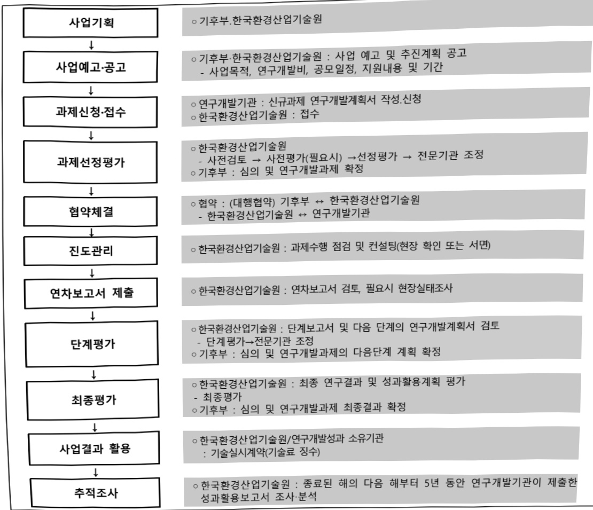

# 수열에너지 활용기술 및 에너지 믹스 기술개발(R&D)

**해당 페이지**: PDF 2845 ~ 2854 쪽 해당

**부처**: 기후에너지환경부
**분야**: 환경
**회계유형**: 기금
**2026 확정예산**: 7500.0 백만원
**전년대비 증감률**: 200.0%
**AI 도메인**: 에너지

---

<table border=1 style='margin: auto; word-wrap: break-word;'><tr><td style='text-align: center; word-wrap: break-word;'>사 업 명</td></tr><tr><td style='text-align: center; word-wrap: break-word;'>가. (124) 수열에너지 활용기술 및 에너지 믹스 기술개발(R&amp;D)(6431-795)</td></tr></table>

## □ 사업 코드 정보

<table border=1 style='margin: auto; word-wrap: break-word;'><tr><td style='text-align: center; word-wrap: break-word;'>구분</td><td style='text-align: center; word-wrap: break-word;'>기금</td><td style='text-align: center; word-wrap: break-word;'>소관</td><td style='text-align: center; word-wrap: break-word;'>실국(기관)</td><td style='text-align: center; word-wrap: break-word;'>계정</td><td style='text-align: center; word-wrap: break-word;'>분야</td><td style='text-align: center; word-wrap: break-word;'>부문</td></tr><tr><td style='text-align: center; word-wrap: break-word;'>코드</td><td rowspan="2">기후대응기금</td><td rowspan="2">기후에너지환경부</td><td rowspan="2">기후에너지정책관기후에너지재정과</td><td rowspan="2"></td><td style='text-align: center; word-wrap: break-word;'>070</td><td style='text-align: center; word-wrap: break-word;'>079</td></tr><tr><td style='text-align: center; word-wrap: break-word;'>명칭</td><td style='text-align: center; word-wrap: break-word;'>환경</td><td style='text-align: center; word-wrap: break-word;'>기후대기릇환경안전</td></tr></table>

<table border=1 style='margin: auto; word-wrap: break-word;'><tr><td style='text-align: center; word-wrap: break-word;'>구분</td><td style='text-align: center; word-wrap: break-word;'>프로그램</td><td style='text-align: center; word-wrap: break-word;'>단위사업</td><td style='text-align: center; word-wrap: break-word;'>세부사업</td></tr><tr><td style='text-align: center; word-wrap: break-word;'>코드</td><td style='text-align: center; word-wrap: break-word;'>6400</td><td style='text-align: center; word-wrap: break-word;'>6431</td><td style='text-align: center; word-wrap: break-word;'>795</td></tr><tr><td style='text-align: center; word-wrap: break-word;'>명칭</td><td style='text-align: center; word-wrap: break-word;'>탄소중립기반구축</td><td style='text-align: center; word-wrap: break-word;'>기술개발</td><td style='text-align: center; word-wrap: break-word;'>수열에너지 활용기술 및 에너지 믹스 기술개발(R&amp;D)</td></tr></table>

□ 사업 성격

<table border=1 style='margin: auto; word-wrap: break-word;'><tr><td rowspan="2">신규</td><td rowspan="2">계속</td><td rowspan="2">$ \underline{\text{완료}} $</td><td style='text-align: center; word-wrap: break-word;'>예비타당성</td><td style='text-align: center; word-wrap: break-word;'>총사업비</td><td style='text-align: center; word-wrap: break-word;'>총액계상</td><td style='text-align: center; word-wrap: break-word;'>사업소관 변경정보</td></tr><tr><td style='text-align: center; word-wrap: break-word;'>실시여부</td><td style='text-align: center; word-wrap: break-word;'>관리대상</td><td style='text-align: center; word-wrap: break-word;'>예산사업</td><td style='text-align: center; word-wrap: break-word;'>2025예산 시 소관</td></tr><tr><td style='text-align: center; word-wrap: break-word;'></td><td style='text-align: center; word-wrap: break-word;'>O</td><td style='text-align: center; word-wrap: break-word;'></td><td style='text-align: center; word-wrap: break-word;'></td><td style='text-align: center; word-wrap: break-word;'></td><td style='text-align: center; word-wrap: break-word;'></td><td style='text-align: center; word-wrap: break-word;'>기획재정부</td></tr></table>

□ 사업 지원 형태 및 지원율

<table border=1 style='margin: auto; word-wrap: break-word;'><tr><td style='text-align: center; word-wrap: break-word;'>직접</td><td style='text-align: center; word-wrap: break-word;'>출자</td><td style='text-align: center; word-wrap: break-word;'>출연</td><td style='text-align: center; word-wrap: break-word;'>보조</td><td style='text-align: center; word-wrap: break-word;'>융자</td><td style='text-align: center; word-wrap: break-word;'>국고보조율(%)</td><td style='text-align: center; word-wrap: break-word;'>융자율(%)</td></tr><tr><td style='text-align: center; word-wrap: break-word;'></td><td style='text-align: center; word-wrap: break-word;'></td><td style='text-align: center; word-wrap: break-word;'>O</td><td style='text-align: center; word-wrap: break-word;'></td><td style='text-align: center; word-wrap: break-word;'></td><td style='text-align: center; word-wrap: break-word;'></td><td style='text-align: center; word-wrap: break-word;'></td></tr></table>

## □ 사업 담당자

<table border=1 style='margin: auto; word-wrap: break-word;'><tr><td style='text-align: center; word-wrap: break-word;'>사업명</td><td colspan="2">구분</td></tr><tr><td rowspan="3">수열에너지 활용 기술 및 에너지 믹스 기술개발사업 (R&amp;D)</td><td rowspan="2">소관부처</td><td style='text-align: center; word-wrap: break-word;'>물관리정책실 물이용정책관</td></tr><tr><td style='text-align: center; word-wrap: break-word;'>물이용정책과</td></tr><tr><td style='text-align: center; word-wrap: break-word;'>사업시행주체</td><td style='text-align: center; word-wrap: break-word;'>한국환경산업기술원</td></tr></table>

---

### 가.지출계획 총괄표

(단위:백만원,%)

<table border=1 style='margin: auto; word-wrap: break-word;'><tr><td rowspan="2">목명</td><td rowspan="2">2024년 결산</td><td colspan="2">2025년 계획</td><td colspan="2">2026년</td><td rowspan="2">증감(B-A)</td><td rowspan="2">(B-A)/A</td></tr><tr><td style='text-align: center; word-wrap: break-word;'>당초(A)</td><td style='text-align: center; word-wrap: break-word;'>수정</td><td style='text-align: center; word-wrap: break-word;'>정부안</td><td style='text-align: center; word-wrap: break-word;'>확정(B)</td></tr><tr><td style='text-align: center; word-wrap: break-word;'>수열에너지 활용 기술 및 에너지 믹스 기술개발사업(R&amp;D)</td><td style='text-align: center; word-wrap: break-word;'>-</td><td style='text-align: center; word-wrap: break-word;'>2,500</td><td style='text-align: center; word-wrap: break-word;'>2,500</td><td style='text-align: center; word-wrap: break-word;'>7,500</td><td style='text-align: center; word-wrap: break-word;'>7,500</td><td style='text-align: center; word-wrap: break-word;'>5,000</td><td style='text-align: center; word-wrap: break-word;'>200.0</td></tr></table>

□ 기능별(내역사업별), 목별 계획 내역

(단위:백만원)

<table border=1 style='margin: auto; word-wrap: break-word;'><tr><td rowspan="3"></td><td colspan="5">2024</td><td colspan="8">2025</td><td rowspan="3">2026 계획</td></tr><tr><td rowspan="2">계획액(수정)</td><td rowspan="2">계획현액</td><td rowspan="2">집행액[실집행액]</td><td rowspan="2">이월액</td><td rowspan="2">불용액</td><td colspan="2">계획액</td><td rowspan="2">계획현액</td><td rowspan="2">집행액[실집행액]</td><td colspan="2">전년도 이월액제외</td><td rowspan="2">이월액상액</td><td rowspan="2">불용액상액</td></tr><tr><td style='text-align: center; word-wrap: break-word;'>당초</td><td style='text-align: center; word-wrap: break-word;'>수정</td><td style='text-align: center; word-wrap: break-word;'>계획현액</td><td style='text-align: center; word-wrap: break-word;'>집행액[실집행액]</td></tr><tr><td style='text-align: center; word-wrap: break-word;'>○ 기능별 분류(합계)</td><td style='text-align: center; word-wrap: break-word;'></td><td style='text-align: center; word-wrap: break-word;'></td><td style='text-align: center; word-wrap: break-word;'></td><td style='text-align: center; word-wrap: break-word;'></td><td style='text-align: center; word-wrap: break-word;'></td><td style='text-align: center; word-wrap: break-word;'>2,500</td><td style='text-align: center; word-wrap: break-word;'>2,500</td><td style='text-align: center; word-wrap: break-word;'>2,500</td><td style='text-align: center; word-wrap: break-word;'>2,500</td><td style='text-align: center; word-wrap: break-word;'>2,500</td><td style='text-align: center; word-wrap: break-word;'>2,500</td><td style='text-align: center; word-wrap: break-word;'>[2,500]</td><td style='text-align: center; word-wrap: break-word;'></td><td style='text-align: center; word-wrap: break-word;'>7,500</td></tr><tr><td style='text-align: center; word-wrap: break-word;'>· 중앙집중형 실증플랜트</td><td style='text-align: center; word-wrap: break-word;'></td><td style='text-align: center; word-wrap: break-word;'></td><td style='text-align: center; word-wrap: break-word;'></td><td style='text-align: center; word-wrap: break-word;'></td><td style='text-align: center; word-wrap: break-word;'></td><td style='text-align: center; word-wrap: break-word;'>2,000</td><td style='text-align: center; word-wrap: break-word;'>2,000</td><td style='text-align: center; word-wrap: break-word;'>2,000</td><td style='text-align: center; word-wrap: break-word;'>2,000</td><td style='text-align: center; word-wrap: break-word;'>2,000</td><td style='text-align: center; word-wrap: break-word;'>2,000</td><td style='text-align: center; word-wrap: break-word;'>[2,000]</td><td style='text-align: center; word-wrap: break-word;'></td><td style='text-align: center; word-wrap: break-word;'>5,000</td></tr><tr><td style='text-align: center; word-wrap: break-word;'>· 분산클러스터형 실증플랜트</td><td style='text-align: center; word-wrap: break-word;'></td><td style='text-align: center; word-wrap: break-word;'></td><td style='text-align: center; word-wrap: break-word;'></td><td style='text-align: center; word-wrap: break-word;'></td><td style='text-align: center; word-wrap: break-word;'></td><td style='text-align: center; word-wrap: break-word;'>500</td><td style='text-align: center; word-wrap: break-word;'>500</td><td style='text-align: center; word-wrap: break-word;'>500</td><td style='text-align: center; word-wrap: break-word;'>500</td><td style='text-align: center; word-wrap: break-word;'>500</td><td style='text-align: center; word-wrap: break-word;'>500</td><td style='text-align: center; word-wrap: break-word;'>[500]</td><td style='text-align: center; word-wrap: break-word;'></td><td style='text-align: center; word-wrap: break-word;'>2,500</td></tr><tr><td style='text-align: center; word-wrap: break-word;'>○ 비목별 분류(합계)</td><td style='text-align: center; word-wrap: break-word;'></td><td style='text-align: center; word-wrap: break-word;'></td><td style='text-align: center; word-wrap: break-word;'></td><td style='text-align: center; word-wrap: break-word;'></td><td style='text-align: center; word-wrap: break-word;'></td><td style='text-align: center; word-wrap: break-word;'>2,500</td><td style='text-align: center; word-wrap: break-word;'>2,500</td><td style='text-align: center; word-wrap: break-word;'>2,500</td><td style='text-align: center; word-wrap: break-word;'>2,500</td><td style='text-align: center; word-wrap: break-word;'>2,500</td><td style='text-align: center; word-wrap: break-word;'>2,500</td><td style='text-align: center; word-wrap: break-word;'>[2,500]</td><td style='text-align: center; word-wrap: break-word;'></td><td style='text-align: center; word-wrap: break-word;'>7,500</td></tr><tr><td style='text-align: center; word-wrap: break-word;'>· 연구개발연구활동비(360-05)</td><td style='text-align: center; word-wrap: break-word;'></td><td style='text-align: center; word-wrap: break-word;'></td><td style='text-align: center; word-wrap: break-word;'></td><td style='text-align: center; word-wrap: break-word;'></td><td style='text-align: center; word-wrap: break-word;'></td><td style='text-align: center; word-wrap: break-word;'>2,500</td><td style='text-align: center; word-wrap: break-word;'>2,500</td><td style='text-align: center; word-wrap: break-word;'>2,500</td><td style='text-align: center; word-wrap: break-word;'>2,500</td><td style='text-align: center; word-wrap: break-word;'>2,500</td><td style='text-align: center; word-wrap: break-word;'>2,500</td><td style='text-align: center; word-wrap: break-word;'>[2,500]</td><td style='text-align: center; word-wrap: break-word;'></td><td style='text-align: center; word-wrap: break-word;'>7,500</td></tr><tr><td style='text-align: center; word-wrap: break-word;'>○ 기능비목별 분류(합계)</td><td style='text-align: center; word-wrap: break-word;'></td><td style='text-align: center; word-wrap: break-word;'></td><td style='text-align: center; word-wrap: break-word;'></td><td style='text-align: center; word-wrap: break-word;'></td><td style='text-align: center; word-wrap: break-word;'></td><td style='text-align: center; word-wrap: break-word;'>2,500</td><td style='text-align: center; word-wrap: break-word;'>2,500</td><td style='text-align: center; word-wrap: break-word;'>2,500</td><td style='text-align: center; word-wrap: break-word;'>2,500</td><td style='text-align: center; word-wrap: break-word;'>2,500</td><td style='text-align: center; word-wrap: break-word;'>2,500</td><td style='text-align: center; word-wrap: break-word;'>[2,500]</td><td style='text-align: center; word-wrap: break-word;'></td><td style='text-align: center; word-wrap: break-word;'>7,500</td></tr><tr><td style='text-align: center; word-wrap: break-word;'>· 중앙집중형 실증플랜트</td><td style='text-align: center; word-wrap: break-word;'></td><td style='text-align: center; word-wrap: break-word;'></td><td style='text-align: center; word-wrap: break-word;'></td><td style='text-align: center; word-wrap: break-word;'></td><td style='text-align: center; word-wrap: break-word;'></td><td style='text-align: center; word-wrap: break-word;'>2,000</td><td style='text-align: center; word-wrap: break-word;'>2,000</td><td style='text-align: center; word-wrap: break-word;'>2,000</td><td style='text-align: center; word-wrap: break-word;'>2,000</td><td style='text-align: center; word-wrap: break-word;'>2,000</td><td style='text-align: center; word-wrap: break-word;'>2,000</td><td style='text-align: center; word-wrap: break-word;'>[2,000]</td><td style='text-align: center; word-wrap: break-word;'></td><td style='text-align: center; word-wrap: break-word;'>5,000</td></tr><tr><td style='text-align: center; word-wrap: break-word;'>· 연구개발연구활동비(360-05)</td><td style='text-align: center; word-wrap: break-word;'></td><td style='text-align: center; word-wrap: break-word;'></td><td style='text-align: center; word-wrap: break-word;'></td><td style='text-align: center; word-wrap: break-word;'></td><td style='text-align: center; word-wrap: break-word;'></td><td style='text-align: center; word-wrap: break-word;'>2,000</td><td style='text-align: center; word-wrap: break-word;'>2,000</td><td style='text-align: center; word-wrap: break-word;'>2,000</td><td style='text-align: center; word-wrap: break-word;'>2,000</td><td style='text-align: center; word-wrap: break-word;'>2,000</td><td style='text-align: center; word-wrap: break-word;'>2,000</td><td style='text-align: center; word-wrap: break-word;'>[2,000]</td><td style='text-align: center; word-wrap: break-word;'></td><td style='text-align: center; word-wrap: break-word;'>5,000</td></tr><tr><td style='text-align: center; word-wrap: break-word;'>· 분산클러스터형 실증플랜트</td><td style='text-align: center; word-wrap: break-word;'></td><td style='text-align: center; word-wrap: break-word;'></td><td style='text-align: center; word-wrap: break-word;'></td><td style='text-align: center; word-wrap: break-word;'></td><td style='text-align: center; word-wrap: break-word;'></td><td style='text-align: center; word-wrap: break-word;'>500</td><td style='text-align: center; word-wrap: break-word;'>500</td><td style='text-align: center; word-wrap: break-word;'>500</td><td style='text-align: center; word-wrap: break-word;'>500</td><td style='text-align: center; word-wrap: break-word;'>500</td><td style='text-align: center; word-wrap: break-word;'>500</td><td style='text-align: center; word-wrap: break-word;'>[500]</td><td style='text-align: center; word-wrap: break-word;'></td><td style='text-align: center; word-wrap: break-word;'>2,500</td></tr><tr><td style='text-align: center; word-wrap: break-word;'>· 연구개발연구활동비(360-05)</td><td style='text-align: center; word-wrap: break-word;'></td><td style='text-align: center; word-wrap: break-word;'></td><td style='text-align: center; word-wrap: break-word;'></td><td style='text-align: center; word-wrap: break-word;'></td><td style='text-align: center; word-wrap: break-word;'></td><td style='text-align: center; word-wrap: break-word;'>500</td><td style='text-align: center; word-wrap: break-word;'>500</td><td style='text-align: center; word-wrap: break-word;'>500</td><td style='text-align: center; word-wrap: break-word;'>500</td><td style='text-align: center; word-wrap: break-word;'>500</td><td style='text-align: center; word-wrap: break-word;'>500</td><td style='text-align: center; word-wrap: break-word;'>[500]</td><td style='text-align: center; word-wrap: break-word;'></td><td style='text-align: center; word-wrap: break-word;'>2,500</td></tr></table>

---

### 나. 사업설명자료

## 1 ) 사업목적·내용

(수열에너지 활용 기술 및 에너지 믹스 기술개발사업) 수열에너지 활성화를 위해 다양한 수열원의 핵심인자 변화(온도·탁도 등)에 대응한 효율 개선, 최적화된 열취득 구조 및 소재 개발을 위한 기술개발을 추진

- (중앙집중형 실증플랜트) 수열에너지원의 활용 확대를 목적으로 하천수·유출지하수·정수·하수 등에 적용가능한 수열에너지원 조건 다변화 대응 능동형 시스템 개발

- (분산클러스터형 실증플랜트) 수요 예측 기반 복합 수열에너지원 운전 기술 및 소규모 분산형 미활용 에너지 회수 하이브리드 시스템 개발

## 2 ) 사업개요

## □ 사업근거 및 추진경위

① 법령상 근거 및 조항 적시

-「신에너지 및 재생에너지 개발·이용·보급 촉진법」 제2조(정의), 제10조(조성된 사업비의 사용)

## 신에너지 및 재생에너지 개발·이용·보급 촉진법

제2조(정의) 이 법에서 사용하는 용어의 뜻은 다음과 같다.

1. "신에너지"란 기존의 화석연료를 변환시켜 이용하거나 수소·산소 등의 화학 반응을 통하여 전기 또는 열을 이용하는 에너지로서 다음 각 목의 어느 하나에 해당하는 것을 말한다.

가. 수소에너지

나. 연료전지

다. 석탄을 액화·가스화한 에너지 및 중질잔사유(重質殘渣油)를 가스화한 에너지로서 대통령령으로 정하는 기준 및 범위에 해당하는 에너지

라. 그 밖에 석유·석탄·원자력 또는 천연가스가 아닌 에너지로서 대통령령으로 정하는 에너지

2. "재생에너지"란 햇빛·물·지열(地熱)·강수(降水)·생물유기체 등을 포함하는 재생 가능한 에너지를 변환시켜 이용하는 에너지로서 다음 각 목의 어느 하나에 해당하는 것을 말한다.

가. 태양에너지

나. 풍력

다. 수력

라. 해양에너지

마. 지열에너지

바. 생물자원을 변환시켜 이용하는 바이오에너지로서 대통령령으로 정하는 기준 및 범위에 해당하는 에너지

사. 폐기물에너지(비재생폐기물로부터 생산된 것은 제외한다)로서 대통령령으로 정하는 기준 및 범위에 해당하는 에너지

아. 그 밖에 석유·석탄·원자력 또는 천연가스가 아닌 에너지로서 대통령령으로 정하는 에너지

3. "신에너지 및 재생에너지 설비"(이하 "신·재생에너지 설비"라 한다)란 신에너지 및

---

재생에너지(이하 "신·재생에너지"라 한다)를 생산 또는 이용하거나 신·재생에너지의 전력계통 연계조건을 개선하기 위한 설비로서 산업통상자원부령으로 정하는 것을 말한다.

4. "신·재생에너지 발전"이란 신·재생에너지를 이용하여 전기를 생산하는 것을 말한다.

5. “신·재생에너지 발전사업자”란 ‘전기사업법’ 제2조제4호에 따른 발전사업자 또는 같은 조제19호에 따른 자가용전기설비를 설치한 자로서 신·재생에너지 발전을 하는 사업자를 말한다. 제10조(조성된 사업비의 사용) 산업통상자원부장관은 제9조에 따라 조성된 사업비를 다음 각 호의 사업에 사용한다.

1. 신·재생에너지의 자원조사, 기술수요조사 및 통계작성

2.신·재생에너지의 연구·개발 및 기술평가

3. 삭제

4.신·재생에너지 공급의무화 지원

5. 신·재생에너지 설비의 성능평가·인증 및 사후관리

6. 신·재생에너지 기술정보의 수집·분석 및 제공

7. 신·재생에너지 분야 기술지도 및 교육·홍보

8. 신·재생에너지 분야 특성화대학 및 핵심기술연구센터 육성

9. 신·재생에너지 분야 전문인력 양성

10. 신·재생에너지 설비 설치기업의 지원

11.신·재생에너지 시범사업 및 보급사업

12. 신·재생에너지 이용의무화 지원

13. 신·재생에너지 관련 국제협력

14. 신·재생에너지 기술의 국제표준화 지원

15. 신·재생에너지 설비 및 그 부품의 공용화 지원

16. 그 밖에 신·재생에너지의 기술개발 및 이용·보급을 위하여 필요한 사업으로서 대통령령으로 정하는 사업

- 물관리기술 발전 및 물산업 진흥에 관한 법률 제11조(시범사업의 실시), 제12조(창업 지원)

## 물관리기술 발전 및 물산업 진흥에 관한 법률

제11조(시범사업의 실시) ① 정부는 대통령령으로 정하는 물산업 관련 혁신기술의 이용·보급 및 해외시장 진출을 촉진하기 위하여 시범사업 계획을 수립하여 사업을 시행할 수 있다

② 정부는 제1항에 따른 시범사업에 참여하는 지방자치단체, 물산업 공공기관 또는 연구기관 등에 행정적·재정적 지원을 할 수 있다.

③ 정부는 제1항에 따른 시범사업에 대한 성과를 평가하여야 한다.

④ 제1항에 따른 시범사업을 위한 계획의 수립 및 추진 절차, 제3항에 따른 성과평가 방법 등은 대통령령으로 정한다.

제12조(창업 지원) 정부는 물기업의 창업 촉진, 성장 및 발전을 위하여 대통령령으로 정하는 바에 따라 지원을 할 수 있다.

-「환경기술 및 환경산업 지원법」제5조(환경기술개발사업의 추진)

## 환경기술 및 환경산업 지원법

제5조(환경기술개발사업의 추진) ① 정부는 환경보전 및 국민경제의 지속가능한 발전을 위하여 대통령령으로 정하는 바에 따라 다음 각 호의 어느 하나에 해당하는 기관이나 단체 또는 사업자(이하 이 조에서 "연구기관등"이라 한다)로 하여금 환경기술개발사업(이하 "개발사업"이라 한다)을 하게 할 수 있다.

1.국·공립연구기관

2.「특정연구기관 육성법」의 적용을 받는 연구기관

3.「정부출연연구기관 등의 설립·운영 및 육성에 관한 법률」에 따라 설립된 정부출연연구기관 또는「과학기술분야 정부출연연구기관 등의 설립·운영 및 육성에 관한 법률」에 따라 설립된 과학기술분야 정부출연연구기관

---

4.「고등교육법」제2조에 따른 학교

5. 대통령령으로 정하는 기준에 해당하는 기업부설연구소

6.「산업기술연구조합 육성법」에 따른 산업기술연구조합

7. 제10조에 따른 녹색환경지원센터

8. 환경산업을 영위하는 사업자(이하"환경산업체"라 한다)

9. 대통령령으로 정하는 기준에 해당하는 외국연구기관. 다만, 국내의 기관이나 단체 또는 사업자와 공동으로 연구개발을 하는 외국연구기관으로 한정한다.

10. 그 밖에 대통령령으로 정하는 기관이나 단체 또는 사업자

② 개발사업에 필요한 비용은 정부의 출연금(出掛金)이나 정부 외의 자의 출연금, 그 밖에 기업의 연구개발비로 충당한다.

③ 정부는 개발사업을 추진하기 위하여 제1항에 따라 개발사업을 하는 연구기관등에 출연금을 지급할 수 있다.

④ 제3항에 따라 출연금을 받아 개발사업을 하는 연구기관등의 장은 개발사업이 끝난 후 연구개발 결과를 사용, 양도(讓渡), 대여(貸與) 또는 수출하려는 자와 기술실시계약을 체결하여 기술료를 징수할 수 있다.

⑤ 제4항에 따라 징수한 기술료는 개발사업 등 대통령령으로 정하는 용도에 사용하여야 하고, 대통령령으로 정하는 바에 따라 일정 비율에 해당하는 금액을「한국환경산업기술원법」에 따른 한국환경산업기술원(이하 "한국환경산업기술원"이라 한다)에 내야 한다.

⑥ 제3항에 따른 출연금의 지급·사용 및 관리와 제4항 및 제5항에 따른 기술료의 징수와 사용 등에 필요한 사항은 대통령령으로 정한다.

## ② 추진경위

- 하천수 수열 신재생에너지 포함 신재생에너지법 시행령 개정('19.10')

- 수열냉난방 및 재생열 하이브리드 시스템개발사업('20~'23)

- 수열에너지 활용 기술 및 에너지 믹스 기술개발사업 기획연구('24.1)

- 수열에너지 활용 기술 및 에너지 믹스 기술개발사업 착수('25.4)

## □ 주요내용

① 사업규모

- 총사업비 : 460억원(국고 345억원)

- 사업기간 : 2025년~2029년(총 5년)

-최근 5년 간 투입된 사업비

<table border=1 style='margin: auto; word-wrap: break-word;'><tr><td style='text-align: center; word-wrap: break-word;'>연도</td><td style='text-align: center; word-wrap: break-word;'>2022</td><td style='text-align: center; word-wrap: break-word;'>2023</td><td style='text-align: center; word-wrap: break-word;'>2024</td><td style='text-align: center; word-wrap: break-word;'>2025</td><td style='text-align: center; word-wrap: break-word;'>2026</td></tr><tr><td style='text-align: center; word-wrap: break-word;'>사업비</td><td style='text-align: center; word-wrap: break-word;'>-</td><td style='text-align: center; word-wrap: break-word;'>-</td><td style='text-align: center; word-wrap: break-word;'>-</td><td style='text-align: center; word-wrap: break-word;'>2,500</td><td style='text-align: center; word-wrap: break-word;'>7,500</td></tr></table>

## ② 사업추진체계

- 사업시행방법 : 출연(총사업비의 50~75%)

- 사업시행주체 : 기후부(한국환경산업기술원 대행)

---

- 사업 수혜자 :

(지원 수혜자) 동 사업에 참여하는 수열에너지, 에너지수요, 에너지효율 기술

관련 기업, 대학, 연구소 등

(사업 산출물 수혜자) 지자체, 공공기관, 지역난방, 주택단지 개발사업체 등 수열

활용 사업자 및 아파트 등 대규모 거주단지 거주자

- 보조, 융자, 출연, 출자 등의 경우 보조·융자 등 지원 비율 및 법적근거

<table border=1 style='margin: auto; word-wrap: break-word;'><tr><td style='text-align: center; word-wrap: break-word;'>내역사업명</td><td style='text-align: center; word-wrap: break-word;'>구분</td><td style='text-align: center; word-wrap: break-word;'>피보조·피출연 등 기관명</td><td style='text-align: center; word-wrap: break-word;'>지원 금액 (2026계획)</td><td style='text-align: center; word-wrap: break-word;'>지원 비율(%)</td><td style='text-align: center; word-wrap: break-word;'>보조율 법적근거 (해당 조항)</td></tr><tr><td style='text-align: center; word-wrap: break-word;'>중앙집중형 실증플랜트</td><td style='text-align: center; word-wrap: break-word;'>출연</td><td style='text-align: center; word-wrap: break-word;'>한국환경 산업기술원</td><td style='text-align: center; word-wrap: break-word;'>5,000백만원</td><td style='text-align: center; word-wrap: break-word;'>50~75%</td><td rowspan="2">「환경기술 및 환경산업 지원법」제5조</td></tr><tr><td style='text-align: center; word-wrap: break-word;'>분신클러스터형 실증플랜트</td><td style='text-align: center; word-wrap: break-word;'>출연</td><td style='text-align: center; word-wrap: break-word;'>한국환경 산업기술원</td><td style='text-align: center; word-wrap: break-word;'>2,500백만원</td><td style='text-align: center; word-wrap: break-word;'>50~75%</td></tr></table>

## 3 ) '26년도 계획 산출 근거

□ 수열에너지 활용 기술 및 에너지 믹스 기술개발사업(R&D) : (2025) 2,500백만원 → (2026) 7,500백만원, '25년 대비 +200%(+5,000백만원)

① 중앙집중형 실증플랜트 : (2025) 2,000백만원 → (2026) 5,000백만원, '25년 대비 +150%(+3,000백만원)

(요구) 수열원 수질·유량 변동 대응을 위한 수열시스템 설계 및 운영기술 개발 시스템 설계 및 플랜트 구축 계속과제 4,000백만원 지원, 수열에너지원 잠재량 및 입지조건 최적 분석기술 1개 신규과제 1,000백만원 지원

- (산출) 계속 1개 × 4,000백만원 × 12/12개월 = 4,000백만원

 $$  신규 1개 \times1,334 백만원 \times9/12개월 =1,000 백만원 $$ 

② 분산클러스터형 실증플랜트 : (2025) 500백만원 → (2026) 2,500백만원, '25년 대비 +400%(+2,000백만원)

- (요구) 수요 예측 기반 복합 수열에너지원 운전 기술 개발 계속과제 1,500백만원, 소규모 분산형 미활용 에너지 회수 하이브리드 시스템 신규과제 1,000백만원 지원

- (산술) 계속 1개 × 1,500백만원 × 12/12개월 = 1,500백만원

신규 1개 × 1,334백만원 × 9/12개월 = 1,000백만원

2025년도 계획 및 2026년도 계획 산출 세부내역 비교

<table border=1 style='margin: auto; word-wrap: break-word;'><tr><td colspan="2">2025년 계획</td><td colspan="2">2026년 계획</td></tr><tr><td style='text-align: center; word-wrap: break-word;'>예산</td><td style='text-align: center; word-wrap: break-word;'>산출내역</td><td style='text-align: center; word-wrap: break-word;'>예산</td><td style='text-align: center; word-wrap: break-word;'>산출내역</td></tr><tr><td style='text-align: center; word-wrap: break-word;'>2,500 백만원</td><td style='text-align: center; word-wrap: break-word;'>○ 중앙집중형 실증플랜트: 2,000백만원
• (신규) 1개×2,667백만×9/12개월=2,000백만원
○ 분산클러스터형 실증플랜트: 500백만원
• (신규) 1개×667백만×9/12개월=500백만원</td><td style='text-align: center; word-wrap: break-word;'>7,500 백만원</td><td style='text-align: center; word-wrap: break-word;'>○ 중앙집중형 실증플랜트: 5,000백만원
• (계속) 1개×4,000백만×12/12개월=4,000백만원
• (신규) 1개×1,334백만×9/12개월=1,000백만원
○ 분산클러스터형 실증플랜트: 2,500백만원
• (계속) 1개×1,500백만×12/12개월=1,500백만원
• (신규) 1개×1,334백만×9/12개월=1,000백만원</td></tr></table>

---

## 4 ) 사업효과

□ 사업영향, 산출물 성과지표 등

① 2022~2026년도 성과계획서 상 성과지표 및 최근 5년간 성과 달성도

<table border=1 style='margin: auto; word-wrap: break-word;'><tr><td style='text-align: center; word-wrap: break-word;'>성과지표</td><td style='text-align: center; word-wrap: break-word;'>구분</td><td style='text-align: center; word-wrap: break-word;'>2022</td><td style='text-align: center; word-wrap: break-word;'>2023</td><td style='text-align: center; word-wrap: break-word;'>2024</td><td style='text-align: center; word-wrap: break-word;'>2025</td><td style='text-align: center; word-wrap: break-word;'>2026</td><td style='text-align: center; word-wrap: break-word;'>2026 목표치산출근거</td><td style='text-align: center; word-wrap: break-word;'>측정산식(또는 측정방법)</td><td style='text-align: center; word-wrap: break-word;'>자료수집방법(또는 자료출처)</td></tr><tr><td rowspan="3">수열시스템최대성능계수(시뮬레이션)(단위:지수)</td><td style='text-align: center; word-wrap: break-word;'>목표</td><td style='text-align: center; word-wrap: break-word;'>-</td><td style='text-align: center; word-wrap: break-word;'>-</td><td style='text-align: center; word-wrap: break-word;'>-</td><td style='text-align: center; word-wrap: break-word;'>-</td><td style='text-align: center; word-wrap: break-word;'>3.6</td><td rowspan="3">중앙집중형4.5,분산형3.5의평균치4.0을1단계(&#x27;27년)목표로설정,&#x27;26년부터10%증가하여목표치를달성할수있도록설정</td><td rowspan="3">시스템성능(COP) =  $ \frac{\text{생산방송력}}{\text{소비폐지자}} $</td><td rowspan="3">1~2차년도는보고서에내용포함제시1단계종료시공인기관시험성적확인서제출</td></tr><tr><td style='text-align: center; word-wrap: break-word;'>실적</td><td style='text-align: center; word-wrap: break-word;'>-</td><td style='text-align: center; word-wrap: break-word;'>-</td><td style='text-align: center; word-wrap: break-word;'>-</td><td style='text-align: center; word-wrap: break-word;'>-</td><td style='text-align: center; word-wrap: break-word;'>-</td></tr><tr><td style='text-align: center; word-wrap: break-word;'>달성도</td><td style='text-align: center; word-wrap: break-word;'>-</td><td style='text-align: center; word-wrap: break-word;'>-</td><td style='text-align: center; word-wrap: break-word;'>-</td><td style='text-align: center; word-wrap: break-word;'>-</td><td style='text-align: center; word-wrap: break-word;'>-</td></tr><tr><td rowspan="3">실증플랜트공정완료율(단위:%)</td><td style='text-align: center; word-wrap: break-word;'>목표</td><td style='text-align: center; word-wrap: break-word;'>-</td><td style='text-align: center; word-wrap: break-word;'>-</td><td style='text-align: center; word-wrap: break-word;'>-</td><td style='text-align: center; word-wrap: break-word;'>29</td><td style='text-align: center; word-wrap: break-word;'>64</td><td rowspan="3">1단계종료시점을100%로하여연차별연구진행 및공정진행률을설정</td><td rowspan="3">공정율 = 연차별공정완료도/총공정×100</td><td rowspan="3">연구과제보고서 및전문가검토서</td></tr><tr><td style='text-align: center; word-wrap: break-word;'>실적</td><td style='text-align: center; word-wrap: break-word;'>-</td><td style='text-align: center; word-wrap: break-word;'>-</td><td style='text-align: center; word-wrap: break-word;'>-</td><td style='text-align: center; word-wrap: break-word;'>29</td><td style='text-align: center; word-wrap: break-word;'>-</td></tr><tr><td style='text-align: center; word-wrap: break-word;'>달성도</td><td style='text-align: center; word-wrap: break-word;'>-</td><td style='text-align: center; word-wrap: break-word;'>-</td><td style='text-align: center; word-wrap: break-word;'>-</td><td style='text-align: center; word-wrap: break-word;'>100</td><td style='text-align: center; word-wrap: break-word;'>-</td></tr></table>

---

② 성과지표 이외의 연도별 사업추진 경과 및 실적

<table border=1 style='margin: auto; word-wrap: break-word;'><tr><td style='text-align: center; word-wrap: break-word;'>2022</td><td style='text-align: center; word-wrap: break-word;'>-</td></tr><tr><td style='text-align: center; word-wrap: break-word;'>2023</td><td style='text-align: center; word-wrap: break-word;'>-</td></tr><tr><td style='text-align: center; word-wrap: break-word;'>2024</td><td style='text-align: center; word-wrap: break-word;'>-</td></tr><tr><td style='text-align: center; word-wrap: break-word;'>2025</td><td style='text-align: center; word-wrap: break-word;'>- 중앙집중형 내역사업 1개 신규과제 착수(20억원), 분산클러스터형 내역사업 1개 신규과제 착수(5억원)</td></tr></table>

③ 향후(2026년도 이후) 기대효과

- 산업단지, 대형건물 등 지자체 및 대규모 타운의 전력운영비용 절감

※ 수열원의 활용을 통해 건물·난방에 사용되는 전력을 감소시켜, 대규모 건물의 냉·난방 전력비용 30% 감소 / 탄소중립에 대한 요구가 강화되는 세계적인 추세에 맞춰 해외 수열 사업 시장 선점 - 플랜트 부품·기자재 기존 수열시스템의 수입대체 효과

- 수열 시스템 COPmax 3.5(25년) → 4.5(29년), 수열원 열폼프의 난방 부하 감당률 70%(25년) → 80%(29년), 수열에너지 변동율 6%(25년) → 10%(29년)

5) 타당성조사 및 예비타당성조사 시행여부 및 결과 요지 : 해당없음

6) 총사업비 대상사업 여부 및 내역 : 해당없음

## 7 ) 사업 집행절차

---

## 8 ) 중기재정계획 상 연도별 투자계획 및 추진경과

(단위: 백만원)

<table border=1 style='margin: auto; word-wrap: break-word;'><tr><td style='text-align: center; word-wrap: break-word;'>$ 중기 $ 재정계획</td><td style='text-align: center; word-wrap: break-word;'>2024</td><td style='text-align: center; word-wrap: break-word;'>2025</td><td style='text-align: center; word-wrap: break-word;'>2026</td><td style='text-align: center; word-wrap: break-word;'>2027</td><td style='text-align: center; word-wrap: break-word;'>2028</td><td style='text-align: center; word-wrap: break-word;'>2029</td></tr><tr><td style='text-align: center; word-wrap: break-word;'>2024~2028</td><td style='text-align: center; word-wrap: break-word;'>-</td><td style='text-align: center; word-wrap: break-word;'>2,500</td><td style='text-align: center; word-wrap: break-word;'>7,500</td><td style='text-align: center; word-wrap: break-word;'>6,500</td><td style='text-align: center; word-wrap: break-word;'>6,500</td><td style='text-align: center; word-wrap: break-word;'>☑</td></tr><tr><td style='text-align: center; word-wrap: break-word;'>2025~2029</td><td style='text-align: center; word-wrap: break-word;'>☑</td><td style='text-align: center; word-wrap: break-word;'>2,500</td><td style='text-align: center; word-wrap: break-word;'>7,500</td><td style='text-align: center; word-wrap: break-word;'>10,500</td><td style='text-align: center; word-wrap: break-word;'>9,000</td><td style='text-align: center; word-wrap: break-word;'>5,000</td></tr></table>

9) 최근 3년간 동 사업에 대한 주요 외부지적사항 및 평가, 문제점 및 대책 : 해당없음

---

10) 향후 추진방향 및 추진계획

- 1단계('25~'27) : 중앙집중형 및 분산클러스터 수열시스템의 설계 최적화 및 시작품 시운전

- 2단계('28~'29) : 중앙집중형 및 분산클러스터 수열시스템의 실증운전 및 시스템보완

  을 통한 최적운전조건 도출, 관련수요처에 사업화 추진

11) 해당사업에 대한 각종 사업평가의 결과 : 해당없음

12) 해당사업에 대한 부처 자체평가의 결과 : 해당없음

13) 부처 건의사항 : 해당없음

### 다. 최근 4년간 결산내역

## 1 ) 결산표

☐ 부처 결산내역

(단위: 백만원, %)

<table border=1 style='margin: auto; word-wrap: break-word;'><tr><td rowspan="2">연도</td><td colspan="3">계획액</td><td rowspan="2">전년도 이월액</td><td rowspan="2">계획 현액(B)</td><td rowspan="2">집행액(C)</td><td rowspan="2">집행률(C/A)</td><td rowspan="2">집행률(C/B)</td><td rowspan="2">다음연도 이월액</td><td rowspan="2">불용액</td></tr><tr><td style='text-align: center; word-wrap: break-word;'>당초</td><td style='text-align: center; word-wrap: break-word;'>증감액</td><td style='text-align: center; word-wrap: break-word;'>수정(A)</td></tr><tr><td style='text-align: center; word-wrap: break-word;'>2022</td><td style='text-align: center; word-wrap: break-word;'>-</td><td style='text-align: center; word-wrap: break-word;'>-</td><td style='text-align: center; word-wrap: break-word;'>-</td><td style='text-align: center; word-wrap: break-word;'>-</td><td style='text-align: center; word-wrap: break-word;'>-</td><td style='text-align: center; word-wrap: break-word;'>-</td><td style='text-align: center; word-wrap: break-word;'>-</td><td style='text-align: center; word-wrap: break-word;'>-</td><td style='text-align: center; word-wrap: break-word;'>-</td><td style='text-align: center; word-wrap: break-word;'>-</td></tr><tr><td style='text-align: center; word-wrap: break-word;'>2023</td><td style='text-align: center; word-wrap: break-word;'>-</td><td style='text-align: center; word-wrap: break-word;'>-</td><td style='text-align: center; word-wrap: break-word;'>-</td><td style='text-align: center; word-wrap: break-word;'>-</td><td style='text-align: center; word-wrap: break-word;'>-</td><td style='text-align: center; word-wrap: break-word;'>-</td><td style='text-align: center; word-wrap: break-word;'>-</td><td style='text-align: center; word-wrap: break-word;'>-</td><td style='text-align: center; word-wrap: break-word;'>-</td><td style='text-align: center; word-wrap: break-word;'>-</td></tr><tr><td style='text-align: center; word-wrap: break-word;'>2024</td><td style='text-align: center; word-wrap: break-word;'>-</td><td style='text-align: center; word-wrap: break-word;'>-</td><td style='text-align: center; word-wrap: break-word;'>-</td><td style='text-align: center; word-wrap: break-word;'>-</td><td style='text-align: center; word-wrap: break-word;'>-</td><td style='text-align: center; word-wrap: break-word;'>-</td><td style='text-align: center; word-wrap: break-word;'>-</td><td style='text-align: center; word-wrap: break-word;'>-</td><td style='text-align: center; word-wrap: break-word;'>-</td><td style='text-align: center; word-wrap: break-word;'>-</td></tr><tr><td style='text-align: center; word-wrap: break-word;'>2025</td><td style='text-align: center; word-wrap: break-word;'>2,500</td><td style='text-align: center; word-wrap: break-word;'>-</td><td style='text-align: center; word-wrap: break-word;'>2,500</td><td style='text-align: center; word-wrap: break-word;'>-</td><td style='text-align: center; word-wrap: break-word;'>2,500</td><td style='text-align: center; word-wrap: break-word;'>2,500</td><td style='text-align: center; word-wrap: break-word;'>100.0</td><td style='text-align: center; word-wrap: break-word;'>100.0</td><td style='text-align: center; word-wrap: break-word;'>-</td><td style='text-align: center; word-wrap: break-word;'>-</td></tr></table>

## 2 ) 주요 결산사항

2022~2025년 결산사항 : 해당없음

---

### 원본 PDF 크롭 이미지

