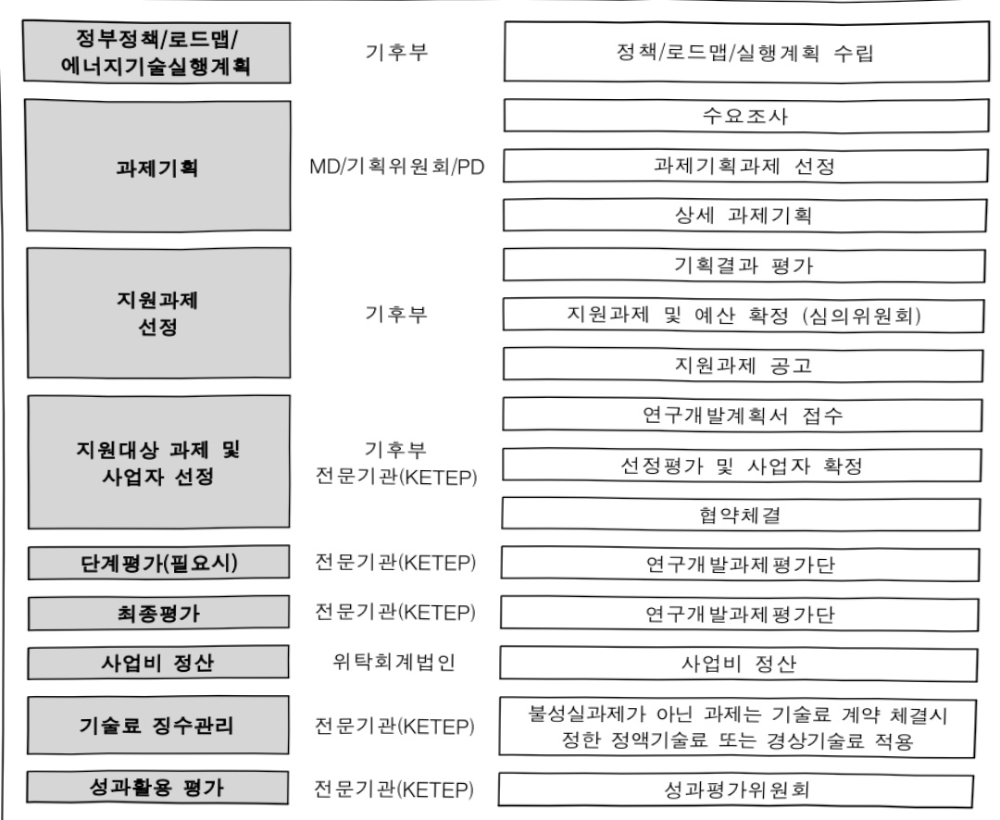

# 수용가전기설비원격점검및디지털안전기술개발(R&D)

**해당 페이지**: PDF 2855 ~ 2862 쪽 해당

**부처**: 기후에너지환경부
**분야**: 산업·중소기업 및 에너지
**회계유형**: 에너지및자원 사업특별회계
**2026 확정예산**: 4000.0 백만원
**전년대비 증감률**: None%
**AI 도메인**: 재난/안전

---

### 가. 예산 총괄표

(단위:백만원,%)

<table border=1 style='margin: auto; word-wrap: break-word;'><tr><td rowspan="2">사업명</td><td rowspan="2">2024년 결산</td><td colspan="2">2025년 예산</td><td colspan="2">2026년</td><td rowspan="2">증감 (B-A)</td><td rowspan="2">(B-A)/A</td></tr><tr><td style='text-align: center; word-wrap: break-word;'>본예산(A)</td><td style='text-align: center; word-wrap: break-word;'>추경</td><td style='text-align: center; word-wrap: break-word;'>정부안</td><td style='text-align: center; word-wrap: break-word;'>확정(B)</td></tr><tr><td style='text-align: center; word-wrap: break-word;'>수용가 전기설비 원격점검 및 디지털 안전기술개발(R&amp;D)</td><td style='text-align: center; word-wrap: break-word;'>-</td><td style='text-align: center; word-wrap: break-word;'>-</td><td style='text-align: center; word-wrap: break-word;'>-</td><td style='text-align: center; word-wrap: break-word;'>4,000</td><td style='text-align: center; word-wrap: break-word;'>4,000</td><td style='text-align: center; word-wrap: break-word;'>순증</td><td style='text-align: center; word-wrap: break-word;'>-</td></tr></table>

## □ 기능별(내역사업별), 목별 애산안 내역

(단위:백만원)

<table border=1 style='margin: auto; word-wrap: break-word;'><tr><td rowspan="3"></td><td colspan="5">2024</td><td colspan="7">2025</td><td rowspan="3">2026예산</td></tr><tr><td rowspan="2">예산액(추경)</td><td rowspan="2">예산현액</td><td rowspan="2">집행액[실집행액]</td><td rowspan="2">이월액</td><td rowspan="2">불용액</td><td rowspan="2">본예산</td><td rowspan="2">예산현액</td><td rowspan="2">집행액[실집행액]</td><td colspan="2">전년도 이월액제외</td><td rowspan="2">이월예상액</td><td rowspan="2">불용예상액</td></tr><tr><td style='text-align: center; word-wrap: break-word;'>예산현액</td><td style='text-align: center; word-wrap: break-word;'>집행액[실집행액]</td></tr><tr><td style='text-align: center; word-wrap: break-word;'>○ 기능별 분류(합계)</td><td style='text-align: center; word-wrap: break-word;'>-</td><td style='text-align: center; word-wrap: break-word;'>-</td><td style='text-align: center; word-wrap: break-word;'>-</td><td style='text-align: center; word-wrap: break-word;'>-</td><td style='text-align: center; word-wrap: break-word;'>-</td><td style='text-align: center; word-wrap: break-word;'>-</td><td style='text-align: center; word-wrap: break-word;'>-</td><td style='text-align: center; word-wrap: break-word;'>-</td><td style='text-align: center; word-wrap: break-word;'>-</td><td style='text-align: center; word-wrap: break-word;'>-</td><td style='text-align: center; word-wrap: break-word;'>-</td><td style='text-align: center; word-wrap: break-word;'>-</td><td style='text-align: center; word-wrap: break-word;'>4,000</td></tr><tr><td style='text-align: center; word-wrap: break-word;'>· 수용가  전기설비원격점검 및 디지털 안전 기술개발(R&amp;D)</td><td style='text-align: center; word-wrap: break-word;'>-</td><td style='text-align: center; word-wrap: break-word;'>-</td><td style='text-align: center; word-wrap: break-word;'>-</td><td style='text-align: center; word-wrap: break-word;'>-</td><td style='text-align: center; word-wrap: break-word;'>-</td><td style='text-align: center; word-wrap: break-word;'>-</td><td style='text-align: center; word-wrap: break-word;'>-</td><td style='text-align: center; word-wrap: break-word;'>-</td><td style='text-align: center; word-wrap: break-word;'>-</td><td style='text-align: center; word-wrap: break-word;'>-</td><td style='text-align: center; word-wrap: break-word;'>-</td><td style='text-align: center; word-wrap: break-word;'>-</td><td style='text-align: center; word-wrap: break-word;'>4,000</td></tr><tr><td style='text-align: center; word-wrap: break-word;'>○ 비목별 분류(합계)</td><td style='text-align: center; word-wrap: break-word;'>-</td><td style='text-align: center; word-wrap: break-word;'>-</td><td style='text-align: center; word-wrap: break-word;'>-</td><td style='text-align: center; word-wrap: break-word;'>-</td><td style='text-align: center; word-wrap: break-word;'>-</td><td style='text-align: center; word-wrap: break-word;'>-</td><td style='text-align: center; word-wrap: break-word;'>-</td><td style='text-align: center; word-wrap: break-word;'>-</td><td style='text-align: center; word-wrap: break-word;'>-</td><td style='text-align: center; word-wrap: break-word;'>-</td><td style='text-align: center; word-wrap: break-word;'>-</td><td style='text-align: center; word-wrap: break-word;'>-</td><td style='text-align: center; word-wrap: break-word;'>4,000</td></tr><tr><td style='text-align: center; word-wrap: break-word;'>· 연구개발활동비등(360-05)</td><td style='text-align: center; word-wrap: break-word;'>-</td><td style='text-align: center; word-wrap: break-word;'>-</td><td style='text-align: center; word-wrap: break-word;'>-</td><td style='text-align: center; word-wrap: break-word;'>-</td><td style='text-align: center; word-wrap: break-word;'>-</td><td style='text-align: center; word-wrap: break-word;'>-</td><td style='text-align: center; word-wrap: break-word;'>-</td><td style='text-align: center; word-wrap: break-word;'>-</td><td style='text-align: center; word-wrap: break-word;'>-</td><td style='text-align: center; word-wrap: break-word;'>-</td><td style='text-align: center; word-wrap: break-word;'>-</td><td style='text-align: center; word-wrap: break-word;'>-</td><td style='text-align: center; word-wrap: break-word;'>4,000</td></tr><tr><td style='text-align: center; word-wrap: break-word;'>○ 기능비목별 분류(합계)</td><td style='text-align: center; word-wrap: break-word;'>-</td><td style='text-align: center; word-wrap: break-word;'>-</td><td style='text-align: center; word-wrap: break-word;'>-</td><td style='text-align: center; word-wrap: break-word;'>-</td><td style='text-align: center; word-wrap: break-word;'>-</td><td style='text-align: center; word-wrap: break-word;'>-</td><td style='text-align: center; word-wrap: break-word;'>-</td><td style='text-align: center; word-wrap: break-word;'>-</td><td style='text-align: center; word-wrap: break-word;'>-</td><td style='text-align: center; word-wrap: break-word;'>-</td><td style='text-align: center; word-wrap: break-word;'>-</td><td style='text-align: center; word-wrap: break-word;'>-</td><td style='text-align: center; word-wrap: break-word;'>4,000</td></tr><tr><td style='text-align: center; word-wrap: break-word;'>· 수용가  전기설비원격점검 및 디지털 안전 기술개발(R&amp;D)</td><td style='text-align: center; word-wrap: break-word;'>-</td><td style='text-align: center; word-wrap: break-word;'>-</td><td style='text-align: center; word-wrap: break-word;'>-</td><td style='text-align: center; word-wrap: break-word;'>-</td><td style='text-align: center; word-wrap: break-word;'>-</td><td style='text-align: center; word-wrap: break-word;'>-</td><td style='text-align: center; word-wrap: break-word;'>-</td><td style='text-align: center; word-wrap: break-word;'>-</td><td style='text-align: center; word-wrap: break-word;'>-</td><td style='text-align: center; word-wrap: break-word;'>-</td><td style='text-align: center; word-wrap: break-word;'>-</td><td style='text-align: center; word-wrap: break-word;'>-</td><td style='text-align: center; word-wrap: break-word;'>4,000</td></tr><tr><td style='text-align: center; word-wrap: break-word;'>· 연구개발활동비등(360-05)</td><td style='text-align: center; word-wrap: break-word;'>-</td><td style='text-align: center; word-wrap: break-word;'>-</td><td style='text-align: center; word-wrap: break-word;'>-</td><td style='text-align: center; word-wrap: break-word;'>-</td><td style='text-align: center; word-wrap: break-word;'>-</td><td style='text-align: center; word-wrap: break-word;'>-</td><td style='text-align: center; word-wrap: break-word;'>-</td><td style='text-align: center; word-wrap: break-word;'>-</td><td style='text-align: center; word-wrap: break-word;'>-</td><td style='text-align: center; word-wrap: break-word;'>-</td><td style='text-align: center; word-wrap: break-word;'>-</td><td style='text-align: center; word-wrap: break-word;'>-</td><td style='text-align: center; word-wrap: break-word;'>4,000</td></tr></table>

---

### 나. 사업설명자료

## 1 ) 사업목적·내용

- 수용가 전기설비(220V~154KV) 원격점검 장치 상용화 및 성능평가 기술 및 AI 기반 디지털 전기안전관리 플랫폼 개발로 전기재해 예방 및 해외시장 진출 지원

- 저압 전기설비 원격 안전관리 및 송수신 장치 개발·실증 및 확산전략 수립

- 특고압 전기설비 안전데이터 수집 체계 및 성능평가 기술 개발

- AI 기반 전기설비(220V~154KV) 디지털 안전관리 플랫폼 개발 및 실증

## 2 ) 사업개요

□ 사업근거 및 추진경위

① 법령상 근거 및 조항 적시

-에너지 및 자원사업 특별회계법

제1조(목적) 이 법은 에너지의 수급 및 가격 안정과 에너지 및 자원 관련 사업의 효과적인 추진을 위하여 에너지 및 자원사업 특별회계를 설치하고 그 운용에 관한 사항을 규정함을 목적으로 한다.

제2조(정의) 이 법에서 “에너지 및 자원 관련 사업”이란 다음 각 호의 사업을 말한다

1. 에너지 및 지하자원의 개발·생산·수송·비축·공급·품질관리 사업

3. 에너지절약과 신에너지 및 재생에너지 사업

5. 에너지복지 사업

제5조(투자계정의 세입·세출) ② 투자계정의 세출은 다음 각 호와 같다.

1. 에너지 및 자원 관련 사업에 필요한 사업비

2. 에너지 및 자원 관련 사업에 대한 출연 또는 보조

3. 에너지 및 자원 관련 사업을 하는 법인·기관 또는 단체에의 출연금 또는 출자금

## -에너지 및 자원사업 특별회계법시행령

제3조(사업의 범위 등) ① 법 제5조제2항제1호부터 제3호까지의 규정에 따른 에너지 및 자원 관련 사업은 다음 각 호와 같다.

9.「에너지법」에 따른 에너지기술개발사업

---

## -에너지법

제2조(정의) 이 법에서 사용하는 용어의 뜻은 다음과 같다.

1. "에너지"란 연료·열 및 전기를 말한다.

제14조(에너지기술개발사업비) ④ 에너지기술개발사업비는 다음 각 호의 사업지원을 위하여 사용하여야 한다.

1. 에너지기술의 연구·개발에 관한 사항

- 전기안전관리법 제7조(전기안전관리 관련 기술의 연구·개발)

② 기후에너지환경부장관은 제1항에 따른 연구·개발에 필요한 재정적 지원을 할 수 있다.

## ② 추진경위

- (20.6월) 제23차 에너지위원회 개최 안건 통과(기후부)

* 주택용 전기설비 정기점검 방식의 비대면 원격점검 제도 도입

- (22.12월) 전기안전관리법 시행규칙 개정(기후부)

* 원격 전기안전점검(1~3년 주기적 대면 점검 → 비대면 원격점검 전환) 제도화

- (25. 3월) 제1차 전기안전관리 기본계획 발표(기후부)

* (추진과제 2-1) 위험도 기반 차등관리 및 검사기법 도입., (추진과제 3-1) 실시간 원격감시 안전관리체계 구축, (추진과제 3-2) 실증 기반 전기안전 인프라 확충

- (25.1) 수용가 전기설비 원격점검 및 디지털 안전관리 기술개발 기획

## □ 주요내용

① 사업규모

- 총사업비(해당되는 경우에만 기재) : 해당없음

-사업기간:26~29년

- 최근 5년 간 투입된 사업비(예산액기준, 추경편성한 연도에는 추경포함)

<table border=1 style='margin: auto; word-wrap: break-word;'><tr><td style='text-align: center; word-wrap: break-word;'>연도</td><td style='text-align: center; word-wrap: break-word;'>2022</td><td style='text-align: center; word-wrap: break-word;'>2023</td><td style='text-align: center; word-wrap: break-word;'>2024</td><td style='text-align: center; word-wrap: break-word;'>2025</td><td style='text-align: center; word-wrap: break-word;'>2026</td></tr><tr><td style='text-align: center; word-wrap: break-word;'>사업비</td><td style='text-align: center; word-wrap: break-word;'>-</td><td style='text-align: center; word-wrap: break-word;'>-</td><td style='text-align: center; word-wrap: break-word;'>-</td><td style='text-align: center; word-wrap: break-word;'>-</td><td style='text-align: center; word-wrap: break-word;'>4,000</td></tr></table>

② 사업추진체계

- 사업시행방법 : 출연(Matching Fund, 연구수행형태에 따라 33~100% 정부지원)

- 사업시행주체 : 한국에너지기술평가원

---

- 사업 수혜자 : 기업, 대학, 연구소 등

- 보조, 융자, 출연, 출자 등의 경우 보조·융자 등 지원 비율 및 법적근거

<table border=1 style='margin: auto; word-wrap: break-word;'><tr><td style='text-align: center; word-wrap: break-word;'>내역사업명</td><td style='text-align: center; word-wrap: break-word;'>구분</td><td style='text-align: center; word-wrap: break-word;'>피보조·피출연 등 기관명</td><td style='text-align: center; word-wrap: break-word;'>지원 금액 (2026예산)</td><td style='text-align: center; word-wrap: break-word;'>지원 비율(%)</td><td style='text-align: center; word-wrap: break-word;'>보조율 법적근거 (해당 조항)</td></tr><tr><td style='text-align: center; word-wrap: break-word;'>수용가 전기설비 원격점검 및 디지털 안전기술개발</td><td style='text-align: center; word-wrap: break-word;'>출연</td><td style='text-align: center; word-wrap: break-word;'>한국에너지 기술평가원</td><td style='text-align: center; word-wrap: break-word;'>4,000</td><td style='text-align: center; word-wrap: break-word;'>33~100%</td><td style='text-align: center; word-wrap: break-word;'>산업기술 혁신사업 공통 운영요령 제24조(정부지원연구개발비의 지원기준)</td></tr></table>

3) 2026년도 예산 산출 근거

(1) 수용가 전기설비 원격점검 및 디지털 안전관리 기술개발 지원: (2025) 0 → (2026요구) 4,000백만원, 순증

- (요구) 수용가 전기설비(220V~154KV) 원격점검 장치 상용화 및 성능평가 기술 및 AI 기반 디지털 전기안전관리 플랫폼 개발에 3개 과제 4,000백만원 요구

- (산출) 신규 : 3개 과제 x 1,777.8백만원 ×9/12개월 = 4,000백만원

ㅇ 2025년도 예산 및 2026년도 예산 산출 세부내역 비교

<table border=1 style='margin: auto; word-wrap: break-word;'><tr><td colspan="2">2025년 예산</td><td colspan="2">2026년 예산</td></tr><tr><td style='text-align: center; word-wrap: break-word;'>예산</td><td style='text-align: center; word-wrap: break-word;'>산출내역</td><td style='text-align: center; word-wrap: break-word;'>예산</td><td style='text-align: center; word-wrap: break-word;'>산출내역</td></tr><tr><td style='text-align: center; word-wrap: break-word;'>-</td><td style='text-align: center; word-wrap: break-word;'>-</td><td style='text-align: center; word-wrap: break-word;'>4,000</td><td style='text-align: center; word-wrap: break-word;'>○ 연구개발활동비등(360-05): 4,000백만원 가. (총괄) AI 기반 수용가 전기설비 (154kV 이하) 디지털 안전관리 플랫폼 개발 및 실증 (26년 2,000백만원) 나. (세부1) 미래 부하환경을 고려한 저압 전기설비 원격 안전점 검 시스템 개발 및 확산 전략 수립 (26년 1,000백만원) 다. (세부2) 특고압 전기설비 안전 데이터 수집 장치 및 시스템 성능평가 기술 개발 (26년 2,000백만원)</td></tr></table>

## 4 ) 사업효과

☐ 사업영향, 산출물 성과지표 등

① 2022~2026년도 성과계획서 상 성과지표 및 최근 5년간 성과 달성도

---

<table border=1 style='margin: auto; word-wrap: break-word;'><tr><td style='text-align: center; word-wrap: break-word;'>성과지표</td><td style='text-align: center; word-wrap: break-word;'>구분</td><td style='text-align: center; word-wrap: break-word;'>2022</td><td style='text-align: center; word-wrap: break-word;'>2023</td><td style='text-align: center; word-wrap: break-word;'>2024</td><td style='text-align: center; word-wrap: break-word;'>2025</td><td style='text-align: center; word-wrap: break-word;'>2026</td><td style='text-align: center; word-wrap: break-word;'>2026 목표치산출근거</td><td style='text-align: center; word-wrap: break-word;'>측정산식(또는 측정방법)</td><td style='text-align: center; word-wrap: break-word;'>자료수집방법(또는 자료출처)</td></tr><tr><td rowspan="3">①사업화매출액(억원)</td><td style='text-align: center; word-wrap: break-word;'>목표</td><td style='text-align: center; word-wrap: break-word;'>신규</td><td style='text-align: center; word-wrap: break-word;'>신규</td><td style='text-align: center; word-wrap: break-word;'>신규</td><td style='text-align: center; word-wrap: break-word;'>신규</td><td style='text-align: center; word-wrap: break-word;'>12.5</td><td rowspan="3">-최근 3년 평균치(잠정): 12.2억원(9.4억원(&#x27;22&#x27;)-11.9억원(&#x27;23&#x27;)-15.2억원(&#x27;24,잠정))-26년 목표치: 최근 3년(&#x27;22&#x27;-&#x27;24&#x27;) 평균치 사업화매출액의 3% 상향인 12.5억원으로 설정</td><td rowspan="3">ㅇ 측정산식: ∑에너지기술개발사업사업화매출액(억원)/정부지원금(10억원) - 사업화매출액(억원): 해당 프로그램 내의 사업 지원을 통해 사업화에 성공한 과제의 국내외매출 발생액</td><td rowspan="3">국가과학기술지식정보서비스(NTIS) 등록값, 주관기관취합 및 성과조사분석 보고서</td></tr><tr><td style='text-align: center; word-wrap: break-word;'>실적</td><td style='text-align: center; word-wrap: break-word;'>신규</td><td style='text-align: center; word-wrap: break-word;'>신규</td><td style='text-align: center; word-wrap: break-word;'>신규</td><td style='text-align: center; word-wrap: break-word;'>-</td><td style='text-align: center; word-wrap: break-word;'>-</td></tr><tr><td style='text-align: center; word-wrap: break-word;'>달성도</td><td style='text-align: center; word-wrap: break-word;'></td><td style='text-align: center; word-wrap: break-word;'></td><td style='text-align: center; word-wrap: break-word;'></td><td style='text-align: center; word-wrap: break-word;'>-</td><td style='text-align: center; word-wrap: break-word;'>-</td></tr></table>

② 성과지표 이외의 연도별 사업추진 경과 및 실적 : 해당없음

③향후(2026년도 이후)기대효과

- (정책적 측면) 디지털 전기안전관리 시스템 구축과 연계한 점검 주기 조정(5년) 으로 정부예산 연간 250억, 인력 240명 절감 효과 예상

* 원격점검시 총 점검호수(주거시설 1,200만호, 비주거시설 1,300만호) 중 연간 주거시설 400만호, 비주거시설 260만호(1300만호/5년 주기)로 연간 660만호로 조정

※ 1) 연간 안전점검 비용 251억 절감(270만호(930만호) = 660만호) × 9,305원(25년 정기점검 단가)

2) 연간 점검인력 240명 감축 가능(825명(25년 연간 투입 인력) × 660만호(디지털안전관리)/930만호(방문점검)

- (경제적 측면) 특고압 전기설비 안전데이터 수집 센서·모니터링 시스템 국산화 및

성능 인증을 통해 글로벌 시장에서 연간 약 439억원 수출 효과 기대

* (산출) 1조 1,221억원('30년 글로벌 부분방전(PD) 센서 및 모니터링 시스템 시장 규모, CAGR 5.4%, market us '23년) × 3.91%((국내 중전기기 3사 '23년 전력변압기 수주 잔고 10.8조원 ÷ 전력변압기 '30년 시장 예측 규모 277조 3,800억원) × 100 [%]) = 약 439억원)

- (기술적 측면) 전기 데이터 기반 재난예방 기술 확보 및 AI 기반 디지털 전기안전관리 체계 전

환으로 전기로 인한 화재 비율을 20% 이내로 저감 예상

* (23년) 22.8% → (29년) 19.8% : 연평균('21 ~ '23) 화재 발생 건수(전기화재 발생건수(8,638) - 화재예방 기능 영역의 주택 누전/과부하 화재사고 예방건수(997) ÷ 연평균 화재 발생 건수(38,413) = 19.8%)

5) 타당성조사 및 예비타당성조사 시행여부 및 결과 요지 : 해당없음

6) 총사업비 대상사업 여부 및 내역 : 해당없음

---

## 7 ) 사업 집행절차

## 8 ) 중기재정계획 상 연도별 투자계획 및 추진경과

(단위: 백만원)

<table border=1 style='margin: auto; word-wrap: break-word;'><tr><td style='text-align: center; word-wrap: break-word;'>$ ^{*} $중기 재정계획</td><td style='text-align: center; word-wrap: break-word;'>2024</td><td style='text-align: center; word-wrap: break-word;'>2025</td><td style='text-align: center; word-wrap: break-word;'>2026</td><td style='text-align: center; word-wrap: break-word;'>2027</td><td style='text-align: center; word-wrap: break-word;'>2028</td><td style='text-align: center; word-wrap: break-word;'>2029</td></tr><tr><td style='text-align: center; word-wrap: break-word;'>2024~2028</td><td style='text-align: center; word-wrap: break-word;'>-</td><td style='text-align: center; word-wrap: break-word;'>-</td><td style='text-align: center; word-wrap: break-word;'>-</td><td style='text-align: center; word-wrap: break-word;'>-</td><td style='text-align: center; word-wrap: break-word;'>-</td><td style='text-align: center; word-wrap: break-word;'>☑</td></tr><tr><td style='text-align: center; word-wrap: break-word;'>2025~2029</td><td style='text-align: center; word-wrap: break-word;'>☑</td><td style='text-align: center; word-wrap: break-word;'>-</td><td style='text-align: center; word-wrap: break-word;'>4,000</td><td style='text-align: center; word-wrap: break-word;'>7,000</td><td style='text-align: center; word-wrap: break-word;'>7,500</td><td style='text-align: center; word-wrap: break-word;'>3,500</td></tr></table>

---

9) 최근 3년간 동 사업에 대한 주요 외부지적사항 및 평가, 문제점 및 대책 : 해당없음

10) 향후 추진방향 및 추진계획

수용가 전기설비(220V~154KV) 원격점검 장치 상용화 및 성능평가 기술 및 AI 기반 디지털 전기안전관리 플랫폼 개발로 전기재해 예방 및 해외시장 진출 지원

11) 해당사업에 대한 각종 사업평가의 결과 : 해당없음

12) 해당사업에 대한 부처 자체평가의 결과 : 해당없음

13) 부처 건의사항 : 해당없음

다.최근 4년간 결산내역 : 해당없음

---

<table border=1 style='margin: auto; word-wrap: break-word;'><tr><td style='text-align: center; word-wrap: break-word;'>사 업 명</td></tr><tr><td style='text-align: center; word-wrap: break-word;'>(32) 장거리 고압수소 배관망 고안전성 확보 및 AI기반 안전관리 기술개발 (R&amp;D)(5701-342)</td></tr></table>

□ 사업 코드 정보

<table border=1 style='margin: auto; word-wrap: break-word;'><tr><td style='text-align: center; word-wrap: break-word;'>구분</td><td style='text-align: center; word-wrap: break-word;'>회계</td><td style='text-align: center; word-wrap: break-word;'>소관</td><td style='text-align: center; word-wrap: break-word;'>실국(기관)</td><td style='text-align: center; word-wrap: break-word;'>계정</td><td style='text-align: center; word-wrap: break-word;'>분야</td><td style='text-align: center; word-wrap: break-word;'>부문</td></tr><tr><td style='text-align: center; word-wrap: break-word;'>코드</td><td style='text-align: center; word-wrap: break-word;'>에너지및자원</td><td style='text-align: center; word-wrap: break-word;'>기후에너지</td><td style='text-align: center; word-wrap: break-word;'>기후에너지정책실</td><td rowspan="2">투자계정</td><td style='text-align: center; word-wrap: break-word;'>110</td><td style='text-align: center; word-wrap: break-word;'>115</td></tr><tr><td style='text-align: center; word-wrap: break-word;'>명칭</td><td style='text-align: center; word-wrap: break-word;'>사업특별회계</td><td style='text-align: center; word-wrap: break-word;'>환경부</td><td style='text-align: center; word-wrap: break-word;'>수소열산업정책관</td><td style='text-align: center; word-wrap: break-word;'>산업·중소기업 및 에너지</td><td style='text-align: center; word-wrap: break-word;'>에너지 및 자원개발</td></tr></table>

<table border=1 style='margin: auto; word-wrap: break-word;'><tr><td style='text-align: center; word-wrap: break-word;'>구분</td><td style='text-align: center; word-wrap: break-word;'>프로그램</td><td style='text-align: center; word-wrap: break-word;'>단위사업</td><td style='text-align: center; word-wrap: break-word;'>세부사업</td></tr><tr><td style='text-align: center; word-wrap: break-word;'>코드</td><td style='text-align: center; word-wrap: break-word;'>5700</td><td style='text-align: center; word-wrap: break-word;'>5701</td><td style='text-align: center; word-wrap: break-word;'>342</td></tr><tr><td style='text-align: center; word-wrap: break-word;'>명칭</td><td style='text-align: center; word-wrap: break-word;'>에너지기술개발</td><td style='text-align: center; word-wrap: break-word;'>에너지수요기술</td><td style='text-align: center; word-wrap: break-word;'>장거리 고압수소 배관망 고안전성 확보 및 AI기반 안전관리 기술개발</td></tr></table>

<table border=1 style='margin: auto; word-wrap: break-word;'><tr><td colspan="6">☐ 사업 성격 (공통요구자료 Ⅱ-1 작성유의사항 4. 참조, 해당하는 사항에 “○” 표시)</td></tr><tr><td rowspan="2">신규 계속 완료</td><td rowspan="2">예비타당성 실시여부</td><td rowspan="2">총사업비 관리대상</td><td rowspan="2">총액계상 예산사업</td><td colspan="2">사업소관 변경정보</td></tr><tr><td colspan="2">2026예산 시 소관</td></tr><tr><td style='text-align: center; word-wrap: break-word;'>☐</td><td style='text-align: center; word-wrap: break-word;'></td><td style='text-align: center; word-wrap: break-word;'></td><td style='text-align: center; word-wrap: break-word;'></td><td colspan="2"></td></tr></table>

□ 사업 지원 형태 및 지원을 (최소한 한 개는 반드시 선택하시오. 해당사항에 0 표시)

<table border=1 style='margin: auto; word-wrap: break-word;'><tr><td style='text-align: center; word-wrap: break-word;'>직접</td><td style='text-align: center; word-wrap: break-word;'>출자</td><td style='text-align: center; word-wrap: break-word;'>출연</td><td style='text-align: center; word-wrap: break-word;'>보조</td><td style='text-align: center; word-wrap: break-word;'>융자</td><td style='text-align: center; word-wrap: break-word;'>국고보조율(%)</td><td style='text-align: center; word-wrap: break-word;'>융자율(%)</td></tr><tr><td style='text-align: center; word-wrap: break-word;'></td><td style='text-align: center; word-wrap: break-word;'></td><td style='text-align: center; word-wrap: break-word;'>○</td><td style='text-align: center; word-wrap: break-word;'></td><td style='text-align: center; word-wrap: break-word;'></td><td style='text-align: center; word-wrap: break-word;'></td><td style='text-align: center; word-wrap: break-word;'></td></tr></table>

☐ 사업 담당자

<table border=1 style='margin: auto; word-wrap: break-word;'><tr><td style='text-align: center; word-wrap: break-word;'>사업명</td><td colspan="2">구분</td></tr><tr><td rowspan="3">장거리고압수소배관망고안전성 확보 및 AI기반안전관리기술개발</td><td rowspan="2">소관부처</td><td style='text-align: center; word-wrap: break-word;'>기후에너지정책실 수소열산업정책관</td></tr><tr><td style='text-align: center; word-wrap: break-word;'>에너지안전효율과</td></tr><tr><td style='text-align: center; word-wrap: break-word;'>사업시행주체</td><td style='text-align: center; word-wrap: break-word;'>한국에너지기술평가원</td></tr></table>

---

### 원본 PDF 크롭 이미지

