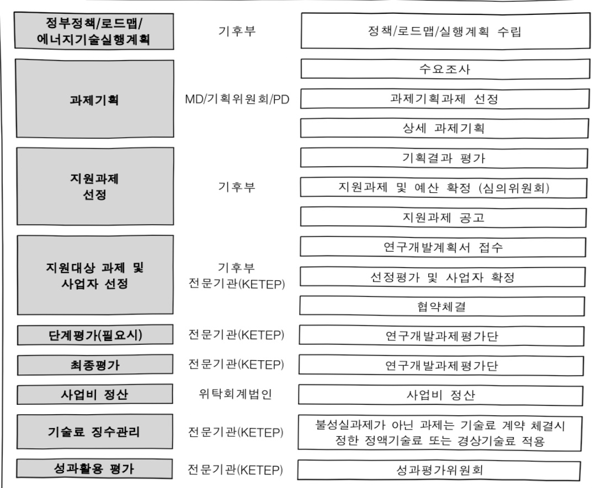

# 장거리고압수소배관망고안전성확보및AI기반안전관리…

**해당 페이지**: PDF 2863 ~ 2870 쪽 해당

**부처**: 기후에너지환경부
**분야**: 산업·중소기업 및 에너지
**회계유형**: 에너지및자원 사업특별회계
**2026 확정예산**: 4000.0 백만원
**전년대비 증감률**: None%
**AI 도메인**: AI반도체, 건설/스마트시티, 피지컬AI/디바이스

---

### 가.지출계획 총괄표

(단위:백만원,%)

<table border=1 style='margin: auto; word-wrap: break-word;'><tr><td rowspan="2">사업명</td><td rowspan="2">2024년 결산</td><td colspan="2">2025년 예산</td><td colspan="2">2026년</td><td rowspan="2">증감(B-A)</td><td rowspan="2">(B-A)/A</td></tr><tr><td style='text-align: center; word-wrap: break-word;'>본예산(A)</td><td style='text-align: center; word-wrap: break-word;'>추경</td><td style='text-align: center; word-wrap: break-word;'>정부안</td><td style='text-align: center; word-wrap: break-word;'>확정(B)</td></tr><tr><td style='text-align: center; word-wrap: break-word;'>장거리고압수소배관망고안전성확보 및 AI기반안전관리기술개발</td><td style='text-align: center; word-wrap: break-word;'>-</td><td style='text-align: center; word-wrap: break-word;'>-</td><td style='text-align: center; word-wrap: break-word;'>-</td><td style='text-align: center; word-wrap: break-word;'>4,000</td><td style='text-align: center; word-wrap: break-word;'>4,000</td><td style='text-align: center; word-wrap: break-word;'>순증</td><td style='text-align: center; word-wrap: break-word;'>-</td></tr></table>

□ 기능별(내역사업별), 목별 계획 내역

(단위:백만원)

<table border=1 style='margin: auto; word-wrap: break-word;'><tr><td rowspan="3"></td><td colspan="5">2024</td><td colspan="7">2025</td><td rowspan="3">2026예산</td></tr><tr><td rowspan="2">예산액(추경)</td><td rowspan="2">예산현액</td><td rowspan="2">집행액[실집행액]</td><td rowspan="2">이월액</td><td rowspan="2">불용액</td><td rowspan="2">본예산</td><td rowspan="2">예산현액</td><td rowspan="2">집행액[실집행액]</td><td colspan="2">전년도이월액제외</td><td rowspan="2">이월예상액</td><td rowspan="2">불용예상액</td></tr><tr><td style='text-align: center; word-wrap: break-word;'>예산현액</td><td style='text-align: center; word-wrap: break-word;'>집행액[실집행액]</td></tr><tr><td style='text-align: center; word-wrap: break-word;'>○기능별 분류(합계)</td><td style='text-align: center; word-wrap: break-word;'>-</td><td style='text-align: center; word-wrap: break-word;'>-</td><td style='text-align: center; word-wrap: break-word;'>-</td><td style='text-align: center; word-wrap: break-word;'>-</td><td style='text-align: center; word-wrap: break-word;'>-</td><td style='text-align: center; word-wrap: break-word;'>-</td><td style='text-align: center; word-wrap: break-word;'>-</td><td style='text-align: center; word-wrap: break-word;'>-</td><td style='text-align: center; word-wrap: break-word;'>-</td><td style='text-align: center; word-wrap: break-word;'>-</td><td style='text-align: center; word-wrap: break-word;'>-</td><td style='text-align: center; word-wrap: break-word;'>-</td><td style='text-align: center; word-wrap: break-word;'>4,000</td></tr><tr><td style='text-align: center; word-wrap: break-word;'>·장거리 고압수소배관망 고안전성확보 및 AI기반안전관리 기술개발</td><td style='text-align: center; word-wrap: break-word;'>-</td><td style='text-align: center; word-wrap: break-word;'>-</td><td style='text-align: center; word-wrap: break-word;'>-</td><td style='text-align: center; word-wrap: break-word;'>-</td><td style='text-align: center; word-wrap: break-word;'>-</td><td style='text-align: center; word-wrap: break-word;'>-</td><td style='text-align: center; word-wrap: break-word;'>-</td><td style='text-align: center; word-wrap: break-word;'>-</td><td style='text-align: center; word-wrap: break-word;'>-</td><td style='text-align: center; word-wrap: break-word;'>-</td><td style='text-align: center; word-wrap: break-word;'>-</td><td style='text-align: center; word-wrap: break-word;'>-</td><td style='text-align: center; word-wrap: break-word;'>4,000</td></tr><tr><td style='text-align: center; word-wrap: break-word;'>○비목별 분류(합계)</td><td style='text-align: center; word-wrap: break-word;'>-</td><td style='text-align: center; word-wrap: break-word;'>-</td><td style='text-align: center; word-wrap: break-word;'>-</td><td style='text-align: center; word-wrap: break-word;'>-</td><td style='text-align: center; word-wrap: break-word;'>-</td><td style='text-align: center; word-wrap: break-word;'>-</td><td style='text-align: center; word-wrap: break-word;'>-</td><td style='text-align: center; word-wrap: break-word;'>-</td><td style='text-align: center; word-wrap: break-word;'>-</td><td style='text-align: center; word-wrap: break-word;'>-</td><td style='text-align: center; word-wrap: break-word;'>-</td><td style='text-align: center; word-wrap: break-word;'>-</td><td style='text-align: center; word-wrap: break-word;'>4,000</td></tr><tr><td style='text-align: center; word-wrap: break-word;'>·연구개발활동비등(360-05)</td><td style='text-align: center; word-wrap: break-word;'>-</td><td style='text-align: center; word-wrap: break-word;'>-</td><td style='text-align: center; word-wrap: break-word;'>-</td><td style='text-align: center; word-wrap: break-word;'>-</td><td style='text-align: center; word-wrap: break-word;'>-</td><td style='text-align: center; word-wrap: break-word;'>-</td><td style='text-align: center; word-wrap: break-word;'>-</td><td style='text-align: center; word-wrap: break-word;'>-</td><td style='text-align: center; word-wrap: break-word;'>-</td><td style='text-align: center; word-wrap: break-word;'>-</td><td style='text-align: center; word-wrap: break-word;'>-</td><td style='text-align: center; word-wrap: break-word;'>-</td><td style='text-align: center; word-wrap: break-word;'>4,000</td></tr><tr><td style='text-align: center; word-wrap: break-word;'>○기능비목별 분류(합계)</td><td style='text-align: center; word-wrap: break-word;'>-</td><td style='text-align: center; word-wrap: break-word;'>-</td><td style='text-align: center; word-wrap: break-word;'>-</td><td style='text-align: center; word-wrap: break-word;'>-</td><td style='text-align: center; word-wrap: break-word;'>-</td><td style='text-align: center; word-wrap: break-word;'>-</td><td style='text-align: center; word-wrap: break-word;'>-</td><td style='text-align: center; word-wrap: break-word;'>-</td><td style='text-align: center; word-wrap: break-word;'>-</td><td style='text-align: center; word-wrap: break-word;'>-</td><td style='text-align: center; word-wrap: break-word;'>-</td><td style='text-align: center; word-wrap: break-word;'>-</td><td style='text-align: center; word-wrap: break-word;'>4,000</td></tr><tr><td style='text-align: center; word-wrap: break-word;'>·장거리 고압수소배관망 고안전성확보 및 AI기반안전관리 기술개발·연구개발활동비등(360-05)</td><td style='text-align: center; word-wrap: break-word;'>-</td><td style='text-align: center; word-wrap: break-word;'>-</td><td style='text-align: center; word-wrap: break-word;'>-</td><td style='text-align: center; word-wrap: break-word;'>-</td><td style='text-align: center; word-wrap: break-word;'>-</td><td style='text-align: center; word-wrap: break-word;'>-</td><td style='text-align: center; word-wrap: break-word;'>-</td><td style='text-align: center; word-wrap: break-word;'>-</td><td style='text-align: center; word-wrap: break-word;'>-</td><td style='text-align: center; word-wrap: break-word;'>-</td><td style='text-align: center; word-wrap: break-word;'>-</td><td style='text-align: center; word-wrap: break-word;'>-</td><td style='text-align: center; word-wrap: break-word;'>4,000</td></tr></table>

---

### 나. 사업설명자료

## 1 ) 사업목적·내용

- 장거리 고압수소 배관망의 수소누출 초정밀 감지 및 취성·부식 탐상기술과 AI 기반 위험예측·진단 안전관리 플랫폼 기술 확보를 통해 안전한 수소산업 육성 지원

· 초정밀 수소누출 감지 기술 및 온디바이스 AI 제어모듈 개발

·지하배관망내부상태수소취성검사·부식결함탐상기술개발및실증

AI 기반 위험예측·진단·자율안전 등 고안전성 확보 기술 개발

· 장거리 수소 배관망 디지털트런 기반 안전관리 플랫폼 개발 및 실증

## 2 ) 사업개요

□ 사업근거 및 추진경위

① 법령상 근거 및 조항 적시

-에너지 및 자원사업 특별회계법

제1조(목적) 이 법은 에너지의 수급 및 가격 안정과 에너지 및 자원 관련 사업의

효과적인 추진을 위하여 에너지 및 자원사업 특별회계를 설치하고 그 운용에 관한

사항을 규정함을 목적으로 한다.

제2조(정의) 이 법에서 "에너지 및 자원 관련 사업"이란 다음 각 호의 사업을 말한다

1. 에너지 및 지하자원의 개발·생산·수송·비축·공급·품질관리 사업

4. 가스의 안전관리와 유통구조의 개선사업

5. 에너지복지 사업

제5조(투자계정의 세입·세출) ② 투자계정의 세출은 다음 각 호와 같다.

1. 에너지 및 자원 관련 사업에 필요한 사업비

2. 에너지 및 자원 관련 사업에 대한 출연 또는 보조

3. 에너지 및 자원 관련 사업을 하는 법인·기관 또는 단체에의 출연금 또는 출자금

## -에너지 및 자원사업 특별회계법시행령

제3조(사업의 범위 등) ① 법 제5조제2항제1호부터 제3호까지의 규정에 따른 에너지 및 자원 관련 사업은 다음 각 호와 같다.

9.「에너지법」에 따른 에너지기술개발사업

---

## -에너지법

제2조(정의)이법에서사용하는용어의뜻은다음과같다.

1. "에너지"란 연료·열 및 전기를 말한다.

제14조(에너지기술개발사업비) ④ 에너지기술개발사업비는 다음 각 호의 사업지원을 위하여 사용하여야 한다.

1.에너지기술의 연구·개발에 관한 사항

## -고압가스 안전관리법

제3조의3(고압가스등의 안전 기술 및 기준에 관한 연구·개발사업)

① 산업통상부장관은 다음 각 호의 어느 하나에 해당하는 기관이나 단체로 하여금 고압가스등의 안전 기술 및 기준에 관한 연구·개발사업을 수행하게 할 수 있다.

## ②추진경위

- (22.11월) 수소경제 이행 기본계획 발표(기후부)

* 24P-(수소 배관망 구축) 수소생산지역과 연계된 수소배관 최적거래 도출('22) 이후, 수소 생산 지역별 수요 특성에 맞춰 배관망 구축(~30)

- (23. 5월) 수소 안전관리 로드맵 2.0 발표(기후부)

* 5P-④(운송) 수소발전 등 대용량 수소 사용을 위한 단계적인 수소 배관망 구축 계획*

추진중으로 수소 배관망 전주기 안전성 확보가 필수

※(가스공사) (1단계,'25~'29)당진-평택→(2단계,'26~'31)평택-부천

- (24.11) 제7차 수소경제위원회 개최(기후부)

* 수소도시 2.0 추진전략의 수소생태계 확산을 위한 수소도시 고도화 수소배관 280km 인프라 확충

- (25. 1월) 장거리 고압수소 배관망 고안전성 확보 및 AI 기반 안전관리 기술개발 기획

## □주요내용

① 사업규모

- 총사업비(해당되는 경우에만 기재) : 해당없음

- 사업기간 : '26~'29년

- 최근 5년 간 투입된 사업비(예산액기준, 추경편성한 연도에는 추경포함)

<table border=1 style='margin: auto; word-wrap: break-word;'><tr><td style='text-align: center; word-wrap: break-word;'>$ \underline{\text{연도}} $</td><td style='text-align: center; word-wrap: break-word;'>2022</td><td style='text-align: center; word-wrap: break-word;'>2023</td><td style='text-align: center; word-wrap: break-word;'>2024</td><td style='text-align: center; word-wrap: break-word;'>2025</td><td style='text-align: center; word-wrap: break-word;'>2026</td></tr><tr><td style='text-align: center; word-wrap: break-word;'>사업비</td><td style='text-align: center; word-wrap: break-word;'>-</td><td style='text-align: center; word-wrap: break-word;'>-</td><td style='text-align: center; word-wrap: break-word;'>-</td><td style='text-align: center; word-wrap: break-word;'>-</td><td style='text-align: center; word-wrap: break-word;'>4,000</td></tr></table>

---

## ② 사업추진체계

-사업시행방법:출연(Matching Fund,연구수행형태에 따라 33~100% 정부지원)

-사업시행주체:한국에너지기술평가원

- 사업 수혜자 : 기업, 대학, 연구소 등

- 보조, 융자, 출연, 출자 등의 경우 보조·융자 등 지원 비율 및 법적근거

<table border=1 style='margin: auto; word-wrap: break-word;'><tr><td style='text-align: center; word-wrap: break-word;'>내역사업명</td><td style='text-align: center; word-wrap: break-word;'>구분</td><td style='text-align: center; word-wrap: break-word;'>피보조·피출연 등 기관명</td><td style='text-align: center; word-wrap: break-word;'>지원 금액 (2026예산)</td><td style='text-align: center; word-wrap: break-word;'>지원 비율(%)</td><td style='text-align: center; word-wrap: break-word;'>보조율 법적근거 (해당 조항)</td></tr><tr><td style='text-align: center; word-wrap: break-word;'>장거리 고압수소 배관망 고안전성 확보 및 AI기반안 전 관리 기술개발</td><td style='text-align: center; word-wrap: break-word;'>출연</td><td style='text-align: center; word-wrap: break-word;'>한국에너지 기술평가원</td><td style='text-align: center; word-wrap: break-word;'>4,000</td><td style='text-align: center; word-wrap: break-word;'>33~100</td><td style='text-align: center; word-wrap: break-word;'>산업기술 혁신사업 공통 운영요령 제24조(정부지원연구개발비의 지원기준)</td></tr></table>

## 3 ) 2026년도 예산 산출 근거

(1) 장거리 고압수소 배관망 고안전성 확보 및 AI 기반 안전관리 기술개발 : (2025) 0 → (2026요구) 4,000백만원, 순증

- (요구) 장거리 고압수소 배관망의 수소누출 초정밀 감지 및 수소취성·부식 탐상 기술과 디지털트런+AI 기반 안전관리 플랫폼 개발 4개 신규과제 지원 예산 4,000백만 원 요구

- (산출) (신규) 4개 과제 × 1,333.3백만원 × 9/12개월 = 4,000백만원

o 2025년도 예산 및 2026년도 예산 산출 세부내역 비교

<table border=1 style='margin: auto; word-wrap: break-word;'><tr><td colspan="2">2025년 예산</td><td colspan="2">2026년 예산</td></tr><tr><td style='text-align: center; word-wrap: break-word;'>예산</td><td style='text-align: center; word-wrap: break-word;'>산출내역</td><td style='text-align: center; word-wrap: break-word;'>예산</td><td style='text-align: center; word-wrap: break-word;'>산출내역</td></tr><tr><td style='text-align: center; word-wrap: break-word;'>-</td><td style='text-align: center; word-wrap: break-word;'>-</td><td style='text-align: center; word-wrap: break-word;'>4,000 백만원</td><td style='text-align: center; word-wrap: break-word;'>&lt; 장거리 고압수소 배관망 고안전성 확보 및 AI 기반 안전관리 기술개발 4,000백만원 &gt; - 순종 가. (총괄) 장거리 수소 배관망 디지털트런 기반 안전관리 플랫폼 개발 및 실증 (26년 800백만원) 나. (세부1) 초정밀 수소누줄 감지 기술 및 온디바이스 AI 제어모 톨 개발 (26년 800백만원) 다. (세부2) 지하 배관망 내부 상태 수소취성 검사·부식탐상 기술 개발 및 실증 (26년 1,600백만원) 라. (세부3) AI 기반 위험예측·진단·자율안전 등 고안전성 확보 기술개발 (26년 800백만원)</td></tr></table>

---

## 4 ) 사업효과

☐ 사업영향, 산출물 성과지표 등

①2022~2026년도 성과계획서 상 성과지표 및 최근 5년간 성과 달성도

<table border=1 style='margin: auto; word-wrap: break-word;'><tr><td style='text-align: center; word-wrap: break-word;'>성과지표</td><td style='text-align: center; word-wrap: break-word;'>구분</td><td style='text-align: center; word-wrap: break-word;'>2022</td><td style='text-align: center; word-wrap: break-word;'>2023</td><td style='text-align: center; word-wrap: break-word;'>2024</td><td style='text-align: center; word-wrap: break-word;'>2025</td><td style='text-align: center; word-wrap: break-word;'>2026</td><td style='text-align: center; word-wrap: break-word;'>2026 목표치산출근거</td><td style='text-align: center; word-wrap: break-word;'>측정산식(또는 측정방법)</td><td style='text-align: center; word-wrap: break-word;'>자료수집방법(또는 자료출처)</td></tr><tr><td rowspan="3">①사업화매출액(억원)</td><td style='text-align: center; word-wrap: break-word;'>목표</td><td style='text-align: center; word-wrap: break-word;'>신규</td><td style='text-align: center; word-wrap: break-word;'>신규</td><td style='text-align: center; word-wrap: break-word;'>신규</td><td style='text-align: center; word-wrap: break-word;'>신규</td><td style='text-align: center; word-wrap: break-word;'>12.5</td><td rowspan="3">-최근 3년 평균치(잠정) : 12.2억원(9.4억원(&#x27;22&#x27;)-11.9억원(&#x27;23&#x27;)-15.2억원(&#x27;24&#x27;)-26년 목표치 : 최근 3년(22~24) 평균치 사업화매출액의 3% 상향인 12.5억원으로 설정</td><td rowspan="3">ㅇ 측정산식 : ㅇ에 너지기술개발사업 사업화매출액(억원)/정부지원금(10억원) - 사업화매출액액원): 해당 프로그램 내의 사업 지원을 통해 사업화에 성공한 과제의 국내외 매출 발생액</td><td rowspan="3">국가과학기술지식정 보서비스(NTIS) 등록값, 주관기관 취합 및 성과조사 분석 보고서</td></tr><tr><td style='text-align: center; word-wrap: break-word;'>실적</td><td style='text-align: center; word-wrap: break-word;'>신규</td><td style='text-align: center; word-wrap: break-word;'>신규</td><td style='text-align: center; word-wrap: break-word;'>신규</td><td style='text-align: center; word-wrap: break-word;'>-</td><td style='text-align: center; word-wrap: break-word;'>-</td></tr><tr><td style='text-align: center; word-wrap: break-word;'>달성도</td><td style='text-align: center; word-wrap: break-word;'></td><td style='text-align: center; word-wrap: break-word;'></td><td style='text-align: center; word-wrap: break-word;'></td><td style='text-align: center; word-wrap: break-word;'>-</td><td style='text-align: center; word-wrap: break-word;'>-</td></tr></table>

② 성과지표 이외의 연도별 사업추진 경과 및 실적 : 해당없음

③향후(2026년도 이후)기대효과

- (온실가스 감축) 2050 탄소중립 시나리오 및 2030 국가 온실가스 감축목표(NDC) 발전분야 온실가스 배출량 저감에 간접 기여(출처 : 국가 탄소중립·녹색성장 전략 및 기본계획, '23.3)

* 2050 탄소중립 시나리오 발전 부문 배출량 최대 100% 감축 (▲2.6억 톤 CO2-eq)

- (운송비용 절감) 육상에서의 튜브트레일러, 탱크로리 등을 통한 수소 운송 대비 장거리 수소 배관망 활용 운송 비용은 약 20배 이상(약 5조원 이상) 절감 효과 창출

* 2050년 국내 수소배관 5,000km, 수소운송 연간 2,790만톤 시 - 연간 차량운송 4억 2,130만 달러, 배관운송 1,813만 달러(*환율 1,400원시 차량 5.9조원, 배관 2,539억원)

- (기술경쟁력 강화) 세계최초·최고 수준의 국산화 기술 확보를 통한 국내 기업의 글로벌 시장 진출 및 근원적인 사고예방 안전관리시스템 구축에 기여

* (세계최초) ①수소가스 누출 초정밀 감지장치(농도 100ppm/반응시간 5초 이내) 개발/② AI기반 수소 배관망 위험예측·검사·진단 시스템 국산화(휘험예측 모델 정확도 95%, 자율안전 적합도 95%)/③디지털트윈 기반 안전관리 플랫폼 개발(디지털화율 100%, 플랫폼 정확도 99%)

** (세계최고) 수소 배관 내부 결함 배관두께의 5% 깊이까지 검출(신뢰도 80±5%) 탐상장치 개발

5) 타당성조사 및 예비타당성조사 시행여부 및 결과 요지 : 해당없음

6) 총사업비 대상사업 여부 및 내역 : 해당없음

---

## 7 ) 사업 집행절차

## 8 ) 중기재정계획 상 연도별 투자계획 및 추진경과

(단위:백만원)

<table border=1 style='margin: auto; word-wrap: break-word;'><tr><td style='text-align: center; word-wrap: break-word;'>중기 재정계획</td><td style='text-align: center; word-wrap: break-word;'>2024</td><td style='text-align: center; word-wrap: break-word;'>2025</td><td style='text-align: center; word-wrap: break-word;'>2026</td><td style='text-align: center; word-wrap: break-word;'>2027</td><td style='text-align: center; word-wrap: break-word;'>2028</td><td style='text-align: center; word-wrap: break-word;'>2029</td></tr><tr><td style='text-align: center; word-wrap: break-word;'>2024~2028</td><td style='text-align: center; word-wrap: break-word;'>-</td><td style='text-align: center; word-wrap: break-word;'>-</td><td style='text-align: center; word-wrap: break-word;'>-</td><td style='text-align: center; word-wrap: break-word;'>-</td><td style='text-align: center; word-wrap: break-word;'>-</td><td style='text-align: center; word-wrap: break-word;'>☑</td></tr><tr><td style='text-align: center; word-wrap: break-word;'>2025~2029</td><td style='text-align: center; word-wrap: break-word;'>☑</td><td style='text-align: center; word-wrap: break-word;'>-</td><td style='text-align: center; word-wrap: break-word;'>5,000</td><td style='text-align: center; word-wrap: break-word;'>9,000</td><td style='text-align: center; word-wrap: break-word;'>8,000</td><td style='text-align: center; word-wrap: break-word;'>4,000</td></tr></table>

---

9) 최근 3년간 동 사업에 대한 주요 외부지적사항 및 평가, 문제점 및 대책 : 해당없음

10) 향후 추진방향 및 추진계획

- 장거리 고압수소 배관망의 수소누출 초정밀 감지 및 취성·부식 탐상 기술과 AI 기반 위험예측·진단 디지털 안전관리 플랫폼 기술 확보를 통해 안전한 수소산업 육성 지원

11) 해당사업에 대한 각종 사업평가의 결과 : 해당 없음

12) 부처 건의사항 : 해당 없음

다. 최근 4년간 결산내역 : 해당없음

---

<table border=1 style='margin: auto; word-wrap: break-word;'><tr><td style='text-align: center; word-wrap: break-word;'>사 업 명</td></tr><tr><td style='text-align: center; word-wrap: break-word;'>(44) 전력망물리기반AI모델개발및실증(R&amp;D)(5201-322)</td></tr></table>

□ 사업 코드 정보

<table border=1 style='margin: auto; word-wrap: break-word;'><tr><td style='text-align: center; word-wrap: break-word;'>구분</td><td style='text-align: center; word-wrap: break-word;'>회계</td><td style='text-align: center; word-wrap: break-word;'>소관</td><td style='text-align: center; word-wrap: break-word;'>실국(기관)</td><td style='text-align: center; word-wrap: break-word;'>계정</td><td style='text-align: center; word-wrap: break-word;'>분야</td><td style='text-align: center; word-wrap: break-word;'>부문</td></tr><tr><td style='text-align: center; word-wrap: break-word;'>코드</td><td style='text-align: center; word-wrap: break-word;'>11</td><td style='text-align: center; word-wrap: break-word;'>24</td><td rowspan="2">기후에너지정책실수소열산업정책관</td><td rowspan="2">-</td><td style='text-align: center; word-wrap: break-word;'>110</td><td style='text-align: center; word-wrap: break-word;'>115</td></tr><tr><td style='text-align: center; word-wrap: break-word;'>명칭</td><td style='text-align: center; word-wrap: break-word;'>일반회계</td><td style='text-align: center; word-wrap: break-word;'>기후에너지환경부</td><td style='text-align: center; word-wrap: break-word;'>산업·중소기업 및 에너지</td><td style='text-align: center; word-wrap: break-word;'>에너지및자원개발</td></tr></table>

<table border=1 style='margin: auto; word-wrap: break-word;'><tr><td style='text-align: center; word-wrap: break-word;'>구분</td><td style='text-align: center; word-wrap: break-word;'>프로그램</td><td style='text-align: center; word-wrap: break-word;'>단위사업</td><td style='text-align: center; word-wrap: break-word;'>세부사업</td></tr><tr><td style='text-align: center; word-wrap: break-word;'>코드</td><td style='text-align: center; word-wrap: break-word;'>5200</td><td style='text-align: center; word-wrap: break-word;'>5201</td><td style='text-align: center; word-wrap: break-word;'>322</td></tr><tr><td style='text-align: center; word-wrap: break-word;'>명칭</td><td style='text-align: center; word-wrap: break-word;'>재생에너지및 에너지신산업활성화</td><td style='text-align: center; word-wrap: break-word;'>에너지신산업</td><td style='text-align: center; word-wrap: break-word;'>전력망물리기반AI 모델개발및실증(R&amp;D)</td></tr></table>

□ 사업 성격 (공통요구자료 Ⅱ-1 작성유의사항 4. 참조, 해당하는 사항에 “○” 표시)

<table border=1 style='margin: auto; word-wrap: break-word;'><tr><td rowspan="2">신규</td><td rowspan="2">계속</td><td rowspan="2">완료</td><td style='text-align: center; word-wrap: break-word;'>예비타당성</td><td style='text-align: center; word-wrap: break-word;'>총사업비</td><td style='text-align: center; word-wrap: break-word;'>총액계상</td><td style='text-align: center; word-wrap: break-word;'>사업소관 변경정보</td></tr><tr><td style='text-align: center; word-wrap: break-word;'>실시여부</td><td style='text-align: center; word-wrap: break-word;'>관리대상</td><td style='text-align: center; word-wrap: break-word;'>예산사업</td><td style='text-align: center; word-wrap: break-word;'>2025예산 시 소관</td></tr><tr><td style='text-align: center; word-wrap: break-word;'>O</td><td style='text-align: center; word-wrap: break-word;'></td><td style='text-align: center; word-wrap: break-word;'></td><td style='text-align: center; word-wrap: break-word;'></td><td style='text-align: center; word-wrap: break-word;'></td><td style='text-align: center; word-wrap: break-word;'></td><td style='text-align: center; word-wrap: break-word;'></td></tr></table>

□ 사업 지원 형태 및 지원을 (최소한 한 개는 반드시 선택하시오. 해당사항에 0 표시)

<table border=1 style='margin: auto; word-wrap: break-word;'><tr><td style='text-align: center; word-wrap: break-word;'>직접</td><td style='text-align: center; word-wrap: break-word;'>출자</td><td style='text-align: center; word-wrap: break-word;'>출연</td><td style='text-align: center; word-wrap: break-word;'>보조</td><td style='text-align: center; word-wrap: break-word;'>융자</td><td style='text-align: center; word-wrap: break-word;'>국고보조율(%)</td><td style='text-align: center; word-wrap: break-word;'>융자율(%)</td></tr><tr><td style='text-align: center; word-wrap: break-word;'></td><td style='text-align: center; word-wrap: break-word;'></td><td style='text-align: center; word-wrap: break-word;'>O</td><td style='text-align: center; word-wrap: break-word;'></td><td style='text-align: center; word-wrap: break-word;'></td><td style='text-align: center; word-wrap: break-word;'></td><td style='text-align: center; word-wrap: break-word;'></td></tr></table>

## □ 사업 담당자

<table border=1 style='margin: auto; word-wrap: break-word;'><tr><td style='text-align: center; word-wrap: break-word;'>사업명</td><td colspan="2">구분</td></tr><tr><td rowspan="3">전력망물리기반AI모델개발및실증(R&amp;D)</td><td rowspan="2">소관부처</td><td style='text-align: center; word-wrap: break-word;'>기후에너지정책실 수소열산업정책관</td></tr><tr><td style='text-align: center; word-wrap: break-word;'>기후에너지산업과</td></tr><tr><td style='text-align: center; word-wrap: break-word;'>사업시행주체</td><td style='text-align: center; word-wrap: break-word;'>한국에너지기술평가원</td></tr></table>

---

### 원본 PDF 크롭 이미지

