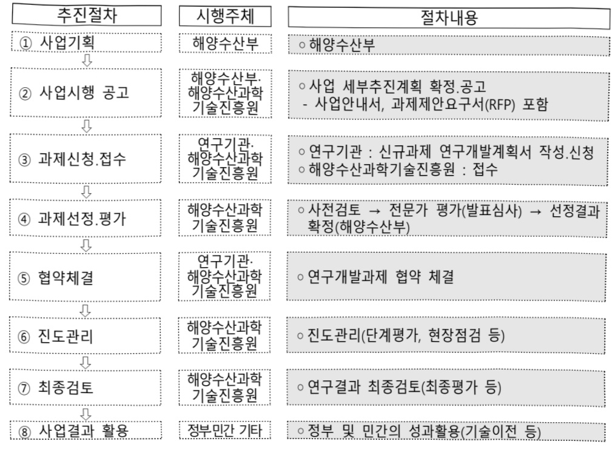

# 차세대 해양·극지의 환경 및 생태계에 관한 기후예측시…

**해당 페이지**: PDF 2879 ~ 2885 쪽 해당

**부처**: 기후에너지환경부
**분야**: 교통 및 물류
**회계유형**: 기금
**2026 확정예산**: 4500.0 백만원
**전년대비 증감률**: None%
**AI 도메인**: 환경/기후

---

### 가.지출계획 총괄표

(단위: 백만원, %)

<table border=1 style='margin: auto; word-wrap: break-word;'><tr><td rowspan="2">목명</td><td rowspan="2">2024년 결산</td><td colspan="2">2025년 계획</td><td colspan="2">2026년</td><td rowspan="2">중감(B-A)</td><td rowspan="2">(B-A)/A</td></tr><tr><td style='text-align: center; word-wrap: break-word;'>당초(A)</td><td style='text-align: center; word-wrap: break-word;'>수정</td><td style='text-align: center; word-wrap: break-word;'>정부안</td><td style='text-align: center; word-wrap: break-word;'>확정(B)</td></tr><tr><td style='text-align: center; word-wrap: break-word;'>차세대 해양·극지의 환경 및 생태계 관한 기후예측 시스템 개발(R&amp;D)</td><td style='text-align: center; word-wrap: break-word;'>-</td><td style='text-align: center; word-wrap: break-word;'>-</td><td style='text-align: center; word-wrap: break-word;'>-</td><td style='text-align: center; word-wrap: break-word;'>4,500</td><td style='text-align: center; word-wrap: break-word;'>4,500</td><td style='text-align: center; word-wrap: break-word;'>4,500</td><td style='text-align: center; word-wrap: break-word;'>순증</td></tr></table>

□ 기능별(내역사업별), 목별 계획 내역

(단위:백만원)

<table border=1 style='margin: auto; word-wrap: break-word;'><tr><td rowspan="3"></td><td colspan="5">2024</td><td colspan="8">2025</td><td rowspan="3">2026 계획</td></tr><tr><td rowspan="2">계획의 (수정)</td><td rowspan="2">계획 현액</td><td rowspan="2">집행액 [실집행액]</td><td rowspan="2">이월액</td><td rowspan="2">불용액</td><td colspan="2">계획 액</td><td rowspan="2">계획 현액</td><td rowspan="2">집행액 [실집행액]</td><td colspan="2">전년도 이월액 제외</td><td rowspan="2">이월 예상액</td><td rowspan="2">불용 예상액</td></tr><tr><td style='text-align: center; word-wrap: break-word;'>당초</td><td style='text-align: center; word-wrap: break-word;'>수정</td><td style='text-align: center; word-wrap: break-word;'>계획 현액</td><td style='text-align: center; word-wrap: break-word;'>집행액 [실집행액]</td></tr><tr><td style='text-align: center; word-wrap: break-word;'>○ 기능별 분류(합계)</td><td style='text-align: center; word-wrap: break-word;'></td><td style='text-align: center; word-wrap: break-word;'></td><td style='text-align: center; word-wrap: break-word;'></td><td style='text-align: center; word-wrap: break-word;'></td><td style='text-align: center; word-wrap: break-word;'></td><td style='text-align: center; word-wrap: break-word;'></td><td style='text-align: center; word-wrap: break-word;'></td><td style='text-align: center; word-wrap: break-word;'></td><td style='text-align: center; word-wrap: break-word;'></td><td style='text-align: center; word-wrap: break-word;'></td><td style='text-align: center; word-wrap: break-word;'></td><td style='text-align: center; word-wrap: break-word;'></td><td style='text-align: center; word-wrap: break-word;'></td><td style='text-align: center; word-wrap: break-word;'>4,500</td></tr><tr><td style='text-align: center; word-wrap: break-word;'>• 차세대 해양극지의 환경 및 생태계에 관한 기후예측시스템 개발</td><td style='text-align: center; word-wrap: break-word;'></td><td style='text-align: center; word-wrap: break-word;'></td><td style='text-align: center; word-wrap: break-word;'></td><td style='text-align: center; word-wrap: break-word;'></td><td style='text-align: center; word-wrap: break-word;'></td><td style='text-align: center; word-wrap: break-word;'></td><td style='text-align: center; word-wrap: break-word;'></td><td style='text-align: center; word-wrap: break-word;'></td><td style='text-align: center; word-wrap: break-word;'></td><td style='text-align: center; word-wrap: break-word;'></td><td style='text-align: center; word-wrap: break-word;'></td><td style='text-align: center; word-wrap: break-word;'></td><td style='text-align: center; word-wrap: break-word;'></td><td style='text-align: center; word-wrap: break-word;'>4,500</td></tr><tr><td style='text-align: center; word-wrap: break-word;'>○ 비목별 분류(합계)</td><td style='text-align: center; word-wrap: break-word;'></td><td style='text-align: center; word-wrap: break-word;'></td><td style='text-align: center; word-wrap: break-word;'></td><td style='text-align: center; word-wrap: break-word;'></td><td style='text-align: center; word-wrap: break-word;'></td><td style='text-align: center; word-wrap: break-word;'></td><td style='text-align: center; word-wrap: break-word;'></td><td style='text-align: center; word-wrap: break-word;'></td><td style='text-align: center; word-wrap: break-word;'></td><td style='text-align: center; word-wrap: break-word;'></td><td style='text-align: center; word-wrap: break-word;'></td><td style='text-align: center; word-wrap: break-word;'></td><td style='text-align: center; word-wrap: break-word;'></td><td style='text-align: center; word-wrap: break-word;'>4,500</td></tr><tr><td style='text-align: center; word-wrap: break-word;'>• 연구개 발활동비 등(360-05)</td><td style='text-align: center; word-wrap: break-word;'></td><td style='text-align: center; word-wrap: break-word;'></td><td style='text-align: center; word-wrap: break-word;'></td><td style='text-align: center; word-wrap: break-word;'></td><td style='text-align: center; word-wrap: break-word;'></td><td style='text-align: center; word-wrap: break-word;'></td><td style='text-align: center; word-wrap: break-word;'></td><td style='text-align: center; word-wrap: break-word;'></td><td style='text-align: center; word-wrap: break-word;'></td><td style='text-align: center; word-wrap: break-word;'></td><td style='text-align: center; word-wrap: break-word;'></td><td style='text-align: center; word-wrap: break-word;'></td><td style='text-align: center; word-wrap: break-word;'></td><td style='text-align: center; word-wrap: break-word;'>4,500</td></tr><tr><td style='text-align: center; word-wrap: break-word;'>○ 기능비목별 분류(합계)</td><td style='text-align: center; word-wrap: break-word;'></td><td style='text-align: center; word-wrap: break-word;'></td><td style='text-align: center; word-wrap: break-word;'></td><td style='text-align: center; word-wrap: break-word;'></td><td style='text-align: center; word-wrap: break-word;'></td><td style='text-align: center; word-wrap: break-word;'></td><td style='text-align: center; word-wrap: break-word;'></td><td style='text-align: center; word-wrap: break-word;'></td><td style='text-align: center; word-wrap: break-word;'></td><td style='text-align: center; word-wrap: break-word;'></td><td style='text-align: center; word-wrap: break-word;'></td><td style='text-align: center; word-wrap: break-word;'></td><td style='text-align: center; word-wrap: break-word;'></td><td style='text-align: center; word-wrap: break-word;'>4,500</td></tr><tr><td style='text-align: center; word-wrap: break-word;'>• 차세대 해양극지의 환경 및 생태계에 관한 기후예측시스템 개발 - 연구개 발활동비 등(360-05)</td><td style='text-align: center; word-wrap: break-word;'></td><td style='text-align: center; word-wrap: break-word;'></td><td style='text-align: center; word-wrap: break-word;'></td><td style='text-align: center; word-wrap: break-word;'></td><td style='text-align: center; word-wrap: break-word;'></td><td style='text-align: center; word-wrap: break-word;'></td><td style='text-align: center; word-wrap: break-word;'></td><td style='text-align: center; word-wrap: break-word;'></td><td style='text-align: center; word-wrap: break-word;'></td><td style='text-align: center; word-wrap: break-word;'></td><td style='text-align: center; word-wrap: break-word;'></td><td style='text-align: center; word-wrap: break-word;'></td><td style='text-align: center; word-wrap: break-word;'></td><td style='text-align: center; word-wrap: break-word;'>4,500</td></tr></table>

---

### 나. 사업설명자료

## 1 ) 사업목적·내용

- (차세대 해양·극지의 환경 및 생태계에 관한 기후예측시스템 개발) 신뢰도 높은 해양 환경 및 생태계 기후변화 감시예측을 위해 우리나라 특성을 반영한 국내 기술 기반의 해양기후 예측모델 개발

## 2 ) 사업개요

## □ 사업근거 및 추진경위

① 법령상 근거 및 조항 적시 : 「기후·기후변화 감시 및 예측 등에 관한 법률」 제7조(기후·기후변화 감시 정보의 생산 등), 제8조(기후예측 정보의 생산), 제10조(기후변화 시나리오의 승인 등), 제17조(기후·기후변화 감시 및 예측 기술의 연구·개발사업 추진), 「해양환경보전 및 활용에 관한 법률」 제17조(해양기후변화 대응)

## ② 추진경위

- 과리협정 채택('15.12), 정부 간 기후변화협의체(IPCC) 제6차 종합보고서('21) 발간 등 기후변화 대응을 위한 전 지구적·국가적 관심 및 노력 고조

- 국내 2050 탄소중립위원회 발족('21.5)으로 온실가스 감축뿐만 아니라 기후변화대응 정책 수립·이행을 총괄하는 추진체계 강화

- 기후변화 감시예측 등 해양수산부 내 기후대응 정책의 체계적 추진을 위한 '제4차 기후변화대응 해양수산부문 종합계획' 수립('22.8)

- 해양수산부 기후업무 전담부서인 기후환경국제전략팀 신설·운영('24.1)

- 기후변화 대응을 위한 과학적 근거인 기후변화 감시예측 정보 생산·제공을 위한

기후·기후변화 감시 및 예측 등에 관한 법률 시행 (24.10)

- 국내 기술 기반의 해양·극지의 환경 및 생태계에 관한 기후예측시스템 개발을 위한 기획연구 추진('24.10)

- 가속하는 기후변화에 탄력적 대응 및 이행력 확보를 위한 '제4차 기후변화대응 해양수산부문 수정 종합계획' 수립('25.6)

---

## □주요내용

① 사업규모

- 사업기간 : 2026년 ~ 2030년

- 최근 5년 간 투입된 사업비

<table border=1 style='margin: auto; word-wrap: break-word;'><tr><td style='text-align: center; word-wrap: break-word;'>연도</td><td style='text-align: center; word-wrap: break-word;'>2022</td><td style='text-align: center; word-wrap: break-word;'>2023</td><td style='text-align: center; word-wrap: break-word;'>2024</td><td style='text-align: center; word-wrap: break-word;'>2025</td><td style='text-align: center; word-wrap: break-word;'>2026</td></tr><tr><td style='text-align: center; word-wrap: break-word;'>사업비</td><td style='text-align: center; word-wrap: break-word;'>-</td><td style='text-align: center; word-wrap: break-word;'>-</td><td style='text-align: center; word-wrap: break-word;'>-</td><td style='text-align: center; word-wrap: break-word;'>-</td><td style='text-align: center; word-wrap: break-word;'>4,500</td></tr></table>

② 사업추진체계

- 사업시행방법 : 출연

- 사업시행주체 : 해양수산과학기술진흥원

- 사업 수혜자 : 대학, 기업, 출연연, 일반국민 등

- 보조, 융자, 출연, 출자 등의 경우 보조·융자 등 지원 비율 및 법적근거

<table border=1 style='margin: auto; word-wrap: break-word;'><tr><td style='text-align: center; word-wrap: break-word;'>내역사업명</td><td style='text-align: center; word-wrap: break-word;'>구분</td><td style='text-align: center; word-wrap: break-word;'>피보조·피출연 등 기관명</td><td style='text-align: center; word-wrap: break-word;'>지원 금액 (2026계획)</td><td style='text-align: center; word-wrap: break-word;'>지원 비율(%)</td><td style='text-align: center; word-wrap: break-word;'>보조율 법적근거 (해당 조항)</td></tr><tr><td style='text-align: center; word-wrap: break-word;'>차세대 해양·극지의 환경 및 생태계에 관한 기후예측 시스템 개발</td><td style='text-align: center; word-wrap: break-word;'>출연</td><td style='text-align: center; word-wrap: break-word;'>해양수산 과학기술 진흥원</td><td style='text-align: center; word-wrap: break-word;'>4,500</td><td style='text-align: center; word-wrap: break-word;'>100</td><td style='text-align: center; word-wrap: break-word;'>「해양수산과학기술육성법」제23조 (해양수산과학기술진흥원 설립)</td></tr></table>

---

## 3 ) 2026년도 계획 산출 근거

□ 차세대 해양극지의 환경 및 생태계에 관한 기후예측시스템 개발 : (2025) 0백만원 → (2026) 4,500백만원, 순증

① 차세대 해양·금지이 화경 및 생태계에 관한 기후예측시스템 개발 : (2025) 0백만원 → (2026) 4,500백만원, 순증

① 사세대 해양극치의 환경 및 생태계에 관한 기후예측시스

- (요구) 우리나라 해양기후에 최적화된 해양기후모델(전지구, 한반도, 해양상위생태계) 설계, 초기 모델 개발 및 중장기(3개월~10년) 예측기술 개발을 위한 사업비 4,500백만원

- (산출) ① 해양기후모델 개발 1,800백만원, ② 중장기 해양기후 예측기술 개발 780백만원, ③ 지역상세 해양 기후 모델 개발 900백만원, ④ 해양 상위 생태계 모델 개발 1,020백만원

① 해양기후 모델 개발 1,800백만원

해양기후모델 개발 720백만원, 장기 적분 결과 생산 및 기후모의 성능 진단 1,080백만원

② 중장기 해양기후 예측기술 개발 780백만원

해양기후 중장기 예측기술 개발 660백만원 해양현상 중심의 기후변화 시나리오 연구 및 장기기후 예측성 평가 120백만원

③ 지역상세 해양기후 모델 개발 900백만원

고해상도 한반도 해양기후 모델 개발 900백만원

④ 해양 상위 생태계 모델 개발 1,020백만원

해양 생태계 연결성, 상호작용 구조 해석과 기후변화 영향 진단 1,020백만원

2025년도 계획 및 2026년도 계획 산출 세부내역 비교

<table border=1 style='margin: auto; word-wrap: break-word;'><tr><td colspan="2">2025년 계획</td><td colspan="2">2026년 계획</td></tr><tr><td style='text-align: center; word-wrap: break-word;'>예산</td><td style='text-align: center; word-wrap: break-word;'>산출내역</td><td style='text-align: center; word-wrap: break-word;'>예산</td><td style='text-align: center; word-wrap: break-word;'>산출내역</td></tr><tr><td style='text-align: center; word-wrap: break-word;'>-</td><td style='text-align: center; word-wrap: break-word;'>-</td><td style='text-align: center; word-wrap: break-word;'>4,500</td><td style='text-align: center; word-wrap: break-word;'>&lt; 차세대 해양·극지 기후예측시스템 개발 4,500백만원 &gt; - 순증가. (해양기후모델 개발) 1,800백만원 • (신규) 1개 × 2,400백만 × 9/12개월  = 1,800백만원 나. (중장기 해양기후 예측기술 개발) 780백만원 • (신규) 1개 × 1,040백만 × 9/12개월  = 780백만원 다. (지역상세 해양기후 모델 개발) 900백만원 • (신규) 1개 × 1,200백만 × 9/12개월  = 900백만원 라. (해양 상위 생태계 모델 개발) 1,020백만원 • (신규) 1개 × 1,360백만 × 9/12개월  = 1,020백만원</td></tr></table>

## 4 ) 사업효과

☐ 사업영향, 산출물 성과지표 등

① 2022~2026년도 성과계획서 상 성과지표 및 최근 5년간 성과 달성도

<table border=1 style='margin: auto; word-wrap: break-word;'><tr><td style='text-align: center; word-wrap: break-word;'>성과지표</td><td style='text-align: center; word-wrap: break-word;'>구분</td><td style='text-align: center; word-wrap: break-word;'>2022</td><td style='text-align: center; word-wrap: break-word;'>2023</td><td style='text-align: center; word-wrap: break-word;'>2024</td><td style='text-align: center; word-wrap: break-word;'>2025</td><td style='text-align: center; word-wrap: break-word;'>2026</td><td style='text-align: center; word-wrap: break-word;'>2026 목표치산출근거</td><td style='text-align: center; word-wrap: break-word;'>측정산식(또는 측정방법)</td><td style='text-align: center; word-wrap: break-word;'>자료수집방법(또는 자료출처)</td></tr><tr><td rowspan="3">해양수산일자리 창출: (명)</td><td style='text-align: center; word-wrap: break-word;'>목표</td><td style='text-align: center; word-wrap: break-word;'>87</td><td style='text-align: center; word-wrap: break-word;'>160</td><td style='text-align: center; word-wrap: break-word;'>221</td><td style='text-align: center; word-wrap: break-word;'>255</td><td style='text-align: center; word-wrap: break-word;'>261</td><td rowspan="3">3개년(&#x27;20~22년)평균값대비15% 상향한도전적 목표제시</td><td rowspan="3">해양수산창업·투자, R&amp;D 지원사업 수혜기업의신규 고용창출수</td><td rowspan="3">해양수산과학기술진흥원 보고서</td></tr><tr><td style='text-align: center; word-wrap: break-word;'>실적</td><td style='text-align: center; word-wrap: break-word;'>188</td><td style='text-align: center; word-wrap: break-word;'>252</td><td style='text-align: center; word-wrap: break-word;'>227</td><td style='text-align: center; word-wrap: break-word;'>-</td><td style='text-align: center; word-wrap: break-word;'>-</td></tr><tr><td style='text-align: center; word-wrap: break-word;'>달성도</td><td style='text-align: center; word-wrap: break-word;'>216.1</td><td style='text-align: center; word-wrap: break-word;'>157.5</td><td style='text-align: center; word-wrap: break-word;'>102.7</td><td style='text-align: center; word-wrap: break-word;'>-</td><td style='text-align: center; word-wrap: break-word;'>-</td></tr></table>

② 성과지표 이외의 연도별 사업추진 경과 및 실적 : 해당없음

---

## ③ 향후(2026년도 이후) 기대효과

- (기술적) 해양기후 예측에 대한 국내 기술 확보로 해외 예측 시스템 의존도를 완화하고 안정적인 해양 기후예측체계 구축을 통해 해양기후 예측기술 선진국으로 발돋움

* IPCC(정부간기후변화협의체) 기후변화 시나리오 생산시 참여한 모델의 평균 정확도 대비 115% 수준의 정확도 확보 목표

- (경제적) 기후재해 피해 저감, 해양 환경 및 생태계 변화 대응, 양식장 적지 선정,

항만설계기준 수립, 어선설계기준 수립 등을 통해 해양기후 리스크 관리 비용 절감 가능

- (사회적) 해양 기후재해(해수면상승, 태풍 강화 등 연안피해) 대응 역량을 강화하여 해양수산 분야 국민 안전 확보 및 기후·환경 분야의 공공정책 수립 지원

## 5 ) 타당성조사 및 예비타당성조사 시행여부 및 결과 요지 : 해당없음

## 6 ) 총사업비 대상사업 여부 및 내역 : 해당없음

## 7 ) 사업 집행절차

---

8) 중기재정계획 상 연도별 투자계획 및 추진경과

(단위:백만원)

<table border=1 style='margin: auto; word-wrap: break-word;'><tr><td style='text-align: center; word-wrap: break-word;'>$ \underset{\cdot}{중} $ $ \underset{\cdot}{기} $</td><td style='text-align: center; word-wrap: break-word;'>&#x27;24</td><td style='text-align: center; word-wrap: break-word;'>&#x27;25</td><td style='text-align: center; word-wrap: break-word;'>&#x27;26</td><td style='text-align: center; word-wrap: break-word;'>&#x27;27</td><td style='text-align: center; word-wrap: break-word;'>&#x27;28</td><td style='text-align: center; word-wrap: break-word;'>&#x27;29</td></tr><tr><td style='text-align: center; word-wrap: break-word;'>&#x27;24~&#x27;28</td><td style='text-align: center; word-wrap: break-word;'>-</td><td style='text-align: center; word-wrap: break-word;'>-</td><td style='text-align: center; word-wrap: break-word;'>4,500</td><td style='text-align: center; word-wrap: break-word;'>-</td><td style='text-align: center; word-wrap: break-word;'>-</td><td style='text-align: center; word-wrap: break-word;'>-</td></tr><tr><td style='text-align: center; word-wrap: break-word;'>&#x27;25~&#x27;29</td><td style='text-align: center; word-wrap: break-word;'>-</td><td style='text-align: center; word-wrap: break-word;'>-</td><td style='text-align: center; word-wrap: break-word;'>4,500</td><td style='text-align: center; word-wrap: break-word;'>7,375</td><td style='text-align: center; word-wrap: break-word;'>7,375</td><td style='text-align: center; word-wrap: break-word;'>7,375</td></tr></table>

9) 최근 3년간 동 사업에 대한 주요 외부지적사항 및 평가, 문제점 및 대책 : 해당없음

## 10 ) 향후 추진방향 및 추진계획

<table border=1 style='margin: auto; word-wrap: break-word;'><tr><td style='text-align: center; word-wrap: break-word;'>- 국내 기술 기반의 해양기후모델 기술 확보, 신뢰도 높은 기후변화 시나리오 생산체계 구축</td></tr><tr><td style='text-align: center; word-wrap: break-word;'>- 현업 활용이 가능한 중장기 해양기후예측 기술 확보, 중장기 해양기후 예측정보 생산·서비스</td></tr><tr><td style='text-align: center; word-wrap: break-word;'>- 국내 기술 기반의 한반도 지역상세 모델 개발, 한반도 해역에 최적화된 해양기후 모의 성능 확보</td></tr><tr><td style='text-align: center; word-wrap: break-word;'>- 기후변화가 상위 해양 생태계에 미치는 영향을 정량적으로 예측, 기후변화 시나리오를 반영한 정밀한 상위생태계 변동성 예측 시스템 구축</td></tr></table>

11) 해당사업에 대한 각종 사업평가의 결과 : 해당없음

12) 해당사업에 대한 부처 자체평가의 결과 : 해당없음

13) 부처 건의사항

<table border=1 style='margin: auto; word-wrap: break-word;'><tr><td style='text-align: center; word-wrap: break-word;'>- 기후위기 대응을 위한 과학적 근거인 기후변화 감시예측 정보가 중요해짐에 따라 해양수산 분야의 신뢰도 높은 감시예측 정보 생산에 필요한 해양·극지 기후예측시스템 개발과 국내 예측기술력 확보를 위해 지속적인 예산 지원 필요</td></tr></table>

다. 최근 4년간 결산내역 : 해당없음

---

<table border=1 style='margin: auto; word-wrap: break-word;'><tr><td style='text-align: center; word-wrap: break-word;'>사 업 명</td></tr><tr><td style='text-align: center; word-wrap: break-word;'>(50) 폐의류 문제해결 플래그십 재활용 기술개발사업(1532-323)</td></tr></table>

☐ 사업 코드 정보

<table border=1 style='margin: auto; word-wrap: break-word;'><tr><td style='text-align: center; word-wrap: break-word;'>구분</td><td style='text-align: center; word-wrap: break-word;'>회계</td><td style='text-align: center; word-wrap: break-word;'>소관</td><td style='text-align: center; word-wrap: break-word;'>실국(기관)</td><td style='text-align: center; word-wrap: break-word;'>계정</td><td style='text-align: center; word-wrap: break-word;'>분야</td><td style='text-align: center; word-wrap: break-word;'>부문</td></tr><tr><td style='text-align: center; word-wrap: break-word;'>코드</td><td rowspan="2">환경개선특별회계</td><td rowspan="2">기후에너지환경부</td><td rowspan="2">자원순환국</td><td rowspan="2">-</td><td style='text-align: center; word-wrap: break-word;'>070</td><td style='text-align: center; word-wrap: break-word;'>078</td></tr><tr><td style='text-align: center; word-wrap: break-word;'>명칭</td><td style='text-align: center; word-wrap: break-word;'>환경</td><td style='text-align: center; word-wrap: break-word;'>자원순환 및 환경경제</td></tr></table>

<table border=1 style='margin: auto; word-wrap: break-word;'><tr><td style='text-align: center; word-wrap: break-word;'>구분</td><td style='text-align: center; word-wrap: break-word;'>프로그램</td><td style='text-align: center; word-wrap: break-word;'>단위사업</td><td style='text-align: center; word-wrap: break-word;'>세부사업</td></tr><tr><td style='text-align: center; word-wrap: break-word;'>코드</td><td style='text-align: center; word-wrap: break-word;'>1500</td><td style='text-align: center; word-wrap: break-word;'>1532</td><td style='text-align: center; word-wrap: break-word;'>323</td></tr><tr><td style='text-align: center; word-wrap: break-word;'>명칭</td><td style='text-align: center; word-wrap: break-word;'>친환경경제사회 활성화</td><td style='text-align: center; word-wrap: break-word;'>환경기술 개발·보급</td><td style='text-align: center; word-wrap: break-word;'>폐의류 문제해결 플래그십 재활용 기술개발사업</td></tr></table>

□ 사업 성격 (공통요구자료 Ⅱ-1 작성유의사항 4. 참조, 해당하는 사항에 “○” 표시)

<table border=1 style='margin: auto; word-wrap: break-word;'><tr><td rowspan="2">신규</td><td rowspan="2">계속</td><td rowspan="2">완료</td><td style='text-align: center; word-wrap: break-word;'>예비타당성</td><td style='text-align: center; word-wrap: break-word;'>총사업비</td><td style='text-align: center; word-wrap: break-word;'>총액계상</td><td style='text-align: center; word-wrap: break-word;'>사업소관 변경정보</td></tr><tr><td style='text-align: center; word-wrap: break-word;'>실시여부</td><td style='text-align: center; word-wrap: break-word;'>관리대상</td><td style='text-align: center; word-wrap: break-word;'>예산사업</td><td style='text-align: center; word-wrap: break-word;'>2025예산 시 소관</td></tr><tr><td style='text-align: center; word-wrap: break-word;'>O</td><td style='text-align: center; word-wrap: break-word;'></td><td style='text-align: center; word-wrap: break-word;'></td><td style='text-align: center; word-wrap: break-word;'></td><td style='text-align: center; word-wrap: break-word;'></td><td style='text-align: center; word-wrap: break-word;'></td><td style='text-align: center; word-wrap: break-word;'></td></tr></table>

☐ 사업 지원 형태 및 지원을 (최소한 한 개는 반드시 선택하시오. 해당사항에 0 표시)

<table border=1 style='margin: auto; word-wrap: break-word;'><tr><td style='text-align: center; word-wrap: break-word;'>직접</td><td style='text-align: center; word-wrap: break-word;'>출자</td><td style='text-align: center; word-wrap: break-word;'>출연</td><td style='text-align: center; word-wrap: break-word;'>보조</td><td style='text-align: center; word-wrap: break-word;'>융자</td><td style='text-align: center; word-wrap: break-word;'>국고보조율(%)</td><td style='text-align: center; word-wrap: break-word;'>융자율(%)</td></tr><tr><td style='text-align: center; word-wrap: break-word;'></td><td style='text-align: center; word-wrap: break-word;'></td><td style='text-align: center; word-wrap: break-word;'>0</td><td style='text-align: center; word-wrap: break-word;'></td><td style='text-align: center; word-wrap: break-word;'></td><td style='text-align: center; word-wrap: break-word;'></td><td style='text-align: center; word-wrap: break-word;'></td></tr></table>

## ☐ 사업 담당자

<table border=1 style='margin: auto; word-wrap: break-word;'><tr><td style='text-align: center; word-wrap: break-word;'>사업명</td><td colspan="2">구분</td></tr><tr><td rowspan="3">폐의류 문제해결 플래그 십 재활용 기술개발사업</td><td rowspan="2">소관부처</td><td style='text-align: center; word-wrap: break-word;'>자원순환국</td></tr><tr><td style='text-align: center; word-wrap: break-word;'>자원재활용과</td></tr><tr><td style='text-align: center; word-wrap: break-word;'>사업시행주체</td><td style='text-align: center; word-wrap: break-word;'>한국환경신업기술원</td></tr></table>

---

### 원본 PDF 크롭 이미지

