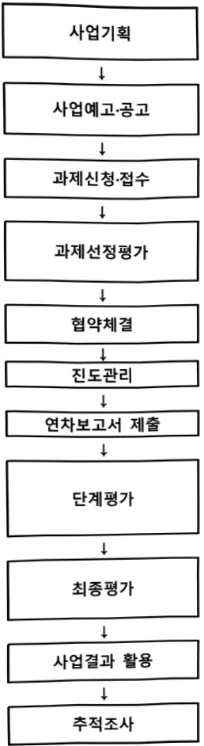
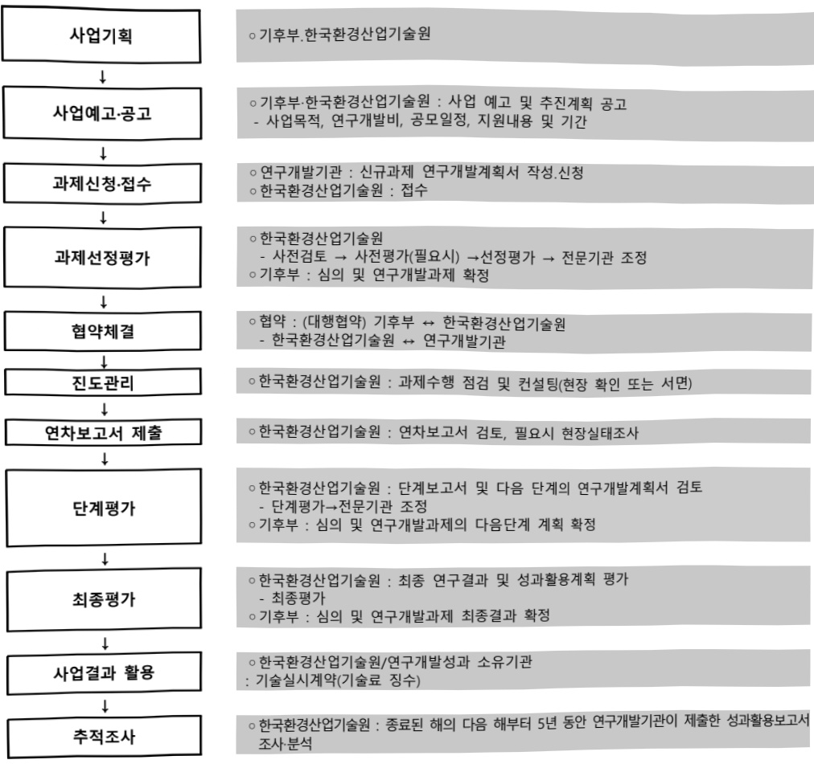

# 환경보건 빅데이터 구축 및 AI 활용 고도화 기술개발사…

**해당 페이지**: PDF 2894 ~ 2900 쪽 해당

**부처**: 기후에너지환경부
**분야**: 환경
**회계유형**: 환경개선 특별회계
**2026 확정예산**: 6700.0 백만원
**전년대비 증감률**: None%
**AI 도메인**: 데이터, 환경/기후, 디지털전환(AX)

---

### 가. 예산 총괄표

(단위:백만원,%)

<table border=1 style='margin: auto; word-wrap: break-word;'><tr><td rowspan="2">사업명</td><td rowspan="2">2024년 결산</td><td colspan="2">2025년 예산</td><td colspan="2">2026년</td><td rowspan="2">증감 (B-A)</td><td rowspan="2">(B-A)/A</td></tr><tr><td style='text-align: center; word-wrap: break-word;'>본예산(A)</td><td style='text-align: center; word-wrap: break-word;'>추경</td><td style='text-align: center; word-wrap: break-word;'>정부안</td><td style='text-align: center; word-wrap: break-word;'>확정(B)</td></tr><tr><td style='text-align: center; word-wrap: break-word;'>환경보건 빅데이터 구축 및 A 활용 고도화 기술개발(R&amp;D)</td><td style='text-align: center; word-wrap: break-word;'>-</td><td style='text-align: center; word-wrap: break-word;'>-</td><td style='text-align: center; word-wrap: break-word;'>-</td><td style='text-align: center; word-wrap: break-word;'>6,700</td><td style='text-align: center; word-wrap: break-word;'>6,700</td><td style='text-align: center; word-wrap: break-word;'>순증</td><td style='text-align: center; word-wrap: break-word;'>순증</td></tr></table>

□ 기능별(내역사업별), 목별 예산 내역

(단위:백만원)

<table border=1 style='margin: auto; word-wrap: break-word;'><tr><td rowspan="3"></td><td colspan="5">2024</td><td colspan="7">2025</td><td rowspan="3">2026예산</td></tr><tr><td rowspan="2">예산액(추경)</td><td rowspan="2">예산현액</td><td rowspan="2">집행액[실집행액]</td><td rowspan="2">이월액</td><td rowspan="2">불용액</td><td rowspan="2">본예산</td><td rowspan="2">예산현액</td><td rowspan="2">집행액[실집행액]</td><td colspan="2">전년도 이월액제외</td><td rowspan="2">이월예상액</td><td rowspan="2">불용예상액</td></tr><tr><td style='text-align: center; word-wrap: break-word;'>예산현액</td><td style='text-align: center; word-wrap: break-word;'>집행액[실집행액]</td></tr><tr><td style='text-align: center; word-wrap: break-word;'>○ 환경보건 빅데이터 구축 및 AI 활용 고도화 기술개발사업(R&amp;D)</td><td style='text-align: center; word-wrap: break-word;'>-</td><td style='text-align: center; word-wrap: break-word;'>-</td><td style='text-align: center; word-wrap: break-word;'>-</td><td style='text-align: center; word-wrap: break-word;'>-</td><td style='text-align: center; word-wrap: break-word;'>-</td><td style='text-align: center; word-wrap: break-word;'>-</td><td style='text-align: center; word-wrap: break-word;'>-</td><td style='text-align: center; word-wrap: break-word;'>-</td><td style='text-align: center; word-wrap: break-word;'>-</td><td style='text-align: center; word-wrap: break-word;'>-</td><td style='text-align: center; word-wrap: break-word;'>-</td><td style='text-align: center; word-wrap: break-word;'>-</td><td style='text-align: center; word-wrap: break-word;'>6,700</td></tr><tr><td style='text-align: center; word-wrap: break-word;'>· 환경보건 빅데이터 구축 및 AI 활용 고도화 기술개발사업(R&amp;D)</td><td style='text-align: center; word-wrap: break-word;'>-</td><td style='text-align: center; word-wrap: break-word;'>-</td><td style='text-align: center; word-wrap: break-word;'>-</td><td style='text-align: center; word-wrap: break-word;'>-</td><td style='text-align: center; word-wrap: break-word;'>-</td><td style='text-align: center; word-wrap: break-word;'>-</td><td style='text-align: center; word-wrap: break-word;'>-</td><td style='text-align: center; word-wrap: break-word;'>-</td><td style='text-align: center; word-wrap: break-word;'>-</td><td style='text-align: center; word-wrap: break-word;'>-</td><td style='text-align: center; word-wrap: break-word;'>-</td><td style='text-align: center; word-wrap: break-word;'>-</td><td style='text-align: center; word-wrap: break-word;'>6,700</td></tr><tr><td style='text-align: center; word-wrap: break-word;'>○ 비목별 분류(합계)</td><td style='text-align: center; word-wrap: break-word;'>-</td><td style='text-align: center; word-wrap: break-word;'>-</td><td style='text-align: center; word-wrap: break-word;'>-</td><td style='text-align: center; word-wrap: break-word;'>-</td><td style='text-align: center; word-wrap: break-word;'>-</td><td style='text-align: center; word-wrap: break-word;'>-</td><td style='text-align: center; word-wrap: break-word;'>-</td><td style='text-align: center; word-wrap: break-word;'>-</td><td style='text-align: center; word-wrap: break-word;'>-</td><td style='text-align: center; word-wrap: break-word;'>-</td><td style='text-align: center; word-wrap: break-word;'>-</td><td style='text-align: center; word-wrap: break-word;'>-</td><td style='text-align: center; word-wrap: break-word;'>6,700</td></tr><tr><td style='text-align: center; word-wrap: break-word;'>· 연구개발활동비등(360-05)</td><td style='text-align: center; word-wrap: break-word;'>-</td><td style='text-align: center; word-wrap: break-word;'>-</td><td style='text-align: center; word-wrap: break-word;'>-</td><td style='text-align: center; word-wrap: break-word;'>-</td><td style='text-align: center; word-wrap: break-word;'>-</td><td style='text-align: center; word-wrap: break-word;'>-</td><td style='text-align: center; word-wrap: break-word;'>-</td><td style='text-align: center; word-wrap: break-word;'>-</td><td style='text-align: center; word-wrap: break-word;'>-</td><td style='text-align: center; word-wrap: break-word;'>-</td><td style='text-align: center; word-wrap: break-word;'>-</td><td style='text-align: center; word-wrap: break-word;'>-</td><td style='text-align: center; word-wrap: break-word;'>6,700</td></tr><tr><td style='text-align: center; word-wrap: break-word;'>○ 기능비목별 분류합계)</td><td style='text-align: center; word-wrap: break-word;'>-</td><td style='text-align: center; word-wrap: break-word;'>-</td><td style='text-align: center; word-wrap: break-word;'>-</td><td style='text-align: center; word-wrap: break-word;'>-</td><td style='text-align: center; word-wrap: break-word;'>-</td><td style='text-align: center; word-wrap: break-word;'>-</td><td style='text-align: center; word-wrap: break-word;'>-</td><td style='text-align: center; word-wrap: break-word;'>-</td><td style='text-align: center; word-wrap: break-word;'>-</td><td style='text-align: center; word-wrap: break-word;'>-</td><td style='text-align: center; word-wrap: break-word;'>-</td><td style='text-align: center; word-wrap: break-word;'>-</td><td style='text-align: center; word-wrap: break-word;'>6,700</td></tr><tr><td style='text-align: center; word-wrap: break-word;'>· 환경보건 빅데이터 구축 및 AI 활용 고도화 기술개발사업(R&amp;D)</td><td style='text-align: center; word-wrap: break-word;'>-</td><td style='text-align: center; word-wrap: break-word;'>-</td><td style='text-align: center; word-wrap: break-word;'>-</td><td style='text-align: center; word-wrap: break-word;'>-</td><td style='text-align: center; word-wrap: break-word;'>-</td><td style='text-align: center; word-wrap: break-word;'>-</td><td style='text-align: center; word-wrap: break-word;'>-</td><td style='text-align: center; word-wrap: break-word;'>-</td><td style='text-align: center; word-wrap: break-word;'>-</td><td style='text-align: center; word-wrap: break-word;'>-</td><td style='text-align: center; word-wrap: break-word;'>-</td><td style='text-align: center; word-wrap: break-word;'>-</td><td style='text-align: center; word-wrap: break-word;'>6,700</td></tr><tr><td style='text-align: center; word-wrap: break-word;'>- 연구개발활동비등(360-05)</td><td style='text-align: center; word-wrap: break-word;'>-</td><td style='text-align: center; word-wrap: break-word;'>-</td><td style='text-align: center; word-wrap: break-word;'>-</td><td style='text-align: center; word-wrap: break-word;'>-</td><td style='text-align: center; word-wrap: break-word;'>-</td><td style='text-align: center; word-wrap: break-word;'>-</td><td style='text-align: center; word-wrap: break-word;'>-</td><td style='text-align: center; word-wrap: break-word;'>-</td><td style='text-align: center; word-wrap: break-word;'>-</td><td style='text-align: center; word-wrap: break-word;'>-</td><td style='text-align: center; word-wrap: break-word;'>-</td><td style='text-align: center; word-wrap: break-word;'>-</td><td style='text-align: center; word-wrap: break-word;'>6,700</td></tr></table>

---

### 나. 사업설명자료

## 1 ) 사업목적·내용

- (환경보건 빅데이터 구축 및 AI 활용 고도화 기술개발사업) 빅데이터 및 AI를 활용하여 환경유해인자 노출에 따른 건강영향을 조기 감지·예측하여 건강피해를 선제적으로 예방·관리

(구분1. 생체시료 동시·자동 분석) 환경유해인자의 인체 내 축적과 그에 따른 건강영향을 신속하게 파악하기 위해 생체 내 환경유해인자 동시·자동 분석 기술 고도화

- (구분2. AI 기반 개인 환경보건평가) 개인 생체정보를 실시간으로 확인 가능한 인체부 착형 측정기를 고도화하고 AI 기반으로 환경정보와 연계하여 개인의 특성을 고려한 환경보건 평가 기술개발

- (구분3. 빅데이터 및 AI 기반 지역 환경보건평가) 지역단위 환경보건 빅데이터 및 AI를 기반으로 환경보건 우려 지역 평가 플랫폼 개발

## 2 ) 사업개요

□ 사업근거 및 추진경위

① 법령상 근거 및 조항 적시

- 「환경보건법」 제5조(국가 등의 책무), 제20조(국가 등의 지원)

제5조(국가 등의 책무) ①국가와 지방자치단체는 환경유해인자가 수용체에 미치는 영향을 향상 파악하고, 환경유해인자로부터 수용체를 보호하기 위하여 필요한 시책을 세우고 시행하여야 한다. 제20조(국가 등의 지원) ①국가와 지방자치단체는 환경유해인자로 인한 국민의 건강피해를 예방·관리하기 위하여 필요한 행정적·재정적 지원을 할 수 있다.

-「환경기술 및 환경산업 지원법」제5조(환경기술개발의 추진)

제5조(환경기술개발사업의 추진) ①정부는 환경보전 및 국민경제의 지속가능한 발전을 위하여 대통령령으로 정하는 비에 따라 다음 각 호의 어느 하나에 해당하는 기관이나 단체 또는 시업자이하 이 조에서 "연구기관 등"이라 한다)로 하여금 환경기술개발사업 (이하 "개발사업"이라 한다)을 하게 할 수 있다.

-「환경정책기본법」제28조(환경과학기술의 진흥)

제28조(환경과학기술의 진흥) 국가 및 지방자치단체는 환경보전을 위한 실험·조사·연구·기술개발 및 전문인력의 양성 등 환경과학기술의 진흥에 필요한 시책을 마련하여야 한다.

② 추진경위 - 사업 시작년도, 추진배경, 부처별 중점과제, 대통령 공약사항 등

---

- 환경보건 생체 빅데이터 R&D 중장기 로드맵 수립 연구(1차 기획) : ~'22.10.

- 환경보건 빅데이터 구축 및 AI활용 고도화 기술개발사업 기획연구(수정기획) 착수 : '23.11.

- 관련 현황 분석 및 시사점 도출 : ~'24.2.

- 중점 추진방향 설정 : ~24.3.

- 기획위원회 구성 및 운영 : '24.2.~5.

- 기획보고서 작성 : ~'24.5.

□ 주요내용

① 사업규모

- 총사업비 : 440억원(국고 314억원)

- 사업기간 : 2026 ~ 2029년 (총 4년)

- 최근 5년 간 투입된 사업비(예산액기준, 추경편성한 연도에는 추경포함)

<table border=1 style='margin: auto; word-wrap: break-word;'><tr><td style='text-align: center; word-wrap: break-word;'>$ \underline{\text{연도}} $</td><td style='text-align: center; word-wrap: break-word;'>2022</td><td style='text-align: center; word-wrap: break-word;'>2023</td><td style='text-align: center; word-wrap: break-word;'>2024</td><td style='text-align: center; word-wrap: break-word;'>2025</td><td style='text-align: center; word-wrap: break-word;'>2026</td></tr><tr><td style='text-align: center; word-wrap: break-word;'>$ \underline{\text{사업비}} $</td><td style='text-align: center; word-wrap: break-word;'>-</td><td style='text-align: center; word-wrap: break-word;'>-</td><td style='text-align: center; word-wrap: break-word;'>-</td><td style='text-align: center; word-wrap: break-word;'>-</td><td style='text-align: center; word-wrap: break-word;'>6,700</td></tr></table>

- 기타 : 해당사항 없음

② 사업추진체계

- 사업시행방법 : 출연

- 사업시행주체 : 한국환경산업기술원

- 사업 수혜자 : 관련 분야 대학, 기업, 출연, 국공립 연구소 등

- 보조, 융자, 출연, 출자 등의 경우 보조·융자 등 지원 비율 및 법적근거

<table border=1 style='margin: auto; word-wrap: break-word;'><tr><td style='text-align: center; word-wrap: break-word;'>내역사업명</td><td style='text-align: center; word-wrap: break-word;'>구분</td><td style='text-align: center; word-wrap: break-word;'>피보조·피출연 등 기관명</td><td style='text-align: center; word-wrap: break-word;'>지원 금액 (2026 예산)</td><td style='text-align: center; word-wrap: break-word;'>지원 비율(%)</td><td style='text-align: center; word-wrap: break-word;'>보조율 법적근거 (해당 조항)</td></tr><tr><td style='text-align: center; word-wrap: break-word;'>환경보건 빅데이터 구축 및 AI 활용 고도화</td><td style='text-align: center; word-wrap: break-word;'>출연</td><td style='text-align: center; word-wrap: break-word;'>한국환경 산업기술원</td><td style='text-align: center; word-wrap: break-word;'>6,700</td><td style='text-align: center; word-wrap: break-word;'>100</td><td style='text-align: center; word-wrap: break-word;'>「환경기술 및 환경산업 지원법」제5조</td></tr></table>

## 3 ) 2026년도 예산 산출 근거

☐ 환경보건 빅데이터 구축 및 AI 활용 고도화 기술개발사업(R&D): (2026 계획) 6,700백만원, 순종 - (요구) 생체시료 동시·자동 분석 및 개인·지역 환경보건평가 기술개발 등 7개 신규과제 추진 - (산출) 신규 : 7개×1,276백만원×9/12개월=6,700백만원

<table border=1 style='margin: auto; word-wrap: break-word;'><tr><td colspan="2">&#x27;24년 예산</td><td colspan="2">&#x27;25년 예산</td></tr><tr><td style='text-align: center; word-wrap: break-word;'>예산</td><td style='text-align: center; word-wrap: break-word;'>산출내역</td><td style='text-align: center; word-wrap: break-word;'>예산</td><td style='text-align: center; word-wrap: break-word;'>산출내역</td></tr><tr><td style='text-align: center; word-wrap: break-word;'>-</td><td style='text-align: center; word-wrap: break-word;'>-</td><td style='text-align: center; word-wrap: break-word;'>6,700</td><td style='text-align: center; word-wrap: break-word;'>○ 연구개발활동비 등(360-05): 6,700백만원 가. 환경보건 빅데이터 구축 및 AI 활용 고도화(6,700백만원) · 신규: 7개 과제×1,276백만원×9/12개월 = 6,700백만원</td></tr></table>

---

## 4 ) 사업효과

☐ 사업영향, 산출물 성과지표 등

① 2022~2026년도 성과계획서 상 성과지표 및 최근 5년간 성과 달성도 : 해당사항 없음

② 성과지표 이외의 연도별 사업추진 경과 및 실적 : 해당사항 없음

③향후(2026년도 이후)기대효과

- 빅데이터 및 AI를 활용하여 환경유해인자 노출에 따른 건강영향을 조기에 감지·예측하여 건강피해를 선제적으로 예방·관리

<table border=1 style='margin: auto; word-wrap: break-word;'><tr><td style='text-align: center; word-wrap: break-word;'>구분</td><td style='text-align: center; word-wrap: break-word;'>현재 기술 수준</td><td style='text-align: center; word-wrap: break-word;'>목표 기술 수준</td><td style='text-align: center; word-wrap: break-word;'>비고</td></tr><tr><td style='text-align: center; word-wrap: break-word;'>생체시료 동시·자동 분석</td><td style='text-align: center; word-wrap: break-word;'>·인체유래물 內 유해물질 16종 동시 분석 ·대량시료 처리를 위한 전처리, 기기분석 및 자료 처리 등 분석 자동화 5~10% ·환경유해인자의 인체 내 독성 작용 경로 규명 및 바이오마커 제시 등 한계</td><td style='text-align: center; word-wrap: break-word;'>·인체유래물 內 유해물질 50종 동시 분석 ·대량시료 처리를 위한 전처리, 기기분석 및 자료 처리 등 분석 자동화 60% 이상 ·유전체/후성 유전체 오믹스 데이터 통합 분석 80% 이상</td><td style='text-align: center; word-wrap: break-word;'>·분석시간 50% 이상, 분석비용 15~30% 절감 ·환경유해물질 진단키트 개발</td></tr><tr><td style='text-align: center; word-wrap: break-word;'>AI 기반 환경노출-건강변화 진단·예측</td><td style='text-align: center; word-wrap: break-word;'>·심장음, 폐음, 피부수분도 측정 착용형 기기 개발 ·생체 신호의 장시간 측정 한계 ·환경유해인자 15종에 대한 센서 및 IoT 기반 측정 디바이스 개발</td><td style='text-align: center; word-wrap: break-word;'>·5종 이상의 호흡음, 피부수분도 및 경피수분손실도 측정 착용형 기기 개발 ·AI 기반 다종 호흡음 분류 및 장시간 모니터링을 위한 피부건강 분석 기술 개발 ·환경유해인자 17종 이상에 대한 측정 디바이스 개발 ·비대면 환경유해인자 노출관리 서비스 상용화(APP/채취 키트)</td><td style='text-align: center; word-wrap: break-word;'>·건강모니터링을 위한 생체신호 다양화</td></tr><tr><td style='text-align: center; word-wrap: break-word;'>빅데이터·AI 활용 환경보건 감시·평가</td><td style='text-align: center; word-wrap: break-word;'>·신규 개발사업에 대한 건강영향평가 시 항목별 수기 분석으로 장시간 소요 ·개발사업으로 인한 건강영향 최소화 방안 제시·검증 한계 ·단일 유해인자에 의한 환경보건 상태 감시 ·환경보건 R&amp;D 성과물의 누적·통합 관리 한계</td><td style='text-align: center; word-wrap: break-word;'>·신규 개발사업에 대한 건강 영향범위 산정 및 평가 자동화 ·복합유해인자에 의한 환경보건 상태 감시 ·일체화된 연구성과물 탑재 클라우드 시스템 제시 ·환경보건 공통 메타데이터 표준 제시·적용</td><td style='text-align: center; word-wrap: break-word;'>·예방 중심의 환경보건 정책 마련 및 AI 서비스 개발을 위한 통합적 데이터 생태계 구축</td></tr></table>

5) 타당성조사 및 예비타당성조사 시행여부 및 결과 요지 : 해당사항 없음

6) 총사업비 대상사업 여부 및 내역 : 해당사항 없음

---

## 7 ) 사업 집행절차

- 기후부·한국환경산업기술원 : 사업 예고 및 추진계획 공고

- 사업목적, 연구개발비, 공모일정, 지원내용 및 기간

연구개발기관 : 신규과제 연구개발계획서 작성신청

한국환경산업기술원 : 접수

한국환경산업기술원

사전검토 → 사전평가(필요시) → 선정평가 → 전문기관 조정

기후부 : 심의 및 연구개발과제 확정

협약 : (대행협약) 기후부 ↔ 한국환경산업기술원

한국환경산업기술원 ↔ 연구개발기관

한국환경산업기술원 : 과제수행 점검 및 컨설팅(현장 확인 또는 서면)

0한국환경산업기술원:연차보고서 검토,필요시 현장실태조사

○한국환경산업기술원:단계보고서 및 다음 단계의 연구개발계획서 검토

- 단계평가→전문기관 조정

○기후부 : 심의 및 연구개발과제의 다음단계 계획 확정

-한국환경산업기술원:최종연구결과 및 성과활용계획평가

-최종평가

기후부 : 심의 및 연구개발과제 최종결과 확정

8) 중기재정계획 상 연도별 투자계획 및 추진경과

(단위:백만원)

<table border=1 style='margin: auto; word-wrap: break-word;'><tr><td style='text-align: center; word-wrap: break-word;'>$ \underset{\cdot}{客} $ $ \underset{\cdot}{几} $ 2024</td><td style='text-align: center; word-wrap: break-word;'>2025</td><td style='text-align: center; word-wrap: break-word;'>2026</td><td style='text-align: center; word-wrap: break-word;'>2027</td><td style='text-align: center; word-wrap: break-word;'>2028</td><td style='text-align: center; word-wrap: break-word;'>2029</td></tr><tr><td style='text-align: center; word-wrap: break-word;'>$ \underset{\cdot}{ 재} $ $ \underset{\cdot}{정} $ $ \underset{\cdot}{계} $ $ \underset{\cdot}{専} $</td><td style='text-align: center; word-wrap: break-word;'>-</td><td style='text-align: center; word-wrap: break-word;'>6,700</td><td style='text-align: center; word-wrap: break-word;'>8,900</td><td style='text-align: center; word-wrap: break-word;'>8,900</td><td style='text-align: center; word-wrap: break-word;'>☑</td></tr><tr><td style='text-align: center; word-wrap: break-word;'>2025~2029</td><td style='text-align: center; word-wrap: break-word;'>-</td><td style='text-align: center; word-wrap: break-word;'>6,700</td><td style='text-align: center; word-wrap: break-word;'>8,900</td><td style='text-align: center; word-wrap: break-word;'>8,900</td><td style='text-align: center; word-wrap: break-word;'>6,900</td></tr></table>

9) 최근 3년간 동 사업에 대한 주요 외부지적사항 및 평가, 문제점 및 대책 : 해당사항 없음

---

## 10 ) 향후 추진방향 및 추진계획

- 환경유해인자 노출에 따른 생체 변화 데이터를 효과적으로 수집·분석하여 환경성질환 발생 가능성 예측 및 개인 맞춤형 환경보건 서비스 제공
- 국가·지역단위의 환경노출에 따른 건강영향 모니터링 및 예측 시스템을 구축하여 환경보건 안전망 고도화

11) 해당사업에 대한 각종 사업평가의 결과 : 해당사항 없음

12) 해당사업에 대한 부처 자체평가의 결과 : 해당사항 없음

13) 부처 건의사항 : 해당사항 없음

다. 최근 4년간 결산내역 : 해당사항 없음

---

<table border=1 style='margin: auto; word-wrap: break-word;'><tr><td style='text-align: center; word-wrap: break-word;'>사 업 명</td></tr><tr><td style='text-align: center; word-wrap: break-word;'>(230) 환경정보 융합빅데이터 플랫폼 구축(정보화)(7132-507)</td></tr></table>

□ 사업 코드 정보

<table border=1 style='margin: auto; word-wrap: break-word;'><tr><td style='text-align: center; word-wrap: break-word;'>구분</td><td style='text-align: center; word-wrap: break-word;'>회계</td><td style='text-align: center; word-wrap: break-word;'>소관</td><td style='text-align: center; word-wrap: break-word;'>실국(기관)</td><td style='text-align: center; word-wrap: break-word;'>계정</td><td style='text-align: center; word-wrap: break-word;'>분야</td><td style='text-align: center; word-wrap: break-word;'>부문</td></tr><tr><td style='text-align: center; word-wrap: break-word;'>코드</td><td style='text-align: center; word-wrap: break-word;'>환경개선특별</td><td style='text-align: center; word-wrap: break-word;'>기후에너지</td><td style='text-align: center; word-wrap: break-word;'>기획조정실</td><td rowspan="2"></td><td style='text-align: center; word-wrap: break-word;'>070</td><td style='text-align: center; word-wrap: break-word;'>076</td></tr><tr><td style='text-align: center; word-wrap: break-word;'>명칭</td><td style='text-align: center; word-wrap: break-word;'>회계</td><td style='text-align: center; word-wrap: break-word;'>환경부</td><td style='text-align: center; word-wrap: break-word;'>정책기획관</td><td style='text-align: center; word-wrap: break-word;'>환경</td><td style='text-align: center; word-wrap: break-word;'>환경일반</td></tr></table>

<table border=1 style='margin: auto; word-wrap: break-word;'><tr><td style='text-align: center; word-wrap: break-word;'>구분</td><td style='text-align: center; word-wrap: break-word;'>프로그램</td><td style='text-align: center; word-wrap: break-word;'>단위사업</td><td style='text-align: center; word-wrap: break-word;'>세부사업</td></tr><tr><td style='text-align: center; word-wrap: break-word;'>코드</td><td style='text-align: center; word-wrap: break-word;'>7100</td><td style='text-align: center; word-wrap: break-word;'>7132</td><td style='text-align: center; word-wrap: break-word;'>507</td></tr><tr><td style='text-align: center; word-wrap: break-word;'>명칭</td><td style='text-align: center; word-wrap: break-word;'>환경행정지원</td><td style='text-align: center; word-wrap: break-word;'>환경정보화</td><td style='text-align: center; word-wrap: break-word;'>환경정보 융합빅데이터 플랫폼 구축(정보화)</td></tr></table>

□ 사업 성격 (공통요구자료 Ⅱ-1 작성유의사항 4. 참조, 해당하는 사항에 “○” 표시)

<table border=1 style='margin: auto; word-wrap: break-word;'><tr><td style='text-align: center; word-wrap: break-word;'>신규</td><td style='text-align: center; word-wrap: break-word;'>계속</td><td style='text-align: center; word-wrap: break-word;'>완료</td><td style='text-align: center; word-wrap: break-word;'>예비타당성 실시여부</td><td style='text-align: center; word-wrap: break-word;'>총사업비 관리대상</td><td style='text-align: center; word-wrap: break-word;'>총액계상 예산사업</td><td style='text-align: center; word-wrap: break-word;'>사업소관 변경정보 2025예산 시 소관</td></tr><tr><td style='text-align: center; word-wrap: break-word;'></td><td style='text-align: center; word-wrap: break-word;'>0</td><td style='text-align: center; word-wrap: break-word;'></td><td style='text-align: center; word-wrap: break-word;'></td><td style='text-align: center; word-wrap: break-word;'></td><td style='text-align: center; word-wrap: break-word;'></td><td style='text-align: center; word-wrap: break-word;'></td></tr></table>

□ 사업 지원 형태 및 지원을 (최소한 한 개는 반드시 선택하시오. 해당사항에 0 표시)

<table border=1 style='margin: auto; word-wrap: break-word;'><tr><td style='text-align: center; word-wrap: break-word;'>직접</td><td style='text-align: center; word-wrap: break-word;'>출자</td><td style='text-align: center; word-wrap: break-word;'>출연</td><td style='text-align: center; word-wrap: break-word;'>보조</td><td style='text-align: center; word-wrap: break-word;'>융자</td><td style='text-align: center; word-wrap: break-word;'>국고보조율(%)</td><td style='text-align: center; word-wrap: break-word;'>융자율(%)</td></tr><tr><td style='text-align: center; word-wrap: break-word;'>0</td><td style='text-align: center; word-wrap: break-word;'></td><td style='text-align: center; word-wrap: break-word;'></td><td style='text-align: center; word-wrap: break-word;'></td><td style='text-align: center; word-wrap: break-word;'></td><td style='text-align: center; word-wrap: break-word;'></td><td style='text-align: center; word-wrap: break-word;'></td></tr></table>

☐ 사업 담당자

<table border=1 style='margin: auto; word-wrap: break-word;'><tr><td style='text-align: center; word-wrap: break-word;'>사업명</td><td colspan="2">구분</td></tr><tr><td rowspan="3">환경정보 융합빅데이터 플랫폼 구축(정보화)</td><td rowspan="2">소관부처</td><td style='text-align: center; word-wrap: break-word;'>정책기획관</td></tr><tr><td style='text-align: center; word-wrap: break-word;'>정보화담당관실</td></tr><tr><td style='text-align: center; word-wrap: break-word;'>사업시행주체</td><td style='text-align: center; word-wrap: break-word;'>한국환경공단</td></tr></table>

---

### 원본 PDF 크롭 이미지

