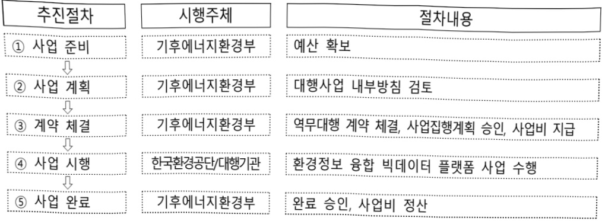

# 환경정보 융합빅데이터 플랫폼 구축(정보화)

**해당 페이지**: PDF 2901 ~ 2910 쪽 해당

**부처**: 기후에너지환경부
**분야**: 환경
**회계유형**: 환경개선특별 회계
**2026 확정예산**: 1838.0 백만원
**전년대비 증감률**: 0.0%
**AI 도메인**: 데이터, 환경/기후

---

### 가. 예산 총괄표

(단위:백만원,%)

<table border=1 style='margin: auto; word-wrap: break-word;'><tr><td rowspan="2">사업명</td><td rowspan="2">2024년 결산</td><td colspan="2">2025년 예산</td><td colspan="2">2026년</td><td rowspan="2">증감 (B-A)</td><td rowspan="2">(B-A)/A</td></tr><tr><td style='text-align: center; word-wrap: break-word;'>본예산(A)</td><td style='text-align: center; word-wrap: break-word;'>추경</td><td style='text-align: center; word-wrap: break-word;'>정부안</td><td style='text-align: center; word-wrap: break-word;'>확정(B)</td></tr><tr><td style='text-align: center; word-wrap: break-word;'>환경정보 융합빅데이터 플랫폼 구축(정보화)</td><td style='text-align: center; word-wrap: break-word;'>1,852</td><td style='text-align: center; word-wrap: break-word;'>1,838</td><td style='text-align: center; word-wrap: break-word;'>1,838</td><td style='text-align: center; word-wrap: break-word;'>1,838</td><td style='text-align: center; word-wrap: break-word;'>1,838</td><td style='text-align: center; word-wrap: break-word;'>0</td><td style='text-align: center; word-wrap: break-word;'>0</td></tr></table>

□ 기능별(내역사업별), 목별 예산 내역

(단위:백만원)

<table border=1 style='margin: auto; word-wrap: break-word;'><tr><td rowspan="3"></td><td colspan="5">2024</td><td colspan="7">2025</td><td rowspan="3">2026예산</td></tr><tr><td rowspan="2">예산액(추경)</td><td rowspan="2">예산현액</td><td rowspan="2">집행액[실집행액]</td><td rowspan="2">이월액</td><td rowspan="2">불용액</td><td rowspan="2">본예산</td><td rowspan="2">예산현액</td><td rowspan="2">집행액[실집행액]</td><td colspan="2">전년도 이월액제외</td><td rowspan="2">이월예산액</td><td rowspan="2">불용예산액</td></tr><tr><td style='text-align: center; word-wrap: break-word;'>예산현액</td><td style='text-align: center; word-wrap: break-word;'>집행액[실집행액]</td></tr><tr><td style='text-align: center; word-wrap: break-word;'>○ 기능별 분류(합계)</td><td style='text-align: center; word-wrap: break-word;'>1,852</td><td style='text-align: center; word-wrap: break-word;'>1,852</td><td style='text-align: center; word-wrap: break-word;'>1,848[1,807]</td><td style='text-align: center; word-wrap: break-word;'>-</td><td style='text-align: center; word-wrap: break-word;'>4</td><td style='text-align: center; word-wrap: break-word;'>1,838</td><td style='text-align: center; word-wrap: break-word;'>1,838</td><td style='text-align: center; word-wrap: break-word;'>1,830[1,830]</td><td style='text-align: center; word-wrap: break-word;'>1,802</td><td style='text-align: center; word-wrap: break-word;'>1,830[1,830]</td><td style='text-align: center; word-wrap: break-word;'>-</td><td style='text-align: center; word-wrap: break-word;'>8</td><td style='text-align: center; word-wrap: break-word;'>1,838</td></tr><tr><td style='text-align: center; word-wrap: break-word;'>· 플랫폼 구축</td><td style='text-align: center; word-wrap: break-word;'>840</td><td style='text-align: center; word-wrap: break-word;'>840</td><td style='text-align: center; word-wrap: break-word;'>840[836]</td><td style='text-align: center; word-wrap: break-word;'>-</td><td style='text-align: center; word-wrap: break-word;'>4</td><td style='text-align: center; word-wrap: break-word;'>840</td><td style='text-align: center; word-wrap: break-word;'>840</td><td style='text-align: center; word-wrap: break-word;'>832[832]</td><td style='text-align: center; word-wrap: break-word;'>840</td><td style='text-align: center; word-wrap: break-word;'>832[832]</td><td style='text-align: center; word-wrap: break-word;'>-</td><td style='text-align: center; word-wrap: break-word;'>8</td><td style='text-align: center; word-wrap: break-word;'>840</td></tr><tr><td style='text-align: center; word-wrap: break-word;'>· 빅데이터 분석활용</td><td style='text-align: center; word-wrap: break-word;'>673</td><td style='text-align: center; word-wrap: break-word;'>673</td><td style='text-align: center; word-wrap: break-word;'>673[632]</td><td style='text-align: center; word-wrap: break-word;'>-</td><td style='text-align: center; word-wrap: break-word;'>-</td><td style='text-align: center; word-wrap: break-word;'>673</td><td style='text-align: center; word-wrap: break-word;'>673</td><td style='text-align: center; word-wrap: break-word;'>673[673]</td><td style='text-align: center; word-wrap: break-word;'>673</td><td style='text-align: center; word-wrap: break-word;'>673[673]</td><td style='text-align: center; word-wrap: break-word;'>-</td><td style='text-align: center; word-wrap: break-word;'>-</td><td style='text-align: center; word-wrap: break-word;'>673</td></tr><tr><td style='text-align: center; word-wrap: break-word;'>· 플랫폼 유지관리</td><td style='text-align: center; word-wrap: break-word;'>339</td><td style='text-align: center; word-wrap: break-word;'>339</td><td style='text-align: center; word-wrap: break-word;'>339[339]</td><td style='text-align: center; word-wrap: break-word;'>-</td><td style='text-align: center; word-wrap: break-word;'>-</td><td style='text-align: center; word-wrap: break-word;'>325</td><td style='text-align: center; word-wrap: break-word;'>325</td><td style='text-align: center; word-wrap: break-word;'>325[325]</td><td style='text-align: center; word-wrap: break-word;'>325</td><td style='text-align: center; word-wrap: break-word;'>325[325]</td><td style='text-align: center; word-wrap: break-word;'>-</td><td style='text-align: center; word-wrap: break-word;'>-</td><td style='text-align: center; word-wrap: break-word;'>325</td></tr><tr><td style='text-align: center; word-wrap: break-word;'>○ 비목별 분류(합계)</td><td style='text-align: center; word-wrap: break-word;'>1,852</td><td style='text-align: center; word-wrap: break-word;'>1,852</td><td style='text-align: center; word-wrap: break-word;'>1,848[1,807]</td><td style='text-align: center; word-wrap: break-word;'>-</td><td style='text-align: center; word-wrap: break-word;'>4</td><td style='text-align: center; word-wrap: break-word;'>1,838</td><td style='text-align: center; word-wrap: break-word;'>1,838</td><td style='text-align: center; word-wrap: break-word;'>1,830[1,830]</td><td style='text-align: center; word-wrap: break-word;'>1,838</td><td style='text-align: center; word-wrap: break-word;'>1,830[1,830]</td><td style='text-align: center; word-wrap: break-word;'>-</td><td style='text-align: center; word-wrap: break-word;'>8</td><td style='text-align: center; word-wrap: break-word;'>1,838</td></tr><tr><td style='text-align: center; word-wrap: break-word;'>· 관 리 용 역 비(210-15)</td><td style='text-align: center; word-wrap: break-word;'>-</td><td style='text-align: center; word-wrap: break-word;'>-</td><td style='text-align: center; word-wrap: break-word;'>-</td><td style='text-align: center; word-wrap: break-word;'>-</td><td style='text-align: center; word-wrap: break-word;'>-</td><td style='text-align: center; word-wrap: break-word;'>-</td><td style='text-align: center; word-wrap: break-word;'>-</td><td style='text-align: center; word-wrap: break-word;'>-</td><td style='text-align: center; word-wrap: break-word;'>-</td><td style='text-align: center; word-wrap: break-word;'>-</td><td style='text-align: center; word-wrap: break-word;'>-</td><td style='text-align: center; word-wrap: break-word;'>-</td><td style='text-align: center; word-wrap: break-word;'>325</td></tr><tr><td style='text-align: center; word-wrap: break-word;'>· 일 반 연 구 비(260-01)</td><td style='text-align: center; word-wrap: break-word;'>436</td><td style='text-align: center; word-wrap: break-word;'>436</td><td style='text-align: center; word-wrap: break-word;'>432[432]</td><td style='text-align: center; word-wrap: break-word;'>-</td><td style='text-align: center; word-wrap: break-word;'>4</td><td style='text-align: center; word-wrap: break-word;'>436</td><td style='text-align: center; word-wrap: break-word;'>436</td><td style='text-align: center; word-wrap: break-word;'>428[428]</td><td style='text-align: center; word-wrap: break-word;'>436</td><td style='text-align: center; word-wrap: break-word;'>428[428]</td><td style='text-align: center; word-wrap: break-word;'>-</td><td style='text-align: center; word-wrap: break-word;'>8</td><td style='text-align: center; word-wrap: break-word;'>840</td></tr><tr><td style='text-align: center; word-wrap: break-word;'>· 법정민간대행사업비(320-08)</td><td style='text-align: center; word-wrap: break-word;'>1,416</td><td style='text-align: center; word-wrap: break-word;'>1,416</td><td style='text-align: center; word-wrap: break-word;'>1,416[1,375]</td><td style='text-align: center; word-wrap: break-word;'>-</td><td style='text-align: center; word-wrap: break-word;'>-</td><td style='text-align: center; word-wrap: break-word;'>1,402</td><td style='text-align: center; word-wrap: break-word;'>1,402</td><td style='text-align: center; word-wrap: break-word;'>1,402[1,402]</td><td style='text-align: center; word-wrap: break-word;'>1,402</td><td style='text-align: center; word-wrap: break-word;'>1,402[1,402]</td><td style='text-align: center; word-wrap: break-word;'>-</td><td style='text-align: center; word-wrap: break-word;'>-</td><td style='text-align: center; word-wrap: break-word;'>673</td></tr><tr><td style='text-align: center; word-wrap: break-word;'>○ 기능비목별 분류합계</td><td style='text-align: center; word-wrap: break-word;'>1,852</td><td style='text-align: center; word-wrap: break-word;'>1,852</td><td style='text-align: center; word-wrap: break-word;'>1,848[1,807]</td><td style='text-align: center; word-wrap: break-word;'>-</td><td style='text-align: center; word-wrap: break-word;'>4</td><td style='text-align: center; word-wrap: break-word;'>1,838</td><td style='text-align: center; word-wrap: break-word;'>1,838</td><td style='text-align: center; word-wrap: break-word;'>1,830[1,830]</td><td style='text-align: center; word-wrap: break-word;'>1,838</td><td style='text-align: center; word-wrap: break-word;'>1,830[1,830]</td><td style='text-align: center; word-wrap: break-word;'>-</td><td style='text-align: center; word-wrap: break-word;'>8</td><td style='text-align: center; word-wrap: break-word;'>1,838</td></tr><tr><td style='text-align: center; word-wrap: break-word;'>· 플랫폼 구축</td><td style='text-align: center; word-wrap: break-word;'>840</td><td style='text-align: center; word-wrap: break-word;'>840</td><td style='text-align: center; word-wrap: break-word;'>840[836]</td><td style='text-align: center; word-wrap: break-word;'>-</td><td style='text-align: center; word-wrap: break-word;'>4</td><td style='text-align: center; word-wrap: break-word;'>840</td><td style='text-align: center; word-wrap: break-word;'>840</td><td style='text-align: center; word-wrap: break-word;'>832[832]</td><td style='text-align: center; word-wrap: break-word;'>840</td><td style='text-align: center; word-wrap: break-word;'>832[832]</td><td style='text-align: center; word-wrap: break-word;'>-</td><td style='text-align: center; word-wrap: break-word;'>8</td><td style='text-align: center; word-wrap: break-word;'>840</td></tr><tr><td style='text-align: center; word-wrap: break-word;'>· 일 반 연 구 비(260-01)</td><td style='text-align: center; word-wrap: break-word;'>436</td><td style='text-align: center; word-wrap: break-word;'>436</td><td style='text-align: center; word-wrap: break-word;'>432[432]</td><td style='text-align: center; word-wrap: break-word;'>-</td><td style='text-align: center; word-wrap: break-word;'>4</td><td style='text-align: center; word-wrap: break-word;'>436</td><td style='text-align: center; word-wrap: break-word;'>436</td><td style='text-align: center; word-wrap: break-word;'>428[428]</td><td style='text-align: center; word-wrap: break-word;'>436</td><td style='text-align: center; word-wrap: break-word;'>428[428]</td><td style='text-align: center; word-wrap: break-word;'>-</td><td style='text-align: center; word-wrap: break-word;'>8</td><td style='text-align: center; word-wrap: break-word;'>840</td></tr><tr><td style='text-align: center; word-wrap: break-word;'>· 법정민간대행사업비(320-08)</td><td style='text-align: center; word-wrap: break-word;'>404</td><td style='text-align: center; word-wrap: break-word;'>404</td><td style='text-align: center; word-wrap: break-word;'>408[408]</td><td style='text-align: center; word-wrap: break-word;'>-</td><td style='text-align: center; word-wrap: break-word;'>-</td><td style='text-align: center; word-wrap: break-word;'>404</td><td style='text-align: center; word-wrap: break-word;'>404</td><td style='text-align: center; word-wrap: break-word;'>404[404]</td><td style='text-align: center; word-wrap: break-word;'>404</td><td style='text-align: center; word-wrap: break-word;'>404[404]</td><td style='text-align: center; word-wrap: break-word;'>-</td><td style='text-align: center; word-wrap: break-word;'>-</td><td style='text-align: center; word-wrap: break-word;'>-</td></tr><tr><td style='text-align: center; word-wrap: break-word;'>· 빅데이터 분석활용</td><td style='text-align: center; word-wrap: break-word;'>673</td><td style='text-align: center; word-wrap: break-word;'>673</td><td style='text-align: center; word-wrap: break-word;'>673[632]</td><td style='text-align: center; word-wrap: break-word;'>-</td><td style='text-align: center; word-wrap: break-word;'>-</td><td style='text-align: center; word-wrap: break-word;'>673</td><td style='text-align: center; word-wrap: break-word;'>673</td><td style='text-align: center; word-wrap: break-word;'>673[673]</td><td style='text-align: center; word-wrap: break-word;'>673</td><td style='text-align: center; word-wrap: break-word;'>673[673]</td><td style='text-align: center; word-wrap: break-word;'>-</td><td style='text-align: center; word-wrap: break-word;'>-</td><td style='text-align: center; word-wrap: break-word;'>673</td></tr><tr><td style='text-align: center; word-wrap: break-word;'>· 법정민간대행사업비(320-08)</td><td style='text-align: center; word-wrap: break-word;'>673</td><td style='text-align: center; word-wrap: break-word;'>673</td><td style='text-align: center; word-wrap: break-word;'>673[632]</td><td style='text-align: center; word-wrap: break-word;'>-</td><td style='text-align: center; word-wrap: break-word;'>-</td><td style='text-align: center; word-wrap: break-word;'>673</td><td style='text-align: center; word-wrap: break-word;'>673</td><td style='text-align: center; word-wrap: break-word;'>673[673]</td><td style='text-align: center; word-wrap: break-word;'>673</td><td style='text-align: center; word-wrap: break-word;'>673[673]</td><td style='text-align: center; word-wrap: break-word;'>-</td><td style='text-align: center; word-wrap: break-word;'>-</td><td style='text-align: center; word-wrap: break-word;'>673</td></tr><tr><td style='text-align: center; word-wrap: break-word;'>· 플랫폼 유지관리</td><td style='text-align: center; word-wrap: break-word;'>339</td><td style='text-align: center; word-wrap: break-word;'>339</td><td style='text-align: center; word-wrap: break-word;'>339[339]</td><td style='text-align: center; word-wrap: break-word;'>-</td><td style='text-align: center; word-wrap: break-word;'>-</td><td style='text-align: center; word-wrap: break-word;'>325</td><td style='text-align: center; word-wrap: break-word;'>325</td><td style='text-align: center; word-wrap: break-word;'>325[325]</td><td style='text-align: center; word-wrap: break-word;'>325</td><td style='text-align: center; word-wrap: break-word;'>325[325]</td><td style='text-align: center; word-wrap: break-word;'>-</td><td style='text-align: center; word-wrap: break-word;'>-</td><td style='text-align: center; word-wrap: break-word;'>325</td></tr><tr><td style='text-align: center; word-wrap: break-word;'>· 관 리 용 역 비(210-15)</td><td style='text-align: center; word-wrap: break-word;'>-</td><td style='text-align: center; word-wrap: break-word;'>-</td><td style='text-align: center; word-wrap: break-word;'>-</td><td style='text-align: center; word-wrap: break-word;'>-</td><td style='text-align: center; word-wrap: break-word;'>-</td><td style='text-align: center; word-wrap: break-word;'>-</td><td style='text-align: center; word-wrap: break-word;'>-</td><td style='text-align: center; word-wrap: break-word;'>-</td><td style='text-align: center; word-wrap: break-word;'>-</td><td style='text-align: center; word-wrap: break-word;'>-</td><td style='text-align: center; word-wrap: break-word;'>-</td><td style='text-align: center; word-wrap: break-word;'>-</td><td style='text-align: center; word-wrap: break-word;'>325</td></tr><tr><td style='text-align: center; word-wrap: break-word;'>· 법정민간대행사업비</td><td style='text-align: center; word-wrap: break-word;'>339</td><td style='text-align: center; word-wrap: break-word;'>339</td><td style='text-align: center; word-wrap: break-word;'>339</td><td style='text-align: center; word-wrap: break-word;'>-</td><td style='text-align: center; word-wrap: break-word;'>-</td><td style='text-align: center; word-wrap: break-word;'>325</td><td style='text-align: center; word-wrap: break-word;'>325</td><td style='text-align: center; word-wrap: break-word;'>325</td><td style='text-align: center; word-wrap: break-word;'>325</td><td style='text-align: center; word-wrap: break-word;'>325</td><td style='text-align: center; word-wrap: break-word;'>-</td><td style='text-align: center; word-wrap: break-word;'>-</td><td style='text-align: center; word-wrap: break-word;'>-</td></tr></table>

---

<table border=1 style='margin: auto; word-wrap: break-word;'><tr><td rowspan="2"></td><td colspan="5">2024</td><td colspan="7">2025</td><td rowspan="2">2026 예산</td></tr><tr><td style='text-align: center; word-wrap: break-word;'>예산액 (추경)</td><td style='text-align: center; word-wrap: break-word;'>예산 현액</td><td style='text-align: center; word-wrap: break-word;'>집행액 [실집 행액]</td><td style='text-align: center; word-wrap: break-word;'>이월액</td><td style='text-align: center; word-wrap: break-word;'>불용액</td><td style='text-align: center; word-wrap: break-word;'>본예산</td><td style='text-align: center; word-wrap: break-word;'>예산 현액</td><td style='text-align: center; word-wrap: break-word;'>집행액 [실집 행액]</td><td colspan="2">전년도 이월액 제외</td><td style='text-align: center; word-wrap: break-word;'>이월 예산액</td><td style='text-align: center; word-wrap: break-word;'>불용 예산액</td></tr><tr><td style='text-align: center; word-wrap: break-word;'>(320-08)</td><td style='text-align: center; word-wrap: break-word;'></td><td style='text-align: center; word-wrap: break-word;'></td><td style='text-align: center; word-wrap: break-word;'>(339)</td><td style='text-align: center; word-wrap: break-word;'></td><td style='text-align: center; word-wrap: break-word;'></td><td style='text-align: center; word-wrap: break-word;'></td><td style='text-align: center; word-wrap: break-word;'></td><td style='text-align: center; word-wrap: break-word;'>[325]</td><td style='text-align: center; word-wrap: break-word;'></td><td style='text-align: center; word-wrap: break-word;'>[325]</td><td style='text-align: center; word-wrap: break-word;'></td><td style='text-align: center; word-wrap: break-word;'></td><td style='text-align: center; word-wrap: break-word;'></td></tr></table>

### 나.사업설명자료

## 1 ) 사업목적·내용

- (목적) 기관별 또는 환경매체별 분산 구축·운영되고 있는 환경정보를 빅데이터 플랫폼을 통해 연계·수집 및 분석함으로써 데이터 기반의 과학적인 의사결정 지원 및 환경행정 구현

- (내용) 대기, 수질 등 환경매체별로 분산된 데이터를 단계적으로 연계·수집하여 통합관리 하고, 조직 구성원이 수집된 데이터를 전처리, 시각화, 분석 등 데이터를 쉽게 활용할 수 있도록 환경데이터 공유 및 분석 인프라 구축

## 2 ) 사업개요

□ 사업근거 및 추진경위

① 법령상 근거 및 조항 적시

- 환경정책기본법 제24조 및 같은 법 시행령 제12조

제24조(환경정보의 보급 등) ① 환경부장관은 모든 국민에게 환경보전에 관한 지식·정보를 보급하고, 국민이 환경에 관한 정보에 쉽게 접근할 수 있도록 노력하여야 한다.

② 환경부장관은 제1항에 따른 환경보전에 관한 지식·정보의 원활한 생산·보급 등을 위하여 환경정보망을 구축하여 운영할 수 있다.

④ 환경부장관은 제2항에 따른 환경정보망을 효율적으로 구축·운영하기 위하여 필요한 경우에는 전문기관에 환경현황 조사를 의뢰하거나 환경정보망의 구축·운영 등) ② 환경부장관이 법 제24조제4항에 따라 환경현황 조사를 의뢰하거나 환경정보망의 구축·운영을 위탁할 수 있는 전문기관은 다음 각 호와 같다. <개정 2016. 11. 29.>

4. 「한국환경공단법」에 따른 한국환경공단

-데이터기반행정 활성화에 관한 법률(데이터행정법) 제3조, 제20조, 제23조

---

제3조(국가 등의 책무) ① 국가 및 지방자치단체는 데이터기반행정을 활성화하기 위한 시책을 수립하고, 그 추진에 필요한 행정적·기술적·재정적 조치를 마련하여야 한다.

제20조(데이터분석센터) ① 공공기관의 장은 데이터기반행정의 수행에 필요한 데이터의 분석등을 통하여 정책수립 및 의사결정에 활용하기 위하여 데이터분석센터를 설치·운영할 수 있다.

제23조(데이터기반행정 우수사례의 발굴·보급 등) ① 정부는 데이터기반행정 우수사례를 발굴하여 포상하고 홍보할 수 있으며, 우수사례가 보급·확산될 수 있도록 노력하여야 한다.

②제1항에 패미디기바행정 우수사례의 발굴 방법 및 절차 등에 관하여 필요한 사항은 대통령령으로 정한다.

제24조(데이터 관련 전문인력 양성) ① 행정안전부장관과 과학기술정보통신부장관은 데이터 관련 전문인력 양성을 위하여 필요한 다음 각 호의 시책을 마련할 수 있다.

1. 전문인력의 수요 실태 파악 및 중장기 수급 전망 수립

2. 전문인력 양성 교육훈련 프로그램의 개발 및 보급 지원

3.데이터 활용 관련 직무표준의 마련 및 자격제도의 정착 지원

4.전문인력 고용창출 지원

5.그 밖에 전문인력 양성에 필요한 사항

② 앵성안선무상반과 과학기술성보통신부장관은 데이터 관련 전문인력을 효율적으로 활용하기 위하여 필요한 경우 관련 연구기관이나 민간단체 등과 협력할 수 있다.

③ 그 밖에 데이터 관련 전문인력 양성에 필요한 사항은 대통령령으로 정한다.

## ② 추진경위

- 환경정보 융합 빅데이터 구축 정보전략계획(ISP) 수립(17.12)

- 환경정보 융합 빅데이터 플랫폼 운영기관으로 한국환경공단 선정('18.7.)

- 환경정보 융합 빅데이터 플랫폼 구축·운영(19~계속)

- 우리동네 환경정보 (대국민 환경종합정보서비스) 오픈('24.1)

## □ 주요내용

① 사업규모

- 총사업비(해당되는 경우에만 기재) : 해당없음

-사업기간:해당없음

- 최근 5년 간 투입된 사업비(예산액기준, 추경편성한 연도에는 추경포함)

<table border=1 style='margin: auto; word-wrap: break-word;'><tr><td style='text-align: center; word-wrap: break-word;'>$ \underline{\text{연도}} $</td><td style='text-align: center; word-wrap: break-word;'>2022</td><td style='text-align: center; word-wrap: break-word;'>2023</td><td style='text-align: center; word-wrap: break-word;'>2024</td><td style='text-align: center; word-wrap: break-word;'>2025</td><td style='text-align: center; word-wrap: break-word;'>2026</td></tr><tr><td style='text-align: center; word-wrap: break-word;'>$ \underline{\text{사업비}} $</td><td style='text-align: center; word-wrap: break-word;'>3,381</td><td style='text-align: center; word-wrap: break-word;'>1,749</td><td style='text-align: center; word-wrap: break-word;'>1,852</td><td style='text-align: center; word-wrap: break-word;'>1,838</td><td style='text-align: center; word-wrap: break-word;'>1,838</td></tr></table>

## ② 사업추진체계

- 사업시행방법 : 직접수행

- 사업시행주체 : 기후에너지환경부

-사업 수혜자 : 국민, 공무원, 연구기관 등

- 보조, 융자, 출연, 출자 등의 경우 보조 · 융자 등 지원 비율 및 법적근거 : 해당사항 없음

---

① 플랫폼 구축 : (2025) 840백만원 → (2026요구) 840백만원, +0.0%

(1-1) '우리동네 환경정보' 서비스 기능개선 (2025년) 436 → (2026요구) 436백만원 +0.0%

- (요구) 우리동네 환경정보 환경매체별 정보 추가, 타부처·민간데이터를 활용한 데이터 융·복합 제공, 환경데이터 AI분석 결과 가시화 서비스

·우리동네 환경정보 콘텐츠 확대 및 환경데이터 AI분석 결과 가시화

·민간 및 공공데이터를 융복합하여 다양한 정보 제공

- (산출) 기능 고도화 : 436백만원

<table border=1 style='margin: auto; word-wrap: break-word;'><tr><td rowspan="2">총기능점수</td><td rowspan="2">기능점수 단가(원)</td><td colspan="5">보정계수</td><td rowspan="2">개발원가 (원)</td></tr><tr><td style='text-align: center; word-wrap: break-word;'>규모</td><td style='text-align: center; word-wrap: break-word;'>연계 복잡성</td><td style='text-align: center; word-wrap: break-word;'>성능</td><td style='text-align: center; word-wrap: break-word;'>다중 사이트</td><td style='text-align: center; word-wrap: break-word;'>보안성</td></tr><tr><td style='text-align: center; word-wrap: break-word;'>523.6</td><td style='text-align: center; word-wrap: break-word;'>605,784</td><td style='text-align: center; word-wrap: break-word;'>1.178</td><td style='text-align: center; word-wrap: break-word;'>1.00</td><td style='text-align: center; word-wrap: break-word;'>1.00</td><td style='text-align: center; word-wrap: break-word;'>1.00</td><td style='text-align: center; word-wrap: break-word;'>1.03</td><td style='text-align: center; word-wrap: break-word;'>384,857,498</td></tr><tr><td colspan="7">개발금액 = (개발원가 + 이윤(개발원가의 3%)) × 1.1(VAT포함)</td><td style='text-align: center; word-wrap: break-word;'>436,043,545</td></tr></table>

(1-2) 데이터셋 개선 및 AI 검색/분석 서비스 (2025) 404 → (2026요구) 404백만원 +0.0%

- (요구) 데이터 연계·수집 발굴 및 수집·전달체계 개선, 환경 데이터셋 기능개선 및 활용 지원체계 마련

· 신규시스템 연계 및 환경매체별 다양한 데이터셋 제공

• 데이터 연계·수집·정제(표준화, 공간화 등)·적재·관리·서비스 공정 개선, 각 공정별 데이터 확인이 가능한 Data Pipeline 구축

- (산출) 서비스 기능 개발 : 404백만원

<table border=1 style='margin: auto; word-wrap: break-word;'><tr><td rowspan="2">총기능점수</td><td rowspan="2">기능점수 단가(원)</td><td colspan="5">보정계수</td><td rowspan="2">개발원가 (원)</td></tr><tr><td style='text-align: center; word-wrap: break-word;'>규모</td><td style='text-align: center; word-wrap: break-word;'>연계 복잡성</td><td style='text-align: center; word-wrap: break-word;'>성능</td><td style='text-align: center; word-wrap: break-word;'>다중 사이트</td><td style='text-align: center; word-wrap: break-word;'>보안성</td></tr><tr><td style='text-align: center; word-wrap: break-word;'>602</td><td style='text-align: center; word-wrap: break-word;'>605,784</td><td style='text-align: center; word-wrap: break-word;'>0.889</td><td style='text-align: center; word-wrap: break-word;'>1.00</td><td style='text-align: center; word-wrap: break-word;'>1.00</td><td style='text-align: center; word-wrap: break-word;'>1.00</td><td style='text-align: center; word-wrap: break-word;'>1.03</td><td style='text-align: center; word-wrap: break-word;'>333,928,338</td></tr><tr><td colspan="7">개발금액 = (개발원가 + 이윤(개발원가의 10%)+직접경비) × 1.1(VAT포함)</td><td style='text-align: center; word-wrap: break-word;'>404,053,289</td></tr></table>

② 빅데이터 분석: (2025) 673 → (2026요구) 673백만원, +0.0%

(2-1) 빅데이터 분석 : (2025) 423 → (2026요구) 423백만원, +0.0%

- (요구) 국민적 관심이 높고 행성수요가 높은 환경 분야 마스터데이터* 신규 구축 및 선도분석

과제 추진(추진 가능성, 파급효과, 확산 가능성, 정책적 부합성 등을 고려하여 선정)

* (마스터데이터) 환경 분야 여러 시스템이나 애플리케이션에서 공통으로 사용되는 핵심(기준) 데이터

(마스터데이터 신규 구축**) 시스템별로 분산 되어있는 데이터를 통합·표준화하여 상호 비교·검증 가능한 마스터데이터 신규 구축,데이터 간 불일치·중복 문제해결, 일관성 있는 기준 데이터 구축

**근거: 「환경데이터 분석·활용을 위한 종합계획 수립 연구」(24년)에서 추진 로드맵 단기과제로 공동활용 가치가 높은 마스터데이터 구축 필요성 제시

(과제발굴) '21년12건→ '22년20건→ '23년25건 → '24년30건 → '25년30건 → '26년30건

---

<table border=1 style='margin: auto; word-wrap: break-word;'><tr><td style='text-align: center; word-wrap: break-word;'>과제발굴 수요조사</td><td style='text-align: center; word-wrap: break-word;'>제출 과제 검토 및 심의</td><td style='text-align: center; word-wrap: break-word;'>선도분석 과제 지정</td><td style='text-align: center; word-wrap: break-word;'>전문가 분석 및 모델 개발</td><td style='text-align: center; word-wrap: break-word;'>정책 활용</td></tr><tr><td style='text-align: center; word-wrap: break-word;'>(4월)</td><td style='text-align: center; word-wrap: break-word;'>(5월)</td><td style='text-align: center; word-wrap: break-word;'>(6월~7월)</td><td style='text-align: center; word-wrap: break-word;'>(6월~11월)</td><td style='text-align: center; word-wrap: break-word;'>(11월~)</td></tr></table>

(선도분석) '21년2건→ '22년2건→ '23년3건 → '24년3건 → '25년3건 → '26년3건

<table border=1 style='margin: auto; word-wrap: break-word;'><tr><td style='text-align: center; word-wrap: break-word;'>구분</td><td style='text-align: center; word-wrap: break-word;'>실적</td><td style='text-align: center; word-wrap: break-word;'>주요내용</td></tr><tr><td style='text-align: center; word-wrap: break-word;'>2022년</td><td style='text-align: center; word-wrap: break-word;'>2건</td><td style='text-align: center; word-wrap: break-word;'>야생조류 AI 확산방지를 위한 시공간적 분석모델 구축 등 2건</td></tr><tr><td style='text-align: center; word-wrap: break-word;'>2023년</td><td style='text-align: center; word-wrap: break-word;'>3건</td><td style='text-align: center; word-wrap: break-word;'>데이터 분석을 통한 도시근교 등산객 산악사고 예방방안 마련 등 3건</td></tr><tr><td style='text-align: center; word-wrap: break-word;'>2024년</td><td style='text-align: center; word-wrap: break-word;'>3건</td><td style='text-align: center; word-wrap: break-word;'>화학사고 발생 예측분석 등 3건</td></tr><tr><td style='text-align: center; word-wrap: break-word;'>2025년</td><td style='text-align: center; word-wrap: break-word;'>3건</td><td style='text-align: center; word-wrap: break-word;'>대기 배출 사업자 특성 분석 등 3건</td></tr><tr><td style='text-align: center; word-wrap: break-word;'>2026년</td><td style='text-align: center; word-wrap: break-word;'>3건</td><td style='text-align: center; word-wrap: break-word;'>초거대 AI 수요 반영 및 마스터데이터를 활용한 용합 분석 과제 등 3건</td></tr></table>

## - (산출) 423백만원

○ 분석원가 산정

(단위 : 원)

<table border=1 style='margin: auto; word-wrap: break-word;'><tr><td rowspan="2">항목</td><td colspan="3">산출내역</td><td style='text-align: center; word-wrap: break-word;'>소요비용</td><td rowspan="2">비고</td></tr><tr><td style='text-align: center; word-wrap: break-word;'>기술등급</td><td style='text-align: center; word-wrap: break-word;'>월 노임단가</td><td style='text-align: center; word-wrap: break-word;'>MM</td><td style='text-align: center; word-wrap: break-word;'>금액</td></tr><tr><td rowspan="2">직접인건비</td><td style='text-align: center; word-wrap: break-word;'>데이터분석가</td><td style='text-align: center; word-wrap: break-word;'>7,751,183</td><td style='text-align: center; word-wrap: break-word;'>16.6</td><td style='text-align: center; word-wrap: break-word;'>128,669,638</td><td rowspan="6">※ &#x27;25 평균 노임단가 적용 - 제경비 : 140% ~ 150% - 기술료 : 20% ~ 40%</td></tr><tr><td style='text-align: center; word-wrap: break-word;'>소 계</td><td style='text-align: center; word-wrap: break-word;'></td><td style='text-align: center; word-wrap: break-word;'>16.6</td><td style='text-align: center; word-wrap: break-word;'>128,669,638</td></tr><tr><td style='text-align: center; word-wrap: break-word;'>제경비</td><td colspan="3">120% 적용</td><td style='text-align: center; word-wrap: break-word;'>154,403,565</td></tr><tr><td style='text-align: center; word-wrap: break-word;'>기술료</td><td colspan="3">36% 적용</td><td style='text-align: center; word-wrap: break-word;'>101,906,353</td></tr><tr><td colspan="4">합 계(부가세 별도)</td><td style='text-align: center; word-wrap: break-word;'>384,979,556</td></tr><tr><td colspan="4">합 계(부가세 포함, 십만단위 이하 절사)</td><td style='text-align: center; word-wrap: break-word;'>423,000,000</td></tr></table>

(2-2) 빅데이터 분석지원 및 활용, 역량강화 : (2025) 250 → (2026요구) 250백만원, +0.0%

- (요구) 빅데이터플랫폼 데이터를 기반으로 한 AI·데이터분석·활용 및 AI리터러시 교육, 데이터분석 공모전 및 데이터활용 역량진단 실시

· 플랫폼 데이터 등을 활용한 AI·데이터분석 및 활용능력 맞춤형 교육

·데이터를 활용한 AI·데이터분석 공모전 및 성과 공유대회 실시

·기후에너지환경부직원들의AI·데이터활용역량진단실시

- (산출) 250백만원

<table border=1 style='margin: auto; word-wrap: break-word;'><tr><td style='text-align: center; word-wrap: break-word;'>구분</td><td style='text-align: center; word-wrap: break-word;'>25년</td><td style='text-align: center; word-wrap: break-word;'>26년</td><td style='text-align: center; word-wrap: break-word;'>비고</td></tr><tr><td style='text-align: center; word-wrap: break-word;'>데이터 분석 및 AI 리터 러시 교육</td><td style='text-align: center; word-wrap: break-word;'>120백만원</td><td style='text-align: center; word-wrap: break-word;'>120백만원</td><td style='text-align: center; word-wrap: break-word;'>- 맞춤형 실무중심 교육 및 분석 프로젝트형 중점 교육
- AI·데이터분석 등 6개 과정 17회</td></tr><tr><td style='text-align: center; word-wrap: break-word;'>AI·데이터분석 공모전 및 성과공유대회 등</td><td style='text-align: center; word-wrap: break-word;'>100백만원</td><td style='text-align: center; word-wrap: break-word;'>100백만원</td><td style='text-align: center; word-wrap: break-word;'>- 데이터 활용문화 저변확대
- AI·데이터공모전 및 성과공유대회 개최</td></tr><tr><td style='text-align: center; word-wrap: break-word;'>AI·데이터활용 역량진단 및 개선</td><td style='text-align: center; word-wrap: break-word;'>30백만원</td><td style='text-align: center; word-wrap: break-word;'>30백만원</td><td style='text-align: center; word-wrap: break-word;'>- 기후에-지환경류소속성·AI·데이터활용 역량진단 및 강화방안 마련</td></tr></table>

---

③ 정보시스템 운영·유지관리: (2025) 325 → (2026요구) 325백만원, +0.0%

- (산출) 325백만원

(단위:백만원)

<table border=1 style='margin: auto; word-wrap: break-word;'><tr><td rowspan="2">구분</td><td colspan="3">2025년</td><td colspan="3">2026년</td></tr><tr><td style='text-align: center; word-wrap: break-word;'>도입비</td><td style='text-align: center; word-wrap: break-word;'>평균요율</td><td style='text-align: center; word-wrap: break-word;'>예산</td><td style='text-align: center; word-wrap: break-word;'>도입비</td><td style='text-align: center; word-wrap: break-word;'>평균요율</td><td style='text-align: center; word-wrap: break-word;'>예산</td></tr><tr><td style='text-align: center; word-wrap: break-word;'>유지보수</td><td colspan="2">합계</td><td style='text-align: center; word-wrap: break-word;'>325</td><td colspan="2">합계</td><td style='text-align: center; word-wrap: break-word;'>325</td></tr><tr><td style='text-align: center; word-wrap: break-word;'>개발SW</td><td style='text-align: center; word-wrap: break-word;'>851</td><td style='text-align: center; word-wrap: break-word;'>12%</td><td style='text-align: center; word-wrap: break-word;'>102</td><td style='text-align: center; word-wrap: break-word;'>851</td><td style='text-align: center; word-wrap: break-word;'>12%</td><td style='text-align: center; word-wrap: break-word;'>102</td></tr><tr><td style='text-align: center; word-wrap: break-word;'>상용SW, HW</td><td style='text-align: center; word-wrap: break-word;'>205</td><td style='text-align: center; word-wrap: break-word;'>7.8%</td><td style='text-align: center; word-wrap: break-word;'>16</td><td style='text-align: center; word-wrap: break-word;'>205</td><td style='text-align: center; word-wrap: break-word;'>7.8%</td><td style='text-align: center; word-wrap: break-word;'>16</td></tr><tr><td style='text-align: center; word-wrap: break-word;'>데이터품질관리</td><td style='text-align: center; word-wrap: break-word;'>17.69</td><td style='text-align: center; word-wrap: break-word;'>11.7M/M</td><td style='text-align: center; word-wrap: break-word;'>207</td><td style='text-align: center; word-wrap: break-word;'>17.69</td><td style='text-align: center; word-wrap: break-word;'>11.7M/M</td><td style='text-align: center; word-wrap: break-word;'>207</td></tr></table>

2025년도 예산 및 2026년도 예산 산출 세부내역 비교

<table border=1 style='margin: auto; word-wrap: break-word;'><tr><td colspan="2">2025년 본예산</td><td colspan="2">2026년 예산</td></tr><tr><td style='text-align: center; word-wrap: break-word;'>예산</td><td style='text-align: center; word-wrap: break-word;'>산출내역</td><td style='text-align: center; word-wrap: break-word;'>예산</td><td style='text-align: center; word-wrap: break-word;'>산출내역</td></tr><tr><td rowspan="4">1,838,000</td><td style='text-align: center; word-wrap: break-word;'>○ 일반연구비(260-01) : 436,000천원가. 플랫폼 구축 (436,000천원) • 우리동네 환경정보 서비스 고도화(모바일 웹 서비스 확대) 436,000,000원×1식=436,000천원</td><td rowspan="3">1,838,000</td><td style='text-align: center; word-wrap: break-word;'>○ 일반연구비(260-01) : 436,000천원가. 플랫폼 구축 (436,000천원) • 우리동네 환경정보 서비스 기능개선(AI분석결과 가시화 등) 436,000,000원×1식=436,000천원</td></tr><tr><td style='text-align: center; word-wrap: break-word;'>○ 법정민간대행사업비(320-08) : 1,402,000천원가. 플랫폼 구축 (404,000천원) • 데이터 연계-수집 및 데이터셋 개선 404,000,000원×1식=404,000천원</td><td style='text-align: center; word-wrap: break-word;'>○ 법정민간대행사업비(320-08) : 1,402,000천원가. 플랫폼 구축 (404,000천원) • 데이터셋 개선 및 AI 검색/분석 서비스 404,000,000원×1식=404,000천원</td></tr><tr><td style='text-align: center; word-wrap: break-word;'>나. 빅데이터 분석활용 (673,000천원) • 빅데이터 과제분석 423,000,000원×1식=423,000천원 • 분석지원 및 활용 역량강화 250,000,000원×1식=250,000천원</td><td style='text-align: center; word-wrap: break-word;'>나. 빅데이터 분석활용 (673,000천원) • 빅데이터 과제분석 423,000,000원×1식=423,000천원 • 분석지원 및 활용 역량강화 250,000,000원×1식=250,000천원</td></tr><tr><td style='text-align: center; word-wrap: break-word;'>다. 플랫폼 유지관리 (325,000천원) • 개발SW 유지보수 102,000,000원×1식=102,000천원 • 상용SW 및 HW 유지보수 16,000,000원×1식=16,000천원 • 데이터 품질관리 207,000,000원×1식= 207,000천원</td><td style='text-align: center; word-wrap: break-word;'>다. 플랫폼 유지관리 (325,000천원) • 개발SW 유지보수 102,000,000원×1식=102,000천원 • 상용SW 및 HW 유지보수 16,000,000원×1식=16,000천원 • 데이터 품질관리 207,000,000원×1식= 207,000천원</td><td style='text-align: center; word-wrap: break-word;'></td></tr></table>

## 4 ) 사업효과

☐ 사업영향, 산출물 성과지표 등

① 2022~2026년도 성과계획서 상 성과지표 및 최근 5년간 성과 달성도

<table border=1 style='margin: auto; word-wrap: break-word;'><tr><td style='text-align: center; word-wrap: break-word;'>성과지표</td><td style='text-align: center; word-wrap: break-word;'>구분</td><td style='text-align: center; word-wrap: break-word;'>2022</td><td style='text-align: center; word-wrap: break-word;'>2023</td><td style='text-align: center; word-wrap: break-word;'>2024</td><td style='text-align: center; word-wrap: break-word;'>2025</td><td style='text-align: center; word-wrap: break-word;'>2026</td><td style='text-align: center; word-wrap: break-word;'>2026 목표치산출근거</td><td style='text-align: center; word-wrap: break-word;'>측정산식(또는 측정방법)</td><td style='text-align: center; word-wrap: break-word;'>자료수집방법(또는 자료출처)</td></tr><tr><td rowspan="3">환경융합데이터제공·활용 건수</td><td style='text-align: center; word-wrap: break-word;'>목표</td><td style='text-align: center; word-wrap: break-word;'>636</td><td style='text-align: center; word-wrap: break-word;'>700</td><td style='text-align: center; word-wrap: break-word;'>800</td><td style='text-align: center; word-wrap: break-word;'>880</td><td style='text-align: center; word-wrap: break-word;'>-</td><td rowspan="3">전년 실적대비 10% 이상 향상</td><td rowspan="3">연간 환경융합데이터 제공활용 건수(다운로드 건수)</td><td rowspan="3">환경정보 융합 빅데이터 플랫폼</td></tr><tr><td style='text-align: center; word-wrap: break-word;'>실적</td><td style='text-align: center; word-wrap: break-word;'>659</td><td style='text-align: center; word-wrap: break-word;'>721</td><td style='text-align: center; word-wrap: break-word;'>1,049</td><td style='text-align: center; word-wrap: break-word;'>-</td><td style='text-align: center; word-wrap: break-word;'>-</td></tr><tr><td style='text-align: center; word-wrap: break-word;'>달성도</td><td style='text-align: center; word-wrap: break-word;'>103%</td><td style='text-align: center; word-wrap: break-word;'>103%</td><td style='text-align: center; word-wrap: break-word;'>131%</td><td style='text-align: center; word-wrap: break-word;'>-</td><td style='text-align: center; word-wrap: break-word;'>-</td></tr></table>

---

② 성과지표 이외의 연도별 사업추진 경과 및 실적

<table border=1 style='margin: auto; word-wrap: break-word;'><tr><td style='text-align: center; word-wrap: break-word;'>2022</td><td style='text-align: center; word-wrap: break-word;'>○빅데이터 플랫폼 분석환경 고도화 사업 완료(&#x27;22.8.~&#x27;23.2.) - 빅데이터 플랫폼 서버 자원 및 SW 라이센스 증설 - 데이터 저장 및 조회 구조 개선 - 기존 환경데이터 포털 프로그램 전환 및 재구축 - 다양한 사용자들을 위한 환경데이터 분석환경 고도화 등 ○2022년 환경 데이터리더 양성 교육(&#x27;22.6.~&#x27;22.10.) - 분석과제 발굴(94명), 분석기획서 작성(63명), 분석도구 활용(100명) 등 ○2022년 환경 빅데이터 분석과제 수행(&#x27;22.9.~&#x27;23.1.) - 야생조류 AI 확산 방지를 위한 분석모델 개발, 수질오염사고 위험도 분석 등 2건의 분석과제 추진 ○환경융합 종합정보 대국민서비스 구축 추진 - 데이터 통합기반 환경정책지원서비스(2단계) 구축</td></tr><tr><td style='text-align: center; word-wrap: break-word;'>2023</td><td style='text-align: center; word-wrap: break-word;'>○2023년 환경 빅데이터 분석과제 발굴 및 수행 (&#x27;23.3.~&#x27;23.12.) - 활용도가 높은 분석과제 발굴·검증 및 분석수행하여 정책에 활용 ○2023년 환경 데이터리더 양성 교육(&#x27;23.5.~&#x27;22.8.) - 데이터 분석 전문교육운영, 분석 동아리 운영 · 지원, 온라인 분석지원 센터 운영 등 ○빅데이터 플랫폼 헬프데스크 및 유지관리 수행(&#x27;23.3.~) - 신규 데이터셋 수요조사에 따른 연계 데이터셋 추가(54개) - 고도화로 신규 구축된 간편분석환경 및 전문분석환경 문의 대응(12건) - 빅데이터 플랫폼 활성화를 위한 카드뉴스(3회), 홍보 이벤트(3회), 뉴스레터(1회) ○환경융합 종합정보 대국민서비스 구축(우리동네 환경정보, &#x27;23.12.)</td></tr><tr><td style='text-align: center; word-wrap: break-word;'>2024</td><td style='text-align: center; word-wrap: break-word;'>○2024년 환경 데이터리더 양성 교육(&#x27;24.3.~&#x27;24.11.) - 데이터 분석 전문교육운영, 분석 동아리 운영 · 지원, 분석활용 공모전 운영 등 ○2024년 환경 빅데이터 분석과제 발굴 및 수행 (&#x27;24.5.~&#x27;24.12.) ○환경정보 융합 빅데이터 플랫폼 데이터 연계 구축 및 기능개선(&#x27;24.7.~&#x27;25.1.) - 신규 데이터 연계 및 사용자 · 관리자 기능 개선을 통한 시스템 개선 ○빅데이터 플랫폼 유지관리 수행(&#x27;24.4.~) - 환경 데이터 포털 사용자 문의 대응 및 HW · SW 정기점검, 보안취약점 조치 등 ○환경융합 종합정보 대국민서비스 고도화(우리동네 환경정보, ~&#x27;24.12)</td></tr><tr><td style='text-align: center; word-wrap: break-word;'>2025</td><td style='text-align: center; word-wrap: break-word;'>○2025년 환경 AI · 데이터리더 양성 교육(&#x27;25.5.~&#x27;25.12.) - AI · 데이터 분석 전문교육 운영, 분석 동아리 운영 · 지원, 분석활용 공모전 운영 등 ○2025년 환경 빅데이터 분석과제 발굴 및 수행 (&#x27;25.5.~&#x27;25.12.) - 활용도가 높은 분석과제 발굴·검증 및 분석수행하여 정책에 활용 ○빅데이터 플랫폼 데이터셋 개선 및 대국민 서비스 구축(&#x27;25.7.~&#x27;25.12.) - 대국민 서비스를 위한 환경정보 데이터 활용체계 개선(데이터 연계, 데이터셋 구축, 통계관리 등) ○환경융합 종합정보 대국민서비스 모바일 웹 확대(우리동네 환경정보, ~&#x27;24.12)</td></tr></table>

③ 향후(2026년도 이후) 기대효과 : 빅데이터를 기반한 과학적이고 신뢰성 있는 환경

행정 추진을 위한 체계 마련

5) 타당성조사 및 예비타당성조사 시행여부 및 결과 요지 : 해당없음

6) 총사업비 대상사업 여부 및 내역 : 해당없음

---

## 7 ) 사업 집행절차

## 8 ) 중기재정계획 상 연도별 투자계획 및 추진경과

(단위:백만원)

<table border=1 style='margin: auto; word-wrap: break-word;'><tr><td style='text-align: center; word-wrap: break-word;'>$ \underset{\cdot}{会} $기 $ \underset{\cdot}{ 재} $정계획</td><td style='text-align: center; word-wrap: break-word;'>2024</td><td style='text-align: center; word-wrap: break-word;'>2025</td><td style='text-align: center; word-wrap: break-word;'>2026</td><td style='text-align: center; word-wrap: break-word;'>2027</td><td style='text-align: center; word-wrap: break-word;'>2028</td><td style='text-align: center; word-wrap: break-word;'>2029</td></tr><tr><td style='text-align: center; word-wrap: break-word;'>2024~2028</td><td style='text-align: center; word-wrap: break-word;'>1,852</td><td style='text-align: center; word-wrap: break-word;'>1,838</td><td style='text-align: center; word-wrap: break-word;'>1,852</td><td style='text-align: center; word-wrap: break-word;'>1,852</td><td style='text-align: center; word-wrap: break-word;'>1,852</td><td style='text-align: center; word-wrap: break-word;'></td></tr><tr><td style='text-align: center; word-wrap: break-word;'>2025~2029</td><td style='text-align: center; word-wrap: break-word;'></td><td style='text-align: center; word-wrap: break-word;'>1,838</td><td style='text-align: center; word-wrap: break-word;'>2,877</td><td style='text-align: center; word-wrap: break-word;'>2,098</td><td style='text-align: center; word-wrap: break-word;'>2,098</td><td style='text-align: center; word-wrap: break-word;'>2,098</td></tr></table>

## 9 ) 최근 3년간 동 사업에 대한 주요 외부지적사항 및 평가, 문제점 및 대책 : 해당없음

10) 향후 추진방향 및 추진계획

- 데이터 기반의 의사결정을 통한 신뢰성 있는 행정 추진을 위해 환경정보 연계·수집

  확대 등을 고도화하고, 국민이 필요한 정보를 편리하게 활용할 수 있도록 AI 기반으로 환경 데이터 서비스 확대 추진

11) 해당사업에 대한 각종 사업평가의 결과 : 해당없음

12) 해당사업에 대한 부처 자체평가의 결과 : 해당없음

13) 부처 건의사항 : 해당없음

---

### 다. 최근 4년간 결산내역

## 1 ) 결산표

☐ 부처 결산내역

(단위:백만원,%)

<table border=1 style='margin: auto; word-wrap: break-word;'><tr><td rowspan="2">연도</td><td colspan="3">예산액</td><td rowspan="2">전년도 이월액</td><td rowspan="2">이·전용 등</td><td rowspan="2">예비비</td><td rowspan="2">예산 현액(B)</td><td rowspan="2">집행액 (C)</td><td rowspan="2">집행률 (C/A)</td><td rowspan="2">집행률 (C/B)</td><td rowspan="2">다음연도 이월액</td><td rowspan="2">불용액</td></tr><tr><td style='text-align: center; word-wrap: break-word;'>본예산</td><td style='text-align: center; word-wrap: break-word;'>추경 증감액</td><td style='text-align: center; word-wrap: break-word;'>추경(A)</td></tr><tr><td style='text-align: center; word-wrap: break-word;'>2022</td><td style='text-align: center; word-wrap: break-word;'>3,381</td><td style='text-align: center; word-wrap: break-word;'>-</td><td style='text-align: center; word-wrap: break-word;'>3,381</td><td style='text-align: center; word-wrap: break-word;'>-</td><td style='text-align: center; word-wrap: break-word;'>-</td><td style='text-align: center; word-wrap: break-word;'>-</td><td style='text-align: center; word-wrap: break-word;'>3,381</td><td style='text-align: center; word-wrap: break-word;'>3,381</td><td style='text-align: center; word-wrap: break-word;'>100.0</td><td style='text-align: center; word-wrap: break-word;'>100.0</td><td style='text-align: center; word-wrap: break-word;'>-</td><td style='text-align: center; word-wrap: break-word;'>-</td></tr><tr><td style='text-align: center; word-wrap: break-word;'>2023</td><td style='text-align: center; word-wrap: break-word;'>1,749</td><td style='text-align: center; word-wrap: break-word;'>-</td><td style='text-align: center; word-wrap: break-word;'>1,749</td><td style='text-align: center; word-wrap: break-word;'>-</td><td style='text-align: center; word-wrap: break-word;'>-</td><td style='text-align: center; word-wrap: break-word;'>-</td><td style='text-align: center; word-wrap: break-word;'>1,749</td><td style='text-align: center; word-wrap: break-word;'>1,744</td><td style='text-align: center; word-wrap: break-word;'>95.9</td><td style='text-align: center; word-wrap: break-word;'>95.9</td><td style='text-align: center; word-wrap: break-word;'>-</td><td style='text-align: center; word-wrap: break-word;'>5</td></tr><tr><td style='text-align: center; word-wrap: break-word;'>2024</td><td style='text-align: center; word-wrap: break-word;'>1,852</td><td style='text-align: center; word-wrap: break-word;'>-</td><td style='text-align: center; word-wrap: break-word;'>1,852</td><td style='text-align: center; word-wrap: break-word;'>-</td><td style='text-align: center; word-wrap: break-word;'>-</td><td style='text-align: center; word-wrap: break-word;'>-</td><td style='text-align: center; word-wrap: break-word;'>1,852</td><td style='text-align: center; word-wrap: break-word;'>1,848</td><td style='text-align: center; word-wrap: break-word;'>99.8</td><td style='text-align: center; word-wrap: break-word;'>99.8</td><td style='text-align: center; word-wrap: break-word;'>-</td><td style='text-align: center; word-wrap: break-word;'>4</td></tr><tr><td style='text-align: center; word-wrap: break-word;'>2025</td><td style='text-align: center; word-wrap: break-word;'>1,838</td><td style='text-align: center; word-wrap: break-word;'></td><td style='text-align: center; word-wrap: break-word;'>1,838</td><td style='text-align: center; word-wrap: break-word;'></td><td style='text-align: center; word-wrap: break-word;'></td><td style='text-align: center; word-wrap: break-word;'></td><td style='text-align: center; word-wrap: break-word;'>1,838</td><td style='text-align: center; word-wrap: break-word;'>1,830</td><td style='text-align: center; word-wrap: break-word;'>99.6</td><td style='text-align: center; word-wrap: break-word;'>99.6</td><td style='text-align: center; word-wrap: break-word;'>-</td><td style='text-align: center; word-wrap: break-word;'>8</td></tr></table>

□출연·보조사업 등 실집행내역

(단위:백만원,%)

<table border=1 style='margin: auto; word-wrap: break-word;'><tr><td rowspan="3">구분</td><td colspan="3">부처</td><td colspan="7">사업시행주체(피출연·피보조 기관 등)</td></tr><tr><td colspan="2">예산액</td><td rowspan="2">집행액</td><td rowspan="2">교부액</td><td rowspan="2">전년도 이월액</td><td rowspan="2">교부 현액</td><td rowspan="2">집행액 (B)</td><td rowspan="2">이월액</td><td rowspan="2">불용액</td><td rowspan="2">실집행률 (B/A)</td></tr><tr><td style='text-align: center; word-wrap: break-word;'>본예산</td><td style='text-align: center; word-wrap: break-word;'>추경(A)</td></tr><tr><td style='text-align: center; word-wrap: break-word;'>2022</td><td style='text-align: center; word-wrap: break-word;'>2,416</td><td style='text-align: center; word-wrap: break-word;'>2,416</td><td style='text-align: center; word-wrap: break-word;'>2,416</td><td style='text-align: center; word-wrap: break-word;'>2,416</td><td style='text-align: center; word-wrap: break-word;'>101</td><td style='text-align: center; word-wrap: break-word;'>2,517</td><td style='text-align: center; word-wrap: break-word;'>2,128</td><td style='text-align: center; word-wrap: break-word;'>354</td><td style='text-align: center; word-wrap: break-word;'>35</td><td style='text-align: center; word-wrap: break-word;'>88.1</td></tr><tr><td style='text-align: center; word-wrap: break-word;'>2023</td><td style='text-align: center; word-wrap: break-word;'>1,416</td><td style='text-align: center; word-wrap: break-word;'>1,416</td><td style='text-align: center; word-wrap: break-word;'>1,416</td><td style='text-align: center; word-wrap: break-word;'>1,416</td><td style='text-align: center; word-wrap: break-word;'>354</td><td style='text-align: center; word-wrap: break-word;'>1,770</td><td style='text-align: center; word-wrap: break-word;'>1,641</td><td style='text-align: center; word-wrap: break-word;'>96</td><td style='text-align: center; word-wrap: break-word;'>33</td><td style='text-align: center; word-wrap: break-word;'>115.9</td></tr><tr><td style='text-align: center; word-wrap: break-word;'>2024</td><td style='text-align: center; word-wrap: break-word;'>1,416</td><td style='text-align: center; word-wrap: break-word;'>1,416</td><td style='text-align: center; word-wrap: break-word;'>1,416</td><td style='text-align: center; word-wrap: break-word;'>1,416</td><td style='text-align: center; word-wrap: break-word;'>96</td><td style='text-align: center; word-wrap: break-word;'>1,512</td><td style='text-align: center; word-wrap: break-word;'>1,375</td><td style='text-align: center; word-wrap: break-word;'>112</td><td style='text-align: center; word-wrap: break-word;'>25</td><td style='text-align: center; word-wrap: break-word;'>97.1</td></tr><tr><td style='text-align: center; word-wrap: break-word;'>2025</td><td style='text-align: center; word-wrap: break-word;'>1,402</td><td style='text-align: center; word-wrap: break-word;'>1,402</td><td style='text-align: center; word-wrap: break-word;'>1,402</td><td style='text-align: center; word-wrap: break-word;'>1,402</td><td style='text-align: center; word-wrap: break-word;'>112</td><td style='text-align: center; word-wrap: break-word;'>1,514</td><td style='text-align: center; word-wrap: break-word;'>1,514</td><td style='text-align: center; word-wrap: break-word;'>-</td><td style='text-align: center; word-wrap: break-word;'>-</td><td style='text-align: center; word-wrap: break-word;'>100</td></tr></table>

## 2 ) 주요 결산사항

□ 2022~2025년 결산

<table border=1 style='margin: auto; word-wrap: break-word;'><tr><td style='text-align: center; word-wrap: break-word;'>2022</td><td style='text-align: center; word-wrap: break-word;'>- 해당없음</td></tr><tr><td style='text-align: center; word-wrap: break-word;'>2023</td><td style='text-align: center; word-wrap: break-word;'>- 5백만원 불용사유 : 낙찰차액</td></tr><tr><td style='text-align: center; word-wrap: break-word;'>2024</td><td style='text-align: center; word-wrap: break-word;'>- 4백만원 불용사유 : 낙찰차액</td></tr><tr><td style='text-align: center; word-wrap: break-word;'>2025</td><td style='text-align: center; word-wrap: break-word;'>- 8백만원 불용사유 : 낙찰차액</td></tr></table>

2022~2025년 결산 주요 지적사항 및 시정요구사항: 해당없음

□2025년 이·전용 등 세부내역 : 해당없음

□2025년 예비비 배정 세부내역 : 해당없음

---

<table border=1 style='margin: auto; word-wrap: break-word;'><tr><td style='text-align: center; word-wrap: break-word;'>사 업 명</td></tr><tr><td style='text-align: center; word-wrap: break-word;'>(228) 환경정보화기반구축(정보화)(7132-502)</td></tr></table>

☐ 사업 코드 정보

<table border=1 style='margin: auto; word-wrap: break-word;'><tr><td style='text-align: center; word-wrap: break-word;'>구분</td><td style='text-align: center; word-wrap: break-word;'>회계</td><td style='text-align: center; word-wrap: break-word;'>소관</td><td style='text-align: center; word-wrap: break-word;'>실국(기관)</td><td style='text-align: center; word-wrap: break-word;'>계정</td><td style='text-align: center; word-wrap: break-word;'>분야</td><td style='text-align: center; word-wrap: break-word;'>부문</td></tr><tr><td style='text-align: center; word-wrap: break-word;'>코드 명칭</td><td style='text-align: center; word-wrap: break-word;'>환경개선 특별회계</td><td style='text-align: center; word-wrap: break-word;'>기후에너지 환경부</td><td style='text-align: center; word-wrap: break-word;'>기획조정실 정책기획관</td><td style='text-align: center; word-wrap: break-word;'>-</td><td style='text-align: center; word-wrap: break-word;'>070 환경</td><td style='text-align: center; word-wrap: break-word;'>076 환경일반</td></tr></table>

<table border=1 style='margin: auto; word-wrap: break-word;'><tr><td style='text-align: center; word-wrap: break-word;'>구분</td><td style='text-align: center; word-wrap: break-word;'>프로그램</td><td style='text-align: center; word-wrap: break-word;'>단위사업</td><td style='text-align: center; word-wrap: break-word;'>세부사업</td></tr><tr><td style='text-align: center; word-wrap: break-word;'>코드</td><td style='text-align: center; word-wrap: break-word;'>7100</td><td style='text-align: center; word-wrap: break-word;'>7132</td><td style='text-align: center; word-wrap: break-word;'>502</td></tr><tr><td style='text-align: center; word-wrap: break-word;'>명칭</td><td style='text-align: center; word-wrap: break-word;'>환경행정 지원</td><td style='text-align: center; word-wrap: break-word;'>환경정보화</td><td style='text-align: center; word-wrap: break-word;'>환경정보화기반구축(정보화)</td></tr></table>

□ 사업 성격 (공통요구자료 Ⅱ-1 작성유의사항 4. 참조, 해당하는 사항에 “○” 표시)

<table border=1 style='margin: auto; word-wrap: break-word;'><tr><td style='text-align: center; word-wrap: break-word;'>신규</td><td style='text-align: center; word-wrap: break-word;'>계속</td><td style='text-align: center; word-wrap: break-word;'>완료</td><td style='text-align: center; word-wrap: break-word;'>예비타당성 실시여부</td><td style='text-align: center; word-wrap: break-word;'>총사업비 관리대상</td><td style='text-align: center; word-wrap: break-word;'>총액계상 예산사업</td><td style='text-align: center; word-wrap: break-word;'>사업소관 변경정보 2025예산 시 소관</td></tr><tr><td style='text-align: center; word-wrap: break-word;'></td><td style='text-align: center; word-wrap: break-word;'>☐</td><td style='text-align: center; word-wrap: break-word;'></td><td style='text-align: center; word-wrap: break-word;'></td><td style='text-align: center; word-wrap: break-word;'></td><td style='text-align: center; word-wrap: break-word;'></td><td style='text-align: center; word-wrap: break-word;'></td></tr></table>

사업 지원 형태 및 지원을 (최소한 한 개는 반드시 선택하시오. 해당사항에 0 표시)

<table border=1 style='margin: auto; word-wrap: break-word;'><tr><td style='text-align: center; word-wrap: break-word;'>직접</td><td style='text-align: center; word-wrap: break-word;'>출자</td><td style='text-align: center; word-wrap: break-word;'>출연</td><td style='text-align: center; word-wrap: break-word;'>보조</td><td style='text-align: center; word-wrap: break-word;'>융자</td><td style='text-align: center; word-wrap: break-word;'>국고보조율(%)</td><td style='text-align: center; word-wrap: break-word;'>융자율(%)</td></tr><tr><td style='text-align: center; word-wrap: break-word;'>○</td><td style='text-align: center; word-wrap: break-word;'></td><td style='text-align: center; word-wrap: break-word;'></td><td style='text-align: center; word-wrap: break-word;'></td><td style='text-align: center; word-wrap: break-word;'></td><td style='text-align: center; word-wrap: break-word;'></td><td style='text-align: center; word-wrap: break-word;'></td></tr></table>

사업담당자

<table border=1 style='margin: auto; word-wrap: break-word;'><tr><td style='text-align: center; word-wrap: break-word;'>사업명</td><td colspan="2">구분</td></tr><tr><td rowspan="3">환경공간정보 구축</td><td rowspan="2">환경부</td><td style='text-align: center; word-wrap: break-word;'>기획조정실정책기획관</td></tr><tr><td style='text-align: center; word-wrap: break-word;'>정보화담당관</td></tr><tr><td style='text-align: center; word-wrap: break-word;'>-</td><td style='text-align: center; word-wrap: break-word;'>-</td></tr><tr><td rowspan="3">환경정보화 기반 구축·운영</td><td rowspan="2">환경부</td><td style='text-align: center; word-wrap: break-word;'>기획조정실정책기획관</td></tr><tr><td style='text-align: center; word-wrap: break-word;'>정보보안담당관</td></tr><tr><td style='text-align: center; word-wrap: break-word;'>-</td><td style='text-align: center; word-wrap: break-word;'>-</td></tr></table>

---

### 원본 PDF 크롭 이미지

