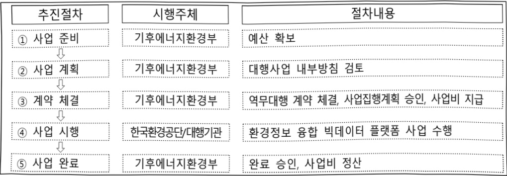

# 환경정보화기반구축(정보화)

**해당 페이지**: PDF 2911 ~ 2922 쪽 해당

**부처**: 기후에너지환경부
**분야**: 환경
**회계유형**: 환경개선 특별회계
**2026 확정예산**: 2923.0 백만원
**전년대비 증감률**: -3.8%
**AI 도메인**: 보안/사이버, 환경/기후, 행정/전자정부, 건설/스마트시티, 재난/안전

---

<table border=1 style='margin: auto; word-wrap: break-word;'><tr><td style='text-align: center; word-wrap: break-word;'>사 업 명</td></tr><tr><td style='text-align: center; word-wrap: break-word;'>(228) 환경정보화기반구축(정보화)(7132-502)</td></tr></table>

☐ 사업 코드 정보

<table border=1 style='margin: auto; word-wrap: break-word;'><tr><td style='text-align: center; word-wrap: break-word;'>구분</td><td style='text-align: center; word-wrap: break-word;'>회계</td><td style='text-align: center; word-wrap: break-word;'>소관</td><td style='text-align: center; word-wrap: break-word;'>실국(기관)</td><td style='text-align: center; word-wrap: break-word;'>계정</td><td style='text-align: center; word-wrap: break-word;'>분야</td><td style='text-align: center; word-wrap: break-word;'>부문</td></tr><tr><td style='text-align: center; word-wrap: break-word;'>코드 명칭</td><td style='text-align: center; word-wrap: break-word;'>환경개선 특별회계</td><td style='text-align: center; word-wrap: break-word;'>기후에너지 환경부</td><td style='text-align: center; word-wrap: break-word;'>기획조정실 정책기획관</td><td style='text-align: center; word-wrap: break-word;'>-</td><td style='text-align: center; word-wrap: break-word;'>070 환경</td><td style='text-align: center; word-wrap: break-word;'>076 환경일반</td></tr></table>

<table border=1 style='margin: auto; word-wrap: break-word;'><tr><td style='text-align: center; word-wrap: break-word;'>구분</td><td style='text-align: center; word-wrap: break-word;'>프로그램</td><td style='text-align: center; word-wrap: break-word;'>단위사업</td><td style='text-align: center; word-wrap: break-word;'>세부사업</td></tr><tr><td style='text-align: center; word-wrap: break-word;'>코드</td><td style='text-align: center; word-wrap: break-word;'>7100</td><td style='text-align: center; word-wrap: break-word;'>7132</td><td style='text-align: center; word-wrap: break-word;'>502</td></tr><tr><td style='text-align: center; word-wrap: break-word;'>명칭</td><td style='text-align: center; word-wrap: break-word;'>환경행정 지원</td><td style='text-align: center; word-wrap: break-word;'>환경정보화</td><td style='text-align: center; word-wrap: break-word;'>환경정보화기반구축(정보화)</td></tr></table>

□ 사업 성격 (공통요구자료 Ⅱ-1 작성유의사항 4. 참조, 해당하는 사항에 “○” 표시)

<table border=1 style='margin: auto; word-wrap: break-word;'><tr><td style='text-align: center; word-wrap: break-word;'>신규</td><td style='text-align: center; word-wrap: break-word;'>계속</td><td style='text-align: center; word-wrap: break-word;'>완료</td><td style='text-align: center; word-wrap: break-word;'>예비타당성 실시여부</td><td style='text-align: center; word-wrap: break-word;'>총사업비 관리대상</td><td style='text-align: center; word-wrap: break-word;'>총액계상 예산사업</td><td style='text-align: center; word-wrap: break-word;'>사업소관 변경정보 2025예산 시 소관</td></tr><tr><td style='text-align: center; word-wrap: break-word;'></td><td style='text-align: center; word-wrap: break-word;'>☐</td><td style='text-align: center; word-wrap: break-word;'></td><td style='text-align: center; word-wrap: break-word;'></td><td style='text-align: center; word-wrap: break-word;'></td><td style='text-align: center; word-wrap: break-word;'></td><td style='text-align: center; word-wrap: break-word;'></td></tr></table>

사업 지원 형태 및 지원을 (최소한 한 개는 반드시 선택하시오. 해당사항에 0 표시)

<table border=1 style='margin: auto; word-wrap: break-word;'><tr><td style='text-align: center; word-wrap: break-word;'>직접</td><td style='text-align: center; word-wrap: break-word;'>출자</td><td style='text-align: center; word-wrap: break-word;'>출연</td><td style='text-align: center; word-wrap: break-word;'>보조</td><td style='text-align: center; word-wrap: break-word;'>융자</td><td style='text-align: center; word-wrap: break-word;'>국고보조율(%)</td><td style='text-align: center; word-wrap: break-word;'>융자율(%)</td></tr><tr><td style='text-align: center; word-wrap: break-word;'>○</td><td style='text-align: center; word-wrap: break-word;'></td><td style='text-align: center; word-wrap: break-word;'></td><td style='text-align: center; word-wrap: break-word;'></td><td style='text-align: center; word-wrap: break-word;'></td><td style='text-align: center; word-wrap: break-word;'></td><td style='text-align: center; word-wrap: break-word;'></td></tr></table>

사업담당자

<table border=1 style='margin: auto; word-wrap: break-word;'><tr><td style='text-align: center; word-wrap: break-word;'>사업명</td><td colspan="2">구분</td></tr><tr><td rowspan="3">환경공간정보 구축</td><td rowspan="2">환경부</td><td style='text-align: center; word-wrap: break-word;'>기획조정실정책기획관</td></tr><tr><td style='text-align: center; word-wrap: break-word;'>정보화담당관</td></tr><tr><td style='text-align: center; word-wrap: break-word;'>-</td><td style='text-align: center; word-wrap: break-word;'>-</td></tr><tr><td rowspan="3">환경정보화 기반 구축·운영</td><td rowspan="2">환경부</td><td style='text-align: center; word-wrap: break-word;'>기획조정실정책기획관</td></tr><tr><td style='text-align: center; word-wrap: break-word;'>정보보안담당관</td></tr><tr><td style='text-align: center; word-wrap: break-word;'>-</td><td style='text-align: center; word-wrap: break-word;'>-</td></tr></table>

---

### 가. 예산 총괄표

(단위:백만원,%)

<table border=1 style='margin: auto; word-wrap: break-word;'><tr><td rowspan="2">사업명</td><td rowspan="2">2024년 결산</td><td colspan="2">2025년 예산</td><td colspan="2">2026년</td><td rowspan="2">증감 (B-A)</td><td rowspan="2">(B-A)/A</td></tr><tr><td style='text-align: center; word-wrap: break-word;'>본예산(A)</td><td style='text-align: center; word-wrap: break-word;'>추경</td><td style='text-align: center; word-wrap: break-word;'>정부안</td><td style='text-align: center; word-wrap: break-word;'>확정(B)</td></tr><tr><td style='text-align: center; word-wrap: break-word;'>환경정보화기반구축</td><td style='text-align: center; word-wrap: break-word;'>3,090</td><td style='text-align: center; word-wrap: break-word;'>3,039</td><td style='text-align: center; word-wrap: break-word;'>3,039</td><td style='text-align: center; word-wrap: break-word;'>3,103</td><td style='text-align: center; word-wrap: break-word;'>2,923</td><td style='text-align: center; word-wrap: break-word;'>△116</td><td style='text-align: center; word-wrap: break-word;'>△3.8</td></tr></table>

□ 기능별(내역사업별), 목별 예산 내역

(단위:백만원)

<table border=1 style='margin: auto; word-wrap: break-word;'><tr><td rowspan="3"></td><td colspan="5">2024</td><td colspan="7">2025</td><td rowspan="3">2026</td></tr><tr><td rowspan="2">예산액(추경)</td><td rowspan="2">예산현액</td><td rowspan="2">집행액[실집행액]</td><td rowspan="2">이일액</td><td rowspan="2">불용액</td><td rowspan="2">본예산</td><td rowspan="2">예산현액</td><td rowspan="2">집행액[실집행액]</td><td colspan="2">전년도 이일액제외</td><td rowspan="2">이일예산액</td><td rowspan="2">불용예산액</td></tr><tr><td style='text-align: center; word-wrap: break-word;'>예산현액</td><td style='text-align: center; word-wrap: break-word;'>집행액[실집행액]</td></tr><tr><td style='text-align: center; word-wrap: break-word;'>○ 기능별 분류(합계)</td><td style='text-align: center; word-wrap: break-word;'>3,113</td><td style='text-align: center; word-wrap: break-word;'>3,113</td><td style='text-align: center; word-wrap: break-word;'>3,090[3,090]</td><td style='text-align: center; word-wrap: break-word;'>-</td><td style='text-align: center; word-wrap: break-word;'>23</td><td style='text-align: center; word-wrap: break-word;'>3,039</td><td style='text-align: center; word-wrap: break-word;'>3,039</td><td style='text-align: center; word-wrap: break-word;'>3,015[3,015]</td><td style='text-align: center; word-wrap: break-word;'>3,039</td><td style='text-align: center; word-wrap: break-word;'>3,015[3,015]</td><td style='text-align: center; word-wrap: break-word;'>-</td><td style='text-align: center; word-wrap: break-word;'>24</td><td style='text-align: center; word-wrap: break-word;'>2,923</td></tr><tr><td style='text-align: center; word-wrap: break-word;'>· 환경공간정보구축</td><td style='text-align: center; word-wrap: break-word;'>2,779</td><td style='text-align: center; word-wrap: break-word;'>2,779</td><td style='text-align: center; word-wrap: break-word;'>2,756[2,756]</td><td style='text-align: center; word-wrap: break-word;'>-</td><td style='text-align: center; word-wrap: break-word;'>23</td><td style='text-align: center; word-wrap: break-word;'>2,647</td><td style='text-align: center; word-wrap: break-word;'>2,647</td><td style='text-align: center; word-wrap: break-word;'>2,623[2,623]</td><td style='text-align: center; word-wrap: break-word;'>2,647</td><td style='text-align: center; word-wrap: break-word;'>2,623[2,623]</td><td style='text-align: center; word-wrap: break-word;'>-</td><td style='text-align: center; word-wrap: break-word;'>24</td><td style='text-align: center; word-wrap: break-word;'>2,566</td></tr><tr><td style='text-align: center; word-wrap: break-word;'>· 정보화기반구축운영</td><td style='text-align: center; word-wrap: break-word;'>334</td><td style='text-align: center; word-wrap: break-word;'>334</td><td style='text-align: center; word-wrap: break-word;'>334[334]</td><td style='text-align: center; word-wrap: break-word;'>-</td><td style='text-align: center; word-wrap: break-word;'>-</td><td style='text-align: center; word-wrap: break-word;'>392</td><td style='text-align: center; word-wrap: break-word;'>392</td><td style='text-align: center; word-wrap: break-word;'>392[392]</td><td style='text-align: center; word-wrap: break-word;'>392</td><td style='text-align: center; word-wrap: break-word;'>392[392]</td><td style='text-align: center; word-wrap: break-word;'>-</td><td style='text-align: center; word-wrap: break-word;'>-</td><td style='text-align: center; word-wrap: break-word;'>357</td></tr><tr><td style='text-align: center; word-wrap: break-word;'>○ 비목별 분류(합계)</td><td style='text-align: center; word-wrap: break-word;'>3,113</td><td style='text-align: center; word-wrap: break-word;'>3,113</td><td style='text-align: center; word-wrap: break-word;'>3,090[3,090]</td><td style='text-align: center; word-wrap: break-word;'>-</td><td style='text-align: center; word-wrap: break-word;'>23</td><td style='text-align: center; word-wrap: break-word;'>3,039</td><td style='text-align: center; word-wrap: break-word;'>3,039</td><td style='text-align: center; word-wrap: break-word;'>3,015[3,015]</td><td style='text-align: center; word-wrap: break-word;'>3,039</td><td style='text-align: center; word-wrap: break-word;'>3,015[3,015]</td><td style='text-align: center; word-wrap: break-word;'>-</td><td style='text-align: center; word-wrap: break-word;'>24</td><td style='text-align: center; word-wrap: break-word;'>2,923</td></tr><tr><td style='text-align: center; word-wrap: break-word;'>· 관리용역비(210-15)</td><td style='text-align: center; word-wrap: break-word;'>513</td><td style='text-align: center; word-wrap: break-word;'>513</td><td style='text-align: center; word-wrap: break-word;'>512[512]</td><td style='text-align: center; word-wrap: break-word;'>-</td><td style='text-align: center; word-wrap: break-word;'>1</td><td style='text-align: center; word-wrap: break-word;'>612</td><td style='text-align: center; word-wrap: break-word;'>612</td><td style='text-align: center; word-wrap: break-word;'>609[609]</td><td style='text-align: center; word-wrap: break-word;'>612</td><td style='text-align: center; word-wrap: break-word;'>609[609]</td><td style='text-align: center; word-wrap: break-word;'>-</td><td style='text-align: center; word-wrap: break-word;'>3</td><td style='text-align: center; word-wrap: break-word;'>614</td></tr><tr><td style='text-align: center; word-wrap: break-word;'>· 일반연구비(260-01)</td><td style='text-align: center; word-wrap: break-word;'>2,266</td><td style='text-align: center; word-wrap: break-word;'>2,266</td><td style='text-align: center; word-wrap: break-word;'>2,244[2,244]</td><td style='text-align: center; word-wrap: break-word;'>-</td><td style='text-align: center; word-wrap: break-word;'>22</td><td style='text-align: center; word-wrap: break-word;'>2,035</td><td style='text-align: center; word-wrap: break-word;'>2,035</td><td style='text-align: center; word-wrap: break-word;'>2,014[2,014]</td><td style='text-align: center; word-wrap: break-word;'>2,035</td><td style='text-align: center; word-wrap: break-word;'>2,014[2,014]</td><td style='text-align: center; word-wrap: break-word;'>-</td><td style='text-align: center; word-wrap: break-word;'>21</td><td style='text-align: center; word-wrap: break-word;'>1,952</td></tr><tr><td style='text-align: center; word-wrap: break-word;'>· 자산취득비(430-01)</td><td style='text-align: center; word-wrap: break-word;'>334</td><td style='text-align: center; word-wrap: break-word;'>334</td><td style='text-align: center; word-wrap: break-word;'>334[334]</td><td style='text-align: center; word-wrap: break-word;'>-</td><td style='text-align: center; word-wrap: break-word;'>-</td><td style='text-align: center; word-wrap: break-word;'>392</td><td style='text-align: center; word-wrap: break-word;'>392</td><td style='text-align: center; word-wrap: break-word;'>392[392]</td><td style='text-align: center; word-wrap: break-word;'>392</td><td style='text-align: center; word-wrap: break-word;'>392[392]</td><td style='text-align: center; word-wrap: break-word;'>-</td><td style='text-align: center; word-wrap: break-word;'>-</td><td style='text-align: center; word-wrap: break-word;'>357</td></tr><tr><td style='text-align: center; word-wrap: break-word;'>○ 기능비목별 분류(합계)</td><td style='text-align: center; word-wrap: break-word;'>3,113</td><td style='text-align: center; word-wrap: break-word;'>3,113</td><td style='text-align: center; word-wrap: break-word;'>3,090[3,090]</td><td style='text-align: center; word-wrap: break-word;'>-</td><td style='text-align: center; word-wrap: break-word;'>23</td><td style='text-align: center; word-wrap: break-word;'>3,039</td><td style='text-align: center; word-wrap: break-word;'>3,039</td><td style='text-align: center; word-wrap: break-word;'>3,015[3,015]</td><td style='text-align: center; word-wrap: break-word;'>3,039</td><td style='text-align: center; word-wrap: break-word;'>3,015[3,015]</td><td style='text-align: center; word-wrap: break-word;'>-</td><td style='text-align: center; word-wrap: break-word;'>24</td><td style='text-align: center; word-wrap: break-word;'>2,923</td></tr><tr><td style='text-align: center; word-wrap: break-word;'>· 환경공간정보구축</td><td style='text-align: center; word-wrap: break-word;'>2,779</td><td style='text-align: center; word-wrap: break-word;'>2,779</td><td style='text-align: center; word-wrap: break-word;'>2,756[2,756]</td><td style='text-align: center; word-wrap: break-word;'>-</td><td style='text-align: center; word-wrap: break-word;'>23</td><td style='text-align: center; word-wrap: break-word;'>2,647</td><td style='text-align: center; word-wrap: break-word;'>2,647</td><td style='text-align: center; word-wrap: break-word;'>2,623[2,623]</td><td style='text-align: center; word-wrap: break-word;'>2,647</td><td style='text-align: center; word-wrap: break-word;'>2,623[2,623]</td><td style='text-align: center; word-wrap: break-word;'>-</td><td style='text-align: center; word-wrap: break-word;'>24</td><td style='text-align: center; word-wrap: break-word;'>2,566</td></tr><tr><td style='text-align: center; word-wrap: break-word;'>· 관리용역비(210-15)</td><td style='text-align: center; word-wrap: break-word;'>513</td><td style='text-align: center; word-wrap: break-word;'>513</td><td style='text-align: center; word-wrap: break-word;'>512[512]</td><td style='text-align: center; word-wrap: break-word;'>-</td><td style='text-align: center; word-wrap: break-word;'>1</td><td style='text-align: center; word-wrap: break-word;'>612</td><td style='text-align: center; word-wrap: break-word;'>612</td><td style='text-align: center; word-wrap: break-word;'>609[609]</td><td style='text-align: center; word-wrap: break-word;'>612</td><td style='text-align: center; word-wrap: break-word;'>609[609]</td><td style='text-align: center; word-wrap: break-word;'>-</td><td style='text-align: center; word-wrap: break-word;'>3</td><td style='text-align: center; word-wrap: break-word;'>614</td></tr><tr><td style='text-align: center; word-wrap: break-word;'>· 일반연구비(260-01)</td><td style='text-align: center; word-wrap: break-word;'>2,266</td><td style='text-align: center; word-wrap: break-word;'>2,266</td><td style='text-align: center; word-wrap: break-word;'>2,244[2,244]</td><td style='text-align: center; word-wrap: break-word;'>-</td><td style='text-align: center; word-wrap: break-word;'>22</td><td style='text-align: center; word-wrap: break-word;'>2,035</td><td style='text-align: center; word-wrap: break-word;'>2,035</td><td style='text-align: center; word-wrap: break-word;'>2,014[2,014]</td><td style='text-align: center; word-wrap: break-word;'>2,035</td><td style='text-align: center; word-wrap: break-word;'>2,014[2,014]</td><td style='text-align: center; word-wrap: break-word;'>-</td><td style='text-align: center; word-wrap: break-word;'>21</td><td style='text-align: center; word-wrap: break-word;'>1,952</td></tr><tr><td style='text-align: center; word-wrap: break-word;'>· 정보화기반구축운영</td><td style='text-align: center; word-wrap: break-word;'>334</td><td style='text-align: center; word-wrap: break-word;'>334</td><td style='text-align: center; word-wrap: break-word;'>334[334]</td><td style='text-align: center; word-wrap: break-word;'>-</td><td style='text-align: center; word-wrap: break-word;'>-</td><td style='text-align: center; word-wrap: break-word;'>392</td><td style='text-align: center; word-wrap: break-word;'>392</td><td style='text-align: center; word-wrap: break-word;'>392[392]</td><td style='text-align: center; word-wrap: break-word;'>392</td><td style='text-align: center; word-wrap: break-word;'>392[392]</td><td style='text-align: center; word-wrap: break-word;'>-</td><td style='text-align: center; word-wrap: break-word;'>-</td><td style='text-align: center; word-wrap: break-word;'>357</td></tr><tr><td style='text-align: center; word-wrap: break-word;'>· 자산취득비(430-01)</td><td style='text-align: center; word-wrap: break-word;'>334</td><td style='text-align: center; word-wrap: break-word;'>334</td><td style='text-align: center; word-wrap: break-word;'>334[334]</td><td style='text-align: center; word-wrap: break-word;'>-</td><td style='text-align: center; word-wrap: break-word;'>-</td><td style='text-align: center; word-wrap: break-word;'>392</td><td style='text-align: center; word-wrap: break-word;'>392</td><td style='text-align: center; word-wrap: break-word;'>392[392]</td><td style='text-align: center; word-wrap: break-word;'>392</td><td style='text-align: center; word-wrap: break-word;'>392[392]</td><td style='text-align: center; word-wrap: break-word;'>-</td><td style='text-align: center; word-wrap: break-word;'>-</td><td style='text-align: center; word-wrap: break-word;'>357</td></tr></table>

---

### 나. 사업설명자료

## 1 ) 사업목적·내용

<환경공간정보 구축사업>

- (국정과제 38. “국토공간의 효율적 성장전략” 지원) 고정밀 전자지도를 활용한 토지피

복지도를 현행화하여 환경문제 해결에 기초자료로 활용 예정

- (제7차 국가공간정보정책 기본계획) 누구나 쉽게 활용할 수 있는 공간정보자원 유통/활용 활성화를 위한 공간정보 공유체계 대국민 서비스(환경공간정보 서비스/환경공간정보 공유포털)

- (토지피복지도 활용분야) 국토환경성평가지도, 생태자연도, 도시생태현황도, 소규모 영향평가 등

<table border=1 style='margin: auto; word-wrap: break-word;'><tr><td style='text-align: center; word-wrap: break-word;'>분야</td><td style='text-align: center; word-wrap: break-word;'>기관</td><td style='text-align: center; word-wrap: break-word;'>활용내용</td></tr><tr><td rowspan="2">환경보전 및 생태자연도</td><td style='text-align: center; word-wrap: break-word;'>환경부</td><td style='text-align: center; word-wrap: break-word;'>• 국토환경성평가지도 참고자료 • 토지이용·토지이용변화 매트릭스 구축시 토지이용변화지도 구축에 활용 • 국가온실가스 인벤토리 보고서 및 BTR보고서 내 습지의 통계자료 산정을 위한 습지경계지도 기초자료로 활용</td></tr><tr><td style='text-align: center; word-wrap: break-word;'>국립생태원</td><td style='text-align: center; word-wrap: break-word;'>• DMZ 일원 생태계 보전대책 및 공간관리방안 연구사업의 보호지역 평가 및 제안을 위한 자료 분석 • 생태계 변화 및 생태계서비스 평가 연구사업 생태계서비스 평가 • 생태계 기후대응 통합정보관리시스템 구축 생태 리스크 분석 예측을 위한 자료 • 생태계서비스지불제 대상지 확대를 위한 후보지역 도출 • 자연환경종합 GIS-DB 구축 및 생태·자연도 기초자료</td></tr><tr><td rowspan="5">재해취약성 분석</td><td style='text-align: center; word-wrap: break-word;'>김포시청</td><td style='text-align: center; word-wrap: break-word;'>• 김포시 토지적성평가 및 재해취약성 분석</td></tr><tr><td style='text-align: center; word-wrap: break-word;'>파주시청</td><td style='text-align: center; word-wrap: break-word;'>• 자연재해예방 및 저감을 위한 우수유출저감대책 수립</td></tr><tr><td style='text-align: center; word-wrap: break-word;'>국립해양조사원</td><td style='text-align: center; word-wrap: break-word;'>• 2024년 연안재해 위험평가 사업의 평가 기초자료</td></tr><tr><td style='text-align: center; word-wrap: break-word;'>한국도로공사</td><td style='text-align: center; word-wrap: break-word;'>• 고속도로 건설공사 재해영향평가 시 홍수유출량 등 수문 분석 기초자료</td></tr><tr><td style='text-align: center; word-wrap: break-word;'>국방시설본부</td><td style='text-align: center; word-wrap: break-word;'>• 재해영향평가용역 수행을 위한 데이터 구축 시 참고</td></tr><tr><td rowspan="7">물관리 및 홍수</td><td style='text-align: center; word-wrap: break-word;'>환경부</td><td style='text-align: center; word-wrap: break-word;'>• 하천유역수자원관리계획 수립을 위한 기초자료</td></tr><tr><td style='text-align: center; word-wrap: break-word;'>한강홍수통제소</td><td style='text-align: center; word-wrap: break-word;'>• 댐-하천 디지털트원물관리플랫폼 구축 사업에 활용</td></tr><tr><td style='text-align: center; word-wrap: break-word;'>한국수자원공사</td><td style='text-align: center; word-wrap: break-word;'>• 댐 비상대처계획 보완 용역 수행 시 댐 하류 대피인원 산정(주거면적 및 주거지 침수면적 추출)에 활용 • 양평·이천·파주지역 가뭄대비 나눔 지하수 사업 분석</td></tr><tr><td style='text-align: center; word-wrap: break-word;'>한국농어촌공사</td><td style='text-align: center; word-wrap: break-word;'>• 농경지 침수방지 및 영농환경개선을 위하여 배수개선사업 기본계획 수립 시 침수분석</td></tr><tr><td style='text-align: center; word-wrap: break-word;'>인천광역시</td><td style='text-align: center; word-wrap: break-word;'>• 하천기본계획 수립 데이터 구축을 위한 참고자료</td></tr><tr><td style='text-align: center; word-wrap: break-word;'>강원특별자치도</td><td style='text-align: center; word-wrap: break-word;'>• 불투수면 분포에 따른 유량계산을 통해 홍수량을 산출함 • 하천구역내의 거주인구 및 주택 자료 등을 확인하여 효과분석 기초자료로 활용</td></tr><tr><td style='text-align: center; word-wrap: break-word;'>김포시청</td><td style='text-align: center; word-wrap: break-word;'>• 김포시 물순환 기본계획 수립 기초자료</td></tr></table>

---

<table border=1 style='margin: auto; word-wrap: break-word;'><tr><td style='text-align: center; word-wrap: break-word;'>분야</td><td style='text-align: center; word-wrap: break-word;'>기관</td><td style='text-align: center; word-wrap: break-word;'>활용내용</td></tr><tr><td rowspan="2">농업·축산</td><td style='text-align: center; word-wrap: break-word;'>농수식품정보원</td><td style='text-align: center; word-wrap: break-word;'>• 전국 농경지 변화 분석을 위한 참고자료</td></tr><tr><td style='text-align: center; word-wrap: break-word;'>경기도청</td><td style='text-align: center; word-wrap: break-word;'>• 가축분뇨 처리시설 및 퇴비관리시설 예비 후보지 조사에 활용</td></tr><tr><td rowspan="3">기타</td><td style='text-align: center; word-wrap: break-word;'>국가미세먼지 정보센터</td><td style='text-align: center; word-wrap: break-word;'>• 미세먼지 배출량 산정, 발생원인 기여도 및 정책 효과분석 수행 시 국내외 비세먼지 영향 등 분석</td></tr><tr><td style='text-align: center; word-wrap: break-word;'>국군</td><td style='text-align: center; word-wrap: break-word;'>• 군사지도 제작 및 갱신, 군사용 지형분석</td></tr><tr><td style='text-align: center; word-wrap: break-word;'>통계청</td><td style='text-align: center; word-wrap: break-word;'>• 통계구역(집계구) 구축을 위해 기초단위구 토지 특성 부여 기초자료</td></tr></table>

* 도시생태현황지도의 작성방법에 관한 지침 제8조 제13조 따라 토지이용 토지피복현황도에 토지피복지도를 기초지료로 사용

## <정보화기반 구축·운영>

## - (전산실 노후장비 교체 및 정보보호 기반강화)

최근 중요 업무자료(전자문서 및 전자기록물 등) 및 개인정보 유출, 악성코드 감염 등 보안관련 사고 가능성이 높아지고 있어 사이버 위협 방어체계 구축을 위한 전산장비 고도화 추진하여 정보보호 인프라 강화

• 전산실 전산장비, 소속기관 백본스위치 등 네트워크 장비가 내구연한(6년)을 초과하여 운용 중임에 따라 노후화에 따른 장애로 행정업무지원 중단 가능성이 높아, 노후 전산장비 교체를 통해 안정적인 업무환경 제공 및 업무 연속성 제고

## 2 ) 사업개요

## ☐ 사업근거 및 추진경위

① 법령상 근거 조항 적시

- 환경정책기본법 제23조(환경친화적 계획기법 등의 작성·보급) 및 제24조(환경정보의 보급 등) 제2항 및 같은법 시행령 12조(환경정보망의 구축·운영 등)

## [환경정책기본법 제23조]

① 정부는 환경에 영향을 미치는 행정계획 및 개발사업이 환경적으로 건전하고 지속가능하게 계획되어 수립·시행될 수 있도록 환경친화적인 계획기법 및 토지이용·개발기준(이하 "환경친화적 계획기법등"이라 한다)을 작성·보급할 수 있다.

## [환경정책기본법 제24조]

① 환경부장관은 모든 국민에게 환경보전에 관한 지식·정보를 보급하고, 국민이 환경에 관한 정보에 쉽게 접근할 수 있도록 노력하여야 한다.

② 환경부장관은 제1항에 따른 환경보전에 관한 지식·정보의 원활한 생산·보급 등을 위하여 환경정보망을 구축하여 운영할 수 있다.

## [환경정책기본법 시행령 제12조]

① 법 제24조제2항에 따른 환경정보망의 구축·운영 대상이 되는 환경정보는 다음 각 호와 같다.

3. 환경정책의 수립 및 집행에 필요한 환경정보

4.자연환경 및 생태계의 현황을 표시한 지도 등 환경지리정보

5.일반국민에게 유용한 환경정보

7. 그 밖에 환경보전 및 환경관리를 위하여 필요한 환경정보

---

-국가공간정보기본법 제28조(공간정보데이터베이스의 구축 및 관리)

## [국가공간정보기본법 제28조]

② 관리기관의 장은 해당 기관이 관리하고 있는 공간정보데이터베이스가 최신 정보를 기반으로 유지될 수 있도록 노력하여야 한다.

- 공간정보의 구축 및 관리 등에 관한 법률 시행령 제4조(수치주제도의 종류)

## [공간정보의 구축 및 관리 등에 관한 법률 시행령]

제4조(수치주제도의 종류) 법 제2조제10호에 따른 수치주제도(數値主題圖)의 종류는 별표 1과 같다.

[별표 1] 18. 토지피복지도

- 전자정부법 제1조(목적)

## [전자정부법 제1조]

제1조(목적) 이 법은 행정업무의 전자적 처리를 위한 기본원칙, 절차 및 추진방법 등을 규정함으로써 전자정부를 효율적으로 구현하고, 행정의 생산성, 투명성 및 민주성을 높여 국민의 삶의 질을 향상시키는 것을 목적으로 한다.

- 정보통신기반 보호법 제1조(목적)

## [정보통신기반 보호법 제1조]

제1조(목적) 이 법은 전자적 침해행위에 대비하여 주요정보통신기반시설의 보호에 관한 대책을 수립·시행함으로써 동 시설을 안정적으로 운용하도록 하여 국가의 안정과 국민생활의 안정을 보장하는 것을 목적으로 한다.

## ② 추진경위

## <환경공간정보 구축>

- 국가지리정보체계의 구축 및 활용 등에 관한 법률 시행('00.1월)

- 제2차 국가지리정보체계 기본계획('00.12월, 건설교통부)에 '생활환경 개선을 위한 공공 부문 지리정보 활용과제'로 토지피복지도 구축사업이 중점 추진과제로 선정

-국가공간정보에 관한 법률 시행('09.8월)

※ 제3차 국가지리정보체계 기본계획('09.8월)에 중점추진과제로 선정

- 정부 국가공간정보사업 평가결과 우수사업으로 선정('12.8월)

- 토지피복지도 활용 확대를 위한 교과적용 방안 연구('12.12월)

※ 현행 사회과 교과과정에 토지피복지도를 활용(초등학교 사회과부도에 수록)

- 토지피복지도 구축 지침 관련 훈령 제정·개정·시행('13.4월,'16.5월~)

※ 대/중/세분류 토지피복지도별로 이용상태를 색깔별로 구분하고, 지도 품질 제고에 필요한

정확도 검증방법 등 적용 등 객관적인 근거 마련

- 정부 국가공간정보사업 평가결과 우수사업으로 선정('16.5월)

- 정부 국가공간정보사업 평가결과 최우수사업으로 선정('17.5월)

- 국토-환경계획의 상호 연계를 위하여 법적 근거 마련(국토기본법('16), 환경정책기본법('15)) 개정), 통합관리 공동훈령 제정('18.3)) 등 제도적 틀 구축

※ 국토계획 및 환경계획 수립시 공간정보 분석자료 활용 의무화

---

- 국토교통부와 “국가공간정보 공동 활용 MOU” 체결('19.6.3)

- 지자체 계획단계부터 국토-환경계획 연계를 실효적으로 작동하도록 지자체 환경보전 계획 수립시 환경공간정보 도면을 분석하여 지리공간과 연동한 환경계획 수립 의무화 (지자체 환경계획 수립지침 개정, '19.12)

- 환경부 및 소속·산하기관에서 운영하는 43개 시스템 연계·공유, 486개 공간정보 데이터셋 수집('20~'24년)

- 토지피복지도 작성 지침 개정(22년), 환경공간정보 보안관리 규정 전부 개정(22년), 일부개정(24년)

## <정보화기반 구축·운영>

-「전자정부법」제3조(행정기관등 및 공무원 등의 책무), 제32조(전자적 업무수행 등)

-「지능정보화기본법」제14조(공공지능정보화의 추진)

- 「환경정보화 업무규정」 제14조(정보화사업 추진)

- 환경부 본부 및 소속·산하기관 대상의 정보보안 및 개인정보보호 관리실태 점검, 정보 시스템·웹사이트의 취약점 점검 실시 결과에 따른 미비점 조치·보완계획 수립('10.12월 ~)

- 정보보안 관리체계에 대한 마스터플랜 및 중장기 로드맵 구성을 위한 정보보안 정보화 전략계획(ISP) 수립('14.12월)

- 비대면 업무환경 확산 등 업무 환경 변화에 대응하고 국정원 지침 개정사항 등을 반영하기 위해「환경부 정보보안 업무지침」개정('24.6월)

- 본부·소속기관 노후화 백본 스위치 교체 및 정보시스템 신규장비 도입 등 환경부

정보보안 강화를 위한 장비교체 추진(매년)

## □주요내용

① 사업규모

- 총사업비 : 해당없음

- 사업기간 : '98년 ~ 계속

- 최근 5년 간 투입된 사업비(예산액기준, 추경편성한 연도에는 추경포함)

<table border=1 style='margin: auto; word-wrap: break-word;'><tr><td style='text-align: center; word-wrap: break-word;'>$ \underline{\text{연도}} $</td><td style='text-align: center; word-wrap: break-word;'>2022</td><td style='text-align: center; word-wrap: break-word;'>2023</td><td style='text-align: center; word-wrap: break-word;'>2024</td><td style='text-align: center; word-wrap: break-word;'>2025</td><td style='text-align: center; word-wrap: break-word;'>2026</td></tr><tr><td style='text-align: center; word-wrap: break-word;'>$ \underline{\text{사업비}} $</td><td style='text-align: center; word-wrap: break-word;'>2,875</td><td style='text-align: center; word-wrap: break-word;'>2,826</td><td style='text-align: center; word-wrap: break-word;'>3,113</td><td style='text-align: center; word-wrap: break-word;'>3,039</td><td style='text-align: center; word-wrap: break-word;'>2,923</td></tr></table>

② 사업추진체계

- 사업시행방법 : 직접수행

- 사업시행주체 : 환경부

- 사업 수혜자 : 대국민, 관련 공무원

- 보조, 융자, 출연, 출자 등의 경우 보조 · 융자 등 지원 비율 및 법적근거 : 해당없음

---

## 3 )2026년도 예산 산출 근거

① 환경공간정보구축 : (25) 2,647 → (25요구) 2,566백만원, △3.1%

(보구) 환경기조시도인 도시피목시도 현행화, 환경공간정보시스템 통합유지관리, 환경매체별 환경정보들을 손쉽게 이용하고, 다양한 공간분석을 통해 종합적 의사결정을 지원할 수 있는 공유 포털 고도화 등 '25년 대비 3.1% 감액 요구

## - (산출)

(1-1)환경공간정보 현행화·운영:2,307백만원

(1-1-1)지능형 환경공간정보 현행화:1,693백만원

① 세분류 토지피복지도 현행화 구축 : 1,025백만원

<table border=1 style='margin: auto; word-wrap: break-word;'><tr><td style='text-align: center; word-wrap: break-word;'>규격</td><td style='text-align: center; word-wrap: break-word;'>대상</td><td style='text-align: center; word-wrap: break-word;'>물량</td><td style='text-align: center; word-wrap: break-word;'>단가</td><td style='text-align: center; word-wrap: break-word;'>금액(원) (물량*단가* 1.1(VAT))</td><td style='text-align: center; word-wrap: break-word;'>비고</td></tr><tr><td style='text-align: center; word-wrap: break-word;'>도업(1:5,000)</td><td style='text-align: center; word-wrap: break-word;'>18,538</td><td style='text-align: center; word-wrap: break-word;'>7,597</td><td style='text-align: center; word-wrap: break-word;'>122,704</td><td style='text-align: center; word-wrap: break-word;'>1,025,400,517</td><td style='text-align: center; word-wrap: break-word;'></td></tr></table>

② 중분류 토지피복지도 현행화 구축 : 223백만원

<table border=1 style='margin: auto; word-wrap: break-word;'><tr><td style='text-align: center; word-wrap: break-word;'>규격</td><td style='text-align: center; word-wrap: break-word;'>대상</td><td style='text-align: center; word-wrap: break-word;'>물량</td><td style='text-align: center; word-wrap: break-word;'>단가</td><td style='text-align: center; word-wrap: break-word;'>금액(원) (물량*단가* 1.1(VAT))</td><td style='text-align: center; word-wrap: break-word;'>비고</td></tr><tr><td style='text-align: center; word-wrap: break-word;'>도엽(1:25,000)</td><td style='text-align: center; word-wrap: break-word;'>898</td><td style='text-align: center; word-wrap: break-word;'>898</td><td style='text-align: center; word-wrap: break-word;'>226,159</td><td style='text-align: center; word-wrap: break-word;'>223,400,000</td><td style='text-align: center; word-wrap: break-word;'></td></tr></table>

③환경주제도 갱신:11백만원

<table border=1 style='margin: auto; word-wrap: break-word;'><tr><td style='text-align: center; word-wrap: break-word;'>규격</td><td style='text-align: center; word-wrap: break-word;'>대상</td><td style='text-align: center; word-wrap: break-word;'>물량</td><td style='text-align: center; word-wrap: break-word;'>단가</td><td style='text-align: center; word-wrap: break-word;'>금액(원) (물량*단가* 1.1(VAT))</td><td style='text-align: center; word-wrap: break-word;'>비고</td></tr><tr><td style='text-align: center; word-wrap: break-word;'>식</td><td style='text-align: center; word-wrap: break-word;'>5</td><td style='text-align: center; word-wrap: break-word;'>5</td><td style='text-align: center; word-wrap: break-word;'>2,018,859</td><td style='text-align: center; word-wrap: break-word;'>11,103,725</td><td style='text-align: center; word-wrap: break-word;'></td></tr></table>

④토지이용규제 지역·지구도 제작 : 8.0백만원

<table border=1 style='margin: auto; word-wrap: break-word;'><tr><td style='text-align: center; word-wrap: break-word;'>규격</td><td style='text-align: center; word-wrap: break-word;'>대상</td><td style='text-align: center; word-wrap: break-word;'>물량</td><td style='text-align: center; word-wrap: break-word;'>단가</td><td style='text-align: center; word-wrap: break-word;'>금액(원) (물량*단가* 1.1(VAT))</td><td style='text-align: center; word-wrap: break-word;'>비고</td></tr><tr><td style='text-align: center; word-wrap: break-word;'>종</td><td style='text-align: center; word-wrap: break-word;'>32</td><td style='text-align: center; word-wrap: break-word;'>32</td><td style='text-align: center; word-wrap: break-word;'>229,303</td><td style='text-align: center; word-wrap: break-word;'>8,071,448</td><td style='text-align: center; word-wrap: break-word;'>수시갱신</td></tr></table>

⑤직접경비(국가 토지피복통계 산정, 수수료 등) : 26백만원

<table border=1 style='margin: auto; word-wrap: break-word;'><tr><td style='text-align: center; word-wrap: break-word;'>구분</td><td style='text-align: center; word-wrap: break-word;'>규격</td><td style='text-align: center; word-wrap: break-word;'>수량</td><td style='text-align: center; word-wrap: break-word;'>단가</td><td style='text-align: center; word-wrap: break-word;'>금액(원)</td><td style='text-align: center; word-wrap: break-word;'>비고</td></tr><tr><td style='text-align: center; word-wrap: break-word;'>국내여비</td><td style='text-align: center; word-wrap: break-word;'>회</td><td style='text-align: center; word-wrap: break-word;'>5</td><td style='text-align: center; word-wrap: break-word;'>350,000</td><td style='text-align: center; word-wrap: break-word;'>1,750,000</td><td style='text-align: center; word-wrap: break-word;'></td></tr><tr><td style='text-align: center; word-wrap: break-word;'>국가토지피복통계 산정, 성과심사 수수료</td><td style='text-align: center; word-wrap: break-word;'>1</td><td style='text-align: center; word-wrap: break-word;'>22,000,000</td><td style='text-align: center; word-wrap: break-word;'></td><td style='text-align: center; word-wrap: break-word;'>22,000,000</td><td style='text-align: center; word-wrap: break-word;'></td></tr><tr><td colspan="3">소 계</td><td style='text-align: center; word-wrap: break-word;'></td><td style='text-align: center; word-wrap: break-word;'>24,100,000</td><td style='text-align: center; word-wrap: break-word;'></td></tr><tr><td colspan="3">총계(VAT포함)</td><td style='text-align: center; word-wrap: break-word;'></td><td style='text-align: center; word-wrap: break-word;'>26,125,000</td><td style='text-align: center; word-wrap: break-word;'></td></tr></table>

6 지능형 수시갱신체계 고도화:400백만원

<table border=1 style='margin: auto; word-wrap: break-word;'><tr><td rowspan="2">총기능점수</td><td rowspan="2">기능점수 단가(원)</td><td colspan="5">보정계수</td><td rowspan="2">개발원가 (원)</td></tr><tr><td style='text-align: center; word-wrap: break-word;'>규모</td><td style='text-align: center; word-wrap: break-word;'>연계 복잡성</td><td style='text-align: center; word-wrap: break-word;'>성능</td><td style='text-align: center; word-wrap: break-word;'>다중 사이트</td><td style='text-align: center; word-wrap: break-word;'>보안성</td></tr><tr><td style='text-align: center; word-wrap: break-word;'>442</td><td style='text-align: center; word-wrap: break-word;'>605,784</td><td style='text-align: center; word-wrap: break-word;'>1.28</td><td style='text-align: center; word-wrap: break-word;'>1</td><td style='text-align: center; word-wrap: break-word;'>1</td><td style='text-align: center; word-wrap: break-word;'>1</td><td style='text-align: center; word-wrap: break-word;'>1.03</td><td style='text-align: center; word-wrap: break-word;'>353,010,207</td></tr><tr><td colspan="7">개발금액 = (개발원가 + 이윤(개발원가의 3%)) × 1.1(VAT포함)</td><td style='text-align: center; word-wrap: break-word;'>399,960,564</td></tr></table>

(1-1-2)환경공간정보시스템 통합유지관리:614백만원

(단위:백만원)

<table border=1 style='margin: auto; word-wrap: break-word;'><tr><td rowspan="2">구분</td><td colspan="3">25년</td><td colspan="3">25년</td></tr><tr><td style='text-align: center; word-wrap: break-word;'>도입비</td><td style='text-align: center; word-wrap: break-word;'>평균요율</td><td style='text-align: center; word-wrap: break-word;'>예산</td><td style='text-align: center; word-wrap: break-word;'>도입비</td><td style='text-align: center; word-wrap: break-word;'>평균요율</td><td style='text-align: center; word-wrap: break-word;'>예산</td></tr><tr><td style='text-align: center; word-wrap: break-word;'>유지보수</td><td colspan="2">합계</td><td style='text-align: center; word-wrap: break-word;'>612</td><td colspan="2">합계</td><td style='text-align: center; word-wrap: break-word;'>614</td></tr><tr><td style='text-align: center; word-wrap: break-word;'>개발SW</td><td style='text-align: center; word-wrap: break-word;'>5,967</td><td style='text-align: center; word-wrap: break-word;'>10%</td><td style='text-align: center; word-wrap: break-word;'>597</td><td style='text-align: center; word-wrap: break-word;'>5,992</td><td style='text-align: center; word-wrap: break-word;'>10%</td><td style='text-align: center; word-wrap: break-word;'>599</td></tr><tr><td style='text-align: center; word-wrap: break-word;'>상용SW</td><td style='text-align: center; word-wrap: break-word;'>122</td><td style='text-align: center; word-wrap: break-word;'>12%</td><td style='text-align: center; word-wrap: break-word;'>15</td><td style='text-align: center; word-wrap: break-word;'>122</td><td style='text-align: center; word-wrap: break-word;'>12%</td><td style='text-align: center; word-wrap: break-word;'>15</td></tr><tr><td style='text-align: center; word-wrap: break-word;'>HW</td><td style='text-align: center; word-wrap: break-word;'></td><td style='text-align: center; word-wrap: break-word;'>%</td><td style='text-align: center; word-wrap: break-word;'></td><td style='text-align: center; word-wrap: break-word;'></td><td style='text-align: center; word-wrap: break-word;'>%</td><td style='text-align: center; word-wrap: break-word;'></td></tr><tr><td style='text-align: center; word-wrap: break-word;'>운영인력</td><td style='text-align: center; word-wrap: break-word;'>00</td><td style='text-align: center; word-wrap: break-word;'></td><td style='text-align: center; word-wrap: break-word;'></td><td style='text-align: center; word-wrap: break-word;'>00</td><td style='text-align: center; word-wrap: break-word;'></td><td style='text-align: center; word-wrap: break-word;'></td></tr></table>

---

(1-2)환경공간정보 공유포털:259백만원

<table border=1 style='margin: auto; word-wrap: break-word;'><tr><td rowspan="2">총기능점수</td><td rowspan="2">기능점수 단가(원)</td><td colspan="5">보정계수</td><td rowspan="2">개발원가 (원)</td></tr><tr><td style='text-align: center; word-wrap: break-word;'>규모</td><td style='text-align: center; word-wrap: break-word;'>연계 복잡성</td><td style='text-align: center; word-wrap: break-word;'>성능</td><td style='text-align: center; word-wrap: break-word;'>다중 사이트</td><td style='text-align: center; word-wrap: break-word;'>보안성</td></tr><tr><td style='text-align: center; word-wrap: break-word;'>286.3</td><td style='text-align: center; word-wrap: break-word;'>605,784</td><td style='text-align: center; word-wrap: break-word;'>1.28</td><td style='text-align: center; word-wrap: break-word;'>1</td><td style='text-align: center; word-wrap: break-word;'>1</td><td style='text-align: center; word-wrap: break-word;'>1</td><td style='text-align: center; word-wrap: break-word;'>1.03</td><td style='text-align: center; word-wrap: break-word;'>228,657,969</td></tr><tr><td colspan="7">개발금액 = (개발원가 + 이윤(개발원가의 3%)) × 1.1(VAT포함)</td><td style='text-align: center; word-wrap: break-word;'>259,069,478</td></tr></table>

② 정보화기반 구축·운영 : (25) 392 → (26요구) 357백만원, △9%

- (요구) 소속기관 백본스위치, 보안솔루션 등 노후장비 교체 및 정보보호 강화 전년대비 9% 감액

- (산출) 357백만원

<table border=1 style='margin: auto; word-wrap: break-word;'><tr><td style='text-align: center; word-wrap: break-word;'>구 분</td><td style='text-align: center; word-wrap: break-word;'>세부 내용</td></tr><tr><td style='text-align: center; word-wrap: break-word;'>■ 전산실 노후장비 교체 및 정보보호기반 강화</td><td style='text-align: center; word-wrap: break-word;'>357백만원 - 소속기관 백본 스위치 교체(177) · (백본스위치) 59.1백만원 * 3식 - 본부 노후 네트워크 스위치 교체(96) · (L2스위치) 68.5백만원 * 2식 - 인터넷망 SSL가시화솔루션 교체(84) · (SSL가시화솔루션) 84백만원 * 1식</td></tr></table>

°2025년도 예산 및 2026년도 예산 산출 세부내역 비교

<table border=1 style='margin: auto; word-wrap: break-word;'><tr><td colspan="2">&#x27;25년 예산</td><td colspan="2">&#x27;26년 예산</td></tr><tr><td style='text-align: center; word-wrap: break-word;'>예산</td><td style='text-align: center; word-wrap: break-word;'>산출내역</td><td style='text-align: center; word-wrap: break-word;'>예산</td><td style='text-align: center; word-wrap: break-word;'>산출내역</td></tr><tr><td style='text-align: center; word-wrap: break-word;'>3,039,000</td><td style='text-align: center; word-wrap: break-word;'>○ 관리용역비(210-15): 612,000천원가. 개발SW 유지관리(597,000천원) • 개발SW 유지관리: 5,967,000천원(도입가)×10%(요율) =597,000천원 나. 상용SW 유지관리(15,000천원) • 상용SW 유지관리: 122,000천원(도입가)×12%(요율)=15,000천원 ○ 일반연구비(260-01): 2,035,000천원 가. 지능형 환경공간정보 현행화(1,747,000천원) • 세분류 토지피복지도 현행화: 18,538도업×55,292원=1,025,000천원 • 중분류 토지피복지도 현행화: 898도업×226,159원=223,400천원 • 지능형 수시경신 고도화: 654FPx605,784원×1.14608보정계수 =454,057천원 • 환경주제도, 지역지구도, 성과심사 등 기타경비 45백만원 나. 환경공간정보 공유포털(288,000천원) • 환경공간정보 공유포털 고도화: 318.6FPx605,784원×1.493745 보정계수=288,297천원 ○ 자산취득비(430-01): 392,000천원 가. 전산실 노후장비 교체 및 정보보호기반 강화(392,000천원) • 소속기관 백본스위치 교체: 53,000천원 * 4식=212,000천원 • L2 네트워크 스위치 교체: 2,667천원 * 15식=40,000천원 • 전산실 항은향습기 교체: 21,000천원 * 2식 + 배관공사비 14,000원 * 1식 =56,000천원 • 무선침입방지 센서교체: 2,700천원 * 31식=84,000천원</td><td style='text-align: center; word-wrap: break-word;'>2,923,000</td><td style='text-align: center; word-wrap: break-word;'>○ 관리용역비(210-15): 614,000천원 가. 개발SW 유지관리(599,000천원) • 개발SW 유지관리: 5,992,000천원(도입가)×10%(요율) =599,000천원 나. 상용SW 유지관리(15,000천원) • 상용SW 유지관리: 122,000천원(도입가)×12%(요율)=15,000천원 ○ 일반연구비(260-01): 1,952,000천원 가. 지능형 환경공간정보 현행화(1,693,000천원) • 세분류 토지피복지도 현행화: 18,538도업×55,292원=1,025,000천원 • 중분류 토지피복지도 현행화: 898도업×226,159원=223,400천원 • 지능형 수시경신 고도화: 442FPx605,784원×1.49375보정계수 =399,961천원 • 환경주제도, 지역지구도, 통계산정 등 기타경비 45백만원 나. 환경공간정보 공유포털(259,000천원) • 환경공간정보 공유포털 고도화: 286.3FPx605,784원×1.493744 보정계수=259,069천원 ○ 자산취득비(430-01): 357,000천원 가. 전산실 노후장비 교체 및 정보보호기반 강화(357,000천원) • 소속기관 백본스위치 교체: 59,100천원 * 4식=177,300천원 • 전산실 항은향습기 교체: 2,515천원 * 38식=95,570천원 14,000원 * 1식 =56,000천원 • 무선침입방지 센서교체: 2,700천원 * 31식=84,000천원</td></tr></table>

---

## 4 ) 사업효과

□ 사업영향, 산출물 성과지표 등

① 2022~2026년도 성과계획서 상 성과지표 및 최근 5년간 성과 달성도

<table border=1 style='margin: auto; word-wrap: break-word;'><tr><td style='text-align: center; word-wrap: break-word;'>성과지표</td><td style='text-align: center; word-wrap: break-word;'>구분</td><td style='text-align: center; word-wrap: break-word;'>2022</td><td style='text-align: center; word-wrap: break-word;'>2023</td><td style='text-align: center; word-wrap: break-word;'>2024</td><td style='text-align: center; word-wrap: break-word;'>2025</td><td style='text-align: center; word-wrap: break-word;'>2026</td><td style='text-align: center; word-wrap: break-word;'>2026 목표치산출근거</td><td style='text-align: center; word-wrap: break-word;'>측정산식(또는 측정방법)</td><td style='text-align: center; word-wrap: break-word;'>자료수집방법(또는 자료출처)</td></tr><tr><td rowspan="3">환경공간정보</td><td style='text-align: center; word-wrap: break-word;'>목표</td><td style='text-align: center; word-wrap: break-word;'>2,834</td><td style='text-align: center; word-wrap: break-word;'>-</td><td style='text-align: center; word-wrap: break-word;'>-</td><td style='text-align: center; word-wrap: break-word;'>-</td><td style='text-align: center; word-wrap: break-word;'>-</td><td rowspan="3">해당없음</td><td rowspan="3">연간 환경공간정보 활용 수 누계(다운로드 건수(도업수))</td><td rowspan="3">환경공간정보서비스의 유통운영편 윤고</td></tr><tr><td style='text-align: center; word-wrap: break-word;'>실적</td><td style='text-align: center; word-wrap: break-word;'>3,041</td><td style='text-align: center; word-wrap: break-word;'>-</td><td style='text-align: center; word-wrap: break-word;'>-</td><td style='text-align: center; word-wrap: break-word;'>-</td><td style='text-align: center; word-wrap: break-word;'>-</td></tr><tr><td style='text-align: center; word-wrap: break-word;'>달성도</td><td style='text-align: center; word-wrap: break-word;'>107.3</td><td style='text-align: center; word-wrap: break-word;'>-</td><td style='text-align: center; word-wrap: break-word;'>-</td><td style='text-align: center; word-wrap: break-word;'>-</td><td style='text-align: center; word-wrap: break-word;'>-</td></tr></table>

② 성과지표 이외의 연도별 사업추진 경과 및 실적

<table border=1 style='margin: auto; word-wrap: break-word;'><tr><td style='text-align: center; word-wrap: break-word;'>2022</td><td style='text-align: center; word-wrap: break-word;'>- 세분류 토지피복지도 전국 현행화(18,538도엽) - 중분류 토지피복지도 전국 현행화(898도엽) - 환경주제도 5개종 갱신 및 신규(세분류 토지피복 시계열 변화량) 제작 - 토지이용규제 지역·지구도 환경부분 32종 수시갱신, 기타 42종 4회 갱신 - 지능형 토지피복 자동분류시스템 고도화(지능형 분류정확도 92.3% → 95.73%, 지능형 변화추출체계 구축) - 환경공간정보시스템 고도화(환경공간정보(43개시스템) 통합관리, 환경공간정보 공유포털 내·외부망 연계 및 서비스 기능개선) - 노후 장비(방화벽, 유해사이트차단 등) 교체 및 보안강화를 위한 정보시스템 (윈도 빌드 업데이트) 도입</td></tr><tr><td style='text-align: center; word-wrap: break-word;'>2023</td><td style='text-align: center; word-wrap: break-word;'>- 세분류 토지피복지도 전국 현행화(18,538도엽) - 중분류 토지피복지도 전국 현행화(898도엽) - 환경주제도 5개종 갱신 및 신규(세분류 토지피복 시계열 변화량) 제작 - 토지이용규제 지역·지구도 환경부분 32종 수시갱신, 기타 42종 4회 갱신 - 지능형 토지피복 자동분류시스템 고도화 - 환경공간정보시스템 고도화 - 노후 장비(자료전송, 방화벽) 교체 및 소속기관(전북청,수도권청) 백본 교체</td></tr><tr><td style='text-align: center; word-wrap: break-word;'>2024</td><td style='text-align: center; word-wrap: break-word;'>- 세분류 토지피복지도 전국 현행화(18,538도엽) - 중분류 토지피복지도 전국 현행화(898도엽) - 환경주제도 5개종 갱신 및 신규(세분류 토지피복 시계열 변화량) 제작 - 토지이용규제 지역·지구도 환경부분 32종 수시갱신, 기타 42종 4회 갱신 - 지능형 토지피복 자동분류시스템 고도화 - 인공지능 기반의 지능형 습지경계지도 자동분류 기반 마련 - 환경공간정보시스템 고도화 - 노후 장비(방화벽, 망간자료전송 등) 교체 및 비공개 업무자료를 방지하기 위해 공용 업무망 PC 자료저장방지시스템 도입</td></tr><tr><td style='text-align: center; word-wrap: break-word;'>2025</td><td style='text-align: center; word-wrap: break-word;'>- 세분류 토지피복지도 전국 현행화(18,538도엽) - 중분류 토지피복지도 전국 현행화(898도엽) - 환경주제도 5개종 갱신 및 신규(세분류 토지피복 시계열 변화량) 제작 - 토지이용규제 지역·지구도 환경부분 32종 수시갱신, 기타 42종 4회 갱신 - 지능형 토지피복 자동분류시스템 고도화 - 환경공간정보시스템 고도화 - 노후 장비(항온항습기, 서버접근제어) 교체 및 소속기관(4개 유역청) 백본 교체</td></tr></table>

---

③향후(2026년도 이후)기대효과

- (수시 경신체계) 항공정사영상, 국토위성영상 및 드론영상 등 다양한 영상을 활용하여

토지피복지도의 수시 경신체계 서비스

- (환경공간정보 공유) 환경부 내 환경공간정보 데이터 공유 채널 구축으로 환경부 내부 및 외부의 다양한 기관과 정보 공유

- (디지털플랫폼정부 구현) 인공지능 기반 지능형 자동분류 기술과 국토위성영상 활용을 통한 환경부 내 지능형 기술 활용성 강화, 다부처 디지털 행정혁신 주도

- (글로벌 경쟁력 강화) 위성영상 기반의 지능형 자동분류체계로 전세계적 토지이용,

토지이용변화 모니터링 경쟁령 강화

5) 타당성조사 및 예비타당성조사 시행여부 및 결과 요지 : 해당없음

6) 총사업비 대상사업 여부 및 내역 : 해당없음

## 7 ) 사업 집행절차

8) 중기재정계획 상 연도별 투자계획 및 추진경과

(단위:백만원)

<table border=1 style='margin: auto; word-wrap: break-word;'><tr><td style='text-align: center; word-wrap: break-word;'>$ 중기 $ 재정계획</td><td style='text-align: center; word-wrap: break-word;'>2024</td><td style='text-align: center; word-wrap: break-word;'>2025</td><td style='text-align: center; word-wrap: break-word;'>2026</td><td style='text-align: center; word-wrap: break-word;'>2027</td><td style='text-align: center; word-wrap: break-word;'>2028</td><td style='text-align: center; word-wrap: break-word;'>2029</td></tr><tr><td style='text-align: center; word-wrap: break-word;'>2024~2028</td><td style='text-align: center; word-wrap: break-word;'>3,113</td><td style='text-align: center; word-wrap: break-word;'>3,039</td><td style='text-align: center; word-wrap: break-word;'>3,113</td><td style='text-align: center; word-wrap: break-word;'>3,113</td><td style='text-align: center; word-wrap: break-word;'>3,113</td><td style='text-align: center; word-wrap: break-word;'></td></tr><tr><td style='text-align: center; word-wrap: break-word;'>2025~2029</td><td style='text-align: center; word-wrap: break-word;'></td><td style='text-align: center; word-wrap: break-word;'>3,039</td><td style='text-align: center; word-wrap: break-word;'>3,842</td><td style='text-align: center; word-wrap: break-word;'>3,842</td><td style='text-align: center; word-wrap: break-word;'>3,842</td><td style='text-align: center; word-wrap: break-word;'></td></tr></table>

---

9) 최근 3년간 동 사업에 대한 주요 외부지적사항 및 평가, 문제점 및 대책 : 해당없음

10) 향후 추진방향 및 추진계획

- 환경보전, 국토개발계획 및 공공·학술연구 등 다양한 분야에 활용되는 세분류, 중분류 및 대분류 토지피복지도의 품질 제고를 위한 지속적인 자료갱신 및 현행화 추진

- 인공지능, 빅데이터 기반의 자동화 분류 기술을 공유하여 환경부 내 AI 활용성 확대하고, 위성영상 기반의 지능형 자동분류체계로 전세계적 토지이용, 토지이용변화 모니터링 경쟁력 강화

- 위치기반 환경정보 연계를 통해 누구나 손쉽게 환경공간정보를 이용할 수 있는 공

유체계와 활용모델 마련

11) 해당사업에 대한 각종 사업평가의 결과 : 해당없음

12) 해당사업에 대한 부처 자체평가의 결과 : 해당없음

13) 부처 건의사항 : 해당없음

### 다.최근 4년간 결산내역

1) 결산표

☐ 부처 결산내역

(단위:백만원,%)

<table border=1 style='margin: auto; word-wrap: break-word;'><tr><td rowspan="2">연도</td><td colspan="3">예산액</td><td rowspan="2">전년도 이월액</td><td rowspan="2">이·전용 등</td><td rowspan="2">예비비</td><td rowspan="2">예산 현액(B)</td><td rowspan="2">집행액 (C)</td><td rowspan="2">집행률 (C/A)</td><td rowspan="2">집행률 (C/B)</td><td rowspan="2">다음연도 이월액</td><td rowspan="2">불용액</td></tr><tr><td style='text-align: center; word-wrap: break-word;'>본예산</td><td style='text-align: center; word-wrap: break-word;'>추경 증감액</td><td style='text-align: center; word-wrap: break-word;'>추경(A)</td></tr><tr><td style='text-align: center; word-wrap: break-word;'>2022</td><td style='text-align: center; word-wrap: break-word;'>2,875</td><td style='text-align: center; word-wrap: break-word;'>-</td><td style='text-align: center; word-wrap: break-word;'>2,875</td><td style='text-align: center; word-wrap: break-word;'>-</td><td style='text-align: center; word-wrap: break-word;'>-</td><td style='text-align: center; word-wrap: break-word;'>-</td><td style='text-align: center; word-wrap: break-word;'>2,875</td><td style='text-align: center; word-wrap: break-word;'>2,843</td><td style='text-align: center; word-wrap: break-word;'>98.9</td><td style='text-align: center; word-wrap: break-word;'>98.9</td><td style='text-align: center; word-wrap: break-word;'>-</td><td style='text-align: center; word-wrap: break-word;'>32</td></tr><tr><td style='text-align: center; word-wrap: break-word;'>2023</td><td style='text-align: center; word-wrap: break-word;'>2,826</td><td style='text-align: center; word-wrap: break-word;'>-</td><td style='text-align: center; word-wrap: break-word;'>2,826</td><td style='text-align: center; word-wrap: break-word;'>-</td><td style='text-align: center; word-wrap: break-word;'>-</td><td style='text-align: center; word-wrap: break-word;'>-</td><td style='text-align: center; word-wrap: break-word;'>2,826</td><td style='text-align: center; word-wrap: break-word;'>2,791</td><td style='text-align: center; word-wrap: break-word;'>98.8</td><td style='text-align: center; word-wrap: break-word;'>98.8</td><td style='text-align: center; word-wrap: break-word;'>-</td><td style='text-align: center; word-wrap: break-word;'>35</td></tr><tr><td style='text-align: center; word-wrap: break-word;'>2024</td><td style='text-align: center; word-wrap: break-word;'>3,113</td><td style='text-align: center; word-wrap: break-word;'>-</td><td style='text-align: center; word-wrap: break-word;'>3,113</td><td style='text-align: center; word-wrap: break-word;'>-</td><td style='text-align: center; word-wrap: break-word;'>-</td><td style='text-align: center; word-wrap: break-word;'>-</td><td style='text-align: center; word-wrap: break-word;'>3,113</td><td style='text-align: center; word-wrap: break-word;'>3,090</td><td style='text-align: center; word-wrap: break-word;'>99.3</td><td style='text-align: center; word-wrap: break-word;'>99.3</td><td style='text-align: center; word-wrap: break-word;'>-</td><td style='text-align: center; word-wrap: break-word;'>23</td></tr><tr><td style='text-align: center; word-wrap: break-word;'>2025</td><td style='text-align: center; word-wrap: break-word;'>3,039</td><td style='text-align: center; word-wrap: break-word;'>-</td><td style='text-align: center; word-wrap: break-word;'>3,039</td><td style='text-align: center; word-wrap: break-word;'>-</td><td style='text-align: center; word-wrap: break-word;'>-</td><td style='text-align: center; word-wrap: break-word;'>-</td><td style='text-align: center; word-wrap: break-word;'>3,039</td><td style='text-align: center; word-wrap: break-word;'>3,015</td><td style='text-align: center; word-wrap: break-word;'>99.2</td><td style='text-align: center; word-wrap: break-word;'>99.2</td><td style='text-align: center; word-wrap: break-word;'>-</td><td style='text-align: center; word-wrap: break-word;'>24</td></tr></table>

---

## 2 )주요 결산사항

□2022~2025년 결산

<table border=1 style='margin: auto; word-wrap: break-word;'><tr><td style='text-align: center; word-wrap: break-word;'>2022</td><td style='text-align: center; word-wrap: break-word;'>- 32백만원 불용사유 : 낙찰차액</td></tr><tr><td style='text-align: center; word-wrap: break-word;'>2023</td><td style='text-align: center; word-wrap: break-word;'>- 31백만원 불용사유 : 낙찰차액</td></tr><tr><td style='text-align: center; word-wrap: break-word;'>2024</td><td style='text-align: center; word-wrap: break-word;'>- 23백만원 불용사유 : 낙찰차액</td></tr><tr><td style='text-align: center; word-wrap: break-word;'>2025</td><td style='text-align: center; word-wrap: break-word;'>- 24백만원 불용사유 : 낙찰차액</td></tr></table>

□2022~2025년 결산 주요 지적사항 및 시정요구사항: 해당없음

□2025년 이·전용 등 세부내역:해당없음

□2025년 예비비 배정 세부내역:해당없음

---

### 원본 PDF 크롭 이미지

