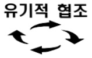
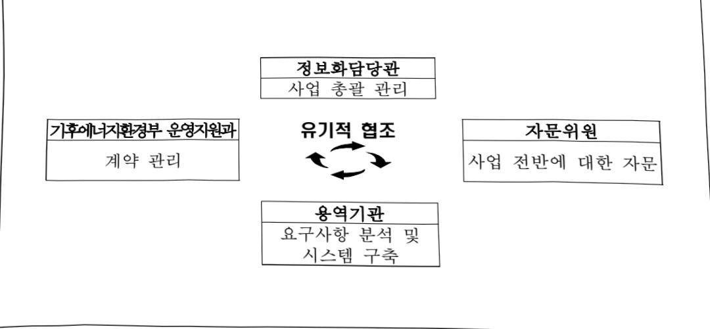

# 환경행정 정보서비스 구축(정보화)

**해당 페이지**: PDF 2923 ~ 2936 쪽 해당

**부처**: 기후에너지환경부
**분야**: 환경
**회계유형**: 환경개선 특별회계
**2026 확정예산**: 4788.0 백만원
**전년대비 증감률**: 9.4%
**AI 도메인**: 데이터, 보안/사이버, 환경/기후, 디지털전환(AX)

---

<table border=1 style='margin: auto; word-wrap: break-word;'><tr><td style='text-align: center; word-wrap: break-word;'>사 업 명</td></tr><tr><td style='text-align: center; word-wrap: break-word;'>(227) 환경행정정보서비스 구축(정보화)(7132-501)</td></tr></table>

☐ 사업 코드 정보

<table border=1 style='margin: auto; word-wrap: break-word;'><tr><td style='text-align: center; word-wrap: break-word;'>구분</td><td style='text-align: center; word-wrap: break-word;'>회계</td><td style='text-align: center; word-wrap: break-word;'>소관</td><td style='text-align: center; word-wrap: break-word;'>실국(기관)</td><td style='text-align: center; word-wrap: break-word;'>계정</td><td style='text-align: center; word-wrap: break-word;'>분야</td><td style='text-align: center; word-wrap: break-word;'>부문</td></tr><tr><td style='text-align: center; word-wrap: break-word;'>코드</td><td style='text-align: center; word-wrap: break-word;'>환경개선</td><td style='text-align: center; word-wrap: break-word;'>기후에너지</td><td style='text-align: center; word-wrap: break-word;'>기획조정실</td><td rowspan="2">-</td><td style='text-align: center; word-wrap: break-word;'>070</td><td style='text-align: center; word-wrap: break-word;'>073</td></tr><tr><td style='text-align: center; word-wrap: break-word;'>명칭</td><td style='text-align: center; word-wrap: break-word;'>특별회계</td><td style='text-align: center; word-wrap: break-word;'>환경부</td><td style='text-align: center; word-wrap: break-word;'>정책기획관</td><td style='text-align: center; word-wrap: break-word;'>환경</td><td style='text-align: center; word-wrap: break-word;'>환경일반</td></tr></table>

<table border=1 style='margin: auto; word-wrap: break-word;'><tr><td style='text-align: center; word-wrap: break-word;'>구분</td><td style='text-align: center; word-wrap: break-word;'>프로그램</td><td style='text-align: center; word-wrap: break-word;'>단위사업</td><td style='text-align: center; word-wrap: break-word;'>세부사업</td></tr><tr><td style='text-align: center; word-wrap: break-word;'>코드</td><td style='text-align: center; word-wrap: break-word;'>7100</td><td style='text-align: center; word-wrap: break-word;'>7132</td><td style='text-align: center; word-wrap: break-word;'>501</td></tr><tr><td style='text-align: center; word-wrap: break-word;'>명칭</td><td style='text-align: center; word-wrap: break-word;'>환경행정지원</td><td style='text-align: center; word-wrap: break-word;'>환경정보화</td><td style='text-align: center; word-wrap: break-word;'>환경행정정보서비스 구축(정보화)</td></tr></table>

<table border=1 style='margin: auto; word-wrap: break-word;'><tr><td colspan="6">☐ 사업 성격 (공통요구자료 Ⅱ-1 작성유의사항 4. 참조, 해당하는 사항에 “○” 표시)</td></tr><tr><td style='text-align: center; word-wrap: break-word;'>신규 계속</td><td style='text-align: center; word-wrap: break-word;'>완료</td><td style='text-align: center; word-wrap: break-word;'>예비타당성 실시여부</td><td style='text-align: center; word-wrap: break-word;'>총사업비 관리대상</td><td style='text-align: center; word-wrap: break-word;'>총액계상 예산사업</td><td style='text-align: center; word-wrap: break-word;'>사업소관 변경정보 2025예산 시 소관</td></tr><tr><td style='text-align: center; word-wrap: break-word;'></td><td style='text-align: center; word-wrap: break-word;'>☐</td><td style='text-align: center; word-wrap: break-word;'></td><td style='text-align: center; word-wrap: break-word;'></td><td style='text-align: center; word-wrap: break-word;'></td><td style='text-align: center; word-wrap: break-word;'></td></tr></table>

□ 사업 지원 형태 및 지원을 (최소한 한 개는 반드시 선택하시오. 해당사항에 0 표시)

<table border=1 style='margin: auto; word-wrap: break-word;'><tr><td style='text-align: center; word-wrap: break-word;'>직접</td><td style='text-align: center; word-wrap: break-word;'>출자</td><td style='text-align: center; word-wrap: break-word;'>출연</td><td style='text-align: center; word-wrap: break-word;'>보조</td><td style='text-align: center; word-wrap: break-word;'>융자</td><td style='text-align: center; word-wrap: break-word;'>국고보조율(%)</td><td style='text-align: center; word-wrap: break-word;'>융자율(%)</td></tr><tr><td style='text-align: center; word-wrap: break-word;'>○</td><td style='text-align: center; word-wrap: break-word;'></td><td style='text-align: center; word-wrap: break-word;'></td><td style='text-align: center; word-wrap: break-word;'></td><td style='text-align: center; word-wrap: break-word;'></td><td style='text-align: center; word-wrap: break-word;'></td><td style='text-align: center; word-wrap: break-word;'></td></tr></table>

□ 사업 담당자

<table border=1 style='margin: auto; word-wrap: break-word;'><tr><td style='text-align: center; word-wrap: break-word;'>사업명</td><td colspan="2">구분</td></tr><tr><td rowspan="2">행정정보시스템통합유지관리</td><td rowspan="2">기후에너지환경부</td><td style='text-align: center; word-wrap: break-word;'>기획조정실 정책기획관</td></tr><tr><td style='text-align: center; word-wrap: break-word;'>정보화담당관</td></tr><tr><td rowspan="2">행정정보시스템기능개선</td><td rowspan="2">기후에너지환경부</td><td style='text-align: center; word-wrap: break-word;'>기획조정실 정책기획관</td></tr><tr><td style='text-align: center; word-wrap: break-word;'>정보화담당관</td></tr><tr><td rowspan="2">환경정보화거버넌스</td><td rowspan="2">기후에너지환경부</td><td style='text-align: center; word-wrap: break-word;'>기획조정실 정책기획관</td></tr><tr><td style='text-align: center; word-wrap: break-word;'>정보화담당관</td></tr><tr><td rowspan="2">환경정보시스템운영협회화</td><td rowspan="2">기후에너지환경부</td><td style='text-align: center; word-wrap: break-word;'>기획조정실 정책기획관</td></tr><tr><td style='text-align: center; word-wrap: break-word;'>정보화담당관</td></tr><tr><td rowspan="2">시야반전센터개선및운영협회</td><td rowspan="2">기후에너지환경부</td><td style='text-align: center; word-wrap: break-word;'>기획조정실 정책기획관</td></tr><tr><td style='text-align: center; word-wrap: break-word;'>정보화담당관</td></tr></table>

---

### 가. 예산 총괄표

(단위:백만원,%)

<table border=1 style='margin: auto; word-wrap: break-word;'><tr><td rowspan="2">사업명</td><td rowspan="2">2024년 결산</td><td colspan="2">2025년 예산</td><td colspan="2">2026년</td><td rowspan="2">증감(B-A)</td><td rowspan="2">(B-A)/A</td></tr><tr><td style='text-align: center; word-wrap: break-word;'>본예산(A)</td><td style='text-align: center; word-wrap: break-word;'>추경</td><td style='text-align: center; word-wrap: break-word;'>정부안</td><td style='text-align: center; word-wrap: break-word;'>확정(B)</td></tr><tr><td style='text-align: center; word-wrap: break-word;'>환경행정정보 서비스 구축(정보화)</td><td style='text-align: center; word-wrap: break-word;'>3,864</td><td style='text-align: center; word-wrap: break-word;'>4,377</td><td style='text-align: center; word-wrap: break-word;'>4,377</td><td style='text-align: center; word-wrap: break-word;'>5,487</td><td style='text-align: center; word-wrap: break-word;'>4,788</td><td style='text-align: center; word-wrap: break-word;'>411</td><td style='text-align: center; word-wrap: break-word;'>9.4</td></tr></table>

□ 기능별(내역사업별), 목별 예산 내역

(단위:백만원)

<table border=1 style='margin: auto; word-wrap: break-word;'><tr><td rowspan="3"></td><td colspan="5">2024</td><td colspan="7">2025</td><td rowspan="3">2026예산</td></tr><tr><td rowspan="2">예산액(추정)</td><td rowspan="2">예산현액</td><td rowspan="2">집행액[실집행액]</td><td rowspan="2">이월액</td><td rowspan="2">불용액</td><td rowspan="2">본예산</td><td rowspan="2">예산현액</td><td rowspan="2">집행액[실집행액]</td><td colspan="2">전년도이월액제외</td><td rowspan="2">이월예상액</td><td rowspan="2">불용예상액</td></tr><tr><td style='text-align: center; word-wrap: break-word;'>예산현액</td><td style='text-align: center; word-wrap: break-word;'>집행액[실집행액]</td></tr><tr><td style='text-align: center; word-wrap: break-word;'>○ 기능별 분류(합계)</td><td style='text-align: center; word-wrap: break-word;'>3,843</td><td style='text-align: center; word-wrap: break-word;'>3,926</td><td style='text-align: center; word-wrap: break-word;'>3,864</td><td style='text-align: center; word-wrap: break-word;'>20</td><td style='text-align: center; word-wrap: break-word;'>42</td><td style='text-align: center; word-wrap: break-word;'>4,377</td><td style='text-align: center; word-wrap: break-word;'>4,397</td><td style='text-align: center; word-wrap: break-word;'>4,229</td><td style='text-align: center; word-wrap: break-word;'>4,377</td><td style='text-align: center; word-wrap: break-word;'>4,209</td><td style='text-align: center; word-wrap: break-word;'>153</td><td style='text-align: center; word-wrap: break-word;'>14</td><td style='text-align: center; word-wrap: break-word;'>4,788</td></tr><tr><td style='text-align: center; word-wrap: break-word;'>· 행정정보시스템통합유지관리</td><td style='text-align: center; word-wrap: break-word;'>1,473</td><td style='text-align: center; word-wrap: break-word;'>1,473</td><td style='text-align: center; word-wrap: break-word;'>1,446</td><td style='text-align: center; word-wrap: break-word;'>-</td><td style='text-align: center; word-wrap: break-word;'>27</td><td style='text-align: center; word-wrap: break-word;'>1,553</td><td style='text-align: center; word-wrap: break-word;'>1,553</td><td style='text-align: center; word-wrap: break-word;'>1,553</td><td style='text-align: center; word-wrap: break-word;'>1,553</td><td style='text-align: center; word-wrap: break-word;'>1,553</td><td style='text-align: center; word-wrap: break-word;'>-</td><td style='text-align: center; word-wrap: break-word;'>-</td><td style='text-align: center; word-wrap: break-word;'>1,656</td></tr><tr><td style='text-align: center; word-wrap: break-word;'>· 행정정보시스템기능개선</td><td style='text-align: center; word-wrap: break-word;'>330</td><td style='text-align: center; word-wrap: break-word;'>413</td><td style='text-align: center; word-wrap: break-word;'>402</td><td style='text-align: center; word-wrap: break-word;'>-</td><td style='text-align: center; word-wrap: break-word;'>11</td><td style='text-align: center; word-wrap: break-word;'>781</td><td style='text-align: center; word-wrap: break-word;'>781</td><td style='text-align: center; word-wrap: break-word;'>621</td><td style='text-align: center; word-wrap: break-word;'>781</td><td style='text-align: center; word-wrap: break-word;'>621</td><td style='text-align: center; word-wrap: break-word;'>153</td><td style='text-align: center; word-wrap: break-word;'>6</td><td style='text-align: center; word-wrap: break-word;'>738</td></tr><tr><td style='text-align: center; word-wrap: break-word;'>· 환경정보화거버넌스</td><td style='text-align: center; word-wrap: break-word;'>-</td><td style='text-align: center; word-wrap: break-word;'>-</td><td style='text-align: center; word-wrap: break-word;'>-</td><td style='text-align: center; word-wrap: break-word;'>-</td><td style='text-align: center; word-wrap: break-word;'>-</td><td style='text-align: center; word-wrap: break-word;'>-</td><td style='text-align: center; word-wrap: break-word;'>-</td><td style='text-align: center; word-wrap: break-word;'>-</td><td style='text-align: center; word-wrap: break-word;'>-</td><td style='text-align: center; word-wrap: break-word;'>-</td><td style='text-align: center; word-wrap: break-word;'>-</td><td style='text-align: center; word-wrap: break-word;'>-</td><td style='text-align: center; word-wrap: break-word;'>309</td></tr><tr><td style='text-align: center; word-wrap: break-word;'>· 환경정보시스템운영합리화 방안</td><td style='text-align: center; word-wrap: break-word;'>243</td><td style='text-align: center; word-wrap: break-word;'>243</td><td style='text-align: center; word-wrap: break-word;'>223</td><td style='text-align: center; word-wrap: break-word;'>20</td><td style='text-align: center; word-wrap: break-word;'>-</td><td style='text-align: center; word-wrap: break-word;'>246</td><td style='text-align: center; word-wrap: break-word;'>266</td><td style='text-align: center; word-wrap: break-word;'>262</td><td style='text-align: center; word-wrap: break-word;'>246</td><td style='text-align: center; word-wrap: break-word;'>242</td><td style='text-align: center; word-wrap: break-word;'>-</td><td style='text-align: center; word-wrap: break-word;'>4</td><td style='text-align: center; word-wrap: break-word;'>246</td></tr><tr><td style='text-align: center; word-wrap: break-word;'>· 사이버안전센터개선 및 운영관리</td><td style='text-align: center; word-wrap: break-word;'>1,797</td><td style='text-align: center; word-wrap: break-word;'>1,797</td><td style='text-align: center; word-wrap: break-word;'>1,793</td><td style='text-align: center; word-wrap: break-word;'>-</td><td style='text-align: center; word-wrap: break-word;'>4</td><td style='text-align: center; word-wrap: break-word;'>1,797</td><td style='text-align: center; word-wrap: break-word;'>1,797</td><td style='text-align: center; word-wrap: break-word;'>1,793</td><td style='text-align: center; word-wrap: break-word;'>1,797</td><td style='text-align: center; word-wrap: break-word;'>1,793</td><td style='text-align: center; word-wrap: break-word;'>-</td><td style='text-align: center; word-wrap: break-word;'>4</td><td style='text-align: center; word-wrap: break-word;'>1,839</td></tr><tr><td style='text-align: center; word-wrap: break-word;'>○ 비목별 분류(합계)</td><td style='text-align: center; word-wrap: break-word;'>3,843</td><td style='text-align: center; word-wrap: break-word;'>3,926</td><td style='text-align: center; word-wrap: break-word;'>3,864</td><td style='text-align: center; word-wrap: break-word;'>20</td><td style='text-align: center; word-wrap: break-word;'>42</td><td style='text-align: center; word-wrap: break-word;'>4,377</td><td style='text-align: center; word-wrap: break-word;'>4,397</td><td style='text-align: center; word-wrap: break-word;'>4,229</td><td style='text-align: center; word-wrap: break-word;'>4,377</td><td style='text-align: center; word-wrap: break-word;'>4,209</td><td style='text-align: center; word-wrap: break-word;'>153</td><td style='text-align: center; word-wrap: break-word;'>14</td><td style='text-align: center; word-wrap: break-word;'>4,788</td></tr><tr><td style='text-align: center; word-wrap: break-word;'>· 관리용역비(210-15)</td><td style='text-align: center; word-wrap: break-word;'>2,920</td><td style='text-align: center; word-wrap: break-word;'>2,920</td><td style='text-align: center; word-wrap: break-word;'>2,889</td><td style='text-align: center; word-wrap: break-word;'>-</td><td style='text-align: center; word-wrap: break-word;'>31</td><td style='text-align: center; word-wrap: break-word;'>3,000</td><td style='text-align: center; word-wrap: break-word;'>3,000</td><td style='text-align: center; word-wrap: break-word;'>2,996</td><td style='text-align: center; word-wrap: break-word;'>3,000</td><td style='text-align: center; word-wrap: break-word;'>2,996</td><td style='text-align: center; word-wrap: break-word;'>-</td><td style='text-align: center; word-wrap: break-word;'>4</td><td style='text-align: center; word-wrap: break-word;'>3,145</td></tr><tr><td style='text-align: center; word-wrap: break-word;'>· 일반연구비(260-01)</td><td style='text-align: center; word-wrap: break-word;'>573</td><td style='text-align: center; word-wrap: break-word;'>656</td><td style='text-align: center; word-wrap: break-word;'>625</td><td style='text-align: center; word-wrap: break-word;'>20</td><td style='text-align: center; word-wrap: break-word;'>11</td><td style='text-align: center; word-wrap: break-word;'>1,027</td><td style='text-align: center; word-wrap: break-word;'>1,047</td><td style='text-align: center; word-wrap: break-word;'>883</td><td style='text-align: center; word-wrap: break-word;'>1,027</td><td style='text-align: center; word-wrap: break-word;'>863</td><td style='text-align: center; word-wrap: break-word;'>153</td><td style='text-align: center; word-wrap: break-word;'>10</td><td style='text-align: center; word-wrap: break-word;'>1,293</td></tr><tr><td style='text-align: center; word-wrap: break-word;'>· 자산취득비(430-01)</td><td style='text-align: center; word-wrap: break-word;'>350</td><td style='text-align: center; word-wrap: break-word;'>350</td><td style='text-align: center; word-wrap: break-word;'>350</td><td style='text-align: center; word-wrap: break-word;'>-</td><td style='text-align: center; word-wrap: break-word;'>-</td><td style='text-align: center; word-wrap: break-word;'>350</td><td style='text-align: center; word-wrap: break-word;'>350</td><td style='text-align: center; word-wrap: break-word;'>350</td><td style='text-align: center; word-wrap: break-word;'>350</td><td style='text-align: center; word-wrap: break-word;'>350</td><td style='text-align: center; word-wrap: break-word;'>-</td><td style='text-align: center; word-wrap: break-word;'>-</td><td style='text-align: center; word-wrap: break-word;'>350</td></tr><tr><td style='text-align: center; word-wrap: break-word;'>○ 기능비목별 분류(합계)</td><td style='text-align: center; word-wrap: break-word;'>3,843</td><td style='text-align: center; word-wrap: break-word;'>3,926</td><td style='text-align: center; word-wrap: break-word;'>3,864</td><td style='text-align: center; word-wrap: break-word;'>20</td><td style='text-align: center; word-wrap: break-word;'>42</td><td style='text-align: center; word-wrap: break-word;'>4,377</td><td style='text-align: center; word-wrap: break-word;'>4,377</td><td style='text-align: center; word-wrap: break-word;'>4,229</td><td style='text-align: center; word-wrap: break-word;'>4,377</td><td style='text-align: center; word-wrap: break-word;'>4,209</td><td style='text-align: center; word-wrap: break-word;'>153</td><td style='text-align: center; word-wrap: break-word;'>14</td><td style='text-align: center; word-wrap: break-word;'>4,788</td></tr><tr><td style='text-align: center; word-wrap: break-word;'>· 행정정보시스템통합유지관리</td><td style='text-align: center; word-wrap: break-word;'>1,473</td><td style='text-align: center; word-wrap: break-word;'>1,473</td><td style='text-align: center; word-wrap: break-word;'>1,446</td><td style='text-align: center; word-wrap: break-word;'>-</td><td style='text-align: center; word-wrap: break-word;'>27</td><td style='text-align: center; word-wrap: break-word;'>1,553</td><td style='text-align: center; word-wrap: break-word;'>1,553</td><td style='text-align: center; word-wrap: break-word;'>1,553</td><td style='text-align: center; word-wrap: break-word;'>1,553</td><td style='text-align: center; word-wrap: break-word;'>1,553</td><td style='text-align: center; word-wrap: break-word;'>-</td><td style='text-align: center; word-wrap: break-word;'>-</td><td style='text-align: center; word-wrap: break-word;'>1,656</td></tr><tr><td style='text-align: center; word-wrap: break-word;'>· 관리용역비(210-15)</td><td style='text-align: center; word-wrap: break-word;'>1,473</td><td style='text-align: center; word-wrap: break-word;'>1,473</td><td style='text-align: center; word-wrap: break-word;'>1,446</td><td style='text-align: center; word-wrap: break-word;'>-</td><td style='text-align: center; word-wrap: break-word;'>27</td><td style='text-align: center; word-wrap: break-word;'>1,553</td><td style='text-align: center; word-wrap: break-word;'>1,553</td><td style='text-align: center; word-wrap: break-word;'>1,553</td><td style='text-align: center; word-wrap: break-word;'>1,553</td><td style='text-align: center; word-wrap: break-word;'>1,553</td><td style='text-align: center; word-wrap: break-word;'>-</td><td style='text-align: center; word-wrap: break-word;'>-</td><td style='text-align: center; word-wrap: break-word;'>1,656</td></tr><tr><td style='text-align: center; word-wrap: break-word;'>· 행정정보시스템기능개선</td><td style='text-align: center; word-wrap: break-word;'>330</td><td style='text-align: center; word-wrap: break-word;'>413</td><td style='text-align: center; word-wrap: break-word;'>402</td><td style='text-align: center; word-wrap: break-word;'>-</td><td style='text-align: center; word-wrap: break-word;'>11</td><td style='text-align: center; word-wrap: break-word;'>781</td><td style='text-align: center; word-wrap: break-word;'>781</td><td style='text-align: center; word-wrap: break-word;'>621</td><td style='text-align: center; word-wrap: break-word;'>781</td><td style='text-align: center; word-wrap: break-word;'>621</td><td style='text-align: center; word-wrap: break-word;'>153</td><td style='text-align: center; word-wrap: break-word;'>6</td><td style='text-align: center; word-wrap: break-word;'>738</td></tr><tr><td style='text-align: center; word-wrap: break-word;'>· 일반연구비(260-01)</td><td style='text-align: center; word-wrap: break-word;'>330</td><td style='text-align: center; word-wrap: break-word;'>413</td><td style='text-align: center; word-wrap: break-word;'>402</td><td style='text-align: center; word-wrap: break-word;'>-</td><td style='text-align: center; word-wrap: break-word;'>11</td><td style='text-align: center; word-wrap: break-word;'>781</td><td style='text-align: center; word-wrap: break-word;'>781</td><td style='text-align: center; word-wrap: break-word;'>621</td><td style='text-align: center; word-wrap: break-word;'>781</td><td style='text-align: center; word-wrap: break-word;'>621</td><td style='text-align: center; word-wrap: break-word;'>153</td><td style='text-align: center; word-wrap: break-word;'>6</td><td style='text-align: center; word-wrap: break-word;'>738</td></tr><tr><td style='text-align: center; word-wrap: break-word;'>· 환경정보화거버넌스</td><td style='text-align: center; word-wrap: break-word;'>-</td><td style='text-align: center; word-wrap: break-word;'>-</td><td style='text-align: center; word-wrap: break-word;'>-</td><td style='text-align: center; word-wrap: break-word;'>-</td><td style='text-align: center; word-wrap: break-word;'>-</td><td style='text-align: center; word-wrap: break-word;'>-</td><td style='text-align: center; word-wrap: break-word;'>-</td><td style='text-align: center; word-wrap: break-word;'>-</td><td style='text-align: center; word-wrap: break-word;'>-</td><td style='text-align: center; word-wrap: break-word;'>-</td><td style='text-align: center; word-wrap: break-word;'>-</td><td style='text-align: center; word-wrap: break-word;'>-</td><td style='text-align: center; word-wrap: break-word;'>309</td></tr><tr><td style='text-align: center; word-wrap: break-word;'>· 일반연구비(260-01)</td><td style='text-align: center; word-wrap: break-word;'>-</td><td style='text-align: center; word-wrap: break-word;'>-</td><td style='text-align: center; word-wrap: break-word;'>-</td><td style='text-align: center; word-wrap: break-word;'>-</td><td style='text-align: center; word-wrap: break-word;'>-</td><td style='text-align: center; word-wrap: break-word;'>-</td><td style='text-align: center; word-wrap: break-word;'>-</td><td style='text-align: center; word-wrap: break-word;'>-</td><td style='text-align: center; word-wrap: break-word;'>-</td><td style='text-align: center; word-wrap: break-word;'>-</td><td style='text-align: center; word-wrap: break-word;'>-</td><td style='text-align: center; word-wrap: break-word;'>-</td><td style='text-align: center; word-wrap: break-word;'>309</td></tr></table>

---

<table border=1 style='margin: auto; word-wrap: break-word;'><tr><td rowspan="3"></td><td colspan="5">2024</td><td colspan="7">2025</td><td rowspan="3">2026 예산</td></tr><tr><td rowspan="2">예산액 (추정)</td><td rowspan="2">예산 현액</td><td rowspan="2">집행액 [실질 행액]</td><td rowspan="2">이월액</td><td rowspan="2">불용액</td><td rowspan="2">본예산</td><td rowspan="2">예산 현액</td><td rowspan="2">집행액 [실질 행액]</td><td colspan="2">전년도 이월액 제외</td><td rowspan="2">이월 예산액</td><td rowspan="2">불용 예산액</td></tr><tr><td style='text-align: center; word-wrap: break-word;'>예산 현액</td><td style='text-align: center; word-wrap: break-word;'>집행액 [실질 행액]</td></tr><tr><td rowspan="2">· 환경정보시스템 운영합리화 방안 - 일 반 연 구 비 (260-01)</td><td style='text-align: center; word-wrap: break-word;'>243</td><td style='text-align: center; word-wrap: break-word;'>243</td><td style='text-align: center; word-wrap: break-word;'>223</td><td style='text-align: center; word-wrap: break-word;'>20</td><td style='text-align: center; word-wrap: break-word;'>-</td><td style='text-align: center; word-wrap: break-word;'>246</td><td style='text-align: center; word-wrap: break-word;'>266</td><td style='text-align: center; word-wrap: break-word;'>262</td><td style='text-align: center; word-wrap: break-word;'>246</td><td style='text-align: center; word-wrap: break-word;'>242</td><td style='text-align: center; word-wrap: break-word;'>-</td><td style='text-align: center; word-wrap: break-word;'>4</td><td style='text-align: center; word-wrap: break-word;'>246</td></tr><tr><td style='text-align: center; word-wrap: break-word;'>243</td><td style='text-align: center; word-wrap: break-word;'>243</td><td style='text-align: center; word-wrap: break-word;'>223</td><td style='text-align: center; word-wrap: break-word;'>20</td><td style='text-align: center; word-wrap: break-word;'>-</td><td style='text-align: center; word-wrap: break-word;'>246</td><td style='text-align: center; word-wrap: break-word;'>266</td><td style='text-align: center; word-wrap: break-word;'>262</td><td style='text-align: center; word-wrap: break-word;'>246</td><td style='text-align: center; word-wrap: break-word;'>242</td><td style='text-align: center; word-wrap: break-word;'>-</td><td style='text-align: center; word-wrap: break-word;'>4</td><td style='text-align: center; word-wrap: break-word;'>246</td></tr><tr><td rowspan="2">· 사이버안전센터 개선 및 운영관리 - 관리 용 역 비 (210-15)</td><td style='text-align: center; word-wrap: break-word;'>1,797</td><td style='text-align: center; word-wrap: break-word;'>1,797</td><td style='text-align: center; word-wrap: break-word;'>1,793</td><td style='text-align: center; word-wrap: break-word;'>-</td><td style='text-align: center; word-wrap: break-word;'>4</td><td style='text-align: center; word-wrap: break-word;'>1,797</td><td style='text-align: center; word-wrap: break-word;'>1,797</td><td style='text-align: center; word-wrap: break-word;'>1,793</td><td style='text-align: center; word-wrap: break-word;'>1,797</td><td style='text-align: center; word-wrap: break-word;'>1,793</td><td style='text-align: center; word-wrap: break-word;'>-</td><td style='text-align: center; word-wrap: break-word;'>4</td><td style='text-align: center; word-wrap: break-word;'>1,839</td></tr><tr><td style='text-align: center; word-wrap: break-word;'>1,447</td><td style='text-align: center; word-wrap: break-word;'>1,447</td><td style='text-align: center; word-wrap: break-word;'>1,443</td><td style='text-align: center; word-wrap: break-word;'>-</td><td style='text-align: center; word-wrap: break-word;'>4</td><td style='text-align: center; word-wrap: break-word;'>1,447</td><td style='text-align: center; word-wrap: break-word;'>1,447</td><td style='text-align: center; word-wrap: break-word;'>1,443</td><td style='text-align: center; word-wrap: break-word;'>1,447</td><td style='text-align: center; word-wrap: break-word;'>1,443</td><td style='text-align: center; word-wrap: break-word;'>-</td><td style='text-align: center; word-wrap: break-word;'>4</td><td style='text-align: center; word-wrap: break-word;'>1,489</td></tr><tr><td style='text-align: center; word-wrap: break-word;'>- 자 산 취 득 비 (430-01)</td><td style='text-align: center; word-wrap: break-word;'>350</td><td style='text-align: center; word-wrap: break-word;'>350</td><td style='text-align: center; word-wrap: break-word;'>350</td><td style='text-align: center; word-wrap: break-word;'>-</td><td style='text-align: center; word-wrap: break-word;'>-</td><td style='text-align: center; word-wrap: break-word;'>350</td><td style='text-align: center; word-wrap: break-word;'>350</td><td style='text-align: center; word-wrap: break-word;'>350</td><td style='text-align: center; word-wrap: break-word;'>350</td><td style='text-align: center; word-wrap: break-word;'>350</td><td style='text-align: center; word-wrap: break-word;'>-</td><td style='text-align: center; word-wrap: break-word;'>-</td><td style='text-align: center; word-wrap: break-word;'>350</td></tr></table>

### 나. 사업설명자료

## 1 ) 사업목적·내용

(행정정보시스템 통합유지관리) 기후에너지환경부 직원들의 중단 없는 행정업무 처리지원을 위해 이지샘터, 민원포털, 성과관리 등 행정정보시스템을 전문기술 및 인력을 보유한 전문 업체에 통합유지관리하기 위함

(행정정보시스템 기능개선) 직원들의 행정업무 지원 및 대국민서비스를 위한 행정정보시스템에 대해 급변하는 환경행정 변화에 대응하도록 지속적인 기능개선 및 보강

(환경정보화 거버넌스) 기후에너지환경부 소관 차원 디지털 혁신계획 마련을 위한 제1차 기후에너지환경 환경정보화기본계획('27~'31) 수립 필요

---

(환경정보시스템 운영 합리화) 데이터 기반 행정법에 따른 데이터 관리체계 구축 및 데이터 3법 개정에 따른 데이터 활용 필요성이 증대

(사이버안전센터 개선 및 운영관리) 지속적인 사이버침해 및 위협에 대한 신속한 대응과 사이버안전센터의 안정적인 운영을 위한 보안관제 시스템 고도화

## 2 ) 사업개요

□ 사업근거 및 추진경위

① 법령상 근거 조항 적시

☐ 행정정보시스템 통합유지관리

-「전자정부법」 제2장(전자정부서비스의 제공 및 활용), 제3장(전자적 행정관리)

-「환경정책기본법」 제24조(환경정보의 보급 등)

-「행정업무의 운영 및 혁신에 관한 규정」 제43조의 2(행정기관의 지식행정 활성화)

-「공공기관 기록물 관리에 관한 법률」 제23조(시청각기록물 관리), 제24조(행정 박물의 관리)

## ☐ 행정정보시스템 기능개선

- 「전자정부법」 제2장(전자정부서비스의 제공 및 활용), 제3장(전자적 행정관리)

- 「환경정책기본법」 제24조(환경정보의 보급 등)

-「행정업무의 운영 및 혁신에 관한 규정」 제43조의 2(행정기관의 지식행정 활성화)

-「공공기관 기록물 관리에 관한 법률」 제23조(시청각기록물 관리), 제24조(행정 박물의 관리)

## ☐ 환경정보화 거버넌스

- 전자정부법 제5조(전자정부기본계획의 수립)

-「지능정보화 기본법」 제6조(지능정보사회 종합계획의 수립)

## ☐ 환경정보시스템 운영합리화

- 전자정부법 제5조의2(기관별 계획의 수립 및 점검), 제6조(국가정보화 기본계획의 수립), 제44조의3(국가기준데이터의 관리 등)

-「데이터기반행정법」 제16조(데이터관리체계의 구축)

-「공공데이터법」 제14조(공공데이터 이용 활성화), 같은 법 제22조(공공데이터의 품질관리), 같은 법 제23조(공공데이터의 표준화)

-「지능정보화 기본법」 제42조(데이터 관련 시책의 마련)

---

## ○ 사이버안전센터 개선 및 운영관리

- 국가사이버안전관리규정(일부개정 2013.9.2, 대통령훈령 제316호)

- 국가사이버안전관리규정 제10조의2에 따라 설치('10.12)

- 전자정부법 (일부개정 2025.1.8, 법률 제20654호)

- 정보통신기반 보호법(일부개정 2024.1.23, 법률 제20068호)

- 사이버안보 업무규정(2024.3.5., 대통령령 제34287호)

## ② 추진경위

☐ 행정정보시스템 통합유지관리

- 지식관리시스템을 업무포털로 확대구축('17)

- 기존에 3개로 분리하여 유지관리하던 업무포털, 환경디지털도서관, 지식관리시스템 등을 '18년부터 통합 유지관리하여 예산절감

- 법정민원시스템을 G-클라우드로 전환함으로써 보안 강화 및 안정적인 운영 여건을 확보하여 대민 서비스 개선('18)

- '18년도 사업추진과정에 고객지원센터(운영지원과)와 민원처리시스템의 이원화 문제의 심각성을 인식하고 통합추진('19)

## ☐ 행정정보시스템 기능개선

- 최신 트렌드인 융·복합 지식정보를 제공하기 위해 사진, 동영상, 음향 등을 통합 관리하는 지식관리시스템 구축('15)

※ 대한민국 지식대상 대통령상 수상(행정안전부)

- 환경행정포털이 노후화 되고 패키지SW의 기능개선 한계로 지식관리시스템을 개편하여 업무포털 신규 구축('17, '18 이지샘터)

※ 대한민국 지식대상 '17년, '18년 우수상 수상(행정안전부)

- '02년부터 환경부 및 소속·산하기관 16개 정보자료실을 통합하여 환경디지털도서관 구축, 50만건 DB제공

※ 대한민국 대표브랜드 대상 수상(매경미디어그룹)

## ☐ 환경정보화 거버넌스

- '96년부터 「전자정부법」 제5조 등에 따라 5년 단위의 정보화 중장기 기본계획을 수립·시행 중이며, 제5차 환경정보화기본계획의 종료('26) 및 기후에너지환경부 신설('25.10.)에 따라 제1차 기후에너지환경 정보화 기본계획 수립(2027-2031) 필요

---

☐ 환경정보시스템 운영합리화

- 디지털 정부혁신 추진계획('19.10.23., 행안부)에 따라 데이터 표준관리 및 고품질 데이터 확보요구로 기관차원의 거버넌스 기반 데이터 관리체계 강화

※ 공공데이터 품질관리 수준평가 실시(행안부, '18.6월부터, 정부·공공기관)

- 환경매체별 표준수립('22.12.)에 따라 소속,산하기관 확대 적용방안 마련

- 기관 데이터관리시스템 구축(업무망)(2023)

○ 사이버안전센터 개선 및 운영관리

- 사이버안전센터 구축 (10.12)

- 사이버안전센터 위탁운영 (‘11.1 ~ 현재)

## □ 주요내용

① 사업규모

- 총사업비(해당되는 경우에만 기재) : 해당없음

-사업기간:계속사업

- 최근 5년 간 투입된 사업비(예산액기준, 추경편성한 연도에는 추경포함)

<table border=1 style='margin: auto; word-wrap: break-word;'><tr><td style='text-align: center; word-wrap: break-word;'>$ \underline{\text{연도}} $</td><td style='text-align: center; word-wrap: break-word;'>2022</td><td style='text-align: center; word-wrap: break-word;'>2023</td><td style='text-align: center; word-wrap: break-word;'>2024</td><td style='text-align: center; word-wrap: break-word;'>2025</td><td style='text-align: center; word-wrap: break-word;'>2026</td></tr><tr><td style='text-align: center; word-wrap: break-word;'>사업비</td><td style='text-align: center; word-wrap: break-word;'>3,740</td><td style='text-align: center; word-wrap: break-word;'>3,845</td><td style='text-align: center; word-wrap: break-word;'>3,843</td><td style='text-align: center; word-wrap: break-word;'>4,377</td><td style='text-align: center; word-wrap: break-word;'>4,788</td></tr></table>

-기타: 해당없음

② 사업추진체계

- 사업시행방법 : 직접수행

- 사업시행주체 : 기후에너지환경부

- 사업 수혜자 : 공무원, 일반 국민

- 보조, 융자, 출연, 출자 등의 경우 보조·융자 등 지원 비율 및 법적근거: 해당없음

## 3 ) 2026년도 예산 산출 근거

① 행정정보시스템 통합유지관리 : (2025) 1,553백만원 → (2026 예산) 1,656백만원, 103백만원 증액

- 급변하는 정보자원과 IT 환경에 효과적으로 대응하고 사업관리 효율성을 위한 통합유지관리

- (요구) 유지관리 상용SW·개발SW 추가, 유지관리 인력에 대한 SW 임금체계 현실화 등

1) (개발SW 원가 증액) '24년 개발비 추가, 다면평가시스템 유지관리 추가

2) (상용SW 원가 증액) 메타관리시스템. 품질진단관리시스템

3) (다면평가시스템 통합) 디지털행정서비스 국민신뢰 제고대책(행안부, '24.2)에 따라 소규모시스템(3.4등급) 통합, 행정정보시스템 통합유지관리로 유지관리비 일부반영

---

※ 중대재해처벌법 제정에 따라 과중한 업무로 인한 재해 발생이 우려되므로 적절한 문배 필요

※ SW 운영비 산정 가이드 개정(2025년)으로 IT직무별 SW기술자 평균임금 적용함에 따라 단가 변경

- 대전·세종은 지역특성상 SW개발자 수급이 매우 어려움(수도권 인력에 대한 체류비 지급 필요)

- 현재의 예산으로는 유지관리 사업자 선정이 어려운 실정 ('20.~'23. 4년간 4개 업체 교체)

- (산출) 정보시스템 운영비 : 1,656백만원

<table border=1 style='margin: auto; word-wrap: break-word;'><tr><td rowspan="2">구분</td><td colspan="3">25년</td><td colspan="3">26년</td></tr><tr><td style='text-align: center; word-wrap: break-word;'>도입비</td><td style='text-align: center; word-wrap: break-word;'>평균요율</td><td style='text-align: center; word-wrap: break-word;'>예산</td><td style='text-align: center; word-wrap: break-word;'>도입비</td><td style='text-align: center; word-wrap: break-word;'>평균요율</td><td style='text-align: center; word-wrap: break-word;'>예산</td></tr><tr><td style='text-align: center; word-wrap: break-word;'>유지보수</td><td colspan="2">함 계</td><td style='text-align: center; word-wrap: break-word;'>1,553</td><td style='text-align: center; word-wrap: break-word;'>함 계</td><td style='text-align: center; word-wrap: break-word;'>1,656(+103)</td><td style='text-align: center; word-wrap: break-word;'></td></tr><tr><td style='text-align: center; word-wrap: break-word;'>개발SW</td><td style='text-align: center; word-wrap: break-word;'>6,795</td><td style='text-align: center; word-wrap: break-word;'>10%</td><td style='text-align: center; word-wrap: break-word;'>680</td><td style='text-align: center; word-wrap: break-word;'>7,767</td><td style='text-align: center; word-wrap: break-word;'>10%</td><td style='text-align: center; word-wrap: break-word;'>777(+97)</td></tr><tr><td style='text-align: center; word-wrap: break-word;'>상용SW</td><td style='text-align: center; word-wrap: break-word;'>2,795</td><td style='text-align: center; word-wrap: break-word;'>12%</td><td style='text-align: center; word-wrap: break-word;'>335</td><td style='text-align: center; word-wrap: break-word;'>2,845</td><td style='text-align: center; word-wrap: break-word;'>12%</td><td style='text-align: center; word-wrap: break-word;'>341(+6)</td></tr><tr><td style='text-align: center; word-wrap: break-word;'>HW</td><td style='text-align: center; word-wrap: break-word;'>279</td><td style='text-align: center; word-wrap: break-word;'>7%</td><td style='text-align: center; word-wrap: break-word;'>20</td><td style='text-align: center; word-wrap: break-word;'>279</td><td style='text-align: center; word-wrap: break-word;'>7%</td><td style='text-align: center; word-wrap: break-word;'>20</td></tr><tr><td style='text-align: center; word-wrap: break-word;'>운영인력</td><td style='text-align: center; word-wrap: break-word;'>8명</td><td style='text-align: center; word-wrap: break-word;'>12개월</td><td style='text-align: center; word-wrap: break-word;'>518</td><td style='text-align: center; word-wrap: break-word;'>8명</td><td style='text-align: center; word-wrap: break-word;'>12개월</td><td style='text-align: center; word-wrap: break-word;'>518</td></tr></table>

※ SW사업대가산정가이드(2024년 개정판) 상용SW 유지관리비 산정방식(유지관리 5등급, 적용 요율 12%) 반영

※ IT PM(9,145,473원/월) 1명, 응용SW개발자(6,943,457원/월) 1명, 시스템SW개발자(6,099,042원/월) 1명, 정보

시스템운용자(10,154,626원/월) 1명, IT지원기술자(5,058,021원/월) 4명

## ② 행정정보시스템 기능개선 : (2025) 781백만원 → (2026 예산) 738백만원, 43백만원 감액

- (행정안전부 범정부 AI 공통기반 활용 특화서비스 구축) 환경민원 질의회신 에이전트 구축

- (이지샘터 포털) 정보화사업 관리 기능, 산하기관 정보공유 기능, 공지사항/경조사 등 개능개선, 모바일 온 나라 전자결재·e사람 연계 등

- (이지샘터-ITSM연계) 지원샘터(GPKI, 컴퓨터, GVPN DRM, DB모델링 툴)-ITSM과 연계, SR 처리과정 전자화

- (환경배출시설통합관리시스템) 배출시설 단속 관련 환경통계포털 공표항목 확대, 2차인증 구현 필수

- (노후서버 교체 AP 이관) 노후서버 교체를 위한 정보자원 통합구축사업(행안부 국가정보자원관리원)의 AP 이관

- (산출2-1) 기능개선 : 638백만원(1016.3FP)

(2-1) 기후부 맞춤 생성형 AI 서비스 구축 및 기능개선 : 638백만원

<table border=1 style='margin: auto; word-wrap: break-word;'><tr><td rowspan="2">층기능 점수</td><td rowspan="2">기능점수당 단가</td><td colspan="5">보정계수</td><td rowspan="2">개발원가(원)</td></tr><tr><td style='text-align: center; word-wrap: break-word;'>규모</td><td style='text-align: center; word-wrap: break-word;'>연계복잡성</td><td style='text-align: center; word-wrap: break-word;'>성능</td><td style='text-align: center; word-wrap: break-word;'>운영환경 호환성</td><td style='text-align: center; word-wrap: break-word;'>보안성</td></tr><tr><td style='text-align: center; word-wrap: break-word;'>1016.3</td><td style='text-align: center; word-wrap: break-word;'>605,784</td><td style='text-align: center; word-wrap: break-word;'>0.8887</td><td style='text-align: center; word-wrap: break-word;'>0.94</td><td style='text-align: center; word-wrap: break-word;'>0.95</td><td style='text-align: center; word-wrap: break-word;'>1.00</td><td style='text-align: center; word-wrap: break-word;'>1.06</td><td style='text-align: center; word-wrap: break-word;'>580,056,437</td></tr><tr><td colspan="7">개발금액 = (개발원가 + 직접경비 + 이윤(개발원가의 12%)) × 1.1(VAT)</td><td style='text-align: center; word-wrap: break-word;'>638,062,081 (만단위절사)</td></tr></table>

- (산출2-2) 국가정보자원관리원 노후화 서버 AP 이전 및 DB 마이그레이션 : 100백만원(백만단위절사)

<table border=1 style='margin: auto; word-wrap: break-word;'><tr><td style='text-align: center; word-wrap: break-word;'>구분</td><td style='text-align: center; word-wrap: break-word;'>월평균(M/M)</td><td style='text-align: center; word-wrap: break-word;'>인원(명)</td><td style='text-align: center; word-wrap: break-word;'>개월</td><td style='text-align: center; word-wrap: break-word;'>합계(원)</td></tr><tr><td style='text-align: center; word-wrap: break-word;'>⑤ IT PM</td><td style='text-align: center; word-wrap: break-word;'>9,145,473</td><td style='text-align: center; word-wrap: break-word;'>1</td><td style='text-align: center; word-wrap: break-word;'>3</td><td style='text-align: center; word-wrap: break-word;'>27,436,419</td></tr><tr><td style='text-align: center; word-wrap: break-word;'>⑨ 응용SW개발자</td><td style='text-align: center; word-wrap: break-word;'>6,943,457</td><td style='text-align: center; word-wrap: break-word;'>1</td><td style='text-align: center; word-wrap: break-word;'>3</td><td style='text-align: center; word-wrap: break-word;'>20,830,371</td></tr><tr><td style='text-align: center; word-wrap: break-word;'>⑪ 정보시스템운용자</td><td style='text-align: center; word-wrap: break-word;'>10,154,626</td><td style='text-align: center; word-wrap: break-word;'>1</td><td style='text-align: center; word-wrap: break-word;'>3</td><td style='text-align: center; word-wrap: break-word;'>30,463,878</td></tr><tr><td colspan="4">직접인건비</td><td style='text-align: center; word-wrap: break-word;'>78,730,668</td></tr><tr><td style='text-align: center; word-wrap: break-word;'>제경비</td><td colspan="3">직접인건비*10%</td><td style='text-align: center; word-wrap: break-word;'>7,873,067</td></tr><tr><td style='text-align: center; word-wrap: break-word;'>기술료</td><td colspan="3">(직접인건비+제경비)의 10%</td><td style='text-align: center; word-wrap: break-word;'>8,660,373</td></tr><tr><td style='text-align: center; word-wrap: break-word;'>소계(부가세 별도)</td><td colspan="3"></td><td style='text-align: center; word-wrap: break-word;'>95,264,108</td></tr><tr><td style='text-align: center; word-wrap: break-word;'>부가가치세</td><td colspan="3">10%</td><td style='text-align: center; word-wrap: break-word;'>9,526,411</td></tr><tr><td style='text-align: center; word-wrap: break-word;'>합계(부가세 포함)</td><td colspan="3"></td><td style='text-align: center; word-wrap: break-word;'>104,790,519</td></tr></table>

③ 환경정보화 거버넌스 : (2025) - → (2026 예산) 309백만원, 순증

- (요구) 기후에너지환경부 차원의 디지털 혁신계획 마련을 위한 "제6차 환경정보화 기본계획(2027~2031)" 수립

- (산출) 컨설팅업무량 28.52 * ISP단가 10,835,831원

※「소프트웨어 대가산정 가이드」컨설팅업무량에 따른 정보화전략계획 수립비 적용

---

④ 환경정보시스템 운영합리화 : (2025) 246백만원 → (2026 예산) 246백만원, 전년동 - (요구) AI 기반 행정업무 효율화를 위한 데이터 적재 및 데이터 신뢰성 확보

- (산출) 246백만원(십만단위 절사)

<table border=1 style='margin: auto; word-wrap: break-word;'><tr><td style='text-align: center; word-wrap: break-word;'>구분</td><td style='text-align: center; word-wrap: break-word;'>월 평 균(M/M)</td><td style='text-align: center; word-wrap: break-word;'>인원(명)</td><td style='text-align: center; word-wrap: break-word;'>개월</td><td style='text-align: center; word-wrap: break-word;'>합계(원)</td></tr><tr><td style='text-align: center; word-wrap: break-word;'>⑤ IT PM</td><td style='text-align: center; word-wrap: break-word;'>9,145,473</td><td style='text-align: center; word-wrap: break-word;'>1</td><td style='text-align: center; word-wrap: break-word;'>9</td><td style='text-align: center; word-wrap: break-word;'>82,309,257</td></tr><tr><td style='text-align: center; word-wrap: break-word;'>⑥ IT아키텍트</td><td style='text-align: center; word-wrap: break-word;'>10,147,745</td><td style='text-align: center; word-wrap: break-word;'>1</td><td style='text-align: center; word-wrap: break-word;'>8</td><td style='text-align: center; word-wrap: break-word;'>81,181,960</td></tr><tr><td style='text-align: center; word-wrap: break-word;'>⑫ IT지원기술자</td><td style='text-align: center; word-wrap: break-word;'>5,058,021</td><td style='text-align: center; word-wrap: break-word;'>2</td><td style='text-align: center; word-wrap: break-word;'>8.7</td><td style='text-align: center; word-wrap: break-word;'>88,262,466</td></tr><tr><td colspan="4">직접인건비</td><td style='text-align: center; word-wrap: break-word;'>169,144,426</td></tr><tr><td style='text-align: center; word-wrap: break-word;'>제경비</td><td colspan="3">직접인건비*20%</td><td style='text-align: center; word-wrap: break-word;'>33,888,885</td></tr><tr><td style='text-align: center; word-wrap: break-word;'>기술료</td><td colspan="3">(직접인건비+제경비)의 10%</td><td style='text-align: center; word-wrap: break-word;'>20,333,331</td></tr><tr><td style='text-align: center; word-wrap: break-word;'>소계(부가세 별도)</td><td colspan="3"></td><td style='text-align: center; word-wrap: break-word;'>223,666,643</td></tr><tr><td style='text-align: center; word-wrap: break-word;'>부가가치세</td><td colspan="3">10%</td><td style='text-align: center; word-wrap: break-word;'>22,366,664</td></tr><tr><td style='text-align: center; word-wrap: break-word;'>합계(부가세 포함)</td><td colspan="3"></td><td style='text-align: center; word-wrap: break-word;'>246,000,000</td></tr></table>

⑤ 사이버안전센터 개선 및 운영관리 : (2025) 1,797백만원 → (2026 예산) 1,839백만원, 42백만원 증액 - (요구)

1) (관제대상 확대) 물관리 일원화 및 소속·산하기관 조직 확대로 인한 관제대상 정보시스템 증가

<table border=1 style='margin: auto; word-wrap: break-word;'><tr><td style='text-align: center; word-wrap: break-word;'>구분</td><td style='text-align: center; word-wrap: break-word;'>&#x27;19년</td></tr><tr><td style='text-align: center; word-wrap: break-word;'>대민 홈페이지 관제 및 취약점 점검</td><td style='text-align: center; word-wrap: break-word;'>240개</td></tr><tr><td style='text-align: center; word-wrap: break-word;'>정보시스템 취약점 점검</td><td style='text-align: center; word-wrap: break-word;'>157개</td></tr><tr><td style='text-align: center; word-wrap: break-word;'>개인정보 노출점검(년 4회)</td><td style='text-align: center; word-wrap: break-word;'>240개</td></tr></table>

<table border=1 style='margin: auto; word-wrap: break-word;'><tr><td style='text-align: center; word-wrap: break-word;'>&#x27;25년</td></tr><tr><td style='text-align: center; word-wrap: break-word;'>→</td></tr><tr><td style='text-align: center; word-wrap: break-word;'>257개</td></tr><tr><td style='text-align: center; word-wrap: break-word;'>201개</td></tr><tr><td style='text-align: center; word-wrap: break-word;'>257개</td></tr></table>

※ 신설(3개) : 국가미세먼지정보센터('19년), 국립야생동물질병관리원('20년), 국립호남권생물자원관('21년)

2) 기관에서 운영 중인 대민서비스 홈페이지에 대하여 24시간 모니터링·장애대응(장애복구·정보공유·상황전파)

※ (대상) 대민서비스 홈페이지(253개), 핵심정보시스템(6개, 홍수예보시스템), 주요정보통신기반시설(5개), 개인정보처리시스템(170개) 및 정보보호시스템 등

- (산출4-1) 위탁운영비 : 1,489백만원

<table border=1 style='margin: auto; word-wrap: break-word;'><tr><td rowspan="2">구분</td><td colspan="3">25년</td><td colspan="3">26년</td></tr><tr><td style='text-align: center; word-wrap: break-word;'>도입비</td><td style='text-align: center; word-wrap: break-word;'>평균요율</td><td style='text-align: center; word-wrap: break-word;'>예산</td><td style='text-align: center; word-wrap: break-word;'>도입비</td><td style='text-align: center; word-wrap: break-word;'>평균요율</td><td style='text-align: center; word-wrap: break-word;'>예산</td></tr><tr><td style='text-align: center; word-wrap: break-word;'>유지보수</td><td colspan="2">합 계</td><td style='text-align: center; word-wrap: break-word;'>1,447</td><td colspan="2">합 계</td><td style='text-align: center; word-wrap: break-word;'>1,489</td></tr><tr><td style='text-align: center; word-wrap: break-word;'>SW유지관리</td><td style='text-align: center; word-wrap: break-word;'>1,917</td><td style='text-align: center; word-wrap: break-word;'>12%</td><td style='text-align: center; word-wrap: break-word;'>230</td><td style='text-align: center; word-wrap: break-word;'>2,267</td><td style='text-align: center; word-wrap: break-word;'>12%</td><td style='text-align: center; word-wrap: break-word;'>272</td></tr><tr><td style='text-align: center; word-wrap: break-word;'>HW유지관리</td><td style='text-align: center; word-wrap: break-word;'>1,770</td><td style='text-align: center; word-wrap: break-word;'>7%</td><td style='text-align: center; word-wrap: break-word;'>124</td><td style='text-align: center; word-wrap: break-word;'>1,770</td><td style='text-align: center; word-wrap: break-word;'>7%</td><td style='text-align: center; word-wrap: break-word;'>124</td></tr><tr><td style='text-align: center; word-wrap: break-word;'>운영인력</td><td style='text-align: center; word-wrap: break-word;'>15명</td><td style='text-align: center; word-wrap: break-word;'>72,86백만원/인</td><td style='text-align: center; word-wrap: break-word;'>1,093</td><td style='text-align: center; word-wrap: break-word;'>15명</td><td style='text-align: center; word-wrap: break-word;'>72,86백만원/인</td><td style='text-align: center; word-wrap: break-word;'>1,093</td></tr></table>

*사이버안전센터 위탁운영비:1,093백만원

<table border=1 style='margin: auto; word-wrap: break-word;'><tr><td style='text-align: center; word-wrap: break-word;'>구분</td><td style='text-align: center; word-wrap: break-word;'>25년</td><td style='text-align: center; word-wrap: break-word;'>26년</td><td style='text-align: center; word-wrap: break-word;'>비고</td></tr><tr><td style='text-align: center; word-wrap: break-word;'>인력</td><td style='text-align: center; word-wrap: break-word;'>15명</td><td style='text-align: center; word-wrap: break-word;'>15명</td><td rowspan="2">&#x27;26년 기술료(7.4%), 제경비(5.38%) 적용</td></tr><tr><td style='text-align: center; word-wrap: break-word;'>위탁운영비</td><td style='text-align: center; word-wrap: break-word;'>1,093백만원</td><td style='text-align: center; word-wrap: break-word;'>1,093백만원</td></tr></table>

- (산출4-2) 시스템 고도화 : 350백만원

---

<table border=1 style='margin: auto; word-wrap: break-word;'><tr><td style='text-align: center; word-wrap: break-word;'>구분</td><td style='text-align: center; word-wrap: break-word;'>도입년도</td><td style='text-align: center; word-wrap: break-word;'>수량</td><td style='text-align: center; word-wrap: break-word;'>금액(백만원)</td><td style='text-align: center; word-wrap: break-word;'>비고</td></tr><tr><td style='text-align: center; word-wrap: break-word;'>통합보안관리시스템(SIEM)
교체(본부)
* 컴퓨터서버</td><td style='text-align: center; word-wrap: break-word;'>2017년</td><td style='text-align: center; word-wrap: break-word;'>1식</td><td style='text-align: center; word-wrap: break-word;'>350</td><td style='text-align: center; word-wrap: break-word;'>ㅇ 사이버안전센터
- HW(4), SW(4),
에이전트(22)</td></tr><tr><td style='text-align: center; word-wrap: break-word;'>합계</td><td style='text-align: center; word-wrap: break-word;'></td><td style='text-align: center; word-wrap: break-word;'></td><td style='text-align: center; word-wrap: break-word;'>350</td><td style='text-align: center; word-wrap: break-word;'></td></tr></table>

※ 조달정 고시 제2024-30호 내용연수 : 컴퓨터서버(6년)

°2025년도 예산 및 2026년도 예산 산출 세부내역 비교

<table border=1 style='margin: auto; word-wrap: break-word;'><tr><td colspan="2">&#x27;25년 예산</td><td colspan="2">&#x27;26년 예산</td></tr><tr><td style='text-align: center; word-wrap: break-word;'>예산</td><td style='text-align: center; word-wrap: break-word;'>산출내역</td><td style='text-align: center; word-wrap: break-word;'>예산</td><td style='text-align: center; word-wrap: break-word;'>산출내역</td></tr><tr><td style='text-align: center; word-wrap: break-word;'>4,377</td><td style='text-align: center; word-wrap: break-word;'>○ 관리용역비(210-15): 3,000백만원가. 행정정보시스템 통합유지관리 정보시스템 운영비 (1,553백만원) - 정보시스템 운영비 • 상용SW 유지보수비 : 도입비 2,795백만 x 12% = 335백만원 • 개발SW 유지보수비 : 도입비 6,795백만 x 10% = 680백만원 • HW 유지보수 : 도입비 279백만 x 7% = 20백만원 • 시스템 운영지원 : 8명 x 12개월 = 518백만원 나. 사이버안전센터 개선 및 운영관리 (1,447백만원) - 정보시스템 운영비 • S/W 유지관리 : 1,917백만 x 12% = 230백만원 • H/W 유지관리 : 1,770백만 x 7% = 124백만원 • 시스템 운영지원 : 15명 x 12개월 = 1,093백만원 ○ 일반연구비(260-01): 1,027백만원 가. 행정정보시스템 기능개선 (781백만원) - 기능개선 : 638백만원 • 기능점수 730.7FP - 서버이전비 : 143백만원 • (이전대상) 환경배출시설 통합관리시스템, 이지센터, 성과관리시스템 (산출내역) 143백만원 (십만단위 절사) * (IT PM 1명, 응용SW 개발자 2명, 정보시스템 운용자 1명)*3개월 나. 환경정보시스템 운영합리화 방안 (246백만원) - 기능개선 : 246백만원 • 기능점수 271.4FP ○ 자산취득비(430-01): 350백만원 가. 장비 구매 (350백만원) - 통합스토리지 및 백업 솔루션 교체 : 130백만원 - SAN 스위치 교체 : 40백만원 - 네트워크 스위치 교체 : 30백만원 - 소속기관 로그수집 시스템 교체 : 150백만원 ※ 18년 EOS(보안서비스)가 종료되어 교체 시급</td><td style='text-align: center; word-wrap: break-word;'>4,788</td><td style='text-align: center; word-wrap: break-word;'>○ 관리용역비(210-15): 3,145백만원 가. 행정정보시스템 통합유지관리 정보시스템 운영비 - 정보시스템 운영비 • 상용SW 유지보수비 : 도입비 2,845백만 x 12% = 341백만원 • 개발SW 유지보수비 : 도입비 7,767백만 x 10% = 777백만원 • HW 유지보수 : 도입비 279백만 x 7% = 20백만원 • 시스템 운영지원 : 8명 x 12개월 = 518백만원 나. 사이버안전센터 개선 및 운영관리 정보시스템 운영비 (1,489백만원) - 정보시스템 운영비 • S/W 유지관리 : 2,267백만 x 12% = 272백만원 • H/W 유지관리 : 1,770백만 x 7% = 124백만원 • 시스템 운영지원 : 15명 x 12개월 = 1,093백만원 ○ 일반연구비(260-01): 1,293백만원 가. 행정정보시스템 기능개선 (738백만원) - 기후부 맞춤 생성형 AI 서비스 구축 및 기능개선 : 638백만원 • 기능점수 1016.3FP - 서버이전비 : 100백만원 • (이전대상) 환경민원포털, 환경디지털도서관(관리용 SW(18개), 기관 도서관 홈페이지(8개), DBMS 변경) * (신규입주) ITSM APM 모니터링 서버, (증설) 내부IM 포털기타(중계서버) • (산출내역) 100백만원 (십만단위 절사) * (IT PM 1명, 응용SW개발자 1명, 정보시스템 운용자 1명)*3개월 나. 환경정보화 거버넌스 (309백만원) - 제6차 환경정보화기본계획(27~31) 수립 • (친설팀업무량) 28.52*1SP단가 10,835,831원 다. 환경정보시스템 운영합리화 방안 (246백만원) • IT PM 1명*9개월, IT 아키텍트 1명*8개월, IT 지원기술자 2명*8.7개월 ○ 자산취득비(430-01): 350백만원 - SKF 윤리팀 윤리팀 윤리팀 윤리팀 윤리팀 윤리팀 윤리팀 윤리팀 윤리팀 윤리팀 윤리팀 윤리팀 윤리팀 윤리팀 윤리팀 윤리팀 윤리팀 윤리팀 윤리팀 윤리팀 윤리팀 윤리팀 윤리팀 윤리팀 윤리팀 윤리팀 윤리팀 윤리팀 윤리팀 윤리팀 윤리팀 윤리팀 윤리팀 윤리팀 윤리팀 윤리팀 윤리팀 윤리팀 윤리팀 윤리팀 윤리팀 윤리팀 윤리팀 윤리팀 윤리팀 윤리팀 윤리팀 윤리팀 윤리팀 윤리팀 윤리팀 윤리팀 윤리팀 윤리팀 윤리팀 윤리팀 윤리팀 윤리팀 윤리팀 윤리팀 윤리팀 윤리팀 윤리팀 윤리팀 윤리팀 윤리팀 윤리팀 윤리팀 윤리팀 윤리팀 윤리팀 윤리팀 윤리팀 윤리팀 윤리팀 윤리팀 윤리팀 윤리팀 윤리팀 윤리팀 윤리팀 윤리팀 윤리팀 윤리팀 윤리팀 윤리팀 윤리팀 윤리팀 윤리팀 윤리팀 윤리팀 윤리팀 윤리팀 윤리팀 윤리팀 윤리팀 윤리팀 윤리팀 윤리팀 윤리팀 윤리팀 윤리팀 윤리팀 윤리팀 윤리팀 윤리팀 윤리팀 윤리팀 윤리팀 윤리팀 윤리팀 윤리팀 윤리팀 윤리팀 윤리팀 윤리팀 윤리팀 윤리팀 윤리팀 윤리팀 윤리팀 윤리팀 윤리팀 윤리팀 윤리팀 윤리팀 윤리팀 윤리팀 윤리팀 윤리팀 윤리팀 윤리팀 윤리팀 윤리팀 윤리팀 윤리팀 윤리팀 윤리팀 윤리팀 윤리팀 윤리팀 윤리팀 윤리팀 윤리팀 윤리팀 윤리팀 윤리팀 윤리팀 윤리팀 윤리팀 윤리팀 윤리팀 윤리팀 윤리팀 윤리팀 윤리팀 윤리팀 윤리팀 윤리팀 윤리팀 윤리팀 윤리팀 윤리팀 윤리팀 윤리팀 윤리팀 윤리팀 윤리팀 윤리팀 윤리팀 윤리팀 윤리팀 윤리팀 윤리팀 윤리팀 윤리팀 윤리팀 윤리팀 윤리팀 윤리팀 윤리팀 윤리팀 윤리팀 윤리팀 윤리팀 윤리팀 윤리팀 윤리팀 윤리팀 윤리팀 윤리팀 윤리팀 윤리팀 윤리팀 윤리팀 윤리팀 윤리팀 윤리팀 윤리팀 윤리팀 윤리팀 윤리팀 윤리팀 윤리팀 윤리팀 윤리팀 윤리팀 윤리팀 윤리팀 윤리팀 윤리팀 윤리팀 윤리팀 윤리팀 윤리팀 윤리팀 윤리팀 윤리팀 윤리팀 윤리팀 윤리팀 윤리팀 윤리팀 윤리팀 윤리팀 윤리팀 윤리팀 윤리팀 윤리팀 윤리팀 윤리팀 윤리팀 윤리팀 윤리팀 윤리팀 윤리팀 윤리팀 윤리팀 윤리팀 윤리팀 윤리팀 윤리팀 윤리팀 윤리팀 윤리팀 윤리팀 윤리팀 윤리팀 윤리팀 윤리팀 윤리팀 윤리팀 윤리팀 윤리팀 윤리팀 윤리팀 윤리팀 윤리팀 윤리팀 윤리팀 윤리팀 윤리팀 윤리팀 윤리팀 윤리팀 윤리팀 윤리팀 윤리팀 윤리팀 윤리팀 윤리팀 윤리팀 윤리팀 윤리팀 윤리팀 윤리팀 윤리팀 윤리팀 윤리팀 윤리팀 윤리팀 윤리팀 윤리팀 윤리팀 윤리팀 윤리팀 윤리팀 윤리팀 윤리팀 윤리팀 윤리팀 윤리팀 윤리팀 윤리팀 윤리팀 윤리팀 윤리팀 윤리팀 윤리팀 윤리팀 윤리팀 윤리팀 윤리팀 윤리</td></tr></table>

---

## 4 ) 사업효과

☐ 사업영향, 산출물 성과지표 등

① 2022~2026년도 성과계획서 상 성과지표 및 최근 5년간 성과 달성도

<table border=1 style='margin: auto; word-wrap: break-word;'><tr><td style='text-align: center; word-wrap: break-word;'>성과지표</td><td style='text-align: center; word-wrap: break-word;'>구분</td><td style='text-align: center; word-wrap: break-word;'>2022</td><td style='text-align: center; word-wrap: break-word;'>2023</td><td style='text-align: center; word-wrap: break-word;'>2024</td><td style='text-align: center; word-wrap: break-word;'>2025</td><td style='text-align: center; word-wrap: break-word;'>2026</td><td style='text-align: center; word-wrap: break-word;'>2026 목표치산출근거</td><td style='text-align: center; word-wrap: break-word;'>측정산식(또는 측정방법)</td><td style='text-align: center; word-wrap: break-word;'>자료수집방법(또는 자료출처)</td></tr><tr><td rowspan="3">홈페이지보안취약점 점검이행을(단위:%)</td><td style='text-align: center; word-wrap: break-word;'>목표</td><td style='text-align: center; word-wrap: break-word;'>-</td><td style='text-align: center; word-wrap: break-word;'>80</td><td style='text-align: center; word-wrap: break-word;'>93</td><td style='text-align: center; word-wrap: break-word;'>94</td><td style='text-align: center; word-wrap: break-word;'>-</td><td rowspan="3">발견된 보안취약점에 대한 적극적인 조치로 보안성 강화</td><td rowspan="3">홈페이지 보안취약점 조치이행 건수 / 홈페이지 보안 취약건수 *100</td><td rowspan="3">홈페이지에 대한 연간 보안취약점 점검계획, 홈페이지 보안취약점 점검결과 보고서</td></tr><tr><td style='text-align: center; word-wrap: break-word;'>실적</td><td style='text-align: center; word-wrap: break-word;'>-</td><td style='text-align: center; word-wrap: break-word;'>91</td><td style='text-align: center; word-wrap: break-word;'>94</td><td style='text-align: center; word-wrap: break-word;'>94</td><td style='text-align: center; word-wrap: break-word;'>-</td></tr><tr><td style='text-align: center; word-wrap: break-word;'>달성도</td><td style='text-align: center; word-wrap: break-word;'>-</td><td style='text-align: center; word-wrap: break-word;'>113</td><td style='text-align: center; word-wrap: break-word;'>101</td><td style='text-align: center; word-wrap: break-word;'>100</td><td style='text-align: center; word-wrap: break-word;'>-</td></tr><tr><td rowspan="3">메타데이터표준 준수율(단위:%)</td><td style='text-align: center; word-wrap: break-word;'>목표</td><td style='text-align: center; word-wrap: break-word;'>-</td><td style='text-align: center; word-wrap: break-word;'>-</td><td style='text-align: center; word-wrap: break-word;'>-</td><td style='text-align: center; word-wrap: break-word;'>-</td><td style='text-align: center; word-wrap: break-word;'>80</td><td rowspan="3">시스템 메타데이터의 기관표준 반영에 대한 표준화 목표 설정</td><td rowspan="3">시스템별 표준 준수율 합계/ 시스템 수</td><td rowspan="3">메타데이터 관리 시스템</td></tr><tr><td style='text-align: center; word-wrap: break-word;'>실적</td><td style='text-align: center; word-wrap: break-word;'>-</td><td style='text-align: center; word-wrap: break-word;'>-</td><td style='text-align: center; word-wrap: break-word;'>-</td><td style='text-align: center; word-wrap: break-word;'>-</td><td style='text-align: center; word-wrap: break-word;'>-</td></tr><tr><td style='text-align: center; word-wrap: break-word;'>달성도</td><td style='text-align: center; word-wrap: break-word;'>-</td><td style='text-align: center; word-wrap: break-word;'>-</td><td style='text-align: center; word-wrap: break-word;'>-</td><td style='text-align: center; word-wrap: break-word;'>-</td><td style='text-align: center; word-wrap: break-word;'>-</td></tr></table>

② 성과지표 이외의 연도별 사업추진 경과 및 실적

<table border=1 style='margin: auto; word-wrap: break-word;'><tr><td style='text-align: center; word-wrap: break-word;'>2022</td><td style='text-align: center; word-wrap: break-word;'>- 이지샘터 기능개선(메인페이지 개선, 계시판 파일 업로드 기능적용, 모바일 공무원증 로그인 기능 지원, 브라우저 호환 등) - 환경민원포털 시스템 기능개선(반응형 웹기반으로 개편 등) - 성과관리 시스템 기능개선(성과관리 시행계획과 내부조직 성과평가 연계 관리)</td></tr><tr><td style='text-align: center; word-wrap: break-word;'>2023</td><td style='text-align: center; word-wrap: break-word;'>- 업무 프로세스 기반·업무 기능 단위의 사용자 화면 통합 설계 - 차세대 업무포털 시스템 구축 목표시스템 모델 수립 - 메타관리시스템, 품질관리시스템 구축 - 데이터 구조 분석 및 현행 데이터 통합 및 표준화 모델 작성</td></tr><tr><td style='text-align: center; word-wrap: break-word;'>2024</td><td style='text-align: center; word-wrap: break-word;'>- 이지샘터 기능개선(설문조사, 출입증신청, 행정전자서명신청, 시스템관리 등) - 업무 프로세스 기반·업무 기능 단위의 사용자 화면 통합 설계 - 차세대 업무포털 시스템 구축 목표시스템 모델 수립 - 메타관리시스템, 품질관리시스템 보안기능 개선 - 소속 및 산하기관 통합 표준 사전 재구축</td></tr><tr><td style='text-align: center; word-wrap: break-word;'>2025</td><td style='text-align: center; word-wrap: break-word;'>- 사용자중심의 편의성 증대를 위한 세부 기능개선 - 행정정보시스템의 유지관리 및 지속적 개선을 통한 효율적인 업무 제공 - 정보시스템 관리 효율화, 실·국별 시스템 운영 모니터링 편리 - 기후에너지환경부 소속 및 산하기관 사전을 통합하여 기관 표준 사전 신뢰성 확보 - 기후에너지환경부 데이터 표준 재수립으로 데이터 품질 향상으로 대국민 서비스 개선</td></tr></table>

③ 향후(2026년도 이후) 기대효과

○(행정정보시스템 기능개선)

-행정안전부 범정부 AI 공통기반 활용(25.11. 오류한 기후에너지환경부 맞춤 생성형 AI 서비스 구축

---

- AI 중심의 혁신적인 업무 환경 구성을 통한 행정 효율성 및 업무 생산성 증가

°(환경정보화 거버넌스)

- 기후에너지환경부 주요 정책 변화에 빠른 대응 가능한 디지털 업무환경 구현 및 개인맞춤형 환경정보 제공체계 구축 기반 마련

○(환경정보시스템 운영 합리화방안)

- 소속 및 산하기관의 사전을 통합하여 기관 표준 사전을 재정립함으로써 일

관성 및 신뢰성 확보

(기후에너지환경부 사이버안전센터)

- 사이버안전센터 운영으로 날로 증가하는 사이버위협(홈페이지 위변조, 사이버공격시도, 유해 트래픽 탐지 등)의 실시간 관제·분석을 통한 사이버 침해 방지 및 피해 사전 차단

- 증가된 소속·산하기관의 실시간 탐지 및 사전 취약점 점검 등을 위한 사이

- 벤안전센터 관제장비 고도화(로그수집분석시스템 등)로 신속하고 정확한 보

안관제 및 분석 대응 업무 효율성 향상

5) 타당성조사 및 예비타당성조사 시행여부 및 결과 요지

6) 총사업비 대상사업 여부 및 내역 : 해당없음

## 7 ) 사업 집행절차

기후에너지환경부 운영지원과

계약 관리

유기적 협조

자문위원

사업 전반에 대한 자문

---

<table border=1 style='margin: auto; word-wrap: break-word;'><tr><td style='text-align: center; word-wrap: break-word;'>구분</td><td style='text-align: center; word-wrap: break-word;'>역할 및 책임</td></tr><tr><td style='text-align: center; word-wrap: break-word;'>기후에너지환경부정보화담당관</td><td style='text-align: center; word-wrap: break-word;'>- 사업계획 수립, 발주, 사업자 선정- 사업 추진 및 방향성 검토- 사업 검사 수행- 용역 보안대책 마련, 보안교육 및 실태점검</td></tr><tr><td style='text-align: center; word-wrap: break-word;'>용역기관</td><td style='text-align: center; word-wrap: break-word;'>- 요구사항 및 현황 분석- 시스템 설계 및 구축- 단계별 산출물 작성 및 진행사항 보고- 사업 품질보증 활동- 기술이전 교육, 하자보수 및 운영 지원 등- 용역 보안사항 준수</td></tr></table>

## 8 ) 중기재정계획 상 연도별 투자계획 및 추진경과

(단위: 백만원)

<table border=1 style='margin: auto; word-wrap: break-word;'><tr><td style='text-align: center; word-wrap: break-word;'>$ \underset{\cdot}{客} $ $ \underset{\cdot}{机} $ 2024</td><td style='text-align: center; word-wrap: break-word;'>2025</td><td style='text-align: center; word-wrap: break-word;'>2026</td><td style='text-align: center; word-wrap: break-word;'>2027</td><td style='text-align: center; word-wrap: break-word;'>2028</td><td style='text-align: center; word-wrap: break-word;'>2029</td></tr><tr><td style='text-align: center; word-wrap: break-word;'>2024~2028</td><td style='text-align: center; word-wrap: break-word;'>3,843</td><td style='text-align: center; word-wrap: break-word;'>3,843</td><td style='text-align: center; word-wrap: break-word;'>3,843</td><td style='text-align: center; word-wrap: break-word;'>3,843</td><td style='text-align: center; word-wrap: break-word;'>✗</td></tr><tr><td style='text-align: center; word-wrap: break-word;'>2025~2029</td><td style='text-align: center; word-wrap: break-word;'>✗</td><td style='text-align: center; word-wrap: break-word;'>4,377</td><td style='text-align: center; word-wrap: break-word;'>7,658</td><td style='text-align: center; word-wrap: break-word;'>7,572</td><td style='text-align: center; word-wrap: break-word;'>7,692</td></tr></table>

9) 최근 3년간 동 사업에 대한 주요 외부지적사항 및 평가, 문제점 및 대책 : 해당없음

## 10 ) 향후 추진방향 및 추진계획

<table border=1 style='margin: auto; word-wrap: break-word;'><tr><td style='text-align: center; word-wrap: break-word;'>- 지속적 개선활동, 효과적 운영 관리 및 최신 IT 기술을 도입·반영 등 행정정보시스템의 효율성 및 질적 서비스 향상 제고</td></tr><tr><td style='text-align: center; word-wrap: break-word;'>- 각 기관별로 생산 및 관리되고 있는 전체 환경데이터를 연계 수집 및 융합하는 관리체계를 구축하여 환경 현안에 대한 미래예측 및 대국민 서비스 강화</td></tr><tr><td style='text-align: center; word-wrap: break-word;'>- 날로 증가하는 사이버위험에 체계적이고 능동적인 대응하기 위하여 인공지능(AI)기반의 차세대 보안관제시스템 도입 추진</td></tr></table>

## 11 ) 해당사업에 대한 각종 사업평가의 결과

<table border=1 style='margin: auto; word-wrap: break-word;'><tr><td style='text-align: center; word-wrap: break-word;'>- 환경디지털도서관 2017년도 국가대표브랜드 대상 수상 (매경선정)</td></tr><tr><td style='text-align: center; word-wrap: break-word;'>- 대한민국 지식대상 2년 연속(2017~2018) 우수상 수상</td></tr><tr><td style='text-align: center; word-wrap: break-word;'>- 2019년 전자정부 성과관리 측정결과, 우수기관 선정</td></tr><tr><td style='text-align: center; word-wrap: break-word;'>* 중앙행정기관 평균(80.3점) 대비 95점으로 우수한 수준(&#x27;18년 91점)</td></tr><tr><td style='text-align: center; word-wrap: break-word;'>- 2020년~2024년 전자정부 성과관리 측정결과, 우수</td></tr><tr><td style='text-align: center; word-wrap: break-word;'>- 2023년~2024년 공공데이터 제공 평가 결과, 우수</td></tr></table>

---

12) 해당사업에 대한 부처 자체평가의 결과 : 해당없음

13) 부처 건의사항 : 해당없음

### 다. 최근 4년간 결산내역

1) 결산표

☐ 부처 결산내역

(단위: 백만원, %)

<table border=1 style='margin: auto; word-wrap: break-word;'><tr><td rowspan="2">연도</td><td colspan="3">예산액</td><td rowspan="2">전년도 이월액</td><td rowspan="2">이·전용 등</td><td rowspan="2">예비비</td><td rowspan="2">예산 현액(B)</td><td rowspan="2">집행액(C)</td><td rowspan="2">집행률(C/A)</td><td rowspan="2">집행률(C/B)</td><td rowspan="2">다음연도 이월액</td><td rowspan="2">불용액</td></tr><tr><td style='text-align: center; word-wrap: break-word;'>본예산</td><td style='text-align: center; word-wrap: break-word;'>추경증감액</td><td style='text-align: center; word-wrap: break-word;'>추경(A)</td></tr><tr><td style='text-align: center; word-wrap: break-word;'>2022</td><td style='text-align: center; word-wrap: break-word;'>3,740</td><td style='text-align: center; word-wrap: break-word;'>-</td><td style='text-align: center; word-wrap: break-word;'>3,740</td><td style='text-align: center; word-wrap: break-word;'>-</td><td style='text-align: center; word-wrap: break-word;'>-</td><td style='text-align: center; word-wrap: break-word;'>-</td><td style='text-align: center; word-wrap: break-word;'>3,740</td><td style='text-align: center; word-wrap: break-word;'>3,536</td><td style='text-align: center; word-wrap: break-word;'>94.5</td><td style='text-align: center; word-wrap: break-word;'>94.5</td><td style='text-align: center; word-wrap: break-word;'>156</td><td style='text-align: center; word-wrap: break-word;'>48</td></tr><tr><td style='text-align: center; word-wrap: break-word;'>2023</td><td style='text-align: center; word-wrap: break-word;'>3,845</td><td style='text-align: center; word-wrap: break-word;'>-</td><td style='text-align: center; word-wrap: break-word;'>3,845</td><td style='text-align: center; word-wrap: break-word;'>156</td><td style='text-align: center; word-wrap: break-word;'>-</td><td style='text-align: center; word-wrap: break-word;'>-</td><td style='text-align: center; word-wrap: break-word;'>4,001</td><td style='text-align: center; word-wrap: break-word;'>3,896</td><td style='text-align: center; word-wrap: break-word;'>101.3</td><td style='text-align: center; word-wrap: break-word;'>97.3</td><td style='text-align: center; word-wrap: break-word;'>83</td><td style='text-align: center; word-wrap: break-word;'>22</td></tr><tr><td style='text-align: center; word-wrap: break-word;'>2024</td><td style='text-align: center; word-wrap: break-word;'>3,843</td><td style='text-align: center; word-wrap: break-word;'>-</td><td style='text-align: center; word-wrap: break-word;'>3,843</td><td style='text-align: center; word-wrap: break-word;'>83</td><td style='text-align: center; word-wrap: break-word;'>-</td><td style='text-align: center; word-wrap: break-word;'>-</td><td style='text-align: center; word-wrap: break-word;'>3,926</td><td style='text-align: center; word-wrap: break-word;'>3,864</td><td style='text-align: center; word-wrap: break-word;'>100.5</td><td style='text-align: center; word-wrap: break-word;'>98.4</td><td style='text-align: center; word-wrap: break-word;'>20</td><td style='text-align: center; word-wrap: break-word;'>42</td></tr><tr><td style='text-align: center; word-wrap: break-word;'>2025</td><td style='text-align: center; word-wrap: break-word;'>4,377</td><td style='text-align: center; word-wrap: break-word;'>-</td><td style='text-align: center; word-wrap: break-word;'>4,377</td><td style='text-align: center; word-wrap: break-word;'>20</td><td style='text-align: center; word-wrap: break-word;'>-</td><td style='text-align: center; word-wrap: break-word;'>1,381</td><td style='text-align: center; word-wrap: break-word;'>5,778</td><td style='text-align: center; word-wrap: break-word;'>5,067</td><td style='text-align: center; word-wrap: break-word;'>115.7</td><td style='text-align: center; word-wrap: break-word;'>87.6</td><td style='text-align: center; word-wrap: break-word;'>697</td><td style='text-align: center; word-wrap: break-word;'>14</td></tr></table>

□출연·보조사업 등 실집행내역 : 해당없음

## 2 ) 주요 결산사항

□ 2022~2025년 결산

<table border=1 style='margin: auto; word-wrap: break-word;'><tr><td style='text-align: center; word-wrap: break-word;'>2022</td><td style='text-align: center; word-wrap: break-word;'>- 불용: 낙찰차액에 따른 집행잔액(48백만원) - 이월: 계약기간 미도래(156백만원)</td></tr><tr><td style='text-align: center; word-wrap: break-word;'>2023</td><td style='text-align: center; word-wrap: break-word;'>- 불용: 낙찰차액에 따른 집행잔액(22백만원) - 이월: 계약기간 미도래(83백만원)</td></tr><tr><td style='text-align: center; word-wrap: break-word;'>2024</td><td style='text-align: center; word-wrap: break-word;'>- 불용: 낙찰차액에 따른 집행잔액(42백만원) - 이월: 계약기간 미도래(20백만원)</td></tr><tr><td style='text-align: center; word-wrap: break-word;'>2025</td><td style='text-align: center; word-wrap: break-word;'>- 불용: 낙찰차액에 따른 집행잔액(14백만원) - 이월: 계약기간 미도래(697백만원)</td></tr></table>

2022~2025년 결산 주요 지적사항 및 시정요구사항: 해당없음

□2025년 이·전용 등 세부내역 : 해당없음

---

□2025년 예비비 배정 세부내역

(단위:백만원)

<table border=1 style='margin: auto; word-wrap: break-word;'><tr><td style='text-align: center; word-wrap: break-word;'>목</td><td style='text-align: center; word-wrap: break-word;'>세목</td><td style='text-align: center; word-wrap: break-word;'>세사업</td><td style='text-align: center; word-wrap: break-word;'>금액</td><td style='text-align: center; word-wrap: break-word;'>예비비 배정 사유</td></tr><tr><td style='text-align: center; word-wrap: break-word;'>260</td><td style='text-align: center; word-wrap: break-word;'>01</td><td style='text-align: center; word-wrap: break-word;'>차세대 업무포털 복구</td><td style='text-align: center; word-wrap: break-word;'>930</td><td style='text-align: center; word-wrap: break-word;'>국가정보자원관리원 화재(9.26.)로 인한 정보시스템 복구</td></tr><tr><td style='text-align: center; word-wrap: break-word;'>430</td><td style='text-align: center; word-wrap: break-word;'>01</td><td style='text-align: center; word-wrap: break-word;'>통합계정관리시스템 대구 PPP존 이전</td><td style='text-align: center; word-wrap: break-word;'>451</td><td style='text-align: center; word-wrap: break-word;'>국가정보자원관리원 화재(9.26.)로 인한 정보시스템 복구 및 이전</td></tr><tr><td colspan="3">함 계</td><td style='text-align: center; word-wrap: break-word;'>1,381</td><td style='text-align: center; word-wrap: break-word;'></td></tr></table>

---

### 원본 PDF 크롭 이미지

