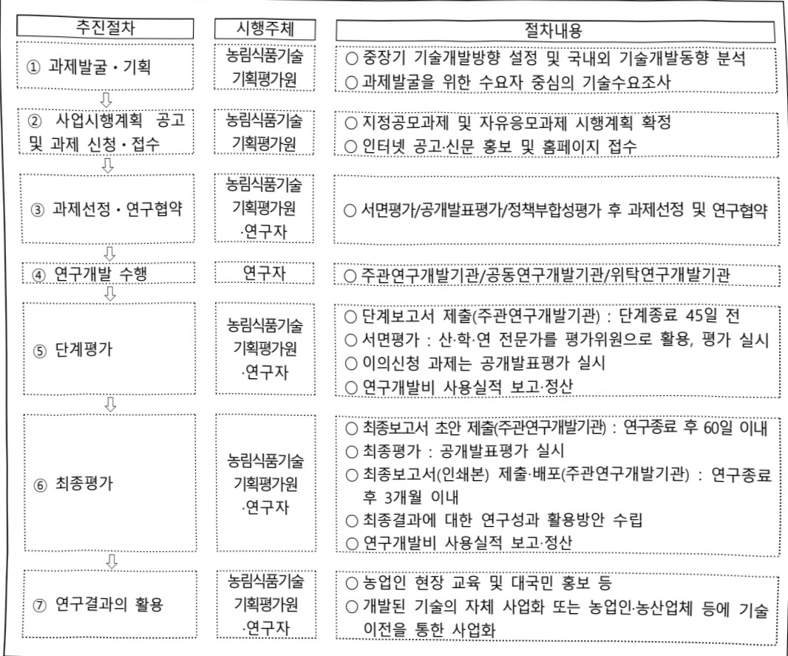

# AX기반지능형농작업협업산업화기술개발(R&D)

**해당 페이지**: PDF 2942 ~ 2948 쪽 해당

**부처**: 농림축산식품부
**분야**: 농림수산
**회계유형**: 농어촌구조 개선특별회계
**2026 확정예산**: 6975.0 백만원
**전년대비 증감률**: None%
**AI 도메인**: 로봇, 농업/식품, 디지털전환(AX)

---

<table border=1 style='margin: auto; word-wrap: break-word;'><tr><td style='text-align: center; word-wrap: break-word;'>사 업 명</td></tr><tr><td style='text-align: center; word-wrap: break-word;'>(108) AX기반지능형농작업협업산업화기술개발(R&amp;D) (2280-540)</td></tr></table>

□ 사업 코드 정보

<table border=1 style='margin: auto; word-wrap: break-word;'><tr><td style='text-align: center; word-wrap: break-word;'>구분</td><td style='text-align: center; word-wrap: break-word;'>회계</td><td style='text-align: center; word-wrap: break-word;'>소관</td><td style='text-align: center; word-wrap: break-word;'>실국(기관)</td><td style='text-align: center; word-wrap: break-word;'>계정</td><td style='text-align: center; word-wrap: break-word;'>분야</td><td style='text-align: center; word-wrap: break-word;'>부문</td></tr><tr><td style='text-align: center; word-wrap: break-word;'>코드</td><td rowspan="2">농어촌구조개선특별회계</td><td rowspan="2">농림축산식품부</td><td rowspan="2">농산업혁신정책관실</td><td rowspan="2">농어촌특별세사업계정</td><td style='text-align: center; word-wrap: break-word;'>100</td><td style='text-align: center; word-wrap: break-word;'>101</td></tr><tr><td style='text-align: center; word-wrap: break-word;'>명칭</td><td style='text-align: center; word-wrap: break-word;'>농림수산</td><td style='text-align: center; word-wrap: break-word;'>농업·농촌</td></tr></table>

<table border=1 style='margin: auto; word-wrap: break-word;'><tr><td style='text-align: center; word-wrap: break-word;'>구분</td><td style='text-align: center; word-wrap: break-word;'>프로그램</td><td style='text-align: center; word-wrap: break-word;'>단위사업</td><td style='text-align: center; word-wrap: break-word;'>세부사업</td></tr><tr><td style='text-align: center; word-wrap: break-word;'>코드</td><td style='text-align: center; word-wrap: break-word;'>2200</td><td style='text-align: center; word-wrap: break-word;'>2280</td><td style='text-align: center; word-wrap: break-word;'>540</td></tr><tr><td style='text-align: center; word-wrap: break-word;'>명칭</td><td style='text-align: center; word-wrap: break-word;'>농업신산업육성</td><td style='text-align: center; word-wrap: break-word;'>농식품기술개발</td><td style='text-align: center; word-wrap: break-word;'>AX기반지능형농작업협업산업화기술개발(R&amp;D)</td></tr></table>

사업 성격 (공통요구자료 II-1 작성유의사항 4. 참조, 해당하는 사항에 “○” 표시)

<table border=1 style='margin: auto; word-wrap: break-word;'><tr><td rowspan="2">신규</td><td rowspan="2">계속</td><td rowspan="2">완료</td><td rowspan="2">예비타당성 실시여부</td><td rowspan="2">총사업비 관리대상</td><td rowspan="2">총액계상 예산사업</td><td style='text-align: center; word-wrap: break-word;'>사업소관 변경정보</td></tr><tr><td style='text-align: center; word-wrap: break-word;'>2025예산 시 소관</td></tr><tr><td style='text-align: center; word-wrap: break-word;'>○</td><td style='text-align: center; word-wrap: break-word;'></td><td style='text-align: center; word-wrap: break-word;'></td><td style='text-align: center; word-wrap: break-word;'></td><td style='text-align: center; word-wrap: break-word;'></td><td style='text-align: center; word-wrap: break-word;'></td><td style='text-align: center; word-wrap: break-word;'></td></tr></table>

□ 사업 지원 형태 및 지원을 (최소한 한 개는 반드시 선택하시오. 해당사항에 0 표시)

<table border=1 style='margin: auto; word-wrap: break-word;'><tr><td style='text-align: center; word-wrap: break-word;'>직접</td><td style='text-align: center; word-wrap: break-word;'>출자</td><td style='text-align: center; word-wrap: break-word;'>출연</td><td style='text-align: center; word-wrap: break-word;'>보조</td><td style='text-align: center; word-wrap: break-word;'>융자</td><td style='text-align: center; word-wrap: break-word;'>국고보조율(%)</td><td style='text-align: center; word-wrap: break-word;'>융자율(%)</td></tr><tr><td style='text-align: center; word-wrap: break-word;'></td><td style='text-align: center; word-wrap: break-word;'></td><td style='text-align: center; word-wrap: break-word;'>○</td><td style='text-align: center; word-wrap: break-word;'></td><td style='text-align: center; word-wrap: break-word;'></td><td style='text-align: center; word-wrap: break-word;'></td><td style='text-align: center; word-wrap: break-word;'></td></tr></table>

## □ 사업 소관부처 및 시행주체

<table border=1 style='margin: auto; word-wrap: break-word;'><tr><td style='text-align: center; word-wrap: break-word;'>사업명</td><td colspan="2">구분</td></tr><tr><td rowspan="4">AX기반지능형 농작업협업 산업화기술 개발(R&amp;D)</td><td rowspan="3">소관부처</td><td style='text-align: center; word-wrap: break-word;'>실·국·과(팀)</td></tr><tr><td style='text-align: center; word-wrap: break-word;'>농산업혁신정책관실</td></tr><tr><td style='text-align: center; word-wrap: break-word;'>과학기술정책과</td></tr><tr><td style='text-align: center; word-wrap: break-word;'>사업시행주체</td><td style='text-align: center; word-wrap: break-word;'>농림식품기술기획평가원</td></tr></table>

---

### 가. 예산 총괄표

(단위: 백만원, %)

<table border=1 style='margin: auto; word-wrap: break-word;'><tr><td rowspan="2">사업명</td><td rowspan="2">2024년 결산</td><td colspan="2">2025년 예산</td><td colspan="2">2026년 예산</td><td rowspan="2">중감 (B-A)</td><td rowspan="2">(B-A)/A</td></tr><tr><td style='text-align: center; word-wrap: break-word;'>본예산</td><td style='text-align: center; word-wrap: break-word;'>추경(A)</td><td style='text-align: center; word-wrap: break-word;'>요구안</td><td style='text-align: center; word-wrap: break-word;'>본예산(B)</td></tr><tr><td style='text-align: center; word-wrap: break-word;'>AX기반지능형 농작업협업산업화 기술개발(R&amp;D)</td><td style='text-align: center; word-wrap: break-word;'>-</td><td style='text-align: center; word-wrap: break-word;'>-</td><td style='text-align: center; word-wrap: break-word;'>-</td><td style='text-align: center; word-wrap: break-word;'>6,975</td><td style='text-align: center; word-wrap: break-word;'>6,975</td><td style='text-align: center; word-wrap: break-word;'>6,975</td><td style='text-align: center; word-wrap: break-word;'>순증</td></tr></table>

□ 기능별(내역사업별), 예산 내역

(단위:백만원)

<table border=1 style='margin: auto; word-wrap: break-word;'><tr><td rowspan="2"></td><td colspan="5">2024</td><td colspan="5">2025</td><td rowspan="2">2026예산</td></tr><tr><td style='text-align: center; word-wrap: break-word;'>예산액(추정)</td><td style='text-align: center; word-wrap: break-word;'>예산현액</td><td style='text-align: center; word-wrap: break-word;'>집행액</td><td style='text-align: center; word-wrap: break-word;'>이월액</td><td style='text-align: center; word-wrap: break-word;'>불용액</td><td style='text-align: center; word-wrap: break-word;'>본예산</td><td style='text-align: center; word-wrap: break-word;'>예산현액</td><td style='text-align: center; word-wrap: break-word;'>집행액</td><td style='text-align: center; word-wrap: break-word;'>이월예상액</td><td style='text-align: center; word-wrap: break-word;'>불용예상액</td></tr><tr><td style='text-align: center; word-wrap: break-word;'>○ 기능별 분류(합계)</td><td style='text-align: center; word-wrap: break-word;'>-</td><td style='text-align: center; word-wrap: break-word;'>-</td><td style='text-align: center; word-wrap: break-word;'>-</td><td style='text-align: center; word-wrap: break-word;'>-</td><td style='text-align: center; word-wrap: break-word;'>-</td><td style='text-align: center; word-wrap: break-word;'>-</td><td style='text-align: center; word-wrap: break-word;'>-</td><td style='text-align: center; word-wrap: break-word;'>-</td><td style='text-align: center; word-wrap: break-word;'>-</td><td style='text-align: center; word-wrap: break-word;'>-</td><td style='text-align: center; word-wrap: break-word;'>6,975</td></tr><tr><td style='text-align: center; word-wrap: break-word;'>·농작업협업로봇기술개발·농작업드론활용기술개발</td><td style='text-align: center; word-wrap: break-word;'>-</td><td style='text-align: center; word-wrap: break-word;'>-</td><td style='text-align: center; word-wrap: break-word;'>-</td><td style='text-align: center; word-wrap: break-word;'>-</td><td style='text-align: center; word-wrap: break-word;'>-</td><td style='text-align: center; word-wrap: break-word;'>-</td><td style='text-align: center; word-wrap: break-word;'>-</td><td style='text-align: center; word-wrap: break-word;'>-</td><td style='text-align: center; word-wrap: break-word;'>-</td><td style='text-align: center; word-wrap: break-word;'>-</td><td style='text-align: center; word-wrap: break-word;'>5,400</td></tr><tr><td style='text-align: center; word-wrap: break-word;'>○ 비목별 분류(합계)</td><td style='text-align: center; word-wrap: break-word;'>-</td><td style='text-align: center; word-wrap: break-word;'>-</td><td style='text-align: center; word-wrap: break-word;'>-</td><td style='text-align: center; word-wrap: break-word;'>-</td><td style='text-align: center; word-wrap: break-word;'>-</td><td style='text-align: center; word-wrap: break-word;'>-</td><td style='text-align: center; word-wrap: break-word;'>-</td><td style='text-align: center; word-wrap: break-word;'>-</td><td style='text-align: center; word-wrap: break-word;'>-</td><td style='text-align: center; word-wrap: break-word;'>-</td><td style='text-align: center; word-wrap: break-word;'>6,975</td></tr><tr><td style='text-align: center; word-wrap: break-word;'>·연구개발활동비등(360-05)</td><td style='text-align: center; word-wrap: break-word;'>-</td><td style='text-align: center; word-wrap: break-word;'>-</td><td style='text-align: center; word-wrap: break-word;'>-</td><td style='text-align: center; word-wrap: break-word;'>-</td><td style='text-align: center; word-wrap: break-word;'>-</td><td style='text-align: center; word-wrap: break-word;'>-</td><td style='text-align: center; word-wrap: break-word;'>-</td><td style='text-align: center; word-wrap: break-word;'>-</td><td style='text-align: center; word-wrap: break-word;'>-</td><td style='text-align: center; word-wrap: break-word;'>-</td><td style='text-align: center; word-wrap: break-word;'>6,975</td></tr><tr><td style='text-align: center; word-wrap: break-word;'>○ 기능비목별 분류(합계)</td><td style='text-align: center; word-wrap: break-word;'>-</td><td style='text-align: center; word-wrap: break-word;'>-</td><td style='text-align: center; word-wrap: break-word;'>-</td><td style='text-align: center; word-wrap: break-word;'>-</td><td style='text-align: center; word-wrap: break-word;'>-</td><td style='text-align: center; word-wrap: break-word;'>-</td><td style='text-align: center; word-wrap: break-word;'>-</td><td style='text-align: center; word-wrap: break-word;'>-</td><td style='text-align: center; word-wrap: break-word;'>-</td><td style='text-align: center; word-wrap: break-word;'>-</td><td style='text-align: center; word-wrap: break-word;'>6,975</td></tr><tr><td rowspan="3">·농작업협업로봇기술개발·연구개발활동비등(360-05)·농작업협업로봇기술개발·연구개발활동비등(360-05)</td><td style='text-align: center; word-wrap: break-word;'>-</td><td style='text-align: center; word-wrap: break-word;'>-</td><td style='text-align: center; word-wrap: break-word;'>-</td><td style='text-align: center; word-wrap: break-word;'>-</td><td style='text-align: center; word-wrap: break-word;'>-</td><td style='text-align: center; word-wrap: break-word;'>-</td><td style='text-align: center; word-wrap: break-word;'>-</td><td style='text-align: center; word-wrap: break-word;'>-</td><td style='text-align: center; word-wrap: break-word;'>-</td><td style='text-align: center; word-wrap: break-word;'>-</td><td style='text-align: center; word-wrap: break-word;'>5,400</td></tr><tr><td style='text-align: center; word-wrap: break-word;'>-</td><td style='text-align: center; word-wrap: break-word;'>-</td><td style='text-align: center; word-wrap: break-word;'>-</td><td style='text-align: center; word-wrap: break-word;'>-</td><td style='text-align: center; word-wrap: break-word;'>-</td><td style='text-align: center; word-wrap: break-word;'>-</td><td style='text-align: center; word-wrap: break-word;'>-</td><td style='text-align: center; word-wrap: break-word;'>-</td><td style='text-align: center; word-wrap: break-word;'>-</td><td style='text-align: center; word-wrap: break-word;'>-</td><td style='text-align: center; word-wrap: break-word;'>1,575</td></tr><tr><td style='text-align: center; word-wrap: break-word;'>-</td><td style='text-align: center; word-wrap: break-word;'>-</td><td style='text-align: center; word-wrap: break-word;'>-</td><td style='text-align: center; word-wrap: break-word;'>-</td><td style='text-align: center; word-wrap: break-word;'>-</td><td style='text-align: center; word-wrap: break-word;'>-</td><td style='text-align: center; word-wrap: break-word;'>-</td><td style='text-align: center; word-wrap: break-word;'>-</td><td style='text-align: center; word-wrap: break-word;'>-</td><td style='text-align: center; word-wrap: break-word;'>-</td><td style='text-align: center; word-wrap: break-word;'>1,575</td></tr></table>

---

### 나. 사업설명자료

## 1 ) 사업목적·내용

- (AX기반지능형농작업협업산업화기술개발) 농업·농촌 노동력 감소 난제 해결을 위해, 인공지능 전환(AX), 로봇 전환(RX) 기술 기반의 농업 로봇·드론 활용 및 협업기술 산업화 - (농작업협업로봇기술개발) 인력 중심의 고난이도·고강도 농작업을 로봇이 대체· 긴어왔 수 있도록 활용 기술 고도화

- (농작업드론활용기술개발) 농업 투입 인력 최소화를 위해 드론을 활용한 농작업자동화 및 지능화 기술 고도화

## 2 ) 사업개요

## □ 사업근거 및 추진경위

① 법령상 근거 조항 적시

-「농업·농촌 및 식품산업 기본법」제28조(농업 관련 조합법인 및 회사법인의 육성) 국가와 지방자치단체는 농업의 생산성 향상과 농산물의 출하·유통·가공·판매·수출 등의 효율화를 위하여 협업적 또는 기업적 농업경영을 수행하는 영농조합법인(쯤뿐組合法人) 및 농업회사법인(뿔業會社法人)의 육성에 필요한 정책을 수립·시행하여야 한다.

- 「농업·농촌 및 식품산업 기본법」제35조(농업 및 식품 관련 기술·연구 등의 진흥)

① 국가와 지방자치단체는 농업 및 식품 관련 산업의 생산성 및 경쟁력 향상을 위하여 농업 생산기술, 농업 생산기반 정비기술, 농산물 생산 이후의 관리기술, 농업 경영기법, 농업인 안전작업기술, 농산물 유통기술, 농산물 가공·식품 제조기술 및 음식물 조리법 등에 관한 연구·개발·보급과 농업 및 식품산업 현장연구, ‘산학연 공동연구 및 연구평가 관리체제의 확립 등에 관한 종합적인 계획을 세우고 시행하여야 한다.

- [농업·농촌 및 식품산업 기본법] 제36조(농업 및 식품 관련 산업의 기술개발 추진)

① 국가와 지방자치단체는 농업 및 식품 관련 산업의 기술 등을 신속하게 개발·보급하기 위하여 관련 연구기관 또는 단체 등에 농업 및 식품 관련 산업의 기술개발 연구를 수행하게 할 수 있다. ② 국가와 지방자치단체는 제1항에 따라 농업 및 식품 관련 산업의 기술개발 연구를 수행하는 관련 연구기관 또는 단체 등에 대하여 필요한 자금을 지원할 수 있다.

-「농림식품과학기술 육성법」제6조(연구개발사업의 추진) ① 정부는 종합계획 및 시행계획을 효율적으로 추진하기 위하여 농림식품과학기술 연구개발사업을 하다.

---

② 추진경위

- '노지농업디지털전환기술개발'사업 예비타당성조사 요구('22. 6.)

- '노지농업디지털전환기술개발'사업 예타 최종 미시행('23. 3.)

- '25년도 신규 '지능형농작업기계개발'사업 기획 착수('24. 1.)

- '지능형농작업기계개발'사업 최종 미반영(과기부)('24. 5.)

- 부·청 ‘농식품 연구개발 공동기획단’ 출범(24.7.)

- 농식품부·농진청 지능형 농작업 분야 신규사업 협의('25. 1.~5.)

- '지능형 농작업' 분야 신규사업 기획을 위한 기획자문단 구성 및 기획회의 추진('25. 1.~5.)

## «관련 주요 공약》

(2.성장) 1. AI 등 신산업 집중 육성

- 16. 글로벌 4대 첨단제조 강국 도약을 위해 혁신선도형 첨단사업구조로의 대전환을 추진(디지털 전환(DX)·인공지능 전환(AX) 가속화로 산업 생태계 혁신 추진)

(2.성장) 4. 국가균형발전

- 18. 스마트 데이터농업 확산, 푸드테크·그린바이오 산업 육성, K-푸드 수출 확대, R&D 강화로 농업을 미래농산업으로 전환(스마트팜, 농기계(자율주행, AI), 동물용의약품 등 육성 및 수출 확대)

□ 주요내용

① 사업규모

- 종사업비 : 해당없음

- 사업기간 : '26~'30

- 최근 5년 간 투입된 사업비(예산액기준, 추경편성한 연도에는 추경포함)

<table border=1 style='margin: auto; word-wrap: break-word;'><tr><td style='text-align: center; word-wrap: break-word;'>$ H_{2}O $</td><td style='text-align: center; word-wrap: break-word;'>2022</td><td style='text-align: center; word-wrap: break-word;'>2023</td><td style='text-align: center; word-wrap: break-word;'>2024</td><td style='text-align: center; word-wrap: break-word;'>2025</td><td style='text-align: center; word-wrap: break-word;'>2026</td></tr><tr><td style='text-align: center; word-wrap: break-word;'>사업비</td><td style='text-align: center; word-wrap: break-word;'>-</td><td style='text-align: center; word-wrap: break-word;'>-</td><td style='text-align: center; word-wrap: break-word;'>-</td><td style='text-align: center; word-wrap: break-word;'>-</td><td style='text-align: center; word-wrap: break-word;'>6,975</td></tr></table>

-기타:해당 없음

② 사업추진체계

- 사업시행방법 : 출연 100%(대기업 50%, 중견기업 30%, 중소기업 25% 이상 매칭)

- 사업시행주체 : 농림식품기술기획평가원

- 사업 수혜자 : 농산업체, 대학, 연구소, 기업, 농업회사법인 등

---

- 보조, 융자, 출연, 출자 등의 경우 보조·융자 등 지원 비율 및 법적근거

<table border=1 style='margin: auto; word-wrap: break-word;'><tr><td style='text-align: center; word-wrap: break-word;'>내역사업명</td><td style='text-align: center; word-wrap: break-word;'>구분</td><td style='text-align: center; word-wrap: break-word;'>피보조·피출연 등 기관명</td><td style='text-align: center; word-wrap: break-word;'>지원 금액 (2026예산)</td><td style='text-align: center; word-wrap: break-word;'>지원 비율(%)</td><td style='text-align: center; word-wrap: break-word;'>보조율 법적근거 (해당 조항)</td></tr><tr><td style='text-align: center; word-wrap: break-word;'>농작업협업로봇기술개발</td><td style='text-align: center; word-wrap: break-word;'>출연</td><td style='text-align: center; word-wrap: break-word;'>농림식품기술기획평가원</td><td style='text-align: center; word-wrap: break-word;'>5,400백만원</td><td style='text-align: center; word-wrap: break-word;'>100</td><td style='text-align: center; word-wrap: break-word;'>농림식품과학기술육성법 제6조</td></tr><tr><td style='text-align: center; word-wrap: break-word;'>농작업드론활용기술개발</td><td style='text-align: center; word-wrap: break-word;'>출연</td><td style='text-align: center; word-wrap: break-word;'>농림식품기술기획평가원</td><td style='text-align: center; word-wrap: break-word;'>1,575백만원</td><td style='text-align: center; word-wrap: break-word;'>100</td><td style='text-align: center; word-wrap: break-word;'>농림식품과학기술육성법 제6조</td></tr></table>

## 3 ) 2026년도 예산 산출 근거

① 농작업협업로봇기술개발: (25) - → (26예산) 5,400백만원, 순증

- (편성) 관련 정책*에 따라 농업·농촌 인력 부족 해결을 위해 고난이도·고강도 농작업을 로봇으로 대체·협업할 수 있는 핵심기술 개발을 위한 예산 5,400백만원 요구

* 제1차 스마트농업 육성 기본계획('25.1.) : 농업용 드론·로봇 등 노지 스마트농업 신기술 개발 지원을 통한 K-스마트농업 기술·모델 구축 R&D 강화

- (산출) (신규) 7개 × 1,028백만 × 9/12개월 = 5,400백만원

② 농작업드론활용기술개발: (25) - → (26예산) 1,575백만원, 순증

- (편성) 관련 정책에 따라 농업 투입 인력 최소화를 위한 드론 활용한 농작업 자동화·지능화 기술의 고도화를 위한 예산 1,575백만원 요구

* 제1차 스마트농업 육성 기본계획('25.1.) : 농업용 드론·로봇 등 노지 스마트농업 신기술 개발 지원을 통한 K-스마트농업 기술·모델 구축 R&D 강화

- (산출) (신규) 3개 × 700백만 × 9/12개월 = 1,575백만원

0 2025년도 예산 및 2026년도 예산 산출 세부내역 비교

<table border=1 style='margin: auto; word-wrap: break-word;'><tr><td colspan="2">&#x27;25년 본예산</td><td colspan="2">&#x27;26년 예산</td></tr><tr><td style='text-align: center; word-wrap: break-word;'>예산</td><td style='text-align: center; word-wrap: break-word;'>산출내역</td><td style='text-align: center; word-wrap: break-word;'>예산</td><td style='text-align: center; word-wrap: break-word;'>산출내역</td></tr><tr><td style='text-align: center; word-wrap: break-word;'>-</td><td style='text-align: center; word-wrap: break-word;'>-</td><td style='text-align: center; word-wrap: break-word;'>6,975</td><td style='text-align: center; word-wrap: break-word;'>○ 연구개발활동비등(360-05): 6,975백만원 가. 농작업협업로봇기술개발 (5,400백만원) • (신규) 7개×1,028백만×9/12개월=5,400백만원 나. 농작업드론활용기술개발 (1,575백만원) • (신규) 3개×700백만×9/12개월=1,575백만원</td></tr></table>

---

## 4 ) 사업효과

☐ 사업영향, 산출물 성과지표 등

①2022~2026년도 성과계획서 상 성과지표 및 최근 5년간 성과 달성도

* 사업 기획보고서 상의 사업 착수 3년 후부터 성과목표를 제시하였으며, 추후 전략계획서내 성과지표로 반영 예정

(단위:백만원)

<table border=1 style='margin: auto; word-wrap: break-word;'><tr><td rowspan="2">성과 지표명</td><td colspan="8">목표치</td></tr><tr><td style='text-align: center; word-wrap: break-word;'>2026년</td><td style='text-align: center; word-wrap: break-word;'>2027년</td><td style='text-align: center; word-wrap: break-word;'>2028년</td><td style='text-align: center; word-wrap: break-word;'>2029년</td><td style='text-align: center; word-wrap: break-word;'>2030년</td><td style='text-align: center; word-wrap: break-word;'>2031년</td><td style='text-align: center; word-wrap: break-word;'>2032년</td><td style='text-align: center; word-wrap: break-word;'>합계</td></tr><tr><td style='text-align: center; word-wrap: break-word;'>논문 성과의 우수성</td><td style='text-align: center; word-wrap: break-word;'>-</td><td style='text-align: center; word-wrap: break-word;'>-</td><td style='text-align: center; word-wrap: break-word;'>73.01</td><td style='text-align: center; word-wrap: break-word;'>74.47</td><td style='text-align: center; word-wrap: break-word;'>75.96</td><td style='text-align: center; word-wrap: break-word;'>77.48</td><td style='text-align: center; word-wrap: break-word;'>79.03</td><td style='text-align: center; word-wrap: break-word;'>-</td></tr><tr><td style='text-align: center; word-wrap: break-word;'>특허 성과의 우수성</td><td style='text-align: center; word-wrap: break-word;'>-</td><td style='text-align: center; word-wrap: break-word;'>-</td><td style='text-align: center; word-wrap: break-word;'>4.11</td><td style='text-align: center; word-wrap: break-word;'>4.19</td><td style='text-align: center; word-wrap: break-word;'>4.28</td><td style='text-align: center; word-wrap: break-word;'>4.36</td><td style='text-align: center; word-wrap: break-word;'>4.45</td><td style='text-align: center; word-wrap: break-word;'>-</td></tr><tr><td style='text-align: center; word-wrap: break-word;'>우수 기술이전 건수</td><td style='text-align: center; word-wrap: break-word;'>-</td><td style='text-align: center; word-wrap: break-word;'>-</td><td style='text-align: center; word-wrap: break-word;'>1</td><td style='text-align: center; word-wrap: break-word;'>1</td><td style='text-align: center; word-wrap: break-word;'>1</td><td style='text-align: center; word-wrap: break-word;'>1</td><td style='text-align: center; word-wrap: break-word;'>1</td><td style='text-align: center; word-wrap: break-word;'>5</td></tr><tr><td style='text-align: center; word-wrap: break-word;'>농작업 로봇 핵심기술 개발 건수</td><td style='text-align: center; word-wrap: break-word;'>-</td><td style='text-align: center; word-wrap: break-word;'>2</td><td style='text-align: center; word-wrap: break-word;'>4</td><td style='text-align: center; word-wrap: break-word;'>6</td><td style='text-align: center; word-wrap: break-word;'>8</td><td style='text-align: center; word-wrap: break-word;'>-</td><td style='text-align: center; word-wrap: break-word;'>-</td><td style='text-align: center; word-wrap: break-word;'>-</td></tr><tr><td style='text-align: center; word-wrap: break-word;'>특허등록 건수</td><td style='text-align: center; word-wrap: break-word;'>-</td><td style='text-align: center; word-wrap: break-word;'>-</td><td style='text-align: center; word-wrap: break-word;'>3</td><td style='text-align: center; word-wrap: break-word;'>7</td><td style='text-align: center; word-wrap: break-word;'>12</td><td style='text-align: center; word-wrap: break-word;'>-</td><td style='text-align: center; word-wrap: break-word;'>-</td><td style='text-align: center; word-wrap: break-word;'>-</td></tr><tr><td style='text-align: center; word-wrap: break-word;'>기술이전 건수</td><td style='text-align: center; word-wrap: break-word;'>-</td><td style='text-align: center; word-wrap: break-word;'>3</td><td style='text-align: center; word-wrap: break-word;'>6</td><td style='text-align: center; word-wrap: break-word;'>9</td><td style='text-align: center; word-wrap: break-word;'>14</td><td style='text-align: center; word-wrap: break-word;'>-</td><td style='text-align: center; word-wrap: break-word;'>-</td><td style='text-align: center; word-wrap: break-word;'>-</td></tr></table>

<table border=1 style='margin: auto; word-wrap: break-word;'><tr><td colspan="2">옥표시 실정방법 및 근거</td></tr><tr><td style='text-align: center; word-wrap: break-word;'>논문 성과의 우수성 (단위: 잠)</td><td style='text-align: center; word-wrap: break-word;'>○ 해당 사업을 통해 발표된 논문의 질적 수준을, 게재 논문의 표준화된 순위보정 영향력 지수(mrnIF, 0~100점) 평균값으로 평가 * 표준화된 순위보정 영향력 지수(mrnIF) : 100인 경우 해당 학술지가 해당 분야에서 가장 우수한 학술지임을 의미하고, 0인 경우 가장 낮은 순위의 학술지임을 의미</td></tr><tr><td style='text-align: center; word-wrap: break-word;'>특허 성과의 우수성 (단위: 점)</td><td style='text-align: center; word-wrap: break-word;'>○ 해당 사업을 통해 등록된 특허의 질적 수준을, SMART 특허 지수(1~9점) 평균값으로 평가 * SMART : C등급부터 AAA까지 9등급으로 구분하여 제공하며, 가장 낮은 등급인 C는 1점 가장 높은 등급인 AAA에는 9점을 부여</td></tr><tr><td style='text-align: center; word-wrap: break-word;'>우수 기술이전 건수 (단위: 건)</td><td style='text-align: center; word-wrap: break-word;'>○ 연도별 기술료 5,000만 원 이상 계약 체결된 기술이전 건수 * 일정금액 이상인 경우로 한정하고 기술이전 계약서 기준으로 판단(계약액으로 질적 우수성 판단 가능)</td></tr><tr><td style='text-align: center; word-wrap: break-word;'>농작업 로봇 핵심기술 개발 건수 (단위: 건, 누계)</td><td style='text-align: center; word-wrap: break-word;'>○ 신규지표임을 감안하여 최종 목표치인 8종을 기준으로 연구 개발 난이도, 기술수준을 고려하여 연차별 목표치 설정 * (측정산식) 농작업 로봇 핵심기술개발 건수 = ∑환경인식모델(최종 4종) + 농작업 의사결정 솔루션(최종 4종) 개발 건수 * (자료출처) 공인인증 성적 및 전문가 평가, 메모보고, 공문 등</td></tr><tr><td style='text-align: center; word-wrap: break-word;'>특허등록 건수 (단위: 건, 누계)</td><td style='text-align: center; word-wrap: break-word;'>○ 신규지표임을 감안하여 최종 목표치인 12건을 기준으로 연차별 목표치 설정 * (측정산식) 특허등록 건수 = ∑농업로봇 관련 특허 등록(최종 12건) 건수 * (자료출처) 특허등록증, IRIS 등록 성과 등</td></tr><tr><td style='text-align: center; word-wrap: break-word;'>기술이전 건수 (단위: 건, 누계)</td><td style='text-align: center; word-wrap: break-word;'>○ 신규지표임을 감안하여 최종 목표치인 14건을 기준으로 연차별 목표치 설정 * (측정산식) 기술이전 건수 = ∑환경인식모델, 농작업 의사결정 솔루션 등 개발기술에 대한 기술이전(최종 14건) 건수 * (자료출처) 기술이전 계약서 사본 및 기술료 수입증빙 자료 등</td></tr></table>

② 성과지표 이외의 연도별 사업추진 경과 및 실적 : 해당 없음('26년 신규)

---

③ 향후(2026년도 이후) 기대효과

- 인력 중심의 농작업을 인공지능 기술로 전환하여 농업 생산성 향상, 관련 비용 절감, 품질 향상 등을 통해 경제적 효과 극대화

- 지능형 농작업기계(농기계, 드론, 로봇 등) 도입을 통해 자동화·첨단화 촉진으로 노동력 부족 문제 해소 및 생산성 증가 기대

5) 타당성조사 및 예비타당성조사 시행여부 및 결과 요지 : 해당 없음

6) 총사업비 대상사업 정보 : 해당 없음

7) 사업 집행절차

8) 각종 평가 : 해당 없음

다. 최근 4년간 결산내역 : 해당 없음('26년 신규)

---

### 원본 PDF 크롭 이미지

