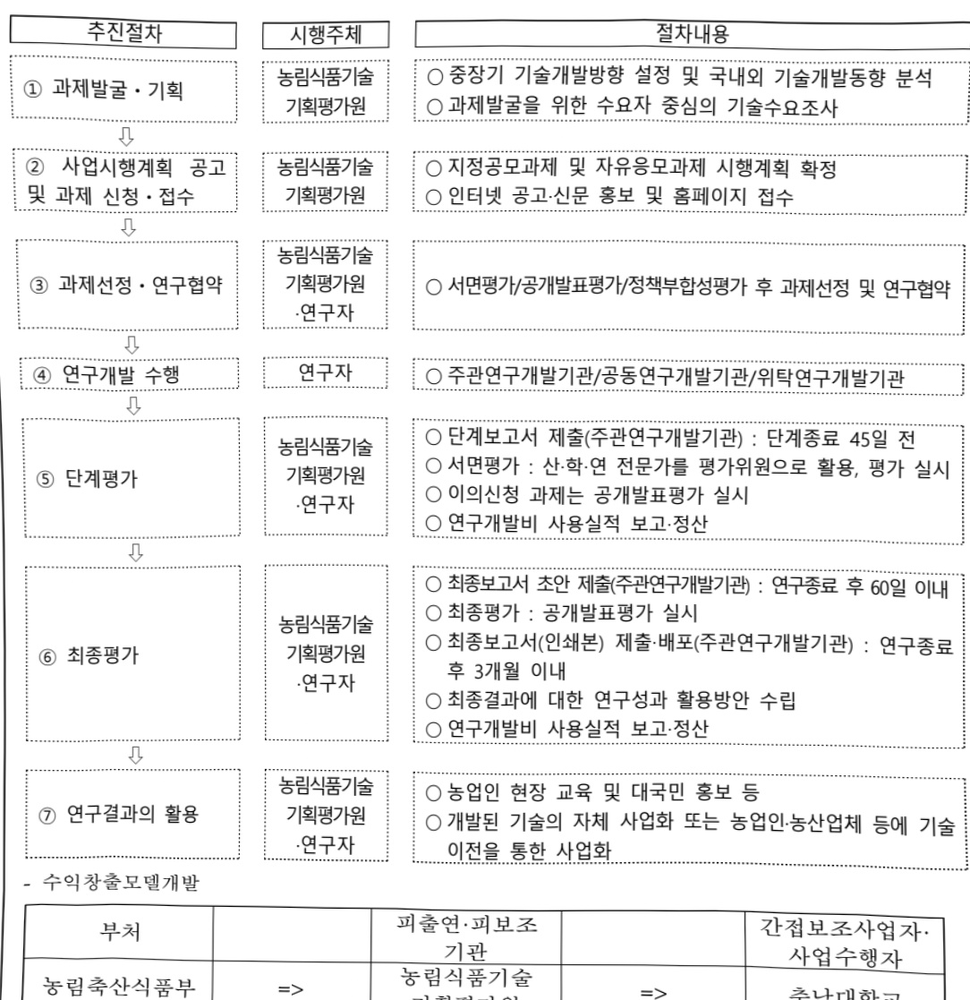

# K-수직농장세계화프로젝트(R&D)

**해당 페이지**: PDF 2949 ~ 2957 쪽 해당

**부처**: 농림축산식품부
**분야**: 농림수산
**회계유형**: 농어촌구조 개선특별회계
**2026 확정예산**: 8200.0 백만원
**전년대비 증감률**: 33.3%
**AI 도메인**: 농업/식품

---

<table border=1 style='margin: auto; word-wrap: break-word;'><tr><td style='text-align: center; word-wrap: break-word;'>사 업 명</td></tr><tr><td style='text-align: center; word-wrap: break-word;'>(103) K-수직농장세계화프로젝트(R&amp;D) (2280-523)</td></tr></table>

□ 사업 코드 정보

<table border=1 style='margin: auto; word-wrap: break-word;'><tr><td style='text-align: center; word-wrap: break-word;'>구분</td><td style='text-align: center; word-wrap: break-word;'>회계</td><td style='text-align: center; word-wrap: break-word;'>소관</td><td style='text-align: center; word-wrap: break-word;'>실국(기관)</td><td style='text-align: center; word-wrap: break-word;'>계정</td><td style='text-align: center; word-wrap: break-word;'>분야</td><td style='text-align: center; word-wrap: break-word;'>부문</td></tr><tr><td style='text-align: center; word-wrap: break-word;'>코드</td><td style='text-align: center; word-wrap: break-word;'>농어촌구조</td><td rowspan="2">농림축산식품부</td><td rowspan="2">농산업혁신정책관실</td><td style='text-align: center; word-wrap: break-word;'>농어촌특별세</td><td style='text-align: center; word-wrap: break-word;'>100</td><td style='text-align: center; word-wrap: break-word;'>101</td></tr><tr><td style='text-align: center; word-wrap: break-word;'>명칭</td><td style='text-align: center; word-wrap: break-word;'>개선특별회계</td><td style='text-align: center; word-wrap: break-word;'>사업계정</td><td style='text-align: center; word-wrap: break-word;'>농림수산</td><td style='text-align: center; word-wrap: break-word;'>농업·농촌</td></tr></table>

<table border=1 style='margin: auto; word-wrap: break-word;'><tr><td style='text-align: center; word-wrap: break-word;'>구분</td><td style='text-align: center; word-wrap: break-word;'>프로그램</td><td style='text-align: center; word-wrap: break-word;'>단위사업</td><td style='text-align: center; word-wrap: break-word;'>세부사업</td></tr><tr><td style='text-align: center; word-wrap: break-word;'>코드</td><td style='text-align: center; word-wrap: break-word;'>2200</td><td style='text-align: center; word-wrap: break-word;'>2280</td><td style='text-align: center; word-wrap: break-word;'>523</td></tr><tr><td style='text-align: center; word-wrap: break-word;'>명칭</td><td style='text-align: center; word-wrap: break-word;'>농업신산업육성</td><td style='text-align: center; word-wrap: break-word;'>농식품기술개발(농특)</td><td style='text-align: center; word-wrap: break-word;'>K-수직농장세계화프로젝트(R&amp;D)</td></tr></table>

□ 사업 성격 (공통요구자료 11-1 작성유의사항 4. 참조, 해당하는 사항에 “0” 표시)

<table border=1 style='margin: auto; word-wrap: break-word;'><tr><td rowspan="2">신규</td><td rowspan="2">계속</td><td rowspan="2">완료</td><td rowspan="2">예비타당성 실시여부</td><td rowspan="2">총사업비 관리대상</td><td rowspan="2">총액계상 예산사업</td><td style='text-align: center; word-wrap: break-word;'>사업소관 변경정보</td></tr><tr><td style='text-align: center; word-wrap: break-word;'>2025예산 시 소관</td></tr><tr><td style='text-align: center; word-wrap: break-word;'></td><td style='text-align: center; word-wrap: break-word;'>O</td><td style='text-align: center; word-wrap: break-word;'></td><td style='text-align: center; word-wrap: break-word;'></td><td style='text-align: center; word-wrap: break-word;'></td><td style='text-align: center; word-wrap: break-word;'></td><td style='text-align: center; word-wrap: break-word;'></td></tr></table>

□ 사업 지원 형태 및 지원을 (최소한 한 개는 반드시 선택하시오. 해당사항에 O 표시)

<table border=1 style='margin: auto; word-wrap: break-word;'><tr><td style='text-align: center; word-wrap: break-word;'>직접</td><td style='text-align: center; word-wrap: break-word;'>출자</td><td style='text-align: center; word-wrap: break-word;'>출연</td><td style='text-align: center; word-wrap: break-word;'>보조</td><td style='text-align: center; word-wrap: break-word;'>융자</td><td style='text-align: center; word-wrap: break-word;'>국고보조율(%)</td><td style='text-align: center; word-wrap: break-word;'>융자율(%)</td></tr><tr><td style='text-align: center; word-wrap: break-word;'></td><td style='text-align: center; word-wrap: break-word;'></td><td style='text-align: center; word-wrap: break-word;'>O</td><td style='text-align: center; word-wrap: break-word;'></td><td style='text-align: center; word-wrap: break-word;'></td><td style='text-align: center; word-wrap: break-word;'></td><td style='text-align: center; word-wrap: break-word;'></td></tr></table>

## □ 사업 소관부처 및 시행주체

<table border=1 style='margin: auto; word-wrap: break-word;'><tr><td style='text-align: center; word-wrap: break-word;'>사업명</td><td colspan="2">구분</td></tr><tr><td rowspan="4">K-수직농장세계화 프로젝트 (R&amp;D)</td><td rowspan="3">소관부처</td><td style='text-align: center; word-wrap: break-word;'>실·국·과(팀)</td></tr><tr><td style='text-align: center; word-wrap: break-word;'>농산업혁신정책관실</td></tr><tr><td style='text-align: center; word-wrap: break-word;'>과학기술정책과</td></tr><tr><td style='text-align: center; word-wrap: break-word;'>사업시행주체</td><td style='text-align: center; word-wrap: break-word;'>농림식품기술기획평가원</td></tr></table>

---

### 가.예산 총괄표

(단위: 백만원, %)

<table border=1 style='margin: auto; word-wrap: break-word;'><tr><td rowspan="2">사업명</td><td rowspan="2">2024년 결산</td><td colspan="2">2025년 예산</td><td colspan="2">2026년 예산</td><td rowspan="2">증감 (B-A)</td><td rowspan="2">(B-A)/A</td></tr><tr><td style='text-align: center; word-wrap: break-word;'>본예산</td><td style='text-align: center; word-wrap: break-word;'>추경(A)</td><td style='text-align: center; word-wrap: break-word;'>요구안</td><td style='text-align: center; word-wrap: break-word;'>본예산(B)</td></tr><tr><td style='text-align: center; word-wrap: break-word;'>K-수직농장세계화 프로젝트(R&amp;D)</td><td style='text-align: center; word-wrap: break-word;'>-</td><td style='text-align: center; word-wrap: break-word;'>6,150</td><td style='text-align: center; word-wrap: break-word;'>6,150</td><td style='text-align: center; word-wrap: break-word;'>8,200</td><td style='text-align: center; word-wrap: break-word;'>8,200</td><td style='text-align: center; word-wrap: break-word;'>2,050</td><td style='text-align: center; word-wrap: break-word;'>33.3</td></tr></table>

□ 기능별(내역사업별), 예산 내역

(단위:백만원)

<table border=1 style='margin: auto; word-wrap: break-word;'><tr><td rowspan="2"></td><td colspan="5">2024</td><td colspan="5">2025</td><td rowspan="2">2026예산</td></tr><tr><td style='text-align: center; word-wrap: break-word;'>예산액(추경)</td><td style='text-align: center; word-wrap: break-word;'>예산현액</td><td style='text-align: center; word-wrap: break-word;'>집행액</td><td style='text-align: center; word-wrap: break-word;'>이월액</td><td style='text-align: center; word-wrap: break-word;'>불용액</td><td style='text-align: center; word-wrap: break-word;'>분예산</td><td style='text-align: center; word-wrap: break-word;'>예산현액</td><td style='text-align: center; word-wrap: break-word;'>집행액</td><td style='text-align: center; word-wrap: break-word;'>이월예상액</td><td style='text-align: center; word-wrap: break-word;'>불용예상액</td></tr><tr><td style='text-align: center; word-wrap: break-word;'>○ 기능별 분류(합계)</td><td style='text-align: center; word-wrap: break-word;'>-</td><td style='text-align: center; word-wrap: break-word;'>-</td><td style='text-align: center; word-wrap: break-word;'>-</td><td style='text-align: center; word-wrap: break-word;'>-</td><td style='text-align: center; word-wrap: break-word;'>-</td><td style='text-align: center; word-wrap: break-word;'>6,150</td><td style='text-align: center; word-wrap: break-word;'>6,150</td><td style='text-align: center; word-wrap: break-word;'>6,150[6,150]</td><td style='text-align: center; word-wrap: break-word;'>-</td><td style='text-align: center; word-wrap: break-word;'>-</td><td style='text-align: center; word-wrap: break-word;'>8,200</td></tr><tr><td style='text-align: center; word-wrap: break-word;'>·수익창출모델개발</td><td style='text-align: center; word-wrap: break-word;'>-</td><td style='text-align: center; word-wrap: break-word;'>-</td><td style='text-align: center; word-wrap: break-word;'>-</td><td style='text-align: center; word-wrap: break-word;'>-</td><td style='text-align: center; word-wrap: break-word;'>-</td><td style='text-align: center; word-wrap: break-word;'>2,400</td><td style='text-align: center; word-wrap: break-word;'>2,400</td><td style='text-align: center; word-wrap: break-word;'>2,400[2,400]</td><td style='text-align: center; word-wrap: break-word;'>-</td><td style='text-align: center; word-wrap: break-word;'>-</td><td style='text-align: center; word-wrap: break-word;'>3,200</td></tr><tr><td style='text-align: center; word-wrap: break-word;'>·K-수직농장 수출모델 개발</td><td style='text-align: center; word-wrap: break-word;'>-</td><td style='text-align: center; word-wrap: break-word;'>-</td><td style='text-align: center; word-wrap: break-word;'>-</td><td style='text-align: center; word-wrap: break-word;'>-</td><td style='text-align: center; word-wrap: break-word;'>-</td><td style='text-align: center; word-wrap: break-word;'>3,750</td><td style='text-align: center; word-wrap: break-word;'>3,750</td><td style='text-align: center; word-wrap: break-word;'>3,750[3,750]</td><td style='text-align: center; word-wrap: break-word;'>-</td><td style='text-align: center; word-wrap: break-word;'>-</td><td style='text-align: center; word-wrap: break-word;'>5,000</td></tr><tr><td style='text-align: center; word-wrap: break-word;'>○ 비목별 분류(합계)</td><td style='text-align: center; word-wrap: break-word;'>-</td><td style='text-align: center; word-wrap: break-word;'>-</td><td style='text-align: center; word-wrap: break-word;'>-</td><td style='text-align: center; word-wrap: break-word;'>-</td><td style='text-align: center; word-wrap: break-word;'>-</td><td style='text-align: center; word-wrap: break-word;'>6,150</td><td style='text-align: center; word-wrap: break-word;'>6,150</td><td style='text-align: center; word-wrap: break-word;'>6,150[6,150]</td><td style='text-align: center; word-wrap: break-word;'>-</td><td style='text-align: center; word-wrap: break-word;'>-</td><td style='text-align: center; word-wrap: break-word;'>8,200</td></tr><tr><td style='text-align: center; word-wrap: break-word;'>·연구개발활동비등(360-05)</td><td style='text-align: center; word-wrap: break-word;'>-</td><td style='text-align: center; word-wrap: break-word;'>-</td><td style='text-align: center; word-wrap: break-word;'>-</td><td style='text-align: center; word-wrap: break-word;'>-</td><td style='text-align: center; word-wrap: break-word;'>-</td><td style='text-align: center; word-wrap: break-word;'>6,150</td><td style='text-align: center; word-wrap: break-word;'>6,150</td><td style='text-align: center; word-wrap: break-word;'>6,150[6,150]</td><td style='text-align: center; word-wrap: break-word;'>-</td><td style='text-align: center; word-wrap: break-word;'>-</td><td style='text-align: center; word-wrap: break-word;'>8,200</td></tr><tr><td style='text-align: center; word-wrap: break-word;'>○ 기능비목별 분류(합계)</td><td style='text-align: center; word-wrap: break-word;'>-</td><td style='text-align: center; word-wrap: break-word;'>-</td><td style='text-align: center; word-wrap: break-word;'>-</td><td style='text-align: center; word-wrap: break-word;'>-</td><td style='text-align: center; word-wrap: break-word;'>-</td><td style='text-align: center; word-wrap: break-word;'>6,150</td><td style='text-align: center; word-wrap: break-word;'>6,150</td><td style='text-align: center; word-wrap: break-word;'>6,150[6,150]</td><td style='text-align: center; word-wrap: break-word;'>-</td><td style='text-align: center; word-wrap: break-word;'>-</td><td style='text-align: center; word-wrap: break-word;'>8,200</td></tr><tr><td style='text-align: center; word-wrap: break-word;'>·수익창출모델개발</td><td style='text-align: center; word-wrap: break-word;'>-</td><td style='text-align: center; word-wrap: break-word;'>-</td><td style='text-align: center; word-wrap: break-word;'>-</td><td style='text-align: center; word-wrap: break-word;'>-</td><td style='text-align: center; word-wrap: break-word;'>-</td><td style='text-align: center; word-wrap: break-word;'>2,400</td><td style='text-align: center; word-wrap: break-word;'>2,400</td><td style='text-align: center; word-wrap: break-word;'>2,400[2,400]</td><td style='text-align: center; word-wrap: break-word;'>-</td><td style='text-align: center; word-wrap: break-word;'>-</td><td style='text-align: center; word-wrap: break-word;'>3,200</td></tr><tr><td style='text-align: center; word-wrap: break-word;'>·연구개발활동비등(360-05)</td><td style='text-align: center; word-wrap: break-word;'>-</td><td style='text-align: center; word-wrap: break-word;'>-</td><td style='text-align: center; word-wrap: break-word;'>-</td><td style='text-align: center; word-wrap: break-word;'>-</td><td style='text-align: center; word-wrap: break-word;'>-</td><td style='text-align: center; word-wrap: break-word;'>2,400</td><td style='text-align: center; word-wrap: break-word;'>2,400</td><td style='text-align: center; word-wrap: break-word;'>2,400[2,400]</td><td style='text-align: center; word-wrap: break-word;'>-</td><td style='text-align: center; word-wrap: break-word;'>-</td><td style='text-align: center; word-wrap: break-word;'>3,200</td></tr><tr><td style='text-align: center; word-wrap: break-word;'>·K-수직농장 수출모델 개발</td><td style='text-align: center; word-wrap: break-word;'>-</td><td style='text-align: center; word-wrap: break-word;'>-</td><td style='text-align: center; word-wrap: break-word;'>-</td><td style='text-align: center; word-wrap: break-word;'>-</td><td style='text-align: center; word-wrap: break-word;'>-</td><td style='text-align: center; word-wrap: break-word;'>3,750</td><td style='text-align: center; word-wrap: break-word;'>3,750</td><td style='text-align: center; word-wrap: break-word;'>3,750[3,750]</td><td style='text-align: center; word-wrap: break-word;'>-</td><td style='text-align: center; word-wrap: break-word;'>-</td><td style='text-align: center; word-wrap: break-word;'>5,000</td></tr><tr><td style='text-align: center; word-wrap: break-word;'>·연구개발활동비등(360-05)</td><td style='text-align: center; word-wrap: break-word;'>-</td><td style='text-align: center; word-wrap: break-word;'>-</td><td style='text-align: center; word-wrap: break-word;'>-</td><td style='text-align: center; word-wrap: break-word;'>-</td><td style='text-align: center; word-wrap: break-word;'>-</td><td style='text-align: center; word-wrap: break-word;'>3,750</td><td style='text-align: center; word-wrap: break-word;'>3,750</td><td style='text-align: center; word-wrap: break-word;'>3,750[3,750]</td><td style='text-align: center; word-wrap: break-word;'>-</td><td style='text-align: center; word-wrap: break-word;'>-</td><td style='text-align: center; word-wrap: break-word;'>5,000</td></tr></table>

---

### 나. 사업설명자료

## 1 ) 사업목적·내용

○ 식량안보 위협, 경지면적 감소, 기후위기 심화 등 글로벌 현안에 대한 해결 수단으로서, K-수직농장 구축 및 국내외 확산 지원

- (수익장줄모델개발) 농존 유유공산·시설 활용 및 보급형 핵심기술 접목·실증을 통한 경영비 절감형 고수익창출 모델 개발

(K-수직농장 수줄 모델 개발) 수술 대상국 현지 환경에 적합한 수직농장 핵심기술의 실증·최적화를 통해 맞춤형 모델 개발

## 2 ) 사업개요

## □ 사업근거 및 추진경위

① 법령상 근거 조항 적시

- | 농업·농존 및 식품산업 기본법] 제28조(농업 관련 조합법인 및 회사법인의 육성) 국가와 지방자치단체는 농업의 생산성 향상과 농산물의 출하·유통·가공·판매·수출 등의 효율화를 위하여 협업적 또는 기업적 농업경영을 수행하는 영농조합법인(찰뿐组合法人) 및 농업회사법인(뿜業會社法人)의 육성에 필요한 정책을 수립·시행하여야 한다.

- |농업·농존 및 식품산업 기본법] 제35조(농업 및 식품 관련 기술·연구 등의 진흥)

① 국가와 지방자치단체는 농업 및 식품 관련 산업의 생산성 및 경쟁력 향상을 위하여 농업 생산기술, 농업 생산기반 정비기술, 농산물 생산 이후의 관리기술, 농업 경영기법, 농업인 안전작업기술, 농산물 유통기술, 농산물 가공·식품 제조기술 및 음식물 조리법 등에 관한 연구·개발·보급과 농업 및 식품산업 현장연구, ‘산학연 공동연구 및 연구평가 관리체제의 확립 등에 관한 종합적인 계획을 세우고 시행하여야 한다.

- [농업·농촌 및 식품산업 기본법] 제36조(농업 및 식품 관련 산업의 기술개발 추진)

① 국가와 지방자치단체는 농업 및 식품 관련 산업의 기술 등을 신속하게 개발·보급하기 위하여 관련 연구기관 또는 단체 등에 농업 및 식품 관련 산업의 기술개발 연구를 수행하게 할 수 있다. ② 국가와 지방자치단체는 제1항에 따라 농업 및 식품 관련 산업의 기술개발 연구를 수행하는 관련 연구기관 또는 단체 등에 대하여 필요한 자금을 지원할 수 있다.

-「농림식품과학기술 육성법」제6조(연구개발사업의 추진) ① 정부는 종합계획 및 시행계획을 효율적으로 추진하기 위하여 농림식품과학기술 연구개발사업을 한다.

---

- 「스마트농업 육성 및 지원에 관한 법률」 제11조 ① 농림축산식품부장관은 스마트농업 관련 기술 및 기자재의 개발을 촉진하기 위한 시책을 마련하여야 한다. ② 농림축산식품부장관, 시·도지사 또는 시장·군수·구청장은 스마트농업 관련 기술 및 기자재의 상용화를 촉진하기 위하여 해당 기술 및 기자재를 보유한 자의 기술 실증 및 기자재 검정을 지원할 수 있다.

- 「스마트농업 육성 및 지원에 관한 법률」 제20조(국제협력 추진 및 수출 지원) ① 농림축산식품부장관, 시·도지사 또는 시장·군수·구청장은 국제기구 또는 외국의 정부·대학·연구소 등과 스마트농업에 관한 정보·인력 교류, 기술협력, 공동 조사·연구 등의 국제협력을 추진할 수 있다. ② 농림축산식품부장관, 시·도지사 또는 시장·군수·구청장은 스마트농업 관련 기자재·설비 등의 수출을 촉진하기 위하여 필요한 지원을 할 수 있다.

## ② 추진경위

- [2050 농식품 탄소중립 추진전략] 수립('21.12.)

- 「스마트농업 확산을 통한 농업혁신 방안」 발표('22.10.)

- (VIP) 카타르 국빈 방문 간의 ‘국제원예박람회’ 방문하여 “스마트팜·수직농장의 글로벌 시장 경쟁력 확보를 위한 협력 사업을 체계적으로 추진할 계획”이라 언급(23.6.)

- 「스마트농업 육성 및 지원에 관한 법률」 (23.7. 제정, '24.7. 시행)

(VIP) ‘국민가 함께하는 민생토론회’ 참석하여 “스마트팜과 수직농장은 생산된 농산물뿐만 아니라 농업기술 자체로 해외시장 진출을 통해 고부가가치를 창출할 수 있는 분야”라 강조('24.2.)

- 「스마트농산업 발전방안」 발표('24.3.)

## «관련 주요 공약

#### 이재명 정부 공약(2.성장,4.국가균형발전-18)

- 스마트 데이터농업 확산, 푸드테크·그린바이오 산업 육성, K-푸드 수출 확대, R&D 강화로 농업을 미래농산업으로 전환하겠습니다.

---

## □ 주요내용

① 사업규모

- 총사업비 : 해당 없음

- 사업기간 : '25 ~ 29년(총 5년)

- 최근 5년 간 투입된 사업비

<table border=1 style='margin: auto; word-wrap: break-word;'><tr><td style='text-align: center; word-wrap: break-word;'>연도</td><td style='text-align: center; word-wrap: break-word;'>2022</td><td style='text-align: center; word-wrap: break-word;'>2023</td><td style='text-align: center; word-wrap: break-word;'>2024</td><td style='text-align: center; word-wrap: break-word;'>2025</td><td style='text-align: center; word-wrap: break-word;'>2026</td></tr><tr><td style='text-align: center; word-wrap: break-word;'>사업비</td><td style='text-align: center; word-wrap: break-word;'>-</td><td style='text-align: center; word-wrap: break-word;'>-</td><td style='text-align: center; word-wrap: break-word;'>-</td><td style='text-align: center; word-wrap: break-word;'>6,150</td><td style='text-align: center; word-wrap: break-word;'>8,200</td></tr></table>

- 기타 : 해당 없음

② 사업추진체계

- 사업시행방법 : 출연 100%(대기업 50%, 중견기업 30%, 중소기업 25% 이상 매칭)

- 사업시행주체 : 농림식품기술기획평가원

- 사업 수혜자 : 농산업체, 대학, 연구소, 기업 등

- 보조, 융자, 출연, 출자 등의 경우 보조·융자 등 지원 비율 및 법적근거

<table border=1 style='margin: auto; word-wrap: break-word;'><tr><td style='text-align: center; word-wrap: break-word;'>내역사업명</td><td style='text-align: center; word-wrap: break-word;'>구분</td><td style='text-align: center; word-wrap: break-word;'>피보조·피출연 등 기관명</td><td style='text-align: center; word-wrap: break-word;'>지원 금액 (2026예산)</td><td style='text-align: center; word-wrap: break-word;'>지원 비율(%)</td><td style='text-align: center; word-wrap: break-word;'>보조율 법적근거 (해당 조항)</td></tr><tr><td style='text-align: center; word-wrap: break-word;'>수익창출모델 개발</td><td style='text-align: center; word-wrap: break-word;'>출연</td><td style='text-align: center; word-wrap: break-word;'>농림식품 기술기획 평가원</td><td style='text-align: center; word-wrap: break-word;'>3,200백만원</td><td style='text-align: center; word-wrap: break-word;'>100</td><td style='text-align: center; word-wrap: break-word;'>농림식품과학기술육성법 제6조</td></tr><tr><td style='text-align: center; word-wrap: break-word;'>K-수직농장 수출모델 개발</td><td style='text-align: center; word-wrap: break-word;'>출연</td><td style='text-align: center; word-wrap: break-word;'>농림식품 기술기획 평가원</td><td style='text-align: center; word-wrap: break-word;'>5,000백만원</td><td style='text-align: center; word-wrap: break-word;'>100</td><td style='text-align: center; word-wrap: break-word;'>농림식품과학기술육성법 제6조</td></tr></table>

---

## 3 ) 2026년도 예산 산출 근거

## ① 수익창출모델 개발

:(2025 본예산) 2,400백만원 → (2026 예산) 3,200백만원, 800백만원 증액

- (편성) 농촌 유휴공간·시설 연계형 모델, 자동화·제로 에너지 건물형 및 광원·조명 연계 모듈형 등 수직

농장의 유형별 핵심기술과 연계한 모델 개발을 위한 계속과제 예산 3,200백만원 요구

- (산출) (계속) 4개×800백만×12/12개월 = 3,200백만원

② K-수직농장 수출 모델 개발

:(2025 본예산) 3,750백만원 → (2026 예산) 5,000백만원, 1,250백만원 증액

- (편성) 도시국가형, 동남아형, 북미형 등 K-수직농장의 국외 확산·수출 극대화를 위한 수요 기반의 모델 개발을 위한 계속과제 예산 5,000백만원 요구

- (산출) (계속) 3개×1,667백만×12/12개월 = 5,000백만원

02025년도 예산 및 2026년도 예산 산출 세부내역 비교

<table border=1 style='margin: auto; word-wrap: break-word;'><tr><td colspan="2">2025년 본예산</td><td colspan="2">2026년 예산</td></tr><tr><td style='text-align: center; word-wrap: break-word;'>예산</td><td style='text-align: center; word-wrap: break-word;'>산출내역</td><td style='text-align: center; word-wrap: break-word;'>예산</td><td style='text-align: center; word-wrap: break-word;'>산출내역</td></tr><tr><td rowspan="2">6,150</td><td style='text-align: center; word-wrap: break-word;'>○ 연구개발활동비등(360-05): 6,150백만원
가. 수익장출모델 개발 (2,400백만원)
· (신규)4개×800백만×9/12=2,400백만원</td><td rowspan="2">8,200</td><td style='text-align: center; word-wrap: break-word;'>○ 연구개발활동비등(360-05): 8,200백만원
가. 수익장출모델 개발 (3,200백만원)
· (계속)4개×800백만×12/12=3,200백만원</td></tr><tr><td style='text-align: center; word-wrap: break-word;'>나. K-수직농장 수출모델 개발 (3,750백만원)
· (신규)3개×1,667백만×9/12개=3,750백만원</td><td style='text-align: center; word-wrap: break-word;'>나. K-수직농장 수출모델 개발 (5,000백만원)
· (계속)3개×1,667백만×12/12개=5,000백만원</td></tr></table>

## 4 ) 사업효과

□ 사업영향, 산출물 성과지표 등

1 '21~25년도 성과계획서 상 성과지표 및 최근 5년간 성과 달성도

* 사업 기획보고서 상의 사업 착수 3년 후부터 성과목표를 제시하였으며, 추후 전략계획서내 성과지표로 반영 예정

(단위: 억원)

<table border=1 style='margin: auto; word-wrap: break-word;'><tr><td rowspan="2">성과 지표명</td><td colspan="8">목표치</td></tr><tr><td style='text-align: center; word-wrap: break-word;'>2025년</td><td style='text-align: center; word-wrap: break-word;'>2026년</td><td style='text-align: center; word-wrap: break-word;'>2027년</td><td style='text-align: center; word-wrap: break-word;'>2028년</td><td style='text-align: center; word-wrap: break-word;'>2029년</td><td style='text-align: center; word-wrap: break-word;'>2030년</td><td style='text-align: center; word-wrap: break-word;'>2031년</td><td style='text-align: center; word-wrap: break-word;'>합계</td></tr><tr><td style='text-align: center; word-wrap: break-word;'>매출액</td><td style='text-align: center; word-wrap: break-word;'>-</td><td style='text-align: center; word-wrap: break-word;'>-</td><td style='text-align: center; word-wrap: break-word;'>9.8</td><td style='text-align: center; word-wrap: break-word;'>9.9</td><td style='text-align: center; word-wrap: break-word;'>10.0</td><td style='text-align: center; word-wrap: break-word;'>10.1</td><td style='text-align: center; word-wrap: break-word;'>10.2</td><td style='text-align: center; word-wrap: break-word;'>50</td></tr><tr><td style='text-align: center; word-wrap: break-word;'>기술료</td><td style='text-align: center; word-wrap: break-word;'>-</td><td style='text-align: center; word-wrap: break-word;'>-</td><td style='text-align: center; word-wrap: break-word;'>0.11</td><td style='text-align: center; word-wrap: break-word;'>0.11</td><td style='text-align: center; word-wrap: break-word;'>0.11</td><td style='text-align: center; word-wrap: break-word;'>0.11</td><td style='text-align: center; word-wrap: break-word;'>0.11</td><td style='text-align: center; word-wrap: break-word;'>0.55</td></tr></table>

<table border=1 style='margin: auto; word-wrap: break-word;'><tr><td style='text-align: center; word-wrap: break-word;'>성과 지표명</td><td style='text-align: center; word-wrap: break-word;'>목표치 설정방법 및 근거</td></tr><tr><td style='text-align: center; word-wrap: break-word;'>매출액</td><td style='text-align: center; word-wrap: break-word;'>○ 해당 사업을 통해 창출된 제품에 대한 시장진출을 통해 창출되는 매출액을 산정 &lt;목표치 및 설정 근거&gt; - ‘1세대 스마트플랜트팜 산업화기술개발’ 사업 기간(‘19～’20) 동안의 기여율이 반영된 매출액 평균의 1%를 상향하여 목표치 설정(출연금 비율 적용)</td></tr><tr><td style='text-align: center; word-wrap: break-word;'>기술료</td><td style='text-align: center; word-wrap: break-word;'>○ 산업체에서 기술개발을 실용화하기 위한 기술적 독점권 확보 및 산업체의 산업화 의지를 측정하고자 기술료 실적을 질적 지표로 설정 &lt;목표치 및 설정 근거&gt; - ‘1세대 스마트플랜트팜 산업화기술개발’ 사업 기간(‘19～’20) 동안의 기여율이 반영된 기술료 평균의 1%를 상향하여 목표치 설정(출연금 비율 적용)</td></tr></table>

---

② 성과지표 이외의 연도별 사업추진 경과 및 실적

<table border=1 style='margin: auto; word-wrap: break-word;'><tr><td style='text-align: center; word-wrap: break-word;'>2022</td><td style='text-align: center; word-wrap: break-word;'>-</td></tr><tr><td style='text-align: center; word-wrap: break-word;'>2023</td><td style='text-align: center; word-wrap: break-word;'>-</td></tr><tr><td style='text-align: center; word-wrap: break-word;'>2024</td><td style='text-align: center; word-wrap: break-word;'>-</td></tr><tr><td style='text-align: center; word-wrap: break-word;'>2025</td><td style='text-align: center; word-wrap: break-word;'>신규 7과제</td></tr></table>

③향후(2026년도 이후)기대효과

- 점점 증가하는 농촌 유휴부지를 활용한 수익창출모델 개발 등 농촌·농민 수익

- 극대화 및 K-수직농장의 수출 확산을 통한 산업적 성과 창출 기여

- 농촌의 유휴공간 및 시설에 적용 가능한 수직농장 모델을 개발하여 농촌·농민들의 수익창출 다각화를 통한 수익 증대 기여

- K-수직농장의 수출 대상국별 현지 맞춤 최적화를 통한 글로벌 현안 대응 및 글로벌 경쟁력(기술력) 확보

- 인력난 등 국내 농업·농촌의 사회적 문제 뿐만 아니라 식량 안보 등의 글로벌 현안 해결을 위한 수단으로 활용 가능

- 본 사업을 통해 '27년부터 '31년까지 약 36명의 신규취업 유발 기대

* 사업성과목표인 매출액에 관련 산업의 고용유발효과를 곱하여 산출

(단위:명)

<table border=1 style='margin: auto; word-wrap: break-word;'><tr><td style='text-align: center; word-wrap: break-word;'>구분</td><td style='text-align: center; word-wrap: break-word;'>2027년</td><td style='text-align: center; word-wrap: break-word;'>2028년</td><td style='text-align: center; word-wrap: break-word;'>2029년</td><td style='text-align: center; word-wrap: break-word;'>2030년</td><td style='text-align: center; word-wrap: break-word;'>2031년</td><td style='text-align: center; word-wrap: break-word;'>합계</td></tr><tr><td style='text-align: center; word-wrap: break-word;'>매출액(10억원)</td><td style='text-align: center; word-wrap: break-word;'>0.91</td><td style='text-align: center; word-wrap: break-word;'>0.94</td><td style='text-align: center; word-wrap: break-word;'>0.97</td><td style='text-align: center; word-wrap: break-word;'>0.99</td><td style='text-align: center; word-wrap: break-word;'>1.02</td><td style='text-align: center; word-wrap: break-word;'>4.83</td></tr><tr><td style='text-align: center; word-wrap: break-word;'>고용유발효과(매출액×7.4)</td><td style='text-align: center; word-wrap: break-word;'>6.7</td><td style='text-align: center; word-wrap: break-word;'>7.0</td><td style='text-align: center; word-wrap: break-word;'>7.2</td><td style='text-align: center; word-wrap: break-word;'>7.3</td><td style='text-align: center; word-wrap: break-word;'>7.5</td><td style='text-align: center; word-wrap: break-word;'>35.7</td></tr></table>

* 농식품분야 매출액 10억원 당 고용유발효과의 수치(7.4명/10억)을 기준으로 계산

* 2019년 한국은행 산업연관표 기준

5) 타당성조사 및 예비타당성조사 시행여부 및 결과 요지 : 해당없음

6) 총사업비 대상사업 정보 : 해당없음

---

## 7 ) 사업 집행절차

- 수익창출모델개발

<table border=1 style='margin: auto; word-wrap: break-word;'><tr><td style='text-align: center; word-wrap: break-word;'>부처</td><td style='text-align: center; word-wrap: break-word;'></td><td style='text-align: center; word-wrap: break-word;'>피출연·피보조기관</td><td style='text-align: center; word-wrap: break-word;'></td><td style='text-align: center; word-wrap: break-word;'>간접보조사업자·사업수행자</td></tr><tr><td style='text-align: center; word-wrap: break-word;'>농림축산식품부(3,200백만원)</td><td style='text-align: center; word-wrap: break-word;'>=&gt;(3,200백만원)</td><td style='text-align: center; word-wrap: break-word;'>농림식품기술기획평가원(3,200백만원)</td><td style='text-align: center; word-wrap: break-word;'>=&gt;(3,200백만원)</td><td style='text-align: center; word-wrap: break-word;'>충남대학교외 23개 기관</td></tr></table>

- K-수직농장 수출모델 개발

<table border=1 style='margin: auto; word-wrap: break-word;'><tr><td style='text-align: center; word-wrap: break-word;'>부처</td><td style='text-align: center; word-wrap: break-word;'></td><td style='text-align: center; word-wrap: break-word;'>피출연·피보조기관</td><td style='text-align: center; word-wrap: break-word;'></td><td style='text-align: center; word-wrap: break-word;'>간접보조사업자·사업수행자</td></tr><tr><td style='text-align: center; word-wrap: break-word;'>농림축산식품부(5,000백만원)</td><td style='text-align: center; word-wrap: break-word;'>=&gt;(5,000백만원)</td><td style='text-align: center; word-wrap: break-word;'>농림식품기술기획평가원(5,000백만원)</td><td style='text-align: center; word-wrap: break-word;'>=&gt;(5,000백만원)</td><td style='text-align: center; word-wrap: break-word;'>경북대학교외 24개 기관</td></tr></table>

---

8) 각종 평가: 해당없음

### 다. 최근 4년간 결산내역

1) 결산표

☐ 부처 결산내역

(단위: 백만원, %)

<table border=1 style='margin: auto; word-wrap: break-word;'><tr><td rowspan="2">연도</td><td colspan="3">예산액</td><td rowspan="2">예산현액(A)</td><td rowspan="2">집행액(B)</td><td rowspan="2">집행률(B/A)</td><td rowspan="2">다음연도이월액</td><td rowspan="2">불용액</td></tr><tr><td style='text-align: center; word-wrap: break-word;'>본예산</td><td style='text-align: center; word-wrap: break-word;'>추경중감액</td><td style='text-align: center; word-wrap: break-word;'>추경</td></tr><tr><td style='text-align: center; word-wrap: break-word;'>2022</td><td style='text-align: center; word-wrap: break-word;'>-</td><td style='text-align: center; word-wrap: break-word;'>-</td><td style='text-align: center; word-wrap: break-word;'>-</td><td style='text-align: center; word-wrap: break-word;'>-</td><td style='text-align: center; word-wrap: break-word;'>-</td><td style='text-align: center; word-wrap: break-word;'>-</td><td style='text-align: center; word-wrap: break-word;'>-</td><td style='text-align: center; word-wrap: break-word;'>-</td></tr><tr><td style='text-align: center; word-wrap: break-word;'>2023</td><td style='text-align: center; word-wrap: break-word;'>-</td><td style='text-align: center; word-wrap: break-word;'>-</td><td style='text-align: center; word-wrap: break-word;'>-</td><td style='text-align: center; word-wrap: break-word;'>-</td><td style='text-align: center; word-wrap: break-word;'>-</td><td style='text-align: center; word-wrap: break-word;'>-</td><td style='text-align: center; word-wrap: break-word;'>-</td><td style='text-align: center; word-wrap: break-word;'>-</td></tr><tr><td style='text-align: center; word-wrap: break-word;'>2024</td><td style='text-align: center; word-wrap: break-word;'>-</td><td style='text-align: center; word-wrap: break-word;'>-</td><td style='text-align: center; word-wrap: break-word;'>-</td><td style='text-align: center; word-wrap: break-word;'>-</td><td style='text-align: center; word-wrap: break-word;'>-</td><td style='text-align: center; word-wrap: break-word;'>-</td><td style='text-align: center; word-wrap: break-word;'>-</td><td style='text-align: center; word-wrap: break-word;'>-</td></tr><tr><td style='text-align: center; word-wrap: break-word;'>2025</td><td style='text-align: center; word-wrap: break-word;'>6,150</td><td style='text-align: center; word-wrap: break-word;'>-</td><td style='text-align: center; word-wrap: break-word;'>6,150</td><td style='text-align: center; word-wrap: break-word;'>6,150</td><td style='text-align: center; word-wrap: break-word;'>6,150</td><td style='text-align: center; word-wrap: break-word;'>100.0</td><td style='text-align: center; word-wrap: break-word;'>-</td><td style='text-align: center; word-wrap: break-word;'>-</td></tr></table>

2) 주요 결산사항 : 해당 없음

---

### 원본 PDF 크롭 이미지

