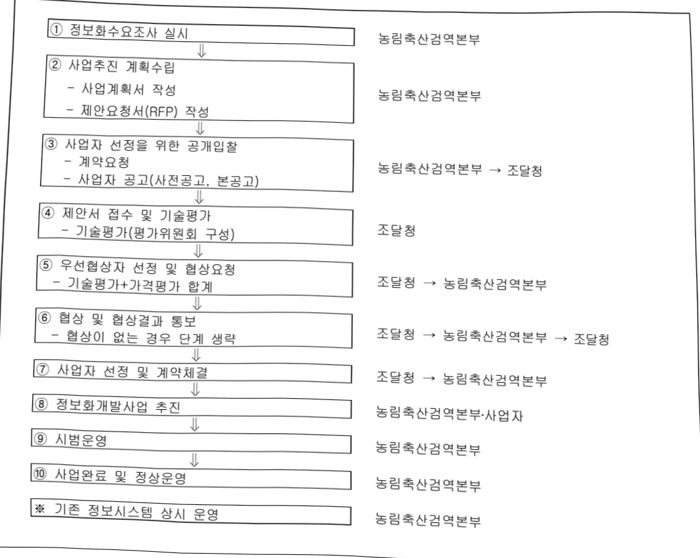

# 검역본부정보화(정보화)

**해당 페이지**: PDF 2958 ~ 2967 쪽 해당

**부처**: 농림축산식품부
**분야**: 농림수산
**회계유형**: 일반회계
**2026 확정예산**: 14843.0 백만원
**전년대비 증감률**: -4.9%
**AI 도메인**: 의료/바이오, 농업/식품

---

<table border=1 style='margin: auto; word-wrap: break-word;'><tr><td style='text-align: center; word-wrap: break-word;'>사 업 명</td></tr><tr><td style='text-align: center; word-wrap: break-word;'>(15) 검역본부정보화(정보화) (6231-300)</td></tr></table>

## □ 사업 코드 정보

<table border=1 style='margin: auto; word-wrap: break-word;'><tr><td style='text-align: center; word-wrap: break-word;'>구분</td><td style='text-align: center; word-wrap: break-word;'>회계</td><td style='text-align: center; word-wrap: break-word;'>소관</td><td style='text-align: center; word-wrap: break-word;'>실국(기관)</td><td style='text-align: center; word-wrap: break-word;'>계정</td><td style='text-align: center; word-wrap: break-word;'>분야</td><td style='text-align: center; word-wrap: break-word;'>부문</td></tr><tr><td style='text-align: center; word-wrap: break-word;'>코드</td><td rowspan="2">일반회계</td><td rowspan="2">농림축산식품부</td><td rowspan="2">농림축산검역본부</td><td rowspan="2"></td><td style='text-align: center; word-wrap: break-word;'>100</td><td style='text-align: center; word-wrap: break-word;'>101</td></tr><tr><td style='text-align: center; word-wrap: break-word;'>명칭</td><td style='text-align: center; word-wrap: break-word;'>농림수산</td><td style='text-align: center; word-wrap: break-word;'>농업·농촌</td></tr></table>

<table border=1 style='margin: auto; word-wrap: break-word;'><tr><td style='text-align: center; word-wrap: break-word;'>구분</td><td style='text-align: center; word-wrap: break-word;'>프로그램</td><td style='text-align: center; word-wrap: break-word;'>단위사업</td><td style='text-align: center; word-wrap: break-word;'>세부사업</td></tr><tr><td style='text-align: center; word-wrap: break-word;'>코드</td><td style='text-align: center; word-wrap: break-word;'>6200</td><td style='text-align: center; word-wrap: break-word;'>6231</td><td style='text-align: center; word-wrap: break-word;'>300</td></tr><tr><td style='text-align: center; word-wrap: break-word;'>명칭</td><td style='text-align: center; word-wrap: break-word;'>농림축산검역검사</td><td style='text-align: center; word-wrap: break-word;'>검역검사정보화(정보화)</td><td style='text-align: center; word-wrap: break-word;'>검역본부정보화(정보화)</td></tr></table>

□ 사업 성격 (공통요구자료 II-1 작성유의사항 4. 참조, 해당하는 사항에 “0” 표시)

<table border=1 style='margin: auto; word-wrap: break-word;'><tr><td rowspan="2">신규</td><td rowspan="2">계속</td><td rowspan="2">완료</td><td rowspan="2">예비타당성 실시여부</td><td rowspan="2">총사업비 관리대상</td><td rowspan="2">총액계상 예산사업</td><td style='text-align: center; word-wrap: break-word;'>사업소관 변경정보</td></tr><tr><td style='text-align: center; word-wrap: break-word;'>2025예산 시 소관</td></tr><tr><td style='text-align: center; word-wrap: break-word;'></td><td style='text-align: center; word-wrap: break-word;'>○</td><td style='text-align: center; word-wrap: break-word;'></td><td style='text-align: center; word-wrap: break-word;'></td><td style='text-align: center; word-wrap: break-word;'></td><td style='text-align: center; word-wrap: break-word;'></td><td style='text-align: center; word-wrap: break-word;'></td></tr></table>

□ 사업 지원 형태 및 지원을 (최소한 한 개는 반드시 선택하시오. 해당사항에 0 표시)

<table border=1 style='margin: auto; word-wrap: break-word;'><tr><td style='text-align: center; word-wrap: break-word;'>직접</td><td style='text-align: center; word-wrap: break-word;'>출자</td><td style='text-align: center; word-wrap: break-word;'>출연</td><td style='text-align: center; word-wrap: break-word;'>보조</td><td style='text-align: center; word-wrap: break-word;'>융자</td><td style='text-align: center; word-wrap: break-word;'>국고보조율(%)</td><td style='text-align: center; word-wrap: break-word;'>융자율(%)</td></tr><tr><td style='text-align: center; word-wrap: break-word;'>○</td><td style='text-align: center; word-wrap: break-word;'></td><td style='text-align: center; word-wrap: break-word;'></td><td style='text-align: center; word-wrap: break-word;'></td><td style='text-align: center; word-wrap: break-word;'></td><td style='text-align: center; word-wrap: break-word;'></td><td style='text-align: center; word-wrap: break-word;'></td></tr></table>

## □ 사업 소관부처 및 시행주체

<table border=1 style='margin: auto; word-wrap: break-word;'><tr><td style='text-align: center; word-wrap: break-word;'>사업명</td><td colspan="2">구분</td></tr><tr><td rowspan="4">검역본부정보화(정보화)</td><td rowspan="3">소관부처</td><td style='text-align: center; word-wrap: break-word;'>실·국·과(팀)</td></tr><tr><td style='text-align: center; word-wrap: break-word;'>농림축산검역본부</td></tr><tr><td style='text-align: center; word-wrap: break-word;'>동식물빅데이터팀</td></tr><tr><td style='text-align: center; word-wrap: break-word;'>사업시행주체</td><td style='text-align: center; word-wrap: break-word;'>-</td></tr></table>

---

### 가.예산 총괄표

(단위: 백만원, %)

<table border=1 style='margin: auto; word-wrap: break-word;'><tr><td rowspan="2">사업명</td><td rowspan="2">2024년 결산</td><td colspan="2">2025년 예산</td><td colspan="2">2026년 예산</td><td rowspan="2">중감 (B-A)</td><td rowspan="2">(B-A)/A</td></tr><tr><td style='text-align: center; word-wrap: break-word;'>본예산</td><td style='text-align: center; word-wrap: break-word;'>추경(A)</td><td style='text-align: center; word-wrap: break-word;'>요구안</td><td style='text-align: center; word-wrap: break-word;'>본예산(B)</td></tr><tr><td style='text-align: center; word-wrap: break-word;'>검역본부정보화 (정보화)</td><td style='text-align: center; word-wrap: break-word;'>16,225</td><td style='text-align: center; word-wrap: break-word;'>15,609</td><td style='text-align: center; word-wrap: break-word;'>15,609</td><td style='text-align: center; word-wrap: break-word;'>15,609</td><td style='text-align: center; word-wrap: break-word;'>14,843</td><td style='text-align: center; word-wrap: break-word;'>△766</td><td style='text-align: center; word-wrap: break-word;'>△4.9</td></tr></table>

□ 기능별(내역사업별), 예산 내역

(단위:백만원)

<table border=1 style='margin: auto; word-wrap: break-word;'><tr><td rowspan="2"></td><td colspan="5">2024</td><td colspan="5">2025</td><td rowspan="2">2026예산</td></tr><tr><td style='text-align: center; word-wrap: break-word;'>예산액(추경)</td><td style='text-align: center; word-wrap: break-word;'>예산현액</td><td style='text-align: center; word-wrap: break-word;'>집행액</td><td style='text-align: center; word-wrap: break-word;'>이월액</td><td style='text-align: center; word-wrap: break-word;'>불용액</td><td style='text-align: center; word-wrap: break-word;'>본예산</td><td style='text-align: center; word-wrap: break-word;'>예산현액</td><td style='text-align: center; word-wrap: break-word;'>집행액</td><td style='text-align: center; word-wrap: break-word;'>이월예산액</td><td style='text-align: center; word-wrap: break-word;'>불용예산액</td></tr><tr><td style='text-align: center; word-wrap: break-word;'>○ 기능별 분류(합계)</td><td style='text-align: center; word-wrap: break-word;'>16,279</td><td style='text-align: center; word-wrap: break-word;'>16,279</td><td style='text-align: center; word-wrap: break-word;'>16,225[16,225]</td><td style='text-align: center; word-wrap: break-word;'>-</td><td style='text-align: center; word-wrap: break-word;'>54</td><td style='text-align: center; word-wrap: break-word;'>15,609</td><td style='text-align: center; word-wrap: break-word;'>15,609</td><td style='text-align: center; word-wrap: break-word;'>10,465[10,465]</td><td style='text-align: center; word-wrap: break-word;'>-</td><td style='text-align: center; word-wrap: break-word;'>-</td><td style='text-align: center; word-wrap: break-word;'>14,843</td></tr><tr><td style='text-align: center; word-wrap: break-word;'>· 검역본부정보화</td><td style='text-align: center; word-wrap: break-word;'>16,279</td><td style='text-align: center; word-wrap: break-word;'>16,279</td><td style='text-align: center; word-wrap: break-word;'>16,225[16,225]</td><td style='text-align: center; word-wrap: break-word;'>-</td><td style='text-align: center; word-wrap: break-word;'>54</td><td style='text-align: center; word-wrap: break-word;'>15,609</td><td style='text-align: center; word-wrap: break-word;'>15,609</td><td style='text-align: center; word-wrap: break-word;'>10,465[10,465]</td><td style='text-align: center; word-wrap: break-word;'>-</td><td style='text-align: center; word-wrap: break-word;'>-</td><td style='text-align: center; word-wrap: break-word;'>14,843</td></tr><tr><td style='text-align: center; word-wrap: break-word;'>○ 비목별 분류(합계)</td><td style='text-align: center; word-wrap: break-word;'>16,279</td><td style='text-align: center; word-wrap: break-word;'>16,279</td><td style='text-align: center; word-wrap: break-word;'>16,225[16,225]</td><td style='text-align: center; word-wrap: break-word;'>-</td><td style='text-align: center; word-wrap: break-word;'>54</td><td style='text-align: center; word-wrap: break-word;'>15,609</td><td style='text-align: center; word-wrap: break-word;'>15,609</td><td style='text-align: center; word-wrap: break-word;'>10,465[10,465]</td><td style='text-align: center; word-wrap: break-word;'>-</td><td style='text-align: center; word-wrap: break-word;'>-</td><td style='text-align: center; word-wrap: break-word;'>14,843</td></tr><tr><td style='text-align: center; word-wrap: break-word;'>· 일반수용비(210-01)</td><td style='text-align: center; word-wrap: break-word;'>31</td><td style='text-align: center; word-wrap: break-word;'>67</td><td style='text-align: center; word-wrap: break-word;'>66[66]</td><td style='text-align: center; word-wrap: break-word;'>-</td><td style='text-align: center; word-wrap: break-word;'>1</td><td style='text-align: center; word-wrap: break-word;'>10</td><td style='text-align: center; word-wrap: break-word;'>10</td><td style='text-align: center; word-wrap: break-word;'>33[33]</td><td style='text-align: center; word-wrap: break-word;'>-</td><td style='text-align: center; word-wrap: break-word;'>-</td><td style='text-align: center; word-wrap: break-word;'>10</td></tr><tr><td style='text-align: center; word-wrap: break-word;'>· 공공요금맞춰제(210-02)</td><td style='text-align: center; word-wrap: break-word;'>1,022</td><td style='text-align: center; word-wrap: break-word;'>998</td><td style='text-align: center; word-wrap: break-word;'>991[991]</td><td style='text-align: center; word-wrap: break-word;'>-</td><td style='text-align: center; word-wrap: break-word;'>7</td><td style='text-align: center; word-wrap: break-word;'>1,022</td><td style='text-align: center; word-wrap: break-word;'>1,022</td><td style='text-align: center; word-wrap: break-word;'>748[748]</td><td style='text-align: center; word-wrap: break-word;'>-</td><td style='text-align: center; word-wrap: break-word;'>-</td><td style='text-align: center; word-wrap: break-word;'>1,022</td></tr><tr><td style='text-align: center; word-wrap: break-word;'>· 임차료(210-07)</td><td style='text-align: center; word-wrap: break-word;'>4,454</td><td style='text-align: center; word-wrap: break-word;'>4,392</td><td style='text-align: center; word-wrap: break-word;'>4,387[4,387]</td><td style='text-align: center; word-wrap: break-word;'>-</td><td style='text-align: center; word-wrap: break-word;'>5</td><td style='text-align: center; word-wrap: break-word;'>4,454</td><td style='text-align: center; word-wrap: break-word;'>4,454</td><td style='text-align: center; word-wrap: break-word;'>2,839[2,839]</td><td style='text-align: center; word-wrap: break-word;'>-</td><td style='text-align: center; word-wrap: break-word;'>-</td><td style='text-align: center; word-wrap: break-word;'>4,454</td></tr><tr><td style='text-align: center; word-wrap: break-word;'>· 시찰장비유지(210-09)</td><td style='text-align: center; word-wrap: break-word;'>139</td><td style='text-align: center; word-wrap: break-word;'>215</td><td style='text-align: center; word-wrap: break-word;'>211[211]</td><td style='text-align: center; word-wrap: break-word;'>-</td><td style='text-align: center; word-wrap: break-word;'>4</td><td style='text-align: center; word-wrap: break-word;'>139</td><td style='text-align: center; word-wrap: break-word;'>139</td><td style='text-align: center; word-wrap: break-word;'>100[100]</td><td style='text-align: center; word-wrap: break-word;'>-</td><td style='text-align: center; word-wrap: break-word;'>-</td><td style='text-align: center; word-wrap: break-word;'>139</td></tr><tr><td style='text-align: center; word-wrap: break-word;'>· 일반용역비(210-14)</td><td style='text-align: center; word-wrap: break-word;'>393</td><td style='text-align: center; word-wrap: break-word;'>394</td><td style='text-align: center; word-wrap: break-word;'>394[394]</td><td style='text-align: center; word-wrap: break-word;'>-</td><td style='text-align: center; word-wrap: break-word;'>-</td><td style='text-align: center; word-wrap: break-word;'>393</td><td style='text-align: center; word-wrap: break-word;'>393</td><td style='text-align: center; word-wrap: break-word;'>228[228]</td><td style='text-align: center; word-wrap: break-word;'>-</td><td style='text-align: center; word-wrap: break-word;'>-</td><td style='text-align: center; word-wrap: break-word;'>393</td></tr><tr><td style='text-align: center; word-wrap: break-word;'>· 관리용역비(210-15)</td><td style='text-align: center; word-wrap: break-word;'>4,638</td><td style='text-align: center; word-wrap: break-word;'>4,611</td><td style='text-align: center; word-wrap: break-word;'>4,611[4,611]</td><td style='text-align: center; word-wrap: break-word;'>-</td><td style='text-align: center; word-wrap: break-word;'>-</td><td style='text-align: center; word-wrap: break-word;'>4,786</td><td style='text-align: center; word-wrap: break-word;'>4,786</td><td style='text-align: center; word-wrap: break-word;'>2,553[2,553]</td><td style='text-align: center; word-wrap: break-word;'>-</td><td style='text-align: center; word-wrap: break-word;'>-</td><td style='text-align: center; word-wrap: break-word;'>5,421</td></tr><tr><td style='text-align: center; word-wrap: break-word;'>· 국내여비(220-01)</td><td style='text-align: center; word-wrap: break-word;'>6</td><td style='text-align: center; word-wrap: break-word;'>6</td><td style='text-align: center; word-wrap: break-word;'>6[6]</td><td style='text-align: center; word-wrap: break-word;'>-</td><td style='text-align: center; word-wrap: break-word;'>-</td><td style='text-align: center; word-wrap: break-word;'>6</td><td style='text-align: center; word-wrap: break-word;'>6</td><td style='text-align: center; word-wrap: break-word;'>-</td><td style='text-align: center; word-wrap: break-word;'>-</td><td style='text-align: center; word-wrap: break-word;'>-</td><td style='text-align: center; word-wrap: break-word;'>6</td></tr><tr><td style='text-align: center; word-wrap: break-word;'>· 국외여비(220-02)</td><td style='text-align: center; word-wrap: break-word;'>8</td><td style='text-align: center; word-wrap: break-word;'>8</td><td style='text-align: center; word-wrap: break-word;'>7[7]</td><td style='text-align: center; word-wrap: break-word;'>-</td><td style='text-align: center; word-wrap: break-word;'>1</td><td style='text-align: center; word-wrap: break-word;'>8</td><td style='text-align: center; word-wrap: break-word;'>8</td><td style='text-align: center; word-wrap: break-word;'>11[11]</td><td style='text-align: center; word-wrap: break-word;'>-</td><td style='text-align: center; word-wrap: break-word;'>-</td><td style='text-align: center; word-wrap: break-word;'>8</td></tr><tr><td style='text-align: center; word-wrap: break-word;'>· 일반연구비(260-01)</td><td style='text-align: center; word-wrap: break-word;'>5,508</td><td style='text-align: center; word-wrap: break-word;'>5,508</td><td style='text-align: center; word-wrap: break-word;'>5,472[5,472]</td><td style='text-align: center; word-wrap: break-word;'>-</td><td style='text-align: center; word-wrap: break-word;'>36</td><td style='text-align: center; word-wrap: break-word;'>3,933</td><td style='text-align: center; word-wrap: break-word;'>3,933</td><td style='text-align: center; word-wrap: break-word;'>3,874[3,874]</td><td style='text-align: center; word-wrap: break-word;'>-</td><td style='text-align: center; word-wrap: break-word;'>-</td><td style='text-align: center; word-wrap: break-word;'>3,310</td></tr><tr><td style='text-align: center; word-wrap: break-word;'>· 자산취득비(430-01)</td><td style='text-align: center; word-wrap: break-word;'>80</td><td style='text-align: center; word-wrap: break-word;'>80</td><td style='text-align: center; word-wrap: break-word;'>80[80]</td><td style='text-align: center; word-wrap: break-word;'>-</td><td style='text-align: center; word-wrap: break-word;'>-</td><td style='text-align: center; word-wrap: break-word;'>858</td><td style='text-align: center; word-wrap: break-word;'>858</td><td style='text-align: center; word-wrap: break-word;'>79[79]</td><td style='text-align: center; word-wrap: break-word;'>-</td><td style='text-align: center; word-wrap: break-word;'>-</td><td style='text-align: center; word-wrap: break-word;'>80</td></tr></table>

---

### 나. 사업설명자료

## 1 ) 사업목적·내용

- 안전한 농축산물 공급을 위해 동축산물·식물검역, 가축방역, 축산물 안전, 동물보호, 동물용의약품 관리, 수입쇠고기·돼지고기 유통이력 관리 등 농림축산검역본부 고유 업무 정보화

- 정보시스템 구축 운영을 통한 업무 효율성 제고 및 대국민 서비스 수준 향상

## 2 ) 사업개요

## □ 사업근거 및 추진경위

① 법령상 근거 및 조항 적시

- 가축전염병예방법 제2장 가축의 방역, 제3장 수출입의 검역, 제3조의3(국가가축방역 통합정보시스템의 구축·운영, 제5조(가축의 소유자등의 방역 및 검역 의무), 제17조의3(차량의 등록 및 출입정보 관리 등), 제36조(수입검역), 제41조(수출검역 등)

- 축산물위생관리법 제37조의2(정보시스템의 구축·운영)

- 가축 및 축산물이력관리에 관한 법률 제27조(이력관리시스템의 구축 등)

- 동물보호법 제17조(공고), 제45조(실태조사 및 정보의 공개), 동물보호법 시행령 제7조(공고)

- 약사법 제85조(동물용의약품 등에 대한 특례)

- 국가정보화기본법 제15조(공공정보화의 추진)

- 전자정부법 제16조(전자정부 서비스 개발·제공)

- 식물방역법 시행규칙 제14조(식물검역대상물품의 수입 신고 및 검역 신청)

- 정부기록물관리법(행정문서의 전자화)

-전자문서 교환방식에 의한 축산물의 수입신고 등 업무처리에 관한 규정(검역본부 고시 제2017-62호)

## ② 추진경위

- 전자정부 구현을 위한 행정정보화 촉진에 따른 전자결재시스템 구축('99)

- 웹기반의 수출입 검역 · 검사정보시스템 구축('01) 및 DW 사업('02)

- 수산물검사정보시스템 구축('02), 식물검역검사 인터넷 신청 시스템 구축('03)

- 식물분야 전자위생증시스템 구축('04)

- 동물용의약품관리정보시스템 및 가축전염병대응시스템 구축('04~06)

-식물검역 종합서비스시스템 구축('06)

- 검사정보시스템기능 확충 및 검사지식관리시스템 구축 (06)

- 식물검역병해충 원격진단네트워크 구축, 격리재배관리시스템 구축('07)

-통합전자민원시스템 및 실험동물윤리위원회 관리시스템 구축('07)

- 방제업체·열처리업체 업무관리시스템 구축('08)

- 전자정부사업으로 국가동물방역정보시스템 구축('08~'12)

- 식물검역통합정보시스템 ISP사업 및 1단계 구축('10~'11)

---

- 동물보호 웹접근성 개선, 수출검역통합시스템 구축 및 DB암호화 등('11)

- 정보통신망 고도화 및 보안강화사업('12)

- 식물검역통합정보시스템 2단계 구축('12)

- 수입쇠고기유통이력관리시스템 개선('13)

- 식물검역통합정보시스템 3단계 구축사업('13~'14)

- 국가동물방역통합시스템(KAHIS) 항공영상·축산차량관리 및 PC보안관리 강화('13)

- 수입쇠고기 유통이력관리시스템 장비교체 및 고도화 사업('14)

- 동물보호관리시스템 서버 교체 및 기능개선사업('14)

- KAHIS 축산농장 통합DB 구축 및 검역본부 시스템 고도화('14)

- 정보통신망 망분리 및 가축방역 통계시스템 구축('14)

- KAHIS 기능 개선 및 인프라 고도화('15)

- 식물검역온라인 민원환경 개선사업('16)

- 축산차량 GPS상황관리시스템 구축('16)

- 축산물 전자검역증시스템 구축('16)

- KAHIS 축산차량등록DB 분리사업('16)

- 축산관계자 출국신고 모바일 웹 개발 용역('17)

- 축산관계자 정보 국경검역시스템 연계방법 개선 사업('17)

- 수입돼지고기 유통이력제 정보화전략계획(ISP) 수립('17)

- 식물검역통합정보시스템 확대 구축 사업('17)

- 수입축산물(수입쇠고기·돼지고기) 유통이력관리시스템 구축 사업('18)

- 식물병해충예찰 통합정보시스템 구축('18)

- 노후장비 교체 등 식물검역통합정보시스템 기반강화 사업('18)

- 축산차량등록제 고도화('18)

- 식물검역 연구과제관리시스템 구축 등 식물검역통합정보시스템 기반확충 사업('19)

- 축산차량통합관제시스템 구축('19)

- 국가가축방역통합시스템 기능개선('19)

- 동축산물검역정보시스템 고도화 ISP 수립('19)

- 수출입검역 신속지원을 위한 식물검역정보통합시스템 기능개선 사업('20)

- 국가재난 가축질병 발생현황 모니터링시스템구축('20)

- 동물보호 동물용의약품 축산물안전 ISP 사업('21)

- 축산차량통합관제시스템 기능개선 및 고도화사업('21)

- 식물검역통합정보시스템 기능확충 사업(수입식물 검역요건 검색시스템 구축)(21)

- 지능형 동축산물검역정보시스템 고도화 사업('21)

- 차세대 국가가축방역통합시스템(KAHIS) 고도화 사업('21)

- 국가가축방역통합시스템(KAHIS) 및 빅데이터시스템 고도화 사업('22)

- 국가가축방역통합시스템(KAHIS) 정보화전략계획(ISP) 수립 사업('22)

---

- 축산차량 GPS 단말기 연계시스템 기능 개선 사업('22)

- 동·식물 검역정보시스템 기능 개선 1차 사업(22)

- KAHIS 및 망분리 고도화 사업('23)

- 동식물 검역통합정보시스템 기능 개선 2차(23)

- 축산차량통합관제시스템 고도화('23)

- 동물용의약품정보관리시스템 재구축(23)

- 국가동물보호정보시스템 재구축('23)

- 국가동물보호정보시스템 재구축('23)

- 빅데이터 기반 가축방역 통합정보시스템 고도화(24)

- 식물검역통합정보시스템 확대구축('24)

- 축산차량통합관제시스템 고도화('24)

- 동축산물검역정보시스템 재구축 3단계(24)

- 동물용의약품 및 국가동물보호정보시스템 고도화(24)

## □ 주요내용

① 사업규모

- 총사업비(해당되는 경우에만 기재) : 해당없음

- 사업기간 : '98 ~ 계속

- 최근 5년 간 투입된 사업비(예산액기준, 추경편성한 연도에는 추경포함)

<table border=1 style='margin: auto; word-wrap: break-word;'><tr><td style='text-align: center; word-wrap: break-word;'>$ \underline{\text{所}} $</td><td style='text-align: center; word-wrap: break-word;'>2022</td><td style='text-align: center; word-wrap: break-word;'>2023</td><td style='text-align: center; word-wrap: break-word;'>2024</td><td style='text-align: center; word-wrap: break-word;'>2025</td><td style='text-align: center; word-wrap: break-word;'>2026</td></tr><tr><td style='text-align: center; word-wrap: break-word;'>$ \underline{\text{人}} $</td><td style='text-align: center; word-wrap: break-word;'>13,803</td><td style='text-align: center; word-wrap: break-word;'>17,173</td><td style='text-align: center; word-wrap: break-word;'>16,279</td><td style='text-align: center; word-wrap: break-word;'>15,609</td><td style='text-align: center; word-wrap: break-word;'>14,843</td></tr></table>

-기타: 해당없음

② 사업추진체계

- 사업시행방법 : 직접수행

- 사업시행주체 : 농림축산검역본부

- 사업 수혜자 : 농식품부·검역본부·지자체 업무담당자, 동축산물·농산물 수출입업체, 동물병원·유기동물보호소, 동물약품허가업체, 도축·가공업체, 대국민

- 보조, 융자, 출연, 출자 등의 경우 보조·융자 등 지원 비율 및 법적근거 : 해당없음

---

○ 검역본부정보화 : ('25) 15,609 → ('26예산) 14,843백만원 , △4.9%
① 정보시스템 확대구축: ('25) 4,711 → ('26예산) 3,310백만원, △29.7%
- [국정과제] 빅데이터기반 국가가축방역통합시스템 고도화 : 2,310백만원
- 국가동물보호정보시스템 고도화 : 293백만원
- 국가식물병해충통합정보시스템 ISP : 707백만원
② 정보시스템 운영: ('25) 9,240 → ('26예산) 9,875백만원, +6.9%
- 정보시스템 유지보수 : ('25) 4,786 → ('26예산) 5,421백만원, +13.3%
* 기 운영 정보시스템 유지보수 : 4,786백만원
- 개발SW 유지보수 : 2,946백만원
개발비용(39,766백만원) × 요율(7.41%) = 2,946백만원
HW 유지보수 : 885백만원
도입금액(24,073백만원) × 요율(3.67%) = 885백만원
상용SW 유지보수 : 955백만원
도입금액(12,426백만원) × 요율(7.69%) = 955백만원
(* (26년 증액분) : 635백만원
'24년 개발 SW 유지보수 132백만원 (1,781백만원 × 7.41%)
'24년 도입 HW 유지보수 351백만원 (4,736백만원 × 7.41%)
'24년 도입 상용SW 유지보수 152백만원 (1,905백만원 × 7.98%)
- 검역본부 시스템 임차료 : ('25) 4,454 → ('26) 4,454백만원, 전년동
③ 기타 운영지원: ('25) 1,658 → ('26예산) 1,658백만원, 전년동
- 일반수용비 : ('25) 10 → ('26예산) 10백만원, 전년동
* 정보화용역사업 평가 수당 지급 6
* 정보시스템 사용자 교육 교재 및 홍보물 제작 4
- 회선사용료(공공요금및제세) : ('25) 1,022 → ('26예산) 1,022백만원, 전년동
* 국가정보통신망 665백만원
* 구제역, AI긴급방역문자 발송 357백만원
- 시설장비유지비 : ('25) 139 → ('26예산) 139백만원, 전년동
* 보안SW 갱신 및 정보시스템 업그레이드 133
* 정보시스템 유지보수 소모품 교체 6
- 일반용역비 : ('25) 393 → ('26예산) 393백만원, 전년동
* 축산차량 GPS 운영센터 운영 371
* 상담 사무실 관리비용 22
- 국내외여비 : ('25) 14 → ('26예산) 14백만원, 전년동
* 국내 6백만원, 국외 8백만원
- PC도입 : ('25) 80 → ('26예산) 80백만원, 전년동

---

2025년도 예산 및 2026년도 예산 산출 세부내역 비교

<table border=1 style='margin: auto; word-wrap: break-word;'><tr><td colspan="2">25년 예산</td><td colspan="2">26년 예산</td></tr><tr><td style='text-align: center; word-wrap: break-word;'>예산</td><td style='text-align: center; word-wrap: break-word;'>산출내역</td><td style='text-align: center; word-wrap: break-word;'>예산</td><td style='text-align: center; word-wrap: break-word;'>산출내역</td></tr><tr><td style='text-align: center; word-wrap: break-word;'>15,609 백만원</td><td style='text-align: center; word-wrap: break-word;'>○ 일반수용비(210-01): 9,832천원 가. 기술평가수당: 6,250천원 나. 정보시스템교육: 3,750천원 다. 조정재원: (-168천원) ○ 공공요금및제세(210-02): 1,022,000천원 가. 국가정보통신망: 665,000천원 나. 방역문자 발송: 모바일 이용료: 339,000천원 다. 본인인증 수수료 등: 18,000천원 ○ 입자료(210-07): 4,454,000천원 가. 식물감역통합정보시스템 기반 강화: 66,000천원 × 2회 나. 수입축산물유통이력관리시스템구축: 218,450천원 × 2회 다. 국경감역관리시스템 인프라 강화: 170,000천원 × 2회 라. 축산차량정보관리시스템 고도화: 225,000천원 × 2회 마. KAHIS 고도화 및 망분리: 334,000천원 × 2회 바. 국가가축방역통합시스템 서버 증설: 115,000천원 × 2회 사. 국가가축방역통합시스템 인프라 고도화: 209,000천원 × 2회 아. M2M 서버증설: 302,000천원 × 2회 자. KAHIS, 망분리 시스템 고도화: 152,000천원 × 4회 자. KAHIS 및 정보통신망 개선 사업: 150,000천원 × 2회 가. KAHIS 백데이터시스템 개선 사업: 133,500천원 × 2회 ○ 시설장비유지비(210-09): 139,000천원 가. 보안SW 사용권 경신: 133,000천원 나. 전산장비 소모품 교체: 6,000천원 ○ 일반용역비(210-14): 393,000천원 가. 축산차량 GPS상담센터 운영: 371,000천원 · 9인 × 3,444백만원 × 12개월 나. 사무실 관리비용: 22,000천원 ○ 관리용역비(210-15): 4,786,000천원 가. 개발SW유지보수: 2,946,000천원 · 개발비용 39,766,000천원 × 요율 7.41% · (중액) 23년 개발SW 유지보수: 148,000천원 나. HW 유지보수: 885,000천원 × 요율 3.68% · 도입금액 24,073,000천원 × 요율 3.68% 다. 상용SW 유지보수: 955,000천원 · 도입금액 12,426,000천원 × 요율 7.68% ○ 국내여비(220-01): 6,085천원 가. 지역본부 및 사무소 전산망 점검: 180,000원×15명×2회 =5,400천원 나. 농식품부 등 관계기관 업무협의: 75,000원×14회 =1,050천원 다. 조정재원 (-365천원) 가. 국회업무여비(220-02): 8,083천원 파악(3,100천원) · 항공료: 700,000원×2명=1,400천원 · 제재비: 850,000원×2명=1,700천원 나. 동식물검역 해외선진기관 현지조사 및 정보화운용 기술 습득(5,191천원) · 항공료: 1,200,000원×2명=2400천원 · 제재비: 1,395,500원×2명=2,791천원 다. 조정재원 (-208천원) ○ 일반연구비(260-01): 3,933,000천원 가. 빅데이터기반 국가가축방역통합시스템 고도화: 1,666,000천원 나. 축산물안전관리시스템 재구축: 2,267,000천원 ○ 자산취득비(430-01): 858,000천원 가. PC구매: · 750,000원×107대=80,250천원 나. 빅데이터 기반 국가가축방역통합시스템 인프라 구축: · 778,000천원×1식=778,000천원 14,843 백만원 ○ 일반수용비(210-01): 9,832천원 가. 기술평가수당: 6,250천원 나. 정보시스템교육: 3,750천원 다. 조정재원: (-168천원) ○ 공공요금및제세(210-02): 1,022,000천원 가. 국가정보통신망: 665,000천원 나. 방역문자 발송: 모바일 이용료: 339,000천원 다. 본인인증 수수료 등: 18,000천원 ○ 입자료(210-07): 4,454,000천원 가. 식물검역통합정보시스템 기반 강화: 66,000천원 × 2회 나. 수입축산물유통이력관리시스템구축: 218,450천원 × 2회 다. 국경감역관리시스템 인프라 강화: 170,000천원 × 2회 다. 축산차량정보관리시스템 고도화: 225,000천원 × 2회 마. KAHIS 고도화 및 망분리: 334,000천원 × 2회 바. 국가가축방역통합시스템 서버 증설: 115,000천원 × 2회 사. 국가가축방역통합시스템 인프라 고도화: 209,000천원 × 2회 아. M2M 서버증설: 302,000천원 × 2회 자. KAHIS, 망분리 시스템 고도화: 152,000천원 × 2회 자. KAHIS 및 정보통신망 개선 사업: 150,000천원 × 2회 가. KAHIS 및 정보통신망 개선 사업: 133,500천원 × 2회 아. 국가가축방역통합시스템 인프라 고도화: 209,000천원 × 2회 가. 보안SW 사용권 경신: 133,000천원 나. 전산장비 소모품 교체: 6,000천원 나. 일반용역비(210-14): 393,000천원 가. 축산차량 GPS상담센터 운영: 371,000천원 · 9인 × 3,444백만원 × 12개월 나. 사무실 관리비용: 22,000천원 나. 관리용역비(210-15): 4,786,000천원 가. 개발SW유지보수: 2,946,000천원 · 개발비용 39,766,000천원 × 요율 7.41% · (중액) 23년 개발SW 유지보수: 148,000천원 나. HW 유지보수: 885,000천원 × 요율 3.68% · 도입금액 24,073,000천원 × 요율 3.68% 다. 상용SW 유지보수: 955,000천원 · 도입금액 12,426,000천원 × 요율 7.68% ○ 국내여비(220-01): 6,085천원 가. 지역본부 및 사무소 전산망 점검: 180,000원×15명×2회 =5,400천원 나. 동식품부 등 관계기관 업무협의: 75,000원×14회 =1,050천원 다. 조정재원 (-365천원) 가. 국회업무여비(220-02): 8,083천원 가. 가축방역 및 동송산물 관련 해외 정보시스템 운영현황 파악(3,100천원) · 항공료: 700,000원×2명=1,400천원 · 제재비: 850,000원×2명=1,700천원 나. 동식물검역 해외선진기관 현지조사 및 정보화운용 기술 습득(5,191천원) · 항공료: 1,200,000원×2명=2400천원 · 제재비: 1,395,500원×2명=2,791천원 다. 조정재원 (-208천원) ○ 일반연구비(260-01): 3,933,000천원 가. 빅데이터기반 국가가축방역통합시스템 고도화: 1,666,000천원 나. 축산물안전관리시스템 재구축: 2,267,000천원 가. PC구매: · 750,000원×107대=80,250천원 나. 빅데이터 기반 국가가축방역통합시스템 인프라 구축: · 778,000천원×1식=778,000천원 ○ 자산취득비(430-01): 858,000천원 가. PC구매: · 750,000원×107대=80,250천원 가. PC구매: · 750,000원×107대=80,250천원 ○ 자산취득비(430-01): 80,000천원 가. PC구매: · 750,000원×107대=80,250천원 ○ 자산취득비(430-01): 80,000천원 가. PC구매: · 750,000원×107대=80,250천원 ○ 자산취득비(430-01): 80,000천원 가. PC구매: · 750,000원×107대=80,250천원 ○ 자산취득비(430-01): 80,000천원 가. PC구매: · 750,000원×107대=80,250천원 ○ 자산취득비(430-01): 80,000천원 가. PC구매: · 750,000원×107대=80,250천원 ○ 자산취득비(430-01): 80,000천원 가. PC구매: · 750,000원×107대=80,250천원 ○ 자산취득비(430-01): 80,000천원 가. PC구매: · 750,000원×107대=80,250천원 ○ 자산취득비(430-01): 80,000천원 가. PC구매: · 750,000원×107대=80,250천원 ○ 자산취득비(430-01): 80,000천원 가. PC구매: · 750,000원×107대=80,250천원 ○ 자산취득비(430-01): 80,000천원 가. PC구매: · 750,000원×107대=80,250천원 ○ 자산취득비(430-01): 80,000천원 가. PC구매: · 750,000원×107대=80,250천원 ○ 자산취득비(430-01): 80,000천원 가. PC구매: · 750,000원×107대=80,250천원 ○ 자산취득비(430-01): 80,000천원 가. PC구매: · 750,000원×107대=80,250천원 ○ 자산취득비(430-01): 80,000천원 가. PC구매: · 750,000원×107대=80,250천원 ○ 자산취득비(430-01): 80,000천원 가. PC구매: · 750,000원×107대=80,250천원 ○ 자산취득비(430-01): 80,000천원 가. PC구매: · 750,000원×107대=80,250천원 ○</td><td style='text-align: center; word-wrap: break-word;'></td><td style='text-align: center; word-wrap: break-word;'></td></tr></table>

---

## 4 ) 사업효과

☐ 사업영향, 산출물 성과지표 등

①2022~2026년도 성과계획서 상 성과지표 및 최근 5년간 성과 달성도

<table border=1 style='margin: auto; word-wrap: break-word;'><tr><td style='text-align: center; word-wrap: break-word;'>성과지표</td><td style='text-align: center; word-wrap: break-word;'>구분</td><td style='text-align: center; word-wrap: break-word;'>2022</td><td style='text-align: center; word-wrap: break-word;'>2023</td><td style='text-align: center; word-wrap: break-word;'>2024</td><td style='text-align: center; word-wrap: break-word;'>2025</td><td style='text-align: center; word-wrap: break-word;'>2026</td><td style='text-align: center; word-wrap: break-word;'>2026 목표치산출근거</td><td style='text-align: center; word-wrap: break-word;'>측정산시(또는 측정방법)</td><td style='text-align: center; word-wrap: break-word;'>자료수집방법(또는 자료출처)</td></tr><tr><td rowspan="3">정보시스템이용자만족도(단위: 점)</td><td style='text-align: center; word-wrap: break-word;'>목표</td><td style='text-align: center; word-wrap: break-word;'>80.6</td><td style='text-align: center; word-wrap: break-word;'>80.8</td><td style='text-align: center; word-wrap: break-word;'>81.6</td><td style='text-align: center; word-wrap: break-word;'>81.5</td><td style='text-align: center; word-wrap: break-word;'>82.3</td><td rowspan="3">&#x27;26년목표치(82.3) = &#x27;25년목표(81.5) × (1.01%)</td><td rowspan="3">정보시스템 사용자대상 11점 척도조사 후 100점 만점기준으로 환산</td><td rowspan="3">외부 전문기관 의뢰설문조사 실시</td></tr><tr><td style='text-align: center; word-wrap: break-word;'>실적</td><td style='text-align: center; word-wrap: break-word;'>80.8</td><td style='text-align: center; word-wrap: break-word;'>80.9</td><td style='text-align: center; word-wrap: break-word;'>81.7</td><td style='text-align: center; word-wrap: break-word;'>-</td><td style='text-align: center; word-wrap: break-word;'>-</td></tr><tr><td style='text-align: center; word-wrap: break-word;'>달성도</td><td style='text-align: center; word-wrap: break-word;'>100.2</td><td style='text-align: center; word-wrap: break-word;'>100.1</td><td style='text-align: center; word-wrap: break-word;'>100.1</td><td style='text-align: center; word-wrap: break-word;'>-</td><td style='text-align: center; word-wrap: break-word;'>-</td></tr><tr><td rowspan="3">시스템 활용률(단위: %)</td><td style='text-align: center; word-wrap: break-word;'>목표</td><td style='text-align: center; word-wrap: break-word;'>90.4</td><td style='text-align: center; word-wrap: break-word;'>90.5</td><td style='text-align: center; word-wrap: break-word;'>90.9</td><td style='text-align: center; word-wrap: break-word;'>91.3</td><td style='text-align: center; word-wrap: break-word;'>92.2</td><td rowspan="3">&#x27;26년목표치(92.2) = &#x27;25년목표(91.3) × (1.01%)</td><td rowspan="3">(시스템을 이용하여 처리한 건수 / 온·오프라인 업무율) × 100</td><td rowspan="3">시스템 등록자료</td></tr><tr><td style='text-align: center; word-wrap: break-word;'>실적</td><td style='text-align: center; word-wrap: break-word;'>90.7</td><td style='text-align: center; word-wrap: break-word;'>90.8</td><td style='text-align: center; word-wrap: break-word;'>91.1</td><td style='text-align: center; word-wrap: break-word;'>-</td><td style='text-align: center; word-wrap: break-word;'>-</td></tr><tr><td style='text-align: center; word-wrap: break-word;'>달성도</td><td style='text-align: center; word-wrap: break-word;'>100.3</td><td style='text-align: center; word-wrap: break-word;'>100.3</td><td style='text-align: center; word-wrap: break-word;'>100.2</td><td style='text-align: center; word-wrap: break-word;'>-</td><td style='text-align: center; word-wrap: break-word;'>-</td></tr></table>

※ '24년부터는 재난안전사업평가대상으로 변경되었고, 성과지표는 동일하나 연말결과치에 따라 목표가 달라질 수 있음

② 성과지표 이외의 연도별 사업추진 경과 및 실적

<table border=1 style='margin: auto; word-wrap: break-word;'><tr><td style='text-align: center; word-wrap: break-word;'>2022</td><td style='text-align: center; word-wrap: break-word;'>- 차세대 국가가축방역통합시스템 재구축을 위한 ISP 수립- 데이터 기반의 가축질병 예방과 확산방지를 위한 KAHIS 및 빅데이터시스템 고도화- 스마트 검역체계 구축을 위한 동·식물검역정보시스템 기능 개선 1차- 축산차량 GPS단말기 연계시스템 개선</td></tr><tr><td style='text-align: center; word-wrap: break-word;'>2023</td><td style='text-align: center; word-wrap: break-word;'>- 빅데이터 기반 가축질병 사전예측을 위한 가축질병(AI) 발생 위험도 평가 알고리즘 개발- 스마트 검역체계 구축을 위한 동·식물 검역정보시스템 기능 개선 2차- 동물용의약품 안전관리 강화를 위한 동물용의약품정보시스템 재구축- 수요자 중심의 국가동물보호정보시스템 재구축</td></tr><tr><td style='text-align: center; word-wrap: break-word;'>2024</td><td style='text-align: center; word-wrap: break-word;'>- 빅데이터 기반 가축질병 사전예측을 위한 가축질병(AI) 발생 위험도 평가 알고리즘 2차 개발- 스마트 검역체계 구축을 위한 동·식물 검역정보시스템 기능 개선 2차- 동물용의약품 안전관리 강화를 위한 동물용의약품정보시스템 재구축- 수요자 중심의 국가동물보호정보시스템 재구축- 가축질병 정밀방역을 위한 축산차량통합관제시스템 고도화 사업</td></tr><tr><td style='text-align: center; word-wrap: break-word;'>2025</td><td style='text-align: center; word-wrap: break-word;'>- 빅데이터 기반 가축질병 사전예측을 위한 가축질병(ASF) 발생 위험도 평가모델 개발 및 AI- 예측결과 향상을 위한 고도화- 안전한 대국민 먹거리 관리를 위한 축산물안전관리시스템 고도화 사업추진</td></tr></table>

③향후(2026년도 이후)기대효과

- 식물병해충의 신속한 차단 및 방역을 위한 국가식물병해통합정보시스템 ISP 사업추진

- 첨단 ICT기술을 활용하여 AI 위험도 예측알고리즘의 고도화를 수행하고 아프리카돼지열병, 구제역

등 국가재난형 가축질병의 위험도 예측모델 개발을 통해 사전예방 및 질병발생시 확산 방지

· 수요자 중심의 국가가축방역통합시스템(KAHIS) 기능 개선

축산차량의 GPS정밀도 향상을 통해 보다 정교한 축산차량 통합관제시스템 운영

---

- 국제검역 환경변화에 따른 능동적 대응으로 동축산물, 식물 안전성 사전 예방 확보

  · 전자검역증명서 시스템 고도화를 통해 종이검역증 분실·위조 문제 개선 등 검역신뢰도 제고

  · 기관별로 산재되어 있는 병해충 관련 정보의 통합을 통한 예찰·방제 기능 강화

  · 대국민 관심사항인 동물용의약품 정보 공개 및 동물 보호·복지 강화

  · 반려동물 등록, 유기동물 공고·조회 등에 한정된 동물보호시스템 확대 구축

  · 맹전관련 정보관리를 통한 대 국민 안전 신뢰성 확보 및 일자리 창출 등을 지원하는 종합 정보서비스 제공

## 5 ) 타당성조사 및 예비타당성조사 시행여부 및 결과 요지 : 해당없음

## 6 ) 총사업비 대상사업 정보 : 해당없음

## 7 ) 사업 집행절차

---

## 8 ) 각종 평가

1) 국회(예결위, 상임위, 예정처, 국정감사 포함) 지적

- '21회계연도 결산 상임위 지적사항 : 검역본부정보화 사업의 성과지표로 사용하고 있는

'정보시스템 이용자 만족도'조사의 표본수 확대 및 지출예산을 기본경비에서 정

보화사업 예산으로 변경하여 수행하는 방안 고려

2) 감사원 또는 국무총리실 지적 : 해당없음

3) 자체평가

- '23년 통합 재정사업 평가(평가시기 : '23.3월, 평가등급 : 보통)

- '24년 통합 재정사업 평가(평가시기 : '24.3월, 평가등급 : 보통)

- '25년 재난안전사업 평가(평가시기 : '25.3월, 평가등급 : 보통)

※ '25년부터 재난안전사업 평가대상에 편입

### 다. 최근 4년간 결산내역

## 1 ) 결산표

☐ 부처 결산내역

(단위: 백만원, %)

<table border=1 style='margin: auto; word-wrap: break-word;'><tr><td rowspan="2">연도</td><td colspan="3">예산액</td><td rowspan="2">예산현액(A)</td><td rowspan="2">집행액(B)</td><td rowspan="2">집행률(B/A)</td><td rowspan="2">다음연도이월액</td><td rowspan="2">불용액</td></tr><tr><td style='text-align: center; word-wrap: break-word;'>본예산</td><td style='text-align: center; word-wrap: break-word;'>추경중감액</td><td style='text-align: center; word-wrap: break-word;'>추경</td></tr><tr><td style='text-align: center; word-wrap: break-word;'>2022</td><td style='text-align: center; word-wrap: break-word;'>13,803</td><td style='text-align: center; word-wrap: break-word;'>-</td><td style='text-align: center; word-wrap: break-word;'>13,803</td><td style='text-align: center; word-wrap: break-word;'>13,803</td><td style='text-align: center; word-wrap: break-word;'>13,705</td><td style='text-align: center; word-wrap: break-word;'>99.3</td><td style='text-align: center; word-wrap: break-word;'>-</td><td style='text-align: center; word-wrap: break-word;'>98</td></tr><tr><td style='text-align: center; word-wrap: break-word;'>2023</td><td style='text-align: center; word-wrap: break-word;'>17,173</td><td style='text-align: center; word-wrap: break-word;'>-</td><td style='text-align: center; word-wrap: break-word;'>17,173</td><td style='text-align: center; word-wrap: break-word;'>17,173</td><td style='text-align: center; word-wrap: break-word;'>17,112</td><td style='text-align: center; word-wrap: break-word;'>99.6</td><td style='text-align: center; word-wrap: break-word;'>-</td><td style='text-align: center; word-wrap: break-word;'>61</td></tr><tr><td style='text-align: center; word-wrap: break-word;'>2024</td><td style='text-align: center; word-wrap: break-word;'>16,279</td><td style='text-align: center; word-wrap: break-word;'>-</td><td style='text-align: center; word-wrap: break-word;'>16,279</td><td style='text-align: center; word-wrap: break-word;'>16,279</td><td style='text-align: center; word-wrap: break-word;'>16,225</td><td style='text-align: center; word-wrap: break-word;'>99.7</td><td style='text-align: center; word-wrap: break-word;'>-</td><td style='text-align: center; word-wrap: break-word;'>54</td></tr><tr><td style='text-align: center; word-wrap: break-word;'>2025</td><td style='text-align: center; word-wrap: break-word;'>15,609</td><td style='text-align: center; word-wrap: break-word;'>-</td><td style='text-align: center; word-wrap: break-word;'>15,609</td><td style='text-align: center; word-wrap: break-word;'>15,609</td><td style='text-align: center; word-wrap: break-word;'>10,465</td><td style='text-align: center; word-wrap: break-word;'>67.0</td><td style='text-align: center; word-wrap: break-word;'>-</td><td style='text-align: center; word-wrap: break-word;'>-</td></tr></table>

## 2 ) 주요 결산사항

□ 2022~2025년 결산 주요사항

<table border=1 style='margin: auto; word-wrap: break-word;'><tr><td style='text-align: center; word-wrap: break-word;'>2022</td><td style='text-align: center; word-wrap: break-word;'>- 공공요금 부족액(255백만원)을 임차료(△158), 일반용역비(△4), 관리용역비(△93)에서 세목 조정하여 집행 - 불용액 발생 사유: 집행 잔액 및 낙찰 차액</td></tr><tr><td style='text-align: center; word-wrap: break-word;'>2023</td><td style='text-align: center; word-wrap: break-word;'>- 공공요금 부족액(148백만원)을 시설장비유지비(△90), 관리용역비(△58)에서 세목조정하여 집행 - 불용액 발생 사유: 집행 잔액 및 낙찰 차액</td></tr><tr><td style='text-align: center; word-wrap: break-word;'>2024</td><td style='text-align: center; word-wrap: break-word;'>- 평가수당 지급 등을 위한 일반수용비 부족액(36) 및 보안SW갱신을 위한 시설장비 유지비 (76)을 공공요금및제세(△24) 및 임차료(△62), 관리용역비(△26)에서 세목조정하여 집행 - 불용액 발생 사유: 집행 잔액 및 낙찰 차액</td></tr><tr><td style='text-align: center; word-wrap: break-word;'>2025</td><td style='text-align: center; word-wrap: break-word;'>- 불용액 발생 사유: 집행 잔액 및 낙찰 차액</td></tr></table>

□ 2023년 이·전용 등 세부내역 : 해당없음

---

### 원본 PDF 크롭 이미지

