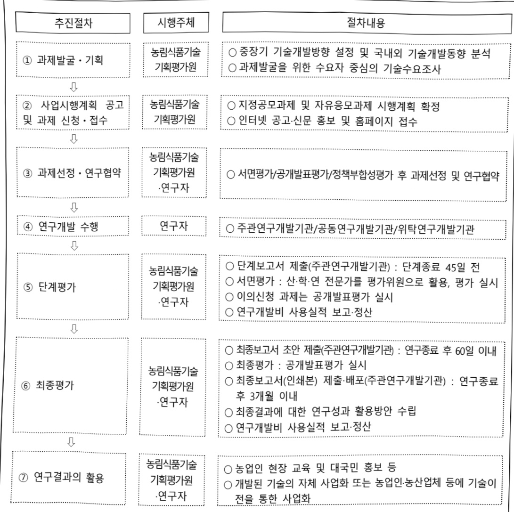

# 고부가가치 식품기술개발(R&D)

**해당 페이지**: PDF 2968 ~ 2978 쪽 해당

**부처**: 농림축산식품부
**분야**: 농림수산
**회계유형**: 농어촌구조 개선특별회계
**2026 확정예산**: 38887.0 백만원
**전년대비 증감률**: -4.9%
**AI 도메인**: 의료/바이오, 교통/모빌리티, 로봇, 농업/식품, 통신/네트워크

---

<table border=1 style='margin: auto; word-wrap: break-word;'><tr><td style='text-align: center; word-wrap: break-word;'>사 업 명</td></tr><tr><td style='text-align: center; word-wrap: break-word;'>(124) 고부가가치식품기술개발(R&amp;D) (2810-420)</td></tr></table>

□ 사업 코드 정보

<table border=1 style='margin: auto; word-wrap: break-word;'><tr><td style='text-align: center; word-wrap: break-word;'>구분</td><td style='text-align: center; word-wrap: break-word;'>회계</td><td style='text-align: center; word-wrap: break-word;'>소관</td><td style='text-align: center; word-wrap: break-word;'>실국(기관)</td><td style='text-align: center; word-wrap: break-word;'>계정</td><td style='text-align: center; word-wrap: break-word;'>분야</td><td style='text-align: center; word-wrap: break-word;'>부문</td></tr><tr><td style='text-align: center; word-wrap: break-word;'>코드</td><td style='text-align: center; word-wrap: break-word;'>농어촌구조</td><td rowspan="2">농림축산식품부</td><td rowspan="2">식품산업정책관실</td><td style='text-align: center; word-wrap: break-word;'>농어촌특별세</td><td style='text-align: center; word-wrap: break-word;'>100</td><td style='text-align: center; word-wrap: break-word;'>104</td></tr><tr><td style='text-align: center; word-wrap: break-word;'>명칭</td><td style='text-align: center; word-wrap: break-word;'>개선특별회계</td><td style='text-align: center; word-wrap: break-word;'>사업계정</td><td style='text-align: center; word-wrap: break-word;'>농림수산</td><td style='text-align: center; word-wrap: break-word;'>식품업</td></tr></table>

<table border=1 style='margin: auto; word-wrap: break-word;'><tr><td style='text-align: center; word-wrap: break-word;'>구분</td><td style='text-align: center; word-wrap: break-word;'>프로그램</td><td style='text-align: center; word-wrap: break-word;'>단위사업</td><td style='text-align: center; word-wrap: break-word;'>세부사업</td></tr><tr><td style='text-align: center; word-wrap: break-word;'>코드</td><td style='text-align: center; word-wrap: break-word;'>2800</td><td style='text-align: center; word-wrap: break-word;'>2810</td><td style='text-align: center; word-wrap: break-word;'>420</td></tr><tr><td style='text-align: center; word-wrap: break-word;'>명칭</td><td style='text-align: center; word-wrap: break-word;'>식품의식산업육성</td><td style='text-align: center; word-wrap: break-word;'>식품기술개발</td><td style='text-align: center; word-wrap: break-word;'>고부가가치식품기술개발(R&amp;D)</td></tr></table>

□ 사업 성격 (공통요구자료 II-1 작성유의사항 4. 참조, 해당하는 사항에 “○” 표시)

<table border=1 style='margin: auto; word-wrap: break-word;'><tr><td style='text-align: center; word-wrap: break-word;'>신규</td><td style='text-align: center; word-wrap: break-word;'>계속</td><td style='text-align: center; word-wrap: break-word;'>완료</td><td style='text-align: center; word-wrap: break-word;'>예비타당성 실시여부</td><td style='text-align: center; word-wrap: break-word;'>총사업비 관리대상</td><td style='text-align: center; word-wrap: break-word;'>총액계상 예산사업</td><td style='text-align: center; word-wrap: break-word;'>사업소관 변경정보 2025예산 시 소관</td></tr><tr><td style='text-align: center; word-wrap: break-word;'></td><td style='text-align: center; word-wrap: break-word;'>○</td><td style='text-align: center; word-wrap: break-word;'></td><td style='text-align: center; word-wrap: break-word;'></td><td style='text-align: center; word-wrap: break-word;'></td><td style='text-align: center; word-wrap: break-word;'></td><td style='text-align: center; word-wrap: break-word;'></td></tr></table>

□ 사업 지원 형태 및 지원을 (최소한 한 개는 반드시 선택하시오. 해당사항에 0 표시)

<table border=1 style='margin: auto; word-wrap: break-word;'><tr><td style='text-align: center; word-wrap: break-word;'>직접</td><td style='text-align: center; word-wrap: break-word;'>출자</td><td style='text-align: center; word-wrap: break-word;'>출연</td><td style='text-align: center; word-wrap: break-word;'>보조</td><td style='text-align: center; word-wrap: break-word;'>융자</td><td style='text-align: center; word-wrap: break-word;'>국고보조율(%)</td><td style='text-align: center; word-wrap: break-word;'>융자율(%)</td></tr><tr><td style='text-align: center; word-wrap: break-word;'></td><td style='text-align: center; word-wrap: break-word;'></td><td style='text-align: center; word-wrap: break-word;'>O</td><td style='text-align: center; word-wrap: break-word;'></td><td style='text-align: center; word-wrap: break-word;'></td><td style='text-align: center; word-wrap: break-word;'></td><td style='text-align: center; word-wrap: break-word;'></td></tr></table>

## □ 사업 소관부처 및 시행주체

<table border=1 style='margin: auto; word-wrap: break-word;'><tr><td style='text-align: center; word-wrap: break-word;'>사업명</td><td colspan="2">구분</td></tr><tr><td rowspan="4">고부가가치식품기술개발(R&amp;D)</td><td rowspan="3">소관부처</td><td style='text-align: center; word-wrap: break-word;'>실·국·과(팀)</td></tr><tr><td style='text-align: center; word-wrap: break-word;'>식품산업정책관실</td></tr><tr><td style='text-align: center; word-wrap: break-word;'>푸드테크정책과</td></tr><tr><td style='text-align: center; word-wrap: break-word;'>사업시행주체</td><td style='text-align: center; word-wrap: break-word;'>농림식품기술기획평가원</td></tr></table>

---

### 가.예산 총괄표

(단위: 백만원, %)

<table border=1 style='margin: auto; word-wrap: break-word;'><tr><td rowspan="2">사업명</td><td rowspan="2">2024년 결산</td><td colspan="2">2025년 예산</td><td colspan="2">2026년 예산</td><td rowspan="2">중감 (B-A)</td><td rowspan="2">(B-A)/A</td></tr><tr><td style='text-align: center; word-wrap: break-word;'>본예산</td><td style='text-align: center; word-wrap: break-word;'>추경(A)</td><td style='text-align: center; word-wrap: break-word;'>요구안</td><td style='text-align: center; word-wrap: break-word;'>본예산(B)</td></tr><tr><td style='text-align: center; word-wrap: break-word;'>고부가가치식품 기술개발(R&amp;D)</td><td style='text-align: center; word-wrap: break-word;'>37,611</td><td style='text-align: center; word-wrap: break-word;'>40,880</td><td style='text-align: center; word-wrap: break-word;'>40,880</td><td style='text-align: center; word-wrap: break-word;'>38,887</td><td style='text-align: center; word-wrap: break-word;'>38,887</td><td style='text-align: center; word-wrap: break-word;'>△1,993</td><td style='text-align: center; word-wrap: break-word;'>△4.9</td></tr></table>

□ 기능별(내역사업별), 예산 내역

(단위:백만원)

<table border=1 style='margin: auto; word-wrap: break-word;'><tr><td rowspan="2"></td><td colspan="5">2024</td><td colspan="5">2025</td><td rowspan="2">2026예산</td></tr><tr><td style='text-align: center; word-wrap: break-word;'>예산액(추경)</td><td style='text-align: center; word-wrap: break-word;'>예산현액</td><td style='text-align: center; word-wrap: break-word;'>집행액</td><td style='text-align: center; word-wrap: break-word;'>이월액</td><td style='text-align: center; word-wrap: break-word;'>불용액</td><td style='text-align: center; word-wrap: break-word;'>본예산</td><td style='text-align: center; word-wrap: break-word;'>예산현액</td><td style='text-align: center; word-wrap: break-word;'>집행액</td><td style='text-align: center; word-wrap: break-word;'>이월예산액</td><td style='text-align: center; word-wrap: break-word;'>불용예산액</td></tr><tr><td style='text-align: center; word-wrap: break-word;'>○ 기능별 분류(합계)</td><td style='text-align: center; word-wrap: break-word;'>37,611</td><td style='text-align: center; word-wrap: break-word;'>37,611</td><td style='text-align: center; word-wrap: break-word;'>37,611[36,460]</td><td style='text-align: center; word-wrap: break-word;'>-</td><td style='text-align: center; word-wrap: break-word;'>-</td><td style='text-align: center; word-wrap: break-word;'>40,880</td><td style='text-align: center; word-wrap: break-word;'>40,880</td><td style='text-align: center; word-wrap: break-word;'>40,880[40,688]</td><td style='text-align: center; word-wrap: break-word;'>-</td><td style='text-align: center; word-wrap: break-word;'>192</td><td style='text-align: center; word-wrap: break-word;'>38,887</td></tr><tr><td style='text-align: center; word-wrap: break-word;'>· 미래대응식품</td><td style='text-align: center; word-wrap: break-word;'>14,440</td><td style='text-align: center; word-wrap: break-word;'>14,440</td><td style='text-align: center; word-wrap: break-word;'>14,440[13,302]</td><td style='text-align: center; word-wrap: break-word;'>-</td><td style='text-align: center; word-wrap: break-word;'>-</td><td style='text-align: center; word-wrap: break-word;'>16,904</td><td style='text-align: center; word-wrap: break-word;'>16,904</td><td style='text-align: center; word-wrap: break-word;'>16,904[16,903]</td><td style='text-align: center; word-wrap: break-word;'>-</td><td style='text-align: center; word-wrap: break-word;'>1</td><td style='text-align: center; word-wrap: break-word;'>13,687</td></tr><tr><td style='text-align: center; word-wrap: break-word;'>· 식품 품질안전</td><td style='text-align: center; word-wrap: break-word;'>3,952</td><td style='text-align: center; word-wrap: break-word;'>3,952</td><td style='text-align: center; word-wrap: break-word;'>3,952[3,939]</td><td style='text-align: center; word-wrap: break-word;'>-</td><td style='text-align: center; word-wrap: break-word;'>-</td><td style='text-align: center; word-wrap: break-word;'>4,357</td><td style='text-align: center; word-wrap: break-word;'>4,357</td><td style='text-align: center; word-wrap: break-word;'>4,357[4,257]</td><td style='text-align: center; word-wrap: break-word;'>-</td><td style='text-align: center; word-wrap: break-word;'>100</td><td style='text-align: center; word-wrap: break-word;'>5,250</td></tr><tr><td style='text-align: center; word-wrap: break-word;'>· 차세대 식품가공</td><td style='text-align: center; word-wrap: break-word;'>5,692</td><td style='text-align: center; word-wrap: break-word;'>5,692</td><td style='text-align: center; word-wrap: break-word;'>5,692[5,692]</td><td style='text-align: center; word-wrap: break-word;'>-</td><td style='text-align: center; word-wrap: break-word;'>-</td><td style='text-align: center; word-wrap: break-word;'>7,393</td><td style='text-align: center; word-wrap: break-word;'>7,393</td><td style='text-align: center; word-wrap: break-word;'>7,393[7,302]</td><td style='text-align: center; word-wrap: break-word;'>-</td><td style='text-align: center; word-wrap: break-word;'>91</td><td style='text-align: center; word-wrap: break-word;'>8,128</td></tr><tr><td style='text-align: center; word-wrap: break-word;'>· 글로벌 푸드테크공동연구</td><td style='text-align: center; word-wrap: break-word;'>1,700</td><td style='text-align: center; word-wrap: break-word;'>1,700</td><td style='text-align: center; word-wrap: break-word;'>1,700[1,700]</td><td style='text-align: center; word-wrap: break-word;'>-</td><td style='text-align: center; word-wrap: break-word;'>-</td><td style='text-align: center; word-wrap: break-word;'>2,267</td><td style='text-align: center; word-wrap: break-word;'>2,267</td><td style='text-align: center; word-wrap: break-word;'>2,267[2,267]</td><td style='text-align: center; word-wrap: break-word;'>-</td><td style='text-align: center; word-wrap: break-word;'>-</td><td style='text-align: center; word-wrap: break-word;'>2,267</td></tr><tr><td style='text-align: center; word-wrap: break-word;'>· 스마트 유통관리</td><td style='text-align: center; word-wrap: break-word;'>2,804</td><td style='text-align: center; word-wrap: break-word;'>2,804</td><td style='text-align: center; word-wrap: break-word;'>2,804[2,804]</td><td style='text-align: center; word-wrap: break-word;'>-</td><td style='text-align: center; word-wrap: break-word;'>-</td><td style='text-align: center; word-wrap: break-word;'>936</td><td style='text-align: center; word-wrap: break-word;'>936</td><td style='text-align: center; word-wrap: break-word;'>936[936]</td><td style='text-align: center; word-wrap: break-word;'>-</td><td style='text-align: center; word-wrap: break-word;'>-</td><td style='text-align: center; word-wrap: break-word;'>936</td></tr><tr><td style='text-align: center; word-wrap: break-word;'>· 물류유통 자동화</td><td style='text-align: center; word-wrap: break-word;'>4,119</td><td style='text-align: center; word-wrap: break-word;'>4,119</td><td style='text-align: center; word-wrap: break-word;'>4,119[4,119]</td><td style='text-align: center; word-wrap: break-word;'>-</td><td style='text-align: center; word-wrap: break-word;'>-</td><td style='text-align: center; word-wrap: break-word;'>4,119</td><td style='text-align: center; word-wrap: break-word;'>4,119</td><td style='text-align: center; word-wrap: break-word;'>4,119[4,119]</td><td style='text-align: center; word-wrap: break-word;'>-</td><td style='text-align: center; word-wrap: break-word;'>-</td><td style='text-align: center; word-wrap: break-word;'>4,119</td></tr><tr><td style='text-align: center; word-wrap: break-word;'>· 커스텀푸드 스마트생산기술개발</td><td style='text-align: center; word-wrap: break-word;'>-</td><td style='text-align: center; word-wrap: break-word;'>-</td><td style='text-align: center; word-wrap: break-word;'>-</td><td style='text-align: center; word-wrap: break-word;'>-</td><td style='text-align: center; word-wrap: break-word;'>-</td><td style='text-align: center; word-wrap: break-word;'>-</td><td style='text-align: center; word-wrap: break-word;'>-</td><td style='text-align: center; word-wrap: break-word;'>-</td><td style='text-align: center; word-wrap: break-word;'>-</td><td style='text-align: center; word-wrap: break-word;'>-</td><td style='text-align: center; word-wrap: break-word;'>4,500</td></tr><tr><td style='text-align: center; word-wrap: break-word;'>· 5G기반 식품안전생산기술개발</td><td style='text-align: center; word-wrap: break-word;'>4,904</td><td style='text-align: center; word-wrap: break-word;'>4,904</td><td style='text-align: center; word-wrap: break-word;'>4,904[4,904]</td><td style='text-align: center; word-wrap: break-word;'>-</td><td style='text-align: center; word-wrap: break-word;'>-</td><td style='text-align: center; word-wrap: break-word;'>4,904</td><td style='text-align: center; word-wrap: break-word;'>4,904</td><td style='text-align: center; word-wrap: break-word;'>4,904[4,904]</td><td style='text-align: center; word-wrap: break-word;'>-</td><td style='text-align: center; word-wrap: break-word;'>-</td><td style='text-align: center; word-wrap: break-word;'>-</td></tr><tr><td style='text-align: center; word-wrap: break-word;'>○ 비목별 분류(합계)</td><td style='text-align: center; word-wrap: break-word;'>37,611</td><td style='text-align: center; word-wrap: break-word;'>37,611</td><td style='text-align: center; word-wrap: break-word;'>37,611[36,460]</td><td style='text-align: center; word-wrap: break-word;'>-</td><td style='text-align: center; word-wrap: break-word;'>-</td><td style='text-align: center; word-wrap: break-word;'>40,880</td><td style='text-align: center; word-wrap: break-word;'>40,880</td><td style='text-align: center; word-wrap: break-word;'>40,880[40,688]</td><td style='text-align: center; word-wrap: break-word;'>-</td><td style='text-align: center; word-wrap: break-word;'>192</td><td style='text-align: center; word-wrap: break-word;'>38,887</td></tr><tr><td style='text-align: center; word-wrap: break-word;'>· 연구개발활동비등(360-05)</td><td style='text-align: center; word-wrap: break-word;'>37,611</td><td style='text-align: center; word-wrap: break-word;'>37,611</td><td style='text-align: center; word-wrap: break-word;'>37,611[36,460]</td><td style='text-align: center; word-wrap: break-word;'>-</td><td style='text-align: center; word-wrap: break-word;'>-</td><td style='text-align: center; word-wrap: break-word;'>40,880</td><td style='text-align: center; word-wrap: break-word;'>40,880</td><td style='text-align: center; word-wrap: break-word;'>40,880[40,688]</td><td style='text-align: center; word-wrap: break-word;'>-</td><td style='text-align: center; word-wrap: break-word;'>192</td><td style='text-align: center; word-wrap: break-word;'>38,887</td></tr><tr><td style='text-align: center; word-wrap: break-word;'>○ 기능비목별 분류(합계)</td><td style='text-align: center; word-wrap: break-word;'>37,611</td><td style='text-align: center; word-wrap: break-word;'>37,611</td><td style='text-align: center; word-wrap: break-word;'>37,611[36,460]</td><td style='text-align: center; word-wrap: break-word;'>-</td><td style='text-align: center; word-wrap: break-word;'>-</td><td style='text-align: center; word-wrap: break-word;'>40,880</td><td style='text-align: center; word-wrap: break-word;'>40,880</td><td style='text-align: center; word-wrap: break-word;'>40,880[40,688]</td><td style='text-align: center; word-wrap: break-word;'>-</td><td style='text-align: center; word-wrap: break-word;'>192</td><td style='text-align: center; word-wrap: break-word;'>38,887</td></tr><tr><td style='text-align: center; word-wrap: break-word;'>· 미래대응식품</td><td style='text-align: center; word-wrap: break-word;'>14,440</td><td style='text-align: center; word-wrap: break-word;'>14,440</td><td style='text-align: center; word-wrap: break-word;'>14,440[13,302]</td><td style='text-align: center; word-wrap: break-word;'>-</td><td style='text-align: center; word-wrap: break-word;'>-</td><td style='text-align: center; word-wrap: break-word;'>16,904</td><td style='text-align: center; word-wrap: break-word;'>16,904</td><td style='text-align: center; word-wrap: break-word;'>16,904[16,903]</td><td style='text-align: center; word-wrap: break-word;'>-</td><td style='text-align: center; word-wrap: break-word;'>1</td><td style='text-align: center; word-wrap: break-word;'>13,687</td></tr><tr><td style='text-align: center; word-wrap: break-word;'>· 연구개발활동비등(360-05)</td><td style='text-align: center; word-wrap: break-word;'>14,440</td><td style='text-align: center; word-wrap: break-word;'>14,440</td><td style='text-align: center; word-wrap: break-word;'>14,440[13,302]</td><td style='text-align: center; word-wrap: break-word;'>-</td><td style='text-align: center; word-wrap: break-word;'>-</td><td style='text-align: center; word-wrap: break-word;'>16,904</td><td style='text-align: center; word-wrap: break-word;'>16,904</td><td style='text-align: center; word-wrap: break-word;'>16,904[16,903]</td><td style='text-align: center; word-wrap: break-word;'>-</td><td style='text-align: center; word-wrap: break-word;'>1</td><td style='text-align: center; word-wrap: break-word;'>13,687</td></tr><tr><td style='text-align: center; word-wrap: break-word;'>· 식품 품질안전</td><td style='text-align: center; word-wrap: break-word;'>3,952</td><td style='text-align: center; word-wrap: break-word;'>3,952</td><td style='text-align: center; word-wrap: break-word;'>3,952[3,939]</td><td style='text-align: center; word-wrap: break-word;'>-</td><td style='text-align: center; word-wrap: break-word;'>-</td><td style='text-align: center; word-wrap: break-word;'>4,357</td><td style='text-align: center; word-wrap: break-word;'>4,357</td><td style='text-align: center; word-wrap: break-word;'>4,357[4,257]</td><td style='text-align: center; word-wrap: break-word;'>-</td><td style='text-align: center; word-wrap: break-word;'>100</td><td style='text-align: center; word-wrap: break-word;'>5,250</td></tr></table>

---

<table border=1 style='margin: auto; word-wrap: break-word;'><tr><td rowspan="2"></td><td colspan="5">2024</td><td colspan="5">2025</td><td rowspan="2">2026예산</td></tr><tr><td style='text-align: center; word-wrap: break-word;'>예산액(추정)</td><td style='text-align: center; word-wrap: break-word;'>예산현액</td><td style='text-align: center; word-wrap: break-word;'>집행액</td><td style='text-align: center; word-wrap: break-word;'>이월액</td><td style='text-align: center; word-wrap: break-word;'>불용액</td><td style='text-align: center; word-wrap: break-word;'>본예산</td><td style='text-align: center; word-wrap: break-word;'>예산현액</td><td style='text-align: center; word-wrap: break-word;'>집행액</td><td style='text-align: center; word-wrap: break-word;'>이월예산액</td><td style='text-align: center; word-wrap: break-word;'>불용예산액</td></tr><tr><td style='text-align: center; word-wrap: break-word;'>-연구개발활동비등(360-05)</td><td style='text-align: center; word-wrap: break-word;'>3,952</td><td style='text-align: center; word-wrap: break-word;'>3,952</td><td style='text-align: center; word-wrap: break-word;'>3,952[3,939]</td><td style='text-align: center; word-wrap: break-word;'>-</td><td style='text-align: center; word-wrap: break-word;'>-</td><td style='text-align: center; word-wrap: break-word;'>4,357</td><td style='text-align: center; word-wrap: break-word;'>4,357[4,257]</td><td style='text-align: center; word-wrap: break-word;'>-</td><td style='text-align: center; word-wrap: break-word;'>100</td><td style='text-align: center; word-wrap: break-word;'>5,250</td><td style='text-align: center; word-wrap: break-word;'></td></tr><tr><td style='text-align: center; word-wrap: break-word;'>·차세대 식품가공</td><td style='text-align: center; word-wrap: break-word;'>5,692</td><td style='text-align: center; word-wrap: break-word;'>5,692</td><td style='text-align: center; word-wrap: break-word;'>5,692[5,692]</td><td style='text-align: center; word-wrap: break-word;'>-</td><td style='text-align: center; word-wrap: break-word;'>-</td><td style='text-align: center; word-wrap: break-word;'>7,393</td><td style='text-align: center; word-wrap: break-word;'>7,393[7,302]</td><td style='text-align: center; word-wrap: break-word;'>-</td><td style='text-align: center; word-wrap: break-word;'>91</td><td style='text-align: center; word-wrap: break-word;'>8,128</td><td style='text-align: center; word-wrap: break-word;'></td></tr><tr><td style='text-align: center; word-wrap: break-word;'>-연구개발활동비등(360-05)</td><td style='text-align: center; word-wrap: break-word;'>5,692</td><td style='text-align: center; word-wrap: break-word;'>5,692</td><td style='text-align: center; word-wrap: break-word;'>5,692[5,692]</td><td style='text-align: center; word-wrap: break-word;'>-</td><td style='text-align: center; word-wrap: break-word;'>-</td><td style='text-align: center; word-wrap: break-word;'>7,393</td><td style='text-align: center; word-wrap: break-word;'>7,393[7,302]</td><td style='text-align: center; word-wrap: break-word;'>-</td><td style='text-align: center; word-wrap: break-word;'>91</td><td style='text-align: center; word-wrap: break-word;'>8,128</td><td style='text-align: center; word-wrap: break-word;'></td></tr><tr><td style='text-align: center; word-wrap: break-word;'>·글로벌 푸드테크공동연구</td><td style='text-align: center; word-wrap: break-word;'>1,700</td><td style='text-align: center; word-wrap: break-word;'>1,700</td><td style='text-align: center; word-wrap: break-word;'>1,700[1,700]</td><td style='text-align: center; word-wrap: break-word;'>-</td><td style='text-align: center; word-wrap: break-word;'>-</td><td style='text-align: center; word-wrap: break-word;'>2,267</td><td style='text-align: center; word-wrap: break-word;'>2,267[2,267]</td><td style='text-align: center; word-wrap: break-word;'>-</td><td style='text-align: center; word-wrap: break-word;'>-</td><td style='text-align: center; word-wrap: break-word;'>2,267</td><td style='text-align: center; word-wrap: break-word;'></td></tr><tr><td style='text-align: center; word-wrap: break-word;'>-연구개발활동비등(360-05)</td><td style='text-align: center; word-wrap: break-word;'>1,700</td><td style='text-align: center; word-wrap: break-word;'>1,700</td><td style='text-align: center; word-wrap: break-word;'>1,700[1,700]</td><td style='text-align: center; word-wrap: break-word;'>-</td><td style='text-align: center; word-wrap: break-word;'>-</td><td style='text-align: center; word-wrap: break-word;'>2,267</td><td style='text-align: center; word-wrap: break-word;'>2,267[2,267]</td><td style='text-align: center; word-wrap: break-word;'>-</td><td style='text-align: center; word-wrap: break-word;'>-</td><td style='text-align: center; word-wrap: break-word;'>2,267</td><td style='text-align: center; word-wrap: break-word;'></td></tr><tr><td style='text-align: center; word-wrap: break-word;'>·스마트 유통관리</td><td style='text-align: center; word-wrap: break-word;'>2,804</td><td style='text-align: center; word-wrap: break-word;'>2,804</td><td style='text-align: center; word-wrap: break-word;'>2,804[2,804]</td><td style='text-align: center; word-wrap: break-word;'>-</td><td style='text-align: center; word-wrap: break-word;'>-</td><td style='text-align: center; word-wrap: break-word;'>936</td><td style='text-align: center; word-wrap: break-word;'>936[936]</td><td style='text-align: center; word-wrap: break-word;'>-</td><td style='text-align: center; word-wrap: break-word;'>-</td><td style='text-align: center; word-wrap: break-word;'>936</td><td style='text-align: center; word-wrap: break-word;'></td></tr><tr><td style='text-align: center; word-wrap: break-word;'>-연구개발활동비등(360-05)</td><td style='text-align: center; word-wrap: break-word;'>2,804</td><td style='text-align: center; word-wrap: break-word;'>2,804</td><td style='text-align: center; word-wrap: break-word;'>2,804[2,804]</td><td style='text-align: center; word-wrap: break-word;'>-</td><td style='text-align: center; word-wrap: break-word;'>-</td><td style='text-align: center; word-wrap: break-word;'>936</td><td style='text-align: center; word-wrap: break-word;'>936[936]</td><td style='text-align: center; word-wrap: break-word;'>-</td><td style='text-align: center; word-wrap: break-word;'>-</td><td style='text-align: center; word-wrap: break-word;'>936</td><td style='text-align: center; word-wrap: break-word;'></td></tr><tr><td style='text-align: center; word-wrap: break-word;'>·물류유통 자동화</td><td style='text-align: center; word-wrap: break-word;'>4,119</td><td style='text-align: center; word-wrap: break-word;'>4,119</td><td style='text-align: center; word-wrap: break-word;'>4,119[4,119]</td><td style='text-align: center; word-wrap: break-word;'>-</td><td style='text-align: center; word-wrap: break-word;'>-</td><td style='text-align: center; word-wrap: break-word;'>4,119</td><td style='text-align: center; word-wrap: break-word;'>4,119[4,119]</td><td style='text-align: center; word-wrap: break-word;'>-</td><td style='text-align: center; word-wrap: break-word;'>-</td><td style='text-align: center; word-wrap: break-word;'>4,119</td><td style='text-align: center; word-wrap: break-word;'></td></tr><tr><td style='text-align: center; word-wrap: break-word;'>-연구개발활동비등(360-05)</td><td style='text-align: center; word-wrap: break-word;'>4,119</td><td style='text-align: center; word-wrap: break-word;'>4,119</td><td style='text-align: center; word-wrap: break-word;'>4,119[4,119]</td><td style='text-align: center; word-wrap: break-word;'>-</td><td style='text-align: center; word-wrap: break-word;'>-</td><td style='text-align: center; word-wrap: break-word;'>4,119</td><td style='text-align: center; word-wrap: break-word;'>4,119[4,119]</td><td style='text-align: center; word-wrap: break-word;'>-</td><td style='text-align: center; word-wrap: break-word;'>-</td><td style='text-align: center; word-wrap: break-word;'>4,119</td><td style='text-align: center; word-wrap: break-word;'></td></tr><tr><td style='text-align: center; word-wrap: break-word;'>·커스텀푸드 스마트생산기술개발</td><td style='text-align: center; word-wrap: break-word;'>-</td><td style='text-align: center; word-wrap: break-word;'>-</td><td style='text-align: center; word-wrap: break-word;'>-</td><td style='text-align: center; word-wrap: break-word;'>-</td><td style='text-align: center; word-wrap: break-word;'>-</td><td style='text-align: center; word-wrap: break-word;'>-</td><td style='text-align: center; word-wrap: break-word;'>-</td><td style='text-align: center; word-wrap: break-word;'>-</td><td style='text-align: center; word-wrap: break-word;'>-</td><td style='text-align: center; word-wrap: break-word;'>4,500</td><td style='text-align: center; word-wrap: break-word;'></td></tr><tr><td style='text-align: center; word-wrap: break-word;'>-연구개발활동비등(360-05)</td><td style='text-align: center; word-wrap: break-word;'>-</td><td style='text-align: center; word-wrap: break-word;'>-</td><td style='text-align: center; word-wrap: break-word;'>-</td><td style='text-align: center; word-wrap: break-word;'>-</td><td style='text-align: center; word-wrap: break-word;'>-</td><td style='text-align: center; word-wrap: break-word;'>-</td><td style='text-align: center; word-wrap: break-word;'>-</td><td style='text-align: center; word-wrap: break-word;'>-</td><td style='text-align: center; word-wrap: break-word;'>-</td><td style='text-align: center; word-wrap: break-word;'>4,500</td><td style='text-align: center; word-wrap: break-word;'></td></tr><tr><td style='text-align: center; word-wrap: break-word;'>·5G기반 식품안전생산기술개발</td><td style='text-align: center; word-wrap: break-word;'>4,904</td><td style='text-align: center; word-wrap: break-word;'>4,904</td><td style='text-align: center; word-wrap: break-word;'>4,904[4,904]</td><td style='text-align: center; word-wrap: break-word;'>-</td><td style='text-align: center; word-wrap: break-word;'>-</td><td style='text-align: center; word-wrap: break-word;'>4,904</td><td style='text-align: center; word-wrap: break-word;'>4,904[4,904]</td><td style='text-align: center; word-wrap: break-word;'>-</td><td style='text-align: center; word-wrap: break-word;'>-</td><td style='text-align: center; word-wrap: break-word;'>-</td><td style='text-align: center; word-wrap: break-word;'></td></tr><tr><td style='text-align: center; word-wrap: break-word;'>-연구개발활동비등(360-05)</td><td style='text-align: center; word-wrap: break-word;'>4,904</td><td style='text-align: center; word-wrap: break-word;'>4,904</td><td style='text-align: center; word-wrap: break-word;'>4,904[4,904]</td><td style='text-align: center; word-wrap: break-word;'>-</td><td style='text-align: center; word-wrap: break-word;'>-</td><td style='text-align: center; word-wrap: break-word;'>4,904</td><td style='text-align: center; word-wrap: break-word;'>4,904[4,904]</td><td style='text-align: center; word-wrap: break-word;'>-</td><td style='text-align: center; word-wrap: break-word;'>-</td><td style='text-align: center; word-wrap: break-word;'>-</td><td style='text-align: center; word-wrap: break-word;'></td></tr></table>

---

### 나. 사업설명자료

## 1 ) 사업목적·내용

- (고부가가치식품기술개발) 식품산업을 견인할 K-Food 핵심 기술경쟁력 확보 및 산업화 기술개발 지원으로 식품산업 생산성 제고 및 경쟁력 강화

- (미래대응식품) 미래 식품 시장 선점을 위해 질환 관리식, 특수·대체식품 등 융·복합식품 분야 기술개발 지원

- (식품 품질안전) 식품 품질·안전 관리 개선을 위한 가공·관리기술, 친환경·기능성

식품 포장 기술 개발 등 안심 먹거리 공급을 위한 핵심 기술 개발 추진

- (차세대 식품가공) 식품산업 가치사슬 내 경쟁력 확보에 필수적인 주요 소재 개발,

식품 생산 관련 부품, 설비 국산화 등 차세대 식품 제조 기술개발 지원

- (글로벌 푸드테크 공동연구) 푸드테크 분야 중 10대 핵심기술에 대한 글로벌 격차 해소를 위한 해외기업, 연구소, 대학 등과의 글로벌 공동연구 지원

- (스마트 유통관리) 농식품 지능형 저장·수급, 품질관리 기술개발 및 유통·소비 전주기

데이터 활용 강화를 위한 연계 체계 구축

- (물류유통 자동화) 신선 농산물 물류·유통 분야에 자율주행 로봇 등 첨단 기술 접목을 통해 APC 및 물류센터 자동화·스마트화

- (커스텀푸드 스마트생산기술개발) 산업 경쟁력 강화를 위해 ICT·AI·로봇 등 융합 기술을 통한 식품 제조 분야의 생태계 고도화 기반 확보

- (5G기반 식품안전생산기술개발) 중소 식품업 현안 해결을 위해 5G 기반의 고효율·저비용 식품 생산·제조 등 스마트 식품 공장 원천기술 개발 및 실증

## 2 ) 사업개요

## □ 사업근거 및 추진경위

① 법령상 근거 조항 적시

-「농업·농촌 및 식품산업 기본법」제28조(농업 관련 조합법인 및 회사법인의 육성) 국가와 지방자치단체는 농업의 생산성 향상과 농산물의 출하·유통·가공·판매·수출 등의 효율화를 위하여 협업적 또는 기업적 농업경영을 수행하는 영농조합법인(쌀뿔組合法人) 및 농업회사법인(農業會社法人)의 육성에 필요한 정책을 수립·시행하여야 한다.

- 「농업·농촌 및 식품산업 기본법」 제35조(농업 및 식품 관련 기술·연구 등의 진흥)

① 국가와 지방자치단체는 농업 및 식품 관련 산업의 생산성 및 경쟁력 향상을 위하여 농업 생산기술, 농업 생산기반 정비기술, 농산물 생산 이후의 관리기술, 농업 경영기법, 농업인 안전작업기술, 농산물 유통기술, 농산물 가공·식품 제조기술 및 음식물 조리법 등에 관한 연구·개발·보급과 농업 및 식품산업 현장연구, ‘산학연 공동연구 및 연구평가 관리체제의 확립 등에 관한 종합적인 계획을 세우고 시행하여야 한다.

---

-「농업·농촌 및 식품산업 기본법」제36조(농업 및 식품 관련 산업의 기술개발 추진)

① 국가와 지방자치단체는 농업 및 식품 관련 산업의 기술 등을 신속하게 개발·보급하기 위하여 관련 연구기관 또는 단체 등에 농업 및 식품 관련 산업의 기술개발 연구를 수행하게 할 수 있다. ② 국가와 지방자치단체는 제1항에 따라 농업 및 식품 관련 산업의 기술개발 연구를 수행하는 관련 연구기관 또는 단체 등에 대하여 필요한 자금을 지원할 수 있다.

- 농림식품과학기술 육성법 제6조(연구개발사업의 추진) ① 정부는 종합계획 및 시행계획을 효율적으로 추진하기 위하여 농림식품과학기술 연구개발사업을 한다.

- 「식품산업진흥법」 제8조(식품산업 관련 기술개발의 촉진) ① 농림축산식품부장관은 식품산업 진흥에 관한 기술의 개발을 촉진하기 위하여 다음 각호의 사항을 추진하여야 한다.

1. 식품산업기술 동향 및 수요조사

2. 식품산업의 진흥·육성 등에 관한 기술의 연구·개발

3. 전통식품 세계화에 관한 기술의 연구·개발

3의2. 식품의 기능성에 대한 연구·개발

4. 개발된 기술의 권리화 및 실용화에 관한 사항

5. 기술협력 및 정보교류에 관한 사항

6. 그 밖에 식품산업 관련 기술의 연구·개발에 필요한 사항

② 농림축산식품부장관은 제1항에 따른 식품산업 관련 기술개발의 촉진을 위하여 식품산업기술 등을 연구·개발하거나 산업화하는 자에 대하여 필요한 경비를 지원할 수 있다.

## ② 추진경위

- 농림수산식품부 출범('08)으로 농식품부가 식품산업 진흥업무를 담당하게 되어 본격적인 식품산업 R&D 추진 필요성 제기

* '식품산업 R&D 중장기계획'을 수립('09.)하여 농림기술개발(R&D) 사업에서 식품 부문을 분리·확대 추진('10.)

- 코로나19 극복을 위한 일몰관리혁신 대상사업으로 확정('20.5.)되어, '25년까지 일몰 연장

* '19~'20년도에는 신규과제 추진을 못하였고, '21년부터 신규과제 다시 공모

·식품산업 현안 대응 및 유망 분야 지원 체계 구축을 위해 내역사업 개편

(기존) 기능성·전통식품, 식품 품질관리, 식품 기자재·신가공

(변경) 미래대응식품, 식품 품질안전, 차세대 식품가공, 5G기반 식품안전생산 기술 개발

* 식품 분야 단기 R&D 사업인 ‘맞춤형혁신식품 및 천연안심소재기술개발’(19~21)

사업은 종료, ‘고부가가치식품기술개발’ 단일 사업으로 구조 조정

- '24년부터 '스마트농산물유통저장기술개발(R&D)' 사업의 내역사업 '스마트 유통 관리', '물류유통 자동화'를 동 사업으로 이관하여 추진

---

③ 국정과제 연관성

- 이재명 정부 대선공약 '스마트 데이터농업, 푸드테크·그린바이오 산업, K-푸드 등 농업을 미래 농산업으로 전환'

- 이재명 정부 국정과제 '국민 먹거리를 지키는 국가전략산업으로 농업 육성'

- 농식품부 실천과제 '스마트 데이터 농업 등 미래 신산업 육성'

## □ 주요내용

① 사업규모

- 총사업비 : 해당없음

- 사업기간 : '10~계속

- 최근 5년 간 투입된 사업비

<table border=1 style='margin: auto; word-wrap: break-word;'><tr><td style='text-align: center; word-wrap: break-word;'>연도</td><td style='text-align: center; word-wrap: break-word;'>2022</td><td style='text-align: center; word-wrap: break-word;'>2023</td><td style='text-align: center; word-wrap: break-word;'>2024</td><td style='text-align: center; word-wrap: break-word;'>2025</td><td style='text-align: center; word-wrap: break-word;'>2026</td></tr><tr><td style='text-align: center; word-wrap: break-word;'>사업비</td><td style='text-align: center; word-wrap: break-word;'>33,816</td><td style='text-align: center; word-wrap: break-word;'>38,035</td><td style='text-align: center; word-wrap: break-word;'>37,611</td><td style='text-align: center; word-wrap: break-word;'>40,880</td><td style='text-align: center; word-wrap: break-word;'>38,887</td></tr></table>

② 사업추진체계

-사업시행방법:출연 100%(대기업 50%,중견기업 30%,중소기업 25% 이상 매칭)

- 사업시행주체 : 농림식품기술기획평가원

-사업 수혜자 : 농산업체, 대학, 연구소, 기업, 농업회사법인 등

- 보조, 융자, 출연, 출자 등의 경우 보조·융자 등 지원 비율 및 법적근거

<table border=1 style='margin: auto; word-wrap: break-word;'><tr><td style='text-align: center; word-wrap: break-word;'>내역사업명</td><td style='text-align: center; word-wrap: break-word;'>구분</td><td style='text-align: center; word-wrap: break-word;'>피보조·피출연 등 기관명</td><td style='text-align: center; word-wrap: break-word;'>지원 금액 (2026예산)</td><td style='text-align: center; word-wrap: break-word;'>지원 비율(%)</td><td style='text-align: center; word-wrap: break-word;'>보조율 법적근거 (해당 조항)</td></tr><tr><td style='text-align: center; word-wrap: break-word;'>미래대응식품</td><td style='text-align: center; word-wrap: break-word;'>출연</td><td style='text-align: center; word-wrap: break-word;'>농림식품 기술기획 평가원</td><td style='text-align: center; word-wrap: break-word;'>13,687백만원</td><td style='text-align: center; word-wrap: break-word;'>100</td><td style='text-align: center; word-wrap: break-word;'>농림식품과학기술육성법 제6조</td></tr><tr><td style='text-align: center; word-wrap: break-word;'>식품 품질안전</td><td style='text-align: center; word-wrap: break-word;'>출연</td><td style='text-align: center; word-wrap: break-word;'>농림식품 기술기획 평가원</td><td style='text-align: center; word-wrap: break-word;'>5,250백만원</td><td style='text-align: center; word-wrap: break-word;'>100</td><td style='text-align: center; word-wrap: break-word;'>농림식품과학기술육성법 제6조</td></tr><tr><td style='text-align: center; word-wrap: break-word;'>차체식품기공</td><td style='text-align: center; word-wrap: break-word;'>출연</td><td style='text-align: center; word-wrap: break-word;'>농림식품 기술기획 평가원</td><td style='text-align: center; word-wrap: break-word;'>8,128백만원</td><td style='text-align: center; word-wrap: break-word;'>100</td><td style='text-align: center; word-wrap: break-word;'>농림식품과학기술육성법 제6조</td></tr><tr><td style='text-align: center; word-wrap: break-word;'>글로벌 꾸모레고 공동연구</td><td style='text-align: center; word-wrap: break-word;'>출연</td><td style='text-align: center; word-wrap: break-word;'>농림식품 기술기획 평가원</td><td style='text-align: center; word-wrap: break-word;'>2,267백만원</td><td style='text-align: center; word-wrap: break-word;'>100</td><td style='text-align: center; word-wrap: break-word;'>농림식품과학기술육성법 제6조</td></tr><tr><td style='text-align: center; word-wrap: break-word;'>스마트 유통관리</td><td style='text-align: center; word-wrap: break-word;'>출연</td><td style='text-align: center; word-wrap: break-word;'>농림식품 기술기획 평가원</td><td style='text-align: center; word-wrap: break-word;'>936백만원</td><td style='text-align: center; word-wrap: break-word;'>100</td><td style='text-align: center; word-wrap: break-word;'>농림식품과학기술육성법 제6조</td></tr><tr><td style='text-align: center; word-wrap: break-word;'>물류유통 자동화</td><td style='text-align: center; word-wrap: break-word;'>출연</td><td style='text-align: center; word-wrap: break-word;'>농림식품 기술기획 평가원</td><td style='text-align: center; word-wrap: break-word;'>4,119백만원</td><td style='text-align: center; word-wrap: break-word;'>100</td><td style='text-align: center; word-wrap: break-word;'>농림식품과학기술육성법 제6조</td></tr><tr><td style='text-align: center; word-wrap: break-word;'>커스텀푸드 스마트생산 기술개발</td><td style='text-align: center; word-wrap: break-word;'>출연</td><td style='text-align: center; word-wrap: break-word;'>농림식품 기술기획 평가원</td><td style='text-align: center; word-wrap: break-word;'>4,500백만원</td><td style='text-align: center; word-wrap: break-word;'>100</td><td style='text-align: center; word-wrap: break-word;'>농림식품과학기술육성법 제6조</td></tr></table>

---

① 미래대응식품 : ('25) 16,904백만원 → ('26요구) 13,687백만원, 3,217백만원 감액

- (요구) 푸드테크 핵심기술(세포배양식품, 식물성 기반 대체식품, 맞춤형 식품, 간편식 등) 및 기능성 식품 기술에 대한 지원 확대 등을 위한 13,687백만원 요구

- (산출) (기일치) 12개×478백만×12/12개월=5,732백만원

(종료) 13개×327백만×12/12개월=4,255백만원

(다/상) 13개×379백만×9/12=3,700백만원

② 식품 품질안전 : ('25) 4,357백만원 → ('26요구) 5,250백만원, 893백만원 증액

- (요구) 푸드테크 핵심기술(친환경 포장재 개발, 식품 스마트 유통 등) 및 품질·안전 개선을 위한 가공 기술 연구개발 추진을 위해 5,250백만원 요구

- (산출) (기일치) 8개×398백만×12/12개월=3,185백만원

(종료) 2개×183백만×12/12개월=365백만원

(다/상) 8개×283백만×9/12개월=1,700백만원

③ 차세대 식품가공 : ('25) 7,393백만원 → ('26요구) 8,128백만원, 735백만원 증액

- (요구) 푸드테크 핵심기술(식품 업사이클링 기술, 3D식품프린팅 제조기술, 간편식 제조기술, 스마트제조기술 등),

쌀가공 기술 및 주요 식품 소재·가공 기술 개발 추진을 위해 8,128백만원 요구

- (산출) (기일치) 13개×392백만×12/12개월=5,095백만원

(종료) 7개×205백만×12/12개월=1,433백만원

(다/상) 7개×305백만×9/12개월=1,600백만원

④ 글로벌 푸드테크 공동연구 : ('25) 2,267백만원 → ('26요구) 2,267백만원

- (요구) 식물성 대체식품, 식품 로봇·업사이클링 등 푸드테크 핵심분야에서 국내 산·학·연과 해외 R&D 기관과의 공동연구를 통해 핵심기술 확보 및 해외 진출 기반 마련을 위한 2,267백만원 요구

- (산출) (기일치) 3개×756백만×12/12개월=2,267백만원

⑤ 스마트 유통관리 : ('25) 936백만원 → ('26요구) 936백만원

- (요구) 실시간 위해요소 모니터링 기술, 융복합 저장 시스템, 데이터 기반의 농축산물 생산-수확-출하-유통 관리 통합 플랫폼 개발 등을 위한 936백만원 요구

- (산출) (종료) 2개×468백만×12/12개월=936백만원

⑥ 물류유통 자동화 : (25) 4,119백만원 → (26요구) 4,119백만원

- (요구) 신선 농산물 물류·유통 분야에 자율주행 로봇 등 첨단 기술 접목을 통해 산지유통센터 및 물류센터 자동화·스마트화를 위한 4,119백만원 요구

- (산출) (종료) 1개×4,119백만×12/12개월=4,119백만원

⑦ 커스텀푸드 스마트생산기술개발 : (25) - → (26요구) 4,500백만원

- (요구) 산업 경쟁력 강화를 위해 AI·로봇·ICT 등 융합 기술을 통한 식품 제조 분야의 생태계 고도화 기반 확보 지원을 위한 4,500백만원 요구

- (산출) (다/상) 1개×6,000백만×9/12개월=4,500백만원

---

2025년도 예산 및 2026년도 예산 산출 세부내역 비교

<table border=1 style='margin: auto; word-wrap: break-word;'><tr><td rowspan="2">예산</td><td style='text-align: center; word-wrap: break-word;'>2025년 분예산</td><td colspan="2">2026년 예산</td></tr><tr><td style='text-align: center; word-wrap: break-word;'>산출내역</td><td style='text-align: center; word-wrap: break-word;'>예산</td><td style='text-align: center; word-wrap: break-word;'>산출내역</td></tr><tr><td rowspan="10">40,880</td><td style='text-align: center; word-wrap: break-word;'>○ 연구개발활동비등(360-05): 40,880백만원</td><td rowspan="10">38,887</td><td style='text-align: center; word-wrap: break-word;'>○ 연구개발활동비등(360-05): 38,887백만원</td></tr><tr><td style='text-align: center; word-wrap: break-word;'>가. 미래대응식품(16,904백만원)• (기일치) 17개×462백만×12/12개월=7,856백만원,• (종료) 21개×355백만×12/12개월=7,448백만원• (다/상) 8개×267백만×9/12개월=1,600백만원</td><td style='text-align: center; word-wrap: break-word;'>가. 미래대응식품(13,687백만원)• (기일치) 12개×478백만×12/12개월=5,732백만원• (종료) 13개×327백만×12/12개월=4,255백만원• (다/상) 13개×379백만×9/12=3,700백만원</td></tr><tr><td style='text-align: center; word-wrap: break-word;'>나. 식품 품질·안전(4,357백만원)• (기일치) 5개×370백만×12/12개월=1,852백만원,• (종료) 6개×201백만×12/12개월=1,205백만원• (다/상) 5개×347백만×9/12개월=1,300백만원</td><td style='text-align: center; word-wrap: break-word;'>나. 식품 품질·안전(5,250백만원)• (기일치) 8개×398백만×12/12개월=3,185백만원• (종료) 2개×183백만×12/12개월=365백만원• (다/상) 8개×283백만×9/12개월=1,700백만원</td></tr><tr><td style='text-align: center; word-wrap: break-word;'>다. 차세대 식품가공(7,393백만원)• (기일치) 14개×355백만×12/12개월=4,972백만원</td><td style='text-align: center; word-wrap: break-word;'>다. 차세대 식품가공(8,128백만원)• (기일치) 13개×392백만×12/12개월=5,095백만원</td></tr><tr><td style='text-align: center; word-wrap: break-word;'>• (종료) 5개×233백만×12/12개월=1,164백만원</td><td style='text-align: center; word-wrap: break-word;'>• (종료) 7개×205백만×12/12개월=1,433백만원</td></tr><tr><td style='text-align: center; word-wrap: break-word;'>• (다/상) 6개×279백만×9/12개월=1,257백만원</td><td style='text-align: center; word-wrap: break-word;'>• (다/상) 7개×305백만×9/12개월=1,600백만원</td></tr><tr><td style='text-align: center; word-wrap: break-word;'>라. 글로벌 푸드테크 공동연구(2,267백만원)• (기일치) 3개×756백만×12/12개월=2,267백만원</td><td style='text-align: center; word-wrap: break-word;'>라. 글로벌 푸드테크 공동연구(2,267백만원)• (기일치) 3개×756백만×12/12개월=2,267백만원</td></tr><tr><td style='text-align: center; word-wrap: break-word;'>마. 스마트 유통관리(936백만원)• (기일치) 2개×468백만×12/12개월=936백만원</td><td style='text-align: center; word-wrap: break-word;'>마. 스마트 유통관리(936백만원)• (종료) 2개×468백만×12/12개월=936백만원</td></tr><tr><td style='text-align: center; word-wrap: break-word;'>바. 물류유통 자동화(4,119백만원)• (기일치) 1개×4,119백만×12/12개월=4,119백만원</td><td style='text-align: center; word-wrap: break-word;'>바. 물류유통 자동화(4,119백만원)• (종료) 1개×4,119백만×12/12개월=4,119백만원</td></tr><tr><td style='text-align: center; word-wrap: break-word;'>사. 5G기반 식품안전생산기술개발(4,904백만원)• (종료) 2개×2,452백만×12/12개월=4,904백만원</td><td style='text-align: center; word-wrap: break-word;'>사. 커스텀푸드 스마트생산기술개발(4,500백만원)• (다/상) 1개×6,000백만×9/12개월=4,500백만원</td></tr></table>

## 4 ) 사업효과

□ 사업영향, 산출물 성과지표 등

① 2022~2026년도 성과계획서 상 성과지표 및 최근 5년간 성과 달성도

<table border=1 style='margin: auto; word-wrap: break-word;'><tr><td style='text-align: center; word-wrap: break-word;'>성과지표</td><td style='text-align: center; word-wrap: break-word;'>구분</td><td style='text-align: center; word-wrap: break-word;'>2022</td><td style='text-align: center; word-wrap: break-word;'>2023</td><td style='text-align: center; word-wrap: break-word;'>2024</td><td style='text-align: center; word-wrap: break-word;'>2025*</td><td style='text-align: center; word-wrap: break-word;'>2026</td><td style='text-align: center; word-wrap: break-word;'>2026 목표치산출근거</td><td style='text-align: center; word-wrap: break-word;'>측정산식(또는 측정방법)</td><td style='text-align: center; word-wrap: break-word;'>자료수집방법(또는 자료출처)</td></tr><tr><td rowspan="3">기술료(10억원 당 억원)</td><td style='text-align: center; word-wrap: break-word;'>목표</td><td style='text-align: center; word-wrap: break-word;'>0.103</td><td style='text-align: center; word-wrap: break-word;'>0.096</td><td style='text-align: center; word-wrap: break-word;'>0.060</td><td style='text-align: center; word-wrap: break-word;'>0.063</td><td style='text-align: center; word-wrap: break-word;'>0.070</td><td rowspan="3">성과지표의 최근3년(21~23년) 실적치의평균인 0.06억원을 &#x27;24년목표치로 하고 매년 5% 상향 설정</td><td rowspan="3">∑ 당해연도 유상기술이전(실시) 기술료총액/당해연도 투입예산(10억원)</td><td rowspan="3">농기평에서 측정대상기간 본 사업 수행 과제에서 창출된 유상기술이전(실시)를 증빙확인</td></tr><tr><td style='text-align: center; word-wrap: break-word;'>실적</td><td style='text-align: center; word-wrap: break-word;'>0.10</td><td style='text-align: center; word-wrap: break-word;'>0.03</td><td style='text-align: center; word-wrap: break-word;'>0.107</td><td style='text-align: center; word-wrap: break-word;'>-</td><td style='text-align: center; word-wrap: break-word;'>-</td></tr><tr><td style='text-align: center; word-wrap: break-word;'>달성도</td><td style='text-align: center; word-wrap: break-word;'>97.0</td><td style='text-align: center; word-wrap: break-word;'>31.0</td><td style='text-align: center; word-wrap: break-word;'>178.3</td><td style='text-align: center; word-wrap: break-word;'>-</td><td style='text-align: center; word-wrap: break-word;'>-</td></tr><tr><td rowspan="3">매출액(10억원 당 억원)</td><td style='text-align: center; word-wrap: break-word;'>목표</td><td style='text-align: center; word-wrap: break-word;'>9.55</td><td style='text-align: center; word-wrap: break-word;'>8.73</td><td style='text-align: center; word-wrap: break-word;'>9.87</td><td style='text-align: center; word-wrap: break-word;'>10.36</td><td style='text-align: center; word-wrap: break-word;'>10.88</td><td rowspan="3">성과지표의 최근3년(21~23년) 실적치의평균인 987억원을 &#x27;24년목표치로 하고 매년 5% 상향 설정</td><td rowspan="3">∑ 당해연도 발생된 기억을 반영 매출액(매출액×기억율)기술료 총액/투입예산(10억원)</td><td rowspan="3">농기평에서 측정대상기간 본 사업 수행 과제에서 창출된 매출액을 증빙 확인</td></tr><tr><td style='text-align: center; word-wrap: break-word;'>실적</td><td style='text-align: center; word-wrap: break-word;'>9.88</td><td style='text-align: center; word-wrap: break-word;'>9.52</td><td style='text-align: center; word-wrap: break-word;'>6.04</td><td style='text-align: center; word-wrap: break-word;'>-</td><td style='text-align: center; word-wrap: break-word;'>-</td></tr><tr><td style='text-align: center; word-wrap: break-word;'>달성도</td><td style='text-align: center; word-wrap: break-word;'>103.4</td><td style='text-align: center; word-wrap: break-word;'>109.0</td><td style='text-align: center; word-wrap: break-word;'>61.2</td><td style='text-align: center; word-wrap: break-word;'>-</td><td style='text-align: center; word-wrap: break-word;'>-</td></tr></table>

* 2025년도 성과에 대한 실적 검증은 '26.12월 확정 예정

---

② 성과지표 이외의 연도별 사업추진 경과 및 실적

<table border=1 style='margin: auto; word-wrap: break-word;'><tr><td style='text-align: center; word-wrap: break-word;'>2022</td><td style='text-align: center; word-wrap: break-word;'>신규 31과제, 계속 46과제</td></tr><tr><td style='text-align: center; word-wrap: break-word;'>2023</td><td style='text-align: center; word-wrap: break-word;'>신규 5과제, 계속 43과제, 종료 34과제</td></tr><tr><td style='text-align: center; word-wrap: break-word;'>2024</td><td style='text-align: center; word-wrap: break-word;'>신규 41과제, 계속 35과제, 종료 21과제</td></tr><tr><td style='text-align: center; word-wrap: break-word;'>2025</td><td style='text-align: center; word-wrap: break-word;'>신규 19과제, 계속 42과제, 종료 34과제</td></tr></table>

③ 사업 대표 성과사례

- 난황(계란의 노른자) 대체한 식물성 오메가-3 고함유 마요네즈 개발로 건강과 환경을 고려한 프리미엄 마요네즈 제품화 기술 확립 및 수입 대체

* 식불성 마요네즈 제품 3종 출시, 매출액 10억원('22~'23년), 수출액 3억원(('22~'23년)

- 경도, 점도, 영양성분을 고려한 단계별 맞춤형 고령친화식품 개발로 실증사업 등을 통해

의료비 절감 기여 효과 확인

* 특허출원 3건, SCI급 논문 9건, 죽·덮밥·완자 등 제품 매출액 1.8억원(23년), 제품출시 16종

- 마이크로파 부분 가열이 가능한 포장시스템 및 재활용이 용이한 천연물 기반의

HMR용 친환경 식품 포장재 개발로 연간 100억원 이상의 시장 대체 및 식품 포장재 안전성 확보

* 특허 출원 6건·등록 1건, 기술실시 2건, 제품출시 4종

④ 향후(2026년도 이후) 기대효과

- 식품산업 핵심 기술경쟁력 확보 등으로 K-푸드 수출 활성화 및 글로벌 푸드테크 시장 성장 견인

* 수출국 현지 기호에 맞는 제품 개발, 제조 및 유통구조 개선 등으로 '24년 농식품 수출액 100억불 달성(전년 대비 9%↑)하였으며, '30년까지 K-푸드 수출액 150억불 달성 목표

- 그 간 선진국과의 기술수준 격차가 지속 단축되었고, 향후에도 식품 기술수준

향상 및 선진국과의 기술격차 단축 및 금로벌 시장 선정기대

* 푸드테크 분야 세계 최고기술 보유국(미국) 대비 기술수준/격차 : ('10) 65.2%/6.0년 → ('24) 86.8%/2.5년(2024년 농림식품기술수준평가)

5) 타당성조사 및 예비타당성조사 시행여부 및 결과 요지 : 해당 없음

6) 총사업비 대상사업 정보 : 해당 없음

---

## 7 ) 사업 집행절차

---

8) 각종 평가 : 해당없음

### 다. 최근 4년간 결산내역

1) 결산표

☐ 부처 결산내역

(단위: 백만원, %)

<table border=1 style='margin: auto; word-wrap: break-word;'><tr><td rowspan="2">연도</td><td colspan="3">예산액</td><td rowspan="2">예산현액(A)</td><td rowspan="2">집행액(B)</td><td rowspan="2">집행률(B/A)</td><td rowspan="2">다음연도이월액</td><td rowspan="2">불용액</td></tr><tr><td style='text-align: center; word-wrap: break-word;'>본예산</td><td style='text-align: center; word-wrap: break-word;'>추경중감액</td><td style='text-align: center; word-wrap: break-word;'>추경</td></tr><tr><td style='text-align: center; word-wrap: break-word;'>2022</td><td style='text-align: center; word-wrap: break-word;'>33,816</td><td style='text-align: center; word-wrap: break-word;'>-</td><td style='text-align: center; word-wrap: break-word;'>33,816</td><td style='text-align: center; word-wrap: break-word;'>33,816</td><td style='text-align: center; word-wrap: break-word;'>33,816</td><td style='text-align: center; word-wrap: break-word;'>100.0</td><td style='text-align: center; word-wrap: break-word;'>-</td><td style='text-align: center; word-wrap: break-word;'>-</td></tr><tr><td style='text-align: center; word-wrap: break-word;'>2023</td><td style='text-align: center; word-wrap: break-word;'>38,035</td><td style='text-align: center; word-wrap: break-word;'>-</td><td style='text-align: center; word-wrap: break-word;'>38,035</td><td style='text-align: center; word-wrap: break-word;'>38,035</td><td style='text-align: center; word-wrap: break-word;'>38,035</td><td style='text-align: center; word-wrap: break-word;'>100.0</td><td style='text-align: center; word-wrap: break-word;'>-</td><td style='text-align: center; word-wrap: break-word;'>-</td></tr><tr><td style='text-align: center; word-wrap: break-word;'>2024</td><td style='text-align: center; word-wrap: break-word;'>37,611</td><td style='text-align: center; word-wrap: break-word;'>-</td><td style='text-align: center; word-wrap: break-word;'>37,611</td><td style='text-align: center; word-wrap: break-word;'>37,611</td><td style='text-align: center; word-wrap: break-word;'>37,611</td><td style='text-align: center; word-wrap: break-word;'>100.0</td><td style='text-align: center; word-wrap: break-word;'>-</td><td style='text-align: center; word-wrap: break-word;'>-</td></tr><tr><td style='text-align: center; word-wrap: break-word;'>2025</td><td style='text-align: center; word-wrap: break-word;'>40,880</td><td style='text-align: center; word-wrap: break-word;'>-</td><td style='text-align: center; word-wrap: break-word;'>40,880</td><td style='text-align: center; word-wrap: break-word;'>40,880</td><td style='text-align: center; word-wrap: break-word;'>40,880</td><td style='text-align: center; word-wrap: break-word;'>100.0</td><td style='text-align: center; word-wrap: break-word;'>-</td><td style='text-align: center; word-wrap: break-word;'>-</td></tr></table>

2) 주요 결산사항 : 해당없음

---

### 원본 PDF 크롭 이미지

