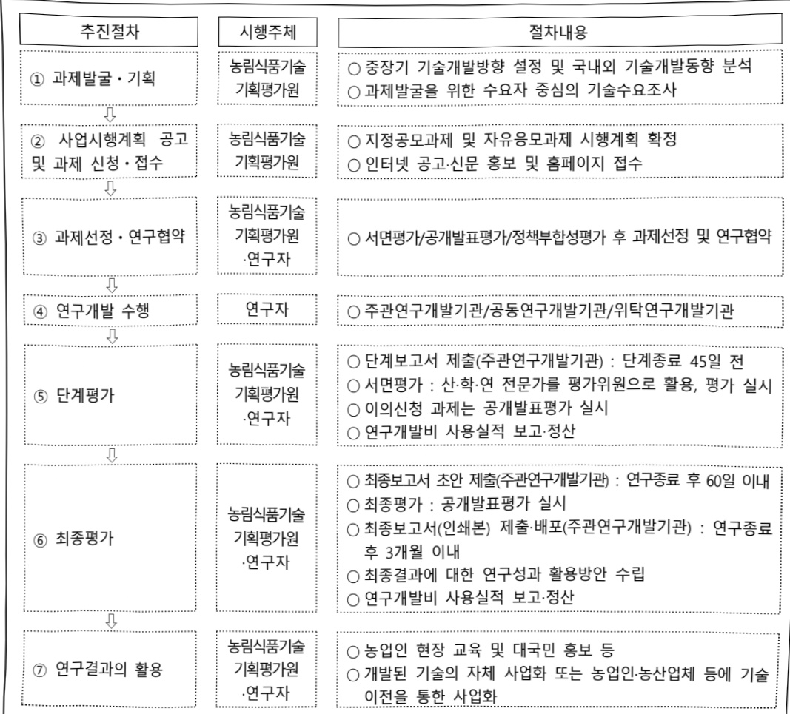

# 농업농촌국민체감AX전환기술개발(R&D)

**해당 페이지**: PDF 2985 ~ 2991 쪽 해당

**부처**: 농림축산식품부
**분야**: 농림수산
**회계유형**: 지역균형발전 특별회계
**2026 확정예산**: 1575.0 백만원
**전년대비 증감률**: None%
**AI 도메인**: 농업/식품, 디지털전환(AX)

---

<table border=1 style='margin: auto; word-wrap: break-word;'><tr><td style='text-align: center; word-wrap: break-word;'>사 업 명</td></tr><tr><td style='text-align: center; word-wrap: break-word;'>(25) 농업농촌국민체감AX전환기술개발(R&amp;D) (2280-300)</td></tr></table>

□ 사업 코드 정보

<table border=1 style='margin: auto; word-wrap: break-word;'><tr><td style='text-align: center; word-wrap: break-word;'>구분</td><td style='text-align: center; word-wrap: break-word;'>회계</td><td style='text-align: center; word-wrap: break-word;'>소관</td><td style='text-align: center; word-wrap: break-word;'>실국(기관)</td><td style='text-align: center; word-wrap: break-word;'>계정</td><td style='text-align: center; word-wrap: break-word;'>분야</td><td style='text-align: center; word-wrap: break-word;'>부문</td></tr><tr><td style='text-align: center; word-wrap: break-word;'>코드</td><td style='text-align: center; word-wrap: break-word;'>지역균형발전</td><td rowspan="2">농림축산식품부</td><td rowspan="2">농산업혁신정책관실</td><td rowspan="2">지역지원계정</td><td style='text-align: center; word-wrap: break-word;'>100</td><td style='text-align: center; word-wrap: break-word;'>101</td></tr><tr><td style='text-align: center; word-wrap: break-word;'>명칭</td><td style='text-align: center; word-wrap: break-word;'>특별회계</td><td style='text-align: center; word-wrap: break-word;'>농림수산</td><td style='text-align: center; word-wrap: break-word;'>농업·농촌</td></tr></table>

<table border=1 style='margin: auto; word-wrap: break-word;'><tr><td style='text-align: center; word-wrap: break-word;'>구분</td><td style='text-align: center; word-wrap: break-word;'>프로그램</td><td style='text-align: center; word-wrap: break-word;'>단위사업</td><td style='text-align: center; word-wrap: break-word;'>세부사업</td></tr><tr><td style='text-align: center; word-wrap: break-word;'>코드</td><td style='text-align: center; word-wrap: break-word;'>2200</td><td style='text-align: center; word-wrap: break-word;'>2280</td><td style='text-align: center; word-wrap: break-word;'>300</td></tr><tr><td style='text-align: center; word-wrap: break-word;'>명칭</td><td style='text-align: center; word-wrap: break-word;'>농업신산업육성</td><td style='text-align: center; word-wrap: break-word;'>농식품기술개발</td><td style='text-align: center; word-wrap: break-word;'>농업농촌국민체감AX전환 기술개발(R&amp;D)</td></tr></table>

□ 사업 성격

<table border=1 style='margin: auto; word-wrap: break-word;'><tr><td rowspan="2">신규</td><td rowspan="2">계속</td><td rowspan="2">완료</td><td rowspan="2">예비타당성 실시여부</td><td rowspan="2">총사업비 관리대상</td><td rowspan="2">총액계상 예산사업</td><td style='text-align: center; word-wrap: break-word;'>사업소관 변경정보</td></tr><tr><td style='text-align: center; word-wrap: break-word;'>2025예산 시 소관</td></tr><tr><td style='text-align: center; word-wrap: break-word;'>○</td><td style='text-align: center; word-wrap: break-word;'></td><td style='text-align: center; word-wrap: break-word;'></td><td style='text-align: center; word-wrap: break-word;'></td><td style='text-align: center; word-wrap: break-word;'></td><td style='text-align: center; word-wrap: break-word;'></td><td style='text-align: center; word-wrap: break-word;'></td></tr></table>

□ 사업 지원 형태 및 지원율

<table border=1 style='margin: auto; word-wrap: break-word;'><tr><td style='text-align: center; word-wrap: break-word;'>직접</td><td style='text-align: center; word-wrap: break-word;'>출자</td><td style='text-align: center; word-wrap: break-word;'>출연</td><td style='text-align: center; word-wrap: break-word;'>보조</td><td style='text-align: center; word-wrap: break-word;'>융자</td><td style='text-align: center; word-wrap: break-word;'>국고보조율(%)</td><td style='text-align: center; word-wrap: break-word;'>융자율(%)</td></tr><tr><td style='text-align: center; word-wrap: break-word;'></td><td style='text-align: center; word-wrap: break-word;'></td><td style='text-align: center; word-wrap: break-word;'>○</td><td style='text-align: center; word-wrap: break-word;'></td><td style='text-align: center; word-wrap: break-word;'></td><td style='text-align: center; word-wrap: break-word;'></td><td style='text-align: center; word-wrap: break-word;'></td></tr></table>

## □ 사업 소관부처 및 시행주체

<table border=1 style='margin: auto; word-wrap: break-word;'><tr><td style='text-align: center; word-wrap: break-word;'>사업명</td><td colspan="2">구분</td></tr><tr><td rowspan="4">농업농촌국민체감AX전환기술개발(R&amp;D)</td><td rowspan="3">소관부처</td><td style='text-align: center; word-wrap: break-word;'>실·국·과(팀)</td></tr><tr><td style='text-align: center; word-wrap: break-word;'>농산업혁신정책관실</td></tr><tr><td style='text-align: center; word-wrap: break-word;'>과학기술정책과</td></tr><tr><td style='text-align: center; word-wrap: break-word;'>사업시행주체</td><td style='text-align: center; word-wrap: break-word;'>농림식품기술기획평가원</td></tr></table>

---

### 가.예산 총괄표

(단위: 백만원, %)

<table border=1 style='margin: auto; word-wrap: break-word;'><tr><td rowspan="2">사업명</td><td rowspan="2">2024년 결산</td><td colspan="2">2025년 예산</td><td colspan="2">2026년 예산</td><td rowspan="2">중감(B-A)</td><td rowspan="2">(B-A)/A</td></tr><tr><td style='text-align: center; word-wrap: break-word;'>본예산</td><td style='text-align: center; word-wrap: break-word;'>추경(A)</td><td style='text-align: center; word-wrap: break-word;'>요구안</td><td style='text-align: center; word-wrap: break-word;'>본예산(B)</td></tr><tr><td style='text-align: center; word-wrap: break-word;'>농업농촌국민체감AX전환기술개발(R&amp;D)</td><td style='text-align: center; word-wrap: break-word;'>-</td><td style='text-align: center; word-wrap: break-word;'>-</td><td style='text-align: center; word-wrap: break-word;'>-</td><td style='text-align: center; word-wrap: break-word;'>1,575</td><td style='text-align: center; word-wrap: break-word;'>1,575</td><td style='text-align: center; word-wrap: break-word;'>1,575</td><td style='text-align: center; word-wrap: break-word;'>순증</td></tr></table>

□ 기능별(내역사업별), 목별 예산 내역

(단위:백만원)

<table border=1 style='margin: auto; word-wrap: break-word;'><tr><td rowspan="2"></td><td colspan="5">2024</td><td colspan="5">2025</td><td rowspan="2">2026예산</td></tr><tr><td style='text-align: center; word-wrap: break-word;'>예산액(추경)</td><td style='text-align: center; word-wrap: break-word;'>예산현액</td><td style='text-align: center; word-wrap: break-word;'>집행액</td><td style='text-align: center; word-wrap: break-word;'>이월액</td><td style='text-align: center; word-wrap: break-word;'>불용액</td><td style='text-align: center; word-wrap: break-word;'>본예산</td><td style='text-align: center; word-wrap: break-word;'>예산현액</td><td style='text-align: center; word-wrap: break-word;'>집행액</td><td style='text-align: center; word-wrap: break-word;'>이월예상액</td><td style='text-align: center; word-wrap: break-word;'>불용예상액</td></tr><tr><td style='text-align: center; word-wrap: break-word;'>○ 기능별 분류(합계)</td><td style='text-align: center; word-wrap: break-word;'>-</td><td style='text-align: center; word-wrap: break-word;'>-</td><td style='text-align: center; word-wrap: break-word;'>-</td><td style='text-align: center; word-wrap: break-word;'>-</td><td style='text-align: center; word-wrap: break-word;'>-</td><td style='text-align: center; word-wrap: break-word;'>-</td><td style='text-align: center; word-wrap: break-word;'>-</td><td style='text-align: center; word-wrap: break-word;'>-</td><td style='text-align: center; word-wrap: break-word;'>-</td><td style='text-align: center; word-wrap: break-word;'>-</td><td style='text-align: center; word-wrap: break-word;'>1,575</td></tr><tr><td style='text-align: center; word-wrap: break-word;'>· 농촌지역생활편의개선실증모델개발</td><td style='text-align: center; word-wrap: break-word;'>-</td><td style='text-align: center; word-wrap: break-word;'>-</td><td style='text-align: center; word-wrap: break-word;'>-</td><td style='text-align: center; word-wrap: break-word;'>-</td><td style='text-align: center; word-wrap: break-word;'>-</td><td style='text-align: center; word-wrap: break-word;'>-</td><td style='text-align: center; word-wrap: break-word;'>-</td><td style='text-align: center; word-wrap: break-word;'>-</td><td style='text-align: center; word-wrap: break-word;'>-</td><td style='text-align: center; word-wrap: break-word;'>-</td><td style='text-align: center; word-wrap: break-word;'>1,575</td></tr><tr><td style='text-align: center; word-wrap: break-word;'>○ 비목별 분류(합계)</td><td style='text-align: center; word-wrap: break-word;'>-</td><td style='text-align: center; word-wrap: break-word;'>-</td><td style='text-align: center; word-wrap: break-word;'>-</td><td style='text-align: center; word-wrap: break-word;'>-</td><td style='text-align: center; word-wrap: break-word;'>-</td><td style='text-align: center; word-wrap: break-word;'>-</td><td style='text-align: center; word-wrap: break-word;'>-</td><td style='text-align: center; word-wrap: break-word;'>-</td><td style='text-align: center; word-wrap: break-word;'>-</td><td style='text-align: center; word-wrap: break-word;'>-</td><td style='text-align: center; word-wrap: break-word;'>1,575</td></tr><tr><td style='text-align: center; word-wrap: break-word;'>· 연구개발활동비등(360-05)</td><td style='text-align: center; word-wrap: break-word;'>-</td><td style='text-align: center; word-wrap: break-word;'>-</td><td style='text-align: center; word-wrap: break-word;'>-</td><td style='text-align: center; word-wrap: break-word;'>-</td><td style='text-align: center; word-wrap: break-word;'>-</td><td style='text-align: center; word-wrap: break-word;'>-</td><td style='text-align: center; word-wrap: break-word;'>-</td><td style='text-align: center; word-wrap: break-word;'>-</td><td style='text-align: center; word-wrap: break-word;'>-</td><td style='text-align: center; word-wrap: break-word;'>-</td><td style='text-align: center; word-wrap: break-word;'>1,575</td></tr><tr><td style='text-align: center; word-wrap: break-word;'>○ 기능비목별 분류(합계)</td><td style='text-align: center; word-wrap: break-word;'>-</td><td style='text-align: center; word-wrap: break-word;'>-</td><td style='text-align: center; word-wrap: break-word;'>-</td><td style='text-align: center; word-wrap: break-word;'>-</td><td style='text-align: center; word-wrap: break-word;'>-</td><td style='text-align: center; word-wrap: break-word;'>-</td><td style='text-align: center; word-wrap: break-word;'>-</td><td style='text-align: center; word-wrap: break-word;'>-</td><td style='text-align: center; word-wrap: break-word;'>-</td><td style='text-align: center; word-wrap: break-word;'>-</td><td style='text-align: center; word-wrap: break-word;'>1,575</td></tr><tr><td style='text-align: center; word-wrap: break-word;'>· 농촌지역생활편의개선실증모델개발·연구개발활동비등(360-05)</td><td style='text-align: center; word-wrap: break-word;'>-</td><td style='text-align: center; word-wrap: break-word;'>-</td><td style='text-align: center; word-wrap: break-word;'>-</td><td style='text-align: center; word-wrap: break-word;'>-</td><td style='text-align: center; word-wrap: break-word;'>-</td><td style='text-align: center; word-wrap: break-word;'>-</td><td style='text-align: center; word-wrap: break-word;'>-</td><td style='text-align: center; word-wrap: break-word;'>-</td><td style='text-align: center; word-wrap: break-word;'>-</td><td style='text-align: center; word-wrap: break-word;'>-</td><td style='text-align: center; word-wrap: break-word;'>1,575</td></tr></table>

---

### 나. 사업설명자료

## 1 ) 사업목적·내용

- (농업농촌국민체감AX전환기술개발) 농촌지역 정주여건 개선 및 살기 좋은 농촌 생활

환경 기능 유지를 위해 AI 기술 등을 활용한 농업농촌 체감형 서비스 모델 개발 보급

- (농촌지역생활편의개선실증모델개발) 기존 정주인구 유출 최소화 및 신규 유입 촉진을

위한 농촌 생활편의 지원 서비스 모델 개발

## 2 ) 사업개요

## □ 사업근거 및 추진경위

## ① 법령상 근거 조항 적시

- ‘농림식품과학기술 육성법’ 제6조(연구개발사업의 추진) ① 정부는 종합계획 및 시행계획을 효율적으로 추진하기 위하여 농림식품과학기술 연구개발사업을 한다.

- ‘농촌공간 재구조화 및 재생지원에 관한 법률’ 제3조 ① 중앙행정기관 및 지방자치단체의 장은 농촌공간을 대상으로 정책을 추진하거나 사업 또는 연구 등을 지원하는 경우에는 소관 정책 등이 상호 연계될 수 있도록 적극적으로 협력하여야 한다. ② 중앙행정기관 및 지방자치단체의 장은 다른 법률에 따라 농촌공간의 정비, 일자리·경제활력 제고, 주거·정주 환경 개선, 생활서비스 확충 등에 대한 계획을 수립하거나 시책 또는 사업을 추진할 때에는 농촌공간 재구조화 및 재생 계획을 반영할 수 있도록 노력하여야 한다. ③ 광역시장, 도지사 또는 특별자치도지사는 관할 지역 시·군의 원활한 농촌공간 재구조화 및 재생 계획 수립과 관련 사업 추진에 필요한 지원 및 협의·조정을 적극적으로 하여야 한다.

- 농촌 지역 공동체 기반 경제·사회 서비스 활성화에 관한 법률 제3조(기본원칙)

농촌 경제·사회 서비스 부족 문제 등을 해결하는 데 기여함에 있어서는 농촌 주민 등의 주도적·자발적 참여와 농촌 지역 공동체의 사회적 책임성에 입각한 주체 간 협력과 연대를 기본원칙으로 한다.

-「농촌 지역 공동체 기반 경제·사회 서비스 활성화에 관한 법률」제4조(국가와 지방자치단체의 책무) 국가와 지방자치단체는 농촌 주민 등이 농촌 경제·사회 서비스 부족 문제 등을 주도적·자발적으로 해결하는 데 기여할 수 있도록 적극 지원하여야 한다.

- 농촌 지역 공동체 기반 경제·사회 서비스 활성화에 관한 법률 제5조(활성화 계획의 수립) ① 농림축산식품부장관은 농촌 주민 등이 자발적으로 농촌 경제·사회 서비스 부족 문제 등을 해결하는 데 기여할 수 있도록 3년마다 농촌 지역 공

---

동체 기반 농촌 경제 · 사회 서비스 활성화 계획(이하 “활성화 계획”이라 한다)을 수립하여야 한다. 이 경우 활성화 계획은 「사회서비스 지원 및 사회서비스원 설립 · 운영에 관한 법률」 제5조제1항에 따른 사회서비스 기본계획과 연계되도록 하여야 하다.

## ② 추진경위

- (부·청 협업) 농촌소멸 관련 현안 해결을 위해 전문가들과 2022년부터 부·청 공동

「농촌다음포럼」개최(총 10회)

* 농촌소멸 대응을 위한 기술분야로 의료·보건, 이동권(모빌리티), 생활인구 유입 기술 등 도출

- (1차 수요조사) 농촌 생활권 유지를 위한 기술수요조사('25.2.)를 통해 생활서비스,

자원순환, 쾌적한 환경조성 등의 연구분야 도출

(생활서비스) AI 활용 IoT 농어촌 보건 통합 기술, 생활안전 플랫폼, (자원순환) 마을 쓰레기 수거 자동화, 친환경 패키칭 및 폐기 기술, (쾌적환경) 모기 유층 무인 드론 방제 기술

- (2차 수요조사) AI를 활용한 농촌지역 주민 체감형 기술 실증 지원을 위해 국민 체감형 AX 전환 기술 수요조사 추진('25.6.~7.)

* AI 관련 기술수요조사 239건 중 주민체감형 전환기술 25건에 대한 전문가 검토회의를 통해 3개 분야 10개 기술 도출

<table border=1 style='margin: auto; word-wrap: break-word;'><tr><td style='text-align: center; word-wrap: break-word;'>분야</td><td style='text-align: center; word-wrap: break-word;'>농업생산안정 기술</td><td style='text-align: center; word-wrap: break-word;'>농촌생활편의 기술</td><td style='text-align: center; word-wrap: break-word;'>기반시설, 행정효율</td></tr><tr><td style='text-align: center; word-wrap: break-word;'>도출기술</td><td style='text-align: center; word-wrap: break-word;'>☑지역특화작물(과체류, 회혜류)품질 스마트 모니터링☑로컬마켓 판매정보 활용생산-수요 예측☑가격정보 연계 출하예측서비스 개발☑생산저해 위험요소(야생동물매측 등) 방역 솔루션</td><td style='text-align: center; word-wrap: break-word;'>☑농촌 폐기물 수거를 위한 RasS 로봇 플랫폼 개발☑CCTV·드론 활용 농촌생활안전 통합관리 시스템☑지역 연계 식품시각 대응 거점 물류망 구축·배송서비스☑약취소음 등 상습민원 해결</td><td style='text-align: center; word-wrap: break-word;'>☑농촌 기반취약시설(농수로, 등산로 등) 위험 예측·안전망 플랫폼 구축☑로컬 재생에너지 분산 발전·활용을 위한 에너지 그리드 기술</td></tr></table>

- (농업생산안정) 지역특화작물(과체류, 화훼류 등) 품질모니터링 기술, 농산물 생산수요 예측 프로그램, 농산물 가격 연계 출하예측 서비스 개발 등

- (농촌생활편의) RaaS 로봇 플랫폼 기반 농촌 폐기물 분리수거, CCTV·드론 활용 농촌생활 안전 통합관리 시스템, 지자체 연계 식품사막 대응 거점 물류망 구축 등

- (기반시설·행정효율) 농촌 기반 취약시설 위험·안전 예측 관리, 로컬 재생에너지 분산발전·활용 기술 등

## «관련 주요 공약»

#### (2.성장) 4. 국가균형발전

- 18. 스마트 데이터농업 확산, 푸드테크·그린바이오 산업 육성, K-푸드 수출 확대, R&D 강화로 농업을 미래농산업으로 전환(스마트팜, 농기계(자율주행, AI), 동물용 의약품 등 육성 및 수출 확대)

---

## □ 주요내용

① 사업규모

- 총사업비(해당되는 경우에만 기재) : 해당없음

- 사업기간 : '26~'30

- 최근 5년 간 투입된 사업비(예산액기준, 추경편성한 연도에는 추경포함)

<table border=1 style='margin: auto; word-wrap: break-word;'><tr><td style='text-align: center; word-wrap: break-word;'>연도</td><td style='text-align: center; word-wrap: break-word;'>2022</td><td style='text-align: center; word-wrap: break-word;'>2023</td><td style='text-align: center; word-wrap: break-word;'>2024</td><td style='text-align: center; word-wrap: break-word;'>2025</td><td style='text-align: center; word-wrap: break-word;'>2026</td></tr><tr><td style='text-align: center; word-wrap: break-word;'>사업비</td><td style='text-align: center; word-wrap: break-word;'>-</td><td style='text-align: center; word-wrap: break-word;'>-</td><td style='text-align: center; word-wrap: break-word;'>-</td><td style='text-align: center; word-wrap: break-word;'>-</td><td style='text-align: center; word-wrap: break-word;'>1,575</td></tr></table>

- 기타: 해당 없음

② 사업추진체계

- 사업시행방법 : 출연 80%, 지방비 20%

(대기업 50%, 중견기업 30%, 중소기업 25% 이상 매칭)

- 사업시행주체 : 농림식품기술기획평가원

- 사업 수혜자 : 농산업체, 대학, 연구소, 기업, 농업회사법인 등

- 보조, 융자, 출연, 출자 등의 경우 보조 · 융자 등 지원 비율 및 법적근거

<table border=1 style='margin: auto; word-wrap: break-word;'><tr><td style='text-align: center; word-wrap: break-word;'>내역사업명</td><td style='text-align: center; word-wrap: break-word;'>구분</td><td style='text-align: center; word-wrap: break-word;'>피보조·피출연 등 기관명</td><td style='text-align: center; word-wrap: break-word;'>지원 금액 (2026예산)</td><td style='text-align: center; word-wrap: break-word;'>지원 비율(%)</td><td style='text-align: center; word-wrap: break-word;'>보조율 법적근거 (해당 조항)</td></tr><tr><td style='text-align: center; word-wrap: break-word;'>농촌지역생활편의개선실증모델개발</td><td style='text-align: center; word-wrap: break-word;'>출연</td><td style='text-align: center; word-wrap: break-word;'>농림식품기술기획평가원</td><td style='text-align: center; word-wrap: break-word;'>1,575백만원</td><td style='text-align: center; word-wrap: break-word;'>80</td><td style='text-align: center; word-wrap: break-word;'>농림식품과학기술육성법 제6조</td></tr></table>

## 3 ) 2026년도 예산 산출 근거

① 농촌지역생활편의개선실증모델개발: (25) → (26) 1,575백만원, 순증

- (변성) 농촌지역 생활과정에서 발생되는 문제(폐기물, 식품사막, 생활 환경 민원)를 해결할 수 있는 생활편의 AI 기술 및 지역 실증모델 수립을 위한 예산 1,575백만원 요구

* ①AI로봇 기반 농촌 폐기물 분리수거 자동화·관리 솔루션, ②농촌형 식품사막 해소를 위한 특수식 등 스마트 배송서비스, ③축사 악취, 동물 울음 등 생활환경 민원 자동탐지 대응 솔루션

- (산출)(신규) 3개 × 700백만 × 9/12개월 = 1,575백만원

2025년도 예산 및 2026년도 예산 산출 세부내역 비교

<table border=1 style='margin: auto; word-wrap: break-word;'><tr><td colspan="2">&#x27;25년 분예산</td><td colspan="2">&#x27;26년 예산</td></tr><tr><td style='text-align: center; word-wrap: break-word;'>예산</td><td style='text-align: center; word-wrap: break-word;'>산출내역</td><td style='text-align: center; word-wrap: break-word;'>예산</td><td style='text-align: center; word-wrap: break-word;'>산출내역</td></tr><tr><td style='text-align: center; word-wrap: break-word;'>-</td><td style='text-align: center; word-wrap: break-word;'>-</td><td style='text-align: center; word-wrap: break-word;'>1,575</td><td style='text-align: center; word-wrap: break-word;'>○ 연구개발활동비동(360-05): 1,575백만원 가. 농촌지역생활관의개선실증모델개발 (1,575백만원) • (신규) 3개×700백만×9/12개월=1,575백만원</td></tr></table>

---

## 4 ) 사업효과

## □ 사업영향, 산출물 성과지표 등

① 2022~2026년도 성과계획서 상 성과지표 및 최근 5년간 성과 달성도

- 지역 맞춤형 전략모델 매뉴얼 3종 확보 및 개발된 성과의 확산을 위한 정책사업 연계 3건 이상 추진

- 폐기물 분류 정확도 및 식품 자동 배송 서비스 성공률 90%, 지역주민 노동시간

(폐기물수거, 자율배송 등) 절감 30% 등 생활편의 향상

- 유휴시설 공간데이터, AI기반 분석기법 등 요소기술의 전국 '농촌공간기본계획 (지자체)' 반영률 60%

- (데이터 구축) 전국 일반농산어촌개발사업 미이용 유휴시설 데이터 100% 구축

- (재생지표·실증모델) 농촌 마을단위 재생진단 지표 발굴 5종

- (AI 모델) 유휴시설 재생 추천모델 2종, AI기반 농촌특화지구 평가·운영 실증모델 2종

<table border=1 style='margin: auto; word-wrap: break-word;'><tr><td style='text-align: center; word-wrap: break-word;'>구분</td><td style='text-align: center; word-wrap: break-word;'>농촌 생활편의부</td><td style='text-align: center; word-wrap: break-word;'>농촌재생솔루션형</td></tr><tr><td style='text-align: center; word-wrap: break-word;'>핵심 성과지표</td><td style='text-align: center; word-wrap: break-word;'>o AI 활용 배송 성공률 90% 이상o 노동시간(폐기물 수거, 자율배송 등)30% 절감</td><td style='text-align: center; word-wrap: break-word;'>o 농촌공간데이터(미이용 공공유휴시설)100% 구축 및 재생 AI추천모델 개발o 농촌 마을단위 재생진단 지표 발굴 5종o AI기반 농촌특화지구 평가·운영실증모델 2종</td></tr></table>

<table border=1 style='margin: auto; word-wrap: break-word;'><tr><td style='text-align: center; word-wrap: break-word;'>종합성과</td></tr></table>

o AI기반 요소기술의 전국 ‘농촌공간기본계획(지자체)’ 반영률 60%

o 지역 맞춤형 AX 전환기술 전략모델 솔루션 확보(3종) 및 전략모델 확산을 위한

정책사업 연계 후속사업 3건 추진

* 사업 기획보고서 상의 성과목표 제시, 사업 착수 후 전략계획서 내 성과지표로 보완 예정

② 성과지표 이외의 연도별 사업추진 경과 및 실적 : 해당 없음('26년 신규)

③ 향후(2026년도 이후) 기대효과

- 소멸 고위험지역 생활서비스 기능 유지를 위한 기초 기술 실증모델 개발로 농촌

유형별 생활서비스 기능유지 가능

- 국민 모두에게 열린 살고, 일하고, 쉬는 새로운 농촌 모델 개발로 지속가능한 농업·농촌 발전에 기여

- GeoAI를 활용한 농촌소멸 데이터 생산 및 관리 체계 구축으로 농촌소멸 대응

선제적 의사결정 지원

---

5) 타당성조사 및 예비타당성조사 시행여부 및 결과 요지 : 해당 없음

6) 총사업비 대상사업 정보 : 해당 없음

7) 사업 집행절차

8) 각종 평가 : 해당 없음

다. 최근 4년간 결산내역 : 해당 없음('26년 신규)

---

### 원본 PDF 크롭 이미지

