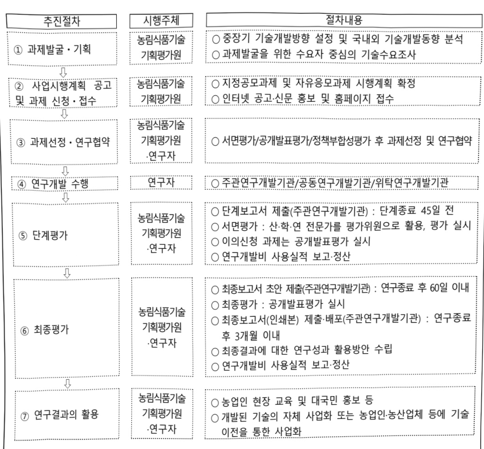

# 반려동물난치성질환극복기술개발(R&D)

**해당 페이지**: PDF 2992 ~ 2998 쪽 해당

**부처**: 농림축산식품부
**분야**: 농림수산
**회계유형**: 농어촌구조 개선특별회계
**2026 확정예산**: 2775.0 백만원
**전년대비 증감률**: None%
**AI 도메인**: 의료/바이오

---

### 가. 예산 총괄표

(단위: 백만원, %)

<table border=1 style='margin: auto; word-wrap: break-word;'><tr><td rowspan="2">사업명</td><td rowspan="2">2024년 결산</td><td colspan="2">2025년 예산</td><td colspan="2">2026년 예산</td><td rowspan="2">증감(B-A)</td><td rowspan="2">(B-A)/A</td></tr><tr><td style='text-align: center; word-wrap: break-word;'>본예산</td><td style='text-align: center; word-wrap: break-word;'>추경(A)</td><td style='text-align: center; word-wrap: break-word;'>요구안</td><td style='text-align: center; word-wrap: break-word;'>본예산(B)</td></tr><tr><td style='text-align: center; word-wrap: break-word;'>반려동물난치성질환 극복기술개발(R&amp;D)</td><td style='text-align: center; word-wrap: break-word;'>-</td><td style='text-align: center; word-wrap: break-word;'>-</td><td style='text-align: center; word-wrap: break-word;'>-</td><td style='text-align: center; word-wrap: break-word;'>2,775</td><td style='text-align: center; word-wrap: break-word;'>2,775</td><td style='text-align: center; word-wrap: break-word;'>2,775</td><td style='text-align: center; word-wrap: break-word;'>순증</td></tr></table>

□ 기능별(내역사업별), 예산 내역

(단위:백만원)

<table border=1 style='margin: auto; word-wrap: break-word;'><tr><td rowspan="2"></td><td colspan="5">2024</td><td colspan="5">2025</td><td rowspan="2">2026예산</td></tr><tr><td style='text-align: center; word-wrap: break-word;'>예산액(추정)</td><td style='text-align: center; word-wrap: break-word;'>예산현액</td><td style='text-align: center; word-wrap: break-word;'>집행액</td><td style='text-align: center; word-wrap: break-word;'>이월액</td><td style='text-align: center; word-wrap: break-word;'>불용액</td><td style='text-align: center; word-wrap: break-word;'>본예산</td><td style='text-align: center; word-wrap: break-word;'>예산현액</td><td style='text-align: center; word-wrap: break-word;'>집행액</td><td style='text-align: center; word-wrap: break-word;'>이월예상액</td><td style='text-align: center; word-wrap: break-word;'>불용예상액</td></tr><tr><td style='text-align: center; word-wrap: break-word;'>○ 기능별 분류(합계)</td><td style='text-align: center; word-wrap: break-word;'>-</td><td style='text-align: center; word-wrap: break-word;'>-</td><td style='text-align: center; word-wrap: break-word;'>-</td><td style='text-align: center; word-wrap: break-word;'>-</td><td style='text-align: center; word-wrap: break-word;'>-</td><td style='text-align: center; word-wrap: break-word;'>-</td><td style='text-align: center; word-wrap: break-word;'>-</td><td style='text-align: center; word-wrap: break-word;'>-</td><td style='text-align: center; word-wrap: break-word;'>-</td><td style='text-align: center; word-wrap: break-word;'>-</td><td style='text-align: center; word-wrap: break-word;'>2,775</td></tr><tr><td style='text-align: center; word-wrap: break-word;'>·첨단비이오기반주요난치성질환맞춤형치료기술개발·첨단기술기반주요난치성질환정밀진단기술개발</td><td style='text-align: center; word-wrap: break-word;'>-</td><td style='text-align: center; word-wrap: break-word;'>-</td><td style='text-align: center; word-wrap: break-word;'>-</td><td style='text-align: center; word-wrap: break-word;'>-</td><td style='text-align: center; word-wrap: break-word;'>-</td><td style='text-align: center; word-wrap: break-word;'>-</td><td style='text-align: center; word-wrap: break-word;'>-</td><td style='text-align: center; word-wrap: break-word;'>-</td><td style='text-align: center; word-wrap: break-word;'>-</td><td style='text-align: center; word-wrap: break-word;'>-</td><td style='text-align: center; word-wrap: break-word;'>1,575</td></tr><tr><td style='text-align: center; word-wrap: break-word;'>○ 비목별 분류(합계)</td><td style='text-align: center; word-wrap: break-word;'>-</td><td style='text-align: center; word-wrap: break-word;'>-</td><td style='text-align: center; word-wrap: break-word;'>-</td><td style='text-align: center; word-wrap: break-word;'>-</td><td style='text-align: center; word-wrap: break-word;'>-</td><td style='text-align: center; word-wrap: break-word;'>-</td><td style='text-align: center; word-wrap: break-word;'>-</td><td style='text-align: center; word-wrap: break-word;'>-</td><td style='text-align: center; word-wrap: break-word;'>-</td><td style='text-align: center; word-wrap: break-word;'>-</td><td style='text-align: center; word-wrap: break-word;'>1,200</td></tr><tr><td style='text-align: center; word-wrap: break-word;'>·연구개발활동비등(360-05)</td><td style='text-align: center; word-wrap: break-word;'>-</td><td style='text-align: center; word-wrap: break-word;'>-</td><td style='text-align: center; word-wrap: break-word;'>-</td><td style='text-align: center; word-wrap: break-word;'>-</td><td style='text-align: center; word-wrap: break-word;'>-</td><td style='text-align: center; word-wrap: break-word;'>-</td><td style='text-align: center; word-wrap: break-word;'>-</td><td style='text-align: center; word-wrap: break-word;'>-</td><td style='text-align: center; word-wrap: break-word;'>-</td><td style='text-align: center; word-wrap: break-word;'>-</td><td style='text-align: center; word-wrap: break-word;'>2,775</td></tr><tr><td style='text-align: center; word-wrap: break-word;'>○ 기능비목별 분류(합계)</td><td style='text-align: center; word-wrap: break-word;'>-</td><td style='text-align: center; word-wrap: break-word;'>-</td><td style='text-align: center; word-wrap: break-word;'>-</td><td style='text-align: center; word-wrap: break-word;'>-</td><td style='text-align: center; word-wrap: break-word;'>-</td><td style='text-align: center; word-wrap: break-word;'>-</td><td style='text-align: center; word-wrap: break-word;'>-</td><td style='text-align: center; word-wrap: break-word;'>-</td><td style='text-align: center; word-wrap: break-word;'>-</td><td style='text-align: center; word-wrap: break-word;'>-</td><td style='text-align: center; word-wrap: break-word;'>2,775</td></tr><tr><td rowspan="3">·첨단비이오기반주요난치성질환맞춤형치료기술개발·연구개발활동비등(360-05)·첨단기술기반주요난치성질환정밀진단기술개발·연구개발활동비등(360-05)</td><td style='text-align: center; word-wrap: break-word;'>-</td><td style='text-align: center; word-wrap: break-word;'>-</td><td style='text-align: center; word-wrap: break-word;'>-</td><td style='text-align: center; word-wrap: break-word;'>-</td><td style='text-align: center; word-wrap: break-word;'>-</td><td style='text-align: center; word-wrap: break-word;'>-</td><td style='text-align: center; word-wrap: break-word;'>-</td><td style='text-align: center; word-wrap: break-word;'>-</td><td style='text-align: center; word-wrap: break-word;'>-</td><td style='text-align: center; word-wrap: break-word;'>1,575</td><td style='text-align: center; word-wrap: break-word;'></td></tr><tr><td style='text-align: center; word-wrap: break-word;'>-</td><td style='text-align: center; word-wrap: break-word;'>-</td><td style='text-align: center; word-wrap: break-word;'>-</td><td style='text-align: center; word-wrap: break-word;'>-</td><td style='text-align: center; word-wrap: break-word;'>-</td><td style='text-align: center; word-wrap: break-word;'>-</td><td style='text-align: center; word-wrap: break-word;'>-</td><td style='text-align: center; word-wrap: break-word;'>-</td><td style='text-align: center; word-wrap: break-word;'>-</td><td style='text-align: center; word-wrap: break-word;'>-</td><td style='text-align: center; word-wrap: break-word;'>1,200</td></tr><tr><td style='text-align: center; word-wrap: break-word;'>-</td><td style='text-align: center; word-wrap: break-word;'>-</td><td style='text-align: center; word-wrap: break-word;'>-</td><td style='text-align: center; word-wrap: break-word;'>-</td><td style='text-align: center; word-wrap: break-word;'>-</td><td style='text-align: center; word-wrap: break-word;'>-</td><td style='text-align: center; word-wrap: break-word;'>-</td><td style='text-align: center; word-wrap: break-word;'>-</td><td style='text-align: center; word-wrap: break-word;'>-</td><td style='text-align: center; word-wrap: break-word;'>-</td><td style='text-align: center; word-wrap: break-word;'>1,200</td></tr></table>

---

### 나. 사업설명자료

## 1 ) 사업목적·내용

° 첨단 바이오 기술을 융합한 펜테크 기술로 반려동물 난치성 질환 치료기술 개발을 통한 고부가가치 펜헬스케어 산업 육성 및 국내·외 시장 개척

- (점단바이오 기반 주요 난치성 질환 맞춤형 치료기술 개발) 반려동물 암, 신부전, 퇴행성 질환 등 주요 난치성 질환에 첨단바이오 기술을 적용한 혁신적 맞춤형 치료기술 개발 지원

- (첨단기술 기반 주요 난치성 질환 정밀진단기술 개발) 첨단바이오·디지털 융합기술을 활용한 주요 난치성 질환 조기진단 및 증상 완화를 위한 정밀진단기술·질병관리 서비스 모델 개발 지원

## 2 ) 사업개요

## □ 사업근거 및 추진경위

① 법령상 근거 조항 적시

- 「농업·농촌 및 식품산업 기본법」제28조(농업 관련 조합법인 및 회사법인의 육성) 국가와 지방자치단체는 농업의 생산성 향상과 농산물의 출하·유통·가공·판매·수출 등의 효율화를 위하여 협업적 또는 기업적 농업경영을 수행하는 영농조합법인(찰뿐組合法人) 및 농업회사법인(뿔業會社法人)의 육성에 필요한 정책을 수립·시행하여야 한다.

-「농업·농촌 및 식품산업 기본법」제35조(농업 및 식품 관련 기술·연구 등의 진흥)

① 국가와 지방자치단체는 농업 및 식품 관련 산업의 생산성 및 경쟁력 향상을 위하여 농업 생산기술, 농업 생산기반 정비기술, 농산물 생산 이후의 관리기술, 농업 경영기법, 농업인 안전작업기술, 농산물 유통기술, 농산물 가공·식품 제조기술 및 음식물 조리법 등에 관한 연구·개발·보급과 농업 및 식품산업 현장연구, ‘산학연 공동연구 및 연구평가 관리체제의 확립 등에 관한 종합적인 계획을 세우고 시행하여야 한다.

-「농업·농촌 및 식품산업 기본법」제36조(농업 및 식품 관련 산업의 기술개발 추진)

① 국가와 지방자치단체는 농업 및 식품 관련 산업의 기술 등을 신속하게 개발·보급하기 위하여 관련 연구기관 또는 단체 등에 농업 및 식품 관련 산업의 기술개발 연구를 수행하게 할 수 있다. ② 국가와 지방자치단체는 제1항에 따라 농업 및 식품 관련 산업의 기술개발 연구를 수행하는 관련 연구기관 또는 단체 등에 대하여 필요한 자금을 지원할 수 있다.

-「농림식품과학기술 육성법」제6조(연구개발사업의 추진) ① 정부는 종합계획 및 시행계획을 효율적으로 추진하기 위하여 농림식품과학기술 연구개발사업을 한다.

---

② 추진경위

° 반려동물 전주기 산업화 지원사업 추진('22.4 ~ '26.12)

° 농림식품 R&D사업 기술수요조사 실시(상시)

° '26년도 신규사업 우선순위 심의위원회('24.10~'24.12)

- (심의 내용) 내·외부 수요조사를 통해 접수된 '26년도 신규사업 추진 우선순위 선정 결과 최종 후보 중 '반려동물' 내용 3순위

° 농식품부 신규 R&D사업 전문가 자문회의 진행('24.12)

0 농식품부·농진청 역할분담 및 협업영역 논의(25.1)

0 사업기획 및 과제발굴을 위한 수요조사 실시('25.2.~3)

## «관련 주요 공약»

이재명 정부 공약(2.성장,4.국가균형발전-18)

- 스마트 데이터농업 확산, 푸드테크·그린바이오 산업 육성, K-푸드 수출 확대, R&D 강화로 농업을 미래농산업으로 전환하겠습니다.

이재명 정부 공약(3. 행복, 1. 생활안정-24)

- 사람과 동물이 더불어 행복한 사회를 만들겠습니다.

## □ 주요내용

① 사업규모

- 총사업비 : 해당없음

- 사업기간 : '26~'31(총 6년)

- 최근 5년 간 투입된 사업비

<table border=1 style='margin: auto; word-wrap: break-word;'><tr><td style='text-align: center; word-wrap: break-word;'>$ \underline{\text{연도}} $</td><td style='text-align: center; word-wrap: break-word;'>2022</td><td style='text-align: center; word-wrap: break-word;'>2023</td><td style='text-align: center; word-wrap: break-word;'>2024</td><td style='text-align: center; word-wrap: break-word;'>2025</td><td style='text-align: center; word-wrap: break-word;'>2026</td></tr><tr><td style='text-align: center; word-wrap: break-word;'>$ \underline{\text{사업비}} $</td><td style='text-align: center; word-wrap: break-word;'>-</td><td style='text-align: center; word-wrap: break-word;'>-</td><td style='text-align: center; word-wrap: break-word;'>-</td><td style='text-align: center; word-wrap: break-word;'>-</td><td style='text-align: center; word-wrap: break-word;'>2,775</td></tr></table>

- 기타: 해당 없음

② 사업추진체계

- 사업시행방법 : 줄연 100%(대기업 50%, 중견기업 30%, 중소기업 25% 이상 매칭)

- 사업시행주체 : 농림식품기술기획평가원

- 사업 수혜자 : 농산업체, 대학, 연구소, 기업, 농업회사법인 등

---

· 보조, 융자, 출연, 출자 등의 경우 보조·융자 등 지원 비율 및 법적근거

<table border=1 style='margin: auto; word-wrap: break-word;'><tr><td style='text-align: center; word-wrap: break-word;'>내역사업명</td><td style='text-align: center; word-wrap: break-word;'>구분</td><td style='text-align: center; word-wrap: break-word;'>피보조·피출연 등 기관명</td><td style='text-align: center; word-wrap: break-word;'>지원 금액 (2026예산)</td><td style='text-align: center; word-wrap: break-word;'>지원 비율(%)</td><td style='text-align: center; word-wrap: break-word;'>보조율 법적근거 (해당 조항)</td></tr><tr><td style='text-align: center; word-wrap: break-word;'>첨단바이오 기반 주요 난치성 질환 맞춤형 치료기술 개발</td><td style='text-align: center; word-wrap: break-word;'>출연</td><td style='text-align: center; word-wrap: break-word;'>농림식품 기술기획 평가원</td><td style='text-align: center; word-wrap: break-word;'>1,575백만원</td><td style='text-align: center; word-wrap: break-word;'>100</td><td style='text-align: center; word-wrap: break-word;'>농림식품과학기술육성법 제6조</td></tr><tr><td style='text-align: center; word-wrap: break-word;'>첨단기술기반 주요 난치성 질환 정밀진단기술 개발</td><td style='text-align: center; word-wrap: break-word;'>출연</td><td style='text-align: center; word-wrap: break-word;'>농림식품 기술기획 평가원</td><td style='text-align: center; word-wrap: break-word;'>1,200백만원</td><td style='text-align: center; word-wrap: break-word;'>100</td><td style='text-align: center; word-wrap: break-word;'>농림식품과학기술육성법 제6조</td></tr></table>

## 3 ) 2026년도 예산 산출 근거

① 첨단바이오 기반 주요 난치성 질환 맞춤형 치료기술 개발 : (25) - → (26) 1,575백만원, 순증

- (편성) 반려동물 난치성 질환 4분야(악성종양, 신부전, 인지성 장애, 고양이 복막염)치료기술 개발 12과제(경쟁형 방식), 기획연구비 및 임상시험 평가기준 마련 1과제 반영을 위한 1,575백만원 요구

- (산출) (신규) 12개×200백만×6/12개월=1,200백만원

 $$ 1개 \times500 鲫만 \times9/12 개  월 =375 鲫만  원 $$ 

② 첨단기술기반 주요 납치성 질환 정밀진단기술 개발 : (25) - → (26) 1.200백만원. 순증

- (편성) AI·첨단바이오 기술을 융합한 질병 예측 및 헬스케어 시스템 구축 개발 12과제를 위한 신규과제 예산 1,200백만원 요구

- (산출) (신규) 12개×200백만×6/12개월=1,200백만원

2025년도 예산 및 2026년도 예산 산출 세부내역 비교

<table border=1 style='margin: auto; word-wrap: break-word;'><tr><td colspan="2">&#x27;25년 본예산</td><td colspan="2">&#x27;26년 예산</td></tr><tr><td style='text-align: center; word-wrap: break-word;'>예산</td><td style='text-align: center; word-wrap: break-word;'>산출내역</td><td style='text-align: center; word-wrap: break-word;'>예산</td><td style='text-align: center; word-wrap: break-word;'>산출내역</td></tr><tr><td rowspan="3">-</td><td rowspan="3">-</td><td rowspan="3">2,775</td><td style='text-align: center; word-wrap: break-word;'>○ 연구개발활동비등(360-05): 2,775백만원</td></tr><tr><td style='text-align: center; word-wrap: break-word;'>가. 첨단바이오 기반 주요 난치성 질환 맞춤형 치료기술 개발 (1,575백만원) • (신규) 12개×200백만×6/12개월=1,200백만원 1개×500백만×9/12개월=375백만원</td></tr><tr><td style='text-align: center; word-wrap: break-word;'>나. 첨단기술기반 주요 난치성 질환 정밀진단기술 개발 (1,200백만원) • (신규) 12개×200백만×6/12개월=1,200백만원</td></tr></table>

---

## 4 ) 사업효과

□ 사업영향, 산출물 성과지표 등

① 2022~2026년도 성과계획서 상 성과지표 및 최근 5년간 성과 달성도

* 사업 기획보고서 상의 사업 착수 3년 후부터 성과목표를 제시하였으며, 추후 전략계획서내 성과지표로 반영 예정

(단위: 점, 억 원, 건수)

<table border=1 style='margin: auto; word-wrap: break-word;'><tr><td rowspan="2">성과지표</td><td colspan="6">목 표 치</td></tr><tr><td style='text-align: center; word-wrap: break-word;'>2026년</td><td style='text-align: center; word-wrap: break-word;'>2027년</td><td style='text-align: center; word-wrap: break-word;'>2028년</td><td style='text-align: center; word-wrap: break-word;'>2029년</td><td style='text-align: center; word-wrap: break-word;'>2030년</td><td style='text-align: center; word-wrap: break-word;'>평균/합계</td></tr><tr><td style='text-align: center; word-wrap: break-word;'>우수논문지수 (mrnIF)</td><td style='text-align: center; word-wrap: break-word;'>-</td><td style='text-align: center; word-wrap: break-word;'>-</td><td style='text-align: center; word-wrap: break-word;'>70.10</td><td style='text-align: center; word-wrap: break-word;'>72.20</td><td style='text-align: center; word-wrap: break-word;'>74.37</td><td style='text-align: center; word-wrap: break-word;'>72.22</td></tr><tr><td style='text-align: center; word-wrap: break-word;'>사업화매출액</td><td style='text-align: center; word-wrap: break-word;'>-</td><td style='text-align: center; word-wrap: break-word;'>-</td><td style='text-align: center; word-wrap: break-word;'>-</td><td style='text-align: center; word-wrap: break-word;'>-</td><td style='text-align: center; word-wrap: break-word;'>11.5</td><td style='text-align: center; word-wrap: break-word;'>11.5</td></tr><tr><td style='text-align: center; word-wrap: break-word;'>성과 지표명</td><td colspan="6">목표치 설정방법 및 근거</td></tr><tr><td style='text-align: center; word-wrap: break-word;'>우수논문지수 (mrnIF)</td><td colspan="6">ㅇ 해당 사업으로 개발된 과학적 성과물인 논문의 질적 향상을 측정하기 위해 우수논문지수(평균 mrnIF)를 성과지표로 설정 &lt;목표치 및 설정 근거&gt; - 선행사업(반려동물 전주기 사업화 기술개발사업)의 우수논문지수(mrnIF)평균의 3%를 상향하여 목표치 설정</td></tr><tr><td style='text-align: center; word-wrap: break-word;'>사업화매출액 (억 원)</td><td colspan="6">ㅇ 해당 사업을 통해 창출된 제품에 대한 시장진출을 통해 창출되는 매출액을 산정 &lt;목표치 및 설정 근거&gt; - 기존 지원사업인 가축질병대응기술개발 내역사업(동물의약품개발) 매출액 성과지표를 반려동물 산업성장세를 고려하여 지표평균의 150%로 상향하고 연평균 성장률 15%를 반영하여 도전적 목표치 설정(출연금 비율 적용)</td></tr></table>

② 성과지표 이외의 연도별 사업추진 경과 및 실적 : 해당없음('26년 신규)

③ 향후(2026년도 이후) 기대효과 : 국내 의약품 시장 활성화(3,500억 수준), 특정질환 내 생존을 증가(15%)등 난치성질환 대상 첨단의료기술 고도화 및 정밀진단 헬스케어 시스템 상용화

5) 타당성조사 및 예비타당성조사 시행여부 및 결과 요지 : 해당없음

6) 총사업비 대상사업 정보 : 해당없음

---

## 7 ) 사업 집행절차

8) 각종 평가 : 해당 없음

다. 최근 4년간 결산내역 : 해당없음(26년 신규)

---

<table border=1 style='margin: auto; word-wrap: break-word;'><tr><td style='text-align: center; word-wrap: break-word;'>사 업 명</td></tr><tr><td style='text-align: center; word-wrap: break-word;'>(94) 스마트팜다부처패키지혁신기술개발(R&amp;D) (2280-481)</td></tr></table>

## □ 사업 코드 정보

<table border=1 style='margin: auto; word-wrap: break-word;'><tr><td style='text-align: center; word-wrap: break-word;'>구분</td><td style='text-align: center; word-wrap: break-word;'>회계</td><td style='text-align: center; word-wrap: break-word;'>소관</td><td style='text-align: center; word-wrap: break-word;'>실국(기관)</td><td style='text-align: center; word-wrap: break-word;'>계정</td><td style='text-align: center; word-wrap: break-word;'>분야</td><td style='text-align: center; word-wrap: break-word;'>부문</td></tr><tr><td style='text-align: center; word-wrap: break-word;'>코드명칭</td><td style='text-align: center; word-wrap: break-word;'>농어촌구조개선특별회계</td><td style='text-align: center; word-wrap: break-word;'>농림축산식품부</td><td style='text-align: center; word-wrap: break-word;'>농산업혁신정책관실</td><td style='text-align: center; word-wrap: break-word;'>농어촌특별세사업계정</td><td style='text-align: center; word-wrap: break-word;'>100농림수산</td><td style='text-align: center; word-wrap: break-word;'>101농업·농촌</td></tr></table>

<table border=1 style='margin: auto; word-wrap: break-word;'><tr><td style='text-align: center; word-wrap: break-word;'>구분</td><td style='text-align: center; word-wrap: break-word;'>프로그램</td><td style='text-align: center; word-wrap: break-word;'>단위사업</td><td style='text-align: center; word-wrap: break-word;'>세부사업</td></tr><tr><td style='text-align: center; word-wrap: break-word;'>코드</td><td style='text-align: center; word-wrap: break-word;'>2200</td><td style='text-align: center; word-wrap: break-word;'>2280</td><td style='text-align: center; word-wrap: break-word;'>481</td></tr><tr><td style='text-align: center; word-wrap: break-word;'>명칭</td><td style='text-align: center; word-wrap: break-word;'>농업신산업육성</td><td style='text-align: center; word-wrap: break-word;'>농식품기술개발</td><td style='text-align: center; word-wrap: break-word;'>스마트팝다부처패키지 혁신기술개발(R&amp;D)</td></tr></table>

## □ 사업 성격

<table border=1 style='margin: auto; word-wrap: break-word;'><tr><td rowspan="2">신규</td><td rowspan="2">계속</td><td rowspan="2">완료</td><td style='text-align: center; word-wrap: break-word;'>예비타당성</td><td style='text-align: center; word-wrap: break-word;'>총사업비</td><td style='text-align: center; word-wrap: break-word;'>총액계상</td><td style='text-align: center; word-wrap: break-word;'>사업소관 변경정보</td></tr><tr><td style='text-align: center; word-wrap: break-word;'>실시여부</td><td style='text-align: center; word-wrap: break-word;'>관리대상</td><td style='text-align: center; word-wrap: break-word;'>예산사업</td><td style='text-align: center; word-wrap: break-word;'>2025예산 시 소관</td></tr><tr><td style='text-align: center; word-wrap: break-word;'></td><td style='text-align: center; word-wrap: break-word;'>○</td><td style='text-align: center; word-wrap: break-word;'></td><td style='text-align: center; word-wrap: break-word;'>○</td><td style='text-align: center; word-wrap: break-word;'></td><td style='text-align: center; word-wrap: break-word;'></td><td style='text-align: center; word-wrap: break-word;'>-</td></tr></table>

## □ 사업 지원 형태 및 지원을

<table border=1 style='margin: auto; word-wrap: break-word;'><tr><td style='text-align: center; word-wrap: break-word;'>직접</td><td style='text-align: center; word-wrap: break-word;'>출자</td><td style='text-align: center; word-wrap: break-word;'>출연</td><td style='text-align: center; word-wrap: break-word;'>보조</td><td style='text-align: center; word-wrap: break-word;'>융자</td><td style='text-align: center; word-wrap: break-word;'>국고보조율(%)</td><td style='text-align: center; word-wrap: break-word;'>융자율(%)</td></tr><tr><td style='text-align: center; word-wrap: break-word;'></td><td style='text-align: center; word-wrap: break-word;'></td><td style='text-align: center; word-wrap: break-word;'>○</td><td style='text-align: center; word-wrap: break-word;'></td><td style='text-align: center; word-wrap: break-word;'></td><td style='text-align: center; word-wrap: break-word;'></td><td style='text-align: center; word-wrap: break-word;'></td></tr></table>

## □ 사업 소관부처 및 시행주체

<table border=1 style='margin: auto; word-wrap: break-word;'><tr><td style='text-align: center; word-wrap: break-word;'>사업명</td><td colspan="2">구분</td></tr><tr><td rowspan="4">스마트팜다부처 폐키지혁신기술 개발(R&amp;D)</td><td rowspan="3">소관부처</td><td style='text-align: center; word-wrap: break-word;'>실·국·과(팀)</td></tr><tr><td style='text-align: center; word-wrap: break-word;'>농산업혁신정책관실</td></tr><tr><td style='text-align: center; word-wrap: break-word;'>과학기술정책과</td></tr><tr><td style='text-align: center; word-wrap: break-word;'>사업시행주체</td><td style='text-align: center; word-wrap: break-word;'>농림식품기술기획평가원</td></tr></table>

---

### 원본 PDF 크롭 이미지

