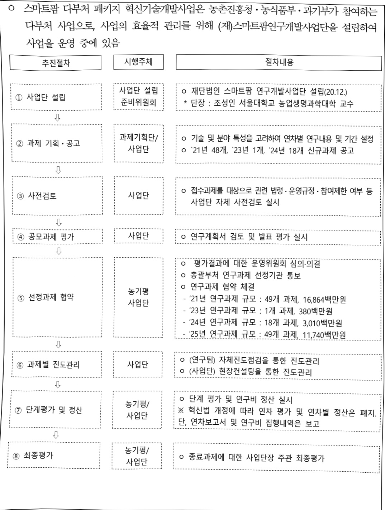

# 스마트팜다부처패키지혁신기술개발(R&D)

**해당 페이지**: PDF 2999 ~ 3012 쪽 해당

**부처**: 농림축산식품부
**분야**: 농림수산
**회계유형**: 농어촌구조개선 특별회계
**2026 확정예산**: 1172.0 백만원
**전년대비 증감률**: None%
**AI 도메인**: 농업/식품

---

<table border=1 style='margin: auto; word-wrap: break-word;'><tr><td style='text-align: center; word-wrap: break-word;'>사 업 명</td></tr><tr><td style='text-align: center; word-wrap: break-word;'>(94) 스마트팜다부처패키지혁신기술개발(R&amp;D) (2280-481)</td></tr></table>

## □ 사업 코드 정보

<table border=1 style='margin: auto; word-wrap: break-word;'><tr><td style='text-align: center; word-wrap: break-word;'>구분</td><td style='text-align: center; word-wrap: break-word;'>회계</td><td style='text-align: center; word-wrap: break-word;'>소관</td><td style='text-align: center; word-wrap: break-word;'>실국(기관)</td><td style='text-align: center; word-wrap: break-word;'>계정</td><td style='text-align: center; word-wrap: break-word;'>분야</td><td style='text-align: center; word-wrap: break-word;'>부문</td></tr><tr><td style='text-align: center; word-wrap: break-word;'>코드명칭</td><td style='text-align: center; word-wrap: break-word;'>농어촌구조개선특별회계</td><td style='text-align: center; word-wrap: break-word;'>농림축산식품부</td><td style='text-align: center; word-wrap: break-word;'>농산업혁신정책관실</td><td style='text-align: center; word-wrap: break-word;'>농어촌특별세사업계정</td><td style='text-align: center; word-wrap: break-word;'>100농림수산</td><td style='text-align: center; word-wrap: break-word;'>101농업·농촌</td></tr></table>

<table border=1 style='margin: auto; word-wrap: break-word;'><tr><td style='text-align: center; word-wrap: break-word;'>구분</td><td style='text-align: center; word-wrap: break-word;'>프로그램</td><td style='text-align: center; word-wrap: break-word;'>단위사업</td><td style='text-align: center; word-wrap: break-word;'>세부사업</td></tr><tr><td style='text-align: center; word-wrap: break-word;'>코드</td><td style='text-align: center; word-wrap: break-word;'>2200</td><td style='text-align: center; word-wrap: break-word;'>2280</td><td style='text-align: center; word-wrap: break-word;'>481</td></tr><tr><td style='text-align: center; word-wrap: break-word;'>명칭</td><td style='text-align: center; word-wrap: break-word;'>농업신산업육성</td><td style='text-align: center; word-wrap: break-word;'>농식품기술개발</td><td style='text-align: center; word-wrap: break-word;'>스마트팝다부처패키지 혁신기술개발(R&amp;D)</td></tr></table>

## □ 사업 성격

<table border=1 style='margin: auto; word-wrap: break-word;'><tr><td rowspan="2">신규</td><td rowspan="2">계속</td><td rowspan="2">완료</td><td style='text-align: center; word-wrap: break-word;'>예비타당성</td><td style='text-align: center; word-wrap: break-word;'>총사업비</td><td style='text-align: center; word-wrap: break-word;'>총액계상</td><td style='text-align: center; word-wrap: break-word;'>사업소관 변경정보</td></tr><tr><td style='text-align: center; word-wrap: break-word;'>실시여부</td><td style='text-align: center; word-wrap: break-word;'>관리대상</td><td style='text-align: center; word-wrap: break-word;'>예산사업</td><td style='text-align: center; word-wrap: break-word;'>2025예산 시 소관</td></tr><tr><td style='text-align: center; word-wrap: break-word;'></td><td style='text-align: center; word-wrap: break-word;'>○</td><td style='text-align: center; word-wrap: break-word;'></td><td style='text-align: center; word-wrap: break-word;'>○</td><td style='text-align: center; word-wrap: break-word;'></td><td style='text-align: center; word-wrap: break-word;'></td><td style='text-align: center; word-wrap: break-word;'>-</td></tr></table>

## □ 사업 지원 형태 및 지원을

<table border=1 style='margin: auto; word-wrap: break-word;'><tr><td style='text-align: center; word-wrap: break-word;'>직접</td><td style='text-align: center; word-wrap: break-word;'>출자</td><td style='text-align: center; word-wrap: break-word;'>출연</td><td style='text-align: center; word-wrap: break-word;'>보조</td><td style='text-align: center; word-wrap: break-word;'>융자</td><td style='text-align: center; word-wrap: break-word;'>국고보조율(%)</td><td style='text-align: center; word-wrap: break-word;'>융자율(%)</td></tr><tr><td style='text-align: center; word-wrap: break-word;'></td><td style='text-align: center; word-wrap: break-word;'></td><td style='text-align: center; word-wrap: break-word;'>○</td><td style='text-align: center; word-wrap: break-word;'></td><td style='text-align: center; word-wrap: break-word;'></td><td style='text-align: center; word-wrap: break-word;'></td><td style='text-align: center; word-wrap: break-word;'></td></tr></table>

## □ 사업 소관부처 및 시행주체

<table border=1 style='margin: auto; word-wrap: break-word;'><tr><td style='text-align: center; word-wrap: break-word;'>사업명</td><td colspan="2">구분</td></tr><tr><td rowspan="4">스마트팜다부처 폐키지혁신기술 개발(R&amp;D)</td><td rowspan="3">소관부처</td><td style='text-align: center; word-wrap: break-word;'>실·국·과(팀)</td></tr><tr><td style='text-align: center; word-wrap: break-word;'>농산업혁신정책관실</td></tr><tr><td style='text-align: center; word-wrap: break-word;'>과학기술정책과</td></tr><tr><td style='text-align: center; word-wrap: break-word;'>사업시행주체</td><td style='text-align: center; word-wrap: break-word;'>농림식품기술기획평가원</td></tr></table>

---

### 가.예산 총괄표

(단위: 백만원, %)

<table border=1 style='margin: auto; word-wrap: break-word;'><tr><td rowspan="2">사업명</td><td rowspan="2">2024년 결산</td><td rowspan="2">2025년 예산 본예산(A)</td><td colspan="2">2026년 예산</td><td rowspan="2">중감 (B-A)</td><td rowspan="2">(B-A)/A</td></tr><tr><td style='text-align: center; word-wrap: break-word;'>요구안</td><td style='text-align: center; word-wrap: break-word;'>본예산(B)</td></tr><tr><td style='text-align: center; word-wrap: break-word;'>스마트팝다부처 패키지혁신기술개발 (R&amp;D)</td><td style='text-align: center; word-wrap: break-word;'>15,779</td><td style='text-align: center; word-wrap: break-word;'>16,636</td><td style='text-align: center; word-wrap: break-word;'>17,808</td><td style='text-align: center; word-wrap: break-word;'>17,808</td><td style='text-align: center; word-wrap: break-word;'>1,172</td><td style='text-align: center; word-wrap: break-word;'>7.0</td></tr></table>

□ 기능별(내역사업별), 예산 내역

(단위:백만원)

<table border=1 style='margin: auto; word-wrap: break-word;'><tr><td rowspan="2"></td><td colspan="5">2024</td><td colspan="5">2025</td><td rowspan="2">2026예산</td></tr><tr><td style='text-align: center; word-wrap: break-word;'>예산액(추경)</td><td style='text-align: center; word-wrap: break-word;'>예산현액</td><td style='text-align: center; word-wrap: break-word;'>집행액</td><td style='text-align: center; word-wrap: break-word;'>이월액</td><td style='text-align: center; word-wrap: break-word;'>불용액</td><td style='text-align: center; word-wrap: break-word;'>본예산</td><td style='text-align: center; word-wrap: break-word;'>예산현액</td><td style='text-align: center; word-wrap: break-word;'>집행액</td><td style='text-align: center; word-wrap: break-word;'>이월예상액</td><td style='text-align: center; word-wrap: break-word;'>불용예상액</td></tr><tr><td style='text-align: center; word-wrap: break-word;'>○ 기능별 분류(합계)</td><td style='text-align: center; word-wrap: break-word;'>15,779</td><td style='text-align: center; word-wrap: break-word;'>15,779</td><td style='text-align: center; word-wrap: break-word;'>15,779[15,779]</td><td style='text-align: center; word-wrap: break-word;'>-</td><td style='text-align: center; word-wrap: break-word;'>-</td><td style='text-align: center; word-wrap: break-word;'>16,636</td><td style='text-align: center; word-wrap: break-word;'>16,636</td><td style='text-align: center; word-wrap: break-word;'>16,636[16,636]</td><td style='text-align: center; word-wrap: break-word;'>-</td><td style='text-align: center; word-wrap: break-word;'>-</td><td style='text-align: center; word-wrap: break-word;'>17,808</td></tr><tr><td style='text-align: center; word-wrap: break-word;'>· 스마트팜 실증· 고도화 연구</td><td style='text-align: center; word-wrap: break-word;'>7,641</td><td style='text-align: center; word-wrap: break-word;'>7,641</td><td style='text-align: center; word-wrap: break-word;'>7,641[7,641]</td><td style='text-align: center; word-wrap: break-word;'>-</td><td style='text-align: center; word-wrap: break-word;'>-</td><td style='text-align: center; word-wrap: break-word;'>8,243</td><td style='text-align: center; word-wrap: break-word;'>8,243</td><td style='text-align: center; word-wrap: break-word;'>8,243[8,243]</td><td style='text-align: center; word-wrap: break-word;'>-</td><td style='text-align: center; word-wrap: break-word;'>-</td><td style='text-align: center; word-wrap: break-word;'>8,879</td></tr><tr><td style='text-align: center; word-wrap: break-word;'>· 차세대 융합·원천기술 연구</td><td style='text-align: center; word-wrap: break-word;'>8,138</td><td style='text-align: center; word-wrap: break-word;'>8,138</td><td style='text-align: center; word-wrap: break-word;'>8,138[8,138]</td><td style='text-align: center; word-wrap: break-word;'>-</td><td style='text-align: center; word-wrap: break-word;'>-</td><td style='text-align: center; word-wrap: break-word;'>8,393</td><td style='text-align: center; word-wrap: break-word;'>8,393</td><td style='text-align: center; word-wrap: break-word;'>8,393[8,393]</td><td style='text-align: center; word-wrap: break-word;'>-</td><td style='text-align: center; word-wrap: break-word;'>-</td><td style='text-align: center; word-wrap: break-word;'>8,929</td></tr><tr><td style='text-align: center; word-wrap: break-word;'>○ 비목별 분류(합계)</td><td style='text-align: center; word-wrap: break-word;'>15,779</td><td style='text-align: center; word-wrap: break-word;'>15,779</td><td style='text-align: center; word-wrap: break-word;'>15,779[15,779]</td><td style='text-align: center; word-wrap: break-word;'>-</td><td style='text-align: center; word-wrap: break-word;'>-</td><td style='text-align: center; word-wrap: break-word;'>16,636</td><td style='text-align: center; word-wrap: break-word;'>16,636</td><td style='text-align: center; word-wrap: break-word;'>16,636[16,636]</td><td style='text-align: center; word-wrap: break-word;'>-</td><td style='text-align: center; word-wrap: break-word;'>-</td><td style='text-align: center; word-wrap: break-word;'>17,808</td></tr><tr><td style='text-align: center; word-wrap: break-word;'>· 연구개발활동비등(360-05)</td><td style='text-align: center; word-wrap: break-word;'>15,779</td><td style='text-align: center; word-wrap: break-word;'>15,779</td><td style='text-align: center; word-wrap: break-word;'>15,779[15,779]</td><td style='text-align: center; word-wrap: break-word;'>-</td><td style='text-align: center; word-wrap: break-word;'>-</td><td style='text-align: center; word-wrap: break-word;'>16,636</td><td style='text-align: center; word-wrap: break-word;'>16,636</td><td style='text-align: center; word-wrap: break-word;'>16,636[16,636]</td><td style='text-align: center; word-wrap: break-word;'>-</td><td style='text-align: center; word-wrap: break-word;'>-</td><td style='text-align: center; word-wrap: break-word;'>17,808</td></tr><tr><td style='text-align: center; word-wrap: break-word;'>○ 기능비목별 분류(합계)</td><td style='text-align: center; word-wrap: break-word;'>15,779</td><td style='text-align: center; word-wrap: break-word;'>15,779</td><td style='text-align: center; word-wrap: break-word;'>15,779[15,779]</td><td style='text-align: center; word-wrap: break-word;'>-</td><td style='text-align: center; word-wrap: break-word;'>-</td><td style='text-align: center; word-wrap: break-word;'>16,636</td><td style='text-align: center; word-wrap: break-word;'>16,636</td><td style='text-align: center; word-wrap: break-word;'>16,636[16,636]</td><td style='text-align: center; word-wrap: break-word;'>-</td><td style='text-align: center; word-wrap: break-word;'>-</td><td style='text-align: center; word-wrap: break-word;'>17,808</td></tr><tr><td style='text-align: center; word-wrap: break-word;'>· 스마트팜 실증· 고도화 연구</td><td style='text-align: center; word-wrap: break-word;'>7,641</td><td style='text-align: center; word-wrap: break-word;'>7,641</td><td style='text-align: center; word-wrap: break-word;'>7,641[7,641]</td><td style='text-align: center; word-wrap: break-word;'>-</td><td style='text-align: center; word-wrap: break-word;'>-</td><td style='text-align: center; word-wrap: break-word;'>8,243</td><td style='text-align: center; word-wrap: break-word;'>8,243</td><td style='text-align: center; word-wrap: break-word;'>8,243[8,243]</td><td style='text-align: center; word-wrap: break-word;'>-</td><td style='text-align: center; word-wrap: break-word;'>-</td><td style='text-align: center; word-wrap: break-word;'>8,879</td></tr><tr><td style='text-align: center; word-wrap: break-word;'>· 연구개발활동비등(360-05)</td><td style='text-align: center; word-wrap: break-word;'>7,641</td><td style='text-align: center; word-wrap: break-word;'>7,641</td><td style='text-align: center; word-wrap: break-word;'>7,641[7,641]</td><td style='text-align: center; word-wrap: break-word;'>-</td><td style='text-align: center; word-wrap: break-word;'>-</td><td style='text-align: center; word-wrap: break-word;'>8,243</td><td style='text-align: center; word-wrap: break-word;'>8,243</td><td style='text-align: center; word-wrap: break-word;'>8,243[8,243]</td><td style='text-align: center; word-wrap: break-word;'>-</td><td style='text-align: center; word-wrap: break-word;'>-</td><td style='text-align: center; word-wrap: break-word;'>8,879</td></tr><tr><td style='text-align: center; word-wrap: break-word;'>· 차세대 융합·원천기술 연구</td><td style='text-align: center; word-wrap: break-word;'>8,138</td><td style='text-align: center; word-wrap: break-word;'>8,138</td><td style='text-align: center; word-wrap: break-word;'>8,138[8,138]</td><td style='text-align: center; word-wrap: break-word;'>-</td><td style='text-align: center; word-wrap: break-word;'>-</td><td style='text-align: center; word-wrap: break-word;'>8,393</td><td style='text-align: center; word-wrap: break-word;'>8,393</td><td style='text-align: center; word-wrap: break-word;'>8,393[8,393]</td><td style='text-align: center; word-wrap: break-word;'>-</td><td style='text-align: center; word-wrap: break-word;'>-</td><td style='text-align: center; word-wrap: break-word;'>8,929</td></tr><tr><td style='text-align: center; word-wrap: break-word;'>· 연구개발활동비등(360-05)</td><td style='text-align: center; word-wrap: break-word;'>8,138</td><td style='text-align: center; word-wrap: break-word;'>8,138</td><td style='text-align: center; word-wrap: break-word;'>8,138[8,138]</td><td style='text-align: center; word-wrap: break-word;'>-</td><td style='text-align: center; word-wrap: break-word;'>-</td><td style='text-align: center; word-wrap: break-word;'>8,393</td><td style='text-align: center; word-wrap: break-word;'>8,393</td><td style='text-align: center; word-wrap: break-word;'>8,393[8,393]</td><td style='text-align: center; word-wrap: break-word;'>-</td><td style='text-align: center; word-wrap: break-word;'>-</td><td style='text-align: center; word-wrap: break-word;'>8,929</td></tr></table>

---

### 나. 사업설명자료

## 1 ) 사업목적·내용

○ 농업 인구 감소 및 고령화에 따른 국내 농업경쟁력 약화에 대응하고 저투입·고효율 중심의 스마트팜 기술 개발 및 고도화를 통한 농업 경쟁력 제고

- (스마트팜 실증·고도화 연구) 농업 지속가능성 및 스마트팜 글로벌 경쟁력 확보를 위해 2세대 스마트팜 현장 적용성 검증·실증 저변 확대를 위해 대학, 정출연, 기업 등을 대상으로 지원

- (차세대 융합·원천기술 연구) 스마트팜의 원천기술 개발 및 확산 등을 통해 지속가능한 농업을 구현하고 최첨단 기술과의 융합을 위한 기술개발로 대학, 정출연, 기업 등을 대상으로 지원

## 2 ) 사업개요

## □ 사업근거 및 추진경위

① 법령상 근거 및 조항 적시

-「농업·농촌 및 식품산업 기본법」제36조 및 동법 시행령

제36조(농업 및 식품 관련 산업의 기술개발 추진) ① 국가와 지방자치단체는 농업 및 식품 관련 산업의 기술 등을 신속하게 개발·보급하기 위하여 관련 연구기관 또는 단체 등에 농업 및 식품 관련 산업의 기술개발 연구를 수행하게 할 수 있다.

② 국가와 지방자치단체는 제1항에 따라 농업 및 식품 관련 산업의 기술개발 연구를 수행하는 관련 연구기관 또는 단체 등에 대하여 필요한 자금을 지원할 수 있다.

「농림식품과학기술육성법」제6조 및 동법 시행령

제6조(연구개발사업의 추진) ① 정부는 종합계획 및 시행계획을 효율적으로 추진하기 위하여 농림식품과학기술 연구 개발사업(이하 "연구개발사업"이라 한다)을 한다.

② 농림축산식품부장관은 연구개발사업을 할 때 연도별·분야별 연구과제를 선정하여 다음 각 호의 기관이나 단체 등과 협약을 맺어 연구를 하게 할 수 있다. 이 경우 제5호의 기관 중 법인이 아닌 기관에 대하여는 그 기관이 속한 법인의 대표와 협약을 맺을 수 있다.

1. 국공립 연구기관

2. 「특정연구기관 육성법」 제2조에 따른 연구기관

3. 「정부출연연구기관 등의 설립·운영 및 육성에 관한 법률」에 따라 설립된 정부출연연구기관 또는「과학기술분야 정부출연연구기관 등의 설립·운영 및 육성에 관한 법률」에 따라 설립된 과학기술분야 정부출연연구기관

4. 「고등교육법」 제2조에 따른 학교

4의2.「연구산업진흥법」제6조제1항에 따라 신고한 전문연구사업자

5. 대통령령으로 정하는 기준에 해당하는 기업부설연구소

6. 「민법」이나 다른 법률에 따라 설립된 법인인 연구기관

7. 그 밖에 대통령령으로 정하는 농림식품과학기술 분야의 연구기관 또는 단체

③ 농림축산식품부장관은 연구개발사업을 추진하기 위하여 제2항에 따라 연구를 수행하는 기관이나 단체 등에 출연금을 지급할 수 있다.

④ 농림축산식품부장관은 제2항에 따른 기관이나 단체에 다음 각 호의 사업을 하게 할 수 있다. 이 경우 농림축산식품부장관은 사업에 필요한 비용의 전부 또는 일부를 예산의 범위에서 지원할 수 있다.

1. 기술 개발 인력에 관한 전문교육 및 연수

2. 국내외 농림식품과학기술 정보의 수집·분석 및 보급

3. 그 밖에 농림식품과학기술의 육성을 위하여 농림축산식품부장관이 필요하다고 인정하는 사업

⑤ 제2항에 따른 연구과제의 선정방법, 협약의 체결방법과 제3항에 따른 출연금의 지급·사용·관리에 필요한 사항은 대통령령으로 정한다.

---

「농촌진흥법」제7조 및 동법 시행령

제7조(연구개발사업의 실시) ① 농촌진흥청장은 연구개발사업을 효율적으로 추진하기 위하여 고유연구사업 이외에 공동연구사업 등을 실시할 수 있다.

② 제1항에 따른 공동연구사업은 분야별 연구과제를 선정하여 다음 각 호의 기관이나 단체·농업인 등과 협약을 맺어 실시한다. 이 경우 법인이 아닌 기관에 대하여는 그 기관이 속한 법인의 대표와 협약을 맺을 수 있다.

1.국공립연구기관

2.지방농촌진흥기관

3.「특정연구기관 육성법」제2조에 따른 특정연구기관

4.「정부출연연구기관 등의 설립·운영 및 육성에 관한 법률」 또는「과학기술분야 정부출연연구기관 등의 설립·운영 및 육성에 관한 법률」에 따라 설립된 정부출연연구기관

5.「고등교육법」제2조에 따른 학교

6. 그 밖에 농촌진흥청장이 정하는 연구기관 또는 단체

③ 농촌진흥청장은 공동연구사업 추진에 필요한 비용의 전부 또는 일부를 지원하기 위하여 제2항의 기관 등에 출연할 수 있다.

## ② 추진경위

- 관련 국정과제

° (경제2-3) 세계에서 AI를 가장 잘쓰는 AI 기본사회 실현

* ④ AI 활용 확대를 통한 전 산업·지역 확산

° (경제2-16) 국민먹거리를 지키는 국가전략산업으로 농업 육성

* ③ 스마트 데이터 농업 등 미래 신산업 육성

## - 관련 상위계획

스마트농수산업 연구개발 고도화 방안(과기부, '22.1)

0 제8차 농업과학기술 중장기 연구개발 계획(농진청, '23.2.)

° 제4차 융합연구개발 활성화 기본계획(과기부, '23.12.)

스마트 농산업 발전 방안(농식품부, '24.4.)

0 제4차 농림식품과학기술 육성 종합계획(농식품부, '25.3.)

## -사업 추진경위

0 새정부 경제정책방향에 혁신성장 8대 선도사업 중 하나로 스마트팜 선정('17.7)

0 다부처 사업 추진 최초 권고(과기정통부→농식품부, '18.1)

0 다부처 공동기획 착수('18.2.)

° 예비타당성조사 신청 2회 및 예타대상 미선정 2회('18년 제2차-5월, 제3차-8월)

0 다부처 공동 보완기획 완료('19.1.)

° 예비타당성조사 신청('19년 제1차-2월), 대상선정('19.3.), 예타통과('19.10.)

ㅇ 다부처 사업 1단계('21~'24년) 종료 후 2단계('25~'27년) 추진 중

## «관련 주요 공약

#### 이재명 정부 공약(2. 성장, 4. 국가균형발전-18)

- 스마트 데이터농업 확산, 푸드테크·그린바이오 산업 육성, K-푸드 수출 확대, R&D 강화로 농업을 미래농산업으로 전환하겠습니다.

---

## □ 주요내용

① 사업규모

- 총사업비(해당되는 경우에만 기재) : 해당없음

- 사업기간 : '21년~'27년

- 최근 5년 간 투입된 사업비(예산액기준, 추경편성한 연도에는 추경포함)

<table border=1 style='margin: auto; word-wrap: break-word;'><tr><td style='text-align: center; word-wrap: break-word;'>$ \underline{\text{笹}} $</td><td style='text-align: center; word-wrap: break-word;'>2022</td><td style='text-align: center; word-wrap: break-word;'>2023</td><td style='text-align: center; word-wrap: break-word;'>2024</td><td style='text-align: center; word-wrap: break-word;'>2025</td><td style='text-align: center; word-wrap: break-word;'>2026</td></tr><tr><td style='text-align: center; word-wrap: break-word;'>$ \underline{\text{사업비}} $</td><td style='text-align: center; word-wrap: break-word;'>20,140</td><td style='text-align: center; word-wrap: break-word;'>20,140</td><td style='text-align: center; word-wrap: break-word;'>15,779</td><td style='text-align: center; word-wrap: break-word;'>16,636</td><td style='text-align: center; word-wrap: break-word;'>17,808</td></tr></table>

- 기타 : 2개 내역사업

② 사업추진체계

- 사업시행방법 : 출연 100%(대기업 50%, 중견기업 30%, 중소기업 25% 이상 매칭)

- 사업시행주체 : 농림식품기술기획평가원, (재)스마트팜연구개발사업단

- 사업 수혜자 : 농산업체, 대학, 연구소, 기업, 농업회사법인 등

- 보조, 융자, 출연, 출자 등의 경우 보조·융자 등 지원 비율 및 법적근거

<table border=1 style='margin: auto; word-wrap: break-word;'><tr><td style='text-align: center; word-wrap: break-word;'>내역사업명</td><td style='text-align: center; word-wrap: break-word;'>구분</td><td style='text-align: center; word-wrap: break-word;'>피보조·피출연 등 기관명</td><td style='text-align: center; word-wrap: break-word;'>지원 금액 (2026예산)</td><td style='text-align: center; word-wrap: break-word;'>지원 비율(%)</td><td style='text-align: center; word-wrap: break-word;'>보조율 법적근거 (해당 조항)</td></tr><tr><td style='text-align: center; word-wrap: break-word;'>스마트팜 실증·고도화 연구</td><td style='text-align: center; word-wrap: break-word;'>출연</td><td style='text-align: center; word-wrap: break-word;'>농림식품 기술기획 평가원 (재스파트팜 연구개발 사업단</td><td style='text-align: center; word-wrap: break-word;'>8,879</td><td style='text-align: center; word-wrap: break-word;'>100</td><td style='text-align: center; word-wrap: break-word;'>- 농업·농촌 및 식품산업 기본법 제36조 - 농림식품과학기술육성법 제6조 - 농촌진흥법 제7조</td></tr><tr><td style='text-align: center; word-wrap: break-word;'>차세대 융합·원천 기술연구</td><td style='text-align: center; word-wrap: break-word;'>출연</td><td style='text-align: center; word-wrap: break-word;'>농림식품 기술기획 평가원 (재스파트팜 연구개발 사업단</td><td style='text-align: center; word-wrap: break-word;'>8,929</td><td style='text-align: center; word-wrap: break-word;'>100</td><td style='text-align: center; word-wrap: break-word;'>- 농업·농촌 및 식품산업 기본법 제36조 - 농림식품과학기술육성법 제6조 - 농촌진흥법 제7조</td></tr></table>

---

## 3 ) '26년도 예산 산출 근거

스마트팜다부처패키지혁신기술개발 : (2025 추경) 16,636백만원 → (2026 예산) 17,808백만원, 1,172백만원 증액

스마트팜 실증·고도화 연구 : (2025 추경) 8,243백만원 → (2026 예산) 8,879백만원, 636백만원 증액

- (편성) 사업 2단계('25~'27)에 맞추어 연구성과를 실제 영농 현장에 보급·적용을 촉진하고 통합 실증 중심의 연구

과제의 기술개발 지원을 위한 8,879백만원 요구

* 무인 자율형 작물별·축종별 K-Farm 데모 온실·축사 구축, 정밀 개체관리 플랫폼 개발, 스마트팜 자율주행 기술 기반 무인화 로봇 개발 등 계속 23개 과제 및 스마트 축사 기자재 통합 운영 플랫폼 개발 등 종료 1개 과제

- (산출) 8,879백만원

* (계속) 23개×365백만×12/12 = 8,399백만원

<table border=1 style='margin: auto; word-wrap: break-word;'><tr><td style='text-align: center; word-wrap: break-word;'>유형</td><td style='text-align: center; word-wrap: break-word;'>과제 수</td><td style='text-align: center; word-wrap: break-word;'>단가</td><td style='text-align: center; word-wrap: break-word;'>지원 개월 수</td><td style='text-align: center; word-wrap: break-word;'>합계</td></tr><tr><td style='text-align: center; word-wrap: break-word;'>계속</td><td style='text-align: center; word-wrap: break-word;'>23개</td><td style='text-align: center; word-wrap: break-word;'>365백만원</td><td style='text-align: center; word-wrap: break-word;'>12/12</td><td style='text-align: center; word-wrap: break-word;'>8,399백만원</td></tr></table>

* (종료) 1개×480백만×12/12 = 480백만원

<table border=1 style='margin: auto; word-wrap: break-word;'><tr><td style='text-align: center; word-wrap: break-word;'>유형</td><td style='text-align: center; word-wrap: break-word;'>과제 수</td><td style='text-align: center; word-wrap: break-word;'>단가</td><td style='text-align: center; word-wrap: break-word;'>지원 개월 수</td><td style='text-align: center; word-wrap: break-word;'>합계</td></tr><tr><td style='text-align: center; word-wrap: break-word;'>종료</td><td style='text-align: center; word-wrap: break-word;'>1개</td><td style='text-align: center; word-wrap: break-word;'>480백만원</td><td style='text-align: center; word-wrap: break-word;'>12/12</td><td style='text-align: center; word-wrap: break-word;'>480백만원</td></tr></table>

② 차세대 융합·원천기술 연구 : (2025 추경) 8,393백만원 → (2026 예산) 8,929백만원, 536백만원 증액

- (변성) 신재생에너지·빅데이터·AI 능을 섭봉한 영농기술 개발 지원을 통해 무인화·자동화로 대표되는 차세대

스마트팜 원천기술 확보 지원을 위한 8,929백만원 요구

* R&D 빅데이터를 활용한 통합관리용 플랫폼 개발, 신재생에너지 활용 저변 확대를 위한 태양광, 가축분뇨 등의 활용기술 개발, 노동력 저감을 위한 무인로봇 연구과제 27개 및 온실·축사 통합제어 및 관리용 시스템 개발 등 종료 2개 과제

- (산출) 8,929백만원

* (계속) 27개×300백만×12/12 = 8,089백만원

<table border=1 style='margin: auto; word-wrap: break-word;'><tr><td style='text-align: center; word-wrap: break-word;'>유형</td><td style='text-align: center; word-wrap: break-word;'>과제 수</td><td style='text-align: center; word-wrap: break-word;'>단가</td><td style='text-align: center; word-wrap: break-word;'>지원 개월 수</td><td style='text-align: center; word-wrap: break-word;'>합계</td></tr><tr><td style='text-align: center; word-wrap: break-word;'>계속</td><td style='text-align: center; word-wrap: break-word;'>27개</td><td style='text-align: center; word-wrap: break-word;'>300백만원</td><td style='text-align: center; word-wrap: break-word;'>12/12</td><td style='text-align: center; word-wrap: break-word;'>8,089백만원</td></tr></table>

* (종료) 2개×420백만×12/12 = 840백만원

<table border=1 style='margin: auto; word-wrap: break-word;'><tr><td style='text-align: center; word-wrap: break-word;'>유형</td><td style='text-align: center; word-wrap: break-word;'>과제 수</td><td style='text-align: center; word-wrap: break-word;'>단가</td><td style='text-align: center; word-wrap: break-word;'>지원 개월 수</td><td style='text-align: center; word-wrap: break-word;'>합계</td></tr><tr><td style='text-align: center; word-wrap: break-word;'>종료</td><td style='text-align: center; word-wrap: break-word;'>2개</td><td style='text-align: center; word-wrap: break-word;'>420백만원</td><td style='text-align: center; word-wrap: break-word;'>12/12</td><td style='text-align: center; word-wrap: break-word;'>840백만원</td></tr></table>

ㅇ 2025년도 예산 및 2026년도 예산 산출 세부내역 비교

<table border=1 style='margin: auto; word-wrap: break-word;'><tr><td colspan="2">&#x27;25년 예산</td><td colspan="2">&#x27;26년 예산</td></tr><tr><td style='text-align: center; word-wrap: break-word;'>예산</td><td style='text-align: center; word-wrap: break-word;'>산출내역</td><td style='text-align: center; word-wrap: break-word;'>예산</td><td style='text-align: center; word-wrap: break-word;'>산출내역</td></tr><tr><td rowspan="2">16,636</td><td style='text-align: center; word-wrap: break-word;'>○ 연구개발활동비등(360-05): 16,636백만원가. 스마트팜 실증·고도화 연구 (8,243백만원) • (계속) 3개×234백만×12/12=702백만원 • (종료) 6개×214백만×12/12=1,281백만원 • (신규) 21개×397백만×9/12=6,260백만원</td><td style='text-align: center; word-wrap: break-word;'>17,808</td><td style='text-align: center; word-wrap: break-word;'>○ 연구개발활동비등(360-05): 17,808백만원가. 스마트팜 실증·고도화 연구 (8,879백만원) • (계속) 23개×365백만×12/12=8,399백만원 • (종료) 1개×480백만×12/12=480백만원</td></tr><tr><td style='text-align: center; word-wrap: break-word;'>나. 차세대 융합·원천기술 연구 (8,393백만원) • (계속) 1개×787백만×12/12=787백만원 • (종료) 9개×236백만×12/12=2,126백만원 • (신규) 28개×261백만×9/12=5,480백만원</td><td style='text-align: center; word-wrap: break-word;'>나. 차세대 융합·원천기술 연구 (8,929백만원) • (계속) 27개×300백만×12/12=8,089백만원 • (종료) 2개×420백만×12/12=840백만원</td><td style='text-align: center; word-wrap: break-word;'></td></tr></table>

---

## 4 ) 사업효과

□ 사업영향, 산출물 성과지표 등

① '22~'26년도 성과계획서 상 성과지표 및 최근 5년간 성과 달성도

<table border=1 style='margin: auto; word-wrap: break-word;'><tr><td style='text-align: center; word-wrap: break-word;'>성과지표</td><td style='text-align: center; word-wrap: break-word;'>구분</td><td style='text-align: center; word-wrap: break-word;'>&#x27;22</td><td style='text-align: center; word-wrap: break-word;'>&#x27;23</td><td style='text-align: center; word-wrap: break-word;'>&#x27;24</td><td style='text-align: center; word-wrap: break-word;'>&#x27;25</td><td style='text-align: center; word-wrap: break-word;'>&#x27;26</td><td style='text-align: center; word-wrap: break-word;'>&#x27;26목표치산출근거</td><td style='text-align: center; word-wrap: break-word;'>측정산식(또는 측정방법)</td><td style='text-align: center; word-wrap: break-word;'>자료수집방법(또는 자료출처)</td></tr><tr><td rowspan="3">(1단계) 2세대 스마트팜 실증·전용면적</td><td style='text-align: center; word-wrap: break-word;'>목표</td><td style='text-align: center; word-wrap: break-word;'>5,700</td><td style='text-align: center; word-wrap: break-word;'>8,550</td><td style='text-align: center; word-wrap: break-word;'>12,825</td><td style='text-align: center; word-wrap: break-word;'>-</td><td style='text-align: center; word-wrap: break-word;'>-</td><td rowspan="3">전년대비 매년 50% 확대로 설정(1세대 스마트팜 현장보급률 감안)</td><td rowspan="3">해당년도 스마트팜 실증 및 전용면적</td><td rowspan="3">연차실적보고서 연구성과 활용보고서 농림부 통계연보</td></tr><tr><td style='text-align: center; word-wrap: break-word;'>실적</td><td style='text-align: center; word-wrap: break-word;'>7,277</td><td style='text-align: center; word-wrap: break-word;'>26,231</td><td style='text-align: center; word-wrap: break-word;'>35,250</td><td style='text-align: center; word-wrap: break-word;'>-</td><td style='text-align: center; word-wrap: break-word;'>-</td></tr><tr><td style='text-align: center; word-wrap: break-word;'>달성도</td><td style='text-align: center; word-wrap: break-word;'>128%</td><td style='text-align: center; word-wrap: break-word;'>307%</td><td style='text-align: center; word-wrap: break-word;'>2749%</td><td style='text-align: center; word-wrap: break-word;'>-</td><td style='text-align: center; word-wrap: break-word;'>-</td></tr><tr><td rowspan="3">(2단계) 수출액 (정부출연금 10억원 당)</td><td style='text-align: center; word-wrap: break-word;'>목표</td><td style='text-align: center; word-wrap: break-word;'>-</td><td style='text-align: center; word-wrap: break-word;'>-</td><td style='text-align: center; word-wrap: break-word;'>-</td><td style='text-align: center; word-wrap: break-word;'>24.03</td><td style='text-align: center; word-wrap: break-word;'>25.23</td><td rowspan="3">&#x27;21년 10% &#x27;22년 30% &#x27;23년 60% 수준의 수출액 목표를 설정한 후, &#x27;24년부터 5%의 도전적 수치 설정</td><td rowspan="3">수출액 X 기여율</td><td rowspan="3">연차실적보고서 연구성과 활용보고서 수출증빙자료</td></tr><tr><td style='text-align: center; word-wrap: break-word;'>실적</td><td style='text-align: center; word-wrap: break-word;'>-</td><td style='text-align: center; word-wrap: break-word;'>-</td><td style='text-align: center; word-wrap: break-word;'>-</td><td style='text-align: center; word-wrap: break-word;'>-</td><td style='text-align: center; word-wrap: break-word;'>-</td></tr><tr><td style='text-align: center; word-wrap: break-word;'>달성도</td><td style='text-align: center; word-wrap: break-word;'>-</td><td style='text-align: center; word-wrap: break-word;'>-</td><td style='text-align: center; word-wrap: break-word;'>-</td><td style='text-align: center; word-wrap: break-word;'>-</td><td style='text-align: center; word-wrap: break-word;'>-</td></tr><tr><td rowspan="3">(1·2단계) 우수특허지수</td><td style='text-align: center; word-wrap: break-word;'>목표</td><td style='text-align: center; word-wrap: break-word;'>3.9</td><td style='text-align: center; word-wrap: break-word;'>4.0</td><td style='text-align: center; word-wrap: break-word;'>4.1</td><td style='text-align: center; word-wrap: break-word;'>4.2</td><td style='text-align: center; word-wrap: break-word;'>4.3</td><td rowspan="3">유사사업(ICT융복합시스템)의 3개년 평균 특허 점수에서 3% 향상</td><td rowspan="3">등록특허에 대한 SMART 시스템의 특허등급 점수(SMART지수) 평균 \Sigma (SMART지수)/(등록특허 수)</td><td rowspan="3">한국발명진흥회 SMART 시스템, 연구성과 활용보고서</td></tr><tr><td style='text-align: center; word-wrap: break-word;'>실적</td><td style='text-align: center; word-wrap: break-word;'>4.71</td><td style='text-align: center; word-wrap: break-word;'>4.16</td><td style='text-align: center; word-wrap: break-word;'>4.1</td><td style='text-align: center; word-wrap: break-word;'>-</td><td style='text-align: center; word-wrap: break-word;'>-</td></tr><tr><td style='text-align: center; word-wrap: break-word;'>달성도</td><td style='text-align: center; word-wrap: break-word;'>120%</td><td style='text-align: center; word-wrap: break-word;'>104%</td><td style='text-align: center; word-wrap: break-word;'>100%</td><td style='text-align: center; word-wrap: break-word;'>-</td><td style='text-align: center; word-wrap: break-word;'>-</td></tr><tr><td rowspan="3">(1·2단계) 우수논문지수</td><td style='text-align: center; word-wrap: break-word;'>목표</td><td style='text-align: center; word-wrap: break-word;'>65.1</td><td style='text-align: center; word-wrap: break-word;'>67.1</td><td style='text-align: center; word-wrap: break-word;'>69.1</td><td style='text-align: center; word-wrap: break-word;'>71.2</td><td style='text-align: center; word-wrap: break-word;'>73.3</td><td rowspan="3">유사사업(ICT융복합시스템)의 3개년 평균 논문 지수에서 3% 향상</td><td rowspan="3">게재된 논문의 mrnIF 값 평균치</td><td rowspan="3">표준화 순위보정 영향력지수 (한국연구재단, NTIS)</td></tr><tr><td style='text-align: center; word-wrap: break-word;'>실적</td><td style='text-align: center; word-wrap: break-word;'>68.51</td><td style='text-align: center; word-wrap: break-word;'>70.1</td><td style='text-align: center; word-wrap: break-word;'>75.9</td><td style='text-align: center; word-wrap: break-word;'>-</td><td style='text-align: center; word-wrap: break-word;'>-</td></tr><tr><td style='text-align: center; word-wrap: break-word;'>달성도</td><td style='text-align: center; word-wrap: break-word;'>152%</td><td style='text-align: center; word-wrap: break-word;'>104%</td><td style='text-align: center; word-wrap: break-word;'>108%</td><td style='text-align: center; word-wrap: break-word;'>-</td><td style='text-align: center; word-wrap: break-word;'>-</td></tr><tr><td rowspan="3">(1·2단계) 기술료 (정부지원금 10억원당)</td><td style='text-align: center; word-wrap: break-word;'>목표</td><td style='text-align: center; word-wrap: break-word;'>4.5</td><td style='text-align: center; word-wrap: break-word;'>9</td><td style='text-align: center; word-wrap: break-word;'>16</td><td style='text-align: center; word-wrap: break-word;'>16.8</td><td style='text-align: center; word-wrap: break-word;'>17.6</td><td rowspan="3">유사사업(ICT융복합시스템)의 3개년 기술료의 3% 향상치 설정</td><td rowspan="3">당연연도 기술료/ (당해연도 예산) / 10억)</td><td rowspan="3">연구성과 활용보고서. 기술실시보고서 기술이전 계약서 등 (기술이전 증빙서류)</td></tr><tr><td style='text-align: center; word-wrap: break-word;'>실적</td><td style='text-align: center; word-wrap: break-word;'>13.8</td><td style='text-align: center; word-wrap: break-word;'>10.2</td><td style='text-align: center; word-wrap: break-word;'>18.7</td><td style='text-align: center; word-wrap: break-word;'>-</td><td style='text-align: center; word-wrap: break-word;'>-</td></tr><tr><td style='text-align: center; word-wrap: break-word;'>달성도</td><td style='text-align: center; word-wrap: break-word;'>3073%</td><td style='text-align: center; word-wrap: break-word;'>1146%</td><td style='text-align: center; word-wrap: break-word;'>1169%</td><td style='text-align: center; word-wrap: break-word;'>-</td><td style='text-align: center; word-wrap: break-word;'>-</td></tr></table>

---

② 성과지표 이외의 연도별 사업추진 경과 및 실적

<table border=1 style='margin: auto; word-wrap: break-word;'><tr><td style='text-align: center; word-wrap: break-word;'>2022</td><td style='text-align: center; word-wrap: break-word;'>○ 47개 과제 대상 단계평가 실시, 연구과제비 정산 실시○ 스마트 온실의 순환식 수경재배 시스템 개발- 상용관수시스템 활용 순환식 수경재배 통합 시뮬레이션 모델 구축- 농축양양 다량 · 미량원소 양분 균형을 위한 피드백 제어 알고리즘 개발- 배액 내 이온 모니터링 장치 및 인공지능 기반 정밀 비료 공급기 개발○ 가금(육계, 산란계) 개체별 정밀 모니터링 및 지능형 사양관리 기술- 육계 생장단계별 체중데이터 수집 및 예측 알고리즘 개발 · 현장실증- 인공지능 기반 폐사체 · 과산계 선별용 산란수 측정 및 영상분석 알고리즘 개발- 클라우드 기반 실시간 계사 환경 모니터링 · 인공지능 분석 서버 구축- 지능형 사양관리 연동 통합관제시스템 및 모바일 어플리케이션 개발○ 수경재배 과체류 재배 모니터링, 적과 및 수확 로봇 기술 개발- 작물 이미지 데이터(시계열, 초분광) 수집 · 전처리 및 작물 성숙도 관련 개발- 디지털 트런 기반 과실 위치 맵평 및 작물 3차원 위치 · 자세 인식 기술 개발- 적과 · 수확 작업용 매니폴레이터 및 생체모낭 엔드이젤터 개발- 과체류 작업 로봇 호환성 확보를 위한 스마트 온실 농업용 로봇 표준 개발</td></tr><tr><td style='text-align: center; word-wrap: break-word;'>2023</td><td style='text-align: center; word-wrap: break-word;'>○ 시설 과체류 작물 생육수확량 예측 기반 온실환경 모델링 및 시뮬레이션 SW 개발- 복합환경 관리를 위한 작물 생육/생리/수확량 예측 고도화 모델 개발- 환경 및 생육 조건을 활용한 작물 생장, 수확량 예측 모델 개발- 3차원 작물모델링 기반 시설과체류 작물 생육, 온실 환경모델링○ 스마트 온실의 순환식 수경 재배 시스템 개발- 순환식 수경재배 개발을 통해 과체류 및 염채류 재배 실증- 양분 분석 DB기반의 복합 양분/균형/제어관리 알고리즘 개발- 순환식 수경재배 실꾼 공정의 효율 극대화를 위한 전처리 여과 모듈 UV 살균시스템 개발○ 젖소 외모 및 선형심사 자동화 시스템 기술개발- 젖소 개체식별번호 확인/입력과 외모 · 선형심사 결과 조정용 DB수집을 위한 카메라 개발- 개체인식 정확도 향상을 위한 이미지 및 실측 데이터 인공지능 학습 자동화 SW 개발○ 돼지 경제형질 체중, 체적 및 외모심사 정밀 측정 · 관리 시스템 구축- 종돈 체중 · 체적 및 외모 심사 DB기반 인공지능 학습용 원천 데이터 분석 서비스 개발- 딥러닝 기술을 활용한 종돈 개체식별과 개체별 형질 측정 자동화 체계 구축- 개발 기술 정확도 검증을 위한 무게 추정 요인별 실측치와 예측치 간의 자동화 기술 개발</td></tr></table>

---

<table border=1 style='margin: auto; word-wrap: break-word;'><tr><td style='text-align: center; word-wrap: break-word;'>2024</td><td style='text-align: center; word-wrap: break-word;'>○ 18개 신규과제 공고·협약체결·연구비 지급(&#x27;24.4., &#x27;24.7.)○ 시설과채류 지능형 전주기 수직농장 통합시스템 개발 및 실증- 무인 환경모니터링시스템, 병/생리장애 조기진단 및 예측시스템, 인공수분 시스템, 맞춤형 관환경시스템, 지능형 제어시스템 등 전주기 시스템 설계 및 구축- 모듈화 시스템 연계를 통한 건물형 전주기 무인 자동화 수직농장 통합시스템 구축 및 실증- 전주기 수직농장 통합시스템 해외 실증 및 현지 운영을 통한 적응성 검증○ 지능형 분무경 수경재배시스템 실증 및 재배기술 최적화- 자원활용 최소화, 고소득 작물 최적 생산기술 개발 및 실증- 분무경 최적재배 및 유지보수 용이성을 제고한 순환형 분무경 수경재배 수직농장 설계 및 실증- ICT 기반 분무경 생육환경 자동제어 및 실시간 양액순환 모니터링 시스템 실증- 데모온실 내 작물 실재배를 통한 생산성, 경제성, 효율성 등 분석 및 검증○ 돼지(모든) 개체별 체형 정밀진단 및 지능형 급이시스템 개발 및 상용화- 주요 번식기별 모든 생리적 특성(산차, 체중, 번식기, 산자수 등) 분석 및 영양소 요구량(에너지, 아미노산, 광물질, 비타민 등) 산출- 체형 진단 의사결정 방안에 따라 개체별 영양소 요구량을 고려한 지능형 급이시스템 자동 제어 및 운영 자동화○ 한우/젖소 개체식별, 경제형질, 유전능력 평가기술을 연계한 맞춤형 개체관리 실증- ICT 장비 활용 개체식별 정보 및 경제형실 평가 결과를 활용한 맞춤형 개체관리(사유기간, 사료 급여량/배합률 등) 통합 의사결정 인공지능 솔루션 실증- 개체관리에 따른 경제성 평가 및 예측정보 제공을 통한 사육전략 의사결정 지원모델 개발</td></tr><tr><td style='text-align: center; word-wrap: break-word;'>2025</td><td style='text-align: center; word-wrap: break-word;'>○ 49개 신규과제 공고(&#x27;25.2.)·선정평가(&#x27;25.3.)·협약체결(&#x27;25.4.)○ 스마트 온실 병해충, 생리장해 정밀진단 및 무인 방제 시스템 상용화- 무인 주행형 자동 방제 로봇 활용 병해/생리장해 모니터링 시스템 구축- 인공지능 기반 병해충/생리장해 정밀진단에 따른 맘지춤형 무인 주행형 국소 방제 시스템 개발 및 실증○ 무인 자율형 K-Farm 데모온실 구축 및 검증(박과·저온성·고온성) - 작물의 전주기 시스템 설계 및 공정 시스템 개발- 양액 및 생리장해 저감 등 맞춤형 순환식 양액공급 자동화 시스템 개발○ 생성형 AI 활용 축우/양돈 스마트 개체관리 시스템 상용화- 데이터 온돌로지 및 생성형 AI 서비스 모델 개발- ICT 데이터 및 사양관리기록을 기반으로 사용자 친화적 온라인 컨설팅 서비스 개발○ 스마트 축사용 통합제어 및 사육관리용 MCU 임베디드 시스템 개발 및 실증- 현장 보급을 위한 소형화, 유무선 통신이 가능한 MCU 센서 제어 보드 개발- 영상 센서 기반 특이사항 및 음향센서 기반 탐지/대응 알고리즘 및 SW 개발</td></tr></table>

---

<table border=1 style='margin: auto; word-wrap: break-word;'><tr><td style='text-align: center; word-wrap: break-word;'>○ 29개 종료과제 최종평가 실시(&#x27;25.4., &#x27;25.7.)○ 시설 과채류 작물의 디지털 재배관리를 위한 의사결정 SW 개발- 클라우드 기반 스마트팜 디지털 재배관리를 위한 온라인 컨설팅 SW 플랫폼 개발- 통합 데이터 모니터링 SW 개발 및 실증·상용화○ 돼지(비육돈, 번식돈) 정밀 모니터링 및 지능형 사양관리 기술- 돼지 행동학적 패턴에 대한 생체정보 활용 및 개체위치 식별기술 개발- 돼지 급이 자동화 시스템 현장 실증 및 고도화 연구○ 인공지능을 이용한 스마트 온실의 완전자율형 복합환경 제어 플랫폼 개발- 생육정보 기반 최적 환경 조성을 위한 인공지능 활용기술 개발- 인공지능 학습 모델 기반 온실 통합환경제어 플랫폼 개발○ 무인자동화 차세대 고밀도 작물재배 컨테이너 시스템 개발- 고밀도 작물 재배 및 운영을 위한 기능별 모듈러 컨테이너의 설계 표준화 및 실증- IoT기술을 이용한 클라우드 기반의 글로벌 대규모 컨테이너 농장 관제 시스템 구축 및 운영 실증</td></tr></table>

## ③ 향후('26년도 이후) 기대효과

(시설원예) 자동화 시스템 및 로봇 기능 고도화를 통한 농촌 인구감소 및 고령화 대응 가능

- 고성능 스마트팜 국부냉방 패키지 기술개발을 통해 하절기 냉방에너지 및 온실

가스 40% 이상 절감

- 수확 후 전 과정 무인 자동화 시스템 개발을 통해 농가 생산량 28% 증가 및

고용 노동비 16% 감소

(시설축산) 맞춤형 의사결정 및 무인 자율제어가 가능한 시스템 구축을 통해 식량안보 강화

- 출하 예측 서비스 기술 강화를 통해 육계 출하일령 2일 단축 등 농가 생산성 극대화

- 질병 및 이상징후 조기대응 가능한 시스템 구축을 통해 가축 질병 발생률 감소

 및 고품질 축산물 생산 가능

---

## 5 ) 타당성조사 및 예비타당성조사 시행여부 및 결과 요지

☐ 예비타당성 조사 시행 (KISTEP, '19.02 ~ '19.10)

- (결과) B/C ratio 0.74, AHP 0.786

- (특이사항) 빅데이터/인공지능 활용방안 체계화, 일원화된 사업 운영관리규정 마련 권고 등

- (평가결과 반영사항) 사업단장 선임(20.11), 재단법인 스마트팜연구개발사업단 설립(20.12), 정규직

8인 채용('21.1), 스마트팜 다부처 패키지 혁신기술개발사업 운영규정(훈령) 개정('21.6)

## 6 ) 총사업비 대상사업 정보

□ 총사업비 정보

(단위: 억원)

<table border=1 style='margin: auto; word-wrap: break-word;'><tr><td style='text-align: center; word-wrap: break-word;'>연도</td><td style='text-align: center; word-wrap: break-word;'>사업기간</td><td style='text-align: center; word-wrap: break-word;'>2022까지 기투자액</td><td style='text-align: center; word-wrap: break-word;'>2023</td><td style='text-align: center; word-wrap: break-word;'>2024</td><td style='text-align: center; word-wrap: break-word;'>2025</td><td style='text-align: center; word-wrap: break-word;'>2026</td><td style='text-align: center; word-wrap: break-word;'>2026이후 투자계획</td><td style='text-align: center; word-wrap: break-word;'>계</td></tr><tr><td style='text-align: center; word-wrap: break-word;'>사업비</td><td style='text-align: center; word-wrap: break-word;'>&#x27;21~&#x27;27</td><td style='text-align: center; word-wrap: break-word;'>379</td><td style='text-align: center; word-wrap: break-word;'>201</td><td style='text-align: center; word-wrap: break-word;'>158</td><td style='text-align: center; word-wrap: break-word;'>166</td><td style='text-align: center; word-wrap: break-word;'>178</td><td style='text-align: center; word-wrap: break-word;'>148</td><td style='text-align: center; word-wrap: break-word;'>1,230</td></tr></table>

□ 총사업비 변경내역(변경일자 및 규모, 변경사유) : 해당 없음

---

## 7 ) 사업 집행절차

---

-스마트팜 실증·고도화 연구(1내역 사업)

<table border=1 style='margin: auto; word-wrap: break-word;'><tr><td style='text-align: center; word-wrap: break-word;'>부처</td><td style='text-align: center; word-wrap: break-word;'></td><td style='text-align: center; word-wrap: break-word;'>피출연·피보조기관</td><td style='text-align: center; word-wrap: break-word;'></td><td style='text-align: center; word-wrap: break-word;'>간접보조사업자·사업수행자</td></tr><tr><td style='text-align: center; word-wrap: break-word;'>농림축산식품부(8,879백만원)</td><td style='text-align: center; word-wrap: break-word;'>=&gt;(8,879백만원)</td><td style='text-align: center; word-wrap: break-word;'>농림식품기술기획평가원(재)스마트팜연구개발사업단(8,879)</td><td style='text-align: center; word-wrap: break-word;'>=&gt;(8,879)</td><td style='text-align: center; word-wrap: break-word;'>한국과학기술연구원의 135개 기관</td></tr></table>

- 차세대 융합·원천기술 연구(2내역 사업)

<table border=1 style='margin: auto; word-wrap: break-word;'><tr><td style='text-align: center; word-wrap: break-word;'>부처</td><td style='text-align: center; word-wrap: break-word;'></td><td style='text-align: center; word-wrap: break-word;'>피출연·피보조기관</td><td style='text-align: center; word-wrap: break-word;'></td><td style='text-align: center; word-wrap: break-word;'>간접보조사업자·사업수행자</td></tr><tr><td style='text-align: center; word-wrap: break-word;'>농림축산식품부(8,929백만원)</td><td style='text-align: center; word-wrap: break-word;'>=&gt;(8,929백만원)</td><td style='text-align: center; word-wrap: break-word;'>농림식품기술기획평가원(재)스마트팜연구개발사업단(8,929)</td><td style='text-align: center; word-wrap: break-word;'>=&gt;(8,929)</td><td style='text-align: center; word-wrap: break-word;'>한국과학기술연구원외 149개 기관</td></tr></table>

## 8 ) 각종 평가

국회 예산정책처 지적사항

스마트팜 다부처 패키지 혁신기술개발 사업은 예비타당성 조사 결과에서 제시된 조건에 따라 2단계('25~,27) 시작 전, 특정평가 등을 통해 사업비 규모 및 진행 상황을 점검한 후 추진할 필요가 있으므로 '25년 신규과제는 특정평가 결과를 고려하여 추진하는 방향 검토 필요(2025년도 예산 위원회별 분석 과학기술정보방송통신위원회(65p)·농림축산식품해양수산위원회(62p), '24.10월)

□ 문제점 지적에 대한 후속조치

° (2025년도 예산 예정처 지적사항 후속조치)

- 전문기관인 농림식품기술기획평가원 주관 하에 동 사업의 1단계('21~'24) 활동내역 및 실적에 대한 단계평가 실시('24.11.) 하였으며 후속조치 방안 수립 및 시행 중*

* 사업화 분야 전문가로 구성된 협의체 운영을 통한 컨설팅 실시, 국내·외 박람회 참가지원 확대

---

### 다. 최근 4년간 결산내역

## 1 ) 결산표

☐ 부처 결산내역

(단위: 백만원, %)

<table border=1 style='margin: auto; word-wrap: break-word;'><tr><td rowspan="2">연도</td><td colspan="3">예산액</td><td rowspan="2">예산 현액(A)</td><td rowspan="2">집행액(B)</td><td rowspan="2">집행률(B/A)</td><td rowspan="2">다음연도 이월액</td><td rowspan="2">불용액</td></tr><tr><td style='text-align: center; word-wrap: break-word;'>본예산</td><td style='text-align: center; word-wrap: break-word;'>추경 중감액</td><td style='text-align: center; word-wrap: break-word;'>추경</td></tr><tr><td style='text-align: center; word-wrap: break-word;'>2022</td><td style='text-align: center; word-wrap: break-word;'>20,140</td><td style='text-align: center; word-wrap: break-word;'>-</td><td style='text-align: center; word-wrap: break-word;'>20,140</td><td style='text-align: center; word-wrap: break-word;'>20,140</td><td style='text-align: center; word-wrap: break-word;'>20,140</td><td style='text-align: center; word-wrap: break-word;'>100</td><td style='text-align: center; word-wrap: break-word;'>-</td><td style='text-align: center; word-wrap: break-word;'>-</td></tr><tr><td style='text-align: center; word-wrap: break-word;'>2023</td><td style='text-align: center; word-wrap: break-word;'>20,140</td><td style='text-align: center; word-wrap: break-word;'>-</td><td style='text-align: center; word-wrap: break-word;'>20,140</td><td style='text-align: center; word-wrap: break-word;'>20,140</td><td style='text-align: center; word-wrap: break-word;'>20,140</td><td style='text-align: center; word-wrap: break-word;'>100</td><td style='text-align: center; word-wrap: break-word;'>-</td><td style='text-align: center; word-wrap: break-word;'>-</td></tr><tr><td style='text-align: center; word-wrap: break-word;'>2024</td><td style='text-align: center; word-wrap: break-word;'>15,779</td><td style='text-align: center; word-wrap: break-word;'>-</td><td style='text-align: center; word-wrap: break-word;'>15,779</td><td style='text-align: center; word-wrap: break-word;'>15,779</td><td style='text-align: center; word-wrap: break-word;'>15,779</td><td style='text-align: center; word-wrap: break-word;'>100</td><td style='text-align: center; word-wrap: break-word;'>-</td><td style='text-align: center; word-wrap: break-word;'>-</td></tr><tr><td style='text-align: center; word-wrap: break-word;'>2025</td><td style='text-align: center; word-wrap: break-word;'>16,636</td><td style='text-align: center; word-wrap: break-word;'>-</td><td style='text-align: center; word-wrap: break-word;'>16,636</td><td style='text-align: center; word-wrap: break-word;'>16,636</td><td style='text-align: center; word-wrap: break-word;'>16,636</td><td style='text-align: center; word-wrap: break-word;'>100</td><td style='text-align: center; word-wrap: break-word;'>-</td><td style='text-align: center; word-wrap: break-word;'>-</td></tr></table>

## 2 ) 주요 결산사항

2022년~2025년 결산사항

<table border=1 style='margin: auto; word-wrap: break-word;'><tr><td style='text-align: center; word-wrap: break-word;'>2022</td><td style='text-align: center; word-wrap: break-word;'>- 해당 없음</td></tr><tr><td style='text-align: center; word-wrap: break-word;'>2023</td><td style='text-align: center; word-wrap: break-word;'>- 해당 없음</td></tr><tr><td style='text-align: center; word-wrap: break-word;'>2024</td><td style='text-align: center; word-wrap: break-word;'>- 해당 없음</td></tr><tr><td style='text-align: center; word-wrap: break-word;'>2025</td><td style='text-align: center; word-wrap: break-word;'>- 해당 없음</td></tr></table>

□ 2025년 이·전용 등 세부내역 : 해당 없음

---

### 원본 PDF 크롭 이미지

