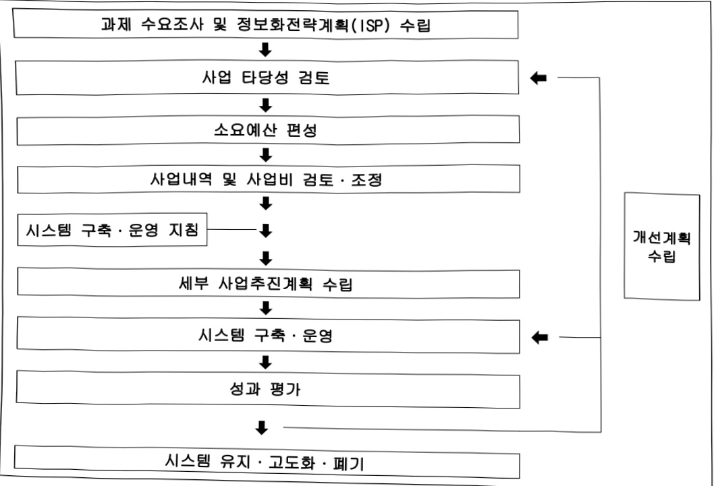

# 농업기술정보화(정보화)

**해당 페이지**: PDF 3033 ~ 3050 쪽 해당

**부처**: 농촌진흥청
**분야**: 농림수산
**회계유형**: 일반회계
**2026 확정예산**: -450.0 백만원
**전년대비 증감률**: None%
**AI 도메인**: 데이터, 로봇, 농업/식품, 산림/생태, 피지컬AI/디바이스

---

<table border=1 style='margin: auto; word-wrap: break-word;'><tr><td style='text-align: center; word-wrap: break-word;'>사 업 명</td></tr><tr><td style='text-align: center; word-wrap: break-word;'>(8) 농업기술정보화(정보화) (2333-500)</td></tr></table>

□ 사업 코드 정보

<table border=1 style='margin: auto; word-wrap: break-word;'><tr><td style='text-align: center; word-wrap: break-word;'>구분</td><td style='text-align: center; word-wrap: break-word;'>회계</td><td style='text-align: center; word-wrap: break-word;'>소관</td><td style='text-align: center; word-wrap: break-word;'>실국(기관)</td><td style='text-align: center; word-wrap: break-word;'>계정</td><td style='text-align: center; word-wrap: break-word;'>분야</td><td style='text-align: center; word-wrap: break-word;'>부문</td></tr><tr><td style='text-align: center; word-wrap: break-word;'>코드</td><td rowspan="2">일반회계</td><td rowspan="2">농촌진흥청</td><td rowspan="2">기획조정관실</td><td rowspan="2"></td><td style='text-align: center; word-wrap: break-word;'>100</td><td style='text-align: center; word-wrap: break-word;'>101</td></tr><tr><td style='text-align: center; word-wrap: break-word;'>명칭</td><td style='text-align: center; word-wrap: break-word;'>농림수산</td><td style='text-align: center; word-wrap: break-word;'>농업·농촌</td></tr></table>

<table border=1 style='margin: auto; word-wrap: break-word;'><tr><td style='text-align: center; word-wrap: break-word;'>구분</td><td style='text-align: center; word-wrap: break-word;'>프로그램</td><td style='text-align: center; word-wrap: break-word;'>단위사업</td><td style='text-align: center; word-wrap: break-word;'>세부사업</td></tr><tr><td style='text-align: center; word-wrap: break-word;'>코드</td><td style='text-align: center; word-wrap: break-word;'>2300</td><td style='text-align: center; word-wrap: break-word;'>2333</td><td style='text-align: center; word-wrap: break-word;'>500</td></tr><tr><td style='text-align: center; word-wrap: break-word;'>명칭</td><td style='text-align: center; word-wrap: break-word;'>농가경영능력 향상</td><td style='text-align: center; word-wrap: break-word;'>농촌진흥사업정보화</td><td style='text-align: center; word-wrap: break-word;'>농업기술정보화(정보화)</td></tr></table>

☐ 사업 성격

<table border=1 style='margin: auto; word-wrap: break-word;'><tr><td rowspan="2">신규</td><td rowspan="2">계속</td><td rowspan="2">완료</td><td rowspan="2">예비타당성 실시여부</td><td rowspan="2">총사업비 관리대상</td><td rowspan="2">총액계상 예산사업</td><td style='text-align: center; word-wrap: break-word;'>사업소관 변경정보</td></tr><tr><td style='text-align: center; word-wrap: break-word;'>2025예산 시 소관</td></tr><tr><td style='text-align: center; word-wrap: break-word;'></td><td style='text-align: center; word-wrap: break-word;'>○</td><td style='text-align: center; word-wrap: break-word;'></td><td style='text-align: center; word-wrap: break-word;'></td><td style='text-align: center; word-wrap: break-word;'></td><td style='text-align: center; word-wrap: break-word;'></td><td style='text-align: center; word-wrap: break-word;'></td></tr></table>

□ 사업 지원 형태 및 지원

<table border=1 style='margin: auto; word-wrap: break-word;'><tr><td style='text-align: center; word-wrap: break-word;'>직접</td><td style='text-align: center; word-wrap: break-word;'>출자</td><td style='text-align: center; word-wrap: break-word;'>출연</td><td style='text-align: center; word-wrap: break-word;'>보조</td><td style='text-align: center; word-wrap: break-word;'>융자</td><td style='text-align: center; word-wrap: break-word;'>국고보조율(%)</td><td style='text-align: center; word-wrap: break-word;'>융자율(%)</td></tr><tr><td style='text-align: center; word-wrap: break-word;'>○</td><td style='text-align: center; word-wrap: break-word;'></td><td style='text-align: center; word-wrap: break-word;'></td><td style='text-align: center; word-wrap: break-word;'></td><td style='text-align: center; word-wrap: break-word;'></td><td style='text-align: center; word-wrap: break-word;'></td><td style='text-align: center; word-wrap: break-word;'></td></tr></table>

□ 사업 소관부처 및 시행주체

<table border=1 style='margin: auto; word-wrap: break-word;'><tr><td style='text-align: center; word-wrap: break-word;'>사업명</td><td colspan="2">구분</td></tr><tr><td rowspan="3">농업기술정보화(정보화)</td><td rowspan="2">소관부처</td><td style='text-align: center; word-wrap: break-word;'>기획조정관실</td></tr><tr><td style='text-align: center; word-wrap: break-word;'>데이터정보화담당관</td></tr><tr><td style='text-align: center; word-wrap: break-word;'>사업시행주체</td><td style='text-align: center; word-wrap: break-word;'>직접수행</td></tr></table>

---

### 가. 예산 총괄표

(단위: 백만원, %)

<table border=1 style='margin: auto; word-wrap: break-word;'><tr><td rowspan="2">사업명</td><td rowspan="2">2024년 결산</td><td rowspan="2">2025년 예산 본예산(A)</td><td colspan="2">2026년</td><td rowspan="2">중감 (B-A)</td><td rowspan="2">(B-A)/A</td></tr><tr><td style='text-align: center; word-wrap: break-word;'>요구</td><td style='text-align: center; word-wrap: break-word;'>조정(B)</td></tr><tr><td style='text-align: center; word-wrap: break-word;'>농업기술정보화 (정보화)</td><td style='text-align: center; word-wrap: break-word;'>7,974</td><td style='text-align: center; word-wrap: break-word;'>7,273</td><td style='text-align: center; word-wrap: break-word;'>7,050</td><td style='text-align: center; word-wrap: break-word;'>6,823</td><td style='text-align: center; word-wrap: break-word;'>△450</td><td style='text-align: center; word-wrap: break-word;'>△6.2</td></tr></table>

□ 기능별(내역사업별) 예산 내역

(단위:백만원)

<table border=1 style='margin: auto; word-wrap: break-word;'><tr><td rowspan="3"></td><td colspan="5">2024</td><td colspan="7">2025</td><td style='text-align: center; word-wrap: break-word;'>2026예산</td></tr><tr><td rowspan="2">예산액(추경)</td><td rowspan="2">예산현액</td><td rowspan="2">집행액[실집행액]</td><td rowspan="2">이월액</td><td rowspan="2">불용액</td><td rowspan="2">본예산</td><td rowspan="2">예산현액</td><td rowspan="2">집행액[실집행액]</td><td colspan="2">전년도 이월액제외</td><td rowspan="2">이월</td><td rowspan="2">불용</td><td rowspan="2">2026예산</td></tr><tr><td style='text-align: center; word-wrap: break-word;'>예산현액</td><td style='text-align: center; word-wrap: break-word;'>집행액[실집행액]</td></tr><tr><td style='text-align: center; word-wrap: break-word;'>○ 기능별 분류(합계)</td><td style='text-align: center; word-wrap: break-word;'>806</td><td style='text-align: center; word-wrap: break-word;'>806</td><td style='text-align: center; word-wrap: break-word;'>794</td><td style='text-align: center; word-wrap: break-word;'>-</td><td style='text-align: center; word-wrap: break-word;'>32</td><td style='text-align: center; word-wrap: break-word;'>723</td><td style='text-align: center; word-wrap: break-word;'>723</td><td style='text-align: center; word-wrap: break-word;'>7212</td><td style='text-align: center; word-wrap: break-word;'>723</td><td style='text-align: center; word-wrap: break-word;'>7212</td><td style='text-align: center; word-wrap: break-word;'>-</td><td style='text-align: center; word-wrap: break-word;'>61</td><td style='text-align: center; word-wrap: break-word;'>6823</td></tr><tr><td style='text-align: center; word-wrap: break-word;'>· 맞춤형 농업기술 콘텐츠 확충</td><td style='text-align: center; word-wrap: break-word;'>372</td><td style='text-align: center; word-wrap: break-word;'>372</td><td style='text-align: center; word-wrap: break-word;'>372</td><td style='text-align: center; word-wrap: break-word;'>-</td><td style='text-align: center; word-wrap: break-word;'>-</td><td style='text-align: center; word-wrap: break-word;'>372</td><td style='text-align: center; word-wrap: break-word;'>372</td><td style='text-align: center; word-wrap: break-word;'>364</td><td style='text-align: center; word-wrap: break-word;'>372</td><td style='text-align: center; word-wrap: break-word;'>364</td><td style='text-align: center; word-wrap: break-word;'>-</td><td style='text-align: center; word-wrap: break-word;'>8</td><td style='text-align: center; word-wrap: break-word;'>220</td></tr><tr><td style='text-align: center; word-wrap: break-word;'>· 농업과학기술정보 플랫폼 운영</td><td style='text-align: center; word-wrap: break-word;'>-</td><td style='text-align: center; word-wrap: break-word;'>-</td><td style='text-align: center; word-wrap: break-word;'>-</td><td style='text-align: center; word-wrap: break-word;'>-</td><td style='text-align: center; word-wrap: break-word;'>-</td><td style='text-align: center; word-wrap: break-word;'>568</td><td style='text-align: center; word-wrap: break-word;'>568</td><td style='text-align: center; word-wrap: break-word;'>567</td><td style='text-align: center; word-wrap: break-word;'>568</td><td style='text-align: center; word-wrap: break-word;'>567</td><td style='text-align: center; word-wrap: break-word;'>-</td><td style='text-align: center; word-wrap: break-word;'>1</td><td style='text-align: center; word-wrap: break-word;'>620</td></tr><tr><td style='text-align: center; word-wrap: break-word;'>· 차유농업정보망 운영</td><td style='text-align: center; word-wrap: break-word;'>211</td><td style='text-align: center; word-wrap: break-word;'>211</td><td style='text-align: center; word-wrap: break-word;'>211</td><td style='text-align: center; word-wrap: break-word;'>-</td><td style='text-align: center; word-wrap: break-word;'>-</td><td style='text-align: center; word-wrap: break-word;'>240</td><td style='text-align: center; word-wrap: break-word;'>240</td><td style='text-align: center; word-wrap: break-word;'>239</td><td style='text-align: center; word-wrap: break-word;'>240</td><td style='text-align: center; word-wrap: break-word;'>239</td><td style='text-align: center; word-wrap: break-word;'>-</td><td style='text-align: center; word-wrap: break-word;'>1</td><td style='text-align: center; word-wrap: break-word;'>283</td></tr><tr><td style='text-align: center; word-wrap: break-word;'>· 차세대 농촌전흥시업 종합편리시스템 운영</td><td style='text-align: center; word-wrap: break-word;'>316</td><td style='text-align: center; word-wrap: break-word;'>315</td><td style='text-align: center; word-wrap: break-word;'>315</td><td style='text-align: center; word-wrap: break-word;'>-</td><td style='text-align: center; word-wrap: break-word;'>-</td><td style='text-align: center; word-wrap: break-word;'>300</td><td style='text-align: center; word-wrap: break-word;'>300</td><td style='text-align: center; word-wrap: break-word;'>299</td><td style='text-align: center; word-wrap: break-word;'>300</td><td style='text-align: center; word-wrap: break-word;'>299</td><td style='text-align: center; word-wrap: break-word;'>-</td><td style='text-align: center; word-wrap: break-word;'>1</td><td style='text-align: center; word-wrap: break-word;'>375</td></tr><tr><td style='text-align: center; word-wrap: break-word;'>· 농업기술정보서비스 운영</td><td style='text-align: center; word-wrap: break-word;'>936</td><td style='text-align: center; word-wrap: break-word;'>929</td><td style='text-align: center; word-wrap: break-word;'>929</td><td style='text-align: center; word-wrap: break-word;'>-</td><td style='text-align: center; word-wrap: break-word;'>-</td><td style='text-align: center; word-wrap: break-word;'>936</td><td style='text-align: center; word-wrap: break-word;'>936</td><td style='text-align: center; word-wrap: break-word;'>933</td><td style='text-align: center; word-wrap: break-word;'>936</td><td style='text-align: center; word-wrap: break-word;'>933</td><td style='text-align: center; word-wrap: break-word;'>-</td><td style='text-align: center; word-wrap: break-word;'>3</td><td style='text-align: center; word-wrap: break-word;'>104</td></tr><tr><td style='text-align: center; word-wrap: break-word;'>· 연구행정정보시스템 통합운영</td><td style='text-align: center; word-wrap: break-word;'>500</td><td style='text-align: center; word-wrap: break-word;'>496</td><td style='text-align: center; word-wrap: break-word;'>496</td><td style='text-align: center; word-wrap: break-word;'>-</td><td style='text-align: center; word-wrap: break-word;'>-</td><td style='text-align: center; word-wrap: break-word;'>534</td><td style='text-align: center; word-wrap: break-word;'>534</td><td style='text-align: center; word-wrap: break-word;'>532</td><td style='text-align: center; word-wrap: break-word;'>534</td><td style='text-align: center; word-wrap: break-word;'>532</td><td style='text-align: center; word-wrap: break-word;'>-</td><td style='text-align: center; word-wrap: break-word;'>2</td><td style='text-align: center; word-wrap: break-word;'>534</td></tr><tr><td style='text-align: center; word-wrap: break-word;'>· 농업과학기술전자 도서관 운영</td><td style='text-align: center; word-wrap: break-word;'>331</td><td style='text-align: center; word-wrap: break-word;'>330</td><td style='text-align: center; word-wrap: break-word;'>330</td><td style='text-align: center; word-wrap: break-word;'>-</td><td style='text-align: center; word-wrap: break-word;'>-</td><td style='text-align: center; word-wrap: break-word;'>331</td><td style='text-align: center; word-wrap: break-word;'>331</td><td style='text-align: center; word-wrap: break-word;'>331</td><td style='text-align: center; word-wrap: break-word;'>331</td><td style='text-align: center; word-wrap: break-word;'>331</td><td style='text-align: center; word-wrap: break-word;'>-</td><td style='text-align: center; word-wrap: break-word;'>-</td><td style='text-align: center; word-wrap: break-word;'>331</td></tr><tr><td style='text-align: center; word-wrap: break-word;'>· 사물안타넷 작물정밀 관리기술 정보 서비스</td><td style='text-align: center; word-wrap: break-word;'>805</td><td style='text-align: center; word-wrap: break-word;'>798</td><td style='text-align: center; word-wrap: break-word;'>798</td><td style='text-align: center; word-wrap: break-word;'>-</td><td style='text-align: center; word-wrap: break-word;'>-</td><td style='text-align: center; word-wrap: break-word;'>855</td><td style='text-align: center; word-wrap: break-word;'>855</td><td style='text-align: center; word-wrap: break-word;'>851</td><td style='text-align: center; word-wrap: break-word;'>855</td><td style='text-align: center; word-wrap: break-word;'>851</td><td style='text-align: center; word-wrap: break-word;'>-</td><td style='text-align: center; word-wrap: break-word;'>4</td><td style='text-align: center; word-wrap: break-word;'>705</td></tr><tr><td style='text-align: center; word-wrap: break-word;'>· 농업경영종합정보 시스템 위탁운영</td><td style='text-align: center; word-wrap: break-word;'>100</td><td style='text-align: center; word-wrap: break-word;'>99</td><td style='text-align: center; word-wrap: break-word;'>99</td><td style='text-align: center; word-wrap: break-word;'>-</td><td style='text-align: center; word-wrap: break-word;'>-</td><td style='text-align: center; word-wrap: break-word;'>90</td><td style='text-align: center; word-wrap: break-word;'>90</td><td style='text-align: center; word-wrap: break-word;'>89</td><td style='text-align: center; word-wrap: break-word;'>90</td><td style='text-align: center; word-wrap: break-word;'>89</td><td style='text-align: center; word-wrap: break-word;'>-</td><td style='text-align: center; word-wrap: break-word;'>1</td><td style='text-align: center; word-wrap: break-word;'>90</td></tr><tr><td style='text-align: center; word-wrap: break-word;'>· 행정업무 자동화 서비스 운영</td><td style='text-align: center; word-wrap: break-word;'>100</td><td style='text-align: center; word-wrap: break-word;'>100</td><td style='text-align: center; word-wrap: break-word;'>100</td><td style='text-align: center; word-wrap: break-word;'>-</td><td style='text-align: center; word-wrap: break-word;'>-</td><td style='text-align: center; word-wrap: break-word;'>100</td><td style='text-align: center; word-wrap: break-word;'>100</td><td style='text-align: center; word-wrap: break-word;'>100</td><td style='text-align: center; word-wrap: break-word;'>100</td><td style='text-align: center; word-wrap: break-word;'>100</td><td style='text-align: center; word-wrap: break-word;'>-</td><td style='text-align: center; word-wrap: break-word;'>-</td><td style='text-align: center; word-wrap: break-word;'>100</td></tr><tr><td style='text-align: center; word-wrap: break-word;'>· 농악안전정보시스템 운영</td><td style='text-align: center; word-wrap: break-word;'>500</td><td style='text-align: center; word-wrap: break-word;'>455</td><td style='text-align: center; word-wrap: break-word;'>455</td><td style='text-align: center; word-wrap: break-word;'>-</td><td style='text-align: center; word-wrap: break-word;'>-</td><td style='text-align: center; word-wrap: break-word;'>500</td><td style='text-align: center; word-wrap: break-word;'>500</td><td style='text-align: center; word-wrap: break-word;'>499</td><td style='text-align: center; word-wrap: break-word;'>500</td><td style='text-align: center; word-wrap: break-word;'>499</td><td style='text-align: center; word-wrap: break-word;'>-</td><td style='text-align: center; word-wrap: break-word;'>1</td><td style='text-align: center; word-wrap: break-word;'>400</td></tr><tr><td style='text-align: center; word-wrap: break-word;'>· 국가농작물병해충 관리시스템 운영</td><td style='text-align: center; word-wrap: break-word;'>300</td><td style='text-align: center; word-wrap: break-word;'>298</td><td style='text-align: center; word-wrap: break-word;'>298</td><td style='text-align: center; word-wrap: break-word;'>-</td><td style='text-align: center; word-wrap: break-word;'>-</td><td style='text-align: center; word-wrap: break-word;'>300</td><td style='text-align: center; word-wrap: break-word;'>300</td><td style='text-align: center; word-wrap: break-word;'>299</td><td style='text-align: center; word-wrap: break-word;'>300</td><td style='text-align: center; word-wrap: break-word;'>299</td><td style='text-align: center; word-wrap: break-word;'>-</td><td style='text-align: center; word-wrap: break-word;'>1</td><td style='text-align: center; word-wrap: break-word;'>300</td></tr><tr><td style='text-align: center; word-wrap: break-word;'>· 농업공간정보서비스 운영</td><td style='text-align: center; word-wrap: break-word;'>100</td><td style='text-align: center; word-wrap: break-word;'>100</td><td style='text-align: center; word-wrap: break-word;'>100</td><td style='text-align: center; word-wrap: break-word;'>-</td><td style='text-align: center; word-wrap: break-word;'>-</td><td style='text-align: center; word-wrap: break-word;'>100</td><td style='text-align: center; word-wrap: break-word;'>100</td><td style='text-align: center; word-wrap: break-word;'>99</td><td style='text-align: center; word-wrap: break-word;'>100</td><td style='text-align: center; word-wrap: break-word;'>99</td><td style='text-align: center; word-wrap: break-word;'>-</td><td style='text-align: center; word-wrap: break-word;'>1</td><td style='text-align: center; word-wrap: break-word;'>100</td></tr><tr><td style='text-align: center; word-wrap: break-word;'>· 농업대녀플랫폼운영</td><td style='text-align: center; word-wrap: break-word;'>-</td><td style='text-align: center; word-wrap: break-word;'>-</td><td style='text-align: center; word-wrap: break-word;'>-</td><td style='text-align: center; word-wrap: break-word;'>-</td><td style='text-align: center; word-wrap: break-word;'>-</td><td style='text-align: center; word-wrap: break-word;'>-</td><td style='text-align: center; word-wrap: break-word;'>-</td><td style='text-align: center; word-wrap: break-word;'>-</td><td style='text-align: center; word-wrap: break-word;'>-</td><td style='text-align: center; word-wrap: break-word;'>-</td><td style='text-align: center; word-wrap: break-word;'>-</td><td style='text-align: center; word-wrap: break-word;'>-</td><td style='text-align: center; word-wrap: break-word;'>100</td></tr><tr><td style='text-align: center; word-wrap: break-word;'>· 농업체험보 종합처원 서비스구축@P 수립</td><td style='text-align: center; word-wrap: break-word;'>-</td><td style='text-align: center; word-wrap: break-word;'>-</td><td style='text-align: center; word-wrap: break-word;'>-</td><td style='text-align: center; word-wrap: break-word;'>-</td><td style='text-align: center; word-wrap: break-word;'>-</td><td style='text-align: center; word-wrap: break-word;'>-</td><td style='text-align: center; word-wrap: break-word;'>-</td><td style='text-align: center; word-wrap: break-word;'>-</td><td style='text-align: center; word-wrap: break-word;'>-</td><td style='text-align: center; word-wrap: break-word;'>-</td><td style='text-align: center; word-wrap: break-word;'>-</td><td style='text-align: center; word-wrap: break-word;'>-</td><td style='text-align: center; word-wrap: break-word;'>100</td></tr><tr><td style='text-align: center; word-wrap: break-word;'>· 다지털육종 기반 강화</td><td style='text-align: center; word-wrap: break-word;'>-</td><td style='text-align: center; word-wrap: break-word;'>-</td><td style='text-align: center; word-wrap: break-word;'>-</td><td style='text-align: center; word-wrap: break-word;'>-</td><td style='text-align: center; word-wrap: break-word;'>-</td><td style='text-align: center; word-wrap: break-word;'>-</td><td style='text-align: center; word-wrap: break-word;'>-</td><td style='text-align: center; word-wrap: break-word;'>-</td><td style='text-align: center; word-wrap: break-word;'>-</td><td style='text-align: center; word-wrap: break-word;'>-</td><td style='text-align: center; word-wrap: break-word;'>-</td><td style='text-align: center; word-wrap: break-word;'>-</td><td style='text-align: center; word-wrap: break-word;'>100</td></tr></table>

---

<table border=1 style='margin: auto; word-wrap: break-word;'><tr><td rowspan="3"></td><td colspan="5">2024</td><td colspan="7">2025</td><td style='text-align: center; word-wrap: break-word;'>2026예산</td></tr><tr><td rowspan="2">예산액(추경)</td><td rowspan="2">예산현액</td><td rowspan="2">집행액[실집행액]</td><td rowspan="2">이월액</td><td rowspan="2">불용액</td><td rowspan="2">본예산</td><td rowspan="2">예산현액</td><td rowspan="2">집행액[실집행액]</td><td colspan="2">전년도이월액제외</td><td rowspan="2">이월</td><td rowspan="2">불용</td><td rowspan="2">2026예산</td></tr><tr><td style='text-align: center; word-wrap: break-word;'>예산현액</td><td style='text-align: center; word-wrap: break-word;'>집행액[실집행액]</td></tr><tr><td style='text-align: center; word-wrap: break-word;'>및새뉴스구축ED 수립</td><td style='text-align: center; word-wrap: break-word;'>444</td><td style='text-align: center; word-wrap: break-word;'>444</td><td style='text-align: center; word-wrap: break-word;'>419</td><td style='text-align: center; word-wrap: break-word;'>-</td><td style='text-align: center; word-wrap: break-word;'>25</td><td style='text-align: center; word-wrap: break-word;'>453</td><td style='text-align: center; word-wrap: break-word;'>453</td><td style='text-align: center; word-wrap: break-word;'>434</td><td style='text-align: center; word-wrap: break-word;'>453</td><td style='text-align: center; word-wrap: break-word;'>434</td><td style='text-align: center; word-wrap: break-word;'>-</td><td style='text-align: center; word-wrap: break-word;'>19</td><td style='text-align: center; word-wrap: break-word;'>523</td></tr><tr><td style='text-align: center; word-wrap: break-word;'>·기관운영비</td><td style='text-align: center; word-wrap: break-word;'>733</td><td style='text-align: center; word-wrap: break-word;'>733</td><td style='text-align: center; word-wrap: break-word;'>733</td><td style='text-align: center; word-wrap: break-word;'>-</td><td style='text-align: center; word-wrap: break-word;'>-</td><td style='text-align: center; word-wrap: break-word;'>1594</td><td style='text-align: center; word-wrap: break-word;'>1594</td><td style='text-align: center; word-wrap: break-word;'>1576</td><td style='text-align: center; word-wrap: break-word;'>1594</td><td style='text-align: center; word-wrap: break-word;'>1576</td><td style='text-align: center; word-wrap: break-word;'>-</td><td style='text-align: center; word-wrap: break-word;'>18</td><td style='text-align: center; word-wrap: break-word;'>-</td></tr><tr><td style='text-align: center; word-wrap: break-word;'>·농업R&amp;D 데이터플랫폼 구축</td><td style='text-align: center; word-wrap: break-word;'>934</td><td style='text-align: center; word-wrap: break-word;'>934</td><td style='text-align: center; word-wrap: break-word;'>934</td><td style='text-align: center; word-wrap: break-word;'>-</td><td style='text-align: center; word-wrap: break-word;'>-</td><td style='text-align: center; word-wrap: break-word;'>-</td><td style='text-align: center; word-wrap: break-word;'>-</td><td style='text-align: center; word-wrap: break-word;'>-</td><td style='text-align: center; word-wrap: break-word;'>-</td><td style='text-align: center; word-wrap: break-word;'>-</td><td style='text-align: center; word-wrap: break-word;'>-</td><td style='text-align: center; word-wrap: break-word;'>-</td><td style='text-align: center; word-wrap: break-word;'>-</td></tr><tr><td style='text-align: center; word-wrap: break-word;'>·농촌지도사업 종합관리시스템 구축</td><td style='text-align: center; word-wrap: break-word;'>900</td><td style='text-align: center; word-wrap: break-word;'>900</td><td style='text-align: center; word-wrap: break-word;'>900</td><td style='text-align: center; word-wrap: break-word;'>-</td><td style='text-align: center; word-wrap: break-word;'>-</td><td style='text-align: center; word-wrap: break-word;'>-</td><td style='text-align: center; word-wrap: break-word;'>-</td><td style='text-align: center; word-wrap: break-word;'>-</td><td style='text-align: center; word-wrap: break-word;'>-</td><td style='text-align: center; word-wrap: break-word;'>-</td><td style='text-align: center; word-wrap: break-word;'>-</td><td style='text-align: center; word-wrap: break-word;'>-</td><td style='text-align: center; word-wrap: break-word;'>-</td></tr><tr><td style='text-align: center; word-wrap: break-word;'>·농업과학기반기술정보서비스 운영</td><td style='text-align: center; word-wrap: break-word;'>100</td><td style='text-align: center; word-wrap: break-word;'>100</td><td style='text-align: center; word-wrap: break-word;'>100</td><td style='text-align: center; word-wrap: break-word;'>-</td><td style='text-align: center; word-wrap: break-word;'>-</td><td style='text-align: center; word-wrap: break-word;'>-</td><td style='text-align: center; word-wrap: break-word;'>-</td><td style='text-align: center; word-wrap: break-word;'>-</td><td style='text-align: center; word-wrap: break-word;'>-</td><td style='text-align: center; word-wrap: break-word;'>-</td><td style='text-align: center; word-wrap: break-word;'>-</td><td style='text-align: center; word-wrap: break-word;'>-</td><td style='text-align: center; word-wrap: break-word;'>-</td></tr><tr><td style='text-align: center; word-wrap: break-word;'>·식량작물 우량계통품종관리시스템 운영</td><td style='text-align: center; word-wrap: break-word;'>93</td><td style='text-align: center; word-wrap: break-word;'>93</td><td style='text-align: center; word-wrap: break-word;'>93</td><td style='text-align: center; word-wrap: break-word;'>-</td><td style='text-align: center; word-wrap: break-word;'>-</td><td style='text-align: center; word-wrap: break-word;'>-</td><td style='text-align: center; word-wrap: break-word;'>-</td><td style='text-align: center; word-wrap: break-word;'>-</td><td style='text-align: center; word-wrap: break-word;'>-</td><td style='text-align: center; word-wrap: break-word;'>-</td><td style='text-align: center; word-wrap: break-word;'>-</td><td style='text-align: center; word-wrap: break-word;'>-</td><td style='text-align: center; word-wrap: break-word;'>-</td></tr><tr><td style='text-align: center; word-wrap: break-word;'>·기후변화 대응 과수종합정보시스템 운영</td><td style='text-align: center; word-wrap: break-word;'>150</td><td style='text-align: center; word-wrap: break-word;'>150</td><td style='text-align: center; word-wrap: break-word;'>150</td><td style='text-align: center; word-wrap: break-word;'>-</td><td style='text-align: center; word-wrap: break-word;'>-</td><td style='text-align: center; word-wrap: break-word;'>-</td><td style='text-align: center; word-wrap: break-word;'>-</td><td style='text-align: center; word-wrap: break-word;'>-</td><td style='text-align: center; word-wrap: break-word;'>-</td><td style='text-align: center; word-wrap: break-word;'>-</td><td style='text-align: center; word-wrap: break-word;'>-</td><td style='text-align: center; word-wrap: break-word;'>-</td><td style='text-align: center; word-wrap: break-word;'>-</td></tr><tr><td style='text-align: center; word-wrap: break-word;'>·국가단위 축산농장지원시스템 운영</td><td style='text-align: center; word-wrap: break-word;'>81</td><td style='text-align: center; word-wrap: break-word;'>81</td><td style='text-align: center; word-wrap: break-word;'>81</td><td style='text-align: center; word-wrap: break-word;'>-</td><td style='text-align: center; word-wrap: break-word;'>-</td><td style='text-align: center; word-wrap: break-word;'>-</td><td style='text-align: center; word-wrap: break-word;'>-</td><td style='text-align: center; word-wrap: break-word;'>-</td><td style='text-align: center; word-wrap: break-word;'>-</td><td style='text-align: center; word-wrap: break-word;'>-</td><td style='text-align: center; word-wrap: break-word;'>-</td><td style='text-align: center; word-wrap: break-word;'>-</td><td style='text-align: center; word-wrap: break-word;'>-</td></tr><tr><td style='text-align: center; word-wrap: break-word;'>·가축인공수정사 자격시험관리시스템 운영</td><td style='text-align: center; word-wrap: break-word;'>-</td><td style='text-align: center; word-wrap: break-word;'>68</td><td style='text-align: center; word-wrap: break-word;'>61</td><td style='text-align: center; word-wrap: break-word;'>-</td><td style='text-align: center; word-wrap: break-word;'>7</td><td style='text-align: center; word-wrap: break-word;'>-</td><td style='text-align: center; word-wrap: break-word;'>-</td><td style='text-align: center; word-wrap: break-word;'>-</td><td style='text-align: center; word-wrap: break-word;'>-</td><td style='text-align: center; word-wrap: break-word;'>-</td><td style='text-align: center; word-wrap: break-word;'>-</td><td style='text-align: center; word-wrap: break-word;'>-</td><td style='text-align: center; word-wrap: break-word;'>-</td></tr></table>

### 나. 사업설명자료

## 1 ) 사업목적·내용

(농업기술정보화) 청의 연구개발 사업, 농촌지도 사업 등 핵심 업무의 체계적인 관리 및 농업기술의 효율적인 대국민 보급을 위한 정보시스템의 기획·구축·운영·유지관리

(맞춤형 농업기술 콘텐츠 확충) 우리 청 농업기술을 동영상 형태로 제공하여 농업인,

귀농·귀촌 희망자, 일반인 등이 농업 정보를 쉽게 이해하고 농업 현장에 적용할 수 있

도록 지원하기 위한 콘텐츠 구축 사업

- (농업과학기술정보플랫폼 운영) 과학영농시설, 영농상담, 교육정보 등 농업과학기술정보를 농업인에게 효율적으로 제공하고 농촌 지도사업 업무를 체계적으로 관리하기 위한 플랫폼 운영

- (치유농업정보망 운영) 치유농업 소개, 치유농업 시설 및 프로그램 안내 등 국민의 건강 회복·유지·증진을 위한 치유농업 정보를 제공하고 치유농업사 자격시험 원서접수, 문제출제, 합격자 관리 등 시험 관리를 위한 정보시스템 운영

- (차세대 농촌진흥사업 종합관리시스템 운영) 연구과제, 연구장비, 전자연구노트, 연구

성과, 과제평가 등 농촌진흥청 고유연구개발사업 전반의 관리를 위한 시스템 운영

---

- (농업기술정보서비스 운영) 정확하고 신뢰할 수 있는 농업기술 정보의 적기 제공으로 농업 정보를 찾는 농업인, 일반인 등의 시간과 노력 절감 및 신속한 의사결정을 지원하기 위한 농업 분야 전문 포털 ‘농사로’ 등 농업기술 정보제공 시스템 운영

- (연구행정정보시스템 통합운영) 물품구매, 근로자 관리, 차량·회의실 등 신청, 공무국

외출장, 채용시험 등 각종 행정업무의 효율적인 처리를 위한 업무시스템 운영

- (농업과학기술전자도서관 운영) 국내·외 농업과학기술 학술자료 및 농촌진흥청 발간

도서 등 문헌정보를 전자적으로 제공하여 농업연구 활성화를 지원하기 위한 ‘농업과학도서관 홈페이지’ 운영

- (사물인터넷 작물 정밀관리기술정보 서비스) 농업 생산성 향상 및 농업인 의사결정 지원을 위한 최적 환경설정 안내 등 데이터 기반 작물 관리 기술 정보서비스 운영

- (농업경영종합정보시스템 위탁운영) 농업경영체의 경영관리 역량 제고를 통한 농가 소득 향상 기여를 위한 농업 경영정보 제공·관리 시스템 운영

- (행정업무 자동화 서비스 운영) 급여 계산, 통계자료 수집, 데이터 입력, 파일 전송 등 단

순 반복적인 업무의 소프트웨어 프로그램('로봇') 기반 자동화 서비스 운영

- (농약안전정보시스템 운영) 농약 등록, 생산, 판매 등 농약 유통 전 과정의 체계적인 관리를 통해 올바른 농약 판매·사용 유도 및 농산물 안전을 강화하기 위한 시스템 운영

- (국가농작물병해충관리시스템 운영) 농작물 병해충 발생 예측을 통한 사전 예방 및 발생한 병해충에 대한 신속한 진단·조치로 농가 피해 최소화를 지원하기 위한 농작물 병해충 정보 제공·관리 시스템 운영

- (농업공간정보서비스 운영) 기상·병해충·토양 등 농업분야 공간정보의 통합 제공을 통한 농업인·연구자의 신속한 의사결정을 지원하기 위한 서비스 운영

- (농업 데이터 플랫폼 운영) 농업 분야 국가 연구 데이터의 체계적인 수집·저장·공유·개방을 위한 플랫폼 운영

- (농업재해경보 종합지원서비스 구축 ISP 수립) 농업재해에 선제적인 대응 및 농업인

피해 죄소화 지원을 위한 농업재해 토탈 원스톱 서비스 구축 정보화 전략 계획 수립

- (디지털육종 기반 강화 및 서비스 구축 ISP 수립) 인공지능·데이터 기반의 체계적인 디지털육종 관리 시스템 구축을 위한 정보화 전략 계획 수립

- (기관운영비) 정보화 사업의 효율적인 추진 지원을 위한 인건비, 여비 등 기본 경비

---

## 2 ) 사업개요

□ 사업근거 및 추진경위

① 법령상 근거 및 조항 적시

- 지능정보화 기본법(법률 제20410호) 제14조(공공지능정보화의 추진)

① 국가기관등은 공공서비스의 지능정보화를 도모하고 국민 편의 증진 등을 위하여 행정, 보건, 사회복지, 교육, 문화, 환경, 교통, 물류, 과학기술, 재난안전, 치안, 국방, 에너지 등 소관 업무에 대한 지능정보화(이하 "공공지능정보화"라 한다)를 추진하여야 한다.

② 국가기관등은 공공지능정보화를 효율적으로 추진하기 위하여 필요한 방안을 마련하여

야 한다.

- 전자정부법(법률 제20654호) 제16조(전자정부서비스 이용촉진을 위한 행정기관등의 책무)

① 행정기관등의 장은 국민의 복지향상 및 편익증진, 국민생활의 안전보장, 창업 및 공장설립 등 기업활동의 촉진 등을 위한 전자정부서비스를 개발하여 제공하고 이를 지속적으로 보완 · 발전시키기 위한 대책을 마련하여야 한다.

② 행정기관등의 장은 전자정부서비스 이용자가 손쉽게 전자정부서비스에 접근하여 안전하고 편리하게 활용할 수 있도록 하여야 하며, 제공되는 전자정부서비스는 최신의 것이 되도록 하여야 한다.

③행정기관등의 장은 전자정부서비스를 개발·제공할 때 전자정부서비스 이용자의 요구

사항 및 편익을 고려하여야 한다.

- 치유농업법(법률 제19491호) 제7조(치유농업 정보망 구축 및 운영)

농촌진흥청장은 치유농업에 관한 정보와 자료 등을 수요자에게 효율적으로 전달하기 위하여 치유농업 정보망을 구축·운영하여야 한다.

- 농촌진흥법(법률 제19878호) 제12조(연구개발 성과의 확산)

① 농촌진흥청장은 매년도 연구개발 성과 중 농업인 등에게 기술보급과 지원 등이 필요한 사항에 대하여는 농촌지도사업에 반영하고 관계 중앙행정기관의 장에게 정책을 건의하여야 한다.

② 지방자치단체의 장은 자체적으로 실시한 연구개발사업의 성과를 농촌지도사업에 반영할 필요가 있는 경우에는 농촌진흥청장에게 반영하여 줄 것을 요청할 수 있으며, 농촌진흥청장의 의견을 들어 관계 중앙행정기관의 장에게 기술보급과 지원에 관한 정책을 건의할 수 있다.

③ 제1항과 제2항에 따라 정책 건의를 받은 중앙행정기관의 장은 이에 대한 정책을 마련하여 개발된 기술 등이 신속히 보급되도록 조치하여야 한다.

- 농약관리법(법률 제20231호) 제23조3(농약안전정보시스템의 구축·운영 등)

---

① 농촌진흥청장은 다음 각 호의 업무를 수행하기 위하여 농약안전정보시스템을 구축·운영하여야 한다.

1. 농약 제조업 · 수입업 · 판매업 · 수출입식물방제업등의 등록 또는 신고와 관련된 정보의 수집 및 관리

2. 농약의 등록 등에 대한 정보의 수집·분석 및 관리

3. 등록된 농약의 판매 또는 구매에 대한 정보 관리

4. 농약등의 안전사용 또는 취급기준 등에 관한 정보 제공

5. 제14조 및 제14조의 2에 해당되는 농약등, 제21조 및 제22조를 위반한 농약등, 제24조 제5항 및 제6항에 해당되는 농약등에 대한 공표

6. 그 밖에 농림축산식품부령으로 정하는 업무

③ 국가는 제1항에 따른 농약안전정보시스템의 구축 · 운영 등에 필요한 비용의 전부 또는 일부를 지원할 수 있다.

- 농업과학기술정보법(법률 제19484호) 제8조(농업과학기술정보플랫폼의 구축 등)

① 농촌진흥청장은 농업과학기술정보를 안정적으로 수집·관리·제공 및 공동 활용하고, 농업인등이 농업과학기술정보서비스를 효율적으로 이용할 수 있도록 농업과학기술정보 플랫폼을 구축·운영하여야 한다.

- 국가연구개발혁신법(법률 제20354호) 제19조(연구개발정보의 처리 등)

① 과학기술정보통신부장관은 다음 각 호의 사항을 포함하는 연구개발정보의 처리(연구개발정보를 수집·생산·관리 및 활용하는 것을 말한다. 이하 같다)에 관한 기준(이하 "정보처리기준"이라 한다)을 고시하여야 한다.

1. 처리 대상 연구개발정보의 범위, 처리 시기 · 방법, 절차

2. 처리 대상 연구개발정보별 정보 처리 주체

3. 그 밖에 대통령령으로 정하는 사항

② 관계 중앙행정기관의 장, 연구개발기관, 국가연구개발활동에 참여하는 연구자, 제24조제2항에 따른 연구지원인력 및 연구지원조직은 정보처리기준에 따라 연구개발정보를 처리하여야 한다.

- 국가연구개발정보처리기준(과학기술정보통신부고시 제2020-102호) 제23조

① 중앙행정기관의 장은 필요하다고 인정하는 국가연구개발과제에 한하여 과제를 수행하고 있거나 참여하려는 자에게 데이터관리계획을 작성하여 과제협약 시 제출하게 할 수 있다.

② 중앙행정기관의 장은 국가연구개발과제를 선정할 때 데이터관리계획에 따른 연구데이터 생산·보존·관리의 충실성 및 공동활용 가능성 등을 검토하여야 한다.

③ 연구개발기관은 데이터관리계획에 따라 소관 국가연구개발과제의 연구데이터를 관리하고, 그 결과를 최종보고서에 포함하여 제출해야 한다.

④ 중앙행정기관의 장은 연구데이터의 생산·보존·관리 및 공동활용 등에 관한 시책을 수립·추진할 수 있다.

## ② 추진경위

- '98년도 정보화 공공근로사업으로 시작하여 '00년도에 본예산 반영

---

- '01~'04 : 1차 정보화발전 전략계획(ISP) 추진

(농업기술정보DB 구축 및 응용시스템 개발)

- '05~'07 : 2차 정보화발전 전략계획(ISP) 추진

(정보서비스 고도화 및 통합 · 연계서비스시스템 구축)

- '08~'11 : 3차 정보화발전 전략계획(ISP) 및 EA 수립(정보자원 활용체계 구축 및 활용)

- '12~'16 : 4차 정보화발전 전략계획(ISP) 및 국가 농업기술 정보네트워크 구축 등

- '17~'18 : 5차 정보화발전 전략계획(ISP) 수립, AI 및 IoT 등 지능정보 기반 마련

- '18~'22 : 지능정보사회 구현을 위한 6차 국가정보화 기본계획

- '23~'25 : 국정과제71 '농업의 미래 성장산업화' 세부 과제 추진

(농업R&D 데이터 플랫폼 구축)

## □ 주요내용

① 사업규모

- 총사업비 : 해당 없음

- 사업기간 : 1998 ~ 계속

- 최근 5년 간 투입된 사업비(예산액기준, 추경편성한 연도에는 추경포함)

<table border=1 style='margin: auto; word-wrap: break-word;'><tr><td style='text-align: center; word-wrap: break-word;'>$ \underline{\text{所}} $</td><td style='text-align: center; word-wrap: break-word;'>2022</td><td style='text-align: center; word-wrap: break-word;'>2023</td><td style='text-align: center; word-wrap: break-word;'>2024</td><td style='text-align: center; word-wrap: break-word;'>2025</td><td style='text-align: center; word-wrap: break-word;'>2026</td></tr><tr><td style='text-align: center; word-wrap: break-word;'>$ \underline{\text{人}} $</td><td style='text-align: center; word-wrap: break-word;'>13,001</td><td style='text-align: center; word-wrap: break-word;'>9,765</td><td style='text-align: center; word-wrap: break-word;'>8,006</td><td style='text-align: center; word-wrap: break-word;'>7,273</td><td style='text-align: center; word-wrap: break-word;'>6,823</td></tr></table>

- 기타: 해당 없음

② 사업추진체계

- 사업시행방법 : 직접수행

- 사업시행주체 : 농촌진흥청

- 사업 수혜자 : 농업인 등 대국민, 농업관련 업체, 농촌진흥청 직원, 지방농촌진흥기관 등

- 보조, 융자, 출연, 출자 등의 경우 보조 · 융자 등 지원 비율 및 법적근거 : 해당 없음

## 3 ) '26년도 예산 산출 근거

(1) 맞춤형 농업기술콘텐츠 확충 : (25) 372백만원 → (26요구) 220백만원, 152백만원 감액

- (요구) 농업기술의 효율적인 확산을 위한 동영상 등 콘텐츠 제작 사업으로, 제작이 시급한 필수 콘텐츠 중심으로 물량을 조정하여 전년 대비 152백만원 감액된 수준 요구

- (산출) 콘텐츠 구축 220백만원

○ 2025년도 예산 및 2026년도 예산 산출 세부내역 비교

<table border=1 style='margin: auto; word-wrap: break-word;'><tr><td colspan="2">25년 예산</td><td colspan="2">26년 예산</td></tr><tr><td style='text-align: center; word-wrap: break-word;'>예산</td><td style='text-align: center; word-wrap: break-word;'>산출내역</td><td style='text-align: center; word-wrap: break-word;'>예산</td><td style='text-align: center; word-wrap: break-word;'>산출내역</td></tr><tr><td style='text-align: center; word-wrap: break-word;'>372</td><td style='text-align: center; word-wrap: break-word;'>☐ 일반연구비(260-01) : 372백만원</td><td style='text-align: center; word-wrap: break-word;'>220</td><td style='text-align: center; word-wrap: break-word;'>☐ 일반연구비(260-01) : 220백만원</td></tr></table>

---

<table border=1 style='margin: auto; word-wrap: break-word;'><tr><td colspan="2">&#x27;25년 예산</td><td colspan="2">&#x27;26년 예산</td></tr><tr><td style='text-align: center; word-wrap: break-word;'>예산</td><td style='text-align: center; word-wrap: break-word;'>산출내역</td><td style='text-align: center; word-wrap: break-word;'>예산</td><td style='text-align: center; word-wrap: break-word;'>산출내역</td></tr><tr><td style='text-align: center; word-wrap: break-word;'></td><td style='text-align: center; word-wrap: break-word;'>가. 콘텐츠 구축 (372백만원)</td><td style='text-align: center; word-wrap: break-word;'></td><td style='text-align: center; word-wrap: break-word;'>가. 콘텐츠 구축 (220백만원)</td></tr><tr><td style='text-align: center; word-wrap: break-word;'></td><td style='text-align: center; word-wrap: break-word;'>· 콘텐츠 제작 1식 × 372백만원 = 372백만원</td><td style='text-align: center; word-wrap: break-word;'></td><td style='text-align: center; word-wrap: break-word;'>· 콘텐츠 제작 1식 × 220백만원 = 220백만원</td></tr></table>

(2) 농업과학기술정보플랫폼 운영 : (25) 568백만원 → (26요구) 620백만원, 52백만원 증액

- (요구) 과학영농시설, 영농상담, 교육정보 등 농업과학기술정보의 제공 및 농촌 지도사업 관리를 위한 플랫폼

운영 사업으로, 3년차 구축분 하자보수 종료에 따른 물량 증가로 52백만원 증액 요구

- (산출) 개발SW 유지보수 512백만원, 상용SW 유지보수 108백만원

- 2025년도 예산 및 2026년도 예산 산출 세부내역 비교

<table border=1 style='margin: auto; word-wrap: break-word;'><tr><td colspan="2">&#x27;25년 예산</td><td colspan="2">&#x27;26년 예산</td></tr><tr><td style='text-align: center; word-wrap: break-word;'>예산</td><td style='text-align: center; word-wrap: break-word;'>산줄내역</td><td style='text-align: center; word-wrap: break-word;'>예산</td><td style='text-align: center; word-wrap: break-word;'>산줄내역</td></tr><tr><td rowspan="5">568</td><td style='text-align: center; word-wrap: break-word;'>○ 관리용역비(210-15): 568백만원가. 개발SW 유지보수 (470백만원) · 6,603백만원 × 13.75%(요율) × 51.8%(반영률) = 470백만원</td><td style='text-align: center; word-wrap: break-word;'>620</td><td rowspan="5">○ 관리용역비(210-15): 620백만원가. 개발SW 유지보수 (512백만원) · (1~2년차) 6,603백만원 × 13.75%(요율) × 51.8%(반영률) = 470백만원</td></tr><tr><td style='text-align: center; word-wrap: break-word;'>620</td><td style='text-align: center; word-wrap: break-word;'>· (3년차) 1,137백만원 × 13.05%(요율) × 28.3%(반영률) = 42백만원</td></tr><tr><td style='text-align: center; word-wrap: break-word;'>620</td><td style='text-align: center; word-wrap: break-word;'>나. 상용SW 유지보수 (98백만원) · 722백만원(도입비) × 13.6%(요율) = 98백만원</td></tr><tr><td style='text-align: center; word-wrap: break-word;'>620</td><td style='text-align: center; word-wrap: break-word;'>나. 상용SW 유지보수 (108백만원) · (1~2년차) 722백만원 × 13.6%(요율) = 98백만원</td></tr><tr><td style='text-align: center; word-wrap: break-word;'>620</td><td style='text-align: center; word-wrap: break-word;'>나. 상용SW 유지보수 (108백만원) · (3년차) 86백만원 × 12%(요율) = 10백만원</td></tr></table>

(3) 치유농업정보망 운영 : (25) 240백만원 → (26요구) 283백만원, 43백만원 증액

- (요구) 치유농업 소개, 치유농업 시설 및 프로그램 안내, 치유농업사 자격시험 정보 등 제공관리 시스템 운영

사업으로 2년차 개발SW 하자보수 종료에 따른 물량 증가로 43백마원 증액 요구

- (산출) 개발SW 유지보수 189백만원, 상용SW 유지보수 94백만원

02025년도 예산 및 2026년도 예산 산출 세부내역 비교

<table border=1 style='margin: auto; word-wrap: break-word;'><tr><td colspan="2">&#x27;25년 메산</td><td colspan="2">&#x27;26년 예산</td></tr><tr><td style='text-align: center; word-wrap: break-word;'>예산</td><td style='text-align: center; word-wrap: break-word;'>산출내역</td><td style='text-align: center; word-wrap: break-word;'>예산</td><td style='text-align: center; word-wrap: break-word;'>산출내역</td></tr><tr><td style='text-align: center; word-wrap: break-word;'>240</td><td style='text-align: center; word-wrap: break-word;'>○ 관리용역비(210-15): 240백만원 가. 개발SW 유지보수 (146백만원) · 1,458백만원 × 14.65%(요율) × 68.5%(반영률) = 146백만원 나. 상용SW 유지보수 (94백만원) · 630백만원(도입비) × 14.9%(요율) = 94백만원</td><td style='text-align: center; word-wrap: break-word;'>283</td><td style='text-align: center; word-wrap: break-word;'>○ 관리용역비(210-15): 283백만원 가. 개발SW 유지보수 (189백만원) · (1년차) 1,458백만원 × 14.65%(요율) × 68.5%(반영률) = 146백만원 · (2년차) 689백만원 × 14.0%(요율) × 44.6%(반영률) = 43백만원 나. 상용SW 유지보수 (94백만원) · 630백만원(도입비) × 14.9%(요율) = 94백만원</td></tr></table>

(4) 차세대 농촌진흥사업 종합관리시스템 운영 : ('25) 300백만원 → ('26요구) 375백만원, 75백만원 증액

- (요구) 연구과제, 연구성과, 과제평가 등 농업 연구개발사업 관리시스템 운영 사업으로, 2년차 개발SW 하자 보수 종료에 따른 물량 증가로 75백만원 증액 요구

- (산출) 개발SW 유지보수 323백만원, 상용SW 유지보수 52백만원

2025년도 예산 및 2026년도 예산 산출 세부내역 비교

<table border=1 style='margin: auto; word-wrap: break-word;'><tr><td colspan="2">&#x27;25년 예산</td><td colspan="2">&#x27;26년 예산</td><td style='text-align: center; word-wrap: break-word;'></td></tr><tr><td style='text-align: center; word-wrap: break-word;'>예산</td><td style='text-align: center; word-wrap: break-word;'>산출내역</td><td style='text-align: center; word-wrap: break-word;'>예산</td><td style='text-align: center; word-wrap: break-word;'>산출내역</td><td style='text-align: center; word-wrap: break-word;'></td></tr><tr><td style='text-align: center; word-wrap: break-word;'>300</td><td style='text-align: center; word-wrap: break-word;'>○ 관리용역비(210-15): 300백만원 가. 개발SW 유지보수 (248백만원)  • 2,614백만원 × 15%(요율) × 63.3%(반영률) = 248백만원</td><td style='text-align: center; word-wrap: break-word;'>375</td><td style='text-align: center; word-wrap: break-word;'>○ 관리용역비(210-15): 375백만원 가. 개발SW 유지보수 (323백만원)  • (1년차) 2,614백만원 × 15%(요율) × 63.3%(반영률) = 248백만원  • (2년차) 989백만원 × 15%(요율) × 50.6%(반영률) = 75백만원 나. 상용SW 유지보수 (52백만원)  • 369백만원(도입비) × 14.1%(요율) = 52백만원</td><td style='text-align: center; word-wrap: break-word;'>• 369백만원(도입비) × 14.1%(요율) = 52백만원</td></tr></table>

(5) 농업기술성보서비스 운영 : ('25) 936백만원 → ('26요구) 1,041백만원, 105백만원 증액

- (요구) 농업분야 전문 포털 ‘농사로’ 및 청 대표 홈페이지, 최신농업기술알리미 앱 등 운영 사업으로, 과기부 공모과제로 개발('24년)한 청년농업인 지원 AI서비스 운영 예산 105백만원 증액 요구

- (산출) 개발SW 위탁운영 969백만원, 상용SW 유지보수 24백만원, 민간클라우드 사용료 48백만원

○ 2025년도 예산 및 2026년도 예산 산출 세부내역 비교

---

<table border=1 style='margin: auto; word-wrap: break-word;'><tr><td colspan="2">&#x27;25년 예산</td><td colspan="2">&#x27;26년 예산</td><td style='text-align: center; word-wrap: break-word;'></td></tr><tr><td style='text-align: center; word-wrap: break-word;'>예산</td><td style='text-align: center; word-wrap: break-word;'>산출내역</td><td style='text-align: center; word-wrap: break-word;'>예산</td><td style='text-align: center; word-wrap: break-word;'>산출내역</td><td style='text-align: center; word-wrap: break-word;'></td></tr><tr><td style='text-align: center; word-wrap: break-word;'>936</td><td style='text-align: center; word-wrap: break-word;'>○ 관리용역비(210-15): 936백만원가. 위탁운영 (912백만원) • 9명 × 8.44백만원 × 12개월 = 912백만원</td><td style='text-align: center; word-wrap: break-word;'>1,041</td><td style='text-align: center; word-wrap: break-word;'>○ 관리용역비(210-15): 1,041백만원가. 위탁운영 (969백만원) • 9명 × 8.44백만원 × 12개월 = 912백만원 • (AI서비스) 1명 × 4.75백만원 × 12개월 = 57백만원나. 상용SW 유지보수 (24백만원) • 240백만원(도입비) × 10%(요율) = 24백만원</td><td style='text-align: center; word-wrap: break-word;'>나. 상용SW 유지보수 (24백만원) • 240백만원(도입비) × 10%(요율) = 24백만원다. 민간클라우드 사용료 (48백만원) • AI서비스 운영: 4백만원 × 12개월 = 48백만원</td></tr></table>

(6)연구행정정보시스템 통합운영 :('25) 534백만원 →('26요구) 534백만원, 전년동

- (요구) 물품구매, 근로자 관리, 차량·회의실 등 신청, 공무국외출장, 채용시험 등 행정업무 관리시스템 운영 사업으로, 시스템의 안정적인 운영을 위하여 전년 수준의 예산 요구

- (산출) 개발SW 유지보수 500백만원, 상용SW 유지보수 34백만원

2025년도 예산 및 2026년도 예산 산출 세부내역 비교

<table border=1 style='margin: auto; word-wrap: break-word;'><tr><td colspan="2">&#x27;25년 예산</td><td colspan="2">&#x27;26년 예산</td></tr><tr><td style='text-align: center; word-wrap: break-word;'>예산</td><td style='text-align: center; word-wrap: break-word;'>산출내역</td><td style='text-align: center; word-wrap: break-word;'>예산</td><td style='text-align: center; word-wrap: break-word;'>산출내역</td></tr><tr><td style='text-align: center; word-wrap: break-word;'>534</td><td style='text-align: center; word-wrap: break-word;'>○ 관리용역비(210-15): 534백만원가. 개발SW 유지보수 (500백만원) · 14,441백만원 × 14.1% (요율) × 24.55% (반영률) = 500백만원 나. 상용SW 유지보수 (34백만원) · 227백만원(도입비) × 15% = 34백만원</td><td style='text-align: center; word-wrap: break-word;'>534</td><td style='text-align: center; word-wrap: break-word;'>○ 관리용역비(210-15): 534백만원가. 개발SW 유지보수 (500백만원) · 14,441백만원 × 14.1% (요율) × 24.55% (반영률) = 500백만원 나. 상용SW 유지보수 (34백만원) · 227백만원(도입비) × 15% = 34백만원</td></tr></table>

(7)농업과학기술전자도서관 운영 :('25)331백만원→('26요구)331백만원,전년동

- (요구) 국내·외 농업과학기술 학술자료 및 청 발간도서 등 문헌정보 제공을 위한 '농업과학도서관 홈페이지'

운영 사업으로, 시스템의 안정적인 운영을 위하여 전년 수준의 예산 요구

- (산출) DB구축 90백만원, 위탁운영 232백만원, 상용SW 유지보수 9백만원

02025년도 예산 및 2026년도 예산 산출 세부내역 비교

<table border=1 style='margin: auto; word-wrap: break-word;'><tr><td colspan="2">&#x27;25년 예산</td><td colspan="2">&#x27;26년 예산</td></tr><tr><td style='text-align: center; word-wrap: break-word;'>예산</td><td style='text-align: center; word-wrap: break-word;'>산출내역</td><td style='text-align: center; word-wrap: break-word;'>예산</td><td style='text-align: center; word-wrap: break-word;'>산출내역</td></tr><tr><td style='text-align: center; word-wrap: break-word;'>331</td><td style='text-align: center; word-wrap: break-word;'>○ 관리용역비(210-15) : 331만원가.. DB 구축 (90백만원)• 1식 × 90백만원 = 90백만원나. 위탁운영 (232백만원)• 2명 × 9.68백만원 × 12개월 = 232백만원다. 상용SW 유지보수 (9백만원)• 80백만원(도입비) × 11.5%(요율) = 9백만원</td><td style='text-align: center; word-wrap: break-word;'>331</td><td style='text-align: center; word-wrap: break-word;'>○ 관리용역비(210-15) : 331만원가.. DB 구축 (90백만원)• 1식 × 90백만원 = 90백만원나. 위탁운영 (232백만원)• 2명 × 9.68백만원 × 12개월 = 232백만원다. 상용SW 유지보수 (9백만원)• 80백만원(도입비) × 11.5%(요율) = 9백만원</td></tr></table>

(8) 사물인터넷 작물 정밀관리기술정보 서비스 : ('25) 805백만원 → ('26요구) 705백만원, 150백만원 감액

- (요구) 최적 농업환경(온도, 습도 등) 설정 등 데이터 기반 작물관리 기술 제공서비스 운영 사업으로, 필수 유지관리 소요 중심 위탁운영으로 전년 대비 150백만원 감액된 수준 요구

- (산출) 민간클라우드 사용료 282백만원, 정보시스템 유지운영 388백만원, 상용SW 사용료 35백만원

ㅇ 2025년도 예산 및 2026년도 예산 산출 세부내역 비교

<table border=1 style='margin: auto; word-wrap: break-word;'><tr><td rowspan="2">예산</td><td colspan="2">25년 예산</td><td colspan="2">&#x27;26년 예산</td></tr><tr><td colspan="2">산출내역</td><td style='text-align: center; word-wrap: break-word;'>예산</td><td style='text-align: center; word-wrap: break-word;'>산출내역</td></tr><tr><td rowspan="3">855</td><td colspan="2">○ 공공요금 및 제세(210-02) : 282백만원가. 민간클라우드 사용료 (282백만원)  · 23.5백만원 × 12개월 × = 282백만원</td><td rowspan="3">705</td><td style='text-align: center; word-wrap: break-word;'>○ 공공요금 및 제세(210-02) : 282백만원가. 민간클라우드 사용료 (282백만원)  · 23.5백만원 × 12개월 × = 282백만원</td></tr><tr><td colspan="2">○ 관리용역비(210-15) : 538백만원가. 위탁운영 (538백만원)  · 4명 × 9.79백만원 × 12개월 = 470백만원나. 장비 유지보수 (68백만원)  · 566백만원(도입비) × 12%(요율) = 68백만원</td><td style='text-align: center; word-wrap: break-word;'>○ 관리용역비(210-15) : 388백만원가. 위탁운영 (320백만원)  · 4명 × 6.67백만원 × 12개월 = 320백만원나. 장비 유지보수 (68백만원)  · 566백만원(도입비) × 12%(요율) = 68백만원</td></tr><tr><td colspan="2">○ 자산취득비(430-01) : 35백만원가. 상용SW 사용료 (35백만원)  · 2종 × 17.5백만원 = 35백만원</td><td style='text-align: center; word-wrap: break-word;'>○ 자산취득비(430-01) : 35백만원가. 상용SW 사용료 (35백만원)  · 2종 × 17.5백만원 = 35백만원</td></tr></table>

---

(9) 농업경영정보시스템 위탁운영 : (25) 90백만원 → (26요구) 90백만원, 전년동

- (요구) 경영 분석정보, 농식품 유통정보 등 농업 경영정보 제공 및 농산물소득조사 자료 입력·관리시스템

운영 사업으로, 시스템의 안정적인 운영을 위하여 전년 수준의 예산 요구

- (산출) 위탁운영 90백만원

02025년도 예산 및 2026년도 예산 산출 세부내역 비교

<table border=1 style='margin: auto; word-wrap: break-word;'><tr><td colspan="2">&#x27;25년 예산</td><td colspan="2">&#x27;26년 예산</td></tr><tr><td style='text-align: center; word-wrap: break-word;'>예산</td><td style='text-align: center; word-wrap: break-word;'>산출내역</td><td style='text-align: center; word-wrap: break-word;'>예산</td><td style='text-align: center; word-wrap: break-word;'>산출내역</td></tr><tr><td style='text-align: center; word-wrap: break-word;'>90</td><td style='text-align: center; word-wrap: break-word;'>○ 관리용역비(210-15) : 90백만원 가. 위탁운영 (90백만원) • 2명 × 6.4백만원 × 7개월 = 90백만원</td><td style='text-align: center; word-wrap: break-word;'>90</td><td style='text-align: center; word-wrap: break-word;'>○ 관리용역비(210-15) : 90백만원 가. 위탁운영 (90백만원) • 2명 × 6.4백만원 × 7개월 = 90백만원</td></tr></table>

(10)행정업무 자동화 서비스 운영 :('25)100백만원→('26요구)100백만원,전년동

- (요구) 급여 계산, 통계자료 수집, 데이터 입력, 파일 전송 등 단순 반복 업무의 자동화 서비스 운영 사업으로, 서비스의 안정적인 운영을 위하여 전년 수준의 예산 요구

- (산출) 위탁운영 46백만원, 상용SW 사용료 54백만원

ㅇ 2025년도 예산 및 2026년도 예산 산출 세부내역 비교

<table border=1 style='margin: auto; word-wrap: break-word;'><tr><td colspan="2">&#x27;25년 예산</td><td colspan="2">&#x27;26년 예산</td></tr><tr><td style='text-align: center; word-wrap: break-word;'>예산</td><td style='text-align: center; word-wrap: break-word;'>산출내역</td><td style='text-align: center; word-wrap: break-word;'>예산</td><td style='text-align: center; word-wrap: break-word;'>산출내역</td></tr><tr><td style='text-align: center; word-wrap: break-word;'>100</td><td style='text-align: center; word-wrap: break-word;'>○ 관리용역비(210-15) : 46백만원 가. 위탁운영 (46백만원) • 1명 × 7.6백만원 × 6개월 = 46백만원</td><td style='text-align: center; word-wrap: break-word;'>○ 관리용역비(210-15) : 46백만원 가. 위탁운영 (46백만원) • 1명 × 7.6백만원 × 6개월 = 46백만원</td><td style='text-align: center; word-wrap: break-word;'>○ 자산취득비(430-01) : 54백만원 가. 상용SW 사용료 (54백만원) • 1명 × 54백만원 = 54백만원</td></tr></table>

(11) 농약안전정보시스템 운영 :('25) 500백만원 →('26요구) 400백만원, 100백만원 감액

- (요구) 농약 등록, 생산, 판매 등 농약 유통 전 과정의 관리 및 농약 안전 관련 정보 제공시스템 운영 사업으로, 필수 유지관리 소요 중심 운영으로 전년 대비 100백만원 감액된 수준 요구

- (산출) 개발SW 유지보수 338백만원, 상용SW 유지보수 62백만원

ㅇ 2025년도 예산 및 2026년도 예산 산출 세부내역 비교

<table border=1 style='margin: auto; word-wrap: break-word;'><tr><td colspan="2">25년 예산</td><td colspan="2">26년 예산</td></tr><tr><td style='text-align: center; word-wrap: break-word;'>예산</td><td style='text-align: center; word-wrap: break-word;'>산출내역</td><td style='text-align: center; word-wrap: break-word;'>예산</td><td style='text-align: center; word-wrap: break-word;'>산출내역</td></tr><tr><td style='text-align: center; word-wrap: break-word;'>500</td><td style='text-align: center; word-wrap: break-word;'>○ 관리용역비(210-15) : 500백만원가. 개발SW 유지보수 (422백만원) · 4.818백만원 × 13.9%(요율) × 63%(반영율) = 422백만원</td><td style='text-align: center; word-wrap: break-word;'>400</td><td style='text-align: center; word-wrap: break-word;'>○ 관리용역비(210-15) : 400백만원가. 개발SW 유지보수 (338백만원) · 4.818백만원 × 13.9%(요율) × 50.5%(반영율) = 338백만원</td></tr><tr><td style='text-align: center; word-wrap: break-word;'>나. 상용SW 유지보수 (78백만원) · 520백만원(도입비) × 15%(요율) = 78백만원</td><td style='text-align: center; word-wrap: break-word;'>400</td><td style='text-align: center; word-wrap: break-word;'>나. 상용SW 유지보수 (62백만원) · 520백만원(도입비) × 12%(요율) = 62백만원</td><td style='text-align: center; word-wrap: break-word;'></td></tr></table>

(12) 국가농작물병해충관리시스템 운영 : (25) 300백만원 → (26요구) 300백만원, 전년동

- (요구) 병해충 예찰, 예측, 상담, 도감 등 농작물 병해충 정보 제공·관리 시스템 운영 사업으로, 시스템의 안정적인 운영을 위하여 전년 수준의 예산 요구

- (산출) 위탁운영 300백만원

02025년도 예산 및 2026년도 예산 산출 세부내역 비교

<table border=1 style='margin: auto; word-wrap: break-word;'><tr><td colspan="2">25년 예산</td><td colspan="2">26년 예산</td></tr><tr><td style='text-align: center; word-wrap: break-word;'>예산</td><td style='text-align: center; word-wrap: break-word;'>산출내역</td><td style='text-align: center; word-wrap: break-word;'>예산</td><td style='text-align: center; word-wrap: break-word;'>산출내역</td></tr><tr><td style='text-align: center; word-wrap: break-word;'>300</td><td style='text-align: center; word-wrap: break-word;'>○ 관리용역비(210-15) : 300백만원 가. 위탁운영 (300백만원) • 2명 × 12.5백만원 × 12개월 = 300백만원</td><td style='text-align: center; word-wrap: break-word;'>300</td><td style='text-align: center; word-wrap: break-word;'>○ 관리용역비(210-15) : 300백만원 가. 위탁운영 (300백만원) • 2명 × 12.5백만원 × 12개월 = 300백만원</td></tr></table>

(13) 농업공간정보서비스 운영 : ('25) 100백만원 → ('26요구) 100백만원, 전년동

- (요구) 토양 환경, 미래기후 시나리오, 재배적지 등 지도 기반의 농업·농촌 분야 공간정보 서비스 운영 사업

으로, 시스템의 안정적인 운영을 위하여 전년 수준의 예산 요구

---

- (산출) 위탁운영 100백만원

2025년도 예산 및 2026년도 예산 산출 세부내역 비교

<table border=1 style='margin: auto; word-wrap: break-word;'><tr><td colspan="2">&#x27;25년 예산</td><td colspan="2">&#x27;26년 예산</td></tr><tr><td style='text-align: center; word-wrap: break-word;'>예산</td><td style='text-align: center; word-wrap: break-word;'>산출내역</td><td style='text-align: center; word-wrap: break-word;'>예산</td><td style='text-align: center; word-wrap: break-word;'>산출내역</td></tr><tr><td style='text-align: center; word-wrap: break-word;'>100</td><td style='text-align: center; word-wrap: break-word;'>○ 관리용역비(210-15) : 100백만원 가. 위탁운영 (100백만원) • 1명 ∼ 83백만원 ∼ 12개월 – 100백만원</td><td style='text-align: center; word-wrap: break-word;'>100</td><td style='text-align: center; word-wrap: break-word;'>○ 관리용역비(210-15) : 100백만원 가. 위탁운영 (100백만원) • 1명 × 8.3백만원 × 12개월 = 100백만원</td></tr></table>

(14) 농업 데이터 플랫폼 운영 : (25) 0백만원 → (26요구) 1,001백만원, 순증

- (요구) 농업 분야 국가 연구데이터의 체계적인 수집·저장·공유·개방을 위한 플랫폼 운영 사업으로, 플랫폼 구축('23~'25년) 완료에 따라 안정적인 운영을 위한 예산 요구

- (산출) 민간클라우드 사용료 424백만원, 개발SW 유지보수 298백만원, 위탁운영 62백만원, 상용SW 유지보수 120백만원, 상용SW 사용료 97백만원

02025년도 예산 및 2026년도 예산 산출 세부내역 비교

<table border=1 style='margin: auto; word-wrap: break-word;'><tr><td colspan="2">&#x27;25년 예산</td><td colspan="2">&#x27;26년 예산</td></tr><tr><td style='text-align: center; word-wrap: break-word;'>예산</td><td style='text-align: center; word-wrap: break-word;'>산출내역</td><td style='text-align: center; word-wrap: break-word;'>예산</td><td style='text-align: center; word-wrap: break-word;'>산출내역</td></tr><tr><td style='text-align: center; word-wrap: break-word;'>-</td><td style='text-align: center; word-wrap: break-word;'>-</td><td style='text-align: center; word-wrap: break-word;'>1,001</td><td style='text-align: center; word-wrap: break-word;'>○ 공공요금 및 제세(210-02): 424백만원 가. 민간클라우드 사용료 (424백만원) • 35.3백만원 × 12개월 × = 424백만원○ 관리용역비(210-15): 480백만원 가. 개발SW 유지보수 (298백만원) • 2,984백만원 × 15%(요율) × 66.65%(반영률) = 298백만원 나. 위탁운영 (62백만원) • 1명 × 5.2백만원 × 12개월 = 62백만원 다. 상용SW 유지보수 (120백만원) • 805백만원(도입비) × 14.9%(요율) = 120백만원○ 자산취득비(430-01): 97백만원 가. 상용SW 사용료 (97백만원) • 6종 × 16.2백만원 = 97백만원</td></tr></table>

(15) 농업재해경보 종합지원서비스 구축 ISP 수립 : ('25) 0백만원 → ('26요구) 100백만원, 순증

- (요구) 농업재해 토탈 원스톱 서비스 구축을 위한 정보화 전략 계획 수립 예산 신규 요구

- (산출)ISP 수립 100백만원

2025년도 예산 및 2026년도 예산 산출 세부내역 비교

<table border=1 style='margin: auto; word-wrap: break-word;'><tr><td colspan="2">&#x27;25년 예산</td><td colspan="2">&#x27;26년 예산</td></tr><tr><td style='text-align: center; word-wrap: break-word;'>예산</td><td style='text-align: center; word-wrap: break-word;'>산출내역</td><td style='text-align: center; word-wrap: break-word;'>예산</td><td style='text-align: center; word-wrap: break-word;'>산출내역</td></tr><tr><td style='text-align: center; word-wrap: break-word;'>-</td><td style='text-align: center; word-wrap: break-word;'>-</td><td style='text-align: center; word-wrap: break-word;'>100</td><td style='text-align: center; word-wrap: break-word;'>○ 일반연구비(260-01) : 100백만원 가. ISP 수립 (100백만원) • 1과제 × 100백만원 = 100백만원</td></tr></table>

(16) 디지털육종 기반 강화 및 서비스 구축 ISP 수립 : (25) 0백만원 → (26요구) 100백만원, 순증

- (요구) 인공지능·데이터 기반의 디지털육종 관리 서비스 구축을 위한 정보화 전략 계획 수립 예산 신규 요구

- (산출) ISP 수립 100백만원

ㅇ 2025년도 예산 및 2026년도 예산 산출 세부내역 비교

<table border=1 style='margin: auto; word-wrap: break-word;'><tr><td colspan="2">25년 예산</td><td colspan="2">26년 예산</td></tr><tr><td style='text-align: center; word-wrap: break-word;'>예산</td><td style='text-align: center; word-wrap: break-word;'>산출내역</td><td style='text-align: center; word-wrap: break-word;'>예산</td><td style='text-align: center; word-wrap: break-word;'>산출내역</td></tr><tr><td style='text-align: center; word-wrap: break-word;'>-</td><td style='text-align: center; word-wrap: break-word;'>-</td><td style='text-align: center; word-wrap: break-word;'>100</td><td style='text-align: center; word-wrap: break-word;'>○ 일반연구비(260-01) : 100백만원 가. ISP 수립 (100백만원) • 1과제 × 100백만원 = 100백만원</td></tr></table>

(17) 기관운영비 : (25) 453백만원 → (26요구) 523백만원, 70백만원 증액

- (요구) 공무직 인건비, 국내 여비, 수용비 등 기관 운영을 위한 경비로 공무직 처우개선에 따른 상용 임금, 고용부담금 등 70백만원 증액

---

2025년도 예산 및 2026년도 예산 산출 세부내역 비교

<table border=1 style='margin: auto; word-wrap: break-word;'><tr><td colspan="2">&#x27;25년 예산</td><td colspan="2">&#x27;26년 예산</td></tr><tr><td style='text-align: center; word-wrap: break-word;'>예산</td><td style='text-align: center; word-wrap: break-word;'>산줄내역</td><td style='text-align: center; word-wrap: break-word;'>예산</td><td style='text-align: center; word-wrap: break-word;'>산줄내역</td></tr><tr><td style='text-align: center; word-wrap: break-word;'>453</td><td style='text-align: center; word-wrap: break-word;'>○ 상용임금(110-03): 215백만원가. 공무직 인건비: 7명 × 30.7백만원○ 일반수용비(210-01): 60백만원가. 전자저널 구독 및 기타수수료: 1식 × 60백만원○ 특근매식비(210-05): 6백만원가. 특근매식비: 1식 × 6백만원○ 시설장비유지비(210-09): 2백만원가. 사무기기 유지보수: 1식 × 2백만원○ 복리후생비(210-12): 4백만원가. 맞춤형복지비: 7명 × 500천원○ 국내여비(220-01): 7백만원가. 국내여비: 1식 × 7백만원○ 사업추진비(240-01): 7백만원가. 업무추진비: 1식 × 7백만원○ 고용부담금(320-09): 42백만원가. 고용부담금: 7명 × 6백만원○ 자산취득비(430-01): 110백만원가. SW 및 단순전산장비 구매: 2식 × 55백만원</td><td style='text-align: center; word-wrap: break-word;'>523</td><td style='text-align: center; word-wrap: break-word;'>○ 상용임금(110-03): 273백만원가. 공무직 인건비: 7명 × 39백만원○ 일반수용비(210-01): 60백만원가. 전자저널 구독 및 기타수수료: 1식 × 60백만원○ 특근매식비(210-05): 6백만원가. 특근매식비: 1식 × 6백만원○ 시설장비유지비(210-09): 2백만원가. 사무기기 유지보수: 1식 × 2백만원○ 복리후생비(210-12): 4백만원가. 맞춤형복지비: 7명 × 500천원○ 국내여비(220-01): 7백만원가. 국내여비: 1식 × 7백만원○ 사업추진비(240-01): 7백만원가. 업무추진비: 1식 × 7백만원○ 고용부담금(320-09): 54백만원가. 고용부담금: 7명 × 7.7백만원○ 자산취득비(430-01): 110백만원가. SW 및 단순전산장비 구매: 2식 × 55백만원</td></tr></table>

(18) 농업R&D 데이터 플랫폼 구축 : (25) 1,594백만원 → (26요구) 0백만원, 순감

- (요구) 시스템 구축 완료에 따른 유지보수 전환

- (산출) 해당 없음

○ 2025년도 예산 및 2026년도 예산 산출 세부내역 비교

<table border=1 style='margin: auto; word-wrap: break-word;'><tr><td colspan="2">&#x27;25년 예산</td><td colspan="2">&#x27;26년 예산</td></tr><tr><td style='text-align: center; word-wrap: break-word;'>예산</td><td style='text-align: center; word-wrap: break-word;'>산출내역</td><td style='text-align: center; word-wrap: break-word;'>예산</td><td style='text-align: center; word-wrap: break-word;'>산출내역</td></tr><tr><td style='text-align: center; word-wrap: break-word;'>1,594</td><td style='text-align: center; word-wrap: break-word;'>○ 공공요금및제세(210-09): 424백만원가. 민간클리우드 서버 사용료: 35대 × 730천원 × 12개월 = 307백만원나. 민간클리우드 데이터분석 서비스: 15개 × 7.8백만 = 117백만원○ 일반연구비(260-01): 1,041백만원가. 시스템 개발: 1,742.5FP × 467천원 = 814백만원나. 감리: 814백만원 × 13.1% = 107백만원다. 상용SW 관리: 804백만원 × 14.9% = 120백만원○ 자산취득비(430-01): 129백만원가. 정보시스템 기반 구축(상용SW): 3식 × 43백만원 = 129백만원</td><td style='text-align: center; word-wrap: break-word;'>-</td><td style='text-align: center; word-wrap: break-word;'>-</td></tr></table>

## 4 ) 사업효과

□ 사업영향, 산출물 성과지표 등

1 '22~'26년도 성과계획서 상 성과지표 및 최근 5년간 성과 달성도

---

<table border=1 style='margin: auto; word-wrap: break-word;'><tr><td style='text-align: center; word-wrap: break-word;'>성과지표</td><td style='text-align: center; word-wrap: break-word;'>구분</td><td style='text-align: center; word-wrap: break-word;'>&#x27;22</td><td style='text-align: center; word-wrap: break-word;'>&#x27;23</td><td style='text-align: center; word-wrap: break-word;'>&#x27;24</td><td style='text-align: center; word-wrap: break-word;'>&#x27;25</td><td style='text-align: center; word-wrap: break-word;'>&#x27;26</td><td style='text-align: center; word-wrap: break-word;'>&#x27;26목표치산출근거</td><td style='text-align: center; word-wrap: break-word;'>측정산식(또는 측정방법)</td><td style='text-align: center; word-wrap: break-word;'>자료수집방법(또는 자료출처)</td></tr><tr><td rowspan="3">농가경영개선만족도(단위:점)</td><td style='text-align: center; word-wrap: break-word;'>목표</td><td style='text-align: center; word-wrap: break-word;'>신규</td><td style='text-align: center; word-wrap: break-word;'>신규</td><td style='text-align: center; word-wrap: break-word;'>73.8</td><td style='text-align: center; word-wrap: break-word;'>74.4</td><td style='text-align: center; word-wrap: break-word;'>75.0</td><td rowspan="3">{전년도목표 + (전년도목표-전전년도실적) ÷ 2}</td><td rowspan="3">(경영정보수집력+경영실태분석력+환경변화대응력+품목별경영 데이터분석력+종합경영성과분석력+경영진단개선력)/7 * 7점 척도측정 후 환산:{(응답치평균-1)÷(척도수-1)|×100}</td><td rowspan="3">청 운영 대국민정보시스템이용고객(농가경영개선교육·전설팅수혜자)</td></tr><tr><td style='text-align: center; word-wrap: break-word;'>실적</td><td style='text-align: center; word-wrap: break-word;'>70.5</td><td style='text-align: center; word-wrap: break-word;'>72.7</td><td style='text-align: center; word-wrap: break-word;'>74.0</td><td style='text-align: center; word-wrap: break-word;'>74.5</td><td style='text-align: center; word-wrap: break-word;'>-</td></tr><tr><td style='text-align: center; word-wrap: break-word;'>달성도</td><td style='text-align: center; word-wrap: break-word;'>-</td><td style='text-align: center; word-wrap: break-word;'>-</td><td style='text-align: center; word-wrap: break-word;'>100.3</td><td style='text-align: center; word-wrap: break-word;'>100.1</td><td style='text-align: center; word-wrap: break-word;'>-</td></tr><tr><td rowspan="3">농업기술정보만족도(단위:점)</td><td style='text-align: center; word-wrap: break-word;'>목표</td><td style='text-align: center; word-wrap: break-word;'>73.3</td><td style='text-align: center; word-wrap: break-word;'>74.6</td><td style='text-align: center; word-wrap: break-word;'>종료</td><td style='text-align: center; word-wrap: break-word;'>-</td><td style='text-align: center; word-wrap: break-word;'>-</td><td rowspan="3">-</td><td rowspan="3">대국민 서비스만족도 조사측정(농사로 등 12개 서비스) * 7단계 측정:{(응답치평균-1)÷(척도수-1)| × 100}</td><td rowspan="3">정보시스템별 자체 측정후 합산</td></tr><tr><td style='text-align: center; word-wrap: break-word;'>실적</td><td style='text-align: center; word-wrap: break-word;'>73.6</td><td style='text-align: center; word-wrap: break-word;'>76.1</td><td style='text-align: center; word-wrap: break-word;'>종료</td><td style='text-align: center; word-wrap: break-word;'>-</td><td style='text-align: center; word-wrap: break-word;'>-</td></tr><tr><td style='text-align: center; word-wrap: break-word;'>달성도</td><td style='text-align: center; word-wrap: break-word;'>100.4</td><td style='text-align: center; word-wrap: break-word;'>102.0</td><td style='text-align: center; word-wrap: break-word;'>-</td><td style='text-align: center; word-wrap: break-word;'>-</td><td style='text-align: center; word-wrap: break-word;'>-</td></tr></table>

② 성과지표 이외의 연도별 사업추진 경과 및 실적

<table border=1 style='margin: auto; word-wrap: break-word;'><tr><td style='text-align: center; word-wrap: break-word;'>2022</td><td style='text-align: center; word-wrap: break-word;'>○ 농업과학기술정보시스템 구축으로 데이터 기반 과학영농정보서비스 기반 마련- 농업기술 보급·확산체계의 온라인으로 전환으로 고객서비스 품질 향상* 과학영농시설 사용 시 대기시간 평균 1시간 절약 : 710억원/5년· 산출 : 과학영농시설(&#x27;19) 1,185,468건 이용, 평균 노임 : 11,992원/시간* 농산물가공센터 이용 시 인건비, 품목개발 등 이익 발생 : 62억원/5년· 산출 : 인건비(7시간×1,600명/연×11,992원), 품목개발(2,000천원×482건) 등○ 농업·농촌 치유자원과 프로그램 소개, 치유농장과 치유농업사 등 핵심 치유 콘텐츠 제공을 통한 대국민 치유농업 활성화 기반 조성- 치유농업 콘텐츠 : (프로그램) 130건, (시설) 치유농장 및 양성기관 75개- 일자리 창출(민간 치유농장, 평균 4.5명) : (&#x27;21) 2,700 → 4,500명○ 비대면·온라인 IT 환경 변화에 부합하는 농업기술 콘텐츠 확충- 작목기술 중심의 농업기술 콘텐츠 제작을 통한 현장기술지원</td></tr></table>

---

<table border=1 style='margin: auto; word-wrap: break-word;'><tr><td style='text-align: center; word-wrap: break-word;'></td><td style='text-align: center; word-wrap: break-word;'>강화 * 농업기술동영상 콘텐츠 제작 : 40편, 현장전문가 큐레이션 : 10편 0 수요자중심 맞춤형 농업과학도서관 서비스 개선 - 일제강점기 농업관련 지도 DB 구축(290건) - OA 학술지원서비스 페이지 구축(의심학술출판, OA학술지, 리포지터리 등 - 디지털출판프라자농서남북 서비스 대상 확대(352건) 0 축산유관기관 데이터를 연계·통합하여 농가 단위 데이터 제공으로 농업인 노동력 절감 및 농장 운영 의사결정 지원 - 축산물품질평가원 등 5개 기관, 19정보 321항목 데이터를 연계하여 자동으로 농장 정보를 제공함으로써 수기 기록 관리 등의 업무 절감 * {축사로 등록 개체수(37만마리) × 연계데이터 항목(321개) × 최저시금 (9,620원)} / 축사로 가입 농장 수(7,454) = 농장 당 평균 1.5억원 절감/연 - 한국종축개량협회 협통정보, 한우개량사업소 번식정보, 축산물품 절평가원 이력제 정보 등 연계를 통한 ‘원스톱 한우개량정보 조회 서비스’ 제공으로 노동력 절감 및 축산농가 데이터 기반 의사 결정 지원 * 정보조회 추이 : (&#x27;20) 34만건 → (&#x27;21) 90만건 → (&#x27;22) 1,691만건 * 1,691만건 × 최저시금(9,620원) / 시간 당 검색(60건) = 연 27억 절감효과</td></tr><tr><td style='text-align: center; word-wrap: break-word;'>2023</td><td style='text-align: center; word-wrap: break-word;'>○「농업과학기술정보시스템(ASTIS)」기능 확대 구축 - 과학영농시설관리 확대(7종→9종), 농업인학습단체, 전문지도연구회 관리 - 농촌지도사업 예산편성, 계획, 결과보고 등 효율적 관리 및 성과체계 마련 - 과학영농시설 활용실적(43만건), 농산물가공센터 활용실적(32백건) ○ 수요자 맞춤 농업기술 정보서비스 강화로 고객편의 증대 - 행안부 「국민비서」포털을 통한 농업기술안내 챗봇서비스 제공 - 문자서비스 ‘정부 알림톡’ 전환으로 예산절감 및 만족도 제고 * 기상, 병해충, 긴급 재해대응 등 26개 서비스 - 농업인 등 수요자 맞춤 서비스를 위한 대국민 오류찾기 이벤트(1월) * 149건 의견수렴·개선으로 행정관리역량 자체평가 98.1점 달성(전년 대비 5.6점 상승) - 농사로 콘텐츠 갱신을 통해 농업기술정보 최신성 유지 * 현장지원기술사례(54건), 농약안전사용지점(84건), 병해충발생정보(15건/월) 등 ○ 이용자 및 공급자간 소통 촉진으로 질 높은 치유농업 서비스 제공 - 치유농업 비즈니스모델 체계 구축 및 프로그램 보급(19종) - 치유농업 전문인력 확보를 위한 운영자 교육(1,000명) - 치유농업사 자격시험 개선(문제개발, 원서접수 등)으로 관리 일원화</td></tr></table>

---

<table border=1 style='margin: auto; word-wrap: break-word;'><tr><td style='text-align: center; word-wrap: break-word;'></td><td style='text-align: center; word-wrap: break-word;'>○ 수요자가 접근하기 쉽고 활용하기 좋은 콘텐츠 확대 - 농사로TV(유튜브), SNS 등 공유 · 확산이 용이한 농업기술 콘텐츠 확충 * 농업기술동영상 34편, ‘숫품’ 영상 20편, 큐레이션(이달의농업기술) 100편 등 - 유관기관 자료 공동 활용으로 콘텐츠 강화 및 농업정보 융합 지원 * (중앙도서관) 고신문 기사검색 / (국립생태원 등) 소장자료 265종 수집·활용 - 교보문고전자책플랫폼을 활용한 청 발간자료(124종)의 대국민 활용성 강화 ○ 민간 채널과의 협력을 통한 선제적 맞춤형 정보 제공 - 농사로 주간 농사정보 등 - (쥐대동 ‘스마트파밍 플랫폼’ 연계 - 토양정보서비스(홈토람) - (쥐지인 ‘램내비게이션’ 서비스 연계 ○ 병해충 고해상도 도감 갱신 등 이용 활성화를 위한 콘텐츠 현행화 * 도감 갱신(1,515건), 방제기술 현행화, 화면개선</td></tr><tr><td style='text-align: center; word-wrap: break-word;'>2024</td><td style='text-align: center; word-wrap: break-word;'>○ 농업과학기술정보서비스(ASTIS) 구축 완료를 통한 데이터 기반 실시간 고객 맞춤형 농업기술 서비스 실현 - 과학영농시설, 농산물종합가공센터, 온라인영농상담, 교육 · 행사 정보 등 ○ 농업R&amp;D 데이터 플랫폼 구축을 통한 농업연구 · 현장데이터의 체계적인 수집 · 활용 체계 마련으로 데이터 기반의 농산업 혁신 생태계 구현 - 환경, 생육, 경영, 작물, 유전자원 등 연구과제(공동·고유) 151건을 데이터플랫폼에 등록하여 데이터 관리 표준화 및 공유·확산 기반 구축 - 지방농촌진흥기관으로 플랫폼을 확산하여 공동 활용 체계 조성 ○ 농촌 치유자원을 활용한 고품질 콘텐츠 생산을 통해 치유농업관련 분야 부가가치 창출, 치유농장 및 치유농업사 자격인 발굴을 통한 치유농업 산업 발전 - 농업인의 지속가능한 치유농업 비즈니스 모델 체계 구축 : 프로그램 22종 보급 - 치유농업 전문인력 서비스 확산으로 국민 삶의 질 향상 견인 : 치유농업 운영자 교육 6,200명, 일자리 창출 1,700명 ○ 다양한 콘텐츠를 짧게 소비하고 공유하는 디지털 소비문화 트렌드를 반영하여 핵심 연구성과 등 농업기술정보 제공체계 개선 - 농업기술포털 「농사로」를 통한 숫품, 카드뉴스, 시기별 맞춤 동영상 등 콘텐츠 제공으로 MZ 세대 청년농업인 등 유입 확대 * 농업기술동영상 40편(농업기술길잡이, 신기술 등), 숫품 콘텐츠 45편 등</td></tr></table>

---

<table border=1 style='margin: auto; word-wrap: break-word;'><tr><td style='text-align: center; word-wrap: break-word;'></td><td style='text-align: center; word-wrap: break-word;'>○ 농업 분야에 종사자에게 실시간으로 맞춤형 작목기술 정보와 참고자료를 제공하여 농업 생산성과 효율성 향상 기여- 초거대 AI 등 최근 급속히 진전된 AI기술을 농업기술상담에 적용하여 식량, 원예, 축산 등 분야별 농업 정보 제공○ 농업분야 민간기업과 협력하여 청의 영농기술정보를 제공하고 인공지능 기술을 적용하여 농업연구개발 성과의 대국민 확산 도모- 병해층, 주간농사정보, 이달의 농업기술, 농업기술길잡이 등 제공* (쥐대동 “AI 대동이”, NH농협 “오늘농사” (50만건 이상 다운로드)○ “누구나 쉽고 편리한 디지털플랫폼 정부 구현“을 위한 사용자 관점 UI/UX 적용 및 신뢰받는 정부 웹서비스 제공- 디지털 공공서비스 UI/UX 적용으로 디지털플랫폼정부 구현- 검색엔진 개선을 통한 검색 만족도 제고, 이용자 편의성 개선</td></tr><tr><td style='text-align: center; word-wrap: break-word;'>2025</td><td style='text-align: center; word-wrap: break-word;'>○ 데이터 플랫폼 민간 활용체계 구축 및 도원·센터 보급- 내부 활용 ‘데이터플랫폼’의 민간 개방(12월) 및 수집 데이터 제공* 개방 대상 데이터 선정을 위한 내부심사와 승인 절차 구축(온라인)- 지방기관에 데이터플랫폼 보급을 통해 공동활용 및 협업 환경 조성* (24) 청 내부 활용 → (25) 지방기관 공동활용(9개 선정, ‘25.5월’ → (26) 목표) 전국확대○ 데이터 수집 확대 및 AI 기반 분석 등 활용성 강화- 연구개발, 기술보급 현장 및 유관기관의 데이터 수집 확대* 연구과제 : (24) 144과제(고유 139, 공동 5) → (25) 300과제 이상(누적)* 기술보급 : 기술보급·신기술시범 114개소 / 표준화 : 기간·대상·입력 방식 등○ 농업 분야 모델 개발·보급 및 데이터 분석 지원 강화- 기 구축 품목별 생산성 향상 모델 개선 및 신규 품목 서비스 추진* (개선) 토마토·딸기·파프리카 3종 고도화, (신규) 참외·오이 모델 2종 구축 / 서비스: 11월~○ 「청년농업인을 위한 농촌특화 AI서비스」 개시(25.2.)- 작목기술 등 농업기술서와 농사로 데이터를 학습하여 성능 향상* (주요기능) AI챗봇 ‘농업백과’, 영농설계 등, (서비스) 농사로, 최신농업기술알리미 앱* (고도화) 작물재배매뉴얼 등 발간물 575권, 농사로 DB(5만8천여 건) 추가 학습○ ‘최신농업기술알리미’의 디자인·기능을 개선하여 AI 서비스 전면 배치* (기존) 최신소식 알림 기능 → (개선) 농업백과, 영농설계 등 AI 중심 서비스 제공○ 2025년 웹사이트 품질관리 수준 평가 대응(9~11월)- 5개 분야(접근성, 호환성, 개방성, 접속성, 편의성) 자체 진단 및 보완○ 웹접근성인증(WA) 획득을 통한 이용자 정보 접근성 강화- 치유농업ON(6월), 농업과학기술정보서비스(ASTIS)(7월)</td></tr></table>

③향후('26년도 이후) 기대효과

○ 농업재해경보 종합지원서비스 구축을 통한 농업인 피해 최소화 지원

- 작목, 지역 등을 기반으로 한 농가 맞춤형 재해 예측 정보 및 대응 방법

알림서비스(문자, 알림톡 등) 제공으로 피해 사전 예방

---

* 2024년 농작물재해보험 지급 규모 : 24만 5천 농가 1조 271억원

→ 농업재해로 인한 피해 10% 감소 시 연간 약 1,000억원 절감 기대

○ 인공지능·데이터 기반 디지털육종으로 품종 개발 효율 향상

- 품종 개발기간을 획기적으로 단축하고 기후변화, 탄소중립, 소비트렌드

변화 등 다양한 수요에 신속히 대응할 수 있는 맞춤형 품종 개발 체계 구축

* 품종 개발기간 : 기존 10년 → 3~5년으로 단축, 상품화 성공률 : 5% → 50%로 향상

5) 타당성조사 및 예비타당성조사 시행여부 및 결과 요지 : 해당 없음

6) 총사업비 대상사업 여부 및 내역 : 해당 없음

7) 사업 집행절차

## 8 ) 각종 평가

2025년 재정사업 자율평가 : 우수

---

### 다. 최근 4년간 결산내역

## 1 ) 결산표

☐ 부처 결산내역

(단위:백만원,%)

<table border=1 style='margin: auto; word-wrap: break-word;'><tr><td rowspan="2">연도</td><td colspan="3">예산액</td><td rowspan="2">전년도 이월액</td><td rowspan="2">이·전용 등</td><td rowspan="2">예비비</td><td rowspan="2">예산 현액(B)</td><td rowspan="2">집행액 (C)</td><td rowspan="2">집행률 (C/A)</td><td rowspan="2">집행률 (C/B)</td><td rowspan="2">다음연도 이월액</td><td rowspan="2">불용액</td></tr><tr><td colspan="2">본예산 중감액</td><td style='text-align: center; word-wrap: break-word;'>추경(A)</td></tr><tr><td style='text-align: center; word-wrap: break-word;'>2022</td><td style='text-align: center; word-wrap: break-word;'>13,001</td><td style='text-align: center; word-wrap: break-word;'>-</td><td style='text-align: center; word-wrap: break-word;'>13,001</td><td style='text-align: center; word-wrap: break-word;'>-</td><td style='text-align: center; word-wrap: break-word;'>-</td><td style='text-align: center; word-wrap: break-word;'>-</td><td style='text-align: center; word-wrap: break-word;'>13,001</td><td style='text-align: center; word-wrap: break-word;'>12,164</td><td style='text-align: center; word-wrap: break-word;'>93.6</td><td style='text-align: center; word-wrap: break-word;'>93.6</td><td style='text-align: center; word-wrap: break-word;'>410</td><td style='text-align: center; word-wrap: break-word;'>427</td></tr><tr><td style='text-align: center; word-wrap: break-word;'>2023</td><td style='text-align: center; word-wrap: break-word;'>9,765</td><td style='text-align: center; word-wrap: break-word;'>-</td><td style='text-align: center; word-wrap: break-word;'>9,765</td><td style='text-align: center; word-wrap: break-word;'>410</td><td style='text-align: center; word-wrap: break-word;'>82 △82</td><td style='text-align: center; word-wrap: break-word;'>-</td><td style='text-align: center; word-wrap: break-word;'>10,175</td><td style='text-align: center; word-wrap: break-word;'>10,129</td><td style='text-align: center; word-wrap: break-word;'>103.7</td><td style='text-align: center; word-wrap: break-word;'>99.5</td><td style='text-align: center; word-wrap: break-word;'>-</td><td style='text-align: center; word-wrap: break-word;'>46</td></tr><tr><td style='text-align: center; word-wrap: break-word;'>2024</td><td style='text-align: center; word-wrap: break-word;'>8,006</td><td style='text-align: center; word-wrap: break-word;'>-</td><td style='text-align: center; word-wrap: break-word;'>8,006</td><td style='text-align: center; word-wrap: break-word;'>-</td><td style='text-align: center; word-wrap: break-word;'>68 △68</td><td style='text-align: center; word-wrap: break-word;'>-</td><td style='text-align: center; word-wrap: break-word;'>8,006</td><td style='text-align: center; word-wrap: break-word;'>7,974</td><td style='text-align: center; word-wrap: break-word;'>99.6</td><td style='text-align: center; word-wrap: break-word;'>99.6</td><td style='text-align: center; word-wrap: break-word;'>-</td><td style='text-align: center; word-wrap: break-word;'>32</td></tr><tr><td style='text-align: center; word-wrap: break-word;'>2025</td><td style='text-align: center; word-wrap: break-word;'>7,273</td><td style='text-align: center; word-wrap: break-word;'>-</td><td style='text-align: center; word-wrap: break-word;'>7,273</td><td style='text-align: center; word-wrap: break-word;'>-</td><td style='text-align: center; word-wrap: break-word;'>-</td><td style='text-align: center; word-wrap: break-word;'>-</td><td style='text-align: center; word-wrap: break-word;'>7,273</td><td style='text-align: center; word-wrap: break-word;'>7,212</td><td style='text-align: center; word-wrap: break-word;'>99.2</td><td style='text-align: center; word-wrap: break-word;'>99.2</td><td style='text-align: center; word-wrap: break-word;'>-</td><td style='text-align: center; word-wrap: break-word;'>61</td></tr></table>

## 2 ) 주요 결산사항

□ 2022년~2025년 결산사항

<table border=1 style='margin: auto; word-wrap: break-word;'><tr><td style='text-align: center; word-wrap: break-word;'>2022</td><td style='text-align: center; word-wrap: break-word;'>- 이월(410백만원) : 농약안전정보시스템 구축 사업의 조달입찰 과정 중 유찰에 따른 계약지연 - 불용(427백만원) : 정보화사업 낙찰차액(388), 인건비 등 집행잔액(39)</td></tr><tr><td style='text-align: center; word-wrap: break-word;'>2023</td><td style='text-align: center; word-wrap: break-word;'>- 전용(82백만원) : 정보화 개발사업 감리비 부족분 충당 - 불용(46백만원) : 정보화사업 낙찰차액(10), 인건비 등 집행잔액(36)</td></tr><tr><td style='text-align: center; word-wrap: break-word;'>2024</td><td style='text-align: center; word-wrap: break-word;'>- 전용(68백만원) : 정보화 개발사업 감리비 부족분 충당 - 불용(46백만원) : 정보화사업 낙찰차액(7), 인건비 등 집행잔액(25)</td></tr><tr><td style='text-align: center; word-wrap: break-word;'>2025</td><td style='text-align: center; word-wrap: break-word;'>- 불용(61백만원) : 정보화사업 낙찰차액(42), 인건비 등 집행잔액(19)</td></tr></table>

□ 2025년 이·전용 등 세부내역 : 해당 없음

---

### 원본 PDF 크롭 이미지

