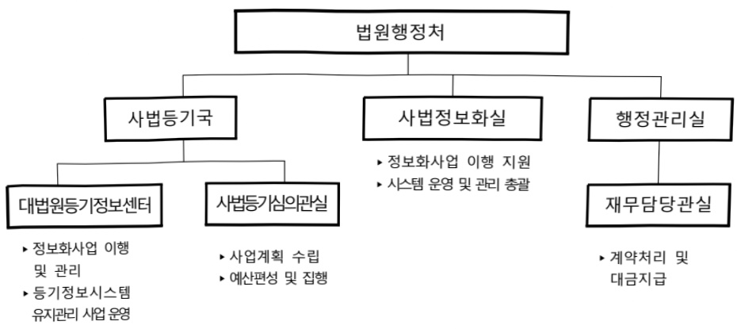

# 등기업무전산화(정보화)

**해당 페이지**: PDF 3099 ~ 3119 쪽 해당

**부처**: 대법원
**분야**: 공공질서 및 안전
**회계유형**: 특별회계
**2026 확정예산**: 30951.0 백만원
**전년대비 증감률**: -7.3%
**AI 도메인**: 보안/사이버

---

<table border=1 style='margin: auto; word-wrap: break-word;'><tr><td style='text-align: center; word-wrap: break-word;'>사 업 명</td></tr><tr><td style='text-align: center; word-wrap: break-word;'>(5) 등기업무전산화(1334-305)</td></tr></table>

□ 사업 코드 정보

<table border=1 style='margin: auto; word-wrap: break-word;'><tr><td style='text-align: center; word-wrap: break-word;'>구분</td><td style='text-align: center; word-wrap: break-word;'>회계</td><td style='text-align: center; word-wrap: break-word;'>소관</td><td style='text-align: center; word-wrap: break-word;'>실국(기관)</td><td style='text-align: center; word-wrap: break-word;'>계정</td><td style='text-align: center; word-wrap: break-word;'>분야</td><td style='text-align: center; word-wrap: break-word;'>부문</td></tr><tr><td style='text-align: center; word-wrap: break-word;'>코드</td><td style='text-align: center; word-wrap: break-word;'>215</td><td style='text-align: center; word-wrap: break-word;'>9740000</td><td style='text-align: center; word-wrap: break-word;'>000</td><td style='text-align: center; word-wrap: break-word;'>00</td><td style='text-align: center; word-wrap: break-word;'>020</td><td style='text-align: center; word-wrap: break-word;'>021</td></tr><tr><td style='text-align: center; word-wrap: break-word;'>명칭</td><td style='text-align: center; word-wrap: break-word;'>등기특별회계</td><td style='text-align: center; word-wrap: break-word;'>대법원</td><td style='text-align: center; word-wrap: break-word;'>사법등기국</td><td style='text-align: center; word-wrap: break-word;'></td><td style='text-align: center; word-wrap: break-word;'>공공질서 및 안전</td><td style='text-align: center; word-wrap: break-word;'>법원 및 헌재</td></tr></table>

<table border=1 style='margin: auto; word-wrap: break-word;'><tr><td style='text-align: center; word-wrap: break-word;'>구분</td><td style='text-align: center; word-wrap: break-word;'>프로그램</td><td style='text-align: center; word-wrap: break-word;'>단위사업</td><td style='text-align: center; word-wrap: break-word;'>세부사업</td></tr><tr><td style='text-align: center; word-wrap: break-word;'>코드</td><td style='text-align: center; word-wrap: break-word;'>1300</td><td style='text-align: center; word-wrap: break-word;'>1334</td><td style='text-align: center; word-wrap: break-word;'>305</td></tr><tr><td style='text-align: center; word-wrap: break-word;'>명칭</td><td style='text-align: center; word-wrap: break-word;'>사법정보화운영</td><td style='text-align: center; word-wrap: break-word;'>등기업무전산화</td><td style='text-align: center; word-wrap: break-word;'>등기업무전산화</td></tr></table>

☐ 사업 성격

<table border=1 style='margin: auto; word-wrap: break-word;'><tr><td style='text-align: center; word-wrap: break-word;'>신규</td><td style='text-align: center; word-wrap: break-word;'>계속</td><td style='text-align: center; word-wrap: break-word;'>완료</td><td style='text-align: center; word-wrap: break-word;'>예비타당성 실시여부</td><td style='text-align: center; word-wrap: break-word;'>총사업비 관리대상</td><td style='text-align: center; word-wrap: break-word;'>총액계상 예산사업</td><td style='text-align: center; word-wrap: break-word;'>사업소관 변경정보 2025예산 시 소관</td></tr><tr><td style='text-align: center; word-wrap: break-word;'></td><td style='text-align: center; word-wrap: break-word;'>○</td><td style='text-align: center; word-wrap: break-word;'></td><td style='text-align: center; word-wrap: break-word;'></td><td style='text-align: center; word-wrap: break-word;'></td><td style='text-align: center; word-wrap: break-word;'></td><td style='text-align: center; word-wrap: break-word;'></td></tr></table>

□ 사업 지원 형태 및 지원율

<table border=1 style='margin: auto; word-wrap: break-word;'><tr><td style='text-align: center; word-wrap: break-word;'>직접</td><td style='text-align: center; word-wrap: break-word;'>출자</td><td style='text-align: center; word-wrap: break-word;'>출연</td><td style='text-align: center; word-wrap: break-word;'>보조</td><td style='text-align: center; word-wrap: break-word;'>융자</td><td style='text-align: center; word-wrap: break-word;'>국고보조율(%)</td><td style='text-align: center; word-wrap: break-word;'>융자율(%)</td></tr><tr><td style='text-align: center; word-wrap: break-word;'>○</td><td style='text-align: center; word-wrap: break-word;'></td><td style='text-align: center; word-wrap: break-word;'></td><td style='text-align: center; word-wrap: break-word;'></td><td style='text-align: center; word-wrap: break-word;'></td><td style='text-align: center; word-wrap: break-word;'></td><td style='text-align: center; word-wrap: break-word;'></td></tr></table>

## □ 사업 담당자

<table border=1 style='margin: auto; word-wrap: break-word;'><tr><td style='text-align: center; word-wrap: break-word;'>사업명</td><td colspan="5">구분</td></tr><tr><td rowspan="3">등기업무 전산화</td><td rowspan="3">소관부처</td><td style='text-align: center; word-wrap: break-word;'>실·국·과(팀)</td><td style='text-align: center; word-wrap: break-word;'>과 장</td><td style='text-align: center; word-wrap: break-word;'>사무관</td><td style='text-align: center; word-wrap: break-word;'>주무관</td></tr><tr><td style='text-align: center; word-wrap: break-word;'>사법등기국</td><td style='text-align: center; word-wrap: break-word;'>이성민심의관</td><td style='text-align: center; word-wrap: break-word;'>김예슬</td><td style='text-align: center; word-wrap: break-word;'>최길호</td></tr><tr><td style='text-align: center; word-wrap: break-word;'>사법등기심의관실</td><td style='text-align: center; word-wrap: break-word;'>02-3480-1374</td><td style='text-align: center; word-wrap: break-word;'>02-3480-1846</td><td style='text-align: center; word-wrap: break-word;'>02-3480-1068</td></tr></table>

---

### 가. 예산 총괄표

(단위:백만원,%)

<table border=1 style='margin: auto; word-wrap: break-word;'><tr><td rowspan="2">사업명</td><td rowspan="2">2024년 결산</td><td colspan="2">2025년 예산</td><td colspan="2">2026년</td><td rowspan="2">증감 (B-A)</td><td rowspan="2">(B-A)/A</td></tr><tr><td style='text-align: center; word-wrap: break-word;'>본예산(A)</td><td style='text-align: center; word-wrap: break-word;'>추경</td><td style='text-align: center; word-wrap: break-word;'>요구</td><td style='text-align: center; word-wrap: break-word;'>조정(B)</td></tr><tr><td style='text-align: center; word-wrap: break-word;'>등기업무전산화</td><td style='text-align: center; word-wrap: break-word;'>40,557</td><td style='text-align: center; word-wrap: break-word;'>33,388</td><td style='text-align: center; word-wrap: break-word;'>33,388</td><td style='text-align: center; word-wrap: break-word;'>34,674</td><td style='text-align: center; word-wrap: break-word;'>30,951</td><td style='text-align: center; word-wrap: break-word;'>△2,437</td><td style='text-align: center; word-wrap: break-word;'>△7.3</td></tr></table>

□ 기능별(내역사업별), 목별 예산 내역

(단위:백만원)

<table border=1 style='margin: auto; word-wrap: break-word;'><tr><td rowspan="3"></td><td colspan="5">2024</td><td colspan="7">2025(25.7일말)</td><td rowspan="3">2026예산</td></tr><tr><td rowspan="2">예산액(추경)</td><td rowspan="2">예산현액</td><td rowspan="2">집행액[실집행액]</td><td rowspan="2">이일액</td><td rowspan="2">불용액</td><td rowspan="2">본예산</td><td rowspan="2">예산현액</td><td rowspan="2">집행액[실집행액]</td><td colspan="2">전년도 이일액제외</td><td rowspan="2">이일예상액</td><td rowspan="2">불용예상액</td></tr><tr><td style='text-align: center; word-wrap: break-word;'>예산현액</td><td style='text-align: center; word-wrap: break-word;'>집행액[실집행액]</td></tr><tr><td style='text-align: center; word-wrap: break-word;'>○ 기능별 분류(합계)</td><td style='text-align: center; word-wrap: break-word;'>41,532</td><td style='text-align: center; word-wrap: break-word;'>41,165</td><td style='text-align: center; word-wrap: break-word;'>40,557</td><td style='text-align: center; word-wrap: break-word;'>-</td><td style='text-align: center; word-wrap: break-word;'>609</td><td style='text-align: center; word-wrap: break-word;'>33,388</td><td style='text-align: center; word-wrap: break-word;'>33,388</td><td style='text-align: center; word-wrap: break-word;'>17,003</td><td style='text-align: center; word-wrap: break-word;'>33,388</td><td style='text-align: center; word-wrap: break-word;'>17,003</td><td style='text-align: center; word-wrap: break-word;'>-</td><td style='text-align: center; word-wrap: break-word;'>-</td><td style='text-align: center; word-wrap: break-word;'>30,951</td></tr><tr><td style='text-align: center; word-wrap: break-word;'>· 등기시스템 운영 및 유지관리</td><td style='text-align: center; word-wrap: break-word;'>40,213</td><td style='text-align: center; word-wrap: break-word;'>39,846</td><td style='text-align: center; word-wrap: break-word;'>39,239</td><td style='text-align: center; word-wrap: break-word;'>-</td><td style='text-align: center; word-wrap: break-word;'>607</td><td style='text-align: center; word-wrap: break-word;'>31,912</td><td style='text-align: center; word-wrap: break-word;'>31,912</td><td style='text-align: center; word-wrap: break-word;'>16,354</td><td style='text-align: center; word-wrap: break-word;'>31,912</td><td style='text-align: center; word-wrap: break-word;'>16,354</td><td style='text-align: center; word-wrap: break-word;'>-</td><td style='text-align: center; word-wrap: break-word;'>-</td><td style='text-align: center; word-wrap: break-word;'>29,240</td></tr><tr><td style='text-align: center; word-wrap: break-word;'>· 다면등기기록 등 해소사업</td><td style='text-align: center; word-wrap: break-word;'>874</td><td style='text-align: center; word-wrap: break-word;'>874</td><td style='text-align: center; word-wrap: break-word;'>873</td><td style='text-align: center; word-wrap: break-word;'>-</td><td style='text-align: center; word-wrap: break-word;'>2</td><td style='text-align: center; word-wrap: break-word;'>917</td><td style='text-align: center; word-wrap: break-word;'>917</td><td style='text-align: center; word-wrap: break-word;'>396</td><td style='text-align: center; word-wrap: break-word;'>917</td><td style='text-align: center; word-wrap: break-word;'>396</td><td style='text-align: center; word-wrap: break-word;'>-</td><td style='text-align: center; word-wrap: break-word;'>-</td><td style='text-align: center; word-wrap: break-word;'>550</td></tr><tr><td style='text-align: center; word-wrap: break-word;'>· 전자이미지 등기 기록 주민등록번호 음영화</td><td style='text-align: center; word-wrap: break-word;'>273</td><td style='text-align: center; word-wrap: break-word;'>273</td><td style='text-align: center; word-wrap: break-word;'>273</td><td style='text-align: center; word-wrap: break-word;'>-</td><td style='text-align: center; word-wrap: break-word;'>-</td><td style='text-align: center; word-wrap: break-word;'>287</td><td style='text-align: center; word-wrap: break-word;'>287</td><td style='text-align: center; word-wrap: break-word;'>197</td><td style='text-align: center; word-wrap: break-word;'>287</td><td style='text-align: center; word-wrap: break-word;'>197</td><td style='text-align: center; word-wrap: break-word;'>-</td><td style='text-align: center; word-wrap: break-word;'>-</td><td style='text-align: center; word-wrap: break-word;'>430</td></tr><tr><td style='text-align: center; word-wrap: break-word;'>· 정보화진단(보안 컨설팅)</td><td style='text-align: center; word-wrap: break-word;'>72</td><td style='text-align: center; word-wrap: break-word;'>72</td><td style='text-align: center; word-wrap: break-word;'>72</td><td style='text-align: center; word-wrap: break-word;'>-</td><td style='text-align: center; word-wrap: break-word;'>-</td><td style='text-align: center; word-wrap: break-word;'>72</td><td style='text-align: center; word-wrap: break-word;'>72</td><td style='text-align: center; word-wrap: break-word;'>-</td><td style='text-align: center; word-wrap: break-word;'>72</td><td style='text-align: center; word-wrap: break-word;'>-</td><td style='text-align: center; word-wrap: break-word;'>-</td><td style='text-align: center; word-wrap: break-word;'>-</td><td style='text-align: center; word-wrap: break-word;'>72</td></tr><tr><td style='text-align: center; word-wrap: break-word;'>· 등기시스템 감리</td><td style='text-align: center; word-wrap: break-word;'>100</td><td style='text-align: center; word-wrap: break-word;'>100</td><td style='text-align: center; word-wrap: break-word;'>100</td><td style='text-align: center; word-wrap: break-word;'>-</td><td style='text-align: center; word-wrap: break-word;'>-</td><td style='text-align: center; word-wrap: break-word;'>200</td><td style='text-align: center; word-wrap: break-word;'>200</td><td style='text-align: center; word-wrap: break-word;'>56</td><td style='text-align: center; word-wrap: break-word;'>200</td><td style='text-align: center; word-wrap: break-word;'>56</td><td style='text-align: center; word-wrap: break-word;'>-</td><td style='text-align: center; word-wrap: break-word;'>-</td><td style='text-align: center; word-wrap: break-word;'>200</td></tr><tr><td style='text-align: center; word-wrap: break-word;'>· 등기시스템 고도 화 기반 구축</td><td style='text-align: center; word-wrap: break-word;'>-</td><td style='text-align: center; word-wrap: break-word;'>-</td><td style='text-align: center; word-wrap: break-word;'>-</td><td style='text-align: center; word-wrap: break-word;'>-</td><td style='text-align: center; word-wrap: break-word;'>-</td><td style='text-align: center; word-wrap: break-word;'>-</td><td style='text-align: center; word-wrap: break-word;'>-</td><td style='text-align: center; word-wrap: break-word;'>-</td><td style='text-align: center; word-wrap: break-word;'>-</td><td style='text-align: center; word-wrap: break-word;'>-</td><td style='text-align: center; word-wrap: break-word;'>-</td><td style='text-align: center; word-wrap: break-word;'>-</td><td style='text-align: center; word-wrap: break-word;'>459</td></tr><tr><td style='text-align: center; word-wrap: break-word;'>○ 비목별 분류(합계)</td><td style='text-align: center; word-wrap: break-word;'>41,532</td><td style='text-align: center; word-wrap: break-word;'>41,165</td><td style='text-align: center; word-wrap: break-word;'>40,557</td><td style='text-align: center; word-wrap: break-word;'>-</td><td style='text-align: center; word-wrap: break-word;'>609</td><td style='text-align: center; word-wrap: break-word;'>33,388</td><td style='text-align: center; word-wrap: break-word;'>33,388</td><td style='text-align: center; word-wrap: break-word;'>17,003</td><td style='text-align: center; word-wrap: break-word;'>33,388</td><td style='text-align: center; word-wrap: break-word;'>17,003</td><td style='text-align: center; word-wrap: break-word;'>-</td><td style='text-align: center; word-wrap: break-word;'>-</td><td style='text-align: center; word-wrap: break-word;'>30,951</td></tr><tr><td style='text-align: center; word-wrap: break-word;'>· 일반수용비(210-01)</td><td style='text-align: center; word-wrap: break-word;'>837</td><td style='text-align: center; word-wrap: break-word;'>837</td><td style='text-align: center; word-wrap: break-word;'>713</td><td style='text-align: center; word-wrap: break-word;'>-</td><td style='text-align: center; word-wrap: break-word;'>124</td><td style='text-align: center; word-wrap: break-word;'>1,129</td><td style='text-align: center; word-wrap: break-word;'>1,129</td><td style='text-align: center; word-wrap: break-word;'>424</td><td style='text-align: center; word-wrap: break-word;'>1,129</td><td style='text-align: center; word-wrap: break-word;'>424</td><td style='text-align: center; word-wrap: break-word;'>-</td><td style='text-align: center; word-wrap: break-word;'>-</td><td style='text-align: center; word-wrap: break-word;'>502</td></tr><tr><td style='text-align: center; word-wrap: break-word;'>· 공공요금및제비(210-02)</td><td style='text-align: center; word-wrap: break-word;'>5,133</td><td style='text-align: center; word-wrap: break-word;'>5,133</td><td style='text-align: center; word-wrap: break-word;'>5,044</td><td style='text-align: center; word-wrap: break-word;'>-</td><td style='text-align: center; word-wrap: break-word;'>89</td><td style='text-align: center; word-wrap: break-word;'>5,225</td><td style='text-align: center; word-wrap: break-word;'>5,225</td><td style='text-align: center; word-wrap: break-word;'>3,025</td><td style='text-align: center; word-wrap: break-word;'>5,225</td><td style='text-align: center; word-wrap: break-word;'>3,025</td><td style='text-align: center; word-wrap: break-word;'>-</td><td style='text-align: center; word-wrap: break-word;'>-</td><td style='text-align: center; word-wrap: break-word;'>7,801</td></tr><tr><td style='text-align: center; word-wrap: break-word;'>· 특근매식비(210-05)</td><td style='text-align: center; word-wrap: break-word;'>20</td><td style='text-align: center; word-wrap: break-word;'>20</td><td style='text-align: center; word-wrap: break-word;'>19</td><td style='text-align: center; word-wrap: break-word;'>-</td><td style='text-align: center; word-wrap: break-word;'>1</td><td style='text-align: center; word-wrap: break-word;'>20</td><td style='text-align: center; word-wrap: break-word;'>20</td><td style='text-align: center; word-wrap: break-word;'>12</td><td style='text-align: center; word-wrap: break-word;'>20</td><td style='text-align: center; word-wrap: break-word;'>12</td><td style='text-align: center; word-wrap: break-word;'>-</td><td style='text-align: center; word-wrap: break-word;'>-</td><td style='text-align: center; word-wrap: break-word;'>20</td></tr><tr><td style='text-align: center; word-wrap: break-word;'>· 임차료(210-07)</td><td style='text-align: center; word-wrap: break-word;'>2,833</td><td style='text-align: center; word-wrap: break-word;'>2,633</td><td style='text-align: center; word-wrap: break-word;'>2,620</td><td style='text-align: center; word-wrap: break-word;'>-</td><td style='text-align: center; word-wrap: break-word;'>13</td><td style='text-align: center; word-wrap: break-word;'>5,176</td><td style='text-align: center; word-wrap: break-word;'>5,176</td><td style='text-align: center; word-wrap: break-word;'>1,942</td><td style='text-align: center; word-wrap: break-word;'>5,176</td><td style='text-align: center; word-wrap: break-word;'>1,942</td><td style='text-align: center; word-wrap: break-word;'>-</td><td style='text-align: center; word-wrap: break-word;'>-</td><td style='text-align: center; word-wrap: break-word;'>6,481</td></tr><tr><td style='text-align: center; word-wrap: break-word;'>· 관리용역비(210-15)</td><td style='text-align: center; word-wrap: break-word;'>29,676</td><td style='text-align: center; word-wrap: break-word;'>29,676</td><td style='text-align: center; word-wrap: break-word;'>29,355</td><td style='text-align: center; word-wrap: break-word;'>-</td><td style='text-align: center; word-wrap: break-word;'>321</td><td style='text-align: center; word-wrap: break-word;'>18,900</td><td style='text-align: center; word-wrap: break-word;'>18,900</td><td style='text-align: center; word-wrap: break-word;'>10,636</td><td style='text-align: center; word-wrap: break-word;'>18,900</td><td style='text-align: center; word-wrap: break-word;'>10,636</td><td style='text-align: center; word-wrap: break-word;'>-</td><td style='text-align: center; word-wrap: break-word;'>-</td><td style='text-align: center; word-wrap: break-word;'>12,697</td></tr><tr><td style='text-align: center; word-wrap: break-word;'>· 국내여비(220-01)</td><td style='text-align: center; word-wrap: break-word;'>12</td><td style='text-align: center; word-wrap: break-word;'>12</td><td style='text-align: center; word-wrap: break-word;'>12</td><td style='text-align: center; word-wrap: break-word;'>-</td><td style='text-align: center; word-wrap: break-word;'>-</td><td style='text-align: center; word-wrap: break-word;'>12</td><td style='text-align: center; word-wrap: break-word;'>12</td><td style='text-align: center; word-wrap: break-word;'>12</td><td style='text-align: center; word-wrap: break-word;'>12</td><td style='text-align: center; word-wrap: break-word;'>12</td><td style='text-align: center; word-wrap: break-word;'>-</td><td style='text-align: center; word-wrap: break-word;'>-</td><td style='text-align: center; word-wrap: break-word;'>12</td></tr><tr><td style='text-align: center; word-wrap: break-word;'>· 국외업무여비(220-02)</td><td style='text-align: center; word-wrap: break-word;'>31</td><td style='text-align: center; word-wrap: break-word;'>29</td><td style='text-align: center; word-wrap: break-word;'>29</td><td style='text-align: center; word-wrap: break-word;'>-</td><td style='text-align: center; word-wrap: break-word;'>-</td><td style='text-align: center; word-wrap: break-word;'>31</td><td style='text-align: center; word-wrap: break-word;'>31</td><td style='text-align: center; word-wrap: break-word;'>-</td><td style='text-align: center; word-wrap: break-word;'>31</td><td style='text-align: center; word-wrap: break-word;'>-</td><td style='text-align: center; word-wrap: break-word;'>-</td><td style='text-align: center; word-wrap: break-word;'>-</td><td style='text-align: center; word-wrap: break-word;'>31</td></tr><tr><td style='text-align: center; word-wrap: break-word;'>· 관산업무추천비(240-02)</td><td style='text-align: center; word-wrap: break-word;'>21</td><td style='text-align: center; word-wrap: break-word;'>21</td><td style='text-align: center; word-wrap: break-word;'>20</td><td style='text-align: center; word-wrap: break-word;'>-</td><td style='text-align: center; word-wrap: break-word;'>1</td><td style='text-align: center; word-wrap: break-word;'>21</td><td style='text-align: center; word-wrap: break-word;'>21</td><td style='text-align: center; word-wrap: break-word;'>19</td><td style='text-align: center; word-wrap: break-word;'>21</td><td style='text-align: center; word-wrap: break-word;'>19</td><td style='text-align: center; word-wrap: break-word;'>-</td><td style='text-align: center; word-wrap: break-word;'>-</td><td style='text-align: center; word-wrap: break-word;'>21</td></tr><tr><td style='text-align: center; word-wrap: break-word;'>· 일반연구비(260-01)</td><td style='text-align: center; word-wrap: break-word;'>1,319</td><td style='text-align: center; word-wrap: break-word;'>1,319</td><td style='text-align: center; word-wrap: break-word;'>1,318</td><td style='text-align: center; word-wrap: break-word;'>-</td><td style='text-align: center; word-wrap: break-word;'>2</td><td style='text-align: center; word-wrap: break-word;'>1,476</td><td style='text-align: center; word-wrap: break-word;'>1,476</td><td style='text-align: center; word-wrap: break-word;'>649</td><td style='text-align: center; word-wrap: break-word;'>1,476</td><td style='text-align: center; word-wrap: break-word;'>649</td><td style='text-align: center; word-wrap: break-word;'>-</td><td style='text-align: center; word-wrap: break-word;'>-</td><td style='text-align: center; word-wrap: break-word;'>1,711</td></tr><tr><td style='text-align: center; word-wrap: break-word;'>· 공식비(430-03)</td><td style='text-align: center; word-wrap: break-word;'>70</td><td style='text-align: center; word-wrap: break-word;'>55</td><td style='text-align: center; word-wrap: break-word;'>51</td><td style='text-align: center; word-wrap: break-word;'>-</td><td style='text-align: center; word-wrap: break-word;'>4</td><td style='text-align: center; word-wrap: break-word;'>70</td><td style='text-align: center; word-wrap: break-word;'>70</td><td style='text-align: center; word-wrap: break-word;'>29</td><td style='text-align: center; word-wrap: break-word;'>70</td><td style='text-align: center; word-wrap: break-word;'>29</td><td style='text-align: center; word-wrap: break-word;'>-</td><td style='text-align: center; word-wrap: break-word;'>-</td><td style='text-align: center; word-wrap: break-word;'>70</td></tr></table>

---

<table border=1 style='margin: auto; word-wrap: break-word;'><tr><td rowspan="2"></td><td colspan="5">2024</td><td colspan="7">2025(25.7 월 말)</td><td rowspan="2">2026 예산</td></tr><tr><td style='text-align: center; word-wrap: break-word;'>예산액(추경)</td><td style='text-align: center; word-wrap: break-word;'>예산현액</td><td style='text-align: center; word-wrap: break-word;'>집행액[실집행액]</td><td style='text-align: center; word-wrap: break-word;'>이월액</td><td style='text-align: center; word-wrap: break-word;'>불용액</td><td style='text-align: center; word-wrap: break-word;'>분예산</td><td style='text-align: center; word-wrap: break-word;'>예산현액</td><td style='text-align: center; word-wrap: break-word;'>집행액[실집행액]</td><td colspan="2">전년도 이월액제외</td><td style='text-align: center; word-wrap: break-word;'>이월예산액</td><td style='text-align: center; word-wrap: break-word;'>불용예산액</td></tr><tr><td style='text-align: center; word-wrap: break-word;'>· 자산취득비(430-01)</td><td style='text-align: center; word-wrap: break-word;'>1,580</td><td style='text-align: center; word-wrap: break-word;'>1,430</td><td style='text-align: center; word-wrap: break-word;'>1,376</td><td style='text-align: center; word-wrap: break-word;'>-</td><td style='text-align: center; word-wrap: break-word;'>54</td><td style='text-align: center; word-wrap: break-word;'>1,328</td><td style='text-align: center; word-wrap: break-word;'>1,328</td><td style='text-align: center; word-wrap: break-word;'>255</td><td style='text-align: center; word-wrap: break-word;'>1,328</td><td style='text-align: center; word-wrap: break-word;'>255</td><td style='text-align: center; word-wrap: break-word;'>-</td><td style='text-align: center; word-wrap: break-word;'>-</td><td style='text-align: center; word-wrap: break-word;'>1,605</td></tr></table>

### 나.사업설명자료

## 1 ) 사업목적·내용

- 등기업무시스템을 안정적이고 효율적으로 운영하여 국민의 신뢰를 확보하고, 지식 정보화시대에 맞게 국제적 경쟁력을 갖춘 시스템으로 고도화하여 국민 편익 증진에 기여하고자 함

## - (등기시스템 운영 및 유지관리)

등기시스템의 안정적·효율적 운영 및 무중단 대국민서비스를 위해 25개 등기응용시스템의 유지보수 및 기능개선, 등기정보시스템 전산장비 유지보수 등을 수행

## - (다면등기기록 등 해소 사업)

다면등기, 중복등기, 원시오류등기 등 부적합 등기기록의 지속적 정비를 통한 등기의 공시기능 향상 및 등기소 업무처리 개선

## - (전자이미지 등기기록 주민등록번호 음영화)

폐쇄등기부 등 전자이미지 등기기록의 주민등록번호 음영화를 통한 국민의 재산권에 대한 등기기록 내 개인정보보호 강화

## - (정보화진단(보안컨설팅))

등기정보시스템에 대한 보안 취약점 등을 사전 진단하여 보안사고 사전 방지 및 예방

- (등기시스템 감리)

등기정보시스템 유지관리 효율성 향상 및 안정성 확보를 위하여 추진

## - (등기시스템 고도화 기반 구축)

'제4차 등기특별회계(2018~2027)의 성과 및 향후과제(한국행정연구원)' 연구용역에서 제시된 미래과제를 중심으로 정보화전략계획(ISP) 추진

## 2 ) 사업개요

□ 사업근거 및 추진경위

① 법령상 근거 조항 적시

-「등기특별회계법」제1조

---

이 법은 등기업무의 합리적이고 효율적인 운영을 기하기 위하여 등기특별회계를 설치하고 그 세입으로 그 세출에 충당하게 함을 목적으로 한다.

-「부동산등기법」제2조, 제11조

“등기부”란 전산정보처리조직에 의하여 입력·처리된 등기정보자료를 대법원규칙으로 정하는 바에 따라 편성한 것을 말하며, 등기관은 등기사무를 전산정보처리조직을 이용하여 등기부에 등기사항을 기록하는 방식으로 처리하여야 한다.

-「상업등기법」제8조

등기관은 등기사무를 전산정보처리조직을 이용하여 등기부에 등기사항을 기록하는 방식으로 처리하여야 하며, 등기관이 등기사항을 처리하였을 때에는 등기사무를 처리한 등기관이 누구인지 알 수 있는 조치를 취하여야 한다.

② 추진경위

- 최초 사업 시작년도 : 1994. 1. 1.

-추진 배경

등기신청사건의 처리 및 등기사항증명서의 발급에 많은 시간이 소요되고 정확도나 표준화 등에 문제점을 내포하고 있어, 등기업무전산화를 통하여 업무를 혁신하고 새로운 형태의 대민서비스를 제공하기 위함이며, 당시 범국가적인 전산화가 현실화되어감에 따라 유관기관과의 효과적인 정보공유를 위한 연계기반을 조성할 필요가 있어 추진

- 연도별 사업추진 경과

o 1994년 01월 : 등기특별회계법 시행

o 1994년 05월 : 등기시스템 1차 개발 시작

ㅇ 1998년 03월 : 시범운영 실시

ㅇ 1998년 10월 : 부동산등기업무 전산 대민서비스 개시

o 2001년 02월 : 법인등기 인터넷 열람서비스 개시

°2002년 01월 : 부동산등기 인터넷 열람서비스 개시

°2002년 09월 : 전국 212개 등기소 종이등기부 전산화 완료

ㅇ 2003년 09월 : 등기업무 2차 전산화 사업 시작

o 2003년 11월 : 등기특별회계 2010년까지 연장

2004년 03월 : 부동산등기 인터넷 발급서비스 개시

o 2004년 03월 : 인터넷등기소 오픈

o 2004년 09월 : 법인등기 인터넷 발급서비스 개시

ㅇ 2005년 11월 : 부동산 및 법인등기 전자표준양식서비스 개시

o 2006년 06월 : 부동산등기 전자신청 제도 시행

o 2008년 04월 : 법인등기 전자신청 제도 시행

---

○ 2009년 01월 : 부동산등기 지도검색 및 요약서비스 제공

○ 2009년 06월 : 다양한 웹브라우저 및 시각장애인에 대한 음성열람서비스 제공

○ 2010년 01월 : 중소기업청의 재택창업시스템과 연계한 온라인 법인설립 등기서비스 제공

○ 2010년 05월 : 인터넷등기소에서의 온라인법인설립등기서비스 및 온라인 인감신고 서비스 제공

○ 2010년 05월 : 등기특별회계 2017년까지 재연장

○ 2010년 08월 : 전자공증시스템과의 연계서비스 제공

○ 2010년 10월 : 타 관할 신청정보 자동생성시스템 구축 완료

○ 2011년 07월 : 신탁법 전부개정에 따른 등기시스템 개선

○ 2011년 10월 : 부동산등기법 전부개정에 따른 등기시스템 개선

○ 2011년 11월 : 등기부에 대한 도로명주소서비스 개시

○ 2011년 11월 : 인터넷등기소 모바일서비스 개시

○ 2012년 06월 : 동산·채권담보등기서비스 개시

○ 2012년 07월 : 유한책임신탁등기서비스 개시

○ 2012년 12월 : 모바일 등기정보열람서비스 개시

○ 2013년 05월 : 등기신청수수료 전자납부 및 무인납부서비스 개시

○ 2013년 07월 : 동산·채권담보등기 전자신청 및 인터넷 열람·발급서비스 개시

○ 2013년 07월 : 후견등기정보서비스 개시

○ 2014년 01월 : 주택임대차 확정일자 전자적 관리서비스 개시

○ 2014년 07월 : 확정일자 통합정보 인터넷제공서비스 개시

○ 2014년 09월 : 등기신청수수료 은행연계서비스 개시

○ 2014년 11월 : 상업등기법 전부개정에 따른 등기시스템 개선

○ 2015년 03월 : 이미지 폐쇄등기부의 주민등록번호 음영화 발급서비스 개시

○ 2015년 09월 : 온라인 확정일자 신청 및 부여서비스 개시

○ 2016년 04월 : 검색엔진을 활용한 인터넷등기소 간편검색서비스 제공

○ 2016년 09월 : 모바일을 통한 등기기록 음성열람서비스 제공

○ 2017년 07월 : 전자신청 및 전자납부 등 인터넷등기소 주요서비스 24시간 제공

○ 2017년 09월 : 등기특별회계 2027년까지 3차 연장

○ 2018년 07월 : 부동산등기사항증명서 세로양식 서비스 제공

○ 2019년 01월 : 등기소 무인발급수수료 모바일 결제서비스 제공

○ 2019년 07월 : 동산·채권담보, 기타등기 등기사항증명서 세로양식 변경 적용

○ 2020년 06월 : 등기국·과·소 유인창구 등기수수료 카드결제서비스 제공

○ 2021년 07월 : 등기국·과·소 무인발급기 등기수수료 카드결제서비스 제공

○ 2023년 01월 : 인터넷등기소 간편결제 서비스 제공

○ 2023년 12월 : 모바일 앱을 통한 전자등기사항 증명서 발급 및 간편조회 서비스 시행

---

## □ 주요내용

① 사업규모

- 총사업비(해당되는 경우에만 기재) : 해당 없음

- 사업기간 : '94 ~ 계속

- 최근 5년 간 투입된 사업비(예산액기준, 추경편성한 연도에는 추경포함)

<table border=1 style='margin: auto; word-wrap: break-word;'><tr><td style='text-align: center; word-wrap: break-word;'>연도</td><td style='text-align: center; word-wrap: break-word;'>2022</td><td style='text-align: center; word-wrap: break-word;'>2023</td><td style='text-align: center; word-wrap: break-word;'>2024</td><td style='text-align: center; word-wrap: break-word;'>2025</td><td style='text-align: center; word-wrap: break-word;'>2026</td></tr><tr><td style='text-align: center; word-wrap: break-word;'>사업비</td><td style='text-align: center; word-wrap: break-word;'>43,677</td><td style='text-align: center; word-wrap: break-word;'>41,532</td><td style='text-align: center; word-wrap: break-word;'>41,532</td><td style='text-align: center; word-wrap: break-word;'>33,388</td><td style='text-align: center; word-wrap: break-word;'>30,951</td></tr></table>

-기타:해당 없음

② 사업추진체계

- 사업시행방법 : 직접수행

-사업시행주체:대법원

-사업 수혜자 : 등기업무서비스 이용자

- 보조, 융자, 출연, 출자 등의 경우 보조·융자 등 지원 비율 및 법적근거 : 해당 없음

---

3) '26년도 예산 산출 근거

1. 등기시스템 운영 및 유지관리 : 31,912 → 29,240백만원 (△ 2,672)

### 1 -1. 등기업무 데이터센터 운영 : 1,056 → 0백만원 (순감)

## □ 사업내용

사법부 등기정보인프라의 효율적 운영·관리를 통해 안정적이고 신뢰성 있는 무중단 등기정보서비스 제공

※ 미래등기시스템 구축 세부사업/미래등기시스템 운영 및 유지관리 내역사업/미래등기업무 데이터 센터 전산장비 운영 내내역사업으로 통합(총사업비 조정 완료)

### 1 -2. 사법부 보안관제센터 운영(등기) : 181 → 0백만원 (순감)

## □ 사업내용

☐ 신속하고 효율적인 사이버위협 예방·경보 대응체계 구축을 통해 안정

적이고 신뢰성 있는 등기정보 보안서비스 제공

※ 미래등기시스템 구축 세부사업/미래등기시스템 운영 및 유지관리 내역사업/사법부 보안관제센터

운영 내내역사업으로 통합(총사업비 조정 완료)

1-3. 등기정보시스템 유지관리 : 12,018 → 6,440백만원 (△5,578)

## □ 사업내용

미래등기시스템 구축 사업 대상에서 제외된 동산·채권담보등기시스템, 기타등기시스템, 집행관통합시스템 등 22개 비대상 등기정보시스템에 대한 유지보수 및 기능개선 사업

0 등기빅데이터시스템을 구성하는 3개 시스템(등기빅데이터, 등기빅데이터 연계관리, 등기정보광장) 중 미래등기시스템 구축 대상이 되지 않

---

은 미변경 부분에 대한 유지보수 및 기능개선 사업

- 비대상 등기정보시스템 및 미변경 등기백데이터시스템의 변경 및 개선 등 응용프로그램의 유지 관리

- 비대상 등기정보시스템 및 미변경 등기백데이터시스템의 안정적 운영을 위한 기술지원, 사용자 업무지원 등 수행

- 미래등기시스템과 비대상 등기정보시스템은 기반기술 및 프레임워크를 달리하므로, 상호간 영향범위 분석·파악을 통한 유기적인 연계 및 안정적 등기서비스 제공 필요

## □산출근거

ㅇ 예산 : 6,440백만원(관리용역비)

- 6,440백만원 = 5,567백만원(등기정보시스템) + 873백만원(등기백데이터시스템)

· 비대상 등기정보시스템 유지관리 : 5,567백만원

122,489FP×605,784원×6.2%+이윤(10%)+부가세(10%)

<table border=1 style='margin: auto; word-wrap: break-word;'><tr><td style='text-align: center; word-wrap: break-word;'>구분</td><td style='text-align: center; word-wrap: break-word;'>기능점수</td><td style='text-align: center; word-wrap: break-word;'>개발비용</td><td style='text-align: center; word-wrap: break-word;'>유지관리요율</td><td style='text-align: center; word-wrap: break-word;'>유지관리비</td></tr><tr><td style='text-align: center; word-wrap: break-word;'>비대상 등기정보시스템</td><td style='text-align: center; word-wrap: break-word;'>122,489FP</td><td style='text-align: center; word-wrap: break-word;'>74,202백만원</td><td style='text-align: center; word-wrap: break-word;'>6.2%</td><td style='text-align: center; word-wrap: break-word;'>5,567백만원</td></tr></table>

· 미변경 등기념데이터시스템 유지관리 : 873백만원

24,577FP×605,784원×4.846%+이윤(10%)+부가세(10%)

<table border=1 style='margin: auto; word-wrap: break-word;'><tr><td style='text-align: center; word-wrap: break-word;'>구분</td><td style='text-align: center; word-wrap: break-word;'>기능점수</td><td style='text-align: center; word-wrap: break-word;'>개발비용</td><td style='text-align: center; word-wrap: break-word;'>유지관리요율</td><td style='text-align: center; word-wrap: break-word;'>유지관리비</td></tr><tr><td style='text-align: center; word-wrap: break-word;'>미변경 등기백데이터시스템</td><td style='text-align: center; word-wrap: break-word;'>24,577FP</td><td style='text-align: center; word-wrap: break-word;'>14,888백만원</td><td style='text-align: center; word-wrap: break-word;'>4.846%</td><td style='text-align: center; word-wrap: break-word;'>873백만원</td></tr></table>

### 1 -4. 사용자지원센터 및 등기클센터 운영 : 969 → 0백만원 (순감)

## □ 사업내용

0 등기시스템, 인터넷등기소 등 사용자 대상의 사용자지원서비스 및 전국 168개 등기소 민원인 대상의 등기관련 민원에 대해 신속하고

---

## 정확한 상담서비스 제공

※ 미래등기시스템 구축 세부사업/미래등기시스템 운영 및 유지관리 내역사업/사용자지원센터 및 등기클센터 운영 내내역사업으로 통합(총사업비 조정 완료)

### 1 -5. 사법부 전산장비 유지보수 : 4,676 → 6,257백만원 (증 1,581)

## □ 사업개요

0 등기정보시스템 전산장비에 대한 장애예방 및 신속한 장애처리, 사후

관리 등의 유지보수를 통한 등기정보시스템의 신뢰성 및 가용성 확보

o 사법부 전산장비 유지보수 예산 편성 요약

<table border=1 style='margin: auto; word-wrap: break-word;'><tr><td rowspan="5">사법부 전산장비 유지보수(1-5)</td><td style='text-align: center; word-wrap: break-word;'>항목</td><td style='text-align: center; word-wrap: break-word;'>2025년</td><td style='text-align: center; word-wrap: break-word;'>2026년</td></tr><tr><td style='text-align: center; word-wrap: break-word;'>데이터센터 전산장비 유지보수(1-5-1)</td><td style='text-align: center; word-wrap: break-word;'>1,537백만원</td><td style='text-align: center; word-wrap: break-word;'>2,906백만원</td></tr><tr><td style='text-align: center; word-wrap: break-word;'>등기전산장비 운영 및 유지보수(1-5-2)</td><td style='text-align: center; word-wrap: break-word;'>2,988백만원</td><td style='text-align: center; word-wrap: break-word;'>3,200백만원</td></tr><tr><td style='text-align: center; word-wrap: break-word;'>부품장비 대체비(1-5-3)</td><td style='text-align: center; word-wrap: break-word;'>151백만원</td><td style='text-align: center; word-wrap: break-word;'>151백만원</td></tr><tr><td style='text-align: center; word-wrap: break-word;'>합계</td><td style='text-align: center; word-wrap: break-word;'>4,676백만원</td><td style='text-align: center; word-wrap: break-word;'>6,257백만원</td></tr></table>

### 1 -5-1. 데이터센터 전산장비 유지보수 : 1,537 → 2,906백만원 (증 1,369)

□사업내용

0 등기정보시스템의 안정적 운용을 위한 데이터센터 전산장비 유지보수(장애예방, 신속 장애처리, 사후관리 등) 사업

ㅇ 유지보수 대상 장비

- 대법원전산정보센터, 대법원등기정보센터(세종), 등기기록정비사업소

등 에 설치된 서버, 대용량 저장장치, 네트워크장비, DBMS, 미들웨어, 각종 보안시스템 등의 하드웨어 및 소프트웨어

ㅇ 데이터센터 전산장비 유지보수 예산 편성 요약

---

<table border=1 style='margin: auto; word-wrap: break-word;'><tr><td style='text-align: center; word-wrap: break-word;'>구분</td><td style='text-align: center; word-wrap: break-word;'>등기업무전산화</td><td style='text-align: center; word-wrap: break-word;'>등기빅데이터시스템</td><td style='text-align: center; word-wrap: break-word;'>소계</td></tr><tr><td style='text-align: center; word-wrap: break-word;'>상용SW유지보수</td><td style='text-align: center; word-wrap: break-word;'>1,555백만원</td><td style='text-align: center; word-wrap: break-word;'>329백만원</td><td style='text-align: center; word-wrap: break-word;'>1,884백만원</td></tr><tr><td style='text-align: center; word-wrap: break-word;'>HW유지보수</td><td style='text-align: center; word-wrap: break-word;'>991백만원</td><td style='text-align: center; word-wrap: break-word;'>31백만원</td><td style='text-align: center; word-wrap: break-word;'>1,022백만원</td></tr><tr><td colspan="3">합계</td><td style='text-align: center; word-wrap: break-word;'>2,906백만원</td></tr></table>

## □산출근거

° 예산 : 2,906백만원(관리용역비)

- 상용 SW 유지보수 : 1,884백만원 = 1,555백만원 + 329백만원

·등기업무전산화 : 1,555백만원(15,553백만원(장비도입가)×10%(평균요율))

<table border=1 style='margin: auto; word-wrap: break-word;'><tr><td style='text-align: center; word-wrap: break-word;'>상용SW 도입연도</td><td style='text-align: center; word-wrap: break-word;'>장비 도입가격(원)</td><td style='text-align: center; word-wrap: break-word;'>평균요율</td><td style='text-align: center; word-wrap: break-word;'>유지보수금액(원)</td></tr><tr><td style='text-align: center; word-wrap: break-word;'>2014년</td><td style='text-align: center; word-wrap: break-word;'>533,890,000</td><td style='text-align: center; word-wrap: break-word;'>10%</td><td style='text-align: center; word-wrap: break-word;'>53,389,000</td></tr><tr><td style='text-align: center; word-wrap: break-word;'>2015년</td><td style='text-align: center; word-wrap: break-word;'>1,722,304,000</td><td style='text-align: center; word-wrap: break-word;'>10%</td><td style='text-align: center; word-wrap: break-word;'>172,230,400</td></tr><tr><td style='text-align: center; word-wrap: break-word;'>2016년</td><td style='text-align: center; word-wrap: break-word;'>3,033,600,000</td><td style='text-align: center; word-wrap: break-word;'>10%</td><td style='text-align: center; word-wrap: break-word;'>303,360,000</td></tr><tr><td style='text-align: center; word-wrap: break-word;'>2017년</td><td style='text-align: center; word-wrap: break-word;'>847,000,000</td><td style='text-align: center; word-wrap: break-word;'>10%</td><td style='text-align: center; word-wrap: break-word;'>84,700,000</td></tr><tr><td style='text-align: center; word-wrap: break-word;'>2018년</td><td style='text-align: center; word-wrap: break-word;'>2,919,335,000</td><td style='text-align: center; word-wrap: break-word;'>10%</td><td style='text-align: center; word-wrap: break-word;'>291,933,500</td></tr><tr><td style='text-align: center; word-wrap: break-word;'>2019년</td><td style='text-align: center; word-wrap: break-word;'>56,595,000</td><td style='text-align: center; word-wrap: break-word;'>10%</td><td style='text-align: center; word-wrap: break-word;'>5,659,500</td></tr><tr><td style='text-align: center; word-wrap: break-word;'>2020년</td><td style='text-align: center; word-wrap: break-word;'>815,462,000</td><td style='text-align: center; word-wrap: break-word;'>10%</td><td style='text-align: center; word-wrap: break-word;'>81,546,200</td></tr><tr><td style='text-align: center; word-wrap: break-word;'>2021년</td><td style='text-align: center; word-wrap: break-word;'>888,970,000</td><td style='text-align: center; word-wrap: break-word;'>10%</td><td style='text-align: center; word-wrap: break-word;'>88,897,000</td></tr><tr><td style='text-align: center; word-wrap: break-word;'>2022년</td><td style='text-align: center; word-wrap: break-word;'>2,272,852,000</td><td style='text-align: center; word-wrap: break-word;'>10%</td><td style='text-align: center; word-wrap: break-word;'>227,285,200</td></tr><tr><td style='text-align: center; word-wrap: break-word;'>2024년</td><td style='text-align: center; word-wrap: break-word;'>2,463,000,000</td><td style='text-align: center; word-wrap: break-word;'>10%</td><td style='text-align: center; word-wrap: break-word;'>246,300,000</td></tr><tr><td style='text-align: center; word-wrap: break-word;'>합계</td><td style='text-align: center; word-wrap: break-word;'>15,553,008,000</td><td style='text-align: center; word-wrap: break-word;'>10%</td><td style='text-align: center; word-wrap: break-word;'>1,555,300,800</td></tr></table>

등기빅데이터시스템 : 329백만원(2,741백만원(장비도입가)×12%(평균요율))

<table border=1 style='margin: auto; word-wrap: break-word;'><tr><td style='text-align: center; word-wrap: break-word;'>상용SW 도입연도</td><td style='text-align: center; word-wrap: break-word;'>장비 도입가격(원)</td><td style='text-align: center; word-wrap: break-word;'>평균요율</td><td style='text-align: center; word-wrap: break-word;'>유지보수금액(원)</td></tr><tr><td style='text-align: center; word-wrap: break-word;'>2018년</td><td style='text-align: center; word-wrap: break-word;'>869,000,000</td><td style='text-align: center; word-wrap: break-word;'>12%</td><td style='text-align: center; word-wrap: break-word;'>104,280,000</td></tr><tr><td style='text-align: center; word-wrap: break-word;'>2019년</td><td style='text-align: center; word-wrap: break-word;'>1,871,842,250</td><td style='text-align: center; word-wrap: break-word;'>12%</td><td style='text-align: center; word-wrap: break-word;'>224,621,070</td></tr><tr><td style='text-align: center; word-wrap: break-word;'>합계</td><td style='text-align: center; word-wrap: break-word;'>2,740,842,250</td><td style='text-align: center; word-wrap: break-word;'>12%</td><td style='text-align: center; word-wrap: break-word;'>328,901,070</td></tr></table>

- HW 유지보수 : 1,022백만원 = 991백만원 + 31백만원

·등기업무전산화:991백만원

= 28,310백만원(장비도입가) × 3.5%(평균요율)

---

<table border=1 style='margin: auto; word-wrap: break-word;'><tr><td style='text-align: center; word-wrap: break-word;'>HW도입연도</td><td style='text-align: center; word-wrap: break-word;'>장비 도입가격(원)</td><td style='text-align: center; word-wrap: break-word;'>평균요율</td><td style='text-align: center; word-wrap: break-word;'>유지보수금액(원)</td></tr><tr><td style='text-align: center; word-wrap: break-word;'>2014년</td><td style='text-align: center; word-wrap: break-word;'>535,489,700</td><td style='text-align: center; word-wrap: break-word;'>3.5%</td><td style='text-align: center; word-wrap: break-word;'>18,742,140</td></tr><tr><td style='text-align: center; word-wrap: break-word;'>2015년</td><td style='text-align: center; word-wrap: break-word;'>2,560,041,700</td><td style='text-align: center; word-wrap: break-word;'>3.5%</td><td style='text-align: center; word-wrap: break-word;'>89,601,460</td></tr><tr><td style='text-align: center; word-wrap: break-word;'>2016년</td><td style='text-align: center; word-wrap: break-word;'>3,612,127,300</td><td style='text-align: center; word-wrap: break-word;'>3.5%</td><td style='text-align: center; word-wrap: break-word;'>126,424,456</td></tr><tr><td style='text-align: center; word-wrap: break-word;'>2017년</td><td style='text-align: center; word-wrap: break-word;'>4,410,000</td><td style='text-align: center; word-wrap: break-word;'>3.5%</td><td style='text-align: center; word-wrap: break-word;'>154,350</td></tr><tr><td style='text-align: center; word-wrap: break-word;'>2018년</td><td style='text-align: center; word-wrap: break-word;'>3,903,619,800</td><td style='text-align: center; word-wrap: break-word;'>3.5%</td><td style='text-align: center; word-wrap: break-word;'>136,626,693</td></tr><tr><td style='text-align: center; word-wrap: break-word;'>2019년</td><td style='text-align: center; word-wrap: break-word;'>91,476,000</td><td style='text-align: center; word-wrap: break-word;'>3.5%</td><td style='text-align: center; word-wrap: break-word;'>3,201,660</td></tr><tr><td style='text-align: center; word-wrap: break-word;'>2020년</td><td style='text-align: center; word-wrap: break-word;'>1,449,670,600</td><td style='text-align: center; word-wrap: break-word;'>3.5%</td><td style='text-align: center; word-wrap: break-word;'>50,738,471</td></tr><tr><td style='text-align: center; word-wrap: break-word;'>2021년</td><td style='text-align: center; word-wrap: break-word;'>2,305,084,450</td><td style='text-align: center; word-wrap: break-word;'>3.5%</td><td style='text-align: center; word-wrap: break-word;'>80,677,956</td></tr><tr><td style='text-align: center; word-wrap: break-word;'>2022년</td><td style='text-align: center; word-wrap: break-word;'>5,866,316,240</td><td style='text-align: center; word-wrap: break-word;'>3.5%</td><td style='text-align: center; word-wrap: break-word;'>205,321,068</td></tr><tr><td style='text-align: center; word-wrap: break-word;'>2023년</td><td style='text-align: center; word-wrap: break-word;'>1,510,938,000</td><td style='text-align: center; word-wrap: break-word;'>3.5%</td><td style='text-align: center; word-wrap: break-word;'>52,882,830</td></tr><tr><td style='text-align: center; word-wrap: break-word;'>2024년</td><td style='text-align: center; word-wrap: break-word;'>6,471,082,360</td><td style='text-align: center; word-wrap: break-word;'>3.5%</td><td style='text-align: center; word-wrap: break-word;'>226,487,883</td></tr><tr><td style='text-align: center; word-wrap: break-word;'>합계</td><td style='text-align: center; word-wrap: break-word;'>28,310,256,150</td><td style='text-align: center; word-wrap: break-word;'>3.5%</td><td style='text-align: center; word-wrap: break-word;'>990,858,967</td></tr></table>

·등기빅데이터시스템 : 31백만원

= 388백만원(장비도입가) × 8%(평균요율)

<table border=1 style='margin: auto; word-wrap: break-word;'><tr><td style='text-align: center; word-wrap: break-word;'>HW도입연도</td><td style='text-align: center; word-wrap: break-word;'>장비 도입가격(원)</td><td style='text-align: center; word-wrap: break-word;'>평균요율</td><td style='text-align: center; word-wrap: break-word;'>유지보수금액(원)</td></tr><tr><td style='text-align: center; word-wrap: break-word;'>2019년</td><td style='text-align: center; word-wrap: break-word;'>387,600,000</td><td style='text-align: center; word-wrap: break-word;'>8%</td><td style='text-align: center; word-wrap: break-word;'>31,008,000</td></tr><tr><td style='text-align: center; word-wrap: break-word;'>합계</td><td style='text-align: center; word-wrap: break-word;'>387,600,000</td><td style='text-align: center; word-wrap: break-word;'>8%</td><td style='text-align: center; word-wrap: break-word;'>31,008,000</td></tr></table>

1-5-2. 등기전산장비 운영 및 유지보수 : 2,988 → 3,200 백만원 (증 212)

□ 사업내용

° 전국 등기국·과·소 내의 등기전산장비(통합무인발급기, PC, 고속프린터, 스캐너 등 주요 전산장비 및 행정장비)에 대한 안정적인 운영 및 유지보수 수행

□산출근거

ㅇ 예산 : 3,200백만원(관리용역비) = 2,326백만원 + 874백만원

- 등기전산장비 운영 : 2,326백만원

= 480MM × 4,846,000원(2025년 SW기술자(IT지원기술자) 평균임금 적용)

- 등기전산장비 유지보수 : 874백만원

= 15,891,916,972원(장비도입가) × 5.5%(평균요율)

---

<table border=1 style='margin: auto; word-wrap: break-word;'><tr><td style='text-align: center; word-wrap: break-word;'>구분</td><td style='text-align: center; word-wrap: break-word;'>도입단가(원)</td><td style='text-align: center; word-wrap: break-word;'>대수</td><td style='text-align: center; word-wrap: break-word;'>요율</td><td style='text-align: center; word-wrap: break-word;'>금액(원)</td></tr><tr><td style='text-align: center; word-wrap: break-word;'>PC</td><td style='text-align: center; word-wrap: break-word;'>889,440</td><td style='text-align: center; word-wrap: break-word;'>2,872</td><td style='text-align: center; word-wrap: break-word;'>5.5%</td><td style='text-align: center; word-wrap: break-word;'>140,495,942</td></tr><tr><td style='text-align: center; word-wrap: break-word;'>프린터</td><td style='text-align: center; word-wrap: break-word;'>957,000</td><td style='text-align: center; word-wrap: break-word;'>549</td><td style='text-align: center; word-wrap: break-word;'>5.5%</td><td style='text-align: center; word-wrap: break-word;'>28,896,615</td></tr><tr><td style='text-align: center; word-wrap: break-word;'>스캐너</td><td style='text-align: center; word-wrap: break-word;'>780,000</td><td style='text-align: center; word-wrap: break-word;'>314</td><td style='text-align: center; word-wrap: break-word;'>5.5%</td><td style='text-align: center; word-wrap: break-word;'>13,470,600</td></tr><tr><td style='text-align: center; word-wrap: break-word;'>무인발급기</td><td style='text-align: center; word-wrap: break-word;'>17,800,000</td><td style='text-align: center; word-wrap: break-word;'>526</td><td style='text-align: center; word-wrap: break-word;'>5.5%</td><td style='text-align: center; word-wrap: break-word;'>514,954,000</td></tr><tr><td style='text-align: center; word-wrap: break-word;'>모니터, 바코드리더기, 신분증스캐너 등</td><td style='text-align: center; word-wrap: break-word;'>318,269</td><td style='text-align: center; word-wrap: break-word;'>10,068</td><td style='text-align: center; word-wrap: break-word;'>5.5%</td><td style='text-align: center; word-wrap: break-word;'>176,238,276</td></tr><tr><td style='text-align: center; word-wrap: break-word;'>합계</td><td colspan="2">15,891,916,972</td><td style='text-align: center; word-wrap: break-word;'>5.5%</td><td style='text-align: center; word-wrap: break-word;'>874,055,433</td></tr></table>

### 1 -5-3. 전산장비 부품 대체비 : 151 → 151백만원 (전년 동)

□ 사업내용

ㅇ 데이터센터 전산장비 및 등기전산장비의 유상부품 교체 비용

□산출근거

ㅇ 예산 : 151백만원

1-6. 기타 운영비 : 13,012 → 16,543 백만원 (중 3,531)

□ 사업내용

° 상기 관리용역비(1-1, 1-2, 1-3, 1-4, 1-5) 외 등기시스템 운영 및 유지 관리에 소요되는 일반수용비, 공공요금 및 제세, 임차료, 특근매식비, 국내여비, 관서업무추진비, 자산취득비 등

□산출근거

ㅇ 예산 : 16,543 백만원

- 일반수용비 : 502백만원(일반수용비)

· 전산용품 등 소모성 물품 구입비 : 168백만원

·등기필정보 보안스티커 제작 : 202백만원

· 조달수수료 : 120백만원

· 전산직 공무원 외부기관 교육 지원비 : 12백만원

-통신회선사용료등:7,187백만원(공공요금 및 제세)

---

- 등기관 보험료 : 400백만원(공공요금 및 제세)
  - 부동산/법인등기관 : 394백만원(793명×496,800원)
  - 성년후견등기관 : 6백만원(60명×102,240원)
- OCSP서비스사용료 등 : 151백만원(공공요금 및 제세)
  - 공인인증서 유효성 검증 : 45백만원(2,031,000건×5.5원×4회)
  - 인터넷등기소 등 휴대전화 본인확인 서비스 용역료 : 14백만원(376,000건×34원+부가세10%)
  - 카카오 알림톡 발송 서비스 : 92백만원(18,536,985건×4.95원)
- 사용자지원센터 및 등기클센터 등 공공요금 : 63백만원(공공요금 및 제세)
- 특근매식비 : 20백만원(특근매식비)
- 장비 임차료 : 6,481백만원(임차료)
  - 기계약분(2021~2025년 도입분) : 5,813백만원
  > 2021년 도입분 : 504백만원(126,000,000원×4회)
  > 2022년 도입분 : 1,257백만원(314,285,000원×4회)
  > 2023년 도입분 : 324백만원(81,000,000원×4회)
  > 2024년 도입분 : 1,772백만원(443,000,000원×4회)
  > 2025년 도입분 : 1,956백만원(489,000,000원×4회)
  - 2026년 노후 장비 교체분 : 571백만원
  > 전산장비 도입분 : 462백만원(8,547,253,000원×1.8%×3개월)
  > 보안장비 도입분 : 109백만원(2,020,438,000원×1.8%×3개월)
  - 2026년 장애인 편의기능 무인발급기 도입분 : 97백만원
  > 2026년 도입분 : 97백만원(75대×24,000,000원×1.8%×3개월)
  - 국내여비 : 12백만원(국내여비)
  - 국외업무여비 : 31백만원(국외업무여비)
  - 업무추진비 : 21백만원(관서업무추진비)

- 등기소 랜공사 등 : 70백만원(공사비)

---

· 등기소 재배치/재축에 따른 랜공사 : 35백만원(10개소×3,500,000원/1식)

·등기소 노후 랜케이블 교체공사 등 : 35백만원(10개소×3,500,000원/1식)

- PC도입비 : 436백만원(자산취득비)

· PC도입 : 436백만원(400대×1,090,000원)

-단순 장비도입비 : 892백만원(자산취득비)

· 프린터 : 296백만원(400대×740,000원)

· 바코드프린터 : 84백만원(120대×700,000원)

· 전동스테플러 : 65백만원(130대×500,000원)

· 고속프린터 : 384백만원(320대×1,200,000원)

· UPS(무정전전원장치) : 63백만원(30대×2,100,000원)

- 보안 및 응용 솔루션 : 277백만원(자산취득비)

· 보안솔루션 : 52백만원

(단위 : 천원, VAT포함)

<table border=1 style='margin: auto; word-wrap: break-word;'><tr><td style='text-align: center; word-wrap: break-word;'>구분</td><td style='text-align: center; word-wrap: break-word;'>물품명</td><td style='text-align: center; word-wrap: break-word;'>수량</td><td style='text-align: center; word-wrap: break-word;'>단가</td><td style='text-align: center; word-wrap: break-word;'>공급가</td></tr><tr><td style='text-align: center; word-wrap: break-word;'>로그관리</td><td style='text-align: center; word-wrap: break-word;'>LogCops V6.0</td><td style='text-align: center; word-wrap: break-word;'>2</td><td style='text-align: center; word-wrap: break-word;'>1,980</td><td style='text-align: center; word-wrap: break-word;'>3,960</td></tr><tr><td style='text-align: center; word-wrap: break-word;'>서버보안</td><td style='text-align: center; word-wrap: break-word;'>RedCastle 4.0 for Windows Server 2019</td><td style='text-align: center; word-wrap: break-word;'>2</td><td style='text-align: center; word-wrap: break-word;'>2,420</td><td style='text-align: center; word-wrap: break-word;'>4,840</td></tr><tr><td style='text-align: center; word-wrap: break-word;'>DB접근제어</td><td style='text-align: center; word-wrap: break-word;'>Petra v4.1</td><td style='text-align: center; word-wrap: break-word;'>3</td><td style='text-align: center; word-wrap: break-word;'>14,500</td><td style='text-align: center; word-wrap: break-word;'>43,500</td></tr><tr><td colspan="3">합계</td><td style='text-align: center; word-wrap: break-word;'></td><td style='text-align: center; word-wrap: break-word;'>52,300</td></tr></table>

· 응용솔루션 : 225백만원

(단위 : 천원, VAT포함)

<table border=1 style='margin: auto; word-wrap: break-word;'><tr><td style='text-align: center; word-wrap: break-word;'>구분</td><td style='text-align: center; word-wrap: break-word;'>물품명</td><td style='text-align: center; word-wrap: break-word;'>수량</td><td style='text-align: center; word-wrap: break-word;'>단가</td><td style='text-align: center; word-wrap: break-word;'>공급가</td></tr><tr><td style='text-align: center; word-wrap: break-word;'>웹보안</td><td style='text-align: center; word-wrap: break-word;'>AnySign v1.1</td><td style='text-align: center; word-wrap: break-word;'>4식</td><td style='text-align: center; word-wrap: break-word;'>20,900</td><td style='text-align: center; word-wrap: break-word;'>83,600</td></tr><tr><td style='text-align: center; word-wrap: break-word;'>전자서명</td><td style='text-align: center; word-wrap: break-word;'>AnySign lite v1.0</td><td style='text-align: center; word-wrap: break-word;'>4식</td><td style='text-align: center; word-wrap: break-word;'>20,900</td><td style='text-align: center; word-wrap: break-word;'>83,600</td></tr><tr><td style='text-align: center; word-wrap: break-word;'>키보드보안</td><td style='text-align: center; word-wrap: break-word;'>TouchEn nxKey v1.0</td><td style='text-align: center; word-wrap: break-word;'>2식</td><td style='text-align: center; word-wrap: break-word;'>9,700</td><td style='text-align: center; word-wrap: break-word;'>19,400</td></tr><tr><td style='text-align: center; word-wrap: break-word;'>SSO</td><td style='text-align: center; word-wrap: break-word;'>TouchEn Wise access v1.4</td><td style='text-align: center; word-wrap: break-word;'>2식</td><td style='text-align: center; word-wrap: break-word;'>19,140</td><td style='text-align: center; word-wrap: break-word;'>38,280</td></tr><tr><td colspan="3">합계</td><td style='text-align: center; word-wrap: break-word;'></td><td style='text-align: center; word-wrap: break-word;'>224,880</td></tr></table>

## 2 다면등기기록 등 해소 사업 : 917 → 550백만원 (△ 367)

□ 사업내용

0 부동산등기시스템 성능 및 대민서비스 수행에 부정적 영향을 미치는 다면등기기록, 중복등기기록, 원시오류등기기록 해소 등 부적합 등

---

기기록의 지속적 정비를 통한 부동산등기기록의 공시기능 향상 및

대민서비스 수행의 안정화, 등기소업무처리 개선

-다면등기기록 및 중복등기기록 해소를 통한 공시기능 개선

-오류등기기록 해소를 통한 부실등기 정비

-AROS Text 등기기록 및 미전산화 등기용지의 추가전환

-등기소문의사항지원 및도로명주소병기지원등

## □산출근거

ㅇ 예산 : 550백만원(일반연구비)

- 용역비 : 128백만원(12MM×10,675,000원)

- 전환용역비 : 418백만원(105MM×3,980,000원)

- 직접경비 : 4백만원

3. 전자이미지 등기기록 주민등록번호 음영화 : 287 → 430백만원 (중 143)

## □ 사업내용

0 폐쇄등기부 등 전자이미지 등기기록에 대한 등기사항증명서 발급 시

기록된 주민등록번호를 음영화한 후 발급함으로써 국민의 재산권에

대한 등기기록 내 개인정보보호 강화

## □산출근거

ㅇ 예산 : 430백만원(일반연구비)

- 용역비 : 104백만원(12MM×8,663,000원)

- 전환용역비 : 326백만원(107MM×3,045,000원)

### 4. 정보화진단(보안컨설팅) : 72 → 72백만원 (전년 동)

## □ 사업내용

0등기정보시스템에 대한 보안 취약점 등 진단을 위한 보안컨설팅 비용

---

□산출근거

ㅇ 예산 : 72백만원(일반연구비)

- 보안컨설팅비 : 72백만원(1식×72백만원)

5. 둥기시스템 감리 : 200 → 200백만원 (전년 동)

## □ 사업내용

0 등기정보시스템에 유지관리 효율성 향상 및 안정성 확보 차원에서

추진되는 감리 소요비용

□산출근거

ㅇ 예산 : 200백만원(일반연구비)

- (산출내역) 200백만원 = 1식 × 200백만원(2025년 정보시스템 감리대가 산정 개산기 활용)

6. 등기시스템 고도화 기반 구축 : 0 → 459백만원 (신규)

6-1. 등기정보 (권리)분석을 위한 인공지능(AI) 시스템 구축ISP : 0 → 230백만원 (신규)

□ 사업내용

○ AI 기반의 권리 분석 시스템을 도입하여 사회적 관심이 높은 전세

위험도 등 국민이 실질적으로 필요로 하는 등기 정보를 직관적이고

신속하게 제공하고, 복잡한 등기정보를 국민들이 쉽게 활용할 수 있

도록 인공지능(AI)시스템을 구축

□산출근거

---

° 예산 : 230백만원(일반연구비) = 1식 × 230백만원

6-2. 비대상시스템 개편을 위한 시스템 구축ISP : 0 → 229백만원 (신규)

□ 사업내용

미래등기시스템 구축 사업에서 제외된 비대상시스템과 미래등기시스템의 동시 운영에 따른 사용자 불편, 운영·유지관리 비효율 등의 문제 해결을 위해 비대상시스템 개편을 위한 시스템 구축 ISP 추진

ㅇ 비대상시스템에 미래등기시스템과 동일한 기술 구조, 프레임워크를 장

착하여 전체 등기시스템의 유기적 상호 호환 가능 및 지원 가능한 기

반 기술 장착으로 사용자 불편 해소, 운영·유지관리 효율성 증대

□산출근거

ㅇ 예산 : 229백만원(일반연구비) = 1식 × 229백만원

## 4 ) 사업효과

☐ 사업영향, 산출물 성과지표 등

① '22~'26년도 성과계획서 상 성과지표 및 최근 5년간 성과 달성도

<table border=1 style='margin: auto; word-wrap: break-word;'><tr><td style='text-align: center; word-wrap: break-word;'>성과지표</td><td style='text-align: center; word-wrap: break-word;'>구분</td><td style='text-align: center; word-wrap: break-word;'>&#x27;22</td><td style='text-align: center; word-wrap: break-word;'>&#x27;23</td><td style='text-align: center; word-wrap: break-word;'>&#x27;24</td><td style='text-align: center; word-wrap: break-word;'>&#x27;25</td><td style='text-align: center; word-wrap: break-word;'>&#x27;26</td><td style='text-align: center; word-wrap: break-word;'>&#x27;26목표치산출근거</td><td style='text-align: center; word-wrap: break-word;'>측정산식(또는 측정방법)</td><td style='text-align: center; word-wrap: break-word;'>자료수집방법(또는 자료출처)</td></tr><tr><td rowspan="3">등기정보서비스가동률(%)</td><td style='text-align: center; word-wrap: break-word;'>목표</td><td style='text-align: center; word-wrap: break-word;'>99.980</td><td style='text-align: center; word-wrap: break-word;'>99.980</td><td style='text-align: center; word-wrap: break-word;'>99.980</td><td style='text-align: center; word-wrap: break-word;'>99.980</td><td style='text-align: center; word-wrap: break-word;'>99.980</td><td rowspan="3">범원의제반시스템서비스가동률참조</td><td rowspan="3">(실제서비스제공시간/서비스되어야할시간)*100</td><td rowspan="3">관리시스템의월별 데이터수집 및 집계</td></tr><tr><td style='text-align: center; word-wrap: break-word;'>실적</td><td style='text-align: center; word-wrap: break-word;'>99.988</td><td style='text-align: center; word-wrap: break-word;'>99.971</td><td style='text-align: center; word-wrap: break-word;'>99.974</td><td style='text-align: center; word-wrap: break-word;'>-</td><td style='text-align: center; word-wrap: break-word;'>-</td></tr><tr><td style='text-align: center; word-wrap: break-word;'>달성도</td><td style='text-align: center; word-wrap: break-word;'>100.0</td><td style='text-align: center; word-wrap: break-word;'>100.0</td><td style='text-align: center; word-wrap: break-word;'>100.0</td><td style='text-align: center; word-wrap: break-word;'>-</td><td style='text-align: center; word-wrap: break-word;'>-</td></tr><tr><td rowspan="3">등기UHD1차처리율(%)</td><td style='text-align: center; word-wrap: break-word;'>목표</td><td style='text-align: center; word-wrap: break-word;'>98.000</td><td style='text-align: center; word-wrap: break-word;'>98.000</td><td style='text-align: center; word-wrap: break-word;'>98.000</td><td style='text-align: center; word-wrap: break-word;'>98.000</td><td style='text-align: center; word-wrap: break-word;'>98.000</td><td rowspan="3">법원의등기UHD1차처리율참조</td><td rowspan="3">(UHD처리건수/UHD접수건수)*100</td><td rowspan="3">관리시스템의월별 데이터수집 및 집계</td></tr><tr><td style='text-align: center; word-wrap: break-word;'>실적</td><td style='text-align: center; word-wrap: break-word;'>98.770</td><td style='text-align: center; word-wrap: break-word;'>98.879</td><td style='text-align: center; word-wrap: break-word;'>98.754</td><td style='text-align: center; word-wrap: break-word;'>-</td><td style='text-align: center; word-wrap: break-word;'>-</td></tr><tr><td style='text-align: center; word-wrap: break-word;'>달성도</td><td style='text-align: center; word-wrap: break-word;'>100.8</td><td style='text-align: center; word-wrap: break-word;'>100.9</td><td style='text-align: center; word-wrap: break-word;'>100.8</td><td style='text-align: center; word-wrap: break-word;'>-</td><td style='text-align: center; word-wrap: break-word;'>-</td></tr><tr><td rowspan="3">고객만족도(단위: 점수)</td><td style='text-align: center; word-wrap: break-word;'>목표</td><td style='text-align: center; word-wrap: break-word;'>81.00</td><td style='text-align: center; word-wrap: break-word;'>81.00</td><td style='text-align: center; word-wrap: break-word;'>81.00</td><td style='text-align: center; word-wrap: break-word;'>81.00</td><td style='text-align: center; word-wrap: break-word;'>81.00</td><td rowspan="3">고객만족도설문결과 참조</td><td rowspan="3">고객만족도백분위환산점수(7구간)</td><td rowspan="3">고객만족도설문조사</td></tr><tr><td style='text-align: center; word-wrap: break-word;'>실적</td><td style='text-align: center; word-wrap: break-word;'>82.20</td><td style='text-align: center; word-wrap: break-word;'>82.85</td><td style='text-align: center; word-wrap: break-word;'>83.07</td><td style='text-align: center; word-wrap: break-word;'>-</td><td style='text-align: center; word-wrap: break-word;'>-</td></tr><tr><td style='text-align: center; word-wrap: break-word;'>달성도</td><td style='text-align: center; word-wrap: break-word;'>100.6</td><td style='text-align: center; word-wrap: break-word;'>102.3</td><td style='text-align: center; word-wrap: break-word;'>102.6</td><td style='text-align: center; word-wrap: break-word;'>-</td><td style='text-align: center; word-wrap: break-word;'>-</td></tr></table>

② 성과지표 이외의 연도별 사업추진 경과 및 실적

---

<table border=1 style='margin: auto; word-wrap: break-word;'><tr><td style='text-align: center; word-wrap: break-word;'>2022</td><td style='text-align: center; word-wrap: break-word;'>- 인터넷등기소 간편결제 서비스 도입 시범운영</td></tr><tr><td style='text-align: center; word-wrap: break-word;'>2023</td><td style='text-align: center; word-wrap: break-word;'>- 인터넷등기소 간편결제 서비스 제공</td></tr><tr><td style='text-align: center; word-wrap: break-word;'>2024</td><td style='text-align: center; word-wrap: break-word;'>- 인터넷등기소 본인인증 수단 공동/금융인증서 병행 제공</td></tr></table>

5) 타당성조사 및 예비타당성조사 시행여부 및 결과 요지 : 해당 없음

6) 총사업비 대상사업 여부 및 내역 : 해당 없음

---

## 7 ) 사업 집행절차

## [사업추진절차]

사업계획서 검토 → 제안요청서 검토 → 원가조회 의뢰(재무담당관실) →

입찰공고 의뢰 → 사업자 선정 → 계약체결(조달청↔사업자) → 사업이행

[사업수행체계]

## 8 ) 중기재정계획 상 연도별 투자계획 및 추진경과

(단위:백만원)

<table border=1 style='margin: auto; word-wrap: break-word;'><tr><td style='text-align: center; word-wrap: break-word;'>$ ‘24’ $</td><td style='text-align: center; word-wrap: break-word;'>$ ‘25’ $</td><td style='text-align: center; word-wrap: break-word;'>$ ‘26’ $</td><td style='text-align: center; word-wrap: break-word;'>$ ‘27’ $</td><td style='text-align: center; word-wrap: break-word;'>$ ‘28’ $</td><td style='text-align: center; word-wrap: break-word;'>$ ‘29’ $</td></tr><tr><td style='text-align: center; word-wrap: break-word;'>$ ‘24~’27 $</td><td style='text-align: center; word-wrap: break-word;'>41,532</td><td style='text-align: center; word-wrap: break-word;'>33,388</td><td style='text-align: center; word-wrap: break-word;'>41,532</td><td style='text-align: center; word-wrap: break-word;'>41,532</td><td style='text-align: center; word-wrap: break-word;'>☑</td></tr><tr><td style='text-align: center; word-wrap: break-word;'>$ ‘25~’29 $</td><td style='text-align: center; word-wrap: break-word;'>☑</td><td style='text-align: center; word-wrap: break-word;'>33,388</td><td style='text-align: center; word-wrap: break-word;'>36,538</td><td style='text-align: center; word-wrap: break-word;'>36,538</td><td style='text-align: center; word-wrap: break-word;'>36,538</td></tr></table>

## 9 ) 최근 3년간 동 사업에 대한 주요 외부지적사항 및 평가, 문제점 및 대책

0 기획재정부 통합재정사업 평가 결과

○ 2023년 통합재정사업 평가('22회계연도 평가) : 우수

○ 2024년 통합재정사업 평가('23회계연도 평가) : 우수

○ 2025년 통합재정사업 평가('24회계연도 평가) : 보통

---

## 0 국회 지적사항

○ 국회(국회법사위) 지적

- 2022년도 대법원 소관 결산 심사보고서(2022. 12. 국회예결위)

➜ 등기클센터 상담사의 처우개선을 통한 사법서비스의 질적 향상 도모

➜ 등기클센터사업 적절한 예산확보를 통해 상담사 이직률 최소화

- 2023회계연도 대법원 소관 결산 검토보고서(2024. 7. 국회법사위)

↔ 원가계산용역 실시 여부 재검토 필요

☐ 불필요한 원가계산용역을 지양하여 예산이 낭비되지 않도록 할 것

○ 문제점 지적에 대한 후속조치

☑ 소요비용의 면밀한 검토를 통한 적정 예산 편성, 요구

↔ 재정당국과의 긴밀한 협의를 통해 적정 예산 확보하겠음

♡ 관련 법령 등을 준수하여 자체적인 원가계산 실시 적극 검토

10) 향후 추진방향 및 추진계획 : 해당 없음

11) 해당사업에 대한 각종 사업평가의 결과 : 해당 없음

12) 부처 건의사항 : 해당 없음

### 다. 최근 4년간 결산내역

1) 결산표

☐ 부처 결산내역

(단위: 백만원, %)

<table border=1 style='margin: auto; word-wrap: break-word;'><tr><td rowspan="2">연도</td><td colspan="3">예산액</td><td rowspan="2">전년도 이월액</td><td rowspan="2">이·전용 등</td><td rowspan="2">예비비</td><td rowspan="2">예산 현액(B)</td><td rowspan="2">집행액(C)</td><td rowspan="2">집행률(C/A)</td><td rowspan="2">집행률(C/B)</td><td rowspan="2">다음연도 이월액</td><td rowspan="2">불용액</td></tr><tr><td style='text-align: center; word-wrap: break-word;'>본예산</td><td style='text-align: center; word-wrap: break-word;'>추경 중감액</td><td style='text-align: center; word-wrap: break-word;'>추경(A)</td></tr><tr><td style='text-align: center; word-wrap: break-word;'>2022</td><td style='text-align: center; word-wrap: break-word;'>43,677</td><td style='text-align: center; word-wrap: break-word;'>-</td><td style='text-align: center; word-wrap: break-word;'>43,677</td><td style='text-align: center; word-wrap: break-word;'>351</td><td style='text-align: center; word-wrap: break-word;'>△8</td><td style='text-align: center; word-wrap: break-word;'>-</td><td style='text-align: center; word-wrap: break-word;'>44,020</td><td style='text-align: center; word-wrap: break-word;'>41,666</td><td style='text-align: center; word-wrap: break-word;'>95.4</td><td style='text-align: center; word-wrap: break-word;'>94.7</td><td style='text-align: center; word-wrap: break-word;'>1</td><td style='text-align: center; word-wrap: break-word;'>2,353</td></tr><tr><td style='text-align: center; word-wrap: break-word;'>2023</td><td style='text-align: center; word-wrap: break-word;'>41,532</td><td style='text-align: center; word-wrap: break-word;'>-</td><td style='text-align: center; word-wrap: break-word;'>41,532</td><td style='text-align: center; word-wrap: break-word;'>1</td><td style='text-align: center; word-wrap: break-word;'>△665</td><td style='text-align: center; word-wrap: break-word;'>-</td><td style='text-align: center; word-wrap: break-word;'>40,869</td><td style='text-align: center; word-wrap: break-word;'>40,407</td><td style='text-align: center; word-wrap: break-word;'>97.3</td><td style='text-align: center; word-wrap: break-word;'>98.9</td><td style='text-align: center; word-wrap: break-word;'>-</td><td style='text-align: center; word-wrap: break-word;'>462</td></tr><tr><td style='text-align: center; word-wrap: break-word;'>2024</td><td style='text-align: center; word-wrap: break-word;'>41,532</td><td style='text-align: center; word-wrap: break-word;'>-</td><td style='text-align: center; word-wrap: break-word;'>41,532</td><td style='text-align: center; word-wrap: break-word;'>-</td><td style='text-align: center; word-wrap: break-word;'>△367</td><td style='text-align: center; word-wrap: break-word;'>-</td><td style='text-align: center; word-wrap: break-word;'>41,165</td><td style='text-align: center; word-wrap: break-word;'>40,557</td><td style='text-align: center; word-wrap: break-word;'>97.7</td><td style='text-align: center; word-wrap: break-word;'>98.5</td><td style='text-align: center; word-wrap: break-word;'>-</td><td style='text-align: center; word-wrap: break-word;'>608</td></tr><tr><td style='text-align: center; word-wrap: break-word;'>2025.7.</td><td style='text-align: center; word-wrap: break-word;'>33,388</td><td style='text-align: center; word-wrap: break-word;'>-</td><td style='text-align: center; word-wrap: break-word;'>33,388</td><td style='text-align: center; word-wrap: break-word;'>-</td><td style='text-align: center; word-wrap: break-word;'>-</td><td style='text-align: center; word-wrap: break-word;'>-</td><td style='text-align: center; word-wrap: break-word;'>33,388</td><td style='text-align: center; word-wrap: break-word;'>17,003</td><td style='text-align: center; word-wrap: break-word;'>50.9</td><td style='text-align: center; word-wrap: break-word;'>50.9</td><td style='text-align: center; word-wrap: break-word;'>-</td><td style='text-align: center; word-wrap: break-word;'>-</td></tr></table>

□ 출연·보조사업 등 실집행내역 : 해당없음

---

## 2 ) 주요 결산사항

□ 2022년~2025년 결산사항

<table border=1 style='margin: auto; word-wrap: break-word;'><tr><td style='text-align: center; word-wrap: break-word;'>2022</td><td style='text-align: center; word-wrap: break-word;'>- 이월액 1백만원 발생- 등기빅데이터시스템 운영으로 내역변경(임차료) 8백만원- 예산절감, 낙찰차액 및 집행잔액에 따른 2,353백만원 불용</td></tr><tr><td style='text-align: center; word-wrap: break-word;'>2023</td><td style='text-align: center; word-wrap: break-word;'>- 등기빅데이터시스템 운영으로 내역변경(임차료) 14백만원- 등특인건비로 전용(인건비) 651백만원- 예산절감, 낙찰차액 및 집행잔액에 따른 462백만원 불용</td></tr><tr><td style='text-align: center; word-wrap: break-word;'>2024</td><td style='text-align: center; word-wrap: break-word;'>- 등특인건비 등 부족으로 인한 전용- 예산절감 및 집행잔액에 따른 608백만원 불용</td></tr></table>

□ 2025년 이·전용 등 세부내역 : 해당 없음

□ 2025년 예비비 배정 세부내역 : 해당 없음

라. 기타 추가자료 : 해당 없음

---

### 원본 PDF 크롭 이미지

