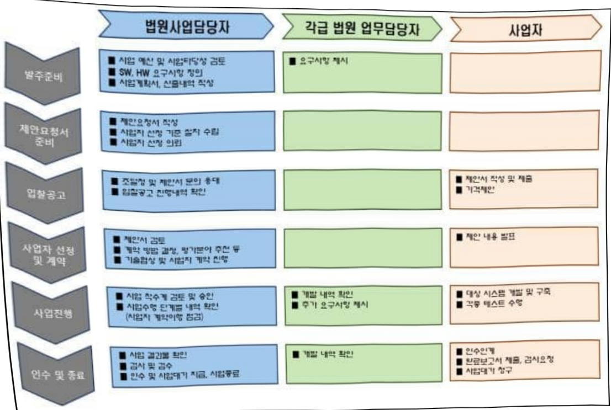

# 사법업무 전산화(정보화)

**해당 페이지**: PDF 3120 ~ 3146 쪽 해당

**부처**: 대법원
**분야**: 공공질서 및 안전
**회계유형**: 일반회계
**2026 확정예산**: 10106.0 백만원
**전년대비 증감률**: None%
**AI 도메인**: 데이터, 보안/사이버, 행정/전자정부

---

### 가. 예산 총괄표

(단위: 백만원, %)

<table border=1 style='margin: auto; word-wrap: break-word;'><tr><td rowspan="2">사업명</td><td rowspan="2">2024년 결산</td><td rowspan="2">2025년 예산 본예산(A)</td><td colspan="2">2026년</td><td rowspan="2">증감 (B-A)</td><td rowspan="2">(B-A)/A</td></tr><tr><td style='text-align: center; word-wrap: break-word;'>요구</td><td style='text-align: center; word-wrap: break-word;'>조정(B)</td></tr><tr><td style='text-align: center; word-wrap: break-word;'>사법업무전산화</td><td style='text-align: center; word-wrap: break-word;'>48,598</td><td style='text-align: center; word-wrap: break-word;'>72,740</td><td style='text-align: center; word-wrap: break-word;'>112,938</td><td style='text-align: center; word-wrap: break-word;'>82,846</td><td style='text-align: center; word-wrap: break-word;'>10,106</td><td style='text-align: center; word-wrap: break-word;'>13.9</td></tr></table>

□ 기능별(내역사업별), 목별 예산 내역

(단위:백만원)

<table border=1 style='margin: auto; word-wrap: break-word;'><tr><td rowspan="3"></td><td colspan="5">2024</td><td colspan="7">2025(25.7일말)</td><td rowspan="3">2026예산</td></tr><tr><td rowspan="2">예산액(추경)</td><td rowspan="2">예산현액</td><td rowspan="2">집행액[실집행액]</td><td rowspan="2">이일액</td><td rowspan="2">불용액</td><td rowspan="2">분예산</td><td rowspan="2">예산현액</td><td rowspan="2">집행액[실집행액]</td><td colspan="2">전년도 이일액제외</td><td rowspan="2">이일예상액</td><td rowspan="2">불용예상액</td></tr><tr><td style='text-align: center; word-wrap: break-word;'>예산현액</td><td style='text-align: center; word-wrap: break-word;'>집행액[실집행액]</td></tr><tr><td style='text-align: center; word-wrap: break-word;'>○ 기능별 분류(합계)</td><td style='text-align: center; word-wrap: break-word;'>48,980</td><td style='text-align: center; word-wrap: break-word;'>50,104</td><td style='text-align: center; word-wrap: break-word;'>48,598</td><td style='text-align: center; word-wrap: break-word;'>937</td><td style='text-align: center; word-wrap: break-word;'>569</td><td style='text-align: center; word-wrap: break-word;'>72,740</td><td style='text-align: center; word-wrap: break-word;'>73,677</td><td style='text-align: center; word-wrap: break-word;'>23,680</td><td style='text-align: center; word-wrap: break-word;'>72,740</td><td style='text-align: center; word-wrap: break-word;'>22,743</td><td style='text-align: center; word-wrap: break-word;'>-</td><td style='text-align: center; word-wrap: break-word;'>-</td><td style='text-align: center; word-wrap: break-word;'>82,846</td></tr><tr><td style='text-align: center; word-wrap: break-word;'>· 재판사무시스템 유지관리</td><td style='text-align: center; word-wrap: break-word;'>5,654</td><td style='text-align: center; word-wrap: break-word;'>5,654</td><td style='text-align: center; word-wrap: break-word;'>5,653</td><td style='text-align: center; word-wrap: break-word;'>-</td><td style='text-align: center; word-wrap: break-word;'>1</td><td style='text-align: center; word-wrap: break-word;'>-</td><td style='text-align: center; word-wrap: break-word;'>-</td><td style='text-align: center; word-wrap: break-word;'>-</td><td style='text-align: center; word-wrap: break-word;'>-</td><td style='text-align: center; word-wrap: break-word;'>-</td><td style='text-align: center; word-wrap: break-word;'>-</td><td style='text-align: center; word-wrap: break-word;'>-</td><td style='text-align: center; word-wrap: break-word;'>-</td></tr><tr><td style='text-align: center; word-wrap: break-word;'>· 재판사무시스템 기능개선</td><td style='text-align: center; word-wrap: break-word;'>400</td><td style='text-align: center; word-wrap: break-word;'>400</td><td style='text-align: center; word-wrap: break-word;'>221</td><td style='text-align: center; word-wrap: break-word;'>168</td><td style='text-align: center; word-wrap: break-word;'>11</td><td style='text-align: center; word-wrap: break-word;'>500</td><td style='text-align: center; word-wrap: break-word;'>668</td><td style='text-align: center; word-wrap: break-word;'>168</td><td style='text-align: center; word-wrap: break-word;'>500</td><td style='text-align: center; word-wrap: break-word;'>0</td><td style='text-align: center; word-wrap: break-word;'>-</td><td style='text-align: center; word-wrap: break-word;'>-</td><td style='text-align: center; word-wrap: break-word;'>6,906</td></tr><tr><td style='text-align: center; word-wrap: break-word;'>→ 사법업무시스템 기능개선</td><td style='text-align: center; word-wrap: break-word;'>500</td><td style='text-align: center; word-wrap: break-word;'>500</td><td style='text-align: center; word-wrap: break-word;'>490</td><td style='text-align: center; word-wrap: break-word;'>-</td><td style='text-align: center; word-wrap: break-word;'>10</td><td style='text-align: center; word-wrap: break-word;'>500</td><td style='text-align: center; word-wrap: break-word;'>500</td><td style='text-align: center; word-wrap: break-word;'>248</td><td style='text-align: center; word-wrap: break-word;'>500</td><td style='text-align: center; word-wrap: break-word;'>248</td><td style='text-align: center; word-wrap: break-word;'>-</td><td style='text-align: center; word-wrap: break-word;'>-</td><td style='text-align: center; word-wrap: break-word;'>500</td></tr><tr><td style='text-align: center; word-wrap: break-word;'>· 재판서 및 사건부 DB 구축</td><td style='text-align: center; word-wrap: break-word;'>320</td><td style='text-align: center; word-wrap: break-word;'>320</td><td style='text-align: center; word-wrap: break-word;'>320</td><td style='text-align: center; word-wrap: break-word;'>-</td><td style='text-align: center; word-wrap: break-word;'>-</td><td style='text-align: center; word-wrap: break-word;'>-</td><td style='text-align: center; word-wrap: break-word;'>-</td><td style='text-align: center; word-wrap: break-word;'>-</td><td style='text-align: center; word-wrap: break-word;'>-</td><td style='text-align: center; word-wrap: break-word;'>-</td><td style='text-align: center; word-wrap: break-word;'>-</td><td style='text-align: center; word-wrap: break-word;'>-</td><td style='text-align: center; word-wrap: break-word;'>-</td></tr><tr><td style='text-align: center; word-wrap: break-word;'>· 데이터 기반의 사건관리</td><td rowspan="3">392</td><td rowspan="3">392</td><td rowspan="3">392</td><td rowspan="3">-</td><td rowspan="3">-</td><td rowspan="3">-</td><td rowspan="3">-</td><td rowspan="3">-</td><td rowspan="3">-</td><td rowspan="3">-</td><td rowspan="3">-</td><td rowspan="3">-</td><td rowspan="3">-</td></tr><tr><td style='text-align: center; word-wrap: break-word;'>및 재판지원을 위한 AI분석모델 구축 ISP</td></tr><tr><td style='text-align: center; word-wrap: break-word;'>· 양형기준 운영점검시스템 및 양형정보시스템의 고도화를 위한 AI시스템 구축 BPR/ISP</td></tr><tr><td style='text-align: center; word-wrap: break-word;'>· 법원 AI플랫폼 구축 및 법률 자료 지능형 검색 모델 개발</td><td style='text-align: center; word-wrap: break-word;'>-</td><td style='text-align: center; word-wrap: break-word;'>-</td><td style='text-align: center; word-wrap: break-word;'>-</td><td style='text-align: center; word-wrap: break-word;'>-</td><td style='text-align: center; word-wrap: break-word;'>-</td><td style='text-align: center; word-wrap: break-word;'>4,706</td><td style='text-align: center; word-wrap: break-word;'>4,706</td><td style='text-align: center; word-wrap: break-word;'>0</td><td style='text-align: center; word-wrap: break-word;'>4,706</td><td style='text-align: center; word-wrap: break-word;'>0</td><td style='text-align: center; word-wrap: break-word;'>-</td><td style='text-align: center; word-wrap: break-word;'>-</td><td style='text-align: center; word-wrap: break-word;'>4,239</td></tr><tr><td style='text-align: center; word-wrap: break-word;'>· 차세대 사법부 그룹웨어 시스템 구축</td><td rowspan="4">-</td><td rowspan="4">-</td><td rowspan="4">-</td><td rowspan="4">-</td><td rowspan="4">-</td><td rowspan="4">8,565</td><td rowspan="4">8,565</td><td rowspan="4">0</td><td rowspan="4">8,565</td><td rowspan="4">0</td><td rowspan="4">-</td><td rowspan="4">-</td><td rowspan="4">6,194</td></tr><tr><td style='text-align: center; word-wrap: break-word;'>· 사법부 AI 기반 형사재판 및 양형지원을 위한 지능형 플랫폼 구축</td></tr><tr><td style='text-align: center; word-wrap: break-word;'>· 법원기록물 통합관리시스템 구축을 위한 ISP</td></tr><tr><td style='text-align: center; word-wrap: break-word;'>· 법관연수관리시스템 구축 BPR/ISP</td></tr><tr><td style='text-align: center; word-wrap: break-word;'>· 사법행정시스템 유지관리</td><td style='text-align: center; word-wrap: break-word;'>2,068</td><td style='text-align: center; word-wrap: break-word;'>2,068</td><td style='text-align: center; word-wrap: break-word;'>2,055</td><td style='text-align: center; word-wrap: break-word;'>-</td><td style='text-align: center; word-wrap: break-word;'>13</td><td style='text-align: center; word-wrap: break-word;'>-</td><td style='text-align: center; word-wrap: break-word;'>-</td><td style='text-align: center; word-wrap: break-word;'>-</td><td style='text-align: center; word-wrap: break-word;'>-</td><td style='text-align: center; word-wrap: break-word;'>-</td><td style='text-align: center; word-wrap: break-word;'>-</td><td style='text-align: center; word-wrap: break-word;'>-</td><td style='text-align: center; word-wrap: break-word;'>192</td></tr><tr><td style='text-align: center; word-wrap: break-word;'>· 사법행정시스템 기능개선</td><td rowspan="2">600</td><td rowspan="2">1,105</td><td rowspan="2">708</td><td rowspan="2">388</td><td rowspan="2">9</td><td rowspan="2">1,571</td><td rowspan="2">1,959</td><td rowspan="2">388</td><td rowspan="2">1,571</td><td rowspan="2">0</td><td rowspan="2">-</td><td rowspan="2">-</td><td rowspan="2">266</td></tr><tr><td style='text-align: center; word-wrap: break-word;'>→ 사법업무시스템 기능개선</td></tr></table>

---

<table border=1 style='margin: auto; word-wrap: break-word;'><tr><td rowspan="3"></td><td colspan="5">2024</td><td colspan="7">2025(25.7일말)</td><td rowspan="3">2026예산</td></tr><tr><td rowspan="2">예산액(추경)</td><td rowspan="2">예산현액</td><td rowspan="2">집행액[실집행액]</td><td rowspan="2">이일액</td><td rowspan="2">불용액</td><td rowspan="2">본예산</td><td rowspan="2">예산현액</td><td rowspan="2">집행액[실집행액]</td><td colspan="2">전년도 이일액제외</td><td rowspan="2">이일예상액</td><td rowspan="2">불용예상액</td></tr><tr><td style='text-align: center; word-wrap: break-word;'>예산현액</td><td style='text-align: center; word-wrap: break-word;'>집행액[실집행액]</td></tr><tr><td style='text-align: center; word-wrap: break-word;'>·정보보안·전설팅</td><td style='text-align: center; word-wrap: break-word;'>155</td><td style='text-align: center; word-wrap: break-word;'>155</td><td style='text-align: center; word-wrap: break-word;'>153</td><td style='text-align: center; word-wrap: break-word;'>-</td><td style='text-align: center; word-wrap: break-word;'>2</td><td style='text-align: center; word-wrap: break-word;'>257</td><td style='text-align: center; word-wrap: break-word;'>257</td><td style='text-align: center; word-wrap: break-word;'>0</td><td style='text-align: center; word-wrap: break-word;'>257</td><td style='text-align: center; word-wrap: break-word;'>0</td><td style='text-align: center; word-wrap: break-word;'>-</td><td style='text-align: center; word-wrap: break-word;'>-</td><td style='text-align: center; word-wrap: break-word;'>289</td></tr><tr><td style='text-align: center; word-wrap: break-word;'>·시스템 및 보안편제 등 운영</td><td style='text-align: center; word-wrap: break-word;'>2,959</td><td style='text-align: center; word-wrap: break-word;'>3,302</td><td style='text-align: center; word-wrap: break-word;'>3,296</td><td style='text-align: center; word-wrap: break-word;'>-</td><td style='text-align: center; word-wrap: break-word;'>6</td><td style='text-align: center; word-wrap: break-word;'>-</td><td style='text-align: center; word-wrap: break-word;'>-</td><td style='text-align: center; word-wrap: break-word;'>-</td><td style='text-align: center; word-wrap: break-word;'>-</td><td style='text-align: center; word-wrap: break-word;'>-</td><td style='text-align: center; word-wrap: break-word;'>-</td><td style='text-align: center; word-wrap: break-word;'>-</td><td style='text-align: center; word-wrap: break-word;'>-</td></tr><tr><td style='text-align: center; word-wrap: break-word;'>·데이터센터 전산정비 유지보수</td><td style='text-align: center; word-wrap: break-word;'>5,062</td><td style='text-align: center; word-wrap: break-word;'>5,062</td><td style='text-align: center; word-wrap: break-word;'>5,019</td><td style='text-align: center; word-wrap: break-word;'>-</td><td style='text-align: center; word-wrap: break-word;'>43</td><td style='text-align: center; word-wrap: break-word;'>-</td><td style='text-align: center; word-wrap: break-word;'>-</td><td style='text-align: center; word-wrap: break-word;'>-</td><td style='text-align: center; word-wrap: break-word;'>-</td><td style='text-align: center; word-wrap: break-word;'>-</td><td style='text-align: center; word-wrap: break-word;'>-</td><td style='text-align: center; word-wrap: break-word;'>-</td><td style='text-align: center; word-wrap: break-word;'>-</td></tr><tr><td style='text-align: center; word-wrap: break-word;'>·노후 보안정비/전산정비 교체</td><td style='text-align: center; word-wrap: break-word;'>4,309</td><td style='text-align: center; word-wrap: break-word;'>4,041</td><td style='text-align: center; word-wrap: break-word;'>4,003</td><td style='text-align: center; word-wrap: break-word;'>-</td><td style='text-align: center; word-wrap: break-word;'>38</td><td style='text-align: center; word-wrap: break-word;'>6,346</td><td style='text-align: center; word-wrap: break-word;'>6,346</td><td style='text-align: center; word-wrap: break-word;'>2,698</td><td style='text-align: center; word-wrap: break-word;'>6,346</td><td style='text-align: center; word-wrap: break-word;'>2,698</td><td style='text-align: center; word-wrap: break-word;'>-</td><td style='text-align: center; word-wrap: break-word;'>-</td><td style='text-align: center; word-wrap: break-word;'>6,811</td></tr><tr><td style='text-align: center; word-wrap: break-word;'>·신규 보안정비/전산정비 확충</td><td style='text-align: center; word-wrap: break-word;'>1,451</td><td style='text-align: center; word-wrap: break-word;'>1,627</td><td style='text-align: center; word-wrap: break-word;'>1,612</td><td style='text-align: center; word-wrap: break-word;'>-</td><td style='text-align: center; word-wrap: break-word;'>15</td><td style='text-align: center; word-wrap: break-word;'>2,879</td><td style='text-align: center; word-wrap: break-word;'>2,879</td><td style='text-align: center; word-wrap: break-word;'>578</td><td style='text-align: center; word-wrap: break-word;'>2,879</td><td style='text-align: center; word-wrap: break-word;'>578</td><td style='text-align: center; word-wrap: break-word;'>-</td><td style='text-align: center; word-wrap: break-word;'>-</td><td style='text-align: center; word-wrap: break-word;'>3,018</td></tr><tr><td style='text-align: center; word-wrap: break-word;'>·사법부 망분리 구축 운영</td><td style='text-align: center; word-wrap: break-word;'>3,388</td><td style='text-align: center; word-wrap: break-word;'>3,167</td><td style='text-align: center; word-wrap: break-word;'>3,164</td><td style='text-align: center; word-wrap: break-word;'>-</td><td style='text-align: center; word-wrap: break-word;'>3</td><td style='text-align: center; word-wrap: break-word;'>3,430</td><td style='text-align: center; word-wrap: break-word;'>3,430</td><td style='text-align: center; word-wrap: break-word;'>1,531</td><td style='text-align: center; word-wrap: break-word;'>3,430</td><td style='text-align: center; word-wrap: break-word;'>1,531</td><td style='text-align: center; word-wrap: break-word;'>-</td><td style='text-align: center; word-wrap: break-word;'>-</td><td style='text-align: center; word-wrap: break-word;'>3,794</td></tr><tr><td style='text-align: center; word-wrap: break-word;'>·사법정보시스템 감리</td><td style='text-align: center; word-wrap: break-word;'>150</td><td style='text-align: center; word-wrap: break-word;'>150</td><td style='text-align: center; word-wrap: break-word;'>146</td><td style='text-align: center; word-wrap: break-word;'>-</td><td style='text-align: center; word-wrap: break-word;'>4</td><td style='text-align: center; word-wrap: break-word;'>200</td><td style='text-align: center; word-wrap: break-word;'>200</td><td style='text-align: center; word-wrap: break-word;'>0</td><td style='text-align: center; word-wrap: break-word;'>200</td><td style='text-align: center; word-wrap: break-word;'>0</td><td style='text-align: center; word-wrap: break-word;'>-</td><td style='text-align: center; word-wrap: break-word;'>-</td><td style='text-align: center; word-wrap: break-word;'>200</td></tr><tr><td style='text-align: center; word-wrap: break-word;'>·공공요금</td><td style='text-align: center; word-wrap: break-word;'>3,060</td><td style='text-align: center; word-wrap: break-word;'>2,854</td><td style='text-align: center; word-wrap: break-word;'>2,844</td><td style='text-align: center; word-wrap: break-word;'>-</td><td style='text-align: center; word-wrap: break-word;'>10</td><td style='text-align: center; word-wrap: break-word;'>3,144</td><td style='text-align: center; word-wrap: break-word;'>3,144</td><td style='text-align: center; word-wrap: break-word;'>1,490</td><td style='text-align: center; word-wrap: break-word;'>3,144</td><td style='text-align: center; word-wrap: break-word;'>1,490</td><td style='text-align: center; word-wrap: break-word;'>-</td><td style='text-align: center; word-wrap: break-word;'>-</td><td style='text-align: center; word-wrap: break-word;'>4,945</td></tr><tr><td style='text-align: center; word-wrap: break-word;'>·기타 운영지원</td><td style='text-align: center; word-wrap: break-word;'>808</td><td style='text-align: center; word-wrap: break-word;'>1,008</td><td style='text-align: center; word-wrap: break-word;'>923</td><td style='text-align: center; word-wrap: break-word;'>3</td><td style='text-align: center; word-wrap: break-word;'>81</td><td style='text-align: center; word-wrap: break-word;'>868</td><td style='text-align: center; word-wrap: break-word;'>871</td><td style='text-align: center; word-wrap: break-word;'>367</td><td style='text-align: center; word-wrap: break-word;'>868</td><td style='text-align: center; word-wrap: break-word;'>364</td><td style='text-align: center; word-wrap: break-word;'>-</td><td style='text-align: center; word-wrap: break-word;'>-</td><td style='text-align: center; word-wrap: break-word;'>868</td></tr><tr><td style='text-align: center; word-wrap: break-word;'>·대법원 전산정보센터 ups 이중화 구성</td><td style='text-align: center; word-wrap: break-word;'>216</td><td style='text-align: center; word-wrap: break-word;'>189</td><td style='text-align: center; word-wrap: break-word;'>188</td><td style='text-align: center; word-wrap: break-word;'>-</td><td style='text-align: center; word-wrap: break-word;'>1</td><td style='text-align: center; word-wrap: break-word;'>216</td><td style='text-align: center; word-wrap: break-word;'>216</td><td style='text-align: center; word-wrap: break-word;'>95</td><td style='text-align: center; word-wrap: break-word;'>216</td><td style='text-align: center; word-wrap: break-word;'>95</td><td style='text-align: center; word-wrap: break-word;'>-</td><td style='text-align: center; word-wrap: break-word;'>-</td><td style='text-align: center; word-wrap: break-word;'>143</td></tr><tr><td style='text-align: center; word-wrap: break-word;'>·대법원 전산정보센터 노후 ups 교체</td><td style='text-align: center; word-wrap: break-word;'>477</td><td style='text-align: center; word-wrap: break-word;'>477</td><td style='text-align: center; word-wrap: break-word;'>444</td><td style='text-align: center; word-wrap: break-word;'>-</td><td style='text-align: center; word-wrap: break-word;'>33</td><td style='text-align: center; word-wrap: break-word;'>196</td><td style='text-align: center; word-wrap: break-word;'>196</td><td style='text-align: center; word-wrap: break-word;'>132</td><td style='text-align: center; word-wrap: break-word;'>196</td><td style='text-align: center; word-wrap: break-word;'>132</td><td style='text-align: center; word-wrap: break-word;'>-</td><td style='text-align: center; word-wrap: break-word;'>-</td><td style='text-align: center; word-wrap: break-word;'>177</td></tr><tr><td style='text-align: center; word-wrap: break-word;'>·데이터센터 기반설비 인프라 진단 연구 기술용역</td><td style='text-align: center; word-wrap: break-word;'>33</td><td style='text-align: center; word-wrap: break-word;'>28</td><td style='text-align: center; word-wrap: break-word;'>22</td><td style='text-align: center; word-wrap: break-word;'>-</td><td style='text-align: center; word-wrap: break-word;'>7</td><td style='text-align: center; word-wrap: break-word;'>-</td><td style='text-align: center; word-wrap: break-word;'>-</td><td style='text-align: center; word-wrap: break-word;'>-</td><td style='text-align: center; word-wrap: break-word;'>-</td><td style='text-align: center; word-wrap: break-word;'>-</td><td style='text-align: center; word-wrap: break-word;'>-</td><td style='text-align: center; word-wrap: break-word;'>-</td><td style='text-align: center; word-wrap: break-word;'>-</td></tr><tr><td style='text-align: center; word-wrap: break-word;'>·사법부 지능형 보안운영체계 구축 ISP</td><td style='text-align: center; word-wrap: break-word;'>-</td><td style='text-align: center; word-wrap: break-word;'>-</td><td style='text-align: center; word-wrap: break-word;'>-</td><td style='text-align: center; word-wrap: break-word;'>-</td><td style='text-align: center; word-wrap: break-word;'>-</td><td style='text-align: center; word-wrap: break-word;'>232</td><td style='text-align: center; word-wrap: break-word;'>232</td><td style='text-align: center; word-wrap: break-word;'>0</td><td style='text-align: center; word-wrap: break-word;'>232</td><td style='text-align: center; word-wrap: break-word;'>0</td><td style='text-align: center; word-wrap: break-word;'>-</td><td style='text-align: center; word-wrap: break-word;'>-</td><td style='text-align: center; word-wrap: break-word;'>-</td></tr><tr><td style='text-align: center; word-wrap: break-word;'>·대법원 전산정보센터 노후 변압기 교체</td><td style='text-align: center; word-wrap: break-word;'>-</td><td style='text-align: center; word-wrap: break-word;'>-</td><td style='text-align: center; word-wrap: break-word;'>-</td><td style='text-align: center; word-wrap: break-word;'>-</td><td style='text-align: center; word-wrap: break-word;'>-</td><td style='text-align: center; word-wrap: break-word;'>-</td><td style='text-align: center; word-wrap: break-word;'>-</td><td style='text-align: center; word-wrap: break-word;'>-</td><td style='text-align: center; word-wrap: break-word;'>-</td><td style='text-align: center; word-wrap: break-word;'>-</td><td style='text-align: center; word-wrap: break-word;'>-</td><td style='text-align: center; word-wrap: break-word;'>-</td><td style='text-align: center; word-wrap: break-word;'>600</td></tr><tr><td style='text-align: center; word-wrap: break-word;'>·대법원 전산정보센터 노후 터보냉동기 교체</td><td style='text-align: center; word-wrap: break-word;'>-</td><td style='text-align: center; word-wrap: break-word;'>-</td><td style='text-align: center; word-wrap: break-word;'>-</td><td style='text-align: center; word-wrap: break-word;'>-</td><td style='text-align: center; word-wrap: break-word;'>-</td><td style='text-align: center; word-wrap: break-word;'>-</td><td style='text-align: center; word-wrap: break-word;'>-</td><td style='text-align: center; word-wrap: break-word;'>-</td><td style='text-align: center; word-wrap: break-word;'>-</td><td style='text-align: center; word-wrap: break-word;'>-</td><td style='text-align: center; word-wrap: break-word;'>-</td><td style='text-align: center; word-wrap: break-word;'>-</td><td style='text-align: center; word-wrap: break-word;'>529</td></tr><tr><td style='text-align: center; word-wrap: break-word;'>·각급 법원 전산망 구축</td><td style='text-align: center; word-wrap: break-word;'>4,156</td><td style='text-align: center; word-wrap: break-word;'>3,980</td><td style='text-align: center; word-wrap: break-word;'>3,922</td><td style='text-align: center; word-wrap: break-word;'>-</td><td style='text-align: center; word-wrap: break-word;'>58</td><td style='text-align: center; word-wrap: break-word;'>1,009</td><td style='text-align: center; word-wrap: break-word;'>1,009</td><td style='text-align: center; word-wrap: break-word;'>252</td><td style='text-align: center; word-wrap: break-word;'>1,009</td><td style='text-align: center; word-wrap: break-word;'>252</td><td style='text-align: center; word-wrap: break-word;'>-</td><td style='text-align: center; word-wrap: break-word;'>-</td><td style='text-align: center; word-wrap: break-word;'>1,686</td></tr><tr><td style='text-align: center; word-wrap: break-word;'>·전자법정 구축 운영→ 노후 전자법정 개선</td><td style='text-align: center; word-wrap: break-word;'>4,138</td><td style='text-align: center; word-wrap: break-word;'>4,249</td><td style='text-align: center; word-wrap: break-word;'>3,885</td><td style='text-align: center; word-wrap: break-word;'>190</td><td style='text-align: center; word-wrap: break-word;'>174</td><td style='text-align: center; word-wrap: break-word;'>3,005</td><td style='text-align: center; word-wrap: break-word;'>3,195</td><td style='text-align: center; word-wrap: break-word;'>1,779</td><td style='text-align: center; word-wrap: break-word;'>3,005</td><td style='text-align: center; word-wrap: break-word;'>1,589</td><td style='text-align: center; word-wrap: break-word;'>-</td><td style='text-align: center; word-wrap: break-word;'>-</td><td style='text-align: center; word-wrap: break-word;'>1,205</td></tr><tr><td style='text-align: center; word-wrap: break-word;'>·노후 사무용 전산정비 교체</td><td style='text-align: center; word-wrap: break-word;'>3,771</td><td style='text-align: center; word-wrap: break-word;'>3,771</td><td style='text-align: center; word-wrap: break-word;'>3,765</td><td style='text-align: center; word-wrap: break-word;'>-</td><td style='text-align: center; word-wrap: break-word;'>6</td><td style='text-align: center; word-wrap: break-word;'>7,391</td><td style='text-align: center; word-wrap: break-word;'>7,391</td><td style='text-align: center; word-wrap: break-word;'>4268</td><td style='text-align: center; word-wrap: break-word;'>7,391</td><td style='text-align: center; word-wrap: break-word;'>4,268</td><td style='text-align: center; word-wrap: break-word;'>-</td><td style='text-align: center; word-wrap: break-word;'>-</td><td style='text-align: center; word-wrap: break-word;'>7,967</td></tr><tr><td style='text-align: center; word-wrap: break-word;'>·업무용 전산정비 및 소프트웨어 구입→ 신규 사무용 전산정비 및 소프트웨어 구입</td><td style='text-align: center; word-wrap: break-word;'>2,596</td><td style='text-align: center; word-wrap: break-word;'>2,596</td><td style='text-align: center; word-wrap: break-word;'>2,579</td><td style='text-align: center; word-wrap: break-word;'>11</td><td style='text-align: center; word-wrap: break-word;'>6</td><td style='text-align: center; word-wrap: break-word;'>2,576</td><td style='text-align: center; word-wrap: break-word;'>2,587</td><td style='text-align: center; word-wrap: break-word;'>1,008</td><td style='text-align: center; word-wrap: break-word;'>2,576</td><td style='text-align: center; word-wrap: break-word;'>997</td><td style='text-align: center; word-wrap: break-word;'>-</td><td style='text-align: center; word-wrap: break-word;'>-</td><td style='text-align: center; word-wrap: break-word;'>2,099</td></tr><tr><td style='text-align: center; word-wrap: break-word;'>·영상재판화상회의 등 관련 시스템 구축</td><td style='text-align: center; word-wrap: break-word;'>558</td><td style='text-align: center; word-wrap: break-word;'>1,148</td><td style='text-align: center; word-wrap: break-word;'>967</td><td style='text-align: center; word-wrap: break-word;'>177</td><td style='text-align: center; word-wrap: break-word;'>4</td><td style='text-align: center; word-wrap: break-word;'>1,066</td><td style='text-align: center; word-wrap: break-word;'>1,243</td><td style='text-align: center; word-wrap: break-word;'>190</td><td style='text-align: center; word-wrap: break-word;'>1,066</td><td style='text-align: center; word-wrap: break-word;'>13</td><td style='text-align: center; word-wrap: break-word;'>-</td><td style='text-align: center; word-wrap: break-word;'>-</td><td style='text-align: center; word-wrap: break-word;'>660</td></tr><tr><td style='text-align: center; word-wrap: break-word;'>·영상재판화상회의 등 관련 시스템 운영</td><td style='text-align: center; word-wrap: break-word;'>1,759</td><td style='text-align: center; word-wrap: break-word;'>1,861</td><td style='text-align: center; word-wrap: break-word;'>1,827</td><td style='text-align: center; word-wrap: break-word;'>-</td><td style='text-align: center; word-wrap: break-word;'>34</td><td style='text-align: center; word-wrap: break-word;'>-</td><td style='text-align: center; word-wrap: break-word;'>-</td><td style='text-align: center; word-wrap: break-word;'>-</td><td style='text-align: center; word-wrap: break-word;'>-</td><td style='text-align: center; word-wrap: break-word;'>-</td><td style='text-align: center; word-wrap: break-word;'>-</td><td style='text-align: center; word-wrap: break-word;'>-</td><td style='text-align: center; word-wrap: break-word;'>-</td></tr><tr><td style='text-align: center; word-wrap: break-word;'>·데이터센터 전산정비 운영</td><td style='text-align: center; word-wrap: break-word;'>-</td><td style='text-align: center; word-wrap: break-word;'>-</td><td style='text-align: center; word-wrap: break-word;'>-</td><td style='text-align: center; word-wrap: break-word;'>-</td><td style='text-align: center; word-wrap: break-word;'>-</td><td style='text-align: center; word-wrap: break-word;'>1,539</td><td style='text-align: center; word-wrap: break-word;'>1,539</td><td style='text-align: center; word-wrap: break-word;'>702</td><td style='text-align: center; word-wrap: break-word;'>1,539</td><td style='text-align: center; word-wrap: break-word;'>702</td><td style='text-align: center; word-wrap: break-word;'>-</td><td style='text-align: center; word-wrap: break-word;'>-</td><td style='text-align: center; word-wrap: break-word;'>1,348</td></tr><tr><td style='text-align: center; word-wrap: break-word;'>·보안관제 운영</td><td style='text-align: center; word-wrap: break-word;'>-</td><td style='text-align: center; word-wrap: break-word;'>-</td><td style='text-align: center; word-wrap: break-word;'>-</td><td style='text-align: center; word-wrap: break-word;'>-</td><td style='text-align: center; word-wrap: break-word;'>-</td><td style='text-align: center; word-wrap: break-word;'>555</td><td style='text-align: center; word-wrap: break-word;'>555</td><td style='text-align: center; word-wrap: break-word;'>305</td><td style='text-align: center; word-wrap: break-word;'>555</td><td style='text-align: center; word-wrap: break-word;'>305</td><td style='text-align: center; word-wrap: break-word;'>-</td><td style='text-align: center; word-wrap: break-word;'>-</td><td style='text-align: center; word-wrap: break-word;'>555</td></tr><tr><td style='text-align: center; word-wrap: break-word;'>·사용자지원센터 운영</td><td style='text-align: center; word-wrap: break-word;'>-</td><td style='text-align: center; word-wrap: break-word;'>-</td><td style='text-align: center; word-wrap: break-word;'>-</td><td style='text-align: center; word-wrap: break-word;'>-</td><td style='text-align: center; word-wrap: break-word;'>-</td><td style='text-align: center; word-wrap: break-word;'>781</td><td style='text-align: center; word-wrap: break-word;'>781</td><td style='text-align: center; word-wrap: break-word;'>465</td><td style='text-align: center; word-wrap: break-word;'>781</td><td style='text-align: center; word-wrap: break-word;'>465</td><td style='text-align: center; word-wrap: break-word;'>-</td><td style='text-align: center; word-wrap: break-word;'>-</td><td style='text-align: center; word-wrap: break-word;'>781</td></tr><tr><td style='text-align: center; word-wrap: break-word;'>·사법업무시스템 유지관리</td><td style='text-align: center; word-wrap: break-word;'>-</td><td style='text-align: center; word-wrap: break-word;'>-</td><td style='text-align: center; word-wrap: break-word;'>-</td><td style='text-align: center; word-wrap: break-word;'>-</td><td style='text-align: center; word-wrap: break-word;'>-</td><td style='text-align: center; word-wrap: break-word;'>4,209</td><td style='text-align: center; word-wrap: break-word;'>4,209</td><td style='text-align: center; word-wrap: break-word;'>1,546</td><td style='text-align: center; word-wrap: break-word;'>4,209</td><td style='text-align: center; word-wrap: break-word;'>1,546</td><td style='text-align: center; word-wrap: break-word;'>-</td><td style='text-align: center; word-wrap: break-word;'>-</td><td style='text-align: center; word-wrap: break-word;'>4,191</td></tr></table>

---

<table border=1 style='margin: auto; word-wrap: break-word;'><tr><td rowspan="3"></td><td colspan="5">2024</td><td colspan="7">2025(25.7월말)</td><td rowspan="3">2026예산</td></tr><tr><td rowspan="2">예산액(추경)</td><td rowspan="2">예산현액</td><td rowspan="2">집행액[실집행액]</td><td rowspan="2">이월액</td><td rowspan="2">불용액</td><td rowspan="2">본예산</td><td rowspan="2">예산현액</td><td rowspan="2">집행액[실집행액]</td><td colspan="2">전년도 이월액제외</td><td rowspan="2">이월예상액</td><td rowspan="2">불용예상액</td></tr><tr><td style='text-align: center; word-wrap: break-word;'>예산현액</td><td style='text-align: center; word-wrap: break-word;'>집행액[실집행액]</td></tr><tr><td style='text-align: center; word-wrap: break-word;'>·데이터센터 전산장비 유지보수</td><td style='text-align: center; word-wrap: break-word;'>-</td><td style='text-align: center; word-wrap: break-word;'>-</td><td style='text-align: center; word-wrap: break-word;'>-</td><td style='text-align: center; word-wrap: break-word;'>-</td><td style='text-align: center; word-wrap: break-word;'>-</td><td style='text-align: center; word-wrap: break-word;'>8,708</td><td style='text-align: center; word-wrap: break-word;'>8,708</td><td style='text-align: center; word-wrap: break-word;'>1,621</td><td style='text-align: center; word-wrap: break-word;'>8,708</td><td style='text-align: center; word-wrap: break-word;'>1,621</td><td style='text-align: center; word-wrap: break-word;'>-</td><td style='text-align: center; word-wrap: break-word;'>-</td><td style='text-align: center; word-wrap: break-word;'>7,705</td></tr><tr><td style='text-align: center; word-wrap: break-word;'>·각급법원 전산장비 운영 및 유지보수</td><td style='text-align: center; word-wrap: break-word;'>-</td><td style='text-align: center; word-wrap: break-word;'>-</td><td style='text-align: center; word-wrap: break-word;'>-</td><td style='text-align: center; word-wrap: break-word;'>-</td><td style='text-align: center; word-wrap: break-word;'>-</td><td style='text-align: center; word-wrap: break-word;'>8,291</td><td style='text-align: center; word-wrap: break-word;'>8,291</td><td style='text-align: center; word-wrap: break-word;'>3,848</td><td style='text-align: center; word-wrap: break-word;'>8,291</td><td style='text-align: center; word-wrap: break-word;'>3,848</td><td style='text-align: center; word-wrap: break-word;'>-</td><td style='text-align: center; word-wrap: break-word;'>-</td><td style='text-align: center; word-wrap: break-word;'>8,400</td></tr><tr><td style='text-align: center; word-wrap: break-word;'>○ 비목별 분류(합계)</td><td style='text-align: center; word-wrap: break-word;'>48,980</td><td style='text-align: center; word-wrap: break-word;'>50,104</td><td style='text-align: center; word-wrap: break-word;'>48,598</td><td style='text-align: center; word-wrap: break-word;'>937</td><td style='text-align: center; word-wrap: break-word;'>569</td><td style='text-align: center; word-wrap: break-word;'>72,740</td><td style='text-align: center; word-wrap: break-word;'>73,677</td><td style='text-align: center; word-wrap: break-word;'>23,680</td><td style='text-align: center; word-wrap: break-word;'>72,740</td><td style='text-align: center; word-wrap: break-word;'>22,743</td><td style='text-align: center; word-wrap: break-word;'>-</td><td style='text-align: center; word-wrap: break-word;'>-</td><td style='text-align: center; word-wrap: break-word;'>82,846</td></tr><tr><td style='text-align: center; word-wrap: break-word;'>·일용임금(110-04)</td><td style='text-align: center; word-wrap: break-word;'>9</td><td style='text-align: center; word-wrap: break-word;'>9</td><td style='text-align: center; word-wrap: break-word;'>8</td><td style='text-align: center; word-wrap: break-word;'>-</td><td style='text-align: center; word-wrap: break-word;'>1</td><td style='text-align: center; word-wrap: break-word;'>13</td><td style='text-align: center; word-wrap: break-word;'>13</td><td style='text-align: center; word-wrap: break-word;'>-</td><td style='text-align: center; word-wrap: break-word;'>13</td><td style='text-align: center; word-wrap: break-word;'>-</td><td style='text-align: center; word-wrap: break-word;'>-</td><td style='text-align: center; word-wrap: break-word;'>-</td><td style='text-align: center; word-wrap: break-word;'>13</td></tr><tr><td style='text-align: center; word-wrap: break-word;'>·일반수용비(210-01)</td><td style='text-align: center; word-wrap: break-word;'>319</td><td style='text-align: center; word-wrap: break-word;'>569</td><td style='text-align: center; word-wrap: break-word;'>555</td><td style='text-align: center; word-wrap: break-word;'>3</td><td style='text-align: center; word-wrap: break-word;'>10</td><td style='text-align: center; word-wrap: break-word;'>329</td><td style='text-align: center; word-wrap: break-word;'>332</td><td style='text-align: center; word-wrap: break-word;'>101</td><td style='text-align: center; word-wrap: break-word;'>329</td><td style='text-align: center; word-wrap: break-word;'>98</td><td style='text-align: center; word-wrap: break-word;'>-</td><td style='text-align: center; word-wrap: break-word;'>-</td><td style='text-align: center; word-wrap: break-word;'>329</td></tr><tr><td style='text-align: center; word-wrap: break-word;'>·공공요금 및 제세(210-02)</td><td style='text-align: center; word-wrap: break-word;'>3,060</td><td style='text-align: center; word-wrap: break-word;'>2,854</td><td style='text-align: center; word-wrap: break-word;'>2,844</td><td style='text-align: center; word-wrap: break-word;'>-</td><td style='text-align: center; word-wrap: break-word;'>10</td><td style='text-align: center; word-wrap: break-word;'>3,144</td><td style='text-align: center; word-wrap: break-word;'>3,144</td><td style='text-align: center; word-wrap: break-word;'>1,490</td><td style='text-align: center; word-wrap: break-word;'>3,144</td><td style='text-align: center; word-wrap: break-word;'>1,490</td><td style='text-align: center; word-wrap: break-word;'>-</td><td style='text-align: center; word-wrap: break-word;'>-</td><td style='text-align: center; word-wrap: break-word;'>4,987</td></tr><tr><td style='text-align: center; word-wrap: break-word;'>·특근매식비(210-05)</td><td style='text-align: center; word-wrap: break-word;'>10</td><td style='text-align: center; word-wrap: break-word;'>10</td><td style='text-align: center; word-wrap: break-word;'>10</td><td style='text-align: center; word-wrap: break-word;'>-</td><td style='text-align: center; word-wrap: break-word;'>-</td><td style='text-align: center; word-wrap: break-word;'>10</td><td style='text-align: center; word-wrap: break-word;'>10</td><td style='text-align: center; word-wrap: break-word;'>6</td><td style='text-align: center; word-wrap: break-word;'>10</td><td style='text-align: center; word-wrap: break-word;'>6</td><td style='text-align: center; word-wrap: break-word;'>-</td><td style='text-align: center; word-wrap: break-word;'>-</td><td style='text-align: center; word-wrap: break-word;'>10</td></tr><tr><td style='text-align: center; word-wrap: break-word;'>·임차료(210-07)</td><td style='text-align: center; word-wrap: break-word;'>12,167</td><td style='text-align: center; word-wrap: break-word;'>11,647</td><td style='text-align: center; word-wrap: break-word;'>11,571</td><td style='text-align: center; word-wrap: break-word;'>-</td><td style='text-align: center; word-wrap: break-word;'>76</td><td style='text-align: center; word-wrap: break-word;'>19,059</td><td style='text-align: center; word-wrap: break-word;'>19,059</td><td style='text-align: center; word-wrap: break-word;'>9,358</td><td style='text-align: center; word-wrap: break-word;'>19,059</td><td style='text-align: center; word-wrap: break-word;'>9,358</td><td style='text-align: center; word-wrap: break-word;'>-</td><td style='text-align: center; word-wrap: break-word;'>-</td><td style='text-align: center; word-wrap: break-word;'>21,196</td></tr><tr><td style='text-align: center; word-wrap: break-word;'>·시설장비유지비(210-09)</td><td style='text-align: center; word-wrap: break-word;'>355</td><td style='text-align: center; word-wrap: break-word;'>360</td><td style='text-align: center; word-wrap: break-word;'>297</td><td style='text-align: center; word-wrap: break-word;'>-</td><td style='text-align: center; word-wrap: break-word;'>63</td><td style='text-align: center; word-wrap: break-word;'>395</td><td style='text-align: center; word-wrap: break-word;'>395</td><td style='text-align: center; word-wrap: break-word;'>241</td><td style='text-align: center; word-wrap: break-word;'>395</td><td style='text-align: center; word-wrap: break-word;'>241</td><td style='text-align: center; word-wrap: break-word;'>-</td><td style='text-align: center; word-wrap: break-word;'>-</td><td style='text-align: center; word-wrap: break-word;'>395</td></tr><tr><td style='text-align: center; word-wrap: break-word;'>·관리용역비(210-15)</td><td style='text-align: center; word-wrap: break-word;'>23,539</td><td style='text-align: center; word-wrap: break-word;'>23,982</td><td style='text-align: center; word-wrap: break-word;'>23,856</td><td style='text-align: center; word-wrap: break-word;'>-</td><td style='text-align: center; word-wrap: break-word;'>126</td><td style='text-align: center; word-wrap: break-word;'>24,083</td><td style='text-align: center; word-wrap: break-word;'>24,083</td><td style='text-align: center; word-wrap: break-word;'>8,487</td><td style='text-align: center; word-wrap: break-word;'>24,083</td><td style='text-align: center; word-wrap: break-word;'>8,487</td><td style='text-align: center; word-wrap: break-word;'>-</td><td style='text-align: center; word-wrap: break-word;'>-</td><td style='text-align: center; word-wrap: break-word;'>22,980</td></tr><tr><td style='text-align: center; word-wrap: break-word;'>·국내여비(220-01)</td><td style='text-align: center; word-wrap: break-word;'>5</td><td style='text-align: center; word-wrap: break-word;'>5</td><td style='text-align: center; word-wrap: break-word;'>5</td><td style='text-align: center; word-wrap: break-word;'>-</td><td style='text-align: center; word-wrap: break-word;'>-</td><td style='text-align: center; word-wrap: break-word;'>5</td><td style='text-align: center; word-wrap: break-word;'>5</td><td style='text-align: center; word-wrap: break-word;'>-</td><td style='text-align: center; word-wrap: break-word;'>5</td><td style='text-align: center; word-wrap: break-word;'>-</td><td style='text-align: center; word-wrap: break-word;'>-</td><td style='text-align: center; word-wrap: break-word;'>-</td><td style='text-align: center; word-wrap: break-word;'>5</td></tr><tr><td style='text-align: center; word-wrap: break-word;'>·국외업무여비(220-02)</td><td style='text-align: center; word-wrap: break-word;'>9</td><td style='text-align: center; word-wrap: break-word;'>9</td><td style='text-align: center; word-wrap: break-word;'>6</td><td style='text-align: center; word-wrap: break-word;'>-</td><td style='text-align: center; word-wrap: break-word;'>3</td><td style='text-align: center; word-wrap: break-word;'>15</td><td style='text-align: center; word-wrap: break-word;'>15</td><td style='text-align: center; word-wrap: break-word;'>-</td><td style='text-align: center; word-wrap: break-word;'>15</td><td style='text-align: center; word-wrap: break-word;'>-</td><td style='text-align: center; word-wrap: break-word;'>-</td><td style='text-align: center; word-wrap: break-word;'>-</td><td style='text-align: center; word-wrap: break-word;'>15</td></tr><tr><td style='text-align: center; word-wrap: break-word;'>·일반연구비(260-01)</td><td style='text-align: center; word-wrap: break-word;'>2,550</td><td style='text-align: center; word-wrap: break-word;'>3,216</td><td style='text-align: center; word-wrap: break-word;'>2,618</td><td style='text-align: center; word-wrap: break-word;'>556</td><td style='text-align: center; word-wrap: break-word;'>42</td><td style='text-align: center; word-wrap: break-word;'>5,303</td><td style='text-align: center; word-wrap: break-word;'>5,859</td><td style='text-align: center; word-wrap: break-word;'>823</td><td style='text-align: center; word-wrap: break-word;'>5,303</td><td style='text-align: center; word-wrap: break-word;'>267</td><td style='text-align: center; word-wrap: break-word;'>-</td><td style='text-align: center; word-wrap: break-word;'>-</td><td style='text-align: center; word-wrap: break-word;'>15,794</td></tr><tr><td style='text-align: center; word-wrap: break-word;'>·고용부담금(320-09)</td><td style='text-align: center; word-wrap: break-word;'>1</td><td style='text-align: center; word-wrap: break-word;'>1</td><td style='text-align: center; word-wrap: break-word;'>1</td><td style='text-align: center; word-wrap: break-word;'>-</td><td style='text-align: center; word-wrap: break-word;'>-</td><td style='text-align: center; word-wrap: break-word;'>1</td><td style='text-align: center; word-wrap: break-word;'>1</td><td style='text-align: center; word-wrap: break-word;'>-</td><td style='text-align: center; word-wrap: break-word;'>1</td><td style='text-align: center; word-wrap: break-word;'>-</td><td style='text-align: center; word-wrap: break-word;'>-</td><td style='text-align: center; word-wrap: break-word;'>-</td><td style='text-align: center; word-wrap: break-word;'>1</td></tr><tr><td style='text-align: center; word-wrap: break-word;'>·실시설계비(420-02)</td><td style='text-align: center; word-wrap: break-word;'>45</td><td style='text-align: center; word-wrap: break-word;'>45</td><td style='text-align: center; word-wrap: break-word;'>25</td><td style='text-align: center; word-wrap: break-word;'>-</td><td style='text-align: center; word-wrap: break-word;'>20</td><td style='text-align: center; word-wrap: break-word;'>-</td><td style='text-align: center; word-wrap: break-word;'>-</td><td style='text-align: center; word-wrap: break-word;'>-</td><td style='text-align: center; word-wrap: break-word;'>-</td><td style='text-align: center; word-wrap: break-word;'>-</td><td style='text-align: center; word-wrap: break-word;'>-</td><td style='text-align: center; word-wrap: break-word;'>-</td><td style='text-align: center; word-wrap: break-word;'>-</td></tr><tr><td style='text-align: center; word-wrap: break-word;'>·공사비(420-03)</td><td style='text-align: center; word-wrap: break-word;'>1,290</td><td style='text-align: center; word-wrap: break-word;'>1,160</td><td style='text-align: center; word-wrap: break-word;'>1,075</td><td style='text-align: center; word-wrap: break-word;'>26</td><td style='text-align: center; word-wrap: break-word;'>59</td><td style='text-align: center; word-wrap: break-word;'>1,591</td><td style='text-align: center; word-wrap: break-word;'>1,617</td><td style='text-align: center; word-wrap: break-word;'>1,041</td><td style='text-align: center; word-wrap: break-word;'>1,591</td><td style='text-align: center; word-wrap: break-word;'>1,015</td><td style='text-align: center; word-wrap: break-word;'>-</td><td style='text-align: center; word-wrap: break-word;'>-</td><td style='text-align: center; word-wrap: break-word;'>1,241</td></tr><tr><td style='text-align: center; word-wrap: break-word;'>·감리비(420-04)</td><td style='text-align: center; word-wrap: break-word;'>33</td><td style='text-align: center; word-wrap: break-word;'>33</td><td style='text-align: center; word-wrap: break-word;'>25</td><td style='text-align: center; word-wrap: break-word;'>-</td><td style='text-align: center; word-wrap: break-word;'>8</td><td style='text-align: center; word-wrap: break-word;'>-</td><td style='text-align: center; word-wrap: break-word;'>-</td><td style='text-align: center; word-wrap: break-word;'>-</td><td style='text-align: center; word-wrap: break-word;'>-</td><td style='text-align: center; word-wrap: break-word;'>-</td><td style='text-align: center; word-wrap: break-word;'>-</td><td style='text-align: center; word-wrap: break-word;'>-</td><td style='text-align: center; word-wrap: break-word;'>-</td></tr><tr><td style='text-align: center; word-wrap: break-word;'>·자산취득비(430-01)</td><td style='text-align: center; word-wrap: break-word;'>5,588</td><td style='text-align: center; word-wrap: break-word;'>6,204</td><td style='text-align: center; word-wrap: break-word;'>5,700</td><td style='text-align: center; word-wrap: break-word;'>352</td><td style='text-align: center; word-wrap: break-word;'>152</td><td style='text-align: center; word-wrap: break-word;'>18,792</td><td style='text-align: center; word-wrap: break-word;'>19,144</td><td style='text-align: center; word-wrap: break-word;'>2,133</td><td style='text-align: center; word-wrap: break-word;'>18,792</td><td style='text-align: center; word-wrap: break-word;'>1,781</td><td style='text-align: center; word-wrap: break-word;'>-</td><td style='text-align: center; word-wrap: break-word;'>-</td><td style='text-align: center; word-wrap: break-word;'>15,880</td></tr></table>

---

### 나. 사업설명자료

## 1 ) 사업목적·내용

- (사법업무시스템 구축)

· 사법업무시스템 기능개선, 재판서 및 사건부 DB 구축, AI 기반 재판·양형 플랫폼, 그룹웨어·법원기록물 통합관리·법관연수관리 시스템 구축을 통해 사법부 업무 효율성과 대국민 서비스를 향상

- (사법정보화 기반 구축)

· 정보보호컨설팅, 노후 전산장비 교체 및 신규 전산장비 확충, 망분리 구축, 정보시스템 감리, 공공요금(전용회선비 등 운영비) 등을 통해 사법부의 정보통신 인프라를 안정화하고 신뢰성 높은 디지털 환경을 조성

## - (각급법원 정보화기반 구축)

·각급 범원 전산망 구축, 노후 전자법정 개선, 노후 사무용 전산장비 교체, 신규 사무용 전산장비 및 소프트웨어 구입을 통해 각급 법원의 정보화 인프라를 업그레이드하여 재판 업무의 신속성과 접근성을 강화

- (영상재판/화상회의 등 관련 시스템 기반 구축)

영상재판 및 화상회의 장비의 성능 개선과 확충을 통한 원격 재판·회의 환경

고도화로 국민의 사법 서비스 접근 편의성과 운영 효율성 제고

- (사법정보시스템 운영 및 유지보수)

·데이터센터 전산장비 운영·유지보수, 보안관제, 사용자지원센터 운영, 사법업

무시스템 유지관리, 각급법원 전산장비 운영·유지보수를 통해 사법정보시스템

의 안정적 운영과 지속적 성능 유지를 지원

## 2 ) 사업개요

## ☐ 사업근거 및 추진경위

① 법령상 근거 및 조항 적시

- 지능정보화기본법 제7조(지능정보사회 실행계획의 수립) : ① 중앙행정기관의 장과 지방자치단체의 장은 종합계획에 따라 매년 지능정보사회 실행계획(이하 "실행계획"이라 한다)을 수립·시행하여야 한다. ② 중앙행정기관의 장과 지방자치단체의 장은 전년도 실행계획의 추진 실적과 다음 해의 실행계획을 과학기술정보통신부장관과 행정안전부장관에게 제출하여야 한다.

---

- 민사소송 등에서의 전자문서 이용 등에 관한 법률

-형사사법절차에서의 전자문서 이용 등에 관한 법률

-형사사법절차 전자화 촉진법

## ② 추진경위

- 1988년 사법부 구성원의 생산성 극대화를 통한 재판업무 능률 향상, 재판상황 및 법률정보 등 대국민 사법정보제공 수준 향상을 위한 사법정보화 장기 발전계획 수립

- 사법정보화 장기발전계획에 따라 민사류, 형사류, 가사류, 행정류, 특허 등 재판관련 시스템 구축 및 사법행정시스템 구축

- 2001년 전자법원 구현을 위한 마스터플랜 수립 및 이후 독촉사건 전자파일링 시스템 구축, 송달전자화로 종이 송달통지서 폐지, 전자소송 절차 입법 추진, 소송문서전자관리시스템 구축 등

- 2005년 양형정보시스템 구축, 제증명 발급기반을 위한 재판관리시스템 구축,

사법부 통계를 위한 데이터웨어하우스 구축 등

- 2007년 민사사건 전자파일링 종합계획 수립, 재판연구관의 보고서 관리시스템 구축 등

-2008년 가사, 행정 등 재판사무시스템 2차 구축, 사법부 정보기술아키텍처 구축 등

- 2009년 재판지원(감정인, 재판 조력자, 인신보호)시스템 구축, 사법부 정보기술아키텍처 2단계 구축, 법원기록물관리시스템 재구축 등

- 2010년 소송정보 공유 및 연계시스템 구축 등

- 2011년 사법부 정보기술아키텍쳐 3단계 구축 등

- 2012년 스마트 종합법률정보시스템 구축 등

- 2013년 성년후견 사건관리 및 전자촉탁시스템 구축, 사법행정시스템 구축을 위한 마스터플랜 수립, 법정녹음 저장 시스템 구축 등

- 2014년 민사관결서 공개시스템, 사법부 인력기반시스템 구축 등

- 2015년 사법업무 개인정보 암호화 적용, 항고재항고시스템 개선 등

- 2016년 대한민국 법원 홈페이지 모바일 웹서비스 구축 등

- 2017년 영상증언 관련 시스템 구축, 차세대전자소송시스템 구축을 위한 BPR/ISP 등

- 2018년 판결서 통합검색·열람시스템 개선(대국민 판결문 공개서비스 확대),

종합법률정보시스템 기능개선 등

- 2019년 차세대전자소송시스템 구축사업 예비타당성 조사 통과, 법관통합재판지원시스템 개선, 판결문작성관리시스템 개선, 송달료 처리 시스템 개선 등 사법업무시스템 기능개선, 각급 법원 전자법정·전자조정실 구축 및 유지보수 등

- 2020년 사용자 개선 요구 및 법령 개정 등에 따른 민사, 과산, 재판서 등 재

---

판사무시스템 개선, 코트넷메일시스템 보안강화 기능 개선, 품질운영관리시스템 구축 등

- 2021년 민사소송법, 형사소송법 개정으로 재난 등 신속한 재판을 위한 영상 재판 확대 시행에 따른 영상재판시스템 확충 및 품질운영관리시스템 고도화, 판결문검색시스템 기능개선 등

- 2022년 민사소송법 개정에 따른 미확정 판결서 공개시스템 개발, 인터넷 의스플로러 지원 종료에 따른 엣지 브라우저 전환, 인터넷 재판방청시스템 구축, 안정적인 서비스 제공을 위한 영상재판시스템 전산장비 확충 등

- 2023년 사법부 그룹웨어 재구축 BPR/ISP, 소권남용 방지 관련 시스템 개선, 미확정 관결서 비실명화 체계 개선 등

- 2024년 데이터 기반의 사건관리 및 재판지원을 위한 AI분석모델 구축 ISP, 양형기준 운영점검시스템 및 양형정보시스템의 고도화를 위한 AI시스템 구축 BPR/ISP 등

- 2025년 재판지원을 위한 AI 플랫폼 구축 및 모델 개발(1차년도), 차세대 사법부 그룹웨어 시스템 구축(1차년도), 사법부 지능형 보안운영체계 구축 ISP 등

## □ 주요내용

① 사업규모

- 총사업비(해당되는 경우에만 기재) : 해당사항 없음

- 사업기간 : 단년도 계속사업

-최근 5년 간 투입된 사업비(예산액기준, 추경편성한 연도에는 추경포함)

<table border=1 style='margin: auto; word-wrap: break-word;'><tr><td style='text-align: center; word-wrap: break-word;'>$ \underline{\text{所}} $</td><td style='text-align: center; word-wrap: break-word;'>2022</td><td style='text-align: center; word-wrap: break-word;'>2023</td><td style='text-align: center; word-wrap: break-word;'>2024</td><td style='text-align: center; word-wrap: break-word;'>2025</td><td style='text-align: center; word-wrap: break-word;'>2026</td></tr><tr><td style='text-align: center; word-wrap: break-word;'>$ \underline{\text{人}} $</td><td style='text-align: center; word-wrap: break-word;'>44,866</td><td style='text-align: center; word-wrap: break-word;'>45,250</td><td style='text-align: center; word-wrap: break-word;'>48,980</td><td style='text-align: center; word-wrap: break-word;'>72,740</td><td style='text-align: center; word-wrap: break-word;'>82,846</td></tr></table>

※ 2025년 과목구조 개편에 따라 전자소송(정보화) 세부사업의 모든 내역사업이 사법업무전산화(정보화)에 편입됨

- 기타: 해당사항 없음

② 사업추진체계

- 사업시행방법 : 직접수행

- 사업시행주체 : 대법원

- 사업 수혜자 : 국민 및 법원직원

- 보조, 융자, 출연, 출자 등의 경우 보조·융자 등 지원 비율 및 법적근거 : 해당사항 없음

---

## 3 ) '26년도 예산 산출 근거

### 1. 사법업무시스템 구축 : 15,842 → 24,875 백만원 (증 9,033)

사법업무시스템 기능개선, 재판서 및 사건부 DB 구축, AI 기반 재판·양형 플랫폼, 그룹웨어·법원기록물 통합관리·법관연수관리 시스템 구축을 통해 사법부 업무 효율성과 대국민 서비스를 향상

### 1 -1. 사법업무시스템 기능개선 : 2,071 → 6,906 백만원 (증 4,835)

## □ 사업내용

ㅇ 법 개정과 대내외 사용자 요구사항을 차세대전자소송시스템 및

사법행정시스템에 신속히 반영하여 업무 효율성을 높이고 대국민 서비스

품질을 향상

ㅇ 누적된 미제 건과 제도 개선사항을 사법시스템에 신속히 반영하여 국민

의 사법 접근성을 높이고 사용자 중심의 사법 서비스를 구현

□ 산출근거

○ (산출내역) 6,906백만원 = 2,619만원(차세대전자소송시스템 기능개선) + 4,287백만원(사법행정시스템 기능개선)

- 차세대전자소송시스템 기능개선 : 2,619백만원 = 2,162백만원(SW개발) + 229백만원(솔루션도입) + 228백만원(감리)

- 사법행정시스템 기능개선 : 4,287백만원 = 3,950백만원(SW개발) + 337백만원(감리)

### 1 -2. 재판서 및 사건부 DB 구축 : 500 → 500백만원 (전년 동)

## □ 사업내용

o 영구 보존 대상인 관결문 및 사건부의 파손이나 훼손을 방지하고, 역사적

사료로 중요자료인 재판서 등에 대한 영구적 보존을 위해 디지털화하는 사업

o DB 구축된 재판서 및 사건부의 체계적인 관리를 통한 활용범위 확대 기반

구축 및 대국민 열람서비스 증대, 유관기관과의 연계 활용 촉진

o (근거 법령) 공공기록물관리에 관한 법률 제6조, 제21조 등

---

<table border=1 style='margin: auto; word-wrap: break-word;'><tr><td style='text-align: center; word-wrap: break-word;'>제6조(기록물의 전자적 생산·관리) 공공기관 및 기록물관리기관의 장은 기록물이 전자적으로 생산·관리되도록 필요한 조치를 마련하여야 하며, 전자적 형태로 생산되지 아니한 기록물도 전자적으로 관리되도록 노력하여야 한다. 제21조(중요 기록물의 이중보존) 영구보존으로 분류된 기록물 중 중요한 기록물은 복제본을 제작하여 보존하거나 보존매체에 수록하는 등의 방법으로 이중보존하는 것을 원칙으로 한다.</td></tr><tr><td style='text-align: center; word-wrap: break-word;'>☐ 산출근거○ (산출내역) 500백만원 = 1식 × 500백만원1-3. 재판지원을 위한 AI 플랫폼 구축 및 모델 개발(2차년도) : 4,706 → 4,239백만원 (△467)</td></tr><tr><td style='text-align: center; word-wrap: break-word;'>☐ 사업내용○ 사건 처리기간의 지속적인 증가와 장기미제사건의 누적이 사회적 비용을 가중시키고 있어, 재판지연 해소를 위한 적극적 대응이 요구됨○ 장기계속계약 및 통합발주 사업으로 2단계(2년차) 주요 개발 과제인 사건 당사자 주장 비교, 쟁점 분석, 사건기록 검토 등 사건의 핵심과 쟁점을 신속하게 파악할 수 있도록 지원하는 AI 모델 및 서비스 구축○ 고성능 GPU 서버와 대용량 스토리지를 도입하여 AI 학습 및 데이터 저장을 지원하고, AI 모델의 효율적인 관리와 배포를 위해 클라우드 및 온프레미스 환경에서 활용 가능한 AI플랫폼 구축</td></tr><tr><td style='text-align: center; word-wrap: break-word;'>☐ 산출근거○ (산출내역) 4,239백만원 = 1,467백만원(SW개발) + 2,560백만원(장비도입) + 212백만원(감리)</td></tr><tr><td style='text-align: center; word-wrap: break-word;'>1-4. 차세대 사법부 그룹웨어 시스템 구축(2차년도) : 8,565 → 6,194백만원 (△2,371)</td></tr><tr><td style='text-align: center; word-wrap: break-word;'>☐ 사업내용○ 사법부 그룹웨어 시스템은 1997년 최초 도입 후 2000년 8월에 현행 기반의 시스템을 오픈하였으며, 장기간(약 25년) 이용에 따른 시스템 노후화 지속 및 다수의 상용SW 서비스 지원 종료로 유지관리의 한계에 직면함. 특히,</td></tr></table>

---

<table border=1 style='margin: auto; word-wrap: break-word;'><tr><td style='text-align: center; word-wrap: break-word;'>장애발생 시 재판사무시스템 연계 서비스 불가 등 대국민 사법 재판서비스의 중단으로 이어져 디지털·지능정보화에 최적화된 차세대 사법부 그룹 웨어 시스템의 전면 재구축이 필요○ 주요 세부사업으로는 차별화된 개인별 맞춤형 포털 서비스 제공, 정부전자문서유통센터와의 연계를 통한 행정전자결재시스템 추가 구축, 내·외부메일시스템의 분리를 통한 사법행정업무의 정보보안 및 개인정보보호 강화, 그룹웨어 시스템 재해복구체계 마련 등이 있음</td></tr><tr><td style='text-align: center; word-wrap: break-word;'>☐ 산출근거○ (산출내역) 6,194백만원 = 1,177백만원(SW개발) + 4,766백만원(장비도입) + 251백만원(감리)</td></tr><tr><td style='text-align: center; word-wrap: break-word;'>1-5. 사법부 AI 기반 형사재판 및 양형지원을 위한 지능형 플랫폼 구축 : 0 → 6,578백만원 (신규)</td></tr><tr><td style='text-align: center; word-wrap: break-word;'>☐ 사업내용○ AI 양형 특화 시스템으로 재판의 신속성과 정확성을 혁신하고 법관에게 최적의 양형 정보를 제공○ 빅데이터·AI 통합 플랫폼을 통해 데이터 분석을 고도화하여 재판 심리의 정확도와 효율성을 극대화</td></tr><tr><td style='text-align: center; word-wrap: break-word;'>☐ 산출근거○ (산출내역) 6,578백만원 = 2,380백만원(SW개발) + 2,015백만원(장비도입) + 1,784백만원(DB구축) + 399백만원(감리)</td></tr><tr><td style='text-align: center; word-wrap: break-word;'>1-6. 법원기록물 통합관리시스템 구축을 위한 ISP : 0 → 192백만원 (신규)</td></tr><tr><td style='text-align: center; word-wrap: break-word;'>☐ 사업내용○ 법원 기록물(수집, 등록, 보존, 활용 등)과 보존시설 · 장비 등을 체계적으로 관리하기 위한 정보화 전략 계획(ISP) 수립 필요○ 이를 통해 법원기록관의 성공적인 개관, 사법부 기록물 전문 보존 기관으로서의 정체성 확보, RFID 기반 서고 관리, 디지털 자원 보존, 지식정보서비스 활성화를 위한 통합정보시스템과 관리 체계를 구축함</td></tr></table>

---

□산출근거

° (산출내역) 192백만원 = 1식 × 192백만원

### 1 -7. 법관연수관리시스템 구축 BPR/ISP : 0 → 266백만원 (신규)

□사업내용

0 현재 사법연수원에는 법관 연수 관리를 위한 시스템이 없으며, 기존 이러닝 시스템은 수강신청 및 콘텐츠 시청 기능에 한정되고, 서버 노후화로 인해 시스템 업그레이드가 불가능한 상황임

신속하고 공정한 재판을 위해 법관의 재판 역량 강화를 위한 연수의 양적·질적 향상이 필수적이며, 이를 뒷받침하기 위해 체계적이고 효율적인 법관연수관리시스템이 필요함

이에 따라 종합 플랫폼을 구축하고 연수 관리 기능을 강화하기 위해 법

관연수관리시스템 구축 BPR/ISP 사업을 추진하고자 함

□산출근거

°(산출내역) 266백만원 = 1식 × 266백만원

2 사법정보화 기반 구축 : 17,768 → 21,374백만원 (증 3,606)

정보보호전설팅, 노후 장비 교체 및 신규 장비 확충, 망분리 구축, 정보시스템

감리, 공공요금(전용회선비 등 운영비) 등을 통해 사법부의 정보통신 인프라를

안정화하고 신뢰성 높은 디지털 환경을 조성

### 2 -1. 정보보안 컨설팅 : 257 → 289백만원 (증 32)

## ☐ 사업내용

사법부는 대민서비스의 정보보호체계 수립, 정보시스템 안정성 이미지 제고, 보안사고 감소 등 신뢰성 있는 대국민 서비스 제공을 목표로 사법부 정보시스템 보안컨설팅 사업을 통해 보안수준 적정성을 유지하고 ISMS (정보보호관리체계) 인증 획득을 추진하고 있음

2023년 악성파일 탐지 및 침해사고에 대한 2025년 1월 개인정보보호위원회의 법원행정처 제재를 계기로 개인정보보호 수준 향상을 위해 개인정보

---

흐름과 처리 단계별 보안강화가 추가된 ISMS-P(정보보호 및 개인정보보호 관리체계) 인증을 추진하고자 함

## □산출근거

° (산출내역) 289백만원 = 17.4MM × 16,580,645원

### 2 -2. 노후 보안장비/전산장비 교체 : 6,346 → 6,811 백만원 (증 465)

## □ 사업내용

0 데이터센터에서 운영 중인 노후 전산장비(서버, 스토리지, 네트워크 등)를 교체함으로써 사법정보시스템의 안정성, 연속성 및 보안성을 보장

## □산출근거

○ (산출내역) 6,811백만원 = 6,711백만원(임차료 기계약분) + 100백만원(교체분)

- 임차료 기계약분 : 6,711백만원

<table border=1 style='margin: auto; word-wrap: break-word;'><tr><td style='text-align: center; word-wrap: break-word;'>구분(년4회)</td><td style='text-align: center; word-wrap: break-word;'>1년차</td><td style='text-align: center; word-wrap: break-word;'>2년차</td><td style='text-align: center; word-wrap: break-word;'>3년차</td><td style='text-align: center; word-wrap: break-word;'>4년차</td><td style='text-align: center; word-wrap: break-word;'>5년차</td><td style='text-align: center; word-wrap: break-word;'>6년차</td></tr><tr><td style='text-align: center; word-wrap: break-word;'>2021년</td><td style='text-align: center; word-wrap: break-word;'>33</td><td style='text-align: center; word-wrap: break-word;'>1,436</td><td style='text-align: center; word-wrap: break-word;'>1,436</td><td style='text-align: center; word-wrap: break-word;'>1,493</td><td style='text-align: center; word-wrap: break-word;'>1,493</td><td style='text-align: center; word-wrap: break-word;'>1,401</td></tr><tr><td style='text-align: center; word-wrap: break-word;'>2022년</td><td style='text-align: center; word-wrap: break-word;'>87</td><td style='text-align: center; word-wrap: break-word;'>350</td><td style='text-align: center; word-wrap: break-word;'>350</td><td style='text-align: center; word-wrap: break-word;'>350</td><td style='text-align: center; word-wrap: break-word;'>350</td><td style='text-align: center; word-wrap: break-word;'>263</td></tr><tr><td style='text-align: center; word-wrap: break-word;'>2022년</td><td style='text-align: center; word-wrap: break-word;'>200</td><td style='text-align: center; word-wrap: break-word;'>400</td><td style='text-align: center; word-wrap: break-word;'>400</td><td style='text-align: center; word-wrap: break-word;'>399</td><td style='text-align: center; word-wrap: break-word;'>399</td><td style='text-align: center; word-wrap: break-word;'>200</td></tr><tr><td style='text-align: center; word-wrap: break-word;'>2022년(형사)</td><td style='text-align: center; word-wrap: break-word;'>54</td><td style='text-align: center; word-wrap: break-word;'>454</td><td style='text-align: center; word-wrap: break-word;'>454</td><td style='text-align: center; word-wrap: break-word;'>454</td><td style='text-align: center; word-wrap: break-word;'>392</td><td style='text-align: center; word-wrap: break-word;'>377</td></tr><tr><td style='text-align: center; word-wrap: break-word;'>2023년</td><td style='text-align: center; word-wrap: break-word;'>140</td><td style='text-align: center; word-wrap: break-word;'>999</td><td style='text-align: center; word-wrap: break-word;'>999</td><td style='text-align: center; word-wrap: break-word;'>993</td><td style='text-align: center; word-wrap: break-word;'>993</td><td style='text-align: center; word-wrap: break-word;'>854</td></tr><tr><td style='text-align: center; word-wrap: break-word;'>2024년</td><td style='text-align: center; word-wrap: break-word;'>308</td><td style='text-align: center; word-wrap: break-word;'>2,201</td><td style='text-align: center; word-wrap: break-word;'>2,200</td><td style='text-align: center; word-wrap: break-word;'>2,200</td><td style='text-align: center; word-wrap: break-word;'>2,200</td><td style='text-align: center; word-wrap: break-word;'>1,892</td></tr><tr><td style='text-align: center; word-wrap: break-word;'>2025년</td><td style='text-align: center; word-wrap: break-word;'>244</td><td style='text-align: center; word-wrap: break-word;'>976</td><td style='text-align: center; word-wrap: break-word;'>976</td><td style='text-align: center; word-wrap: break-word;'>976</td><td style='text-align: center; word-wrap: break-word;'>976</td><td style='text-align: center; word-wrap: break-word;'>732</td></tr></table>

- 2026년도 교체분 : 100백만원 = 1,852백만원 × 0.018 × 3개월

### 2 -3. 신규 보안장비/전산장비 확충 : 2,879 → 3,018 백만원 (증 139)

## ☐ 사업내용

0 신규 보안장비 및 전산장비를 확충하여 사법 시스템의 보안성을 강화하고,

안정적이고 효율적인 운영 환경을 구축

◯ 대법원 전산정보센터(주 센터) 재해 발생 시 대국민 서비스와 법원 업무의 연속성을 보장하기 위해 2024년부터 재해복구센터 구축을 위한 신규 전산 장비 도입 사업을 추진 중임

---

## □산출근거

° (산출내역) 3,018백만원 = 2,219백만원(임차료 기계약분) + 728백만원(신규 보안장비/전산장비 확충) + 71백만원(신규 전산장비 도입)

- 임차료 기계약분

<table border=1 style='margin: auto; word-wrap: break-word;'><tr><td style='text-align: center; word-wrap: break-word;'>구분(년4회)</td><td style='text-align: center; word-wrap: break-word;'>1년차</td><td style='text-align: center; word-wrap: break-word;'>2년차</td><td style='text-align: center; word-wrap: break-word;'>3년차</td><td style='text-align: center; word-wrap: break-word;'>4년차</td><td style='text-align: center; word-wrap: break-word;'>5년차</td><td style='text-align: center; word-wrap: break-word;'>6년차</td></tr><tr><td style='text-align: center; word-wrap: break-word;'>2024년</td><td style='text-align: center; word-wrap: break-word;'>284</td><td style='text-align: center; word-wrap: break-word;'>1,135</td><td style='text-align: center; word-wrap: break-word;'>1,135</td><td style='text-align: center; word-wrap: break-word;'>1,135</td><td style='text-align: center; word-wrap: break-word;'>1,135</td><td style='text-align: center; word-wrap: break-word;'>858</td></tr><tr><td style='text-align: center; word-wrap: break-word;'>2025년</td><td style='text-align: center; word-wrap: break-word;'>271</td><td style='text-align: center; word-wrap: break-word;'>1,084</td><td style='text-align: center; word-wrap: break-word;'>1,084</td><td style='text-align: center; word-wrap: break-word;'>1,084</td><td style='text-align: center; word-wrap: break-word;'>1,084</td><td style='text-align: center; word-wrap: break-word;'>813</td></tr></table>

- 신규 보안장비/전산장비 확충 : 728백만원 = (1식 × 674백만원[보안장비] + 1식 × 54백만원[전산장비])

- 신규 전산장비 도입 : 71백만원 = 1,320백만원 × 0.018 × 3개월

### 2 -4. 사법부 망분리 구축 : 3,430 → 3,794 백만원 (증 364)

## □사업내용

ㅇ 법원 내부 업무망과 외부 인터넷망을 논리적으로 분리하여 보안성을 강화하고 시스템 안정성을 확보

ㅇ 법관과 사법보좌관 등 법원 구성원의 업무 효율성을 높이기 위해, 재택근무나 외부 과견 시에도 법원 내부 업무망에 안전하게 접근할 수 있도록 가상화 시스템을 운영

## □산출근거

° (산출내역) 3,794백만원

- 임차료 기계약분 : 3,794백만원

<table border=1 style='margin: auto; word-wrap: break-word;'><tr><td style='text-align: center; word-wrap: break-word;'>구분(년4회)</td><td style='text-align: center; word-wrap: break-word;'>1년차</td><td style='text-align: center; word-wrap: break-word;'>2년차</td><td style='text-align: center; word-wrap: break-word;'>3년차</td><td style='text-align: center; word-wrap: break-word;'>4년차</td><td style='text-align: center; word-wrap: break-word;'>5년차</td><td style='text-align: center; word-wrap: break-word;'>6년차</td></tr><tr><td style='text-align: center; word-wrap: break-word;'>2021년</td><td style='text-align: center; word-wrap: break-word;'>798</td><td style='text-align: center; word-wrap: break-word;'>831</td><td style='text-align: center; word-wrap: break-word;'>831</td><td style='text-align: center; word-wrap: break-word;'>864</td><td style='text-align: center; word-wrap: break-word;'>832</td><td style='text-align: center; word-wrap: break-word;'>34</td></tr><tr><td style='text-align: center; word-wrap: break-word;'>2022년</td><td style='text-align: center; word-wrap: break-word;'>734</td><td style='text-align: center; word-wrap: break-word;'>734</td><td style='text-align: center; word-wrap: break-word;'>734</td><td style='text-align: center; word-wrap: break-word;'>735</td><td style='text-align: center; word-wrap: break-word;'>735</td><td style='text-align: center; word-wrap: break-word;'>0</td></tr><tr><td style='text-align: center; word-wrap: break-word;'>2023년</td><td style='text-align: center; word-wrap: break-word;'>713</td><td style='text-align: center; word-wrap: break-word;'>713</td><td style='text-align: center; word-wrap: break-word;'>713</td><td style='text-align: center; word-wrap: break-word;'>713</td><td style='text-align: center; word-wrap: break-word;'>713</td><td style='text-align: center; word-wrap: break-word;'>0</td></tr><tr><td style='text-align: center; word-wrap: break-word;'>2024년</td><td style='text-align: center; word-wrap: break-word;'>798</td><td style='text-align: center; word-wrap: break-word;'>798</td><td style='text-align: center; word-wrap: break-word;'>798</td><td style='text-align: center; word-wrap: break-word;'>798</td><td style='text-align: center; word-wrap: break-word;'>798</td><td style='text-align: center; word-wrap: break-word;'>0</td></tr><tr><td style='text-align: center; word-wrap: break-word;'>2025년</td><td style='text-align: center; word-wrap: break-word;'>179</td><td style='text-align: center; word-wrap: break-word;'>716</td><td style='text-align: center; word-wrap: break-word;'>716</td><td style='text-align: center; word-wrap: break-word;'>716</td><td style='text-align: center; word-wrap: break-word;'>716</td><td style='text-align: center; word-wrap: break-word;'>537</td></tr></table>

### 2 -5. 사법정보시스템 감리 : 200백만원 → 200백만원 (전년 동)

## □ 사업내용

o 사법정보시스템 유지관리 사업에 대한 감리

---

0 사법정보시스템의 개발 및 운영상의 효율성, 데이터의 신뢰성 및 안전성 등을 중합적으로 검토하여 발생 가능한 문제점들을 사전에 예방

° (근거 법령) 전자정부법 제57조 제1항 및 동법시행령 제71조 제1항

## □산출근거

° (산출내역) 200백만원 = 1식 × 200백만원

### 2 -6. 공공요금(전용회선 등 운영비) : 3,144 → 4,945 백만원 (증 1,801)

## □ 사업내용

사법업무 서비스 전산망의 안정성을 강화하고, 전자소송 확산에 따라 증가

하는 대용량 전자파일의 효율적인 유통을 지원하기 위해, 전용회선 운영비

를 확보하여 안정적이고 신뢰성 있는 네트워크 확정을 주셨

2021년부터 2025년까지 5년간 운영된 사법부 정보통신망서비스 장기계속 계약 종료에 따라, 2026년부터 새로운 장기계속 사업자 선정을 추진 예정

ㅇ 각급 법원 재판부가 사건 당사자에게 사건 관련 안내사항을 신속·정확하게 전달할 수 있도록 하는 알림톡 발송 서비스 운영 비용 포함

## □산출근거

° (산출내역) 4,945백만원 = 4,861백만원(네트워크 회선비) + 84백만원(알림 특 발송서비스)

### 2 -7. 기타 운영지원 : 868 → 868백만원 (전년 동)

0 일용임금 : 13백만원

○ 고용부담금 : 1백만원

국내여비(시스템 사용 방법 교육 등) : 5백만원

° 국외업무역비 : 15백만원

- 사법정보화 관련 회의, IT 컨퍼런스 참석 등

0 일반수용비 : 329백만원

- 조달수수료, 사용료, 전산소모품 구입, 과업심의위원회 위원 수당, 기타 수당, 전산직 공무원 직무전문성 강화 교육 등

ㅇ 특근매식비 : 10백만원

o 공사비 : 100백만원

- 전산정보센터 관련 시설 공사비

---

○ 시설장비유지비 : 395백만원

- 각급 법원의 인사이동 및 법원 사무실 환경개선 등에 따른 네트워크 공사, 시설공사 등

2-8. 대법원 전산정보센터 UPS 이중화 구성 : 216 → 143백만원 (△ 73)

□ 사업내용

° 대법원 전산정보센터 무정전 전원 공급 장치(UPS) 교체

□산출근거

°(산출내역)143백만원

- 임차료 기계약분 : 143백만원

<table border=1 style='margin: auto; word-wrap: break-word;'><tr><td style='text-align: center; word-wrap: break-word;'>구분(년4회)</td><td style='text-align: center; word-wrap: break-word;'>1년차</td><td style='text-align: center; word-wrap: break-word;'>2년차</td><td style='text-align: center; word-wrap: break-word;'>3년차</td><td style='text-align: center; word-wrap: break-word;'>4년차</td><td style='text-align: center; word-wrap: break-word;'>5년차</td><td style='text-align: center; word-wrap: break-word;'>6년차</td></tr><tr><td style='text-align: center; word-wrap: break-word;'>2021년도</td><td style='text-align: center; word-wrap: break-word;'>54</td><td style='text-align: center; word-wrap: break-word;'>216</td><td style='text-align: center; word-wrap: break-word;'>216</td><td style='text-align: center; word-wrap: break-word;'>216</td><td style='text-align: center; word-wrap: break-word;'>216</td><td style='text-align: center; word-wrap: break-word;'>143</td></tr></table>

2-9. 대법원 전산정보센터 노후 UPS 교체 : 196 → 177백만원 (△ 19)

☐ 사업내용

ㅇ 대법원 전산정보센터 노후 UPS 임차료 교체

□산출근거

°(산출내역)177백만원

- 임차료 기계약분 : 177백만원

<table border=1 style='margin: auto; word-wrap: break-word;'><tr><td style='text-align: center; word-wrap: break-word;'>구분(년4회)</td><td style='text-align: center; word-wrap: break-word;'>1년차</td><td style='text-align: center; word-wrap: break-word;'>2년차</td><td style='text-align: center; word-wrap: break-word;'>3년차</td><td style='text-align: center; word-wrap: break-word;'>4년차</td><td style='text-align: center; word-wrap: break-word;'>5년차</td><td style='text-align: center; word-wrap: break-word;'>6년차</td></tr><tr><td style='text-align: center; word-wrap: break-word;'>2024년</td><td style='text-align: center; word-wrap: break-word;'>45</td><td style='text-align: center; word-wrap: break-word;'>177</td><td style='text-align: center; word-wrap: break-word;'>177</td><td style='text-align: center; word-wrap: break-word;'>177</td><td style='text-align: center; word-wrap: break-word;'>177</td><td style='text-align: center; word-wrap: break-word;'>133</td></tr></table>

2-10. 사법부 지능형 보안운영체계 구축 ISP : 232 → 0백만원 (순감)

2-11. 대법원 전산정보센터 노후 변압기 교체 : 0 → 600백만원 (신규)

☐ 사업내용

0 현재 대법원 전산정보센터의 변압기는 청사 개청(2008년) 시 설치된 설비로서 조달청 내용연수 10년 초과 및 전기안전공사 권장 교체 주기 15년을

---

0 대법원 전산정보센터의 안정적인 전력 공급을 위해 해당 변압기(총 9면)의 교체 공사가 소요됨

□ 산출근거
○ (산출내역) 600백만원 = 538백만원(장비도입) + 62백만원(공사비)

### 2 -12. 대법원 전산정보센터 노후 터보냉동기 교체 : 0 → 529백만원 (신규)

□ 사업내용

0 현재 대법원 전산정보센터의 터보 냉동기는 청사 개칭(2008년) 시 설치된 설비로서 조달청 내용연수 11년을 초과하였음

ㅇ 여름철 냉동기 운용 시 데이터센터에서 나오는 열량부하를 감당하기 어려워 매년 냉각탑 2대를 동시에 운용하고 있음

○ 추후 데이터센터의 장비 증설로 냉방부하의 지속적인 증가가 예상되므로

냉방설비의 안정적인 운용을 위한 교체공사가 소요됨

— 산출근거

○ (산출내역) 529백만원 = 452백만원(장비도입) + 77백만원(공사비)

### 3. 각급법원 정보화 기반 구축 : 13,981 → 12,957 백만원 (△ 1,024)

각급 법원 전산망 구축, 노후 전자법정 개선, 노후 사무용 전산장비 교체, 신규

사무용 전산장비 및 소프트웨어 구입을 통해 각급 법원의 정보화 인프라를 업

그레이드하여 재판 업무의 신속성과 접근성을 강화

### 3 -1. 각급법원 전산망 구축 : 1,009 → 1,686 백만원 (증 677)

## □ 사업내용

각급법원 전산망 구축을 위한 전자법정 구축, 네트워크 공사, 장비 도입, 회선 비용

o (근거 법령) 각급 법원의 설치와 관할구역에 관한 법률

---

## □산출근거

○ (산출내역) 1,686백만원 = 14백만원(임차료 기계약분) + 1,672백만원(전산망 구축)

- 임차료 기계약분 : 14백만원

<table border=1 style='margin: auto; word-wrap: break-word;'><tr><td style='text-align: center; word-wrap: break-word;'>구분(년4회)</td><td style='text-align: center; word-wrap: break-word;'>1년차</td><td style='text-align: center; word-wrap: break-word;'>2년차</td><td style='text-align: center; word-wrap: break-word;'>3년차</td><td style='text-align: center; word-wrap: break-word;'>4년차</td><td style='text-align: center; word-wrap: break-word;'>5년차</td><td style='text-align: center; word-wrap: break-word;'>6년차</td></tr><tr><td style='text-align: center; word-wrap: break-word;'>2021년도</td><td style='text-align: center; word-wrap: break-word;'>13</td><td style='text-align: center; word-wrap: break-word;'>26</td><td style='text-align: center; word-wrap: break-word;'>26</td><td style='text-align: center; word-wrap: break-word;'>27</td><td style='text-align: center; word-wrap: break-word;'>27</td><td style='text-align: center; word-wrap: break-word;'>14</td></tr></table>

- 전산망 구축 : 1,672백만원 = 217백만원(전자법정시스템 구축) + 868백만원(네트워크 장비 도입) + 71백만원(전자법정시스템 설치공사) + 474백만원(네트워크 공사) + 42백만원(회선 비용)

## □ 사업내용

### 3 -2. 노후 전자법정 개선 : 3,005 → 1,205 백만원 (△ 1,800)

☐ 전자법정의 기술구성 개선, 법정녹음 방식 개선, 전자문서 공유방식 개선

등 재판의 공정·신속·소송경제를 위한 최적의 전자법정 환경 구성

☐ 노후 전자법정 장비를 교체하여 안정적이고 효율적인 사법 서비스 제공

## □산출근거

☐ 산출근거

○ (산출내역) 1,205백만원 = 748백만원(노후 전자법정시스템 개선) + 457백만원(노후 전자법정시스템 공사)

- 노후 전자법정시스템 개선 : 748백만원 = 38개 × 19,686천원

- 노후 전자법정시스템 공사 : 457백만원 = 38개 × 12,039천원

### 3 -3. 노후 사무용 전산장비 교체 : 7,391 → 7,967 백만원 (증 576)

## □ 사업내용

°각급 법원의 법원 사용자용, 법정용, 민원인 열람용, 전산교육장용 노후

PC, 프린터, 스캐너 교체

° 나라장터 다수공급자계약(MAS) 2단계 경쟁의 할인율 조정과 PC 단가 상승으로 인해 증액 필요

## □산출근거

---

## °(산출내역) 7,967백만원

- 임차료 기계약분 : 7,967백만원

<table border=1 style='margin: auto; word-wrap: break-word;'><tr><td style='text-align: center; word-wrap: break-word;'>구분(년4회)</td><td style='text-align: center; word-wrap: break-word;'>1년차</td><td style='text-align: center; word-wrap: break-word;'>2년차</td><td style='text-align: center; word-wrap: break-word;'>3년차</td><td style='text-align: center; word-wrap: break-word;'>4년차</td><td style='text-align: center; word-wrap: break-word;'>5년차</td><td style='text-align: center; word-wrap: break-word;'>6년차</td></tr><tr><td style='text-align: center; word-wrap: break-word;'>2022년</td><td style='text-align: center; word-wrap: break-word;'>683</td><td style='text-align: center; word-wrap: break-word;'>1,366</td><td style='text-align: center; word-wrap: break-word;'>1,366</td><td style='text-align: center; word-wrap: break-word;'>1,420</td><td style='text-align: center; word-wrap: break-word;'>1,366</td><td style='text-align: center; word-wrap: break-word;'>683</td></tr><tr><td style='text-align: center; word-wrap: break-word;'>2022년(전자)</td><td style='text-align: center; word-wrap: break-word;'>334</td><td style='text-align: center; word-wrap: break-word;'>722</td><td style='text-align: center; word-wrap: break-word;'>722</td><td style='text-align: center; word-wrap: break-word;'>750</td><td style='text-align: center; word-wrap: break-word;'>722</td><td style='text-align: center; word-wrap: break-word;'>388</td></tr><tr><td style='text-align: center; word-wrap: break-word;'>2022년(전자)</td><td style='text-align: center; word-wrap: break-word;'>176</td><td style='text-align: center; word-wrap: break-word;'>352</td><td style='text-align: center; word-wrap: break-word;'>352</td><td style='text-align: center; word-wrap: break-word;'>352</td><td style='text-align: center; word-wrap: break-word;'>352</td><td style='text-align: center; word-wrap: break-word;'>176</td></tr><tr><td style='text-align: center; word-wrap: break-word;'>2023년</td><td style='text-align: center; word-wrap: break-word;'>370</td><td style='text-align: center; word-wrap: break-word;'>740</td><td style='text-align: center; word-wrap: break-word;'>740</td><td style='text-align: center; word-wrap: break-word;'>740</td><td style='text-align: center; word-wrap: break-word;'>740</td><td style='text-align: center; word-wrap: break-word;'>370</td></tr><tr><td style='text-align: center; word-wrap: break-word;'>2023년(전자)</td><td style='text-align: center; word-wrap: break-word;'>56</td><td style='text-align: center; word-wrap: break-word;'>526</td><td style='text-align: center; word-wrap: break-word;'>526</td><td style='text-align: center; word-wrap: break-word;'>526</td><td style='text-align: center; word-wrap: break-word;'>526</td><td style='text-align: center; word-wrap: break-word;'>526</td></tr><tr><td style='text-align: center; word-wrap: break-word;'>2024년</td><td style='text-align: center; word-wrap: break-word;'>490</td><td style='text-align: center; word-wrap: break-word;'>1,960</td><td style='text-align: center; word-wrap: break-word;'>1,960</td><td style='text-align: center; word-wrap: break-word;'>1,960</td><td style='text-align: center; word-wrap: break-word;'>1,960</td><td style='text-align: center; word-wrap: break-word;'>1,470</td></tr><tr><td style='text-align: center; word-wrap: break-word;'>2024년(전자)</td><td style='text-align: center; word-wrap: break-word;'>79</td><td style='text-align: center; word-wrap: break-word;'>317</td><td style='text-align: center; word-wrap: break-word;'>317</td><td style='text-align: center; word-wrap: break-word;'>317</td><td style='text-align: center; word-wrap: break-word;'>317</td><td style='text-align: center; word-wrap: break-word;'>238</td></tr><tr><td style='text-align: center; word-wrap: break-word;'>2025년</td><td style='text-align: center; word-wrap: break-word;'>479</td><td style='text-align: center; word-wrap: break-word;'>1,916</td><td style='text-align: center; word-wrap: break-word;'>1,916</td><td style='text-align: center; word-wrap: break-word;'>1,916</td><td style='text-align: center; word-wrap: break-word;'>1,916</td><td style='text-align: center; word-wrap: break-word;'>1,437</td></tr><tr><td style='text-align: center; word-wrap: break-word;'>2025년(전자)</td><td style='text-align: center; word-wrap: break-word;'>17</td><td style='text-align: center; word-wrap: break-word;'>68</td><td style='text-align: center; word-wrap: break-word;'>68</td><td style='text-align: center; word-wrap: break-word;'>68</td><td style='text-align: center; word-wrap: break-word;'>68</td><td style='text-align: center; word-wrap: break-word;'>51</td></tr></table>

### 34. 신규 시무용 전산장비 및 소프트웨어 구입 : 2,576 → 2,099 백만원 (△ 477)

□ 사업내용

ㅇ 법관 신규임용, 법원직원 증원 및 법정 추가 등에 따른 각급 법원의 법원

사용자용, 민원인 열람용 등 업무용 전산장비 및 소프트웨어 구입

## □산출근거

° (산출내역) 2,099백만원 = 478백만원(사무용 전산장비 구입) + 1,621백만원(사무용 소프트웨어 등 도입)

- 사무용 전산장비 구입 : 478백만원

· 신규 PC : 275백만원 = 211대 × 1,303,000원

- 사무용 소프트웨어 등 구입 : 1,621백만원

 $$ \text{‧ MS 오피스 GA:842 백만원 }=3,216copy\times261,800 원 $$ 

---

4 영상재판/화상회의 등 관련 시스템 기반 구축 : 1,066 → 660백만원 (△ 406)

영상재판 및 화상회의 장비의 성능 개선과 확충을 통한 원격 재판·회의 환경 고도화로 국민의 사법 서비스 접근 편의성과 운영 효율성 제고

### 4 -1. 영상재판/화상회의 등 관련 시스템 구축 : 1,066 → 660백만원 (△ 406)

□ 사업내용

2021. 11. 18. 민사소송법과 형사소송법의 개정으로 영상재판 가능 범위가 확대

°영상재판 수요의 지속적 증가와 인터넷 재판 방침 동시접속자 수 및 동시 방침 가능한 재판부의 증가로 인해, 영상재판 관련 시스템 확장

□산출근거

° (산출내역) 660백만원 = 200개 × 3.3백만원

5. 사법정보시스템 운영 및 유지보수 : 24,083 → 22,980백만원 (△ 1,103)

데이터센터 전산장비 운영·유지보수, 보안관제, 사용자지원센터 운영, 사법업무 시스템 유지관리, 각급법원 전산장비 운영·유지보수를 통해 사법정보시스템의 안정적 운영과 지속적 성능 유지를 지원

### 5 -1. 데이터센터 전산장비 운영 : 1,539 → 1,348 백만원 (△ 191)

## □ 사업내용

사법부 데이터센터 내의 서버, 스토리지, 네트워크 장비와 같은 전산장비의 설치, 구성, 관리, 모니터링 등을 전문적으로 수행하는 사업으로, 사법행정 시스템, AI시스템 등 안정적이고 효율적으로 작동할 수 있도록 보장

□산출근거

° (산출내역) 1,348백만원 = 81.15MM × 16,611,112원

---

### 5 -2. 보안관제 운영 : 555 → 555백만원 (전년 동)

<table border=1 style='margin: auto; word-wrap: break-word;'><tr><td style='text-align: center; word-wrap: break-word;'>☐ 사업내용</td></tr><tr><td style='text-align: center; word-wrap: break-word;'>○ 사법행정시스템, AI시스템 등 사법부의 정보시스템과 네트워크를 지속적으로 모니터링하고 분석하여 보안 위협을 식별하고 대응 조치</td></tr><tr><td style='text-align: center; word-wrap: break-word;'>☐ 산출근거</td></tr><tr><td style='text-align: center; word-wrap: break-word;'>○ (산출내역) 555백만원 = 47.9MM × 11,579,387원</td></tr><tr><td style='text-align: center; word-wrap: break-word;'>5-3. 사용자지원센터 운영 : 781 → 781백만원 (전년 동)</td></tr><tr><td style='text-align: center; word-wrap: break-word;'>☐ 사업내용</td></tr><tr><td style='text-align: center; word-wrap: break-word;'>○ 대국민 사법 서비스 이용문의 안내, 사법행정, AI시스템, 영상재판에 대한 운영지원 및 문의응대, 각종 장애 접수 및 처리</td></tr><tr><td style='text-align: center; word-wrap: break-word;'>☐ 산출근거</td></tr><tr><td style='text-align: center; word-wrap: break-word;'>○ (산출내역) 781백만원 = 195MM × 4,005,831원</td></tr><tr><td style='text-align: center; word-wrap: break-word;'>5-4. 사법업무시스템 유지관리 : 4,209 → 4,191백만원 (△ 18)</td></tr><tr><td style='text-align: center; word-wrap: break-word;'>☐ 사업내용</td></tr><tr><td style='text-align: center; word-wrap: break-word;'>○ 사법행정시스템, AI시스템을 안정적으로 운영, 최신 상태를 유지, 발생할 수 있는 문제를 신속하게 해결할 수 있도록 지원</td></tr><tr><td style='text-align: center; word-wrap: break-word;'>○ 시스템의 성능 최적화, 보안 강화, 법 개정 및 사용자 요구사항 반영을 위한 기능 개선, 장애 대응 및 복구 등 포함</td></tr><tr><td style='text-align: center; word-wrap: break-word;'>☐ 산출근거</td></tr><tr><td style='text-align: center; word-wrap: break-word;'>○ (산출내역) 4,191백만원 = 4,045백만원(사법행정시스템 유지관리) + 67백만원(AI시스템 유지관리) + 79백만원(회생법원 개원 데이터 전환 용역비)</td></tr><tr><td style='text-align: center; word-wrap: break-word;'>- 사법행정시스템 유지관리 : 4,045백만원 = 40,454백만원 × 10%</td></tr><tr><td style='text-align: center; word-wrap: break-word;'>- AI시스템 유지관리 : 67백만원 = 555백만원 × 12%</td></tr><tr><td style='text-align: center; word-wrap: break-word;'>- 회생법원 개원 데이터 전환 용역비 : 79백만원 = 6MM × 13,166,667원</td></tr></table>

---

5-5. 데이터센터 전산장비 유지보수 : 8,708 → 7,705 백만원 (△ 1,003)
□ 사업내용
○ 데이터센터 전산장비(서버, 미들웨어, DBMS, 상용SW, 보안 및 네트워크 장비 등)의 안정적인 운용
□ 산출근거
○ (산출내역) 7,705백만원 = 3,369백만원(HW 유지보수) + 4,336백만원(상용SW 유지보수)
- HW 유지보수 : 3,369백만원 = 84,214백만원 × 4%
- 상용SW 유지보수 : 4,336백만원 = 48,175백만원 × 9%
5-6. 각급법원 전산장비 운영 및 유지보수 : 8,291 → 8,400백만원 (증 109)
□ 사업내용
○ 각급 법원 사법업무 서비스의 안정적인 운영 및 유지보수 수행
○ 전자법정, 영상재판 운영 및 유지보수를 통하여 효율적 재판진행을 위한 물리적 기반 형성
□ 산출근거
○ (산출내역) 8,400백만원 = 4,687백만원(각급 법원 전산장비 운영) + 3,713
    백만원(각급 법원 전산장비 유지보수)
- 각급 법원 전산장비 운영 : 4,687백만원 = 1,548MM × 3,027,778원
- 각급 법원 전산장비 유지보수 : 3,713백만원 = 108,612백만원 × 3.419%

---

## 4 ) 사업효과

☐ 사업영향, 산출물 성과지표 등

① '22~'26년도 성과계획서 상 성과지표 및 최근 5년간 성과 달성도

<table border=1 style='margin: auto; word-wrap: break-word;'><tr><td style='text-align: center; word-wrap: break-word;'>성과지표</td><td style='text-align: center; word-wrap: break-word;'>구분</td><td style='text-align: center; word-wrap: break-word;'>&#x27;22</td><td style='text-align: center; word-wrap: break-word;'>&#x27;23</td><td style='text-align: center; word-wrap: break-word;'>&#x27;24</td><td style='text-align: center; word-wrap: break-word;'>&#x27;25</td><td style='text-align: center; word-wrap: break-word;'>&#x27;26</td><td style='text-align: center; word-wrap: break-word;'>&#x27;26목표치산출근거</td><td style='text-align: center; word-wrap: break-word;'>측정산식(또는 측정방법)</td><td style='text-align: center; word-wrap: break-word;'>자료수집방법(또는 자료출처)</td></tr><tr><td rowspan="3">사법업무시스템가동률(%)</td><td style='text-align: center; word-wrap: break-word;'>목표</td><td style='text-align: center; word-wrap: break-word;'>99.95</td><td style='text-align: center; word-wrap: break-word;'>99.95</td><td style='text-align: center; word-wrap: break-word;'>99.95</td><td style='text-align: center; word-wrap: break-word;'>-</td><td style='text-align: center; word-wrap: break-word;'>-</td><td rowspan="3">최근 실적 및 시스템별 가중치반영하여 목표치설정</td><td rowspan="3">[(계획된 가동시간 - 장애시간)/계획된 가동시간] * 시스템별 가중치 * 100(%)</td><td rowspan="3">사법업무시스템의 시스템가동률과 장애시간으로 측정</td></tr><tr><td style='text-align: center; word-wrap: break-word;'>실적</td><td style='text-align: center; word-wrap: break-word;'>99.98</td><td style='text-align: center; word-wrap: break-word;'>99.4</td><td style='text-align: center; word-wrap: break-word;'>99.81</td><td style='text-align: center; word-wrap: break-word;'>-</td><td style='text-align: center; word-wrap: break-word;'>-</td></tr><tr><td style='text-align: center; word-wrap: break-word;'>달성도(%)</td><td style='text-align: center; word-wrap: break-word;'>100</td><td style='text-align: center; word-wrap: break-word;'>99.4</td><td style='text-align: center; word-wrap: break-word;'>99.9</td><td style='text-align: center; word-wrap: break-word;'>-</td><td style='text-align: center; word-wrap: break-word;'>-</td></tr><tr><td rowspan="3">사법사용자지원센터1차처리율(%)</td><td style='text-align: center; word-wrap: break-word;'>목표</td><td style='text-align: center; word-wrap: break-word;'>99.55</td><td style='text-align: center; word-wrap: break-word;'>99.65</td><td style='text-align: center; word-wrap: break-word;'>99.75</td><td style='text-align: center; word-wrap: break-word;'>99.75</td><td style='text-align: center; word-wrap: break-word;'>-</td><td rowspan="3">최근 실적 및 요청사항 증가상황을 감안하여 목표치상향 설정</td><td rowspan="3">사용자지원센터 처리건수 / 사용자지원센터 접수건수 * 100(%)</td><td rowspan="3">사법사용자지원센터 접수건수와 처리건수로 측정</td></tr><tr><td style='text-align: center; word-wrap: break-word;'>실적</td><td style='text-align: center; word-wrap: break-word;'>99.98</td><td style='text-align: center; word-wrap: break-word;'>99.88</td><td style='text-align: center; word-wrap: break-word;'>99.9</td><td style='text-align: center; word-wrap: break-word;'>-</td><td style='text-align: center; word-wrap: break-word;'>-</td></tr><tr><td style='text-align: center; word-wrap: break-word;'>달성도(%)</td><td style='text-align: center; word-wrap: break-word;'>100.4</td><td style='text-align: center; word-wrap: break-word;'>100.2</td><td style='text-align: center; word-wrap: break-word;'>100.2</td><td style='text-align: center; word-wrap: break-word;'>-</td><td style='text-align: center; word-wrap: break-word;'>-</td></tr><tr><td rowspan="3">고객만족도(점수)</td><td style='text-align: center; word-wrap: break-word;'>목표</td><td style='text-align: center; word-wrap: break-word;'>84</td><td style='text-align: center; word-wrap: break-word;'>84</td><td style='text-align: center; word-wrap: break-word;'>84</td><td style='text-align: center; word-wrap: break-word;'>82</td><td style='text-align: center; word-wrap: break-word;'>-</td><td rowspan="3">최근 실적 및 외부환경과 개선사항 등을 대비하여 목표치를 상향 설정</td><td rowspan="3">설문항목에 대해 ‘매우우수’‘우수’‘보통’‘미홈’‘매우미홈’의 5단계 또는 ‘매우만족’‘만족’‘보통’‘불만족’‘매우불만족’ 5단계로 선택한 값에 대한 평균값을 산출한 후 이를 백분율로 변환</td><td rowspan="3">사법업무시스템에 대한 사용자만족도설문조사 및 각급법원 전산실 운영자에 대한 사용자 만족도설문조사</td></tr><tr><td style='text-align: center; word-wrap: break-word;'>실적</td><td style='text-align: center; word-wrap: break-word;'>84.8</td><td style='text-align: center; word-wrap: break-word;'>83.6</td><td style='text-align: center; word-wrap: break-word;'>82.6</td><td style='text-align: center; word-wrap: break-word;'>-</td><td style='text-align: center; word-wrap: break-word;'>-</td></tr><tr><td style='text-align: center; word-wrap: break-word;'>달성도(%)</td><td style='text-align: center; word-wrap: break-word;'>101</td><td style='text-align: center; word-wrap: break-word;'>99.5</td><td style='text-align: center; word-wrap: break-word;'>98.3</td><td style='text-align: center; word-wrap: break-word;'>-</td><td style='text-align: center; word-wrap: break-word;'>-</td></tr><tr><td rowspan="3">전자소송 접수율(단위: %)</td><td style='text-align: center; word-wrap: break-word;'>목표</td><td style='text-align: center; word-wrap: break-word;'>53</td><td style='text-align: center; word-wrap: break-word;'>65</td><td style='text-align: center; word-wrap: break-word;'>76</td><td style='text-align: center; word-wrap: break-word;'>87</td><td style='text-align: center; word-wrap: break-word;'>-</td><td rowspan="3">접수율 추이 및 실적 추이 감안하여 전년보다 목표치 향상</td><td rowspan="3">(전자접수건수/전체접수건수 * 100(%)</td><td rowspan="3">사법연감 등 내부통계</td></tr><tr><td style='text-align: center; word-wrap: break-word;'>실적</td><td style='text-align: center; word-wrap: break-word;'>69.4</td><td style='text-align: center; word-wrap: break-word;'>75.9</td><td style='text-align: center; word-wrap: break-word;'>81.8</td><td style='text-align: center; word-wrap: break-word;'>-</td><td style='text-align: center; word-wrap: break-word;'>-</td></tr><tr><td style='text-align: center; word-wrap: break-word;'>달성도</td><td style='text-align: center; word-wrap: break-word;'>130.9</td><td style='text-align: center; word-wrap: break-word;'>116.8</td><td style='text-align: center; word-wrap: break-word;'>107.6</td><td style='text-align: center; word-wrap: break-word;'>-</td><td style='text-align: center; word-wrap: break-word;'>-</td></tr></table>

② 성과지표 이외의 연도별 사업추진 경과 및 실적

<table border=1 style='margin: auto; word-wrap: break-word;'><tr><td style='text-align: center; word-wrap: break-word;'>2022</td><td style='text-align: center; word-wrap: break-word;'>- 민사소송법 개정에 따른 미확정 판결서 공개시스템 개발, 인터넷 익스플로러 지원 종료에 따른 엣지 브라우저 전환, 인터넷 재판방청시스템 구축, 안정적인 서비스 제공을 위한 영상재판시스템 전산장비 확충</td></tr><tr><td style='text-align: center; word-wrap: break-word;'>2023</td><td style='text-align: center; word-wrap: break-word;'>- 사법부 그룹웨어 재구축 BPR/ISP, 소권남용 방지 관련 시스템 개선, 미확정 판결서 비실명화 체계 개선</td></tr><tr><td style='text-align: center; word-wrap: break-word;'>2024</td><td style='text-align: center; word-wrap: break-word;'>- 데이터 기반의 사건관리 및 재판지원을 위한 AI분석모델 구축 ISP, 양형기준 운영 점검시스템 및 양형정보시스템의 고도화를 위한 AI시스템 구축 BPR/ISP</td></tr><tr><td style='text-align: center; word-wrap: break-word;'>2025</td><td style='text-align: center; word-wrap: break-word;'>- 2025년 재판지원을 위한 AI 플랫폼 구축 및 모델 개발(1차년도), 차세대 사법부 그룹웨어 시스템 구축(1차년도), 사법부 지능형 보안운영체계 구축 ISP 등</td></tr></table>

③ 향후(26년도 이후) 기대효과

- ‘국민을 섬기는 사법 서비스’, ‘전자법원 실현’ 및 ‘사법업무 효율성 제고’를 목표로 정보기술을 활용하여 급변하는 업무환경에 신속히 대처함으로써 고품질의 대국민 서비스로 선진사법행정 구현

- 사법행정업무시스템의 안정적 운영을 통하여 국민의 사법 신뢰도 향상 및 대국민 사법 서비스 제고

---

- 법정에 출석하기 힘든 상황에서 민사, 형사 등 변론기일, 변론준비기일, 공판준비기일 등 영상재판을 통한 신속한 재판절차 진행으로 업무처리의 효율성 및 대국민 편의성 증진

- 사법부 데이터의 디지털 전환과 AI도입을 통해 활용가치를 높이고, 최신 생성형 AI 등 신기술을 적극 접목할 수 있는 기반을 마련하여 재판 지연을 해소하고 신속·공정한 재판과 대국민 사법신뢰도 제고

- 사법부 내·외부 메일 시스템 분리하여 사법행정 업무의 정보보안 및 개인정보보호를 강화하고, 행정전자결제 연계방안을 도입하여 업무절차를 간소화함으로써 타 부처와의 협업과 의사소통을 촉진

- AI 양형 특화 시스템으로 재판의 신속성과 정확성을 혁신하고 법관에게 최적의 양형 정보를 제공

- 재해복구센터 구축으로 사법 서비스 장기 중단 사태 예방

- 대법원 전산정보센터의 노후 변압기 및 터보냉동기를 교체하여 전력 공급의 안정성과 냉각 시스템의 효율성을 높이고, 서버 및 네트워크 장비의 중단 없는 원활한 작동을 보장함으로써 전산망의 안정성 확보

5) 타당성조사 및 예비타당성조사 시행여부 및 결과 요지 : 해당사항 없음

6) 총사업비 대상사업 여부 및 내역 : 해당사항 없음

---

## 7 ) 사업 집행절차

## 8 ) 중기재정계획 상 연도별 투자계획 및 추진경과

(단위: 억원)

<table border=1 style='margin: auto; word-wrap: break-word;'><tr><td style='text-align: center; word-wrap: break-word;'>$ ‘24’ $</td><td style='text-align: center; word-wrap: break-word;'>$ ‘25’ $</td><td style='text-align: center; word-wrap: break-word;'>$ ‘26’ $</td><td style='text-align: center; word-wrap: break-word;'>$ ‘27’ $</td><td style='text-align: center; word-wrap: break-word;'>$ ‘28’ $</td><td style='text-align: center; word-wrap: break-word;'>$ ‘29’ $</td></tr><tr><td style='text-align: center; word-wrap: break-word;'>$ ‘24’ $~ $ ‘28 $</td><td style='text-align: center; word-wrap: break-word;'>57,770</td><td style='text-align: center; word-wrap: break-word;'>72,740</td><td style='text-align: center; word-wrap: break-word;'>74,922</td><td style='text-align: center; word-wrap: break-word;'>74,922</td><td style='text-align: center; word-wrap: break-word;'>74,922</td></tr><tr><td style='text-align: center; word-wrap: break-word;'>$ ‘25’ $~ $ ‘29 $</td><td style='text-align: center; word-wrap: break-word;'></td><td style='text-align: center; word-wrap: break-word;'>72,740</td><td style='text-align: center; word-wrap: break-word;'>72,194</td><td style='text-align: center; word-wrap: break-word;'>74,360</td><td style='text-align: center; word-wrap: break-word;'>76,591</td></tr></table>

## 9 ) 최근 3년간 동 사업에 대한 주요 외부지적사항 및 평가, 문제점 및 대책

□ 기획재정부 통합재정사업 평가 결과

<table border=1 style='margin: auto; word-wrap: break-word;'><tr><td style='text-align: center; word-wrap: break-word;'>○ 2022년 사범업무전산화사업(단위사업) “보통” 평가</td></tr><tr><td style='text-align: center; word-wrap: break-word;'>○ 2023년 사범업무전산화사업(세부사업) “보통” 평가</td></tr><tr><td style='text-align: center; word-wrap: break-word;'>○ 2024년 사범업무전산화사업(세부사업) “보통” 평가</td></tr></table>

---

## 국회 지적사항

## <2022년>

<table border=1 style='margin: auto; word-wrap: break-word;'><tr><td style='text-align: center; word-wrap: break-word;'>1) 국회(예결위, 상임위, 예정처, 국정감사 포함) 지적- 대법원은 각급 법원 전산장비 유지보수 사업의 적정 인건비 책정 확인 여부 파악을 위하여 2021년도 및 2022년도 예산과 2023년도 예산안에 대한 기획감사를 검토하고, 공무직 전환을 위한 대화를 하는 방안을 성실히 검토할 것2) 문제점 지적에 대한 후속조치- 대법원은 2020년부터 지속적으로 각급법원 전산장비유지보수 예산을 증액편성하고 있으며, 2024년 예산편성 시 재정당국과 협의하여 예산편성지침에 따라 관리용역비와 유지보수 요율을 현실화하여 반영하도록 노력하겠음- 법원행정처와 전산용역근로자 간담회(이탄희위원 주최, 2023. 1. 31., 3. 22., 5. 24.)에서 공무직 전환에 대한 대화의 장을 마련하였음&lt;2023년&gt;1) 국회(예결위, 상임위, 예정처, 국정감사 포함) 지적- 정보화 사업의 응찰가능한 수준의 파업규모 제시 필요- 불용된 19억 3,200만원에 대한 당초 집행 계획을 살펴보면, 총 4개 사업 중 ‘미화정 판결서 공개시스템 개발’은 유지보수 사업으로 대체되었고, 나머지 세 개 사업은 차년도 이후부터 예산이 편성되지 않음에 따라 추진이 불가능하게 된 것으로 나타났음- 미화정 판결서 공개의 경우 제도개선을 우선적으로 확정하고 뒤이어 시스템 개발 사업을 추진하였는데, 사업 응찰자가 없어 제도 이행을 위해 임시방편으로 사업을 시스템 개발이 아닌 유지보수의 측면에서 추진할 수밖에 없게 되었음2) 문제점 지적에 대한 후속조치- 대법원은 코로나 19 이후 전 세계적인 정보기술(IT)인력 품귀 현상으로 공공분야의 IT 인력이 수익성이 큰 민간분야로 대거 이동하여 공공분야에서의 개발자 부족에 따른 급격한 인건비 상승으로 정보화 사업 추진에 어려움을 겪고 있음- 대법원은 정보화 사업 추진 시 예산규모와 사업의 난이도 등을 면밀히 검토하여 적정한 예산추계와 응찰 가능한 과업범위를 제시할 수 있도록 사업관리에 만전을 기하도록 노력하겠음&lt;2024년&gt;1) 국회(예결위, 상임위, 예정처, 국정감사 포함) 지적-『2024년 예산 및 기금운용계획 집행지침』에 따르면, 정보화사업 낙찰차액은 조달수수료로 사용할 수 있는데, 2024년도 사법업무 전산화 사업에서 2,200만원의 낙찰차액이 불용되었고, 이를 조달수수료로 집행하였다면 일반수용비를 일부 절감할 수 있었을 것으로 보임.- 대법원은 사법업무 전산화 사업의 조달수수료 예산을 집행함에 있어 관리용역비,</td></tr></table>

---

<table border=1 style='margin: auto; word-wrap: break-word;'><tr><td style='text-align: center; word-wrap: break-word;'>일반연구비 등 추진하고자 하는 사업의 예산 비목으로 집행이 가능한 사업에 관해서는 일반수용비 비목으로 편성·집행되지 않도록 주의하고, 낙찰차액을 적극적으로 활용하는 등 일반수용비 부족 현상이 재발하지 않도록 사업 관리를 철저히 필요가 있을 것으로 보임.</td></tr><tr><td style='text-align: center; word-wrap: break-word;'>2) 문제점 지적에 대한 후속조치 - 사법업무 전산화 사업의 조달수수료는 본 사업 예산에 편성하여 집행하겠음 - 낙찰차액을 적극적으로 활용하여 일반수용비에서 조달수수료가 집행되어 일반수용비 부족 현상이 재발하지 않도록 사업 관리를 철저히 하는 세심한 노력을 기울이겠음</td></tr></table>

## 10 ) 향후 추진방향 및 추진계획

<table border=1 style='margin: auto; word-wrap: break-word;'><tr><td style='text-align: center; word-wrap: break-word;'>1) 사법정보시스템 안정정인 운영- 차세대전자소송시스템, 사법행정시스템의 안정적 운영을 도모하여 국민의 법원 신뢰도 및 대국민 사법 서비스 제고2) 정부기관 간 정보공유 사업- 정부 부처 간 정보공유 적극 활용을 통한 업무처리 효율성 증대를 위한 시스템 재개발- 법원 내부문서, 민원인 제출 서류 감소효과 극대화를 통한 대국민 서비스 개선- 행정전자문서 유통 표준 준수3) 대국민 사법 서비스 사업- 재판 민원인이 접근하기 편리한 방법을 통한 민원안내 및 정보제공서비스 제고4) 사법정보화 인프라 구축- 전자법원 구현을 위한 신규 정보 인프라의 구축의 효율성 증대- 기존 사법정보화의 제반 장비 및 시설물에 대한 효율적 운영·관리- 사법업무의 연속성 보장을 통한 안전성 및 신뢰성 확보- 사법 정보화 자원에 대한 정보보호 및 보안 강화</td></tr></table>

11) 해당사업에 대한 각종 사업평가의 결과 : 해당사항 없음

12) 부처 건의사항 : 해당사항 없음

---

### 다. 최근 4년간 결산내역

## 1 ) 결산표

☐ 부처 결산내역

(단위: 백만원, %)

<table border=1 style='margin: auto; word-wrap: break-word;'><tr><td rowspan="2">연도</td><td colspan="3">예산액</td><td rowspan="2">전년도 이월액</td><td rowspan="2">이·전용 등</td><td rowspan="2">예비비</td><td rowspan="2">예산 현액(B)</td><td rowspan="2">집행액(C)</td><td rowspan="2">집행률(C/A)</td><td rowspan="2">집행률(C/B)</td><td rowspan="2">다음연도 이월액</td><td rowspan="2">불용액</td></tr><tr><td style='text-align: center; word-wrap: break-word;'>본예산 중감액</td><td style='text-align: center; word-wrap: break-word;'>추경 중감액</td><td style='text-align: center; word-wrap: break-word;'>추경(A)</td></tr><tr><td style='text-align: center; word-wrap: break-word;'>2022</td><td style='text-align: center; word-wrap: break-word;'>44,866</td><td style='text-align: center; word-wrap: break-word;'>-</td><td style='text-align: center; word-wrap: break-word;'>44,866</td><td style='text-align: center; word-wrap: break-word;'>1,248</td><td style='text-align: center; word-wrap: break-word;'>△360</td><td style='text-align: center; word-wrap: break-word;'>-</td><td style='text-align: center; word-wrap: break-word;'>45,754</td><td style='text-align: center; word-wrap: break-word;'>42,056</td><td style='text-align: center; word-wrap: break-word;'>93.7</td><td style='text-align: center; word-wrap: break-word;'>91.9</td><td style='text-align: center; word-wrap: break-word;'>931</td><td style='text-align: center; word-wrap: break-word;'>2,767</td></tr><tr><td style='text-align: center; word-wrap: break-word;'>2023</td><td style='text-align: center; word-wrap: break-word;'>45,250</td><td style='text-align: center; word-wrap: break-word;'>-</td><td style='text-align: center; word-wrap: break-word;'>45,250</td><td style='text-align: center; word-wrap: break-word;'>931</td><td style='text-align: center; word-wrap: break-word;'>△1,050</td><td style='text-align: center; word-wrap: break-word;'>-</td><td style='text-align: center; word-wrap: break-word;'>45,131</td><td style='text-align: center; word-wrap: break-word;'>42,886</td><td style='text-align: center; word-wrap: break-word;'>94.8</td><td style='text-align: center; word-wrap: break-word;'>95.0</td><td style='text-align: center; word-wrap: break-word;'>1,596</td><td style='text-align: center; word-wrap: break-word;'>649</td></tr><tr><td style='text-align: center; word-wrap: break-word;'>2024</td><td style='text-align: center; word-wrap: break-word;'>48,980</td><td style='text-align: center; word-wrap: break-word;'>-</td><td style='text-align: center; word-wrap: break-word;'>48,980</td><td style='text-align: center; word-wrap: break-word;'>1,596</td><td style='text-align: center; word-wrap: break-word;'>△472</td><td style='text-align: center; word-wrap: break-word;'>-</td><td style='text-align: center; word-wrap: break-word;'>50,104</td><td style='text-align: center; word-wrap: break-word;'>48,598</td><td style='text-align: center; word-wrap: break-word;'>99.2</td><td style='text-align: center; word-wrap: break-word;'>97.0</td><td style='text-align: center; word-wrap: break-word;'>937</td><td style='text-align: center; word-wrap: break-word;'>569</td></tr><tr><td style='text-align: center; word-wrap: break-word;'>2025.7</td><td style='text-align: center; word-wrap: break-word;'>72,740</td><td style='text-align: center; word-wrap: break-word;'>-</td><td style='text-align: center; word-wrap: break-word;'>72,740</td><td style='text-align: center; word-wrap: break-word;'>937</td><td style='text-align: center; word-wrap: break-word;'>-</td><td style='text-align: center; word-wrap: break-word;'>-</td><td style='text-align: center; word-wrap: break-word;'>73,677</td><td style='text-align: center; word-wrap: break-word;'>23,680</td><td style='text-align: center; word-wrap: break-word;'>32.6</td><td style='text-align: center; word-wrap: break-word;'>32.1</td><td style='text-align: center; word-wrap: break-word;'>-</td><td style='text-align: center; word-wrap: break-word;'>-</td></tr></table>

2) 주요 결산사항

☐ 2022년~2025년 결산사항

<table border=1 style='margin: auto; word-wrap: break-word;'><tr><td style='text-align: center; word-wrap: break-word;'>2022</td><td style='text-align: center; word-wrap: break-word;'>- 코로나19 상황에 따른 물품 납품 지연, 러시아 · 우크라이나 전쟁으로 서버 제조사의 부품공급 중단, 제조설비 가동중단, 화물 운송수단 제한 등으로 예산 이월</td></tr><tr><td style='text-align: center; word-wrap: break-word;'>2023</td><td style='text-align: center; word-wrap: break-word;'>- 유찰로 인한 사업자 선정 절차 지연과 소프트웨어 진흥법 제45조(적정 사업기간 산정 등)에 따른 적정 사업기간 확보 등에 따른 예산 이월 - 인건비 부족으로 인하여 동 사업에서 일반인건비 사업으로 1,050백만원 이용</td></tr><tr><td style='text-align: center; word-wrap: break-word;'>2024</td><td style='text-align: center; word-wrap: break-word;'>- 유찰로 인한 사업자 선정 절차 지연과 소프트웨어 진흥법 제45조(적정 사업기간 산정 등)에 따른 적정 사업기간 확보 등에 따른 예산 이월 - 인건비 부족으로 인하여 동 사업에서 일반인건비 사업으로 1,050백만원 이용</td></tr><tr><td style='text-align: center; word-wrap: break-word;'>2025</td><td style='text-align: center; word-wrap: break-word;'>- 해당사항 없음</td></tr></table>

□ 2025년 이·전용 등 세부내역 : 해당사항 없음

라. 기타 추가자료 : 해당사항 없음

---

<table border=1 style='margin: auto; word-wrap: break-word;'><tr><td style='text-align: center; word-wrap: break-word;'>사 업 명</td></tr><tr><td style='text-align: center; word-wrap: break-word;'>(100) 4차산업혁명대비 국어빅데이터 구축(2931-309)</td></tr></table>

사업 코드 정보

<table border=1 style='margin: auto; word-wrap: break-word;'><tr><td style='text-align: center; word-wrap: break-word;'>구분</td><td style='text-align: center; word-wrap: break-word;'>회계</td><td style='text-align: center; word-wrap: break-word;'>소관</td><td style='text-align: center; word-wrap: break-word;'>실국(기관)</td><td style='text-align: center; word-wrap: break-word;'>계정</td><td style='text-align: center; word-wrap: break-word;'>분야</td><td style='text-align: center; word-wrap: break-word;'>부문</td></tr><tr><td style='text-align: center; word-wrap: break-word;'>코드</td><td rowspan="2">일반회계</td><td rowspan="2">문화체육관광부</td><td rowspan="2">국립국어원</td><td rowspan="2"></td><td style='text-align: center; word-wrap: break-word;'>060</td><td style='text-align: center; word-wrap: break-word;'>061</td></tr><tr><td style='text-align: center; word-wrap: break-word;'>명칭</td><td style='text-align: center; word-wrap: break-word;'>문화 및 관광</td><td style='text-align: center; word-wrap: break-word;'>문화예술</td></tr></table>

<table border=1 style='margin: auto; word-wrap: break-word;'><tr><td style='text-align: center; word-wrap: break-word;'>구분</td><td style='text-align: center; word-wrap: break-word;'>프로그램</td><td style='text-align: center; word-wrap: break-word;'>단위사업</td><td style='text-align: center; word-wrap: break-word;'>세부사업</td></tr><tr><td style='text-align: center; word-wrap: break-word;'>코드</td><td style='text-align: center; word-wrap: break-word;'>2900</td><td style='text-align: center; word-wrap: break-word;'>2931</td><td style='text-align: center; word-wrap: break-word;'>309</td></tr><tr><td style='text-align: center; word-wrap: break-word;'>명칭</td><td style='text-align: center; word-wrap: break-word;'>국립국어원 운영</td><td style='text-align: center; word-wrap: break-word;'>국어발전기반 조성 및 진흥</td><td style='text-align: center; word-wrap: break-word;'>4차산업혁명대비국어빅데이터구축</td></tr></table>

☐ 사업 성격 (공통요구자료 II-1 작성유의사항 4. 참조, 해당하는 사항에 “○” 표시)

<table border=1 style='margin: auto; word-wrap: break-word;'><tr><td style='text-align: center; word-wrap: break-word;'>신규</td><td style='text-align: center; word-wrap: break-word;'>계속</td><td style='text-align: center; word-wrap: break-word;'>완료</td><td style='text-align: center; word-wrap: break-word;'>예비타당성실시여부</td><td style='text-align: center; word-wrap: break-word;'>총사업비관리대상</td><td style='text-align: center; word-wrap: break-word;'>총액계상예산사업</td><td style='text-align: center; word-wrap: break-word;'>사업소관 변경정보</td></tr><tr><td style='text-align: center; word-wrap: break-word;'></td><td style='text-align: center; word-wrap: break-word;'>O</td><td style='text-align: center; word-wrap: break-word;'></td><td style='text-align: center; word-wrap: break-word;'></td><td style='text-align: center; word-wrap: break-word;'></td><td style='text-align: center; word-wrap: break-word;'></td><td style='text-align: center; word-wrap: break-word;'></td></tr></table>

□사업지원형태 및지원을(최소한한개는반드시선택하시오.해당사항에O표시)

<table border=1 style='margin: auto; word-wrap: break-word;'><tr><td style='text-align: center; word-wrap: break-word;'>직접</td><td style='text-align: center; word-wrap: break-word;'>출자</td><td style='text-align: center; word-wrap: break-word;'>출연</td><td style='text-align: center; word-wrap: break-word;'>보조</td><td style='text-align: center; word-wrap: break-word;'>융자</td><td style='text-align: center; word-wrap: break-word;'>국고보조율(%)</td><td style='text-align: center; word-wrap: break-word;'>융자율(%)</td></tr><tr><td style='text-align: center; word-wrap: break-word;'>0</td><td style='text-align: center; word-wrap: break-word;'></td><td style='text-align: center; word-wrap: break-word;'></td><td style='text-align: center; word-wrap: break-word;'></td><td style='text-align: center; word-wrap: break-word;'></td><td style='text-align: center; word-wrap: break-word;'></td><td style='text-align: center; word-wrap: break-word;'></td></tr></table>

## □ 사업 소관부처 및 시행주체

<table border=1 style='margin: auto; word-wrap: break-word;'><tr><td style='text-align: center; word-wrap: break-word;'>사업명</td><td colspan="2">구분</td></tr><tr><td rowspan="3">4차산업혁명대비국어빅데이터구축</td><td rowspan="2">소관부처</td><td style='text-align: center; word-wrap: break-word;'>국립국어원어문연구실</td></tr><tr><td style='text-align: center; word-wrap: break-word;'>언어정보과</td></tr><tr><td style='text-align: center; word-wrap: break-word;'>사업시행주체</td><td style='text-align: center; word-wrap: break-word;'>국립국어원</td></tr></table>

---

### 원본 PDF 크롭 이미지

