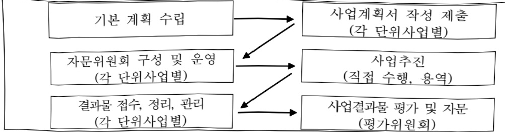

# 4차산업혁명대비 국어빅데이터 구축

**해당 페이지**: PDF 3147 ~ 3155 쪽 해당

**부처**: 문화체육관광부
**분야**: 문화 및 관광
**회계유형**: 일반회계
**2026 확정예산**: 13400.0 백만원
**전년대비 증감률**: 7.7%
**AI 도메인**: 데이터

---

<table border=1 style='margin: auto; word-wrap: break-word;'><tr><td style='text-align: center; word-wrap: break-word;'>사 업 명</td></tr><tr><td style='text-align: center; word-wrap: break-word;'>(100) 4차산업혁명대비 국어빅데이터 구축(2931-309)</td></tr></table>

사업 코드 정보

<table border=1 style='margin: auto; word-wrap: break-word;'><tr><td style='text-align: center; word-wrap: break-word;'>구분</td><td style='text-align: center; word-wrap: break-word;'>회계</td><td style='text-align: center; word-wrap: break-word;'>소관</td><td style='text-align: center; word-wrap: break-word;'>실국(기관)</td><td style='text-align: center; word-wrap: break-word;'>계정</td><td style='text-align: center; word-wrap: break-word;'>분야</td><td style='text-align: center; word-wrap: break-word;'>부문</td></tr><tr><td style='text-align: center; word-wrap: break-word;'>코드</td><td rowspan="2">일반회계</td><td rowspan="2">문화체육관광부</td><td rowspan="2">국립국어원</td><td rowspan="2"></td><td style='text-align: center; word-wrap: break-word;'>060</td><td style='text-align: center; word-wrap: break-word;'>061</td></tr><tr><td style='text-align: center; word-wrap: break-word;'>명칭</td><td style='text-align: center; word-wrap: break-word;'>문화 및 관광</td><td style='text-align: center; word-wrap: break-word;'>문화예술</td></tr></table>

<table border=1 style='margin: auto; word-wrap: break-word;'><tr><td style='text-align: center; word-wrap: break-word;'>구분</td><td style='text-align: center; word-wrap: break-word;'>프로그램</td><td style='text-align: center; word-wrap: break-word;'>단위사업</td><td style='text-align: center; word-wrap: break-word;'>세부사업</td></tr><tr><td style='text-align: center; word-wrap: break-word;'>코드</td><td style='text-align: center; word-wrap: break-word;'>2900</td><td style='text-align: center; word-wrap: break-word;'>2931</td><td style='text-align: center; word-wrap: break-word;'>309</td></tr><tr><td style='text-align: center; word-wrap: break-word;'>명칭</td><td style='text-align: center; word-wrap: break-word;'>국립국어원 운영</td><td style='text-align: center; word-wrap: break-word;'>국어발전기반 조성 및 진흥</td><td style='text-align: center; word-wrap: break-word;'>4차산업혁명대비국어빅데이터구축</td></tr></table>

☐ 사업 성격 (공통요구자료 II-1 작성유의사항 4. 참조, 해당하는 사항에 “○” 표시)

<table border=1 style='margin: auto; word-wrap: break-word;'><tr><td style='text-align: center; word-wrap: break-word;'>신규</td><td style='text-align: center; word-wrap: break-word;'>계속</td><td style='text-align: center; word-wrap: break-word;'>완료</td><td style='text-align: center; word-wrap: break-word;'>예비타당성실시여부</td><td style='text-align: center; word-wrap: break-word;'>총사업비관리대상</td><td style='text-align: center; word-wrap: break-word;'>총액계상예산사업</td><td style='text-align: center; word-wrap: break-word;'>사업소관 변경정보</td></tr><tr><td style='text-align: center; word-wrap: break-word;'></td><td style='text-align: center; word-wrap: break-word;'>O</td><td style='text-align: center; word-wrap: break-word;'></td><td style='text-align: center; word-wrap: break-word;'></td><td style='text-align: center; word-wrap: break-word;'></td><td style='text-align: center; word-wrap: break-word;'></td><td style='text-align: center; word-wrap: break-word;'></td></tr></table>

□사업지원형태 및지원을(최소한한개는반드시선택하시오.해당사항에O표시)

<table border=1 style='margin: auto; word-wrap: break-word;'><tr><td style='text-align: center; word-wrap: break-word;'>직접</td><td style='text-align: center; word-wrap: break-word;'>출자</td><td style='text-align: center; word-wrap: break-word;'>출연</td><td style='text-align: center; word-wrap: break-word;'>보조</td><td style='text-align: center; word-wrap: break-word;'>융자</td><td style='text-align: center; word-wrap: break-word;'>국고보조율(%)</td><td style='text-align: center; word-wrap: break-word;'>융자율(%)</td></tr><tr><td style='text-align: center; word-wrap: break-word;'>0</td><td style='text-align: center; word-wrap: break-word;'></td><td style='text-align: center; word-wrap: break-word;'></td><td style='text-align: center; word-wrap: break-word;'></td><td style='text-align: center; word-wrap: break-word;'></td><td style='text-align: center; word-wrap: break-word;'></td><td style='text-align: center; word-wrap: break-word;'></td></tr></table>

## □ 사업 소관부처 및 시행주체

<table border=1 style='margin: auto; word-wrap: break-word;'><tr><td style='text-align: center; word-wrap: break-word;'>사업명</td><td colspan="2">구분</td></tr><tr><td rowspan="3">4차산업혁명대비국어빅데이터구축</td><td rowspan="2">소관부처</td><td style='text-align: center; word-wrap: break-word;'>국립국어원어문연구실</td></tr><tr><td style='text-align: center; word-wrap: break-word;'>언어정보과</td></tr><tr><td style='text-align: center; word-wrap: break-word;'>사업시행주체</td><td style='text-align: center; word-wrap: break-word;'>국립국어원</td></tr></table>

---

### 가. 예산 총괄표

(단위: 백만원, %)

<table border=1 style='margin: auto; word-wrap: break-word;'><tr><td rowspan="2">2024년 열산</td><td colspan="2">2025년 예산</td><td colspan="2">2026년 예산</td><td colspan="2">증감 (B-A)</td></tr><tr><td style='text-align: center; word-wrap: break-word;'>본예산</td><td style='text-align: center; word-wrap: break-word;'>추경(A)</td><td style='text-align: center; word-wrap: break-word;'>요구안</td><td style='text-align: center; word-wrap: break-word;'>본예산(B)</td><td colspan="2">(B-A)/A</td></tr><tr><td style='text-align: center; word-wrap: break-word;'>4차산업혁명대비 국어빅데이터 구축</td><td style='text-align: center; word-wrap: break-word;'>12,768</td><td style='text-align: center; word-wrap: break-word;'>12,444</td><td style='text-align: center; word-wrap: break-word;'>12,444</td><td style='text-align: center; word-wrap: break-word;'>13,400</td><td style='text-align: center; word-wrap: break-word;'>13,400</td><td style='text-align: center; word-wrap: break-word;'>956</td></tr></table>

□ 기능별(내역사업별) 예산 내역

(단위:백만원)

<table border=1 style='margin: auto; word-wrap: break-word;'><tr><td rowspan="2"></td><td colspan="5">2024</td><td colspan="5">2025</td><td rowspan="2">2026 예산</td></tr><tr><td style='text-align: center; word-wrap: break-word;'>예산액 (추경)</td><td style='text-align: center; word-wrap: break-word;'>예산 현액</td><td style='text-align: center; word-wrap: break-word;'>집행액</td><td style='text-align: center; word-wrap: break-word;'>이월액</td><td style='text-align: center; word-wrap: break-word;'>불용액</td><td style='text-align: center; word-wrap: break-word;'>예산액 (추경)</td><td style='text-align: center; word-wrap: break-word;'>예산 현액</td><td style='text-align: center; word-wrap: break-word;'>집행액</td><td style='text-align: center; word-wrap: break-word;'>이월액</td><td style='text-align: center; word-wrap: break-word;'>불용액</td></tr><tr><td style='text-align: center; word-wrap: break-word;'>○ 기능별 분류(합계)</td><td style='text-align: center; word-wrap: break-word;'>13,215</td><td style='text-align: center; word-wrap: break-word;'>13,215</td><td style='text-align: center; word-wrap: break-word;'>12,768</td><td style='text-align: center; word-wrap: break-word;'>-</td><td style='text-align: center; word-wrap: break-word;'>447</td><td style='text-align: center; word-wrap: break-word;'>12,444</td><td style='text-align: center; word-wrap: break-word;'>12,444</td><td style='text-align: center; word-wrap: break-word;'>12,189</td><td style='text-align: center; word-wrap: break-word;'>-</td><td style='text-align: center; word-wrap: break-word;'>255</td><td style='text-align: center; word-wrap: break-word;'>13,400</td></tr><tr><td rowspan="2">• 4차산업혁명대비 국어빅데이터 구축 • 인공지능 관련 언어 능력 평가체계 개발 • 한국언어문화 인공 지능 지식 자원 구축 및 확장</td><td style='text-align: center; word-wrap: break-word;'>12,215</td><td style='text-align: center; word-wrap: break-word;'>12,215</td><td style='text-align: center; word-wrap: break-word;'>11,788</td><td style='text-align: center; word-wrap: break-word;'>-</td><td style='text-align: center; word-wrap: break-word;'>427</td><td style='text-align: center; word-wrap: break-word;'>11,994</td><td style='text-align: center; word-wrap: break-word;'>11,994</td><td style='text-align: center; word-wrap: break-word;'>11,747</td><td style='text-align: center; word-wrap: break-word;'>-</td><td style='text-align: center; word-wrap: break-word;'>247</td><td style='text-align: center; word-wrap: break-word;'>10,800</td></tr><tr><td style='text-align: center; word-wrap: break-word;'>1,000</td><td style='text-align: center; word-wrap: break-word;'>1,000</td><td style='text-align: center; word-wrap: break-word;'>980</td><td style='text-align: center; word-wrap: break-word;'>-</td><td style='text-align: center; word-wrap: break-word;'>20</td><td style='text-align: center; word-wrap: break-word;'>450</td><td style='text-align: center; word-wrap: break-word;'>450</td><td style='text-align: center; word-wrap: break-word;'>442</td><td style='text-align: center; word-wrap: break-word;'>-</td><td style='text-align: center; word-wrap: break-word;'>8</td><td style='text-align: center; word-wrap: break-word;'>0</td></tr></table>

### 나.사업설명자료

## 1 ) 사업목적·내용

o (4차산업혁명대비 국어 빅데이터 구축)

- 한국어를 잘하고, 한국언어문화를 잘 이해하는 한국형 인공지능(AI) 기술 개발 및 연구에 필요한 고품질 한국어 말뭉치를 구축·배포하여 인공지능 기술 발전의 기반 마련

°(인공지능 관련 언어능력 평가체계 개발)

- 한국어 글쓰기 능력 진단체계 개발을 통해 일반 국민의 글쓰기 능력 향상 도모

°(한국언어문화 인공지능 지식 자원 구축 및 확장)

-한국어·한국문화 말뭉치 및 디지털 자원 구축을 통한 한국어 데이터 주권 수호와 AI 문화 한류 기반 조성

---

## 2 ) 사업개요

## □ 사업근거 및 추진경위

① 법령상 근거 및 조항 적시

° 국어기본법 제16조(국어정보화의 촉진)

- 문화체육관광부장관은 국어를 통하여 지식과 정보를 생산하고 활용하여 새로운 문화를 창조할 수 있도록 국어 정보화를 위한 각종 사업을 적극적으로 시행하여야 한다.

② 추진경위

° 21세기 세종계획 추진('98~'07)

° 4차 산업혁명 대비 국어 빅데이터 구축('18~)

° 국가 데이터 정책 추진방향('21. 2. 관계부처 합동)

- 대한민국 데이터 119 프로젝트 9대 서비스 과제(S7-2 인공지능 훈민정음)

0 인공지능·데이터 기반의 디지털 지식재산 혁신전략('21. 2. 관계부처 합동)

- 디지털 콘텐츠·저작물 개방 확대 및 AI 활용기반 구축

·한국어처리기술개발에필요한AI학습용언어말몽치구축

° 윤석열 정부 국정과제 56-3. 우리문화에 대한 국민의 자긍심 제고

- 한국어 확산 및 언어문화산업 육성

· 인공지능 언어처리 기술 개발용 국어 말뭉치 구축(확대, '22년~)

· 자동통번역 기술 개발용 한국어·외국어·점자·수어 병렬말뭉치 구축(확대, '22년~)

° 데이터산업 진흥 기본계획(23.1. 관계부처 합동)

- 인공지능 학습용 데이터의 전략적 구축·확보

° 제2차 한국수어발전기본계획(2023~2027)(23. 2. 관계부처 합동)

○ 초거대AI 경쟁력 강화 방안('23. 4. 관계부처 합동)

o 한국어 말뭉치 구축 중장기 계획(2023~2027)(23. 12. 문화체육관광부)

° 제2차 점자발전기본계획(2024~2028)(‘24. 3. 관계부처 합동)

° 2024년 정부혁신실행계획('24. 4. 문체부)

o 국가인공지능위원회 출범('24. 9. 대통령직속위)

0 인공지능 발전과 신뢰 기반 조성 등에 관한 기본법(AI기본법) 공포('25. 1.)

0 이재명 정부 국정과제

- [103-3] K-컬처 시대를 위한 콘텐츠의 국가전략산업화 추진: AI 기반 콘텐츠 산업 혁신

## 주요내용

① 사업규모

- 사업기간 : 2018년~(계속)

---

- 최근 5년 간 투입된 사업비(예산액기준, 추경편성한 연도에는 추경포함)

<table border=1 style='margin: auto; word-wrap: break-word;'><tr><td style='text-align: center; word-wrap: break-word;'>연도</td><td style='text-align: center; word-wrap: break-word;'>2022</td><td style='text-align: center; word-wrap: break-word;'>2023</td><td style='text-align: center; word-wrap: break-word;'>2024</td><td style='text-align: center; word-wrap: break-word;'>2025</td><td style='text-align: center; word-wrap: break-word;'>2026</td></tr><tr><td style='text-align: center; word-wrap: break-word;'>사업비</td><td style='text-align: center; word-wrap: break-word;'>4,524</td><td style='text-align: center; word-wrap: break-word;'>4,081</td><td style='text-align: center; word-wrap: break-word;'>13,215</td><td style='text-align: center; word-wrap: break-word;'>12,444</td><td style='text-align: center; word-wrap: break-word;'>13,400</td></tr></table>

② 사업추진체계

- 사업시행방법 : 직접수행

- 사업시행주체 : 국립국어원

-사업 수혜자 : 국어학자와 언어 처리 개발자 등을 포함한 전 국민

- 보조, 융자, 출연, 출자 등의 경우 보조·융자 등 지원 비율 및 법적근거: 해당 없음

## 3 ) 2026년도 예산 산출 근거

4차산업혁명대비 국어혁데이터 구축: (2025 본예산)11,994 → (2026 예산)10,800백만원, 1,194백만원 감액 - (요구) 글로벌 AI 시장에서 한국어 데이터 주권 수호, AI 문화 한류 기반 조성을 위한 한국어 말뭉치 구축, 인공지능의 한국어 처리 성능 평가 체계 종합적 운영 등 생성형 인공지능 기반 한국언어자원 지식 확장 사업을 추진하고자, 한국어·외국어·묵자·점자 병렬 말뭉치 구축 규모를 축소, 멀티모달 말뭉치 구축 도구 선택적 개발 등으로 자체 구조조정을 거쳐 '25년 대비 10% 감액 요구

- (산출)

o 한국어 기본 말뭉치 구축: (25) 1,000 → (26) 1,000백만원 (전년 동)

· 신문 기사 말뭉치 구축: 500백만원(1억 어절×5원)(전년 동)

·일상 대화 말뭉치 구축: 500백만원(500시간×1백만원)(전년 동)

o 말뭉치 구축 및 정보 관리 운영: (25) 2.463 → (26) 2.038백만원 (감 425백만원)

·한국어 말뭉치 분석 정보 부착:1,759백만원(1.66백만어절×211.9원×5종)(전년 동)

· 한국언어문화 설명 말뭉치 구축(구조화된 텍스트 기반): 225백만원(1종×225백만원)('25년 2종→'26년 1종)(650→225)(감 425)

·평가 및 자문회의 사례비: 18백만원(12명×6회×0.25백만원)(전년 동)

·민관합동자문회의 운영: 13백만원(10명×5회×0.26백만원)(전년 동)

· 사무용품 구입: 0.38백만원(0.097백만원×4회)(전년 동)

· 회의 참석 여비: 17백만원(20명×34회×0.025백만원)(전년 동)

· 말뭉치 연구기관 교류: 5.3백만원(2명×1곳×2.65백만원)(전년 동)

업무 추진비: 0.88백만원(10명×4회×0.022백만원)(전년 동)

## o 말뭉치 배포 및 활용 지원: (25) 751 → (26) 751백만원 (전년 동)

·말뭉치 통합 시스템 개발: 100백만원(1식×100백만원)(전년 동)

·멀티모달 말뭉치 구축 도구 개발: 250백만원(1식×250백만원)(전년 동)

·말뭉치통합시스템유지관리및운영:150백만원(1식×150백만원)(전년동)

· 배포 말뭉치 변환 및 가공: 200백만원(10백만 어절×20원)(전년 동)

· 배포 서비스 수수료: 6백만원(0.5백만원×12개월)(전년 동)

· 전산장비 구매: 45백만원(45백만원×1식)(전년 동)

• 인공지능의 한국어 처리성능 평가체계(벤치마크) 개발: ('25) 760 → ('26)760백만원 (전년 동)

· 인공지능 한국어 처리성능평가 말뭉치 구축: 400백만원(2종×200백만원)(전년 동)

·평가 모델 개발 및 개선: 260백만원(2종×130백만원)(전년 동)

·평가체계 개발: 40백만원(1식×40백만원)(전년 동)

· 인공지능 평가체계 클라우드 서비스 이용료: 60백만원(1식×60백만원)(전년 동)

o 한국어·외국어·점자·수어 병렬말뭉치 구축: ('25) 7,020 → ('26) 6,251백만원 (감 769백만원)

---

·한국어-외국어 병렬 말뭉치:3,981백만원(85만 어절x8개 언어x585.5원)(4,500→3,981)(감 519)

· 한국어-점자 병렬 말뭉치: 650백만원(0.65백만어절×1,000원)(900→650)(감 250)

· 한국어-수어 병렬 말뭉치: 1,620백만원=(0.9백만어절×1,800원)(전년 동)

② 인공지능 관련 언어능력 평가체계 개발 : (2025 본예산) 450 → (2026 예산) 0백만원, 450백만원 감액 - (요구) 한국어 글쓰기 진단·첨삭 플랫폼 개발 신규 사업 검토 필요에 따라, 기존의 인공지능 환경 기반 논증적 글쓰기 진단 채점자 양성 과정 운영 규모 축소 등 자체 구조조정하여 감액

- (산출)

o 국민의 글쓰기 능력 진단체계 개발: (25) 450 → (26) 0백만원 (감 450백만원), △100%

· 글쓰기 자료 수집: 350백만원(7,000건×5만원) (감 350)

· 채점자 교육: 100백만원(1식×100백만원) (감 100)

③ 한국언어문 + 논공지능 지식 자원 구축 및 확장: (2025 본예산) 0 → (2026 예산) 2,600백만원, 순종 - (요구) 한국어 데이터 주권 수호와 AI 문화 한류 기반 조성을 위한 한국어·한국문화 말뭉치 및 디지털 자원을 구축하고자 멀티모달 설명 말뭉치, 구축 지식그래프 구축, 다국어개념망 연계 체계 구축 사업 추진을 위한 내역 신규 사업 순증 요구

- (산출)

o 한국언어문화 멀티모달 말뭉치 구축: (25) 0 → (26) 1,600백만원, 순증

·한국언어문화 멀티모달 말뭉치(이미지·음성·영상) 구축:1,600백만원(16만건×10,000원)

o 한국언어문화 지식그래프 구축: (25) 0 → (26) 800백만원, 순증

·한국언어문화 지식그래프 구축:800백만원(10만건×8,000원)

o 온용어와 다국어 개념망 연계 변역 지원 체계 구축: (25) 0 → (26) 200백만원, 순증

· 온용어와 바벨넷 데이터 구조 비교: 50백만원(50만건×100원)

· 온용어와 바벨넷 시스템 연계 및 인터페이스 개발: 100백만원(100백만원×1식)

·용어별 데이터 연계 검토:50백만원(50만건×100원)

o 2025년도 예산 및 2026년도 예산 산출 세부내역 비교

<table border=1 style='margin: auto; word-wrap: break-word;'><tr><td colspan="2">2025년 본예산</td><td colspan="2">2026년 예산</td></tr><tr><td style='text-align: center; word-wrap: break-word;'>예산</td><td style='text-align: center; word-wrap: break-word;'>산출내역</td><td style='text-align: center; word-wrap: break-word;'>예산</td><td style='text-align: center; word-wrap: break-word;'>산출내역</td></tr><tr><td colspan="2">○ 일반수용비(210-01): 31,388천원</td><td colspan="2">○ 일반수용비(210-01): 31,388천원</td></tr><tr><td colspan="2">가. 4차산업혁명대비 국어빅데이터 구축(31,388천원)</td><td colspan="2">가. 4차산업혁명대비 국어빅데이터 구축(31,388천원)</td></tr><tr><td colspan="2">1) 말뭉치 구축 및 정보 관리 운영(31,388천원)</td><td colspan="2">1) 말뭉치 구축 및 정보 관리 운영(31,388천원)</td></tr><tr><td colspan="2">· 자문 평가 및 회의 사례비: 100천원×10명×18회=18,000천원</td><td colspan="2">· 자문 평가 및 회의 사례비: 100천원×10명×18회=18,000천원</td></tr><tr><td colspan="2">· 민관합동자문위원회 운영: 260천원×10명×5회=13,000천원</td><td colspan="2">· 민관합동자문위원회 운영: 260천원×10명×5회=13,000천원</td></tr><tr><td colspan="2">· 사무용품 등 구입: 97천원×4회=388천원</td><td colspan="2">· 사무용품 등 구입: 97천원×4회=388천원</td></tr><tr><td colspan="2">○ 공공요금 및 제세(210-02): 66,000천원</td><td colspan="2">○ 공공요금 및 제세(210-02): 66,000천원</td></tr><tr><td colspan="2">가. 4차산업혁명대비 국어빅데이터 구축 (66,000천원)</td><td colspan="2">가. 4차산업혁명대비 국어빅데이터 구축 (66,000천원)</td></tr><tr><td colspan="2">1) 말뭉치 배포 및 활용 지원(6,000천원)</td><td colspan="2">1) 말뭉치 배포 및 활용 지원(6,000천원)</td></tr><tr><td rowspan="3">12,444 백만원</td><td style='text-align: center; word-wrap: break-word;'>· 말뭉치 배포 서비스 수수료: 500천원×12개월=6,000천원</td><td style='text-align: center; word-wrap: break-word;'>13,400 백만원</td><td style='text-align: center; word-wrap: break-word;'>· 말뭉치 배포 서비스 수수료: 500천원×12개월=6,000천원</td></tr><tr><td style='text-align: center; word-wrap: break-word;'>2) 인공지능의 한국어 처리 성능 평가체계 개발(60,000천원)</td><td colspan="2">2) 인공지능의 한국어 처리 성능 평가체계 개발(60,000천원)</td></tr><tr><td style='text-align: center; word-wrap: break-word;'>· 인공지능 평가체계 클라우드 서비스 이용료 60,000천원×1샤뇌 60,000천원</td><td colspan="2">· 인공지능 평가체계 클라우드 서비스 이용료 60,000천원×1샤뇌 60,000천원</td></tr><tr><td colspan="2">○ 일반용역비(210-14): 2,960,000천원</td><td colspan="2">○ 일반용역비(210-14): 2,085,000천원</td></tr><tr><td colspan="2">가. 4차산업혁명대비 국어빅데이터 구축 (2,510,000천원)</td><td colspan="2">가. 4차산업혁명대비 국어빅데이터 구축 (2,510,000천원)</td></tr><tr><td colspan="2">1) 한국어 기본 말뭉치 구축(1,000,000천원)</td><td colspan="2">1) 한국어 기본 말뭉치 구축(1,000,000천원)</td></tr><tr><td colspan="2">· 한국어 말뭉치 구축(신문기사): 5원×1억어절=500,000천원</td><td colspan="2">· 한국어 말뭉치 구축(신문기사): 5원×1억어절=500,000천원</td></tr><tr><td colspan="2">· 한국어 말뭉치 구축(일상대화): 1,000천원×500시간=500,000천원</td><td colspan="2">· 한국어 말뭉치 구축(일상대화): 1,000천원×500시간=500,000천원</td></tr><tr><td colspan="2">2) 말뭉치 구축 및 정보 관리 운영(650,000천원)</td><td colspan="2">2) 말뭉치 구축 및 정보 관리 운영(225,000천원)</td></tr><tr><td colspan="2">· 한국언어문화 설명 말뭉치 구축 2종×325,000천원=650,000천원</td><td colspan="2">· 한국언어문화 설명 말뭉치 구축 1종×225,000천원=225,000천원</td></tr><tr><td colspan="2">3) 말뭉치 배포 및 활용 지원(200,000천원)</td><td colspan="2">3) 말뭉치 배포 및 활용 지원(200,000천원)</td></tr></table>

---

<table border=1 style='margin: auto; word-wrap: break-word;'><tr><td rowspan="2">예산</td><td style='text-align: center; word-wrap: break-word;'>2025년 본예산</td><td colspan="2">2026년 예산</td><td style='text-align: center; word-wrap: break-word;'></td></tr><tr><td style='text-align: center; word-wrap: break-word;'>산출내역</td><td style='text-align: center; word-wrap: break-word;'>예산</td><td style='text-align: center; word-wrap: break-word;'>산출내역</td><td style='text-align: center; word-wrap: break-word;'></td></tr><tr><td rowspan="6"></td><td style='text-align: center; word-wrap: break-word;'>· 배포 말뭉치 변환 및 가공: 20원×10백만어절=200,000천원3) 인공지능의 한국어 처리성능 평가체계(벤치마크) 개발(660,000천원) · 인공지능 평가 말뭉치 구축: 200,000천원×2종=400,000천원 · 평가 모델 개발 및 운영: 130,000천원×2종=260,000천원</td><td style='text-align: center; word-wrap: break-word;'>· 배포 말뭉치 변환 및 가공: 20원×10백만어절=200,000천원3) 인공지능의 한국어 처리성능 평가체계(벤치마크) 개발(660,000천원) · 인공지능 평가 말뭉치 구축: 200,000천원×2종=400,000천원 · 평가 모델 개발 및 운영: 130,000천원×2종=260,000천원</td><td style='text-align: center; word-wrap: break-word;'>· 판리용역비(210-15): 150,000천원</td><td style='text-align: center; word-wrap: break-word;'></td></tr><tr><td style='text-align: center; word-wrap: break-word;'>나. 인공지능 관련 언어능력 평가체계 개발 (450,000천원) 1) 국민의 글쓰기 능력 진단체계 개발(450,000천원) · 글쓰기 자료 수집: 50천원×7,000건=350,000천원 · 채점자 교육: 100,000천원×1식=100,000천원</td><td style='text-align: center; word-wrap: break-word;'>· 판리용역비(210-15): 150,000천원 가. 4차산업혁명대비 국어빅데이터 구축 (150,000천원) 1) 말뭉치 배포 및 활용 지원(150,000천원) · 말뭉치 통합 시스템 유지 관리 및 운영 150,000천원×1식=150,000천원</td><td style='text-align: center; word-wrap: break-word;'>· 국내여비(220-01): 16,436천원</td><td style='text-align: center; word-wrap: break-word;'></td></tr><tr><td style='text-align: center; word-wrap: break-word;'>· 관리용역비(210-15): 150,000천원 가. 4차산업혁명대비 국어빅데이터 구축 (150,000천원) 1) 말뭉치 배포 및 활용 지원(150,000천원) · 말뭉치 통합 시스템 유지 관리 및 운영 150,000천원×1식=150,000천원</td><td style='text-align: center; word-wrap: break-word;'>· 4차산업혁명대비 국어빅데이터 구축 (16,436천원) 1) 말뭉치 구축 및 정보 관리 운영(16,436천원) · 회의 참석 여비: 131천원×5명×25회=16,436천원</td><td style='text-align: center; word-wrap: break-word;'>· 회의 참석 여비: 131천원×5명×25회=16,436천원</td><td style='text-align: center; word-wrap: break-word;'></td></tr><tr><td style='text-align: center; word-wrap: break-word;'>· 국내여비(220-01): 16,436천원 가. 4차산업혁명대비 국어빅데이터 구축 (16,436천원) 1) 말뭉치 구축 및 정보 관리 운영(16,436천원) · 회의 참석 여비: 131천원×5명×25회=16,436천원</td><td style='text-align: center; word-wrap: break-word;'>· 국외업무여비(220-02): 5,296천원 가. 4차산업혁명대비 국어빅데이터 구축 (5,296천원) 1) 말뭉치 구축 및 정보 관리 운영(5,296천원) · 말뭉치 연구기관 교류: 2,648천원×2명×1곳=5,296천원</td><td style='text-align: center; word-wrap: break-word;'>· 채점자 교류: 2,648천원×2명×1곳=5,296천원</td><td style='text-align: center; word-wrap: break-word;'></td></tr><tr><td style='text-align: center; word-wrap: break-word;'>· 국외업무여비(220-02): 5,296천원 가. 4차산업혁명대비 국어빅데이터 구축 (5,296천원) 1) 말뭉치 구축 및 정보 관리 운영(5,296천원) · 말뭉치 연구기관 교류: 2,648천원×2명×1곳=5,296천원</td><td style='text-align: center; word-wrap: break-word;'>· 사업추진비(240-01): 880천원 가. 4차산업혁명대비 국어빅데이터 구축 (880천원) 1) 말뭉치 구축 및 정보 관리 운영(880천원) · 말뭉치 분석 정보 부책 및 검증 2119원×16600천원</td><td style='text-align: center; word-wrap: break-word;'>· 업무 협의: 22천원×10명×4회=880천원</td><td style='text-align: center; word-wrap: break-word;'></td></tr><tr><td style='text-align: center; word-wrap: break-word;'>· 사업추진비(240-01): 880천원 가. 4차산업혁명대비 국어빅데이터 구축 (880천원) 1) 말뭉치 구축 및 정보 관리 운영(880천원) · 업무 협의: 22천원×10명×4회=880천원</td><td style='text-align: center; word-wrap: break-word;'>· 일반연구비(260-01): 11,000,000천원 가. 4차산업혁명대비 국어빅데이터 구축 (8,400,000천원) 1) 말뭉치 구축 및 정보 관리 운영(1,759,000천원) · 말뭉치 분석 정보 부책 및 검증 2119원×16600천원</td><td style='text-align: center; word-wrap: break-word;'>· 말뭉치 배포 및 활용 지원(350,000천원) · 말뭉치 통합 시스템 개발: 100,000천원×1식=100,000천원 · 말빈모델 말뭉치 구축 도구 개발 250,000천원×1식=250,000천원 3) 인공지능의 한국어 처리 성능 평가체계 개발(40,000천원) · 평가체계 개발: 40,000천원×1식=40,000천원 4) 한국어·외국어·점자수·어·병렬 말뭉치 구축(6,251,000천원) · 말뭉치 통합 시스템 개발: 100,000천원×1식=100,000천원 · 말빈모델 말뭉치 구축 도구 개발 250,000천원×1식=250,000천원 3) 인공지능의 한국어 처리 성능 평가체계 개발(40,000천원) · 평가체계 개발: 40,000천원×1식=40,000천원 4) 한국어·외국어·점자수·어·병렬 말뭉치 구축(6,251,000천원) · 말뭉치 통합 시스템 개발: 100,000천원×1식=100,000천원 · 말빈모델 말뭉치 구축 도구 개발 250,000천원×1식=250,000천원 3) 인공지능의 한국어 처리 성능 평가체계 개발(40,000천원) · 평가체계 개발: 40,000천원×1식=40,000천원 4) 한국어·외국어·점자수·어·병렬 말뭉치 구축(6,251,000천원) · 말뭉치 통합 시스템 개발: 100,000천원×1식=100,000천원 · 말빈모델 말뭉치 구축 도구 개발 250,000천원×1식=250,000천원 3) 인공지능의 한국어 처리 성능 평가체계 개발(40,000천원) · 말빈모델 말뭉치 구축(6,251,000천원) · 말빈모델 말뭉치 구축 도구 개발 250,000천원×1식=250,000천원 4) 한국어·외국어·점자수·어·병렬 말뭉치 구축(6,251,000천원) · 말빈모델 말뭉치 구축 도구 개발 250,000천원×1식=250,000천원 4) 한국어·외국어·점자수·어·병렬 말뭉치 구축(6,251,000천원) · 말빈모델 말뭉치 구축 도구 개발 250,000천원×1식=250,000천원 4) 한국어·외국어·점자수·어·병렬 말뭉치 구축(6,251,000천원) · 말빈모델 말뭉치 구축 도구 개발 250,000천원×1식=250,000천원 4) 한국어·외국어·점자수·어·병렬 말뭉치 구축(6,251,000천원) · 말빈모델 말뭉치 구축(6,251,000천원) · 말빈모델 말뭉치 구축(6,251,000천원) 1) 말뭉치 배포 및 활용 지원(45,000천원) · 전산장비 구매: 45,000천원×1식=45,000천원</td><td style='text-align: center; word-wrap: break-word;'>· 한국언어문화 인공지능 지식 자원 자원 구축 및 확장(2,600,000천원) 1) 한국언어문화 열티모달 말뭉치 구축(1,600,000천원) · 한국언어문화 말돈달 말닭치이미지음성영상 구축: 16만건×10,000원 =1,600백만원 2) 한국언어문화 지식그래프 구축(800,000천원) · 한국언어문화 지식그래프 구축 10만건×8,000원=800,000천원 3) 운용어와 다국어 개념망 연계 번역 지원 체계 구축 (2,000,000천원) · 운용어 와 배볼롯 데이터 구조 비교 50만건×100원=50,000천원 1) 운용어 와 배볼롯 스탄 연계 및 인터페이스 개발 100,000천원×1식 =100,000천원 · 용어별 데이터 연계 검토: 50만건×100원=50,000천원 ○ 자산취득비(430-01): 45,000천원 가. 4차산업혁명대비 국어빅데이터 구축 (45,000천원) 1) 말뭉치 배포 및 활용 지원(45,000천원) 1) 말뭉치 배포 및 활용 지원(45,000천원) · 전산장비 구매: 45,000천원×1식=45,000천원</td></tr></table>

---

## 4 ) 사업효과

사업영향, 산출물 성과지표 등

① 2022~2026년도 성과계획서 상 성과지표 및 최근 5년간 성과 달성도: 해당 없음

② 성과지표 이외의 연도별 사업추진 경과 및 실적

<table border=1 style='margin: auto; word-wrap: break-word;'><tr><td style='text-align: center; word-wrap: break-word;'>2022</td><td style='text-align: center; word-wrap: break-word;'>·국어 기본 말뭉치 1억 어절 구축 ·국어 말뭉치 분석 정보 부착 5종 ·말뭉치 분석 연구 1식 ·국어 말뭉치 통합 시스템 개발 및 전산 환경 구축 1식 ·말뭉치 공개(37종 누적 22억 어절)</td></tr><tr><td style='text-align: center; word-wrap: break-word;'>2023</td><td style='text-align: center; word-wrap: break-word;'>·국어 기본 말뭉치 1억 어절 구축 ·국어 말뭉치 분석 정보 부착 5종 ·국어 말뭉치 통합 시스템 개발 및 전산 환경 구축 1식 ·국어능력 진단체계 지표 개발 연구 1식 ·말뭉치 공개(누적 62종, 23억 어절)</td></tr><tr><td style='text-align: center; word-wrap: break-word;'>2024</td><td style='text-align: center; word-wrap: break-word;'>·국어 기본 말뭉치 1억 어절 구축 ·국어 말뭉치 분석 정보 부착 5종 ·국어 말뭉치 통합 시스템 개발 및 전산 환경 구축 1식 ·국어능력 진단체계 지표 개발 연구 1식 ·말뭉치 공개(누적 91종, 28억 어절) ·국어능력 진단체계 지표 개발·체점자 양성 연구 1식 및 글쓰기 자료 수집 2종</td></tr><tr><td style='text-align: center; word-wrap: break-word;'>2025</td><td style='text-align: center; word-wrap: break-word;'>·국어 기본 말뭉치 1억 어절 구축 ·국어 말뭉치 분석 정보 부착 5종 ·국어 말뭉치 통합 시스템 개발 및 전산 환경 구축 1식 ·말뭉치 공개 예정(분기별) ·글쓰기 체점 전문가 양성(100명) 및 글쓰기 자료 수집 2종(각 4,000건)</td></tr></table>

③향후(2026년도 이후)기대효과

- 한국형 인공지능(AI) 기술 개발 및 연구의 핵심 기초자료인 고품질 한국어와 한국언어문화 말뭉치를 구축·배포함으로써 ▲인공지능의 한국어 성능 향상 견인, ▲글로벌 인공지능 시장에서 한국어 데이터 주권 수호, ▲한국형 인공지능 기반 한국 고유의 언어문화 보전 및 발전

- ▲'한국어 말뭉치 구축 중장기 계획(2023~2027)'(문체부, '23. 12.)에 따라, '27년까지 한국어·한국언어문화 말뭉치 누적 200종 구축 및 배포, ▲텍스트 중심에서 멀티 모달 말뭉치, 지식그래프 등 자원 유형 다각화

- 인공지능 기술을 활용한 사람과 공공기관의 국어사용능력 진단체계 개발을 통해

우리 사회의 국어능력 향상 도모

- 공공재로서의 언어자원 구축과 활용을 통해 사회적 비용 절감

## 5 ) 타당성조사 및 예비타당성조사 시행여부 및 결과 요지: 해당 없음

---

## 6 ) 총사업비 대상사업 정보: 해당 없음

## 7 ) 사업 집행절차

## 8 ) 각종 평가

1) 2023년도 부처 재정사업 자율평가 결과: 미흡

- 인공지능 기술 혁신 기반 마련을 위하여 대규모 말뭉치를 국가 공공재로서 구축, 공개하여 기술력 개발에 기여하는 등 사업목적이 명확함. 다만 철저한 사업계획에도 일부 사업의 단일응찰, 미응찰 등 사업지연요인이 발생하여 사업 기간과 예산의 이월이 불가피해짐에 따라 전반적인 예산 집행률이 다소 떨어짐.

2) 2024년도 부처 재정사업 자율평가 결과: 우수

- 한국어에 특화된, 데이터 정제 수준, 품질관리 여부, 다양한 언어 사용 상황(전문분야, 구어체 등) 등을 대상으로 하는 다양한 종류의 말뭉치를 구축함으로써 ‘고품질 말뭉치’나 ‘한국형 인공지능 기술 발전 및 언어처리 연구 기반 마련’ 같은 목표를 충족하고자 적정한 사업 계획을 수립하고 그에 맞는 예산집행을 우수하게 추진함.

---

### 다. 최근 4년간 결산내역

## 1 ) 결산표

☐ 부처 결산내역

(단위: 백만원, %)

<table border=1 style='margin: auto; word-wrap: break-word;'><tr><td rowspan="2">연도</td><td colspan="3">예산액</td><td rowspan="2">예산현액(A)</td><td rowspan="2">집행액(B)</td><td rowspan="2">집행률(B/A)</td><td rowspan="2">다음연도이월액</td><td rowspan="2">불용액</td></tr><tr><td style='text-align: center; word-wrap: break-word;'>본예산</td><td style='text-align: center; word-wrap: break-word;'>추경증감액</td><td style='text-align: center; word-wrap: break-word;'>추경</td></tr><tr><td style='text-align: center; word-wrap: break-word;'>2022</td><td style='text-align: center; word-wrap: break-word;'>4,554</td><td style='text-align: center; word-wrap: break-word;'>△30</td><td style='text-align: center; word-wrap: break-word;'>4,524</td><td style='text-align: center; word-wrap: break-word;'>5,287</td><td style='text-align: center; word-wrap: break-word;'>4,364</td><td style='text-align: center; word-wrap: break-word;'>82.5</td><td style='text-align: center; word-wrap: break-word;'>789</td><td style='text-align: center; word-wrap: break-word;'>134</td></tr><tr><td style='text-align: center; word-wrap: break-word;'>2023</td><td style='text-align: center; word-wrap: break-word;'>4,081</td><td style='text-align: center; word-wrap: break-word;'>4,081</td><td style='text-align: center; word-wrap: break-word;'></td><td style='text-align: center; word-wrap: break-word;'>4,870</td><td style='text-align: center; word-wrap: break-word;'>4,672</td><td style='text-align: center; word-wrap: break-word;'>95.9</td><td style='text-align: center; word-wrap: break-word;'></td><td style='text-align: center; word-wrap: break-word;'>198</td></tr><tr><td style='text-align: center; word-wrap: break-word;'>2024</td><td style='text-align: center; word-wrap: break-word;'>13,215</td><td style='text-align: center; word-wrap: break-word;'>13,215</td><td style='text-align: center; word-wrap: break-word;'></td><td style='text-align: center; word-wrap: break-word;'>13,215</td><td style='text-align: center; word-wrap: break-word;'>12,768</td><td style='text-align: center; word-wrap: break-word;'>96.6</td><td style='text-align: center; word-wrap: break-word;'></td><td style='text-align: center; word-wrap: break-word;'>447</td></tr><tr><td style='text-align: center; word-wrap: break-word;'>2025</td><td style='text-align: center; word-wrap: break-word;'>12,444</td><td style='text-align: center; word-wrap: break-word;'>12,444</td><td style='text-align: center; word-wrap: break-word;'></td><td style='text-align: center; word-wrap: break-word;'>12,444</td><td style='text-align: center; word-wrap: break-word;'>12,189</td><td style='text-align: center; word-wrap: break-word;'>97.9</td><td style='text-align: center; word-wrap: break-word;'></td><td style='text-align: center; word-wrap: break-word;'>255</td></tr></table>

## 2 ) 주요 결산사항

□ 2022~2025년 결산 주요사항

<table border=1 style='margin: auto; word-wrap: break-word;'><tr><td style='text-align: center; word-wrap: break-word;'>2022</td><td style='text-align: center; word-wrap: break-word;'>- 제 2회 추경 경상경비 감액 30백만원- 전용: 145백만원(기존 연구용역사업에서 유지관리과업을 분리 발주하기 위해 연구용역비 145백만원을 관리용역비로 자체 전용)- 내역변경: 10백만원(사무공간 개편 작업의 효율적 수행을 위해 자산취득비 10백만원을 ‘국어원 청사 관리’ 사업으로 내역변경)- 조정: 3.5백만원(관리용역사업의 부족 예산 충당을 위해 일반수용비 3.5백만원을 관리용역비로 세목 조정)- 이월: 789백만원(차년도 계약만료 사업 대금 이월)- 불용: 134백만원(낙찰차액 및 집행잔액)</td></tr><tr><td style='text-align: center; word-wrap: break-word;'>2023</td><td style='text-align: center; word-wrap: break-word;'>- 불용: 198백만원(낙찰차액 및 집행잔액)</td></tr><tr><td style='text-align: center; word-wrap: break-word;'>2024</td><td style='text-align: center; word-wrap: break-word;'>- 불용: 447백만원(낙찰차액 및 집행잔액)</td></tr><tr><td style='text-align: center; word-wrap: break-word;'>2025</td><td style='text-align: center; word-wrap: break-word;'>- 불용: 255백만원(낙찰차액 및 집행잔액)</td></tr></table>

□ 2025년 이·전용 등 세부내역: 해당 없음

---

### 원본 PDF 크롭 이미지

