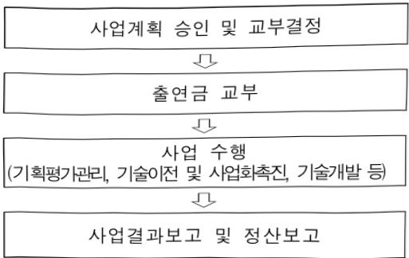

# AI기반 관광 혁신 기술개발(R&D)

**해당 페이지**: PDF 3156 ~ 3161 쪽 해당

**부처**: 문화체육관광부
**분야**: 문화 및 관광
**회계유형**: 기금
**2026 확정예산**: 3750.0 백만원
**전년대비 증감률**: None%
**AI 도메인**: 디지털전환(AX)

---

### 가.지출계획 총괄표

(단위: 백만원, %)

<table border=1 style='margin: auto; word-wrap: break-word;'><tr><td rowspan="2">사업명</td><td rowspan="2">2024년 결산</td><td colspan="2">2025년 계획</td><td colspan="2">2026년</td><td rowspan="2">증감(B-A)</td><td rowspan="2">(B-A)/A</td></tr><tr><td style='text-align: center; word-wrap: break-word;'>본예산</td><td style='text-align: center; word-wrap: break-word;'>추경·수정(A)</td><td style='text-align: center; word-wrap: break-word;'>요구안</td><td style='text-align: center; word-wrap: break-word;'>본예산(B)</td></tr><tr><td style='text-align: center; word-wrap: break-word;'>AI 기반광혁신기술개발(R&amp;D)</td><td style='text-align: center; word-wrap: break-word;'>-</td><td style='text-align: center; word-wrap: break-word;'>-</td><td style='text-align: center; word-wrap: break-word;'>-</td><td style='text-align: center; word-wrap: break-word;'>3,750</td><td style='text-align: center; word-wrap: break-word;'>3,750</td><td style='text-align: center; word-wrap: break-word;'>3,750</td><td style='text-align: center; word-wrap: break-word;'>순증</td></tr></table>

□ 기능별(내역사업별) 계획 내역

(단위:백만원)

<table border=1 style='margin: auto; word-wrap: break-word;'><tr><td rowspan="2"></td><td colspan="5">2024</td><td colspan="5">2025</td><td rowspan="2">2026 계획</td></tr><tr><td style='text-align: center; word-wrap: break-word;'>계획액(추정)</td><td style='text-align: center; word-wrap: break-word;'>계획현액</td><td style='text-align: center; word-wrap: break-word;'>집행액</td><td style='text-align: center; word-wrap: break-word;'>이월액</td><td style='text-align: center; word-wrap: break-word;'>불용액</td><td style='text-align: center; word-wrap: break-word;'>계획액(추정)</td><td style='text-align: center; word-wrap: break-word;'>계획현액</td><td style='text-align: center; word-wrap: break-word;'>집행액</td><td style='text-align: center; word-wrap: break-word;'>이월액</td><td style='text-align: center; word-wrap: break-word;'>불용액</td></tr><tr><td style='text-align: center; word-wrap: break-word;'>○ 기능별 분류(합계)</td><td style='text-align: center; word-wrap: break-word;'>-</td><td style='text-align: center; word-wrap: break-word;'>-</td><td style='text-align: center; word-wrap: break-word;'>-</td><td style='text-align: center; word-wrap: break-word;'>-</td><td style='text-align: center; word-wrap: break-word;'>-</td><td style='text-align: center; word-wrap: break-word;'>-</td><td style='text-align: center; word-wrap: break-word;'>-</td><td style='text-align: center; word-wrap: break-word;'>-</td><td style='text-align: center; word-wrap: break-word;'>-</td><td style='text-align: center; word-wrap: break-word;'>-</td><td style='text-align: center; word-wrap: break-word;'>3,750</td></tr><tr><td rowspan="2">• 관광데이터 전주기강화 및 관리기술개발• AI 에이전트 기반관광서비스 기술개발</td><td style='text-align: center; word-wrap: break-word;'>-</td><td style='text-align: center; word-wrap: break-word;'>-</td><td style='text-align: center; word-wrap: break-word;'>-</td><td style='text-align: center; word-wrap: break-word;'>-</td><td style='text-align: center; word-wrap: break-word;'>-</td><td style='text-align: center; word-wrap: break-word;'>-</td><td style='text-align: center; word-wrap: break-word;'>-</td><td style='text-align: center; word-wrap: break-word;'>-</td><td style='text-align: center; word-wrap: break-word;'>-</td><td style='text-align: center; word-wrap: break-word;'>-</td><td style='text-align: center; word-wrap: break-word;'>1,875</td></tr><tr><td style='text-align: center; word-wrap: break-word;'>-</td><td style='text-align: center; word-wrap: break-word;'>-</td><td style='text-align: center; word-wrap: break-word;'>-</td><td style='text-align: center; word-wrap: break-word;'>-</td><td style='text-align: center; word-wrap: break-word;'>-</td><td style='text-align: center; word-wrap: break-word;'>-</td><td style='text-align: center; word-wrap: break-word;'>-</td><td style='text-align: center; word-wrap: break-word;'>-</td><td style='text-align: center; word-wrap: break-word;'>-</td><td style='text-align: center; word-wrap: break-word;'>-</td><td style='text-align: center; word-wrap: break-word;'>1,875</td></tr></table>

### 나. 사업설명자료

## 1 ) 사업목적·내용

- (복적) 인공지능 전환(AX) 및 관광 패러다임 선도를 통한 트래블테크 기반 글로벌 관광대국 도약

- (내용) 관광데이터와 인공지능을 중심으로 기술과 관광의 융합을 통한 관광데이터 거버넌스 강화 및

AI 융합 관광 특화기술을 개발하여, 급변하는 관광환경에 적극적 대응 및 관광서비스 품질 제고

## 2 ) 사업개요

## ☐ 사업근거 및 추진경위

① 법령상 근거 및 조항 적시

- 「과학기술기본법」 제11조(국가연구개발사업의 추진) 중앙행정기관의 장은 기본계획에 따라 국가연구개발사업을 추진하여야 함

「문화산업진흥 기본법」 제17조(기술 및 문화콘텐츠 개발의 촉진)

---

① 문화체육관광부장관은 문화체육관광부 소관 연구개발(이하 “연구개발사업”이라 한다)을 촉진하기 위한 정책을 수립 · 시행하고 연구개발사업을 수행하는 데에 드는 자금을 예산의 범위에서 지원하거나 출연할 수 있다.

② 문화체육관광부장관은 연구개발사업을 효율적으로 추진하기 위하여 다음 각 호의 어느 하나에 해당하는 법인 · 기관 또는 단체 중에서 연구개발사업에 관한 업무의 전부 또는 일부를 대행하는 기관(이하 “전문기관”이라 한다)을 지정할 수 있다.

1. 제31조에 따른 한국콘텐츠진흥원

- 「관광진흥법」 제47조의7(관광산업 진흥 사업) 문화체육관광부장관은 관광산업의 활성화를 위하여 대통령령으로 정하는 바에 따라 다음 각 호의 사업을 추진할 수 있다.

4. 관광산업 관련 기술의 연구개발 및 실용화

## ② 추진경위

- 서비스산업 선진화 방안('09.1월, 기재부 주관, 문화부 등 5부2청 공동)

- 서비스 R&D 활성화 방안('10.3월, 지경부 주관, 문화부 등 6부2청 공동)

- 서비스 R&D 추진 종합계획('12.6월, 국과위)

- 서비스 R&D 투자 포트폴리오 수립('15.2월, 국과심 ICT융합전문위원회)

- 서비스경제 발전전략('16.7월, 관계부처합동)

- 서비스 R&D 중장기 추진전략 및 투자계획('17.2월, 미래부)

- 제1차 국가관광전략회의('17.12.18.) - 제5차 관광진흥기본계획 발표

- 서비스 R&D 추진전략 시행계획('18.1월, 미래부)

- 제3차 국가관광전략회의('19.4.2.)

· 대한민국 관광 혁신전략(관광산업 R&D 적용 확대)

- 제6차 국가관광전략회의('21.11)

·마이스·여행업 등 관광기업의 디지털 전환 지원, 기술 융합형 관광기업 육성,

디지털 관광인재 양성 등 추진

- 제6차 관광진흥기본계획 2023~2027, 관광진흥기본계획 2024년 시행계획

(전략과제2) 현장과 함께 만드는 관광산업 혁신, (추진과제) 미래관광산업 선도기반 구축

- 문화체육관광부 R&D 중장기 로드맵 수립('24.12.)

- (국정과제 103) K-컬처 시대를 위한 콘텐츠 국가전략산업화 추진

- (국정과제 107) 3천만 세계인이 찾는 관광산업 기반 구축

- (실천과제 103-1) 국가전략산업으로서 콘텐츠산업 성장기반 확충

- (실천과제 107-3) 관광산업 글로벌 경쟁력 강화

---

## -사업 세부 추진 경과

<table border=1 style='margin: auto; word-wrap: break-word;'><tr><td style='text-align: center; word-wrap: break-word;'>구분</td><td style='text-align: center; word-wrap: break-word;'>시기</td><td style='text-align: center; word-wrap: break-word;'>주요내용</td></tr><tr><td rowspan="3">부처 총괄회의</td><td style='text-align: center; word-wrap: break-word;'>&#x27;24.08~09</td><td style='text-align: center; word-wrap: break-word;'>• 신규사업 아이템 발굴 (2개 분야) 및 선정</td></tr><tr><td style='text-align: center; word-wrap: break-word;'>&#x27;24.12</td><td style='text-align: center; word-wrap: break-word;'>• 문화체육관광부 중장기 로드맵 수립</td></tr><tr><td style='text-align: center; word-wrap: break-word;'>&#x27;25.02~03</td><td style='text-align: center; word-wrap: break-word;'>• 기획 아이템 구체화 및 기획내용 검토</td></tr><tr><td rowspan="3">타 부처·기관 협의</td><td style='text-align: center; word-wrap: break-word;'>&#x27;25.01</td><td style='text-align: center; word-wrap: break-word;'>• 산업부 KEIT, 로봇산업진흥원 협력 사업 논의</td></tr><tr><td style='text-align: center; word-wrap: break-word;'>&#x27;25.02~03</td><td style='text-align: center; word-wrap: break-word;'>• 산업부 로봇산업진흥원 협력 사업 상세 논의</td></tr><tr><td style='text-align: center; word-wrap: break-word;'>&#x27;25.03</td><td style='text-align: center; word-wrap: break-word;'>• 한국관광공사 협력 사업 논의</td></tr><tr><td rowspan="4">기술기획회의</td><td style='text-align: center; word-wrap: break-word;'>&#x27;25.02.13</td><td style='text-align: center; word-wrap: break-word;'>• (1차) 기술 기획 킥오프 회의</td></tr><tr><td style='text-align: center; word-wrap: break-word;'>&#x27;25.02.25</td><td style='text-align: center; word-wrap: break-word;'>• (2차) 사업 전체 방향성 구성</td></tr><tr><td style='text-align: center; word-wrap: break-word;'>&#x27;25.03.14</td><td style='text-align: center; word-wrap: break-word;'>• (3차) 세부 사업 방향성 도출</td></tr><tr><td style='text-align: center; word-wrap: break-word;'>&#x27;25.03.25</td><td style='text-align: center; word-wrap: break-word;'>• (4차) 세부 기술 및 과제 도출</td></tr><tr><td rowspan="4">자문회의</td><td style='text-align: center; word-wrap: break-word;'>&#x27;24.10</td><td style='text-align: center; word-wrap: break-word;'>• 인공지능/빅데이터 관련 기술 자문</td></tr><tr><td style='text-align: center; word-wrap: break-word;'>&#x27;24.11</td><td style='text-align: center; word-wrap: break-word;'>• 로보틱스 관련 기술 자문 및 간담회</td></tr><tr><td style='text-align: center; word-wrap: break-word;'>&#x27;25.02</td><td style='text-align: center; word-wrap: break-word;'>• 관광 데이터 현황 및 발전 방안 수립</td></tr><tr><td style='text-align: center; word-wrap: break-word;'>&#x27;25.03</td><td style='text-align: center; word-wrap: break-word;'>• 관광 데이터센트릭, 관광 AI 에이전트 기술 자문</td></tr></table>

## □ 주요내용

① 사업규모

- 총사업비 : 해당없음

- 사업기간 : 2026년 ~ 2028년

- 최근 5년 간 투입된 사업비(예산액기준, 추경편성한 연도에는 추경포함)

<table border=1 style='margin: auto; word-wrap: break-word;'><tr><td style='text-align: center; word-wrap: break-word;'>연도</td><td style='text-align: center; word-wrap: break-word;'>2022</td><td style='text-align: center; word-wrap: break-word;'>2023</td><td style='text-align: center; word-wrap: break-word;'>2024</td><td style='text-align: center; word-wrap: break-word;'>2025</td><td style='text-align: center; word-wrap: break-word;'>2026</td></tr><tr><td style='text-align: center; word-wrap: break-word;'>사업비</td><td style='text-align: center; word-wrap: break-word;'>-</td><td style='text-align: center; word-wrap: break-word;'>-</td><td style='text-align: center; word-wrap: break-word;'>-</td><td style='text-align: center; word-wrap: break-word;'>-</td><td style='text-align: center; word-wrap: break-word;'>3,750</td></tr></table>

-기타: 해당없음

② 사업추진체계

- 사업시행방법 : 출연

- 사업시행주체 : 한국콘텐츠진흥원

- 사업 수혜자 : 일반, 국민, 대학, 기업 등

- 보조, 융자, 출연, 출자 등의 경우 보조·융자 등 지원 비율 및 법적근거

<table border=1 style='margin: auto; word-wrap: break-word;'><tr><td style='text-align: center; word-wrap: break-word;'>내역사업명</td><td style='text-align: center; word-wrap: break-word;'>구분</td><td style='text-align: center; word-wrap: break-word;'>피보조·피출연 등 기관명</td><td style='text-align: center; word-wrap: break-word;'>지원 금액 (2026계획)</td><td style='text-align: center; word-wrap: break-word;'>지원 비율(%)</td><td style='text-align: center; word-wrap: break-word;'>보조율 법적근거 (해당 조항)</td></tr><tr><td style='text-align: center; word-wrap: break-word;'>관광데이터 전주기 강화 및 관리기술 개발</td><td style='text-align: center; word-wrap: break-word;'>출연</td><td style='text-align: center; word-wrap: break-word;'>대학 연구소, 관광센터 등</td><td style='text-align: center; word-wrap: break-word;'>1,875</td><td style='text-align: center; word-wrap: break-word;'>정액</td><td style='text-align: center; word-wrap: break-word;'>문화산업진흥 기본법 제17조</td></tr><tr><td style='text-align: center; word-wrap: break-word;'>AI 에이전트 기반 관광서비스 기술개발</td><td style='text-align: center; word-wrap: break-word;'>출연</td><td style='text-align: center; word-wrap: break-word;'>대학 연구소, 관광센터 등</td><td style='text-align: center; word-wrap: break-word;'>1,875</td><td style='text-align: center; word-wrap: break-word;'>정액</td><td style='text-align: center; word-wrap: break-word;'>문화산업진흥 기본법 제17조</td></tr></table>

---

## 3 ) 2026년도 계획 산출 근거

① 관광데이터 전주기 강화 및 관리기술 개발 : (2025 당초 계획) 0백만원 → (2026 계획) 1,875백만원, 순증 - (요구) 관광데이터의 전주기에 걸친 품질향상과 활용도 제고를 목표로, AI 기술로 데이터를 표준화·정형화하고 신뢰도를 검증할 수 있는 최적화 기술 개발을 위한 과제 선정 지원 1,875백만원 - (산출) (신규) 3개 과제 x 833.3백만원 x 9/12개월 = 1,875백만원
② AI 에이전트 기반 관광서비스 기술개발: (2025 당초 계획) 0백만원 → (2026 계획) 1,875백만원, 순증 - (요구) 관광객 경험 향상, 관광지 운영 효율화를 위해 관광현장의 문제를 능동적으로 해결하고 관광객과 상호작용하는 관광특화 AI 에이전트 및 활용기술 개발을 위한 과제 선정 지원 1,875백만원 - (산출) (신규) 3개 과제 x 833.3백만원 x 9/12개월 = 1,875백만원

## 4 ) 사업효과

사업영향, 산출물 성과지표 등

① 2022~2026년도 성과계획서 상 성과지표 및 최근 5년간 성과 달성도 : 해당없음

② 성과지표 이외의 연도별 사업추진 경과 및 실적 : 해당없음

③ 향후(2026년도 이후) 기대효과

- (산업 경쟁력 강화) 관광객 행동데이터를 분석하여 업계에는 맞춤형 전략, 관광객

에는 초개인화된 관광 서비스를 제공하여 변화하는 관광환경에 대응

- (지역관광 활성화) AI 에이전트가 인력투입이 어려운 관광지 안전관리 등을 보조하여, 인력부족 문제를 완화하고 지역관광 산업의 지속가능한 유영기반 마련

- (실증체계 구축) 데이터 수집부터 기술개발, 투어랩에 실증까지의 총체적 연구개발

체계를 구축하여 개발된 기술의 산업에의 상용화 촉진

- (평가기술 확보) AI 서비스모델을 정밀하게 평가하는 기술과 실증·평가기준 및

시나리오를 구축하여, 평가 기술의 인증 및 표준화 선도

- (관광객 안전 강화) 관광지 혼잡도·밀집도 예측, 실시간 위험 대응 서비스 등을 통해 한국관광에 대한 심리적 안정감 강화 및 국가 브랜드 제고

5) 타당성조사 및 예비타당성조사 시행여부 및 결과 요지 : 해당없음

6) 총사업비 대상사업 정보 : 해당없음

---

## 7 ) 사업 집행절차

☐ 사업추진 절차도

사업계획 승인 및 교부결정

출연금 교부

문화체육관광부

문화체육관광부 → 한국콘텐츠진흥원 등

사업결과보고 및 정산보고

한국콘텐츠진흥원 등

한국콘텐츠진흥원 등 → 문화체육관광부

☐ 사업집행 절차도

<table border=1 style='margin: auto; word-wrap: break-word;'><tr><td style='text-align: center; word-wrap: break-word;'>부처</td><td style='text-align: center; word-wrap: break-word;'></td><td style='text-align: center; word-wrap: break-word;'>피출연·피보조기관</td><td style='text-align: center; word-wrap: break-word;'></td><td style='text-align: center; word-wrap: break-word;'>간접보조사업자·사업수행자</td></tr><tr><td style='text-align: center; word-wrap: break-word;'>부처(3,750백만원)</td><td style='text-align: center; word-wrap: break-word;'>=&gt;(3,750백만원)</td><td style='text-align: center; word-wrap: break-word;'>한국콘텐츠진흥원(3,750백만원)</td><td style='text-align: center; word-wrap: break-word;'>=&gt;(3,750백만원)</td><td style='text-align: center; word-wrap: break-word;'>대학, 기업 등</td></tr></table>

## 8 ) 각종 평가 : 해당없음

다. 최근 4년간 결산내역 : 해당없음

---

<table border=1 style='margin: auto; word-wrap: break-word;'><tr><td style='text-align: center; word-wrap: break-word;'>사 업 명</td></tr><tr><td style='text-align: center; word-wrap: break-word;'>(21) 개인운동기록 활용 기술 개발(R&amp;D) (5362-618)</td></tr></table>

☐ 사업 코드 정보

<table border=1 style='margin: auto; word-wrap: break-word;'><tr><td style='text-align: center; word-wrap: break-word;'>구분</td><td style='text-align: center; word-wrap: break-word;'>기금</td><td style='text-align: center; word-wrap: break-word;'>소관</td><td style='text-align: center; word-wrap: break-word;'>실국(기관)</td><td style='text-align: center; word-wrap: break-word;'>계정</td><td style='text-align: center; word-wrap: break-word;'>분야</td><td style='text-align: center; word-wrap: break-word;'>부문</td></tr><tr><td style='text-align: center; word-wrap: break-word;'>코드</td><td style='text-align: center; word-wrap: break-word;'>국민체육</td><td style='text-align: center; word-wrap: break-word;'>문화체육</td><td rowspan="2">체육국</td><td style='text-align: center; word-wrap: break-word;'>국민체육</td><td style='text-align: center; word-wrap: break-word;'>060</td><td style='text-align: center; word-wrap: break-word;'>063</td></tr><tr><td style='text-align: center; word-wrap: break-word;'>명칭</td><td style='text-align: center; word-wrap: break-word;'>진흥기금</td><td style='text-align: center; word-wrap: break-word;'>관광부</td><td style='text-align: center; word-wrap: break-word;'>진흥계정</td><td style='text-align: center; word-wrap: break-word;'>문화 및 관광</td><td style='text-align: center; word-wrap: break-word;'>체육</td></tr></table>

<table border=1 style='margin: auto; word-wrap: break-word;'><tr><td style='text-align: center; word-wrap: break-word;'>구분</td><td style='text-align: center; word-wrap: break-word;'>프로그램</td><td style='text-align: center; word-wrap: break-word;'>단위사업</td><td style='text-align: center; word-wrap: break-word;'>세부사업</td></tr><tr><td style='text-align: center; word-wrap: break-word;'>코드</td><td style='text-align: center; word-wrap: break-word;'>5300</td><td style='text-align: center; word-wrap: break-word;'>5362</td><td style='text-align: center; word-wrap: break-word;'>618</td></tr><tr><td style='text-align: center; word-wrap: break-word;'>명칭</td><td style='text-align: center; word-wrap: break-word;'>스포츠산업 육성</td><td style='text-align: center; word-wrap: break-word;'>스포츠산업 연구 및 기술개발(R&amp;D)</td><td style='text-align: center; word-wrap: break-word;'>개인운동기록 활용 기술개발(R&amp;D)</td></tr></table>

사업 성격

<table border=1 style='margin: auto; word-wrap: break-word;'><tr><td style='text-align: center; word-wrap: break-word;'>신규</td><td style='text-align: center; word-wrap: break-word;'>계속</td><td style='text-align: center; word-wrap: break-word;'>완료</td><td style='text-align: center; word-wrap: break-word;'>예비타당성 실시여부</td><td style='text-align: center; word-wrap: break-word;'>총사업비 관리대상</td><td style='text-align: center; word-wrap: break-word;'>총액계상 예산사업</td><td style='text-align: center; word-wrap: break-word;'>사업소관 변경정보</td></tr><tr><td style='text-align: center; word-wrap: break-word;'>○</td><td style='text-align: center; word-wrap: break-word;'></td><td style='text-align: center; word-wrap: break-word;'></td><td style='text-align: center; word-wrap: break-word;'></td><td style='text-align: center; word-wrap: break-word;'></td><td style='text-align: center; word-wrap: break-word;'></td><td style='text-align: center; word-wrap: break-word;'></td></tr></table>

□ 사업 지원 형태 및 지원을

<table border=1 style='margin: auto; word-wrap: break-word;'><tr><td style='text-align: center; word-wrap: break-word;'>직접</td><td style='text-align: center; word-wrap: break-word;'>출자</td><td style='text-align: center; word-wrap: break-word;'>출연</td><td style='text-align: center; word-wrap: break-word;'>보조</td><td style='text-align: center; word-wrap: break-word;'>융자</td><td style='text-align: center; word-wrap: break-word;'>국고보조율(%)</td><td style='text-align: center; word-wrap: break-word;'>융자율(%)</td></tr><tr><td style='text-align: center; word-wrap: break-word;'></td><td style='text-align: center; word-wrap: break-word;'></td><td style='text-align: center; word-wrap: break-word;'>○</td><td style='text-align: center; word-wrap: break-word;'></td><td style='text-align: center; word-wrap: break-word;'></td><td style='text-align: center; word-wrap: break-word;'></td><td style='text-align: center; word-wrap: break-word;'></td></tr></table>

## 사업 담당자

<table border=1 style='margin: auto; word-wrap: break-word;'><tr><td style='text-align: center; word-wrap: break-word;'>사업명</td><td colspan="2">구분</td></tr><tr><td rowspan="2">개인운동기록 활용 기술 개발(R&amp;D)</td><td style='text-align: center; word-wrap: break-word;'>소관부처</td><td style='text-align: center; word-wrap: break-word;'>문화체육관광부</td></tr><tr><td style='text-align: center; word-wrap: break-word;'>사업시행주체</td><td style='text-align: center; word-wrap: break-word;'>한국콘텐츠진흥원</td></tr></table>

---

### 원본 PDF 크롭 이미지

