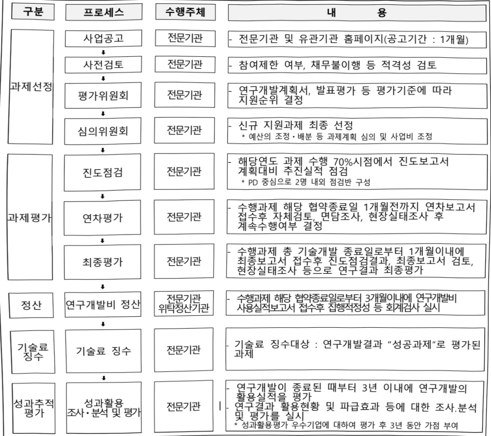

# 개인운동기록 활용 기술개발(R&D)

**해당 페이지**: PDF 3162 ~ 3166 쪽 해당

**부처**: 문화체육관광부
**분야**: 문화 및 관광
**회계유형**: 기금
**2026 확정예산**: 5725.0 백만원
**전년대비 증감률**: None%
**AI 도메인**: 데이터, 의료/바이오, 디지털전환(AX)

---

### 가.지출계획 총괄표

(단위: 백만원, %)

<table border=1 style='margin: auto; word-wrap: break-word;'><tr><td rowspan="2">사업명</td><td rowspan="2">2024년 결산</td><td colspan="2">2025년 계획</td><td colspan="2">2026년</td><td rowspan="2">증감(B-A)</td><td rowspan="2">(B-A)/A</td></tr><tr><td style='text-align: center; word-wrap: break-word;'>본예산</td><td style='text-align: center; word-wrap: break-word;'>추정·수정(A)</td><td style='text-align: center; word-wrap: break-word;'>요구안</td><td style='text-align: center; word-wrap: break-word;'>본예산(B)</td></tr><tr><td style='text-align: center; word-wrap: break-word;'>개인운동기록 활용 기술 개발(R&amp;D)</td><td style='text-align: center; word-wrap: break-word;'>-</td><td style='text-align: center; word-wrap: break-word;'>-</td><td style='text-align: center; word-wrap: break-word;'>-</td><td style='text-align: center; word-wrap: break-word;'>5,725</td><td style='text-align: center; word-wrap: break-word;'>5,725</td><td style='text-align: center; word-wrap: break-word;'>5,725</td><td style='text-align: center; word-wrap: break-word;'>순증</td></tr></table>

□ 기능별(내역사업별), 목별 계획 내역

(단위:백만원)

<table border=1 style='margin: auto; word-wrap: break-word;'><tr><td rowspan="2"></td><td colspan="5">2024</td><td colspan="5">2025</td><td rowspan="2">2026 계획</td></tr><tr><td style='text-align: center; word-wrap: break-word;'>계획액(추경)</td><td style='text-align: center; word-wrap: break-word;'>계획현액</td><td style='text-align: center; word-wrap: break-word;'>집행액</td><td style='text-align: center; word-wrap: break-word;'>이월액</td><td style='text-align: center; word-wrap: break-word;'>불용액</td><td style='text-align: center; word-wrap: break-word;'>계획액(추경)</td><td style='text-align: center; word-wrap: break-word;'>계획현액</td><td style='text-align: center; word-wrap: break-word;'>집행액</td><td style='text-align: center; word-wrap: break-word;'>이월액</td><td style='text-align: center; word-wrap: break-word;'>불용액</td></tr><tr><td style='text-align: center; word-wrap: break-word;'>○ 기능별 분류(함께)</td><td style='text-align: center; word-wrap: break-word;'>-</td><td style='text-align: center; word-wrap: break-word;'>-</td><td style='text-align: center; word-wrap: break-word;'>-</td><td style='text-align: center; word-wrap: break-word;'>-</td><td style='text-align: center; word-wrap: break-word;'>-</td><td style='text-align: center; word-wrap: break-word;'>-</td><td style='text-align: center; word-wrap: break-word;'>-</td><td style='text-align: center; word-wrap: break-word;'>-</td><td style='text-align: center; word-wrap: break-word;'>-</td><td style='text-align: center; word-wrap: break-word;'>-</td><td style='text-align: center; word-wrap: break-word;'>5,725</td></tr><tr><td rowspan="3">· 스포츠  데이터 표준 기술개발 · 한국형  스포츠 활용형 AX 기술 개발 · 개인운동기록 융합 서비스 실증</td><td style='text-align: center; word-wrap: break-word;'>-</td><td style='text-align: center; word-wrap: break-word;'>-</td><td style='text-align: center; word-wrap: break-word;'>-</td><td style='text-align: center; word-wrap: break-word;'>-</td><td style='text-align: center; word-wrap: break-word;'>-</td><td style='text-align: center; word-wrap: break-word;'>-</td><td style='text-align: center; word-wrap: break-word;'>-</td><td style='text-align: center; word-wrap: break-word;'>-</td><td style='text-align: center; word-wrap: break-word;'>-</td><td style='text-align: center; word-wrap: break-word;'>-</td><td style='text-align: center; word-wrap: break-word;'>2,450</td></tr><tr><td style='text-align: center; word-wrap: break-word;'>-</td><td style='text-align: center; word-wrap: break-word;'>-</td><td style='text-align: center; word-wrap: break-word;'>-</td><td style='text-align: center; word-wrap: break-word;'>-</td><td style='text-align: center; word-wrap: break-word;'>-</td><td style='text-align: center; word-wrap: break-word;'>-</td><td style='text-align: center; word-wrap: break-word;'>-</td><td style='text-align: center; word-wrap: break-word;'>-</td><td style='text-align: center; word-wrap: break-word;'>-</td><td style='text-align: center; word-wrap: break-word;'>-</td><td style='text-align: center; word-wrap: break-word;'>1,490</td></tr><tr><td style='text-align: center; word-wrap: break-word;'>-</td><td style='text-align: center; word-wrap: break-word;'>-</td><td style='text-align: center; word-wrap: break-word;'>-</td><td style='text-align: center; word-wrap: break-word;'>-</td><td style='text-align: center; word-wrap: break-word;'>-</td><td style='text-align: center; word-wrap: break-word;'>-</td><td style='text-align: center; word-wrap: break-word;'>-</td><td style='text-align: center; word-wrap: break-word;'>-</td><td style='text-align: center; word-wrap: break-word;'>-</td><td style='text-align: center; word-wrap: break-word;'>-</td><td style='text-align: center; word-wrap: break-word;'>1,785</td></tr></table>

### 나. 사업설명자료

## 1 ) 사업목적·내용

(1) (개인운동기록 활용 기술개발(R&D))

①(스포츠 데이터 표준 기술 개발)

- 스포츠 데이터 표준개발로 의료데이터에 스포츠 데이터 제공 및 데이터 활용성, 관리

효율성 극대화를 목적으로 추진하는 사업

- (직접 수혜자) 스포츠 지도사, 헬스케어 플랫폼 기업, 의료기관

- (간접 수혜자) 스포츠 참여자, 스포츠 테크 기업, 보험사

②(한국형 스포츠 활용형 AX 기술개발)

- PSR 기반의 체계적 운동 관리 및 의사결정을 지원하고 개인운동 효과성 증진 및 만족도

향상을 목적으로 추진하는 사업

- (직접 수혜자) 일반국민, 운동 전문가 및 트레이너, 스포츠 서비스 기업

- (간접 수혜자) 의료기관, 공공체육시설 운영기관, 정책기관

---

③ (개인운동기록 융합 서비스 실증)

- 침단 AI 기술을 활용한 맞춤형 건강 관리 서비스 제공 및 데이터 기반의 건강증진,

운동 효과성 증대를 목적으로 추진하는 사업

- (직접 수혜자) 운동 참여자, 스포츠 코치, 헬스케어 기업

- (간접 수혜자) 민간 운동시설, 정책기관, 스포츠테크 기업

## 2 ) 사업개요

## □ 사업근거 및 추진경위

① 법령상 근거 및 조항 적시

스포츠산업진흥법 제6조(경쟁력 강화 조치·지원 등) ①문화체육관광부장관은 (중 략) 스포츠산업의 경쟁력 강화를 위한 조치를 취하고자 할 때에는 예산의 범위에서 지원할 수 있다.

스포츠산업진흥법 제8조(기술개발의 추진) ①문화체육관광부장관은 스포츠산업과 관련된 기술개발을 추진하기 위한 정책을 수립 · 시행하고, 기술개발을 수행하는 데 드는 자금을 예산의 범위에서 지원하거나 출연할 수 있다.

생활체육진흥법 제5조(국가 등의 책무) ① 국가 및 지방자치단체는 생활체육의 진흥을 위하여 필요한 시책을 수립·시행하여야 한다. ② 국가 및 지방자치단체는 제1항에 따른 책무를 다하기 위하여 이에 수반되는 예산상의 조치를 취하도록 노력하여야 한다.

0 국민체육진흥법 제3조(체육 진흥 정책과 권장) 국가와 지방자치단체는 국민체육 진흥에 관한 시책을 마련하고 국민의 자발적인 체육 활동을 권장·보호 및 육성하여야 한다.

② 추진경위 - 사업 시작년도, 추진배경, 부처별 중점과제, 대통령 공약사항 등

o (사업 시작년도) 2026년

o (추진배경)

- (건강수명 관리) 건강수명은 2012년 65.7년에서 2022년 65.8년으로 10년 동안 0.1년 증가에 불과하여 국가 차원의 건강수명 증진지원 필요

- (산업 활성화) 스포츠 데이터 수집과 지능화로 산업기반 확보 및 활용도 제고

°(국정과제)(사회2-17) 모두가 즐기는 스포츠

o (실천과제) 3번 지역 균형 발전을 이끌고 미래를 선도하는 스포츠산업

0 (국정과제 관련공약)

- (A-35-2) 전 생애주기별 체육 활동 지원

- (B-2-1-1) 인공지능 대전환(AX)을 통해 AI 3강으로 도약하겠습니다.

- (B-2-1-9) 국민 누구나 AI를 쉽고 편리하게 사용할 수 있는 나라를 만들겠습니다.

---

## □ 주요내용

① 사업규모

- 총사업비(해당되는 경우에만 기재) : 해당 없음

- 사업기간 : 2026년~2028년

- 최근 5년 간 투입된 사업비(예산액기준, 추경편성한 연도에는 추경포함)

<table border=1 style='margin: auto; word-wrap: break-word;'><tr><td style='text-align: center; word-wrap: break-word;'>연도</td><td style='text-align: center; word-wrap: break-word;'>2022</td><td style='text-align: center; word-wrap: break-word;'>2023</td><td style='text-align: center; word-wrap: break-word;'>2024</td><td style='text-align: center; word-wrap: break-word;'>2025</td><td style='text-align: center; word-wrap: break-word;'>2026</td></tr><tr><td style='text-align: center; word-wrap: break-word;'>사업비</td><td style='text-align: center; word-wrap: break-word;'>-</td><td style='text-align: center; word-wrap: break-word;'>-</td><td style='text-align: center; word-wrap: break-word;'>-</td><td style='text-align: center; word-wrap: break-word;'>-</td><td style='text-align: center; word-wrap: break-word;'>5,725</td></tr></table>

② 사업추진체계

- 사업시행방법 : 출연

- 사업시행주체 : 한국콘텐츠진흥원

- 사업 수혜자 : 스포츠 관련 기업, 대학, 국공립연구소 등

- 보조, 융자, 출연, 출자 등의 경우 보조·융자 등 지원 비율 및 법적근거

<table border=1 style='margin: auto; word-wrap: break-word;'><tr><td style='text-align: center; word-wrap: break-word;'>내역사업명</td><td style='text-align: center; word-wrap: break-word;'>구분</td><td style='text-align: center; word-wrap: break-word;'>피보조·피출연 등 기관명</td><td style='text-align: center; word-wrap: break-word;'>지원 금액 (2026계획)</td><td style='text-align: center; word-wrap: break-word;'>지원 비율(%)</td><td style='text-align: center; word-wrap: break-word;'>보조율 법적근거 (해당 조항)</td></tr><tr><td style='text-align: center; word-wrap: break-word;'>스포츠 데이터 표준 기술개발</td><td style='text-align: center; word-wrap: break-word;'>출연</td><td style='text-align: center; word-wrap: break-word;'>스포츠 관련 기업, 대학 국정법연구소 등</td><td style='text-align: center; word-wrap: break-word;'>2,450</td><td style='text-align: center; word-wrap: break-word;'>정액지원</td><td style='text-align: center; word-wrap: break-word;'>문화산업진흥기본법제17조 (기술 및 문화콘텐츠 개발의 촉진)</td></tr><tr><td style='text-align: center; word-wrap: break-word;'>한국형 스포츠 활용형 AX 기술 개발</td><td style='text-align: center; word-wrap: break-word;'>출연</td><td style='text-align: center; word-wrap: break-word;'>스포츠 관련 기업, 대학 국정법연구소 등</td><td style='text-align: center; word-wrap: break-word;'>1,490</td><td style='text-align: center; word-wrap: break-word;'>정액지원</td><td style='text-align: center; word-wrap: break-word;'>문화산업진흥기본법제17조 (기술 및 문화콘텐츠 개발의 촉진)</td></tr><tr><td style='text-align: center; word-wrap: break-word;'>개인운동기록 용합 서비스 실증</td><td style='text-align: center; word-wrap: break-word;'>출연</td><td style='text-align: center; word-wrap: break-word;'>스포츠 관련 기업, 대학 국정법연구소 등</td><td style='text-align: center; word-wrap: break-word;'>1,785</td><td style='text-align: center; word-wrap: break-word;'>정액지원</td><td style='text-align: center; word-wrap: break-word;'>문화산업진흥기본법제17조 (기술 및 문화콘텐츠 개발의 촉진)</td></tr></table>

## 3 ) 2026년도 계획 산출 근거

□ 개인운동기록 활용 기술 개발 : (2025 당초 계획) 0백만원 → (2026 계획) 5,725백만원, 순증

스포츠 데이터 표준 개발 (2025 당초 계획) 0백만원 → (2026 계획) 2,450백만원, 순증

- (요구) 스포츠 데이터표준 개발을 통한, 스포츠 데이터의 체계적 수집 및 관리를 위한 신규 과제(3개) 수행을 위해 2,450백만원 반영

- (산출) (신규) 3개 과제 x 1,089백만원 x 9/12개월 = 2,450백만원

② 한국형 스포츠 활용형 AX기술개발 (2025 당초 계획) 0백만원 → (2026 계획) 1,490백만원, 순증

- (요구) 데이터의 파인튜닝 및 대화형 개인 PSR 기반 운동처방 의사결정 지원 기술 개발을 위한 신규 과제(3개) 수행을 위해 1,490백만원 반영

- (산출) (신규) 3개 과제 x 662.5백만원 x 9/12개월 = 1,490백만원

③ 개인운동기록 융합서비스 실증 : (2025 당초 계획) 0백만원 → (2026 계획) 1,785백만원, 순증

- (요구) 종목별 특화 AI 운동 트레이너 기술 개발을 위한 신규 과제(3개) 수행을 위해 1,785백만원 반영

- (산출) (신규) 3개 과제 x 793.3백만원 x 9/12개월 = 1,785백만원

---

4) 사업효과: 해당 없음(신규)

5) 타당성조사 및 예비타당성조사 시행여부 및 결과 요지: 해당 없음

6) 총사업비 대상사업 여부 및 내역: 해당 없음

7) 사업 집행절차

8) 각종 평가: 해당 없음(신규)

다.최근 4년간 결산내역: 해당 없음('26년 신규)

---

<table border=1 style='margin: auto; word-wrap: break-word;'><tr><td style='text-align: center; word-wrap: break-word;'>사 업 명</td></tr><tr><td style='text-align: center; word-wrap: break-word;'>(50) 국학진흥 정책기반 조성 (1533-301)</td></tr></table>

사업 코드 정보

<table border=1 style='margin: auto; word-wrap: break-word;'><tr><td style='text-align: center; word-wrap: break-word;'>구분</td><td style='text-align: center; word-wrap: break-word;'>회계</td><td style='text-align: center; word-wrap: break-word;'>소관</td><td style='text-align: center; word-wrap: break-word;'>실국(기관)</td><td style='text-align: center; word-wrap: break-word;'>계정</td><td style='text-align: center; word-wrap: break-word;'>분야</td><td style='text-align: center; word-wrap: break-word;'>부문</td></tr><tr><td style='text-align: center; word-wrap: break-word;'>코드</td><td rowspan="2">일반회계</td><td rowspan="2">문화체육관광부</td><td rowspan="2">문화정책관</td><td rowspan="2"></td><td style='text-align: center; word-wrap: break-word;'>060</td><td style='text-align: center; word-wrap: break-word;'>061</td></tr><tr><td style='text-align: center; word-wrap: break-word;'>명칭</td><td style='text-align: center; word-wrap: break-word;'>문화 및 관광</td><td style='text-align: center; word-wrap: break-word;'>문화예술</td></tr></table>

<table border=1 style='margin: auto; word-wrap: break-word;'><tr><td style='text-align: center; word-wrap: break-word;'>구분</td><td style='text-align: center; word-wrap: break-word;'>프로그램</td><td style='text-align: center; word-wrap: break-word;'>단위사업</td><td style='text-align: center; word-wrap: break-word;'>세부사업</td></tr><tr><td style='text-align: center; word-wrap: break-word;'>코드</td><td style='text-align: center; word-wrap: break-word;'>1500</td><td style='text-align: center; word-wrap: break-word;'>1533</td><td style='text-align: center; word-wrap: break-word;'>301</td></tr><tr><td style='text-align: center; word-wrap: break-word;'>명칭</td><td style='text-align: center; word-wrap: break-word;'>창의적문화정책구현</td><td style='text-align: center; word-wrap: break-word;'>전통문화 진흥</td><td style='text-align: center; word-wrap: break-word;'>국학진흥 정책기반 조성</td></tr></table>

☐ 사업 성격

<table border=1 style='margin: auto; word-wrap: break-word;'><tr><td rowspan="2">신규</td><td rowspan="2">계속</td><td rowspan="2">완료</td><td rowspan="2">예비타당성 실시여부</td><td rowspan="2">총사업비 관리대상</td><td rowspan="2">총액계상 예산사업</td><td style='text-align: center; word-wrap: break-word;'>사업소관 변경정보</td></tr><tr><td style='text-align: center; word-wrap: break-word;'>2025예산 시 소관</td></tr><tr><td style='text-align: center; word-wrap: break-word;'></td><td style='text-align: center; word-wrap: break-word;'>O</td><td style='text-align: center; word-wrap: break-word;'></td><td style='text-align: center; word-wrap: break-word;'></td><td style='text-align: center; word-wrap: break-word;'></td><td style='text-align: center; word-wrap: break-word;'></td><td style='text-align: center; word-wrap: break-word;'></td></tr></table>

□ 사업 지원 형태 및 지원을

<table border=1 style='margin: auto; word-wrap: break-word;'><tr><td style='text-align: center; word-wrap: break-word;'>직접</td><td style='text-align: center; word-wrap: break-word;'>출자</td><td style='text-align: center; word-wrap: break-word;'>출연</td><td style='text-align: center; word-wrap: break-word;'>보조</td><td style='text-align: center; word-wrap: break-word;'>융자</td><td style='text-align: center; word-wrap: break-word;'>국고보조율(%)</td><td style='text-align: center; word-wrap: break-word;'>융자율(%)</td></tr><tr><td style='text-align: center; word-wrap: break-word;'></td><td style='text-align: center; word-wrap: break-word;'></td><td style='text-align: center; word-wrap: break-word;'></td><td style='text-align: center; word-wrap: break-word;'>O</td><td style='text-align: center; word-wrap: break-word;'></td><td style='text-align: center; word-wrap: break-word;'></td><td style='text-align: center; word-wrap: break-word;'></td></tr></table>

□사업 소관부처 및 시행주체

<table border=1 style='margin: auto; word-wrap: break-word;'><tr><td style='text-align: center; word-wrap: break-word;'>사업명</td><td colspan="2">구분</td></tr><tr><td rowspan="2">국학자료 수집 및 연구</td><td style='text-align: center; word-wrap: break-word;'>소관부처</td><td style='text-align: center; word-wrap: break-word;'>실·국·과(팀)명</td></tr><tr><td style='text-align: center; word-wrap: break-word;'>사업시행주체</td><td style='text-align: center; word-wrap: break-word;'>한국국학진흥원, 한국학호남진흥원, 한국유교문화진흥원, 율곡국학진흥원, 퇴계학진흥회</td></tr><tr><td rowspan="2">국학자료 활용 및 확산</td><td style='text-align: center; word-wrap: break-word;'>소관부처</td><td style='text-align: center; word-wrap: break-word;'>문화예술정책관실 문화정책관 전통문화과</td></tr><tr><td style='text-align: center; word-wrap: break-word;'>사업시행주체</td><td style='text-align: center; word-wrap: break-word;'>한국국학진흥원</td></tr><tr><td rowspan="2">퇴계학 진흥 연구</td><td style='text-align: center; word-wrap: break-word;'>소관부처</td><td style='text-align: center; word-wrap: break-word;'>문화예술정책관실 문화정책관 전통문화과</td></tr><tr><td style='text-align: center; word-wrap: break-word;'>사업시행주체</td><td style='text-align: center; word-wrap: break-word;'>퇴계학진흥회, 퇴계학연구원, 국제퇴계학회</td></tr></table>

---

### 원본 PDF 크롭 이미지

