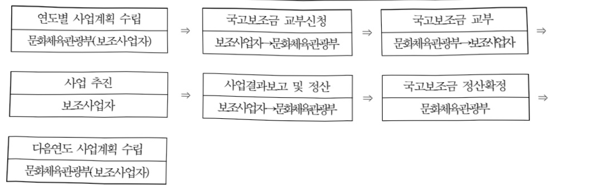

# 국학진흥 정책기반 조성

**해당 페이지**: PDF 3167 ~ 3174 쪽 해당

**부처**: 문화체육관광부
**분야**: 문화 및 관광
**회계유형**: 일반회계
**2026 확정예산**: 11702.0 백만원
**전년대비 증감률**: -8.7%
**AI 도메인**: 교육/인재

---

<table border=1 style='margin: auto; word-wrap: break-word;'><tr><td style='text-align: center; word-wrap: break-word;'>사 업 명</td></tr><tr><td style='text-align: center; word-wrap: break-word;'>(50) 국학진흥 정책기반 조성 (1533-301)</td></tr></table>

사업 코드 정보

<table border=1 style='margin: auto; word-wrap: break-word;'><tr><td style='text-align: center; word-wrap: break-word;'>구분</td><td style='text-align: center; word-wrap: break-word;'>회계</td><td style='text-align: center; word-wrap: break-word;'>소관</td><td style='text-align: center; word-wrap: break-word;'>실국(기관)</td><td style='text-align: center; word-wrap: break-word;'>계정</td><td style='text-align: center; word-wrap: break-word;'>분야</td><td style='text-align: center; word-wrap: break-word;'>부문</td></tr><tr><td style='text-align: center; word-wrap: break-word;'>코드</td><td rowspan="2">일반회계</td><td rowspan="2">문화체육관광부</td><td rowspan="2">문화정책관</td><td rowspan="2"></td><td style='text-align: center; word-wrap: break-word;'>060</td><td style='text-align: center; word-wrap: break-word;'>061</td></tr><tr><td style='text-align: center; word-wrap: break-word;'>명칭</td><td style='text-align: center; word-wrap: break-word;'>문화 및 관광</td><td style='text-align: center; word-wrap: break-word;'>문화예술</td></tr></table>

<table border=1 style='margin: auto; word-wrap: break-word;'><tr><td style='text-align: center; word-wrap: break-word;'>구분</td><td style='text-align: center; word-wrap: break-word;'>프로그램</td><td style='text-align: center; word-wrap: break-word;'>단위사업</td><td style='text-align: center; word-wrap: break-word;'>세부사업</td></tr><tr><td style='text-align: center; word-wrap: break-word;'>코드</td><td style='text-align: center; word-wrap: break-word;'>1500</td><td style='text-align: center; word-wrap: break-word;'>1533</td><td style='text-align: center; word-wrap: break-word;'>301</td></tr><tr><td style='text-align: center; word-wrap: break-word;'>명칭</td><td style='text-align: center; word-wrap: break-word;'>창의적문화정책구현</td><td style='text-align: center; word-wrap: break-word;'>전통문화 진흥</td><td style='text-align: center; word-wrap: break-word;'>국학진흥 정책기반 조성</td></tr></table>

☐ 사업 성격

<table border=1 style='margin: auto; word-wrap: break-word;'><tr><td rowspan="2">신규</td><td rowspan="2">계속</td><td rowspan="2">완료</td><td rowspan="2">예비타당성 실시여부</td><td rowspan="2">총사업비 관리대상</td><td rowspan="2">총액계상 예산사업</td><td style='text-align: center; word-wrap: break-word;'>사업소관 변경정보</td></tr><tr><td style='text-align: center; word-wrap: break-word;'>2025예산 시 소관</td></tr><tr><td style='text-align: center; word-wrap: break-word;'></td><td style='text-align: center; word-wrap: break-word;'>O</td><td style='text-align: center; word-wrap: break-word;'></td><td style='text-align: center; word-wrap: break-word;'></td><td style='text-align: center; word-wrap: break-word;'></td><td style='text-align: center; word-wrap: break-word;'></td><td style='text-align: center; word-wrap: break-word;'></td></tr></table>

□ 사업 지원 형태 및 지원을

<table border=1 style='margin: auto; word-wrap: break-word;'><tr><td style='text-align: center; word-wrap: break-word;'>직접</td><td style='text-align: center; word-wrap: break-word;'>출자</td><td style='text-align: center; word-wrap: break-word;'>출연</td><td style='text-align: center; word-wrap: break-word;'>보조</td><td style='text-align: center; word-wrap: break-word;'>융자</td><td style='text-align: center; word-wrap: break-word;'>국고보조율(%)</td><td style='text-align: center; word-wrap: break-word;'>융자율(%)</td></tr><tr><td style='text-align: center; word-wrap: break-word;'></td><td style='text-align: center; word-wrap: break-word;'></td><td style='text-align: center; word-wrap: break-word;'></td><td style='text-align: center; word-wrap: break-word;'>O</td><td style='text-align: center; word-wrap: break-word;'></td><td style='text-align: center; word-wrap: break-word;'></td><td style='text-align: center; word-wrap: break-word;'></td></tr></table>

□사업 소관부처 및 시행주체

<table border=1 style='margin: auto; word-wrap: break-word;'><tr><td style='text-align: center; word-wrap: break-word;'>사업명</td><td colspan="2">구분</td></tr><tr><td rowspan="2">국학자료 수집 및 연구</td><td style='text-align: center; word-wrap: break-word;'>소관부처</td><td style='text-align: center; word-wrap: break-word;'>실·국·과(팀)명</td></tr><tr><td style='text-align: center; word-wrap: break-word;'>사업시행주체</td><td style='text-align: center; word-wrap: break-word;'>한국국학진흥원, 한국학호남진흥원, 한국유교문화진흥원, 율곡국학진흥원, 퇴계학진흥회</td></tr><tr><td rowspan="2">국학자료 활용 및 확산</td><td style='text-align: center; word-wrap: break-word;'>소관부처</td><td style='text-align: center; word-wrap: break-word;'>문화예술정책관실 문화정책관 전통문화과</td></tr><tr><td style='text-align: center; word-wrap: break-word;'>사업시행주체</td><td style='text-align: center; word-wrap: break-word;'>한국국학진흥원</td></tr><tr><td rowspan="2">퇴계학 진흥 연구</td><td style='text-align: center; word-wrap: break-word;'>소관부처</td><td style='text-align: center; word-wrap: break-word;'>문화예술정책관실 문화정책관 전통문화과</td></tr><tr><td style='text-align: center; word-wrap: break-word;'>사업시행주체</td><td style='text-align: center; word-wrap: break-word;'>퇴계학진흥회, 퇴계학연구원, 국제퇴계학회</td></tr></table>

---

### 가.예산 총괄표

(단위: 백만원, %)

<table border=1 style='margin: auto; word-wrap: break-word;'><tr><td rowspan="2">사업명</td><td rowspan="2">2024년 결산</td><td colspan="2">2025년 예산</td><td colspan="2">2026년 예산</td><td rowspan="2">증감(B-A)</td><td rowspan="2">(B-A)/A</td></tr><tr><td style='text-align: center; word-wrap: break-word;'>본예산</td><td style='text-align: center; word-wrap: break-word;'>추경(A)</td><td style='text-align: center; word-wrap: break-word;'>요구안</td><td style='text-align: center; word-wrap: break-word;'>본예산(B)</td></tr><tr><td style='text-align: center; word-wrap: break-word;'>국학진흥정책기반 조성</td><td style='text-align: center; word-wrap: break-word;'>13,853</td><td style='text-align: center; word-wrap: break-word;'>12,812</td><td style='text-align: center; word-wrap: break-word;'>12,812</td><td style='text-align: center; word-wrap: break-word;'>11,531</td><td style='text-align: center; word-wrap: break-word;'>11,702</td><td style='text-align: center; word-wrap: break-word;'>△1,110</td><td style='text-align: center; word-wrap: break-word;'>△8.7</td></tr></table>

□ 기능별(내역사업별) 예산 내역

(단위:백만원)

<table border=1 style='margin: auto; word-wrap: break-word;'><tr><td rowspan="2"></td><td colspan="5">2024</td><td colspan="5">2025</td><td rowspan="2">2026예산</td></tr><tr><td style='text-align: center; word-wrap: break-word;'>예산액(추경)</td><td style='text-align: center; word-wrap: break-word;'>예산현액</td><td style='text-align: center; word-wrap: break-word;'>집행액</td><td style='text-align: center; word-wrap: break-word;'>이월액</td><td style='text-align: center; word-wrap: break-word;'>불용액</td><td style='text-align: center; word-wrap: break-word;'>예산액(추경)</td><td style='text-align: center; word-wrap: break-word;'>예산현액</td><td style='text-align: center; word-wrap: break-word;'>집행액</td><td style='text-align: center; word-wrap: break-word;'>이월액</td><td style='text-align: center; word-wrap: break-word;'>불용액</td></tr><tr><td style='text-align: center; word-wrap: break-word;'>○ 기능별 분류(합계)</td><td style='text-align: center; word-wrap: break-word;'>13,853</td><td style='text-align: center; word-wrap: break-word;'>13,853</td><td style='text-align: center; word-wrap: break-word;'>13,853</td><td style='text-align: center; word-wrap: break-word;'>-</td><td style='text-align: center; word-wrap: break-word;'>-</td><td style='text-align: center; word-wrap: break-word;'>12,812</td><td style='text-align: center; word-wrap: break-word;'>12,812</td><td style='text-align: center; word-wrap: break-word;'>12,812</td><td style='text-align: center; word-wrap: break-word;'>-</td><td style='text-align: center; word-wrap: break-word;'>-</td><td style='text-align: center; word-wrap: break-word;'>11,702</td></tr><tr><td style='text-align: center; word-wrap: break-word;'>· 국학자료 수집 및 연구</td><td style='text-align: center; word-wrap: break-word;'>7,997</td><td style='text-align: center; word-wrap: break-word;'>7,997</td><td style='text-align: center; word-wrap: break-word;'>7,997</td><td style='text-align: center; word-wrap: break-word;'>-</td><td style='text-align: center; word-wrap: break-word;'>-</td><td style='text-align: center; word-wrap: break-word;'>7,198</td><td style='text-align: center; word-wrap: break-word;'>7,458</td><td style='text-align: center; word-wrap: break-word;'>7,458</td><td style='text-align: center; word-wrap: break-word;'>-</td><td style='text-align: center; word-wrap: break-word;'>-</td><td style='text-align: center; word-wrap: break-word;'>8,058</td></tr><tr><td style='text-align: center; word-wrap: break-word;'>· 국학자료 활용 및 확산</td><td style='text-align: center; word-wrap: break-word;'>2,516</td><td style='text-align: center; word-wrap: break-word;'>2,516</td><td style='text-align: center; word-wrap: break-word;'>2,516</td><td style='text-align: center; word-wrap: break-word;'>-</td><td style='text-align: center; word-wrap: break-word;'>-</td><td style='text-align: center; word-wrap: break-word;'>2,274</td><td style='text-align: center; word-wrap: break-word;'>2,274</td><td style='text-align: center; word-wrap: break-word;'>2,274</td><td style='text-align: center; word-wrap: break-word;'>-</td><td style='text-align: center; word-wrap: break-word;'>-</td><td style='text-align: center; word-wrap: break-word;'>2,874</td></tr><tr><td style='text-align: center; word-wrap: break-word;'>· 퇴계학 진흥 연구</td><td style='text-align: center; word-wrap: break-word;'>-</td><td style='text-align: center; word-wrap: break-word;'>-</td><td style='text-align: center; word-wrap: break-word;'>-</td><td style='text-align: center; word-wrap: break-word;'>-</td><td style='text-align: center; word-wrap: break-word;'>-</td><td style='text-align: center; word-wrap: break-word;'>260</td><td style='text-align: center; word-wrap: break-word;'>-</td><td style='text-align: center; word-wrap: break-word;'>-</td><td style='text-align: center; word-wrap: break-word;'>-</td><td style='text-align: center; word-wrap: break-word;'>-</td><td style='text-align: center; word-wrap: break-word;'>770</td></tr><tr><td style='text-align: center; word-wrap: break-word;'>· 국학진흥 청년일 자리 창출</td><td style='text-align: center; word-wrap: break-word;'>2,100</td><td style='text-align: center; word-wrap: break-word;'>2,100</td><td style='text-align: center; word-wrap: break-word;'>2,100</td><td style='text-align: center; word-wrap: break-word;'>-</td><td style='text-align: center; word-wrap: break-word;'>-</td><td style='text-align: center; word-wrap: break-word;'>1,890</td><td style='text-align: center; word-wrap: break-word;'>1,890</td><td style='text-align: center; word-wrap: break-word;'>1,890</td><td style='text-align: center; word-wrap: break-word;'>-</td><td style='text-align: center; word-wrap: break-word;'>-</td><td style='text-align: center; word-wrap: break-word;'>-</td></tr><tr><td style='text-align: center; word-wrap: break-word;'>· 국학자료 실버일 자리 창출</td><td style='text-align: center; word-wrap: break-word;'>500</td><td style='text-align: center; word-wrap: break-word;'>500</td><td style='text-align: center; word-wrap: break-word;'>500</td><td style='text-align: center; word-wrap: break-word;'>-</td><td style='text-align: center; word-wrap: break-word;'>-</td><td style='text-align: center; word-wrap: break-word;'>450</td><td style='text-align: center; word-wrap: break-word;'>450</td><td style='text-align: center; word-wrap: break-word;'>450</td><td style='text-align: center; word-wrap: break-word;'>-</td><td style='text-align: center; word-wrap: break-word;'>-</td><td style='text-align: center; word-wrap: break-word;'>-</td></tr><tr><td style='text-align: center; word-wrap: break-word;'>· 전라유학진흥원 건립</td><td style='text-align: center; word-wrap: break-word;'>740</td><td style='text-align: center; word-wrap: break-word;'>740</td><td style='text-align: center; word-wrap: break-word;'>740</td><td style='text-align: center; word-wrap: break-word;'>-</td><td style='text-align: center; word-wrap: break-word;'>-</td><td style='text-align: center; word-wrap: break-word;'>740</td><td style='text-align: center; word-wrap: break-word;'>740</td><td style='text-align: center; word-wrap: break-word;'>740</td><td style='text-align: center; word-wrap: break-word;'>-</td><td style='text-align: center; word-wrap: break-word;'>-</td><td style='text-align: center; word-wrap: break-word;'>-</td></tr></table>

### 나. 사업설명자료

## 1 ) 사업목적·내용

0 (국학진흥 정책기반 조성)

- (국학자료 수집 및 연구)

(목적) 문화재 정책의 사각지대에서 훼손·멸실 위기에 있는 전통기록유산을 비롯한 민간소장 국학 자료에 대한 체계적인 조사·연구를 통해 국학 자료를 과학적으로 보존하고, 민족의 자산으로 발전·계승

·(내용) 권역별(영남, 호남, 충청, 강원) 국학자료 수집·조사·보존 및 연구

- (국학자료 활용 및 확산)

·(목적) 접근성이 낮은 고서, 고문서 등 국학자료의 활용성 증대 및 전통기록유산의 해외 활성화를 통해 한국 전통문화의 확산

(내용) 국역 및 국학전문인력 양성, 국학자료 DB구축 및 콘텐츠 개발, 전통문화 활용 및 보급, 국학분야 인공지능 자동번역시스템 구축, 국학진흥협의체 사업 운영

---

## - (퇴계학 진흥 연구)

(목적) 퇴계학 전문연구 심화, 학문 후속세대 양성 및 사전편찬 학술연구 등 퇴계

정신선양을 통한 대국민 인문정신문화 함양 및 퇴계학 대중 접근성 제고

(내용) 퇴계학 사전편찬 학술연구, 퇴계학 조사 연구, 퇴계학 국제학술대회 등

## 2 ) 사업개요

## 사업근거 및 추진경위

① 법령상 근거 및 조항

- 문화예술진흥법 제3조 (시책과 권장) ①국가와 지방자치단체는 문화예술 진흥에 관한 시책 (施策)을 강구, 국민의 문화예술 활동을 권장 · 보호 · 육성하며, 이에 필요한 재원을 적극 마련해야 한다.

- 문화예술진흥법 제39조 (국고 보조) 국가와 지방자치단체는 예산의 범위에 문화예술 진흥을 목적으로 하는 사업 또는 활동이나 시설에 드는 경비의 일부를 보조할 수 있다.

- 문화기본법 제5조(국가와 지방자치단체의 책무) ①국가는 국민의 문화권을 보장하기 위하여 문화진흥에 관한 정책을 수립·시행하고, 이를 위한 재원(財源)의 확충과 효율적인 운영을 위하여 노력하여야 한다.

- 문화기본법 제13조(문화진흥 시업에 대한 재정 지원 등) ① 국가와 지방자치단체는 문화 진흥 사업에 대하여 예산의 범위에서 필요한 재정 지원을 하여야 한다.

## ② 추진경위

- (시작연도) 2002년

- (추진배경) 훼손·멸실 위기에 처한 민간소장 국학자료에 대한 체계적인 조사·연구 및 보존을 통해 향후 K-콘텐츠 자산 축적 필요

## 주요내용

① 사업규모

- 총사업비 : 해당없음

- 사업기간 : 2002년 ~ (단년도 계속)

- 최근 5년 간 투입된 사업비

<table border=1 style='margin: auto; word-wrap: break-word;'><tr><td style='text-align: center; word-wrap: break-word;'>$ \underline{\text{연도}} $</td><td style='text-align: center; word-wrap: break-word;'>2022</td><td style='text-align: center; word-wrap: break-word;'>2023</td><td style='text-align: center; word-wrap: break-word;'>2024</td><td style='text-align: center; word-wrap: break-word;'>2025</td><td style='text-align: center; word-wrap: break-word;'>2026</td></tr><tr><td style='text-align: center; word-wrap: break-word;'>$ \underline{\text{사업비}} $</td><td style='text-align: center; word-wrap: break-word;'>18,687</td><td style='text-align: center; word-wrap: break-word;'>18,518</td><td style='text-align: center; word-wrap: break-word;'>13,853</td><td style='text-align: center; word-wrap: break-word;'>12,812</td><td style='text-align: center; word-wrap: break-word;'>11,702</td></tr></table>

---

## ② 사업추진체계

- 사업시행방법 : 보조(민간경상보조)

- 사업시행주체 : 한국국학진흥원, 한국학호남진흥원, 한국유교문화진흥원, 율곡국학진흥원, 퇴계학진흥회 등

- 사업 수혜자 : 기탁문중, 학계 및 일반국민 등

- 보조, 융자, 출연, 출자 등의 경우 보조·융자 등 지원 비율 및 법적근거

<table border=1 style='margin: auto; word-wrap: break-word;'><tr><td style='text-align: center; word-wrap: break-word;'>내역사업명</td><td style='text-align: center; word-wrap: break-word;'>구분</td><td style='text-align: center; word-wrap: break-word;'>피보조·피출연 등 기관명</td><td style='text-align: center; word-wrap: break-word;'>지원 금액 (2026예산)</td><td style='text-align: center; word-wrap: break-word;'>지원 비율(%)</td><td style='text-align: center; word-wrap: break-word;'>보조율 법적근거 (해당 조항)</td></tr><tr><td rowspan="4">국학자료 수집 및 연구</td><td rowspan="4">보조</td><td style='text-align: center; word-wrap: break-word;'>한국국학 진흥원</td><td style='text-align: center; word-wrap: break-word;'>2,330</td><td style='text-align: center; word-wrap: break-word;'>정액(100%)</td><td style='text-align: center; word-wrap: break-word;'>보조금 관리에 관한 법률 제9조</td></tr><tr><td style='text-align: center; word-wrap: break-word;'>한국학 호남진흥원</td><td style='text-align: center; word-wrap: break-word;'>2,080</td><td style='text-align: center; word-wrap: break-word;'>정액(100%)</td><td style='text-align: center; word-wrap: break-word;'>보조금 관리에 관한 법률 제9조</td></tr><tr><td style='text-align: center; word-wrap: break-word;'>한국유교문화진흥원</td><td style='text-align: center; word-wrap: break-word;'>1,756</td><td style='text-align: center; word-wrap: break-word;'>정액(100%)</td><td style='text-align: center; word-wrap: break-word;'>보조금 관리에 관한 법률 제9조</td></tr><tr><td style='text-align: center; word-wrap: break-word;'>율곡국학진흥원</td><td style='text-align: center; word-wrap: break-word;'>1,892</td><td style='text-align: center; word-wrap: break-word;'>정액(100%)</td><td style='text-align: center; word-wrap: break-word;'>보조금 관리에 관한 법률 제9조</td></tr><tr><td style='text-align: center; word-wrap: break-word;'>국학자료 활용 및 확산</td><td style='text-align: center; word-wrap: break-word;'>보조</td><td style='text-align: center; word-wrap: break-word;'>한국국학 진흥원</td><td style='text-align: center; word-wrap: break-word;'>2,874</td><td style='text-align: center; word-wrap: break-word;'>정액(100%)</td><td style='text-align: center; word-wrap: break-word;'>보조금 관리에 관한 법률 제9조</td></tr><tr><td style='text-align: center; word-wrap: break-word;'>퇴계학 진흥 연구</td><td style='text-align: center; word-wrap: break-word;'>보조</td><td style='text-align: center; word-wrap: break-word;'>퇴계학진흥회</td><td style='text-align: center; word-wrap: break-word;'>770</td><td style='text-align: center; word-wrap: break-word;'>정액(100%)</td><td style='text-align: center; word-wrap: break-word;'>보조금 관리에 관한 법률 제9조</td></tr></table>

## 3 ) 2026년도 예산 산출 근거

① 국학자료 수집 및 연구: (25) 7,198백만원 → (26) 8,058백만원, 860백만원 증액(11.9%)

· 영남 국학진흥 지원 2,330백만원

· 호남 국학진흥 지원 2,080백만원

· 충청 국학진흥 지원 1,756백만원

· 강원 국학진흥 지원 1,892백만원

② 국학자료 활용 및 확산: (25) 2,274백만원 → (26) 2,874백만원, 600백만원 증액(26.4%)

· 국역 및 국학전문인력 양성 770백만원

· 국학자료 DB구축 및 콘텐츠 개발 526백만원

· 전통문화 활용 및 보급 448백만원

· 국학분야 인공지능 자동번역시스템 구축·운영 430백만원

· 국학진흥협의체 운영 400백만원 (민간기록문화 통합 플랫폼, 전통기록유산 해외교류 활성화)

· AI 인문데이터셋 구축 300백만원

③ 퇴계학 진흥 연구: (25) 260백만원 → (26) 770백만원, 510백만원 증액(196.2%)

· 퇴계학 사전편찬 학술연구 500백만원

· 퇴계학 조사 연구 120백만원

· 퇴계학 국제학술대회 150백만원

---

## 4 ) 사업효과

☐ 사업영향,산출물 성과지표 등

①2022~2026년도 성과계획서 상 성과지표 및 최근 5년간 성과 달성도

<table border=1 style='margin: auto; word-wrap: break-word;'><tr><td style='text-align: center; word-wrap: break-word;'>성과지표</td><td style='text-align: center; word-wrap: break-word;'>구분</td><td style='text-align: center; word-wrap: break-word;'>2022</td><td style='text-align: center; word-wrap: break-word;'>2023</td><td style='text-align: center; word-wrap: break-word;'>2024</td><td style='text-align: center; word-wrap: break-word;'>2025</td><td style='text-align: center; word-wrap: break-word;'>2026</td><td style='text-align: center; word-wrap: break-word;'>2026 목표치산출근거</td><td style='text-align: center; word-wrap: break-word;'>측정산식(또는 측정방법)</td><td style='text-align: center; word-wrap: break-word;'>자료수집방법(또는 자료출처)</td></tr><tr><td style='text-align: center; word-wrap: break-word;'>국학자료</td><td style='text-align: center; word-wrap: break-word;'>목표</td><td style='text-align: center; word-wrap: break-word;'>224,000</td><td style='text-align: center; word-wrap: break-word;'>235,000</td><td style='text-align: center; word-wrap: break-word;'>247,100</td><td style='text-align: center; word-wrap: break-word;'>255,000</td><td style='text-align: center; word-wrap: break-word;'>268,800</td><td style='text-align: center; word-wrap: break-word;'>전년도</td><td style='text-align: center; word-wrap: break-word;'>시스템 활용</td><td rowspan="3">사업실적보고서</td></tr><tr><td rowspan="2">열람건수(건)</td><td style='text-align: center; word-wrap: break-word;'>실적</td><td style='text-align: center; word-wrap: break-word;'>226,019</td><td style='text-align: center; word-wrap: break-word;'>253,053</td><td style='text-align: center; word-wrap: break-word;'>247,207</td><td style='text-align: center; word-wrap: break-word;'>262,888</td><td style='text-align: center; word-wrap: break-word;'>-</td><td rowspan="2">목표 대비 4%상향 조정</td><td rowspan="2">열람건수징계</td></tr><tr><td style='text-align: center; word-wrap: break-word;'>달성도</td><td style='text-align: center; word-wrap: break-word;'>100.9%</td><td style='text-align: center; word-wrap: break-word;'>107.8%</td><td style='text-align: center; word-wrap: break-word;'>100.0%</td><td style='text-align: center; word-wrap: break-word;'>101.8%</td><td style='text-align: center; word-wrap: break-word;'>-</td></tr></table>

## ② 성과지표 이외의 연도별 사업추진 경과 및 실적

<table border=1 style='margin: auto; word-wrap: break-word;'><tr><td style='text-align: center; word-wrap: break-word;'>2022</td><td style='text-align: center; word-wrap: break-word;'>○국학자료 수집 및 연구- 국학자료 수집량: 47,728점(영남 22,609점 호남 11,000점, 충청 5,969점, 강원 8,150점)○국학자료 활용 및 확산- 국학전문인력 양성 58명, 어린이 고전암송대회 43명 참가, 국역서 4종 발간, 일기자료 DB구축 33책, 이야기콘텐츠 소재 개발 610건, 유교책판 아카이브 구축 7,427장, 국학분야 인공지능 번역시스템 구축(차년도), 전통 기록문화 활용 콘퍼런스 및 공모전 2회(198명 66개팀), 청년선비포럼 2회, 전통문화 보급 전시 12회, 박물관학교 등 교육(6회, 121명), 콘텐츠 및 DB 이용자(페이지뷰수) 2,558,729뷰, 국학진흥협의체(3차년도) 운영 등○국학자료 청년일자리 창출: 청년 220명(영남 151명, 충청 69명)○국학자료 실버일자리 창출: 중장년 300명 선발, 수집 155,537건○전라유학진흥원 건립: 사전 행정절차 및 발굴조사 진행</td></tr><tr><td style='text-align: center; word-wrap: break-word;'>2023</td><td style='text-align: center; word-wrap: break-word;'>○국학자료 수집 및 연구- 국학자료 수집량: 55,681점(영남 21,355점 호남 15,300점, 충청 14,026점, 강원 5,000점)○국학자료 활용 및 확산- 국학전문인력 양성 57명, 어린이 고전암송대회 43명 참가, 국역서 3종 발간, 일기자료 DB구축 18책, 이야기콘텐츠 소재 개발 505건, 유교책판 아카이브 구축 6,507장, 국학분야 인공지능 번역시스템 구축(2차년도), 전통 기록문화 활용 콘퍼런스 및 공모전 2회(162명 54개팀), 청년선비포럼 2회, 전통문화 보급 전시 7회(7~12월), 박물관학교 등 교육(3회, 103명), 콘텐츠 및 DB 이용자(페이지뷰수) 2,739,474뷰, 국학진흥협의체(4차년도) 운영 등○국학자료 청년일자리 창출: 청년 157명(영남 96명, 충청 61명)○국학자료 실버일자리 창출: 중장년 254명 선발, 수집 223,852건○전라유학진흥원 건립: 설계용역 준공(&#x27;23.11월)</td></tr><tr><td style='text-align: center; word-wrap: break-word;'>2024</td><td style='text-align: center; word-wrap: break-word;'>○국학자료 수집 및 연구- 국학자료 수집량: 56,236점(영남 26,407점 호남 15,504점, 충청 10,013점, 강원 4,312점)○국학자료 활용 및 확산- 국학전문인력 양성 46명, 어린이 고전암송대회 62명 참가, 국학자료 목록집 9책 발간, 국학연구 53집~55집 발간(3종), 심층연구포럼(8회), 생활사 연구 포럼(2회) 및 학술대회(1회) 개최, 대학생 공모전(144명, 48개팀), 전통문화 보급 전시 9회, 박물관학교 등 교육(3회, 156명), 콘텐츠 DB 이용자 (페이지뷰수) 2,472,007뷰, 국학진흥협의체 개최(4회)○국학자료 청년일자리 창출: 청년 72명(영남 59명, 충청 13명)○국학자료 실버일자리 창출: 중장년 256명 활동, 수집 60,144건○전라유학진흥원 건립: 공사 착공(&#x27;24.3월)</td></tr><tr><td style='text-align: center; word-wrap: break-word;'>2025</td><td style='text-align: center; word-wrap: break-word;'>○국학자료 수집 및 연구- 국학자료 수집량: 57,403점(영남 25,868점, 호남 15,926점, 충청 10,839점, 강원 4,770점)○국학자료 활용 및 확산- 국학전문인력 양성 43명, 국학자료 목록집 11책 발간, 국학연구 3책(56~58집) 발간, 문헌기록과 발굴 발간 3책, 목판국제학술대회 개최(1회), 심층연구포럼 개최(6회), 생활사 연구 포럼 및 학술대회 개최(3회), 고전국역위원회 개최(2회), 전통문화 보급전 개최(1회), 전시도록 1종 발간, 국학진흥협의체 개최(9회)○국학자료 청년일자리 창출: 청년 66명(영남 60명, 충청 6명)○국학자료 실버일자리 창출: 중장년 177명 활동, 수집 54,366건○전라유학진흥원 건립: 공사 준공(&#x27;25.12.)</td></tr></table>

---

③향후(2026년도 이후)기대효과

0 개인 및 문중 소장 문화유산의 도난 및 훼손을 미연에 방지하고 체계적인 보존 관리를 통해 전통기록유산 계승 및 활용기반 마련

0 전통기록유산에 대한 체계적인 조사·수집 및 연구를 통해 세계기록유산 등재기반

마련 및 한국 전통문화의 세계화에 기여

0 미공개 자료의 발굴 및 공개로 한국학 연구 토대 구축 및 전통문화에 바탕을 둔 한국적 가치를 지속 발굴·보급하여 인문정신문화 진흥

0 전통기록유산을 활용한 다양한 이야기 소재를 알기 쉽게 국역·보급함으로써 국민들의 접근성 향상 및 문화콘텐츠 창작 원천소재로서의 활용도 제고

## 5 ) 타당성조사 및 예비타당성조사 시행여부 및 결과 요지: 해당 없음

## 6 ) 총사업비 대상사업 정보: 해당없음

## 7 ) 사업 집행절차

## 0 국학자료 수집 및 연구

<table border=1 style='margin: auto; word-wrap: break-word;'><tr><td style='text-align: center; word-wrap: break-word;'>부처</td><td style='text-align: center; word-wrap: break-word;'></td><td style='text-align: center; word-wrap: break-word;'>피출연·피보조기관</td><td style='text-align: center; word-wrap: break-word;'></td><td style='text-align: center; word-wrap: break-word;'>간접보조사업자·사업수행자</td></tr><tr><td rowspan="4">문화체육관광부(8,058백만원)</td><td style='text-align: center; word-wrap: break-word;'>=&gt;(2,330백만원)</td><td style='text-align: center; word-wrap: break-word;'>한국국학진흥원(2,330백만원)</td><td style='text-align: center; word-wrap: break-word;'></td><td style='text-align: center; word-wrap: break-word;'></td></tr><tr><td style='text-align: center; word-wrap: break-word;'>=&gt;(2,080백만원)</td><td style='text-align: center; word-wrap: break-word;'>한국학호남진흥원(2,080백만원)</td><td style='text-align: center; word-wrap: break-word;'></td><td style='text-align: center; word-wrap: break-word;'></td></tr><tr><td style='text-align: center; word-wrap: break-word;'>=&gt;(1,756백만원)</td><td style='text-align: center; word-wrap: break-word;'>한국유교문화진흥원(1,756백만원)</td><td style='text-align: center; word-wrap: break-word;'></td><td style='text-align: center; word-wrap: break-word;'></td></tr><tr><td style='text-align: center; word-wrap: break-word;'>=&gt;(1,892백만원)</td><td style='text-align: center; word-wrap: break-word;'>율곡국학진흥원(1,892백만원)</td><td style='text-align: center; word-wrap: break-word;'></td><td style='text-align: center; word-wrap: break-word;'></td></tr></table>

---

o 국학자료 활용 및 확산

<table border=1 style='margin: auto; word-wrap: break-word;'><tr><td style='text-align: center; word-wrap: break-word;'>부처</td><td style='text-align: center; word-wrap: break-word;'></td><td style='text-align: center; word-wrap: break-word;'>피출연·피보조기관</td><td style='text-align: center; word-wrap: break-word;'></td><td style='text-align: center; word-wrap: break-word;'>간접보조사업자·사업수행자</td></tr><tr><td style='text-align: center; word-wrap: break-word;'>문화체육관광부(2,874백만원)</td><td style='text-align: center; word-wrap: break-word;'>=&gt;(2,874백만원)</td><td style='text-align: center; word-wrap: break-word;'>한국국학진흥원(2,874백만원)</td><td style='text-align: center; word-wrap: break-word;'>=&gt;(300백만원)</td><td style='text-align: center; word-wrap: break-word;'>한국유교문화진흥원</td></tr></table>

0 퇴계학 진흥 연구

<table border=1 style='margin: auto; word-wrap: break-word;'><tr><td style='text-align: center; word-wrap: break-word;'>부처</td><td style='text-align: center; word-wrap: break-word;'></td><td style='text-align: center; word-wrap: break-word;'>피출연·피보조기관</td><td style='text-align: center; word-wrap: break-word;'></td><td style='text-align: center; word-wrap: break-word;'>간접보조사업자·사업수행자</td></tr><tr><td rowspan="2">문화체육관광부(770백만원)</td><td rowspan="2">=&gt;(770백만원)</td><td rowspan="2">퇴계학진흥회(770백만원)</td><td style='text-align: center; word-wrap: break-word;'>=&gt;(500백만원)</td><td style='text-align: center; word-wrap: break-word;'>퇴계학연구원</td></tr><tr><td style='text-align: center; word-wrap: break-word;'>=&gt;(150백만원)</td><td style='text-align: center; word-wrap: break-word;'>국제퇴계학회</td></tr></table>

## 8 ) 각종 평가

<table border=1 style='margin: auto; word-wrap: break-word;'><tr><td style='text-align: center; word-wrap: break-word;'>1) 보조사업 연장평가 - &#x27;25 (사업운영 개선) 성과관리 개념을 도입하여 내역사업을 대표하는 성과지표 발굴 및 관리 노력 필요, 보조사업자에 대한 관리감독 강화 노력 필요</td></tr><tr><td style='text-align: center; word-wrap: break-word;'>2) 부처 재정지원 일자리사업 평가 - &#x27;23 (보통)</td></tr><tr><td style='text-align: center; word-wrap: break-word;'>- &#x27;24 (보통) 전통문화 계승 및 확산에 중요한 의의가 있는 사업으로, 사업목적이 명확하며, 수집자료의 증가 및 일자리 창출 등 성과를 거두었으나, 사업방식의 다각화 또는 실질적인 성과평가체계의 운영 필요</td></tr><tr><td style='text-align: center; word-wrap: break-word;'>- &#x27;25 (보통) 민간 및 지자체와 협력을 통해 사업의 성과를 높여 사업 추진방식이 적절하였으며, 예산 집행 및 관리가 투명하게 이뤄졌고. 외부 지적사항에 대하여 개선하였음. 성과지표는 부 사업의 주요 목적을 반영하는데 다소 한계 존재</td></tr></table>

### 다. 최근 4년간 결산내역

## 1 ) 결산표

☐ 부처 결산내역

(단위: 백만원, %)

<table border=1 style='margin: auto; word-wrap: break-word;'><tr><td rowspan="2">연도</td><td colspan="3">예산액</td><td rowspan="2">예산현액(A)</td><td rowspan="2">집행액(B)</td><td rowspan="2">집행률(B/A)</td><td rowspan="2">다음연도이월액</td><td rowspan="2">불용액</td></tr><tr><td style='text-align: center; word-wrap: break-word;'>본예산</td><td style='text-align: center; word-wrap: break-word;'>추경증감액</td><td style='text-align: center; word-wrap: break-word;'>추경</td></tr><tr><td style='text-align: center; word-wrap: break-word;'>2022</td><td style='text-align: center; word-wrap: break-word;'>18,687</td><td style='text-align: center; word-wrap: break-word;'>-</td><td style='text-align: center; word-wrap: break-word;'>18,687</td><td style='text-align: center; word-wrap: break-word;'>18,687</td><td style='text-align: center; word-wrap: break-word;'>18,687</td><td style='text-align: center; word-wrap: break-word;'>100</td><td style='text-align: center; word-wrap: break-word;'>-</td><td style='text-align: center; word-wrap: break-word;'>-</td></tr><tr><td style='text-align: center; word-wrap: break-word;'>2023</td><td style='text-align: center; word-wrap: break-word;'>18,518</td><td style='text-align: center; word-wrap: break-word;'>-</td><td style='text-align: center; word-wrap: break-word;'>18,518</td><td style='text-align: center; word-wrap: break-word;'>18,518</td><td style='text-align: center; word-wrap: break-word;'>18,518</td><td style='text-align: center; word-wrap: break-word;'>100</td><td style='text-align: center; word-wrap: break-word;'>-</td><td style='text-align: center; word-wrap: break-word;'>-</td></tr><tr><td style='text-align: center; word-wrap: break-word;'>2024</td><td style='text-align: center; word-wrap: break-word;'>13,853</td><td style='text-align: center; word-wrap: break-word;'>-</td><td style='text-align: center; word-wrap: break-word;'>13,853</td><td style='text-align: center; word-wrap: break-word;'>13,853</td><td style='text-align: center; word-wrap: break-word;'>13,853</td><td style='text-align: center; word-wrap: break-word;'>100</td><td style='text-align: center; word-wrap: break-word;'>-</td><td style='text-align: center; word-wrap: break-word;'>-</td></tr><tr><td style='text-align: center; word-wrap: break-word;'>2025</td><td style='text-align: center; word-wrap: break-word;'>12,812</td><td style='text-align: center; word-wrap: break-word;'>-</td><td style='text-align: center; word-wrap: break-word;'>12,812</td><td style='text-align: center; word-wrap: break-word;'>12,812</td><td style='text-align: center; word-wrap: break-word;'>12,812</td><td style='text-align: center; word-wrap: break-word;'>100</td><td style='text-align: center; word-wrap: break-word;'>-</td><td style='text-align: center; word-wrap: break-word;'>-</td></tr></table>

---

## 2 ) 주요 결산사항

□ 2022~2025년 결산 주요사항

<table border=1 style='margin: auto; word-wrap: break-word;'><tr><td style='text-align: center; word-wrap: break-word;'>2022</td><td style='text-align: center; word-wrap: break-word;'>- (문체위) 보조사업자 내부거래 관련 지적 및 보조금 집행 관리 계획 수립 필요</td></tr><tr><td style='text-align: center; word-wrap: break-word;'>2023</td><td style='text-align: center; word-wrap: break-word;'>해당사항 없음</td></tr><tr><td style='text-align: center; word-wrap: break-word;'>2024</td><td style='text-align: center; word-wrap: break-word;'>해당사항 없음</td></tr><tr><td style='text-align: center; word-wrap: break-word;'>2025</td><td style='text-align: center; word-wrap: break-word;'>해당사항 없음</td></tr></table>

□ 2025년 이·전용 등 세부내역

(단위:백만원)

<table border=1 style='margin: auto; word-wrap: break-word;'><tr><td rowspan="2">구분(날짜)</td><td colspan="2">~에서</td><td rowspan="2">금액</td><td colspan="2">~으로</td><td rowspan="2">이·전용 등 사유</td></tr><tr><td style='text-align: center; word-wrap: break-word;'>세부사업 명(사업코드)</td><td style='text-align: center; word-wrap: break-word;'>목-세목코드</td><td style='text-align: center; word-wrap: break-word;'>세부사업 명(사업코드)</td><td style='text-align: center; word-wrap: break-word;'>목-세목코드</td></tr><tr><td style='text-align: center; word-wrap: break-word;'>전용(2025.3.24)</td><td style='text-align: center; word-wrap: break-word;'>국학진흥정책기반 조성(1533-301)</td><td style='text-align: center; word-wrap: break-word;'>330-03</td><td style='text-align: center; word-wrap: break-word;'>260</td><td style='text-align: center; word-wrap: break-word;'>국학진흥정책기반 조성(1533-301)</td><td style='text-align: center; word-wrap: break-word;'>320-01</td><td style='text-align: center; word-wrap: break-word;'>타 세부사업(전통문화 체험지원(4262-303)) 내 유사사업(퇴계선생 마지막 귀향길 재현)과의 중복성, 지자체 현장수요 등 감안하여 동세부사업 내 타 내역사업으로 전용(퇴계선생 마지막 귀향길 재현→국학자료 수집 및 연구)하여 퇴계학 진흥연구 및 사전편찬 등 사업추진</td></tr></table>

---

### 원본 PDF 크롭 이미지

