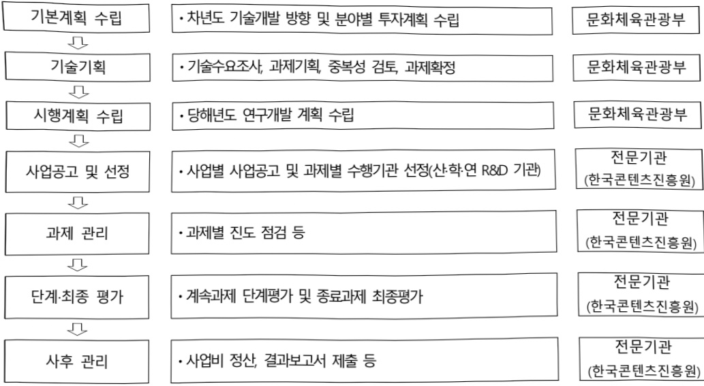

# 문화기술 전문인력양성(R&D)

**해당 페이지**: PDF 3180 ~ 3185 쪽 해당

**부처**: 문화체육관광부
**분야**: 문화 및 관광
**회계유형**: 일반회계
**2026 확정예산**: 6900.0 백만원
**전년대비 증감률**: -2.0%
**AI 도메인**: 교육/인재, 문화/콘텐츠

---

## □ 기능별(내역사업별) 예산 내역

(단위:백만원)

<table border=1 style='margin: auto; word-wrap: break-word;'><tr><td rowspan="2"></td><td colspan="5">2024</td><td colspan="5">2025</td><td rowspan="2">2026예산</td></tr><tr><td style='text-align: center; word-wrap: break-word;'>예산액(추경)</td><td style='text-align: center; word-wrap: break-word;'>예산현액</td><td style='text-align: center; word-wrap: break-word;'>집행액</td><td style='text-align: center; word-wrap: break-word;'>이월액</td><td style='text-align: center; word-wrap: break-word;'>불용액</td><td style='text-align: center; word-wrap: break-word;'>예산액(추경)</td><td style='text-align: center; word-wrap: break-word;'>예산현액</td><td style='text-align: center; word-wrap: break-word;'>집행액</td><td style='text-align: center; word-wrap: break-word;'>이월액</td><td style='text-align: center; word-wrap: break-word;'>불용액</td></tr><tr><td style='text-align: center; word-wrap: break-word;'>○ 기능별 분류(함께)</td><td style='text-align: center; word-wrap: break-word;'>(7,915)</td><td style='text-align: center; word-wrap: break-word;'>(7,915)</td><td style='text-align: center; word-wrap: break-word;'>(7,915)[7,850]</td><td style='text-align: center; word-wrap: break-word;'>-</td><td style='text-align: center; word-wrap: break-word;'>-</td><td style='text-align: center; word-wrap: break-word;'>7,044</td><td style='text-align: center; word-wrap: break-word;'>7,044[7,044]</td><td style='text-align: center; word-wrap: break-word;'>7,044</td><td style='text-align: center; word-wrap: break-word;'>-</td><td style='text-align: center; word-wrap: break-word;'>-</td><td style='text-align: center; word-wrap: break-word;'>6,900</td></tr><tr><td style='text-align: center; word-wrap: break-word;'>• 장르별 문화기술(CT)전문인력양성</td><td style='text-align: center; word-wrap: break-word;'>(4,313)</td><td style='text-align: center; word-wrap: break-word;'>(4,313)</td><td style='text-align: center; word-wrap: break-word;'>(4,313)[4,250]</td><td style='text-align: center; word-wrap: break-word;'>-</td><td style='text-align: center; word-wrap: break-word;'>-</td><td style='text-align: center; word-wrap: break-word;'>4,644</td><td style='text-align: center; word-wrap: break-word;'>4,644</td><td style='text-align: center; word-wrap: break-word;'>4,644[4,644]</td><td style='text-align: center; word-wrap: break-word;'>-</td><td style='text-align: center; word-wrap: break-word;'>-</td><td style='text-align: center; word-wrap: break-word;'>6,900</td></tr><tr><td style='text-align: center; word-wrap: break-word;'>• 글로벌 문화기술(CT)전문인력양성</td><td style='text-align: center; word-wrap: break-word;'>(3,602)</td><td style='text-align: center; word-wrap: break-word;'>(3,602)</td><td style='text-align: center; word-wrap: break-word;'>(3,602)[3,600]</td><td style='text-align: center; word-wrap: break-word;'>-</td><td style='text-align: center; word-wrap: break-word;'>-</td><td style='text-align: center; word-wrap: break-word;'>2,400</td><td style='text-align: center; word-wrap: break-word;'>2,400</td><td style='text-align: center; word-wrap: break-word;'>2,400[2,400]</td><td style='text-align: center; word-wrap: break-word;'>-</td><td style='text-align: center; word-wrap: break-word;'>-</td><td style='text-align: center; word-wrap: break-word;'>-</td></tr></table>

### 나. 사업설명자료

## 1 ) 사업목적·내용

- (문화기술 전문인력 양성(R&D)) 콘텐츠 장르(게임, 영화·애니, 방송·OTT, 음악, 공연, 전시 등)와 첨단기술을 결합한 교육(과정) 운영 지원 및 R&D 인력 교류 체계 마련을 통한 미래 콘텐츠 산업을 선도하는 융복합 R&D 전문 인재 양성

- (장르별 문화기술 전문인력 양성) 문화콘텐츠 장르(게임, 영화·애니, 방송·OTT)와 최첨단 기술을 결합한 다학제 교육과정 및 기술개발 지원(산·학·연 R&D 관련 기관)

## 2 ) 사업개요

## □ 사업근거 및 추진경위

① 법령상 근거 및 조항 적시

- 문화산업진흥기본법 제16조(전문인력의 양성)

① 국가나 지방자치단체는 문화산업 진흥에 필요한 전문인력을 양성하기 위하여 노력하여야 한다.

② 문화체육관광부장관이나 시·도지사는 제1항에 따른 전문인력을 양성하기 위하여 대통령령으로 정하는 바에 따라 연구소, 대학, 그 밖의 기관을 문화산업 전문인력 양성기관으로 지정할 수 있다.

③ 국가나 지방자치단체는 제2항에 따라 지정된 문화산업 전문인력 양성기관에 대하여 대통령령으로 정하는 바에 따라 전문인력 양성에 필요한 경비의 전부 또는 일부를 부담할 수 있다.

- 콘텐츠산업진흥법 제14조(전문인력의 양성)

① 정부는 콘텐츠산업의 진흥에 필요한 전문인력을 양성하기 위하여 노력하여야 한다.

---

② 정부는 콘텐츠 전문인력을 양성하기 위하여 「고등교육법」 제2조에 따른 학교, 「평생교육법」 제33조제3항에 따라 설치된 원격대학형태의 평생교육시설, 「문화산업 진흥 기본법」 제31조에 따른 한국콘텐츠진흥원 등을 전문인력 양성기관으로 지정하여 교육 및 훈련을 실시하게 할 수 있으며, 이에 필요한 예산을 지원할 수 있다.

② 추진경위

- 윤석열 정부 국정과제 58-4 (K-콘텐츠로 신시장 개척) 문화기술(CT) R&D 투자 대폭 확대

- 제5차 과학기술기본계획 2023~2027

* 1-1-2 기술주권 확보를 위한 전략기술 발굴·육성, 1-4 미래 핵심인재 양성·확보 등

- 문화콘텐츠 R&D 전문인력양성 신규 세부사업 추진('20)

-『제4차 문화기술(CT) R&D 기본계획』 수립('22. 12)

* (현장 중심 정교한 문화기술 R&D 체계구축) K-콘텐츠 문화기술 창의인재 양성

- 문화기술연구개발 세부사업 내 장르별 인력양성사업('23) 및 글로벌 인력양성사업('24) 신규 내역사업 추진

- 2025년도 국가연구개발 투자방향 및 기준('24. 3)

* 중점 투자방향 3 국가 인재를 키우는 R&D

- 이재명정부 공약 (2-1-7) 사람 중심의 인공지능 미래교육 강화, (2-1-13) 문화콘텐츠의 국가지원 체계 확대(콘텐츠 R&D 지원 강화), (2-2-1) 안정적 R&D 예산 확대 및 혁신성장체제 구축으로 국가연구개발(R&D)의 지속성 담보,

- 이재명 정부 국정과제 (사회2-14) K-컬처 300조원 시대 개막을 위한 콘텐츠의 국가전략산업화 추진

## □ 주요내용

① 사업규모

- 총사업비 : 해당없음

- 사업기간 : 2025~2029년

-최근 5년 간 투입된 사업비(예사액기준. 추경편성한 연도에는 추경포함)

<table border=1 style='margin: auto; word-wrap: break-word;'><tr><td style='text-align: center; word-wrap: break-word;'>연도</td><td style='text-align: center; word-wrap: break-word;'>2022</td><td style='text-align: center; word-wrap: break-word;'>2023</td><td style='text-align: center; word-wrap: break-word;'>2024</td><td style='text-align: center; word-wrap: break-word;'>2025</td><td style='text-align: center; word-wrap: break-word;'>2026</td></tr><tr><td style='text-align: center; word-wrap: break-word;'>사업비</td><td style='text-align: center; word-wrap: break-word;'>-</td><td style='text-align: center; word-wrap: break-word;'>(1,500)</td><td style='text-align: center; word-wrap: break-word;'>(7,915)</td><td style='text-align: center; word-wrap: break-word;'>7,044</td><td style='text-align: center; word-wrap: break-word;'>6,900</td></tr></table>

-기타: 해당없음

② 사업추진체계

- 사업시행방법 : 출연

- 사업시행주체 : 한국콘텐츠진흥원

- 사업 수혜자 : 산·학·연 R&D 관련 기관

---

- 보조, 융자, 출연, 출자 등의 경우 보조·융자 등 지원 비율 및 법적근거

<table border=1 style='margin: auto; word-wrap: break-word;'><tr><td style='text-align: center; word-wrap: break-word;'>내역사업명</td><td style='text-align: center; word-wrap: break-word;'>구분</td><td style='text-align: center; word-wrap: break-word;'>피보조·피출연 등 기관명</td><td style='text-align: center; word-wrap: break-word;'>지원 금액 (2026예산)</td><td style='text-align: center; word-wrap: break-word;'>지원 비율(%)</td><td style='text-align: center; word-wrap: break-word;'>보조율 법적근거 (해당 조항)</td></tr><tr><td style='text-align: center; word-wrap: break-word;'>장르별 문화기술(CT) 전문인력양성</td><td style='text-align: center; word-wrap: break-word;'>출연</td><td style='text-align: center; word-wrap: break-word;'>한국콘텐츠 진흥원</td><td style='text-align: center; word-wrap: break-word;'>6,900</td><td style='text-align: center; word-wrap: break-word;'>100</td><td style='text-align: center; word-wrap: break-word;'>문화산업진흥기본법 제16조</td></tr></table>

## 3 ) 2026년도 예산 산출 근거

① 장르별 문화기술(CT) 전문인력양성
: (2025 본예산) 4,644백만원 → (2026 예산) 6,900백만원, 2,256백만원 중액
- (요구) 문화콘텐츠 장르(게임, 영화·애니, 방송·OTT)와 최첨단 기술을 결합한 다학제 교육과정 및 기술개발을 위한 신규 및 종료과제 예산 요구
- (산출) 6,900백만원
* (종료) 3개 과제 × 1,000백만원 × 12/12개월 = 3,000백만원
(종료) 4개 과제 × 600백만원 × 12/12개월 = 2,400백만원
(신규) 2개 과제 × 1,000백만원 × 9/12개월 = 1,500백만원
② 글로벌 문화기술(CT) 전문인력양성
: (2025 본예산) 2,400백만원 → (2026 예산) 0, 순감
- (요구) 글로벌 문화기술 수준 도약 및 경쟁력 확보, 글로벌 프로젝트 수행을 위한 산업계 연계 확대 집중 지원을 위한 종료 과제 예산 요구
- (산출) 해당사항 없음
* 2026년부터 ① 장르별 문화기술(CT) 전문인력양성 내역과 ② 글로벌 문화기술(CT) 전문인력양성 내역을 통합하여 ① 장르별 문화기술(CT) 전문인력양성 내역사업으로 운영

## 4 ) 사업효과

□ 사업영향, 산출물 성과지표 등

① 2022~2026년도 성과계획서 상 성과지표 및 최근 5년간 성과 달성도 : 해당없음

※ 문화기술 전문인력양성 사업 전략계획서 수립 중, 11월 중 확정 예정

② 성과지표 이외의 연도별 사업추진 경과 및 실적

<table border=1 style='margin: auto; word-wrap: break-word;'><tr><td style='text-align: center; word-wrap: break-word;'>2024</td><td style='text-align: center; word-wrap: break-word;'>○ 장르별 문화기술(CT) 전문인력양성 5개 과제 지원(계속 2개, 신규 3개)○ 글로벌 문화기술(CT) 전문인력양성 4개 과제 지원(신규 4개)</td></tr><tr><td style='text-align: center; word-wrap: break-word;'>2025</td><td style='text-align: center; word-wrap: break-word;'>○ 장르별 문화기술(CT) 전문인력양성 5개 과제 지원(계속 3개, 종료 2개)○ 글로벌 문화기술(CT) 전문인력양성 4개 과제 지원(계속 4개)</td></tr></table>

③ 향후(2026년도 이후) 기대효과

- 대학원, 연구소, 기업 등 간 연계를 통해 게임, 영화, 방송·OTT 등에 접목 가능한 메타버스, XR, AI, 블록체인 등 첨단기술을 개발하고, 프로젝트 참여를 통해 대학

---

원생, 현업 재직자 등의 전문 역량 강화

- 글로벌 인재 채용 등을 통한 국내 문화기술 분야 디지털전환 기반 마련 및 산업 경쟁력 강화

- 산업계 수요기반 교육 과정 및 프로젝트 참여를 통한 ICT 기술과 콘텐츠 기획·제작 프로세스를 모두 이해하는 문화기술 융합형 ‘브릿지 인력’ 양성 지원

5) 타당성조사 및 예비타당성조사 시행여부 및 결과 요지 : 해당없음

## 6 ) 총사업비 대상사업 여부 및 내역 : 해당없음

## 7 ) 사업 집행절차

·사업별사업공고 및과제별수행기관선정(산·학·연R&D기관)

문화체육관광부

문화체육관광부

문화체육관광부

전문기관

(한국콘텐츠진흥원)

전문기관

(한국콘텐츠진흥원)

전문기관

(한국콘텐츠진흥원)

전문기관

(한국콘텐츠진흥원)

## 8 ) 각종 평가

1) 국회(예결위, 상임위, 예정처, 국정감사 포함) 지적 : 해당없음

2) 대외공개 평가 : 해당없음

3) 자체평가 : 해당없음

### 다. 최근 4년간 결산내역

---

## 1 ) 결산표

☐ 부처 결산내역

(단위: 백만원, %)

<table border=1 style='margin: auto; word-wrap: break-word;'><tr><td rowspan="2">연도</td><td colspan="3">예산액</td><td rowspan="2">예산현액(A)</td><td rowspan="2">집행액(B)</td><td rowspan="2">집행률(B/A)</td><td rowspan="2">다음연도이월액</td><td rowspan="2">불용액</td></tr><tr><td style='text-align: center; word-wrap: break-word;'>본예산</td><td style='text-align: center; word-wrap: break-word;'>추경중감액</td><td style='text-align: center; word-wrap: break-word;'>추경</td></tr><tr><td style='text-align: center; word-wrap: break-word;'>2023</td><td style='text-align: center; word-wrap: break-word;'>(1,500)</td><td style='text-align: center; word-wrap: break-word;'>-</td><td style='text-align: center; word-wrap: break-word;'>(1,500)</td><td style='text-align: center; word-wrap: break-word;'>(1,500)</td><td style='text-align: center; word-wrap: break-word;'>(1,500)</td><td style='text-align: center; word-wrap: break-word;'>(100)</td><td style='text-align: center; word-wrap: break-word;'>-</td><td style='text-align: center; word-wrap: break-word;'>-</td></tr><tr><td style='text-align: center; word-wrap: break-word;'>2024</td><td style='text-align: center; word-wrap: break-word;'>(7,915)</td><td style='text-align: center; word-wrap: break-word;'>-</td><td style='text-align: center; word-wrap: break-word;'>(7,915)</td><td style='text-align: center; word-wrap: break-word;'>(7,915)</td><td style='text-align: center; word-wrap: break-word;'>(7,915)</td><td style='text-align: center; word-wrap: break-word;'>(100)</td><td style='text-align: center; word-wrap: break-word;'>-</td><td style='text-align: center; word-wrap: break-word;'>-</td></tr><tr><td style='text-align: center; word-wrap: break-word;'>2025</td><td style='text-align: center; word-wrap: break-word;'>7,044</td><td style='text-align: center; word-wrap: break-word;'>-</td><td style='text-align: center; word-wrap: break-word;'>7,044</td><td style='text-align: center; word-wrap: break-word;'>7,044</td><td style='text-align: center; word-wrap: break-word;'>7,044</td><td style='text-align: center; word-wrap: break-word;'>100</td><td style='text-align: center; word-wrap: break-word;'>-</td><td style='text-align: center; word-wrap: break-word;'>-</td></tr></table>

## 2 ) 주요 결산사항

□ 2023~2025년 결산 주요사항

<table border=1 style='margin: auto; word-wrap: break-word;'><tr><td style='text-align: center; word-wrap: break-word;'>2023</td><td style='text-align: center; word-wrap: break-word;'>- 해당없음</td></tr><tr><td style='text-align: center; word-wrap: break-word;'>2024</td><td style='text-align: center; word-wrap: break-word;'>- 해당없음</td></tr><tr><td style='text-align: center; word-wrap: break-word;'>2025</td><td style='text-align: center; word-wrap: break-word;'>- 해당없음</td></tr></table>

□ 2025년 이·전용 등 세부내역 : 해당없음

---

<table border=1 style='margin: auto; word-wrap: break-word;'><tr><td style='text-align: center; word-wrap: break-word;'>사 업 명</td></tr><tr><td style='text-align: center; word-wrap: break-word;'>(27) 문화예술 온돌로지 기반 LLM연계 기술개발(R&amp;D)(1234-639)</td></tr></table>

☐ 사업 코드 정보

<table border=1 style='margin: auto; word-wrap: break-word;'><tr><td style='text-align: center; word-wrap: break-word;'>구분</td><td style='text-align: center; word-wrap: break-word;'>회계</td><td style='text-align: center; word-wrap: break-word;'>소관</td><td style='text-align: center; word-wrap: break-word;'>실국(기관)</td><td style='text-align: center; word-wrap: break-word;'>계정</td><td style='text-align: center; word-wrap: break-word;'>분야</td><td style='text-align: center; word-wrap: break-word;'>부문</td></tr><tr><td style='text-align: center; word-wrap: break-word;'>코드</td><td rowspan="2">일반회계</td><td rowspan="2">문화체육관광부</td><td rowspan="2">문화산업정책관</td><td rowspan="2"></td><td style='text-align: center; word-wrap: break-word;'>060</td><td style='text-align: center; word-wrap: break-word;'>061</td></tr><tr><td style='text-align: center; word-wrap: break-word;'>명칭</td><td style='text-align: center; word-wrap: break-word;'>문화및관광</td><td style='text-align: center; word-wrap: break-word;'>문화예술</td></tr></table>

<table border=1 style='margin: auto; word-wrap: break-word;'><tr><td style='text-align: center; word-wrap: break-word;'>구분</td><td style='text-align: center; word-wrap: break-word;'>프로그램</td><td style='text-align: center; word-wrap: break-word;'>단위사업</td><td style='text-align: center; word-wrap: break-word;'>세부사업</td></tr><tr><td style='text-align: center; word-wrap: break-word;'>코드</td><td style='text-align: center; word-wrap: break-word;'>1200</td><td style='text-align: center; word-wrap: break-word;'>1234</td><td style='text-align: center; word-wrap: break-word;'>639</td></tr><tr><td style='text-align: center; word-wrap: break-word;'>명칭</td><td style='text-align: center; word-wrap: break-word;'>콘텐츠산업육성</td><td style='text-align: center; word-wrap: break-word;'>문화콘텐츠산업 기술지원</td><td style='text-align: center; word-wrap: break-word;'>문화예술 온돌로지 기반 LLM연계 기술개발(R&amp;D)</td></tr></table>

□ 사업 성격 (공통요구자료 II-1 작성유의사항 4. 참조, 해당하는 사항에 “○” 표시)

<table border=1 style='margin: auto; word-wrap: break-word;'><tr><td rowspan="2">신규</td><td rowspan="2">계속</td><td rowspan="2">완료</td><td rowspan="2">예비타당성 실시여부</td><td rowspan="2">총사업비 관리대상</td><td rowspan="2">총액계상 예산사업</td><td style='text-align: center; word-wrap: break-word;'>사업소관 변경정보</td></tr><tr><td style='text-align: center; word-wrap: break-word;'>2025예산 시 소관</td></tr><tr><td style='text-align: center; word-wrap: break-word;'>○</td><td style='text-align: center; word-wrap: break-word;'></td><td style='text-align: center; word-wrap: break-word;'></td><td style='text-align: center; word-wrap: break-word;'></td><td style='text-align: center; word-wrap: break-word;'></td><td style='text-align: center; word-wrap: break-word;'></td><td style='text-align: center; word-wrap: break-word;'></td></tr></table>

□사업지원형태 및지원을(최소한한개는반드시선택하시오.해당사항에O표시)

<table border=1 style='margin: auto; word-wrap: break-word;'><tr><td style='text-align: center; word-wrap: break-word;'>직접</td><td style='text-align: center; word-wrap: break-word;'>출자</td><td style='text-align: center; word-wrap: break-word;'>출연</td><td style='text-align: center; word-wrap: break-word;'>보조</td><td style='text-align: center; word-wrap: break-word;'>융자</td><td style='text-align: center; word-wrap: break-word;'>국고보조율(%)</td><td style='text-align: center; word-wrap: break-word;'>융자율(%)</td></tr><tr><td style='text-align: center; word-wrap: break-word;'></td><td style='text-align: center; word-wrap: break-word;'></td><td style='text-align: center; word-wrap: break-word;'>○</td><td style='text-align: center; word-wrap: break-word;'></td><td style='text-align: center; word-wrap: break-word;'></td><td style='text-align: center; word-wrap: break-word;'></td><td style='text-align: center; word-wrap: break-word;'></td></tr></table>

□ 사업 소관부처 및 시행주체

<table border=1 style='margin: auto; word-wrap: break-word;'><tr><td style='text-align: center; word-wrap: break-word;'>사업명</td><td colspan="2">구분</td></tr><tr><td rowspan="3">문화예술 온톨로지 기반 LLM연계 기술개발 (R&amp;D)</td><td rowspan="2">소관부처</td><td style='text-align: center; word-wrap: break-word;'>문화미디어신업실 문화신업정책관</td></tr><tr><td style='text-align: center; word-wrap: break-word;'>문화기술투자과</td></tr><tr><td style='text-align: center; word-wrap: break-word;'>사업시행주체</td><td style='text-align: center; word-wrap: break-word;'>한국콘텐츠진흥원</td></tr></table>

---

### 원본 PDF 크롭 이미지

