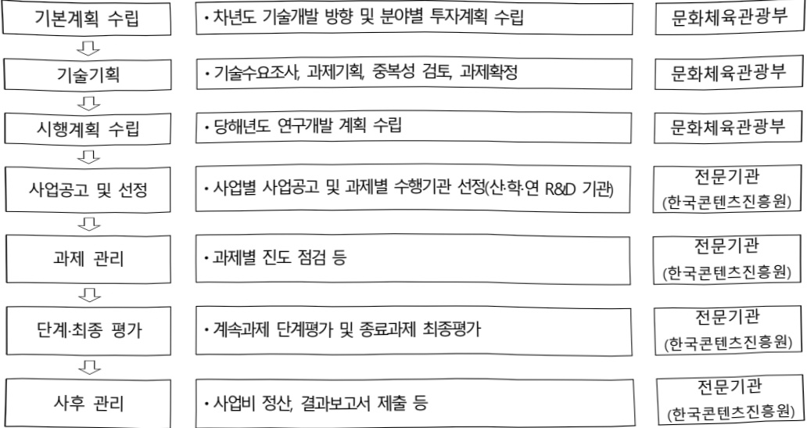
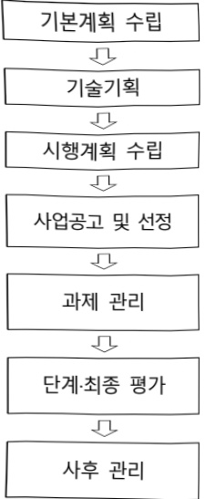

# 문화예술 온톨로지 기반 LLM연계 기술개발(R&D)

**해당 페이지**: PDF 3186 ~ 3190 쪽 해당

**부처**: 문화체육관광부
**분야**: 문화 및 관광
**회계유형**: 일반회계
**2026 확정예산**: 1750.0 백만원
**전년대비 증감률**: None%
**AI 도메인**: LLM/언어모델, 데이터, 디지털전환(AX)

---

<table border=1 style='margin: auto; word-wrap: break-word;'><tr><td style='text-align: center; word-wrap: break-word;'>사 업 명</td></tr><tr><td style='text-align: center; word-wrap: break-word;'>(27) 문화예술 온돌로지 기반 LLM연계 기술개발(R&amp;D)(1234-639)</td></tr></table>

☐ 사업 코드 정보

<table border=1 style='margin: auto; word-wrap: break-word;'><tr><td style='text-align: center; word-wrap: break-word;'>구분</td><td style='text-align: center; word-wrap: break-word;'>회계</td><td style='text-align: center; word-wrap: break-word;'>소관</td><td style='text-align: center; word-wrap: break-word;'>실국(기관)</td><td style='text-align: center; word-wrap: break-word;'>계정</td><td style='text-align: center; word-wrap: break-word;'>분야</td><td style='text-align: center; word-wrap: break-word;'>부문</td></tr><tr><td style='text-align: center; word-wrap: break-word;'>코드</td><td rowspan="2">일반회계</td><td rowspan="2">문화체육관광부</td><td rowspan="2">문화산업정책관</td><td rowspan="2"></td><td style='text-align: center; word-wrap: break-word;'>060</td><td style='text-align: center; word-wrap: break-word;'>061</td></tr><tr><td style='text-align: center; word-wrap: break-word;'>명칭</td><td style='text-align: center; word-wrap: break-word;'>문화및관광</td><td style='text-align: center; word-wrap: break-word;'>문화예술</td></tr></table>

<table border=1 style='margin: auto; word-wrap: break-word;'><tr><td style='text-align: center; word-wrap: break-word;'>구분</td><td style='text-align: center; word-wrap: break-word;'>프로그램</td><td style='text-align: center; word-wrap: break-word;'>단위사업</td><td style='text-align: center; word-wrap: break-word;'>세부사업</td></tr><tr><td style='text-align: center; word-wrap: break-word;'>코드</td><td style='text-align: center; word-wrap: break-word;'>1200</td><td style='text-align: center; word-wrap: break-word;'>1234</td><td style='text-align: center; word-wrap: break-word;'>639</td></tr><tr><td style='text-align: center; word-wrap: break-word;'>명칭</td><td style='text-align: center; word-wrap: break-word;'>콘텐츠산업육성</td><td style='text-align: center; word-wrap: break-word;'>문화콘텐츠산업 기술지원</td><td style='text-align: center; word-wrap: break-word;'>문화예술 온돌로지 기반 LLM연계 기술개발(R&amp;D)</td></tr></table>

□ 사업 성격 (공통요구자료 II-1 작성유의사항 4. 참조, 해당하는 사항에 “○” 표시)

<table border=1 style='margin: auto; word-wrap: break-word;'><tr><td rowspan="2">신규</td><td rowspan="2">계속</td><td rowspan="2">완료</td><td rowspan="2">예비타당성 실시여부</td><td rowspan="2">총사업비 관리대상</td><td rowspan="2">총액계상 예산사업</td><td style='text-align: center; word-wrap: break-word;'>사업소관 변경정보</td></tr><tr><td style='text-align: center; word-wrap: break-word;'>2025예산 시 소관</td></tr><tr><td style='text-align: center; word-wrap: break-word;'>○</td><td style='text-align: center; word-wrap: break-word;'></td><td style='text-align: center; word-wrap: break-word;'></td><td style='text-align: center; word-wrap: break-word;'></td><td style='text-align: center; word-wrap: break-word;'></td><td style='text-align: center; word-wrap: break-word;'></td><td style='text-align: center; word-wrap: break-word;'></td></tr></table>

□사업지원형태 및지원을(최소한한개는반드시선택하시오.해당사항에O표시)

<table border=1 style='margin: auto; word-wrap: break-word;'><tr><td style='text-align: center; word-wrap: break-word;'>직접</td><td style='text-align: center; word-wrap: break-word;'>출자</td><td style='text-align: center; word-wrap: break-word;'>출연</td><td style='text-align: center; word-wrap: break-word;'>보조</td><td style='text-align: center; word-wrap: break-word;'>융자</td><td style='text-align: center; word-wrap: break-word;'>국고보조율(%)</td><td style='text-align: center; word-wrap: break-word;'>융자율(%)</td></tr><tr><td style='text-align: center; word-wrap: break-word;'></td><td style='text-align: center; word-wrap: break-word;'></td><td style='text-align: center; word-wrap: break-word;'>○</td><td style='text-align: center; word-wrap: break-word;'></td><td style='text-align: center; word-wrap: break-word;'></td><td style='text-align: center; word-wrap: break-word;'></td><td style='text-align: center; word-wrap: break-word;'></td></tr></table>

□ 사업 소관부처 및 시행주체

<table border=1 style='margin: auto; word-wrap: break-word;'><tr><td style='text-align: center; word-wrap: break-word;'>사업명</td><td colspan="2">구분</td></tr><tr><td rowspan="3">문화예술 온톨로지 기반 LLM연계 기술개발 (R&amp;D)</td><td rowspan="2">소관부처</td><td style='text-align: center; word-wrap: break-word;'>문화미디어신업실 문화신업정책관</td></tr><tr><td style='text-align: center; word-wrap: break-word;'>문화기술투자과</td></tr><tr><td style='text-align: center; word-wrap: break-word;'>사업시행주체</td><td style='text-align: center; word-wrap: break-word;'>한국콘텐츠진흥원</td></tr></table>

---

### 가.예산 총괄표

(단위: 백만원, %)

<table border=1 style='margin: auto; word-wrap: break-word;'><tr><td rowspan="2">사업명</td><td rowspan="2">2024년 결산</td><td colspan="2">2025년 예산</td><td colspan="2">2026년 예산</td><td rowspan="2">중감(B-A)</td><td rowspan="2">(B-A)/A</td></tr><tr><td style='text-align: center; word-wrap: break-word;'>본예산</td><td style='text-align: center; word-wrap: break-word;'>추경(A)</td><td style='text-align: center; word-wrap: break-word;'>요구안</td><td style='text-align: center; word-wrap: break-word;'>본예산(B)</td></tr><tr><td style='text-align: center; word-wrap: break-word;'>문화예술 온돌로지 기반LLM연계 기술개발(R&amp;D)</td><td style='text-align: center; word-wrap: break-word;'>-</td><td style='text-align: center; word-wrap: break-word;'>-</td><td style='text-align: center; word-wrap: break-word;'>-</td><td style='text-align: center; word-wrap: break-word;'>1,750</td><td style='text-align: center; word-wrap: break-word;'>1,750</td><td style='text-align: center; word-wrap: break-word;'>1,750</td><td style='text-align: center; word-wrap: break-word;'>순증</td></tr></table>

□ 기능별(내역사업별) 예산 내역

(단위:백만원)

<table border=1 style='margin: auto; word-wrap: break-word;'><tr><td rowspan="2"></td><td colspan="5">2024</td><td colspan="5">2025</td><td rowspan="2">2026 예산</td></tr><tr><td style='text-align: center; word-wrap: break-word;'>예산액 (추경)</td><td style='text-align: center; word-wrap: break-word;'>예산 현액</td><td style='text-align: center; word-wrap: break-word;'>집행액</td><td style='text-align: center; word-wrap: break-word;'>이월액</td><td style='text-align: center; word-wrap: break-word;'>불용액</td><td style='text-align: center; word-wrap: break-word;'>예산액 (추경)</td><td style='text-align: center; word-wrap: break-word;'>예산 현액</td><td style='text-align: center; word-wrap: break-word;'>집행액</td><td style='text-align: center; word-wrap: break-word;'>이월액</td><td style='text-align: center; word-wrap: break-word;'>불용액</td></tr><tr><td style='text-align: center; word-wrap: break-word;'>○ 기능별 분류(합계)</td><td style='text-align: center; word-wrap: break-word;'>-</td><td style='text-align: center; word-wrap: break-word;'>-</td><td style='text-align: center; word-wrap: break-word;'>-</td><td style='text-align: center; word-wrap: break-word;'>-</td><td style='text-align: center; word-wrap: break-word;'>-</td><td style='text-align: center; word-wrap: break-word;'>-</td><td style='text-align: center; word-wrap: break-word;'>-</td><td style='text-align: center; word-wrap: break-word;'>-</td><td style='text-align: center; word-wrap: break-word;'>-</td><td style='text-align: center; word-wrap: break-word;'>-</td><td style='text-align: center; word-wrap: break-word;'>1,750</td></tr><tr><td style='text-align: center; word-wrap: break-word;'>• 한국 문화예술 디지털 전환 기반 구축(DX)</td><td style='text-align: center; word-wrap: break-word;'>-</td><td style='text-align: center; word-wrap: break-word;'>-</td><td style='text-align: center; word-wrap: break-word;'>-</td><td style='text-align: center; word-wrap: break-word;'>-</td><td style='text-align: center; word-wrap: break-word;'>-</td><td style='text-align: center; word-wrap: break-word;'>-</td><td style='text-align: center; word-wrap: break-word;'>-</td><td style='text-align: center; word-wrap: break-word;'>-</td><td style='text-align: center; word-wrap: break-word;'>-</td><td style='text-align: center; word-wrap: break-word;'>-</td><td style='text-align: center; word-wrap: break-word;'>1,750</td></tr></table>

### 나. 사업설명자료

## 1 ) 사업목적·내용

- (문화예술 온톨로지 기반 LLM연계 기술개발(R&D)) 한글기반 문화예술 디지털전환 기술 개발을 통해 번역 과정에서의 언어적·문화적 차이를 최소화하고, 한국 문화콘텐츠의 글로벌 접근성과 공감도 제고 및 전 세계적 한글 문화지형 확산

- (한국 문화예술 디지털 전환 기반 구축(DX)) 글로벌 콘텐츠 시장 수요를 기반으로 국내 콘텐츠 산업의 성장을 위해 문화예술 자료를 수집하여 체계적인 데이터셋 구축 및 기초 데이터 확보 기술개발

## 2 ) 사업개요

## □ 사업근거 및 추진경위

① 법령상 근거 및 조항 적시

- 문화산업진흥기본법 제17조(기술 및 문화콘텐츠 개발의 촉진)

---

① 문화체육관광부장관은 문화체육관광부 소관 연구개발(이하 “연구개발사업”이라 한다)을 촉진하기 위한 정책을 수립·시행하고 연구개발사업을 수행하는 데에 드는 자금을 예산의 범위에서 지원하거나 출연할 수 있다.

## -문화예술진흥법 제15조(기술개발의 촉진)

① 정부는 콘텐츠산업에 관한 기술의 개발을 촉진하기 위하여 다음 각 호의 사업을 추진하여야 한다.

1. 기술수준의 조사 및 기술의 연구 개발

2. 개발된 기술의 평가

3. 기술협력 · 기술이전 등 개발된 기술의 실용화

4. 기술정보의 원활한 유통

5. 그 밖에 기술개발을 위하여 필요한 사업

## ② 추진경위

- 이재명 정부 국정과제 (사회2-14) K-컬처 300조원 시대 개막을 위한 콘텐츠의 국가전략산업화 추진

* (공약) (2-1-9) 국민 누구나 AI를 쉽고 편리하게 사용할 수 있는 나라 (전 국민 AI 접근권 보장)

(2-1-13) 문화콘텐츠의 국가지원 체계 확대(콘텐츠 R&D 지원 강화),

2-1) 안정적 R&D예산 확대 및 혁신성장체제 구축으로 R&D의 지속성 담보,

-「제5차 과학기술 기본계획」(3-2. 디지털 전환기 선도적 대응을 통한 경제 재도약)

-「제4차 문화기술연구개발 기본계획」(1-3. 융복합형·임무지향형 R&D 추진)

-「제1차 문화유산 보존관리 및 활용 연구개발 기본계획」(3. 지식자원 활용을 통한 새로운 가치창출)

-「문화한국 2035」(4. 문화분야 인공지능 대전환(AX)

-「한국문학번역원 중장기 추진계획」(예술, 한국문화(K-컬처) 차세대 주자)

## □주요내용

① 사업규모

- 총사업비(해당되는 경우에만 기재) : 해당없음

- 사업기간 : 2026~2028

-최근 5년 간 투입된 사업비(예산액기준, 추경편성한 연도에는 추경포함)

<table border=1 style='margin: auto; word-wrap: break-word;'><tr><td style='text-align: center; word-wrap: break-word;'>연도</td><td style='text-align: center; word-wrap: break-word;'>2022</td><td style='text-align: center; word-wrap: break-word;'>2023</td><td style='text-align: center; word-wrap: break-word;'>2024</td><td style='text-align: center; word-wrap: break-word;'>2025</td><td style='text-align: center; word-wrap: break-word;'>2026</td></tr><tr><td style='text-align: center; word-wrap: break-word;'>사업비</td><td style='text-align: center; word-wrap: break-word;'>-</td><td style='text-align: center; word-wrap: break-word;'>-</td><td style='text-align: center; word-wrap: break-word;'>-</td><td style='text-align: center; word-wrap: break-word;'>-</td><td style='text-align: center; word-wrap: break-word;'>1,750</td></tr></table>

-기타: 해당없음

② 사업추진체계

- 사업시행방법 : 출연

- 사업시행주체 : 한국콘텐츠진흥원

- 사업 수혜자 : 산·학·연 R&D 관련 기관

---

- 보조, 융자, 출연, 출자 등의 경우 보조 · 융자 등 지원 비율 및 법적근거

<table border=1 style='margin: auto; word-wrap: break-word;'><tr><td style='text-align: center; word-wrap: break-word;'>내역사업명</td><td style='text-align: center; word-wrap: break-word;'>구분</td><td style='text-align: center; word-wrap: break-word;'>피보조·피출연 등 기관명</td><td style='text-align: center; word-wrap: break-word;'>지원 금액 (2026예산)</td><td style='text-align: center; word-wrap: break-word;'>지원 비율(%)</td><td style='text-align: center; word-wrap: break-word;'>보조율 법적근거 (해당 조항)</td></tr><tr><td style='text-align: center; word-wrap: break-word;'>한국 문화예술 디지털 전환 기반 구축(DX)</td><td style='text-align: center; word-wrap: break-word;'>출연</td><td style='text-align: center; word-wrap: break-word;'>한국콘텐츠 진흥원</td><td style='text-align: center; word-wrap: break-word;'>1,750</td><td style='text-align: center; word-wrap: break-word;'>100</td><td style='text-align: center; word-wrap: break-word;'>문화산업진흥기본법 제17조</td></tr></table>

## 3 ) 2026년도 예산 산출 근거

① 한국 문화예술 디지털 전환 기반 구축(DX)
: (2025 본예산) 0 → (2026 예산) 1,750백만원, 순증
- (요구) 글로벌 콘텐츠 시장 수요를 기반으로 국내 콘텐츠 산업의 성장을 위해 문화예술 자료를 수집하여 체계적인 데이터셋 구축 및 기초 데이터 확보 기술개발을 위한 신규 예산 요구
- (산출) 1,750백만원
* (신규) 2개 과제 × 1,166.6백만원 × 9/12개월 = 1,750백만원

## 4 ) 사업효과

□ 사업영향, 산출물 성과지표 등

① 2022~2026년도 성과계획서 상 성과지표 및 최근 5년간 성과 달성도 : 해당없음

② 성과지표 이외의 연도별 사업추진 경과 및 실적 : 해당없음

③ 향후(2026년도 이후) 기대효과

- (플랫폼 경제 활성화) 2027년까지 약 3,000명의 프리랜서 및 기여자 참여, 연간 50억원 규모의 크라우드소싱 경제 창출 전망

- (디지털 아카이브 시장 확대) 국내 디지털 아카이브 시장 규모를 2026년 500억원에서 2030년 1,500억원으로 확장하는데 기여

- (디지털 콘텐츠 시장 확대) 문화예술 디지털 콘텐츠 시장 규모를 2026년 800억원에서 2030년 2,500억원으로 확대 기여

5) 타당성조사 및 예비타당성조사 시행여부 및 결과 요지: 해당없음

6) 총사업비 대상사업 여부 및 내역: 해당없음

---

## 7 ) 사업 집행절차

## 8 ) 각종 평가 : 해당없음(26 신규사업)

### 다.최근 4년간 결산내역 : 해당없음('26 신규사업)

---

### 원본 PDF 크롭 이미지

