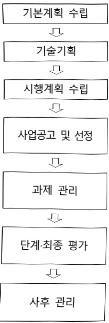

# 인공지능 기반 공연예술 안전환경 구축 핵심기술개발(R&D)

**해당 페이지**: PDF 3200 ~ 3206 쪽 해당

**부처**: 문화체육관광부
**분야**: 문화 및 관광
**회계유형**: 일반회계
**2026 확정예산**: 6400.0 백만원
**전년대비 증감률**: 31.6%
**AI 도메인**: 문화/콘텐츠

---

### 가.예산 총괄표

(단위:백만원,%)

<table border=1 style='margin: auto; word-wrap: break-word;'><tr><td rowspan="2">사업명</td><td rowspan="2">2024년 결산</td><td colspan="2">2025년 예산</td><td colspan="2">2026년 예산</td><td rowspan="2">증감(B-A)</td><td rowspan="2">(B-A)/A</td></tr><tr><td style='text-align: center; word-wrap: break-word;'>본예산</td><td style='text-align: center; word-wrap: break-word;'>추경(A)</td><td style='text-align: center; word-wrap: break-word;'>요구안</td><td style='text-align: center; word-wrap: break-word;'>본예산(B)</td></tr><tr><td style='text-align: center; word-wrap: break-word;'>인공지능 기반 공연예술 안전환경 구축 핵심기술개발(R&amp;D)</td><td style='text-align: center; word-wrap: break-word;'>2,300</td><td style='text-align: center; word-wrap: break-word;'>4,864</td><td style='text-align: center; word-wrap: break-word;'>4,864</td><td style='text-align: center; word-wrap: break-word;'>6,400</td><td style='text-align: center; word-wrap: break-word;'>6,400</td><td style='text-align: center; word-wrap: break-word;'>1,536</td><td style='text-align: center; word-wrap: break-word;'>31.6</td></tr></table>

□ 기능별(내역사업별) 예산 내역

(단위:백만원)

<table border=1 style='margin: auto; word-wrap: break-word;'><tr><td rowspan="2"></td><td colspan="5">2024</td><td colspan="5">2025</td><td rowspan="2">2026예산</td></tr><tr><td style='text-align: center; word-wrap: break-word;'>예산액(추경)</td><td style='text-align: center; word-wrap: break-word;'>예산현액</td><td style='text-align: center; word-wrap: break-word;'>집행액</td><td style='text-align: center; word-wrap: break-word;'>이일액</td><td style='text-align: center; word-wrap: break-word;'>불용액</td><td style='text-align: center; word-wrap: break-word;'>예산액(추경)</td><td style='text-align: center; word-wrap: break-word;'>예산현액</td><td style='text-align: center; word-wrap: break-word;'>집행액</td><td style='text-align: center; word-wrap: break-word;'>이일액</td><td style='text-align: center; word-wrap: break-word;'>불용액</td></tr><tr><td style='text-align: center; word-wrap: break-word;'>○ 기능별 분류(합계)</td><td style='text-align: center; word-wrap: break-word;'>2,300</td><td style='text-align: center; word-wrap: break-word;'>2,300</td><td style='text-align: center; word-wrap: break-word;'>2,300</td><td style='text-align: center; word-wrap: break-word;'>-</td><td style='text-align: center; word-wrap: break-word;'>-</td><td style='text-align: center; word-wrap: break-word;'>4,864</td><td style='text-align: center; word-wrap: break-word;'>4,864</td><td style='text-align: center; word-wrap: break-word;'>4,864</td><td style='text-align: center; word-wrap: break-word;'>-</td><td style='text-align: center; word-wrap: break-word;'>-</td><td style='text-align: center; word-wrap: break-word;'>6,400</td></tr><tr><td style='text-align: center; word-wrap: break-word;'>• 사전  안전사고예측 및 방지기술개발</td><td style='text-align: center; word-wrap: break-word;'>900</td><td style='text-align: center; word-wrap: break-word;'>900</td><td style='text-align: center; word-wrap: break-word;'>900</td><td style='text-align: center; word-wrap: break-word;'>-</td><td style='text-align: center; word-wrap: break-word;'>-</td><td style='text-align: center; word-wrap: break-word;'>2,350</td><td style='text-align: center; word-wrap: break-word;'>2,350</td><td style='text-align: center; word-wrap: break-word;'>2,350</td><td style='text-align: center; word-wrap: break-word;'>-</td><td style='text-align: center; word-wrap: break-word;'>-</td><td style='text-align: center; word-wrap: break-word;'>2,700</td></tr><tr><td style='text-align: center; word-wrap: break-word;'>• 공연시설  안전관리 기술개발</td><td style='text-align: center; word-wrap: break-word;'>900</td><td style='text-align: center; word-wrap: break-word;'>900</td><td style='text-align: center; word-wrap: break-word;'>900</td><td style='text-align: center; word-wrap: break-word;'>-</td><td style='text-align: center; word-wrap: break-word;'>-</td><td style='text-align: center; word-wrap: break-word;'>2,180</td><td style='text-align: center; word-wrap: break-word;'>2,180</td><td style='text-align: center; word-wrap: break-word;'>2,180</td><td style='text-align: center; word-wrap: break-word;'>-</td><td style='text-align: center; word-wrap: break-word;'>-</td><td style='text-align: center; word-wrap: break-word;'>2,500</td></tr><tr><td style='text-align: center; word-wrap: break-word;'>• 공연안전  글로벌표준화 기술개발</td><td style='text-align: center; word-wrap: break-word;'>500</td><td style='text-align: center; word-wrap: break-word;'>500</td><td style='text-align: center; word-wrap: break-word;'>500</td><td style='text-align: center; word-wrap: break-word;'>-</td><td style='text-align: center; word-wrap: break-word;'>-</td><td style='text-align: center; word-wrap: break-word;'>334</td><td style='text-align: center; word-wrap: break-word;'>334</td><td style='text-align: center; word-wrap: break-word;'>334</td><td style='text-align: center; word-wrap: break-word;'>-</td><td style='text-align: center; word-wrap: break-word;'>-</td><td style='text-align: center; word-wrap: break-word;'>1,200</td></tr></table>

### 나. 사업설명자료

## 1 ) 사업목적·내용

- (인공지능 기반 공연예술 안전환경 구축 핵심기술 개발(R&D)) 안전한 공연·관람을 위해 문화공간 및 공연장 안전 취약 요인을 제거하고, 시설 안전 인프라 구축으로 전 국민의 안전한 문화예술 향유 도모(산·학·연 R&D 관련 기관)

- (사전 안전사고 예측 및 방지 기술개발) 안전사고 사전 예측 및 방지를 위한 이동

경로 추적 기술, 광학식 기반의 공연자 및 작업자 실공간 위치 추적 기반의 증강

현실 안전 관리 플랫폼 기술개발(산·학·연 R&D 관련 기관)

- (공연시설 안전 관리 기술개발) 공연시설·무대장치·가설무대의 안전 시뮬레이션 및 안전 설계 서비스 플랫폼 확보 및 고장 진단 플랫폼 등 기술개발(산·학·연R&D 관련 기관)

- (공연안전 글로벌 표준화 기술개발) 공연장 및 공연 공간에서 상부·하부·특수효과

장치 안전사고 방지를 위한 안전 표준 기술(산·학·연 R&D 관련 기관)

---

## 2 ) 사업개요

## □ 사업근거 및 추진경위

① 법령상 근거 및 조항 적시

- 문화산업진흥기본법 제17조(기술 및 문화콘텐츠 개발의 촉진)

① 문화체육관광부장관은 문화체육관광부 소관 연구개발(이하 “연구개발사업”이라 한다)을 촉진하기 위한 정책을 수립·시행하고 연구개발사업을 수행하는 데에 드는 자금을 예산의 범위에서 지원하거나 출연할 수 있다.

- 문화예술진흥법 제14조(문화산업의 육성·지원)

① 국가와 지방자치단체는 문화예술 진흥을 위하여 문화산업의 육성시책과 융자의 알선, 기술 도입과 보급에 관한 지원 등 그밖에 필요한 조치를 강구하여야 한다.

## ② 추진경위

- 국정과제 ‘핵심문화콘텐츠 집중 육성 및 투자 확대’(08.2)

- 콘텐츠산업 육성전략 및 신성장동력 보고대회 개최('08. 9, 대통령 참석)

- '차세대 융합형 콘텐츠 육성전략' 수립 · 발표('08. 10)

-『문화기술(CT) R&D 기본계획』 수립('08. 12)

- 17대 신성장동력에 콘텐츠(CT 핵심기술개발) 분야 포함, 신성장로드맵에 게임, 영상·뉴미디어, 가상현실 등 CT 5대 전략분야 포함('09.5)

- 콘텐츠-미디어-3D산업 발전전략 보고('10. 4. 제4차 국가고용전략회의)

- 범부처 3D산업 통합 기술로드맵(지경부-문화부-방통위 등) 수립('10.11)

- 콘텐츠산업 진흥 기본계획(범부처) 발표('11.5)

- 신성장농력 10대 전략 프로젝트에 문화콘텐츠 포함(11년, 신성장동력 강화전략 보고대회)

- 박근혜 정부 140대 국정과제('13.2)

3-10-114. 콘텐츠산업, '한국 스타일'의 창조」(5. 문화기술(CT) R&D 예산 확대 및 문화콘텐츠 공정거래 환경 조성)

- 콘텐츠산업 진흥계획(문체부·미래부 공동) 발표('13.7, 경제관계장관회의)

-『제2차 문화기술(CT) R&D 기본계획』 수립('13. 12)

- 「콘텐츠산업 발전 전략」 5대과제 중 융합형 문화기술 R&D 확대 포함

(14.4, 문화융성위원회·관계부처 합동)

- 「서비스경제 발전전략」 중 성장성이 높고, 경쟁력이 높은 문화콘텐츠 융합형 서비스 R&D 투자 확대 포함 ('16.7.5, 경제관계장관회의·관계부처 합동)

- 「서비스 R&D 중장기 추진전략 및 투자계획」 성장잠재력과 일자리 창출효과가 큰 ‘신성장 서비스(차세대통신망개발, 문화기술 연구개발 등)’ 집중 투자('17.2.1, 경제관계장관회의·미래창조과학부)

- 문재인 정부 국정과제 69-4 (공정한 문화산업 생태계 조성) 콘텐츠분야의 R&D 분야의 제조업 수준의 정책 지원

- 「서비스 R&D 추진전략」 주요 유망 신서비스 분야에 대한 R&D 투자 확대 및 효율화 내 “콘텐츠” 분야 포함 (18.2.7, 경제관계장관회의·관계부처 합동)

---

- 디지털 뉴딜 성공의 초석 '가상융합경제 발전 전략 수립' 수립('20.12, 관계부처합동)

- 디지털 뉴딜2.0 초연결 신산업 육성 ‘메타버스 신산업 선도전략’수립('22.01, 관계부처합동)

- 윤석열 정부 국정과제 57-2 공정하고 사각지대 없는 예술인 지원체계 확립·예술산업 경쟁력 제고

- 이재명 정부 공약(2-1-13) 문화콘텐츠의 국가지원 체계 확대(콘텐츠 R&D 지원 강화), (2-2-1) 안정적 R&D예산 확대 및 혁신성장체제 구축으로 국가연구개발(R&D)의 지속성 담보

- 이재명 정부 국정과제 (사회2-14) K-컬처 300조원 시대 개막을 위한 콘텐츠의 국가전략산업화 추진

□ 주요내용

① 사업규모

- 총사업비 : 해당없음

- 사업기간 : 2024~2028년

- 최근 5년 간 투입된 사업비(예산액기준, 추경편성한 연도에는 추경포함)

<table border=1 style='margin: auto; word-wrap: break-word;'><tr><td style='text-align: center; word-wrap: break-word;'>$ \underline{\text{연도}} $</td><td style='text-align: center; word-wrap: break-word;'>2022</td><td style='text-align: center; word-wrap: break-word;'>2023</td><td style='text-align: center; word-wrap: break-word;'>2024</td><td style='text-align: center; word-wrap: break-word;'>2025</td><td style='text-align: center; word-wrap: break-word;'>2026</td></tr><tr><td style='text-align: center; word-wrap: break-word;'>$ \underline{\text{사업비}} $</td><td style='text-align: center; word-wrap: break-word;'>-</td><td style='text-align: center; word-wrap: break-word;'>-</td><td style='text-align: center; word-wrap: break-word;'>2,300</td><td style='text-align: center; word-wrap: break-word;'>4,864</td><td style='text-align: center; word-wrap: break-word;'>6,400</td></tr></table>

-기타:해당없음

② 사업추진체계

- 사업시행방법 : 출연

- 사업시행주체 : 한국콘텐츠진흥원

- 사업 수혜자 : 산·학·연 R&D 관련 기관

- 보조, 융자, 출연, 출자 등의 경우 보조·융자 등 지원 비율 및 법적근거

<table border=1 style='margin: auto; word-wrap: break-word;'><tr><td style='text-align: center; word-wrap: break-word;'>내역사업명</td><td style='text-align: center; word-wrap: break-word;'>구분</td><td style='text-align: center; word-wrap: break-word;'>피보조·피출연 등 기관명</td><td style='text-align: center; word-wrap: break-word;'>지원 금액 (2026예산)</td><td style='text-align: center; word-wrap: break-word;'>지원 비율(%)</td><td style='text-align: center; word-wrap: break-word;'>보조율 법적근거 (해당 조항)</td></tr><tr><td style='text-align: center; word-wrap: break-word;'>사전 안전사고 예측 및 방지 기술개발</td><td style='text-align: center; word-wrap: break-word;'>출연</td><td style='text-align: center; word-wrap: break-word;'>한국콘텐츠 진흥원</td><td style='text-align: center; word-wrap: break-word;'>2,700</td><td style='text-align: center; word-wrap: break-word;'>100</td><td rowspan="3">문화산업진흥기본법 제17조</td></tr><tr><td style='text-align: center; word-wrap: break-word;'>공연시설 안전 관리 기술개발</td><td style='text-align: center; word-wrap: break-word;'>출연</td><td style='text-align: center; word-wrap: break-word;'>한국콘텐츠 진흥원</td><td style='text-align: center; word-wrap: break-word;'>2,500</td><td style='text-align: center; word-wrap: break-word;'>100</td></tr><tr><td style='text-align: center; word-wrap: break-word;'>공연안전 글로벌 표준화 기술개발</td><td style='text-align: center; word-wrap: break-word;'>출연</td><td style='text-align: center; word-wrap: break-word;'>한국콘텐츠 진흥원</td><td style='text-align: center; word-wrap: break-word;'>1,200</td><td style='text-align: center; word-wrap: break-word;'>100</td></tr></table>

---

## 3 ) 2026년도 예산 산출 근거

① 사전 안전사고 예측 및 방지 기술개발

:(2025 본예산) 2,350백만원 → (2026 예산) 2,700백만원, 350백만원 증액

- (요구) 공연종사자·관객의 안전사고를 방지하기 위해서 인공지능 기반 사전 안전사고 예측 및 방지 시스템을 개발, 관객 안전 관람을 위한 공연자/작업자/관객의 안전 환경 구축 핵심기술 개발 예산을 위한 계속 및 종료 과제 예산 요구

- (산출) 2,700백만원

② 공연시설 안전 관리 기술개발

:(2025 본예산) 2,180백만원 → (2026 예산) 2,500백만원, 320백만원 증액

- (요구) 공연무대의 안전을 위한 IoT 기반 실시간 안전 관리 및 고장 진단 시스템 구현 필요에 따른 공연시설

무대장치·가설무대의 최적 안전 설계를 위한 핵심 기술 개발을 위한 계속 및 종료과제 예산 요구

- (산출) 2,500백만원

* (계속) 1개 과제 × 1,000백만원 × 12/12개월 = 1,000백만원  

(종료) 1개 과제 × 1,500백만원 × 12/12개월 = 1,500백만원

③ 공연안전 글로벌 표준화 기술개발

: (2025 본예산) 334백만원 → (2026 예산) 1,200백만원, 866백만원 증액

- (묘구) 망연장 및 공연 공간에서 상부하부특수효과 장치의 안전사고 방지를 위해 안전 표준 기술 개발 및 공연안전산업 육성 및 안전 기술 경쟁력 확보를 위한 글로벌 공연 안전 표준 체계 확립을 통한 공연 실증을 위한 계속과제 예산 요구

- (산술) 1,200백만원

* (계속) 1개 과제 × 1,200백만원 × 12/12개월 = 1,200백만원

## 4 ) 사업효과

□ 사업영향, 산출물 성과지표 등

① 2022~2026년도 성과계획서 상 성과지표 및 최근 5년간 성과 달성도

<table border=1 style='margin: auto; word-wrap: break-word;'><tr><td style='text-align: center; word-wrap: break-word;'>성과지표</td><td style='text-align: center; word-wrap: break-word;'>구분</td><td style='text-align: center; word-wrap: break-word;'>&#x27;21</td><td style='text-align: center; word-wrap: break-word;'>&#x27;22</td><td style='text-align: center; word-wrap: break-word;'>&#x27;23</td><td style='text-align: center; word-wrap: break-word;'>&#x27;24</td><td style='text-align: center; word-wrap: break-word;'>&#x27;25</td><td style='text-align: center; word-wrap: break-word;'>&#x27;25목표치산출근거</td><td style='text-align: center; word-wrap: break-word;'>측정산식(또는 측정방법)</td><td style='text-align: center; word-wrap: break-word;'>자료수집방법(또는 자료출처)</td></tr><tr><td rowspan="3">안전 환경구축 핵심기술개발(진척도)(단위: 건)</td><td style='text-align: center; word-wrap: break-word;'>목표</td><td style='text-align: center; word-wrap: break-word;'>-</td><td style='text-align: center; word-wrap: break-word;'>-</td><td style='text-align: center; word-wrap: break-word;'>-</td><td style='text-align: center; word-wrap: break-word;'>100</td><td style='text-align: center; word-wrap: break-word;'>100</td><td rowspan="3">기술적성능(성과)목표를설정하고, 성능목표달성도를 평가하도록설정</td><td rowspan="3">∑(당해년도 추진과제의 목표달성도) / 추진과제 수</td><td rowspan="3">최종/단계보고서 및연구성과(공인기관시험성적서 등)증빙, 평가의견서 등</td></tr><tr><td style='text-align: center; word-wrap: break-word;'>실적</td><td style='text-align: center; word-wrap: break-word;'>-</td><td style='text-align: center; word-wrap: break-word;'>-</td><td style='text-align: center; word-wrap: break-word;'>-</td><td style='text-align: center; word-wrap: break-word;'></td><td style='text-align: center; word-wrap: break-word;'></td></tr><tr><td style='text-align: center; word-wrap: break-word;'>달성도</td><td style='text-align: center; word-wrap: break-word;'>-</td><td style='text-align: center; word-wrap: break-word;'>-</td><td style='text-align: center; word-wrap: break-word;'>-</td><td style='text-align: center; word-wrap: break-word;'></td><td style='text-align: center; word-wrap: break-word;'></td></tr><tr><td rowspan="3">K-PEG평가등급(단위: 점)</td><td style='text-align: center; word-wrap: break-word;'>목표</td><td style='text-align: center; word-wrap: break-word;'>-</td><td style='text-align: center; word-wrap: break-word;'>-</td><td style='text-align: center; word-wrap: break-word;'>-</td><td style='text-align: center; word-wrap: break-word;'>-</td><td style='text-align: center; word-wrap: break-word;'>2.53</td><td rowspan="3">유사사업의3년간(19~21) 평균성과실적(K-PEG 등급2.53)을 기준으로 초기목표치를 설정하며, 매년 3%를 상향</td><td rowspan="3">∑(당해년도 K-PEG등급)/특허등록건수</td><td rowspan="3">NTIS, IRIS특허등록증, 한국특허평가보고서</td></tr><tr><td style='text-align: center; word-wrap: break-word;'>실적</td><td style='text-align: center; word-wrap: break-word;'>-</td><td style='text-align: center; word-wrap: break-word;'>-</td><td style='text-align: center; word-wrap: break-word;'>-</td><td style='text-align: center; word-wrap: break-word;'>-</td><td style='text-align: center; word-wrap: break-word;'></td></tr><tr><td style='text-align: center; word-wrap: break-word;'>달성도</td><td style='text-align: center; word-wrap: break-word;'>-</td><td style='text-align: center; word-wrap: break-word;'>-</td><td style='text-align: center; word-wrap: break-word;'>-</td><td style='text-align: center; word-wrap: break-word;'>-</td><td style='text-align: center; word-wrap: break-word;'></td></tr><tr><td style='text-align: center; word-wrap: break-word;'>표준화 지수</td><td style='text-align: center; word-wrap: break-word;'>목표</td><td style='text-align: center; word-wrap: break-word;'>-</td><td style='text-align: center; word-wrap: break-word;'>-</td><td style='text-align: center; word-wrap: break-word;'>-</td><td style='text-align: center; word-wrap: break-word;'>-</td><td style='text-align: center; word-wrap: break-word;'>0.5</td><td style='text-align: center; word-wrap: break-word;'>&#x27;24년도 내역사업의</td><td style='text-align: center; word-wrap: break-word;'>(당해년도</td><td style='text-align: center; word-wrap: break-word;'>국가기술표준원,</td></tr></table>

---

<table border=1 style='margin: auto; word-wrap: break-word;'><tr><td style='text-align: center; word-wrap: break-word;'>성과지표</td><td style='text-align: center; word-wrap: break-word;'>구분</td><td style='text-align: center; word-wrap: break-word;'>&#x27;21</td><td style='text-align: center; word-wrap: break-word;'>&#x27;22</td><td style='text-align: center; word-wrap: break-word;'>&#x27;23</td><td style='text-align: center; word-wrap: break-word;'>&#x27;24</td><td style='text-align: center; word-wrap: break-word;'>&#x27;25</td><td style='text-align: center; word-wrap: break-word;'>&#x27;25목표치산출근거</td><td style='text-align: center; word-wrap: break-word;'>측정산식(또는 측정방법)</td><td style='text-align: center; word-wrap: break-word;'>자료수집방법(또는 자료출처)</td></tr><tr><td rowspan="2">(단위: 점)</td><td style='text-align: center; word-wrap: break-word;'>실적</td><td style='text-align: center; word-wrap: break-word;'>-</td><td style='text-align: center; word-wrap: break-word;'>-</td><td style='text-align: center; word-wrap: break-word;'>-</td><td style='text-align: center; word-wrap: break-word;'>-</td><td rowspan="2"></td><td rowspan="2">연구계획서에 제시된목표를 기준으로 설정</td><td rowspan="2">표준제안전수×0.5+(당해년도표준채택 건수×0.5)</td><td rowspan="2">TTA등표준관리기관</td></tr><tr><td style='text-align: center; word-wrap: break-word;'>달성도</td><td style='text-align: center; word-wrap: break-word;'>-</td><td style='text-align: center; word-wrap: break-word;'>-</td><td style='text-align: center; word-wrap: break-word;'>-</td><td style='text-align: center; word-wrap: break-word;'>-</td></tr></table>

② 성과지표 이외의 연도별 사업추진 경과 및 실적

<table border=1 style='margin: auto; word-wrap: break-word;'><tr><td style='text-align: center; word-wrap: break-word;'>2024</td><td style='text-align: center; word-wrap: break-word;'>ㅇ 인공지능 기반 공연예술 안전환경 구축 연구개발 신규과제 3개 지속 지원 - 사전 안전사고 예측 및 방지 기술개발 1개, 공연시설 안전관리 기술개발 1개, 공연 안전 글로벌 표준화 기술개발 1개과제</td></tr><tr><td style='text-align: center; word-wrap: break-word;'>2025</td><td style='text-align: center; word-wrap: break-word;'>ㅇ 인공지능 기반 공연예술 안전환경 구축 연구개발 신규 2개 및 계속과제 3개 지속 지원 - 사전 안전사고 예측 및 방지 기술개발 2개, 공연시설 안전관리 기술개발 2개, 공연 안전 글로벌 표준화 기술개발 1개과제</td></tr></table>

③향후(2026년도 이후)기대효과

- 안전한 공연과 관람을 위해 문화공간 및 공연장 안전 취약 요인을 제거하고, 문화공간 및 공연장의 시설 안전 인프라 구축으로 전 국민의 안전한 문화예술 향유

5) 타당성조사 및 예비타당성조사 시행여부 및 결과 요지 : 해당없음

6) 총사업비 대상사업 여부 및 내역 :해당없음

7) 사업 집행절차

·차년도 기술개발 방향 및 분야별 투자계획 수립

·기술수요조사, 과제기획, 중복성 검토, 과제확정

·당해년도 연구개발 계획 수립

·사업별 사업공고 및 과제별 수행기관 선정(산·학·연 R&D 기관)

·과제별 진도 점검 등

·계속과제 단계평가 및 종료과제 최종평가

·사업비 정산, 결과보고서 제출 등

문화체육관광부

문화체육관광부

## 8 ) 각종 평가

문화체육관광부

전문기관

(한국콘텐츠진흥원)

전문기관

(한국콘텐츠진흥원)

전문기관

(한국콘텐츠진흥원)

전문기관

(한국콘텐츠진흥원)

---

<table border=1 style='margin: auto; word-wrap: break-word;'><tr><td style='text-align: center; word-wrap: break-word;'>1) 국회(예결위, 상임위, 예정처, 국정감사 포함) 지적 : 해당없음</td></tr><tr><td style='text-align: center; word-wrap: break-word;'>2) 대외공개 평가 : 해당없음</td></tr><tr><td style='text-align: center; word-wrap: break-word;'>3) 자체평가 : 해당없음</td></tr></table>

### 다.최근 4년간 결산내역

## 1 ) 결산표

☐ 부처 결산내역

(단위: 백만원, %)

<table border=1 style='margin: auto; word-wrap: break-word;'><tr><td rowspan="2">연도</td><td colspan="3">예산액</td><td rowspan="2">예산현액(A)</td><td rowspan="2">집행액(B)</td><td rowspan="2">집행률(B/A)</td><td rowspan="2">다음연도이월액</td><td rowspan="2">불용액</td></tr><tr><td style='text-align: center; word-wrap: break-word;'>본예산</td><td style='text-align: center; word-wrap: break-word;'>추경중감액</td><td style='text-align: center; word-wrap: break-word;'>추경</td></tr><tr><td style='text-align: center; word-wrap: break-word;'>2022</td><td style='text-align: center; word-wrap: break-word;'>-</td><td style='text-align: center; word-wrap: break-word;'>-</td><td style='text-align: center; word-wrap: break-word;'>-</td><td style='text-align: center; word-wrap: break-word;'>-</td><td style='text-align: center; word-wrap: break-word;'>-</td><td style='text-align: center; word-wrap: break-word;'>-</td><td style='text-align: center; word-wrap: break-word;'>-</td><td style='text-align: center; word-wrap: break-word;'>-</td></tr><tr><td style='text-align: center; word-wrap: break-word;'>2023</td><td style='text-align: center; word-wrap: break-word;'>-</td><td style='text-align: center; word-wrap: break-word;'>-</td><td style='text-align: center; word-wrap: break-word;'>-</td><td style='text-align: center; word-wrap: break-word;'>-</td><td style='text-align: center; word-wrap: break-word;'>-</td><td style='text-align: center; word-wrap: break-word;'>-</td><td style='text-align: center; word-wrap: break-word;'>-</td><td style='text-align: center; word-wrap: break-word;'>-</td></tr><tr><td style='text-align: center; word-wrap: break-word;'>2024</td><td style='text-align: center; word-wrap: break-word;'>2,300</td><td style='text-align: center; word-wrap: break-word;'>-</td><td style='text-align: center; word-wrap: break-word;'>2,300</td><td style='text-align: center; word-wrap: break-word;'>2,300</td><td style='text-align: center; word-wrap: break-word;'>2,300</td><td style='text-align: center; word-wrap: break-word;'>100</td><td style='text-align: center; word-wrap: break-word;'>-</td><td style='text-align: center; word-wrap: break-word;'>-</td></tr><tr><td style='text-align: center; word-wrap: break-word;'>2025</td><td style='text-align: center; word-wrap: break-word;'>4,864</td><td style='text-align: center; word-wrap: break-word;'>-</td><td style='text-align: center; word-wrap: break-word;'>4,864</td><td style='text-align: center; word-wrap: break-word;'>4,864</td><td style='text-align: center; word-wrap: break-word;'>4,864</td><td style='text-align: center; word-wrap: break-word;'>100</td><td style='text-align: center; word-wrap: break-word;'>-</td><td style='text-align: center; word-wrap: break-word;'>-</td></tr></table>

## 2 ) 주요 결산사항

□ 2022~2025년 결산 주요사항

<table border=1 style='margin: auto; word-wrap: break-word;'><tr><td style='text-align: center; word-wrap: break-word;'>2022</td><td style='text-align: center; word-wrap: break-word;'>- 해당없음</td></tr><tr><td style='text-align: center; word-wrap: break-word;'>2023</td><td style='text-align: center; word-wrap: break-word;'>- 해당없음</td></tr><tr><td style='text-align: center; word-wrap: break-word;'>2024</td><td style='text-align: center; word-wrap: break-word;'>- 해당없음</td></tr><tr><td style='text-align: center; word-wrap: break-word;'>2025</td><td style='text-align: center; word-wrap: break-word;'>- 해당없음</td></tr></table>

□ 2025년 이·전용 등 세부내역 : 해당없음

---

<table border=1 style='margin: auto; word-wrap: break-word;'><tr><td style='text-align: center; word-wrap: break-word;'>사 업 명</td></tr><tr><td style='text-align: center; word-wrap: break-word;'>(34) 저작권 및 AI 산업 상생협력 지원 (1333-302)</td></tr></table>

사업 코드 정보

<table border=1 style='margin: auto; word-wrap: break-word;'><tr><td style='text-align: center; word-wrap: break-word;'>구분</td><td style='text-align: center; word-wrap: break-word;'>회계</td><td style='text-align: center; word-wrap: break-word;'>소관</td><td style='text-align: center; word-wrap: break-word;'>실국(기관)</td><td style='text-align: center; word-wrap: break-word;'>계정</td><td style='text-align: center; word-wrap: break-word;'>분야</td><td style='text-align: center; word-wrap: break-word;'>부문</td></tr><tr><td style='text-align: center; word-wrap: break-word;'>코드</td><td rowspan="2">일반회계</td><td rowspan="2">문화체육관광부</td><td rowspan="2">저작권정책관</td><td rowspan="2"></td><td style='text-align: center; word-wrap: break-word;'>060</td><td style='text-align: center; word-wrap: break-word;'>061</td></tr><tr><td style='text-align: center; word-wrap: break-word;'>명칭</td><td style='text-align: center; word-wrap: break-word;'>문화 및 관광</td><td style='text-align: center; word-wrap: break-word;'>문화예술</td></tr></table>

<table border=1 style='margin: auto; word-wrap: break-word;'><tr><td style='text-align: center; word-wrap: break-word;'>구분</td><td style='text-align: center; word-wrap: break-word;'>프로그램</td><td style='text-align: center; word-wrap: break-word;'>단위사업</td><td style='text-align: center; word-wrap: break-word;'>세부사업</td></tr><tr><td style='text-align: center; word-wrap: break-word;'>코드</td><td style='text-align: center; word-wrap: break-word;'>1300</td><td style='text-align: center; word-wrap: break-word;'>1333</td><td style='text-align: center; word-wrap: break-word;'>302</td></tr><tr><td style='text-align: center; word-wrap: break-word;'>명칭</td><td style='text-align: center; word-wrap: break-word;'>건강한 저작권 생태계 조성</td><td style='text-align: center; word-wrap: break-word;'>저작물 이용 및 유통환경 조성</td><td style='text-align: center; word-wrap: break-word;'>저작권 및 AI 산업 상생협력 지원</td></tr></table>

☐ 사업 성격

<table border=1 style='margin: auto; word-wrap: break-word;'><tr><td rowspan="2">신규</td><td rowspan="2">계속</td><td rowspan="2">완료</td><td rowspan="2">예비타당성 실시여부</td><td rowspan="2">총사업비 관리대상</td><td rowspan="2">총액계상 예산사업</td><td style='text-align: center; word-wrap: break-word;'>사업소관 변경정보</td></tr><tr><td style='text-align: center; word-wrap: break-word;'>2025예산 시 소관</td></tr><tr><td style='text-align: center; word-wrap: break-word;'>○</td><td style='text-align: center; word-wrap: break-word;'></td><td style='text-align: center; word-wrap: break-word;'></td><td style='text-align: center; word-wrap: break-word;'></td><td style='text-align: center; word-wrap: break-word;'></td><td style='text-align: center; word-wrap: break-word;'></td><td style='text-align: center; word-wrap: break-word;'></td></tr></table>

□ 사업 지원 형태 및 지원을

<table border=1 style='margin: auto; word-wrap: break-word;'><tr><td style='text-align: center; word-wrap: break-word;'>직접</td><td style='text-align: center; word-wrap: break-word;'>출자</td><td style='text-align: center; word-wrap: break-word;'>출연</td><td style='text-align: center; word-wrap: break-word;'>보조</td><td style='text-align: center; word-wrap: break-word;'>융자</td><td style='text-align: center; word-wrap: break-word;'>국고보조율(%)</td><td style='text-align: center; word-wrap: break-word;'>융자율(%)</td></tr><tr><td style='text-align: center; word-wrap: break-word;'>○</td><td style='text-align: center; word-wrap: break-word;'></td><td style='text-align: center; word-wrap: break-word;'></td><td style='text-align: center; word-wrap: break-word;'>○</td><td style='text-align: center; word-wrap: break-word;'></td><td style='text-align: center; word-wrap: break-word;'>100</td><td style='text-align: center; word-wrap: break-word;'></td></tr></table>

□사업 소관부처 및 시행주체

<table border=1 style='margin: auto; word-wrap: break-word;'><tr><td style='text-align: center; word-wrap: break-word;'>사업명</td><td colspan="2">구분</td></tr><tr><td rowspan="3">저작권 및 AI 산업 상생협력 지원</td><td rowspan="2">소관부처</td><td style='text-align: center; word-wrap: break-word;'>문화미디어산업실 저작권정책관</td></tr><tr><td style='text-align: center; word-wrap: break-word;'>저작권산업과</td></tr><tr><td style='text-align: center; word-wrap: break-word;'>사업시행주체</td><td style='text-align: center; word-wrap: break-word;'>한국저작권위원회, 한국문화정보원</td></tr></table>

---

### 원본 PDF 크롭 이미지

